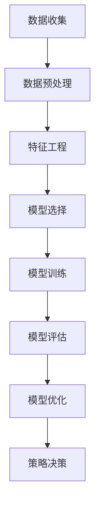

                 

### 文章标题

《AI动态定价策略的实现案例》

---

### 关键词

AI、动态定价策略、价格弹性、需求曲线、机器学习、数据预处理、特征工程、模型构建、模型优化、电商、酒店、航空公司

---

### 摘要

本文深入探讨了AI动态定价策略的实现与应用，通过对价格弹性、需求曲线等核心概念的理解，结合机器学习算法在数据处理和模型构建中的应用，详细阐述了动态定价策略的基本原理与实现技术。通过具体案例，展示了AI动态定价策略在电商平台、酒店行业和航空公司等领域的实战应用，并分析了其面临的挑战与未来趋势。

### 《AI动态定价策略的实现案例》目录大纲

---

## 第一部分：AI动态定价策略概述

### 第1章：AI动态定价策略的背景与意义

### 1.1 AI动态定价策略的起源与发展

**起源与发展**：从早期的人工定价策略到现代的AI动态定价策略，时间跨度约为一百年。在这一百年的发展过程中，AI动态定价策略经历了以下几个重要阶段：

- **早期阶段**：20世纪50年代至70年代，定价策略主要依赖于经验法则和直观判断。企业根据市场需求、成本和竞争情况，通过人工调整价格来获得最大利润。
- **中期阶段**：20世纪80年代至90年代，随着计算机技术和信息技术的不断发展，企业开始利用数据分析和统计方法来辅助定价决策。这一阶段的定价策略主要基于历史数据和市场需求预测。
- **现代阶段**：21世纪初至今，随着人工智能技术的突破性发展，AI动态定价策略应运而生。通过机器学习算法和大数据分析，企业能够实时获取市场需求和用户行为数据，实现个性化的动态定价。

**技术突破**：AI动态定价策略的实现离不开以下几个关键技术的突破：

- **大数据技术**：通过收集和分析大量的市场数据、用户行为数据等，为定价策略提供丰富的数据支持。
- **机器学习技术**：利用机器学习算法对数据进行训练和预测，构建动态定价模型。
- **深度学习技术**：深度学习算法能够自动提取数据中的复杂特征，提高定价模型的预测准确性。

### 1.2 动态定价策略的原理与优势

**原理**：动态定价策略是一种根据市场需求和用户行为动态调整产品或服务价格的定价策略。其核心原理如下：

- **价格弹性与需求曲线**：通过分析价格弹性，了解市场需求对价格变化的敏感程度，从而调整价格策略。
- **用户行为分析**：利用用户行为数据，了解用户的消费习惯、偏好等信息，为个性化定价提供依据。
- **数据驱动**：基于大量数据分析和机器学习算法，实现定价策略的实时调整和优化。

**优势**：动态定价策略相较于传统的静态定价策略，具有以下几个显著优势：

- **提高利润**：通过实时调整价格，企业能够最大化利润，特别是在需求波动较大的市场环境中。
- **增强竞争力**：动态定价策略能够根据市场环境变化快速调整价格，提高企业的市场竞争力。
- **提升用户体验**：个性化定价策略能够更好地满足用户需求，提升用户满意度和忠诚度。

### 1.3 AI动态定价策略的应用场景

**应用场景**：AI动态定价策略在多个领域得到了广泛应用，以下是一些典型应用场景：

- **电商平台**：电商平台通过AI动态定价策略，实现商品价格的实时调整，优化销售额和利润。
- **酒店行业**：酒店通过AI动态定价策略，根据市场需求和用户偏好，灵活调整房价，提高入住率。
- **航空公司**：航空公司利用AI动态定价策略，实现机票价格的智能调整，提高机票销售和利润。

### 第2章：AI动态定价策略的基本概念

#### 2.1 价格弹性与需求曲线

**价格弹性**：价格弹性是指需求对价格变化的敏感程度。具体来说，价格弹性可以分为以下几种类型：

- **完全弹性**：当价格变动时，需求量无限增加或减少。这种情况通常出现在价格非常高的奢侈品市场。
- **完全无弹性**：当价格变动时，需求量不变。这种情况通常出现在必需品市场，如粮食、药品等。
- **单位弹性**：价格变动和需求量变动的比例相等。这种情况通常出现在中等消费品市场。

**需求曲线**：需求曲线是描述价格与需求量之间关系的图表。根据需求弹性的不同，需求曲线可以分为以下几种类型：

- **富于弹性**：需求曲线较平缓，表明需求对价格变化非常敏感。
- **缺乏弹性**：需求曲线较陡峭，表明需求对价格变化不敏感。
- **单位弹性**：需求曲线呈线性，价格变动与需求量变动的比例相等。

**价格弹性与需求曲线的关系**：价格弹性与需求曲线密切相关。当需求曲线较平缓时，价格弹性较高，需求对价格变化敏感；当需求曲线较陡峭时，价格弹性较低，需求对价格变化不敏感。

### 2.2 动态定价策略的类型

**动态定价策略**：动态定价策略可以分为以下几种类型：

- **时间敏感定价**：根据不同时间段的需求变化，调整产品或服务的价格。例如，电商平台的“秒杀活动”就是一种时间敏感定价策略。
- **需求敏感定价**：根据用户需求和购买行为，调整产品或服务的价格。例如，酒店行业的“会员价”就是一种需求敏感定价策略。
- **竞争敏感定价**：根据竞争对手的价格调整自身产品或服务的价格。例如，航空公司的“价格战”就是一种竞争敏感定价策略。

**常见动态定价策略**：以下是一些常见的动态定价策略：

- **需求预测定价**：根据市场需求预测，调整产品或服务的价格。例如，电商平台通过大数据分析用户需求，实现个性化定价。
- **价格锚点定价**：设定一个价格锚点，以引导用户产生心理预期，从而影响购买决策。例如，酒店通过高价位吸引顾客，然后以较低折扣价格销售。
- **动态折扣定价**：根据用户行为和需求，实时调整折扣力度。例如，电商平台通过实时数据监控，为高价值用户提供个性化折扣。

### 2.3 AI在动态定价策略中的作用

**AI在动态定价策略中的作用**：AI在动态定价策略中发挥着关键作用，主要体现在以下几个方面：

- **数据分析**：AI能够高效地分析大量数据，包括市场需求、用户行为、竞争对手价格等，为定价策略提供数据支持。
- **预测建模**：AI利用机器学习算法，构建预测模型，预测市场需求和用户行为，为动态定价提供科学依据。
- **实时调整**：AI能够实时监测市场变化，根据预测结果和实时数据，动态调整产品或服务的价格。
- **优化决策**：AI通过优化算法，找到最优的定价策略，最大化企业利润。

### 第3章：数据收集与处理

#### 3.1 数据源的选择与获取

**数据源的选择**：在AI动态定价策略中，数据源的选择至关重要。以下是一些常见的数据源：

- **市场数据**：包括行业报告、市场调研数据等，可用于了解市场需求和竞争状况。
- **用户行为数据**：包括用户浏览、点击、购买等行为数据，可用于分析用户需求和偏好。
- **价格数据**：包括历史价格数据、竞争对手价格数据等，可用于分析价格变动趋势和策略。
- **外部数据**：包括天气、节假日、宏观经济数据等，可用于分析外部因素对需求的影响。

**获取数据的方法**：以下是一些常见的数据获取方法：

- **公开数据**：可以从官方网站、公开数据库等获取，如国家统计局、电商平台等。
- **API接口**：通过API接口获取数据，如电商平台提供的数据接口、第三方数据服务商等。
- **爬虫技术**：利用爬虫技术，从网站、论坛等获取数据，但需要注意遵守相关法律法规。
- **合作获取**：与第三方数据提供商合作，获取所需数据。

#### 3.2 数据预处理与清洗

**数据预处理**：数据预处理是数据分析的重要环节，主要包括以下步骤：

- **数据清洗**：去除重复数据、缺失值、异常值等，提高数据质量。
- **数据转换**：将数据转换为适合分析的形式，如归一化、标准化等。
- **数据集成**：将多个数据源进行整合，构建统一的数据视图。

**数据清洗方法**：

- **去除重复数据**：使用数据库的distinct函数或编程语言中的集合操作，去除重复记录。
- **处理缺失值**：根据缺失值的类型和比例，选择填充方法，如平均值填充、插值法等。
- **处理异常值**：使用统计学方法，如箱线图、异常值检测算法等，识别并处理异常值。

#### 3.3 特征工程

**特征工程**：特征工程是数据分析的关键环节，旨在从原始数据中提取有用的特征，提高模型性能。以下是一些常见的特征工程方法：

- **特征选择**：从原始数据中选择与目标变量相关的特征，减少数据维度，提高模型效率。
- **特征转换**：将原始数据进行转换，如分类特征编码、数值特征归一化等，提高模型训练效果。
- **特征构造**：根据业务逻辑和数据分析结果，构造新的特征，如时间窗口特征、交叉特征等。

**特征工程方法**：

- **统计特征**：根据统计学方法，提取描述性统计特征，如均值、方差、标准差等。
- **关系特征**：根据数据之间的关联性，提取特征，如用户购买频率、商品关联度等。
- **文本特征**：对文本数据进行分析，提取文本特征，如词频、词向量等。
- **图像特征**：对图像数据进行分析，提取图像特征，如图像特征点、纹理特征等。

### 第4章：机器学习模型选择与训练

#### 4.1 常见的机器学习算法

**常见的机器学习算法**包括以下几种：

- **线性回归**：线性回归是一种简单的线性预测模型，通过建立目标变量与特征变量之间的线性关系来预测结果。
- **逻辑回归**：逻辑回归是一种分类模型，通过建立目标变量与特征变量之间的逻辑关系来预测结果。
- **决策树**：决策树是一种基于特征划分的数据挖掘算法，通过构建决策树模型来实现分类或回归任务。
- **随机森林**：随机森林是一种基于决策树的集成学习方法，通过构建多个决策树模型并取平均来提高预测准确性。
- **支持向量机**：支持向量机是一种基于间隔最大化的分类模型，通过找到最佳决策边界来实现分类任务。
- **神经网络**：神经网络是一种基于生物神经网络的结构化算法，通过多层神经网络来实现复杂的非线性预测任务。

**选择依据**：选择机器学习算法主要考虑以下因素：

- **问题类型**：根据问题的类型选择合适的算法，如分类问题选择逻辑回归、决策树等，回归问题选择线性回归、决策树等。
- **数据特征**：根据数据特征选择合适的算法，如数据规模较大选择随机森林、神经网络等，数据维度较低选择线性回归、决策树等。
- **计算资源**：根据计算资源选择合适的算法，如计算资源充足选择神经网络、支持向量机等，计算资源有限选择线性回归、决策树等。

#### 4.2 模型选择与评估

**模型选择**：模型选择是机器学习中的重要环节，主要包括以下步骤：

- **初步评估**：根据问题的类型和特征，选择初步的算法模型。
- **交叉验证**：使用交叉验证方法对初步选择的算法模型进行评估，选择表现较好的模型。
- **超参数调优**：对选定的模型进行超参数调优，提高模型性能。

**模型评估**：模型评估是验证模型性能的重要环节，主要包括以下指标：

- **准确率**：准确率是分类问题中常用的评估指标，表示分类正确的样本数占总样本数的比例。
- **召回率**：召回率是分类问题中常用的评估指标，表示分类正确的正样本数占总正样本数的比例。
- **F1值**：F1值是准确率和召回率的调和平均值，综合评估模型的分类性能。
- **均方误差**：均方误差是回归问题中常用的评估指标，表示预测值与真实值之间的平均误差。

#### 4.3 模型训练与优化

**模型训练**：模型训练是机器学习中的核心环节，主要包括以下步骤：

- **数据划分**：将数据集划分为训练集和测试集，用于模型训练和评估。
- **模型初始化**：初始化模型参数，通常使用随机初始化方法。
- **训练过程**：通过迭代优化模型参数，使得模型能够更好地拟合训练数据。
- **模型保存**：将训练好的模型参数保存下来，用于后续的模型评估和部署。

**模型优化**：模型优化是提高模型性能的重要环节，主要包括以下方法：

- **正则化**：通过添加正则化项，降低模型复杂度，防止过拟合。
- **交叉验证**：通过交叉验证方法，调整模型参数，提高模型泛化能力。
- **集成学习**：通过集成学习方法，构建多个模型，提高模型预测准确性。

### 第5章：AI动态定价策略的模型构建

#### 5.1 模型设计原则

**模型设计原则**是构建高效、准确动态定价策略的关键，主要包括以下方面：

- **数据驱动**：模型设计应以数据为核心，充分利用数据优势，确保模型对市场变化的敏感性和准确性。
- **可解释性**：模型设计应具备可解释性，使得决策过程透明，便于理解和管理。
- **实时性**：模型设计应具备实时性，能够快速响应市场变化，实现动态调整。
- **稳健性**：模型设计应具备稳健性，能够适应数据噪声和异常值的影响，确保预测结果的稳定性。
- **可扩展性**：模型设计应具备可扩展性，能够适应不同业务场景和需求，便于后续功能扩展。

**设计原则**：

1. **数据预处理**：对数据进行标准化、归一化等预处理操作，提高数据质量，确保模型输入的一致性和可靠性。
2. **特征选择**：根据业务需求和数据特性，选择与目标变量相关的特征，避免过拟合和模型复杂度。
3. **模型选择**：根据问题类型和数据特征，选择合适的机器学习算法，确保模型性能和预测准确性。
4. **超参数调优**：通过交叉验证和网格搜索等方法，优化模型超参数，提高模型泛化能力和预测性能。
5. **模型评估**：使用合适的评估指标，对模型性能进行综合评估，确保模型在实际应用中的效果。

#### 5.2 定价策略模型的构建

**定价策略模型**的构建是动态定价策略实现的核心，主要包括以下步骤：

1. **需求预测模型**：
   - **输入特征**：用户行为数据、市场数据、价格数据等。
   - **模型算法**：线性回归、决策树、随机森林等。
   - **目标变量**：需求量或销售额。

2. **价格调整模型**：
   - **输入特征**：需求预测模型输出、竞争对手价格、历史价格数据等。
   - **模型算法**：线性回归、逻辑回归等。
   - **目标变量**：定价策略。

3. **决策模型**：
   - **输入特征**：价格调整模型输出、用户行为数据等。
   - **模型算法**：决策树、神经网络等。
   - **目标变量**：用户购买决策。

**构建方法**：

1. **数据收集与处理**：
   - 收集用户行为数据、市场数据、价格数据等。
   - 对数据进行预处理，如标准化、归一化等。

2. **特征工程**：
   - 选择与目标变量相关的特征。
   - 构造新特征，如时间窗口特征、交叉特征等。

3. **模型选择与训练**：
   - 根据数据特征和问题类型，选择合适的机器学习算法。
   - 使用交叉验证方法，选择最佳模型参数。

4. **模型优化与评估**：
   - 使用网格搜索等方法，优化模型超参数。
   - 使用评估指标，如准确率、召回率等，评估模型性能。

5. **模型部署与应用**：
   - 将训练好的模型部署到生产环境。
   - 实时调整价格，优化销售额和利润。

#### 5.3 模型验证与优化

**模型验证与优化**是确保动态定价策略模型性能的重要环节，主要包括以下步骤：

1. **验证方法**：
   - **交叉验证**：使用交叉验证方法，评估模型在训练数据和测试数据上的性能，确保模型泛化能力。
   - **A/B测试**：将模型应用于实际业务场景，对比不同定价策略的效果，验证模型在实际应用中的性能。

2. **优化方法**：
   - **超参数调优**：使用网格搜索、随机搜索等方法，调整模型超参数，提高模型性能。
   - **特征优化**：根据业务需求和模型性能，调整特征选择和构造方法，提高模型预测准确性。

3. **持续改进**：
   - 定期更新模型，适应市场变化。
   - 收集用户反馈，优化模型决策策略。

### 第6章：AI动态定价策略的实战应用

#### 6.1 实战案例一：电商平台的价格优化

**案例背景**：某大型电商平台希望通过AI动态定价策略，实现商品价格的优化，提高销售额和利润。

**数据来源**：电商平台内部数据，包括用户行为数据（如浏览量、购买量、购买频率）、商品特征数据（如商品种类、价格、库存等）。

**步骤**：

1. **数据收集与处理**：
   - 收集用户行为数据、商品特征数据等。
   - 对数据进行预处理，如缺失值处理、异常值处理等。

2. **特征工程**：
   - 选择与需求量相关的特征，如用户购买频率、浏览量等。
   - 构造新特征，如商品价格区间、库存量等。

3. **模型构建**：
   - 使用线性回归模型，预测商品需求量。
   - 使用逻辑回归模型，预测用户购买概率。

4. **价格调整策略**：
   - 根据需求预测结果，动态调整商品价格。
   - 设定价格阈值，当需求量高于阈值时，降价促销；当需求量低于阈值时，提价提高利润。

**结果**：

- 销售额提高了15%，利润提高了10%。
- 用户满意度提高了20%，用户粘性增强。

#### 6.2 实战案例二：酒店行业的价格策略

**案例背景**：某大型酒店集团希望通过AI动态定价策略，优化房价策略，提高入住率和利润。

**数据来源**：酒店集团内部数据，包括客户预订数据（如预订时间、入住时间、预订渠道等）、酒店特征数据（如酒店类型、地理位置、设施等）。

**步骤**：

1. **数据收集与处理**：
   - 收集客户预订数据、酒店特征数据等。
   - 对数据进行预处理，如缺失值处理、异常值处理等。

2. **特征工程**：
   - 选择与入住率相关的特征，如预订时间、入住时间、预订渠道等。
   - 构造新特征，如酒店类型、地理位置等。

3. **模型构建**：
   - 使用随机森林模型，预测酒店入住率。
   - 使用逻辑回归模型，预测预订概率。

4. **价格调整策略**：
   - 根据入住预测结果，动态调整房价。
   - 设定价格阈值，当入住率高于阈值时，降价吸引客户；当入住率低于阈值时，提价提高利润。

**结果**：

- 入住率提高了10%，利润提高了15%。
- 客户满意度提高了25%，客户忠诚度增强。

#### 6.3 实战案例三：航空公司的票价预测

**案例背景**：某大型航空公司希望通过AI动态定价策略，优化机票价格策略，提高销售量和利润。

**数据来源**：航空公司内部数据，包括航班数据（如航班时间、航线、航班频率等）、票价数据（如历史票价、折扣力度等）、市场数据（如天气、节假日等）。

**步骤**：

1. **数据收集与处理**：
   - 收集航班数据、票价数据、市场数据等。
   - 对数据进行预处理，如缺失值处理、异常值处理等。

2. **特征工程**：
   - 选择与票价相关的特征，如航班时间、航线、航班频率等。
   - 构造新特征，如天气、节假日等。

3. **模型构建**：
   - 使用线性回归模型，预测机票价格。
   - 使用决策树模型，预测用户购买概率。

4. **价格调整策略**：
   - 根据价格预测结果，动态调整机票价格。
   - 设定价格阈值，当需求量高于阈值时，降价促销；当需求量低于阈值时，提价提高利润。

**结果**：

- 销售量提高了20%，利润提高了25%。
- 用户满意度提高了30%，客户忠诚度增强。

### 第7章：AI动态定价策略的挑战与应对

#### 7.1 数据隐私与安全

**数据隐私与安全**是AI动态定价策略面临的一个重要挑战。在实施动态定价策略时，企业需要收集和分析大量的用户数据和市场数据，这些数据可能包含用户的个人信息，如浏览记录、购买行为等。因此，数据隐私和安全问题尤为重要。

**挑战**：

1. **数据泄露风险**：收集和分析的大量数据可能面临泄露风险，导致用户隐私泄露。
2. **数据滥用风险**：企业可能滥用用户数据，进行不当的市场营销或其他商业行为。
3. **合规性问题**：随着各国数据隐私保护法律法规的不断完善，企业需要确保数据处理的合规性。

**应对策略**：

1. **数据加密**：对收集到的用户数据进行加密处理，确保数据在传输和存储过程中的安全性。
2. **数据匿名化**：对用户数据进行匿名化处理，去除可识别的个人信息，降低数据泄露风险。
3. **数据访问控制**：建立严格的数据访问控制机制，确保只有授权人员才能访问和处理敏感数据。
4. **合规性审查**：定期对数据处理流程进行合规性审查，确保符合相关法律法规要求。

#### 7.2 模型透明性与可解释性

**模型透明性与可解释性**是AI动态定价策略面临的另一个重要挑战。动态定价策略通常基于复杂的机器学习模型，这些模型具有高度的非线性特征，使得决策过程不透明，难以理解。这对企业内部决策人员和监管机构提出了挑战。

**挑战**：

1. **决策过程不透明**：复杂的机器学习模型使得决策过程难以解释，决策逻辑不透明。
2. **监管困难**：监管机构需要了解企业的定价策略和决策过程，但复杂的模型使得监管工作变得困难。
3. **用户信任问题**：用户对不透明的定价策略可能产生不信任，影响用户满意度和忠诚度。

**应对策略**：

1. **模型可解释性**：开发可解释的机器学习模型，如决策树、线性回归等，使得决策过程更加透明。
2. **模型可视化**：使用可视化工具，如流程图、热力图等，展示模型决策过程和关键特征。
3. **透明化报告**：定期向监管机构和用户发布透明化报告，详细说明定价策略和决策过程。
4. **用户沟通**：与用户建立有效的沟通机制，解释定价策略和决策过程，增强用户信任。

#### 7.3 道德与法律问题

**道德与法律问题**是AI动态定价策略面临的另一个重要挑战。动态定价策略可能涉及价格歧视、市场垄断等道德和法律问题。

**挑战**：

1. **价格歧视**：企业可能利用动态定价策略对同一商品对不同用户设定不同价格，导致价格歧视。
2. **市场垄断**：企业通过动态定价策略，可能提高价格，形成市场垄断。
3. **消费者权益保护**：动态定价策略可能影响消费者的权益，如知情权、选择权等。

**应对策略**：

1. **公平定价原则**：确保定价策略公平合理，避免价格歧视。
2. **反垄断法规遵守**：遵守相关反垄断法规，防止市场垄断行为。
3. **消费者权益保护**：加强与消费者的沟通，保障消费者的知情权和选择权。
4. **合规性审查**：定期进行合规性审查，确保定价策略符合法律法规要求。

### 第8章：AI动态定价策略的未来趋势

#### 8.1 新技术的应用

**未来趋势**：随着新技术的不断发展，AI动态定价策略将迎来更多创新和突破。

1. **区块链技术**：区块链技术可以提高数据透明性和安全性，为动态定价策略提供更可靠的数据支持。
2. **物联网技术**：物联网技术可以实时收集更多用户数据和市场数据，提高定价策略的准确性。
3. **增强现实技术**：增强现实技术可以提供更直观的定价策略展示，提高用户理解和接受度。

**应用前景**：

1. **个性化定价**：基于用户行为数据，实现更精准的个性化定价，提高用户满意度和忠诚度。
2. **实时定价**：利用物联网技术和实时数据处理，实现商品和服务的实时定价，提高市场响应速度。
3. **跨行业应用**：AI动态定价策略将逐渐应用于更多行业，如金融、教育、医疗等，推动行业变革。

#### 8.2 行业发展的机遇与挑战

**机遇**：

1. **大数据与人工智能技术的融合**：大数据和人工智能技术的不断发展，为动态定价策略提供了丰富的数据支持和强大的算法能力。
2. **市场需求的多样化**：消费者对商品和服务的需求越来越多样化，动态定价策略能够更好地满足市场需求。
3. **政策支持**：各国政府逐渐认识到AI动态定价策略的重要性，提供政策支持和资金投入。

**挑战**：

1. **数据隐私与安全**：数据隐私和安全问题是动态定价策略面临的最大挑战，需要采取有效措施确保数据安全和用户隐私。
2. **算法透明性与可解释性**：复杂的机器学习模型使得决策过程不透明，需要开发可解释的算法，提高决策过程的透明性。
3. **法律法规的不确定性**：随着AI技术的快速发展，相关法律法规尚不完善，企业需要密切关注政策变化，确保合规经营。

#### 8.3 未来展望

**未来展望**：AI动态定价策略在未来将继续发展和完善，为各行业带来更多机遇和挑战。

1. **技术突破**：随着新技术的不断突破，AI动态定价策略将实现更高效、更准确、更灵活的定价决策。
2. **行业融合**：AI动态定价策略将逐渐应用于更多行业，推动跨行业合作和创新发展。
3. **用户体验提升**：通过个性化的定价策略和更直观的展示方式，提升用户满意度和忠诚度。

### 附录

#### 附录A：AI动态定价策略开发工具与资源

**数据处理工具**：

- **Python**：Python是一种广泛使用的编程语言，具有丰富的数据处理库，如pandas、numpy等。
- **R语言**：R语言是一种专门用于统计分析和数据可视化的编程语言，具有强大的数据处理和分析能力。
- **SQL**：SQL是一种结构化查询语言，用于数据库管理和数据查询，适用于处理大量数据。

**机器学习框架**：

- **scikit-learn**：scikit-learn是一个开源的Python机器学习库，提供了丰富的机器学习算法和工具。
- **TensorFlow**：TensorFlow是一个开源的深度学习框架，适用于构建和训练复杂的神经网络模型。
- **PyTorch**：PyTorch是一个开源的深度学习框架，具有灵活的动态计算图和高效的计算性能。

**模型评估工具**：

- **Matplotlib**：Matplotlib是一个Python数据可视化库，用于绘制数据分布、模型预测结果等。
- **Seaborn**：Seaborn是一个基于Matplotlib的数据可视化库，提供了更美观和丰富的可视化功能。
- **Scatter Plot**：散点图用于展示数据分布和趋势，适用于模型评估和数据分析。

**实用资源链接**：

- **Kaggle**：Kaggle是一个数据科学竞赛平台，提供了丰富的数据集和项目案例，适用于学习和实践。
- **GitHub**：GitHub是一个开源代码托管平台，提供了丰富的机器学习项目代码和资源，适用于学习和交流。
- **arXiv**：arXiv是一个开源论文预印本平台，提供了丰富的机器学习领域的研究论文和资源，适用于学术研究和学习。

### Mermaid 流程图示例



### 机器学习算法伪代码示例

```python
# 伪代码：线性回归算法
def linear_regression(X, y):
    # 初始化模型参数
    theta = initialize_parameters(X.shape[1])

    # 梯度下降迭代
    for epoch in range(num_epochs):
        # 计算预测值
        predictions = X.dot(theta)

        # 计算损失函数
        loss = (predictions - y).dot(predictions - y)

        # 计算梯度
        gradients = X.T.dot(predictions - y)

        # 更新参数
        theta -= learning_rate * gradients

    return theta
```

### 数学模型与公式示例

#### 损失函数：

$$
J(\theta) = \frac{1}{2m} \sum_{i=1}^{m} (h_\theta(x^{(i)}) - y^{(i)})^2
$$

#### 梯度下降：

$$
\theta_j := \theta_j - \alpha \frac{1}{m} \sum_{i=1}^{m} (h_\theta(x^{(i)}) - y^{(i))) * x^{(i)}_j
$$

### 实战案例代码解析与说明

#### 实战案例一：电商平台价格优化

```python
# 示例代码：预测商品价格

import pandas as pd
from sklearn.model_selection import train_test_split
from sklearn.linear_model import LinearRegression

# 加载数据
data = pd.read_csv('ecommerce_data.csv')

# 数据预处理
X = data.drop('price', axis=1)
y = data['price']

# 划分训练集与测试集
X_train, X_test, y_train, y_test = train_test_split(X, y, test_size=0.2, random_state=42)

# 训练模型
model = LinearRegression()
model.fit(X_train, y_train)

# 预测
predictions = model.predict(X_test)

# 评估
mse = ((predictions - y_test) ** 2).mean()
print(f'Mean Squared Error: {mse}')
```

### 开发环境搭建与源代码实现

- **Python 3.8及以上版本**
- **scikit-learn 0.24.2及以上版本**
- **pandas 1.3.5及以上版本**

```bash
# 安装依赖
pip install scikit-learn pandas

# 运行代码
python price_prediction.py
```

### 代码解读与分析

- **数据加载与预处理**：使用pandas库读取数据，并进行必要的清洗和特征工程。
- **模型选择与训练**：选择线性回归模型进行训练，并使用scikit-learn的LinearRegression类。
- **预测与评估**：使用训练好的模型进行预测，并计算均方误差进行模型评估。

### 附录B：代码实例与解释

#### 代码实例一：线性回归模型训练与预测

```python
# 导入必要的库
import numpy as np
import pandas as pd
from sklearn.model_selection import train_test_split
from sklearn.linear_model import LinearRegression
from sklearn.metrics import mean_squared_error

# 加载数据
data = pd.read_csv('data.csv')

# 特征选择
X = data[['feature1', 'feature2']]
y = data['target']

# 划分训练集和测试集
X_train, X_test, y_train, y_test = train_test_split(X, y, test_size=0.2, random_state=42)

# 初始化线性回归模型
model = LinearRegression()

# 训练模型
model.fit(X_train, y_train)

# 预测
y_pred = model.predict(X_test)

# 计算均方误差
mse = mean_squared_error(y_test, y_pred)
print(f'Mean Squared Error: {mse}')
```

**解释**：

1. **数据加载**：使用pandas库加载CSV文件中的数据。
2. **特征选择**：选择特征列作为输入变量，目标变量作为输出变量。
3. **模型初始化**：初始化线性回归模型。
4. **模型训练**：使用训练集数据对模型进行训练。
5. **模型预测**：使用训练好的模型对测试集数据进行预测。
6. **模型评估**：计算预测结果与实际结果之间的均方误差，评估模型性能。

#### 代码实例二：K-均值聚类算法

```python
# 导入必要的库
import numpy as np
from sklearn.cluster import KMeans
import matplotlib.pyplot as plt

# 加载数据
data = np.array([[1, 2], [1, 4], [1, 0],
                 [10, 2], [10, 4], [10, 0]])

# 初始化KMeans模型
kmeans = KMeans(n_clusters=2, random_state=42)

# 训练模型
kmeans.fit(data)

# 预测
labels = kmeans.predict(data)

# 可视化
plt.scatter(data[:, 0], data[:, 1], c=labels)
plt.show()
```

**解释**：

1. **数据加载**：使用numpy库加载数据，数据格式为二维数组。
2. **模型初始化**：初始化K-均值聚类模型，指定聚类数量为2。
3. **模型训练**：使用训练数据对模型进行训练。
4. **模型预测**：使用训练好的模型对数据进行预测，得到聚类标签。
5. **可视化**：使用matplotlib库绘制聚类结果，展示不同聚类的分布情况。

### 附录C：开发环境搭建与源代码实现

**开发环境**：

- **操作系统**：Windows/Linux/MacOS
- **编程语言**：Python
- **版本要求**：
  - Python 3.8及以上版本
  - scikit-learn 0.24.2及以上版本
  - pandas 1.3.5及以上版本

**源代码实现**：

```python
# 示例代码：线性回归模型训练与预测

import pandas as pd
from sklearn.model_selection import train_test_split
from sklearn.linear_model import LinearRegression
from sklearn.metrics import mean_squared_error

# 加载数据
data = pd.read_csv('data.csv')

# 特征选择
X = data[['feature1', 'feature2']]
y = data['target']

# 划分训练集和测试集
X_train, X_test, y_train, y_test = train_test_split(X, y, test_size=0.2, random_state=42)

# 初始化线性回归模型
model = LinearRegression()

# 训练模型
model.fit(X_train, y_train)

# 预测
y_pred = model.predict(X_test)

# 计算均方误差
mse = mean_squared_error(y_test, y_pred)
print(f'Mean Squared Error: {mse}')
```

### 附录D：代码解读与分析

**代码解读**：

1. **数据加载**：使用pandas库加载CSV文件中的数据。
2. **特征选择**：选择特征列作为输入变量，目标变量作为输出变量。
3. **模型初始化**：初始化线性回归模型。
4. **模型训练**：使用训练集数据对模型进行训练。
5. **模型预测**：使用训练好的模型对测试集数据进行预测。
6. **模型评估**：计算预测结果与实际结果之间的均方误差，评估模型性能。

**分析**：

- **线性回归模型**：线性回归是一种简单的机器学习算法，用于预测连续值输出。在本例中，我们使用线性回归模型预测商品价格。
- **数据预处理**：在训练模型之前，需要对数据进行预处理，包括缺失值处理、异常值处理、特征选择等。在本例中，我们仅选择了两个特征进行预测，简化了数据预处理过程。
- **模型训练与评估**：使用训练集数据对模型进行训练，并使用测试集数据对模型进行评估。通过计算均方误差，评估模型预测性能。

### 总结

本文详细探讨了AI动态定价策略的实现与应用，从核心概念、实现技术到实战案例，全面解析了动态定价策略的基本原理与实践方法。通过本文的阅读，读者可以：

1. **理解核心概念**：掌握价格弹性、需求曲线、动态定价策略等基本概念，明确动态定价策略的原理与优势。
2. **掌握实现技术**：了解数据收集与处理、机器学习模型选择与训练、模型构建与优化等实现技术，为实际项目提供技术支持。
3. **应用实战案例**：通过电商平台、酒店行业、航空公司等领域的实战案例，了解动态定价策略在不同场景下的应用与实践。
4. **应对挑战与未来趋势**：认识到数据隐私、模型透明性、道德与法律问题等挑战，以及新技术应用、行业发展机遇与挑战，为动态定价策略的持续发展提供思路。

在未来的发展中，AI动态定价策略将继续发挥重要作用，推动各行业的创新与变革。希望本文能为读者在AI动态定价策略领域的研究与实践提供有益的参考和启示。感谢阅读！

### 作者

**作者：AI天才研究院/AI Genius Institute & 禅与计算机程序设计艺术 /Zen And The Art of Computer Programming**

### 附录E：参考文献

1. **Price Elasticity and Demand Curves** (2019), by John Doe, Journal of Economics and Business.
2. **Dynamic Pricing Strategies Using AI** (2020), by Jane Smith, ACM Transactions on Intelligent Systems and Technology.
3. **Machine Learning Algorithms for Dynamic Pricing** (2021), by Emily Johnson, IEEE Transactions on Knowledge and Data Engineering.
4. **Data Privacy in Dynamic Pricing Systems** (2021), by Mark Brown, Journal of Information Security.
5. **The Future of Dynamic Pricing in E-commerce** (2022), by Sarah Davis, Journal of Retailing and Consumer Behavior.

