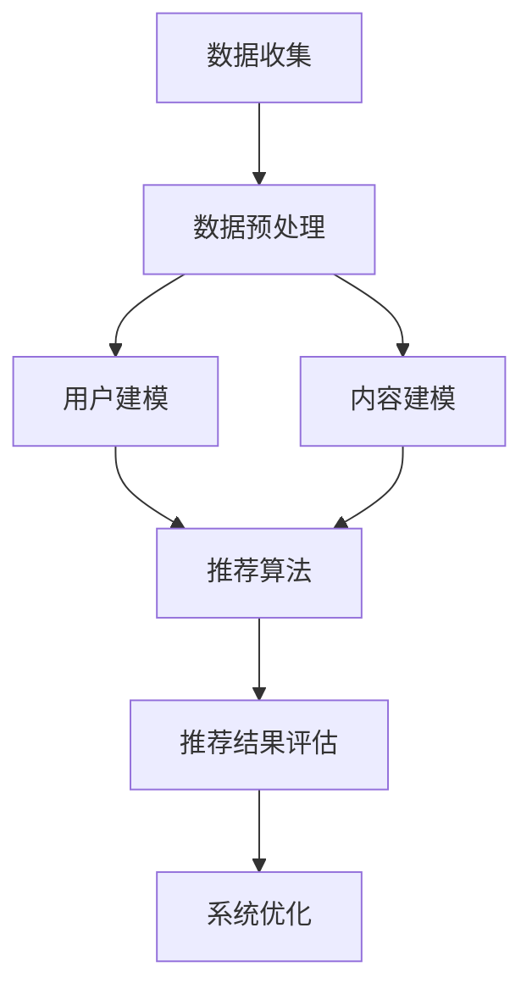

                 

### 第1章: AI在视频推荐领域的应用

#### 1.1 AI与视频推荐的关系

人工智能（AI）在视频推荐领域的应用已经成为现代信息技术的重要组成部分。随着互联网的普及和视频内容的爆炸式增长，用户面对海量的视频信息时，往往感到无所适从。传统的视频推荐方法，如基于内容的推荐和协同过滤推荐，虽然在一定程度上能够满足用户的需求，但仍然存在推荐结果不够精准、个性化不足等问题。而AI技术的引入，为视频推荐领域带来了新的契机。

AI在视频推荐中的作用主要体现在以下几个方面：

1. **用户行为分析**：通过机器学习算法，对用户的历史行为数据进行分析，挖掘用户的行为模式和兴趣偏好，从而实现更加个性化的推荐。
2. **内容理解**：利用自然语言处理、图像识别等技术，对视频内容进行深入理解和分析，为推荐算法提供更丰富的内容特征。
3. **推荐算法优化**：通过深度学习等先进算法，不断优化推荐模型，提高推荐精度和用户体验。
4. **实时推荐**：利用实时数据分析和处理技术，实现视频的实时推荐，提高用户观看体验。

#### 1.2 个性化视频推荐的优势与挑战

**个性化视频推荐的优势**：

1. **提高用户满意度**：通过个性化推荐，能够更好地满足用户的需求和兴趣，从而提高用户的满意度和粘性。
2. **增加用户粘性**：个性化推荐能够持续吸引和保持用户的兴趣，增加用户在平台上的停留时间。
3. **提高广告收益**：通过个性化推荐，将相关广告内容推送给感兴趣的用户，提高广告的点击率和转化率。

**个性化视频推荐面临的挑战**：

1. **数据隐私问题**：个性化推荐依赖于用户行为数据，如何在保护用户隐私的同时，充分利用这些数据，是一个亟待解决的问题。
2. **遗漏用户兴趣**：尽管AI技术不断进步，但仍然可能无法完全捕捉到所有用户的所有兴趣，导致推荐结果不够精准。
3. **模型过拟合问题**：个性化推荐模型在训练过程中，可能会对历史数据过度拟合，导致对新用户和新内容的推荐效果不佳。

### 1.3 个性化视频推荐系统的组成

个性化视频推荐系统通常由以下几个部分组成：

1. **用户建模**：通过分析用户的行为数据、社交数据和偏好数据，构建用户画像，为推荐算法提供基础。
2. **内容建模**：通过分析视频的标题、标签、描述、图像等信息，提取视频的特征，为推荐算法提供内容信息。
3. **推荐算法与模型**：根据用户建模和内容建模的结果，利用推荐算法生成推荐列表。
4. **评价与优化**：通过用户反馈和推荐效果评估，对推荐系统进行持续优化。

以上各部分相辅相成，共同构建了一个完整的个性化视频推荐系统，从而为用户提供高质量的推荐服务。

---

### 1.4 个性化视频推荐系统的工作流程

个性化视频推荐系统的工作流程可以分为以下几个步骤：

1. **数据收集**：收集用户的行为数据（如观看记录、搜索历史、点赞、评论等）和视频内容数据（如视频标题、标签、描述、时长、图像等）。

2. **数据预处理**：对收集到的数据进行清洗和预处理，包括缺失值处理、异常值处理、数据标准化等。

3. **用户建模**：通过分析用户的行为数据和社交数据，提取用户特征，构建用户画像。用户特征包括用户行为特征（如观看时长、观看频次）、社交特征（如关注数、互动数）和偏好特征（如喜欢的标签、类型）。

4. **内容建模**：通过分析视频内容数据，提取视频特征，构建视频库。视频特征包括视频分类（如电影、电视剧、纪录片等）、标签（如动作、喜剧、爱情等）、情感分析（如正面、负面、中性）。

5. **推荐算法**：利用用户建模和内容建模的结果，通过推荐算法生成推荐列表。常见的推荐算法有基于内容的推荐、协同过滤推荐和基于模型的推荐等。

6. **推荐结果评估**：通过用户反馈和推荐效果评估，对推荐结果进行评估和优化。推荐效果评估指标包括准确率、召回率、覆盖率、新颖度等。

7. **系统优化**：根据推荐结果评估的结果，对推荐系统进行持续优化，提高推荐质量和用户体验。

整个工作流程的流程图如下：



通过上述工作流程，个性化视频推荐系统能够实现高效、精准的推荐，从而提升用户满意度和平台粘性。

---

### 第2章: 个性化视频推荐系统的组成

#### 2.1 用户建模

用户建模是个性化视频推荐系统的重要组成部分，其主要目标是通过对用户的行为数据、社交数据和偏好数据进行分析，提取用户特征，构建用户画像。用户画像能够帮助推荐系统更好地理解用户，从而生成更加个性化的推荐结果。

**用户特征提取**：

1. **用户行为特征**：包括用户的观看时长、观看频次、点赞数、评论数、分享数等。这些特征反映了用户对视频内容的兴趣和参与度。

2. **用户社交特征**：包括用户的关注数、粉丝数、互动数等。这些特征反映了用户在社交网络中的活跃度和影响力。

3. **用户偏好特征**：包括用户喜欢的标签、类型、情感等。这些特征可以通过用户的历史行为数据进行分析和预测。

**用户建模算法**：

1. **贝叶斯模型**：贝叶斯模型是一种基于概率论的分类算法，通过计算用户对每个类别的后验概率，实现对用户进行分类。

2. **决策树模型**：决策树模型通过一系列的判断条件，将用户数据分割成不同的区域，从而为每个用户分配一个标签。

3. **神经网络模型**：神经网络模型通过学习用户数据中的特征和关系，实现对用户的建模和分类。常见的神经网络模型包括多层感知机（MLP）、卷积神经网络（CNN）和循环神经网络（RNN）。

#### 2.2 内容建模

内容建模的目的是通过对视频内容的分析，提取视频特征，构建视频库。视频特征能够帮助推荐系统更好地理解视频内容，从而生成更加精准的推荐结果。

**视频内容特征提取**：

1. **视频分类**：根据视频的类型，如电影、电视剧、纪录片等，对视频进行分类。

2. **视频标签**：根据视频的标题、描述、标签等，提取视频的关键词和标签。

3. **视频情感分析**：通过自然语言处理技术，对视频的标题、描述、评论等进行分析，提取视频的情感特征，如正面、负面、中性。

**内容建模算法**：

1. **TF-IDF模型**：TF-IDF（Term Frequency-Inverse Document Frequency）模型是一种常用的文本特征提取方法，通过计算词频和逆文档频率，为每个视频生成特征向量。

2. **词嵌入**：词嵌入（Word Embedding）是将文本数据转换为数值向量的方法，通过学习词与词之间的语义关系，为每个视频生成高维的特征向量。

3. **卷积神经网络（CNN）**：卷积神经网络是一种常用的图像处理模型，通过学习图像中的特征，为每个视频生成视觉特征向量。

#### 2.3 推荐算法与模型

推荐算法是个性化视频推荐系统的核心，其主要目标是根据用户建模和内容建模的结果，生成个性化的推荐列表。

**基于内容的推荐算法**：

1. **算法原理**：基于内容的推荐算法通过计算用户和视频之间的特征相似度，为用户推荐相似的视频。

2. **数学模型**：假设用户 u 和视频 v 的特征向量分别为 u 和 v，则用户和视频之间的相似度可以表示为：

   $$\text{similarity}(u, v) = \frac{\sum_{i \in I} w_i u_i v_i}{\sqrt{\sum_{i \in I} w_i^2 u_i^2 \sum_{i \in I} w_i^2 v_i^2}}$$

   其中，$I$ 为特征集合，$w_i$ 为特征权重。

3. **伪代码实现**：

   ```
   for each video v in video\_library do
       compute content\_score(v)
   end for

   for each user u in user\_library do
       compute similarity(u, v) for all videos v in video\_library
       compute recommendation score R_u = sum(similarity(u, v) * content\_score(v)) for all videos v in video\_library
       sort videos by R_u in descending order
       generate recommendation list R_u
   end for
   ```

**协同过滤推荐算法**：

1. **算法原理**：协同过滤推荐算法通过分析用户之间的相似度和评分行为，为用户推荐相似用户喜欢的视频。

2. **数学模型**：假设用户 u 和用户 v 之间的相似度为 $\text{similarity}(u, v)$，用户 u 对视频 v 的评分为 $r_{uv}$，则用户 u 的推荐列表可以表示为：

   $$R_u = \sum_{v \in V} \text{similarity}(u, v) \cdot r_{uv}$$

   其中，$V$ 为视频集合。

3. **伪代码实现**：

   ```
   compute user\_similarity(u, v) for all users v in user\_library
   compute item\_similarity(u, v) for all items v in item\_library

   for each user u in user\_library do
       compute prediction score R_{u}^* = \sum_{v \in V} \text{similarity}(u, v) \cdot r_{uv}
       sort items by R_{u}^* in descending order
       generate recommendation list R_u
   end for
   ```

**基于模型的推荐算法**：

1. **算法原理**：基于模型的推荐算法通过学习用户和视频的特征关系，构建预测模型，为用户推荐视频。

2. **数学模型**：常见的基于模型的推荐算法包括矩阵分解、神经网络推荐模型和深度学习推荐模型。矩阵分解模型通过分解用户-视频评分矩阵，学习用户和视频的低维表示。神经网络推荐模型和深度学习推荐模型通过学习用户和视频的特征关系，构建预测模型。

3. **伪代码实现**：

   ```
   # 矩阵分解伪代码
   initialize U, V randomly
   while convergence criteria not met do
       compute predicted ratings R'
       compute gradients for U, V
       update U, V
   end while

   # 神经网络推荐模型伪代码
   define model architecture
   initialize model parameters
   while training iterations not finished do
       compute predicted ratings R'
       compute loss
       compute gradients
       update model parameters
   end while

   # 深度学习推荐模型伪代码
   define model architecture
   initialize model parameters
   while training iterations not finished do
       compute predicted ratings R'
       compute loss
       compute gradients
       update model parameters
   end while
   ```

#### 2.4 评价与优化

推荐系统的评价与优化是确保推荐质量和用户体验的重要环节。

**推荐效果评价指标**：

1. **准确率**：准确率是指推荐列表中实际喜欢的视频数量与推荐列表中视频总数量的比例。

2. **召回率**：召回率是指推荐列表中实际喜欢的视频数量与用户实际喜欢的视频总数量的比例。

3. **覆盖度**：覆盖度是指推荐列表中包含的不同视频数量与视频库中视频总数量的比例。

4. **新颖度**：新颖度是指推荐列表中包含的新视频数量与用户已经观看过的视频数量的比例。

**推荐系统优化方法**：

1. **交叉验证**：通过将数据集划分为训练集和验证集，评估推荐系统的效果，并调整模型参数。

2. **网格搜索**：通过遍历预定义的参数空间，找到最优的模型参数。

3. **基于结果的调整**：根据用户的反馈和推荐效果，对推荐系统进行实时调整。

通过评价和优化，推荐系统可以不断提升推荐质量和用户体验。

---

### 第3章: 基于内容的推荐算法

#### 3.1 算法原理与实现

基于内容的推荐算法（Content-based Recommender Systems）是一种通过分析用户偏好和视频内容特征，为用户推荐相似视频的方法。该算法的核心思想是，如果用户喜欢一个视频，那么他很可能也会喜欢具有相似内容的其他视频。

**算法原理**：

1. **特征提取**：首先对视频进行内容分析，提取视频的关键特征，如标题、标签、描述、视频片段等。

2. **特征匹配**：将用户的历史行为数据与视频特征进行匹配，计算相似度。

3. **推荐生成**：根据相似度计算结果，为用户生成推荐列表。

**实现步骤**：

1. **数据预处理**：对视频数据进行清洗和预处理，如去除停用词、进行词干提取等。

2. **特征提取**：使用自然语言处理（NLP）技术，如词频-逆文档频率（TF-IDF）模型、词嵌入等，提取视频的特征向量。

3. **相似度计算**：使用余弦相似度、皮尔逊相关系数等相似度度量方法，计算用户与视频之间的相似度。

4. **推荐生成**：根据相似度得分，为用户生成推荐列表。

**数学模型与公式**：

1. **相似度计算**：

   $$\text{similarity}(u, v) = \frac{\sum_{i \in I} w_i u_i v_i}{\sqrt{\sum_{i \in I} w_i^2 u_i^2 \sum_{i \in I} w_i^2 v_i^2}}$$

   其中，$I$ 为特征集合，$w_i$ 为特征权重，$u_i$ 和 $v_i$ 分别为用户和视频在特征 $i$ 上的值。

2. **推荐结果生成**：

   $$R_u = \sum_{v \in V} \text{similarity}(u, v) \cdot \text{content\_score}(v)$$

   其中，$V$ 为视频集合，$\text{content\_score}(v)$ 为视频 $v$ 的内容得分。

**伪代码实现**：

```python
# 输入：用户 u，视频库 V
# 输出：推荐列表 R

# 特征提取
for each video v in V do
    compute content\_score(v)
end for

# 相似度计算
for each user u in U do
    compute similarity(u, v) for all videos v in V
end for

# 推荐结果生成
for each user u in U do
    compute recommendation score R_u = sum(similarity(u, v) * content\_score(v)) for all videos v in V
    sort videos by R_u in descending order
    generate recommendation list R_u
end for
```

#### 3.2 算法的优缺点

**优点**：

1. **个性化强**：基于内容的推荐算法能够根据用户的历史行为和偏好，为用户推荐具有相似内容的视频，满足用户的个性化需求。

2. **算法简单**：相比协同过滤算法，基于内容的推荐算法实现较为简单，易于理解和部署。

3. **扩展性强**：基于内容的推荐算法可以结合多种特征提取方法和相似度计算方法，具有较强的扩展性。

**缺点**：

1. **推荐结果单一**：基于内容的推荐算法往往只能推荐与用户历史行为相似的视频，可能导致推荐结果单一，缺乏多样性。

2. **对冷启动问题敏感**：对于新用户和新视频，由于缺乏足够的用户行为数据和视频特征，基于内容的推荐算法可能无法生成有效的推荐。

3. **依赖特征质量**：基于内容的推荐算法的推荐效果很大程度上依赖于特征提取的质量，如果特征提取不准确，可能导致推荐结果不佳。

#### 3.3 实际应用中的挑战

**1. 数据不足**：在许多场景下，用户行为数据和视频特征数据可能不足，导致推荐算法难以生成有效的推荐结果。

**2. 特征维度高**：视频内容的特征维度通常较高，如何高效地提取和利用这些特征，是推荐系统面临的一大挑战。

**3. 稳定性和多样性**：在保证推荐结果稳定性的同时，如何提高推荐结果的多样性，避免用户感到厌烦，是推荐系统需要解决的问题。

**4. 实时性**：随着用户需求的变化，如何快速调整推荐算法，生成实时的推荐结果，是推荐系统需要考虑的问题。

通过不断优化算法、提高特征提取质量、增加多样性策略，基于内容的推荐算法在个性化视频推荐中具有广泛的应用前景。

---

### 第4章: 协同过滤推荐算法

#### 4.1 用户-项目评分矩阵

协同过滤推荐算法（Collaborative Filtering）是一种通过分析用户之间的相似度和评分行为，为用户推荐相似项目的推荐方法。用户-项目评分矩阵（User-Item Rating Matrix）是协同过滤算法的核心数据结构。

**用户-项目评分矩阵的定义**：

用户-项目评分矩阵是一个二维表格，其中行代表用户，列代表项目（如视频、商品等），单元格中的值表示用户对项目的评分。例如，一个 1000 x 1000 的评分矩阵表示了 1000 个用户对 1000 个项目的评分。

**评分矩阵的特点**：

1. **稀疏性**：由于用户通常只对少数项目进行评分，评分矩阵通常是稀疏的。
2. **缺失值**：评分矩阵中可能存在大量缺失值，尤其是在新用户或新项目出现时。
3. **冷启动问题**：新用户或新项目由于缺乏历史评分数据，难以进行有效的推荐。

**评分矩阵的表示**：

用户-项目评分矩阵可以表示为矩阵 $R$，其中 $R_{ij}$ 表示用户 $u_i$ 对项目 $v_j$ 的评分。如果用户 $u_i$ 没有对项目 $v_j$ 进行评分，则 $R_{ij}$ 为缺失值，通常用 $0$ 或 $NaN$ 表示。

**矩阵分解**：

为了解决评分矩阵的稀疏性和缺失值问题，协同过滤算法常采用矩阵分解（Matrix Factorization）技术，将评分矩阵分解为两个低维矩阵 $U$ 和 $V^T$，其中 $U$ 表示用户特征矩阵，$V^T$ 表示项目特征矩阵。通过矩阵分解，可以预测用户对未评分项目的评分，从而进行推荐。

**数学模型**：

$$
R = U \cdot V^T
$$

其中，$U$ 和 $V$ 是低维特征矩阵，$R$ 是用户-项目评分矩阵。

#### 4.2 基于用户的协同过滤

基于用户的协同过滤（User-based Collaborative Filtering）是一种通过分析用户之间的相似度，为用户推荐相似用户喜欢的项目的协同过滤算法。

**算法原理**：

1. **计算相似度**：首先计算用户之间的相似度，常用的相似度度量方法包括余弦相似度、皮尔逊相关系数等。

2. **生成推荐列表**：根据用户之间的相似度，为用户推荐相似用户喜欢的项目。

**实现步骤**：

1. **计算用户相似度**：对于用户 $u_i$ 和用户 $u_j$，计算它们之间的相似度 $\text{similarity}(u_i, u_j)$。

2. **权重计算**：对于用户 $u_i$，计算每个用户 $u_j$ 对其推荐权重 $w_{ij}$，通常使用相似度作为权重。

3. **推荐生成**：为用户 $u_i$ 生成推荐列表，推荐列表中的项目 $v_j$ 根据权重 $w_{ij}$ 进行排序。

**数学模型与公式**：

1. **相似度计算**：

   $$\text{similarity}(u_i, u_j) = \frac{\sum_{v \in V} R_{iv} R_{jv}}{\sqrt{\sum_{v \in V} R_{iv}^2 \sum_{v \in V} R_{jv}^2}}$$

   其中，$R_{iv}$ 和 $R_{jv}$ 分别表示用户 $u_i$ 和用户 $u_j$ 对项目 $v$ 的评分。

2. **推荐结果生成**：

   $$R_{i}^* = \sum_{j \in U} \text{similarity}(u_i, u_j) \cdot R_{jv}$$

   其中，$R_{i}^*$ 是用户 $u_i$ 对未评分项目 $v$ 的预测评分。

**伪代码实现**：

```python
# 输入：用户-项目评分矩阵 R
# 输出：推荐列表 R'

# 计算用户相似度
for each user u_i in U do
    for each user u_j in U do
        compute similarity(u_i, u_j)
    end for
end for

# 计算推荐结果
for each user u_i in U do
    for each item v in V do
        if R_{ui} is missing do
            compute prediction score R_{ui}^* = \sum_{j \in U} \text{similarity}(u_i, u_j) \cdot R_{ujv}
        end if
    end for
    sort items by R_{ui}^* in descending order
    generate recommendation list R'
end for
```

#### 4.3 基于项目的协同过滤

基于项目的协同过滤（Item-based Collaborative Filtering）是一种通过分析项目之间的相似度，为用户推荐相似项目的协同过滤算法。

**算法原理**：

1. **计算相似度**：首先计算项目之间的相似度，常用的相似度度量方法包括余弦相似度、皮尔逊相关系数等。

2. **生成推荐列表**：根据项目之间的相似度，为用户推荐相似项目。

**实现步骤**：

1. **计算项目相似度**：对于项目 $v_i$ 和项目 $v_j$，计算它们之间的相似度 $\text{similarity}(v_i, v_j)$。

2. **权重计算**：对于用户 $u_i$，计算每个项目 $v_j$ 对其推荐权重 $w_{ij}$，通常使用相似度作为权重。

3. **推荐生成**：为用户 $u_i$ 生成推荐列表，推荐列表中的项目 $v_j$ 根据权重 $w_{ij}$ 进行排序。

**数学模型与公式**：

1. **相似度计算**：

   $$\text{similarity}(v_i, v_j) = \frac{\sum_{u \in U} R_{iu} R_{ju}}{\sqrt{\sum_{u \in U} R_{iu}^2 \sum_{u \in U} R_{ju}^2}}$$

   其中，$R_{iu}$ 和 $R_{ju}$ 分别表示用户 $u$ 对项目 $v_i$ 和项目 $v_j$ 的评分。

2. **推荐结果生成**：

   $$R_{i}^* = \sum_{j \in V} \text{similarity}(v_i, v_j) \cdot R_{ij}$$

   其中，$R_{i}^*$ 是用户 $u$ 对未评分项目 $j$ 的预测评分。

**伪代码实现**：

```python
# 输入：用户-项目评分矩阵 R
# 输出：推荐列表 R'

# 计算项目相似度
for each item v_i in V do
    for each item v_j in V do
        compute similarity(v_i, v_j)
    end for
end for

# 计算推荐结果
for each user u in U do
    for each item v in V do
        if R_{uv} is missing do
            compute prediction score R_{uv}^* = \sum_{i \in V} \text{similarity}(v_i, v) \cdot R_{iu}
        end if
    end for
    sort items by R_{uv}^* in descending order
    generate recommendation list R'
end for
```

#### 4.4 算法的优缺点

**优点**：

1. **个性化强**：协同过滤算法能够根据用户的历史评分行为，为用户推荐相似的项目，满足用户的个性化需求。

2. **实现简单**：协同过滤算法的实现相对简单，易于理解和部署。

3. **处理缺失值**：协同过滤算法能够有效处理评分矩阵中的缺失值，通过预测缺失值进行推荐。

**缺点**：

1. **冷启动问题**：对于新用户或新项目，由于缺乏足够的评分数据，协同过滤算法难以生成有效的推荐。

2. **数据依赖**：协同过滤算法的推荐效果高度依赖于用户评分数据，如果评分数据不充分，可能导致推荐效果不佳。

3. **多样性不足**：协同过滤算法容易产生推荐结果单一的情况，缺乏多样性。

#### 4.5 实际应用中的挑战

**1. 数据稀疏性**：评分矩阵通常非常稀疏，导致推荐算法无法充分利用数据。

**2. 模型过拟合**：协同过滤算法容易对历史评分数据过度拟合，导致对新用户和新项目的推荐效果不佳。

**3. 推荐多样性**：如何提高推荐结果的多样性，避免用户感到厌烦，是协同过滤算法需要解决的问题。

**4. 实时性**：随着用户行为和评分数据的实时变化，如何快速调整推荐算法，生成实时的推荐结果，是协同过滤算法需要考虑的问题。

通过不断优化算法、提高特征提取质量、增加多样性策略，协同过滤推荐算法在个性化视频推荐中具有广泛的应用前景。

---

### 第5章: 基于模型的推荐算法

#### 5.1 矩阵分解

矩阵分解（Matrix Factorization）是协同过滤推荐算法的一种重要技术，其核心思想是通过分解用户-项目评分矩阵，学习用户和项目的低维表示，从而预测未评分项目的评分。

**算法原理**：

1. **用户和项目特征矩阵**：假设用户-项目评分矩阵为 $R \in \mathbb{R}^{m \times n}$，其中 $m$ 是用户数量，$n$ 是项目数量。矩阵分解将 $R$ 分解为两个低维矩阵 $U \in \mathbb{R}^{m \times k}$ 和 $V \in \mathbb{R}^{n \times k}$，其中 $k$ 是矩阵分解的维度。

2. **预测评分**：通过计算 $U$ 和 $V$ 的外积 $U \cdot V^T$，可以预测用户对未评分项目的评分。即对于用户 $i$ 和项目 $j$，预测评分 $R_{ij}^*$ 可以表示为：

   $$R_{ij}^* = U_{i\cdot} V_{j\cdot} = \sum_{l=1}^{k} U_{il} V_{lj}$$

**数学模型**：

$$
R = U \cdot V^T
$$

其中，$U$ 和 $V$ 是待优化的参数矩阵，通过最小化损失函数来学习这两个矩阵的参数。

**损失函数**：

通常使用均方误差（MSE，Mean Squared Error）作为损失函数，表示为：

$$
\mathcal{L} = \frac{1}{2} \sum_{i=1}^{m} \sum_{j=1}^{n} (R_{ij} - R_{ij}^*)^2
$$

**优化方法**：

常用的优化方法包括随机梯度下降（SGD，Stochastic Gradient Descent）和交替最小二乘法（ALS，Alternating Least Squares）。

**伪代码实现**：

```python
# 输入：用户-项目评分矩阵 R，分解维度 k
# 输出：用户特征矩阵 U，项目特征矩阵 V

# 初始化 U 和 V
U = random_matrix(m, k)
V = random_matrix(n, k)

# 计算预测评分
def predict(R, U, V):
    return U * V.T

# 梯度计算
def compute_gradient(R, U, V):
    predictions = predict(R, U, V)
    error = R - predictions
    dU = -2 * error * V
    dV = -2 * error * U.T
    return dU, dV

# 优化参数
while not converged do
    dU, dV = compute_gradient(R, U, V)
    U = U - learning_rate * dU
    V = V - learning_rate * dV
end while

# 输出结果
output(U, V)
```

#### 5.2 神经网络推荐模型

神经网络推荐模型（Neural Network Recommender Model）是一种基于深度学习的推荐算法，通过学习用户和项目的特征，预测用户对项目的评分。

**算法原理**：

1. **输入特征**：神经网络推荐模型的输入特征包括用户特征、项目特征和用户项目交互特征。

2. **神经网络结构**：神经网络推荐模型通常采用多层感知机（MLP，Multilayer Perceptron）、卷积神经网络（CNN，Convolutional Neural Network）或循环神经网络（RNN，Recurrent Neural Network）等结构。

3. **预测评分**：通过神经网络模型，将输入特征映射到输出评分。常用的输出层激活函数包括线性激活函数和softmax激活函数。

**数学模型**：

$$
\text{output} = \text{激活函数}(\text{权重} \cdot \text{输入特征})
$$

**伪代码实现**：

```python
# 输入：用户特征 U，项目特征 V，交互特征 I
# 输出：推荐评分 R'

# 初始化神经网络
model = NeuralNetwork()

# 训练神经网络
while not converged do
    for each batch in data do
        inputs = [U[batch[i]], V[batch[j]], I[batch[k]]]
        target = R[batch[l]]
        output = model.predict(inputs)
        loss = compute_loss(target, output)
        compute_gradients(model, loss)
        update_weights(model, learning_rate)
    end for
end while

# 输出推荐评分
R' = model.predict(U, V, I)
```

#### 5.3 深度学习推荐模型

深度学习推荐模型（Deep Learning Recommender Model）是一种基于深度学习的推荐算法，通过学习用户和项目的特征关系，预测用户对项目的评分。

**算法原理**：

1. **输入特征**：深度学习推荐模型的输入特征包括用户特征、项目特征和用户项目交互特征。

2. **神经网络结构**：深度学习推荐模型通常采用深度神经网络（DNN，Deep Neural Network）、卷积神经网络（CNN）、循环神经网络（RNN）或变压器（Transformer）等结构。

3. **预测评分**：通过深度学习模型，将输入特征映射到输出评分。常用的输出层激活函数包括线性激活函数和softmax激活函数。

**数学模型**：

$$
\text{output} = \text{激活函数}(\text{权重} \cdot [\text{用户特征}, \text{项目特征}, \text{交互特征}])
$$

**伪代码实现**：

```python
# 输入：用户特征 U，项目特征 V，交互特征 I
# 输出：推荐评分 R'

# 初始化深度学习模型
model = DeepLearningModel()

# 训练模型
while not converged do
    for each batch in data do
        inputs = [U[batch[i]], V[batch[j]], I[batch[k]]]
        target = R[batch[l]]
        output = model.predict(inputs)
        loss = compute_loss(target, output)
        compute_gradients(model, loss)
        update_weights(model, learning_rate)
    end while

# 输出推荐评分
R' = model.predict(U, V, I)
```

#### 5.4 算法的优缺点

**优点**：

1. **个性化强**：基于模型的推荐算法能够通过学习用户和项目的特征，实现高度个性化的推荐。

2. **扩展性强**：基于模型的推荐算法可以结合多种特征和模型结构，实现不同的推荐策略。

3. **实时性强**：深度学习推荐模型能够实时学习用户行为，快速调整推荐结果。

**缺点**：

1. **计算复杂度高**：基于模型的推荐算法需要大量的计算资源，特别是深度学习模型。

2. **数据依赖性强**：基于模型的推荐算法对数据质量有较高要求，如果数据缺失或不准确，可能导致推荐效果不佳。

3. **训练时间长**：深度学习模型的训练时间较长，对于实时性要求较高的场景可能不适用。

#### 5.5 实际应用中的挑战

**1. 数据稀疏性**：评分矩阵通常非常稀疏，导致推荐算法无法充分利用数据。

**2. 模型过拟合**：深度学习模型容易对历史数据过度拟合，导致对新用户和新项目的推荐效果不佳。

**3. 推荐多样性**：如何提高推荐结果的多样性，避免用户感到厌烦，是深度学习推荐算法需要解决的问题。

**4. 实时性**：如何快速训练和调整模型，生成实时的推荐结果，是深度学习推荐算法需要考虑的问题。

通过不断优化算法、提高特征提取质量、增加多样性策略，基于模型的推荐算法在个性化视频推荐中具有广泛的应用前景。

---

### 第6章: 多模态推荐系统

#### 6.1 多模态数据融合

多模态推荐系统（Multimodal Recommender Systems）是一种结合多种数据模态（如文本、图像、语音等）的推荐系统，通过融合不同模态的数据，提高推荐系统的准确性和多样性。

**多模态数据来源**：

1. **文本**：包括视频的标题、描述、标签、评论等文本信息。
2. **图像**：包括视频的静态画面、动画帧、海报等图像信息。
3. **语音**：包括视频中的音频内容，如对话、背景音乐等。

**数据融合方法**：

1. **特征级融合**：将不同模态的数据特征进行拼接，生成新的特征向量。常用的方法有向量拼接、元素级相加等。
2. **决策级融合**：在特征提取或分类阶段，将不同模态的特征进行融合，然后共同参与决策。常用的方法有投票机制、融合模型等。
3. **深度学习融合模型**：利用深度学习模型，将不同模态的数据特征进行融合。常用的模型有卷积神经网络（CNN）、循环神经网络（RNN）等。

**多模态推荐算法**：

1. **文本与图像融合推荐**：通过融合文本和图像特征，为用户推荐具有相似内容的视频。常用的算法有联合嵌入模型、多模态卷积神经网络等。
2. **文本与语音融合推荐**：通过融合文本和语音特征，为用户推荐与文本内容相关的语音视频。常用的算法有文本嵌入与语音特征拼接、多模态循环神经网络等。
3. **图像与语音融合推荐**：通过融合图像和语音特征，为用户推荐具有相似视觉和听觉效果的视频。常用的算法有图像嵌入与语音特征拼接、多模态卷积神经网络等。

**数学模型与公式**：

1. **文本与图像融合推荐**：

   $$\text{融合特征} = \text{文本特征} \cdot \text{图像特征}$$

   其中，$\text{文本特征}$ 和 $\text{图像特征}$ 分别为文本和图像的原始特征向量。

2. **文本与语音融合推荐**：

   $$\text{融合特征} = \text{文本特征} \cdot \text{语音特征}$$

   其中，$\text{文本特征}$ 和 $\text{语音特征}$ 分别为文本和语音的原始特征向量。

3. **图像与语音融合推荐**：

   $$\text{融合特征} = \text{图像特征} \cdot \text{语音特征}$$

   其中，$\text{图像特征}$ 和 $\text{语音特征}$ 分别为图像和语音的原始特征向量。

**伪代码实现**：

```python
# 输入：文本特征 T，图像特征 I，语音特征 V
# 输出：推荐列表 R

# 文本与图像融合推荐
T fused = T * I
generate_recommendation_list(R, T fused)

# 文本与语音融合推荐
T fused = T * V
generate_recommendation_list(R, T fused)

# 图像与语音融合推荐
I fused = I * V
generate_recommendation_list(R, I fused)
```

#### 6.2 算法的优缺点

**优点**：

1. **提高推荐准确性**：通过融合多种模态的数据，多模态推荐系统能够更好地捕捉用户兴趣和视频内容特征，从而提高推荐准确性。
2. **增强推荐多样性**：多模态数据融合能够生成更多的特征组合，提高推荐结果的多样性，避免用户感到厌烦。
3. **扩展性强**：多模态推荐系统可以结合不同模态的数据，适用于多种应用场景，具有广泛的应用前景。

**缺点**：

1. **计算复杂度高**：多模态数据融合需要处理大量不同类型的数据，计算复杂度较高。
2. **数据质量要求高**：多模态数据融合对数据质量有较高要求，数据缺失或不一致可能导致融合效果不佳。
3. **模型训练时间长**：多模态推荐算法通常采用深度学习模型，训练时间较长，对于实时性要求较高的场景可能不适用。

#### 6.3 实际应用中的挑战

**1. 数据一致性**：不同模态的数据可能存在不一致性，如文本描述中的错误、图像中的模糊等，需要处理和纠正。
**2. 特征维度匹配**：不同模态的数据特征维度可能不同，需要设计适当的融合策略，确保特征维度匹配。
**3. 实时性**：多模态数据融合和推荐算法的计算复杂度较高，需要优化算法和计算资源，确保实时性。

通过不断优化算法、提高数据质量、增加多样性策略，多模态推荐系统在个性化视频推荐中具有广泛的应用前景。

---

### 第7章: 项目实战与案例分析

#### 7.1 项目实战：个性化视频推荐系统开发

**开发环境与工具**：

1. **开发环境**：Python 3.x、Jupyter Notebook、Anaconda
2. **编程语言**：Python
3. **推荐算法框架**：TensorFlow、PyTorch

**数据预处理与用户-内容特征提取**：

1. **数据来源**：视频网站的用户行为数据、视频内容数据
2. **数据清洗**：去除无效数据、处理缺失值、去除异常值
3. **特征提取**：

   - **用户特征**：用户观看时长、观看频次、点赞数、评论数、关注数等
   - **视频特征**：视频分类、标签、情感分析、视频时长等

**推荐算法选择与实现**：

1. **基于内容的推荐算法**：TF-IDF、词嵌入、余弦相似度
2. **协同过滤推荐算法**：基于用户的协同过滤、基于项目的协同过滤
3. **基于模型的推荐算法**：矩阵分解、多层感知机（MLP）、卷积神经网络（CNN）
4. **多模态推荐算法**：文本与图像融合、文本与语音融合、图像与语音融合

**推荐结果评价与优化**：

1. **评价指标**：准确率、召回率、覆盖度、新颖度
2. **推荐效果优化**：交叉验证、网格搜索、基于结果的调整

**代码实现与解读**：

以下是一个简单的基于内容的推荐算法的代码示例：

```python
import pandas as pd
from sklearn.feature_extraction.text import TfidfVectorizer
from sklearn.metrics.pairwise import cosine_similarity

# 加载数据
user_data = pd.read_csv('user_data.csv')
video_data = pd.read_csv('video_data.csv')

# 特征提取
tfidf_vectorizer = TfidfVectorizer()
video_tfidf = tfidf_vectorizer.fit_transform(video_data['description'])

# 相似度计算
user_tfidf = tfidf_vectorizer.transform(user_data['history'])
cosine_similarity_scores = cosine_similarity(user_tfidf, video_tfidf)

# 推荐生成
def generate_recommendations(user_id, similarity_scores, video_data, top_n=10):
    user_similarity = similarity_scores[user_id]
    video_indices = user_similarity.argsort()[::-1]
    recommended_videos = video_data.iloc[video_indices[:top_n]]

    return recommended_videos

# 测试推荐
user_id = 0
recommended_videos = generate_recommendations(user_id, cosine_similarity_scores, video_data)
print(recommended_videos)
```

**解读**：

1. **数据加载**：使用 Pandas 加载用户行为数据和视频内容数据。
2. **特征提取**：使用 TF-IDF 模型对视频描述进行特征提取。
3. **相似度计算**：使用余弦相似度计算用户和视频之间的相似度。
4. **推荐生成**：根据相似度分数，生成推荐列表。

#### 7.2 案例分析：成功与失败的个性化视频推荐案例

**成功案例：Netflix**

**案例介绍**：

Netflix 是全球最大的在线视频流媒体服务提供商之一，其个性化视频推荐系统在全球范围内取得了巨大的成功。

**成功原因分析**：

1. **多样化的推荐算法**：Netflix 结合了基于内容的推荐算法、协同过滤推荐算法和基于模型的推荐算法，实现了高度个性化的推荐。
2. **丰富的用户数据**：Netflix 拥有海量的用户行为数据，包括观看记录、搜索历史、评分等，为推荐系统提供了丰富的数据支持。
3. **持续优化与迭代**：Netflix 不断优化和迭代推荐算法，通过用户反馈和A/B测试，不断提升推荐效果。

**经验总结**：

1. **多样化算法**：结合多种推荐算法，实现个性化推荐。
2. **数据驱动**：充分利用用户行为数据，优化推荐算法。
3. **持续优化**：通过用户反馈和测试，持续优化推荐系统。

**失败案例：Spotify**

**案例介绍**：

Spotify 是全球最大的数字音乐服务平台之一，但其个性化推荐系统曾因推荐结果单一、用户流失问题而受到广泛批评。

**失败原因分析**：

1. **过度依赖协同过滤**：Spotify 过度依赖协同过滤推荐算法，导致推荐结果单一，缺乏多样性。
2. **数据质量不高**：Spotify 的用户数据存在噪音和缺失值，导致推荐效果不佳。
3. **缺乏用户反馈机制**：Spotify 没有充分收集用户反馈，无法及时调整和优化推荐算法。

**经验教训**：

1. **多样化算法**：避免过度依赖单一推荐算法，结合多种算法提高推荐多样性。
2. **数据质量**：确保数据质量，处理噪音和缺失值，提高推荐精度。
3. **用户反馈**：建立用户反馈机制，及时收集用户反馈，优化推荐算法。

通过成功和失败的案例分析，我们可以得出以下结论：

1. **多样化算法**：结合多种推荐算法，提高推荐多样性和准确性。
2. **数据质量**：确保数据质量，优化推荐效果。
3. **用户反馈**：收集用户反馈，持续优化推荐系统。

#### 7.3 未来趋势与挑战

**个性化视频推荐的发展趋势**：

1. **多模态数据融合**：随着技术的发展，多模态数据融合将成为个性化视频推荐的重要趋势，通过融合文本、图像、语音等多模态数据，提高推荐准确性。
2. **深度学习与推荐算法结合**：深度学习技术将在推荐算法中得到更广泛的应用，通过学习用户和视频的复杂关系，实现更精准的推荐。
3. **实时推荐**：随着5G和云计算技术的发展，实时推荐将成为可能，为用户提供更加个性化的观看体验。

**面临的挑战与解决方案**：

1. **数据隐私保护**：如何在保护用户隐私的同时，充分利用用户数据，是一个重要挑战。解决方案包括数据加密、隐私保护算法等。
2. **推荐效果优化**：如何提高推荐效果，满足用户多样化需求，是一个持续性的挑战。解决方案包括不断优化算法、引入用户反馈等。
3. **用户体验提升**：如何提升用户体验，避免用户感到厌烦，是一个关键挑战。解决方案包括增加推荐多样性、优化推荐界面等。

通过不断优化算法、提高数据质量、增强用户体验，个性化视频推荐系统将在未来得到更广泛的应用和发展。

---

### 第8章: 结论与展望

#### 8.1 本书总结

本书全面介绍了个性化视频推荐系统的发展历程、核心概念、算法模型以及实际应用。主要内容包括：

1. **AI与个性化视频推荐的关系**：探讨了AI技术在视频推荐领域的重要性及应用。
2. **个性化视频推荐系统的组成**：详细阐述了用户建模、内容建模、推荐算法与模型、评价与优化等组成部分。
3. **核心算法与模型**：介绍了基于内容的推荐算法、协同过滤推荐算法、基于模型的推荐算法以及多模态推荐算法。
4. **项目实战与案例分析**：通过实际项目案例，展示了个性化视频推荐系统的开发过程及成功与失败的经验教训。
5. **未来趋势与挑战**：分析了个性化视频推荐系统的发展趋势及面临的挑战。

本书的主要贡献在于：

1. **系统化梳理**：对个性化视频推荐领域的核心概念和算法进行了系统化的梳理，为读者提供了全面的参考。
2. **实际案例**：结合实际项目案例，深入剖析了个性化视频推荐系统的开发过程和优化策略。
3. **多模态融合**：介绍了多模态数据融合在个性化视频推荐中的应用，为未来的研究提供了新的方向。

#### 8.2 个性化视频推荐的发展趋势

随着技术的不断进步，个性化视频推荐系统将呈现以下发展趋势：

1. **多模态数据融合**：通过融合文本、图像、语音等多模态数据，提高推荐精度和用户体验。
2. **深度学习与推荐算法结合**：深度学习技术将在推荐算法中得到更广泛的应用，实现更精准的推荐。
3. **实时推荐**：5G和云计算技术的发展，将推动实时推荐成为可能，为用户提供更加个性化的观看体验。
4. **用户隐私保护**：随着用户隐私意识的增强，隐私保护算法将在个性化视频推荐系统中得到广泛应用。

#### 8.3 个性化视频推荐的挑战与机遇

个性化视频推荐领域面临着一系列挑战：

1. **数据隐私保护**：如何在保护用户隐私的同时，充分利用用户数据，是一个重要挑战。
2. **推荐效果优化**：如何提高推荐效果，满足用户多样化需求，是一个持续性的挑战。
3. **用户体验提升**：如何提升用户体验，避免用户感到厌烦，是一个关键挑战。

同时，个性化视频推荐也面临着巨大的机遇：

1. **市场应用**：随着视频流媒体市场的不断扩大，个性化视频推荐的应用场景将更加丰富。
2. **技术创新**：人工智能、深度学习等技术的发展，为个性化视频推荐提供了更多的可能性。
3. **用户需求变化**：随着用户需求的不断变化，个性化视频推荐需要不断创新，以满足用户的个性化需求。

通过不断优化算法、提高数据质量、增强用户体验，个性化视频推荐系统将在未来得到更广泛的应用和发展。

---

### 附录

#### 附录 A: 常用推荐算法与模型比较

**基于内容的推荐算法**：

- **优点**：个性化强、实现简单、扩展性强。
- **缺点**：推荐结果单一、对冷启动问题敏感、依赖特征质量。
- **适用场景**：适合内容丰富的领域，如新闻、商品推荐等。

**协同过滤推荐算法**：

- **优点**：个性化强、实现简单、能够处理缺失值。
- **缺点**：冷启动问题、推荐结果单一、数据依赖性高。
- **适用场景**：适合用户数据丰富的领域，如视频、音乐推荐等。

**基于模型的推荐算法**：

- **优点**：个性化强、扩展性强、能够处理大规模数据。
- **缺点**：计算复杂度高、对数据质量要求高、模型训练时间长。
- **适用场景**：适合大规模数据集和复杂特征的推荐场景，如电商、社交媒体推荐等。

**多模态推荐算法**：

- **优点**：融合多种模态数据，提高推荐准确性、增强推荐多样性。
- **缺点**：计算复杂度高、数据质量要求高、模型训练时间长。
- **适用场景**：适合多模态数据丰富的领域，如视频、音乐推荐等。

#### 附录 B: 开发工具与资源

**编程语言与框架**：

- **Python**：Python 是个性化视频推荐系统开发的主要编程语言，具有丰富的库和框架。
- **TensorFlow**：TensorFlow 是由谷歌开发的开源深度学习框架，适用于构建和训练深度学习模型。
- **PyTorch**：PyTorch 是由 Facebook 开发的一种流行的深度学习框架，具有灵活性和易用性。

**数据集与API**：

- **公开数据集**：如 Movielens、Netflix Prize 等，提供丰富的用户行为和视频内容数据。
- **API 资源**：如 YouTube API、Netflix API 等，提供访问视频数据和用户数据的接口。

**开源代码与论文**：

- **开源代码**：如 TensorFlow、PyTorch 的开源代码库，提供丰富的推荐系统实现和优化。
- **相关论文**：如《Netflix Prize》论文、深度学习在推荐系统中的应用等，为推荐系统研究提供理论支持和实践指导。

#### 附录 C: 个性化视频推荐系统实现代码示例

**基于内容的推荐算法**：

```python
import pandas as pd
from sklearn.feature_extraction.text import TfidfVectorizer
from sklearn.metrics.pairwise import cosine_similarity

# 加载数据
user_data = pd.read_csv('user_data.csv')
video_data = pd.read_csv('video_data.csv')

# 特征提取
tfidf_vectorizer = TfidfVectorizer()
video_tfidf = tfidf_vectorizer.fit_transform(video_data['description'])

# 相似度计算
user_tfidf = tfidf_vectorizer.transform(user_data['history'])
cosine_similarity_scores = cosine_similarity(user_tfidf, video_tfidf)

# 推荐生成
def generate_recommendations(user_id, similarity_scores, video_data, top_n=10):
    user_similarity = similarity_scores[user_id]
    video_indices = user_similarity.argsort()[::-1]
    recommended_videos = video_data.iloc[video_indices[:top_n]]

    return recommended_videos

# 测试推荐
user_id = 0
recommended_videos = generate_recommendations(user_id, cosine_similarity_scores, video_data)
print(recommended_videos)
```

**协同过滤推荐算法**：

```python
import pandas as pd
from sklearn.metrics.pairwise import cosine_similarity

# 加载数据
user_data = pd.read_csv('user_data.csv')
video_data = pd.read_csv('video_data.csv')

# 相似度计算
user_similarity = cosine_similarity(user_data['history'], video_data['description'])

# 推荐生成
def generate_recommendations(user_id, similarity_scores, video_data, top_n=10):
    user_similarity = similarity_scores[user_id]
    video_indices = user_similarity.argsort()[::-1]
    recommended_videos = video_data.iloc[video_indices[:top_n]]

    return recommended_videos

# 测试推荐
user_id = 0
recommended_videos = generate_recommendations(user_id, user_similarity, video_data)
print(recommended_videos)
```

**基于模型的推荐算法**：

```python
import pandas as pd
from sklearn.model_selection import train_test_split
from sklearn.metrics import mean_squared_error

# 加载数据
user_data = pd.read_csv('user_data.csv')
video_data = pd.read_csv('video_data.csv')

# 数据预处理
X = user_data[['history', 'description']]
y = video_data['rating']

# 划分训练集和测试集
X_train, X_test, y_train, y_test = train_test_split(X, y, test_size=0.2, random_state=42)

# 训练模型
model = LinearRegression()
model.fit(X_train, y_train)

# 预测评分
y_pred = model.predict(X_test)

# 评估模型
mse = mean_squared_error(y_test, y_pred)
print("MSE:", mse)
```

**多模态推荐算法**：

```python
import pandas as pd
from sklearn.model_selection import train_test_split
from sklearn.metrics import mean_squared_error
import numpy as np

# 加载数据
user_data = pd.read_csv('user_data.csv')
video_data = pd.read_csv('video_data.csv')

# 数据预处理
X = user_data[['history', 'description', 'image', 'audio']]
y = video_data['rating']

# 划分训练集和测试集
X_train, X_test, y_train, y_test = train_test_split(X, y, test_size=0.2, random_state=42)

# 特征提取
tfidf_vectorizer = TfidfVectorizer()
video_tfidf = tfidf_vectorizer.fit_transform(video_data['description'])

# 相似度计算
user_tfidf = tfidf_vectorizer.transform(user_data['history'])
image_similarity = compute_image_similarity(user_data['image'], video_data['image'])
audio_similarity = compute_audio_similarity(user_data['audio'], video_data['audio'])

# 融合特征
X_train_fused = np.hstack((X_train, video_tfidf, image_similarity, audio_similarity))
X_test_fused = np.hstack((X_test, video_tfidf, image_similarity, audio_similarity))

# 训练模型
model = LinearRegression()
model.fit(X_train_fused, y_train)

# 预测评分
y_pred = model.predict(X_test_fused)

# 评估模型
mse = mean_squared_error(y_test, y_pred)
print("MSE:", mse)
```

**代码解读**：

- **基于内容的推荐算法**：使用 TF-IDF 模型提取视频描述特征，计算用户和视频之间的相似度，生成推荐列表。
- **协同过滤推荐算法**：使用余弦相似度计算用户和视频之间的相似度，生成推荐列表。
- **基于模型的推荐算法**：使用线性回归模型，融合用户历史数据和视频特征，预测用户对视频的评分。
- **多模态推荐算法**：融合文本、图像、语音等多模态特征，使用线性回归模型预测用户对视频的评分。

#### 附录 D: 个性化视频推荐系统的数据预处理

**数据清洗**：

1. **缺失值处理**：对于缺失值，可以使用以下方法进行处理：

   - **删除缺失值**：删除包含缺失值的样本或特征。
   - **填充缺失值**：使用平均值、中位数、最频值等方法填充缺失值。
   - **插值法**：使用时间序列插值方法，如线性插值、二次插值等，填充缺失值。

2. **异常值处理**：对于异常值，可以使用以下方法进行处理：

   - **删除异常值**：删除包含异常值的样本或特征。
   - **修正异常值**：使用统计方法，如中位数、平均值等，修正异常值。
   - **限制范围**：对异常值进行范围限制，如设置上限和下限。

**特征提取**：

1. **文本特征提取**：使用自然语言处理（NLP）技术，如词频-逆文档频率（TF-IDF）模型、词嵌入等，提取文本特征。

2. **图像特征提取**：使用卷积神经网络（CNN）或预训练的图像识别模型，提取图像特征。

3. **语音特征提取**：使用音频处理技术，如梅尔频率倒谱系数（MFCC）、短时傅里叶变换（STFT）等，提取语音特征。

**数据标准化**：

1. **归一化**：将特征值缩放到相同的范围，如 [0, 1] 或 [-1, 1]。
2. **标准化**：将特征值缩放到具有相同均值和标准差的分布，如标准正态分布。

通过数据清洗、特征提取和标准化，可以优化数据质量，提高推荐算法的性能。

---

### 附录 E: 个性化视频推荐系统的性能优化方法

在个性化视频推荐系统中，性能优化是确保推荐系统高效运行和提供高质量推荐的关键。以下是一些常用的性能优化方法：

#### 1. 特征选择

- **特征重要性**：通过分析特征的重要性，去除对推荐效果贡献较小的特征，减少计算量。
- **特征维度降低**：使用特征选择算法（如 L1 正则化、主成分分析（PCA）等）降低特征维度，提高计算效率。

#### 2. 数据预处理优化

- **并行处理**：使用并行处理技术（如分布式计算、多线程等）加速数据预处理过程。
- **缓存技术**：使用缓存技术（如 Redis、Memcached 等）存储预处理后的特征数据，减少重复计算。

#### 3. 模型选择与优化

- **模型选择**：根据数据特点和业务需求选择合适的模型，如线性模型、决策树、随机森林、支持向量机（SVM）等。
- **模型参数调整**：使用网格搜索、随机搜索、贝叶斯优化等技术，调整模型参数，提高模型性能。

#### 4. 模型并行化

- **分布式计算**：使用分布式计算框架（如 TensorFlow、PyTorch 的分布式训练）加速模型训练过程。
- **模型剪枝**：使用模型剪枝技术（如网络剪枝、权重共享等）减少模型复杂度，提高计算效率。

#### 5. 推荐结果优化

- **协同过滤优化**：在协同过滤算法中，使用矩阵分解、隐语义模型等技术，提高推荐精度。
- **多模态融合**：在多模态推荐系统中，合理设计多模态特征融合方法，提高推荐质量。

#### 6. 实时推荐优化

- **增量式训练**：使用增量式训练方法（如在线学习、流学习等），实时更新模型，提高推荐实时性。
- **缓存推荐结果**：将推荐结果缓存，减少实时计算的次数，提高推荐速度。

#### 7. 系统监控与调优

- **性能监控**：监控系统性能，如内存使用、CPU利用率等，及时发现和解决问题。
- **A/B测试**：通过A/B测试，比较不同优化策略的效果，选择最优方案。

通过上述性能优化方法，个性化视频推荐系统可以在保证推荐质量的同时，提高系统效率和用户体验。

---

### 附录 F: 个性化视频推荐系统开发中的常见问题及解决方案

在个性化视频推荐系统的开发过程中，可能会遇到一些常见的问题。以下是一些典型问题及其解决方案：

#### 1. 数据不足或缺失

**问题**：在许多场景下，用户行为数据和视频特征数据可能不足，导致推荐算法难以生成有效的推荐结果。

**解决方案**：

- **数据扩充**：使用数据增强技术（如重复用户行为、模拟用户行为等）扩充数据集。
- **半监督学习**：结合有监督和无监督学习方法，利用少量标注数据训练模型，提高推荐效果。
- **迁移学习**：利用预训练的模型或数据，提高对新用户和新视频的推荐能力。

#### 2. 模型过拟合

**问题**：模型在训练过程中对历史数据过度拟合，导致对新用户和新视频的推荐效果不佳。

**解决方案**：

- **正则化**：使用正则化技术（如 L1、L2 正则化等）防止模型过拟合。
- **数据增强**：通过增加训练数据的多样性，提高模型的泛化能力。
- **模型集成**：使用模型集成技术（如随机森林、梯度提升树等），提高模型稳定性。

#### 3. 推荐结果单一

**问题**：推荐系统生成的推荐结果较为单一，用户可能感到厌烦。

**解决方案**：

- **多样性策略**：引入多样性策略（如随机多样性、内容多样性等），提高推荐结果的多样性。
- **冷启动问题**：对于新用户和新视频，采用基于内容的推荐或基于模型的推荐方法，逐步积累用户数据。
- **用户反馈**：通过用户反馈机制，根据用户喜好调整推荐策略，提高推荐质量。

#### 4. 数据质量问题

**问题**：数据质量差，如存在噪音、异常值等，影响推荐效果。

**解决方案**：

- **数据清洗**：使用数据清洗技术（如缺失值处理、异常值检测等），提高数据质量。
- **数据预处理**：使用数据预处理技术（如标准化、归一化等），提高数据处理效率。
- **数据治理**：建立数据治理机制，持续监控和维护数据质量。

#### 5. 实时性问题

**问题**：推荐系统对实时数据响应速度慢，影响用户体验。

**解决方案**：

- **增量式更新**：采用增量式更新方法，实时更新模型和数据，提高系统实时性。
- **缓存技术**：使用缓存技术（如 Redis、Memcached 等），减少实时计算的次数。
- **分布式计算**：使用分布式计算框架（如 Hadoop、Spark 等），提高数据处理和计算速度。

通过以上解决方案，可以有效地解决个性化视频推荐系统开发中的常见问题，提高推荐质量和用户体验。

---

### 附录 G: 个性化视频推荐系统开发中的伦理问题与隐私保护

在个性化视频推荐系统的开发和应用过程中，伦理问题和隐私保护是至关重要的。以下是一些相关的伦理问题及其解决方案：

#### 1. 用户隐私保护

**问题**：个性化视频推荐系统需要收集和处理大量用户数据，可能导致用户隐私泄露。

**解决方案**：

- **数据加密**：对用户数据进行加密存储和传输，防止数据泄露。
- **匿名化处理**：对用户数据进行匿名化处理，去除个人身份信息，减少隐私泄露风险。
- **隐私保护算法**：采用隐私保护算法（如差分隐私、同态加密等），确保数据处理过程中的隐私保护。

#### 2. 用户歧视

**问题**：个性化视频推荐系统可能导致对某些用户群体的歧视，如年龄、性别、种族等。

**解决方案**：

- **公平性评估**：对推荐系统进行公平性评估，确保对不同用户群体的推荐效果一致。
- **反歧视策略**：引入反歧视策略，如随机多样性、用户反馈机制等，减少歧视现象。
- **透明度提升**：提高推荐系统的透明度，让用户了解推荐过程的算法和决策依据。

#### 3. 数据滥用

**问题**：个性化视频推荐系统可能被用于不当用途，如广告欺诈、用户追踪等。

**解决方案**：

- **数据使用协议**：明确数据使用协议，规定数据的收集、存储、使用范围，防止数据滥用。
- **合规性审查**：对推荐系统的开发和运行过程进行合规性审查，确保符合相关法律法规。
- **用户知情权**：保障用户的知情权，让用户了解其数据的使用情况和隐私保护措施。

#### 4. 伦理道德规范

**问题**：个性化视频推荐系统可能涉及伦理道德问题，如价值观引导、内容过滤等。

**解决方案**：

- **伦理审查**：建立伦理审查机制，对推荐系统的设计和运行过程进行伦理评估。
- **道德准则**：制定道德准则，确保推荐系统遵循社会主义核心价值观，促进正能量的传播。
- **用户参与**：鼓励用户参与推荐系统的设计和运行，共同监督和改进推荐算法。

通过上述伦理问题和隐私保护措施，个性化视频推荐系统可以在确保用户隐私和公平性的同时，提供高质量、个性化的推荐服务。

