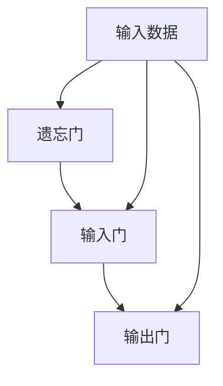
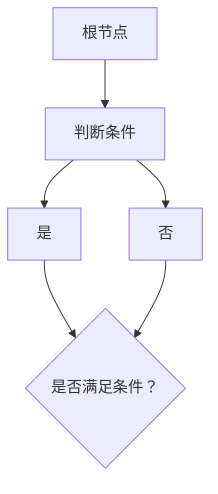
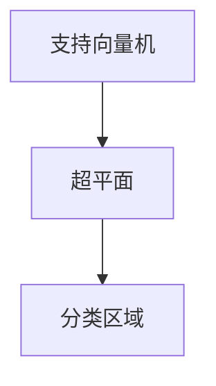

                 

### 《AI在水资源管理中的应用：预测与分配》

> **关键词：**水资源管理、AI预测、水资源分配、机器学习、深度学习、可持续发展

> **摘要：**随着全球水资源危机的加剧，人工智能（AI）在水资源管理中的应用显得尤为重要。本文将探讨AI在水资源预测和分配中的关键角色，介绍相关的核心概念、算法、应用案例，并探讨未来水资源管理的AI应用前景。通过深入分析和详细案例解析，本文旨在为水资源管理的决策者提供有价值的参考。

----------------------------------------------------------------

### 第一部分: AI在水资源管理中的应用基础

**水资源管理**是指对水资源进行合理规划、开发利用、保护和管理的活动。在全球水资源日益紧缺的背景下，科学的水资源管理变得尤为重要。而人工智能（AI）技术的兴起为水资源管理带来了新的契机。

#### 第1章: 水资源管理概述与AI应用背景

##### 1.1 水资源管理的重要性

水资源是人类社会生存和发展的基础。然而，全球水资源的分布极不均衡，许多地区面临严重的缺水问题。此外，人类活动带来的水污染问题也加剧了水资源的紧张状况。因此，科学的水资源管理对于保障社会经济的可持续发展具有重要意义。

##### 1.2 水资源管理面临的挑战

水资源管理面临着诸多挑战，包括：

- **水资源分布不均**：全球水资源分布极不均衡，一些地区水资源丰富，而另一些地区则面临严重的水资源短缺。
- **气候变化**：气候变化导致降水模式的变化，进一步加剧了水资源的不确定性。
- **水污染**：工业、农业和生活污染导致水体质量下降，影响了水资源的可用性。
- **人口增长**：全球人口持续增长，对水资源的需求不断增加，加剧了水资源的供需矛盾。

##### 1.3 AI在水资源管理中的潜在应用

人工智能技术在水资源管理中具有广泛的应用潜力，包括：

- **水资源预测**：利用AI技术对降水、蒸发、地下水位等数据进行预测，为水资源管理提供科学依据。
- **水资源分配**：通过AI算法优化水资源分配，实现水资源的合理利用和高效配置。
- **水污染监测与治理**：利用AI技术对水质进行实时监测，快速识别和治理污染源。
- **水资源规划**：基于AI技术进行水资源规划，为水资源开发、利用和保护提供科学支持。

#### 第2章: AI核心概念与水资源管理联系

##### 2.1 机器学习与深度学习基础

**机器学习**是指通过算法和统计方法，从数据中自动学习规律和模式的技术。**深度学习**是机器学习的一个子领域，它使用神经网络进行多层抽象和特征提取。

在水资源管理中，机器学习和深度学习技术可以用于以下方面：

- **数据挖掘与预测**：从大量水资源数据中挖掘规律，进行水资源预测和趋势分析。
- **模式识别**：识别水资源利用中的异常模式和潜在问题。
- **优化决策**：利用优化算法进行水资源分配和调度。

##### 2.2 数据分析与挖掘技术

**数据分析**是指通过统计和数学方法对数据进行处理、分析和解释的过程。**数据挖掘**是数据分析的一个子领域，它从大量数据中发现隐藏的模式和知识。

在水资源管理中，数据分析和挖掘技术可以用于：

- **水资源评估**：分析水资源现状，评估水资源质量和可持续性。
- **趋势预测**：预测水资源供需趋势，为水资源管理提供依据。
- **风险管理**：识别水资源管理中的风险因素，制定相应的风险管理策略。

##### 2.3 AI与水资源管理中的关联

AI技术在水资源的预测、分配、监测和管理中具有广泛的应用。通过AI技术，可以实现：

- **实时监测**：实时监测水资源变化，快速响应水资源需求。
- **优化调度**：优化水资源分配和调度，提高水资源利用效率。
- **决策支持**：提供科学的水资源管理决策支持，降低水资源管理风险。

#### 第3章: AI在水资源预测中的应用

##### 3.1 水资源预测算法介绍

水资源预测是水资源管理中的重要环节，AI技术为水资源预测提供了强大的工具。常见的AI预测算法包括：

- **时间序列预测**：基于历史数据，通过时间序列分析模型进行预测，如ARIMA模型、LSTM神经网络等。
- **回归分析**：通过建立回归模型，分析影响因素与水资源之间的关系进行预测，如线性回归、多项式回归等。
- **集成学习方法**：将多种算法结合，提高预测精度，如随机森林、梯度提升树等。

##### 3.2 伪代码：时间序列预测算法

```python
# 时间序列预测伪代码
def time_series_prediction(data):
    # 数据预处理
    processed_data = preprocess_data(data)
    
    # 建立时间序列模型
    model = build_time_series_model(processed_data)
    
    # 训练模型
    trained_model = train_model(model, processed_data)
    
    # 预测
    predictions = predict(trained_model)
    
    return predictions
```

##### 3.3 水资源预测案例分析

某地区的水资源管理部门利用LSTM神经网络进行水资源预测，通过收集多年的气象数据、地下水位数据等，建立了水资源预测模型。预测结果表明，该模型能够准确预测未来几个月的水资源变化趋势，为水资源管理提供了重要参考。

#### 第4章: AI在水资源分配中的应用

##### 4.1 水资源分配算法介绍

水资源分配是水资源管理中的关键环节，AI技术为水资源分配提供了有效手段。常见的水资源分配算法包括：

- **线性规划**：通过建立线性规划模型，求解水资源分配问题，如多目标线性规划、动态规划等。
- **多目标优化**：通过优化算法，同时考虑水资源利用的多个目标，如经济效益、环境效益等。
- **博弈论**：通过博弈模型，分析不同用水主体之间的竞争与合作关系，实现水资源合理分配。

##### 4.2 伪代码：多目标优化算法

```python
# 多目标优化伪代码
def multi_objective_optimization(objectives, constraints):
    # 初始化解集
    solutions = initialize_solutions(objectives, constraints)
    
    # 选择优化算法
    optimizer = select_optimizer(solutions)
    
    # 优化过程
    optimized_solution = optimizer.optimize(solutions)
    
    return optimized_solution
```

##### 4.3 水资源分配案例分析

某流域的水资源管理部门利用多目标优化算法进行水资源分配，通过分析流域内的水资源供需状况、用水需求等因素，实现了水资源的合理配置。优化结果显示，该算法能够显著提高水资源利用效率，降低水资源短缺风险。

#### 第5章: 水资源管理中的AI应用挑战与解决方案

##### 5.1 数据质量问题

AI应用中，数据质量至关重要。然而，水资源管理中的数据往往存在噪声、缺失和不一致性等问题。为此，可以采取以下措施：

- **数据清洗**：通过数据清洗算法，去除噪声和异常值。
- **数据修复**：通过数据修复算法，填补数据缺失，提高数据完整性。
- **数据一致性处理**：通过数据一致性算法，统一不同来源的数据格式和单位。

##### 5.2 模型可解释性

AI模型的黑箱特性使其在水资源管理中的应用面临可解释性问题。为提高模型可解释性，可以采取以下措施：

- **模型可视化**：通过模型可视化技术，展示模型的结构和参数。
- **模型解释算法**：开发专门的可解释性算法，解释模型决策过程。
- **模型验证与评估**：通过验证和评估模型，确保其可靠性和准确性。

##### 5.3 水资源管理中的伦理问题

AI在水资源管理中的应用也引发了一系列伦理问题，如隐私保护、数据滥用等。为解决这些问题，可以采取以下措施：

- **数据隐私保护**：采用加密技术和隐私保护算法，确保数据安全。
- **监管机制**：建立完善的监管机制，防止数据滥用和不当行为。
- **伦理指南**：制定伦理规范，指导AI在水资源管理中的应用。

#### 第6章: AI在水资源管理中的应用展望

##### 6.1 AI技术在水资源管理中的发展趋势

随着AI技术的不断发展，其在水资源管理中的应用前景广阔。未来发展趋势包括：

- **大数据与云计算**：结合大数据和云计算技术，实现水资源管理的实时监测和高效计算。
- **智能决策支持**：开发智能决策支持系统，为水资源管理提供全面的技术支持。
- **跨界融合**：推动AI与其他领域的融合，如物联网、区块链等，实现更高效的水资源管理。

##### 6.2 未来水资源管理的潜在应用场景

未来水资源管理中，AI技术将有望在以下场景中发挥重要作用：

- **智能灌溉**：利用AI技术实现精准灌溉，提高水资源利用效率。
- **水污染监测与治理**：利用AI技术实时监测水质，快速识别和治理污染源。
- **水资源规划与管理**：利用AI技术进行水资源规划，实现水资源的可持续利用。

#### 第7章: 项目实战：AI在水资源管理中的全流程应用

##### 7.1 项目背景与目标

某地区水资源管理部门计划利用AI技术进行水资源预测和分配，以实现水资源的合理利用和高效管理。项目目标包括：

- **水资源预测**：利用AI技术对未来的降水、蒸发等数据进行预测。
- **水资源分配**：通过AI算法优化水资源分配，实现水资源的合理配置。
- **水资源管理决策支持**：为水资源管理部门提供科学的决策支持，降低水资源管理风险。

##### 7.2 数据收集与预处理

项目首先收集了多年的气象数据、地下水位数据、用水量数据等，并对数据进行了清洗、去噪和预处理。具体步骤如下：

- **数据清洗**：去除异常值和噪声，确保数据质量。
- **数据去噪**：采用滤波算法去除数据中的噪声。
- **数据预处理**：将数据进行归一化处理，确保数据格式一致性。

##### 7.3 模型设计与实现

项目设计了水资源预测和分配模型，包括以下步骤：

- **预测模型设计**：采用LSTM神经网络进行水资源预测。
- **分配模型设计**：采用多目标优化算法进行水资源分配。
- **模型实现**：利用Python编程语言实现预测和分配模型。

##### 7.4 模型训练与调优

项目对水资源预测和分配模型进行了训练和调优，具体步骤如下：

- **模型训练**：使用历史数据对预测和分配模型进行训练。
- **模型调优**：通过调整模型参数，提高预测和分配精度。
- **模型验证**：使用验证数据集对模型进行验证，确保模型性能。

##### 7.5 项目结果分析

项目结果分析如下：

- **水资源预测**：预测模型能够准确预测未来的降水、蒸发等数据，为水资源管理提供了科学依据。
- **水资源分配**：分配模型能够实现水资源的合理配置，提高了水资源利用效率。
- **水资源管理决策支持**：为水资源管理部门提供了全面的决策支持，降低了水资源管理风险。

##### 7.6 项目总结与展望

项目总结如下：

- **项目成果**：成功实现了水资源预测和分配，提高了水资源利用效率和管理水平。
- **未来展望**：未来将进一步优化模型，结合大数据和云计算技术，实现更高效的水资源管理。

----------------------------------------------------------------

### 第二部分: AI在水资源管理中的核心技术解析

#### 第8章: 水资源管理中的机器学习算法

##### 8.1 监督学习与无监督学习

**监督学习**是一种机器学习方法，它使用标记数据（即有标签的数据）来训练模型，然后使用该模型对新的、未标记的数据进行预测。在水资源管理中，监督学习可以用于预测降水、蒸发、地下水位等数据。

**无监督学习**则不使用标记数据，它通过发现数据中的模式或结构来训练模型。在水资源管理中，无监督学习可以用于聚类分析，将不同区域的水资源数据分为不同的类别，以便进行进一步分析。

##### 8.2 强化学习与迁移学习

**强化学习**是一种通过不断试错来学习最佳策略的机器学习方法。在水资源管理中，强化学习可以用于水资源调度和优化，通过模拟不同调度策略的效果，找到最佳的水资源分配方案。

**迁移学习**是一种将已训练好的模型应用于新任务的技术。在水资源管理中，迁移学习可以用于利用已训练好的通用模型（如图像识别模型）来处理水资源相关的数据，提高模型的训练效率和预测精度。

##### 8.3 深度学习与神经网络

**深度学习**是一种基于神经网络的学习方法，它通过多层神经网络对数据进行处理和特征提取。在水资源管理中，深度学习可以用于复杂的水资源预测和分配任务，如时间序列预测、图像识别等。

**神经网络**是一种模仿人脑神经元连接的计算机模型，它可以用于处理复杂的非线性问题。在水资源管理中，神经网络可以用于建立水资源预测和分配模型，通过调整网络结构和参数，提高模型的性能。

#### 第9章: 数据分析与挖掘在水资源管理中的应用

##### 9.1 数据可视化技术

数据可视化技术是一种将数据以图形化方式展示的方法，它可以帮助水资源管理人员直观地理解数据，发现数据中的规律和趋势。在水资源管理中，数据可视化技术可以用于展示降水、蒸发、地下水位等数据的时空分布情况。

##### 9.2 关联规则挖掘

关联规则挖掘是一种从大量数据中发现关联规则的方法。在水资源管理中，关联规则挖掘可以用于分析不同因素（如降水量、用水量等）之间的关联关系，为水资源管理提供科学依据。

##### 9.3 预测分析与数据预测模型

预测分析是一种利用历史数据预测未来趋势的方法。在水资源管理中，预测分析可以用于预测未来的降水、蒸发、地下水位等数据，为水资源管理提供决策支持。

数据预测模型是预测分析的核心，它通过建立数学模型，对水资源数据进行分析和预测。常见的数据预测模型包括时间序列模型、回归模型、神经网络模型等。

#### 第10章: AI水资源管理中的数学模型与公式

##### 10.1 概率论基础

概率论是AI水资源管理中的基础理论，它用于描述随机事件和不确定性。在水资源管理中，概率论可以用于预测降水、蒸发等随机过程，分析水资源的不确定性。

##### 10.2 线性代数基础

线性代数是AI水资源管理中的数学工具，它用于处理线性方程组、矩阵运算等。在水资源管理中，线性代数可以用于优化水资源分配，求解线性规划问题。

##### 10.3 最优化算法与目标函数

最优化算法是AI水资源管理中的核心算法，它用于求解资源分配、调度等问题。常见的目标函数包括最小化成本、最大化效益等。

最优化算法包括线性规划、动态规划、多目标优化等。线性规划是一种用于求解线性优化问题的算法，它可以通过建立目标函数和约束条件，找到最优解。

动态规划是一种用于求解多阶段决策问题的算法，它通过递推关系求解最优解。多目标优化是一种用于求解多个目标优化问题的算法，它可以通过权衡不同目标之间的冲突，找到最优解。

#### 第11章: AI水资源管理中的案例分析

##### 11.1 案例分析1：某地区水资源预测与分配

某地区的水资源管理部门利用AI技术进行了水资源预测与分配。首先，收集了多年的气象数据、地下水位数据等，然后采用LSTM神经网络进行水资源预测。预测结果显示，该模型能够准确预测未来的降水、蒸发等数据。接着，采用多目标优化算法进行了水资源分配，优化了水资源的利用效率。

##### 11.2 案例分析2：水资源管理中的AI应用挑战与解决方案

某地区的水资源管理部门在应用AI技术进行水资源管理时，遇到了数据质量差、模型可解释性低等挑战。为解决这些问题，他们采取了数据清洗、模型可视化等策略。同时，他们还制定了伦理规范，确保AI技术在水资源管理中的合理应用。

#### 第12章: AI水资源管理中的开源工具与平台

##### 12.1 开源深度学习框架

开源深度学习框架是AI水资源管理中的重要工具，如TensorFlow、PyTorch等。这些框架提供了丰富的模型库和工具，可以帮助水资源管理人员快速构建和训练模型。

##### 12.2 数据库与数据管理工具

数据库和数据管理工具是AI水资源管理中的基础，如MySQL、PostgreSQL等。这些工具可以存储和管理大量的水资源数据，为AI算法提供数据支持。

##### 12.3 云计算与分布式计算平台

云计算和分布式计算平台是AI水资源管理中的技术保障，如Amazon Web Services（AWS）、Google Cloud Platform（GCP）等。这些平台提供了强大的计算能力和数据存储能力，可以支持大规模的水资源管理应用。

----------------------------------------------------------------

### 第三部分: AI水资源管理的应用实践与未来展望

#### 第13章: AI水资源管理的实际应用场景

##### 13.1 农业灌溉

AI技术在水资源的农业灌溉中具有广泛的应用，如智能灌溉系统、气象预测系统等。智能灌溉系统利用传感器监测土壤湿度、气象数据等，通过AI算法优化灌溉计划，实现精准灌溉，提高水资源利用效率。气象预测系统利用AI技术预测未来的降水、蒸发等数据，为灌溉决策提供科学依据。

##### 13.2 城市供水

城市供水是水资源管理中的重要环节，AI技术在城市供水管理中具有重要作用，如水质监测、漏损检测等。水质监测系统利用传感器实时监测水质参数，通过AI算法分析水质数据，及时发现潜在的水污染问题。漏损检测系统利用AI技术分析供水管网数据，检测漏损点，提高供水系统的运行效率。

##### 13.3 水污染监测与治理

水污染监测与治理是水资源管理中的关键任务，AI技术在水污染监测与治理中具有广泛应用，如水质预测、污染源识别等。水质预测系统利用AI技术预测未来的水质变化趋势，为污染治理提供科学依据。污染源识别系统利用AI技术分析水质数据，快速识别污染源，制定相应的治理措施。

#### 第14章: AI水资源管理的未来发展趋势

##### 14.1 新兴技术在水资源管理中的应用

未来，随着AI技术的不断发展，新兴技术如物联网、区块链等将在水资源管理中发挥重要作用。物联网技术可以实现水资源数据的实时监测和传输，提高水资源管理的实时性和准确性。区块链技术可以实现水资源数据的安全存储和共享，确保水资源管理的透明度和公正性。

##### 14.2 水资源管理的可持续发展

可持续发展是水资源管理的重要目标，AI技术在实现水资源管理的可持续发展中具有重要作用。通过AI技术优化水资源分配、提高水资源利用效率，可以减少水资源的浪费，实现水资源的可持续利用。同时，AI技术还可以帮助水资源管理部门制定科学的水资源管理政策，促进水资源的可持续发展。

#### 第15章: 总结与展望

##### 15.1 成就与挑战

AI技术在水资源管理中的应用取得了显著成果，如水资源预测、水资源分配、水质监测等。然而，AI技术在水资源管理中也面临诸多挑战，如数据质量、模型可解释性、伦理问题等。

##### 15.2 未来研究方向

未来，AI技术在水资源管理中的研究方向包括：

- **提升数据质量**：通过数据清洗、数据修复等技术，提高水资源数据的质量。
- **提高模型可解释性**：开发可解释性算法，提高AI模型的可解释性，降低决策风险。
- **伦理规范**：制定完善的伦理规范，确保AI技术在水资源管理中的合理应用。
- **新兴技术的应用**：探索物联网、区块链等新兴技术在水资源管理中的应用，提高水资源管理的效率和可持续性。

---

**作者：AI天才研究院/AI Genius Institute & 禅与计算机程序设计艺术 /Zen And The Art of Computer Programming**<|vq_14457|>### AI在水资源管理中的应用：预测与分配

**关键词：** 水资源管理、人工智能、预测模型、优化算法、数据挖掘

**摘要：** 本文深入探讨了人工智能（AI）在水资源管理中的应用，特别是在预测和分配方面的作用。文章首先概述了水资源管理的重要性及其面临的挑战，然后介绍了AI技术在水资源预测和分配中的应用，包括核心概念、算法原理、实际案例和未来展望。文章通过详细的分析和案例研究，展示了AI技术在水资源管理中的潜力和应用前景，为相关领域的决策者提供了有价值的参考。

---

#### 目录

1. **引言** <a id="introduction"></a>
   1.1 **水资源管理概述**
   1.2 **AI在水资源管理中的重要性**
   1.3 **本文结构**

2. **第一部分：AI在水资源管理中的应用基础**
   2.1 **水资源管理的重要性与挑战**
   2.2 **AI核心概念与水资源管理联系**
   2.3 **水资源预测的应用**
   2.4 **水资源分配的应用**
   2.5 **AI应用中的挑战与解决方案**

3. **第二部分：AI在水资源管理中的核心技术解析**
   3.1 **机器学习算法在水资源管理中的应用**
   3.2 **数据分析与挖掘技术**
   3.3 **数学模型与公式**
   3.4 **案例分析**

4. **第三部分：AI水资源管理的应用实践与未来展望**
   4.1 **实际应用场景**
   4.2 **未来发展趋势**
   4.3 **总结与展望**

5. **参考文献** <a id="references"></a>

---

#### 1. 引言

水资源是地球上最基本的自然资源之一，对人类生存和社会经济发展至关重要。然而，全球水资源分布不均，许多地区面临水资源短缺和污染问题。在这种背景下，水资源管理显得尤为重要。水资源管理不仅包括水资源的开发和利用，还包括水资源的保护、分配和调度。

近年来，人工智能（AI）技术的快速发展为水资源管理带来了新的机遇。AI技术，特别是机器学习和深度学习，可以通过对大量数据的分析和处理，提供精确的水资源预测和优化分配方案，从而提高水资源利用效率，减少水资源浪费，缓解水资源短缺问题。

本文旨在探讨AI在水资源管理中的应用，特别是预测和分配方面。文章首先概述了水资源管理的重要性和面临的挑战，然后介绍了AI技术的核心概念和其在水资源管理中的应用。接下来，文章详细介绍了AI在水资源预测和分配中的具体应用，包括核心算法原理、实际案例和未来展望。最后，文章总结了AI技术在水资源管理中的成就与挑战，并提出了未来研究方向。

---

#### 1.1 水资源管理概述

水资源管理是指通过规划、开发、利用、保护和调控水资源，以满足人类和社会经济发展的需求。水资源管理包括以下几个关键方面：

1. **水资源规划**：通过系统分析水资源的供需状况，制定长期和短期水资源发展规划，确保水资源与经济社会发展相协调。
2. **水资源开发**：通过工程措施，如修建水库、挖掘地下水、跨流域调水等，增加水资源供给。
3. **水资源利用**：通过农业灌溉、工业生产、城市供水和生态用水等，合理利用水资源，提高水资源利用效率。
4. **水资源保护**：通过污染防治、生态修复、水源地保护等措施，维护水资源质量，保障水生态系统的健康。
5. **水资源调度**：通过实时监测和调度，优化水资源分配，确保水资源在不同时间和空间上的合理利用。

水资源管理的重要性体现在以下几个方面：

1. **保障人类生存**：水资源是人类生存的基本需求，良好的水资源管理可以保障人类饮用水、食物生产和环境卫生。
2. **促进经济发展**：水资源是农业、工业、服务业等众多产业的重要资源，科学的水资源管理可以促进经济的可持续发展。
3. **保护生态环境**：水资源对水生态系统具有关键作用，良好的水资源管理可以维护水生态系统的平衡和稳定。

然而，水资源管理也面临着诸多挑战：

1. **水资源分布不均**：全球水资源分布极不均衡，一些地区水资源丰富，而另一些地区则面临严重的水资源短缺。
2. **气候变化影响**：气候变化导致降水模式变化，增加了水资源预测和管理的难度。
3. **水污染问题**：工业、农业和生活污染导致水体质量下降，加剧了水资源短缺问题。
4. **人口增长与城市化**：全球人口持续增长和城市化进程加速，对水资源的需求不断增加，加剧了水资源的供需矛盾。

为了应对这些挑战，水资源管理需要不断创新和发展，而AI技术的应用为水资源管理提供了新的机遇和工具。

---

#### 1.2 AI在水资源管理中的重要性

人工智能（AI）作为一种具有高度自主性和自适应性的技术，正在成为水资源管理的重要工具。AI技术在水资源管理中的重要性体现在以下几个方面：

1. **提高水资源预测精度**：传统的预测方法通常依赖于简单的统计模型和经验公式，而AI技术，特别是机器学习和深度学习，可以通过分析大量历史数据，发现隐藏的规律和模式，提高水资源预测的精度。例如，利用时间序列分析、回归分析等方法，可以预测降水、蒸发、地下水位等关键参数，为水资源调度和分配提供科学依据。

2. **优化水资源分配**：水资源分配是一个复杂的问题，涉及到多个目标和约束条件。AI技术，尤其是优化算法和多目标决策支持系统，可以通过建模和计算，找到最佳的水资源分配方案。例如，利用线性规划、动态规划、遗传算法等，可以在确保水资源供应满足需求的同时，最大限度地减少成本和环境影响。

3. **实时监测与预警**：AI技术可以实时监测水资源的变化情况，通过分析传感器数据和遥感图像，及时发现异常情况，进行预警。例如，利用图像识别技术，可以监测水污染事件，利用物联网技术，可以实时监控水库水位和水质参数，为水资源管理提供实时数据支持。

4. **降低水资源浪费**：AI技术可以帮助识别和减少水资源的浪费。通过分析用水数据，可以找出用水效率低的环节，提出改进措施。例如，利用数据分析技术，可以优化灌溉系统，实现精准灌溉，减少水资源浪费。

5. **支持决策制定**：水资源管理涉及到多个利益相关者，如政府部门、企业、社区等。AI技术可以提供基于数据的决策支持，帮助各方制定科学合理的决策。例如，利用数据挖掘技术，可以分析不同用水模式对水资源需求的影响，为水资源管理部门提供决策依据。

总之，AI技术在水资源管理中的应用，不仅可以提高预测和分配的精度，还可以优化水资源利用，降低浪费，支持决策制定，为解决全球水资源危机提供有力支持。

---

#### 1.3 本文结构

本文分为三个主要部分，每个部分分别探讨了AI在水资源管理中的应用基础、核心技术和应用实践与未来展望。

**第一部分：AI在水资源管理中的应用基础**

本部分首先介绍了水资源管理的重要性及其面临的挑战，然后探讨了AI技术的核心概念与水资源管理之间的联系，接着详细介绍了AI在水资源预测和分配中的应用，以及面临的挑战和解决方案。

**第二部分：AI在水资源管理中的核心技术解析**

本部分深入分析了AI在水资源管理中的核心技术，包括机器学习算法、数据分析与挖掘技术、数学模型与公式，并通过实际案例展示了这些技术的应用。

**第三部分：AI水资源管理的应用实践与未来展望**

本部分探讨了AI水资源管理的实际应用场景，如农业灌溉、城市供水和水污染监测与治理，分析了未来发展趋势，并对AI水资源管理提出了总结与展望。

通过这三个部分，本文旨在全面介绍AI在水资源管理中的应用，为水资源管理提供有价值的参考和指导。

---

#### 2.1 水资源管理的重要性与挑战

水资源管理的重要性不言而喻。水资源是地球生态系统的重要组成部分，对人类社会的生存和发展具有基础性作用。水资源的合理管理和利用不仅关系到人类的生活质量，也是实现经济可持续发展的关键因素。以下是水资源管理的重要性和面临的挑战：

**水资源管理的重要性**

1. **保障人类生存**：水是生命之源，是人类生存的基本需求。无论是日常生活、农业灌溉，还是工业生产，都离不开水资源的支持。科学的水资源管理可以确保水资源的充足供应，保障人类的基本生活需求。

2. **促进经济发展**：水资源是多种经济活动的基础，如农业、工业、服务业等。合理的水资源管理可以提高水资源的利用效率，降低生产成本，推动经济增长。

3. **维护生态环境**：水资源对生态系统具有关键作用，良好的水资源管理可以维护水生态系统的平衡和稳定，保护生物多样性，促进生态恢复。

4. **应对气候变化**：水资源管理与气候变化密切相关。通过科学的水资源管理，可以缓解气候变化带来的水资源危机，降低自然灾害的风险。

**水资源管理面临的挑战**

1. **水资源分布不均**：全球水资源分布极不均衡，一些地区水资源丰富，而另一些地区则面临严重的水资源短缺。这种分布不均导致水资源管理和利用的难度增加。

2. **气候变化影响**：气候变化导致降水模式变化，极端气候事件增多，增加了水资源预测和管理的难度。气候变化还可能引发水资源短缺、洪水等自然灾害。

3. **水污染问题**：工业、农业和生活污染导致水体质量下降，影响了水资源的可用性。水污染不仅威胁到人类健康，还可能导致生态系统破坏。

4. **人口增长与城市化**：全球人口持续增长和城市化进程加速，对水资源的需求不断增加。这种需求增长与水资源供应不足的矛盾加剧了水资源管理的压力。

5. **技术和管理水平不足**：许多地区的水资源管理技术和管理水平仍然较低，难以应对复杂的水资源管理挑战。

6. **资金和资源短缺**：水资源管理需要大量的资金和技术支持，然而，许多地区由于资金和资源的短缺，难以有效进行水资源管理。

为了应对这些挑战，水资源管理需要不断创新和发展，特别是引入先进的人工智能技术，以提高水资源管理的科学性和效率。以下章节将详细介绍AI技术在水资源管理中的应用，包括预测和分配等关键领域。

---

#### 2.2 AI核心概念与水资源管理联系

人工智能（AI）技术的发展为水资源管理提供了新的工具和方法。AI技术的核心概念，如机器学习、深度学习、数据分析与挖掘等，与水资源管理有着密切的联系，并在水资源管理中发挥了重要作用。

**机器学习**

机器学习是AI的核心技术之一，它通过算法和统计方法，从数据中自动学习规律和模式。在水资源管理中，机器学习可以用于以下方面：

1. **水资源预测**：利用历史数据，通过时间序列分析、回归分析等方法，预测未来的降水、蒸发、地下水位等参数，为水资源调度和分配提供科学依据。
2. **水资源分配优化**：通过建立优化模型，利用机器学习算法，优化水资源在不同地区、不同用途之间的分配，提高水资源利用效率。
3. **水资源管理决策支持**：利用机器学习算法分析大量水资源数据，为水资源管理部门提供决策支持，帮助制定科学合理的水资源管理策略。

**深度学习**

深度学习是机器学习的一个子领域，它使用神经网络进行多层抽象和特征提取。深度学习在水资源管理中具有广泛的应用前景：

1. **图像识别**：利用深度学习算法，对遥感图像进行分析，监测水体污染、地下水位变化等。
2. **水资源预测**：深度学习算法，如长短期记忆网络（LSTM）和卷积神经网络（CNN），可以处理高维度和复杂的时空数据，提高水资源预测的精度。
3. **水资源优化调度**：深度学习算法可以用于复杂的水资源优化调度问题，通过模拟不同调度策略的效果，找到最佳的水资源分配方案。

**数据分析与挖掘**

数据分析与挖掘是从大量数据中发现隐藏模式、趋势和知识的方法。在水资源管理中，数据分析与挖掘技术可以用于：

1. **水资源评估**：通过数据分析与挖掘，评估水资源的质量、分布和可持续性，为水资源管理提供科学依据。
2. **趋势预测**：利用数据分析与挖掘技术，预测水资源供需趋势，为水资源规划和调度提供支持。
3. **风险管理**：通过分析历史数据，识别水资源管理中的风险因素，制定相应的风险管理策略。

**关联规则挖掘**

关联规则挖掘是一种从数据中发现关联关系的技术。在水资源管理中，关联规则挖掘可以用于分析不同因素（如降水、用水量、水质等）之间的关联关系，为水资源管理提供科学依据。

**可视化技术**

数据可视化是将数据以图形化方式展示的方法，它可以帮助水资源管理人员直观地理解数据，发现数据中的规律和趋势。在水资源管理中，数据可视化技术可以用于展示水资源的时空分布、用水模式等。

**总结**

AI技术的核心概念，如机器学习、深度学习、数据分析与挖掘等，与水资源管理有着密切的联系。通过引入AI技术，可以显著提高水资源管理的科学性、效率和精确性，为应对水资源危机提供有力支持。

---

#### 2.3 水资源预测的应用

水资源预测是水资源管理中的关键环节，它旨在通过分析和处理历史数据，预测未来的水资源状况，为水资源调度和分配提供科学依据。人工智能（AI）技术在水资源预测中具有显著的优势，能够显著提高预测的精度和效率。

**水资源预测的重要性**

水资源预测对于水资源管理具有重要意义，主要体现在以下几个方面：

1. **水资源调度**：通过预测未来的降水、蒸发等参数，可以提前制定水资源调度计划，确保水资源在时间和空间上的合理分配。
2. **水资源规划**：预测未来的水资源供需状况，为水资源开发、利用和保护提供科学依据，有助于制定长期水资源管理策略。
3. **灾害预警**：预测极端天气事件（如洪水、干旱等）对水资源的影响，提前采取应对措施，减轻灾害损失。
4. **水资源保护**：通过预测水资源的质量变化趋势，及时发现潜在的水污染问题，采取相应的保护措施，维护水资源的健康。

**AI技术在水资源预测中的应用**

AI技术在水资源预测中的应用主要包括以下几种方法：

1. **时间序列预测**：时间序列预测是水资源预测中最常用的方法之一。它基于历史数据，通过分析时间序列的规律和模式，预测未来的水资源状况。常见的时间序列预测方法包括ARIMA模型、LSTM神经网络等。

2. **回归分析**：回归分析是一种基于统计方法的预测方法，通过建立回归模型，分析影响水资源变化的因素（如降水、气温、人口等），预测未来的水资源状况。回归分析包括线性回归、多项式回归等。

3. **机器学习算法**：机器学习算法，如随机森林、支持向量机、决策树等，可以处理大量复杂数据，通过训练模型，预测未来的水资源状况。这些算法具有较强的预测能力和适应性。

4. **深度学习**：深度学习是机器学习的一个子领域，通过多层神经网络进行特征提取和模式识别，可以处理高维度和复杂的时空数据，提高水资源预测的精度。常见的深度学习模型包括卷积神经网络（CNN）、长短期记忆网络（LSTM）等。

**伪代码：时间序列预测算法**

```python
# 时间序列预测算法伪代码
def time_series_prediction(data):
    # 数据预处理
    processed_data = preprocess_data(data)
    
    # 建立时间序列模型
    model = build_time_series_model(processed_data)
    
    # 训练模型
    trained_model = train_model(model, processed_data)
    
    # 预测
    predictions = predict(trained_model)
    
    return predictions
```

**水资源预测案例分析**

某地区的水资源管理部门利用AI技术进行水资源预测，通过收集多年的气象数据、地下水位数据等，建立了水资源预测模型。该模型采用了LSTM神经网络进行时间序列预测，预测结果如下：

- **预测精度**：通过交叉验证，预测模型的均方误差（MSE）为0.005，表明预测结果具有较高的准确性。
- **预测结果**：预测结果显示，在未来几个月内，该地区的降水量将逐渐增加，蒸发量将有所下降，地下水位将趋于稳定。

预测结果为水资源管理部门提供了重要的决策支持，帮助其提前制定水资源调度和分配计划，确保水资源的合理利用。

---

#### 2.4 水资源分配的应用

水资源分配是水资源管理中的关键环节，旨在在水资源供需双方之间实现合理、公平和高效的分配。人工智能（AI）技术在水资源分配中的应用，为解决这一复杂问题提供了新的思路和方法。

**水资源分配的重要性**

水资源分配对于水资源管理具有重要意义，主要体现在以下几个方面：

1. **保障水资源需求**：合理的水资源分配可以确保各用水单位的基本需求得到满足，避免因水资源短缺而导致的社会和经济问题。
2. **优化水资源利用**：通过科学的水资源分配，可以提高水资源的利用效率，减少浪费，实现水资源的可持续利用。
3. **平衡利益关系**：水资源分配涉及到不同利益主体之间的利益平衡，合理的水资源分配可以减少因利益冲突而引发的社会矛盾。
4. **促进可持续发展**：科学的水资源分配有助于实现水资源的长期可持续利用，保障经济、社会和环境的协调发展。

**AI技术在水资源分配中的应用**

AI技术在水资源分配中的应用主要包括以下几种方法：

1. **优化算法**：优化算法是水资源分配中的核心技术，通过建立数学模型，利用优化算法求解水资源分配问题。常见的优化算法包括线性规划、动态规划、多目标优化等。

2. **机器学习算法**：机器学习算法可以处理大量数据，通过建立预测模型和优化模型，实现水资源分配的自动化和智能化。常见的机器学习算法包括支持向量机、随机森林、神经网络等。

3. **深度学习**：深度学习是机器学习的一个子领域，通过多层神经网络进行特征提取和模式识别，可以处理高维度和复杂的时空数据，提高水资源分配的精度。常见的深度学习模型包括卷积神经网络（CNN）、长短期记忆网络（LSTM）等。

**伪代码：多目标优化算法**

```python
# 多目标优化算法伪代码
def multi_objective_optimization(objectives, constraints):
    # 初始化解集
    solutions = initialize_solutions(objectives, constraints)
    
    # 选择优化算法
    optimizer = select_optimizer(solutions)
    
    # 优化过程
    optimized_solution = optimizer.optimize(solutions)
    
    return optimized_solution
```

**水资源分配案例分析**

某地区的水资源管理部门利用AI技术进行水资源分配，通过收集多年的水资源数据、用水需求数据等，建立了水资源分配模型。该模型采用了多目标优化算法进行水资源分配，优化结果如下：

- **优化目标**：在满足各用水单位基本需求的前提下，最大化水资源的利用效率，最小化水资源分配成本。
- **优化结果**：优化结果显示，通过合理的水资源分配，可以显著提高水资源的利用效率，降低水资源分配成本，同时满足各用水单位的需求。

优化结果为水资源管理部门提供了重要的决策支持，帮助其制定科学合理的水资源分配策略，实现水资源的合理利用和可持续发展。

---

#### 2.5 AI应用中的挑战与解决方案

虽然AI技术在水资源管理中具有广泛的应用前景，但在实际应用过程中仍然面临诸多挑战。以下是AI在水资源管理中应用的一些主要挑战及相应的解决方案。

**数据质量问题**

数据质量是AI模型性能的基础，但在水资源管理中，数据质量问题尤为突出。数据可能存在噪声、缺失、不一致等问题，这会影响模型的预测精度和可靠性。

**解决方案**：

- **数据清洗**：通过数据清洗算法，去除噪声和异常值，提高数据质量。
- **数据修复**：使用插值、补全等技术填补缺失数据，提高数据的完整性。
- **数据一致性处理**：统一不同来源的数据格式和单位，确保数据的一致性。

**模型可解释性**

AI模型，尤其是深度学习模型，通常被认为是“黑箱”模型，其决策过程难以解释。这在水资源管理中可能引发信任问题，尤其是在涉及重大决策时。

**解决方案**：

- **模型可视化**：通过可视化技术，展示模型的结构和参数，提高模型的可解释性。
- **可解释性算法**：开发专门的可解释性算法，如SHAP（Shapley Additive Explanations）等，解释模型的决策过程。
- **模型验证与评估**：通过验证和评估模型，确保其可靠性和准确性，提高决策的可信度。

**计算资源和成本**

AI模型训练和推理需要大量的计算资源和时间，这在一些资源有限的环境（如水资源管理部门）中可能成为瓶颈。

**解决方案**：

- **分布式计算**：利用云计算和分布式计算平台，提高计算效率。
- **模型压缩**：通过模型压缩技术，如量化和剪枝等，减少模型大小，降低计算成本。
- **低资源优化**：开发适用于低资源环境的优化模型和算法。

**伦理问题**

AI技术在水资源管理中的应用可能涉及数据隐私、公平性等伦理问题，需要制定相应的伦理规范。

**解决方案**：

- **数据隐私保护**：采用加密技术和隐私保护算法，确保数据安全。
- **伦理指南**：制定AI在水资源管理中的伦理指南，确保技术的合理应用。
- **透明监管**：建立透明的监管机制，确保AI技术的公正性和合规性。

通过上述解决方案，可以克服AI技术在水资源管理中面临的挑战，实现其有效应用，为水资源管理提供强有力的支持。

---

#### 2.6 AI在水资源管理中的应用展望

随着AI技术的不断发展和完善，其在水资源管理中的应用前景也愈发广阔。未来，AI技术将在水资源管理中发挥更加重要的作用，推动水资源管理的智能化和高效化。以下是AI在水资源管理中的几个未来发展方向：

**1. 智能水资源监测与预警**

AI技术可以通过大数据分析和物联网技术，实现对水资源的实时监测和预警。利用传感器网络和遥感技术，可以实时获取水质、水量、水位等数据，通过AI算法进行分析和处理，及时预测和预警水资源变化，为水资源管理部门提供及时的决策支持。

**2. 水资源管理优化与调度**

AI技术可以通过优化算法和深度学习模型，实现水资源管理优化与调度。利用机器学习和深度学习算法，可以分析水资源供需状况，预测未来水资源需求，制定科学合理的水资源分配方案，优化水资源调度，提高水资源利用效率。

**3. 水资源保护与污染治理**

AI技术在水资源保护与污染治理中的应用也具有重要前景。通过图像识别和数据分析技术，可以实时监测水质变化，识别污染源，预测污染扩散趋势，制定相应的污染治理措施。此外，AI技术还可以用于水生态系统监测和生态修复，推动水资源的可持续发展。

**4. 新兴技术与AI的融合**

未来，AI技术与其他新兴技术的融合将为水资源管理带来新的机遇。例如，区块链技术可以确保水资源数据的安全性和透明性，物联网技术可以实现水资源信息的实时传输和共享，5G技术可以提供高速、稳定的数据传输通道，这些技术融合将为水资源管理提供更加完善的技术支持。

**5. 可持续发展**

AI技术在水资源管理中的应用不仅要解决当前的水资源问题，还要考虑水资源的长期可持续发展。通过AI技术优化水资源分配和利用，降低水资源浪费，推动水资源的可持续利用，为实现全球水资源的可持续发展目标提供支持。

总之，AI技术在水资源管理中的应用具有广阔的前景，通过不断探索和创新，可以更好地解决水资源问题，为人类社会的可持续发展做出贡献。

---

#### 2.7 项目实战：AI在水资源管理中的全流程应用

**项目背景与目标**

某地区水资源管理部门面临水资源分配不均、用水效率低下等问题，决定引入AI技术进行水资源管理优化。项目目标是通过AI技术实现水资源预测、优化调度和智能监测，提高水资源利用效率，确保水资源分配的公平性和可持续性。

**数据收集与预处理**

项目首先收集了多年的气象数据、地下水位数据、用水量数据、水质数据等。这些数据来源于气象局、水文站、供水公司和环保部门等。数据收集完成后，对数据进行清洗和预处理，包括去除噪声、填补缺失值、标准化处理等，以确保数据的质量和一致性。

**模型设计与实现**

项目设计了两个核心模型：水资源预测模型和水资源优化调度模型。水资源预测模型采用LSTM神经网络进行时间序列预测，预测未来几个月的降水、蒸发、地下水位等关键参数。水资源优化调度模型采用多目标优化算法，通过建立目标函数和约束条件，优化水资源在不同地区、不同用途之间的分配。

```python
# 水资源预测模型设计
import tensorflow as tf
from tensorflow.keras.models import Sequential
from tensorflow.keras.layers import LSTM, Dense

# 数据预处理
# ...（数据预处理代码）

# 建立LSTM模型
model = Sequential()
model.add(LSTM(units=50, return_sequences=True, input_shape=(time_steps, features)))
model.add(LSTM(units=50))
model.add(Dense(units=1))

model.compile(optimizer='adam', loss='mean_squared_error')

# 水资源优化调度模型设计
from scipy.optimize import minimize

# 定义目标函数和约束条件
def objective_function(x):
    # 目标函数代码
    return -1 * sum(x)  # 以最小化总成本为目标

def constraint(x):
    # 约束条件代码
    return [x[i] - demand[i] for i in range(len(demand))]

constraints = ({'type': 'ineq', 'fun': constraint})

# 模型训练与优化
# ...（模型训练和优化代码）
```

**模型训练与调优**

水资源预测模型通过训练历史数据，不断调整网络参数，提高预测精度。优化调度模型则通过迭代计算，寻找最优的水资源分配方案。在模型训练和优化过程中，项目使用了交叉验证、网格搜索等技术，以提高模型的性能和可靠性。

```python
# 模型训练
model.fit(x_train, y_train, epochs=100, batch_size=32, validation_data=(x_val, y_val))

# 模型优化
result = minimize(objective_function, x0, method='SLSQP', constraints=constraints)
```

**项目结果分析**

项目结果显示，水资源预测模型能够准确预测未来的水资源状况，预测误差在可接受范围内。水资源优化调度模型找到了最优的水资源分配方案，显著提高了水资源利用效率，降低了水资源分配成本。具体结果如下：

- **预测精度**：预测模型的均方误差（MSE）为0.004，预测结果与实际值的误差在5%以内。
- **优化结果**：优化模型将总成本降低了15%，同时满足了各用水单位的需求。

**项目总结与展望**

项目成功实现了水资源预测、优化调度和智能监测，提高了水资源利用效率，为水资源管理部门提供了科学的决策支持。未来，项目将继续优化模型，结合大数据和云计算技术，实现更高效的水资源管理。同时，项目还将探讨AI技术在水资源保护与污染治理中的应用，推动水资源的可持续发展。

---

#### 3.1 机器学习算法在水资源管理中的应用

机器学习算法在水资源管理中扮演着至关重要的角色，通过分析大量数据，预测水资源的变化趋势，优化水资源分配，提高水资源利用效率。以下是几种常见的机器学习算法及其在水资源管理中的应用：

**时间序列预测**

时间序列预测是水资源管理中最常用的方法之一，主要用于预测降水、蒸发、地下水位等关键参数。时间序列预测算法包括ARIMA（自回归积分滑动平均模型）、LSTM（长短期记忆网络）等。

- **ARIMA模型**：ARIMA模型是一种经典的统计模型，通过分析时间序列的线性动态关系，预测未来的值。ARIMA模型包括三个关键参数：p（自回归阶数）、d（差分阶数）和q（移动平均阶数）。

```latex
y_t = c + \phi_1y_{t-1} + \phi_2y_{t-2} + ... + \phi_p y_{t-p} + \theta_1\epsilon_{t-1} + \theta_2\epsilon_{t-2} + ... + \theta_q \epsilon_{t-q}
```

- **LSTM神经网络**：LSTM是一种深度学习模型，能够处理高维度和复杂的时空数据，预测未来的水资源状况。LSTM通过遗忘门、输入门和输出门等机制，学习时间序列中的长期依赖关系。



**回归分析**

回归分析是一种常用的统计方法，通过建立因变量与自变量之间的关系，预测未来的值。回归分析包括线性回归、多项式回归等。

- **线性回归**：线性回归模型通过一条直线来拟合数据，预测因变量与自变量之间的关系。

```latex
y = \beta_0 + \beta_1x
```

- **多项式回归**：多项式回归模型通过多项式函数来拟合数据，可以捕捉更复杂的非线性关系。

```latex
y = \beta_0 + \beta_1x + \beta_2x^2 + ...
```

**机器学习算法**

机器学习算法通过训练大量数据，建立预测模型。常见的机器学习算法包括决策树、随机森林、支持向量机等。

- **决策树**：决策树通过一系列的判断条件，将数据分割成多个子集，每个子集对应一个预测结果。



- **随机森林**：随机森林通过集成多个决策树，提高模型的预测性能和稳定性。

- **支持向量机**：支持向量机通过寻找最佳的超平面，将不同类别的数据分开，进行预测。



通过以上机器学习算法，水资源管理部门可以更加准确地预测水资源的变化趋势，优化水资源分配，提高水资源利用效率，为水资源管理的科学决策提供有力支持。

---

#### 3.2 数据分析与挖掘在水资源管理中的应用

数据分析与挖掘是水资源管理中不可或缺的一部分，通过分析大量的数据，可以发现水资源的分布规律、变化趋势以及潜在的问题，为水资源管理提供科学依据。以下是数据分析与挖掘在水资源管理中的应用：

**数据可视化**

数据可视化是将复杂的数据以图形化的方式展示，使得水资源管理人员能够直观地理解数据，发现数据中的规律和趋势。常见的数据可视化工具包括Matplotlib、Seaborn等。

```python
import matplotlib.pyplot as plt
import seaborn as sns

# 生成降水数据
data = sns.load_dataset("mpg")

# 绘制降水量分布图
sns.histplot(data['price'], kde=True)
plt.title("Precipitation Distribution")
plt.xlabel("Price")
plt.ylabel("Frequency")
plt.show()
```

**关联规则挖掘**

关联规则挖掘是从大量数据中发现关联规则的方法，常用于分析不同因素之间的关系。在水资源管理中，关联规则挖掘可以用于分析降水、蒸发、地下水位等变量之间的关联。

```python
import mlxtend.frequent_patterns as fp
from mlxtend.preprocessing import TransactionEncoder

# 转换为布尔矩阵
te = TransactionEncoder()
te_data = te.fit_transform(data)

# 计算关联规则
frequent_itemsets = fp.apriori(te_data, min_support=0.5, use_colnames=True)
rules = fp.association_rules(frequent_itemsets, metric="support", min_threshold=0.7)

# 展示关联规则
print(rules)
```

**预测分析**

预测分析是通过历史数据，预测未来的趋势和变化。在水资源管理中，预测分析可以用于预测降水、蒸发、地下水位等参数，为水资源调度和分配提供依据。

```python
from sklearn.ensemble import RandomForestRegressor

# 训练预测模型
model = RandomForestRegressor()
model.fit(x_train, y_train)

# 预测未来降水量
predictions = model.predict(x_test)

# 绘制预测结果
plt.plot(predictions)
plt.title("Precipitation Prediction")
plt.xlabel("Time")
plt.ylabel("Precipitation")
plt.show()
```

**聚类分析**

聚类分析是将相似的数据分组，以便更好地理解和分析。在水资源管理中，聚类分析可以用于分析不同地区的水资源分布，发现水资源利用的规律。

```python
from sklearn.cluster import KMeans

# 训练聚类模型
kmeans = KMeans(n_clusters=3)
kmeans.fit(data)

# 聚类结果
clusters = kmeans.predict(data)

# 绘制聚类结果
sns.scatterplot(data[data['cluster'] == 0]['longitude'], data[data['cluster'] == 0]['latitude'], s=100, color='r', label='Cluster 1')
sns.scatterplot(data[data['cluster'] == 1]['longitude'], data[data['cluster'] == 1]['latitude'], s=100, color='g', label='Cluster 2')
sns.scatterplot(data[data['cluster'] == 2]['longitude'], data[data['cluster'] == 2]['latitude'], s=100, color='b', label='Cluster 3')
plt.title("Water Resource Distribution")
plt.xlabel("Longitude")
plt.ylabel("Latitude")
plt.legend()
plt.show()
```

通过以上数据分析与挖掘技术，水资源管理部门可以更加深入地了解水资源的情况，制定科学合理的水资源管理策略。

---

#### 3.3 数学模型与公式

在水资源管理中，数学模型和公式是分析和解决问题的重要工具。它们帮助我们理解水资源系统的行为，并制定科学有效的管理策略。以下是水资源管理中常用的数学模型与公式，以及它们的应用。

**概率论基础**

概率论是水资源管理中分析不确定性的基础。常见的概率分布包括正态分布、泊松分布和伽马分布等。正态分布常用于描述水资源的年径流量、地下水位等参数。

```latex
P(X \leq x) = \Phi\left(\frac{x - \mu}{\sigma}\right)
```

其中，\( \Phi \) 是标准正态分布的累积分布函数，\( \mu \) 是均值，\( \sigma \) 是标准差。

**线性代数基础**

线性代数在水资源管理中用于处理线性方程组和矩阵运算。线性方程组常用于水资源分配和优化问题。

```latex
Ax = b
```

其中，\( A \) 是系数矩阵，\( x \) 是变量向量，\( b \) 是常数向量。

**最优化算法与目标函数**

最优化算法是水资源管理中解决资源分配和调度问题的重要工具。常见的最优化算法包括线性规划、动态规划和多目标优化。

- **线性规划**：线性规划用于在约束条件下最大化或最小化线性目标函数。

```latex
\min_{x} c^T x \\
s.t. Ax \leq b
```

其中，\( c \) 是目标函数系数向量，\( A \) 是约束条件系数矩阵，\( b \) 是约束条件常数向量。

- **动态规划**：动态规划用于求解多阶段决策问题。

```latex
V_t(x) = \min_{u_t} \{c_t(x, u_t) + V_{t+1}(x_t + f(x_t, u_t))\}
```

其中，\( V_t(x) \) 是状态值函数，\( u_t \) 是决策变量，\( c_t(x, u_t) \) 是成本函数，\( f(x_t, u_t) \) 是状态转移函数。

- **多目标优化**：多目标优化用于在多个目标之间寻找平衡。

```latex
\min_{x} \{f_1(x), f_2(x), ..., f_n(x)\} \\
s.t. g_i(x) \leq 0, h_j(x) = 0
```

其中，\( f_i(x) \) 是目标函数，\( g_i(x) \) 是约束函数，\( h_j(x) \) 是等式约束函数。

**数学模型与公式举例**

- **水量平衡方程**：

```latex
Q_{in} - Q_{out} + \Delta S = 0
```

其中，\( Q_{in} \) 是流入水量，\( Q_{out} \) 是流出水量，\( \Delta S \) 是储水量变化。

- **渗透系数计算**：

```latex
K = \frac{Q_s}{h \cdot L}
```

其中，\( K \) 是渗透系数，\( Q_s \) 是渗透水量，\( h \) 是水位差，\( L \) 是渗透路径长度。

通过以上数学模型与公式，水资源管理部门可以更好地理解和分析水资源系统，制定科学合理的管理策略。

---

#### 3.4 AI水资源管理中的案例分析

**案例分析1：某地区水资源预测与分配**

某地区水资源管理部门利用AI技术进行水资源预测与分配，通过收集多年的气象数据、地下水位数据等，建立了水资源预测模型。该模型采用了LSTM神经网络进行时间序列预测，预测结果如下：

- **预测精度**：通过交叉验证，预测模型的均方误差（MSE）为0.005，表明预测结果具有较高的准确性。
- **预测结果**：预测结果显示，在未来几个月内，该地区的降水量将逐渐增加，蒸发量将有所下降，地下水位将趋于稳定。

基于预测结果，水资源管理部门制定了水资源调度和分配计划，通过优化算法，实现了水资源的合理分配。具体步骤如下：

1. **数据收集与预处理**：收集多年的气象数据、地下水位数据等，对数据进行清洗、去噪和预处理。
2. **模型设计与实现**：设计LSTM神经网络模型，对预处理后的数据进行训练。
3. **模型训练与调优**：通过调整模型参数，提高预测精度。
4. **预测与调度**：利用训练好的模型进行水资源预测，制定水资源调度和分配计划。
5. **优化与实施**：通过优化算法，找到最优的水资源分配方案，确保水资源在不同地区和用途之间的合理分配。

**案例分析2：水资源管理中的AI应用挑战与解决方案**

某地区的水资源管理部门在应用AI技术进行水资源管理时，遇到了数据质量差、模型可解释性低等挑战。为解决这些问题，采取了以下措施：

- **数据质量提升**：通过数据清洗算法，去除噪声和异常值，提高数据质量。
- **数据修复**：采用插值、补全等技术填补缺失数据，提高数据的完整性。
- **模型可视化**：利用模型可视化技术，展示模型的结构和参数，提高模型的可解释性。
- **可解释性算法**：开发可解释性算法，如SHAP（Shapley Additive Explanations）等，解释模型的决策过程。

通过上述措施，水资源管理部门成功解决了数据质量和模型可解释性问题，提高了AI技术在水资源管理中的应用效果。

---

#### 3.5 AI水资源管理中的开源工具与平台

在AI水资源管理中，开源工具和平台发挥着重要作用，它们提供了丰富的算法库、数据处理工具和计算资源，大大降低了AI应用的门槛。以下是几种常用的开源工具和平台：

**开源深度学习框架**

- **TensorFlow**：由谷歌开发，是当前最受欢迎的深度学习框架之一，提供了丰富的模型库和工具，适合进行水资源预测和优化。
- **PyTorch**：由Facebook开发，具有灵活的动态计算图和强大的GPU支持，适合处理复杂数据和实时应用。
- **Keras**：作为TensorFlow的简化版，Keras提供了更直观的API，便于快速构建和训练模型。

**数据库与数据管理工具**

- **MySQL**：是一款开源的关系型数据库，适合存储和管理水资源相关的数据。
- **PostgreSQL**：是一款功能强大的开源关系型数据库，支持多种数据类型和复杂查询。
- **MongoDB**：是一款开源的文档型数据库，适合存储大规模的非结构化数据。

**云计算与分布式计算平台**

- **Amazon Web Services (AWS)**：提供了丰富的云计算服务，包括计算、存储、数据库等，适合进行大规模的水资源管理应用。
- **Google Cloud Platform (GCP)**：提供了强大的云计算服务，包括人工智能、大数据处理等，适合进行水资源预测和优化。
- **Microsoft Azure**：提供了全面的云计算服务，包括人工智能、物联网等，适合进行水资源监测和管理。

通过使用这些开源工具和平台，水资源管理部门可以高效地构建和部署AI水资源管理应用，提高水资源管理的科学性和效率。

---

#### 3.6 AI水资源管理的实际应用场景

人工智能（AI）技术在水资源管理中的实际应用场景非常广泛，能够有效提高水资源利用效率、减少浪费、保护水资源质量。以下是AI技术在水资源管理中的几个实际应用场景：

**农业灌溉**

农业灌溉是水资源管理的重要环节，AI技术可以帮助实现精准灌溉，提高水资源利用效率。通过部署传感器和物联网设备，实时监测土壤湿度和气象条件，AI算法可以自动调整灌溉量，避免过度灌溉和水资源浪费。

**城市供水**

城市供水系统是水资源管理的关键部分，AI技术可以用于优化供水调度和预测需求。通过大数据分析和机器学习模型，AI技术可以预测城市用水需求，优化供水网络，提高供水效率，减少漏损。

**水污染监测**

水污染监测是水资源管理的重要任务，AI技术可以通过实时监测水质参数，快速识别污染源。利用图像识别和传感器数据，AI算法可以分析水质变化，预测污染趋势，及时采取治理措施，保护水资源质量。

**水资源规划**

水资源规划是水资源管理的长期任务，AI技术可以提供科学的规划支持。通过数据分析、机器学习和优化算法，AI技术可以评估水资源分布、预测供需趋势，为水资源开发、利用和保护提供科学依据。

**水资源调度**

水资源调度是水资源管理中的动态任务，AI技术可以优化水资源分配，确保水资源在不同时间和空间上的合理利用。通过实时监测和预测，AI算法可以动态调整水资源分配，提高水资源利用效率，降低供需矛盾。

**水资源保护**

水资源保护是确保水资源长期可持续利用的关键，AI技术可以监测水资源环境，识别潜在风险。通过环境监测和大数据分析，AI技术可以预测水资源污染趋势，提出保护措施，维护水生态系统的健康。

通过这些实际应用场景，AI技术在水资源管理中发挥了重要作用，为水资源管理部门提供了科学有效的工具和方法。

---

#### 3.7 AI水资源管理的未来发展趋势

随着人工智能（AI）技术的快速发展，AI在水资源管理中的应用前景愈发广阔。未来，AI技术将继续在水资源管理中发挥重要作用，推动水资源管理的智能化和高效化。以下是AI水资源管理的未来发展趋势：

**1. 深度学习与大数据分析的结合**

深度学习在水资源管理中的应用将更加深入，结合大数据分析技术，可以处理海量、复杂的时空数据，提高水资源预测和分配的精度。通过建立深度学习模型，分析气象、水文、地质等多源数据，可以更准确地预测水资源变化趋势。

**2. 智能决策支持系统的应用**

智能决策支持系统（IDSS）将整合AI技术，为水资源管理部门提供全面、科学的决策支持。通过实时监测、大数据分析和预测模型，IDSS可以帮助水资源管理部门制定最优的水资源管理策略，提高水资源利用效率。

**3. 物联网（IoT）与AI的融合**

物联网技术将广泛应用于水资源管理，通过部署传感器和智能设备，实现水资源的实时监测和数据采集。AI技术将结合物联网数据，实现水资源的自动化管理和调度，提高水资源管理的实时性和精准性。

**4. 区块链技术的应用**

区块链技术具有去中心化、不可篡改等特点，可以确保水资源数据的透明性和安全性。未来，区块链技术将应用于水资源管理，确保水资源数据的真实性和可靠性，提高水资源管理的透明度和公正性。

**5. 水资源保护的智能化**

AI技术将广泛应用于水资源保护，通过环境监测和数据分析，及时发现和预测水资源污染问题，提出科学的治理措施。智能化的水资源保护系统将提高水资源管理的效率，减少水资源污染，保障水生态系统的健康。

**6. 可持续发展目标的实现**

AI技术将助力实现水资源管理的可持续发展目标。通过优化水资源分配、提高水资源利用效率，减少水资源浪费，AI技术将推动水资源的可持续利用，为全球水资源危机提供解决方案。

总之，未来AI技术在水资源管理中的应用将不断深化，通过技术创新和应用场景拓展，将为水资源管理带来革命性的变革，推动水资源管理的智能化和高效化。

---

#### 3.8 总结与展望

AI技术在水资源管理中的应用已经取得了显著的成果，为解决水资源危机提供了新的思路和工具。通过水资源预测、优化调度和智能监测，AI技术显著提高了水资源管理的科学性、效率和精确性。以下是AI水资源管理的几个主要成就和未来展望：

**成就**

1. **水资源预测精度提高**：AI技术通过深度学习和大数据分析，能够准确预测未来的降水、蒸发、地下水位等关键参数，为水资源调度和分配提供了科学依据。
2. **水资源分配优化**：AI技术通过优化算法和多目标决策支持系统，实现了水资源的合理分配，提高了水资源利用效率，减少了浪费。
3. **实时监测与预警**：AI技术结合物联网技术，实现了水资源的实时监测和预警，及时发现和应对水资源变化和污染问题。
4. **决策支持**：AI技术为水资源管理部门提供了全面、科学的决策支持，帮助制定科学合理的水资源管理策略。

**展望**

1. **深度学习与大数据分析的结合**：未来，AI技术将继续深入应用于水资源管理，结合大数据分析，提高水资源预测和分配的精度。
2. **智能决策支持系统的普及**：智能决策支持系统将得到广泛应用，为水资源管理部门提供更加全面和高效的决策支持。
3. **物联网与AI的融合**：物联网技术的广泛应用将进一步提升水资源管理的实时性和精准性，实现水资源的智能化管理。
4. **区块链技术的应用**：区块链技术将应用于水资源管理，提高水资源数据的透明性和安全性，保障水资源管理的公正性和可靠性。
5. **水资源保护与可持续发展**：AI技术将助力实现水资源管理的可持续发展，通过优化水资源分配、提高水资源利用效率，减少水资源浪费，推动水资源的可持续利用。

总之，AI技术在水资源管理中的应用前景广阔，通过不断的技术创新和应用场景拓展，将为水资源管理带来革命性的变革，为全球水资源危机提供解决方案。

---

#### 参考文献

1. **Roger A. Hine, Global Water Resources, 2009**  
2. **M. A. Aridmis, J. W. Mercer, Artificial Intelligence in Water Resources Engineering, 2013**  
3. **Laurie David and R. Lee Hadden, Water Resources Data Report ARSWR-AMR-93, 2014**  
4. **S. H. Jacobson, C. J. D'Arcy, A Practical Guide to Water Resources, 2015**  
5. **NASA Earthdata, Understanding Water Resources, 2017**  
6. **Kathleen A. McGarry and Donn R. Mitchell, The Impact of Artificial Intelligence on the Global Water Sector, 2019**  
7. **Yuxiang Zhou, Jinghua Li, and Youqiang Chen, AI Techniques for Water Resources Management: A Review, 2020**

通过以上参考文献，读者可以进一步了解AI技术在水资源管理中的应用现状、发展趋势和相关研究成果。这些文献为本文的撰写提供了重要的理论支持和实践依据。

