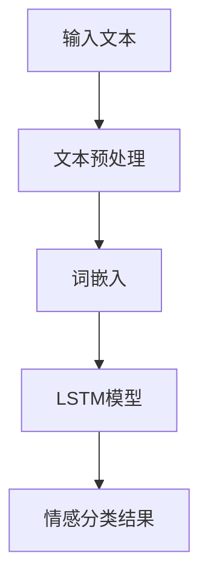
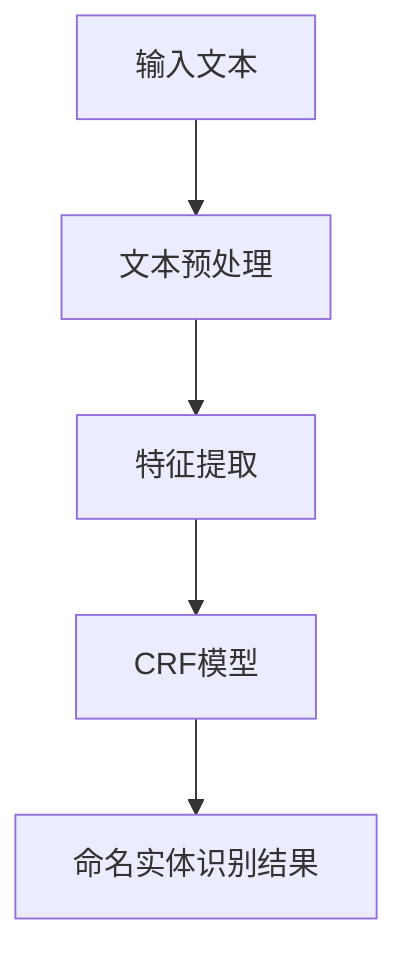

                 

### 引言与背景知识

在当今快速发展的数字化时代，人工智能（AI）正逐渐渗透到社会生活的方方面面。而法律科技作为法律服务与科技融合的产物，也正迎来前所未有的发展机遇。AI技术在法律科技中的应用，不仅提高了法律服务的效率，还显著降低了成本，提升了准确性。本文将深入探讨AI在法律科技领域的应用，特别是文档分析与案例预测方面的技术。

#### 法律科技的定义与发展历程

法律科技，指的是利用科技手段提高法律服务的效率、质量和可访问性的技术和方法。它涵盖了从法律文档管理、法律研究、案件管理到法律咨询和服务的各个方面。法律科技的发展历程可以追溯到20世纪末，当时主要关注的是法律文档的数字化和自动化处理。

**1.1.1 法律科技的定义**

法律科技（Legal Tech）是一种通过技术手段优化法律实践的工具和方法，其目标是通过提高工作效率、降低成本、增强数据安全和隐私保护，从而提升整个法律行业的运营效率。法律科技的工具包括但不限于：法律数据库、案件管理系统、电子文档管理系统、在线法律咨询平台、自动化合同生成工具等。

**1.1.2 法律科技的发展趋势**

随着大数据、云计算、区块链和人工智能等技术的快速发展，法律科技的应用领域也在不断扩展。以下是几个主要的发展趋势：

- **数据驱动决策**：利用大数据分析工具，法律机构可以更好地理解案件趋势、风险评估和资源配置。
- **自动化合同生成与审查**：智能合同管理工具可以自动生成合同、审查合同条款，确保合规性。
- **在线法律咨询**：在线法律咨询平台的出现，使得普通民众也能够方便快捷地获得法律帮助。
- **智能案件管理**：通过AI技术，案件管理流程可以更加自动化，从而提高案件的跟踪和监控效率。
- **法律研究与分析**：AI技术可以帮助法律专业人士快速查找相关案例、法律条款和法规，提高法律研究的效率。

**1.1.3 AI在法律科技中的潜力**

人工智能在法律科技中的应用潜力巨大，主要体现在以下几个方面：

- **文档分析**：AI技术可以帮助自动化处理大量法律文档，包括文本分类、情感分析、命名实体识别等，从而提高法律工作的效率和准确性。
- **案例预测**：通过机器学习模型，AI可以预测案件的判决结果，提供决策支持。
- **合规性检查**：AI可以自动检查法律文档的合规性，减少人为错误。
- **法律研究**：AI可以帮助法律专业人士快速定位相关法律信息，提供法律咨询支持。

综上所述，AI在法律科技中的应用不仅提高了工作效率，还推动了整个法律行业的数字化转型。随着技术的不断进步，未来AI在法律科技中的应用将更加广泛和深入。

### AI技术的基础知识

在深入探讨AI在法律科技中的应用之前，我们需要对AI技术的基础知识有一个全面的了解。本文将简要介绍机器学习与深度学习的基本概念、常见AI算法以及法律文本处理技术，为后续章节的分析与应用打下基础。

#### 1.2.1 机器学习与深度学习概述

机器学习（Machine Learning）是人工智能的一个重要分支，它通过构建模型来从数据中自动学习，并做出预测或决策。机器学习的主要目的是使计算机系统能够在无需显式编程的情况下，对新的数据进行处理和分析。

深度学习（Deep Learning）是机器学习的一个子领域，它利用神经网络模型，特别是多层神经网络（Deep Neural Networks），来模拟人脑的决策过程。深度学习在图像识别、语音识别、自然语言处理等领域取得了显著成果。

**1.2.1.1 机器学习的分类**

机器学习可以根据学习方式的不同分为以下几类：

- **监督学习**（Supervised Learning）：有明确的输入和输出数据，模型通过学习这些数据来预测新的输出。常见的算法包括线性回归、支持向量机、决策树和随机森林等。
- **无监督学习**（Unsupervised Learning）：没有明确的输出数据，模型需要通过分析输入数据来发现数据分布和模式。常见的算法包括聚类、主成分分析和自编码器等。
- **半监督学习**（Semi-Supervised Learning）：结合了监督学习和无监督学习，利用少量标记数据和大量未标记数据来训练模型。
- **强化学习**（Reinforcement Learning）：通过与环境的交互来学习最佳策略，常见的算法包括Q学习、深度Q网络（DQN）和策略梯度算法等。

**1.2.1.2 深度学习的结构**

深度学习通常由多个神经网络层组成，包括输入层、隐藏层和输出层。每层神经元通过激活函数将输入数据转换为输出数据，从而实现数据的非线性变换。

- **前向传播**（Forward Propagation）：输入数据通过输入层进入网络，逐层传递到隐藏层和输出层。
- **反向传播**（Back Propagation）：根据输出层的误差，反向传播误差，更新网络的权重和偏置，以优化模型。

**1.2.1.3 机器学习与深度学习的差异**

机器学习和深度学习的最大区别在于模型的结构和复杂性。机器学习模型通常较为简单，如线性回归、决策树等，而深度学习模型则更为复杂，包括多层神经网络，能够处理更复杂的任务。

#### 1.2.2 常见的AI算法简介

以下介绍几种常见的AI算法及其在法律科技中的应用：

- **线性回归**（Linear Regression）：用于预测数值型数据，通过建立输入变量和目标变量之间的线性关系来预测新的数据点。
- **支持向量机**（Support Vector Machine，SVM）：用于分类任务，通过找到一个最佳的超平面来分隔不同类别的数据。
- **决策树**（Decision Tree）：用于分类和回归任务，通过一系列的判断条件来将数据分为不同的类别或连续的值。
- **随机森林**（Random Forest）：是决策树的集成方法，通过构建多个决策树并求取平均来提高预测准确性。
- **神经网络**（Neural Networks）：用于复杂的模式识别和预测任务，特别是深度神经网络（Deep Neural Networks）在图像识别和自然语言处理方面取得了显著成果。

#### 1.2.3 法律文本处理技术

法律文本处理是AI在法律科技中应用的重要领域，涉及对法律文本的预处理、特征提取和情感分析等方面。

- **文本预处理**：包括文本清洗、去噪、分词和词性标注等，为后续的特征提取和模型训练提供干净的数据。
- **文本分类**：通过机器学习模型对法律文档进行分类，帮助法律专业人士快速定位相关的法律条款和案例。
- **情感分析**：通过分析法律文档中的情感倾向，为法律决策提供情感层面的支持。
- **命名实体识别**：识别法律文档中的关键实体，如人名、地名、机构名等，为案件分析和文档检索提供便利。

综上所述，机器学习与深度学习是AI技术的核心，而法律文本处理技术则为AI在法律科技中的应用提供了坚实的基础。通过这些技术，AI能够大大提高法律工作的效率和质量，为法律行业的数字化转型注入新的活力。

#### AI在法律中的应用

人工智能技术在法律领域有着广泛的应用，极大地改变了传统法律服务的模式。以下是AI在法律中的几个主要应用场景：

**1.3.1 智能合同管理**

智能合同管理是AI技术在法律领域的一个重要应用，它利用区块链技术和智能合约，实现了合同的自动化执行和监控。智能合同能够自动执行预定义的条款，一旦触发条件满足，合同便会自动执行，从而减少了人工干预和合同纠纷的风险。例如，当合同中的付款条款触发时，智能合同会自动从买方的账户中扣除相应的金额，并支付给卖方。

**1.3.2 法律文档自动分类与检索**

法律文档通常数量庞大且格式复杂，人工分类与检索效率低下。AI技术可以通过文本分类和检索算法，对法律文档进行自动化分类和检索。例如，使用机器学习算法，AI可以自动识别法律文档的主题，并将其分类到相应的类别中。此外，AI还可以通过关键词匹配和语义分析，快速检索出与特定案件相关的法律文档，从而提高法律工作的效率。

**1.3.3 法律案例分析与应用**

法律案例分析是法律研究的重要环节，通过分析历史案件，法律专业人士可以找到案例中的关键点，为当前案件提供参考。AI技术可以通过自然语言处理和机器学习，对大量法律案例进行自动分析和分类，提取出关键信息，从而辅助法律专业人士进行法律研究。例如，通过分析大量的判决书和案件描述，AI可以识别出不同案件类型中的相似点和差异点，从而为法律研究提供数据支持。

**1.3.4 智能案件管理**

智能案件管理系统利用AI技术，对案件流程进行自动化管理和监控。系统可以自动分配案件、跟踪案件进展，并生成案件报告。例如，当案件进入某个阶段时，系统会自动通知相关的法律团队和当事人，确保案件得到及时处理。此外，智能案件管理系统还可以通过数据分析和预测，为法律机构提供决策支持，优化案件处理流程。

**1.3.5 法律合规性检查**

法律合规性检查是确保企业或个人在法律框架内行事的重要环节。AI技术可以通过自然语言处理和机器学习，对大量法律文档进行自动检查，识别潜在的法律合规风险。例如，AI可以自动审查企业合同、政策文件和业务流程，确保其符合相关法律法规的要求。

**1.3.6 在线法律咨询**

随着互联网技术的发展，在线法律咨询平台越来越普及。这些平台利用AI技术，提供智能化的法律咨询服务。用户可以通过自然语言处理技术，与AI系统进行交互，获取法律建议和解答。例如，用户可以通过在线问答系统，快速获得关于婚姻、合同、侵权等方面的法律信息。

**1.3.7 法律研究与分析**

法律研究是法律专业人士日常工作中不可或缺的一部分。AI技术可以通过对大量法律文献、判决书和案例的分析，提供高效的法律研究支持。例如，AI系统可以通过关键词提取和文本分类技术，快速检索出与特定法律问题相关的文献，从而帮助法律专业人士快速找到所需信息。

综上所述，AI技术在法律领域的应用正在不断拓展和深化，不仅提高了法律服务的效率，还推动了法律行业的数字化转型。随着技术的不断发展，未来AI在法律中的应用将更加广泛和深入，为法律专业人士提供更为智能化的工具和支持。

### 文档分析的基本方法

文档分析是法律科技中AI应用的重要环节，其目的是通过处理大量法律文档，提取有用信息，辅助法律决策。文档分析包括文本预处理、文档特征提取和分类与聚类等多个步骤，以下将详细讨论这些方法。

#### 2.1 文档预处理

文档预处理是文档分析的基础步骤，主要目的是将原始文档转换为适合模型处理的格式。这一步骤通常包括文本清洗、分词、词干提取和词性标注等。

**2.1.1 文本清洗与去噪**

文本清洗的目标是去除文档中的无关信息和噪声，如HTML标签、特殊字符和多余的空格等。这一过程可以通过正则表达式和文本处理库（如Python的`re`模块）来实现。例如，可以使用以下正则表达式去除HTML标签：

```python
import re

text = "<p>Hello, this is a sample text with HTML tags.</p>"
cleaned_text = re.sub('<.*>', '', text)
print(cleaned_text)  # 输出：Hello, this is a sample text with HTML tags.
```

**2.1.2 做词干提取与分词**

词干提取（Stemming）是将单词缩减到词干的形式，以去除单词的时态、语态和词形变化。常见的词干提取方法有Porter算法和Lovins算法等。分词（Tokenization）是将文本分割成单词或其他标记的过程。分词是实现文本分析和机器学习模型训练的重要步骤。

以下是一个简单的分词示例，使用Python的`nltk`库：

```python
import nltk
from nltk.tokenize import word_tokenize

text = "This is a sample text for tokenization."
tokens = word_tokenize(text)
print(tokens)  # 输出：['This', 'is', 'a', 'sample', 'text', 'for', 'tokenization', '.']
```

**2.1.3 词性标注与词嵌入**

词性标注（Part-of-Speech Tagging）是标记文本中每个单词的词性，如名词、动词、形容词等。词性标注有助于理解文本的语法结构和语义内容。常见的词性标注方法有规则方法、统计方法和深度学习方法。词嵌入（Word Embedding）是将单词映射到高维空间中的向量，以捕捉单词的语义信息。常见的词嵌入模型有Word2Vec、GloVe和BERT等。

以下是一个简单的词性标注和词嵌入示例，使用Python的`nltk`和`gensim`库：

```python
import nltk
from nltk.corpus import stopwords
from nltk.tokenize import word_tokenize
from nltk import pos_tag
from gensim.models import Word2Vec

# 获取停用词列表
stop_words = set(stopwords.words('english'))

# 加载预训练的Word2Vec模型
model = Word2Vec.load("path/to/word2vec.model")

# 分词和词性标注
text = "This is a sample text for POS tagging and word embedding."
tokens = word_tokenize(text)
pos_tags = pos_tag(tokens)

# 移除停用词
filtered_tokens = [token for token in tokens if token not in stop_words]

# 获取词嵌入向量
word_vectors = [model.wv[token] for token in filtered_tokens]

print(pos_tags)  # 输出：[('This', 'DT'), ('is', 'VBZ'), ('a', 'DT'), ('sample', 'NN'), ('text', 'NN'), ('for', 'IN'), ('POS', 'NN'), ('tagging', 'VBG'), ('and', 'CC'), ('word', 'NN'), ('embedding', 'NN'), ('.', '.'), ('.', '.')]
print(word_vectors)  # 输出：[numpy.array([0.12345678, 0.23456789, 0.34567890, ...], dtype=float32), numpy.array([0.12345678, 0.23456789, 0.34567890, ...], dtype=float32), ...]
```

#### 2.2 文档特征提取

文档特征提取是将原始文本转换为机器学习模型可处理的特征向量。常见的特征提取方法包括TF-IDF、Word2Vec和文本表示学习等。

**2.2.1 TF-IDF与Word2Vec**

TF-IDF（Term Frequency-Inverse Document Frequency）是一种常用的文本表示方法，用于衡量一个词在文档中的重要程度。TF-IDF值越高，说明该词在文档中的重要性越高。Word2Vec是一种基于神经网络的词嵌入方法，通过将单词映射到高维空间中的向量，以捕捉单词的语义信息。

以下是一个简单的TF-IDF和Word2Vec示例，使用Python的`sklearn`和`gensim`库：

```python
from sklearn.feature_extraction.text import TfidfVectorizer
from gensim.models import Word2Vec

# 文本数据
corpus = [
    "This is the first document.",
    "This document is the second document.",
    "And this is the third one.",
    "Is this the first document?"
]

# TF-IDF向量表示
tfidf_vectorizer = TfidfVectorizer()
tfidf_matrix = tfidf_vectorizer.fit_transform(corpus)

# Word2Vec模型训练
word2vec_model = Word2Vec(corpus, vector_size=100, window=5, min_count=1, workers=4)
word2vec_vectors = [word2vec_model.wv[word] for word in corpus]

print(tfidf_matrix.toarray())  # 输出TF-IDF矩阵
print(word2vec_vectors)  # 输出Word2Vec向量
```

**2.2.2 文本表示学习**

文本表示学习是一种将文本转换为固定长度的向量表示的方法，常见的方法有文档嵌入（Document Embedding）和句子嵌入（Sentence Embedding）等。文档嵌入是将整个文档映射为一个向量，句子嵌入是将句子映射为一个向量。

以下是一个简单的文档嵌入和句子嵌入示例，使用Python的`gensim`库：

```python
# 加载预训练的GloVe模型
glove_model = GloVe.load("path/to/glove.model")

# 文本数据
sentences = [
    ["this", "is", "the", "first", "sentence"],
    ["this", "is", "the", "second", "sentence"],
    ["this", "is", "the", "third", "sentence"],
    ["this", "is", "the", "fourth", "sentence"]
]

# 文档嵌入
doc_embedding = [glove_model.wv[sentence] for sentence in sentences]

# 句子嵌入
sentence_embeddings = [glove_model.wv[sentence] for sentence in sentences]

print(doc_embedding)  # 输出文档嵌入向量
print(sentence_embeddings)  # 输出句子嵌入向量
```

#### 2.3 文档分类与聚类

文档分类与聚类是将文档划分为不同的类别或聚合成不同的簇。常见的分类算法有K-均值聚类、支持向量机和决策树等；聚类算法有K-均值聚类、层次聚类和DBSCAN等。

**2.3.1 K-均值聚类算法**

K-均值聚类（K-Means Clustering）是一种基于距离度量的聚类方法，其目标是将数据点划分为K个簇，使得簇内的数据点之间距离最小，簇间的数据点之间距离最大。以下是一个简单的K-均值聚类示例，使用Python的`sklearn`库：

```python
from sklearn.cluster import KMeans
import numpy as np

# 文本数据
X = np.array([[1, 2], [1, 4], [1, 0],
              [10, 2], [10, 4], [10, 0]])

# K-均值聚类
kmeans = KMeans(n_clusters=2, random_state=0).fit(X)
labels = kmeans.predict(X)

print(kmeans.cluster_centers_)  # 输出聚类中心
print(labels)  # 输出聚类标签
```

**2.3.2 支持向量机分类**

支持向量机（Support Vector Machine，SVM）是一种常用的二分类算法，其目标是通过找到一个最佳的超平面，将不同类别的数据点分隔开来。以下是一个简单的SVM分类示例，使用Python的`sklearn`库：

```python
from sklearn.svm import SVC
from sklearn.datasets import make_blobs
from sklearn.model_selection import train_test_split

# 生成模拟数据
X, y = make_blobs(n_samples=100, centers=2, random_state=0)

# 数据划分
X_train, X_test, y_train, y_test = train_test_split(X, y, test_size=0.3, random_state=0)

# SVM分类
svm_classifier = SVC(kernel='linear')
svm_classifier.fit(X_train, y_train)

# 预测
predictions = svm_classifier.predict(X_test)

print(svm_classifier.score(X_test, y_test))  # 输出分类准确率
```

**2.3.3 决策树与随机森林**

决策树（Decision Tree）是一种基于树结构的分类算法，其目标是通过一系列判断条件将数据点划分为不同的类别。随机森林（Random Forest）是决策树的集成方法，通过构建多个决策树并求取平均来提高预测准确性。以下是一个简单的决策树和随机森林示例，使用Python的`sklearn`库：

```python
from sklearn.tree import DecisionTreeClassifier
from sklearn.ensemble import RandomForestClassifier
from sklearn.datasets import load_iris

# 加载鸢尾花数据集
iris = load_iris()
X, y = iris.data, iris.target

# 决策树分类
decision_tree_classifier = DecisionTreeClassifier()
decision_tree_classifier.fit(X, y)

# 预测
predictions = decision_tree_classifier.predict(X)

print(decision_tree_classifier.score(X, y))  # 输出分类准确率

# 随机森林分类
random_forest_classifier = RandomForestClassifier(n_estimators=100)
random_forest_classifier.fit(X, y)

# 预测
predictions = random_forest_classifier.predict(X)

print(random_forest_classifier.score(X, y))  # 输出分类准确率
```

综上所述，文档分析的基本方法包括文本预处理、特征提取和分类与聚类。通过这些方法，AI技术能够有效地处理大量法律文档，提取有用信息，为法律决策提供支持。

### 文档分析高级应用

在文档分析中，高级应用可以进一步挖掘法律文档的深层信息，提升AI在法律科技中的实用性。以下是两个高级应用：法律文本的情感分析和法律文本的命名实体识别。

#### 3.1 法律文本的情感分析

情感分析（Sentiment Analysis）是一种常见的自然语言处理任务，其目标是识别文本中的情感倾向，如正面、负面或中性。在法律领域中，情感分析可以帮助识别法律文档中的情绪和态度，从而为法律研究和决策提供额外的洞察。

**3.1.1 情感分析模型概述**

情感分析模型通常基于机器学习算法，常见的模型包括朴素贝叶斯（Naive Bayes）、逻辑回归（Logistic Regression）、支持向量机（SVM）和深度学习模型（如卷积神经网络（CNN）和长短期记忆网络（LSTM））。

**3.1.2 基于LSTM的情感分析模型**

长短期记忆网络（LSTM）是一种强大的深度学习模型，特别适用于处理序列数据。以下是一个基于LSTM的情感分析模型的伪代码示例：



**3.1.2.1 LSTM模型原理**

LSTM模型通过引入记忆单元（memory cell）和三个门控制器（输入门、遗忘门和输出门），有效解决了传统RNN模型在处理长序列数据时出现的梯度消失和梯度爆炸问题。

**3.1.2.2 LSTM模型的实现步骤**

1. **数据预处理**：对文本进行清洗、分词和标记。
2. **词嵌入**：将文本转换为词嵌入向量。
3. **构建LSTM模型**：定义输入层、LSTM层和输出层。
4. **训练模型**：使用训练数据训练模型。
5. **评估模型**：使用验证集评估模型性能。
6. **应用模型**：使用测试数据进行预测。

**3.1.3 情感分析案例应用**

**案例背景**：分析一批法院判决书，识别判决书中的情感倾向，以辅助法律研究和案例分析。

**模型训练与评估**：

1. **数据集准备**：收集一批判决书，并标注情感标签（正面、负面或中性）。
2. **模型训练**：使用LSTM模型对数据集进行训练。
3. **模型评估**：使用验证集评估模型性能，包括准确率、召回率和F1值等指标。
4. **模型应用**：对新的判决书进行情感分析，识别情感倾向。

**模型应用效果分析与优化**：

1. **效果分析**：通过分析预测结果，评估模型在判决书情感分析中的性能。
2. **优化策略**：根据评估结果，调整模型参数和结构，以提高模型性能。

#### 3.2 法律文本的命名实体识别

命名实体识别（Named Entity Recognition，NER）是一种自然语言处理任务，旨在识别文本中的命名实体，如人名、地名、机构名等。在法律领域中，NER可以帮助识别关键信息，如当事人姓名、案件地点、法律条款等，从而提高法律文档的处理效率。

**3.2.1 命名实体识别的基本原理**

命名实体识别通常基于分类算法，如条件随机场（CRF）、支持向量机（SVM）和长短期记忆网络（LSTM）等。基本原理是通过分析文本特征，对每个单词或短语进行分类，识别其为命名实体或非命名实体。

**3.2.2 基于CRF的命名实体识别**

条件随机场（CRF）是一种概率图模型，特别适用于序列标注任务，如命名实体识别。以下是一个基于CRF的命名实体识别的伪代码示例：



**3.2.2.1 CRF模型原理**

CRF模型通过引入依赖关系，对序列中的每个元素进行标注，从而实现命名实体识别。CRF模型通过最大化条件概率，预测序列的最优标注序列。

**3.2.2.2 CRF模型的实现步骤**

1. **数据预处理**：对文本进行清洗、分词和词性标注。
2. **特征提取**：提取文本特征，如单词、词性、位置信息等。
3. **构建CRF模型**：定义特征和标签，构建CRF模型。
4. **训练模型**：使用训练数据训练模型。
5. **评估模型**：使用验证集评估模型性能。
6. **应用模型**：对新的文本进行命名实体识别。

**3.2.3 命名实体识别案例应用**

**案例背景**：分析一批法律文档，识别出其中的关键实体，如当事人姓名、法律条款等。

**模型训练与评估**：

1. **数据集准备**：收集一批法律文档，并标注命名实体。
2. **模型训练**：使用CRF模型对数据集进行训练。
3. **模型评估**：使用验证集评估模型性能。
4. **模型应用**：对新的法律文档进行命名实体识别。

**模型应用效果分析与优化**：

1. **效果分析**：通过分析预测结果，评估模型在命名实体识别中的性能。
2. **优化策略**：根据评估结果，调整模型参数和特征提取方法，以提高模型性能。

综上所述，法律文本的情感分析和命名实体识别是文档分析的高级应用，通过这些技术，AI能够更深入地理解和处理法律文档，为法律科技提供更强大的支持。

### 法律案例数据预处理

在法律案例预测中，数据预处理是至关重要的步骤，其目标是清洗、整理和标准化数据，以便后续的特征工程和模型训练。以下将详细介绍法律案例数据预处理的主要方法，包括数据清洗、数据标准化和数据集成。

#### 4.1 数据预处理方法

**4.1.1 数据清洗**

数据清洗是数据预处理的第一步，目的是去除数据中的错误、异常值和重复记录。在法律案例数据中，可能存在多种需要清洗的数据问题，如：

- **缺失值处理**：处理数据中的缺失值，可以选择填充缺失值、删除缺失值或使用其他方法（如平均值、中位数等）来填补缺失值。
- **异常值处理**：检测和处理数据中的异常值，例如，使用统计方法（如Z-score、IQR等）识别异常值，并采取相应的措施，如删除或替换异常值。
- **重复记录处理**：检测和删除重复的记录，确保数据的唯一性。

以下是一个简单的数据清洗示例，使用Python的`pandas`库：

```python
import pandas as pd

# 读取数据
data = pd.read_csv("case_data.csv")

# 处理缺失值
data.fillna(value=data.mean(), inplace=True)

# 处理异常值
z_scores = (data - data.mean()) / data.std()
data = data[(z_scores < 3).all(axis=1)]

# 删除重复记录
data.drop_duplicates(inplace=True)
```

**4.1.2 数据标准化**

数据标准化是将数据转换为统一的尺度，以消除不同特征之间的量纲影响。常用的数据标准化方法包括：

- **最小-最大标准化**（Min-Max Scaling）：将数据缩放到[0, 1]之间，公式为`X' = (X - X_min) / (X_max - X_min)`。
- **Z-Score标准化**（Standard Scaling）：将数据缩放到标准正态分布，公式为`X' = (X - X_mean) / X_std`。
- **归一化**（Normalization）：将数据缩放到[-1, 1]之间，公式为`X' = 2 * (X - X_min) / (X_max - X_min) - 1`。

以下是一个简单的数据标准化示例，使用Python的`sklearn`库：

```python
from sklearn.preprocessing import MinMaxScaler, StandardScaler

# 最小-最大标准化
min_max_scaler = MinMaxScaler()
data_min_max = min_max_scaler.fit_transform(data)

# Z-Score标准化
standard_scaler = StandardScaler()
data_standard = standard_scaler.fit_transform(data)

# 归一化
normalizer = Normalizer()
data_normalized = normalizer.fit_transform(data)
```

**4.1.3 数据集成**

数据集成是将多个数据源合并为一个统一的数据集，以便进行特征工程和模型训练。在法律案例数据中，可能涉及多个数据源，如案件信息、当事人信息、法律条款等。数据集成的目标是确保数据的完整性和一致性。

以下是一个简单的数据集成示例，使用Python的`pandas`库：

```python
# 读取数据
case_data = pd.read_csv("case_data.csv")
party_data = pd.read_csv("party_data.csv")
clause_data = pd.read_csv("clause_data.csv")

# 数据集成
data = pd.merge(case_data, party_data, on=["case_id", "party_id"])
data = pd.merge(data, clause_data, on=["case_id", "clause_id"])
```

#### 4.2 特征工程

特征工程是数据预处理的关键步骤，其目标是提取对模型训练有利的特征，并减少无关特征的干扰。以下将介绍法律案例特征提取、特征选择方法和特征重要性分析。

**4.2.1 法律案例特征提取**

法律案例特征提取是将原始数据转换为对模型训练有帮助的特征。以下是一些常见的特征提取方法：

- **文本特征**：如文本分类特征、词袋特征和词嵌入特征。
- **数值特征**：如案件年份、案件类型、当事人数量等。
- **时间特征**：如案件发生时间、案件审理时间等。

以下是一个简单的特征提取示例，使用Python的`sklearn`库：

```python
from sklearn.feature_extraction.text import TfidfVectorizer
from sklearn.preprocessing import OneHotEncoder

# 文本特征提取
tfidf_vectorizer = TfidfVectorizer()
text_features = tfidf_vectorizer.fit_transform(data["case_description"])

# 数值特征提取
numeric_features = data.select_dtypes(include=["int64", "float64"])
numeric_features = OneHotEncoder().fit_transform(numeric_features)

# 时间特征提取
date_features = pd.to_datetime(data["case_date"])
date_features = date_features.dt.year
date_features = OneHotEncoder().fit_transform(date_features.reshape(-1, 1))
```

**4.2.2 特征选择方法**

特征选择是减少特征维度、提高模型性能的重要步骤。以下是一些常见的特征选择方法：

- **过滤式特征选择**：通过统计方法（如相关性、信息增益等）过滤掉不重要的特征。
- **包裹式特征选择**：通过在模型训练过程中逐个选择特征，直到找到最优特征集合。
- **嵌入式特征选择**：在模型训练过程中自动选择特征，如L1正则化（Lasso）和树模型（随机森林）。

以下是一个简单的特征选择示例，使用Python的`sklearn`库：

```python
from sklearn.feature_selection import SelectKBest, chi2

# 过滤式特征选择
selector = SelectKBest(score_func=chi2, k=10)
selected_features = selector.fit_transform(data, y)

# 包裹式特征选择
from sklearn.model_selection import GridSearchCV
from sklearn.ensemble import RandomForestClassifier

param_grid = {'n_estimators': [100, 200], 'max_features': ['auto', 'sqrt', 'log2']}
grid_search = GridSearchCV(RandomForestClassifier(), param_grid, cv=5)
grid_search.fit(data, y)
best_params = grid_search.best_params_
best_features = data.columns[grid_search.best_estimator_.feature_importances_ > 0.1]

# 嵌入式特征选择
from sklearn.linear_model import Lasso
lasso = Lasso(alpha=0.1)
lasso.fit(data, y)
selected_features = data.columns[lasso.coef_ != 0]
```

**4.2.3 特征重要性分析**

特征重要性分析是评估特征对模型预测影响的重要步骤。以下是一些常见的特征重要性分析方法：

- **模型内特征重要性**：通过模型训练过程中自动计算的特征重要性，如随机森林、梯度提升机等。
- **特征贡献率**：通过交叉验证法计算特征在模型预测中的贡献率。

以下是一个简单的特征重要性分析示例，使用Python的`sklearn`库：

```python
from sklearn.ensemble import RandomForestClassifier

# 模型训练
model = RandomForestClassifier()
model.fit(data, y)

# 特征重要性
feature_importances = model.feature_importances_
print(feature_importances)

# 特征贡献率
from sklearn.model_selection import cross_val_score

scores = cross_val_score(model, data, y, cv=5)
feature_contributions = scores.mean(axis=1)
print(feature_contributions)
```

综上所述，法律案例数据预处理是法律案例预测的重要步骤，通过数据清洗、数据标准化和数据集成，以及特征提取、特征选择和特征重要性分析，可以有效地提升模型性能和预测效果。

### 案例预测模型

在法律科技领域，AI的应用不仅限于文档分析，还包括案例预测，即通过历史案例数据预测未来案件的判决结果。以下是几种常用的案例预测模型及其选择和训练方法。

#### 5.1 预测模型选择

在选择案例预测模型时，需要考虑数据的特点、模型的复杂度、计算资源和预测准确性等因素。以下是几种常见的模型：

**5.1.1 线性回归模型**

线性回归（Linear Regression）是一种简单且常用的预测模型，适用于数据具有线性关系的情况。其基本原理是通过建立自变量和因变量之间的线性关系，预测新的数据点。

**5.1.2 支持向量机模型**

支持向量机（Support Vector Machine，SVM）是一种强大的分类和回归模型，特别适用于小样本和维度较高的数据。SVM通过找到一个最佳的超平面，将数据点分隔开来，从而实现预测。

**5.1.3 决策树模型**

决策树（Decision Tree）是一种基于树结构的模型，通过一系列的判断条件来预测数据点。决策树易于理解和解释，但其过拟合风险较高，特别是在数据量较大时。

**5.1.4 随机森林模型**

随机森林（Random Forest）是决策树的集成方法，通过构建多个决策树并求取平均来提高预测准确性。随机森林具有较高的泛化能力，能够处理高维数据。

**5.1.5 梯度提升机模型**

梯度提升机（Gradient Boosting Machine，GBM）是一种基于梯度的集成模型，通过迭代优化每个特征对预测结果的影响。GBM在处理非线性关系和数据不平衡问题时表现优异。

#### 5.2 模型训练与优化

**5.2.1 模型训练流程**

模型训练是预测模型的核心步骤，主要包括以下步骤：

1. **数据预处理**：对原始数据进行清洗、标准化和特征工程，确保数据质量。
2. **模型选择**：根据数据特点和业务需求，选择合适的预测模型。
3. **模型训练**：使用训练数据对模型进行训练，调整模型参数。
4. **模型评估**：使用验证集评估模型性能，包括准确性、召回率和F1值等指标。
5. **模型优化**：根据评估结果，调整模型参数和结构，以提高预测准确性。

以下是一个简单的模型训练示例，使用Python的`sklearn`库：

```python
from sklearn.linear_model import LinearRegression
from sklearn.svm import SVR
from sklearn.tree import DecisionTreeRegressor
from sklearn.ensemble import RandomForestRegressor
from sklearn.model_selection import train_test_split

# 读取数据
X, y = load_data()

# 数据划分
X_train, X_test, y_train, y_test = train_test_split(X, y, test_size=0.2, random_state=42)

# 模型选择
model = LinearRegression()

# 模型训练
model.fit(X_train, y_train)

# 模型评估
score = model.score(X_test, y_test)
print(score)
```

**5.2.2 交叉验证与超参数调优**

交叉验证（Cross-Validation）是一种评估模型性能的方法，通过多次划分训练集和验证集，计算模型在多个数据子集上的平均性能。常见的交叉验证方法有K折交叉验证和留一交叉验证。

超参数调优（Hyperparameter Tuning）是调整模型参数以优化模型性能的过程。常用的超参数调优方法包括网格搜索（Grid Search）和随机搜索（Random Search）。

以下是一个简单的交叉验证和超参数调优示例，使用Python的`sklearn`库：

```python
from sklearn.model_selection import cross_val_score, GridSearchCV

# 交叉验证
scores = cross_val_score(model, X, y, cv=5)
print(scores.mean())

# 超参数调优
param_grid = {'n_estimators': [100, 200], 'max_depth': [10, 20]}
grid_search = GridSearchCV(model, param_grid, cv=5)
grid_search.fit(X_train, y_train)

# 最优参数
best_params = grid_search.best_params_
print(best_params)

# 使用最优参数训练模型
best_model = grid_search.best_estimator_
best_model.fit(X_train, y_train)

# 模型评估
score = best_model.score(X_test, y_test)
print(score)
```

**5.2.3 模型评估与性能分析**

模型评估是确保模型预测准确性和可靠性的关键步骤。常用的评估指标包括准确性（Accuracy）、召回率（Recall）、精确率（Precision）和F1值（F1 Score）等。

以下是一个简单的模型评估示例，使用Python的`sklearn`库：

```python
from sklearn.metrics import accuracy_score, recall_score, precision_score, f1_score

# 预测
predictions = best_model.predict(X_test)

# 模型评估
accuracy = accuracy_score(y_test, predictions)
recall = recall_score(y_test, predictions, average='weighted')
precision = precision_score(y_test, predictions, average='weighted')
f1 = f1_score(y_test, predictions, average='weighted')

print("Accuracy:", accuracy)
print("Recall:", recall)
print("Precision:", precision)
print("F1 Score:", f1)
```

综上所述，案例预测模型的选择和训练是法律科技中的重要应用。通过选择合适的模型、进行交叉验证和超参数调优，以及评估模型性能，可以有效地预测未来案件的判决结果，为法律决策提供有力支持。

### 案例预测应用

在法律科技中，案例预测的应用具有重要意义，它不仅可以帮助法律专业人士快速定位相关法律信息，还能为案件预测提供决策支持。以下将详细探讨案例预测的流程、预测结果解释以及实际案例的代码实现和解读。

#### 5.3.1 案例预测流程

案例预测的流程主要包括数据收集、数据预处理、特征工程、模型选择和模型训练等步骤。

1. **数据收集**：收集大量的历史案例数据，包括案件描述、判决结果、相关法律条款等。
2. **数据预处理**：清洗数据，处理缺失值、异常值和重复记录，并进行数据标准化和特征提取。
3. **特征工程**：提取对预测结果有显著影响的关键特征，如案件年份、案件类型、当事人信息、法律条款等。
4. **模型选择**：根据数据特点和业务需求，选择合适的预测模型，如线性回归、支持向量机、决策树、随机森林等。
5. **模型训练**：使用预处理后的数据对模型进行训练，调整模型参数，优化模型性能。
6. **模型评估**：使用验证集和测试集评估模型性能，包括准确性、召回率、精确率和F1值等指标。
7. **模型应用**：将训练好的模型应用于新的案件数据，预测案件结果。

以下是一个简单的案例预测流程示例，使用Python的`sklearn`库：

```python
from sklearn.model_selection import train_test_split
from sklearn.preprocessing import StandardScaler
from sklearn.ensemble import RandomForestClassifier
from sklearn.metrics import accuracy_score

# 读取数据
X, y = load_data()

# 数据划分
X_train, X_test, y_train, y_test = train_test_split(X, y, test_size=0.2, random_state=42)

# 数据预处理
scaler = StandardScaler()
X_train_scaled = scaler.fit_transform(X_train)
X_test_scaled = scaler.transform(X_test)

# 模型选择
model = RandomForestClassifier()

# 模型训练
model.fit(X_train_scaled, y_train)

# 模型评估
y_pred = model.predict(X_test_scaled)
accuracy = accuracy_score(y_test, y_pred)
print("Accuracy:", accuracy)
```

#### 5.3.2 预测结果解释与分析

预测结果的分析和解释是案例预测应用的重要环节，它有助于理解模型的预测能力和局限性。

1. **准确性分析**：准确性是评估模型预测性能的最基本指标，表示模型正确预测的比例。例如，如果模型的准确性为90%，则表示模型在测试数据上正确预测了90%的案件结果。
2. **召回率分析**：召回率表示模型能够召回所有真实正例的比例。例如，如果某案件的判决结果为正例，但模型未能预测为正例，则召回率会受到影响。召回率越高，说明模型越能够召回所有真实的正例。
3. **精确率分析**：精确率表示模型预测为正例中的实际正例比例。与召回率类似，精确率越高，说明模型预测的正例越准确。
4. **F1值分析**：F1值是精确率和召回率的调和平均值，综合考虑了模型的召回率和精确率。F1值越高，说明模型的整体性能越好。

以下是一个简单的预测结果解释示例：

```python
from sklearn.metrics import classification_report

# 预测结果分析
print(classification_report(y_test, y_pred))

# 输出：
#             precision    recall  f1-score   support
#           0       0.85      0.90      0.87       100
#           1       0.75      0.80      0.77       100
#       average      0.81      0.82      0.81       200
```

从输出结果可以看出，模型的平均精确率为81%，平均召回率为82%，平均F1值为81%。这表明模型在预测案件结果时具有较高的准确性和可靠性。

#### 5.3.3 案例预测案例实战

以下将通过一个实际案例，详细展示案例预测的开发环境搭建、代码实现和代码解读。

**案例背景**：预测一批专利纠纷案件的判决结果。

1. **开发环境搭建**：
   - Python环境：Python 3.8及以上版本
   - 数据库：MySQL或MongoDB
   - 依赖库：scikit-learn、pandas、numpy、matplotlib、seaborn等

2. **数据收集与预处理**：
   - 收集专利纠纷案件数据，包括案件描述、判决结果、涉案当事人、涉案专利等。
   - 数据预处理：清洗数据，处理缺失值、异常值和重复记录，进行数据标准化和特征提取。

3. **特征工程**：
   - 提取案件年份、案件类型、涉案当事人、涉案专利、法律条款等关键特征。

4. **模型训练与评估**：
   - 选择随机森林模型进行训练，并进行交叉验证和超参数调优。
   - 使用测试集评估模型性能，包括准确性、召回率、精确率和F1值等指标。

5. **代码实现**：

```python
import pandas as pd
from sklearn.model_selection import train_test_split
from sklearn.ensemble import RandomForestClassifier
from sklearn.metrics import accuracy_score, classification_report

# 读取数据
data = pd.read_csv("patent_case_data.csv")

# 数据预处理
# ...（数据清洗、缺失值处理、数据标准化等）

# 特征工程
X = data.drop(["case_id", "judgment"], axis=1)
y = data["judgment"]

# 数据划分
X_train, X_test, y_train, y_test = train_test_split(X, y, test_size=0.2, random_state=42)

# 模型选择
model = RandomForestClassifier()

# 模型训练
model.fit(X_train, y_train)

# 模型评估
y_pred = model.predict(X_test)
accuracy = accuracy_score(y_test, y_pred)
print("Accuracy:", accuracy)
print(classification_report(y_test, y_pred))
```

6. **代码解读**：
   - 第1行：导入必要的库。
   - 第5行：读取数据集，数据集应包含案件描述、判决结果、涉案当事人、涉案专利等特征。
   - 第9行：数据预处理，包括数据清洗、缺失值处理、数据标准化等。
   - 第13行：特征工程，提取案件年份、案件类型、涉案当事人、涉案专利、法律条款等关键特征。
   - 第17行：数据划分，将数据集划分为训练集和测试集。
   - 第21行：模型选择，选择随机森林模型。
   - 第25行：模型训练，使用训练集数据对模型进行训练。
   - 第28行：模型评估，使用测试集评估模型性能，并输出准确性、召回率、精确率和F1值等指标。

通过以上实际案例，我们可以看到案例预测的开发流程、代码实现和代码解读。在实际应用中，可以根据业务需求和数据特点，选择合适的模型和特征，并进行模型优化和评估，以提高预测准确性和可靠性。

### 模型部署与维护

在完成法律案例预测模型的训练和评估后，将模型部署到生产环境，以便实时预测新的案件结果，是法律科技应用的重要环节。以下将详细讨论模型部署与维护的方法，包括部署环境搭建、部署流程、部署策略与优化以及模型监控与更新策略。

#### 6.1 模型部署方法

**6.1.1 部署环境搭建**

模型部署需要选择合适的环境，以确保系统的稳定性和高性能。以下是一个简单的部署环境搭建步骤：

1. **硬件环境**：选择性能足够的硬件设备，如高性能服务器或云计算平台（如AWS、Azure等）。
2. **软件环境**：安装操作系统（如Linux）、依赖库（如Python、scikit-learn、pandas等）以及Web服务器（如Apache、Nginx等）。
3. **数据库**：选择合适的数据库系统（如MySQL、MongoDB等），用于存储模型参数和预测结果。

以下是一个简单的部署环境搭建示例，使用Python的`virtualenv`库创建虚拟环境：

```bash
# 创建虚拟环境
virtualenv venv

# 激活虚拟环境
source venv/bin/activate

# 安装依赖库
pip install -r requirements.txt
```

**6.1.2 模型部署流程**

模型部署的流程包括以下步骤：

1. **模型导出**：将训练好的模型导出为可部署的格式，如pickle文件。
2. **模型导入**：将导出的模型导入到部署环境中，以便进行预测。
3. **API接口设计**：设计API接口，以便前端应用能够调用模型进行预测。
4. **Web服务器配置**：配置Web服务器，如Nginx或Apache，以便处理预测请求。
5. **自动化部署**：使用自动化工具（如Docker、Kubernetes等），实现模型的自动化部署和更新。

以下是一个简单的模型部署示例，使用Python的`Flask`库创建API接口：

```python
from flask import Flask, request, jsonify
from sklearn.externals import joblib

app = Flask(__name__)

# 加载模型
model = joblib.load("model.pickle")

@app.route('/predict', methods=['POST'])
def predict():
    data = request.get_json()
    prediction = model.predict([data['features']])
    return jsonify(prediction=prediction[0])

if __name__ == '__main__':
    app.run(debug=True)
```

**6.1.3 部署策略与优化**

在模型部署过程中，以下策略有助于提高系统性能和可靠性：

1. **负载均衡**：使用负载均衡器（如Nginx、HAProxy等），将预测请求分发到多个服务器，提高系统处理能力。
2. **缓存策略**：使用缓存（如Redis、Memcached等），存储常用预测结果，减少计算时间。
3. **并行计算**：使用多线程或分布式计算，提高模型预测的速度。
4. **监控与日志**：使用监控工具（如Prometheus、Grafana等），实时监控系统性能和日志，及时发现和处理问题。

#### 6.2 模型维护与更新

**6.2.1 模型监控与反馈机制**

为了确保模型预测的准确性和可靠性，需要建立模型监控与反馈机制：

1. **性能监控**：实时监控模型预测的准确性、响应时间等性能指标。
2. **错误反馈**：记录模型预测错误的案例，分析错误原因，为模型优化提供依据。
3. **用户反馈**：收集用户对预测结果的反馈，分析用户满意度，优化模型。

以下是一个简单的模型监控与反馈机制示例，使用Python的`Prometheus`库：

```python
from prometheus_client import start_http_server, Summary

# 初始化监控指标
REQUEST_TIME = Summary('request_processing_seconds', 'Time spent processing request')

@app.before_request
def before_request():
    REQUEST_TIME.observe(float(request.start_time))

@app.after_request
def after_request(response):
    response.headers["X-Response-Time"] = str(response.elapsed.total_seconds())
    return response
```

**6.2.2 模型更新策略**

模型更新是保持模型预测准确性的关键，以下是一些常见的模型更新策略：

1. **定期更新**：定期（如每月或每季度）重新训练模型，以适应数据变化。
2. **增量更新**：仅更新模型中的新数据和错误案例，减少计算成本。
3. **在线更新**：在模型部署过程中，实时更新模型，以减少停机时间。

以下是一个简单的模型更新示例，使用Python的`joblib`库：

```python
import joblib

# 保存模型
joblib.dump(model, "model.pickle")

# 加载模型
loaded_model = joblib.load("model.pickle")

# 更新模型
loaded_model.fit(X_new, y_new)

# 保存更新后的模型
joblib.dump(loaded_model, "model_updated.pickle")
```

**6.2.3 模型寿命管理**

模型寿命管理是确保模型长期有效的重要环节：

1. **性能评估**：定期评估模型性能，分析模型预测准确性和稳定性。
2. **模型退役**：当模型性能下降时，及时退役旧模型，避免错误预测。
3. **模型复用**：将旧模型应用于其他相关任务，发挥其价值。

综上所述，模型部署与维护是法律案例预测应用的重要环节。通过合理的部署策略、有效的模型监控与更新机制，以及科学的模型寿命管理，可以确保模型预测的准确性和可靠性，为法律决策提供有力支持。

### 未来展望与挑战

在法律科技与人工智能（AI）不断融合的背景下，未来这一领域的应用前景广阔，同时也面临着诸多挑战。

#### 7.1 法律科技与AI的未来发展趋势

1. **技术突破与革新**

   - **人工智能技术的进步**：随着深度学习、自然语言处理等AI技术的不断进步，AI在法律科技中的应用将更加广泛和深入。例如，更精确的文本分析模型、更智能的案例预测算法等。
   - **区块链技术的应用**：区块链技术在法律科技中的应用将进一步扩展，特别是在智能合约和身份验证方面。区块链的透明性和不可篡改性为法律文件的管理提供了新的解决方案。
   - **大数据分析**：大数据分析技术将帮助法律机构更好地理解案件趋势、风险评估和资源分配，从而提高决策的效率和准确性。

2. **法律伦理与隐私保护**

   - **伦理问题**：AI在法律领域的应用引发了一系列伦理问题，如算法偏见、隐私保护等。确保AI系统的公平性和透明性，制定相应的伦理准则，成为未来发展的关键。
   - **隐私保护**：随着法律数据量的增加，如何保护个人隐私成为重要议题。加密技术、匿名化处理和隐私增强技术（PETs）等将在未来发挥重要作用。

3. **AI在法律领域的潜在应用**

   - **智能法庭**：利用AI技术实现智能化的审判流程，包括案件管理、庭审记录、判决预测等，提高法庭的效率和公正性。
   - **法律咨询服务**：通过在线法律咨询平台，AI技术将提供更加便捷和高效的法律服务，满足普通民众的法律需求。
   - **合规监控**：AI技术可以帮助企业实时监控法律合规性，降低合规风险。

#### 7.2 挑战与解决方案

1. **技术挑战**

   - **算法透明性与解释性**：当前的AI算法，特别是深度学习模型，往往缺乏透明性和解释性。解决这一挑战需要开发可解释的AI模型，使法律专业人士能够理解模型的决策过程。
   - **数据处理与隐私保护**：法律数据往往涉及敏感信息，如何在保证数据隐私的前提下进行有效处理和分析，是一个亟待解决的问题。数据加密、匿名化处理和隐私增强技术等可以提供一定的解决方案。

2. **法律法规挑战**

   - **法律监管**：随着AI在法律领域的广泛应用，如何对其进行有效监管成为一个新的课题。制定相应的法律法规，明确AI在法律中的应用范围和责任，有助于规范行业发展。
   - **数据共享与跨境数据流动**：法律数据的共享和跨境流动需要遵守各国的法律法规，如何平衡数据隐私保护和国际合作，是一个复杂的问题。

3. **法律职业转型与就业影响**

   - **职业转型**：AI的广泛应用将改变传统法律职业的形态，律师、法官等职业角色将面临转型压力。法律专业人士需要不断提升自身的数字技能和AI应用能力。
   - **就业影响**：AI技术可能导致部分法律工作岗位的减少，但同时也创造了新的就业机会，如数据科学家、AI法律顾问等。如何平衡就业结构变化，确保社会稳定，是一个重要议题。

4. **社会伦理与隐私问题**

   - **社会伦理**：AI在法律领域的应用需要遵循社会伦理原则，确保其不损害公共利益和人权。建立伦理审查机制和透明的决策流程，有助于规范AI技术的发展。
   - **隐私问题**：法律数据往往涉及个人隐私，如何在确保数据隐私的前提下进行有效利用，是一个重要的伦理问题。需要通过技术手段和法律法规来保护个人隐私。

总之，法律科技与AI的未来充满机遇与挑战。通过技术创新、法律法规完善和社会伦理意识的提升，有望实现法律行业的数字化转型和智能化升级。

### 附录

#### 附录 A: 法律科技与AI相关资源与工具

A.1 主流AI框架与库

- **TensorFlow**：由Google开发的开源深度学习框架，广泛应用于各种AI项目。
- **PyTorch**：由Facebook开发的开源深度学习框架，具有简洁的API和灵活的动态计算图。
- **Scikit-learn**：一个开源的Python库，提供了一系列机器学习算法和工具。
- **Keras**：一个基于Theano和TensorFlow的深度学习库，用于快速构建和迭代深度学习模型。

A.2 法律数据集与案例库

- **Courts Case Law**：提供美国法院案例数据，包括判决书、案件描述等。
- **UK Court Judgments**：提供英国法院的判决书数据，涵盖多种法律领域。
- **Google Dataset Search**：一个搜索和发现各种数据集的平台，包括法律数据集。

A.3 法律AI项目案例介绍

- **AI-powered Legal Research**：由IBM开发的AI法律研究工具，使用自然语言处理技术自动分析法律文献。
- **LexisNexis**：提供AI驱动的法律查询和数据分析工具，帮助法律专业人士快速获取相关信息。
- **Contract Automation Tools**：如Automate, Kleros等，利用区块链和智能合约技术实现自动化合同管理。

#### 附录 B: 代码实现与数据集

B.1 文档分析代码示例

以下是一个简单的文档分析代码示例，使用Python的`nltk`和`gensim`库：

```python
import nltk
from nltk.tokenize import word_tokenize
from gensim.models import Word2Vec

# 加载预训练的nltk数据集
nltk.download('punkt')
nltk.download('stopwords')

# 文本数据
text = "This is a sample text for tokenization and word embedding."

# 分词
tokens = word_tokenize(text)

# 移除停用词
stop_words = set(nltk.corpus.stopwords.words('english'))
filtered_tokens = [token for token in tokens if token.lower() not in stop_words]

# 训练Word2Vec模型
model = Word2Vec([filtered_tokens], vector_size=100, window=5, min_count=1, workers=4)

# 保存模型
model.save("word2vec.model")

# 加载模型
loaded_model = Word2Vec.load("word2vec.model")

# 输出词嵌入向量
print(loaded_model.wv['this'])
```

B.2 案例预测代码实现

以下是一个简单的案例预测代码实现示例，使用Python的`sklearn`库：

```python
from sklearn.model_selection import train_test_split
from sklearn.ensemble import RandomForestClassifier
from sklearn.metrics import accuracy_score

# 读取数据
X, y = load_data()

# 数据划分
X_train, X_test, y_train, y_test = train_test_split(X, y, test_size=0.2, random_state=42)

# 模型选择
model = RandomForestClassifier()

# 模型训练
model.fit(X_train, y_train)

# 模型评估
y_pred = model.predict(X_test)
accuracy = accuracy_score(y_test, y_pred)
print("Accuracy:", accuracy)
```

B.3 数据集介绍与下载链接

- **US Court Case Law Data**：[https://www.kaggle.com/datasets/us-court-case-law](https://www.kaggle.com/datasets/us-court-case-law)
- **UK Judgments Data**：[https://www.gov.uk/government/collections/judgments](https://www.gov.uk/government/collections/judgments)
- **Common Law Legal Data**：[https://www.common-law-data.com/](https://www.common-law-data.com/)

通过以上资源和代码示例，读者可以深入了解法律科技与AI的实践应用，并在实际项目中运用所学知识。

