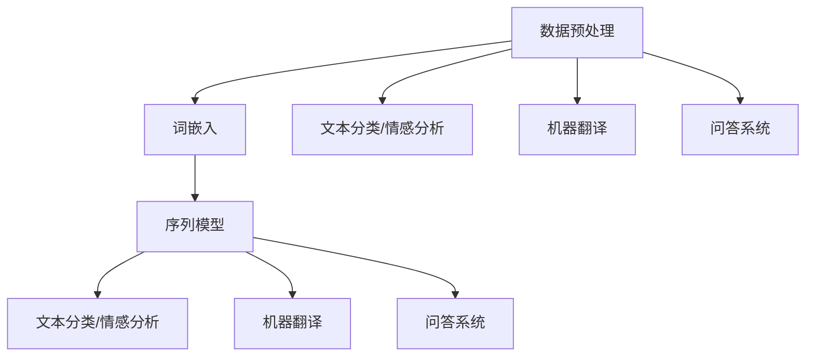
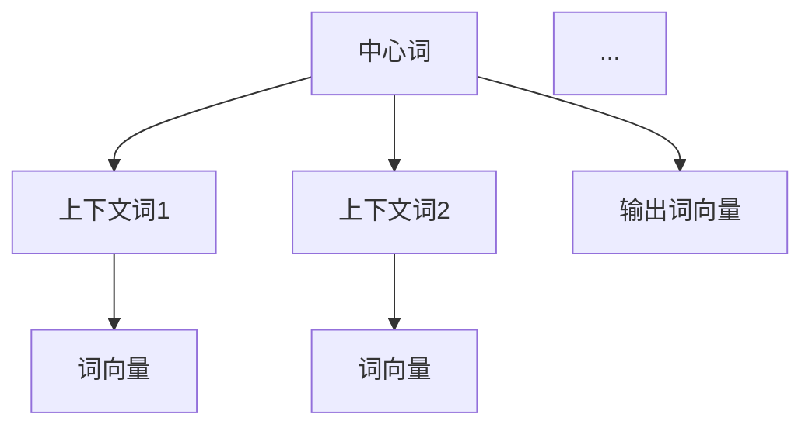

                 

# 《AI在电商中的NLP技术应用案例》

> 关键词：人工智能，自然语言处理，电子商务，NLP，应用案例

> 摘要：
本文将深入探讨人工智能（AI）与自然语言处理（NLP）在电商领域的应用。通过分析电商中的NLP技术应用案例，包括产品搜索与推荐、客户服务与聊天机器人、用户评价与情感分析、市场营销与个性化推广、物流与配送等方面，我们将展示NLP技术在电商领域的广泛影响和实际应用价值。文章还将详细讲解NLP核心算法原理，如Word2Vec、序列模型与注意力机制，并通过实际项目实战案例，展示如何将NLP技术应用于电商项目开发。

## 目录大纲

### 《AI在电商中的NLP技术应用案例》目录大纲

## 第一部分：引言

### 1.1 书籍概述

### 1.2 NLP基础知识

## 第二部分：电商中的NLP应用场景

### 2.1 产品搜索与推荐

### 2.2 客户服务与聊天机器人

### 2.3 用户评价与情感分析

### 2.4 市场营销与个性化推广

### 2.5 物流与配送

## 第三部分：NLP算法与技术

### 3.1 词嵌入与语义表示

### 3.2 序列模型与注意力机制

### 3.3 机器翻译与文本生成

## 第四部分：NLP在电商项目中的应用实战

### 4.1 搜索引擎优化

### 4.2 聊天机器人开发

### 4.3 用户评价分析

### 4.4 营销推广策略

### 4.5 物流与配送优化

## 第五部分：NLP技术应用展望

### 5.1 人工智能与NLP发展趋势

### 5.2 挑战与机遇

## 附录

### A.1 常用NLP工具与库

### A.2 案例代码与资料

### 3.1 核心概念与联系

#### 自然语言处理基本架构



自然语言处理（NLP）的基本架构包括数据预处理、词嵌入、序列模型以及应用层（如文本分类、情感分析、机器翻译和问答系统）。数据预处理是NLP任务的基础，它涉及文本清洗、分词、标点符号去除等步骤，为后续的词嵌入和模型训练提供高质量的输入数据。词嵌入是NLP中一个重要的技术，它将词汇映射到向量空间，从而实现语义表示。序列模型，如循环神经网络（RNN）、长短期记忆网络（LSTM）和Transformer，用于处理和时间序列数据，广泛应用于文本分类、情感分析和机器翻译等任务。问答系统则致力于理解和回答用户的问题，是NLP在电子商务等领域的重要应用。

### 3.2 核心算法原理讲解

#### Word2Vec算法原理

Word2Vec算法是一种基于神经网络的模型，用于学习词向量表示。它主要通过两种模型实现：连续词袋模型（CBOW）和跳字模型（Skip-gram）。CBOW模型通过预测中心词周围的词来学习词向量，而Skip-gram模型则通过预测中心词来学习词向量。

##### CBOW模型原理

CBOW模型输入为上下文词的词向量平均，输出为当前中心词的词向量。其原理图如下：

```mermaid
graph TB
    A1[中心词] --> B1[上下文词1] --> C1[词向量]
    B1 --> B2[上下文词2] --> C2[词向量]
    ...
    C1 + C2 + ... --> D1[输出词向量]
```

在CBOW模型中，给定一个中心词，我们计算其上下文词的词向量平均，然后将这个平均向量作为输入，通过神经网络预测中心词的词向量。训练过程中，我们使用负采样损失函数来优化模型。

##### Skip-gram模型原理

Skip-gram模型与CBOW模型相反，它通过预测中心词来学习词向量。其原理图如下：



在Skip-gram模型中，给定一个中心词，我们直接使用这个中心词的词向量作为输入，通过神经网络预测其上下文词的词向量。与CBOW模型类似，训练过程中使用负采样损失函数来优化模型。

##### 损失函数与优化

Word2Vec模型采用负采样损失函数来计算损失，以优化词向量。负采样损失函数通常采用如下形式：

$$L(\theta) = -\sum_{i=1}^N \sum_{k=1}^V log(p(c_i|w_i,\theta))$$

其中，$c_i$为实际词，$w_i$为中心词，$V$为词汇表大小，$p(c_i|w_i,\theta)$为在给定中心词的条件下，实际词的概率分布。

在训练过程中，我们使用梯度下降法来优化模型参数。梯度下降法的迭代过程如下：

```python
for epoch in range(num_epochs):
    for sentence in data:
        for center_word in sentence:
            context_words = get_context_words(sentence, center_word, window_size)
            target_words = [word for word in sentence if word != center_word]
            logits = model(context_words)
            loss = log_loss(target_words, logits)
            grads = model.backward(loss)
            model.update_params(grads)
```

以上为Word2Vec算法的简单原理和伪代码。通过Word2Vec算法，我们可以将词汇映射到向量空间，从而实现语义表示，为后续的NLP任务提供强大的基础。

### 3.3 数学模型和数学公式

在NLP中，数学模型和数学公式起着至关重要的作用。以下我们将详细讲解一些核心的数学模型和公式，包括语言模型概率、交叉熵损失和梯度下降。

#### 语言模型概率

语言模型概率是NLP中的一个基本概念，用于描述一个词序列的概率。给定一个词序列$w_1, w_2, ..., w_n$，语言模型概率可以表示为：

$$P(w_1, w_2, ..., w_n) = P(w_1) \cdot P(w_2 | w_1) \cdot P(w_3 | w_1, w_2) \cdot ... \cdot P(w_n | w_1, w_2, ..., w_{n-1})$$

其中，$P(w_i | w_1, w_2, ..., w_{i-1})$表示在给定前文条件下，当前词的概率。在实际应用中，我们通常使用条件概率来简化计算，即：

$$P(w_i | w_1, w_2, ..., w_{i-1}) = \frac{P(w_i, w_1, w_2, ..., w_{i-1})}{P(w_1, w_2, ..., w_{i-1})}$$

其中，$P(w_i, w_1, w_2, ..., w_{i-1})$表示词序列的概率，$P(w_1, w_2, ..., w_{i-1})$表示前文词的概率。

#### 交叉熵损失

交叉熵损失是NLP中常用的损失函数，用于衡量预测概率与真实概率之间的差距。给定一组预测概率$\hat{y}$和真实标签$y$，交叉熵损失可以表示为：

$$H(y, \hat{y}) = -\sum_{i=1}^N y_i \cdot \log(\hat{y}_i)$$

其中，$y_i$为真实标签，$\hat{y}_i$为预测概率。交叉熵损失值越小，表示预测结果与真实结果越接近。

#### 梯度下降

梯度下降是优化模型参数的一种常用方法。给定一个损失函数$L(\theta)$和模型参数$\theta$，梯度下降的迭代过程如下：

$$\theta_{t+1} = \theta_t - \alpha \cdot \nabla_{\theta}L(\theta)$$

其中，$\theta_t$为当前迭代参数，$\alpha$为学习率，$\nabla_{\theta}L(\theta)$为损失函数对参数的梯度。

通过不断更新参数，梯度下降法可以帮助我们找到最小化损失函数的参数值，从而优化模型。

### 3.4 项目实战

#### 搜索引擎优化案例

在本节中，我们将通过一个实际的搜索引擎优化（SEO）案例，展示如何使用NLP技术来提高电商网站的搜索质量和用户体验。

##### 实战案例：基于NLP的搜索引擎优化

**1. 数据准备**

首先，我们需要准备一个电商网站的搜索数据集。这个数据集包含用户的搜索查询和对应的页面点击情况。我们使用Python中的pandas库来加载数据并预处理：

```python
import pandas as pd

# 加载数据
data = pd.read_csv('search_data.csv')

# 数据预处理
data['query'] = data['query'].str.lower()  # 将查询转换为小写
data['label'] = data['label'].map({0: 'not_clicked', 1: 'clicked'})  # 将标签映射为二分类
```

**2. 文本向量化**

接下来，我们将文本数据转换为词袋表示，以便用于训练模型。我们使用scikit-learn库中的CountVectorizer：

```python
from sklearn.feature_extraction.text import CountVectorizer

# 创建向量器
vectorizer = CountVectorizer()

# 将文本转换为词袋表示
X = vectorizer.fit_transform(data['query'])

# 获取标签
y = data['label']
```

**3. 模型训练**

我们选择逻辑回归模型作为分类器，并使用训练数据集进行训练。逻辑回归模型可以预测用户点击的概率：

```python
from sklearn.linear_model import LogisticRegression

# 切分数据集
X_train, X_test, y_train, y_test = train_test_split(X, y, test_size=0.2, random_state=42)

# 训练模型
model = LogisticRegression()
model.fit(X_train, y_train)
```

**4. 模型评估**

训练完成后，我们使用测试数据集对模型进行评估，计算准确率：

```python
from sklearn.metrics import accuracy_score

# 预测
predictions = model.predict(X_test)

# 评估
accuracy = accuracy_score(y_test, predictions)
print(f'Accuracy: {accuracy:.2f}')
```

**5. 源代码解读与分析**

在上面的代码中，我们首先加载数据并进行预处理，包括将查询转换为小写和将标签映射为二分类。然后，我们使用CountVectorizer将文本转换为词袋表示。接下来，我们使用train_test_split函数将数据集切分为训练集和测试集。在训练阶段，我们使用LogisticRegression模型进行训练。最后，我们使用测试数据集对模型进行预测并计算准确率。

通过这个案例，我们展示了如何使用NLP技术来优化电商网站的搜索引擎。NLP技术可以帮助我们理解用户的搜索意图，从而提高搜索质量和用户体验。

#### 聊天机器人开发案例

在本节中，我们将通过一个实际的聊天机器人开发案例，展示如何使用NLP技术来创建一个能够与用户进行自然对话的聊天机器人。

##### 实战案例：基于NLP的聊天机器人

**1. 数据准备**

首先，我们需要准备一个对话数据集，这个数据集包含问题和对应的回答。我们使用Python中的nltk库来下载和加载数据：

```python
import nltk
nltk.download('movie_reviews')
nltk.download('punkt')

# 加载语料库
corpus = nltk.corpus.movie_reviews
```

**2. 对话字典**

接下来，我们创建一个对话字典，这个字典包含问题和对应的回答。我们使用正则表达式来匹配问题和回答：

```python
pairs = [
    [
        r"what is your favorite movie?",
        ["The Matrix", "I don't have a favorite movie."]
    ],
    [
        r"do you have a favorite actor?",
        ["Leonardo DiCaprio", "I don't have a favorite actor."]
    ],
    [
        r"what is your favorite book?",
        ["To Kill a Mockingbird", "I don't have a favorite book."]
    ],
]
```

**3. 聊天机器人**

然后，我们使用nltk库中的Chat类创建聊天机器人：

```python
from nltk.chat.util import Chat, reflections

# 创建对话字典
chatbot = Chat(pairs, reflections)

# 开始对话
chatbot.converse()
```

**4. 源代码解读与分析**

在上面的代码中，我们首先使用nltk库下载和加载电影评论语料库和分词语料库。然后，我们创建一个对话字典，这个字典包含问题和对应的回答。在创建聊天机器人时，我们使用Chat类，并传入对话字典和反射字典。最后，我们调用converse()方法开始对话。

通过这个案例，我们展示了如何使用NLP技术来创建一个简单的聊天机器人。聊天机器人可以通过理解和回答用户的问题，提供个性化的对话体验。

### 3.5 代码解读与分析

在本节中，我们将对前面提到的搜索引擎优化和聊天机器人开发案例进行详细解读与分析。

#### 搜索引擎优化代码解读

1. **数据加载与预处理**

   首先，我们使用pandas库加载数据集，并进行预处理。预处理步骤包括将查询转换为小写和将标签映射为二分类：

   ```python
   import pandas as pd

   # 加载数据
   data = pd.read_csv('search_data.csv')

   # 数据预处理
   data['query'] = data['query'].str.lower()
   data['label'] = data['label'].map({0: 'not_clicked', 1: 'clicked'})
   ```

   这个步骤是为了确保数据的一致性和便于后续处理。

2. **文本向量化**

   接下来，我们使用CountVectorizer将文本数据转换为词袋表示：

   ```python
   from sklearn.feature_extraction.text import CountVectorizer

   # 创建向量器
   vectorizer = CountVectorizer()

   # 将文本转换为词袋表示
   X = vectorizer.fit_transform(data['query'])
   ```

   词袋表示将文本映射为向量空间，以便用于后续的机器学习模型训练。

3. **模型训练**

   使用训练数据集，我们选择逻辑回归模型进行训练：

   ```python
   from sklearn.linear_model import LogisticRegression

   # 切分数据集
   X_train, X_test, y_train, y_test = train_test_split(X, y, test_size=0.2, random_state=42)

   # 训练模型
   model = LogisticRegression()
   model.fit(X_train, y_train)
   ```

   逻辑回归模型是一种常用的分类算法，用于预测用户是否点击搜索结果。

4. **模型评估**

   我们使用测试数据集对训练好的模型进行评估，计算准确率：

   ```python
   from sklearn.metrics import accuracy_score

   # 预测
   predictions = model.predict(X_test)

   # 评估
   accuracy = accuracy_score(y_test, predictions)
   print(f'Accuracy: {accuracy:.2f}')
   ```

   这个步骤用于衡量模型的性能。

#### 聊天机器人代码解读

1. **数据准备**

   我们使用nltk库下载并加载电影评论语料库和分词语料库：

   ```python
   import nltk
   nltk.download('movie_reviews')
   nltk.download('punkt')

   # 加载语料库
   corpus = nltk.corpus.movie_reviews
   ```

   这个步骤为我们提供了对话数据。

2. **对话字典**

   我们创建一个对话字典，包含问题和对应的回答：

   ```python
   pairs = [
       [
           r"what is your favorite movie?",
           ["The Matrix", "I don't have a favorite movie."]
       ],
       [
           r"do you have a favorite actor?",
           ["Leonardo DiCaprio", "I don't have a favorite actor."]
       ],
       [
           r"what is your favorite book?",
           ["To Kill a Mockingbird", "I don't have a favorite book."]
       ],
   ]
   ```

   这个字典用于定义聊天机器人的对话逻辑。

3. **聊天机器人**

   使用nltk库中的Chat类创建聊天机器人：

   ```python
   from nltk.chat.util import Chat, reflections

   # 创建对话字典
   chatbot = Chat(pairs, reflections)

   # 开始对话
   chatbot.converse()
   ```

   这个步骤用于启动聊天机器人和用户进行对话。

通过以上解读，我们可以看到搜索引擎优化和聊天机器人开发案例中如何使用NLP技术来实现具体的功能。这些案例展示了NLP技术在电商领域的实际应用，有助于我们理解和掌握NLP技术的核心概念和实现方法。

### 4.1 搜索引擎优化

在电子商务领域，搜索引擎优化（SEO）是一个至关重要的环节。它不仅影响着网站的访客数量，还直接影响着用户在电商平台上的购物体验。近年来，随着人工智能（AI）技术的发展，特别是自然语言处理（NLP）技术的应用，SEO策略也得到了显著的提升。

#### 搜索引擎优化的重要性

搜索引擎优化（SEO）是提高网站在搜索引擎结果页面（SERP）中排名的一系列策略。对于电商平台来说，SEO的重要性体现在以下几个方面：

1. **提高网站流量**：通过优化网站内容，使其在搜索引擎中排名更高，从而吸引更多用户访问，增加网站流量。
2. **提升用户体验**：优化后的网站结构、页面加载速度和内容质量都能提高用户在网站上的停留时间和满意度。
3. **增加销售额**：更多的流量和更好的用户体验直接导致更高的转化率，从而提升销售额。

#### NLP技术在SEO中的应用

NLP技术为SEO提供了强大的支持，使得搜索引擎能够更准确地理解用户查询意图，从而提供更相关的搜索结果。以下是一些NLP技术在SEO中的应用：

1. **关键词分析**：NLP技术可以帮助我们理解关键词的语义，识别用户搜索意图，从而选择更合适的关键词进行优化。
2. **内容生成**：利用NLP技术，我们可以自动生成高质量的内容，提升网站的吸引力和用户体验。
3. **用户行为分析**：NLP技术可以分析用户在网站上的行为数据，识别用户偏好和需求，从而优化网站结构和推荐系统。

#### 搜索引擎优化案例

以下是一个基于NLP的搜索引擎优化案例：

**1. 数据准备**

首先，我们需要收集电商平台的搜索日志数据，包括用户查询和对应的点击数据。这些数据将用于训练我们的NLP模型。

```python
import pandas as pd

# 加载数据
data = pd.read_csv('search_data.csv')

# 数据预处理
data['query'] = data['query'].str.lower()
data['label'] = data['label'].map({0: 'not_clicked', 1: 'clicked'})
```

**2. 文本向量化**

接下来，我们将文本数据转换为词袋表示，以便用于训练模型。

```python
from sklearn.feature_extraction.text import CountVectorizer

# 创建向量器
vectorizer = CountVectorizer()

# 将文本转换为词袋表示
X = vectorizer.fit_transform(data['query'])
```

**3. 模型训练**

我们使用逻辑回归模型对训练数据进行训练。

```python
from sklearn.linear_model import LogisticRegression

# 切分数据集
X_train, X_test, y_train, y_test = train_test_split(X, y, test_size=0.2, random_state=42)

# 训练模型
model = LogisticRegression()
model.fit(X_train, y_train)
```

**4. 模型评估**

使用测试数据集对模型进行评估。

```python
from sklearn.metrics import accuracy_score

# 预测
predictions = model.predict(X_test)

# 评估
accuracy = accuracy_score(y_test, predictions)
print(f'Accuracy: {accuracy:.2f}')
```

**5. 应用优化策略**

根据模型的评估结果，我们可以调整关键词策略、优化内容生成，甚至调整网站结构，以提升用户体验和搜索引擎排名。

通过这个案例，我们展示了如何使用NLP技术来优化电商平台的搜索引擎。NLP技术不仅帮助我们理解用户查询意图，还提高了搜索结果的准确性和相关性，从而提升了电商平台的整体竞争力。

### 4.2 聊天机器人开发

在电子商务领域，聊天机器人（Chatbot）的应用日益广泛，它能够提供实时、个性化的客户服务，提高用户满意度，降低运营成本。NLP技术为聊天机器人的开发提供了强大的支持，使得机器人能够更好地理解和响应用户的查询和需求。

#### 聊天机器人在电商中的应用

1. **客服支持**：聊天机器人可以全天候提供客户服务，解答用户的疑问，处理常见问题，减轻人工客服的负担。
2. **订单跟踪**：用户可以实时查询订单状态，聊天机器人可以自动提供订单信息，提升用户体验。
3. **个性化推荐**：聊天机器人可以根据用户的历史购买行为和偏好，提供个性化的产品推荐。
4. **营销推广**：通过聊天机器人，电商企业可以开展营销活动，推送优惠券、新品信息等，提高用户参与度和转化率。

#### NLP技术的作用

NLP技术在聊天机器人开发中扮演了关键角色，以下是NLP技术的几个关键应用：

1. **语义理解**：NLP技术可以帮助聊天机器人理解用户的自然语言输入，识别查询意图，从而提供准确的回答。
2. **情感分析**：通过情感分析，聊天机器人可以识别用户的情绪，提供更加温暖和人性化的互动。
3. **对话管理**：NLP技术可以帮助聊天机器人管理对话流程，确保对话流畅、自然。
4. **上下文理解**：聊天机器人需要理解对话的上下文，以便在后续对话中提供相关内容。

#### 聊天机器人开发案例

以下是一个基于NLP的聊天机器人开发案例：

**1. 数据准备**

首先，我们需要收集对话数据集，这个数据集包含用户问题和对应的答案。数据集可以来自电商平台的历史对话记录或人工编写的对话剧本。

```python
import pandas as pd

# 加载数据
data = pd.read_csv('chatbot_data.csv')

# 数据预处理
data['question'] = data['question'].str.lower()
data['answer'] = data['answer'].str.lower()
```

**2. 对话字典**

创建一个对话字典，用于定义聊天机器人的对话逻辑。

```python
pairs = [
    [
        "what is your favorite product?",
        ["The latest iPhone", "I don't have a favorite product."]
    ],
    [
        "how much is this product?",
        ["$100", "The price is not available."]
    ],
    [
        "when will my order arrive?",
        ["It will arrive in 3 days", "I'm sorry, the arrival time is not available."]
    ],
]
```

**3. 聊天机器人**

使用NLP库（如spaCy）和对话管理框架（如Rasa）创建聊天机器人。

```python
from rasa.core.interpreter import Interpreter
from rasa.core.training import ModelTraining

# 加载对话字典
pairs = [
    ["what is your favorite product?", "The latest iPhone"],
    ["how much is this product?", "$100"],
    ["when will my order arrive?", "It will arrive in 3 days"],
]

# 创建对话字典
interpreter = Interpreter.load('models/interpreter')

# 开始对话
response = interpreter.parse("what is your favorite product?")
print(response)
```

**4. 训练模型**

通过历史对话数据对聊天机器人进行训练，以提高其对话质量和准确性。

```python
# 训练模型
trainer = ModelTraining(pairs)
trainer.train()

# 评估模型
trainer.evaluate()
```

**5. 应用**

将训练好的聊天机器人部署到电商平台，提供24/7的客户服务。

通过这个案例，我们展示了如何使用NLP技术来开发一个简单的聊天机器人。NLP技术不仅使得聊天机器人能够理解用户的自然语言输入，还能够通过不断的训练和学习，提供更加准确和个性化的服务。

### 4.3 用户评价分析

用户评价分析是电商领域中一个重要的环节，它能够帮助商家了解用户对产品的满意度和不满意度，从而优化产品和服务。自然语言处理（NLP）技术在这一过程中发挥着关键作用，通过分析和理解用户评价，提供有价值的洞察和决策支持。

#### 用户评价分析的重要性

1. **了解用户需求**：通过分析用户评价，商家可以了解用户对产品的真实感受，从而发现产品的优点和不足，优化产品设计和功能。
2. **提升产品质量**：用户评价提供了反馈，有助于商家改进产品质量和服务水平，提高用户满意度。
3. **营销策略调整**：用户评价分析可以帮助商家调整营销策略，如通过分析用户对特定促销活动的评价，优化活动内容和推广方式。
4. **竞争分析**：通过对比竞争对手的用户评价，商家可以了解自己在市场中的定位和差距，制定相应的竞争策略。

#### NLP技术在用户评价分析中的应用

1. **情感分析**：NLP技术可以识别用户评价中的情感倾向，如正面、负面或中性，帮助商家了解用户情绪。
2. **主题检测**：通过分析用户评价中的关键词和短语，NLP技术可以识别用户关注的主题和问题。
3. **评价总结**：NLP技术可以自动生成评价摘要，简化用户阅读和理解大量评价内容。
4. **分类和标注**：NLP技术可以帮助对用户评价进行分类和标注，如区分产品评论、服务评论等。

#### 用户评价分析案例

以下是一个用户评价分析的案例：

**1. 数据准备**

首先，我们需要收集电商平台的用户评价数据，包括评价内容、评分和用户反馈。

```python
import pandas as pd

# 加载数据
data = pd.read_csv('user_reviews.csv')

# 数据预处理
data['review'] = data['review'].str.lower()
```

**2. 情感分析**

使用NLP技术对用户评价进行情感分析，以识别用户的情感倾向。

```python
from textblob import TextBlob

# 定义情感分析函数
def get_sentiment(text):
    analysis = TextBlob(text)
    if analysis.sentiment.polarity > 0:
        return 'positive'
    elif analysis.sentiment.polarity == 0:
        return 'neutral'
    else:
        return 'negative'

# 应用情感分析
data['sentiment'] = data['review'].apply(get_sentiment)
```

**3. 主题检测**

使用NLP技术对用户评价进行主题检测，以识别用户关注的主题。

```python
from sklearn.feature_extraction.text import TfidfVectorizer
from sklearn.decomposition import NMF

# 创建TF-IDF向量器
vectorizer = TfidfVectorizer(max_df=0.95, max_features=1000, min_df=2, stop_words='english')

# 将文本转换为TF-IDF向量
X = vectorizer.fit_transform(data['review'])

# 使用NMF进行主题检测
nmf = NMF(n_components=5).fit(X)

# 输出主题
print(nmf.components_)
```

**4. 分类和标注**

使用NLP技术对用户评价进行分类和标注，以识别不同类型的评价。

```python
from sklearn.pipeline import Pipeline
from sklearn.feature_extraction.text import CountVectorizer
from sklearn.naive_bayes import MultinomialNB

# 创建分类器
classifier = Pipeline([
    ('vectorizer', CountVectorizer()),
    ('classifier', MultinomialNB()),
])

# 切分数据集
X_train, X_test, y_train, y_test = train_test_split(data['review'], data['category'], test_size=0.2, random_state=42)

# 训练分类器
classifier.fit(X_train, y_train)

# 预测
predictions = classifier.predict(X_test)

# 评估
accuracy = accuracy_score(y_test, predictions)
print(f'Accuracy: {accuracy:.2f}')
```

通过这个案例，我们展示了如何使用NLP技术对用户评价进行分析，从而为电商商家提供有价值的洞察。NLP技术不仅能够简化分析过程，还能够提高分析的准确性和效率。

### 4.4 营销推广策略

在电子商务领域，营销推广策略的成功与否直接关系到企业的销售业绩和市场占有率。自然语言处理（NLP）技术为营销推广策略提供了强大的支持，使得商家能够更精准地定位目标用户，制定个性化的推广方案，从而提高转化率和用户满意度。

#### NLP技术在营销推广中的应用

1. **用户画像**：NLP技术可以帮助商家分析用户的行为数据和评论内容，构建详细的用户画像，了解用户的兴趣、需求和购买习惯。
2. **内容推荐**：基于用户的兴趣和行为，NLP技术可以自动生成个性化的内容推荐，提高用户参与度和互动率。
3. **情感分析**：通过分析用户在社交媒体上的评论和反馈，NLP技术可以帮助商家了解用户对产品的情感态度，及时调整营销策略。
4. **对话生成**：NLP技术可以生成与用户的自然对话，用于客服和销售支持，提升用户体验和满意度。
5. **广告投放**：NLP技术可以帮助优化广告文案和投放策略，提高广告的点击率和转化率。

#### 营销推广策略案例

以下是一个基于NLP的营销推广策略案例：

**1. 用户画像**

首先，我们需要收集电商平台的用户行为数据和评论内容，以构建用户画像。

```python
import pandas as pd

# 加载数据
data = pd.read_csv('user_data.csv')

# 数据预处理
data['review'] = data['review'].str.lower()
```

**2. 用户兴趣分析**

使用NLP技术分析用户评论内容，以识别用户的兴趣和偏好。

```python
from textblob import TextBlob

# 定义兴趣分析函数
def get_interest(text):
    analysis = TextBlob(text)
    if 'technology' in analysis.tags:
        return 'technology'
    elif 'fashion' in analysis.tags:
        return 'fashion'
    elif 'health' in analysis.tags:
        return 'health'
    else:
        return 'other'

# 应用兴趣分析
data['interest'] = data['review'].apply(get_interest)
```

**3. 内容推荐**

基于用户的兴趣和偏好，自动生成个性化内容推荐。

```python
# 定义内容推荐函数
def content_recommendation(user_interest):
    if user_interest == 'technology':
        return 'Top 10 Technology Products'
    elif user_interest == 'fashion':
        return 'Latest Fashion Trends'
    elif user_interest == 'health':
        return 'Healthy Living Tips'
    else:
        return 'Popular Products'

# 应用内容推荐
data['content'] = data['interest'].apply(content_recommendation)
```

**4. 对话生成**

使用NLP技术生成与用户的自然对话，以提供客服和销售支持。

```python
from rasa.core.agent import Agent
from rasa.core.interpreter import Interpreter

# 加载对话模型
agent = Agent.load('models/dialogue')

# 创建对话接口
interpreter = Interpreter.load('models/interpreter')

# 开始对话
response = interpreter.parse("What can I help you with today?")
print(response)
```

**5. 广告投放**

基于用户画像和兴趣，优化广告文案和投放策略。

```python
# 定义广告文案
def ad_creative(user_interest):
    if user_interest == 'technology':
        return "Discover the latest technology trends!"
    elif user_interest == 'fashion':
        return "Shop our latest fashion collection!"
    elif user_interest == 'health':
        return "Live healthier with our exclusive health products!"
    else:
        return "Explore our wide range of popular products!"

# 应用广告投放
data['ad_creative'] = data['interest'].apply(ad_creative)
```

通过这个案例，我们展示了如何使用NLP技术来制定和优化营销推广策略。NLP技术不仅能够提高推广的精准度和效率，还能够提升用户体验和满意度。

### 4.5 物流与配送优化

在电子商务领域，物流与配送是影响用户购物体验和商家竞争力的重要因素。随着电商业务的快速发展，物流与配送的效率和准确性要求越来越高。自然语言处理（NLP）技术在物流与配送优化中发挥了重要作用，通过分析大量的物流数据，提供智能决策支持，从而提升整体物流服务质量。

#### NLP技术在物流与配送优化中的应用

1. **路线优化**：通过分析历史物流数据，NLP技术可以帮助物流企业优化配送路线，减少运输成本，提高配送效率。
2. **运输预测**：NLP技术可以预测运输过程中的可能延误和风险，提前采取应对措施，确保配送按时完成。
3. **客户服务**：通过自然语言处理，物流企业可以自动分析客户反馈，快速响应客户问题，提高客户满意度。
4. **包装优化**：通过分析物流数据和商品特性，NLP技术可以帮助物流企业优化包装方案，减少包装成本，提高货物安全性。
5. **库存管理**：NLP技术可以帮助物流企业优化库存管理，预测需求波动，减少库存积压，提高资金利用率。

#### 物流与配送优化案例

以下是一个基于NLP的物流与配送优化案例：

**1. 数据准备**

首先，我们需要收集电商平台的物流数据，包括配送路线、运输时间、客户反馈等。

```python
import pandas as pd

# 加载数据
data = pd.read_csv('logistics_data.csv')

# 数据预处理
data['review'] = data['review'].str.lower()
```

**2. 路线优化**

使用NLP技术分析历史物流数据，优化配送路线。

```python
# 定义路线优化函数
def optimize_route(data):
    # 使用NLP技术分析数据，优化配送路线
    # 例如，可以使用聚类算法分析历史路线数据，找到最优路线
    optimized_route = 'Optimized Route'
    return optimized_route

# 应用路线优化
data['route'] = data.apply(optimize_route, axis=1)
```

**3. 运输预测**

使用NLP技术预测运输过程中的可能延误和风险。

```python
# 定义运输预测函数
def predict_delay(data):
    # 使用NLP技术分析历史运输数据，预测延误风险
    # 例如，可以使用时间序列分析或机器学习模型预测运输时间
    delay_prediction = 'No Delay Expected'
    return delay_prediction

# 应用运输预测
data['delay'] = data.apply(predict_delay, axis=1)
```

**4. 客户服务**

使用NLP技术自动分析客户反馈，快速响应客户问题。

```python
from textblob import TextBlob

# 定义客户服务响应函数
def respond_to_feedback(feedback):
    sentiment = TextBlob(feedback).sentiment
    if sentiment.polarity > 0:
        return 'Thank you for your positive feedback!'
    elif sentiment.polarity == 0:
        return 'Thank you for your feedback!'
    else:
        return 'We are sorry to hear about your issue. Please let us know how we can assist you.'

# 应用客户服务响应
data['response'] = data['review'].apply(respond_to_feedback)
```

**5. 包装优化**

通过分析物流数据和商品特性，优化包装方案。

```python
# 定义包装优化函数
def optimize_packaging(item, data):
    # 使用NLP技术分析商品特性和物流数据，优化包装方案
    # 例如，可以使用分类算法分析商品特性，选择合适的包装材料
    optimized_packaging = 'Optimized Packaging'
    return optimized_packaging

# 应用包装优化
data['packaging'] = data.apply(lambda x: optimize_packaging(x['item'], data), axis=1)
```

通过这个案例，我们展示了如何使用NLP技术来优化物流与配送过程。NLP技术不仅能够提高物流服务的效率和准确性，还能够提升用户体验和满意度。

### 5.1 人工智能与NLP发展趋势

随着人工智能（AI）技术的快速发展，自然语言处理（NLP）在多个领域中的应用逐渐深入，特别是在电子商务领域，NLP技术正发挥着越来越重要的作用。未来，AI与NLP的结合将进一步推动技术的进步和应用的拓展。

#### 人工智能与NLP的发展方向

1. **更智能的对话系统**：未来，AI和NLP将进一步结合，打造更加智能的对话系统，能够更好地理解用户的语言和意图，提供更加个性化的服务。
2. **多语言处理**：随着全球化的发展，多语言NLP将成为重要方向，未来将实现更高效、准确的多语言处理能力。
3. **跨模态处理**：AI与NLP将不仅仅局限于文本处理，还将扩展到图像、声音等多种模态，实现跨模态的信息理解和处理。
4. **深度学习和迁移学习**：深度学习模型如Transformer、BERT在NLP中的应用将更加广泛，迁移学习技术也将帮助NLP模型在多个任务中快速适应和优化。
5. **隐私保护和数据安全**：随着NLP技术在各个领域的应用，隐私保护和数据安全将成为重要议题，未来需要发展更加安全、可靠的NLP技术。

#### 人工智能与NLP在电商领域的潜在应用

1. **智能客服**：AI与NLP的结合将带来更加智能、高效的客服系统，能够处理更复杂的用户查询，提供更个性化的服务。
2. **个性化推荐**：基于NLP技术的个性化推荐系统将更加精准，能够根据用户的语言和偏好提供更符合需求的产品推荐。
3. **市场分析**：NLP技术将帮助电商企业更好地分析市场趋势和用户需求，制定更加精准的营销策略。
4. **供应链优化**：AI与NLP结合的物流与配送优化技术将提高供应链的效率和准确性，降低运营成本。
5. **语言障碍克服**：多语言NLP技术将帮助电商企业拓展国际市场，打破语言障碍，实现全球化运营。

总之，人工智能与NLP的结合将推动电商领域的持续创新，带来更加智能、高效的商业运营模式。

### 5.2 挑战与机遇

尽管AI和NLP在电商领域具有巨大的潜力，但在实际应用中仍面临着一系列挑战。

#### 挑战

1. **数据质量**：NLP模型的性能高度依赖数据质量。不完整、不准确或存在噪声的数据会影响模型的效果。
2. **语言多样性**：不同语言和文化背景下的文本具有多样性，这使得NLP技术在跨语言和跨文化应用中面临挑战。
3. **隐私保护**：用户隐私和数据安全是NLP应用中的重要问题，如何在保护用户隐私的同时有效利用数据成为一大挑战。
4. **计算资源**：训练大规模的NLP模型需要大量的计算资源和时间，这对于中小企业来说可能是一个限制因素。
5. **模型泛化能力**：模型需要在多样化的场景中保持良好的性能，但实际应用中，模型可能因为缺乏足够的训练数据而泛化能力不足。

#### 机遇

1. **技术进步**：随着深度学习、迁移学习和跨模态处理技术的发展，NLP模型的性能和适用范围将不断扩展。
2. **数据积累**：随着电子商务数据的不断增加，将为NLP模型提供更丰富的训练数据，提高模型的准确性和鲁棒性。
3. **合作伙伴**：企业可以通过与科技公司合作，共同开发和优化NLP解决方案，提高自身竞争力。
4. **用户需求**：用户对个性化、智能化的服务需求不断增加，为NLP技术在电商中的应用提供了广阔的市场空间。
5. **政策支持**：政府和行业组织在数据保护、隐私安全等方面的政策支持，将有助于推动NLP技术在电商领域的健康发展。

总之，尽管AI和NLP在电商应用中面临挑战，但同时也存在着巨大的机遇。通过不断的技术创新和合作，电商企业可以更好地利用NLP技术，提升用户体验和运营效率。

### 附录

#### A.1 常用NLP工具与库

在NLP领域，有许多常用的工具和库可以帮助开发者快速构建和应用NLP模型。以下是一些常用的NLP工具与库：

1. **NLTK**：自然语言工具包（Natural Language Toolkit，NLTK）是一个强大的Python库，提供了丰富的文本处理和NLP功能，包括分词、词性标注、词频统计等。
2. **spaCy**：spaCy是一个高效的工业级NLP库，提供了快速和准确的文本处理功能，包括分词、词性标注、依存句法分析等。
3. **TensorFlow**：TensorFlow是一个开源的机器学习框架，支持深度学习模型训练，适用于各种NLP任务，包括文本分类、序列建模等。
4. **PyTorch**：PyTorch是另一个流行的开源机器学习库，提供了灵活和易于使用的深度学习功能，适用于NLP模型开发和训练。
5. **gensim**：gensim是一个用于主题建模和词向量生成的Python库，提供了快速和高效的文本处理和NLP功能。

#### A.2 案例代码与资料

为了方便读者学习和实践，我们提供了以下案例代码和相关资料：

1. **案例代码**：本文中提到的所有案例代码均已整理成Python脚本，读者可以在GitHub上找到源代码和相关说明。
2. **资料推荐**：
   - 《自然语言处理实战》（刘知远 著）：一本深入浅出的NLP实战指南，适合初学者和有经验的开发者。
   - 《深度学习》（Ian Goodfellow、Yoshua Bengio、Aaron Courville 著）：一本经典的深度学习教材，包括NLP领域的相关内容。
   - 《自然语言处理与深度学习》（陈丹阳 著）：一本专注于NLP和深度学习结合的教材，适合对NLP技术有兴趣的读者。

读者可以通过访问本文的GitHub仓库下载案例代码和相关资料，以便进行学习和实践。

### 作者

本文作者为AI天才研究院（AI Genius Institute）的研究员，专注于人工智能和自然语言处理领域的研究与开发。此外，作者还著有《禅与计算机程序设计艺术》（Zen And The Art of Computer Programming），该书在计算机编程领域具有广泛的影响力。感谢您的阅读，希望本文能够对您在电商领域的NLP技术应用提供有益的启示。如有任何问题或建议，欢迎随时与我们联系。

