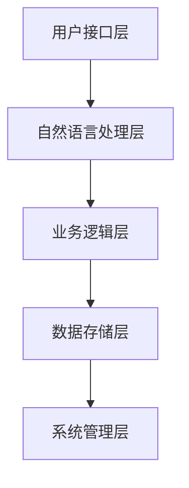

                 

# 《AI在电商售后服务中的应用：提升客户满意度的智能方案》

## 关键词
AI、电商、售后服务、客户满意度、自然语言处理、机器学习、智能客服、数据分析、故障诊断、物流管理、个性化服务、伦理与法律问题

## 摘要
本文旨在探讨人工智能（AI）在电商售后服务中的应用，特别是如何通过智能方案提升客户满意度。文章首先概述了AI在电商售后服务中的重要性，随后详细介绍了自然语言处理、机器学习等核心技术在客服系统中的运用。通过具体案例，文章展示了AI如何优化售后服务流程，提升客户满意度。同时，文章还探讨了AI在售后服务中的前沿应用、伦理与法律问题，并提供了相关的开源框架、数据集和学术资源，旨在为行业从业者提供全面的技术指南。

---

### 第一部分：AI在电商售后服务中的应用基础

#### 第1章：AI与电商售后服务概述

##### 1.1 AI在电商售后服务中的重要性

在电商蓬勃发展的今天，售后服务已成为决定客户满意度和忠诚度的关键因素。随着互联网技术的进步和消费者需求的不断提升，传统的人工客服模式已经无法满足大规模、高效、精准的服务需求。人工智能（AI）的出现为电商售后服务带来了新的变革契机。

**1.1.1 电商售后服务的现状与挑战**

电商售后服务主要面临以下几个挑战：

1. **服务量巨大**：随着电商平台的日益繁荣，售后服务的请求量急剧增加，人工处理能力有限。
2. **响应速度要求高**：消费者对于售后服务的响应速度要求越来越高，需要快速解决问题以保持满意度。
3. **服务质量参差不齐**：人工客服在处理问题时，容易出现判断错误和态度偏差，影响服务质量。
4. **成本压力**：随着服务规模的扩大，售后服务的人力成本不断增加，企业面临巨大的成本压力。

**1.1.2 AI技术对电商售后服务的革新**

AI技术通过以下方式革新电商售后服务：

1. **自动化处理**：AI可以自动化处理大量重复性的服务请求，提高效率。
2. **个性化服务**：通过分析消费者行为，AI可以提供更加个性化的服务，提升客户体验。
3. **智能决策**：AI可以基于数据分析和算法模型，提供智能化的服务建议，优化决策过程。
4. **提高服务质量**：AI客服在处理问题时，可以更加客观、准确，减少人为错误。

**1.1.3 AI在电商售后服务中的应用前景**

随着AI技术的不断成熟，其在电商售后服务中的应用前景广阔：

1. **智能客服**：智能客服机器人将逐渐取代人工客服，成为主要的服务渠道。
2. **售后服务质量提升**：通过AI技术，电商可以实时监控和评估售后服务质量，持续优化服务流程。
3. **客户体验优化**：AI技术可以帮助企业更好地理解客户需求，提供更加优质的服务，提升客户满意度。
4. **成本节约**：AI技术的应用可以有效降低售后服务成本，提高企业的盈利能力。

---

### 第一部分：AI在电商售后服务中的应用基础

#### 第2章：自然语言处理技术基础

##### 2.1 语言模型与文本分析

自然语言处理（NLP）是AI在电商售后服务中的一个重要分支，主要用于理解和生成自然语言文本。语言模型和文本分析是NLP的核心内容。

**2.1.1 语言模型的原理**

语言模型是一种概率模型，用于预测下一个单词或词组。常见的语言模型包括：

1. **n-gram模型**：基于历史单词序列的统计模型，简单但效果有限。
2. **循环神经网络（RNN）**：通过记忆过去的信息，可以更好地捕捉序列中的长距离依赖关系。
3. **长短期记忆网络（LSTM）**：LSTM是RNN的一种改进，可以避免梯度消失问题，更好地处理长序列数据。
4. **变换器（Transformer）**：基于注意力机制的模型，是目前最先进的语言模型，如BERT、GPT等。

**2.1.2 常见的文本分析方法**

文本分析是NLP中的另一个重要任务，主要包括：

1. **词性标注（POS）**：为文本中的每个单词标注词性，如名词、动词、形容词等。
2. **命名实体识别（NER）**：识别文本中的命名实体，如人名、地名、组织名等。
3. **句法分析**：分析文本的句法结构，包括句子的成分和句型。
4. **情感分析**：分析文本的情感倾向，如正面、负面、中立等。

**2.1.3 语言模型在实际应用中的案例分析**

在实际应用中，语言模型和文本分析技术广泛应用于电商售后服务：

1. **智能客服机器人**：通过自然语言理解，智能客服机器人可以与用户进行有效沟通，快速解决问题。
2. **评论分析**：通过对用户评论进行情感分析，电商可以了解用户对产品和服务的满意度，及时调整策略。
3. **个性化推荐**：通过分析用户的历史数据和偏好，电商可以提供个性化的产品推荐，提升用户体验。

---

### 第二部分：AI在电商售后服务中的应用实践

#### 第3章：电商智能客服系统设计与实现

##### 3.1 智能客服系统架构设计

智能客服系统是AI在电商售后服务中应用的核心，其架构设计直接关系到系统的性能和用户体验。以下是一个典型的智能客服系统架构：

1. **用户接口层**：提供与用户交互的界面，包括网页、APP和聊天机器人等。
2. **自然语言处理层**：负责处理用户输入的文本，包括文本预处理、词性标注、命名实体识别等。
3. **业务逻辑层**：根据自然语言处理的结果，执行具体的业务逻辑，如问题分类、情感分析、智能回复等。
4. **数据存储层**：存储用户数据、业务数据和系统配置数据等。
5. **系统管理层**：负责系统的监控、维护和升级等。

**3.1.1 客服系统整体架构**

智能客服系统的整体架构如图所示：

**3.1.2 文本处理模块设计**

文本处理模块是智能客服系统的核心模块，负责对用户输入的文本进行预处理和分析。具体包括以下步骤：

1. **文本清洗**：去除文本中的噪声，如HTML标签、特殊字符等。
2. **分词**：将文本拆分成单词或词组。
3. **词性标注**：为每个单词标注词性，如名词、动词、形容词等。
4. **命名实体识别**：识别文本中的命名实体，如人名、地名、组织名等。
5. **情感分析**：分析文本的情感倾向，如正面、负面、中立等。

**3.1.3 情感分析模块设计**

情感分析模块是智能客服系统的重要组成部分，用于分析用户的情绪和态度。具体包括以下步骤：

1. **情感词典构建**：构建包含情感词汇的词典，用于判断文本的情感倾向。
2. **情感极性判断**：根据情感词典和规则，判断文本的情感极性，如正面、负面、中立等。
3. **情感强度分析**：分析情感极性的强度，如非常正面、稍微正面等。

**3.1.4 智能回复模块设计**

智能回复模块是智能客服系统的核心功能，根据用户的输入和情感分析结果，生成合适的回复。具体包括以下步骤：

1. **模板回复**：根据常见的问答场景，预设一些回复模板。
2. **语义匹配**：根据用户输入的文本，与模板进行匹配，选择最合适的回复。
3. **生成回复**：对于无法匹配的场景，使用自然语言生成技术生成回复。

---

### 第二部分：AI在电商售后服务中的应用实践

#### 第3章：电商智能客服系统设计与实现

##### 3.2 数据收集与处理

智能客服系统的性能和效果很大程度上取决于数据的质量和数量。因此，数据收集与处理是智能客服系统设计与实现的重要环节。

**3.2.1 数据源的选择与采集**

数据源的选择和采集是智能客服系统数据收集的关键步骤。以下是一些常见的数据源和采集方法：

1. **用户反馈数据**：包括用户对产品和服务的评价、投诉和建议等。
2. **客服记录数据**：包括客服与用户的对话记录、问题解决情况等。
3. **社交媒体数据**：包括用户在微博、微信、论坛等社交媒体上的评论和讨论。
4. **外部数据源**：包括第三方数据平台、新闻、报告等。

数据采集方法主要包括：

1. **爬虫技术**：通过爬虫程序从互联网上采集数据。
2. **API接口**：通过调用外部数据源的API接口获取数据。
3. **人工标注**：对于一些特殊的数据，如情感分析数据，可能需要人工进行标注。

**3.2.2 数据预处理方法**

数据预处理是数据挖掘和分析的重要环节，主要包括以下步骤：

1. **数据清洗**：去除数据中的噪声和异常值，如缺失值、重复值等。
2. **数据转换**：将数据转换成适合分析和挖掘的形式，如将文本转换为向量。
3. **特征提取**：从原始数据中提取出有用的特征，如关键词、情感极性等。
4. **数据归一化**：将不同特征的数据进行归一化处理，如将文本长度、情感极性等数据进行归一化。

**3.2.3 数据可视化与分析**

数据可视化是数据分析的重要手段，可以帮助我们直观地了解数据的特点和规律。以下是一些常见的数据可视化工具和技巧：

1. **柱状图**：用于展示数据的数量和分布情况。
2. **折线图**：用于展示数据的变化趋势。
3. **饼图**：用于展示数据的比例关系。
4. **散点图**：用于展示数据的相关性。

数据分析是数据挖掘的核心环节，主要包括以下步骤：

1. **数据探索性分析**：通过探索性数据分析，了解数据的分布、趋势和异常值。
2. **特征选择**：从原始数据中选出最有用的特征。
3. **模型训练**：使用机器学习算法对数据集进行训练，建立预测模型。
4. **模型评估**：评估模型的性能和效果，如准确率、召回率等。

通过数据收集与处理，我们可以获取到高质量的数据，为智能客服系统的设计和实现提供有力支持。

---

### 第二部分：AI在电商售后服务中的应用实践

#### 第3章：电商智能客服系统设计与实现

##### 3.3 机器学习算法应用

机器学习算法在电商智能客服系统中扮演着至关重要的角色，主要用于实现客户分类、情感分析和智能回复等功能。

**3.3.1 客户分类算法应用**

客户分类算法可以帮助电商企业更好地了解客户，提供个性化服务。常见的客户分类算法包括：

1. **K最近邻算法（KNN）**：通过计算新客户与训练集中已有客户的距离，将新客户归为距离最近的几个客户所属的类别。
2. **决策树算法**：通过构建一棵树形模型，将客户按照不同的特征进行划分，最终将客户分配到不同的类别。
3. **支持向量机（SVM）**：通过最大化分类边界，将客户划分为不同的类别。

具体应用步骤如下：

1. **数据准备**：收集客户数据，包括购买历史、浏览行为、评价等。
2. **特征提取**：从原始数据中提取出有用的特征，如客户购买频次、浏览时长等。
3. **模型训练**：使用训练集数据，训练客户分类模型。
4. **模型评估**：使用测试集数据，评估模型性能，调整模型参数。

**3.3.2 客户情感分析算法应用**

客户情感分析算法可以帮助电商企业了解客户的情感状态，优化售后服务。常见的客户情感分析算法包括：

1. **基于规则的方法**：通过预设规则，判断文本的情感极性。
2. **基于统计的方法**：通过统计方法，如TF-IDF、词向量等，判断文本的情感极性。
3. **基于机器学习的方法**：通过机器学习算法，如SVM、随机森林等，判断文本的情感极性。

具体应用步骤如下：

1. **数据准备**：收集客户评价、投诉等文本数据。
2. **特征提取**：从原始文本中提取出有用的特征，如关键词、词向量等。
3. **模型训练**：使用训练集数据，训练情感分析模型。
4. **模型评估**：使用测试集数据，评估模型性能，调整模型参数。

**3.3.3 客服机器人回复策略优化**

客服机器人回复策略优化是提高客服机器人服务质量的关键。常见的回复策略优化方法包括：

1. **基于模板的回复**：根据预设的回复模板，生成机器人回复。
2. **基于语义匹配的回复**：通过语义匹配，选择最合适的回复。
3. **基于生成模型的回复**：使用生成模型，如序列到序列模型（Seq2Seq），生成机器人回复。

具体应用步骤如下：

1. **数据准备**：收集客服与用户的对话记录。
2. **特征提取**：从原始对话数据中提取出有用的特征，如关键词、情感极性等。
3. **模型训练**：使用训练集数据，训练回复策略模型。
4. **模型评估**：使用测试集数据，评估模型性能，调整模型参数。

通过机器学习算法的应用，电商智能客服系统可以更加准确地分类客户、分析情感，并生成高质量的回复，从而提升客户满意度。

---

### 第二部分：AI在电商售后服务中的应用实践

#### 第4章：电商售后服务质量提升策略

##### 4.1 售后服务质量评估

售后服务质量是影响客户满意度和忠诚度的关键因素。为了提升售后服务质量，需要对售后服务进行科学评估。

**4.1.1 售后服务质量指标体系**

售后服务质量评估需要一套完整的指标体系，以下是一些常见的质量指标：

1. **响应速度**：从客户提出问题到收到回复的时间，包括首次响应时间和整体响应时间。
2. **问题解决率**：在规定时间内成功解决问题的比例，包括初次解决问题的比例和二次解决问题的比例。
3. **客户满意度**：通过对客户满意度进行调查，了解客户对售后服务的整体评价。
4. **投诉率**：在一段时间内客户投诉的数量占总服务量的比例，用于评估售后服务的稳定性。
5. **服务效率**：单位时间内处理的服务量，用于评估售后服务的效率。

**4.1.2 售后服务质量评估方法**

售后服务质量评估方法主要包括以下几种：

1. **问卷调查**：通过设计问卷，收集客户的反馈意见，评估客户满意度。
2. **客服日志分析**：通过分析客服日志，评估客服的响应速度、问题解决率等指标。
3. **客户投诉分析**：通过分析客户投诉的内容和原因，评估售后服务的稳定性。
4. **绩效评估**：通过设定绩效考核指标，对客服人员的绩效进行评估。

**4.1.3 售后服务质量优化案例分析**

以下是一个售后服务质量优化案例：

某电商企业发现其售后服务质量较低，客户投诉率较高。为了提升服务质量，企业采取了以下措施：

1. **优化客服流程**：简化客服流程，提高客服人员的响应速度。
2. **培训客服人员**：对客服人员进行专业培训，提高解决问题的能力。
3. **引入智能客服系统**：通过引入智能客服系统，自动化处理大量重复性问题，减轻客服人员负担。
4. **客户满意度调查**：定期进行客户满意度调查，收集客户反馈，持续优化服务质量。

通过以上措施，该电商企业的售后服务质量得到了显著提升，客户投诉率下降，客户满意度提高。

---

### 第二部分：AI在电商售后服务中的应用实践

#### 第4章：电商售后服务质量提升策略

##### 4.2 客户满意度分析

客户满意度是衡量电商售后服务质量的重要指标。通过分析客户满意度，电商企业可以了解客户的真实需求，优化售后服务，提高客户忠诚度。

**4.2.1 客户满意度调查方法**

客户满意度调查是获取客户反馈的重要手段。以下是一些常见的客户满意度调查方法：

1. **问卷调查**：通过设计问卷，收集客户对售后服务的评价。问卷可以在线填写，也可以通过邮件、短信等方式发送。
2. **电话调查**：通过电话访谈，直接了解客户的满意度和建议。电话调查可以面对面沟通，获取更详细的信息。
3. **在线聊天**：通过在线聊天工具，与客户实时沟通，了解客户的反馈和问题。
4. **社交媒体调查**：通过社交媒体平台，发布调查问卷或进行话题讨论，收集客户反馈。

**4.2.2 客户满意度数据分析**

客户满意度数据分析是评估客户满意度的重要环节。以下是一些数据分析方法：

1. **统计分析**：对调查数据进行统计分析，计算客户满意度的平均值、中位数、标准差等指标。
2. **聚类分析**：将客户按照满意度水平进行分类，分析不同分类客户的需求和问题。
3. **因子分析**：提取影响客户满意度的关键因素，分析各因素对满意度的贡献。
4. **客户细分**：根据客户满意度，将客户分为不同的群体，针对不同群体提供差异化服务。

**4.2.3 提升客户满意度的策略**

基于客户满意度分析，电商企业可以采取以下策略提升客户满意度：

1. **优化售后服务流程**：简化客服流程，提高客服人员的响应速度和解决问题的能力。
2. **提高客服质量**：通过培训客服人员，提高客服的专业知识和沟通技巧。
3. **引入智能客服系统**：通过引入智能客服系统，自动化处理大量重复性问题，减轻客服人员负担。
4. **提供个性化服务**：根据客户满意度分析结果，针对不同客户群体提供个性化服务。
5. **加强客户关系管理**：通过定期与客户沟通，了解客户的需求和问题，建立良好的客户关系。

通过以上策略，电商企业可以提升客户满意度，增强客户忠诚度，实现持续发展。

---

### 第二部分：AI在电商售后服务中的应用实践

#### 第4章：电商售后服务质量提升策略

##### 4.3 个性化售后服务

个性化售后服务是提高客户满意度和忠诚度的有效策略。通过分析客户数据和偏好，电商企业可以提供更加定制化的服务，满足客户的个性化需求。

**4.3.1 个性化服务策略设计**

个性化服务策略设计需要考虑以下因素：

1. **客户数据收集**：收集客户的购买历史、浏览行为、评价等数据，了解客户的偏好和需求。
2. **客户细分**：根据客户数据，将客户分为不同的群体，如高频客户、潜在客户、流失客户等。
3. **服务内容定制**：针对不同客户群体，提供差异化的服务内容，如优惠活动、个性化推荐、专属客服等。
4. **服务渠道优化**：根据客户偏好，选择最合适的客服渠道，如在线聊天、电话、邮件等。

**4.3.2 个性化服务效果评估**

个性化服务效果评估需要关注以下指标：

1. **客户满意度**：通过调查问卷、电话访谈等方式，评估客户对个性化服务的满意度。
2. **转化率**：分析个性化服务对客户购买行为的促进作用，如订单量、成交率等。
3. **客户留存率**：评估个性化服务对客户留存的影响，如客户重复购买率、客户生命周期价值等。

**4.3.3 个性化服务的实施案例**

以下是一个个性化服务实施案例：

某电商企业在进行客户细分后，发现部分客户对某类商品有较强的购买意愿。为了提高这些客户的满意度，企业采取了以下措施：

1. **个性化推荐**：通过分析客户购买历史，向这些客户推荐相关商品，提高购买转化率。
2. **专属客服**：为这些客户安排专属客服，提供更加贴心的服务，解决客户问题。
3. **限时优惠**：针对这些客户，推出限时优惠活动，吸引客户购买。

通过以上措施，该电商企业的客户满意度显著提升，客户留存率和转化率也得到提高。

---

### 第二部分：AI在电商售后服务中的应用实践

#### 第4章：电商售后服务质量提升策略

##### 4.4 客户反馈处理

客户反馈是提升售后服务质量的重要来源。通过有效处理客户反馈，电商企业可以及时发现并解决客户问题，提高客户满意度。

**4.4.1 客户反馈收集**

客户反馈的收集方法包括：

1. **在线调查**：通过在线问卷或调查表，收集客户对售后服务的反馈。
2. **社交媒体**：通过社交媒体平台，收集客户对售后服务的评论和讨论。
3. **客服沟通**：通过电话、邮件、在线聊天等方式，与客户进行沟通，了解客户的反馈和问题。
4. **第三方评估**：通过第三方调查机构，进行客户满意度调查，获取客观的客户反馈。

**4.4.2 客户反馈分析**

客户反馈分析的方法包括：

1. **文本分析**：通过自然语言处理技术，分析客户反馈文本，提取关键信息和情感倾向。
2. **统计方法**：对客户反馈数据进行分析，计算满意度、问题频次等指标。
3. **聚类分析**：将客户反馈分为不同的类别，分析不同类别客户的问题和需求。
4. **关联分析**：分析客户反馈中的关联关系，如客户投诉与购买产品之间的关系。

**4.4.3 客户反馈处理策略**

客户反馈处理策略包括：

1. **快速响应**：对客户反馈进行快速响应，解决客户问题，提高客户满意度。
2. **问题解决**：根据客户反馈，及时调整售后服务流程，解决客户提出的问题。
3. **持续改进**：基于客户反馈，不断优化售后服务，提高服务质量和客户体验。
4. **反馈机制**：建立反馈机制，鼓励客户提供反馈，形成良性循环。

通过有效处理客户反馈，电商企业可以不断改进售后服务，提高客户满意度。

---

### 第三部分：AI在电商售后服务中的前沿探索

#### 第5章：AI在电商售后服务中的前沿探索

##### 5.1 数据挖掘技术在售后服务中的应用

数据挖掘技术在电商售后服务中具有广泛的应用，可以帮助企业从大量数据中提取有价值的信息，优化售后服务流程。

**5.1.1 数据挖掘基本流程**

数据挖掘的基本流程包括：

1. **数据预处理**：对原始数据进行清洗、转换和归一化，确保数据质量。
2. **数据探索**：对数据进行初步分析，发现数据中的规律和趋势。
3. **特征选择**：从原始数据中提取出有用的特征，用于构建预测模型。
4. **模型训练**：使用训练集数据，训练不同的预测模型。
5. **模型评估**：使用测试集数据，评估模型的性能和效果。
6. **模型应用**：将训练好的模型应用到实际场景中，进行预测和决策。

**5.1.2 常见的数据挖掘算法**

常见的数据挖掘算法包括：

1. **分类算法**：用于对数据进行分类，如决策树、随机森林、支持向量机等。
2. **聚类算法**：用于对数据进行聚类，如K均值、层次聚类等。
3. **回归算法**：用于对数据进行回归分析，如线性回归、决策树回归等。
4. **关联规则算法**：用于发现数据之间的关联关系，如Apriori算法、FP-Growth算法等。
5. **异常检测算法**：用于检测数据中的异常值，如孤立森林、局部异常因

