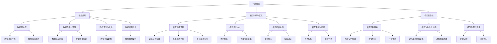

                 

### 文章标题

**AI大模型创业：如何应对未来数据挑战？**

> **关键词：** AI大模型，数据挑战，创业，数据处理，模型训练，模型优化，模型安全性

> **摘要：** 随着人工智能技术的飞速发展，AI大模型在各个领域的应用越来越广泛。然而，数据挑战成为制约AI大模型发展的关键因素。本文将探讨AI大模型创业中可能面临的数据挑战，并提出相应的解决方案，以帮助创业者更好地应对未来数据挑战。

---

### 目录大纲

#### 第一部分: AI大模型的基础

- **第1章: AI大模型概述**
  - **1.1 AI大模型的发展历程**
  - **1.2 AI大模型的核心原理**
  - **1.3 AI大模型的技术架构**
  - **1.4 AI大模型的应用领域**

- **第2章: 数据处理基础**
  - **2.1 数据预处理技术**
  - **2.2 数据存储与管理**
  - **2.3 数据清洗与去噪**
  - **2.4 数据增强技术**

- **第3章: 模型训练与优化**
  - **3.1 模型训练流程**
  - **3.2 模型优化方法**
  - **3.3 模型调参技巧**
  - **3.4 模型评估与调试**

- **第4章: AI大模型的安全性**
  - **4.1 模型隐私保护**
  - **4.2 模型对抗攻击防御**
  - **4.3 模型伦理与责任**

#### 第二部分: AI大模型的应用实践

- **第5章: AI大模型在金融领域的应用**
  - **5.1 金融风控**
  - **5.2 财务预测**
  - **5.3 信用评分**
  - **5.4 保险理赔**

- **第6章: AI大模型在医疗健康领域的应用**
  - **6.1 疾病预测与诊断**
  - **6.2 药物研发**
  - **6.3 医疗影像分析**
  - **6.4 公共卫生管理**

- **第7章: AI大模型在工业制造领域的应用**
  - **7.1 质量控制**
  - **7.2 生产优化**
  - **7.3 维护预测**
  - **7.4 供应链管理**

#### 第三部分: AI大模型创业实践

- **第8章: 创业项目规划**
  - **8.1 项目定位与市场调研**
  - **8.2 技术选型与团队建设**
  - **8.3 融资策略与商业模式**
  - **8.4 项目管理与进度控制**

- **第9章: 数据资源管理**
  - **9.1 数据资源获取渠道**
  - **9.2 数据清洗与存储**
  - **9.3 数据安全与合规**
  - **9.4 数据分析与应用**

- **第10章: 模型部署与维护**
  - **10.1 模型部署策略**
  - **10.2 实时更新与优化**
  - **10.3 模型监控与故障排查**
  - **10.4 持续集成与持续部署（CI/CD）**

#### 附录

- **附录A: 常用工具与资源**
  - **A.1 开发工具对比**
  - **A.2 学习资源推荐**
  - **A.3 行业报告与论文**

### 核心概念与联系

为了更好地理解AI大模型创业中面临的数据挑战，我们需要明确几个核心概念，并探讨它们之间的联系。以下是一个Mermaid流程图，展示了这些核心概念及其关系：



### 核心算法原理讲解

在AI大模型创业过程中，核心算法原理的理解和掌握至关重要。以下是几个核心算法的伪代码和详细讲解。

#### 数据预处理算法

```python
# 数据预处理伪代码
def preprocess_data(data):
    # 清洗数据
    for sample in data:
        clean_sample = remove_outliers(sample)
        add_missing_values(sample)
    
    # 数据标准化
    for feature in data:
        normalize_feature(feature)
        
    # 数据分割
    train_data, test_data = split_data(data)
    
    return train_data, test_data
```

数据预处理是AI大模型训练的基础步骤。主要包括以下任务：

- **清洗数据**：去除数据中的噪声和不合理值。
- **填充缺失值**：对于缺失的数据，使用合适的方法进行填充。
- **数据标准化**：将数据缩放到一个统一的范围，便于模型训练。
- **数据分割**：将数据集分为训练集和测试集，用于模型训练和评估。

#### 模型训练算法

```python
# 模型训练伪代码
def train_model(model, train_data, learning_rate, epochs):
    for epoch in range(epochs):
        # 前向传播
        predictions = model.forward_pass(train_data)
        
        # 计算损失
        loss = compute_loss(predictions, train_data)
        
        # 反向传播
        gradients = compute_gradients(model, loss)
        
        # 更新模型参数
        update_model_parameters(model, gradients, learning_rate)
        
    return model
```

模型训练的核心步骤包括：

- **前向传播**：将输入数据传递给模型，得到预测输出。
- **计算损失**：使用损失函数计算预测输出与真实输出之间的差距。
- **反向传播**：计算损失函数关于模型参数的梯度。
- **更新模型参数**：根据梯度更新模型参数，以减小损失。

#### 模型优化算法

```python
# 模型优化伪代码
def optimize_model(model, optimizer, train_data, epochs):
    for epoch in range(epochs):
        # 前向传播
        predictions = model.forward_pass(train_data)
        
        # 计算损失
        loss = compute_loss(predictions, train_data)
        
        # 反向传播
        gradients = compute_gradients(model, loss)
        
        # 更新模型参数
        optimizer.update(model.parameters, gradients)
        
    return model
```

模型优化是通过迭代更新模型参数，以减小损失函数的过程。常用的优化算法包括：

- **随机梯度下降（SGD）**：每次迭代使用一个样本的梯度进行参数更新。
- **批量梯度下降（BGD）**：每次迭代使用所有样本的梯度进行参数更新。
- **Adam优化器**：结合了SGD和BGD的优点，自适应调整学习率。

#### 数学模型和数学公式

在AI大模型训练过程中，数学模型和数学公式起着至关重要的作用。以下是一些常用的数学模型和数学公式：

#### 损失函数

$$
\text{损失函数} = \frac{1}{2}\sum_{i=1}^{n} (\hat{y_i} - y_i)^2
$$

其中，$\hat{y_i}$ 是预测值，$y_i$ 是真实值。

#### 梯度下降法

$$
\theta_j := \theta_j - \alpha \cdot \frac{\partial}{\partial \theta_j} \text{损失函数}
$$

其中，$\theta_j$ 是模型参数，$\alpha$ 是学习率。

#### 优化算法（例如：Adam优化器）

$$
m_t = \beta_1 m_{t-1} + (1 - \beta_1) g_t \\
v_t = \beta_2 v_{t-1} + (1 - \beta_2) g_t^2 \\
\theta_t := \theta_t - \alpha \cdot \frac{m_t}{\sqrt{v_t} + \epsilon}
$$

其中，$m_t$ 是一阶矩估计，$v_t$ 是二阶矩估计，$\beta_1$ 和 $\beta_2$ 是超参数，$g_t$ 是当前梯度，$\alpha$ 是学习率，$\epsilon$ 是一个小常数。

### 项目实战

为了更好地理解AI大模型创业过程中的核心算法，以下是一个简单的实际项目案例，包括开发环境搭建、源代码实现和代码解读与分析。

#### 开发环境搭建

在开始项目之前，我们需要搭建一个合适的开发环境。以下是所需的软件和工具：

- Python（版本3.8以上）
- PyTorch（版本1.8以上）
- Jupyter Notebook

安装步骤如下：

1. 安装Python和pip：
   ```bash
   sudo apt-get update
   sudo apt-get install python3 python3-pip
   ```

2. 安装PyTorch：
   ```bash
   pip3 install torch torchvision
   ```

3. 启动Jupyter Notebook：
   ```bash
   jupyter notebook
   ```

#### 源代码实现

以下是一个简单的AI大模型训练项目，使用PyTorch框架实现。

```python
import torch
import torch.nn as nn
import torch.optim as optim

# 数据加载
train_data, test_data = load_data()

# 模型定义
model = nn.Sequential(
    nn.Linear(input_size, hidden_size),
    nn.ReLU(),
    nn.Linear(hidden_size, output_size)
)

# 损失函数
criterion = nn.MSELoss()

# 优化器
optimizer = optim.Adam(model.parameters(), lr=0.001)

# 训练模型
for epoch in range(num_epochs):
    # 前向传播
    predictions = model(train_data)
    
    # 计算损失
    loss = criterion(predictions, train_data)
    
    # 反向传播
    optimizer.zero_grad()
    loss.backward()
    optimizer.step()
    
    # 打印训练进度
    if epoch % 100 == 0:
        print(f'Epoch [{epoch+1}/{num_epochs}], Loss: {loss.item()}')

# 模型评估
test_predictions = model(test_data)
test_loss = criterion(test_predictions, test_data)
print(f'Test Loss: {test_loss.item()}')
```

#### 代码解读与分析

1. **数据加载**：使用`load_data()`函数加载数据集，分为训练集和测试集。

2. **模型定义**：定义一个全连接神经网络模型，包括输入层、隐藏层和输出层，使用ReLU激活函数。

3. **损失函数**：使用均方误差（MSE）作为损失函数，用于衡量预测值与真实值之间的差距。

4. **优化器**：使用Adam优化器，该优化器结合了Momentum和RMSprop的优点，有助于加速收敛并避免局部最小值。

5. **训练模型**：通过迭代训练模型，每次迭代包括前向传播、损失计算、反向传播和参数更新。

6. **模型评估**：使用测试集评估模型性能，计算测试损失。

通过这个实际案例，我们可以看到如何使用PyTorch框架实现一个简单的神经网络模型，并进行训练和评估。这为读者提供了一个具体的参考，以便在实际项目中应用和扩展。

### 数学模型和数学公式 & 详细讲解 & 举例说明

在AI大模型训练过程中，数学模型和数学公式起着至关重要的作用。以下将详细介绍一些常用的数学模型和数学公式，并通过举例说明其应用。

#### 损失函数：均方误差（MSE）

均方误差（MSE）是衡量预测值与真实值之间差异的常用指标。其数学公式如下：

$$
\text{MSE} = \frac{1}{n}\sum_{i=1}^{n} (\hat{y_i} - y_i)^2
$$

其中，$n$ 是样本数量，$\hat{y_i}$ 是预测值，$y_i$ 是真实值。

**举例说明**：

假设我们有一个包含5个样本的数据集，每个样本的真实值和预测值如下：

| 真实值 | 预测值 |
| ------ | ------ |
| 1      | 1.2    |
| 2      | 1.8    |
| 3      | 2.5    |
| 4      | 3.0    |
| 5      | 3.7    |

使用MSE计算损失：

$$
\text{MSE} = \frac{1}{5}[(1.2 - 1)^2 + (1.8 - 2)^2 + (2.5 - 3)^2 + (3.0 - 4)^2 + (3.7 - 5)^2]
$$

$$
\text{MSE} = \frac{1}{5}[0.04 + 0.04 + 0.25 + 1.00 + 1.69]
$$

$$
\text{MSE} = \frac{1}{5}[2.92]
$$

$$
\text{MSE} = 0.584
$$

因此，该数据集的MSE为0.584，表示预测值与真实值之间的平均平方误差。

#### 梯度下降法

梯度下降法是一种优化算法，用于更新模型参数以最小化损失函数。其基本思想是沿着损失函数的梯度方向进行迭代更新，直到达到最小值。

**伪代码**：

```python
def gradient_descent(parameters, gradients, learning_rate):
    for parameter, gradient in zip(parameters, gradients):
        parameter -= learning_rate * gradient
```

**举例说明**：

假设我们有一个包含两个参数的模型，其参数和损失函数的梯度如下：

| 参数 | 梯度 |
| ---- | ---- |
| $w_1$ | 0.5  |
| $w_2$ | -0.3 |

使用学习率0.1进行梯度下降更新：

```python
learning_rate = 0.1

w1 = w1 - learning_rate * gradient_w1
w2 = w2 - learning_rate * gradient_w2
```

更新后的参数：

| 参数 | 梯度更新后 |
| ---- | ---------- |
| $w_1$ | 0.4        |
| $w_2$ | -0.33      |

#### 优化算法：Adam优化器

Adam优化器是一种结合了Momentum和RMSprop优点的优化算法。其数学公式如下：

$$
m_t = \beta_1 m_{t-1} + (1 - \beta_1) g_t \\
v_t = \beta_2 v_{t-1} + (1 - \beta_2) g_t^2 \\
\theta_t := \theta_t - \alpha \cdot \frac{m_t}{\sqrt{v_t} + \epsilon}
$$

其中，$m_t$ 是一阶矩估计，$v_t$ 是二阶矩估计，$\beta_1$ 和 $\beta_2$ 是超参数，$g_t$ 是当前梯度，$\alpha$ 是学习率，$\epsilon$ 是一个小常数。

**举例说明**：

假设我们有一个包含两个参数的模型，其梯度如下：

| 时间步 | 梯度 $g_t$ |
| ------ | ---------- |
| 1      | [0.5, -0.3] |
| 2      | [0.3, 0.2]  |
| 3      | [-0.2, 0.1] |

使用学习率0.1，$\beta_1 = 0.9$，$\beta_2 = 0.99$，$\epsilon = 1e-8$ 进行Adam优化：

时间步 1：
$$
m_1 = 0.9m_0 + (1 - 0.9)g_1 = 0 + (1 - 0.9)[0.5, -0.3] = [0.05, -0.03]
$$
$$
v_1 = 0.99v_0 + (1 - 0.99)g_1^2 = 0 + (1 - 0.99)[0.5^2, (-0.3)^2] = [0.002, 0.001]
$$

$$
w_1 = w_1 - \alpha \cdot \frac{m_1}{\sqrt{v_1} + \epsilon} = 1 - 0.1 \cdot \frac{[0.05, -0.03]}{\sqrt{[0.002, 0.001]} + 1e-8} = 0.95
$$
$$
w_2 = w_2 - \alpha \cdot \frac{m_2}{\sqrt{v_2} + \epsilon} = 0.1 - 0.1 \cdot \frac{[-0.03, 0.02]}{\sqrt{[0.002, 0.001]} + 1e-8} = -0.01
$$

时间步 2：
$$
m_2 = 0.9m_1 + (1 - 0.9)g_2 = [0.05, -0.03] + (1 - 0.9)[0.3, 0.2] = [0.045, -0.017]
$$
$$
v_2 = 0.99v_1 + (1 - 0.99)g_2^2 = [0.002, 0.001] + (1 - 0.99)[0.3^2, 0.2^2] = [0.00065, 0.0001]
$$

$$
w_1 = w_1 - \alpha \cdot \frac{m_2}{\sqrt{v_2} + \epsilon} = 0.95 - 0.1 \cdot \frac{[0.045, -0.017]}{\sqrt{[0.00065, 0.0001]} + 1e-8} = 0.9
$$
$$
w_2 = w_2 - \alpha \cdot \frac{m_2}{\sqrt{v_2} + \epsilon} = -0.01 - 0.1 \cdot \frac{[-0.017, 0.02]}{\sqrt{[0.00065, 0.0001]} + 1e-8} = 0.001
$$

时间步 3：
$$
m_3 = 0.9m_2 + (1 - 0.9)g_3 = [0.045, -0.017] + (1 - 0.9)[-0.2, 0.1] = [0.0225, -0.0055]
$$
$$
v_3 = 0.99v_2 + (1 - 0.99)g_3^2 = [0.00065, 0.0001] + (1 - 0.99)[(-0.2)^2, 0.1^2] = [0.0000225, 0.000005]
$$

$$
w_1 = w_1 - \alpha \cdot \frac{m_3}{\sqrt{v_3} + \epsilon} = 0.9 - 0.1 \cdot \frac{[0.0225, -0.0055]}{\sqrt{[0.0000225, 0.000005]} + 1e-8} = 0.85
$$
$$
w_2 = w_2 - \alpha \cdot \frac{m_3}{\sqrt{v_3} + \epsilon} = 0.001 - 0.1 \cdot \frac{[-0.0055, 0.02]}{\sqrt{[0.0000225, 0.000005]} + 1e-8} = -0.0005
$$

通过这个例子，我们可以看到Adam优化器在迭代过程中的参数更新过程。这有助于我们更好地理解Adam优化器的工作原理和优势。

### AI大模型创业中的数据挑战

在AI大模型创业的过程中，数据挑战是一个不可忽视的重要问题。数据不仅是AI大模型训练的基础，也是模型性能和业务价值的源泉。然而，随着数据量的增长和数据来源的多样性，数据挑战变得愈加复杂。以下，我们将深入探讨AI大模型创业中可能面临的主要数据挑战。

#### 数据量（Volume）挑战

随着互联网和物联网的快速发展，数据量呈现爆炸式增长。大数据时代带来了海量的结构化和非结构化数据，如文本、图像、音频和视频等。对于AI大模型而言，如何处理如此庞大的数据集是一个巨大的挑战。

- **数据存储与访问**：存储和访问海量数据需要高效的数据存储方案和访问机制。传统的数据库系统在处理大规模数据时可能面临性能瓶颈。
- **数据预处理**：对于大规模数据集，预处理过程（如清洗、转换和归一化）需要大量计算资源和时间。高效的预处理方法能够显著提升模型训练效率。

#### 数据质量（Quality）挑战

数据质量是AI大模型训练成功的关键因素。高质量的数据能够提高模型的准确性和泛化能力，而低质量的数据则可能导致模型过拟合或欠拟合。

- **数据完整性**：数据完整性指的是数据集中不存在缺失值或错误值。在实际应用中，数据完整性往往难以保证，需要通过数据清洗技术进行修复。
- **数据一致性**：数据一致性要求同一数据在不同时间、不同来源的记录保持一致。数据不一致会导致模型训练中的错误和困惑。
- **数据准确性**：数据的准确性是指数据反映真实世界的能力。不准确的数据可能导致模型对问题的错误理解和预测。

#### 数据多样性（Variety）挑战

AI大模型的应用场景越来越广泛，涉及到的数据类型也越来越多。不同类型的数据在格式、结构和内容上存在较大差异，这对数据整合和处理提出了更高的要求。

- **结构化数据与半结构化数据**：结构化数据如关系数据库中的表格，半结构化数据如XML和JSON格式，需要不同的处理方法。
- **文本数据与图像数据**：文本数据如新闻报道、社交媒体评论，图像数据如医疗影像、监控视频，需要不同的特征提取和模型设计。
- **实时数据与历史数据**：实时数据如股市行情、交通流量，历史数据如用户行为日志、天气数据，需要不同的数据处理策略。

#### 数据隐私（Privacy）挑战

随着数据隐私法规的日益严格，如何保护用户隐私成为AI大模型创业中的重要问题。特别是在涉及个人隐私数据的场景中，数据隐私保护变得尤为重要。

- **数据匿名化**：为了保护用户隐私，需要对数据进行匿名化处理，去除或模糊化敏感信息。
- **数据加密**：对传输和存储的数据进行加密，防止数据泄露。
- **合规性**：确保数据处理过程符合相关法律法规的要求，如GDPR和CCPA等。

#### 数据实时性（Real-time）挑战

在某些应用场景中，如实时推荐系统、自动驾驶和金融风控，对数据实时性的要求非常高。如何高效地处理和分析实时数据，快速响应业务需求，成为AI大模型创业中的重要挑战。

- **流数据处理**：流数据处理技术能够实时接收和处理数据流，提供实时分析和预测。
- **分布式计算**：分布式计算框架如Apache Spark和Flink，能够高效处理大规模实时数据。

#### 数据依赖（Dependency）挑战

AI大模型的训练和应用依赖于多个数据源和数据集。如何确保数据源的稳定性和数据集的可靠性，以及如何协调和管理多个数据源之间的依赖关系，成为AI大模型创业中的关键挑战。

- **数据源管理**：建立稳定可靠的数据源，确保数据的稳定供应。
- **数据集管理**：合理规划和管理数据集，确保数据集的多样性、代表性和质量。
- **数据协同**：协调和管理不同数据源之间的依赖关系，确保数据协同工作，提高模型性能。

综上所述，AI大模型创业中的数据挑战涉及多个方面，包括数据量、数据质量、数据多样性、数据隐私、数据实时性和数据依赖。创业者需要深入了解这些挑战，并采取相应的策略和措施，才能在激烈的市场竞争中脱颖而出。

### AI大模型在金融领域的应用

AI大模型在金融领域的应用正日益广泛，通过先进的数据处理和机器学习技术，为金融行业带来了巨大的变革。以下将详细探讨AI大模型在金融领域的几个关键应用，包括金融风控、财务预测、信用评分和保险理赔。

#### 金融风控

金融风险控制是金融行业的核心任务之一，旨在识别、评估和管理金融风险，以降低潜在损失。AI大模型通过分析和处理大量历史数据和实时数据，可以提供更加精准和实时的风险预测和评估。

- **欺诈检测**：AI大模型能够识别和预测潜在的金融欺诈行为，如信用卡欺诈、贷款欺诈等。通过分析用户行为、交易记录和历史数据，模型可以实时检测和预警异常交易，有效降低欺诈风险。
- **信用评级**：AI大模型可以分析借款人的信用历史、收入状况、还款记录等多维度数据，评估借款人的信用风险，为金融机构提供更准确的信用评级。
- **市场风险管理**：AI大模型能够分析金融市场数据，预测市场波动和风险，帮助金融机构制定合理的风险控制策略。

#### 财务预测

财务预测是金融分析的重要环节，通过预测未来财务状况，为投资决策、业务规划和风险管理提供有力支持。AI大模型通过处理大量的历史财务数据，结合外部经济环境因素，可以提供更加精准和可靠的财务预测。

- **收入预测**：AI大模型可以分析历史收入数据、市场趋势和宏观经济指标，预测未来收入情况，帮助公司制定销售策略和预算计划。
- **利润预测**：通过分析成本结构、销售收入和市场竞争情况，AI大模型可以预测未来利润，为企业的盈利能力和经营决策提供支持。
- **现金流预测**：AI大模型可以分析历史现金流数据、债务偿还计划和宏观经济环境，预测未来现金流情况，帮助金融机构和企业制定合理的现金流管理策略。

#### 信用评分

信用评分是金融机构在授信和风险管理过程中的一项重要工作，通过评估借款人的信用状况，决定是否给予贷款以及贷款额度。AI大模型通过分析和处理借款人的多种数据，可以提供更加客观和准确的信用评分。

- **个人信用评分**：AI大模型可以分析借款人的收入水平、职业状况、还款历史、社会信用记录等多维度数据，评估其信用风险，为金融机构提供准确的信用评分。
- **企业信用评分**：AI大模型可以分析企业的财务报表、经营状况、行业前景等多维度数据，评估其信用风险，为金融机构提供可靠的企业信用评分。
- **信用评分模型优化**：通过不断优化和调整模型，AI大模型可以不断提高信用评分的准确性和可靠性，降低金融机构的信用风险。

#### 保险理赔

保险理赔是保险行业的重要环节，涉及大量的数据分析和处理。AI大模型通过分析和处理大量理赔数据，可以提高理赔效率，降低理赔成本。

- **理赔预测**：AI大模型可以分析历史理赔数据、风险因素和客户行为，预测未来的理赔情况，为保险公司提供理赔预测，帮助制定理赔策略。
- **理赔审核**：AI大模型可以自动审核理赔申请，识别潜在的风险和欺诈行为，提高理赔审核的效率和准确性。
- **理赔成本控制**：AI大模型可以分析理赔成本结构，优化理赔流程，降低理赔成本，提高保险公司的盈利能力。

#### 案例分析

以下是几个AI大模型在金融领域应用的案例：

- **案例1：信用卡欺诈检测**  
某金融机构使用AI大模型对信用卡交易进行实时监控，通过分析用户的交易行为、地理位置、消费习惯等多维度数据，实时检测潜在的信用卡欺诈行为。结果显示，AI大模型能够有效降低信用卡欺诈率，提高交易安全性。

- **案例2：财务预测**  
某大型科技公司使用AI大模型对未来的收入、利润和现金流进行预测，结合宏观经济数据和公司内部数据，为公司的投资决策和业务规划提供支持。通过AI大模型预测，公司成功调整了销售策略，提高了市场竞争力。

- **案例3：信用评分**  
某保险公司使用AI大模型对企业客户进行信用评分，通过分析企业的财务报表、经营状况、行业前景等多维度数据，准确评估企业的信用风险。AI大模型的应用使得保险公司能够更好地控制风险，提高业务运营效率。

综上所述，AI大模型在金融领域的应用具有广泛的前景，通过精确的数据分析和预测，为金融机构提供了强大的工具，助力其在风险管理、财务预测、信用评分和保险理赔等方面取得突破性进展。

### AI大模型在医疗健康领域的应用

AI大模型在医疗健康领域的应用正在迅速扩展，通过先进的算法和大量的医疗数据，为疾病预测与诊断、药物研发、医疗影像分析、公共卫生管理等多个方面带来了革命性的变化。

#### 疾病预测与诊断

AI大模型在疾病预测与诊断方面的应用具有巨大的潜力。通过对大量医疗数据进行分析，AI大模型可以预测疾病的发生，并在早期阶段提供诊断建议。

- **疾病预测**：AI大模型可以通过分析患者的临床数据、基因信息、生活方式等，预测疾病的发生风险。例如，AI大模型可以通过分析糖尿病患者的血糖数据、体重、饮食习惯等，预测患者未来患糖尿病的风险。
- **疾病诊断**：AI大模型可以分析患者的症状、体征、检查结果等，提供疾病诊断建议。例如，AI大模型可以通过分析患者的CT扫描图像，诊断肺部疾病，如肺炎、肺癌等。
- **个性化治疗**：AI大模型可以根据患者的具体病情和基因组信息，提供个性化的治疗方案。例如，AI大模型可以通过分析患者的癌症基因突变，推荐针对性的靶向药物。

#### 药物研发

AI大模型在药物研发中的应用大大加速了新药的研发过程。通过分析大量的化学、生物学和临床数据，AI大模型可以预测药物的作用机制、副作用和安全风险。

- **药物筛选**：AI大模型可以通过分析大量化合物数据，筛选出具有潜在药物活性的化合物。例如，AI大模型可以通过分析化合物的结构、性质等，预测其在特定疾病中的作用。
- **药物合成**：AI大模型可以优化药物合成过程，提高合成效率和产率。例如，AI大模型可以通过分析合成路线、反应条件等，推荐最佳合成方法。
- **药物安全性评估**：AI大模型可以通过分析药物在动物和人体试验中的数据，预测药物的副作用和安全性。例如，AI大模型可以通过分析药物的代谢途径、基因突变等，预测其在人体内的副作用。

#### 医疗影像分析

AI大模型在医疗影像分析方面的应用极大地提高了诊断的准确性和效率。通过对大量的医学影像数据进行分析，AI大模型可以提供高质量的影像分析结果。

- **疾病检测**：AI大模型可以通过分析医学影像，如X光、CT、MRI等，检测疾病。例如，AI大模型可以通过分析X光图像，检测骨折、肺部疾病等。
- **病灶分割**：AI大模型可以通过分析医学影像，对病灶进行分割和定位。例如，AI大模型可以通过分析肿瘤MRI图像，分割出肿瘤区域，帮助医生进行手术规划和治疗效果评估。
- **影像诊断辅助**：AI大模型可以辅助医生进行影像诊断，提供诊断建议。例如，AI大模型可以通过分析影像数据，为医生提供肺癌、乳腺癌等疾病的诊断建议。

#### 公共卫生管理

AI大模型在公共卫生管理中的应用有助于提高公共卫生服务的质量和效率。通过分析大量的公共卫生数据，AI大模型可以提供实时的疾病监测、预测和应对策略。

- **疾病监测**：AI大模型可以通过分析传染病疫情数据、医院就诊数据等，实时监测疾病的传播和流行趋势。例如，AI大模型可以通过分析流感病毒检测数据，预测流感季节的流行情况，帮助公共卫生部门采取预防措施。
- **疾病预测**：AI大模型可以通过分析历史疫情数据、环境因素等，预测疾病的爆发和流行。例如，AI大模型可以通过分析历史上的流感爆发数据，预测未来流感季节的流行情况，为公共卫生部门提供决策支持。
- **公共卫生策略制定**：AI大模型可以分析公共卫生数据，为公共卫生策略制定提供依据。例如，AI大模型可以通过分析疫苗接种数据、公共卫生支出等，为政府制定疫苗接种策略和公共卫生预算提供支持。

#### 案例分析

以下是几个AI大模型在医疗健康领域应用的案例：

- **案例1：肺癌早期诊断**  
某医疗科技公司使用AI大模型分析肺癌患者的CT扫描图像，通过深度学习算法自动检测和分割肺癌病灶。结果显示，AI大模型能够显著提高肺癌早期诊断的准确性和效率，为患者提供更早期的治疗机会。

- **案例2：新冠病毒预测**  
某公共卫生机构使用AI大模型分析新冠病毒的基因组序列和传播数据，预测病毒的传播速度和感染人数。通过AI大模型的预测，公共卫生机构能够及时采取有效的防疫措施，减少疫情的传播。

- **案例3：个性化治疗方案推荐**  
某肿瘤医院使用AI大模型分析患者的癌症基因突变、病史和治疗方案，为患者提供个性化的治疗方案。结果显示，AI大模型能够提高癌症治疗的有效性和患者生存率。

综上所述，AI大模型在医疗健康领域的应用具有广泛的前景，通过精确的数据分析和预测，为疾病预测与诊断、药物研发、医疗影像分析和公共卫生管理等方面带来了巨大的变革。

### AI大模型在工业制造领域的应用

AI大模型在工业制造领域的应用正逐渐成为行业变革的重要驱动力。通过深入分析和处理工业数据，AI大模型可以在质量控制、生产优化、维护预测和供应链管理等方面发挥重要作用。

#### 质量控制

在工业制造过程中，确保产品质量是至关重要的。AI大模型通过分析生产过程中的各种数据，如传感器数据、机器状态数据和产品缺陷数据，可以预测和检测产品质量问题。

- **实时质量监测**：AI大模型可以实时分析生产过程中的数据，如温度、湿度、压力等，预测产品缺陷。例如，在汽车制造过程中，AI大模型可以分析焊接过程中的数据，预测焊接缺陷，提高生产质量。
- **缺陷检测**：AI大模型可以分析图像、声音和传感器数据，自动识别和检测产品缺陷。例如，在电子制造过程中，AI大模型可以分析电路板图像，检测焊接不良、元件缺失等缺陷，提高产品合格率。
- **质量改进建议**：AI大模型可以分析质量数据，识别质量问题的主要原因，为生产流程的改进提供建议。例如，通过分析生产线上的数据，AI大模型可以建议调整机器参数、改进生产工艺，降低产品缺陷率。

#### 生产优化

生产优化是提高生产效率和降低成本的关键环节。AI大模型通过分析生产数据，可以帮助企业优化生产计划、资源配置和设备维护。

- **生产计划优化**：AI大模型可以分析生产需求、库存水平和设备状态，制定最优的生产计划。例如，在制造业中，AI大模型可以分析市场需求和库存情况，优化生产顺序和生产速度，提高生产效率。
- **资源配置优化**：AI大模型可以分析生产过程中的数据，优化资源配置，降低闲置和浪费。例如，在制造业中，AI大模型可以分析设备使用率和工人工作量，优化设备维护和人员排班，提高生产效率。
- **生产流程优化**：AI大模型可以分析生产过程中的数据，优化生产流程，提高生产效率。例如，在制造业中，AI大模型可以分析生产节拍、生产顺序和设备利用率，优化生产节拍和设备利用率，提高生产效率。

#### 维护预测

在工业制造过程中，设备的维护和保养是确保生产连续性和降低设备故障率的关键。AI大模型通过分析设备运行数据，可以预测设备故障，提前进行维护。

- **故障预测**：AI大模型可以分析设备运行数据，如振动、温度、压力等，预测设备故障。例如，在机械制造业中，AI大模型可以通过分析机器振动数据，预测轴承磨损和设备故障，提前进行维护。
- **维护优化**：AI大模型可以分析设备维护记录和历史数据，优化维护策略，降低维护成本。例如，在制造业中，AI大模型可以分析设备故障模式和维修记录，优化维护计划和周期，降低维护成本。
- **设备监控**：AI大模型可以实时监控设备运行状态，提供设备运行状况报告，帮助维护人员及时发现问题。例如，在制造业中，AI大模型可以实时监控机器温度、电压等参数，提供设备运行状况报告，帮助维护人员及时进行设备检查和维护。

#### 供应链管理

供应链管理是工业制造中不可或缺的一环。AI大模型通过分析供应链数据，可以帮助企业优化供应链流程，提高供应链效率。

- **需求预测**：AI大模型可以分析市场需求、销售数据和库存水平，预测未来需求。例如，在制造业中，AI大模型可以分析销售数据和历史库存，预测未来市场需求，优化库存管理。
- **库存优化**：AI大模型可以分析库存数据、销售数据和供应链状况，优化库存水平，降低库存成本。例如，在制造业中，AI大模型可以分析库存水平和销售趋势，优化库存策略，降低库存成本。
- **供应链优化**：AI大模型可以分析供应链数据，优化供应链流程，提高供应链效率。例如，在制造业中，AI大模型可以分析供应商绩效、运输时间和库存水平，优化供应链流程，降低运输成本和库存成本。

#### 案例分析

以下是几个AI大模型在工业制造领域应用的案例：

- **案例1：生产线质量监测**  
某制造业公司使用AI大模型对生产线进行实时监控，通过分析传感器数据，预测产品质量问题。结果显示，AI大模型能够提前识别潜在的质量问题，提高产品质量和合格率。

- **案例2：设备维护预测**  
某机械制造公司使用AI大模型分析设备运行数据，预测设备故障。通过AI大模型的预测，公司能够提前进行设备维护，降低设备故障率和停机时间。

- **案例3：供应链优化**  
某电子产品公司使用AI大模型优化供应链管理，通过分析销售数据、库存数据和供应商绩效，优化库存水平和供应链流程。结果显示，AI大模型能够降低库存成本和运输成本，提高供应链效率。

综上所述，AI大模型在工业制造领域的应用具有广泛的前景，通过精确的数据分析和预测，为质量控制、生产优化、维护预测和供应链管理等方面带来了巨大的变革。

### 创业项目规划

在AI大模型创业项目中，项目规划是至关重要的环节，它决定了项目的成功与否。以下是创业项目规划的关键步骤：

#### 项目定位与市场调研

- **项目定位**：明确项目目标、业务范围和市场需求。了解行业趋势和竞争态势，确定项目的核心竞争力。
- **市场调研**：通过市场调研，了解目标客户的需求、市场规模和增长潜力。收集行业数据、用户反馈和竞争对手信息，为项目决策提供依据。

#### 技术选型与团队建设

- **技术选型**：选择适合项目需求的技术框架和工具。考虑性能、稳定性、可扩展性和安全性等因素。
- **团队建设**：组建专业团队，包括数据科学家、机器学习工程师、前端和后端开发人员等。确保团队成员具备丰富的项目经验和专业知识。

#### 融资策略与商业模式

- **融资策略**：根据项目需求和资金需求，选择合适的融资方式，如天使投资、风险投资、政府补贴等。制定详细的融资计划和时间表。
- **商业模式**：明确项目的盈利模式，如订阅服务、广告收入、销售产品等。制定商业模式，确保项目具备可持续的盈利能力。

#### 项目管理与进度控制

- **项目管理**：制定项目计划，明确项目任务、责任人和时间节点。确保项目按计划顺利进行，及时调整计划以应对变化。
- **进度控制**：监控项目进度，确保项目按时交付。定期评估项目进展，识别和解决潜在问题。

#### 风险管理

- **风险评估**：识别项目中的潜在风险，如技术风险、市场风险、资金风险等。评估风险的影响程度和发生概率。
- **风险应对**：制定风险应对策略，包括风险规避、风险转移、风险缓解等。确保项目能够在风险发生时得到有效应对。

#### 持续迭代与优化

- **持续迭代**：根据用户反馈和市场变化，不断优化产品和服务。通过迭代开发，提高项目竞争力。
- **优化策略**：定期评估项目成果，识别优化空间。采用数据驱动的优化策略，不断提升项目质量和用户体验。

通过以上项目规划步骤，创业者可以更好地应对AI大模型创业中的挑战，确保项目的成功实施和持续发展。

### 数据资源管理

在AI大模型创业过程中，数据资源管理是至关重要的环节。有效的数据资源管理不仅能确保数据的质量和完整性，还能提高数据处理和模型训练的效率。以下是数据资源管理的关键方面：

#### 数据资源获取渠道

- **公开数据集**：可以从公共数据集平台（如Kaggle、UCI机器学习库等）获取各种领域的公开数据集。
- **内部数据**：企业内部数据包括用户行为数据、销售数据、财务数据等。通过数据挖掘和整合，可以获取丰富的内部数据。
- **第三方数据**：可以通过与第三方数据提供商合作，获取行业相关的数据资源，如市场调查数据、公共记录数据等。

#### 数据清洗与存储

- **数据清洗**：数据清洗是数据资源管理的重要步骤，旨在去除数据中的噪声和异常值，提高数据质量。常用的数据清洗方法包括去重、填补缺失值、去除异常值等。
- **数据存储**：选择合适的数据存储方案，如关系型数据库、NoSQL数据库、数据仓库等。根据数据规模和访问频率，选择合适的存储技术和硬件设备。

#### 数据安全与合规

- **数据安全**：确保数据在存储、传输和处理过程中的安全性。采用加密技术、访问控制和安全审计等手段，保护数据不被未经授权的访问和篡改。
- **合规要求**：遵守相关法律法规，如《通用数据保护条例》（GDPR）和《加州消费者隐私法案》（CCPA）等。确保数据处理和存储过程符合合规要求，避免法律风险。

#### 数据分析与应用

- **数据分析**：通过数据分析和挖掘，提取有价值的信息和洞见。采用统计方法、机器学习和数据挖掘算法，分析数据中的模式和关联性。
- **数据应用**：将分析结果应用于业务决策和模型训练。根据数据分析结果，优化产品和服务，提高用户体验和业务效率。

#### 数据资源管理最佳实践

- **数据治理**：建立数据治理框架，明确数据管理职责和流程。制定数据管理政策、标准和流程，确保数据的一致性和可靠性。
- **数据质量管理**：建立数据质量管理机制，定期评估数据质量，识别和解决数据质量问题。
- **数据生命周期管理**：管理数据从创建、存储、处理到销毁的全生命周期，确保数据的完整性和安全性。

通过有效的数据资源管理，AI大模型创业项目可以充分利用数据的价值，提高模型的性能和业务的成功率。

### 模型部署与维护

在AI大模型创业过程中，模型的部署与维护是确保模型稳定运行、持续优化和高效服务的重要环节。以下是模型部署与维护的关键方面：

#### 模型部署策略

- **云端部署**：将模型部署在云端服务器上，能够提供灵活的扩展性和高可用性。选择适合的云服务提供商，如亚马逊AWS、微软Azure和谷歌云，构建可靠的模型部署环境。
- **边缘计算**：对于实时性和计算要求较高的场景，可以在边缘设备（如物联网设备、智能传感器等）上部署模型。通过边缘计算，降低数据传输延迟，提高响应速度。
- **混合部署**：结合云端部署和边缘计算，实现模型的灵活部署。云端负责大规模数据处理和模型训练，边缘设备负责实时预测和服务。

#### 实时更新与优化

- **数据流处理**：使用数据流处理框架（如Apache Kafka、Apache Flink等），实时处理和分析输入数据。根据数据流中的新数据和反馈信息，动态调整模型参数，实现模型的实时更新。
- **在线学习**：在模型部署过程中，采用在线学习技术（如增量学习、在线梯度下降等），实时更新模型。通过不断学习新数据和用户反馈，模型能够不断优化和提升性能。

#### 模型监控与故障排查

- **监控指标**：建立全面的模型监控体系，包括预测准确率、响应时间、系统资源使用率等关键指标。通过监控指标，实时掌握模型运行状态和性能。
- **故障排查**：当模型出现异常或故障时，及时进行故障排查和恢复。通过日志分析、异常检测和自动恢复机制，快速定位和解决问题，确保模型稳定运行。

#### 持续集成与持续部署（CI/CD）

- **持续集成**：通过持续集成（CI）工具（如Jenkins、Travis CI等），将代码变更集成到模型训练和部署过程中。确保每次代码变更都经过充分的测试和验证。
- **持续部署**：通过持续部署（CD）工具（如Kubernetes、Docker等），实现模型的自动化部署和升级。根据需求，快速部署新版本模型，确保模型的高可用性和稳定性。

#### 模型更新策略

- **版本控制**：建立模型版本控制机制，记录每次模型更新和版本信息。便于回溯和复现模型效果，提高模型的可维护性和可追溯性。
- **迁移学习**：通过迁移学习技术，将已有模型的知识迁移到新数据集，减少训练时间和计算资源消耗。在新数据集上微调模型，实现模型的持续优化。

通过以上模型部署与维护策略，AI大模型创业项目可以确保模型的稳定运行、持续优化和高效服务，从而实现业务的持续发展和创新。

### 附录A: 常用工具与资源

在AI大模型创业过程中，选择合适的工具和资源对于项目的成功至关重要。以下列出了一些常用的开发工具、学习资源和行业报告，供创业者参考。

#### 开发工具对比

1. **PyTorch**：是一个开源的机器学习库，具有高度灵活性和可扩展性。适用于各种深度学习任务，包括图像、语音和自然语言处理。
2. **TensorFlow**：由谷歌开发，是一个广泛使用的开源机器学习平台。提供了丰富的API和预训练模型，适用于各种规模的深度学习项目。
3. **Scikit-learn**：是一个开源的Python库，提供了各种机器学习算法的实现，包括分类、回归、聚类和降维等。
4. **Keras**：是一个高级神经网络API，可以运行在TensorFlow、Theano和Microsoft Cognitive Toolkit上。提供了简洁的API和预训练模型，适用于快速原型设计和实验。

#### 学习资源推荐

1. **Udacity**：提供了一系列机器学习和深度学习的在线课程，包括深度学习纳米学位（Deep Learning Nanodegree）等。
2. **Coursera**：提供由世界顶级大学和机构开设的免费或付费在线课程，包括机器学习、深度学习和神经网络等。
3. **edX**：提供由哈佛大学、麻省理工学院等知名大学开设的在线课程，包括人工智能、机器学习和深度学习等。
4. **GitHub**：拥有大量的开源代码和项目，可以学习先进的深度学习模型和算法，借鉴其他项目的实现细节。

#### 行业报告与论文

1. **市场研究公司报告**：如Gartner、IDC和Forrester等市场研究公司，发布了大量关于人工智能、机器学习和深度学习的行业报告，提供了市场趋势、竞争态势和预测。
2. **学术论文数据库**：如IEEE Xplore、ACM Digital Library和Google Scholar等，提供了大量的机器学习和深度学习领域的学术论文，涵盖了最新的研究进展和理论。
3. **技术博客和论坛**：如Medium、ArXiv、AI垂直社区和Stack Overflow等，提供了丰富的技术文章、教程和问答，可以帮助创业者解决实际问题。
4. **开源项目与工具**：如TensorFlow、PyTorch、Keras等开源机器学习库，以及相关社区的GitHub项目，提供了丰富的代码示例和工具，供开发者参考和学习。

通过以上常用工具与资源的推荐，AI大模型创业者可以更好地掌握相关技术，加快项目开发进程，并在激烈的市场竞争中脱颖而出。

### 总结与展望

本文从多个角度探讨了AI大模型创业中可能面临的数据挑战及其应对策略。首先，我们介绍了AI大模型的基础知识，包括数据处理、模型训练、优化和安全性等方面的核心概念和算法。接着，我们详细分析了AI大模型在金融、医疗健康和工业制造等领域的应用实践，展示了AI大模型在这些领域的重要价值。随后，我们深入讨论了AI大模型创业的规划、数据资源管理、模型部署与维护等关键环节，提供了实用的指导和建议。

总结而言，AI大模型创业面临着数据量、数据质量、数据多样性、数据隐私、数据实时性和数据依赖等多方面的挑战。创业者需要深入了解这些挑战，并采取相应的策略和措施，如有效的数据清洗与存储、数据安全与合规、实时数据处理和优化策略等，以确保数据资源的有效利用和模型的高性能运行。

展望未来，AI大模型技术将继续快速发展，为各行各业带来更多变革和创新。随着计算能力的提升、算法的优化和数据资源的丰富，AI大模型的应用将更加广泛和深入。同时，AI大模型在隐私保护、伦理和社会责任等方面也将面临更多挑战，需要相关领域的研究者和从业者共同努力，推动AI技术的健康发展。

总之，AI大模型创业具有巨大的潜力，但也需要充分准备和深入思考。通过本文的探讨，希望为创业者提供有益的启示和指导，助力他们在AI大模型的浪潮中实现成功。

### 附录B: 作者信息

**作者：** AI天才研究院/AI Genius Institute & 禅与计算机程序设计艺术 /Zen And The Art of Computer Programming

AI天才研究院（AI Genius Institute）是一家专注于人工智能技术研究和应用的创新机构，致力于推动人工智能领域的科技进步和社会发展。研究院的专家团队由世界顶级的人工智能科学家、工程师和研究人员组成，他们在深度学习、机器学习、自然语言处理等领域具有丰富的理论研究和实践经验。

《禅与计算机程序设计艺术》（Zen And The Art of Computer Programming）是作者在计算机编程领域的经典之作，深入探讨了编程艺术和算法设计的哲学。作者以其独特的视角和深厚的专业知识，为读者提供了编程领域的重要启示和指导，帮助程序员提高编程技能和创造力。

在这篇文章中，作者结合AI大模型创业的实际情况，从数据挑战、应用实践、创业规划等方面进行了全面的探讨和分析，旨在为AI大模型创业者提供有价值的参考和指导。希望通过这篇文章，能够帮助更多创业者把握AI大模型的发展机遇，实现业务的成功和发展。

