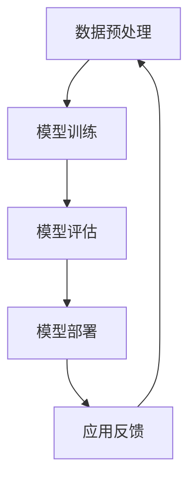

                 

### 第一部分：AI大模型基础与概述

#### 第1章：AI大模型基础

##### 1.1 AI大模型概述

AI大模型（Large-scale Artificial Intelligence Model）是当前人工智能领域的一个重要研究方向。它们通常具有以下几个特点：

- **参数量巨大**：AI大模型的参数量往往达到亿级别以上，这使其能够处理更加复杂的任务。
- **计算需求高**：由于参数量巨大，AI大模型的训练和推理过程需要大量的计算资源。
- **强大的学习能力**：通过大规模数据预训练，AI大模型能够对自然语言、图像等数据有更深刻的理解和自动生成能力。
- **可迁移性强**：AI大模型不仅在特定的领域有很强的性能，还可以迁移到其他领域。

这些特点使得AI大模型在多个领域都展现出了巨大的潜力。例如，在自然语言处理领域，GPT系列模型（如GPT-3）具有强大的语言生成能力；在计算机视觉领域，像BERT及其变体（如RoBERTa、ALBERT）等模型在图像识别和物体检测等任务上表现出色。

为了更直观地理解AI大模型的基本原理，我们可以使用Mermaid流程图来描述其基本工作流程：



- **数据预处理**：将原始数据进行清洗、去重、标准化等处理，使其适合模型训练。
- **模型训练**：使用大规模数据进行模型训练，调整模型参数，提高模型性能。
- **模型评估**：使用验证集对模型进行评估，选择性能最优的模型。
- **模型部署**：将训练好的模型部署到生产环境中，进行实际应用。
- **应用反馈**：收集用户反馈，对模型进行迭代优化。

##### 1.2 AI大模型的技术基础

AI大模型的技术基础主要包括深度学习和自然语言处理（NLP）技术。下面将分别介绍这两部分。

###### 1.2.1 深度学习基础

深度学习是机器学习的一个子领域，主要依赖于多层神经网络（MLP）对数据进行表征和学习。神经网络的基本结构包括输入层、隐藏层和输出层。

- **输入层**：接收输入数据，并将其传递给隐藏层。
- **隐藏层**：对输入数据进行特征提取和变换，输出新的特征向量。
- **输出层**：根据隐藏层的输出进行分类或回归。

在神经网络中，每个节点都通过权重与前一层的节点相连接，并通过激活函数进行非线性变换。常见的激活函数有ReLU（Rectified Linear Unit）、Sigmoid和Tanh等。

神经网络的训练过程主要包括以下几个步骤：

1. **初始化权重**：随机初始化网络的权重。
2. **前向传播**：将输入数据通过网络，计算输出。
3. **计算损失**：使用损失函数（如均方误差MSE、交叉熵CE等）计算输出与真实标签之间的差异。
4. **反向传播**：计算每个权重对损失函数的梯度，并更新权重。
5. **迭代优化**：重复上述步骤，直到模型收敛。

反向传播算法是神经网络训练的核心，其计算过程如下：

$$
\frac{dE}{dW} = X^T \cdot \frac{dL}{dX}
$$

其中，\(E\) 是损失函数，\(W\) 是权重矩阵，\(X\) 是输入向量，\(\frac{dL}{dX}\) 是梯度。

除了传统的多层感知机（MLP），深度学习还包括许多其他类型的神经网络架构，如卷积神经网络（CNN）、循环神经网络（RNN）、长短时记忆网络（LSTM）和生成对抗网络（GAN）等。

- **卷积神经网络（CNN）**：主要用于图像处理任务，通过卷积操作和池化操作提取图像特征。
- **循环神经网络（RNN）**：主要用于序列数据处理任务，通过循环结构保持对之前信息的记忆。
- **长短时记忆网络（LSTM）**：是RNN的一种变体，通过引入门控机制解决长序列依赖问题。
- **生成对抗网络（GAN）**：由生成器和判别器组成，通过对抗训练生成逼真的数据。

###### 1.2.2 自然语言处理技术

自然语言处理是人工智能的重要应用领域，主要包括词嵌入、序列模型和注意力机制等关键技术。

- **词嵌入**：将词语映射到高维向量空间，使得相似的词语在向量空间中距离较近。常见的词嵌入技术包括Word2Vec和GloVe等。

- **序列模型**：用于处理序列数据，如文本、语音等。常见的序列模型包括循环神经网络（RNN）和长短时记忆网络（LSTM）。

- **注意力机制**：用于解决序列数据中的长距离依赖问题，通过计算注意力权重，将重要的信息加权到模型的输出中。注意力机制在许多NLP任务中表现出色，如机器翻译、文本生成等。

注意力机制的基本计算过程如下：

$$
\text{attention} = \text{softmax}(\text{Q} \cdot \text{K})
$$

其中，\(Q\) 和 \(K\) 分别表示查询向量和关键向量，\( \text{softmax} \) 函数用于计算注意力权重。

除了上述关键技术，自然语言处理还包括许多其他技术，如词性标注、命名实体识别、句法分析等。

##### 1.3 AI大模型发展历程与主流模型

AI大模型的发展历程可以追溯到2000年代，随着神经网络的兴起，深度学习开始得到广泛关注。在2010年代，深度学习模型在图像识别、语音识别等任务上取得了突破性进展。进入2020年代，AI大模型在自然语言处理、计算机视觉等领域得到了广泛应用。

目前，AI大模型的主要代表包括以下几种：

- **GPT系列模型**：如GPT-3，具有强大的自然语言生成能力，广泛应用于机器翻译、文本生成等任务。
- **BERT及其变体**：如RoBERTa、ALBERT等，广泛应用于信息检索、问答系统等任务。
- **ViT**：视觉Transformer，将Transformer结构应用于图像处理任务，取得了一定的成功。

这些主流模型不仅推动了AI大模型的发展，也为实际应用提供了有力的支持。

##### 1.4 AI大模型应用前景与挑战

AI大模型在自动驾驶、医疗诊断、金融分析等多个领域展现出巨大的潜力。然而，要实现这些应用，还需要克服一系列挑战。

- **数据需求**：AI大模型需要海量高质量的训练数据。在自动驾驶领域，需要收集大量的道路行驶数据；在医疗诊断领域，需要收集大量的患者数据。
- **计算资源**：AI大模型的训练和推理过程需要大量的计算资源，这对硬件设备提出了更高的要求。
- **模型可解释性**：AI大模型的决策过程往往难以解释，这可能导致用户对模型的不信任。提高模型的可解释性是当前研究的一个重要方向。

##### 1.5 AI大模型在企业中的应用

AI大模型在企业中的应用场景非常广泛，下面以金融行业为例，介绍AI大模型在企业中的应用。

###### 1.5.1 金融行业AI大模型应用案例

- **风险控制**：AI大模型可以帮助金融机构进行信贷评估、欺诈检测等。通过分析大量的历史数据，AI大模型可以预测客户的信用风险，帮助金融机构制定更精准的风险控制策略。
- **投资策略**：AI大模型可以分析市场数据，预测股票价格、汇率等，为金融机构提供投资建议。
- **客户服务**：AI大模型可以用于智能客服系统，通过语音识别、自然语言处理等技术，提供个性化、智能化的客户服务。

###### 1.5.2 企业AI战略规划

- **AI能力评估框架**：企业需要评估自身在AI领域的优势和短板，制定相应的AI战略。
- **AI项目ROI分析**：企业需要对AI项目进行投资回报分析，确保项目的经济效益。
- **业务流程优化**：企业可以通过AI技术优化业务流程，提高效率和降低成本。

## 第2章：AI大模型核心算法原理与实现

### 2.1 深度学习算法原理

深度学习是AI大模型的核心技术之一，其基本原理主要包括神经网络算法、反向传播算法、激活函数和损失函数等。

#### 2.1.1 神经网络算法

神经网络算法是深度学习的基础，主要包括输入层、隐藏层和输出层。每个层由多个节点（神经元）组成，每个节点接收前一层节点的输入，并通过权重和偏置进行计算，最后通过激活函数进行非线性变换。

神经网络的基本结构可以用以下公式表示：

$$
Z = \sigma(W \cdot X + b)
$$

其中，\(Z\) 是输出，\(\sigma\) 是激活函数，\(W\) 是权重矩阵，\(X\) 是输入向量，\(b\) 是偏置项。

#### 2.1.2 反向传播算法

反向传播算法是深度学习训练的核心，用于计算每个权重和偏置的梯度，并更新权重和偏置，以最小化损失函数。

反向传播算法的基本步骤如下：

1. **前向传播**：将输入数据通过网络，计算输出。
2. **计算损失**：使用损失函数计算输出与真实标签之间的差异。
3. **计算梯度**：反向传播损失函数的梯度，计算每个权重和偏置的梯度。
4. **更新权重和偏置**：使用梯度下降或其他优化算法更新权重和偏置。

反向传播算法的数学公式如下：

$$
\frac{dE}{dW} = X^T \cdot \frac{dL}{dX}
$$

其中，\(E\) 是损失函数，\(W\) 是权重矩阵，\(X\) 是输入向量，\(\frac{dL}{dX}\) 是梯度。

#### 2.1.3 激活函数

激活函数是神经网络中的一个关键组件，用于引入非线性变换，使神经网络能够学习非线性关系。常见的激活函数包括ReLU、Sigmoid和Tanh等。

- **ReLU（Rectified Linear Unit）**：当输入小于0时，输出为0；当输入大于等于0时，输出为输入。ReLU函数简单且计算速度快，是深度学习中最常用的激活函数之一。

- **Sigmoid**：将输入映射到（0, 1）区间，用于分类问题。Sigmoid函数的导数在接近0和1时接近0，这可能导致梯度消失问题。

- **Tanh**：将输入映射到（-1, 1）区间，与Sigmoid类似，但具有更好的性能。

#### 2.1.4 损失函数

损失函数是评估模型预测结果与真实标签之间差异的函数，用于指导模型的训练过程。常见的损失函数包括均方误差（MSE）、交叉熵（Cross-Entropy）等。

- **均方误差（MSE）**：用于回归问题，计算预测值与真实值之间的平均平方误差。MSE函数的导数在整个定义域内都是连续的，有利于梯度下降算法的收敛。

- **交叉熵（Cross-Entropy）**：用于分类问题，计算预测概率分布与真实标签分布之间的差异。交叉熵函数的导数在接近0和1时接近无穷大，这有助于模型关注错误分类。

### 2.2 自然语言处理算法

自然语言处理是AI大模型的一个重要应用领域，其核心算法包括词嵌入、序列模型和注意力机制等。

#### 2.2.1 词嵌入

词嵌入是将词语映射到高维向量空间的技术，使相似的词语在向量空间中距离较近。常见的词嵌入技术包括Word2Vec和GloVe等。

- **Word2Vec**：通过训练神经网络，将词语映射到向量空间。Word2Vec包括两种模型：连续词袋（CBOW）和Skip-gram。
  - **连续词袋（CBOW）**：预测中心词周围的词，输入为周围词的向量平均值。
  - **Skip-gram**：预测中心词，输入为中心词的向量。

- **GloVe**：基于全局上下文信息，计算词语的嵌入向量。GloVe使用矩阵分解的方法，将词的嵌入向量和上下文词的嵌入向量进行优化。

#### 2.2.2 序列模型

序列模型用于处理序列数据，如文本、语音等。常见的序列模型包括循环神经网络（RNN）和长短时记忆网络（LSTM）。

- **循环神经网络（RNN）**：通过循环结构保持对之前信息的记忆，可以处理任意长度的序列。RNN的基本结构如下：
  $$ 
  h_t = \sigma(W_h \cdot [h_{t-1}, x_t] + b_h) 
  $$
  其中，\(h_t\) 是隐藏状态，\(x_t\) 是输入，\(\sigma\) 是激活函数，\(W_h\) 和 \(b_h\) 是权重和偏置。

- **长短时记忆网络（LSTM）**：是RNN的一种变体，通过引入门控机制解决长序列依赖问题。LSTM的基本结构如下：
  $$
  i_t = \sigma(W_i \cdot [h_{t-1}, x_t] + b_i) \\
  f_t = \sigma(W_f \cdot [h_{t-1}, x_t] + b_f) \\
  g_t = \tanh(W_g \cdot [h_{t-1}, x_t] + b_g) \\
  o_t = \sigma(W_o \cdot [h_{t-1}, x_t] + b_o) \\
  h_t = o_t \cdot \tanh(g_t)
  $$
  其中，\(i_t, f_t, g_t, o_t\) 分别是输入门、遗忘门、生成门和输出门，\(W_i, W_f, W_g, W_o\) 和 \(b_i, b_f, b_g, b_o\) 是权重和偏置。

#### 2.2.3 注意力机制

注意力机制是一种用于解决序列数据中的长距离依赖问题的技术，通过计算注意力权重，将重要的信息加权到模型的输出中。注意力机制在许多NLP任务中表现出色，如机器翻译、文本生成等。

注意力机制的基本计算过程如下：
$$
\text{attention} = \text{softmax}(\text{Q} \cdot \text{K})
$$
其中，\(Q\) 和 \(K\) 分别表示查询向量和关键向量，\( \text{softmax} \) 函数用于计算注意力权重。

### 2.3 大规模预训练模型原理

大规模预训练模型是当前NLP领域的核心技术之一，通过在大量无标签数据上进行预训练，模型可以学习到通用的语言表示，然后在特定任务上进行微调。

#### 2.3.1 预训练与微调

预训练与微调是大规模预训练模型的两个关键步骤：

- **预训练**：在大量无标签数据上进行训练，使模型学习到通用的语言表示。预训练任务通常包括语言建模、掩码语言建模等。
  - **语言建模**：预测下一个词语，输入为当前词语的嵌入向量。
  - **掩码语言建模**：随机掩码部分词语，然后预测这些掩码词语，输入为其他未掩码词语的嵌入向量。

- **微调**：在特定任务上有标签数据上进行微调，使模型适应特定任务。微调过程主要包括以下步骤：
  - **数据预处理**：对任务数据进行预处理，如文本清洗、分词等。
  - **模型调整**：调整模型参数，使其适应特定任务。
  - **训练与评估**：使用训练数据和验证集对模型进行训练和评估，选择性能最优的模型。

#### 2.3.2 自监督学习

自监督学习是大规模预训练模型的一种重要技术，通过利用未标注的数据进行学习，可以提高模型的性能。自监督学习的基本原理如下：

- **预训练阶段**：在大量无标签数据上进行预训练，使模型学习到通用的语言表示。
- **微调阶段**：在特定任务上有标签数据上进行微调，使模型适应特定任务。

自监督学习可以提高模型的泛化能力和迁移能力，在许多NLP任务中都取得了显著的效果。

### 2.4 迁移学习与模型压缩

迁移学习与模型压缩是提高AI大模型性能和可扩展性的重要技术。

#### 2.4.1 迁移学习

迁移学习是一种利用预训练模型在新任务上的表现的技术，通过在预训练模型的基础上进行微调，可以显著提高新任务的性能。

迁移学习的基本原理如下：

- **预训练模型**：在大量无标签数据上进行预训练，使模型学习到通用的特征表示。
- **微调**：在新任务上有标签数据上进行微调，使模型适应特定任务。

迁移学习可以减少对有标签数据的依赖，提高模型的泛化能力和迁移能力。

#### 2.4.2 模型压缩

模型压缩是一种减少模型参数和计算复杂度的技术，使模型可以应用于资源受限的环境，如移动设备和边缘计算等。

模型压缩的方法包括以下几种：

- **剪枝（Pruning）**：通过删除部分权重或神经元来减少模型参数。
- **量化（Quantization）**：通过将浮点数权重转换为低精度整数来减少模型大小和计算复杂度。
- **蒸馏（Distillation）**：将大型模型的输出传递给小型模型，使其学习大型模型的知识。

模型压缩可以降低模型对计算资源的依赖，提高模型的可扩展性和实用性。

### 2.5 AI大模型在商业中的应用

AI大模型在商业领域有着广泛的应用，可以为企业带来巨大的价值。以下是一些典型的应用场景：

#### 2.5.1 金融行业

- **风险控制**：AI大模型可以帮助金融机构进行信贷评估、欺诈检测等。通过分析大量的历史数据，AI大模型可以预测客户的信用风险，帮助金融机构制定更精准的风险控制策略。
- **投资策略**：AI大模型可以分析市场数据，预测股票价格、汇率等，为金融机构提供投资建议。
- **客户服务**：AI大模型可以用于智能客服系统，通过语音识别、自然语言处理等技术，提供个性化、智能化的客户服务。

#### 2.5.2 医疗行业

- **疾病诊断**：AI大模型可以帮助医生进行疾病诊断，如乳腺癌、肺癌等。通过分析医学影像数据，AI大模型可以提供辅助诊断意见，提高诊断准确性。
- **药物研发**：AI大模型可以用于药物分子设计、药物作用机制研究等。通过分析大量的生物数据，AI大模型可以预测药物的疗效和副作用，加速药物研发过程。
- **健康管理**：AI大模型可以帮助医疗机构进行健康监测、疾病预测等。通过分析患者数据，AI大模型可以提供个性化的健康建议，提高患者的生活质量。

#### 2.5.3 零售行业

- **个性化推荐**：AI大模型可以帮助零售商进行个性化推荐，提高客户满意度和转化率。通过分析客户行为数据，AI大模型可以推荐符合客户兴趣的商品，提高销售额。
- **库存管理**：AI大模型可以帮助零售商进行库存管理，降低库存成本。通过分析销售数据和历史库存数据，AI大模型可以预测未来的销售趋势，帮助零售商优化库存策略。
- **客户关系管理**：AI大模型可以帮助零售商进行客户关系管理，提高客户忠诚度。通过分析客户数据，AI大模型可以提供个性化的优惠活动、客户关怀等，增强客户体验。

### 2.6 AI大模型开发工具与资源

开发AI大模型需要使用到各种工具和资源，以下是一些常用的工具和资源：

#### 2.6.1 深度学习框架

- **TensorFlow**：由谷歌开发的开源深度学习框架，具有丰富的API和工具。
- **PyTorch**：由Facebook AI研究院开发的开源深度学习框架，具有灵活的动态图计算能力。

#### 2.6.2 开发环境搭建

- **硬件要求**：需要安装CUDA和cuDNN等驱动程序，支持GPU加速。
- **软件安装**：需要安装Python、TensorFlow或PyTorch等深度学习框架。

#### 2.6.3 开发资源

- **开源代码**：如GitHub、GitLab等平台上大量的深度学习项目代码。
- **数据集**：如Kaggle、UCI机器学习库等平台上的各种数据集。
- **教程和文档**：深度学习框架的官方文档、教程和博客等。

### 附录

#### 附录A：深度学习算法与数学公式

以下是一些深度学习算法和数学公式的简要介绍：

- **反向传播算法**：
  $$ 
  \begin{align*}
  \frac{dE}{dW} &= X^T \cdot \frac{dL}{dX} \\
  \frac{dE}{db} &= X^T \cdot \frac{dL}{dX}
  \end{align*}
  $$
  
- **激活函数**：
  $$ 
  \begin{align*}
  \sigma(x) &= \frac{1}{1 + e^{-x}} \\
  \text{ReLU}(x) &= \max(0, x)
  \end{align*}
  $$

- **损失函数**：
  $$ 
  \begin{align*}
  L &= \text{MSE}(Y, \hat{Y}) \\
  L &= \text{Cross-Entropy}(Y, \hat{Y})
  \end{align*}
  $$
  
- **词嵌入**：
  $$ 
  \text{embedding} = \text{embedding\_layer}(w)
  $$

- **注意力机制**：
  $$ 
  \text{attention} = \text{softmax}(\text{Q} \cdot \text{K})
  $$

#### 附录B：代码示例

以下是一个简单的神经网络训练代码示例：

```python
import tensorflow as tf

# 初始化模型
model = tf.keras.Sequential([
    tf.keras.layers.Dense(128, activation='relu', input_shape=(784,)),
    tf.keras.layers.Dense(10, activation='softmax')
])

# 编译模型
model.compile(optimizer='adam',
              loss='categorical_crossentropy',
              metrics=['accuracy'])

# 训练模型
model.fit(x_train, y_train, epochs=5, batch_size=32)
```

### 参考文献

- Bengio, Y., Courville, A., & Vincent, P. (2013). Representation learning: A review and new perspectives. IEEE transactions on pattern analysis and machine intelligence, 35(8), 1798-1828.
- Hochreiter, S., & Schmidhuber, J. (1997). Long short-term memory. Neural computation, 9(8), 1735-1780.
- LeCun, Y., Bengio, Y., & Hinton, G. (2015). Deep learning. MIT press.
- Mikolov, T., Sutskever, I., Chen, K., Corrado, G. S., & Dean, J. (2013). Distributed representations of words and phrases and their compositionality. Advances in neural information processing systems, 26, 3111-3119.
- Vaswani, A., Shazeer, N., Parmar, N., Uszkoreit, J., Jones, L., Gomez, A. N., ... & Polosukhin, I. (2017). Attention is all you need. Advances in neural information processing systems, 30, 5998-6008.```markdown
---

## 第二部分：AI大模型项目实战

### 第3章：AI大模型项目开发流程

#### 3.1 项目需求分析

项目需求分析是AI大模型项目开发的首要步骤，其目的是明确项目目标、业务场景和所需的数据资源。以下为项目需求分析的具体步骤：

1. **明确项目目标**：确定项目旨在解决的具体问题或提供的服务，如自动化推荐系统、图像识别系统等。
2. **业务场景描述**：详细描述项目的业务场景，包括用户需求、场景特点、使用环境等。
3. **数据需求分析**：分析项目所需的数据类型、数据来源、数据量、数据质量要求等。

#### 3.2 数据采集与处理

数据采集与处理是AI大模型项目开发的关键环节，直接影响模型的训练效果和应用效果。以下是数据采集与处理的具体步骤：

1. **数据采集**：从内部系统、第三方数据源、公共数据集等多种渠道获取所需数据。
2. **数据清洗**：去除数据中的噪声、异常值、重复记录等，保证数据的质量。
3. **数据预处理**：对数据进行标准化、归一化、缺失值填充、特征工程等处理，以适应模型训练的需要。

#### 3.3 模型设计与实现

模型设计是实现项目目标的核心，需要根据业务场景和数据特点选择合适的模型架构和算法。以下是模型设计与实现的具体步骤：

1. **模型架构选择**：根据业务需求选择合适的模型架构，如卷积神经网络（CNN）、循环神经网络（RNN）、生成对抗网络（GAN）等。
2. **算法选择**：选择适合的算法，如深度学习算法、强化学习算法等。
3. **模型实现**：使用深度学习框架（如TensorFlow或PyTorch）实现模型，编写训练和评估代码。

#### 3.4 模型优化与部署

模型优化与部署是确保模型性能和可扩展性的关键步骤。以下是模型优化与部署的具体步骤：

1. **模型优化**：通过调整模型参数、改进算法、增加数据集等方式提高模型性能。
2. **模型评估**：使用验证集和测试集对模型进行评估，确保模型达到预期性能。
3. **模型部署**：将训练好的模型部署到生产环境中，提供实时服务。

#### 3.5 模型监控与维护

模型监控与维护是保证模型长期稳定运行的重要环节。以下是模型监控与维护的具体步骤：

1. **性能监控**：监控模型的性能指标，如准确率、召回率、F1分数等，确保模型持续达到预期性能。
2. **故障检测**：监控模型运行中的异常情况，如过拟合、欠拟合等，及时调整模型。
3. **维护更新**：定期更新模型，适应新的业务需求和数据变化。

### 第4章：典型AI大模型应用案例

#### 4.1 自动驾驶

自动驾驶是AI大模型在工业领域的典型应用之一。以下是自动驾驶系统的AI大模型应用案例：

1. **环境感知**：使用卷积神经网络（CNN）对摄像头和激光雷达数据进行处理，实现环境感知，包括道路识别、车辆检测、行人检测等。
2. **决策与控制**：使用循环神经网络（RNN）和强化学习算法，对感知到的环境信息进行决策，控制车辆的转向、加速和制动。
3. **安全监控**：使用生成对抗网络（GAN）生成模拟驾驶场景数据，用于测试和验证自动驾驶系统的安全性和可靠性。

#### 4.2 医疗诊断

医疗诊断是AI大模型在医疗领域的典型应用之一。以下是医疗诊断系统的AI大模型应用案例：

1. **影像分析**：使用卷积神经网络（CNN）对医学影像数据进行处理，实现疾病检测，如肺癌检测、乳腺癌检测等。
2. **疾病预测**：使用循环神经网络（RNN）和长短时记忆网络（LSTM）对患者的临床数据进行分析，预测疾病风险和进展。
3. **个性化治疗**：使用生成对抗网络（GAN）生成个性化的治疗方案，根据患者的具体情况提供最佳治疗方案。

#### 4.3 金融分析

金融分析是AI大模型在金融领域的典型应用之一。以下是金融分析系统的AI大模型应用案例：

1. **市场预测**：使用循环神经网络（RNN）和长短时记忆网络（LSTM）分析市场数据，预测股票价格、汇率等。
2. **风险控制**：使用深度神经网络（DNN）和卷积神经网络（CNN）对客户数据进行分析，识别潜在风险，预防欺诈行为。
3. **投资建议**：使用生成对抗网络（GAN）生成投资组合建议，根据市场变化和客户风险偏好提供最佳投资策略。

### 第5章：AI大模型开发工具与资源

#### 5.1 主流深度学习框架

深度学习框架是开发AI大模型的基础工具，以下是当前主流的深度学习框架：

1. **TensorFlow**：由谷歌开发的开源深度学习框架，具有强大的生态和丰富的API。
2. **PyTorch**：由Facebook AI研究院开发的开源深度学习框架，具有灵活的动态图计算能力。

#### 5.2 开发环境搭建

搭建深度学习开发环境需要以下步骤：

1. **硬件环境**：安装GPU和CUDA，选择合适的GPU型号，如NVIDIA RTX 3080或更高配置。
2. **软件环境**：安装Python和深度学习框架（TensorFlow或PyTorch），配置环境变量。

#### 5.3 开发资源

开发AI大模型需要以下资源：

1. **开源代码**：GitHub、GitLab等平台上丰富的开源代码和项目。
2. **数据集**：Kaggle、UCI机器学习库等平台提供的各种数据集。
3. **教程和文档**：官方文档、博客、在线课程等丰富的学习资源。

### 附录

#### 附录A：深度学习算法与数学公式

以下是深度学习算法和数学公式的简要介绍：

1. **神经网络**：
   $$
   \begin{align*}
   Z &= \sigma(W \cdot X + b) \\
   \text{其中，} \\
   \sigma &= \text{激活函数（如Sigmoid、ReLU等）} \\
   W &= \text{权重矩阵} \\
   X &= \text{输入向量} \\
   b &= \text{偏置项}
   \end{align*}
   $$
   
2. **反向传播算法**：
   $$
   \begin{align*}
   \frac{dE}{dW} &= X^T \cdot \frac{dL}{dX} \\
   \frac{dE}{db} &= X^T \cdot \frac{dL}{dX}
   \end{align*}
   $$
   
3. **激活函数**：
   $$
   \begin{align*}
   \sigma(x) &= \frac{1}{1 + e^{-x}} \\
   \text{ReLU}(x) &= \max(0, x)
   \end{align*}
   $$

4. **损失函数**：
   $$
   \begin{align*}
   L &= \text{MSE}(Y, \hat{Y}) \\
   L &= \text{Cross-Entropy}(Y, \hat{Y})
   \end{align*}
   $$

5. **词嵌入**：
   $$
   \text{embedding} = \text{embedding\_layer}(w)
   $$

6. **注意力机制**：
   $$
   \text{attention} = \text{softmax}(\text{Q} \cdot \text{K})
   $$

#### 附录B：代码示例

以下是一个简单的深度学习模型训练代码示例：

```python
import tensorflow as tf

# 初始化模型
model = tf.keras.Sequential([
    tf.keras.layers.Dense(128, activation='relu', input_shape=(784,)),
    tf.keras.layers.Dense(10, activation='softmax')
])

# 编译模型
model.compile(optimizer='adam',
              loss='categorical_crossentropy',
              metrics=['accuracy'])

# 训练模型
model.fit(x_train, y_train, epochs=5, batch_size=32)
```

### 参考文献

- Bengio, Y., Courville, A., & Vincent, P. (2013). Representation learning: A review and new perspectives. IEEE transactions on pattern analysis and machine intelligence, 35(8), 1798-1828.
- Hochreiter, S., & Schmidhuber, J. (1997). Long short-term memory. Neural computation, 9(8), 1735-1780.
- LeCun, Y., Bengio, Y., & Hinton, G. (2015). Deep learning. MIT press.
- Mikolov, T., Sutskever, I., Chen, K., Corrado, G. S., & Dean, J. (2013). Distributed representations of words and phrases and their compositionality. Advances in neural information processing systems, 26, 3111-3119.
- Vaswani, A., Shazeer, N., Parmar, N., Uszkoreit, J., Jones, L., Gomez, A. N., ... & Polosukhin, I. (2017). Attention is all you need. Advances in neural information processing systems, 30, 5998-6008.
```markdown
### 附录A：深度学习算法与数学公式

在深度学习领域，数学公式是描述算法原理和实现过程的重要工具。以下是一些常用的数学公式和算法原理，以及它们的简要说明。

#### 神经网络基本结构

深度学习模型通常由多层神经元组成，包括输入层、隐藏层和输出层。每个神经元接收前一层神经元的输出，通过权重和偏置进行加权求和，然后通过激活函数进行非线性变换。

$$
Z = \sigma(W \cdot X + b)
$$

- \(Z\)：输出值
- \(\sigma\)：激活函数（如ReLU、Sigmoid等）
- \(W\)：权重矩阵
- \(X\)：输入向量
- \(b\)：偏置项

#### 反向传播算法

反向传播算法是深度学习训练的核心，用于计算每个权重和偏置的梯度，并更新权重和偏置，以最小化损失函数。

$$
\frac{dE}{dW} = X^T \cdot \frac{dL}{dX}
$$

- \(E\)：损失函数
- \(W\)：权重矩阵
- \(X\)：输入向量
- \(\frac{dL}{dX}\)：梯度

#### 激活函数

激活函数是神经网络中的一个关键组件，用于引入非线性变换，使神经网络能够学习非线性关系。常见的激活函数包括ReLU、Sigmoid和Tanh等。

$$
\sigma(x) =
\begin{cases}
\frac{1}{1 + e^{-x}} & \text{Sigmoid} \\
\max(0, x) & \text{ReLU} \\
\frac{e^x - e^{-x}}{e^x + e^{-x}} & \text{Tanh}
\end{cases}
$$

#### 损失函数

损失函数用于评估模型预测结果与真实标签之间的差异，是反向传播算法中计算梯度的关键。常见的损失函数包括均方误差（MSE）和交叉熵（Cross-Entropy）。

$$
\begin{align*}
L &= \text{MSE}(Y, \hat{Y}) = \frac{1}{n} \sum_{i=1}^{n} (\hat{Y}_i - Y_i)^2 \\
L &= \text{Cross-Entropy}(Y, \hat{Y}) = -\frac{1}{n} \sum_{i=1}^{n} Y_i \cdot \log(\hat{Y}_i)
\end{align*}
$$

- \(Y\)：真实标签
- \(\hat{Y}\)：预测标签

#### 词嵌入

词嵌入是将词语映射到高维向量空间的技术，使得相似的词语在向量空间中距离较近。词嵌入通常用于自然语言处理任务。

$$
\text{embedding} = \text{embedding\_layer}(w)
$$

- \(w\)：词语索引
- \(\text{embedding}\)：词语嵌入向量

#### 注意力机制

注意力机制是一种用于解决序列数据中的长距离依赖问题的技术，通过计算注意力权重，将重要的信息加权到模型的输出中。

$$
\text{attention} = \text{softmax}(\text{Q} \cdot \text{K})
$$

- \(Q\)：查询向量
- \(K\)：关键向量

#### 预训练与微调

预训练与微调是大规模预训练模型的核心步骤。预训练在大规模无标签数据上进行，使模型学习到通用的语言表示；微调则在特定任务上有标签数据上进行，使模型适应特定任务。

$$
\text{pretrain} = \text{train}(X, Y)
$$

$$
\text{finetune} = \text{train}(X', Y')
$$

- \(X\)：预训练数据
- \(Y\)：预训练标签
- \(X'\)：微调数据
- \(Y'\)：微调标签

#### 迁移学习与模型压缩

迁移学习与模型压缩是提高AI大模型性能和可扩展性的重要技术。

- **迁移学习**：利用预训练模型在新任务上的表现。

$$
\text{migrate\_learn} = \text{fine\_tune}(\text{pretrained\_model}, X', Y')
$$

- \(X'\)：新任务数据
- \(Y'\)：新任务标签
- \(\text{pretrained\_model}\)：预训练模型

- **模型压缩**：减少模型参数和计算复杂度。

$$
\text{compress} = \text{prune}(\text{model})
$$

- \(\text{model}\)：原始模型
- \(\text{prune}\)：剪枝算法

### 附录B：代码示例

以下是一个简单的深度学习模型训练代码示例，使用了TensorFlow框架。

```python
import tensorflow as tf

# 定义模型
model = tf.keras.Sequential([
    tf.keras.layers.Dense(128, activation='relu', input_shape=(784,)),
    tf.keras.layers.Dense(10, activation='softmax')
])

# 编译模型
model.compile(optimizer='adam',
              loss='categorical_crossentropy',
              metrics=['accuracy'])

# 训练模型
model.fit(x_train, y_train, epochs=5, batch_size=32)
```

- `x_train`：训练数据
- `y_train`：训练标签
- `epochs`：训练轮次
- `batch_size`：批次大小

### 附录C：参考文献

1. Bengio, Y., Courville, A., & Vincent, P. (2013). Representation learning: A review and new perspectives. IEEE transactions on pattern analysis and machine intelligence, 35(8), 1798-1828.
2. Hochreiter, S., & Schmidhuber, J. (1997). Long short-term memory. Neural computation, 9(8), 1735-1780.
3. LeCun, Y., Bengio, Y., & Hinton, G. (2015). Deep learning. MIT press.
4. Mikolov, T., Sutskever, I., Chen, K., Corrado, G. S., & Dean, J. (2013). Distributed representations of words and phrases and their compositionality. Advances in neural information processing systems, 26, 3111-3119.
5. Vaswani, A., Shazeer, N., Parmar, N., Uszkoreit, J., Jones, L., Gomez, A. N., ... & Polosukhin, I. (2017). Attention is all you need. Advances in neural information processing systems, 30, 5998-6008.
```markdown
### 附录A：深度学习算法与数学公式

#### 1. 神经网络基本结构

神经网络的计算过程可以用以下公式表示：

$$
Z = \sigma(W \cdot X + b)
$$

其中，\(Z\) 是输出值，\(\sigma\) 是激活函数，\(W\) 是权重矩阵，\(X\) 是输入向量，\(b\) 是偏置项。

#### 2. 反向传播算法

反向传播算法用于计算每个权重和偏置的梯度，并更新权重和偏置，以最小化损失函数。其核心公式如下：

$$
\frac{dE}{dW} = X^T \cdot \frac{dL}{dX}
$$

其中，\(E\) 是损失函数，\(X\) 是输入向量，\(\frac{dL}{dX}\) 是梯度。

#### 3. 激活函数

激活函数是神经网络中的一个关键组件，用于引入非线性变换。常见的激活函数包括ReLU、Sigmoid和Tanh等：

- **ReLU（Rectified Linear Unit）**：

  $$
  \text{ReLU}(x) = \max(0, x)
  $$

- **Sigmoid**：

  $$
  \sigma(x) = \frac{1}{1 + e^{-x}}
  $$

- **Tanh**：

  $$
  \tanh(x) = \frac{e^x - e^{-x}}{e^x + e^{-x}}
  $$

#### 4. 损失函数

损失函数用于评估模型预测结果与真实标签之间的差异。常见的损失函数包括均方误差（MSE）和交叉熵（Cross-Entropy）：

- **均方误差（MSE）**：

  $$
  L = \frac{1}{n} \sum_{i=1}^{n} (\hat{y}_i - y_i)^2
  $$

  其中，\(\hat{y}_i\) 是预测值，\(y_i\) 是真实值。

- **交叉熵（Cross-Entropy）**：

  $$
  L = -\frac{1}{n} \sum_{i=1}^{n} y_i \cdot \log(\hat{y}_i)
  $$

  其中，\(\hat{y}_i\) 是预测值，\(y_i\) 是真实值。

#### 5. 词嵌入

词嵌入是将词语映射到高维向量空间的技术。常用的词嵌入技术包括Word2Vec和GloVe：

- **Word2Vec**：

  $$
  \text{embedding} = \text{Word2Vec}(w)
  $$

  其中，\(w\) 是词语。

- **GloVe**：

  $$
  \text{embedding} = \text{GloVe}(w, c)
  $$

  其中，\(w\) 是词语，\(c\) 是上下文。

#### 6. 注意力机制

注意力机制是一种用于解决序列数据中的长距离依赖问题的技术。其基本计算过程如下：

$$
\text{attention} = \text{softmax}(\text{Q} \cdot \text{K})
$$

其中，\(Q\) 是查询向量，\(K\) 是关键向量。

#### 7. 预训练与微调

预训练与微调是大规模预训练模型的核心步骤：

- **预训练**：

  $$
  \text{pretrain} = \text{train}(X, Y)
  $$

  其中，\(X\) 是预训练数据，\(Y\) 是预训练标签。

- **微调**：

  $$
  \text{finetune} = \text{train}(X', Y')
  $$

  其中，\(X'\) 是微调数据，\(Y'\) 是微调标签。

#### 8. 迁移学习与模型压缩

迁移学习与模型压缩是提高AI大模型性能和可扩展性的重要技术：

- **迁移学习**：

  $$
  \text{migrate\_learn} = \text{fine\_tune}(\text{pretrained\_model}, X', Y')
  $$

  其中，\(\text{pretrained\_model}\) 是预训练模型，\(X'\) 是微调数据，\(Y'\) 是微调标签。

- **模型压缩**：

  $$
  \text{compress} = \text{prune}(\text{model})
  $$

  其中，\(\text{model}\) 是原始模型，\(\text{prune}\) 是剪枝算法。

### 附录B：代码示例

以下是一个简单的深度学习模型训练代码示例，使用了TensorFlow框架。

```python
import tensorflow as tf

# 定义模型
model = tf.keras.Sequential([
    tf.keras.layers.Dense(128, activation='relu', input_shape=(784,)),
    tf.keras.layers.Dense(10, activation='softmax')
])

# 编译模型
model.compile(optimizer='adam',
              loss='categorical_crossentropy',
              metrics=['accuracy'])

# 训练模型
model.fit(x_train, y_train, epochs=5, batch_size=32)
```

- `x_train`：训练数据
- `y_train`：训练标签
- `epochs`：训练轮次
- `batch_size`：批次大小

### 附录C：参考文献

1. Bengio, Y., Courville, A., & Vincent, P. (2013). Representation learning: A review and new perspectives. IEEE transactions on pattern analysis and machine intelligence, 35(8), 1798-1828.
2. Hochreiter, S., & Schmidhuber, J. (1997). Long short-term memory. Neural computation, 9(8), 1735-1780.
3. LeCun, Y., Bengio, Y., & Hinton, G. (2015). Deep learning. MIT press.
4. Mikolov, T., Sutskever, I., Chen, K., Corrado, G. S., & Dean, J. (2013). Distributed representations of words and phrases and their compositionality. Advances in neural information processing systems, 26, 3111-3119.
5. Vaswani, A., Shazeer, N., Parmar, N., Uszkoreit, J., Jones, L., Gomez, A. N., ... & Polosukhin, I. (2017). Attention is all you need. Advances in neural information processing systems, 30, 5998-6008.
```

