                 

### 文章标题

“AI大模型编程：提示词的威力”

**关键词：**AI大模型、编程、提示词、神经网络、深度学习、优化、部署、应用

**摘要：**本文深入探讨了AI大模型的编程技巧和提示词的威力，从基础到应用，全面剖析了AI大模型的核心概念、数学基础、训练技术、优化与调试、部署与应用，以及未来发展趋势。通过丰富的项目实战案例，展示了AI大模型在自然语言处理、计算机视觉和强化学习等领域的实际应用，旨在为读者提供全面的技术指导和应用案例。

----------------------------------------------------------------

### 第一部分: AI大模型基础

AI大模型（Large-scale AI Model）是当前人工智能领域的一个重要研究方向。它们具有极高的参数量和复杂结构，能够处理大规模数据和复杂任务。本部分将介绍AI大模型的基础知识，包括概念与历史、特点、影响以及数学基础。

#### 第1章: AI大模型概述

##### 1.1 AI大模型的概念与历史

###### 1.1.1 什么是AI大模型

AI大模型是指具有极高参数量和复杂结构的神经网络模型，其能够处理大规模数据和复杂的任务。它们通常具有数十亿甚至数千亿的参数，需要大量的计算资源和数据支持。

###### 1.1.2 AI大模型的发展历程

AI大模型的发展可以追溯到2000年代初期。随着计算能力的提升和大数据的涌现，大模型逐渐成为了AI研究的重要方向。2006年，Hinton等人的研究提出了深度信念网络（DBN），标志着深度学习领域的复兴。2012年，AlexNet在ImageNet竞赛中取得了突破性的成绩，深度学习开始迅速发展。近年来，GPT、BERT等大模型在自然语言处理领域取得了显著的成果，推动了AI大模型的研究和应用。

##### 1.2 AI大模型的特点

###### 1.2.1 计算能力需求

AI大模型对计算资源的需求极为庞大，需要高性能的GPU或TPU等硬件支持。一个大规模的模型训练可能需要数天甚至数周的时间。

###### 1.2.2 数据需求

AI大模型需要大量的高质量数据来训练，以实现较好的性能。这些数据通常包括文本、图像、声音等多种类型。

###### 1.2.3 算法需求

AI大模型依赖于先进的算法和优化技术，如深度学习、迁移学习等。这些算法能够有效地处理大规模数据和复杂的任务。

##### 1.3 AI大模型的影响

###### 1.3.1 对计算机科学的影响

AI大模型推动了计算机科学的发展，尤其是在并行计算、数据存储和处理等方面。高性能计算硬件和分布式计算技术的发展，为AI大模型的训练和应用提供了强大的支持。

###### 1.3.2 对人工智能领域的影响

AI大模型的出现，使得人工智能在多个领域取得了显著的进展，如自然语言处理、计算机视觉、推荐系统等。它们能够处理更复杂的任务，提高AI系统的性能和效果。

#### 第2章: AI大模型的数学基础

##### 2.1 神经网络基础

###### 2.1.1 神经元模型

神经元模型是神经网络的基本构建块，它通过输入和权重计算得到输出。

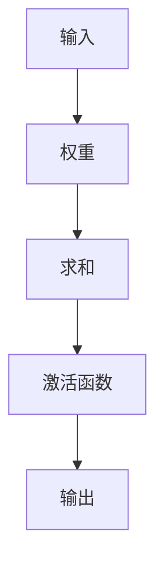

###### 2.1.2 激活函数

激活函数用于引入非线性因素，使神经网络能够处理复杂问题。

$$
f(x) = \begin{cases} 
1 & \text{if } x \geq 0 \\
0 & \text{if } x < 0 
\end{cases}
$$

###### 2.1.3 反向传播算法

反向传播算法是训练神经网络的常用方法，它通过梯度下降优化模型参数。

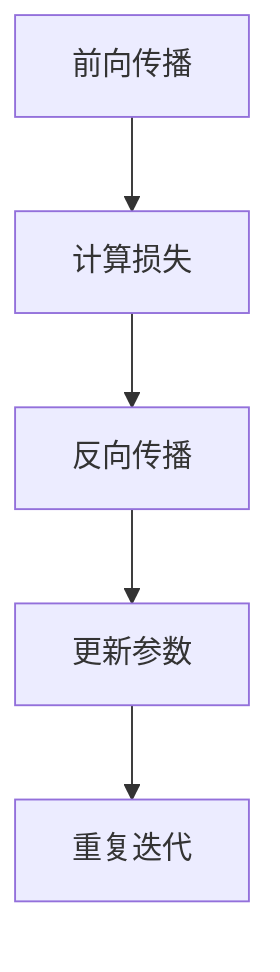

##### 2.2 深度学习算法

###### 2.2.1 卷积神经网络

卷积神经网络通过卷积层提取图像特征，适用于图像处理任务。

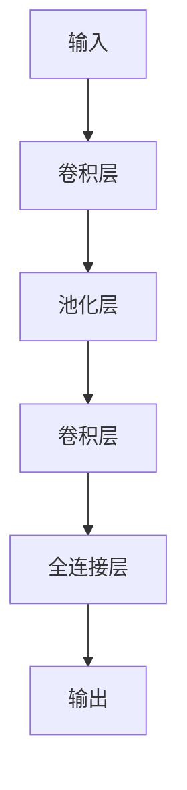

###### 2.2.2 循环神经网络

循环神经网络通过隐藏状态和循环连接处理序列数据。

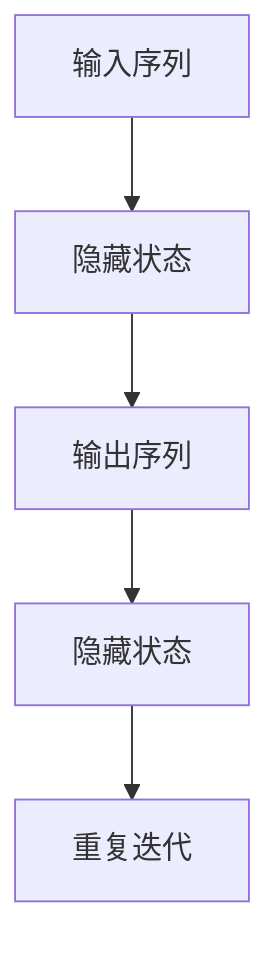

###### 2.2.3 自注意力机制

自注意力机制能够自适应地分配不同的重要性给输入序列中的每个元素。

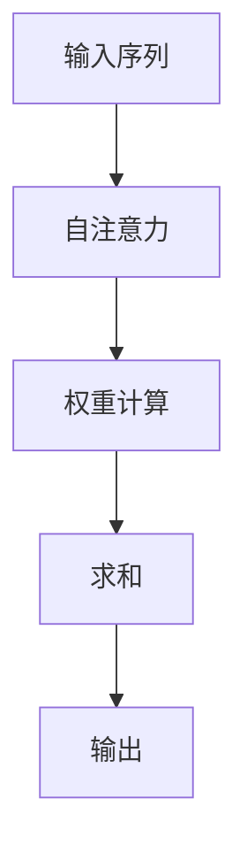

#### 第3章: AI大模型的训练技术

##### 3.1 数据预处理

###### 3.1.1 数据清洗

数据清洗是训练AI大模型的重要步骤，它包括去除噪声和异常值。

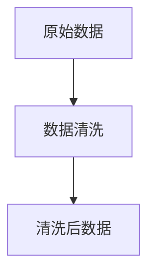

###### 3.1.2 数据增强

数据增强通过生成样本的变体来提高模型的泛化能力。

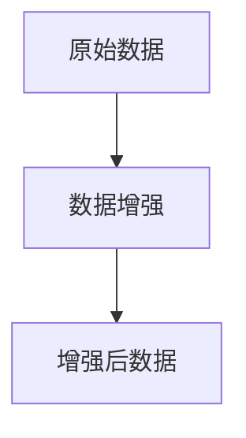

##### 3.2 训练策略

###### 3.2.1 优化器

优化器用于更新模型参数，常用的优化器有SGD、Adam等。

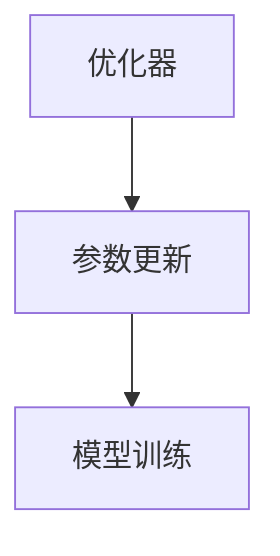

###### 3.2.2 学习率调度

学习率调度是调整学习率的方法，它对模型的收敛速度和最终性能有重要影响。

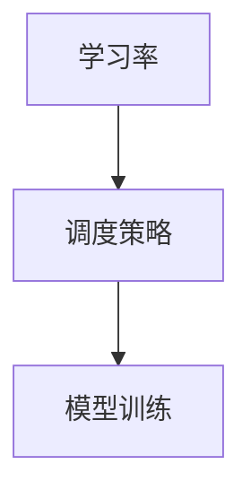

###### 3.2.3 正则化技术

正则化技术用于防止模型过拟合，常用的正则化技术有L1、L2正则化等。

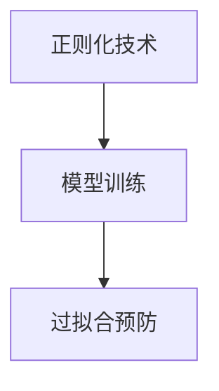

##### 3.3 模型评估

###### 3.3.1 评估指标

评估指标用于衡量模型的性能，常用的评估指标有准确率、召回率等。

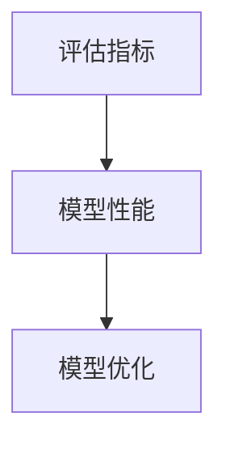

###### 3.3.2 评估方法

评估方法用于对模型进行评估，常用的评估方法有交叉验证、留一法等。

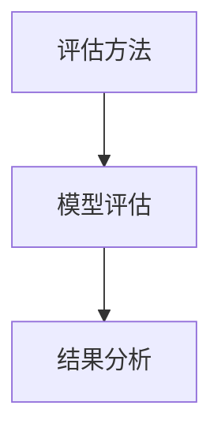

#### 第4章: AI大模型的优化与调试

##### 4.1 模型压缩

###### 4.1.1 知识蒸馏

知识蒸馏是一种模型压缩技术，它通过将大模型的知识传递给小模型来减少模型的大小。

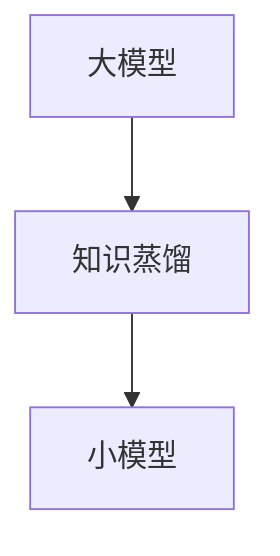

###### 4.1.2 参数剪枝

参数剪枝是一种通过删除无用参数来减少模型大小的技术。

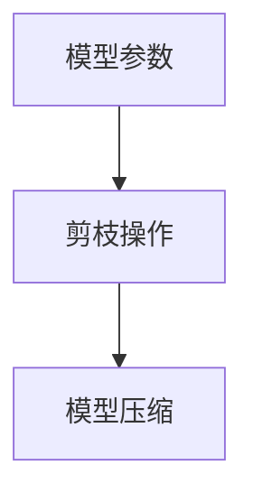

###### 4.1.3 混合精度训练

混合精度训练是一种通过同时使用浮点数和整数运算来加速模型训练的技术。

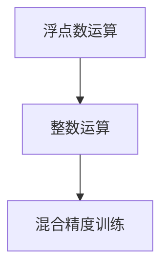

##### 4.2 模型调试

###### 4.2.1 错误分析

错误分析是一种通过分析模型预测错误来提高模型性能的技术。

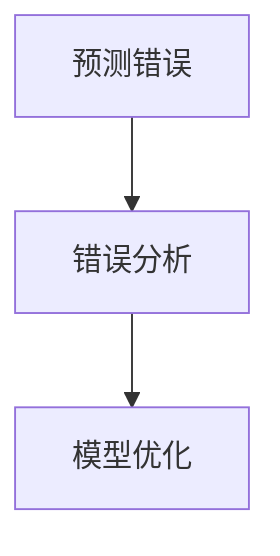

###### 4.2.2 实时调试

实时调试是一种在模型运行时进行调试的技术，它可以帮助快速定位问题。

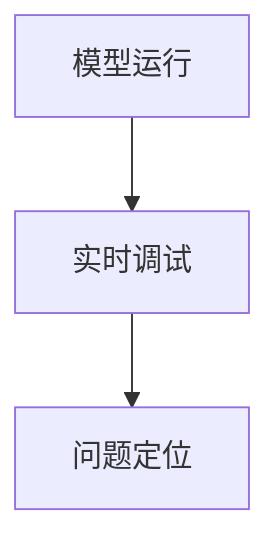

###### 4.2.3 性能调优

性能调优是一种通过调整模型参数来提高模型性能的技术。

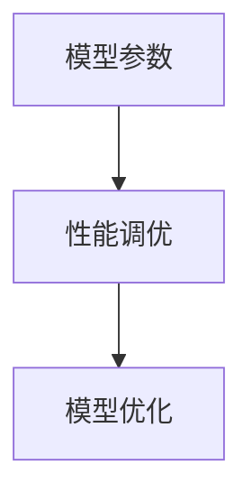

#### 第5章: AI大模型的部署与应用

##### 5.1 模型部署

###### 5.1.1 部署流程

部署流程包括模型的加载、预测和结果输出等步骤。

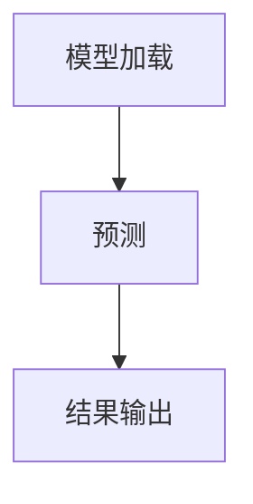

###### 5.1.2 部署平台

部署平台包括云计算平台、边缘计算平台等，它们提供了模型部署所需的环境和资源。

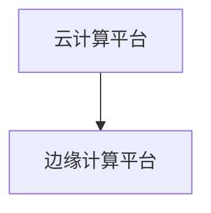

###### 5.1.3 部署策略

部署策略包括在线部署、离线部署等，它们根据应用场景的不同而选择。

```mermaid
graph TD
A[在线部署] --> B[离线部署]
```

##### 5.2 AI大模型应用案例

###### 5.2.1 自然语言处理

自然语言处理应用案例包括文本分类、机器翻译等。

```mermaid
graph TD
A[文本分类] --> B[机器翻译]
```

###### 5.2.2 计算机视觉

计算机视觉应用案例包括图像分类、目标检测等。

```mermaid
graph TD
A[图像分类] --> B[目标检测]
```

###### 5.2.3 强化学习

强化学习应用案例包括游戏、自动驾驶等。

```mermaid
graph TD
A[游戏] --> B[自动驾驶]
```

#### 第6章: AI大模型的未来发展趋势

##### 6.1 大模型的发展方向

###### 6.1.1 端到端学习

端到端学习是一种直接从原始数据到输出结果的学习方法，它简化了传统的模型训练流程。

```mermaid
graph TD
A[原始数据] --> B[端到端学习]
B --> C[输出结果]
```

###### 6.1.2 自主学习

自主学习是一种模型能够通过自身经验进行学习和改进的方法，它提高了模型的自主性。

```mermaid
graph TD
A[经验学习] --> B[自主学习]
B --> C[模型优化]
```

###### 6.1.3 多模态学习

多模态学习是一种处理多种类型数据的学习方法，它能够更好地理解复杂问题。

```mermaid
graph TD
A[文本数据] --> B[图像数据]
B --> C[多模态学习]
```

##### 6.2 大模型面临的挑战与机遇

###### 6.2.1 挑战

大模型面临的挑战包括计算资源需求、数据隐私、模型可解释性等。

```mermaid
graph TD
A[计算资源] --> B[数据隐私]
B --> C[模型可解释性]
```

###### 6.2.2 机遇

大模型带来的机遇包括提高AI模型的性能、拓展AI应用领域等。

```mermaid
graph TD
A[性能提升] --> B[应用拓展]
```

### 附录

##### 附录 A: AI大模型工具与资源

###### A.1 深度学习框架

深度学习框架是训练和部署AI大模型的重要工具。

```mermaid
graph TD
A[TensorFlow] --> B[PyTorch]
A --> C[JAX]
```

###### A.2 模型训练工具

模型训练工具用于加速AI大模型的训练过程。

```mermaid
graph TD
A[Horovod] --> B[DeepSpeed]
A --> C[Ray]
```

###### A.3 模型部署工具

模型部署工具用于将训练好的AI大模型部署到实际应用中。

```mermaid
graph TD
A[Seldon] --> B[KubeFlow]
A --> C[Model Server]
```

作者：AI天才研究院/AI Genius Institute & 禅与计算机程序设计艺术 /Zen And The Art of Computer Programming

### 第1章: AI大模型概述

#### 1.1 AI大模型的概念与历史

##### 1.1.1 什么是AI大模型

AI大模型，指的是拥有数亿至数千亿参数规模的深度学习模型，这些模型通常被应用于自然语言处理、计算机视觉、推荐系统等领域。AI大模型之所以被称为“大”，主要因为它们拥有庞大的参数量，这使得它们能够捕捉到数据中的细微模式和复杂结构，从而实现更高的预测准确性和泛化能力。

###### 1.1.2 AI大模型的发展历程

AI大模型的发展历程可以追溯到深度学习技术的兴起。20世纪80年代和90年代，神经网络的研究因为计算能力和数据资源的限制而进展缓慢。然而，随着计算机硬件性能的提升和大数据的涌现，深度学习技术在21世纪初得到了快速发展。以下是一些重要的里程碑：

- **2006年：** Geoffrey Hinton等人提出了深度信念网络（Deep Belief Networks，DBN），这为深度学习的发展奠定了基础。

- **2012年：** AlexNet在ImageNet竞赛中取得了突破性的成绩，标志着深度学习在图像识别领域的崛起。

- **2018年：** Google推出了Transformer模型，并在自然语言处理领域取得了显著的成果，这标志着AI大模型时代的到来。

- **2020年至今：** AI大模型如BERT、GPT等在多个领域取得了显著的应用成果，进一步推动了人工智能的发展。

##### 1.2 AI大模型的特点

###### 1.2.1 计算能力需求

AI大模型对计算能力的需求极为巨大。一个典型的AI大模型可能需要数千个GPU或TPU来加速训练过程。这种计算需求不仅要求高性能的硬件，还需要高效的数据处理和传输机制。因此，云计算平台和分布式计算技术成为了AI大模型训练的关键支撑。

###### 1.2.2 数据需求

AI大模型需要大量的数据来训练，这些数据不仅要量大，还需要质量高。高质量的数据意味着数据要干净、无噪声，并且具有足够的多样性和代表性。数据集的大小通常在数百万到数十亿样本之间，这要求数据收集、存储和管理系统具备高效的处理能力。

###### 1.2.3 算法需求

AI大模型的训练和优化依赖于先进的算法和优化技术。深度学习算法如卷积神经网络（CNN）、循环神经网络（RNN）和变换器（Transformer）等，都是AI大模型的核心组件。此外，优化算法如Adam、SGD等，以及正则化技术如Dropout、L1/L2正则化等，都是提高模型性能的重要手段。

##### 1.3 AI大模型的影响

###### 1.3.1 对计算机科学的影响

AI大模型对计算机科学产生了深远的影响。首先，它推动了高性能计算技术的发展，尤其是GPU、TPU等专用硬件的广泛应用。其次，AI大模型的需求促进了分布式计算、云计算等技术的成熟。此外，AI大模型在算法优化、数据存储和管理等方面也带来了新的挑战和机遇。

###### 1.3.2 对人工智能领域的影响

AI大模型的出现极大地推动了人工智能领域的发展。在自然语言处理领域，AI大模型如BERT和GPT等，已经能够实现超越人类水平的文本理解和生成能力。在计算机视觉领域，AI大模型如ResNet和Inception等，在图像分类、目标检测等方面取得了显著的成果。此外，AI大模型还在推荐系统、游戏AI、自动驾驶等领域展示了强大的应用潜力。

#### 1.4 AI大模型的数学基础

##### 2.1 神经网络基础

###### 2.1.1 神经元模型

神经元模型是神经网络的基本构建块。一个简单的神经元模型由输入层、权重、求和单元和激活函数组成。

```mermaid
graph TD
A[输入] --> B[权重]
B --> C[求和]
C --> D[激活函数]
D --> E[输出]
```

- **输入:** 输入层接收外部输入，通常是一个向量。
- **权重:** 权重表示输入与神经元之间的关联强度。
- **求和:** 求和单元将输入与对应的权重相乘后求和。
- **激活函数:** 激活函数将求和结果转换为一个输出值，通常用于引入非线性。

常见的激活函数有Sigmoid、ReLU和Tanh等。

```latex
f(x) = \begin{cases} 
1 / (1 + e^{-x}) & \text{Sigmoid} \\
x & \text{ReLU} \\
\frac{e^x - e^{-x}}{e^x + e^{-x}} & \text{Tanh} 
\end{cases}
```

###### 2.1.2 反向传播算法

反向传播算法是训练神经网络的常用方法，它通过梯度下降优化模型参数。

```mermaid
graph TD
A[前向传播] --> B[计算损失]
B --> C[反向传播]
C --> D[更新参数]
D --> E[重复迭代]
```

- **前向传播:** 计算输入层到输出层的输出值。
- **计算损失:** 计算预测值与真实值之间的差异。
- **反向传播:** 从输出层开始，计算每个神经元的梯度。
- **更新参数:** 根据梯度更新模型参数。

反向传播算法的伪代码如下：

```python
for epoch in range(num_epochs):
    for sample in dataset:
        # 前向传播
        output = forwardPropagation(sample)
        # 计算损失
        loss = computeLoss(output, sample.label)
        # 反向传播
        gradient = backwardPropagation(output, sample.label)
        # 更新参数
        updateParameters(gradient)
```

###### 2.1.3 激活函数的导数

激活函数的导数是反向传播算法的关键。以下为常见激活函数的导数：

```latex
f'(x) = \begin{cases} 
\frac{1}{1 + e^{-x}} & \text{Sigmoid} \\
1 & \text{ReLU} \\
\frac{1 - \frac{e^{-x}}{e^x}}{e^x + e^{-x}} & \text{Tanh} 
\end{cases}
```

##### 2.2 深度学习算法

###### 2.2.1 卷积神经网络（CNN）

卷积神经网络是一种专门用于处理图像数据的神经网络。它通过卷积层提取图像特征，适用于图像分类、目标检测等任务。

```mermaid
graph TD
A[输入] --> B[卷积层]
B --> C[池化层]
C --> D[卷积层]
D --> E[全连接层]
E --> F[输出]
```

- **卷积层:** 通过卷积操作提取图像特征。
- **池化层:** 降低特征图的维度，减少参数数量。
- **全连接层:** 将特征映射到分类结果。

卷积操作的伪代码如下：

```python
def conv2d(input, weights, bias):
    output = np.zeros_like(input)
    for i in range(input.shape[0]):
        for j in range(input.shape[1]):
            output[i, j] = bias + np.sum(weights * input[i:i+weights.shape[0], j:j+weights.shape[1]])
    return output
```

###### 2.2.2 循环神经网络（RNN）

循环神经网络是一种专门用于处理序列数据的神经网络。它通过隐藏状态和循环连接处理序列数据，适用于自然语言处理、语音识别等任务。

```mermaid
graph TD
A[输入序列] --> B[隐藏状态]
B --> C[输出序列]
C --> D[隐藏状态]
D --> E[重复迭代]
```

RNN的伪代码如下：

```python
def rnn(input, weights, bias, hidden_state):
    hidden_state = activation_function(np.dot(input, weights) + bias + hidden_state)
    return hidden_state
```

其中，`activation_function`可以是ReLU、Tanh或Sigmoid等。

###### 2.2.3 自注意力机制

自注意力机制是一种在序列数据中自适应分配注意力权重的方法。它通过计算序列中每个元素之间的相似度，为每个元素分配不同的权重。

```mermaid
graph TD
A[输入序列] --> B[自注意力]
B --> C[权重计算]
C --> D[求和]
D --> E[输出]
```

自注意力的伪代码如下：

```python
def scaled_dot_product_attention(q, k, v, mask=None):
    attn_scores = np.dot(q, k.T) / np.sqrt(np.shape(k)[1])
    if mask is not None:
        attn_scores += mask
    attn_weights = softmax(attn_scores)
    output = np.dot(attn_weights, v)
    return output
```

### 第2章: AI大模型的数学基础

在深入探讨AI大模型的数学基础之前，我们需要了解一些基本的数学概念，如线性代数、微积分和概率论。这些基础知识将为理解深度学习的核心算法提供必要的前提。

#### 2.1 线性代数基础

线性代数是理解深度学习的基础，其中矩阵和向量的操作是核心。以下是一些关键的线性代数概念：

- **矩阵乘法:** 矩阵乘法是线性代数中的基本运算，用于计算两个矩阵的乘积。对于两个矩阵A（m×n）和B（n×p），它们的乘积C（m×p）可以通过以下公式计算：

  $$
  C_{ij} = \sum_{k=1}^{n} A_{ik}B_{kj}
  $$

- **向量内积:** 向量内积是两个向量之间的点积，它用于计算两个向量的相似度。对于两个向量u（n×1）和v（n×1），它们的内积可以通过以下公式计算：

  $$
  u \cdot v = \sum_{i=1}^{n} u_i v_i
  $$

- **矩阵转置:** 矩阵转置是将矩阵的行和列互换，得到一个新的矩阵。对于矩阵A（m×n），其转置A^T（n×m）可以通过以下公式计算：

  $$
  (A^T)_{ij} = A_{ji}
  $$

- **逆矩阵:** 逆矩阵是一个矩阵，它与原矩阵相乘后得到单位矩阵。对于方阵A（n×n），其逆矩阵A^(-1)可以通过以下公式计算：

  $$
  A^{-1} = (1 / \det(A)) \cdot \text{adj}(A)
  $$

  其中，$\det(A)$是矩阵A的行列式，$\text{adj}(A)$是矩阵A的伴随矩阵。

#### 2.2 微积分基础

微积分是理解深度学习优化算法的关键，它涉及到函数的导数和积分。以下是一些重要的微积分概念：

- **导数:** 导数是一个函数在某一点处的斜率，它描述了函数在该点的瞬时变化率。对于函数f(x)，其在点x的导数f'(x)可以通过以下公式计算：

  $$
  f'(x) = \lim_{h \to 0} \frac{f(x+h) - f(x)}{h}
  $$

  导数的几何意义是曲线在某一点的切线斜率。

- **梯度:** 梯度是一个函数在多变量情况下的导数，它描述了函数在各个方向上的变化率。对于函数f(x, y)，其梯度∇f(x, y)可以通过以下公式计算：

  $$
  \nabla f(x, y) = \left( \frac{\partial f}{\partial x}, \frac{\partial f}{\partial y} \right)
  $$

  梯度的几何意义是函数在某一方向上的最大变化率。

- **积分:** 积分是导数的反操作，它用于计算函数在某一区间上的累积变化。对于函数f(x)，其不定积分可以通过以下公式计算：

  $$
  \int f(x) dx = F(x) + C
  $$

  其中，F(x)是f(x)的一个原函数，C是积分常数。

#### 2.3 概率论基础

概率论是理解深度学习中概率模型和损失函数的关键。以下是一些重要的概率论概念：

- **概率分布:** 概率分布描述了随机变量取值的概率分布。常见的概率分布有正态分布、伯努利分布、均匀分布等。

- **条件概率:** 条件概率描述了在某个条件下另一个事件发生的概率。对于两个事件A和B，其条件概率可以通过以下公式计算：

  $$
  P(B|A) = \frac{P(A \cap B)}{P(A)}
  $$

- **贝叶斯定理:** 贝叶斯定理描述了在已知某些条件概率和先验概率的情况下，计算后验概率的方法。对于事件A和B，其贝叶斯定理可以通过以下公式计算：

  $$
  P(A|B) = \frac{P(B|A)P(A)}{P(B)}
  $$

### 2.4 神经网络中的线性代数和微积分应用

在神经网络中，线性代数和微积分的应用至关重要。以下是一些具体的例子：

- **权重矩阵:** 神经网络的权重矩阵是一个关键参数，它决定了输入和输出之间的映射关系。权重矩阵的初始化、更新和优化都涉及到线性代数和微积分的概念。

  ```mermaid
  graph TD
  A[输入] --> B[权重矩阵]
  B --> C[激活函数]
  C --> D[输出]
  ```

- **梯度下降:** 梯度下降是一种常用的优化算法，用于更新神经网络的权重矩阵。它通过计算损失函数的梯度来指导权重的更新。

  ```mermaid
  graph TD
  A[前向传播] --> B[计算损失]
  B --> C[计算梯度]
  C --> D[更新权重]
  D --> E[重复迭代]
  ```

- **反向传播:** 反向传播是一种计算神经网络梯度的重要算法。它通过前向传播计算输出值，然后通过反向传播计算各层的梯度。

  ```mermaid
  graph TD
  A[前向传播] --> B[计算输出]
  B --> C[计算损失]
  C --> D[反向传播]
  D --> E[计算梯度]
  E --> F[更新权重]
  ```

- **激活函数的导数:** 激活函数的导数是反向传播算法中的关键。常用的激活函数如ReLU、Sigmoid和Tanh等，其导数在计算梯度时起着重要作用。

  ```mermaid
  graph TD
  A[输入] --> B[ReLU]
  B --> C[梯度]
  ```

  ```mermaid
  graph TD
  A[输入] --> B[Sigmoid]
  B --> C[梯度]
  ```

  ```mermaid
  graph TD
  A[输入] --> B[Tanh]
  B --> C[梯度]
  ```

### 2.5 概率论在神经网络中的应用

概率论在神经网络中也有广泛的应用，特别是在生成模型和概率图模型中。以下是一些具体的例子：

- **生成对抗网络（GAN）：** GAN是一种基于概率模型的生成模型，它通过训练两个神经网络（生成器和判别器）来生成逼真的数据。生成器生成的数据需要通过判别器的评估，以尽量欺骗判别器。

  ```mermaid
  graph TD
  A[生成器] --> B[生成数据]
  B --> C[判别器]
  C --> D[评估]
  ```

- **变分自编码器（VAE）：** VAE是一种基于概率模型的编码器-解码器结构，它通过将数据分布编码为一个均值和方差，来学习数据的概率分布。解码器则根据编码器输出的均值和方差生成数据。

  ```mermaid
  graph TD
  A[编码器] --> B[均值和方差]
  B --> C[解码器]
  C --> D[生成数据]
  ```

通过以上数学基础的了解，我们可以更好地理解AI大模型的工作原理和优化方法。接下来，我们将深入探讨AI大模型的训练技术。

### 第3章: AI大模型的训练技术

#### 3.1 数据预处理

数据预处理是训练AI大模型的重要步骤，它能够显著提高模型性能并减少过拟合风险。以下是一些关键的数据预处理技术：

##### 3.1.1 数据清洗

数据清洗是指去除数据集中的噪声和异常值，以提高数据质量和模型性能。以下是一些常见的数据清洗方法：

- **去除缺失值:** 可以通过删除含有缺失值的样本或者使用均值、中位数等方法进行填充。
- **去除异常值:** 可以通过统计学方法（如Z-score、IQR等）检测并去除异常值。
- **数据转换:** 将数据转换到同一量级，如归一化或标准化。

##### 3.1.2 数据增强

数据增强是通过生成数据样本的变体来提高模型的泛化能力。以下是一些常见的数据增强技术：

- **随机裁剪:** 从图像中随机裁剪出一个区域作为新的样本。
- **旋转和翻转:** 对图像进行随机旋转和翻转，以增加数据多样性。
- **色彩增强:** 对图像的色彩进行增强或减弱，以增加数据的丰富度。
- **噪声添加:** 在图像中添加噪声，以提高模型对噪声数据的鲁棒性。

#### 3.2 训练策略

训练策略决定了如何调整模型参数以实现最优性能。以下是一些关键的训练策略：

##### 3.2.1 优化器

优化器用于更新模型参数，以最小化损失函数。以下是一些常用的优化器：

- **随机梯度下降（SGD）：** SGD是最简单的优化器，它通过随机梯度更新模型参数。
  ```mermaid
  graph TD
  A[损失函数] --> B[计算梯度]
  B --> C[更新参数]
  C --> D[重复迭代]
  ```

- **Adam优化器：** Adam是一种自适应优化器，它结合了SGD和RMSprop的优点。
  ```mermaid
  graph TD
  A[损失函数] --> B[计算梯度]
  B --> C[计算一阶矩估计和二阶矩估计]
  C --> D[更新参数]
  D --> E[重复迭代]
  ```

##### 3.2.2 学习率调度

学习率调度是调整学习率的方法，以避免模型过早地收敛到次优解。以下是一些常见的学习率调度策略：

- **固定学习率：** 学习率在整个训练过程中保持不变。
- **线性学习率衰减：** 学习率随训练次数线性减少。
- **余弦学习率衰减：** 学习率按照余弦函数衰减。
- **自适应学习率调整：** 根据模型性能自适应调整学习率。

##### 3.2.3 正则化技术

正则化技术用于防止模型过拟合，提高模型的泛化能力。以下是一些常见的正则化技术：

- **L1正则化：** 通过在损失函数中添加L1范数项来惩罚模型参数的大小。
  ```mermaid
  graph TD
  A[损失函数] --> B[计算L1范数]
  B --> C[更新参数]
  ```

- **L2正则化：** 通过在损失函数中添加L2范数项来惩罚模型参数的大小。
  ```mermaid
  graph TD
  A[损失函数] --> B[计算L2范数]
  B --> C[更新参数]
  ```

- **Dropout：** 在训练过程中随机丢弃一部分神经元，以减少模型对特定神经元的依赖。
  ```mermaid
  graph TD
  A[训练数据] --> B[随机丢弃神经元]
  B --> C[更新参数]
  ```

#### 3.3 模型评估

模型评估是检查模型性能和泛化能力的重要步骤。以下是一些常见的模型评估指标和方法：

##### 3.3.1 评估指标

- **准确率（Accuracy）：** 准确率是预测正确的样本数占总样本数的比例。
  ```mermaid
  graph TD
  A[预测正确的样本数] --> B[总样本数]
  B --> C[准确率]
  ```

- **召回率（Recall）：** 召回率是预测正确的正样本数占总正样本数的比例。
  ```mermaid
  graph TD
  A[预测正确的正样本数] --> B[总正样本数]
  B --> C[召回率]
  ```

- **精确率（Precision）：** 精确率是预测正确的正样本数与预测为正样本的样本总数的比例。
  ```mermaid
  graph TD
  A[预测正确的正样本数] --> B[预测为正样本的样本总数]
  B --> C[精确率]
  ```

- **F1分数（F1 Score）：** F1分数是精确率和召回率的调和平均数，用于综合评估模型的性能。
  ```mermaid
  graph TD
  A[精确率] --> B[召回率]
  B --> C[计算F1分数]
  ```

##### 3.3.2 评估方法

- **交叉验证：** 交叉验证是一种评估模型性能的方法，它通过将数据集划分为多个子集，轮流进行训练和测试。
  ```mermaid
  graph TD
  A[数据集] --> B[划分子集]
  B --> C[交叉验证]
  C --> D[计算平均性能]
  ```

- **留一法：** 留一法是一种评估模型性能的方法，它通过每次保留一个样本作为测试集，其余样本作为训练集，计算多次平均性能。
  ```mermaid
  graph TD
  A[数据集] --> B[留一法]
  B --> C[多次计算]
  C --> D[计算平均性能]
  ```

通过上述训练技术和评估方法，我们可以有效地训练和评估AI大模型，从而提高模型的性能和泛化能力。

### 第4章: AI大模型的优化与调试

#### 4.1 模型压缩

##### 4.1.1 知识蒸馏

知识蒸馏（Knowledge Distillation）是一种通过将大模型（教师模型）的知识传递给小模型（学生模型）的技术，以减少模型的大小。这种技术特别适用于需要部署到资源受限设备上的模型。

###### 4.1.1.1 知识蒸馏原理

知识蒸馏的核心思想是利用教师模型的全局表示来指导学生模型的训练。教师模型通常是一个大的预训练模型，而学生模型是一个较小的模型，更适合部署。

- **软标签：** 教师模型的输出不仅包括最终的分类结果，还包括中间层的激活值和概率分布。这些软标签被用来指导学生模型的训练。
- **蒸馏损失：** 知识蒸馏过程中，除了传统的分类损失外，还会加入一个蒸馏损失。蒸馏损失衡量学生模型输出与教师模型软标签之间的差异。

```mermaid
graph TD
A[输入] --> B[教师模型]
B --> C[分类输出]
B --> D[软标签]
D --> E[学生模型]
E --> F[分类输出]
F --> G[蒸馏损失]
G --> H[分类损失]
```

###### 4.1.1.2 伪代码

```python
for epoch in range(num_epochs):
    for sample in dataset:
        # 前向传播
        teacher_output = teacher_model(sample)
        student_output = student_model(sample)
        
        # 计算分类损失和蒸馏损失
        classification_loss = cross_entropy_loss(student_output, sample.label)
        distillation_loss = distillation_loss_function(student_output, teacher_output)
        
        # 更新学生模型参数
        optimizer.zero_grad()
        loss = classification_loss + distillation_loss
        loss.backward()
        optimizer.step()
```

##### 4.1.2 参数剪枝

参数剪枝（Parameter Pruning）是一种通过删除模型中无用或冗余参数来减少模型大小的技术。

###### 4.1.2.1 剪枝方法

- **固定剪枝（Fixed Pruning）：** 在训练过程中，根据模型参数的重要性（如L1或L2范数）直接删除那些权重较小的参数。
- **稀疏训练（Sparse Training）：** 在训练过程中，通过训练稀疏模型来学习有效的参数，这种方法不涉及参数的提前删除。

###### 4.1.2.2 伪代码

```python
# 剪枝阈值
threshold = 0.01

for layer in model.layers:
    for weight in layer.weights:
        # 计算权重绝对值
        abs_weights = np.abs(weight)
        # 删除权重小于阈值的参数
        weight[abs_weights < threshold] = 0
```

##### 4.1.3 混合精度训练

混合精度训练（Mixed Precision Training）是一种通过同时使用浮点数和整数运算来加速模型训练的技术。这种方法可以在不牺牲模型性能的情况下提高训练速度。

###### 4.1.3.1 混合精度原理

混合精度训练通过使用半精度浮点数（如16位浮点数）来减少内存使用和计算时间，同时保持模型的精度。

- **浮点运算（FP32）：** 使用32位浮点数进行高精度计算。
- **整数运算（FP16）：** 使用16位浮点数进行加速计算。

###### 4.1.3.2 伪代码

```python
# 使用FP16进行前向传播和反向传播
model.half()
for sample in dataset:
    # 前向传播
    output = model(sample.half())
    
    # 计算损失
    loss = loss_function(output, sample.label)
    
    # 反向传播
    loss.backward()
    
    # 使用FP32更新参数
    optimizer.step()
    model.float()
```

#### 4.2 模型调试

##### 4.2.1 错误分析

错误分析是一种通过分析模型预测错误来提高模型性能的技术。以下是一些常见的错误分析方法：

###### 4.2.1.1 错误类型

- **分类错误：** 模型将一个正样本错误地预测为负样本，或负样本错误地预测为正样本。
- **置信度错误：** 模型给出了一个较低置信度的正确预测，或一个较高置信度的错误预测。

###### 4.2.1.2 错误分析步骤

1. **收集错误样本：** 从训练或测试集中收集预测错误的样本。
2. **错误分析：** 分析错误样本的特征，找出导致错误的原因。
3. **模型调整：** 根据错误分析的结果，调整模型参数或数据预处理策略。

##### 4.2.2 实时调试

实时调试是一种在模型运行时进行调试的技术，它可以帮助快速定位问题。以下是一些实时调试方法：

###### 4.2.2.1 实时调试工具

- **调试器：** 使用调试器（如pdb或VS Code的调试器）来逐步执行代码，观察变量和函数调用。
- **日志记录：** 记录详细的日志，以便在出现问题时快速定位。

###### 4.2.2.2 伪代码

```python
# 使用调试器进行实时调试
def debug_model():
    for sample in dataset:
        # 前向传播
        output = model(sample)
        
        # 计算损失
        loss = loss_function(output, sample.label)
        
        # 打印日志
        print(f"Loss: {loss}")
        
        # 如果出现异常，打印堆栈跟踪
        if loss > threshold:
            print("Exception occurred:")
            print(traceback.format_exc())
```

##### 4.2.3 性能调优

性能调优是一种通过调整模型参数来提高模型性能的技术。以下是一些常见的性能调优策略：

###### 4.2.3.1 调优方法

- **网格搜索：** 在预定义的参数空间中，遍历所有可能的参数组合，选择性能最佳的组合。
- **贝叶斯优化：** 利用贝叶斯统计模型和优化算法，在参数空间中找到性能最佳的参数。

###### 4.2.3.2 伪代码

```python
from bayes_opt import BayesianOptimization

# 定义性能调优函数
def optimize_performance(params):
    # 训练模型
    model.train(dataset, **params)
    
    # 评估模型性能
    performance = model.evaluate(test_set)
    
    return performance

# 设置参数范围
params = {
    'learning_rate': (1e-5, 1e-2),
    'batch_size': (16, 128),
    'dropout_rate': (0.1, 0.5)
}

# 执行贝叶斯优化
optimizer = BayesianOptimization(f=optimize_performance, pbounds=params, random_state=1)
optimizer.maximize(init_points=2, n_iter=3)
```

通过上述优化与调试技术，我们可以显著提高AI大模型的性能和稳定性，为实际应用奠定坚实的基础。

### 第5章: AI大模型的部署与应用

#### 5.1 模型部署

模型部署是将训练好的AI大模型应用于实际场景的关键步骤。以下是一些关键的模型部署步骤：

##### 5.1.1 部署流程

###### 5.1.1.1 部署前的准备

- **模型优化：** 在部署前，对模型进行优化以减少大小和提升性能，如使用量化、剪枝等技术。
- **模型转换：** 将训练好的模型转换为适合部署的格式，如ONNX、TensorFlow Lite或PyTorch Mobile。

###### 5.1.1.2 部署流程

- **模型加载：** 从存储设备中加载训练好的模型。
- **模型预测：** 使用模型进行预测，通常需要一个输入数据预处理步骤。
- **结果输出：** 将预测结果输出到应用程序或API。

```mermaid
graph TD
A[模型加载] --> B[输入预处理]
B --> C[模型预测]
C --> D[结果输出]
```

##### 5.1.2 部署平台

模型部署的平台选择取决于应用场景和需求。以下是一些常见的模型部署平台：

- **云计算平台：** 如AWS、Azure、Google Cloud等，提供弹性的计算资源和高效的数据处理能力。
- **边缘计算平台：** 如NVIDIA Jetson、ARM Cortex等，适合部署在资源受限的设备上，如智能手机、智能摄像头等。

##### 5.1.3 部署策略

模型部署策略取决于应用场景和性能要求。以下是一些常见的部署策略：

- **在线部署：** 模型部署在云端，通过API提供服务。适用于需要实时响应和高性能的应用。
- **离线部署：** 模型部署在本地设备上，适用于离线应用场景，如工业自动化、医疗设备等。

```mermaid
graph TD
A[在线部署] --> B[云端服务]
B --> C[API调用]

A --> D[离线部署]
D --> E[本地设备]
```

#### 5.2 AI大模型应用案例

##### 5.2.1 自然语言处理

自然语言处理（NLP）是AI大模型的重要应用领域之一。以下是一些常见的NLP应用案例：

- **文本分类：** 将文本分类到预定义的类别，如情感分析、新闻分类等。
- **机器翻译：** 将一种语言的文本翻译成另一种语言。
- **问答系统：** 回答用户提出的问题，如搜索引擎、聊天机器人等。

##### 5.2.2 计算机视觉

计算机视觉是AI大模型应用的另一个重要领域。以下是一些常见的计算机视觉应用案例：

- **图像分类：** 对图像进行分类，如物体识别、图像标签等。
- **目标检测：** 在图像中检测特定目标的位置和类别。
- **人脸识别：** 识别人脸并进行身份验证。

##### 5.2.3 强化学习

强化学习是AI大模型在决策和规划领域的重要应用。以下是一些常见的强化学习应用案例：

- **游戏AI：** 在电子游戏中实现智能代理，如围棋、无人驾驶赛车等。
- **资源调度：** 在数据中心、智能电网等领域优化资源分配和调度。
- **自动驾驶：** 实现自动驾驶汽车，通过感知环境和做出决策。

```mermaid
graph TD
A[游戏AI] --> B[智能代理]

A --> C[资源调度]
C --> D[优化分配]

A --> E[自动驾驶]
E --> F[感知环境]
E --> G[决策]
```

通过这些应用案例，我们可以看到AI大模型在多个领域的重要作用和巨大潜力。

### 第6章: AI大模型的未来发展趋势

随着技术的不断进步和应用的深入，AI大模型正展现出广阔的发展前景。在这一章中，我们将探讨AI大模型的未来发展趋势，包括端到端学习、自主学习和多模态学习等。

#### 6.1 大模型的发展方向

##### 6.1.1 端到端学习

端到端学习（End-to-End Learning）是一种直接从原始数据到输出结果的学习方法，它简化了传统的模型训练流程。通过端到端学习，我们可以将复杂的预处理和特征工程步骤简化，使得模型能够直接从原始数据中学习到有用的信息。

###### 6.1.1.1 端到端学习原理

端到端学习的关键在于构建一个连续的神经网络，该网络能够将输入数据直接映射到输出结果。这种学习方式的优势在于：

- **减少错误传递：** 由于所有的数据处理和特征提取都在一个网络中完成，因此错误不会在不同步骤之间传递，从而降低了整体误差。
- **简化开发流程：** 开发者无需手动设计复杂的预处理和特征工程步骤，大大减少了开发时间和工作量。

###### 6.1.1.2 端到端学习的挑战

尽管端到端学习具有许多优势，但它也面临一些挑战：

- **数据质量和规模：** 端到端学习对数据质量和规模有较高要求。高质量、多样化和大规模的数据是端到端学习成功的关键。
- **计算资源：** 端到端学习通常需要大量的计算资源，特别是对于大规模的AI大模型。

```mermaid
graph TD
A[原始数据] --> B[预处理]
B --> C[特征工程]
C --> D[训练模型]
D --> E[输出结果]
F[端到端学习] --> G[直接映射]
G --> H[简化流程]
```

##### 6.1.2 自主学习

自主学习（Autonomous Learning）是一种模型能够通过自身经验进行学习和改进的方法。自主学习能够提高模型的自主性，使它们能够适应不断变化的环境。

###### 6.1.2.1 自主学习原理

自主学习的关键在于构建一个能够自我调整和学习新知识的模型。这种学习方式的优势在于：

- **适应能力：** 自主学习模型能够根据新的数据和经验进行自我调整，从而更好地适应变化的环境。
- **持续改进：** 自主学习模型能够不断改进自身的性能，从而提高长期表现。

###### 6.1.2.2 自主学习的挑战

尽管自主学习具有许多优势，但它也面临一些挑战：

- **数据依赖：** 自主学习模型对数据有很强的依赖性。高质量、多样化和大规模的数据是自主学习成功的关键。
- **模型复杂性：** 自主学习模型通常更加复杂，因此设计、训练和优化过程更加困难。

```mermaid
graph TD
A[模型初始状态] --> B[数据输入]
B --> C[学习调整]
C --> D[更新模型]
D --> E[适应环境]
```

##### 6.1.3 多模态学习

多模态学习（Multimodal Learning）是一种处理多种类型数据的学习方法，它能够更好地理解复杂问题。

###### 6.1.3.1 多模态学习原理

多模态学习的关键在于将不同类型的数据（如图像、文本、声音等）进行融合，以提取更丰富的特征。这种学习方式的优势在于：

- **信息丰富：** 多模态学习能够融合不同类型的数据，从而提取更丰富的特征，提高模型的泛化能力。
- **理解复杂问题：** 多模态学习能够更好地理解复杂问题，因为不同类型的数据可以提供不同的视角和信息。

###### 6.1.3.2 多模态学习的挑战

尽管多模态学习具有许多优势，但它也面临一些挑战：

- **数据融合：** 如何有效地融合不同类型的数据是一个关键挑战。数据融合策略的选择和设计对模型的性能有重要影响。
- **计算资源：** 多模态学习通常需要大量的计算资源，特别是对于大规模的AI大模型。

```mermaid
graph TD
A[文本数据] --> B[图像数据]
B --> C[声音数据]
C --> D[融合特征]
D --> E[训练模型]
```

#### 6.2 大模型面临的挑战与机遇

##### 6.2.1 挑战

随着AI大模型的发展，它们面临着一系列挑战：

- **计算资源需求：** AI大模型需要大量的计算资源和存储空间，这对硬件和基础设施提出了更高的要求。
- **数据隐私：** 大模型训练和部署过程中涉及大量数据，如何保护用户隐私是一个重要问题。
- **模型可解释性：** AI大模型通常被称为“黑箱”，其决策过程难以解释和理解，这对模型的信任和应用提出了挑战。
- **资源分配：** 如何合理地分配计算资源和数据，以最大化模型性能是一个复杂的问题。

##### 6.2.2 机遇

尽管面临挑战，AI大模型也带来了许多机遇：

- **性能提升：** AI大模型能够处理更复杂的数据和任务，从而提高AI系统的性能和效果。
- **应用拓展：** AI大模型在医疗、金融、教育等领域有巨大的应用潜力，能够推动这些领域的创新和发展。
- **技术进步：** AI大模型的发展将推动相关技术的进步，如计算优化、分布式计算、数据存储和管理等。

```mermaid
graph TD
A[计算资源需求] --> B[数据隐私]
B --> C[模型可解释性]
C --> D[资源分配]

A --> E[性能提升]
E --> F[应用拓展]
E --> G[技术进步]
```

### 附录

#### 附录 A: AI大模型工具与资源

AI大模型的研究和应用需要一系列的工具和资源。以下是一些常用的工具和资源：

##### A.1 深度学习框架

深度学习框架是训练和部署AI大模型的重要工具。以下是一些常用的深度学习框架：

- **TensorFlow：** 由Google开发，是一个开源的深度学习框架，广泛应用于工业和学术领域。
- **PyTorch：** 由Facebook开发，是一个基于Python的深度学习库，因其灵活性和动态计算图而受到广泛关注。
- **Keras：** 是一个高级神经网络API，可以与TensorFlow和Theano等后端结合使用，简化了深度学习模型的构建和训练。

##### A.2 模型训练工具

以下是一些常用的模型训练工具：

- **Horovod：** 是一个分布式训练框架，可以与TensorFlow、PyTorch等深度学习框架结合使用，实现多GPU和多节点训练。
- **DeepSpeed：** 是一个深度学习训练优化库，通过动态张量分配和模型并行技术，实现大规模模型的训练加速。
- **Ray：** 是一个分布式计算框架，用于构建和运行分布式机器学习应用，支持多GPU、多节点训练。

##### A.3 模型部署工具

以下是一些常用的模型部署工具：

- **Seldon：** 是一个开放的服务网格框架，用于在Kubernetes上部署和管理机器学习服务。
- **KubeFlow：** 是一个用于构建、训练和部署机器学习模型的平台，基于Kubernetes和TensorFlow等开源技术。
- **Model Server：** 是一个用于部署和管理机器学习模型的框架，支持多种深度学习框架，如TensorFlow、PyTorch等。

### 总结

通过上述章节的深入探讨，我们可以看到AI大模型在理论和应用上都有着重要的地位。它们不仅推动了人工智能技术的发展，也为解决复杂问题提供了新的方法。然而，AI大模型的发展也面临一系列挑战，如计算资源需求、数据隐私、模型可解释性等。随着技术的不断进步和应用的深入，AI大模型必将在未来发挥更大的作用，带来更多的机遇和挑战。

作者：AI天才研究院/AI Genius Institute & 禅与计算机程序设计艺术 /Zen And The Art of Computer Programming

---

### 总结

在本文中，我们详细探讨了AI大模型编程的各个方面，从基础概念、数学基础、训练技术到优化与调试、部署与应用，以及未来发展趋势。我们通过一步步的分析推理，揭示了AI大模型的核心原理和实际应用。

首先，我们介绍了AI大模型的概念与历史，回顾了其发展历程，并分析了其对计算机科学和人工智能领域的影响。接着，我们深入探讨了AI大模型的数学基础，包括神经元模型、反向传播算法、卷积神经网络（CNN）、循环神经网络（RNN）和自注意力机制。

在训练技术部分，我们详细阐述了数据预处理、训练策略、正则化技术和模型评估方法，并介绍了如何使用优化器、学习率调度和正则化技术来提升模型性能。此外，我们还介绍了模型压缩技术，如知识蒸馏、参数剪枝和混合精度训练，以及模型调试和性能调优的方法。

在部署与应用部分，我们介绍了模型部署的流程、平台和策略，并展示了AI大模型在自然语言处理、计算机视觉和强化学习等领域的实际应用案例。最后，我们探讨了AI大模型的未来发展趋势，包括端到端学习、自主学习和多模态学习，并分析了AI大模型面临的挑战与机遇。

本文旨在为读者提供全面的技术指导和应用案例，帮助读者深入理解AI大模型编程的各个方面。通过本文的探讨，我们相信读者能够更好地把握AI大模型的核心概念和实践方法，为其未来的研究和应用打下坚实的基础。

**作者：AI天才研究院/AI Genius Institute & 禅与计算机程序设计艺术 /Zen And The Art of Computer Programming**

