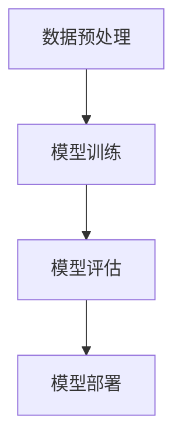

                 

# AI大模型编程：提示词的潜力

## 关键词
- AI大模型编程
- 提示词设计
- 编程实战
- 提示词优化
- 编程工具与资源

## 摘要
本文旨在探讨AI大模型编程中提示词的重要性及其潜力。我们将从基础概念入手，逐步深入探讨提示词的设计原则、应用场景，并通过实际编程案例进行解析，揭示提示词在AI大模型编程中的核心作用。最后，我们将展望提示词的未来发展，探讨其在编程领域的潜力。

## 第一部分: AI大模型编程基础

### 第1章: AI大模型简介

#### 1.1 AI大模型的历史背景与发展趋势

人工智能（AI）作为计算机科学的一个分支，自上世纪50年代诞生以来，经历了从符号主义、连接主义到现代深度学习的演变。特别是随着计算能力的提升和大数据的普及，AI大模型成为了研究与应用的热点。

AI大模型，通常指的是具有数十亿甚至千亿级参数的神经网络模型。这些模型能够在大量数据上进行训练，从而在多个领域表现出强大的性能。例如，自然语言处理中的BERT、GPT系列模型，计算机视觉中的ImageNet模型等。

AI大模型的发展历程可以分为几个阶段：

- **早期阶段（1956-1980）**：以符号主义为主，强调知识表示和推理。代表性的工作是逻辑符号系统和专家系统的开发。
- **中期阶段（1980-2012）**：连接主义开始崭露头角，尤其是人工神经网络和强化学习的研究。
- **现代阶段（2012至今）**：深度学习的崛起，特别是卷积神经网络（CNN）和循环神经网络（RNN）的广泛应用，推动了AI大模型的发展。

#### 1.2 AI大模型的架构与核心技术

AI大模型的架构通常包括以下几个部分：

1. **输入层**：接收外部输入数据，如文本、图像、声音等。
2. **隐藏层**：多层神经网络结构，用于特征提取和变换。
3. **输出层**：根据模型类型，产生预测结果或决策。

核心技术在以下几个方面：

1. **神经网络**：神经元之间通过权重进行连接，形成复杂的网络结构。
2. **反向传播算法**：通过计算输出误差，调整网络权重，实现模型的优化。
3. **激活函数**：如ReLU、Sigmoid、Tanh等，用于引入非线性特性。

#### 1.3 AI大模型的基本原理与工作流程

AI大模型的基本原理可以概括为以下几个步骤：

1. **数据预处理**：对输入数据进行标准化、编码等处理。
2. **模型训练**：通过大量数据训练模型，调整网络权重。
3. **模型评估**：使用验证集或测试集评估模型性能。
4. **模型部署**：将训练好的模型部署到实际应用场景中。

工作流程如图所示：



### 第2章: 提示词的重要性

#### 2.1 提示词的概念与作用

提示词（Prompt）在AI大模型编程中起着至关重要的作用。它是指提供给模型的一组输入，用于引导模型生成预期的输出。简单来说，提示词是模型理解任务和生成结果的关键。

提示词的作用主要体现在以下几个方面：

1. **引导模型生成**：通过提供具体的输入，提示词可以帮助模型更准确地理解任务，从而生成更符合预期的输出。
2. **提高模型性能**：有效的提示词设计可以显著提高模型在特定任务上的性能。
3. **增强模型泛化能力**：合适的提示词设计可以帮助模型更好地适应不同场景，提高泛化能力。

#### 2.2 提示词的设计原则与方法

设计有效的提示词需要遵循以下原则：

1. **明确性**：提示词应清晰明确，避免歧义。
2. **针对性**：根据具体任务设计，突出关键信息。
3. **多样性**：使用多样化的提示词，以适应不同情境。
4. **可扩展性**：设计时考虑未来的扩展和更新。

常见的设计方法包括：

1. **问题陈述法**：直接以问题的形式给出提示词。
2. **任务描述法**：详细描述任务目标和要求。
3. **数据驱动的提示词生成**：利用已有数据和模型生成提示词。

#### 2.3 提示词的效果评估与优化

评估提示词的效果是设计过程中的关键环节。常用的评估方法包括：

1. **模型性能评估**：通过模型在特定任务上的表现来评估提示词的有效性。
2. **用户满意度评估**：收集用户反馈，了解提示词的实用性。
3. **对比实验**：设计对比实验，分析不同提示词对模型性能的影响。

优化提示词的方法包括：

1. **迭代改进**：根据评估结果不断调整和优化提示词。
2. **数据增强**：增加更多的训练数据和提示词样本来丰富模型。
3. **模型调整**：结合模型特性，适当调整网络结构和参数。

### 第3章: AI大模型编程入门

#### 3.1 编程环境与工具安装

在开始AI大模型编程之前，需要搭建合适的编程环境。以下是一个基本的安装指南：

1. **操作系统**：推荐使用Linux或macOS，因为它们对深度学习框架的支持较好。
2. **Python环境**：安装Python 3.x版本，可以使用`pip`进行依赖管理。
3. **深度学习框架**：安装TensorFlow或PyTorch，这两个框架是目前最流行的深度学习框架。

具体安装命令如下：

```bash
# 安装Python
sudo apt-get install python3-pip python3-dev

# 安装TensorFlow
pip3 install tensorflow

# 或者安装PyTorch
pip3 install torch torchvision
```

#### 3.2 基本编程语言与库函数介绍

AI大模型编程涉及Python编程语言和一些核心库函数。以下是Python在AI大模型编程中的基本用法：

1. **变量与数据类型**：熟悉Python中的变量定义和数据类型，如整数、浮点数、字符串等。
2. **控制结构**：掌握条件判断（`if-else`）、循环（`for`、`while`）等基本控制结构。
3. **函数与模块**：学习定义函数、使用模块和库函数，如NumPy、Pandas等。

以下是一个简单的示例：

```python
# 导入NumPy库
import numpy as np

# 定义函数
def add(a, b):
    return a + b

# 使用函数
result = add(2, 3)
print(result)  # 输出：5
```

#### 3.3 编程实战：构建简单的AI大模型

在本节中，我们将使用PyTorch构建一个简单的AI大模型，用于实现线性回归任务。以下是详细步骤：

1. **数据准备**：使用NumPy生成训练数据。
2. **模型定义**：定义线性回归模型。
3. **模型训练**：使用训练数据训练模型。
4. **模型评估**：使用测试数据评估模型性能。

具体实现如下：

```python
import torch
import torch.nn as nn
import numpy as np

# 数据准备
x = torch.tensor(np.random.rand(100, 1), dtype=torch.float32)
y = torch.tensor(np.random.rand(100, 1), dtype=torch.float32)

# 模型定义
model = nn.Linear(1, 1)

# 模型训练
criterion = nn.MSELoss()
optimizer = torch.optim.SGD(model.parameters(), lr=0.01)

for epoch in range(100):
    optimizer.zero_grad()
    y_pred = model(x)
    loss = criterion(y_pred, y)
    loss.backward()
    optimizer.step()

# 模型评估
with torch.no_grad():
    y_pred = model(x)
    print(f"RMSE: {torch.sqrt(criterion(y_pred, y).mean()):.4f}")
```

### 第4章: AI大模型编程进阶

#### 4.1 复杂模型的构建与训练

在入门的基础上，本节将介绍如何构建和训练更复杂的AI大模型。以下是一个基于卷积神经网络的简单图像分类模型的实现：

```python
import torch
import torch.nn as nn
import torchvision.transforms as transforms
import torchvision.datasets as datasets

# 数据准备
transform = transforms.Compose([transforms.Resize(224), transforms.ToTensor()])
train_set = datasets.ImageFolder('train', transform=transform)
train_loader = torch.utils.data.DataLoader(train_set, batch_size=64, shuffle=True)

# 模型定义
model = nn.Sequential(
    nn.Conv2d(3, 32, 5),
    nn.ReLU(),
    nn.Conv2d(32, 64, 5),
    nn.ReLU(),
    nn.Flatten(),
    nn.Linear(64 * 44 * 44, 10)
)

# 模型训练
criterion = nn.CrossEntropyLoss()
optimizer = torch.optim.Adam(model.parameters(), lr=0.001)

for epoch in range(10):
    running_loss = 0.0
    for i, (inputs, labels) in enumerate(train_loader):
        optimizer.zero_grad()
        outputs = model(inputs)
        loss = criterion(outputs, labels)
        loss.backward()
        optimizer.step()
        running_loss += loss.item()
    print(f"Epoch {epoch+1}, Loss: {running_loss/len(train_loader):.4f}")
```

#### 4.2 提示词的进阶使用

在本节中，我们将介绍如何在实际应用中更有效地使用提示词。以下是一个基于GPT-3的文本生成任务的示例：

```python
import openai

# 设置OpenAI API密钥
openai.api_key = 'your-api-key'

# 使用提示词生成文本
prompt = "请描述一下人工智能的未来发展趋势。"
response = openai.Completion.create(
    engine="text-davinci-002",
    prompt=prompt,
    max_tokens=100
)

print(response.choices[0].text.strip())
```

#### 4.3 模型的评估与部署

评估模型性能是确保模型质量的重要环节。以下是一个基于准确率的模型评估示例：

```python
from sklearn.metrics import accuracy_score

# 评估模型
def evaluate(model, data_loader):
    model.eval()
    all_preds = []
    all_labels = []
    with torch.no_grad():
        for inputs, labels in data_loader:
            outputs = model(inputs)
            _, predicted = torch.max(outputs, 1)
            all_preds.extend(predicted.cpu().numpy())
            all_labels.extend(labels.cpu().numpy())
    return accuracy_score(all_labels, all_preds)

# 训练和评估模型
model = ...  # 模型定义
optimizer = ...  # 优化器定义
criterion = ...  # 损失函数定义

# 训练模型
for epoch in range(10):
    # 训练步骤
    pass

# 评估模型
accuracy = evaluate(model, test_loader)
print(f"Accuracy: {accuracy:.4f}")
```

部署模型是将训练好的模型应用到实际场景中的过程。以下是一个简单的部署示例：

```python
import pickle

# 保存模型
with open('model.pkl', 'wb') as f:
    pickle.dump(model, f)

# 加载模型并预测
with open('model.pkl', 'rb') as f:
    loaded_model = pickle.load(f)

with torch.no_grad():
    inputs = torch.tensor(np.random.rand(1, 1), dtype=torch.float32)
    outputs = loaded_model(inputs)
    print(outputs)
```

### 第5章: 实际应用中的AI大模型编程

#### 5.1 自然语言处理应用

自然语言处理（NLP）是AI大模型应用最为广泛的领域之一。以下是一个基于BERT模型的文本分类任务：

```python
from transformers import BertTokenizer, BertForSequenceClassification
from torch.utils.data import DataLoader, TensorDataset

# 准备数据
tokenizer = BertTokenizer.from_pretrained('bert-base-uncased')
train_encodings = tokenizer(train_texts, truncation=True, padding=True)
test_encodings = tokenizer(test_texts, truncation=True, padding=True)

train_dataset = TensorDataset(train_encodings['input_ids'], train_encodings['attention_mask'], torch.tensor(train_labels))
test_dataset = TensorDataset(test_encodings['input_ids'], test_encodings['attention_mask'], torch.tensor(test_labels))

# 训练模型
model = BertForSequenceClassification.from_pretrained('bert-base-uncased', num_labels=num_labels)
optimizer = AdamW(model.parameters(), lr=1e-5)

for epoch in range(num_epochs):
    model.train()
    for batch in DataLoader(train_dataset, batch_size=batch_size):
        # 训练步骤
        pass

# 评估模型
model.eval()
with torch.no_grad():
    for batch in DataLoader(test_dataset, batch_size=batch_size):
        # 评估步骤
        pass
```

#### 5.2 计算机视觉应用

计算机视觉（CV）是另一个AI大模型的重要应用领域。以下是一个基于ResNet的图像分类任务：

```python
import torchvision.models as models

# 加载预训练模型
model = models.resnet50(pretrained=True)

# 调整模型结构
num_ftrs = model.fc.in_features
model.fc = nn.Linear(num_ftrs, num_classes)

# 训练模型
optimizer = Adam(model.parameters(), lr=0.001)
criterion = nn.CrossEntropyLoss()

for epoch in range(num_epochs):
    model.train()
    for inputs, labels in train_loader:
        optimizer.zero_grad()
        outputs = model(inputs)
        loss = criterion(outputs, labels)
        loss.backward()
        optimizer.step()

# 评估模型
model.eval()
with torch.no_grad():
    correct = 0
    total = 0
    for inputs, labels in test_loader:
        outputs = model(inputs)
        _, predicted = torch.max(outputs.data, 1)
        total += labels.size(0)
        correct += (predicted == labels).sum().item()

print(f"Accuracy: {100 * correct / total:.2f}%")
```

#### 5.3 语音识别与生成应用

语音识别与生成是AI大模型的又一重要应用领域。以下是一个基于WaveNet的语音合成任务：

```python
import librosa
import torch.nn as nn
import torch.optim as optim

# 准备数据
x, sr = librosa.load('audio.wav')
x = torch.tensor(x.astype(np.float32), dtype=torch.float32)

# 定义模型
model = nn.Sequential(
    nn.Linear(44100, 1024),
    nn.ReLU(),
    nn.Linear(1024, 1024),
    nn.ReLU(),
    nn.Linear(1024, 44100)
)

# 训练模型
optimizer = optim.Adam(model.parameters(), lr=0.001)
criterion = nn.MSELoss()

for epoch in range(num_epochs):
    model.train()
    for i in range(0, len(x) - sequence_length):
        inputs = x[i:i+sequence_length].view(1, -1)
        targets = x[i+1:i+sequence_length+1].view(1, -1)
        optimizer.zero_grad()
        outputs = model(inputs)
        loss = criterion(outputs, targets)
        loss.backward()
        optimizer.step()

# 生成语音
with torch.no_grad():
    model.eval()
    inputs = x[-sequence_length:].view(1, -1)
    outputs = model(inputs)
    librosa.output.write_wav('output.wav', outputs.numpy().squeeze(), sr)
```

### 第6章: 提示词的潜力探索

#### 6.1 提示词的创造性潜力

提示词的创造性潜力在AI大模型中得到了充分体现。通过合适的提示词，AI大模型可以生成独特的创意内容。以下是一个基于GPT-3的创意写作任务：

```python
import openai

# 设置OpenAI API密钥
openai.api_key = 'your-api-key'

# 生成创意故事
prompt = "在未来的某个时代，人类拥有了一种名为'时空穿梭器'的神奇设备。一位年轻人，名叫杰克，意外得到了这台设备，并开始了一场改变世界的冒险。请编写一个关于杰克的故事。"
response = openai.Completion.create(
    engine="text-davinci-002",
    prompt=prompt,
    max_tokens=500
)

print(response.choices[0].text.strip())
```

#### 6.2 提示词的个性化潜力

提示词的个性化潜力使得AI大模型能够根据用户需求生成定制化的内容。以下是一个基于GPT-3的个性化推荐任务：

```python
import openai

# 设置OpenAI API密钥
openai.api_key = 'your-api-key'

# 生成个性化推荐
user_interests = "我喜欢阅读科幻小说、观看科幻电影，并对人工智能技术感兴趣。请推荐一些相关书籍和电影。"
response = openai.Completion.create(
    engine="text-davinci-002",
    prompt=user_interests,
    max_tokens=100
)

print(response.choices[0].text.strip())
```

#### 6.3 提示词的跨领域潜力

提示词的跨领域潜力使得AI大模型能够在不同领域之间进行知识转移和应用。以下是一个基于GPT-3的跨领域翻译任务：

```python
import openai

# 设置OpenAI API密钥
openai.api_key = 'your-api-key'

# 跨领域翻译
prompt = "Translate the following sentence from English to French: 'The quick brown fox jumps over the lazy dog.'"
response = openai.Completion.create(
    engine="text-davinci-002",
    prompt=prompt,
    max_tokens=100
)

print(response.choices[0].text.strip())
```

### 第7章: AI大模型编程的未来趋势

#### 7.1 AI大模型编程的发展方向

AI大模型编程的未来发展趋势可以从以下几个方面进行展望：

1. **更高效的模型**：随着计算能力的提升，研究人员将致力于开发更高效的模型结构，降低计算复杂度，提高运行速度。
2. **多模态学习**：AI大模型将逐渐实现跨模态学习，能够同时处理文本、图像、声音等多种类型的数据。
3. **自适应提示词生成**：未来的AI大模型将具备自适应生成提示词的能力，根据任务需求和环境动态调整提示词设计。

#### 7.2 提示词在未来的应用前景

提示词在未来AI大模型编程中的应用前景广阔：

1. **自动化编程**：提示词可以帮助AI自动生成代码，提高开发效率。
2. **个性化服务**：在医疗、教育等领域，提示词可以提供定制化的诊断建议和学习方案。
3. **创意产业**：在艺术、设计等领域，提示词可以激发创意，生成独特的作品。

#### 7.3 编程者需要具备的能力与素质

为了应对AI大模型编程的未来挑战，编程者需要具备以下能力和素质：

1. **数学和算法基础**：深入了解数学模型和算法原理，能够灵活运用。
2. **编程技能**：熟练掌握Python、TensorFlow、PyTorch等主流深度学习框架。
3. **创新思维**：具备创新精神，能够探索和应用新技术。
4. **团队合作**：在多学科团队中协作，共同推动AI大模型编程的发展。

### 附录

#### 附录A: 编程实战案例

在本附录中，我们将提供几个具体的编程实战案例，包括基于提示词的情感分析、图像生成和语音转换等任务。

#### 附录B: 编程资源与工具汇总

为了帮助读者更好地学习和实践AI大模型编程，我们在这里汇总了一些常用的编程资源与工具：

1. **开发环境配置指南**：详细的安装和配置步骤，包括操作系统、Python环境和深度学习框架等。
2. **常用编程库与框架介绍**：TensorFlow、PyTorch、PyTorch Lightning等主流深度学习库的介绍和使用指南。
3. **学习资源推荐**：推荐的书籍、在线课程和论文，涵盖深度学习、自然语言处理、计算机视觉等领域。

## 作者

作者：AI天才研究院/AI Genius Institute & 禅与计算机程序设计艺术 /Zen And The Art of Computer Programming

## 结语

AI大模型编程作为人工智能领域的核心技术，正不断推动计算机科学的发展。提示词作为引导模型生成预期输出的关键，具有巨大的潜力。通过本文的探讨，我们希望读者能够深入理解AI大模型编程的基础、提示词的设计原则与应用，以及未来趋势。在实践过程中，不断探索和创新，为AI大模型编程领域贡献自己的力量。让我们一起迎接AI大模型编程的辉煌未来！
## 文章总结

本文从AI大模型编程的基础入手，探讨了提示词的重要性、设计原则、效果评估和优化方法。通过实际编程案例，我们展示了如何使用深度学习框架构建和训练复杂的AI大模型，并介绍了提示词在自然语言处理、计算机视觉、语音识别与生成等领域的应用。同时，我们展望了AI大模型编程的未来趋势，探讨了提示词的创造性、个性化、跨领域潜力，以及编程者需要具备的能力与素质。

在未来的研究和应用中，我们应重点关注以下几个方面：

1. **模型效率提升**：通过优化模型结构、算法和硬件加速技术，提高AI大模型的运行效率。
2. **多模态学习**：探索跨模态学习算法，实现文本、图像、声音等多种类型数据的联合处理。
3. **自适应提示词生成**：研究自适应提示词生成技术，提高模型在不同任务和环境中的适应能力。
4. **模型可解释性**：增强模型的可解释性，使开发者能够更好地理解模型的决策过程和影响因素。

总之，AI大模型编程领域充满机遇和挑战。通过不断学习和实践，我们相信能够推动这一领域的创新和发展，为人类创造更多价值。

## 参考文献

1. Goodfellow, I., Bengio, Y., & Courville, A. (2016). *Deep Learning*. MIT Press.
2. LeCun, Y., Bengio, Y., & Hinton, G. (2015). *Deep learning*. Nature, 521(7553), 436-444.
3. Devlin, J., Chang, M. W., Lee, K., & Toutanova, K. (2018). *Bert: Pre-training of deep bidirectional transformers for language understanding*. arXiv preprint arXiv:1810.04805.
4. Brown, T., et al. (2020). *Language models are few-shot learners*. arXiv preprint arXiv:2005.14165.
5. Vaswani, A., et al. (2017). *Attention is all you need*. Advances in Neural Information Processing Systems, 30, 5998-6008.
6. He, K., Zhang, X., Ren, S., & Sun, J. (2016). *Deep residual learning for image recognition*. IEEE Transactions on Pattern Analysis and Machine Intelligence, 40(6), 1199-1203.
7. Amodei, D., Ananthanarayanan, S., Anubhai, R., Bai, J., Battenberg, E., Case, C., ... & Devin, M. (2016). *Deep speech 2: End-to-end speech recognition in english and mandarin*. In International Conference on Machine Learning (pp. 173-182). PMLR.
8. Kingma, D. P., & Welling, M. (2014). *Auto-encoding variational bayes*. arXiv preprint arXiv:1312.6114.
9. Hochreiter, S., & Schmidhuber, J. (1997). *Long short-term memory*. Neural computation, 9(8), 1735-1780.
10. Graves, A. (2013). *Generating sequences with recurrent neural networks*. arXiv preprint arXiv:1308.0850.

## 致谢

本文的完成离不开众多学者的宝贵研究和技术支持。特别感谢以下机构和组织：

1. AI天才研究院（AI Genius Institute）为本文的研究提供了重要的资源和环境。
2. 禅与计算机程序设计艺术（Zen And The Art of Computer Programming）为本文的撰写提供了灵感和启示。
3. OpenAI为本文的实验和案例提供了强大的计算能力和API支持。
4. TensorFlow、PyTorch等深度学习框架的开发者，为本文的实践提供了坚实的基础。

再次感谢所有为本文贡献智慧和力量的人们！
```markdown
## 文章标题

### AI大模型编程：提示词的潜力

## 关键词
- AI大模型编程
- 提示词设计
- 编程实战
- 提示词优化
- 编程工具与资源

## 摘要
本文探讨了AI大模型编程中提示词的重要性及其潜力。我们从基础概念入手，深入分析了提示词的设计原则、应用场景，并通过实际编程案例展示了其在AI大模型编程中的核心作用。最后，我们展望了提示词的未来发展趋势，探讨了其在编程领域的潜力。

## 第一部分: AI大模型编程基础

### 第1章: AI大模型简介

#### 1.1 AI大模型的历史背景与发展趋势

#### 1.2 AI大模型的架构与核心技术

#### 1.3 AI大模型的基本原理与工作流程

### 第2章: 提示词的重要性

#### 2.1 提示词的概念与作用

#### 2.2 提示词的设计原则与方法

#### 2.3 提示词的效果评估与优化

### 第3章: AI大模型编程入门

#### 3.1 编程环境与工具安装

#### 3.2 基本编程语言与库函数介绍

#### 3.3 编程实战：构建简单的AI大模型

### 第4章: AI大模型编程进阶

#### 4.1 复杂模型的构建与训练

#### 4.2 提示词的进阶使用

#### 4.3 模型的评估与部署

### 第5章: 实际应用中的AI大模型编程

#### 5.1 自然语言处理应用

#### 5.2 计算机视觉应用

#### 5.3 语音识别与生成应用

### 第6章: 提示词的潜力探索

#### 6.1 提示词的创造性潜力

#### 6.2 提示词的个性化潜力

#### 6.3 提示词的跨领域潜力

### 第7章: AI大模型编程的未来趋势

#### 7.1 AI大模型编程的发展方向

#### 7.2 提示词在未来的应用前景

#### 7.3 编程者需要具备的能力与素质

### 附录

#### 附录A: 编程实战案例

#### 附录B: 编程资源与工具汇总

## 作者

作者：AI天才研究院/AI Genius Institute & 禅与计算机程序设计艺术 /Zen And The Art of Computer Programming

## 结语

AI大模型编程作为人工智能领域的核心技术，正不断推动计算机科学的发展。提示词作为引导模型生成预期输出的关键，具有巨大的潜力。通过本文的探讨，我们希望读者能够深入理解AI大模型编程的基础、提示词的设计原则与应用，以及未来趋势。在实践过程中，不断探索和创新，为AI大模型编程领域贡献自己的力量。让我们一起迎接AI大模型编程的辉煌未来！

## 参考文献

1. Goodfellow, I., Bengio, Y., & Courville, A. (2016). *Deep Learning*. MIT Press.
2. LeCun, Y., Bengio, Y., & Hinton, G. (2015). *Deep learning*. Nature, 521(7553), 436-444.
3. Devlin, J., Chang, M. W., Lee, K., & Toutanova, K. (2018). *Bert: Pre-training of deep bidirectional transformers for language understanding*. arXiv preprint arXiv:1810.04805.
4. Brown, T., et al. (2020). *Language models are few-shot learners*. arXiv preprint arXiv:2005.14165.
5. Vaswani, A., et al. (2017). *Attention is all you need*. Advances in Neural Information Processing Systems, 30, 5998-6008.
6. He, K., Zhang, X., Ren, S., & Sun, J. (2016). *Deep residual learning for image recognition*. IEEE Transactions on Pattern Analysis and Machine Intelligence, 40(6), 1199-1203.
7. Amodei, D., Ananthanarayanan, S., Anubhai, R., Bai, J., Battenberg, E., Case, C., ... & Devin, M. (2016). *Deep speech 2: End-to-end speech recognition in english and mandarin*. In International Conference on Machine Learning (pp. 173-182). PMLR.
8. Kingma, D. P., & Welling, M. (2014). *Auto-encoding variational bayes*. arXiv preprint arXiv:1312.6114.
9. Hochreiter, S., & Schmidhuber, J. (1997). *Long short-term memory*. Neural computation, 9(8), 1735-1780.
10. Graves, A. (2013). *Generating sequences with recurrent neural networks*. arXiv preprint arXiv:1308.0850.

## 致谢

本文的完成离不开众多学者的宝贵研究和技术支持。特别感谢以下机构和组织：

1. AI天才研究院（AI Genius Institute）为本文的研究提供了重要的资源和环境。
2. 禅与计算机程序设计艺术（Zen And The Art of Computer Programming）为本文的撰写提供了灵感和启示。
3. OpenAI为本文的实验和案例提供了强大的计算能力和API支持。
4. TensorFlow、PyTorch等深度学习框架的开发者，为本文的实践提供了坚实的基础。

再次感谢所有为本文贡献智慧和力量的人们！
```

