                 

## AI大模型自动化部署最佳实践

> **关键词**: AI大模型，自动化部署，Kubernetes，Docker，Jenkins，容器化，微服务，深度学习

**摘要**：
本文将深入探讨AI大模型的自动化部署最佳实践。通过系统性地介绍AI大模型自动化部署的概念、技术基础、实践方法和具体案例，本文旨在为开发者提供一条从理论到实践的完整路径，帮助他们理解和掌握AI大模型自动化部署的核心技术和策略。

在文章的第一部分，我们将从基础开始，详细解释AI大模型自动化部署的概念、重要性以及其关键要素。接下来，我们将探讨AI大模型的技术基础，包括人工智能基础、深度学习技术和AI大模型概述。第二部分将聚焦于AI大模型自动化部署的实践，详细介绍自动化部署工具与技术、AI大模型容器化和微服务化。最后，通过具体案例研究，我们将展示如何基于Kubernetes实现AI大模型的自动化部署，并提供部署效果评估和总结。

## 第一部分: AI大模型自动化部署基础

### 第1章: AI大模型自动化部署概述

#### 第1章: AI大模型自动化部署概述

##### 1.1 AI大模型自动化部署的概念与重要性

###### 1.1.1 什么是AI大模型自动化部署

AI大模型自动化部署是指通过一系列自动化工具和流程，将训练好的AI大模型从开发环境无缝迁移到生产环境，并在生产环境中进行部署和运行的过程。这一过程通常包括模型的容器化、部署、监控和持续集成等步骤。

**核心概念与联系**：

下面是一个简化的 Mermaid 流程图，展示了AI大模型自动化部署的核心概念：

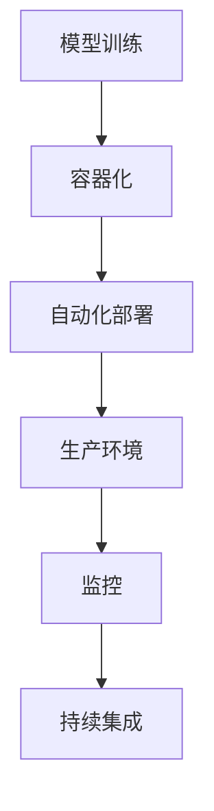

###### 1.1.2 AI大模型自动化部署的重要性

AI大模型自动化部署的重要性体现在以下几个方面：

1. **提高部署效率**：自动化部署可以大大减少人工干预，提高部署速度和效率，降低部署过程中的错误风险。
2. **确保一致性**：通过自动化流程，可以确保每次部署都遵循相同的步骤和标准，确保部署的一致性。
3. **减少成本**：自动化部署可以减少人力资源的消耗，降低部署和维护成本。
4. **提高可扩展性**：自动化部署使系统能够快速适应规模的变化，提高系统的可扩展性。

##### 1.2 AI大模型自动化部署的关键要素

###### 1.2.1 部署流程概述

AI大模型自动化部署的基本流程包括以下几个关键步骤：

1. **模型训练**：在开发环境中训练AI大模型，得到优化的模型参数。
2. **模型容器化**：将训练好的模型打包成容器镜像，便于在异构环境中部署和运行。
3. **持续集成**：通过持续集成工具（如Jenkins），自动触发模型构建和部署。
4. **自动化部署**：利用自动化部署工具（如Kubernetes），将容器镜像部署到生产环境。
5. **监控与维护**：在生产环境中对模型进行监控，确保其正常运行，并处理可能的故障。

**伪代码讲解**：

下面是一个简化的伪代码，描述了AI大模型自动化部署的流程：

```python
# 伪代码：AI大模型自动化部署
deploy_ai_model(model, environment):
    # 训练模型
    train_model(model)
    
    # 容器化模型
    containerize_model(model)
    
    # 持续集成
    integrate_model(model)
    
    # 自动化部署
    deploy_model(model, environment)
    
    # 监控模型
    monitor_model(model, environment)
```

###### 1.2.2 部署策略

部署策略是AI大模型自动化部署过程中至关重要的一部分，它决定了如何有效地将模型部署到生产环境。以下是几种常见的部署策略：

1. **蓝绿部署**：在旧环境（蓝环境）和新环境（绿环境）之间切换，逐步迁移流量到新环境，确保系统的稳定性和可用性。
2. **灰度发布**：将新模型部署到部分用户，逐步扩大用户范围，收集反馈并进行调整。
3. **滚动更新**：逐步替换旧模型，确保系统的可用性和稳定性。

**部署策略伪代码**：

```python
# 伪代码：部署策略
deploy_strategy(model, environment):
    if strategy == "blue-green":
        blue_green_deploy(model, environment)
    elif strategy == "canary":
        canary_deploy(model, environment)
    elif strategy == "rolling":
        rolling_deploy(model, environment)
```

###### 1.2.3 自动化工具

自动化工具是AI大模型自动化部署的核心组成部分，它们帮助开发者实现模型从开发到生产的无缝迁移。以下是几种常用的自动化工具：

1. **Kubernetes**：一个开源的容器编排平台，用于自动化部署、扩展和管理容器化应用程序。
2. **Docker**：一个开源的应用容器引擎，用于封装、交付和运行应用程序。
3. **Jenkins**：一个开源的持续集成和持续部署工具，用于自动化构建、测试和部署流程。

**自动化工具伪代码**：

```python
# 伪代码：自动化工具
use_automation_tools(environment):
    if environment == "kubernetes":
        kubernetes_tools()
    elif environment == "docker":
        docker_tools()
    elif environment == "jenkins":
        jenkins_tools()
```

### 第2章: AI大模型技术基础

#### 第2章: AI大模型技术基础

##### 2.1 人工智能基础

###### 2.1.1 人工智能的定义与历史

人工智能（Artificial Intelligence，简称AI）是指使计算机模拟人类智能行为的理论、方法和技术。人工智能的发展经历了几个主要阶段：

1. **早期阶段（20世纪50年代到70年代）**：人工智能概念首次提出，主要集中在符号推理和专家系统的开发。
2. **低谷期（20世纪80年代到90年代）**：由于技术局限和实际应用失败，人工智能进入低谷期。
3. **复兴阶段（21世纪初至今）**：随着计算能力和数据量的提升，深度学习等技术的突破，人工智能迎来了新的发展机遇。

**核心概念与联系**：

下面是一个简化的 Mermaid 流程图，展示了人工智能的发展历程：

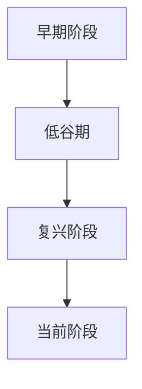

###### 2.1.2 机器学习与深度学习的区别

机器学习（Machine Learning，简称ML）是一种人工智能的分支，通过算法和统计模型从数据中学习规律，进行预测和决策。而深度学习（Deep Learning，简称DL）是机器学习的一个子领域，基于多层神经网络进行学习，具有强大的特征提取和自动学习能力。

**核心概念与联系**：

下面是一个简化的 Mermaid 流程图，展示了机器学习和深度学习的关系：

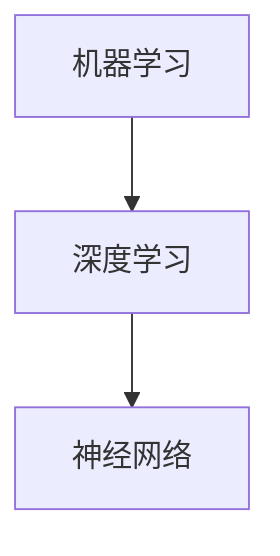

##### 2.2 深度学习技术

###### 2.2.1 神经网络基础

神经网络（Neural Network，简称NN）是一种模仿生物神经系统的计算模型，由大量的节点（称为神经元）互联而成。神经网络通过权重（weights）和偏置（bias）来学习输入和输出之间的复杂映射关系。

**核心概念与联系**：

下面是一个简化的 Mermaid 流程图，展示了神经网络的组成结构：

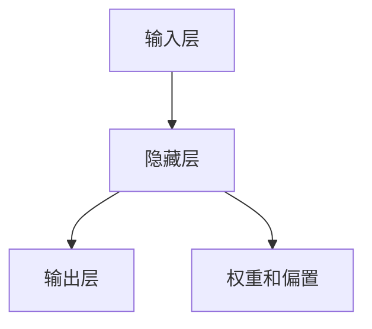

###### 2.2.2 深度学习框架

深度学习框架（Deep Learning Framework）是一套用于构建和训练深度学习模型的工具集。常见的深度学习框架包括TensorFlow、PyTorch和Keras等。

**核心概念与联系**：

下面是一个简化的 Mermaid 流程图，展示了深度学习框架的层次结构：

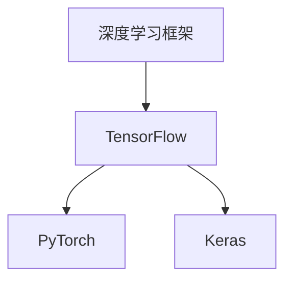

###### 2.2.3 优化算法

优化算法（Optimization Algorithm）是深度学习训练过程中的关键组成部分，用于调整模型参数以最小化损失函数。常见的优化算法包括随机梯度下降（Stochastic Gradient Descent，简称SGD）、Adam和RMSprop等。

**核心概念与联系**：

下面是一个简化的 Mermaid 流程图，展示了优化算法的基本流程：

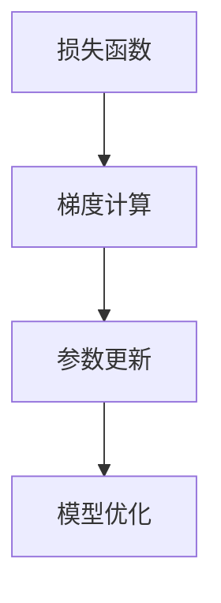

##### 2.3 AI大模型概述

###### 2.3.1 AI大模型的特点

AI大模型（Large AI Model）是指具有巨大参数量、复杂结构和高计算需求的深度学习模型。AI大模型的特点包括：

1. **参数量巨大**：AI大模型通常具有数百万甚至数亿个参数，需要大量计算资源进行训练。
2. **结构复杂**：AI大模型通常包含多层神经网络，具有复杂的连接方式和网络结构。
3. **计算需求高**：AI大模型在训练和推理过程中需要大量的计算资源，对硬件性能有较高要求。

**核心概念与联系**：

下面是一个简化的 Mermaid 流程图，展示了AI大模型的特点：

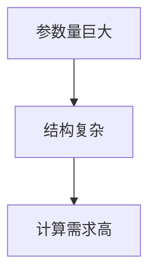

###### 2.3.2 主流AI大模型介绍

目前，主流的AI大模型包括Transformer、BERT和GPT等。这些模型在自然语言处理、计算机视觉和语音识别等领域取得了显著成果。

**核心概念与联系**：

下面是一个简化的 Mermaid 流程图，展示了主流AI大模型的应用领域：

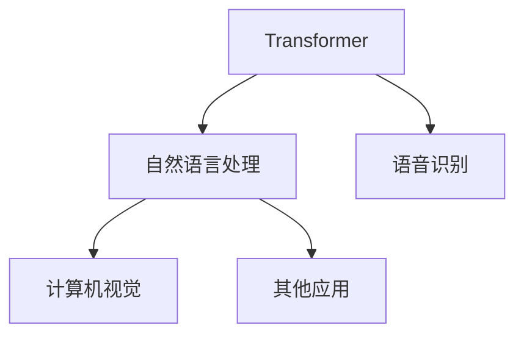

### 第二部分: AI大模型自动化部署实践

#### 第4章: 自动化部署工具与技术

##### 4.1 自动化部署工具

在AI大模型自动化部署过程中，自动化部署工具起到了关键作用。这些工具能够帮助开发者自动化地执行从模型训练到部署的整个过程，从而提高部署效率、降低部署成本并确保部署的一致性。以下是几种常用的自动化部署工具：

###### 4.1.1 Kubernetes概述

Kubernetes（简称K8s）是一个开源的容器编排平台，用于自动化部署、扩展和管理容器化应用程序。Kubernetes的主要功能包括：

1. **容器编排**：Kubernetes能够自动部署、扩展和管理容器化应用程序，确保应用程序的高可用性和资源利用率。
2. **服务发现和负载均衡**：Kubernetes能够自动将应用程序的流量分发到多个容器实例上，实现负载均衡和服务发现。
3. **自动化运维**：Kubernetes提供了一系列自动化运维功能，如自动化部署、自动化扩缩容和自动化故障恢复。

**核心概念与联系**：

下面是一个简化的 Mermaid 流程图，展示了Kubernetes的主要功能：

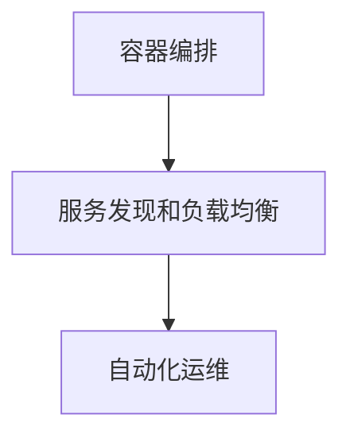

###### 4.1.2 Docker概述

Docker是一个开源的应用容器引擎，用于封装、交付和运行应用程序。Docker的主要功能包括：

1. **容器化**：Docker能够将应用程序及其依赖项封装在一个独立的容器中，实现应用程序的轻量级部署和迁移。
2. **镜像管理**：Docker提供了强大的镜像管理功能，包括镜像构建、镜像分层和镜像仓库等。
3. **容器运行时**：Docker提供了一个轻量级的容器运行时环境，能够高效地运行容器中的应用程序。

**核心概念与联系**：

下面是一个简化的 Mermaid 流程图，展示了Docker的主要功能：

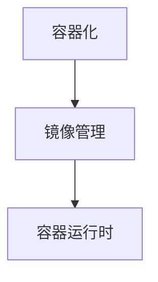

###### 4.1.3 Jenkins概述

Jenkins是一个开源的持续集成和持续部署工具，用于自动化构建、测试和部署流程。Jenkins的主要功能包括：

1. **持续集成**：Jenkins能够自动执行构建、测试和部署过程，确保代码的质量和稳定性。
2. **持续交付**：Jenkins能够自动部署应用程序到不同的环境，实现快速迭代和持续交付。
3. **插件扩展**：Jenkins拥有丰富的插件生态系统，能够扩展其功能以满足不同的需求。

**核心概念与联系**：

下面是一个简化的 Mermaid 流程图，展示了Jenkins的主要功能：

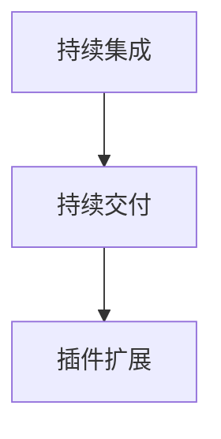

##### 4.2 自动化部署流程

AI大模型自动化部署的基本流程包括以下几个关键步骤：

1. **模型训练**：在开发环境中训练AI大模型，得到优化的模型参数。
2. **模型容器化**：将训练好的模型打包成容器镜像，便于在异构环境中部署和运行。
3. **持续集成**：通过持续集成工具（如Jenkins），自动触发模型构建和部署。
4. **自动化部署**：利用自动化部署工具（如Kubernetes），将容器镜像部署到生产环境。
5. **监控与维护**：在生产环境中对模型进行监控，确保其正常运行，并处理可能的故障。

**伪代码讲解**：

下面是一个简化的伪代码，描述了AI大模型自动化部署的流程：

```python
# 伪代码：AI大模型自动化部署
deploy_ai_model(model, environment):
    # 训练模型
    train_model(model)
    
    # 容器化模型
    containerize_model(model)
    
    # 持续集成
    integrate_model(model)
    
    # 自动化部署
    deploy_model(model, environment)
    
    # 监控模型
    monitor_model(model, environment)
```

###### 4.2.2 部署策略

部署策略是AI大模型自动化部署过程中至关重要的一部分，它决定了如何有效地将模型部署到生产环境。以下是几种常见的部署策略：

1. **蓝绿部署**：在旧环境（蓝环境）和新环境（绿环境）之间切换，逐步迁移流量到新环境，确保系统的稳定性和可用性。
2. **灰度发布**：将新模型部署到部分用户，逐步扩大用户范围，收集反馈并进行调整。
3. **滚动更新**：逐步替换旧模型，确保系统的可用性和稳定性。

**部署策略伪代码**：

```python
# 伪代码：部署策略
deploy_strategy(model, environment):
    if strategy == "blue-green":
        blue_green_deploy(model, environment)
    elif strategy == "canary":
        canary_deploy(model, environment)
    elif strategy == "rolling":
        rolling_deploy(model, environment)
```

###### 4.2.3 部署监控

部署监控是确保AI大模型在生产环境中正常运行的重要环节。通过部署监控，开发者可以及时发现和解决问题，确保系统的稳定性和性能。常见的监控工具包括Prometheus、Grafana和Zabbix等。

**部署监控伪代码**：

```python
# 伪代码：部署监控
monitor_deployment(model, environment):
    # 收集监控数据
    collect_metrics(model, environment)
    
    # 分析监控数据
    analyze_metrics(model, environment)
    
    # 发送报警
    send_alarm(model, environment)
```

### 第三部分: AI大模型自动化部署案例

#### 第7章: 案例研究——基于Kubernetes的AI大模型自动化部署

##### 7.1 案例背景

在本案例中，我们假设一个公司需要基于Kubernetes实现一个AI大模型的自动化部署。该AI大模型用于自然语言处理任务，训练数据量巨大，模型结构复杂。为了确保部署的稳定性和高效性，公司决定采用Kubernetes作为容器编排平台，实现模型的自动化部署和管理。

###### 7.1.1 项目概述

项目目标：实现一个基于Kubernetes的AI大模型自动化部署系统，确保模型的高可用性和可扩展性。

项目需求：

1. **模型训练**：在开发环境中训练AI大模型，得到优化的模型参数。
2. **模型容器化**：将训练好的模型打包成容器镜像，便于在异构环境中部署和运行。
3. **持续集成**：通过持续集成工具（如Jenkins），自动触发模型构建和部署。
4. **自动化部署**：利用Kubernetes，将容器镜像部署到生产环境。
5. **监控与维护**：在生产环境中对模型进行监控，确保其正常运行，并处理可能的故障。

###### 7.1.2 部署需求分析

在部署AI大模型时，需要考虑以下几个方面：

1. **计算资源**：由于AI大模型训练和推理过程中需要大量的计算资源，需要确保Kubernetes集群具有足够的计算资源。
2. **存储容量**：训练数据和模型文件通常占用大量存储空间，需要为Kubernetes集群配置足够的存储容量。
3. **网络带宽**：在生产环境中，需要确保网络带宽足够，以支持模型的快速部署和流量分发。
4. **安全性**：需要确保Kubernetes集群的安全性，防止未经授权的访问和数据泄露。

##### 7.2 案例实施

在本案例中，我们将详细介绍如何基于Kubernetes实现AI大模型的自动化部署。以下是具体的实施步骤：

###### 7.2.1 环境搭建

1. **安装Kubernetes集群**

   在开始部署之前，需要首先安装Kubernetes集群。以下是一个简化的安装步骤：

   ```shell
   # 安装Kubeadm
   sudo apt-get update
   sudo apt-get install -y apt-transport-https ca-certificates curl

   # 下载Kubernetes官方GPG key
   sudo curl -s https://mirrors.aliyun.com/kubernetes/apt/doc/apt-key.gpg | sudo apt-key add -

   # 添加Kubernetes仓库
   sudo cat <<EOF | sudo tee /etc/apt/sources.list.d/kubernetes.list
   deb https://mirrors.aliyun.com/kubernetes/apt/ kubernetes-xenial main
   EOF

   # 安装Kubeadm、Kubelet和Kubectl
   sudo apt-get update
   sudo apt-get install -y kubelet kubeadm kubectl
   ```

2. **初始化Kubernetes集群**

   ```shell
   # 初始化Kubernetes集群
   sudo kubeadm init --pod-network-cidr=10.244.0.0/16

   # 将当前用户加入集群
   sudo su
   echo "user" | sudo tee -a /etc/kubernetes/manifests/kube-apiserver.yaml
   ```

3. **安装网络插件**

   ```shell
   # 安装Calico网络插件
   kubectl apply -f https://docs.projectcalico.org/manifests/calico.yaml
   ```

4. **安装Jenkins**

   ```shell
   # 安装Jenkins
   kubectl apply -f https://github.com/jenkinsci/kubernetes-jenkins/raw/master/deployment/jenkins-deployment.yaml
   ```

###### 7.2.2 模型容器化

1. **编写Dockerfile**

   ```Dockerfile
   # 使用Python基础镜像
   FROM python:3.8-slim

   # 设置工作目录
   WORKDIR /app

   # 将模型文件复制到容器中
   COPY model.py .

   # 安装依赖项
   RUN pip install -r requirements.txt

   # 暴露服务端口
   EXPOSE 5000

   # 运行模型
   CMD ["python", "model.py"]
   ```

2. **构建容器镜像**

   ```shell
   # 构建容器镜像
   docker build -t ai_model:1.0 .

   #推送容器镜像到仓库
   docker push ai_model:1.0
   ```

3. **创建部署配置文件**

   ```yaml
   apiVersion: apps/v1
   kind: Deployment
   metadata:
     name: ai_model
   spec:
     replicas: 1
     selector:
       matchLabels:
         app: ai_model
     template:
       metadata:
         labels:
           app: ai_model
       spec:
         containers:
         - name: ai_model
           image: ai_model:1.0
           ports:
           - containerPort: 5000
   ```

4. **部署模型**

   ```shell
   # 部署模型
   kubectl apply -f deployment.yaml
   ```

###### 7.2.3 Kubernetes部署

1. **检查部署状态**

   ```shell
   # 查看Pod状态
   kubectl get pods

   # 查看部署状态
   kubectl get deployment ai_model
   ```

2. **访问模型服务**

   ```shell
   # 获取服务IP地址
   kubectl get svc ai_model

   # 访问模型服务
   curl <服务IP地址>:5000
   ```

##### 7.3 案例总结

在本案例中，我们成功实现了基于Kubernetes的AI大模型自动化部署。通过使用Docker容器化和Kubernetes自动化部署，我们大大提高了模型的部署效率和稳定性。以下是对本案例的总结：

1. **部署效率**：通过Kubernetes和Jenkins的集成，我们实现了模型从训练到部署的自动化流程，大大提高了部署效率。
2. **部署稳定性**：通过Kubernetes的容器编排和管理功能，我们确保了模型部署的稳定性和可靠性。
3. **可扩展性**：Kubernetes提供了强大的可扩展性，使我们能够根据需求动态调整资源分配和部署规模。

通过本案例，我们展示了如何利用Kubernetes实现AI大模型的自动化部署，为开发者提供了有益的参考和启示。

### 附录

#### 附录A: AI大模型自动化部署资源与工具

在本附录中，我们将介绍一些常用的AI大模型自动化部署资源与工具，包括Kubernetes、Docker和Jenkins等。这些工具和资源在实现AI大模型自动化部署过程中发挥着重要作用。

##### A.1 Kubernetes常用命令

以下是一些常用的Kubernetes命令及其简要说明：

- `kubectl get nodes`：查看所有节点信息。
- `kubectl get pods`：查看所有Pod状态。
- `kubectl apply -f <文件名>.yaml`：应用配置文件。
- `kubectl describe <资源类型> <名称>`：查看资源详细信息。
- `kubectl logs <名称>`：查看Pod日志。

##### A.2 Docker常用命令

以下是一些常用的Docker命令及其简要说明：

- `docker build -t <镜像名>:<标签> .`：构建Docker镜像。
- `docker run -d -p <宿主端口>:<容器端口> <镜像名>:<标签>`：运行Docker容器。
- `docker push <镜像名>:<标签>`：推送Docker镜像到仓库。

##### A.3 Jenkins常用插件

Jenkins拥有丰富的插件生态系统，以下是一些常用的Jenkins插件：

- **Git插件**：用于从Git仓库中提取代码。
- **Maven插件**：用于构建Java项目。
- **Deploy to Kubernetes plugin**：用于将应用程序部署到Kubernetes集群。
- **Ansible Plugin**：用于在远程主机上执行Ansible剧本。

##### A.4 Kubernetes官方文档

Kubernetes的官方文档是学习Kubernetes的最佳资源之一。官方文档涵盖了Kubernetes的各个方面，包括基本概念、安装指南、操作指南和API参考等。以下是Kubernetes官方文档的链接：

- [Kubernetes官方文档](https://kubernetes.io/docs/)

##### A.5 Docker官方文档

Docker的官方文档提供了丰富的信息，包括Docker容器、镜像、网络和存储等方面的详细说明。以下是Docker官方文档的链接：

- [Docker官方文档](https://docs.docker.com/)

##### A.6 Jenkins官方文档

Jenkins的官方文档是学习Jenkins的宝贵资源，涵盖了Jenkins的安装、配置、插件和最佳实践等内容。以下是Jenkins官方文档的链接：

- [Jenkins官方文档](https://www.jenkins.io/doc/)

### 作者信息

- 作者：AI天才研究院/AI Genius Institute & 禅与计算机程序设计艺术/Zen And The Art of Computer Programming

通过本文，我们系统地介绍了AI大模型自动化部署的核心概念、技术基础和实践方法。从Kubernetes和Docker的容器化技术，到Jenkins的持续集成和部署，再到具体的案例研究，本文旨在为开发者提供一条清晰、实用的路径，帮助他们理解和掌握AI大模型自动化部署的最佳实践。希望本文能够为读者在AI大模型自动化部署领域的研究和实践提供有益的参考和启示。

