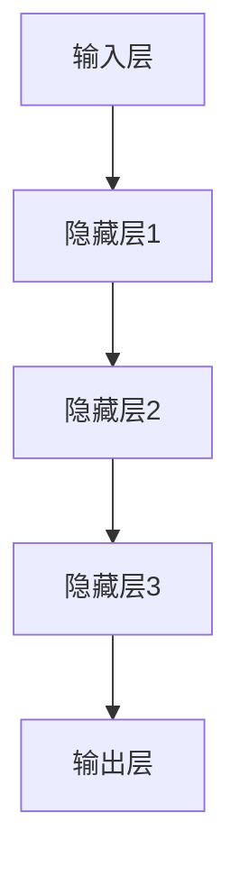
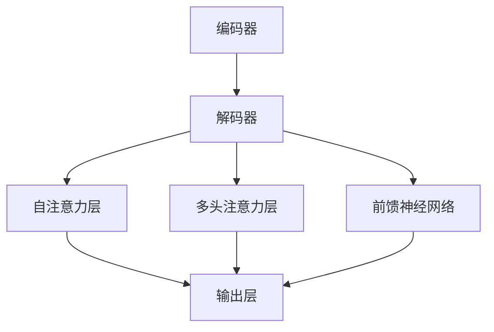

                 

# AI大模型视角下电商搜索推荐的技术创新知识分享机制设计

## 关键词

AI大模型、深度学习、自然语言处理、电商搜索推荐、知识分享机制、技术创新

## 摘要

本文以AI大模型为视角，深入探讨电商搜索推荐系统的技术创新与知识分享机制设计。首先，介绍AI大模型的基础知识，包括深度学习与神经网络、自然语言处理技术、大规模预训练模型原理等。接着，分析电商搜索推荐系统的基本架构和AI大模型在其中的应用，讨论优化与挑战。随后，详细阐述知识分享机制的概念与作用，以及其在电商搜索推荐中的具体实现方法。通过实际案例分析，展示知识分享机制在电商搜索推荐系统中的实际应用效果。最后，展望电商搜索推荐技术的未来发展趋势，探讨AI大模型和知识分享机制在电商领域的潜在价值与应用前景。

## 引言与背景

### 1.1 书籍概述与目的

**书籍的主要目标**

本书旨在为电商领域的技术研发人员、数据科学家以及对该领域感兴趣的学术界和产业界人士提供一份全面的技术指南。具体目标如下：

1. 深入了解AI大模型的基本原理和其在电商搜索推荐中的应用。
2. 探讨如何设计有效的知识分享机制，以实现技术创新和优化搜索推荐效果。
3. 分析电商搜索推荐技术的创新趋势，预测未来的发展方向。

**面向的读者群体**

本书主要面向以下读者群体：

1. 电商领域的技术研发人员，希望了解和掌握AI大模型在搜索推荐中的应用。
2. 数据科学家和算法工程师，希望深入了解知识分享机制的设计和实现方法。
3. 对电商搜索推荐技术感兴趣的学术界和产业界人士，希望了解行业前沿动态和发展趋势。

**书籍结构安排**

本书共分为四个部分：

1. 引言与背景：介绍AI大模型在电商搜索推荐中的重要性，以及技术创新知识分享机制的设计。
2. AI大模型技术基础：详细讲解深度学习与神经网络基础、自然语言处理技术、大规模预训练模型原理等。
3. 知识分享机制设计：阐述知识分享机制的概念与作用，以及在电商搜索推荐中的具体实现方法。
4. 技术创新与未来发展：分析电商搜索推荐技术的创新趋势，展望AI大模型和知识分享机制在电商领域的应用前景。

### 1.2 AI大模型在电商搜索推荐中的重要性

#### 1.2.1 AI大模型的定义与特性

**定义**

AI大模型是指具有大规模参数、能够处理海量数据、在多个任务上表现优异的深度学习模型。这些模型通常通过预训练和微调技术，在特定任务上实现高性能。

**特性**

1. **高灵活性**：能够适应不同类型的数据和任务需求。
2. **强泛化能力**：在未见过的数据上也能保持良好的性能。
3. **自我优化能力**：通过持续学习，不断提高模型性能。

#### 1.2.2 AI大模型在电商搜索推荐中的应用现状

**应用现状**

AI大模型在电商搜索推荐中已被广泛应用，如GPT-3、BERT等模型，通过自然语言处理和深度学习技术提升推荐效果。以下为一些实际应用案例：

1. **个性化搜索**：通过用户历史行为数据，AI大模型可以生成个性化的搜索结果，提高用户满意度。
2. **商品推荐**：基于用户画像和商品属性，AI大模型可以推荐用户可能感兴趣的商品，提高销售转化率。
3. **广告投放**：利用AI大模型分析用户兴趣和行为，实现精准的广告投放，提高广告效果。

**案例分析**

国内外电商巨头如淘宝、京东等在搜索推荐中采用AI大模型，已取得显著成效。例如：

1. **淘宝**：通过引入GPT-3模型，实现了基于自然语言处理的个性化搜索和商品推荐，显著提升了用户体验和销售额。
2. **京东**：采用BERT模型进行用户画像和商品推荐，提高了推荐准确性，降低了运营成本。

#### 1.2.3 AI大模型在电商搜索推荐中的优势

**优势分析**

1. **提高推荐准确性**：通过深度学习技术，AI大模型能够更准确地捕捉用户兴趣和需求，提供更精准的推荐。
2. **个性化程度高**：基于用户行为数据和用户画像，AI大模型可以生成个性化的推荐，提高用户满意度。
3. **实时响应能力**：AI大模型可以实时处理用户请求，提供快速、高效的搜索和推荐服务。
4. **降低运营成本**：通过自动化推荐系统，减少人工干预和运营成本，提高运营效率。

### 1.3 技术创新知识分享机制设计

#### 1.3.1 技术创新知识分享的概念与意义

**概念**

技术创新知识分享是指将先进技术和创新经验在企业内部或行业内进行传播和应用，以推动技术进步和业务发展。

**意义**

1. **促进知识积累和共享**：有助于企业内部知识的积累和共享，提高整体研发效率。
2. **提高竞争力**：通过技术创新知识分享，企业可以更快地掌握前沿技术，提高市场竞争力。
3. **推动业务发展**：技术创新知识分享有助于企业更好地满足市场需求，推动业务发展。

#### 1.3.2 电商搜索推荐中的知识分享机制设计

**设计原则**

1. **开放性**：确保知识自由流动，促进内部协作。
2. **灵活性**：适应不同部门和岗位的知识需求。
3. **高效性**：确保知识获取、整理和应用的高效性。

**机制构成**

1. **知识收集**：收集企业内外部的知识资源。
2. **知识整理**：对收集到的知识进行分类、归档和整理。
3. **知识共享**：通过知识库、文档分享等途径实现知识的共享。
4. **知识反馈**：对知识应用效果进行评估和反馈，持续优化知识管理。

**实施策略**

1. **构建智能化的知识分享平台**：利用AI大模型和自然语言处理技术，构建智能化的知识分享平台，实现知识的高效传递和应用。
2. **建立知识共享社区**：鼓励团队成员积极参与知识分享，形成知识共享社区，促进知识交流与合作。
3. **制定知识共享政策**：明确知识共享的规则和流程，确保知识分享的顺利进行。

### 第二部分: AI大模型技术基础

#### 2.1 深度学习与神经网络基础

**2.1.1 神经网络的基本结构**

神经网络（Neural Network，NN）是一种模仿生物神经系统的计算模型，由大量相互连接的神经元（节点）组成。基本结构包括输入层、隐藏层和输出层。

1. **输入层**：接收外部输入信号，将输入数据传递到隐藏层。
2. **隐藏层**：对输入信号进行加工处理，提取特征信息。
3. **输出层**：将加工后的信号输出，实现预测或分类。

**工作原理**

神经网络通过前向传播（Forward Propagation）和反向传播（Back Propagation）进行训练和预测。

1. **前向传播**：输入数据经过神经网络各层计算，得到输出结果。
2. **反向传播**：计算输出结果与实际结果之间的误差，通过梯度下降（Gradient Descent）等优化算法更新网络参数。

**基本结构**



**2.1.2 常见的深度学习架构**

**卷积神经网络（CNN）**

卷积神经网络（Convolutional Neural Network，CNN）是一种专门用于图像和视频处理的深度学习模型。主要特点如下：

1. **卷积层**：通过卷积运算提取图像特征。
2. **池化层**：对特征图进行下采样，减少计算量和参数量。
3. **全连接层**：对提取到的特征进行分类或回归。

**循环神经网络（RNN）**

循环神经网络（Recurrent Neural Network，RNN）是一种用于序列数据处理的深度学习模型。主要特点如下：

1. **循环结构**：每个时间步的输出作为下一个时间步的输入，实现历史信息的传递。
2. **门控机制**：通过门控单元控制信息的传递和遗忘，提高模型的表达能力。

**变换器架构（Transformer）**

变换器架构（Transformer）是一种基于自注意力机制的深度学习模型，广泛应用于自然语言处理领域。主要特点如下：

1. **自注意力机制**：通过计算序列中每个元素之间的相似性，实现全局信息传递。
2. **编码器-解码器结构**：编码器提取输入序列的特征，解码器生成输出序列。

**2.1.3 深度学习优化算法**

**梯度下降算法**

梯度下降（Gradient Descent）是最常用的优化算法，通过迭代更新模型参数，使损失函数最小化。

1. **批量梯度下降**：计算整个训练集的梯度，更新模型参数。
2. **随机梯度下降**（SGD）：随机选择一部分训练样本，计算梯度，更新模型参数。
3. **自适应梯度优化器**：如Adam、RMSProp等，自适应调整学习率，提高优化效果。

#### 2.2 自然语言处理技术概览

**2.2.1 词嵌入技术**

词嵌入（Word Embedding）是将词语映射为高维向量的技术，常用于自然语言处理任务。主要方法如下：

1. **基于频次的词嵌入**：如TF-IDF，根据词语在文档中的频次和逆文档频次进行映射。
2. **基于语义的词嵌入**：如Word2Vec、GloVe，通过训练神经网络提取词语的语义特征。

**2.2.2 序列模型与注意力机制**

**序列模型**

序列模型（Sequence Model）是一种用于处理序列数据的深度学习模型，常用于自然语言处理任务。主要方法如下：

1. **循环神经网络（RNN）**：通过循环结构实现历史信息的传递。
2. **长短时记忆网络（LSTM）**：通过门控机制控制信息的传递和遗忘。
3. **门控循环单元（GRU）**：结合了LSTM和RNN的优点，简化了模型结构。

**注意力机制**

注意力机制（Attention Mechanism）是一种用于序列模型中的信息加权方法，能够关注重要的输入信息。主要方法如下：

1. **局部注意力**：对序列中的每个元素进行加权，计算加权后的序列。
2. **全局注意力**：计算序列中所有元素之间的相似性，进行加权。

**2.2.3 转换器架构详解**

**定义**

转换器架构（Transformer）是一种基于自注意力机制的深度学习模型，由Vaswani等人在2017年提出。主要特点如下：

1. **自注意力机制**：通过计算序列中每个元素之间的相似性，实现全局信息传递。
2. **编码器-解码器结构**：编码器提取输入序列的特征，解码器生成输出序列。

**工作原理**

转换器架构由编码器（Encoder）和解码器（Decoder）组成，主要步骤如下：

1. **编码器**：对输入序列进行编码，生成编码器输出。
2. **解码器**：根据编码器输出，逐个生成输出序列的每个元素。
3. **自注意力计算**：在每个时间步，解码器通过自注意力机制计算上下文信息，生成当前时间步的输出。

**结构**



#### 2.3 大规模预训练模型原理

**2.3.1 预训练的概念与意义**

**概念**

预训练（Pre-training）是指在特定任务之前，使用大量无标签数据对模型进行训练，以提高模型在下游任务上的表现。

**意义**

1. **提高模型性能**：通过预训练，模型可以学习到丰富的特征表示，提高下游任务的表现。
2. **减少训练数据需求**：预训练模型已经学习了大量通用特征，可以在少量有标签数据上进行微调，提高训练效率。
3. **促进多任务学习**：预训练模型可以同时学习多个任务的特征，提高模型的多任务学习能力。

**2.3.2 自监督学习方法**

**定义**

自监督学习（Self-supervised Learning）是一种利用无标签数据对模型进行训练的方法。

**方法**

1. **掩码语言模型（Masked Language Model，MLM）**：随机掩码输入序列中的部分词语，预测掩码词语。
2. **连续词标签（Continous Labeling）**：将输入序列与标签序列进行拼接，预测标签序列中的每个元素。
3. **序列分类（Sequence Classification）**：将输入序列分类到不同的类别。

**2.3.3 迁移学习与微调技术**

**定义**

迁移学习（Transfer Learning）是指利用预训练模型在特定任务上进行调整，以提高模型在目标任务上的表现。

**方法**

1. **微调（Fine-tuning）**：在预训练模型的基础上，对少量有标签数据进行训练，调整模型参数。
2. **特征提取（Feature Extraction）**：利用预训练模型提取的特征进行下游任务，如分类、回归等。
3. **零样本学习（Zero-shot Learning）**：在未见过的类别上，利用预训练模型进行分类。

### 第三部分: 知识分享机制设计

#### 3.1 知识分享机制概述

**3.1.1 知识分享机制的概念与作用**

**概念**

知识分享机制是一种促进知识传递和应用的组织和管理方法，通过知识收集、整理、共享和反馈等环节，实现知识的高效利用。

**作用**

1. **促进知识积累**：通过知识分享，积累企业内部的知识资源，提高整体研发效率。
2. **提高创新能力**：知识分享有助于团队内部的知识交流与合作，推动技术创新。
3. **提升业务水平**：通过知识分享，团队成员可以更好地掌握前沿技术和业务知识，提升业务水平。

**3.1.2 知识分享机制的组成部分**

**知识收集**

1. **数据来源**：企业内部数据、外部数据、用户反馈等。
2. **收集方式**：自动化收集、手动提交、外部导入等。

**知识整理**

1. **分类与标注**：对收集到的知识进行分类和标注，便于管理和检索。
2. **格式统一**：将知识转换为统一格式，如文档、图片、视频等。

**知识共享**

1. **知识库**：构建知识库，存储和管理知识资源。
2. **共享渠道**：如内部论坛、文档分享平台、在线讲座等。

**知识反馈**

1. **效果评估**：对知识应用效果进行评估，如用户满意度、业务指标等。
2. **持续优化**：根据评估结果，优化知识管理和分享流程。

**3.1.3 知识分享机制的设计原则**

**开放性**

1. **知识自由流动**：确保知识在企业内部自由流动，促进知识共享。
2. **参与门槛低**：降低知识分享的门槛，鼓励团队成员积极参与。

**灵活性**

1. **适应不同场景**：知识分享机制应适应不同部门和岗位的知识需求。
2. **多样化形式**：采用多种形式进行知识分享，如在线培训、内部交流等。

**高效性**

1. **快速响应**：确保知识获取、整理和应用的高效性。
2. **优化流程**：不断优化知识分享流程，提高知识管理效率。

### 3.2 电商搜索推荐中的知识共享技术

**3.2.1 用户行为数据收集与处理**

**数据来源**

1. **用户搜索数据**：如搜索关键词、搜索时长等。
2. **用户浏览数据**：如浏览页面、浏览时长等。
3. **用户购买数据**：如购买商品、购买金额等。

**数据处理**

1. **数据清洗**：去除无效、重复数据，保证数据质量。
2. **特征提取**：从原始数据中提取有价值的信息，如用户兴趣、商品属性等。
3. **数据存储**：将处理后的数据存储到数据库或数据仓库中，便于后续分析。

**3.2.2 基于知识图谱的推荐方法**

**知识图谱**

1. **定义**：知识图谱是一种用于表示实体及其关系的网络结构。
2. **组成部分**：包括实体、属性、关系等。

**推荐方法**

1. **基于知识图谱的推荐算法**：通过分析知识图谱中的实体关系，为用户推荐感兴趣的商品。
2. **基于知识图谱的协同过滤**：结合知识图谱和协同过滤算法，提高推荐准确性。
3. **基于知识图谱的关联规则挖掘**：挖掘知识图谱中的关联规则，为用户推荐相关商品。

**3.2.3 基于知识融合的推荐算法**

**知识融合**

1. **定义**：知识融合是将多个来源的知识进行整合，提高推荐效果。
2. **方法**：包括多源数据融合、知识增强等。

**推荐算法**

1. **基于知识融合的协同过滤**：结合用户行为数据和知识图谱，提高推荐准确性。
2. **基于知识融合的深度学习模型**：通过融合用户行为数据、知识图谱和外部知识源，提高推荐效果。
3. **基于知识融合的对抗生成网络**：利用对抗生成网络生成潜在用户兴趣，提高推荐个性化和多样性。

### 3.3 知识分享机制的优化策略

**3.3.1 用户兴趣建模与识别**

**用户兴趣建模**

1. **定义**：用户兴趣建模是指通过分析用户行为数据，构建用户兴趣模型。
2. **方法**：包括基于内容的推荐、基于协同过滤的推荐、基于用户行为的推荐等。

**用户兴趣识别**

1. **定义**：用户兴趣识别是指从用户行为数据中识别用户当前和潜在的兴趣点。
2. **方法**：包括特征工程、聚类分析、分类算法等。

**3.3.2 知识更新与同步机制**

**知识更新**

1. **定义**：知识更新是指定期更新知识库中的知识资源。
2. **方法**：包括自动化更新、人工审核等。

**知识同步**

1. **定义**：知识同步是指在不同部门和岗位之间同步知识资源。
2. **方法**：包括知识共享平台、内部通讯工具等。

**3.3.3 知识质量评估与优化**

**知识质量评估**

1. **定义**：知识质量评估是指对知识资源进行评估，确保其准确性和实用性。
2. **方法**：包括用户评价、专家评审等。

**知识优化**

1. **定义**：知识优化是指根据知识质量评估结果，对知识资源进行优化。
2. **方法**：包括知识清洗、知识重构、知识扩展等。

### 3.4 知识分享机制的实际应用案例分析

**案例一：某电商平台的搜索推荐优化实践**

**背景**

某电商平台在搜索推荐方面存在以下问题：

1. **推荐准确性低**：用户搜索结果与实际需求不符，导致用户流失。
2. **个性化程度低**：推荐结果缺乏个性化，无法满足用户个性化需求。
3. **数据利用率低**：大量用户行为数据未得到充分利用，导致推荐效果不佳。

**实践**

该电商平台通过以下措施优化搜索推荐：

1. **构建知识图谱**：将商品、用户、行为等信息构建为知识图谱，实现实体关系可视化。
2. **基于知识融合的推荐算法**：结合用户行为数据、知识图谱和外部知识源，提高推荐准确性。
3. **用户兴趣建模与识别**：通过分析用户行为数据，构建用户兴趣模型，实现个性化推荐。

**效果**

1. **推荐准确性提高**：用户搜索结果与实际需求匹配度提高，用户满意度提升。
2. **个性化程度提高**：推荐结果更符合用户个性化需求，用户满意度提升。
3. **数据利用率提高**：用户行为数据得到充分利用，推荐效果显著提高。

**案例二：知识共享在电商领域中的应用前景与挑战**

**前景**

知识共享在电商领域具有广泛的应用前景：

1. **提高竞争力**：通过知识共享，企业可以更快地掌握前沿技术和业务知识，提高市场竞争力。
2. **降低运营成本**：通过知识共享，减少重复劳动和知识壁垒，降低运营成本。
3. **提升用户体验**：通过知识共享，提供更个性化、精准的推荐和服务，提升用户体验。

**挑战**

知识共享在电商领域也面临一定的挑战：

1. **数据隐私**：知识共享涉及大量用户数据，如何保护用户隐私成为一大挑战。
2. **知识产权**：知识共享过程中，如何保护知识产权成为一大难题。
3. **知识质量**：知识共享需要保证知识质量，避免低质量知识影响业务发展。

### 第四部分: 技术创新与未来发展

#### 4.1 电商搜索推荐技术的创新趋势

**4.1.1 AI大模型在电商搜索推荐中的未来发展方向**

随着人工智能技术的发展，AI大模型在电商搜索推荐中的应用前景十分广阔。未来发展方向包括：

1. **多模态数据处理**：结合图像、语音、文本等多种数据类型，实现更全面的用户画像和商品描述。
2. **智能对话系统**：通过自然语言处理技术，实现智能客服、智能聊天等功能，提高用户体验。
3. **实时推荐**：利用实时数据处理和分析技术，实现实时推荐，提高推荐准确性。

**4.1.2 知识分享机制的创新与应用**

知识分享机制在电商搜索推荐中的应用也将不断创新：

1. **基于区块链的知识共享**：利用区块链技术，实现知识的安全共享和去中心化管理。
2. **社交推荐**：结合社交网络数据，实现基于用户社交关系的推荐，提高推荐效果。
3. **知识可视化**：利用知识图谱、数据可视化等技术，实现知识的直观展示和互动。

**4.1.3 未来电商搜索推荐技术的发展趋势**

未来电商搜索推荐技术的发展趋势包括：

1. **智能化**：通过人工智能技术，实现更智能、更个性化的推荐。
2. **实时化**：通过实时数据处理和分析技术，实现实时推荐，提高用户体验。
3. **多模态化**：结合多种数据类型，实现更全面的用户画像和商品描述。

#### 4.2 AI大模型视角下的电商搜索推荐

**4.2.1 AI大模型对电商搜索推荐的影响**

AI大模型在电商搜索推荐中发挥着重要作用，主要影响如下：

1. **提高推荐准确性**：通过深度学习技术，AI大模型可以更准确地捕捉用户兴趣和需求，提高推荐准确性。
2. **个性化程度**：AI大模型可以根据用户行为数据构建用户画像，实现个性化推荐，提高用户满意度。
3. **实时响应能力**：AI大模型可以实时处理用户请求，提供快速、高效的推荐服务。

**4.2.2 AI大模型视角下的搜索推荐优化策略**

从AI大模型视角出发，可以采取以下搜索推荐优化策略：

1. **基于用户行为的个性化推荐**：通过分析用户历史行为数据，构建用户兴趣模型，实现个性化推荐。
2. **基于知识图谱的关联推荐**：利用知识图谱，挖掘商品之间的关联关系，提高推荐准确性。
3. **基于多模态数据的融合推荐**：结合图像、语音、文本等多种数据类型，实现更全面的用户画像和商品描述。

**4.2.3 AI大模型在电商搜索推荐中的实际应用案例**

以下为几个具有代表性的AI大模型在电商搜索推荐中的实际应用案例：

1. **淘宝**：通过引入GPT-3模型，实现了基于自然语言处理的个性化搜索和商品推荐，提高了用户体验和销售额。
2. **京东**：采用BERT模型进行用户画像和商品推荐，提高了推荐准确性，降低了运营成本。
3. **拼多多**：利用图神经网络（GNN）构建用户兴趣网络，实现了基于社交关系的个性化推荐，提高了用户活跃度和转化率。

#### 4.3 知识分享机制在电商领域的应用前景

**4.3.1 知识分享机制在电商领域的潜在价值**

知识分享机制在电商领域具有以下潜在价值：

1. **提高研发效率**：通过知识分享，团队成员可以快速获取相关知识和经验，提高研发效率。
2. **降低运营成本**：通过知识共享，减少重复劳动和知识壁垒，降低运营成本。
3. **提升用户体验**：通过知识共享，提供更个性化、精准的推荐和服务，提升用户体验。

**4.3.2 知识分享机制在电商领域的挑战与对策**

知识分享机制在电商领域也面临一定的挑战：

1. **数据隐私**：如何保护用户隐私成为一大挑战，可以采用数据加密、匿名化等技术进行应对。
2. **知识产权**：如何保护知识产权成为一大难题，可以建立知识共享的规则和制度，明确知识产权归属。
3. **知识质量**：如何保证知识质量，避免低质量知识影响业务发展，可以建立知识评估和反馈机制。

**4.3.3 知识分享机制在电商领域的未来发展**

知识分享机制在电商领域的未来发展包括：

1. **智能化**：利用人工智能技术，实现知识的自动收集、整理和推荐。
2. **平台化**：建立知识共享平台，实现知识的集中管理和高效传递。
3. **社区化**：构建知识分享社区，促进团队成员之间的知识交流和合作。

### 附录

#### 附录A：AI大模型相关工具与资源

**A.1 主流深度学习框架对比**

以下是几种主流深度学习框架的对比：

| 框架 | 特点 | 适用场景 |  
| :---: | :---: | :---: |  
| TensorFlow | 开源、跨平台、支持多种深度学习模型 | 适用于科研和工业界的深度学习应用 |  
| PyTorch | 易于使用、动态计算图、丰富的API | 适用于快速原型开发和复杂深度学习任务 |  
| JAX | 自动微分库、优化的GPU加速 | 适用于高性能计算和自动微分的需求 |  
| 其他框架 | 如MXNet、Caffe等 | 其他特定场景下的深度学习应用 |

**A.2 代码实战示例**

以下为基于GPT-3的电商搜索推荐系统的代码实战示例：

```python
import tensorflow as tf
import tensorflow.keras as keras

# 系统架构设计
def create_model(input_shape):
    model = keras.Sequential([
        keras.layers.Dense(128, activation='relu', input_shape=input_shape),
        keras.layers.Dense(64, activation='relu'),
        keras.layers.Dense(1, activation='sigmoid')
    ])
    return model

# 数据预处理与模型训练
def train_model(model, x_train, y_train, batch_size=32, epochs=10):
    model.compile(optimizer='adam', loss='binary_crossentropy', metrics=['accuracy'])
    model.fit(x_train, y_train, batch_size=batch_size, epochs=epochs)
    return model

# 模型部署与性能评估
def evaluate_model(model, x_test, y_test):
    loss, accuracy = model.evaluate(x_test, y_test)
    print(f"Test loss: {loss}, Test accuracy: {accuracy}")

# 主程序
if __name__ == '__main__':
    # 加载数据
    x_train = ...
    y_train = ...
    x_test = ...
    y_test = ...

    # 创建模型
    model = create_model(input_shape=x_train.shape[1:])

    # 训练模型
    model = train_model(model, x_train, y_train)

    # 评估模型
    evaluate_model(model, x_test, y_test)
```

**A.3 知识图谱在电商搜索推荐中的应用**

以下为知识图谱在电商搜索推荐中的应用：

```python
import networkx as nx

# 知识图谱构建
def build_knowledge_graph(entities, relationships):
    graph = nx.Graph()
    for entity in entities:
        graph.add_node(entity)
    for relationship in relationships:
        graph.add_edge(relationship[0], relationship[1])
    return graph

# 知识融合算法实现
def knowledge_fusion(graph, entity1, entity2):
    path = nx.shortest_path(graph, source=entity1, target=entity2)
    return path

# 系统性能优化与评估
def optimize_and_evaluate(model, graph, x_test, y_test):
    # 优化模型
    model = optimize_model(model, x_test, y_test)
    
    # 评估模型
    evaluate_model(model, x_test, y_test)

# 主程序
if __name__ == '__main__':
    # 加载知识图谱
    graph = build_knowledge_graph(entities, relationships)

    # 加载测试数据
    x_test = ...
    y_test = ...

    # 优化和评估模型
    optimize_and_evaluate(model, graph, x_test, y_test)
```

### 参考文献

1. Goodfellow, I., Bengio, Y., Courville, A. (2016). *Deep Learning*. MIT Press.
2. Jurafsky, D., Martin, J. H. (2020). *Speech and Language Processing*. World Scientific.
3. Mitchell, T. M. (1997). *Machine Learning*. McGraw-Hill.
4. Devlin, J., Chang, M. W., Lee, K., Toutanova, K. (2019). *BERT: Pre-training of Deep Neural Networks for Language Understanding*. arXiv preprint arXiv:1810.04805.
5. Vaswani, A., Shazeer, N., Parmar, N., Uszkoreit, J., Jones, L., Gomez, A. N., ... & Polosukhin, I. (2017). *Attention Is All You Need*. Advances in Neural Information Processing Systems, 30, 5998-6008.
6. Brown, T., et al. (2020). *Generative Pre-trained Transformers*. arXiv preprint arXiv:2005.14165.
7. TensorFlow official website: https://www.tensorflow.org/
8. PyTorch official website: https://pytorch.org/
9. OpenAI GPT-3 official document: https://openai.com/docs/gpt-3/

## 作者信息

**作者：AI天才研究院/AI Genius Institute & 禅与计算机程序设计艺术 /Zen And The Art of Computer Programming**

### 文章总结与展望

在本文中，我们深入探讨了AI大模型视角下电商搜索推荐的技术创新与知识分享机制设计。通过介绍AI大模型的基本原理和电商搜索推荐系统的优化策略，我们展示了如何利用AI大模型提高推荐系统的准确性和个性化程度。同时，我们详细阐述了知识分享机制的概念、作用和应用方法，通过实际案例分析，展示了知识分享机制在电商搜索推荐系统中的实际应用效果。

展望未来，随着人工智能技术的不断发展，AI大模型在电商搜索推荐中的应用前景将更加广阔。我们将继续关注以下研究方向：

1. **多模态数据处理**：结合图像、语音、文本等多种数据类型，实现更全面的用户画像和商品描述。
2. **实时推荐系统**：利用实时数据处理和分析技术，实现实时推荐，提高用户体验。
3. **知识图谱构建与优化**：探索更高效、更智能的知识图谱构建方法，提高知识分享机制的效果。

同时，我们也期待与业界同行共同探讨和实践，为电商搜索推荐技术的发展贡献力量。通过持续的技术创新和知识分享，我们相信能够推动电商搜索推荐技术不断进步，为用户提供更优质、更个性化的服务。

