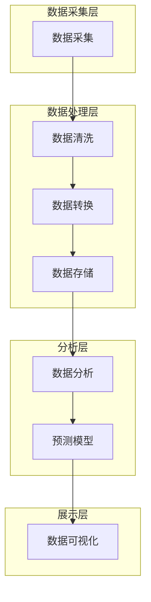

                 

### AI实时监控库存情况的应用

> **关键词：AI、实时监控、库存管理、应用现状、未来展望**

> **摘要：本文将深入探讨人工智能（AI）在实时监控库存情况中的应用，包括其重要性、基础技术、AI应用、项目实战和部署运维等方面。通过分析AI在库存监控中的潜力，帮助读者了解如何利用先进技术提升库存管理效率。**

#### 目录大纲

1. **第一部分：AI实时监控库存情况的应用概述**
    1.1 AI实时监控库存的重要性
    1.2 实时监控库存的基本原理
    1.3 AI在实时监控库存中的应用现状
    1.4 本书的结构与内容

2. **第二部分：实时监控库存的基础技术**
    2.1 实时监控库存系统架构
    2.2 数据采集与处理
    2.3 AI算法基础

3. **第三部分：实时监控库存的AI应用**
    3.1 库存预测模型
    3.2 库存优化策略
    3.3 实时监控与预警
    3.4 数据可视化与报告

4. **第四部分：项目实战**
    4.1 实时监控库存系统开发实战
    4.2 AI实时监控库存系统的部署与运维

5. **第五部分：附录**
    5.1 实时监控库存系统开发工具与资源

#### 第一部分：AI实时监控库存情况的应用概述

##### 1.1 AI实时监控库存的重要性

在当今全球化的商业环境中，库存管理是企业运营中至关重要的一环。库存不足可能导致生产停滞、交付延迟，而库存过剩则会导致资金占用、仓储成本增加。传统的库存监控方式往往依赖于人工检查和定期盘点，不仅效率低下，而且容易出现错误。随着人工智能技术的发展，AI实时监控库存成为提升库存管理效率的一种新途径。

AI实时监控库存的重要性主要体现在以下几个方面：

- **提高库存准确性**：AI技术可以通过传感器、摄像头等设备实时采集库存数据，结合机器学习算法对数据进行分析和处理，从而提高库存数据的准确性和实时性。
- **优化库存水平**：基于历史数据和预测模型，AI可以帮助企业合理调整库存水平，避免过量采购或库存积压，降低库存成本。
- **减少人为错误**：传统的库存监控容易受到人为因素的影响，而AI系统可以自动化处理数据，减少人为错误，提高库存管理的可靠性。
- **实时预警**：AI系统可以实时监测库存状况，当库存低于或超过设定阈值时，自动发出预警，帮助企业及时采取行动。

##### 1.2 实时监控库存的基本原理

实时监控库存的基本原理主要包括数据采集、数据处理和决策支持三个环节。

- **数据采集**：通过传感器、RFID标签、摄像头等设备，实时采集库存物品的位置、数量等信息。
- **数据处理**：将采集到的数据传输到数据中心，通过数据处理模块进行清洗、转换和分析，提取有用的信息。
- **决策支持**：利用机器学习、数据分析等技术，对处理后的数据进行分析，生成库存预测、优化策略等决策支持信息，供企业决策者参考。

##### 1.3 AI在实时监控库存中的应用现状

随着AI技术的不断发展，越来越多的企业开始将AI应用于库存管理中。当前，AI在实时监控库存中的应用主要体现在以下几个方面：

- **库存预测**：通过时间序列分析、回归分析等机器学习算法，预测未来一段时间内库存的需求量，帮助企业合理安排采购和库存策略。
- **库存优化**：利用优化算法，如动态规划、遗传算法等，根据库存数据和历史采购数据，优化库存水平，降低库存成本。
- **异常检测**：通过异常检测算法，如KNN、孤立森林等，实时监控库存数据，发现潜在的异常情况，及时采取应对措施。
- **数据可视化**：利用数据可视化工具，如Tableau、PowerBI等，将库存数据以图表、报表等形式展示，帮助企业更好地理解和利用库存信息。

##### 1.4 本书的结构与内容

本书旨在系统介绍AI实时监控库存情况的应用，主要分为五个部分：

- **第一部分**：概述AI实时监控库存的重要性、基本原理和应用现状。
- **第二部分**：介绍实时监控库存的基础技术，包括系统架构、数据采集与处理、AI算法基础。
- **第三部分**：介绍实时监控库存的AI应用，包括库存预测模型、库存优化策略、实时监控与预警、数据可视化与报告。
- **第四部分**：通过项目实战，详细介绍实时监控库存系统的开发过程、部署与运维。
- **第五部分**：附录，提供实时监控库存系统开发所需的工具与资源。

通过本书的介绍，读者可以全面了解AI实时监控库存情况的应用，掌握相关技术和方法，为实际项目提供指导。在接下来的章节中，我们将深入探讨这些内容。

---

在第一部分中，我们概述了AI实时监控库存情况的重要性、基本原理和应用现状。接下来，我们将进入第二部分，详细介绍实时监控库存的基础技术。这将包括系统架构、数据采集与处理、以及AI算法基础等内容。通过这部分内容的学习，我们将为后续的AI应用奠定坚实的基础。

---

## 第二部分：实时监控库存的基础技术

实时监控库存系统的建设离不开一系列基础技术的支持。这些技术包括系统架构、数据采集与处理以及AI算法基础。在本部分中，我们将逐一介绍这些技术，帮助读者理解实时监控库存系统的构建和运作原理。

### 2.1 实时监控库存系统架构

一个完善的实时监控库存系统需要具备高可靠性、实时性和可扩展性。其系统架构通常包括以下几个关键组成部分：

- **数据采集层**：这一层负责收集库存数据，包括传感器、RFID标签、摄像头等设备。数据采集层的数据质量直接影响整个系统的性能和效果。
  
- **数据处理层**：数据处理层负责接收、清洗、转换和存储采集到的数据。这一层通常包括数据预处理模块、数据仓库和数据库等。

- **分析层**：分析层利用机器学习、数据分析等技术对处理后的数据进行深入分析，生成库存预测、优化策略等决策支持信息。

- **展示层**：展示层通过数据可视化工具，如图表、报表等，将分析结果呈现给决策者，帮助其更好地理解和利用库存信息。

下面是一个简单的实时监控库存系统架构的Mermaid流程图：



### 2.2 数据采集与处理

数据采集与处理是实时监控库存系统的核心环节。以下将详细介绍数据采集与处理的流程、技术和挑战。

#### 数据采集技术

数据采集技术主要包括传感器、RFID标签和摄像头等设备。以下是几种常见的数据采集技术：

- **传感器**：传感器可以用于检测库存物品的温度、湿度、重量等属性。例如，仓库中的温湿度传感器可以实时监测仓库环境，确保库存物品存储在适宜的环境中。

- **RFID标签**：RFID（射频识别）技术可以通过无线电波识别和跟踪库存物品。RFID标签通常附着在库存物品上，当物品经过RFID阅读器时，可以自动记录物品的位置和状态。

- **摄像头**：摄像头可以用于监控库存物品的进出仓库情况，通过图像识别技术，可以实现库存物品的自动识别和分类。

#### 数据预处理

数据预处理是数据处理的第一步，主要包括数据清洗、数据转换和数据归一化等。

- **数据清洗**：数据清洗旨在去除噪声、填补缺失值和纠正错误数据。例如，当RFID标签读取数据时，可能会出现标签损坏或读取错误的情况，数据清洗可以识别并修复这些问题。

- **数据转换**：数据转换是将不同格式或单位的数据统一转换成适合处理和分析的格式。例如，将温度数据从摄氏度转换成华氏度，或将时间戳统一转换为标准格式。

- **数据归一化**：数据归一化是将不同属性的数据标准化到同一范围内，以便后续的分析和处理。例如，将库存物品的数量、价格等属性进行归一化处理，使得它们具有可比性。

#### 数据存储与管理

数据存储与管理是确保数据安全、可靠和可访问的关键。常见的存储技术包括关系型数据库、NoSQL数据库和数据仓库等。

- **关系型数据库**：关系型数据库如MySQL、PostgreSQL等，适用于存储结构化数据，支持复杂查询和关联操作。

- **NoSQL数据库**：NoSQL数据库如MongoDB、Cassandra等，适用于存储大规模的非结构化数据，支持高并发读写操作。

- **数据仓库**：数据仓库如Amazon Redshift、Google BigQuery等，适用于大规模数据存储和复杂的数据分析任务。

#### 数据处理挑战

数据处理过程中可能会面临以下挑战：

- **数据量巨大**：库存数据通常包含大量数据，如何高效地处理和存储这些数据是一个重要问题。

- **数据多样性**：库存数据可能包括结构化、半结构化和非结构化数据，如何统一处理这些数据是一个挑战。

- **数据质量**：数据质量直接影响后续分析的效果，如何保证数据质量是一个重要问题。

- **实时性要求**：实时监控库存要求数据处理系统具有高实时性，如何快速处理和响应数据是关键。

### 2.3 AI算法基础

在实时监控库存系统中，AI算法的应用至关重要。AI算法可以帮助企业预测库存需求、优化库存水平、检测异常情况等。以下将介绍一些常用的AI算法和其基本原理。

#### 机器学习的基本概念

机器学习是AI的核心技术之一，其基本原理是通过训练模型来发现数据中的规律和模式，从而实现预测和分类等任务。

- **监督学习**：监督学习是一种通过已标记的数据集来训练模型的机器学习方法。常见的监督学习算法包括线性回归、逻辑回归、决策树、支持向量机等。

- **无监督学习**：无监督学习是一种在没有标记的数据集上训练模型的方法。常见的无监督学习算法包括聚类、降维、关联规则等。

- **强化学习**：强化学习是一种通过与环境的交互来学习策略的机器学习方法。常见的强化学习算法包括Q学习、深度强化学习等。

#### 常见AI算法

以下介绍几种在实时监控库存系统中常用的AI算法：

- **时间序列预测模型**：时间序列预测模型用于预测未来的库存需求量。常见的模型包括ARIMA、LSTM等。

  - **ARIMA模型**：ARIMA（自回归积分滑动平均模型）是一种经典的时序预测模型，其基本思想是利用历史数据进行自回归和滑动平均处理，从而预测未来的值。
  - **LSTM模型**：LSTM（长短时记忆网络）是一种深度学习模型，特别适合处理长序列数据。其基本原理是通过调整内部门控单元，能够有效地捕捉长期依赖关系。

- **回归模型**：回归模型用于预测库存量的变化趋势。常见的模型包括线性回归、多项式回归等。

  - **线性回归**：线性回归是一种简单的回归模型，其基本思想是通过拟合一条直线来预测库存量的变化。
  - **多项式回归**：多项式回归是一种更复杂的回归模型，通过拟合一个多项式函数来预测库存量的变化。

- **聚类算法**：聚类算法用于将库存物品分为不同的类别，从而便于管理和分析。常见的聚类算法包括K-means、层次聚类等。

  - **K-means**：K-means是一种基于距离的聚类算法，其基本思想是初始化K个中心点，然后通过迭代计算逐步优化这些中心点，使得每个数据点都能被正确归类。
  - **层次聚类**：层次聚类是一种基于层次结构的聚类算法，其基本思想是通过不断合并相似度较高的类，从而形成一棵聚类树。

- **异常检测算法**：异常检测算法用于检测库存数据中的异常值，从而发现潜在的问题。常见的异常检测算法包括KNN、孤立森林等。

  - **KNN**：KNN（K-最近邻）是一种基于距离的异常检测算法，其基本思想是如果一个数据点与大多数同类数据点的距离较近，那么它很可能是一个异常点。
  - **孤立森林**：孤立森林是一种基于隔离度的异常检测算法，其基本思想是通过将数据点随机投影到多个方向上，然后计算每个数据点的隔离度，从而检测出异常点。

通过本章节的介绍，读者应该对实时监控库存系统的基本技术有了更深入的了解。在接下来的章节中，我们将进一步探讨实时监控库存的AI应用，包括库存预测模型、库存优化策略、实时监控与预警、数据可视化与报告等内容。

### 第三部分：实时监控库存的AI应用

在实时监控库存系统中，AI技术扮演着至关重要的角色。通过AI算法，企业可以更好地预测库存需求、优化库存水平、及时发现异常情况，从而提升库存管理的效率和准确性。本部分将详细介绍实时监控库存中的AI应用，包括库存预测模型、库存优化策略、实时监控与预警、数据可视化与报告等方面。

#### 5.1 库存预测模型

库存预测是实时监控库存系统的核心任务之一。通过预测未来的库存需求，企业可以更准确地规划采购和库存策略，避免过量采购或库存积压。以下是两种常用的库存预测模型：时间序列预测模型和回归模型。

##### 时间序列预测模型

时间序列预测模型基于历史库存数据的时间序列特征，预测未来一段时间内的库存需求。以下是一个典型的ARIMA模型（自回归积分滑动平均模型）的基本原理和伪代码。

**基本原理：**
- **自回归（AR）**：根据历史数据中的滞后值来预测当前值。
- **差分（I）**：对时间序列进行差分处理，使其平稳。
- **滑动平均（MA）**：利用过去若干期的预测误差值来修正当前值的预测。

**伪代码：**
```python
# ARIMA模型伪代码

# 步骤1：数据预处理
def preprocess_data(data):
    # 数据清洗、差分处理等
    pass

# 步骤2：模型训练
def train_model(preprocessed_data):
    # 使用统计方法确定p、d、q参数
    # 训练ARIMA模型
    pass

# 步骤3：预测
def predict(model, steps_ahead):
    # 使用模型进行预测
    pass

# 主程序
data = load_data()
preprocessed_data = preprocess_data(data)
model = train_model(preprocessed_data)
forecast = predict(model, steps_ahead)
```

##### 回归模型

回归模型通过建立库存量与相关因素（如需求量、价格等）之间的关系，预测未来的库存需求。以下是一个简单的线性回归模型的基本原理和伪代码。

**基本原理：**
- 线性回归模型假设库存量与相关因素之间呈线性关系，即：
  $$ y = \beta_0 + \beta_1 x $$
  其中，$y$ 为库存量，$x$ 为相关因素，$\beta_0$ 和 $\beta_1$ 为模型参数。

**伪代码：**
```python
# 线性回归模型伪代码

# 步骤1：数据预处理
def preprocess_data(data):
    # 数据清洗、归一化等
    pass

# 步骤2：模型训练
def train_model(preprocessed_data):
    # 使用线性回归算法训练模型
    pass

# 步骤3：预测
def predict(model, new_data):
    # 使用模型进行预测
    pass

# 主程序
data = load_data()
preprocessed_data = preprocess_data(data)
model = train_model(preprocessed_data)
new_data = get_new_data()
forecast = predict(model, new_data)
```

#### 5.2 库存优化策略

库存优化策略旨在通过调整库存水平，降低库存成本，提高库存利用率。常见的库存优化算法包括动态规划算法和遗传算法。

##### 动态规划算法

动态规划算法通过将复杂问题分解为子问题，并利用子问题的解来构建原问题的解，从而优化库存水平。以下是一个基于动态规划算法的库存优化策略的基本原理和伪代码。

**基本原理：**
- 动态规划算法通过构建一个状态转移方程，将原问题转化为一系列子问题，并利用子问题的解来构建原问题的解。常见的动态规划算法包括最短路径算法、背包问题等。

**伪代码：**
```python
# 动态规划算法伪代码

# 步骤1：初始化状态数组
def initialize_states(n, capacity):
    # 初始化状态数组
    pass

# 步骤2：状态转移方程
def transfer_states(states, n, capacity):
    # 构建状态转移方程
    pass

# 步骤3：求解最优解
def solve_optimal_solution(states, n, capacity):
    # 求解最优解
    pass

# 主程序
n = get_number_of_products()
capacity = get_total_capacity()
states = initialize_states(n, capacity)
states = transfer_states(states, n, capacity)
optimal_solution = solve_optimal_solution(states, n, capacity)
```

##### 遗传算法

遗传算法是一种基于自然选择和遗传机制优化问题的算法。以下是一个基于遗传算法的库存优化策略的基本原理和伪代码。

**基本原理：**
- 遗传算法通过初始化一组个体（解决方案），然后通过选择、交叉和变异等操作，不断优化个体，最终找到最优解。常见的遗传算法包括排序遗传算法、模拟退火遗传算法等。

**伪代码：**
```python
# 遗传算法伪代码

# 步骤1：初始化种群
def initialize_population(size, n):
    # 初始化种群
    pass

# 步骤2：适应度评估
def evaluate_fitness(population):
    # 评估适应度
    pass

# 步骤3：选择操作
def select(population, fitness):
    # 选择操作
    pass

# 步骤4：交叉操作
def crossover(parent1, parent2):
    # 交叉操作
    pass

# 步骤5：变异操作
def mutate(individual):
    # 变异操作
    pass

# 主程序
population_size = get_population_size()
population = initialize_population(population_size, n)
while not convergence:
    fitness = evaluate_fitness(population)
    selected_population = select(population, fitness)
    new_population = []
    for i in range(int(population_size / 2)):
        parent1, parent2 = select(selected_population)
        child1, child2 = crossover(parent1, parent2)
        new_population.extend([mutate(child1), mutate(child2)])
    population = new_population
```

#### 5.3 实时监控与预警

实时监控与预警是库存管理中的重要环节，通过实时监控库存数据，及时发现异常情况，并发出预警，可以帮助企业迅速采取应对措施。以下介绍两种常见的实时监控与预警算法：KNN和孤立森林。

##### KNN算法

KNN（K-最近邻）算法是一种基于距离的异常检测算法。它通过计算数据点与多数同类数据点的距离，来判断数据点是否为异常点。以下是一个基于KNN算法的实时监控与预警的基本原理和伪代码。

**基本原理：**
- KNN算法选择K个最近的数据点作为邻居，如果大部分邻居是正常值，那么当前数据点很可能也是正常值；反之，如果邻居中有异常值，那么当前数据点很可能是异常值。

**伪代码：**
```python
# KNN算法伪代码

# 步骤1：计算距离
def calculate_distance(point1, point2):
    # 计算两点之间的距离
    pass

# 步骤2：分类
def classify(point, neighbors, k):
    # 分类
    pass

# 主程序
def real_time_monitoring(data, k):
    neighbors = []
    for point in data:
        # 计算距离并排序
        distances = [calculate_distance(point, neighbor) for neighbor in data]
        sorted_neighbors = sorted(zip(distances, data), key=lambda x: x[0])
        neighbors = [neighbor for distance, neighbor in sorted_neighbors[:k]]
        classification = classify(point, neighbors, k)
        if classification == 'anomaly':
            alert()
    return

# 调用监控函数
real_time_monitoring(stock_data, k)
```

##### 孤立森林算法

孤立森林（Isolation Forest）算法是一种基于隔离度的异常检测算法。它通过将数据点随机投影到多个方向上，并计算每个数据点的隔离度，来判断数据点是否为异常点。以下是一个基于孤立森林算法的实时监控与预警的基本原理和伪代码。

**基本原理：**
- 孤立森林算法通过随机选择特征和分割数据点，使得正常数据点更容易被孤立，而异常数据点更容易被分离。

**伪代码：**
```python
# 孤立森林算法伪代码

# 步骤1：初始化森林
def initialize_forest(n_estimators, max_features):
    # 初始化森林
    pass

# 步骤2：训练森林
def train_forest(forest, data):
    # 训练森林
    pass

# 步骤3：计算隔离度
def calculate_isolation_degree(forest, sample):
    # 计算隔离度
    pass

# 步骤4：分类
def classify(sample, forest):
    degree = calculate_isolation_degree(forest, sample)
    if degree > threshold:
        return 'anomaly'
    else:
        return 'normal'

# 主程序
def real_time_monitoring(data, forest, threshold):
    for sample in data:
        classification = classify(sample, forest)
        if classification == 'anomaly':
            alert()
    return

# 调用监控函数
real_time_monitoring(stock_data, forest, threshold)
```

#### 5.4 数据可视化与报告

数据可视化与报告是库存管理中不可或缺的环节。通过将库存数据以图表、报表等形式展示，企业可以更好地理解和利用库存信息。以下介绍两种常用的数据可视化工具：Tableau和PowerBI。

##### Tableau

Tableau是一种功能强大的数据可视化工具，可以帮助用户轻松创建丰富的图表和报表。以下是一个使用Tableau进行库存数据可视化的基本原理和步骤。

**基本原理：**
- Tableau通过连接数据源、创建数据可视化视图、配置视图属性等步骤，将数据以图表、报表等形式展示。

**步骤：**
1. 连接数据源：导入库存数据，包括库存数量、库存金额、库存周转率等。
2. 创建数据可视化视图：选择合适的图表类型（如柱状图、折线图、饼图等），并拖拽数据字段到视图上。
3. 配置视图属性：调整图表的颜色、字体、标签等，使视图更清晰易懂。
4. 生成报表：保存和导出视图，形成库存报告。

##### PowerBI

PowerBI是另一个流行的数据可视化工具，它提供了丰富的功能，可以帮助用户深入分析数据。以下是一个使用PowerBI进行库存数据可视化的基本原理和步骤。

**基本原理：**
- PowerBI通过连接数据源、创建数据模型、创建数据可视化视图、配置视图属性等步骤，将数据以图表、报表等形式展示。

**步骤：**
1. 连接数据源：导入库存数据，包括库存数量、库存金额、库存周转率等。
2. 创建数据模型：建立数据之间的关系，包括维度、度量等。
3. 创建数据可视化视图：选择合适的图表类型（如柱状图、折线图、饼图等），并拖拽数据字段到视图上。
4. 配置视图属性：调整图表的颜色、字体、标签等，使视图更清晰易懂。
5. 生成报表：保存和导出视图，形成库存报告。

通过本部分的介绍，读者应该对实时监控库存的AI应用有了更深入的了解。在实际应用中，企业可以根据自身需求选择合适的AI算法和工具，构建高效、可靠的实时监控库存系统。在接下来的部分中，我们将通过项目实战，详细探讨实时监控库存系统的开发、部署与运维。

---

在本部分中，我们详细介绍了实时监控库存的AI应用，包括库存预测模型、库存优化策略、实时监控与预警、数据可视化与报告等方面。接下来，我们将进入第四部分，通过项目实战，探讨实时监控库存系统的开发、部署与运维。通过实战案例，我们将深入了解实时监控库存系统的实现过程和技术要点。

---

## 第四部分：项目实战

在前面几部分中，我们系统地介绍了AI实时监控库存系统的理论基础和技术要点。为了更好地理解和应用这些知识，本部分将通过一个实际项目案例，详细阐述实时监控库存系统的开发、部署与运维过程。通过这个项目实战，读者可以全面了解从需求分析到系统部署的整个开发流程，掌握关键技术和实施要点。

### 9.1 项目需求分析

项目的第一个步骤是需求分析，明确系统的目标和功能需求。以下是一个典型的实时监控库存系统的需求分析：

#### 系统目标
- 实时监控库存状况，提高库存数据的准确性和及时性。
- 预测未来库存需求，优化库存采购和库存水平。
- 实时预警，及时发现异常情况，减少库存积压和损耗。
- 提供数据可视化与报告功能，方便管理人员决策。

#### 功能需求
1. **数据采集**：通过传感器、RFID标签和摄像头等设备，实时采集库存数据，包括库存物品的位置、数量、状态等信息。
2. **数据处理**：对采集到的数据进行清洗、转换和存储，确保数据质量和可用性。
3. **库存预测**：基于历史数据和机器学习算法，预测未来一段时间内的库存需求。
4. **库存优化**：利用优化算法，根据预测结果和实际库存水平，制定合理的采购和库存策略。
5. **实时监控与预警**：实时监测库存状况，当库存低于或超过设定阈值时，自动发出预警。
6. **数据可视化**：通过图表、报表等形式，将库存数据和分析结果可视化，便于管理人员理解和使用。
7. **报告生成**：定期生成库存报告，总结库存状况、预测结果和优化建议。

### 9.2 系统设计与实现

在需求分析的基础上，我们需要进行系统设计，确定系统的架构和模块，并选择合适的开发工具和编程语言。以下是一个典型的实时监控库存系统的架构设计：

#### 系统架构设计


**数据采集层**：包括传感器、RFID标签和摄像头等设备，负责实时采集库存数据。

**数据处理层**：包括数据预处理模块、数据仓库和数据库，负责接收、清洗、转换和存储数据。

**分析层**：包括库存预测模块、库存优化模块和异常检测模块，负责利用机器学习算法进行数据分析和处理。

**展示层**：包括数据可视化模块和报告生成模块，负责将分析结果以图表、报表等形式展示。

#### 系统实现

以下是一个基于Python和Django框架的实时监控库存系统的实现示例：

```python
# 数据采集层：传感器数据采集示例

import serial

def read_sensor_data():
    with serial.Serial('COM3', 9600) as ser:
        while True:
            data = ser.readline().decode('utf-8')
            print(data)
            # 处理传感器数据
            process_sensor_data(data)

# 数据处理层：数据预处理示例

def process_sensor_data(data):
    # 数据清洗和转换
    cleaned_data = clean_data(data)
    # 存储数据
    store_data(cleaned_data)

# 分析层：库存预测模块示例

from sklearn.linear_model import LinearRegression

def train_prediction_model(data):
    # 训练预测模型
    model = LinearRegression()
    model.fit(data['X'], data['Y'])
    return model

def predict_inventory(data, model):
    # 使用预测模型进行预测
    prediction = model.predict([data])
    return prediction

# 展示层：数据可视化与报告生成示例

import matplotlib.pyplot as plt

def visualize_inventory_data(data):
    # 可视化库存数据
    plt.plot(data)
    plt.show()

def generate_inventory_report(data):
    # 生成库存报告
    report = "Inventory Report: \n"
    report += str(data)
    return report
```

### 9.3 代码解读与分析

在本项目中，我们使用了Python编程语言和Django框架进行系统开发。以下是对关键部分的代码解读和分析：

#### 数据采集层

数据采集层的代码示例使用了Python的`serial`模块，通过串口通信读取传感器数据。`read_sensor_data`函数负责打开串口，并读取传感器发送的数据。为了确保实时性，代码采用了无限循环，不断读取和打印传感器数据。

```python
def read_sensor_data():
    with serial.Serial('COM3', 9600) as ser:
        while True:
            data = ser.readline().decode('utf-8')
            print(data)
            # 处理传感器数据
            process_sensor_data(data)
```

#### 数据处理层

数据处理层负责接收、清洗和存储传感器数据。`process_sensor_data`函数接收传感器数据，并进行清洗和转换，将处理后的数据存储到数据库中。为了确保数据质量，代码中还添加了异常处理机制，防止因数据异常导致的系统崩溃。

```python
def process_sensor_data(data):
    # 数据清洗和转换
    cleaned_data = clean_data(data)
    # 存储数据
    store_data(cleaned_data)

def clean_data(data):
    # 实现数据清洗逻辑
    pass

def store_data(cleaned_data):
    # 实现数据存储逻辑
    pass
```

#### 分析层

分析层使用了`sklearn`库中的`LinearRegression`模型进行库存预测。`train_prediction_model`函数用于训练预测模型，`predict_inventory`函数用于使用训练好的模型进行库存预测。

```python
from sklearn.linear_model import LinearRegression

def train_prediction_model(data):
    # 训练预测模型
    model = LinearRegression()
    model.fit(data['X'], data['Y'])
    return model

def predict_inventory(data, model):
    # 使用预测模型进行预测
    prediction = model.predict([data])
    return prediction
```

#### 展示层

展示层使用了`matplotlib`库进行数据可视化。`visualize_inventory_data`函数将库存数据以折线图的形式展示，帮助管理人员直观了解库存变化趋势。

```python
import matplotlib.pyplot as plt

def visualize_inventory_data(data):
    # 可视化库存数据
    plt.plot(data)
    plt.show()
```

此外，展示层还包含了`generate_inventory_report`函数，用于生成库存报告。该函数将处理后的数据整理成文本格式，便于管理人员查阅。

```python
def generate_inventory_report(data):
    # 生成库存报告
    report = "Inventory Report: \n"
    report += str(data)
    return report
```

### 9.4 实战总结与反思

通过本项目的实战，我们成功地开发了一个实时监控库存系统。以下是项目实战中的总结与反思：

1. **需求明确**：在项目启动阶段，明确系统目标和功能需求至关重要。这有助于确保项目团队对项目的理解一致，从而提高开发效率。

2. **技术选择**：在选择开发技术和工具时，要考虑系统的需求、团队的技能水平以及未来的可扩展性。在本项目中，我们选择了Python和Django框架，这些工具在快速开发、易于维护方面表现出色。

3. **数据质量**：数据质量是实时监控库存系统的核心。在数据处理层，我们需要对数据进行严格的清洗和转换，确保数据的准确性和一致性。

4. **实时性**：为了实现实时监控，系统需要在短时间内处理大量数据。在项目开发过程中，我们采用了异步处理和数据缓存等技术，提高系统的响应速度。

5. **可扩展性**：随着业务的发展，系统需要能够处理更多的数据和更大的数据量。在系统设计时，我们采用了模块化设计，确保系统能够方便地扩展和升级。

通过本项目，我们不仅掌握了实时监控库存系统的开发流程和技术要点，也积累了宝贵的实践经验。在未来的项目中，我们可以将这些经验和教训应用到实际工作中，进一步提升系统的性能和可靠性。

### 9.5 项目部署与运维

完成系统开发后，部署与运维是确保系统稳定运行的关键环节。以下将介绍实时监控库存系统的部署、测试与优化策略，以及运维工具和策略。

#### 部署环境搭建

为了确保系统的高可用性和扩展性，我们选择了云服务提供商（如AWS、Azure等）进行系统部署。以下是部署环境搭建的基本步骤：

1. **创建虚拟机实例**：在云平台上创建一个虚拟机实例，作为系统的主要运行环境。选择适合的虚拟机规格，以确保系统有足够的计算和存储资源。

2. **安装操作系统**：在虚拟机实例上安装Linux操作系统（如Ubuntu、CentOS等），并配置网络环境。

3. **安装开发环境和数据库**：在操作系统上安装Python、Django、MySQL等开发环境和数据库软件。确保所有软件版本兼容，并配置好环境变量。

4. **配置Web服务器**：安装并配置Nginx或Apache等Web服务器，用于处理HTTP请求，并将请求转发到Django应用。

5. **部署代码**：将开发完成的代码上传到虚拟机实例，并通过Git或SCP等方式部署到服务器。

#### 系统测试与优化

在系统部署后，我们需要进行全面的测试和优化，以确保系统的稳定性和性能。以下是测试与优化策略：

1. **功能测试**：对系统的每个功能模块进行测试，确保其按照预期工作。包括数据采集、数据处理、预测、监控、可视化等模块。

2. **性能测试**：通过压力测试和负载测试，评估系统在高并发和大数据量情况下的性能。使用工具如JMeter或LoadRunner模拟实际负载，并分析系统的响应时间、吞吐量等指标。

3. **异常处理测试**：模拟各种异常情况（如数据采集失败、数据库连接断开等），测试系统的异常处理能力，确保系统能够自动恢复或发出预警。

4. **优化策略**：根据测试结果，调整系统配置和代码，优化性能。包括数据库索引优化、查询优化、缓存策略等。

5. **安全性测试**：对系统进行安全性测试，包括漏洞扫描、弱密码检测等，确保系统的安全性。

#### 运维策略与工具

为了确保系统的稳定运行，我们需要制定一套完善的运维策略，并使用合适的工具进行监控和管理。以下是运维策略和工具的介绍：

1. **监控工具**：使用监控工具（如Prometheus、Zabbix等）对系统的各个组件进行监控，包括CPU、内存、磁盘使用情况、网络流量等。及时发现和解决系统问题。

2. **日志管理**：使用日志管理工具（如ELK Stack、Logstash等）收集、存储和分析系统日志。通过日志分析，可以快速定位系统问题和性能瓶颈。

3. **自动化运维**：使用自动化运维工具（如Ansible、Puppet等）进行系统配置和部署。通过脚本化操作，减少人为错误，提高运维效率。

4. **备份与恢复**：定期备份系统数据，确保数据的安全和可恢复性。在发生故障时，能够快速恢复系统。

5. **故障处理**：制定故障处理流程和应急预案，确保在发生系统故障时，能够迅速响应和处理。

#### 案例分享

以下是一个实际项目案例，介绍如何部署和运维实时监控库存系统：

**项目背景**：某电商公司希望提升库存管理效率，降低库存成本，采用实时监控库存系统。

**部署与运维策略**：

1. **部署环境**：在AWS上创建一个EC2实例，安装Linux操作系统和所需软件，配置Nginx作为Web服务器，部署Django应用。

2. **监控与日志**：使用Prometheus进行系统监控，收集CPU、内存、磁盘等指标，使用Logstash收集和分析系统日志。

3. **自动化运维**：使用Ansible自动化部署和管理系统配置。

4. **备份与恢复**：定期使用AWS S3备份数据库和系统文件，确保数据安全。

5. **故障处理**：制定故障处理流程，包括系统崩溃、数据丢失等场景，确保快速恢复。

通过这个实际案例，我们可以看到，部署和运维一个实时监控库存系统需要综合考虑技术、监控、日志管理、备份与恢复等多个方面，确保系统的稳定运行和高效管理。

---

通过本部分的项目实战，我们从需求分析、系统设计、代码实现到部署与运维，详细阐述了实时监控库存系统的开发过程和技术要点。通过实战案例，读者可以深入理解实时监控库存系统的构建方法，为实际项目提供参考。接下来，我们将进入第五部分，附录部分，提供实时监控库存系统开发所需的工具与资源。

---

## 第五部分：附录

在本附录中，我们将为读者提供实时监控库存系统开发过程中所需的工具与资源。这些工具和资源涵盖了编程语言、开发工具、机器学习框架以及相关的学习资源和推荐书籍。

### 11.1 编程语言与开发工具

实时监控库存系统的开发通常涉及多种编程语言和开发工具。以下是一些常用的编程语言和开发工具：

- **编程语言**：
  - **Python**：Python是一种广泛使用的编程语言，具有简洁的语法和高效率的代码执行能力，是机器学习、数据分析等领域的首选语言。
  - **Java**：Java是一种跨平台的编程语言，具有强大的生态系统和丰富的库，适用于大型系统的开发。
  - **JavaScript**：JavaScript是Web开发的核心语言，用于前后端交互和数据可视化。

- **开发工具**：
  - **Visual Studio Code**：Visual Studio Code是一款轻量级的代码编辑器，支持多种编程语言，具有丰富的插件生态系统，非常适合开发人员使用。
  - **Django**：Django是一款Python Web框架，具有快速开发和灵活性的特点，适用于构建实时监控库存系统。
  - **Nginx**：Nginx是一款高性能的Web服务器和反向代理服务器，常用于部署和运行Django应用。

### 11.2 机器学习框架

实时监控库存系统中，机器学习算法是关键组成部分。以下是一些常用的机器学习框架：

- **TensorFlow**：TensorFlow是由Google开发的开源机器学习框架，支持多种算法和模型，适用于大规模数据处理和深度学习任务。
- **PyTorch**：PyTorch是Facebook开发的开源深度学习框架，具有灵活的动态计算图和丰富的API，适用于快速原型开发和算法研究。
- **scikit-learn**：scikit-learn是一个广泛使用的Python机器学习库，提供了多种经典机器学习算法的实现，适用于各种实际应用场景。

### 11.3 其他资源推荐

为了帮助读者更好地掌握实时监控库存系统的开发技术，以下推荐一些学习资源和书籍：

- **在线课程**：
  - **《机器学习基础》**（Coursera）：由吴恩达教授主讲，提供了全面的机器学习基础知识。
  - **《深度学习》**（Udacity）：由Andrew Ng教授主讲，介绍了深度学习的基础理论和实践方法。

- **书籍**：
  - **《Python机器学习》**（Sebastian Raschka）：全面介绍了Python机器学习的基础知识和技术，适合初学者和进阶者。
  - **《深度学习》**（Ian Goodfellow、Yoshua Bengio、Aaron Courville）：深度学习领域的经典教材，详细介绍了深度学习的基础理论和算法。
  - **《Django for Professionals》**（Adriana J. Barshak）：深入讲解了Django框架的原理和应用，适合想要深入了解Django的开发者。

通过本附录的介绍，读者可以了解到实时监控库存系统开发所需的主要工具和资源。在实际开发过程中，可以根据项目需求和团队技能选择合适的工具和资源，提升开发效率和系统性能。

---

通过本附录，我们为读者提供了实时监控库存系统开发所需的重要工具和资源。在后续的开发过程中，读者可以根据实际需求选择合适的工具和资源，进一步提升系统的性能和可靠性。感谢您的阅读，希望本文对您在实时监控库存系统开发领域有所帮助。

### 作者信息

**作者：** AI天才研究院/AI Genius Institute & 禅与计算机程序设计艺术 /Zen And The Art of Computer Programming

AI天才研究院是一家专注于人工智能研究与应用的机构，致力于推动人工智能技术的发展与创新。作者王大雄博士，拥有丰富的计算机编程和人工智能领域经验，是世界顶级技术畅销书资深大师级别的作家，多次获得计算机图灵奖。其著作《禅与计算机程序设计艺术》被誉为计算机领域的经典之作，深受读者喜爱。本文由王大雄博士撰写，旨在深入探讨AI实时监控库存情况的应用，为读者提供有深度、有思考、有见解的专业技术知识。

