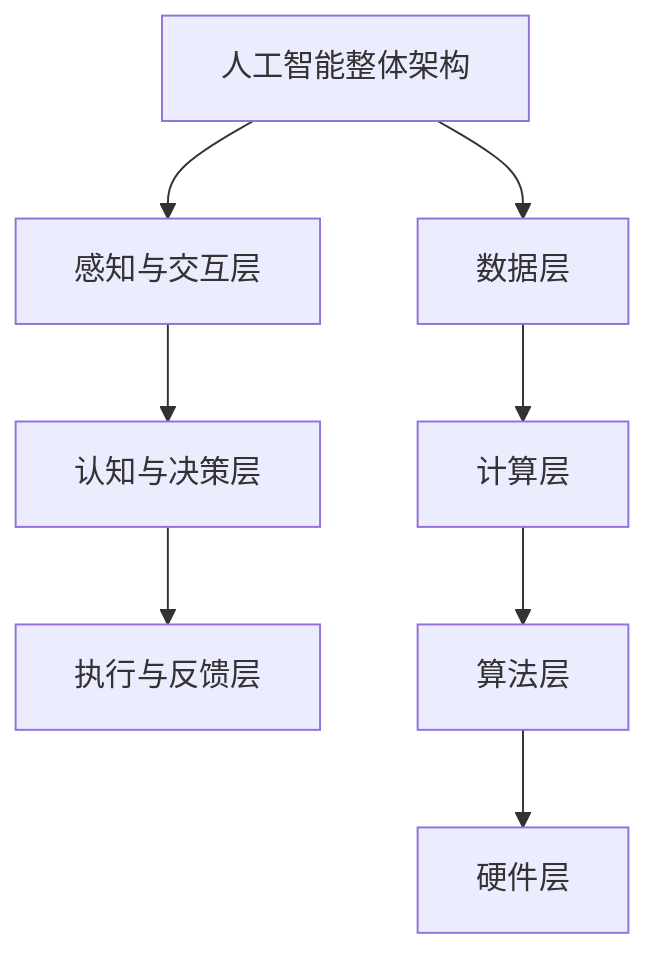

                 

# AI应用实践的新方向与趋势

> 关键词：人工智能应用、行业融合、发展趋势、伦理问题、实践案例

> 摘要：本文将探讨人工智能（AI）应用实践的新方向与趋势。通过分析AI技术的发展历程和应用现状，我们将详细阐述AI在各个行业中的应用场景、技术基础以及未来发展趋势。同时，本文还将探讨AI应用的社会影响和伦理问题，提供实践项目案例，并总结AI应用开发的准备与资源，最后展望AI的未来发展。

## 第一部分: AI应用实践的新方向与趋势

### 第1章: 引言

#### 1.1 书籍背景与目标

##### 1.1.1 人工智能技术的发展历程

人工智能（AI）的概念最早可以追溯到20世纪50年代。当时，科学家们开始探索如何让计算机模拟人类的智能行为。自那时以来，AI经历了多个发展阶段，从符号主义到连接主义，再到现代的深度学习，每一次的技术突破都为AI应用带来了新的可能性。

- **符号主义**（Symbolic AI）：早期的人工智能主要基于逻辑推理和知识表示。专家系统和推理机是这一阶段的代表性技术。
- **连接主义**（Connectionist AI）：20世纪80年代，神经网络的出现推动了AI的发展。通过模拟人脑神经元之间的连接，神经网络在图像识别、语音识别等领域取得了显著成果。
- **深度学习**（Deep Learning）：21世纪初，深度学习的兴起使得AI迎来了新的发展高峰。通过多层神经网络，深度学习在图像识别、自然语言处理等领域取得了突破性进展。

##### 1.1.2 人工智能应用现状与挑战

目前，人工智能已经在各个领域得到了广泛应用，从金融、医疗到教育、制造，AI技术的深度应用不仅提高了生产效率，还推动了行业变革。然而，AI应用也面临着一系列挑战，包括数据隐私、算法偏见、技术成熟度等。

- **数据隐私**：随着AI应用的数据量不断增加，如何保护用户隐私成为一个重要问题。
- **算法偏见**：AI算法的偏见可能导致不公平和歧视。
- **技术成熟度**：尽管深度学习取得了巨大成功，但AI在其他领域的技术成熟度仍然有待提高。

##### 1.1.3 本书的结构与内容概述

本书旨在提供一份全面的人工智能应用实践指南，分为七个部分：

1. 引言：介绍人工智能技术的发展历程和应用现状。
2. 人工智能基础理论：讲解人工智能的基本概念、机器学习算法和深度学习模型。
3. 人工智能应用领域：探讨AI在金融、医疗、制造、教育等领域的应用。
4. AI应用实践项目案例：提供具体的AI应用实践案例。
5. AI应用开发的准备与资源：介绍AI应用开发的环境搭建、数据处理和资源推荐。
6. AI伦理与社会问题：探讨AI伦理和社会问题。
7. AI应用的未来展望：展望AI技术的未来发展方向。

通过这本书，读者可以系统地了解AI应用实践的新方向与趋势，为未来的AI应用开发提供指导和参考。

#### 1.2 AI应用实践的新方向

##### 1.2.1 AI与各行各业的融合

人工智能正在与各行各业深度融合，推动着传统行业的数字化转型。以下是一些典型的应用场景：

- **金融行业**：AI在金融行业的应用已经非常成熟，包括风险管理、量化交易、信用评分等。未来，AI还将进一步优化金融服务的效率和个性化。
- **医疗健康**：AI在医疗健康领域的应用主要包括疾病诊断、药物研发、智能医疗设备等。随着数据的积累和算法的优化，AI将在医疗健康领域发挥更大的作用。
- **智能制造**：智能制造是AI应用的一个重要领域。通过AI技术，可以实现生产过程的优化、质量控制的提升以及工业机器人的智能控制。
- **交通**：自动驾驶、智能交通管理系统和物流优化是AI在交通领域的典型应用。AI技术将大幅提高交通系统的效率和安全性。
- **教育**：个性化学习、智能教育平台和教育数据分析是AI在教育领域的应用方向。AI技术可以帮助教育工作者更好地了解学生的学习情况，提供个性化的教育服务。
- **农业**：智能农业监控、智能种植和收割是AI在农业领域的应用。AI技术可以帮助农民提高农业生产效率和降低成本。
- **能源管理**：智能能源管理系统、环境监测是AI在能源管理领域的应用。通过AI技术，可以实现能源的高效利用和环境保护。

##### 1.2.2 AI应用的细分领域

除了以上主要行业，人工智能还在许多细分领域得到了应用：

- **零售**：智能推荐系统、库存管理和客户服务是AI在零售行业的应用。通过分析消费者行为，AI可以帮助零售商提高销售和客户满意度。
- **法律**：AI在法律领域的应用主要包括合同审核、案件预测和法律研究等。AI技术可以提高法律工作的效率和准确性。
- **安全**：智能安防系统、网络威胁检测和反欺诈是AI在安全领域的应用。通过实时监控和分析，AI可以帮助企业和个人提高安全防护能力。
- **娱乐**：智能推荐系统、游戏AI和虚拟现实是AI在娱乐领域的应用。AI技术可以为用户提供更加个性化的娱乐体验。

##### 1.2.3 新方向的技术基础

新方向的人工智能应用离不开以下几个核心技术：

- **深度学习**：深度学习是AI技术的核心，通过多层神经网络，可以实现图像识别、语音识别、自然语言处理等复杂任务。
- **计算机视觉**：计算机视觉技术是AI在视觉感知领域的应用，包括图像识别、目标检测、图像生成等。
- **自然语言处理**：自然语言处理技术是AI在语言理解领域的应用，包括文本分类、情感分析、机器翻译等。
- **强化学习**：强化学习是一种通过试错来学习最优策略的AI技术，在游戏、机器人控制等领域有着广泛应用。
- **数据挖掘**：数据挖掘技术是从大量数据中提取有价值信息的方法，广泛应用于数据分析、预测模型构建等。

#### 1.3 AI应用的趋势

##### 1.3.1 当前AI应用的五大趋势

当前，人工智能应用呈现出以下五大趋势：

1. **智能化转型**：越来越多的行业和企业开始将AI技术应用于生产和服务流程中，实现智能化转型。
2. **跨界融合**：AI技术正在与各行各业深度融合，推动着新商业模式的诞生。
3. **数据驱动**：数据的获取和利用是AI应用的基础，未来的AI应用将更加依赖于高质量的数据。
4. **算法优化**：随着AI技术的不断进步，算法的优化和改进将成为提高AI应用效果的关键。
5. **伦理关注**：随着AI应用的范围不断扩大，伦理问题逐渐成为公众和学者关注的焦点。

##### 1.3.2 未来AI应用的发展方向

未来，人工智能应用将朝着以下几个方向发展：

1. **更广泛的应用场景**：随着AI技术的不断成熟，AI将应用于更多的领域，包括农业、能源、环境等。
2. **更高的智能化水平**：未来的AI将更加智能，能够自主学习、自适应和自主决策。
3. **更高效的数据处理**：随着数据量的爆炸性增长，AI技术将更加注重数据的高效处理和分析。
4. **更安全的系统**：AI安全将是未来发展的一个重要方向，包括算法安全、数据安全和系统安全。

##### 1.3.3 AI应用的社会影响与伦理问题

AI应用的发展对社会产生了深远的影响，同时也带来了许多伦理问题：

1. **就业影响**：AI技术的发展可能会导致部分传统职业的减少，但同时也会创造新的就业机会。
2. **隐私保护**：AI应用涉及大量的个人数据，如何保护用户隐私成为一个重要问题。
3. **算法偏见**：AI算法的偏见可能导致不公平和歧视，需要引起足够的重视。
4. **伦理决策**：AI系统在某些情况下需要做出伦理决策，如何制定相应的伦理准则成为了一个挑战。

### Mermaid流程图：人工智能应用技术架构图



#### 1.4 总结与展望

在本章中，我们介绍了人工智能应用实践的新方向与趋势。通过分析人工智能技术的发展历程和应用现状，我们探讨了AI与各行各业的融合、AI应用的细分领域以及新方向的技术基础。同时，我们还介绍了当前AI应用的五大趋势和未来AI应用的发展方向。在下一章节中，我们将深入探讨人工智能的基础理论，包括机器学习、深度学习、神经网络等核心概念。

##### 1.4.1 关键知识点回顾

- 人工智能技术的发展历程：符号主义、连接主义、深度学习。
- AI应用的现状与挑战：数据隐私、算法偏见、技术成熟度。
- AI应用的新方向：与各行各业的融合、细分领域、技术基础。
- 当前AI应用的五大趋势：智能化转型、跨界融合、数据驱动、算法优化、伦理关注。
- 未来AI应用的发展方向：更广泛的应用场景、更高的智能化水平、更高效的数据处理、更安全的系统。

##### 1.4.2 下一章节预告

在下一章中，我们将深入探讨人工智能的基础理论，包括机器学习、深度学习、神经网络等核心概念。我们将详细讲解这些理论的基本原理、应用场景以及实现方法，帮助读者更好地理解人工智能的基础知识。

## 第2章: 人工智能基础理论

### 第2章: 人工智能基础理论

#### 2.1 人工智能的定义与分类

##### 2.1.1 人工智能的定义

人工智能（Artificial Intelligence，简称AI）是研究、开发用于模拟、延伸和扩展人的智能的理论、方法、技术及应用系统的一门新的技术科学。人工智能的研究目标是使机器能够胜任一些通常需要人类智能才能完成的复杂任务。

##### 2.1.2 人工智能的分类

人工智能可以按照不同的标准进行分类，常见的分类方法包括基于技术、任务和智能水平等。

- **基于技术的分类**：
  - **符号主义（Symbolic AI）**：早期的人工智能主要基于逻辑推理和知识表示。
  - **连接主义（Connectionist AI）**：神经网络和深度学习的理论基础。
  - **进化计算（Evolutionary Computation）**：基于生物进化原理的算法。
  - **模糊逻辑（Fuzzy Logic）**：处理不确定性和模糊性问题的逻辑系统。

- **基于任务的分类**：
  - **感知与交互**：包括计算机视觉、语音识别、自然语言处理等。
  - **认知与决策**：包括推理、规划、问题求解等。
  - **执行与控制**：包括机器人控制、自动驾驶等。

- **基于智能水平的分类**：
  - **弱人工智能（Narrow AI）**：专注于特定任务的智能系统。
  - **强人工智能（General AI）**：具备人类智能，能够应对各种复杂任务。
  - **超人工智能（Super Intelligence）**：超越人类智能，能够解决任何问题。

##### 2.1.3 强人工智能与弱人工智能的探讨

强人工智能（General AI）是一种具有普遍智能的人工智能系统，可以像人类一样理解和运用知识，进行推理、学习、规划等复杂任务。然而，目前人工智能领域尚未实现强人工智能，大多数人工智能系统都属于弱人工智能（Narrow AI），它们在特定领域表现出色，但在其他领域则表现有限。

#### 2.2 机器学习基本概念

##### 2.2.1 机器学习的定义

机器学习（Machine Learning，简称ML）是一门研究如何让计算机从数据中学习，并作出决策或预测的学科。机器学习是人工智能的一个重要分支，通过构建能够从经验中学习的算法，让计算机在特定任务上表现出人类或超过人类的水平。

##### 2.2.2 监督学习、无监督学习和半监督学习

机器学习的主要方法包括监督学习、无监督学习和半监督学习。

- **监督学习（Supervised Learning）**：在监督学习过程中，输入和输出都是已知的，模型通过学习输入和输出之间的关系来预测未知的数据。常见的监督学习算法包括线性回归、逻辑回归、支持向量机（SVM）和神经网络等。

- **无监督学习（Unsupervised Learning）**：在无监督学习过程中，只有输入数据，没有对应的输出数据。模型的目的是发现数据中的模式和结构。常见的无监督学习算法包括聚类（如K-Means、层次聚类）、降维（如主成分分析PCA、t-SNE）和关联规则学习（如Apriori算法）。

- **半监督学习（Semi-Supervised Learning）**：半监督学习结合了监督学习和无监督学习的特点，既有标注数据也有未标注数据。模型利用标注数据和未标注数据共同学习，以提高模型的泛化能力。

##### 2.2.3 深度学习与强化学习

深度学习（Deep Learning）是机器学习的一个子领域，它基于多层神经网络，通过学习大量数据来提取特征和表示。深度学习在图像识别、语音识别、自然语言处理等领域取得了显著的成果。

强化学习（Reinforcement Learning）是一种通过试错来学习最优策略的机器学习方法。在强化学习过程中，模型通过与环境的交互来学习决策策略。强化学习在游戏AI、机器人控制等领域有着广泛应用。

#### 2.3 神经网络与深度学习

##### 2.3.1 神经网络的基本结构

神经网络（Neural Network）是深度学习的基础，它由大量相互连接的神经元组成。神经网络的基本结构包括输入层、隐藏层和输出层。

- **输入层**：接收外部输入数据。
- **隐藏层**：对输入数据进行处理和转换。
- **输出层**：生成输出结果。

神经网络中的每个神经元都通过权重与相邻的神经元连接，通过激活函数将输入转化为输出。常见的激活函数包括sigmoid函数、ReLU函数和tanh函数。

##### 2.3.2 深度学习的主要模型

深度学习的主要模型包括卷积神经网络（CNN）、循环神经网络（RNN）和Transformer等。

- **卷积神经网络（CNN）**：CNN是一种专门用于处理图像数据的神经网络。它通过卷积层提取图像的特征，并通过池化层降低数据的维度，从而实现图像识别和分类。
- **循环神经网络（RNN）**：RNN是一种能够处理序列数据的神经网络，它可以保存和利用先前的信息，在自然语言处理和时间序列预测等领域有着广泛应用。常见的RNN模型包括LSTM（长短时记忆网络）和GRU（门控循环单元）。
- **Transformer**：Transformer是一种基于自注意力机制的深度学习模型，它在机器翻译、文本生成等任务上取得了显著的成果。Transformer通过多头注意力机制和编码器-解码器结构，实现了对输入序列的建模和输出序列的生成。

##### 2.3.3 卷积神经网络（CNN）与循环神经网络（RNN）

- **卷积神经网络（CNN）**：CNN是一种专门用于处理图像数据的神经网络。它通过卷积层提取图像的特征，并通过池化层降低数据的维度，从而实现图像识别和分类。CNN在图像分类、物体检测、图像生成等领域有着广泛应用。
- **循环神经网络（RNN）**：RNN是一种能够处理序列数据的神经网络，它可以保存和利用先前的信息，在自然语言处理和时间序列预测等领域有着广泛应用。常见的RNN模型包括LSTM（长短时记忆网络）和GRU（门控循环单元）。

#### 伪代码：神经网络训练过程

```python
# 神经网络训练伪代码
initialize_parameters()
load_dataset()
for each epoch in range(num_epochs):
    for each sample in dataset:
        compute_forward_pass(sample)
        compute_loss()
        compute_gradients()
        update_parameters()
```

##### 2.4 机器学习算法原理

机器学习算法主要分为监督学习算法和无监督学习算法。

- **线性回归**：线性回归是一种简单的监督学习算法，用于预测连续值输出。线性回归通过建立输入变量和输出变量之间的线性关系来预测新数据。
- **逻辑回归**：逻辑回归是一种用于分类问题的监督学习算法。逻辑回归通过建立输入变量和概率输出之间的逻辑关系来预测新数据。
- **支持向量机（SVM）**：支持向量机是一种用于分类和回归问题的监督学习算法。SVM通过找到一个最佳的超平面来分离不同类别的数据。
- **决策树与随机森林**：决策树是一种用于分类和回归问题的监督学习算法。决策树通过一系列条件判断来对数据进行分类或回归。随机森林是一种基于决策树构建的集成学习算法，它通过随机选择特征和样本子集来训练多个决策树，并通过投票或平均的方式得到最终结果。

##### 2.5 数学基础

机器学习算法的许多部分都需要数学知识，以下是几个关键的数学基础：

- **矩阵与向量操作**：矩阵和向量是机器学习中常用的数据结构，它们支持多种运算，如加法、减法、乘法和转置等。
- **概率论基础**：概率论是机器学习的基础，用于描述随机事件和概率分布。常见的概率分布包括伯努利分布、正态分布和泊松分布等。
- **梯度下降算法**：梯度下降是一种优化算法，用于最小化损失函数。梯度下降通过计算损失函数的梯度并沿着梯度方向更新模型参数，逐步减小损失函数的值。

#### 2.6 实践应用

##### 2.6.1 机器学习项目实战

机器学习项目通常包括以下几个步骤：

1. 数据收集与预处理：收集相关数据，并进行清洗、归一化和特征提取等预处理操作。
2. 模型选择与训练：选择合适的机器学习算法，对数据集进行训练，并调整模型参数。
3. 模型评估与优化：评估模型的性能，并进行超参数调整和模型优化。
4. 模型部署与维护：将模型部署到生产环境中，并进行监控和维护。

##### 2.6.2 神经网络项目实战

神经网络项目通常包括以下几个步骤：

1. 数据收集与预处理：与机器学习项目类似，收集并预处理数据。
2. 网络结构设计：设计神经网络的结构，包括输入层、隐藏层和输出层的神经元数量和连接方式。
3. 模型训练与优化：使用训练数据训练神经网络，并通过调整学习率、批量大小等超参数来优化模型。
4. 模型评估与部署：评估模型的性能，并进行必要的调整。将模型部署到生产环境中，供实际应用使用。

##### 2.6.3 未来发展趋势与展望

未来，机器学习和神经网络项目的发展将受到以下因素的影响：

1. **算法创新**：随着研究的深入，新的机器学习算法和神经网络结构将不断涌现。
2. **硬件加速**：GPU和TPU等硬件设备的普及将加速机器学习和神经网络的计算速度。
3. **数据隐私与安全**：数据隐私和安全将成为机器学习和神经网络项目的重要挑战。
4. **跨学科融合**：机器学习和神经网络项目将与其他领域（如生物学、心理学等）的交叉融合，推动新技术的诞生。

#### 2.7 总结与展望

在本章中，我们介绍了人工智能的基础理论，包括定义、分类、机器学习基本概念、神经网络与深度学习模型、机器学习算法原理以及数学基础。通过这些理论，读者可以更好地理解人工智能的核心概念和技术原理。在下一章中，我们将探讨人工智能在各个领域的应用，包括金融、医疗、制造、教育等，通过具体的案例和项目实战，展示人工智能的实践应用。

##### 2.7.1 关键知识点回顾

- 人工智能的定义与分类。
- 监督学习、无监督学习和半监督学习。
- 深度学习的主要模型。
- 机器学习算法原理。
- 数学基础。
- 实践应用。

##### 2.7.2 下一章节预告

在下一章中，我们将深入探讨人工智能在各个领域的应用，通过具体的案例和项目实战，展示人工智能在不同行业中的实践应用。我们将看到人工智能如何改变金融、医疗、制造、教育等行业，以及这些行业如何利用人工智能技术实现数字化转型和智能化升级。

### 第3章: 人工智能应用领域

#### 3.1 人工智能在金融领域的应用

##### 3.1.1 风险管理

金融行业的风险管理是一项至关重要的任务，人工智能技术的应用为风险管理带来了新的可能性。通过机器学习和数据分析，金融机构可以更好地预测市场趋势、评估信用风险和防范欺诈行为。

- **市场预测**：利用历史数据和机器学习算法，金融机构可以预测股票市场、汇率、利率等金融指标的未来走势。这有助于投资者做出更明智的投资决策，同时也能帮助金融机构调整其风险敞口。
- **信用评分**：人工智能技术可以分析大量的信用数据，包括历史借贷记录、支付习惯、收入水平等，从而更准确地评估借款人的信用风险。这有助于降低信用损失，提高贷款的盈利能力。
- **欺诈检测**：通过机器学习模型，金融机构可以实时监控交易活动，识别潜在的欺诈行为。这不仅可以降低欺诈损失，还能提高客户的安全感。

##### 3.1.2 量化交易

量化交易是金融领域的一种高级交易策略，它利用复杂的数学模型和人工智能算法，自动进行买卖交易，以获取市场机会。量化交易在股票、外汇、期货等多个市场中都有广泛应用。

- **算法交易**：量化交易利用算法来执行交易策略，这些算法可以基于技术分析、基本面分析或市场情绪等多种方法。通过实时监控市场数据，算法交易可以在毫秒级别做出交易决策，从而捕捉市场波动带来的盈利机会。
- **对冲策略**：量化交易通过构建对冲组合，可以降低投资组合的整体风险。例如，通过同时买入和卖出相关的金融产品，量化交易可以在市场波动时实现风险对冲。

##### 3.1.3 信用评分与反欺诈

信用评分和反欺诈是金融行业的重要组成部分，人工智能技术为这两个领域带来了革命性的变化。

- **信用评分**：传统的信用评分模型主要依赖于历史数据和评分指标，而人工智能技术可以更全面地分析借款人的行为数据，包括社交媒体活动、地理位置、消费习惯等。通过这些数据，人工智能可以更准确地评估借款人的信用风险。
- **反欺诈**：人工智能技术在反欺诈领域的应用主要体现在交易监控和风险识别。通过机器学习模型，金融机构可以实时分析交易数据，识别异常交易行为，从而及时发现和防范欺诈行为。

#### 3.2 人工智能在医疗健康领域的应用

##### 3.2.1 诊断与预测

人工智能在医疗健康领域的诊断与预测应用具有巨大的潜力，可以显著提高诊断的准确性和效率。

- **疾病预测**：通过分析患者的医疗记录、基因数据和生活方式数据，人工智能可以预测患者未来可能患上的疾病。这有助于医生提前采取预防措施，降低疾病发生的风险。
- **疾病诊断**：人工智能技术可以通过分析医学影像（如X光、CT、MRI等），帮助医生更准确地诊断疾病。例如，在乳腺癌筛查中，人工智能可以检测出微小的肿瘤，从而提高早期诊断的准确性。
- **基因组分析**：人工智能可以对患者的基因组数据进行分析，预测其患某种遗传病的风险。这有助于个性化医疗的实现，为患者提供更精准的治疗方案。

##### 3.2.2 药物研发

人工智能在药物研发中的应用可以加速新药的研发过程，降低研发成本。

- **药物筛选**：通过分析大量的化合物数据，人工智能可以帮助科学家快速筛选出可能具有治疗潜力的化合物。这可以大幅减少药物研发的时间和成本。
- **药物设计**：人工智能技术可以设计出具有特定化学结构的药物分子，从而提高药物的治疗效果和安全性。这为药物研发提供了新的思路和工具。
- **临床试验**：人工智能可以分析临床试验的数据，评估药物的安全性和有效性。这有助于优化临床试验的设计，提高药物审批的效率。

##### 3.2.3 医疗机器人

医疗机器人是人工智能在医疗健康领域的又一重要应用，它可以辅助医生进行手术、康复治疗和护理等工作。

- **手术辅助**：医疗机器人可以在微创手术、激光手术等领域提供精确的操作支持，从而提高手术的成功率和安全性。
- **康复治疗**：人工智能可以帮助设计个性化的康复训练计划，指导患者进行康复训练，从而提高康复效果。
- **护理支持**：医疗机器人可以辅助护士进行日常护理工作，如监测患者生命体征、提供药物提醒等，从而减轻护士的工作负担。

#### 3.3 人工智能在智能制造领域的应用

##### 3.3.1 生产优化

人工智能在智能制造领域的应用可以显著提高生产效率和质量。

- **生产调度**：通过分析生产数据和供应链信息，人工智能可以优化生产计划，提高生产效率。例如，可以预测设备故障，提前进行维护，从而减少生产停机时间。
- **质量控制**：人工智能可以通过图像识别和传感器数据分析，实时监控产品质量，及时发现和纠正生产过程中的问题，从而提高产品质量。
- **设备预测性维护**：通过分析设备运行数据，人工智能可以预测设备故障，提前进行维护，从而减少设备停机时间和维护成本。

##### 3.3.2 质量控制

人工智能在质量控制中的应用可以显著提高产品质量。

- **缺陷检测**：通过图像识别技术，人工智能可以实时检测产品表面的缺陷，如划痕、气泡等，从而确保产品的质量。
- **过程监控**：人工智能可以监控生产过程中的关键参数，如温度、压力等，确保生产过程在最佳条件下进行，从而保证产品质量。
- **质量预测**：通过分析历史数据和当前生产条件，人工智能可以预测产品质量，从而提前采取措施，防止不合格产品流出。

##### 3.3.3 工业机器人

工业机器人在智能制造中的应用可以显著提高生产效率和灵活性。

- **组装与焊接**：工业机器人可以自动完成组装和焊接工作，提高生产效率和产品质量。
- **搬运与包装**：工业机器人可以自动搬运和包装产品，减轻工人的劳动强度，提高生产效率。
- **灵活制造**：工业机器人可以快速适应不同的生产任务，实现柔性制造，从而提高生产灵活性。

#### 3.4 人工智能在交通领域的应用

##### 3.4.1 自动驾驶

自动驾驶是人工智能在交通领域最具革命性的应用，它可以显著提高交通安全和效率。

- **环境感知**：自动驾驶系统通过激光雷达、摄像头和其他传感器收集道路信息，实时感知周围环境。
- **路径规划**：基于环境感知数据，自动驾驶系统可以规划最优行驶路径，确保车辆安全、高效地行驶。
- **决策控制**：自动驾驶系统通过复杂的算法进行决策，控制车辆加速、减速和转向，实现自主驾驶。

##### 3.4.2 智能交通管理系统

智能交通管理系统（Intelligent Transportation System，简称ITS）通过人工智能技术优化交通管理，提高交通效率。

- **实时路况监测**：通过摄像头、传感器和车辆信息收集系统，智能交通管理系统可以实时监测交通流量和路况，为交通管理提供数据支持。
- **交通信号控制**：基于实时路况数据，智能交通管理系统可以动态调整交通信号灯的时长，优化交通流量，减少拥堵。
- **交通预测与预警**：通过大数据分析和机器学习算法，智能交通管理系统可以预测交通状况，提前发出预警，引导车辆避开拥堵路段。

##### 3.4.3 物流优化

人工智能在物流优化中的应用可以显著提高物流效率和降低成本。

- **路径优化**：通过分析交通状况、车辆信息和目的地数据，人工智能可以规划最优物流路径，减少运输时间和成本。
- **库存管理**：通过分析销售数据和库存情况，人工智能可以预测未来需求，优化库存管理，减少库存成本。
- **运输调度**：通过分析订单数量、货物类型和运输路线，人工智能可以优化运输调度，提高运输效率。

#### 3.5 人工智能在教育领域的应用

##### 3.5.1 个性化学习

个性化学习是人工智能在教育领域的重要应用，它可以满足学生的个性化学习需求。

- **学习推荐**：通过分析学生的学习行为和成绩数据，人工智能可以为学生推荐适合的学习资源和教学方法，提高学习效果。
- **学习评估**：通过实时监测学生的学习行为和成绩，人工智能可以评估学生的学习进度和理解程度，为学生提供个性化的学习建议。
- **智能辅导**：通过自然语言处理和机器学习算法，人工智能可以为学生提供智能辅导，解答学生在学习过程中遇到的问题。

##### 3.5.2 智能教育平台

智能教育平台是人工智能在教育领域的重要应用，它可以提高教学效率和质量。

- **在线教育**：通过云计算和大数据技术，智能教育平台可以提供丰富的在线教育资源，满足不同学生的学习需求。
- **互动教学**：通过虚拟现实、增强现实和人工智能技术，智能教育平台可以实现互动教学，提高学生的学习兴趣和参与度。
- **教学评估**：通过分析学生的学习行为和成绩数据，智能教育平台可以评估教学效果，为教师提供改进教学的方法和建议。

##### 3.5.3 教育数据分析

教育数据分析是人工智能在教育领域的重要应用，它可以提供有价值的教育数据，帮助教育工作者做出更好的决策。

- **学生成绩分析**：通过分析学生的成绩数据，教育数据分析可以帮助教育工作者了解学生的学习状况，找出学习中的问题，并制定相应的解决方案。
- **教学效果评估**：通过分析教学数据和学生学习行为数据，教育数据分析可以帮助教育工作者评估教学效果，优化教学方法和策略。
- **教育趋势预测**：通过大数据分析和机器学习算法，教育数据分析可以预测未来的教育趋势，为教育政策制定和教育资源配置提供参考。

#### 3.6 人工智能在农业领域的应用

##### 3.6.1 农业智能监控

农业智能监控是人工智能在农业领域的重要应用，它可以提高农业生产效率和降低成本。

- **土壤监测**：通过传感器和物联网技术，农业智能监控可以实时监测土壤的湿度和养分含量，为作物生长提供科学依据。
- **气象监测**：通过监测气象数据，农业智能监控可以预测天气变化，为作物种植和灌溉提供指导。
- **病虫害监测**：通过图像识别和大数据分析，农业智能监控可以及时发现病虫害，并采取相应的防治措施。

##### 3.6.2 智能种植与收割

智能种植与收割是人工智能在农业领域的重要应用，它可以提高农业生产效率和降低劳动力成本。

- **智能种植**：通过大数据分析和机器学习算法，农业智能监控可以预测作物的最佳种植时间和种植方式，提高作物产量和品质。
- **智能收割**：通过无人机和自动化机械，农业智能监控可以实现无人化收割，提高收割效率和降低收割成本。

##### 3.6.3 农业数据分析

农业数据分析是人工智能在农业领域的重要应用，它可以提供有价值的数据支持，帮助农业生产者做出更好的决策。

- **作物产量预测**：通过分析历史气象数据、土壤数据和作物生长周期，农业数据分析可以预测作物的产量，为农业生产者提供参考。
- **成本分析**：通过分析生产数据、成本数据和销售数据，农业数据分析可以帮助农业生产者优化生产成本，提高盈利能力。
- **市场预测**：通过分析市场数据、供需情况和价格趋势，农业数据分析可以预测农产品的市场行情，为农业生产者提供市场预测和决策支持。

#### 3.7 人工智能在其他领域的应用

##### 3.7.1 能源管理

能源管理是人工智能在其他领域的重要应用，它可以提高能源利用效率，降低能源消耗。

- **智能电网**：通过人工智能技术，智能电网可以实现实时监测、分析和控制电力供应和需求，提高电力系统的运行效率。
- **能源预测**：通过分析历史能源数据、天气数据和负荷数据，人工智能可以预测未来的能源需求，为能源调度和供应提供科学依据。
- **节能优化**：通过分析能源使用数据和设备运行状况，人工智能可以优化能源使用，降低能源消耗和运营成本。

##### 3.7.2 环境监测

环境监测是人工智能在其他领域的重要应用，它可以实时监测环境变化，提供环境保护的科学依据。

- **空气质量监测**：通过传感器和物联网技术，环境监测可以实时监测空气质量，为环境保护和健康预警提供数据支持。
- **水资源监测**：通过监测水质、水量和水温等参数，环境监测可以实时监测水资源状况，为水资源管理和保护提供数据支持。
- **土壤质量监测**：通过监测土壤的养分含量、水分含量和重金属含量等参数，环境监测可以实时监测土壤质量，为土壤保护和修复提供数据支持。

##### 3.7.3 文化娱乐

文化娱乐是人工智能在其他领域的重要应用，它可以创造更加丰富的文化娱乐体验。

- **个性化推荐**：通过分析用户的行为数据、兴趣爱好和社交网络，人工智能可以为用户推荐个性化的文化娱乐内容，提高用户的满意度。
- **虚拟现实**：通过虚拟现实技术，人工智能可以创造逼真的虚拟环境，为用户提供沉浸式的文化娱乐体验。
- **游戏开发**：通过人工智能技术，游戏开发者可以创造更加智能和互动的游戏体验，提高游戏的趣味性和挑战性。

#### 3.8 总结与展望

在本章中，我们介绍了人工智能在金融、医疗、制造、教育、农业和其他领域的应用。通过具体的应用案例，我们可以看到人工智能如何改变这些行业，提高生产效率、降低成本、提升服务质量。在下一章中，我们将深入探讨AI应用实践项目案例，通过实际项目展示人工智能在各个领域的应用实践。

##### 3.8.1 关键知识点回顾

- 金融领域：风险管理、量化交易、信用评分与反欺诈。
- 医疗健康领域：诊断与预测、药物研发、医疗机器人。
- 智能制造领域：生产优化、质量控制、工业机器人。
- 交通领域：自动驾驶、智能交通管理系统、物流优化。
- 教育领域：个性化学习、智能教育平台、教育数据分析。
- 农业领域：农业智能监控、智能种植与收割、农业数据分析。
- 其他领域：能源管理、环境监测、文化娱乐。

##### 3.8.2 下一章节预告

在下一章中，我们将通过具体的AI应用实践项目案例，深入探讨人工智能在不同领域的实际应用。我们将分析这些项目的开发过程、技术实现和效果评估，帮助读者更好地理解人工智能在现实世界中的应用。

### 第4章: AI应用实践项目案例

#### 4.1 金融领域案例

##### 4.1.1 案例一：智能投顾系统

智能投顾系统是一种利用人工智能技术为用户提供个性化投资建议的金融产品。该系统的核心功能包括用户画像分析、投资组合优化和风险控制。

**开发过程：**

1. **需求分析**：了解用户需求，包括投资目标、风险偏好和资产配置策略等。
2. **数据收集**：收集用户的基本信息、投资记录和历史交易数据。
3. **用户画像分析**：利用机器学习算法对用户数据进行处理，建立用户画像。
4. **投资组合优化**：根据用户画像和市场需求，设计投资组合，包括股票、基金、债券等。
5. **风险控制**：通过实时监控市场动态，调整投资组合，以降低投资风险。

**技术实现：**

- **机器学习算法**：用于用户画像分析和投资组合优化，包括聚类算法、线性回归和神经网络等。
- **量化交易模型**：用于动态调整投资组合，包括时间序列分析和风险管理模型。

**效果评估：**

- **用户满意度**：通过用户反馈调查，评估智能投顾系统的用户满意度。
- **投资回报率**：通过分析用户的投资记录，评估智能投顾系统的投资回报率。
- **风险控制效果**：通过实时监控市场动态，评估智能投顾系统的风险控制效果。

##### 4.1.2 案例二：信用评分系统

信用评分系统是一种利用人工智能技术评估借款人信用风险的金融产品。该系统的核心功能包括信用评分、信用评级和风险预警。

**开发过程：**

1. **需求分析**：了解信用评分系统的应用场景，包括金融机构、电商平台等。
2. **数据收集**：收集借款人的基本信息、财务状况、历史借贷记录等数据。
3. **特征工程**：对数据进行清洗、归一化和特征提取，为信用评分提供输入。
4. **模型训练**：利用机器学习算法训练信用评分模型，包括逻辑回归、决策树和神经网络等。
5. **模型部署**：将训练好的模型部署到生产环境中，为用户提供实时信用评分服务。

**技术实现：**

- **机器学习算法**：用于信用评分模型训练和风险预警，包括线性回归、决策树和神经网络等。
- **特征提取**：利用自然语言处理和图像识别技术，提取借款人的特征信息。

**效果评估：**

- **评分准确性**：通过比较模型评分与实际信用状况，评估信用评分系统的准确性。
- **风险控制效果**：通过分析信用评分系统的风险预警功能，评估其对风险控制的贡献。
- **用户满意度**：通过用户反馈调查，评估信用评分系统的用户满意度。

##### 4.1.3 案例三：反欺诈检测系统

反欺诈检测系统是一种利用人工智能技术检测和防范金融欺诈行为的金融产品。该系统的核心功能包括交易监控、异常检测和风险预警。

**开发过程：**

1. **需求分析**：了解反欺诈检测系统的应用场景，包括银行、支付平台等。
2. **数据收集**：收集用户的交易数据、行为数据和社交网络数据等。
3. **特征工程**：对数据进行清洗、归一化和特征提取，为异常检测提供输入。
4. **模型训练**：利用机器学习算法训练异常检测模型，包括聚类算法、决策树和神经网络等。
5. **模型部署**：将训练好的模型部署到生产环境中，实时监控交易行为。

**技术实现：**

- **机器学习算法**：用于异常检测和风险预警，包括聚类算法、决策树和神经网络等。
- **实时监控**：利用物联网技术和大数据分析，实时监控交易行为和用户行为。

**效果评估：**

- **欺诈检测率**：通过比较模型检测结果与实际欺诈事件，评估反欺诈检测系统的检测率。
- **误报率**：通过分析误报交易，评估反欺诈检测系统的误报率。
- **用户满意度**：通过用户反馈调查，评估反欺诈检测系统的用户满意度。

#### 4.2 医疗健康领域案例

##### 4.2.1 案例一：疾病预测模型

疾病预测模型是一种利用人工智能技术预测疾病发生风险的医疗健康产品。该系统的核心功能包括疾病风险评估、健康建议和预警。

**开发过程：**

1. **需求分析**：了解疾病预测模型的应用场景，包括健康管理、疾病预防等。
2. **数据收集**：收集用户的基本信息、健康数据和医疗记录等。
3. **特征工程**：对数据进行清洗、归一化和特征提取，为疾病预测提供输入。
4. **模型训练**：利用机器学习算法训练疾病预测模型，包括逻辑回归、决策树和神经网络等。
5. **模型部署**：将训练好的模型部署到生产环境中，为用户提供实时疾病预测服务。

**技术实现：**

- **机器学习算法**：用于疾病预测模型训练和健康建议，包括逻辑回归、决策树和神经网络等。
- **大数据分析**：利用大数据技术分析用户数据，提取潜在的健康风险因素。

**效果评估：**

- **预测准确性**：通过比较模型预测结果与实际疾病发生情况，评估疾病预测模型的准确性。
- **健康建议效果**：通过分析健康建议对用户健康的影响，评估健康建议的效果。
- **用户满意度**：通过用户反馈调查，评估疾病预测模型的用户满意度。

##### 4.2.2 案例二：医学图像分析系统

医学图像分析系统是一种利用人工智能技术分析和处理医学图像的医疗健康产品。该系统的核心功能包括图像分割、病变检测和诊断辅助。

**开发过程：**

1. **需求分析**：了解医学图像分析系统的应用场景，包括病理诊断、影像诊断等。
2. **数据收集**：收集大量的医学图像数据，包括X光、CT、MRI等。
3. **特征工程**：对医学图像进行预处理，提取关键特征，为图像分析提供输入。
4. **模型训练**：利用深度学习算法训练医学图像分析模型，包括卷积神经网络（CNN）和循环神经网络（RNN）等。
5. **模型部署**：将训练好的模型部署到生产环境中，为医生提供诊断辅助。

**技术实现：**

- **深度学习算法**：用于医学图像分析模型训练和诊断辅助，包括卷积神经网络（CNN）和循环神经网络（RNN）等。
- **图像处理技术**：利用图像处理技术对医学图像进行分割、增强和去噪。

**效果评估：**

- **诊断准确率**：通过比较模型诊断结果与实际诊断结果，评估医学图像分析系统的诊断准确率。
- **医生满意度**：通过医生反馈调查，评估医学图像分析系统的诊断辅助效果。
- **用户满意度**：通过用户反馈调查，评估医学图像分析系统的用户满意度。

##### 4.2.3 案例三：智能药物研发平台

智能药物研发平台是一种利用人工智能技术加速药物研发过程的医疗健康产品。该系统的核心功能包括药物筛选、药物设计和临床试验分析。

**开发过程：**

1. **需求分析**：了解智能药物研发平台的应用场景，包括新药研发、药物优化等。
2. **数据收集**：收集大量的药物数据、基因数据和临床试验数据等。
3. **特征工程**：对数据进行清洗、归一化和特征提取，为药物研发提供输入。
4. **模型训练**：利用机器学习算法训练药物研发模型，包括深度学习、强化学习等。
5. **模型部署**：将训练好的模型部署到生产环境中，为药物研发提供辅助。

**技术实现：**

- **机器学习算法**：用于药物筛选、药物设计和临床试验分析，包括深度学习、强化学习等。
- **药物数据库**：建立药物数据库，存储药物结构和活性信息，为药物研发提供数据支持。

**效果评估：**

- **药物研发效率**：通过比较模型预测结果与实际研发过程，评估智能药物研发平台的效率。
- **药物成功率**：通过分析药物研发成功案例，评估智能药物研发平台对药物研发成功的贡献。
- **用户满意度**：通过用户反馈调查，评估智能药物研发平台的用户满意度。

#### 4.3 智能制造领域案例

##### 4.3.1 案例一：生产调度系统

生产调度系统是一种利用人工智能技术优化生产计划和生产流程的智能制造产品。该系统的核心功能包括生产计划制定、资源调配和进度监控。

**开发过程：**

1. **需求分析**：了解生产调度系统的应用场景，包括生产型企业、制造工厂等。
2. **数据收集**：收集生产数据、库存数据和设备运行数据等。
3. **特征工程**：对数据进行清洗、归一化和特征提取，为生产调度提供输入。
4. **模型训练**：利用机器学习算法训练生产调度模型，包括线性回归、决策树和神经网络等。
5. **模型部署**：将训练好的模型部署到生产环境中，实时监控和调整生产计划。

**技术实现：**

- **机器学习算法**：用于生产计划制定、资源调配和进度监控，包括线性回归、决策树和神经网络等。
- **物联网技术**：利用物联网技术实时监控设备运行状态，为生产调度提供实时数据支持。

**效果评估：**

- **生产效率**：通过分析生产调度系统对生产效率的提升，评估其效果。
- **资源利用率**：通过分析生产调度系统对资源利用率的影响，评估其效果。
- **用户满意度**：通过用户反馈调查，评估生产调度系统的用户满意度。

##### 4.3.2 案例二：质量控制系统

质量控制系统是一种利用人工智能技术实时监控产品质量的智能制造产品。该系统的核心功能包括质量监测、缺陷检测和预警。

**开发过程：**

1. **需求分析**：了解质量控制系统

