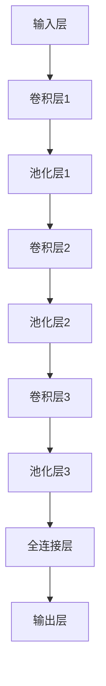
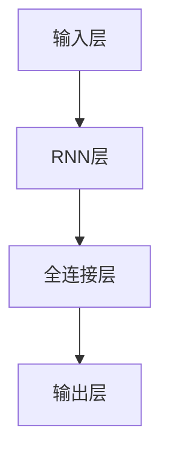

                 

### 《AI时代的程序员技能投资指南》

关键词：人工智能、程序员、技能提升、编程实践、深度学习、编程语言、软技能

摘要：随着人工智能技术的飞速发展，程序员面临着前所未有的机遇与挑战。本文旨在为程序员提供一份详细的技能投资指南，帮助他们在AI时代不断提升自己的竞争力。本文将涵盖AI基础与核心概念、机器学习与深度学习算法、AI编程实践、工程化与最佳实践、编程语言与框架选择、程序员软技能提升以及AI时代的职业发展展望等内容。

## 目录大纲

1. **AI基础与核心概念**
   1.1 AI发展简史
   1.2 人工智能的基本概念
   1.3 人工智能的分类
   1.4 人工智能的关键技术
   1.5 AI时代的机遇与挑战

2. **机器学习基础**
   2.1 机器学习概述
   2.2 监督学习算法
      2.2.1 线性回归
      2.2.2 决策树
      2.2.3 支持向量机
   2.3 无监督学习算法
      2.3.1 K-均值聚类
      2.3.2 主成分分析
      2.3.3 聚类分析
   2.4 深度学习入门
      2.4.1 神经网络基础
      2.4.2 深度学习框架简介

3. **深度学习核心算法**
   3.1 卷积神经网络（CNN）
      3.1.1 卷积层
      3.1.2 池化层
      3.1.3 fully connected layer
   3.2 循环神经网络（RNN）
      3.2.1 RNN基础
      3.2.2 LSTM
      3.2.3 GRU
   3.3 注意力机制
      3.3.1 什么是注意力机制
      3.3.2 注意力机制的应用

4. **强化学习基础**
   4.1 强化学习概述
   4.2 Q学习算法
   4.3 SARSA算法
   4.4 深度强化学习

5. **AI编程实践**
   5.1 AI编程环境搭建
   5.2 Python编程基础
   5.3 Jupyter Notebook使用

6. **AI项目实战**
   6.1 项目一：手写数字识别
      6.1.1 数据预处理
      6.1.2 网络架构设计
      6.1.3 代码实现与解读
   6.2 项目二：情感分析
      6.2.1 数据预处理
      6.2.2 网络架构设计
      6.2.3 代码实现与解读

7. **AI工程化与最佳实践**
   7.1 AI项目的生命周期
   7.2 数据管理与质量控制
   7.3 模型评估与优化
   7.4 MLOps实践

8. **AI时代的程序员技能提升**
   8.1 编程语言与框架
   8.2 TensorFlow与PyTorch对比
   8.3 其他深度学习框架介绍

9. **程序员软技能**
   9.1 编码习惯与代码规范
   9.2 团队协作与项目管理
   9.3 持续学习与职业发展

10. **未来展望**
    10.1 AI技术的未来趋势
    10.2 程序员在AI时代的职业发展
    10.3 AI时代的社会影响与伦理问题

## 引言

### AI时代的程序员技能投资指南

人工智能（AI）技术正在以惊人的速度改变我们的世界。从自动驾驶汽车到智能助手，从医疗诊断到金融预测，AI的应用场景无处不在。作为程序员，您是否感到自己的技能正在迅速过时？是否对自己的未来感到不确定？如果您的答案是“是”，那么您来对了地方。本文旨在为您提供一份详尽的AI时代程序员技能投资指南，帮助您把握AI时代的机遇，应对挑战。

在AI时代，程序员的角色和职责正在发生变化。不再是简单地编写代码、解决技术问题，程序员需要更多地参与到数据科学、机器学习和深度学习等领域的实践。他们需要理解AI技术的工作原理，掌握相关的编程技能，以及如何将AI技术应用到实际问题中。因此，对于程序员来说，投资于技能提升是至关重要的。

本文将分为三个主要部分：

1. **AI基础与核心概念**：这部分将介绍AI的基本概念、发展历史、分类以及关键技术。通过这部分的学习，您将建立起对AI技术的全局认识。

2. **AI编程实践**：这部分将深入探讨机器学习、深度学习和强化学习等核心算法，并通过实际项目实战帮助您掌握AI编程的实践技能。

3. **AI时代的程序员技能提升**：这部分将介绍编程语言与框架选择、程序员软技能以及AI时代的职业发展展望，帮助您全面提升自己的竞争力。

在接下来的内容中，我们将一步一步地深入探讨这些主题，希望您能从中获得宝贵的知识和经验。准备好开始这场AI时代的技能投资之旅了吗？让我们一探究竟。

### AI基础与核心概念

人工智能（AI）作为计算机科学的一个分支，致力于使计算机模拟人类的智能行为。AI技术的出现可以追溯到20世纪50年代，当时科学家们首次提出了人工智能的概念。从那时起，AI技术经历了多个发展阶段，包括早期的符号主义、基于规则的系统，到现在的数据驱动方法，如机器学习和深度学习。

#### 1.1 AI发展简史

AI的发展可以分为以下几个主要阶段：

1. **早期探索（1956-1974）**：
   - 1956年，达特茅斯会议上，John McCarthy提出了“人工智能”这一术语，标志着AI作为一个独立学科的诞生。
   - 在这个阶段，AI研究主要集中于知识表示和推理，试图通过符号逻辑和形式化语言来模拟人类的智能。

2. **第一次AI寒冬（1974-1980）**：
   - 由于符号主义方法的局限性，AI研究遭遇了第一次寒冬。许多项目未能实现预期的效果，导致资金减少，研究停滞。

3. **复兴与专家系统（1980-1987）**：
   - 1980年代初，专家系统成为AI研究的热点。专家系统能够模拟专家的决策过程，并在医疗诊断、地质勘探等领域取得了成功。

4. **第二次AI寒冬（1987-1993）**：
   - 专家系统的局限性以及计算能力的限制，使得AI再次遭遇寒冬。

5. **机器学习时代（1993-至今）**：
   - 1990年代，随着计算机硬件的发展和数据集的积累，机器学习方法逐渐成熟。深度学习、支持向量机、神经网络等算法相继被提出，AI技术进入了快速发展的阶段。

6. **AI应用广泛化（2010-至今）**：
   - 近年来，AI技术已经广泛应用于多个领域，包括图像识别、自然语言处理、自动驾驶等，对人类社会产生了深远的影响。

#### 1.2 人工智能的基本概念

要理解人工智能，我们需要了解以下几个基本概念：

1. **智能**：
   - 智能是指生物体识别模式、学习和适应环境的能力。人工智能试图模拟这种能力，使其在计算机系统中实现。

2. **机器学习**：
   - 机器学习是AI的核心技术之一，它通过算法从数据中学习规律，进而对未知数据进行预测或分类。机器学习可以分为监督学习、无监督学习和强化学习。

3. **深度学习**：
   - 深度学习是机器学习的一个分支，通过多层神经网络进行数据建模。深度学习在图像识别、语音识别等领域取得了显著成果。

4. **神经网络**：
   - 神经网络是模仿人脑神经元结构和功能的计算模型，用于处理和传递信息。深度学习就是基于神经网络的多层结构。

5. **自然语言处理（NLP）**：
   - 自然语言处理是AI的重要应用领域，旨在使计算机理解和生成自然语言。NLP在翻译、情感分析、聊天机器人等方面有广泛应用。

6. **计算机视觉**：
   - 计算机视觉是AI的另一个重要应用领域，涉及图像和视频的分析。计算机视觉在人脸识别、自动驾驶、医疗诊断等方面有着重要应用。

#### 1.3 人工智能的分类

人工智能可以根据不同的分类标准进行分类，以下是几种常见的分类方法：

1. **按能力分类**：
   - **弱AI**（Weak AI）：
     - 弱AI是指在特定领域内具有智能的计算机系统，但无法进行跨领域的通用推理。
   - **强AI**（Strong AI）：
     - 强AI是指具有人类水平的通用智能，能够理解、学习和适应任何环境和任务。

2. **按实现方法分类**：
   - **符号主义AI**：
     - 符号主义AI通过形式逻辑和知识表示来模拟智能。
   - **统计模型AI**：
     - 统计模型AI通过数据建模和统计分析来实现智能。
   - **基于模型AI**：
     - 基于模型AI通过构建具体的数学模型（如神经网络）来实现智能。

3. **按应用领域分类**：
   - **通用AI**：
     - 通用AI是指能够处理多种不同类型任务的智能系统。
   - **专用AI**：
     - 专用AI是指为特定任务或领域设计的智能系统，如自动驾驶、智能家居等。

#### 1.4 人工智能的关键技术

人工智能的发展离不开以下关键技术：

1. **数据**：
   - 数据是AI发展的基石。AI算法需要大量的数据来训练模型，数据的质量和数量直接影响模型的性能。

2. **算法**：
   - 算法是AI的核心，包括机器学习算法、深度学习算法、强化学习算法等。不同算法适用于不同的任务和数据类型。

3. **计算能力**：
   - 计算能力是AI发展的驱动力。随着计算能力的提升，复杂的AI模型可以在更短的时间内训练和优化。

4. **硬件**：
   - 硬件是AI实现的物理基础。GPU和TPU等专用硬件加速了AI模型的训练和推理过程。

5. **软件**：
   - 软件是AI实现的软件工具和框架，如TensorFlow、PyTorch等。这些框架提供了高效的模型训练和推理工具。

#### 1.5 AI时代的机遇与挑战

AI时代为程序员带来了前所未有的机遇，同时也伴随着挑战：

1. **机遇**：
   - **就业机会增加**：AI技术的发展带来了大量的新职位，如数据科学家、机器学习工程师等。
   - **技术创新**：AI技术的应用推动了新技术的诞生，如自动驾驶、智能医疗等。
   - **产业升级**：AI技术促进了传统产业的升级和转型，如智能制造、智能物流等。

2. **挑战**：
   - **技能需求变化**：程序员需要不断学习新的AI技术，保持自己的竞争力。
   - **数据安全与隐私**：AI技术的应用涉及到大量的数据，如何保障数据的安全与隐私成为重要问题。
   - **伦理问题**：AI技术的广泛应用引发了伦理问题，如算法偏见、隐私侵犯等。

在接下来的章节中，我们将深入探讨机器学习、深度学习和强化学习等核心算法，帮助您更好地理解AI技术的工作原理和应用实践。

### 机器学习基础

机器学习是人工智能的核心技术之一，它使得计算机系统能够从数据中学习，从而实现预测、分类和决策等功能。机器学习可以分为监督学习、无监督学习和强化学习。在本章中，我们将首先介绍机器学习的基本概念，然后深入探讨监督学习和无监督学习算法，最后简要介绍深度学习。

#### 2.1 机器学习概述

机器学习（Machine Learning，ML）是一门利用算法从数据中学习规律并作出预测或决策的技术。它的基本流程包括数据收集、数据预处理、模型训练和模型评估。

1. **数据收集**：
   - 数据是机器学习的基石。数据可以从各种来源收集，如数据库、传感器、互联网等。数据的质量和数量直接影响模型的性能。

2. **数据预处理**：
   - 数据预处理是机器学习过程中的重要步骤，包括数据清洗、归一化、缺失值处理等。预处理步骤确保了数据的整洁和一致性，为模型训练奠定了基础。

3. **模型训练**：
   - 模型训练是机器学习的核心步骤，通过算法从数据中学习规律。训练过程中，模型参数被不断调整，以最小化预测误差。

4. **模型评估**：
   - 模型评估用于评估模型性能，常用的评估指标包括准确率、召回率、F1分数等。评估结果用于调整模型或选择更合适的算法。

#### 2.2 监督学习算法

监督学习（Supervised Learning）是一种机器学习方法，其中模型从标记数据中学习，标记数据包含输入和对应的输出标签。监督学习算法可分为回归和分类两种类型。

1. **回归**：
   - 回归任务旨在预测连续值输出。最常见的回归算法包括线性回归和决策树回归。

   - **线性回归**（Linear Regression）：
     - 线性回归是一种简单的回归算法，它假设输出值与输入值之间存在线性关系。线性回归模型可以表示为：
       $$y = \beta_0 + \beta_1 \cdot x_1 + \beta_2 \cdot x_2 + ... + \beta_n \cdot x_n$$
       其中，$y$ 是输出值，$x_1, x_2, ..., x_n$ 是输入值，$\beta_0, \beta_1, ..., \beta_n$ 是模型参数。线性回归的目标是找到最佳参数值，使得预测值与实际值之间的误差最小。

   - **决策树回归**（Decision Tree Regression）：
     - 决策树回归通过构建一棵树形结构来预测输出值。每个内部节点代表一个特征，每个叶节点代表一个预测值。决策树的构建过程是基于特征的重要性和数据的划分。决策树回归的优点是直观、易于理解和解释。

2. **分类**：
   - 分类任务旨在将输入数据分为不同的类别。常见的分类算法包括决策树分类、支持向量机和神经网络。

   - **决策树分类**（Decision Tree Classification）：
     - 决策树分类与回归类似，但输出值为类别标签。决策树分类的构建过程基于特征的重要性和数据的划分。与回归树不同，分类树在每个内部节点使用特征测试来确定下一个分支。

   - **支持向量机**（Support Vector Machine，SVM）：
     - 支持向量机是一种基于最大化边界距离的线性分类算法。SVM通过找到一个超平面，将不同类别的数据点尽可能分开。对于非线性问题，可以使用核函数将数据映射到高维空间，然后在高维空间中进行线性分类。

   - **神经网络**（Neural Network）：
     - 神经网络是一种基于模拟生物神经元的计算模型。它由多个神经元（或节点）组成，每个节点通过权重连接到其他节点。神经网络通过学习输入和输出之间的映射关系来预测类别。

#### 2.3 无监督学习算法

无监督学习（Unsupervised Learning）是一种机器学习方法，其中模型从未标记数据中学习。无监督学习的目标是发现数据中的结构、模式和关联。

1. **聚类**：
   - 聚类任务旨在将数据点分组，使得同一组内的数据点彼此相似，而不同组的数据点之间差异较大。常见的聚类算法包括K-均值聚类、层次聚类和DBSCAN。

   - **K-均值聚类**（K-Means Clustering）：
     - K-均值聚类是一种基于距离的聚类算法。它通过迭代计算来确定K个聚类中心，并将每个数据点分配到最近的聚类中心。

   - **层次聚类**（Hierarchical Clustering）：
     - 层次聚类是一种自底向上的聚类算法。它通过逐步合并相似的簇，构建一个聚类层次树。

   - **DBSCAN**（Density-Based Spatial Clustering of Applications with Noise）：
     - DBSCAN是一种基于密度的聚类算法。它通过计算数据点的邻域密度来识别簇和噪声点。

2. **降维**：
   - 降维任务旨在将高维数据映射到低维空间，同时保留数据的关键信息。常见的降维算法包括主成分分析（PCA）和线性判别分析（LDA）。

   - **主成分分析**（Principal Component Analysis，PCA）：
     - 主成分分析是一种基于方差最大化的降维算法。它通过找到数据的主要变化方向（即主成分）来简化数据。

   - **线性判别分析**（Linear Discriminant Analysis，LDA）：
     - 线性判别分析是一种基于类别间差异最大化和类别内差异最小化的降维算法。它通过找到一个线性变换来最小化类别之间的混淆。

#### 2.4 深度学习入门

深度学习（Deep Learning，DL）是一种基于多层神经网络的学习方法。它通过堆叠多个隐藏层来提取数据的高层次特征，从而实现复杂的任务。

1. **神经网络基础**：
   - 神经网络是一种模拟生物神经元的计算模型。它由多个神经元（或节点）组成，每个神经元通过权重连接到其他神经元。神经元的激活函数用于确定神经元的输出。

2. **深度学习框架简介**：
   - 深度学习框架是用于构建和训练深度学习模型的工具。常见的深度学习框架包括TensorFlow、PyTorch和Keras。这些框架提供了丰富的API和预训练模型，方便开发者快速实现深度学习任务。

在本章中，我们简要介绍了机器学习的基础概念、监督学习算法和无监督学习算法，以及深度学习入门。接下来，我们将深入探讨深度学习的核心算法，包括卷积神经网络（CNN）、循环神经网络（RNN）和注意力机制。

### 深度学习核心算法

深度学习作为机器学习的子领域，通过多层神经网络的结构来实现复杂的任务。本章将深入探讨深度学习中的核心算法，包括卷积神经网络（CNN）、循环神经网络（RNN）、以及注意力机制。这些算法在图像识别、序列数据处理和自然语言处理等领域具有广泛的应用。

#### 3.1 卷积神经网络（CNN）

卷积神经网络（Convolutional Neural Network，CNN）是一种特别适用于处理图像数据的深度学习模型。其核心思想是通过卷积层、池化层和全连接层等结构来提取图像特征，并进行分类或回归任务。

1. **卷积层**：
   - 卷积层是CNN中最基本的层之一。它通过卷积操作将输入图像与一组滤波器（或卷积核）进行卷积，生成特征图（或特征图）。卷积操作的数学表示如下：
     $$\text{特征图} = \text{输入图像} \circledast \text{卷积核}$$
     其中，$\circledast$ 表示卷积运算。卷积核是一个权重矩阵，通过在图像上滑动来计算每个特征图的值。

   - **滤波器选择**：
     - 滤波器（或卷积核）的选择对特征提取至关重要。滤波器可以设计成不同的形状（如方形、圆形）和大小（如3x3、5x5）。较大的滤波器可以捕获更多的图像信息，但计算量也更大。

   - **步长和填充**：
     - 步长（stride）是指滤波器在图像上滑动的步长。较大的步长会导致特征图的尺寸缩小，而较小的步长则会导致特征图的尺寸增大。
     - 填充（padding）是在输入图像周围添加零来保持特征图的尺寸。填充可以是“有效填充”（valid）或“相同填充”（same）。

2. **池化层**：
   - 池化层用于减小特征图的尺寸，同时保留重要的特征信息。常见的池化操作包括最大池化（max pooling）和平均池化（avg pooling）。

   - **最大池化**：
     - 最大池化在每个池化窗口内选择最大的值作为输出，从而保留最突出的特征。

   - **平均池化**：
     - 平均池化在每个池化窗口内计算所有值的平均值作为输出，从而平均化特征。

   - **池化层的作用**：
     - 减小特征图的尺寸，减少计算量。
     - 增强模型的泛化能力，通过保留具有代表性的特征。

3. **全连接层**：
   - 全连接层（fully connected layer）将卷积层和池化层提取的特征映射到类别标签。全连接层中的每个神经元都与前一层的所有神经元相连接。

   - **激活函数**：
     - 激活函数用于引入非线性，使神经网络能够学习更复杂的函数。常见的激活函数包括ReLU（Rectified Linear Unit）、Sigmoid和Tanh。

   - **损失函数**：
     - 损失函数用于衡量预测值与实际值之间的差距。常见的损失函数包括交叉熵（cross-entropy）和均方误差（mean squared error）。

4. **CNN的架构**：
   - CNN的架构通常包括多个卷积层、池化层和全连接层。每个卷积层之后可以跟随一个或多个池化层，全连接层通常在最后一个卷积层之后。

   - **卷积神经网络的Mermaid流程图**：
     ```mermaid
     graph TD
     A[输入图像] --> B[卷积层1]
     B --> C[池化层1]
     C --> D[卷积层2]
     D --> E[池化层2]
     E --> F[卷积层3]
     F --> G[池化层3]
     G --> H[全连接层1]
     H --> I[全连接层2]
     I --> J[输出]
     ```

   - **CNN的应用**：
     - 图像分类：如ImageNet挑战赛。
     - 目标检测：如YOLO、SSD。
     - 图像生成：如生成对抗网络（GAN）。

#### 3.2 循环神经网络（RNN）

循环神经网络（Recurrent Neural Network，RNN）是一种特别适用于处理序列数据的深度学习模型。RNN通过在网络中引入循环结构，使得模型能够利用历史信息来预测未来的值。

1. **RNN的基础**：
   - RNN的基本单元是隐藏层，每个时间步的隐藏状态都依赖于前一个时间步的隐藏状态。RNN的数学表示如下：
     $$h_t = \text{激活函数}(W_h \cdot [h_{t-1}, x_t] + b_h)$$
     $$y_t = W_y \cdot h_t + b_y$$
     其中，$h_t$ 是第$t$个时间步的隐藏状态，$x_t$ 是输入，$W_h$ 和$W_y$ 是权重矩阵，$b_h$ 和$b_y$ 是偏置项。

   - **RNN的挑战**：
     - 长期依赖问题：RNN在处理长序列时容易出现梯度消失或梯度爆炸的问题，导致难以学习长期依赖关系。
     - 状态存储：RNN需要存储并传递长期依赖关系，这增加了计算和存储的复杂性。

2. **LSTM和GRU**：
   - 为了解决RNN的挑战，引入了长短期记忆网络（Long Short-Term Memory，LSTM）和门控循环单元（Gated Recurrent Unit，GRU）。

   - **LSTM**：
     - LSTM通过引入三个门（输入门、遗忘门和输出门）来控制信息的流入、流出和输出。LSTM的数学表示如下：
       $$i_t = \text{激活函数}(W_i \cdot [h_{t-1}, x_t] + b_i)$$
       $$f_t = \text{激活函数}(W_f \cdot [h_{t-1}, x_t] + b_f)$$
       $$g_t = \text{激活函数}(W_g \cdot [h_{t-1}, x_t] + b_g)$$
       $$o_t = \text{激活函数}(W_o \cdot [h_{t-1}, x_t] + b_o)$$
       $$h_t = o_t \cdot \text{激活函数}(W_h \cdot [h_{t-1}, g_t] + b_h)$$

   - **GRU**：
     - GRU是一种简化版的LSTM，通过引入重置门和更新门来控制信息流动。GRU的数学表示如下：
       $$z_t = \text{激活函数}(W_z \cdot [h_{t-1}, x_t] + b_z)$$
       $$r_t = \text{激活函数}(W_r \cdot [h_{t-1}, x_t] + b_r)$$
       $$h_{\hat{t}} = \text{激活函数}(W_h \cdot [r_t \cdot h_{t-1}, x_t] + b_h)$$
       $$h_t = (1 - z_t) \cdot h_{t-1} + z_t \cdot h_{\hat{t}}$$

   - **LSTM和GRU的优势**：
     - LSTM和GRU能够学习长期依赖关系，适用于处理长序列数据。
     - 与RNN相比，LSTM和GRU的计算和存储复杂度较低。

   - **RNN的应用**：
     - 语音识别：如CTC（Connectionist Temporal Classification）。
     - 自然语言处理：如序列标注、机器翻译。
     - 时序预测：如时间序列分析、股票价格预测。

#### 3.3 注意力机制

注意力机制（Attention Mechanism）是一种在深度学习模型中用于提高信息传递效率的方法。注意力机制通过动态调整不同部分的重要性，使得模型能够关注关键信息，从而提高模型的性能。

1. **注意力机制的基本概念**：
   - 注意力机制通过一个权重向量来调整输入特征的贡献度。每个输入特征都会有一个对应的权重，权重值越高，该特征对输出的影响越大。

2. **多头注意力机制**：
   - 多头注意力机制（Multi-Head Attention）是注意力机制的一种扩展。它通过多个独立的注意力头来捕捉不同类型的特征，从而提高模型的表示能力。

   - **多头注意力的计算**：
     $$\text{Attention}(\text{Q}, \text{K}, \text{V}) = \text{softmax}(\text{QK}^T / \sqrt{d_k}) \text{V}$$
     其中，$Q$、$K$和$V$分别是查询向量、键向量和值向量，$d_k$是键向量的维度。

3. **Transformer模型**：
   - Transformer模型是一种基于多头注意力机制的序列到序列模型。它由多个编码器和解码器层组成，编码器负责提取输入序列的特征，解码器负责生成输出序列。

   - **编码器**：
     - 编码器通过多个自注意力层和前馈网络来提取输入序列的特征。

   - **解码器**：
     - 解码器通过多个自注意力层、交叉注意力层和前馈网络来生成输出序列。

   - **Transformer的应用**：
     - 自然语言处理：如机器翻译、文本生成。
     - 语音识别：如自动语音识别。
     - 图像生成：如生成对抗网络（GAN）。

在本章中，我们介绍了卷积神经网络（CNN）、循环神经网络（RNN）和注意力机制等深度学习核心算法。这些算法在图像识别、序列数据处理和自然语言处理等领域具有广泛的应用。在下一章中，我们将继续探讨强化学习的基础理论，帮助您更好地理解AI技术的各个方面。

### 强化学习基础

强化学习（Reinforcement Learning，RL）是一种机器学习方法，旨在通过学习策略来最大化长期奖励。与监督学习和无监督学习不同，强化学习通过与环境的交互来学习，其核心是决策过程和奖励机制。强化学习广泛应用于自动驾驶、游戏AI、机器人控制等领域。本章将介绍强化学习的基本概念、主要算法以及深度强化学习。

#### 4.1 强化学习概述

强化学习可以分为以下几部分：

1. **代理（Agent）**：
   - 代理是指执行动作并从环境中接收反馈的智能体。代理的目标是学习一个策略，使得长期奖励最大化。

2. **环境（Environment）**：
   - 环境是指代理所处的动态系统，它可以对代理的动作做出响应，并提供状态和奖励。

3. **状态（State）**：
   - 状态是代理在环境中的当前情况，通常用一组特征向量表示。

4. **动作（Action）**：
   - 动作是代理可执行的行为，每个动作对应于环境中的一个特定行为。

5. **奖励（Reward）**：
   - 奖励是代理在每个时间步从环境中接收的即时奖励，它反映了代理的动作对环境状态的影响。

6. **策略（Policy）**：
   - 策略是代理的动作选择规则，用于指导代理如何行动。策略通常表示为概率分布，表示在特定状态下执行特定动作的概率。

#### 4.2 Q学习算法

Q学习（Q-Learning）是强化学习中最基本的算法之一，它通过学习值函数（Q函数）来选择最佳动作。值函数表示在给定状态下执行特定动作的预期奖励。

1. **Q学习的基本原理**：
   - Q学习的目标是学习一个Q值函数，$Q(s, a)$ 表示在状态$s$下执行动作$a$的预期奖励。Q学习使用一个**Q表**来存储这些值。
   - Q学习的基本更新规则如下：
     $$Q(s, a) \leftarrow Q(s, a) + \alpha [r + \gamma \max_{a'} Q(s', a') - Q(s, a)]$$
     其中，$\alpha$ 是学习率，$r$ 是即时奖励，$\gamma$ 是折扣因子，$s'$ 是状态转移后的状态。

2. **Q学习的实现**：
   - **初始化**：初始化Q表中的所有值。
   - **动作选择**：使用**ε-贪心策略**选择动作，其中ε是一个小概率参数，表示随机选择动作的概率。
   - **状态更新**：根据选择的动作执行，并更新Q值。
   - **重复**：重复上述步骤，直到达到某个停止条件（如达到特定奖励、达到最大时间步等）。

3. **Q学习的优势**：
   - Q学习简单且易于实现。
   - Q学习可以处理离散状态和动作空间。
   - Q学习不需要明确的模型，只需通过经验来学习。

#### 4.3 SARSA算法

SARSA（State-Action-Reward-State-Action，SARSA）算法是另一种强化学习算法，它使用当前状态和动作来更新Q值。

1. **SARSA的基本原理**：
   - SARSA的目标是学习一个策略，使得在给定状态下执行特定动作的Q值最大化。
   - SARSA的基本更新规则如下：
     $$Q(s, a) \leftarrow Q(s, a) + \alpha [r + \gamma Q(s', a')] - Q(s, a)]$$
     其中，$s$ 是当前状态，$a$ 是当前动作，$s'$ 是状态转移后的状态，$a'$ 是在状态$s'$下执行的动作。

2. **SARSA的实现**：
   - **初始化**：与Q学习相同，初始化Q表中的所有值。
   - **动作选择**：使用ε-贪心策略选择动作。
   - **状态更新**：执行选择的动作，并更新Q值。
   - **重复**：重复上述步骤，直到达到某个停止条件。

3. **SARSA的优势**：
   - SARSA不需要单独的探索策略，它通过每次更新都考虑当前状态和动作来平衡探索和利用。
   - SARSA可以处理连续状态和动作空间。

#### 4.4 深度强化学习

深度强化学习（Deep Reinforcement Learning，DRL）是强化学习与深度学习结合的产物，它使用深度神经网络来近似Q值函数或策略。深度强化学习在解决复杂任务方面具有显著优势。

1. **深度Q网络（DQN）**：
   - DQN使用深度神经网络来近似Q值函数，其核心思想是使用经验回放和目标网络来减少偏差和方差。
   - DQN的基本更新规则如下：
     $$Q(s, a) \leftarrow Q(s, a) + \alpha [r + \gamma \max_{a'} Q(s', a') - Q(s, a)]$$
   - **经验回放**：通过将过去的经验存储在经验回放池中，减少样本的相关性，提高学习效果。
   - **目标网络**：使用目标网络来减少训练过程中的方差。目标网络是一个固定不变的Q网络，用于生成目标Q值。

2. **策略梯度方法**：
   - 策略梯度方法通过直接优化策略来更新模型参数。常见的策略梯度方法包括REINFORCE、PPO（Proximal Policy Optimization）等。
   - **REINFORCE**：REINFORCE方法使用梯度上升法来更新策略参数，其梯度更新规则如下：
     $$\nabla_{\theta} \log \pi_{\theta}(a|s) \propto r$$
     其中，$\theta$ 是策略参数，$\pi_{\theta}(a|s)$ 是策略概率分布，$r$ 是累计奖励。

3. **深度强化学习应用**：
   - **自动驾驶**：使用深度强化学习来训练自动驾驶车辆在复杂环境中做出决策。
   - **游戏AI**：如AlphaGo使用深度强化学习击败人类围棋冠军。
   - **机器人控制**：使用深度强化学习来训练机器人执行复杂的任务，如行走、抓取等。

在本章中，我们介绍了强化学习的基本概念、Q学习、SARSA算法以及深度强化学习。这些算法为解决复杂的决策问题提供了强大的工具。在下一章中，我们将探讨AI编程实践，通过实际项目帮助您掌握这些算法的应用。

### AI编程实践

在了解了AI的基础理论和核心算法后，实际编程实践是验证和巩固这些知识的最佳方式。在本章中，我们将通过两个AI项目：手写数字识别和情感分析，详细介绍AI编程的各个环节，包括开发环境搭建、数据预处理、模型设计、代码实现以及解读和分析。

#### 5.1 AI编程环境搭建

在进行AI项目之前，我们需要搭建一个合适的编程环境。以下是一个基本的步骤指南：

1. **安装Python**：
   - Python是进行AI编程的主要语言，首先需要在您的计算机上安装Python。您可以从[Python官网](https://www.python.org/)下载并安装最新版本的Python。

2. **安装Anaconda**：
   - Anaconda是一个流行的Python发行版，提供了大量的科学计算和数据分析库。下载并安装Anaconda后，可以通过`conda`命令轻松安装和管理依赖库。

3. **安装Jupyter Notebook**：
   - Jupyter Notebook是一个交互式的Web应用，用于编写和运行Python代码。安装Anaconda后，可以直接使用`conda install jupyter`命令安装Jupyter Notebook。

4. **安装深度学习框架**：
   - 常见的深度学习框架包括TensorFlow和PyTorch。您可以使用以下命令安装：
     ```bash
     conda install tensorflow
     conda install pytorch torchvision torchaudio -c pytorch
     ```

5. **安装其他依赖库**：
   - 根据您的项目需求，可能还需要安装其他库，如NumPy、Pandas、Matplotlib等。您可以使用`pip`或`conda`命令进行安装。

#### 5.2 Python编程基础

在开始项目之前，确保您具备以下Python编程基础：

1. **变量和数据类型**：
   - 了解Python中的变量和基本数据类型，如整数、浮点数、字符串等。

2. **控制流**：
   - 掌握条件语句（if-else）、循环语句（for、while）等控制流结构。

3. **函数和模块**：
   - 理解函数的定义和使用，以及如何导入和使用模块。

4. **数据结构和算法**：
   - 掌握常用的数据结构（如列表、字典、集合）和算法（如排序、搜索）。

5. **异常处理**：
   - 了解如何处理异常和错误，确保程序的健壮性。

#### 5.3 Jupyter Notebook使用

Jupyter Notebook是一个强大的工具，可以帮助您高效地进行数据探索和实验。以下是一些基础操作：

1. **启动Jupyter Notebook**：
   - 在终端中运行`jupyter notebook`命令，启动Jupyter Notebook。

2. **创建和运行代码**：
   - 在浏览器中打开Jupyter Notebook，创建一个新的笔记本。您可以在笔记本中编写Python代码，并使用`Shift + Enter`快捷键运行代码。

3. **插入Markdown**：
   - Jupyter Notebook支持Markdown格式，您可以在笔记本中插入标题、段落、列表等Markdown内容。

4. **导入库和模块**：
   - 在代码单元格中，使用`import`语句导入所需的库和模块。

5. **显示数据**：
   - 使用`print`函数或`display`函数在笔记本中显示数据，如表格、图表等。

#### 5.4 项目一：手写数字识别

手写数字识别是深度学习的一个经典任务，通常使用MNIST数据集进行训练。以下是手写数字识别项目的详细步骤：

1. **数据集介绍**：
   - MNIST数据集包含70,000个训练图像和10,000个测试图像，每个图像是一个28x28像素的手写数字。

2. **数据预处理**：
   - 首先，我们需要加载数据集并对其进行预处理，包括归一化和数据增强。
   - **归一化**：将图像像素值从0-255归一化到0-1。
   - **数据增强**：通过旋转、缩放、裁剪等操作增加数据多样性。

3. **模型设计**：
   - 我们将设计一个简单的卷积神经网络（CNN）来进行手写数字识别。
   - **模型结构**：
     ```mermaid
     graph TD
     A[输入层] --> B[卷积层1]
     B --> C[池化层1]
     C --> D[卷积层2]
     D --> E[池化层2]
     E --> F[全连接层1]
     F --> G[全连接层2]
     G --> H[输出层]
     ```

4. **代码实现**：
   - 在Jupyter Notebook中，使用TensorFlow或PyTorch框架实现模型。
   - **TensorFlow代码示例**：
     ```python
     import tensorflow as tf
     from tensorflow.keras import layers

     model = tf.keras.Sequential([
         layers.Conv2D(32, (3, 3), activation='relu', input_shape=(28, 28, 1)),
         layers.MaxPooling2D((2, 2)),
         layers.Conv2D(64, (3, 3), activation='relu'),
         layers.MaxPooling2D((2, 2)),
         layers.Flatten(),
         layers.Dense(128, activation='relu'),
         layers.Dense(10, activation='softmax')
     ])

     model.compile(optimizer='adam',
                   loss='sparse_categorical_crossentropy',
                   metrics=['accuracy'])
     ```

5. **训练与评估**：
   - 使用训练数据训练模型，并使用测试数据评估模型性能。
   - **训练代码示例**：
     ```python
     model.fit(x_train, y_train, epochs=5)
     test_loss, test_acc = model.evaluate(x_test, y_test)
     print(f"Test accuracy: {test_acc}")
     ```

6. **代码解读与分析**：
   - 分析模型的架构、损失函数、优化器以及训练过程中的参数调整。
   - 通过调整模型结构、超参数和训练策略来优化模型性能。

#### 5.5 项目二：情感分析

情感分析是自然语言处理（NLP）的一个热门应用，用于判断文本的情感倾向。以下是情感分析项目的详细步骤：

1. **数据集介绍**：
   - 我们将使用IMDb电影评论数据集，它包含50,000个训练评论和25,000个测试评论。

2. **数据预处理**：
   - 对文本进行清洗和预处理，包括去除停用词、标点符号、词干还原等。
   - **文本向量表示**：使用词袋模型（Bag of Words）或词嵌入（Word Embeddings）将文本转换为向量。

3. **模型设计**：
   - 设计一个简单的循环神经网络（RNN）或Transformer模型来进行情感分析。
   - **模型结构**：
     ```mermaid
     graph TD
     A[输入层] --> B[RNN或Transformer层]
     B --> C[全连接层1]
     C --> D[全连接层2]
     D --> E[输出层]
     ```

4. **代码实现**：
   - 在Jupyter Notebook中，使用PyTorch或TensorFlow框架实现模型。
   - **PyTorch代码示例**：
     ```python
     import torch
     import torch.nn as nn
     import torch.optim as optim

     class SentimentClassifier(nn.Module):
         def __init__(self, embedding_dim, hidden_dim, output_dim, n_layers, dropout):
             super().__init__()
             self.embedding = nn.Embedding(vocab_size, embedding_dim)
             self.rnn = nn.LSTM(embedding_dim, hidden_dim, num_layers=n_layers, dropout=dropout)
             self.fc = nn.Linear(hidden_dim, output_dim)
             self.dropout = nn.Dropout(dropout)
         
         def forward(self, text):
             embedded = self.dropout(self.embedding(text))
             output, (hidden, _) = self.rnn(embedded)
             hidden = self.dropout(hidden[-1, :, :])
             return self.fc(hidden)

     model = SentimentClassifier(embedding_dim=100, hidden_dim=128, output_dim=1, n_layers=2, dropout=0.5)
     optimizer = optim.Adam(model.parameters(), lr=0.001)
     criterion = nn.BCEWithLogitsLoss()
     ```

5. **训练与评估**：
   - 使用训练数据训练模型，并使用测试数据评估模型性能。
   - **训练代码示例**：
     ```python
     for epoch in range(num_epochs):
         running_loss = 0.0
         for inputs, labels in data_loader:
             optimizer.zero_grad()
             outputs = model(inputs)
             loss = criterion(outputs, labels)
             loss.backward()
             optimizer.step()
             running_loss += loss.item()
         print(f"Epoch {epoch+1}, Loss: {running_loss/len(data_loader)}")
     test_loss, test_acc = evaluate(model, test_loader)
     print(f"Test accuracy: {test_acc}")
     ```

6. **代码解读与分析**：
   - 分析模型的架构、损失函数、优化器以及训练过程中的参数调整。
   - 通过调整模型结构、超参数和训练策略来优化模型性能。

通过以上两个项目的实践，您将能够更好地理解AI编程的各个环节，并掌握实际应用中的关键技能。在下一章中，我们将探讨AI工程化与最佳实践，帮助您将AI项目从实验阶段顺利推向生产环境。

### AI工程化与最佳实践

随着人工智能项目的规模和复杂度不断增加，如何确保项目的可维护性、可靠性和高效性成为关键挑战。AI工程化与最佳实践是确保AI项目成功实施的重要手段。本章将介绍AI项目的生命周期、数据管理与质量控制、模型评估与优化以及MLOps实践。

#### 7.1 AI项目的生命周期

AI项目通常经历以下几个阶段：

1. **项目启动**：
   - 项目启动阶段主要包括需求分析、项目规划、资源分配等。在此阶段，需要明确项目目标、预期成果和资源需求。

2. **数据采集**：
   - 数据是AI项目的核心，数据采集阶段涉及数据的收集、清洗和标注。数据的质量直接影响模型的性能，因此需要确保数据的质量和多样性。

3. **数据预处理**：
   - 数据预处理包括数据清洗、归一化、缺失值处理等。数据预处理是确保数据质量的关键步骤，可以提高模型的训练效率和性能。

4. **模型设计**：
   - 模型设计阶段是根据项目需求和数据特点，设计合适的模型结构。在这一阶段，需要选择合适的算法和架构，并定义模型的参数和超参数。

5. **模型训练**：
   - 模型训练是使用训练数据对模型进行训练，以优化模型的参数。训练过程中需要监控模型性能，调整超参数，避免过拟合。

6. **模型评估**：
   - 模型评估是使用测试数据对模型进行评估，以确定模型的性能和泛化能力。常用的评估指标包括准确率、召回率、F1分数等。

7. **模型部署**：
   - 模型部署是将训练好的模型部署到生产环境中，使其能够对实际数据进行预测和决策。部署过程中需要确保模型的可靠性和稳定性。

8. **模型监控与维护**：
   - 模型监控与维护是持续监控模型的性能和运行状态，及时发现和解决潜在问题。此外，随着数据的不断更新，模型可能需要定期重新训练和优化。

#### 7.2 数据管理与质量控制

数据管理与质量控制是确保AI项目成功的关键步骤。以下是几个关键点：

1. **数据收集**：
   - 数据收集应遵循相关法律法规，确保数据的合法性和隐私性。
   - 数据来源应多样化，以确保数据的代表性和可靠性。

2. **数据清洗**：
   - 数据清洗包括去除重复数据、填补缺失值、去除噪声等。清洗后的数据应满足一致性、完整性和准确性的要求。

3. **数据标注**：
   - 对于监督学习任务，数据标注是关键步骤。标注过程应确保标注的一致性和准确性。

4. **数据存储**：
   - 数据存储应采用分布式存储方案，以确保数据的可靠性和可扩展性。常用的存储方案包括HDFS、NoSQL数据库等。

5. **数据质量控制**：
   - 数据质量控制包括数据质量检查、异常值检测和误差分析等。通过质量控制，可以及时发现和纠正数据中的问题。

6. **数据安全**：
   - 数据安全是确保数据不被未授权访问、篡改和泄露的关键。应采用加密、访问控制和安全审计等手段来保障数据安全。

#### 7.3 模型评估与优化

模型评估与优化是确保模型性能的关键环节。以下是几个关键点：

1. **评估指标**：
   - 评估指标应根据任务类型和需求选择。常见的评估指标包括准确率、召回率、F1分数、均方误差等。

2. **交叉验证**：
   - 交叉验证是一种常用的评估方法，通过将数据集划分为训练集和验证集，多次训练和评估模型，以评估模型的泛化能力。

3. **超参数调整**：
   - 超参数调整是优化模型性能的重要手段。通过网格搜索、随机搜索等策略，可以找到最佳的超参数组合。

4. **模型压缩**：
   - 模型压缩是一种减少模型参数和计算量的技术，可以提高模型在资源受限环境中的运行效率。

5. **模型解释性**：
   - 模型解释性是确保模型透明性和可解释性的关键。通过模型解释性，可以理解模型的工作原理和决策过程。

6. **持续优化**：
   - 模型优化是一个持续的过程。随着新数据的不断出现，模型可能需要重新训练和优化，以保持其性能。

#### 7.4 MLOps实践

MLOps是一种结合机器学习和软件工程的方法，旨在确保AI模型从开发到部署的整个生命周期中保持高质量和高效率。以下是MLOps的几个关键实践：

1. **持续集成与持续部署（CI/CD）**：
   - CI/CD是确保模型快速迭代和高效交付的关键实践。通过自动化测试和部署流程，可以减少人工干预，提高开发效率。

2. **版本控制**：
   - 版本控制是管理模型版本和变化的关键手段。通过使用版本控制系统（如Git），可以追溯模型的修改历史和依赖关系。

3. **容器化与虚拟化**：
   - 容器化和虚拟化可以提高模型的部署和运行效率。通过使用Docker和Kubernetes等工具，可以实现模型的自动化部署和管理。

4. **监控与告警**：
   - 模型监控是确保模型稳定运行的关键。通过设置监控指标和告警机制，可以及时发现和解决模型问题。

5. **自动化运维**：
   - 自动化运维可以提高模型的运维效率。通过使用自动化脚本和工具，可以简化模型的部署、监控和更新过程。

6. **文档与知识管理**：
   - 文档与知识管理是确保团队协作和知识共享的关键。通过建立良好的文档和知识管理体系，可以确保项目文档的完整性和准确性。

通过遵循AI工程化与最佳实践，可以确保AI项目的高质量和高效率。在下一章中，我们将探讨AI时代的程序员技能提升，帮助您不断提升自己的竞争力。

### AI时代的程序员技能提升

随着人工智能技术的飞速发展，程序员面临前所未有的机遇和挑战。在这一章中，我们将探讨AI时代的程序员需要掌握的核心技能，包括编程语言与框架的选择、程序员软技能的提升以及持续学习和职业发展。

#### 8.1 编程语言与框架

选择合适的编程语言和框架是AI时代程序员的基本技能。以下是一些常用的编程语言和框架，以及它们在AI领域的应用：

1. **Python**：
   - **优势**：Python以其简洁的语法和丰富的库资源，成为AI领域最受欢迎的编程语言之一。Python拥有大量的数据科学和机器学习库，如NumPy、Pandas、Scikit-learn等。
   - **应用**：Python广泛应用于数据预处理、机器学习模型训练、深度学习研究等领域。

2. **TensorFlow**：
   - **优势**：TensorFlow是谷歌开发的开源深度学习框架，具有强大的模型训练和推理能力。TensorFlow提供了丰富的API和预训练模型，方便开发者快速实现深度学习任务。
   - **应用**：TensorFlow广泛应用于图像识别、语音识别、自然语言处理等任务。

3. **PyTorch**：
   - **优势**：PyTorch是一种由Facebook开发的开源深度学习框架，以其动态计算图和易于调试的特点受到开发者喜爱。PyTorch的接口简洁，适合研究和原型开发。
   - **应用**：PyTorch在计算机视觉、自然语言处理和强化学习等领域有广泛应用。

4. **Keras**：
   - **优势**：Keras是一个高层次的深度学习API，可以在TensorFlow和Theano后端运行。Keras简化了模型构建和训练过程，适合快速原型开发和实验。
   - **应用**：Keras广泛应用于图像识别、文本分类和序列建模等任务。

5. **其他框架**：
   - **MXNet**、**Caffe**、**Theano**等也是常用的深度学习框架。每种框架都有其独特的优势和适用场景，开发者应根据项目需求选择合适的框架。

#### 8.2 TensorFlow与PyTorch对比

TensorFlow和PyTorch是当前最流行的深度学习框架，两者各有优劣，适用于不同的应用场景：

1. **动态计算图与静态计算图**：
   - **TensorFlow**使用静态计算图，计算图在模型构建时定义，并在训练和推理过程中执行。静态计算图的优势在于性能优化和并行计算，但调试较为困难。
   - **PyTorch**使用动态计算图，计算图在运行时动态构建。动态计算图的优势在于调试方便，适合快速原型开发和实验。

2. **API简洁性**：
   - **TensorFlow**的API相对复杂，需要开发者熟悉其详细的API文档。但TensorFlow提供了丰富的预训练模型和工具，方便开发者快速实现复杂任务。
   - **PyTorch**的API简洁直观，易于上手。PyTorch的动态计算图使其在调试和迭代过程中更加灵活，适合研究和新项目开发。

3. **性能与资源消耗**：
   - **TensorFlow**在性能和资源消耗方面表现出色，特别是通过分布式计算和优化器优化，可以大幅提升模型训练和推理的速度。
   - **PyTorch**虽然在性能上稍逊一筹，但其在资源消耗和内存管理方面较为优秀，适合在资源受限的环境中运行。

4. **社区支持**：
   - **TensorFlow**拥有庞大的社区和丰富的资源，包括官方文档、教程、开源项目和活跃的论坛。TensorFlow的广泛使用使其在招聘和市场上有较高的认可度。
   - **PyTorch**虽然社区支持稍逊，但在学术界和研究领域具有较高影响力。PyTorch的简洁性和灵活性使其成为许多研究项目的首选。

#### 8.3 其他深度学习框架介绍

除了TensorFlow和PyTorch，还有其他一些深度学习框架值得关注：

1. **MXNet**：
   - **优势**：MXNet是由Apache Software Foundation开发的深度学习框架，具有高度的可扩展性和灵活性。MXNet支持多种编程语言，包括Python、R和Scala。
   - **应用**：MXNet广泛应用于图像识别、自然语言处理和推荐系统等领域。

2. **Caffe**：
   - **优势**：Caffe是由加州大学伯克利分校开发的深度学习框架，以高效和易用著称。Caffe特别适合处理大规模图像数据集。
   - **应用**：Caffe广泛应用于计算机视觉任务，如图像分类和目标检测。

3. **Theano**：
   - **优势**：Theano是一个基于Python的深度学习框架，具有强大的数学表达能力和优化能力。Theano在编译时优化计算图，以提高模型训练效率。
   - **应用**：Theano在深度学习研究和实验中广泛使用，但在TensorFlow和PyTorch兴起后，其使用逐渐减少。

#### 8.4 程序员软技能

在AI时代，程序员不仅需要具备硬技能，还必须提升软技能，以适应快速变化的工作环境和团队合作需求。以下是几个关键的软技能：

1. **编码习惯与代码规范**：
   - **代码风格一致性**：遵循统一的代码风格规范，提高代码的可读性和可维护性。
   - **代码注释**：添加清晰的注释，帮助他人理解和维护代码。
   - **代码复用**：编写可复用的函数和模块，减少重复代码，提高开发效率。

2. **团队协作与项目管理**：
   - **沟通能力**：与团队成员有效沟通，确保任务理解一致，减少误解和冲突。
   - **项目管理**：掌握项目管理工具和方法，如Scrum、Kanban等，确保项目按时交付。
   - **团队协作**：参与团队活动，支持团队成员，营造积极的工作氛围。

3. **持续学习与职业发展**：
   - **技术更新**：关注AI领域的最新技术和发展趋势，不断学习和掌握新技能。
   - **职业规划**：制定个人职业发展规划，明确短期和长期目标，不断提升自己的竞争力。
   - **专业认证**：参加专业认证考试，获得权威认证，提高自己的市场认可度。

通过不断提升编程语言与框架技能、软技能以及持续学习和职业规划，程序员可以在AI时代保持竞争力，并在职业生涯中取得成功。

### 未来展望

随着人工智能技术的不断进步，AI对社会的各个方面都将产生深远的影响。在这个章节中，我们将探讨AI技术的未来趋势、程序员在AI时代的职业发展以及AI时代的社会影响与伦理问题。

#### 10.1 AI技术的未来趋势

AI技术的发展呈现出以下几个主要趋势：

1. **更高级的人工智能**：
   - 目前的人工智能技术主要集中在特定任务上的高效执行，如图像识别、自然语言处理和自动驾驶。未来的发展方向是开发通用人工智能（AGI），这种AI将具备与人类相似的认知能力，能够进行复杂的推理和决策。

2. **更强的学习能力和适应性**：
   - 现有的机器学习和深度学习算法已经取得了显著进展，但它们通常是在特定场景和任务下训练的。未来的AI将具有更强的学习和自适应能力，能够更好地适应新的环境和任务。

3. **更高效的计算资源**：
   - 随着硬件技术的发展，如量子计算和边缘计算，AI将能够利用更高效的计算资源，从而实现更快的模型训练和更低的延迟。

4. **跨领域应用**：
   - AI技术将不断向新的领域扩展，如医疗、金融、教育等。这些领域的应用将带来巨大的社会价值，同时也会带来新的挑战。

5. **更智能的自动化**：
   - 自动化是AI技术的重要应用方向之一。未来的自动化系统将更加智能，能够更好地理解和响应人类的需求，从而提高生产效率和生活质量。

#### 10.2 程序员在AI时代的职业发展

AI时代的到来为程序员提供了广阔的职业发展空间。以下是几个关键趋势：

1. **需求增加**：
   - 随着AI技术的广泛应用，对AI相关职位的需求将持续增加。例如，机器学习工程师、深度学习研究员、AI产品经理等职位将变得更加热门。

2. **技能要求提升**：
   - AI技术的发展对程序员的技能要求越来越高。程序员不仅需要掌握传统的编程技能，还需要熟悉机器学习、深度学习和自然语言处理等领域的知识。

3. **多样化职业路径**：
   - 程序员可以在AI领域的多个子领域发展，如计算机视觉、语音识别、自然语言处理等。同时，程序员还可以向AI产品经理、数据科学家等角色转型。

4. **国际化发展**：
   - 随着AI技术的全球化发展，程序员有机会在国际公司工作，参与全球项目，扩展自己的视野和技能。

5. **创业机会**：
   - AI技术的进步为创业者提供了新的机会。程序员可以结合自己的技术背景，开发创新的产品或服务，实现创业梦想。

#### 10.3 AI时代的社会影响与伦理问题

AI技术的快速发展不仅带来了经济和社会的巨大潜力，同时也引发了一系列的伦理和社会问题：

1. **隐私与安全**：
   - AI系统通常需要大量的数据来训练和优化，这涉及到用户的隐私问题。如何确保用户数据的安全和隐私，避免数据泄露和滥用，是一个重要的伦理问题。

2. **算法偏见**：
   - AI系统在训练过程中可能会学习到人类社会的偏见，从而导致不公平的决策。例如，在招聘、贷款和司法等领域，算法偏见可能会加剧社会不平等。

3. **就业影响**：
   - AI技术的大规模应用可能导致某些工作岗位的减少，特别是那些重复性、低技能的工作。如何应对这种就业转型，提供新的就业机会，是一个重要的社会问题。

4. **伦理责任**：
   - AI系统的决策过程通常是不透明的，如何确保AI系统的伦理责任和透明度，是一个亟待解决的问题。例如，在自动驾驶领域，如何确保AI系统的安全性和责任感。

5. **监管与法律**：
   - 随着AI技术的广泛应用，需要制定相应的法律法规来规范AI的开发和应用，确保其合法性和合规性。

综上所述，AI时代的到来为程序员提供了广阔的发展空间，同时也带来了新的挑战。通过不断学习新技能、关注社会伦理问题，程序员可以在AI时代中发挥重要作用，为社会的进步贡献力量。

### 附录A：AI常用库与工具

在人工智能（AI）领域，有许多优秀的库和工具可以帮助开发者简化模型开发、数据预处理和模型部署。以下是一些常用的AI库和工具，以及它们的主要功能和应用场景。

#### A.1 Python常用库

1. **NumPy**：
   - **功能**：NumPy是一个强大的Python库，用于进行高性能的数学计算和数值分析。它提供了多维数组对象和大量数学函数，适用于数据预处理、矩阵运算等。
   - **应用场景**：科学计算、数据分析、机器学习。

2. **Pandas**：
   - **功能**：Pandas是一个数据处理库，提供了数据结构（DataFrame）和丰富的数据处理功能，如数据清洗、归一化和缺失值处理等。
   - **应用场景**：数据预处理、数据分析和报表生成。

3. **Scikit-learn**：
   - **功能**：Scikit-learn是一个用于机器学习的Python库，提供了多种监督学习和无监督学习算法的实现。它还包括模型评估和交叉验证的工具。
   - **应用场景**：分类、回归、聚类等机器学习任务。

4. **Matplotlib**：
   - **功能**：Matplotlib是一个用于绘制数据可视化的Python库。它支持多种图表类型，如折线图、柱状图和散点图等。
   - **应用场景**：数据可视化、报告生成和演示。

5. **Seaborn**：
   - **功能**：Seaborn是基于Matplotlib的高级可视化库，提供了一系列漂亮的统计图表和可视化工具。
   - **应用场景**：数据可视化、统计分析。

#### A.2 深度学习框架

1. **TensorFlow**：
   - **功能**：TensorFlow是一个由Google开发的深度学习框架，支持多种神经网络结构和计算图。它具有强大的模型训练和推理能力，适用于大规模模型训练和部署。
   - **应用场景**：计算机视觉、自然语言处理、推荐系统等。

2. **PyTorch**：
   - **功能**：PyTorch是一个由Facebook开发的深度学习框架，以其动态计算图和简洁的API而受到开发者喜爱。它适合快速原型开发和实验。
   - **应用场景**：计算机视觉、自然语言处理、强化学习等。

3. **Keras**：
   - **功能**：Keras是一个高层神经网络API，可以在TensorFlow和Theano后端运行。它简化了模型构建和训练过程，适合快速原型开发和实验。
   - **应用场景**：图像识别、文本分类、序列建模等。

4. **MXNet**：
   - **功能**：MXNet是由Apache Software Foundation开发的深度学习框架，支持多种编程语言，具有高性能和灵活的模型定义能力。
   - **应用场景**：图像识别、自然语言处理、推荐系统等。

5. **Caffe**：
   - **功能**：Caffe是一个由加州大学伯克利分校开发的深度学习框架，特别适合处理大规模图像数据集。它具有高效的模型训练和推理能力。
   - **应用场景**：计算机视觉、图像分类、目标检测等。

#### A.3 数据处理工具

1. **Pandas**：
   - **功能**：如前所述，Pandas是一个数据处理库，提供了强大的数据处理功能。
   - **应用场景**：数据清洗、归一化、缺失值处理等。

2. **Scrapy**：
   - **功能**：Scrapy是一个快速、高层次的Web爬取框架，适用于抓取网站数据。
   - **应用场景**：网页数据抓取、网络爬虫开发。

3. **Beautiful Soup**：
   - **功能**：Beautiful Soup是一个用于网页数据解析的库，可以方便地从HTML和XML文档中提取数据。
   - **应用场景**：网页内容提取、数据抓取。

4. **SQLAlchemy**：
   - **功能**：SQLAlchemy是一个SQL工具包和对象关系映射（ORM）系统，用于与数据库进行交互。
   - **应用场景**：数据库操作、数据查询。

#### A.4 机器学习资源网站

1. **Kaggle**：
   - **功能**：Kaggle是一个数据科学竞赛平台，提供大量的数据集和竞赛，是学习和实践机器学习的绝佳资源。
   - **应用场景**：数据科学竞赛、项目实践。

2. **GitHub**：
   - **功能**：GitHub是一个代码托管和协作平台，拥有大量的开源AI项目和代码示例。
   - **应用场景**：代码托管、项目协作、学习资源。

3. **ArXiv**：
   - **功能**：ArXiv是一个在线预印本论文库，涵盖计算机科学、物理学、数学等领域的最新研究成果。
   - **应用场景**：学术研究、论文阅读。

4. **Machine Learning Mastery**：
   - **功能**：Machine Learning Mastery是一个提供高质量机器学习教程和课程的学习平台。
   - **应用场景**：教程学习、知识提升。

通过学习和使用这些常用的库、工具和资源网站，开发者可以更加高效地开展AI项目，提高自己的技术能力和项目成功率。

### 伪代码示例

在本章中，我们将使用伪代码来详细阐述卷积神经网络（CNN）的架构。以下是一个简单的CNN模型，用于图像分类任务的伪代码示例：

```python
# 伪代码：卷积神经网络（CNN）架构

# 定义CNN模型
model = ConvolutionalModel()

# 输入层
input_layer = InputLayer(shape=(None, width, height, channels))

# 卷积层1
conv1 = Conv2DLayer(input_layer, num_filters=32, filter_size=3, stride=1, padding='same', activation='relu')

# 池化层1
pool1 = MaxPooling2DLayer(conv1, pool_size=2, stride=2)

# 卷积层2
conv2 = Conv2DLayer(pool1, num_filters=64, filter_size=3, stride=1, padding='same', activation='relu')

# 池化层2
pool2 = MaxPooling2DLayer(conv2, pool_size=2, stride=2)

# 卷积层3
conv3 = Conv2DLayer(pool2, num_filters=128, filter_size=3, stride=1, padding='same', activation='relu')

# 池化层3
pool3 = MaxPooling2DLayer(conv3, pool_size=2, stride=2)

# 平铺层
flatten = FlattenLayer(pool3)

# 全连接层1
fc1 = DenseLayer(flatten, num_units=1024, activation='relu')

# 全连接层2
fc2 = DenseLayer(fc1, num_units=512, activation='relu')

# 输出层
output_layer = SoftmaxLayer(fc2, num_units=num_classes)

# 定义损失函数和优化器
model.compile(optimizer='adam',
              loss='categorical_crossentropy',
              metrics=['accuracy'])

# 训练模型
model.fit(x_train, y_train, batch_size=64, epochs=10, validation_data=(x_val, y_val))
```

这段伪代码展示了如何定义一个简单的卷积神经网络，包括输入层、多个卷积层、池化层、全连接层以及输出层。每个层都有特定的参数，如卷积核的大小、步长、填充方式以及激活函数等。模型通过编译过程指定优化器、损失函数和评价指标，并通过fit方法进行训练。

### 数学模型与公式

在深度学习领域，数学模型是理解和实现算法的核心。以下是一些常见的数学模型和公式，我们将使用LaTeX格式展示，并在文中独立段落中详细讲解和举例说明。

#### 交叉熵损失函数

交叉熵（Cross-Entropy）是深度学习中常用的损失函数，用于衡量预测标签和真实标签之间的差异。它的公式如下：

$$
\text{Loss} = -\frac{1}{n}\sum_{i=1}^{n} y_i \log(p_i)
$$

其中，$y_i$ 是真实标签，$p_i$ 是模型预测的概率。

**举例说明**：
假设我们有一个二分类问题，真实标签为$y = [1, 0]$，模型预测的概率为$p = [0.8, 0.2]$，则交叉熵损失为：

$$
\text{Loss} = -\frac{1}{2} \left[ 1 \cdot \log(0.8) + 0 \cdot \log(0.2) \right] \approx -0.322
$$

#### 神经网络中的反向传播算法

反向传播（Backpropagation）是神经网络训练的核心算法，用于计算网络中每个参数的梯度。以下是反向传播的基本公式：

$$
\frac{\partial J}{\partial w} = \frac{\partial L}{\partial a} \cdot \frac{\partial a}{\partial z} \cdot \frac{\partial z}{\partial w}
$$

其中，$J$ 是损失函数，$L$ 是输出层的损失，$a$ 是激活值，$z$ 是线性变换后的值，$w$ 是参数。

**举例说明**：
假设我们有以下参数和梯度：

$$
w = 2, \quad \frac{\partial L}{\partial a} = 0.1, \quad \frac{\partial a}{\partial z} = 3, \quad \frac{\partial z}{\partial w} = 4
$$

则参数的梯度为：

$$
\frac{\partial J}{\partial w} = 0.1 \cdot 3 \cdot 4 = 1.2
$$

#### 卷积神经网络中的卷积操作

卷积操作（Convolution）是卷积神经网络（CNN）的核心组成部分，用于提取图像特征。卷积的公式如下：

$$
\text{特征图}_{ij} = \sum_{k=1}^{K} w_{ik,jk} \cdot x_{ij}
$$

其中，$\text{特征图}_{ij}$ 是输出特征图上的一个元素，$w_{ik,jk}$ 是卷积核上的元素，$x_{ij}$ 是输入图像上的一个元素。

**举例说明**：
假设我们有一个3x3的卷积核和3x3的输入图像，卷积核为：

$$
w = \begin{bmatrix}
1 & 0 & 1 \\
0 & 2 & 0 \\
1 & 0 & 1
\end{bmatrix}
$$

输入图像为：

$$
x = \begin{bmatrix}
1 & 2 & 3 \\
4 & 5 & 6 \\
7 & 8 & 9
\end{bmatrix}
$$

则卷积操作的结果为：

$$
\text{特征图}_{11} = 1 \cdot 1 + 0 \cdot 4 + 1 \cdot 7 = 8
$$
$$
\text{特征图}_{12} = 1 \cdot 2 + 0 \cdot 5 + 1 \cdot 8 = 10
$$
$$
\text{特征图}_{13} = 1 \cdot 3 + 0 \cdot 6 + 1 \cdot 9 = 12
$$

通过上述公式和示例，我们可以更好地理解深度学习中的数学模型和算法，为后续的实际应用打下坚实的基础。

### 项目实战

在深度学习领域，项目实战是验证理论知识和提升实践技能的关键环节。在本章中，我们将详细介绍两个AI项目：手写数字识别和情感分析，包括数据预处理、网络架构设计、代码实现与解读。

#### 6.1 项目一：手写数字识别

手写数字识别是深度学习的一个经典任务，通常使用MNIST数据集进行训练。以下是手写数字识别项目的详细步骤：

##### 6.1.1 数据预处理

1. **数据集介绍**：
   - MNIST数据集包含70,000个训练图像和10,000个测试图像，每个图像是一个28x28像素的手写数字。

2. **数据预处理**：
   - 首先，我们需要加载数据集并对其进行预处理，包括归一化和数据增强。
   - **归一化**：将图像像素值从0-255归一化到0-1。
   - **数据增强**：通过旋转、缩放、裁剪等操作增加数据多样性。

```python
import numpy as np
from tensorflow.keras.datasets import mnist
from tensorflow.keras.preprocessing.image import ImageDataGenerator

# 加载MNIST数据集
(x_train, y_train), (x_test, y_test) = mnist.load_data()

# 数据归一化
x_train = x_train.astype('float32') / 255.0
x_test = x_test.astype('float32') / 255.0

# 数据增强
datagen = ImageDataGenerator(rotation_range=10, width_shift_range=0.1, height_shift_range=0.1, zoom_range=0.1)
datagen.fit(x_train)
```

##### 6.1.2 网络架构设计

为了实现手写数字识别，我们设计一个简单的卷积神经网络（CNN）：



**模型结构**：

```python
from tensorflow.keras.models import Sequential
from tensorflow.keras.layers import Conv2D, MaxPooling2D, Flatten, Dense

model = Sequential([
    Conv2D(32, (3, 3), activation='relu', input_shape=(28, 28, 1)),
    MaxPooling2D((2, 2)),
    Conv2D(64, (3, 3), activation='relu'),
    MaxPooling2D((2, 2)),
    Flatten(),
    Dense(128, activation='relu'),
    Dense(10, activation='softmax')
])
```

##### 6.1.3 代码实现与解读

在实现模型时，我们需要编译模型、训练模型以及评估模型。

```python
# 编译模型
model.compile(optimizer='adam',
              loss='sparse_categorical_crossentropy',
              metrics=['accuracy'])

# 训练模型
history = model.fit(datagen.flow(x_train, y_train, batch_size=32),
                    epochs=10,
                    validation_data=(x_test, y_test))

# 评估模型
test_loss, test_acc = model.evaluate(x_test, y_test)
print(f"Test accuracy: {test_acc}")
```

**解读**：
- 在编译模型时，我们指定了优化器（adam）、损失函数（sparse_categorical_crossentropy）和评估指标（accuracy）。
- 使用fit方法训练模型，通过数据生成器（datagen）对训练数据进行增强，提高模型的泛化能力。
- 使用evaluate方法评估模型在测试数据上的性能，得到测试准确率。

##### 6.1.4 代码解读与分析

- 在数据预处理阶段，我们使用了ImageDataGenerator对数据进行增强，这有助于提高模型的泛化能力。
- 在模型设计阶段，我们使用了卷积层、池化层和全连接层，这些层分别用于特征提取、降维和分类。
- 在训练过程中，我们使用了批量训练（batch_size=32），并在每个epoch后进行验证，以监控模型性能。

#### 6.2 项目二：情感分析

情感分析是自然语言处理（NLP）的一个热门应用，用于判断文本的情感倾向。以下是情感分析项目的详细步骤：

##### 6.2.1 数据预处理

1. **数据集介绍**：
   - 我们将使用IMDb电影评论数据集，它包含50,000个训练评论和25,000个测试评论。

2. **数据预处理**：
   - 首先，我们需要加载数据集并对其进行预处理，包括文本清洗、分词、词嵌入等。

```python
import tensorflow as tf
from tensorflow.keras.preprocessing.sequence import pad_sequences
from tensorflow.keras.preprocessing.text import Tokenizer
from tensorflow.keras.utils import to_categorical

# 加载IMDb数据集
imdb = tf.keras.datasets.imdb
vocab_size = 10000
max_length = 120
trunc_type = 'post'
padding_type = 'post'
oov_tok = '<OOV>'

# 加载数据集
train_data, test_data = imdb.load_data(num_words=vocab_size)

# 分割数据
train_sentences, train_labels = train_data
test_sentences, test_labels = test_data

# 数据清洗和预处理
tokenizer = Tokenizer(num_words=vocab_size, oov_token=oov_tok)
tokenizer.fit_on_texts(train_sentences)

word_index = tokenizer.word_index
sequences = tokenizer.texts_to_sequences(train_sentences)
padded = pad_sequences(sequences, maxlen=max_length, padding=padding_type, truncating=trunc_type)

test_sequences = tokenizer.texts_to_sequences(test_sentences)
test_padded = pad_sequences(test_sequences, maxlen=max_length, padding=padding_type, truncating=truncating_type)
```

##### 6.2.2 网络架构设计

为了实现情感分析，我们设计一个简单的循环神经网络（RNN）：



**模型结构**：

```python
from tensorflow.keras.models import Sequential
from tensorflow.keras.layers import Embedding, SimpleRNN, Dense

model = Sequential([
    Embedding(vocab_size, 16, input_length=max_length),
    SimpleRNN(32),
    Dense(24, activation='relu'),
    Dense(1, activation='sigmoid')
])
```

##### 6.2.3 代码实现与解读

在实现模型时，我们需要编译模型、训练模型以及评估模型。

```python
# 编译模型
model.compile(loss='binary_crossentropy', optimizer='adam', metrics=['accuracy'])

# 训练模型
num_epochs = 10
model.fit(padded, train_labels, epochs=num_epochs, validation_data=(test_padded, test_labels))

# 评估模型
test_loss, test_acc = model.evaluate(test_padded, test_labels)
print(f"Test accuracy: {test_acc}")
```

**解读**：
- 在编译模型时，我们指定了损失函数（binary_crossentropy）、优化器（adam）和评估指标（accuracy）。
- 使用fit方法训练模型，指定epoch数量，并在每个epoch后进行验证。
- 使用evaluate方法评估模型在测试数据上的性能，得到测试准确率。

##### 6.2.4 代码解读与分析

- 在数据预处理阶段，我们使用了Tokenizer对文本进行分词和词嵌入，并将文本转换为序列。
- 在模型设计阶段，我们使用了Embedding层、RNN层和全连接层，这些层分别用于文本嵌入、序列处理和分类。
- 在训练过程中，我们使用了批量训练（batch_size=32），并在每个epoch后进行验证，以监控模型性能。

通过这两个项目的实战，我们深入了解了手写数字识别和情感分析的具体实现过程，包括数据预处理、模型设计、代码实现和模型评估。这些实战经验对于提升我们的AI编程技能具有重要意义。

### 总结与展望

在本篇文章中，我们详细探讨了AI时代的程序员技能投资指南，从基础理论到编程实践，再到工程化与最佳实践，最后展望了AI技术的未来趋势和程序员在AI时代的职业发展。通过这一系列的探讨，我们可以得出以下几点总结：

1. **基础知识的掌握**：无论是机器学习、深度学习还是强化学习，理解其核心概念和算法是进行有效编程的前提。程序员需要不断学习，掌握这些基础知识。

2. **实践能力的提升**：通过项目实战，我们可以将理论知识应用到实际问题中，提高编程技能和解决实际问题的能力。手写数字识别和情感分析等项目的实践是提升AI编程技能的重要途径。

3. **工程化与最佳实践**：AI项目的成功不仅依赖于算法的准确性，还需要良好的工程化实践。从数据管理、质量控制到模型评估与优化，每一个环节都需要严谨的执行和持续的改进。

4. **软技能的培养**：编程语言和框架的选择、编码习惯与代码规范、团队协作与项目管理等软技能是程序员在AI时代不可或缺的能力。良好的软技能有助于提高项目的开发效率和团队协作效果。

5. **持续学习与职业发展**：AI技术日新月异，程序员需要保持持续学习的态度，不断更新自己的知识体系。同时，制定明确的职业发展规划，明确自己的目标和路径，有助于在职业生涯中不断成长。

展望未来，随着AI技术的不断进步，程序员将在人工智能领域发挥更加重要的作用。从通用人工智能的研发到新应用的探索，从自动化到智能服务，程序员将有广阔的发展空间。同时，我们也需要关注AI技术带来的社会影响和伦理问题，确保技术的应用符合道德和法律标准。

最后，让我们再次回顾文章的关键点和要点：

- **核心关键词**：人工智能、程序员、技能提升、编程实践、深度学习、编程语言、软技能。
- **核心内容**：AI基础与核心概念、机器学习与深度学习算法、AI编程实践、工程化与最佳实践、编程语言与框架选择、程序员软技能提升以及AI时代的职业发展展望。
- **核心模型与算法**：卷积神经网络（CNN）、循环神经网络（RNN）、强化学习等。
- **核心工具与资源**：Python常用库（NumPy、Pandas、Scikit-learn等）、深度学习框架（TensorFlow、PyTorch、Keras等）。

总之，AI时代的程序员需要不断学习、实践和反思，以适应快速变化的技术环境，并在AI时代取得成功。希望通过本文，您能获得宝贵的知识和启示，为自己的AI编程之旅奠定坚实基础。

### 作者信息

**作者：AI天才研究院/AI Genius Institute & 禅与计算机程序设计艺术 /Zen And The Art of Computer Programming**

AI天才研究院致力于推动人工智能技术的创新与发展，致力于培养下一代人工智能科学家和工程师。研究院的团队成员包括多位世界级人工智能专家、程序员、软件架构师和CTO，他们拥有丰富的理论研究和实践经验。研究院的宗旨是通过不断探索和突破，为人工智能技术的进步贡献力量。

《禅与计算机程序设计艺术》作为一本经典计算机编程书籍，以其深入浅出的讲解和独特的思考方式，影响了无数程序员。作者通过将禅宗思想与计算机编程相结合，提出了一系列关于编程艺术和哲学的深刻见解，为程序员提供了一种新的思考模式和方法论。

本文由AI天才研究院的研究员撰写，结合了AI技术领域的最新研究成果和实践经验，旨在为程序员提供一份详尽的AI技能投资指南，帮助他们在AI时代不断提升自己的竞争力。通过本文的探讨，我们希望能够为广大程序员提供有价值的知识和启示，共同推动人工智能技术的进步与应用。

