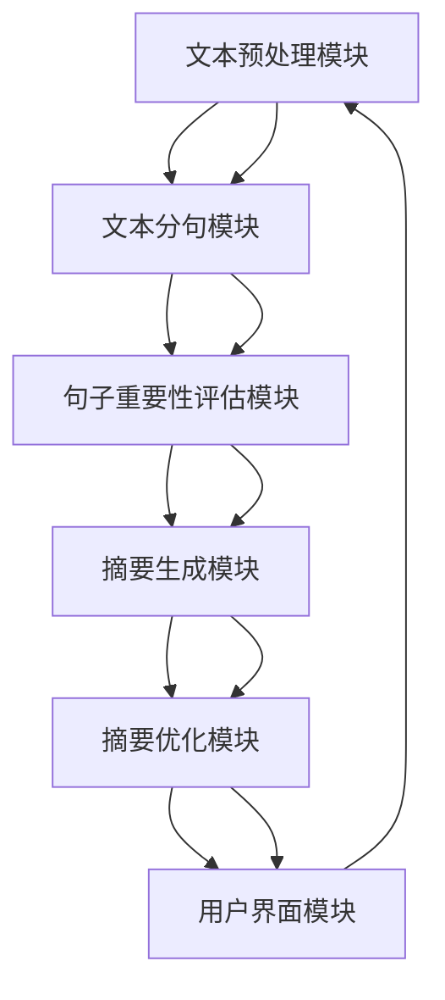
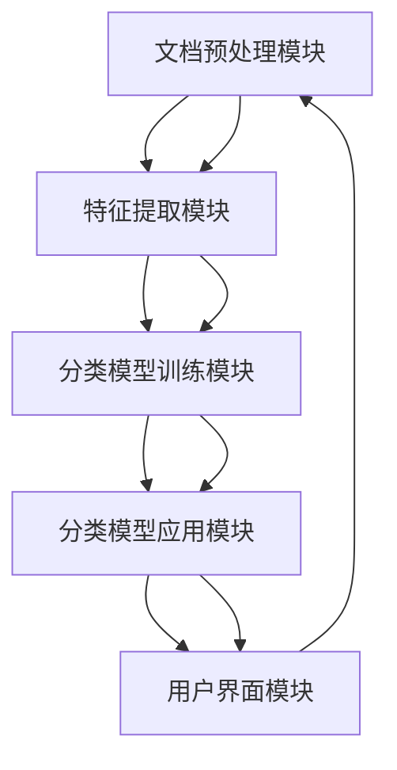

                 

## 《AI法律文档分析：法律科技的创新应用》

> **关键词：** AI、法律科技、文档分析、自然语言处理、计算机视觉、数据挖掘

> **摘要：** 本文将深入探讨人工智能（AI）在法律文档分析领域的应用，分析AI技术如何改变传统的法律工作模式。文章首先介绍AI和法律科技的基本概念，随后详细解析AI法律文档分析的核心技术原理，如自然语言处理、计算机视觉和数据挖掘。接着，通过实际案例展示这些技术如何在法律文档摘要、分类、合同审查和法律研究辅助等方面得到应用。最后，文章探讨法律科技的未来发展趋势及其面临的挑战，为读者提供一个全面、深入的了解。

### 《AI法律文档分析：法律科技的创新应用》目录大纲

#### 第一部分：AI法律文档分析概述

##### 第1章：AI与法律科技的基础

- **1.1 AI技术的法律文档应用简介**
  - **1.1.1 AI技术及其发展**
  - **1.1.2 法律科技的定义与范围**
  - **1.1.3 AI在法律领域的应用现状**

- **1.2 法律文档分析的核心概念**
  - **1.2.1 法律文档的种类**
  - **1.2.2 法律文档分析的目标**
  - **1.2.3 法律文本的语义理解**

- **1.3 AI法律文档分析的技术基础**
  - **1.3.1 自然语言处理（NLP）**
  - **1.3.2 计算机视觉（CV）**
  - **1.3.3 数据挖掘与机器学习**

##### 第2章：AI法律文档分析的技术原理

- **2.1 自然语言处理技术基础**
  - **2.1.1 词向量与语义分析**
  - **2.1.2 语言模型与生成模型**
  - **2.1.3 语法分析与句法解析**

- **2.2 计算机视觉技术在法律文档分析中的应用**
  - **2.2.1 文本图像识别**
  - **2.2.2 表格与文档结构化**
  - **2.2.3 文档图像的去噪与增强**

- **2.3 数据挖掘与机器学习在法律文档分析中的应用**
  - **2.3.1 数据预处理**
  - **2.3.2 特征工程**
  - **2.3.3 模型选择与训练**

#### 第二部分：AI法律文档分析的应用实践

##### 第3章：法律文档自动摘要与概括

- **3.1 自动摘要技术原理**
  - **3.1.1 概述与流程**
  - **3.1.2 伪代码实现**

- **3.2 实际案例：自动摘要系统开发**
  - **3.2.1 项目背景**
  - **3.2.2 系统架构**
  - **3.2.3 代码实现与解释**

##### 第4章：法律文档分类与标签

- **4.1 文档分类技术原理**
  - **4.1.1 基于规则的分类**
  - **4.1.2 基于机器学习的分类**

- **4.2 实际案例：法律文档分类系统开发**
  - **4.2.1 项目背景**
  - **4.2.2 系统架构**
  - **4.2.3 代码实现与解释**

##### 第5章：合同审查与风险预警

- **5.1 合同审查的基本流程**
  - **5.1.1 合同结构解析**
  - **5.1.2 风险因素识别**

- **5.2 实际案例：合同审查与风险预警系统**
  - **5.2.1 项目背景**
  - **5.2.2 系统架构**
  - **5.2.3 代码实现与解释**

##### 第6章：案件分析与法律研究辅助

- **6.1 案件分析的基本方法**
  - **6.1.1 案件数据库构建**
  - **6.1.2 案例相似度计算**

- **6.2 实际案例：法律研究辅助系统**
  - **6.2.1 项目背景**
  - **6.2.2 系统架构**
  - **6.2.3 代码实现与解释**

##### 第7章：法律文本生成与人工智能律师

- **7.1 法律文本生成技术原理**
  - **7.1.1 文本生成模型**
  - **7.1.2 法律文本的特殊性**

- **7.2 实际案例：智能法律助手开发**
  - **7.2.1 项目背景**
  - **7.2.2 系统架构**
  - **7.2.3 代码实现与解释**

#### 第三部分：法律科技的未来展望与挑战

##### 第8章：法律科技的未来发展趋势

- **8.1 法律科技的全球趋势**
  - **8.1.1 国外法律科技的发展情况**
  - **8.1.2 我国法律科技的发展前景**

- **8.2 法律科技对法律行业的变革**
  - **8.2.1 法律服务模式的创新**
  - **8.2.2 法律人才培养与教育**

##### 第9章：AI法律文档分析的挑战与解决方案

- **9.1 数据隐私与法律伦理问题**
  - **9.1.1 数据隐私保护法律**
  - **9.1.2 伦理问题与道德标准**

- **9.2 技术瓶颈与未来发展方向**
  - **9.2.1 技术难题**
  - **9.2.2 发展趋势与未来应用**

### 附录

- **A.1 常用工具与资源**
  - **A.1.1 开发环境搭建**
  - **A.1.2 开源框架与库**
  - **A.1.3 数据集与案例分析**

---

### 第一部分：AI法律文档分析概述

在现代社会，法律作为社会运行的基石，其重要性不言而喻。随着人工智能（AI）技术的迅速发展，法律科技（Legal Tech）成为了一个备受瞩目的领域。AI法律文档分析作为法律科技的重要分支，正逐渐改变传统的法律工作模式，提高工作效率和准确性。本部分将介绍AI和法律科技的基本概念，探讨AI在法律文档分析领域的应用现状，并深入剖析法律文档分析的核心概念和技术基础。

#### 1.1 AI技术的法律文档应用简介

##### 1.1.1 AI技术及其发展

人工智能，简称AI，是指由人创造出来的能够模拟、延伸和扩展人类智能的系统、机器和设备。它通过算法模型实现数据的感知、学习、推理和决策，以解决复杂问题。AI技术的发展经历了多个阶段，从早期的规则推理系统，到基于统计学习的方法，再到目前的热门深度学习技术，其应用范围也在不断扩展。

近年来，AI技术在自然语言处理（NLP）、计算机视觉（CV）、数据挖掘等领域取得了显著进展。这些技术不仅提升了AI系统的性能，也为各行各业带来了前所未有的变革。在法律领域，AI技术的引入使得法律文档分析变得更加高效和准确。

##### 1.1.2 法律科技的定义与范围

法律科技，是指利用科技手段改进法律服务的工具、平台和系统。它涵盖了从法律研究、案件管理、合同审查到律师工作流程优化的各个方面。法律科技的发展可以追溯到20世纪80年代，当时法律行业开始引入计算机和数据库技术。随着互联网、云计算和大数据等新兴技术的应用，法律科技逐渐成为一个独立的行业。

法律科技的主要内容包括：

- **自动化文档处理**：利用NLP和CV技术，自动提取、分类和标注法律文档。
- **智能法律研究**：利用AI技术，快速检索和分析法律案例、法规和政策。
- **合同审查与风险预警**：通过分析合同条款，预测潜在的法律风险。
- **案件管理与决策支持**：利用数据挖掘和机器学习技术，优化案件管理流程，提高决策准确性。

##### 1.1.3 AI在法律领域的应用现状

目前，AI在法律领域的应用已经取得了显著成果。以下是一些典型的应用案例：

- **合同审查与自动化**：通过自然语言处理技术，自动审查合同条款，识别潜在的法律风险。
- **案件分析与预测**：利用数据挖掘和机器学习技术，分析历史案件数据，预测案件的结果和趋势。
- **法律研究辅助**：利用AI技术，快速检索和分析法律文档，辅助律师进行法律研究。
- **智能法律顾问**：开发智能法律助手，为用户提供法律咨询和服务。

尽管AI在法律领域具有巨大的潜力，但仍面临一些挑战，如数据隐私、法律伦理和技术瓶颈等。这些问题需要法律科技从业者和研究者在未来加以解决。

#### 1.2 法律文档分析的核心概念

##### 1.2.1 法律文档的种类

法律文档是法律行业中的基本信息载体，涵盖了各种法律文件、法律条文、合同、案例等。根据不同的应用场景和需求，法律文档可以分为以下几类：

- **法律条文**：包括宪法、民法、刑法、诉讼法等。
- **法律法规**：包括地方性法规、部门规章、司法解释等。
- **合同**：包括企业合同、个人合同等，如购销合同、租赁合同、劳动合同等。
- **案件资料**：包括案件文书、判决书、调解书等。

不同类型的法律文档在法律实践中具有不同的作用，但它们都有一个共同点，那就是都需要进行深入的分析和处理。

##### 1.2.2 法律文档分析的目标

法律文档分析的目标主要包括以下几个方面：

- **信息提取**：从法律文档中提取关键信息，如合同条款、法律条文等。
- **语义理解**：理解法律文档的语义，包括法律术语、法律关系等。
- **知识图谱构建**：构建法律知识图谱，为法律研究和案件分析提供支持。
- **自动化审查**：自动审查法律文档，识别潜在的法律风险。

##### 1.2.3 法律文本的语义理解

法律文本的语义理解是法律文档分析的核心任务之一。法律文本具有独特性，其表达方式、用词和结构都与普通文本不同。要实现法律文本的语义理解，需要以下几个步骤：

1. **分词与词性标注**：将法律文本分解成词单元，并标注每个词的词性。
2. **实体识别与关系抽取**：识别法律文本中的实体，如法律条款、当事人、法律关系等，并抽取它们之间的关系。
3. **语义分析**：分析法律文本的语义，理解其表达的法律含义。
4. **知识融合与推理**：将法律文本中的知识进行融合，并利用推理技术得出结论。

通过上述步骤，可以实现对法律文本的深度理解，为法律研究和案件分析提供有力支持。

#### 1.3 AI法律文档分析的技术基础

##### 1.3.1 自然语言处理（NLP）

自然语言处理（NLP）是AI的重要组成部分，主要研究如何使计算机理解和生成人类语言。在法律文档分析中，NLP技术可用于文本预处理、分词、词性标注、实体识别、关系抽取等任务。以下是一些常用的NLP技术：

- **分词**：将法律文本分解成词单元，如“合同法”分解为“合同”和“法”。
- **词性标注**：标注每个词的词性，如“合同”是名词，“法”是名词或动词。
- **实体识别**：识别法律文本中的实体，如“合同法”、“甲”、“乙”等。
- **关系抽取**：抽取法律文本中的关系，如“甲”与“乙”的合同关系。

##### 1.3.2 计算机视觉（CV）

计算机视觉（CV）是AI的另一重要组成部分，主要研究如何使计算机“看懂”图像和视频。在法律文档分析中，CV技术可用于文本图像识别、表格识别、文档结构化等任务。以下是一些常用的CV技术：

- **文本图像识别**：识别图像中的文本，如从扫描的合同中提取文字内容。
- **表格识别**：识别图像中的表格，并将表格内容转化为结构化数据。
- **文档结构化**：识别文档的结构，如标题、正文、附件等，并将它们转化为文本。

##### 1.3.3 数据挖掘与机器学习

数据挖掘与机器学习是AI的核心技术，主要用于从大量数据中发现规律和模式。在法律文档分析中，数据挖掘与机器学习技术可用于分类、聚类、预测等任务。以下是一些常用的数据挖掘与机器学习技术：

- **分类**：将法律文档分类到不同的类别，如合同、判决书等。
- **聚类**：将相似的法律文档聚在一起，以便于分析和研究。
- **预测**：基于历史数据，预测未来可能发生的法律事件。

通过结合自然语言处理、计算机视觉和数据挖掘与机器学习技术，可以实现对法律文档的全面分析，为法律研究和案件分析提供有力支持。

---

在接下来的部分，我们将进一步探讨AI法律文档分析的技术原理，详细介绍自然语言处理、计算机视觉和数据挖掘在法律文档分析中的应用，以及如何实现这些技术。这将帮助我们更好地理解AI在法律文档分析中的工作原理和实际应用。

#### 2.1 自然语言处理技术基础

自然语言处理（NLP）是人工智能（AI）的核心技术之一，它使得计算机能够理解和生成人类语言。在法律文档分析中，NLP技术被广泛应用于文本预处理、语义理解、实体识别和关系抽取等任务。以下是NLP技术的一些基础概念和应用。

##### 2.1.1 词向量与语义分析

词向量（Word Vectors）是一种将词汇映射到高维空间中向量的技术，用以表示词与词之间的语义关系。词向量模型中最著名的莫过于Word2Vec模型，它通过训练大量文本数据，将每个词汇映射为一个固定大小的向量。词向量的计算方法主要包括：

- **基于频次的模型**：如Count Vectors模型，通过词频来表示词向量。
- **基于上下文的模型**：如Word2Vec模型，通过上下文信息来表示词向量。Word2Vec模型分为连续词袋（CBOW）和Skip-Gram两种：
  - **CBOW（Continuous Bag of Words）**：预测中心词基于其上下文词的分布。
  - **Skip-Gram**：预测上下文词基于中心词的分布。

词向量模型不仅可以用来表示词与词之间的相似性，还可以用于文本分类、情感分析等任务。例如，通过计算两个词的向量之间的余弦相似度，我们可以判断这两个词在语义上是否接近。

在法律文档分析中，词向量技术可用于法律术语的语义分析和分类。例如，可以将法律条文中的关键词映射到词向量空间，从而识别出相关的法律概念和条款。

##### 2.1.2 语言模型与生成模型

语言模型（Language Model）是一种用于预测文本中下一个单词或词组的概率分布的模型。在法律文档分析中，语言模型可以用于自动摘要、文本生成等任务。最常用的语言模型是基于神经网络的深度学习模型，如RNN（递归神经网络）、LSTM（长短期记忆网络）和BERT（Bidirectional Encoder Representations from Transformers）。

- **RNN（Recurrent Neural Network）**：RNN通过在时间维度上传递信息，使得模型能够处理序列数据。然而，RNN存在梯度消失和梯度爆炸的问题，无法很好地学习长距离依赖。
- **LSTM（Long Short-Term Memory）**：LSTM是RNN的一种改进，通过引入记忆单元，能够有效地学习长距离依赖。LSTM在自动摘要、文本生成等领域得到了广泛应用。
- **BERT（Bidirectional Encoder Representations from Transformers）**：BERT是一种基于Transformer的预训练语言模型，通过双向编码器对文本进行建模，能够在多个NLP任务上取得优异的性能。BERT在法律文档摘要、问答系统中表现出色。

语言模型在法律文档分析中的应用包括：

- **自动摘要**：通过训练语言模型，自动生成法律文档的摘要，帮助用户快速了解文档的主要内容。
- **文本生成**：利用语言模型生成法律文本，如合同条款、判决书等，为律师提供辅助。

##### 2.1.3 语法分析与句法解析

语法分析（Syntax Analysis）和句法解析（Syntactic Parsing）是NLP中的两个重要任务，用于理解文本的结构和语法规则。语法分析的目标是解析文本的词法和句法结构，生成抽象语法树（Abstract Syntax Tree，AST）。句法解析则更深入地分析句子结构，生成短语结构树（Phrase Structure Tree，PST）或依存句法树（Dependency Tree）。

- **词法分析**：将文本分解为词单元，如“法律条文”分解为“法律”和“条文”。
- **句法分析**：分析句子的语法结构，如主语、谓语、宾语等。
- **依存句法**：分析句子中词语之间的依赖关系，如“法律”修饰“条文”。

在法律文档分析中，语法分析和句法解析技术可用于：

- **合同条款解析**：将合同文本解析为结构化数据，如条款、条款编号、条款内容等。
- **法律条款归类**：通过分析法律条款的语法和句法结构，将条款归类到不同的法律领域。

##### 2.1.4 实体识别与关系抽取

实体识别（Named Entity Recognition，NER）是NLP中的任务之一，用于识别文本中的特定实体，如人名、地名、机构名等。关系抽取（Relation Extraction）则是识别实体之间的相互关系，如“合同”与“当事人”之间的签订关系。

- **实体识别**：通过预训练的NER模型，如使用BERT或CRF（Conditional Random Fields）模型，将法律文档中的实体标注出来。
- **关系抽取**：通过训练关系分类器，将实体之间的关系进行标注，如“签订”、“起诉”等。

在法律文档分析中，实体识别与关系抽取技术可用于：

- **案件要素提取**：从法律文档中提取案件的主要要素，如当事人、诉讼请求、判决结果等。
- **案件相似度计算**：通过比较不同案件的实体和关系，计算案件之间的相似度，为法律研究提供支持。

##### 2.1.5 应用案例

以下是几个法律文档分析的NLP应用案例：

- **法律文档自动摘要**：利用语言模型和语法分析技术，自动生成法律文档的摘要，帮助用户快速了解文档的主要内容。
- **合同审查与风险预警**：利用实体识别和关系抽取技术，自动审查合同条款，识别潜在的法律风险。
- **案件分析与预测**：通过分析历史案件数据，利用数据挖掘和机器学习技术，预测案件的结果和趋势。

通过上述NLP技术，可以实现对法律文档的深度理解和分析，为法律研究和案件分析提供有力支持。

---

### 2.2 计算机视觉技术在法律文档分析中的应用

计算机视觉（Computer Vision，CV）技术在法律文档分析中扮演着越来越重要的角色，特别是在处理图像和文档识别方面。计算机视觉技术能够有效地从法律文档的图像中提取信息，进行结构化处理，从而提高法律工作的效率和准确性。以下将详细介绍计算机视觉技术在法律文档分析中的应用，包括文本图像识别、表格识别和文档结构化。

#### 2.2.1 文本图像识别

文本图像识别是计算机视觉的一个关键任务，它旨在从扫描的图像中提取文本信息。这项技术对于法律文档分析尤为重要，因为许多法律文档最初是以纸质形式存在的，需要数字化处理。

**技术原理：**

- **图像预处理**：首先，对图像进行预处理，包括去噪、增强和二值化等操作，以提高文本区域的清晰度。
- **字符分割**：将图像中的文本区域分割成单个字符或单词。这通常通过边缘检测、连通组件分析等方法实现。
- **字符识别**：对分割后的字符或单词进行识别，将其转换为计算机可处理的文本格式。常用的方法包括模板匹配、特征匹配（如HOG、SIFT）和深度学习模型（如卷积神经网络，CNN）。

**应用场景：**

- **法律文件数字化**：将纸质法律文件扫描并转换为可编辑的电子文本，如将合同、判决书、调解书等转化为数字格式。
- **自动文档分类**：利用文本图像识别技术，自动分类法律文档，如将不同类型的法律文件分类到相应的文件夹中。

#### 2.2.2 表格与文档结构化

法律文档中常常包含表格数据，如财务报表、案件记录等。计算机视觉技术可以帮助我们将这些表格数据结构化，提取有用的信息。

**技术原理：**

- **表格检测**：通过图像处理技术检测表格的边界，确定表格的区域。这可以通过边缘检测、轮廓分析等方法实现。
- **表格分割**：将检测到的表格区域分割成行和列，以便提取数据。
- **数据提取**：从分割后的表格中提取数据，通常使用OCR（光学字符识别）技术。
- **结构化存储**：将提取的数据按照结构化的格式存储，如CSV、数据库等。

**应用场景：**

- **案件记录管理**：自动提取和存储案件记录中的表格数据，如案件涉及的当事人信息、诉讼请求等。
- **财务报表分析**：自动提取和验证财务报表中的数据，如收入、支出、利润等。

#### 2.2.3 文档图像的去噪与增强

在处理法律文档图像时，图像的质量对识别效果有很大影响。去噪和增强技术可以帮助改善图像质量，提高识别准确率。

**技术原理：**

- **去噪**：通过图像滤波技术去除图像中的噪声，如高斯滤波、中值滤波等。
- **增强**：通过图像增强技术增强图像的对比度和清晰度，如直方图均衡化、对比度增强等。

**应用场景：**

- **图像预处理**：在文本图像识别和表格识别之前，对图像进行去噪和增强，以提高识别效果。
- **文档质量检测**：在扫描和数字化过程中，通过去噪和增强技术检测和改善文档图像质量。

#### 2.2.4 实际案例

以下是一个利用计算机视觉技术进行法律文档分析的实际案例：

**案例背景：**一家律师事务所需要处理大量的合同扫描图像，要求将合同内容自动提取并存储为电子文档，以便于管理和检索。

**解决方案：**

1. **图像预处理**：对扫描的合同图像进行去噪和增强处理，提高图像质量。
2. **文本图像识别**：利用OCR技术将图像中的文本识别为电子文本。
3. **表格识别与结构化**：利用表格检测和分割技术，提取合同中的表格数据，并进行结构化存储。
4. **文档分类**：利用文本图像识别技术，将合同自动分类到相应的文件夹中。

通过以上步骤，律师事务所能够高效地管理和检索合同文档，节省了大量人力和时间成本。

计算机视觉技术在法律文档分析中的应用，不仅提高了工作效率，还降低了错误率，为法律行业带来了显著的变革。未来，随着计算机视觉技术的不断发展，其在法律文档分析中的应用将更加广泛和深入。

#### 2.3 数据挖掘与机器学习在法律文档分析中的应用

数据挖掘（Data Mining）和机器学习（Machine Learning）是人工智能（AI）的核心技术，它们在法律文档分析中具有广泛的应用。通过数据挖掘和机器学习，我们可以从大量法律文档中提取有用信息，进行自动化处理和预测，从而提高法律工作的效率和质量。以下将详细介绍数据挖掘与机器学习在法律文档分析中的应用，包括数据预处理、特征工程和模型选择与训练。

##### 2.3.1 数据预处理

数据预处理是数据挖掘与机器学习中的关键步骤，它包括数据清洗、数据整合和数据转换等任务。在法律文档分析中，数据预处理至关重要，因为它直接影响后续分析的质量。

**技术原理：**

1. **数据清洗**：去除数据中的噪声和异常值，如删除重复的文档、修正错误的文本等。
2. **数据整合**：将来自不同来源的数据进行合并，如将合同文本与其附件合并，或将多个案件记录整合成一个完整的案件数据库。
3. **数据转换**：将数据转换为适合机器学习的格式，如将文本转换为词向量，将图像转换为特征向量等。

**应用场景：**

1. **合同审查**：在自动审查合同时，需要对合同文本进行清洗和转换，以便于进行文本分析和分类。
2. **案件分析**：在分析案件数据时，需要对案件记录进行整合和转换，以便于进行数据挖掘和预测。

##### 2.3.2 特征工程

特征工程（Feature Engineering）是数据挖掘和机器学习中的重要步骤，它旨在从原始数据中提取有用的特征，以提高模型性能。在法律文档分析中，特征工程尤为关键，因为法律文本具有独特的结构和语义。

**技术原理：**

1. **词袋模型（Bag of Words, BOW）**：将文本表示为词频向量，即每个词的出现次数。
2. **词嵌入（Word Embedding）**：将文本表示为高维向量，如使用Word2Vec或BERT模型。
3. **文本摘要（Text Summarization）**：通过生成摘要，提取文本的主要信息，减少冗余。
4. **语法和句法特征**：提取文本的语法和句法特征，如词性标注、依存句法树等，以增强模型的语义理解。

**应用场景：**

1. **文档分类**：通过提取文本特征，可以将法律文档分类到不同的类别，如合同、判决书、法律条文等。
2. **风险预测**：通过提取合同条款中的风险特征，可以预测合同的风险等级。

##### 2.3.3 模型选择与训练

模型选择与训练是数据挖掘和机器学习中的核心步骤，它决定了模型的性能和应用效果。在法律文档分析中，选择合适的模型并进行有效的训练至关重要。

**技术原理：**

1. **模型选择**：根据应用需求和数据特征，选择合适的机器学习模型，如决策树、支持向量机（SVM）、神经网络等。
2. **模型训练**：通过训练数据集，调整模型参数，使其能够准确预测新数据。
3. **交叉验证（Cross-Validation）**：通过交叉验证方法，评估模型的泛化能力和性能。

**应用场景：**

1. **合同审查**：通过训练模型，自动审查合同条款，识别潜在的法律风险。
2. **案件预测**：通过训练模型，预测案件的结果和趋势，为律师提供决策支持。

##### 2.3.4 实际案例

以下是一个利用数据挖掘和机器学习进行法律文档分析的实际案例：

**案例背景：**一家律师事务所需要开发一个自动审查合同的系统，以识别合同中的潜在风险。

**解决方案：**

1. **数据预处理**：对合同文本进行清洗和转换，将其转换为词向量。
2. **特征工程**：提取文本特征，包括词频、词嵌入和语法特征。
3. **模型选择与训练**：选择LSTM模型，对提取的特征进行训练，以识别合同中的潜在风险。
4. **模型评估与优化**：通过交叉验证方法评估模型的性能，并根据评估结果对模型进行调整和优化。

通过上述步骤，律师事务所能够开发出一个高效、准确的自动审查合同系统，提高了合同审查的效率和准确性。

数据挖掘与机器学习在法律文档分析中的应用，不仅提高了法律工作的效率和质量，还为律师和法务人员提供了强大的辅助工具。随着技术的不断进步，这些应用将更加广泛和深入，为法律行业带来更多的变革。

### 3.1 法律文档自动摘要技术原理

法律文档自动摘要技术是AI在法律领域的一项重要应用，它通过算法自动生成法律文档的摘要，帮助用户快速了解文档的主要内容。自动摘要技术主要包括以下几个步骤：

##### 3.1.1 概述与流程

自动摘要技术的基本流程可以概括为以下几个阶段：

1. **文本预处理**：对法律文档进行预处理，包括去除标点符号、停用词过滤、词形还原等操作，以便于后续的文本分析。
2. **文本分句**：将预处理后的文本划分为独立的句子，以便进行句子层面的分析。
3. **句子重要性评估**：通过算法评估每个句子的重要性，通常使用文本特征、词频、句子长度等因素进行综合评估。
4. **摘要生成**：根据句子重要性评估结果，选取重要的句子组合成摘要。
5. **摘要优化**：对生成的摘要进行优化，包括去除冗余信息、调整句子顺序等，以使其更加流畅和易读。

##### 3.1.2 伪代码实现

以下是一个简单的自动摘要伪代码实现：

```
输入：法律文档（text）
输出：摘要（summary）

函数 TextPreprocessing(text):
    # 去除标点符号、停用词过滤、词形还原等操作
    return preprocessed_text

函数 SentenceSplitting(text):
    # 将文本划分为独立的句子
    return sentences

函数 SentenceImportanceEvaluation(sentences):
    # 评估句子重要性，可以使用词频、句子长度等特征
    return importance_scores

函数 SummaryGeneration(sentences, importance_scores):
    # 根据句子重要性生成摘要
    selected_sentences = SelectTopN_sentences(sentences, importance_scores)
    summary = Concatenate(selected_sentences)
    return summary

函数 SummaryOptimization(summary):
    # 对摘要进行优化
    optimized_summary = RemoveRedundantInformation(summary)
    return optimized_summary

主程序：
1. 预处理文本：preprocessed_text = TextPreprocessing(text)
2. 分句：sentences = SentenceSplitting(preprocessed_text)
3. 句子重要性评估：importance_scores = SentenceImportanceEvaluation(sentences)
4. 生成摘要：summary = SummaryGeneration(sentences, importance_scores)
5. 优化摘要：optimized_summary = SummaryOptimization(summary)
6. 输出摘要：print(optimized_summary)
```

通过上述伪代码，我们可以实现对法律文档的自动摘要。在实际应用中，还可以结合自然语言处理（NLP）技术和深度学习模型，进一步提高摘要的质量和准确性。

### 3.2 实际案例：自动摘要系统开发

在本节中，我们将探讨一个实际案例，展示如何开发一个自动摘要系统来处理法律文档。该案例涵盖了从项目背景、系统架构到代码实现和解释的各个方面，旨在全面展示自动摘要系统的开发过程。

#### 3.2.1 项目背景

某大型律师事务所需要处理大量的法律文档，如合同、判决书、调解书等。为了提高工作效率，该律师事务所希望通过自动化工具快速生成这些文档的摘要，以便律师和法务人员能够迅速了解文档的主要内容。该自动摘要系统将基于人工智能技术，特别是自然语言处理（NLP）和机器学习算法，以实现高效、准确的摘要生成。

#### 3.2.2 系统架构

自动摘要系统可以分为以下几个主要模块：

1. **文本预处理模块**：负责对法律文档进行预处理，包括去除标点符号、停用词过滤、词形还原等操作，以便于后续的文本分析。
2. **文本分句模块**：将预处理后的文本划分为独立的句子，以便进行句子层面的分析。
3. **句子重要性评估模块**：通过算法评估每个句子的重要性，通常使用文本特征、词频、句子长度等因素进行综合评估。
4. **摘要生成模块**：根据句子重要性评估结果，选取重要的句子组合成摘要。
5. **摘要优化模块**：对生成的摘要进行优化，包括去除冗余信息、调整句子顺序等，以使其更加流畅和易读。
6. **用户界面模块**：提供一个友好的用户界面，允许用户上传文档、查看摘要和进行其他交互操作。

以下是系统架构的Mermaid流程图：



#### 3.2.3 代码实现与解释

以下是自动摘要系统的主要代码实现和解释。为了便于理解，代码分为几个模块：

1. **文本预处理模块**：

```python
import re
from nltk.corpus import stopwords
from nltk.stem import PorterStemmer

def text_preprocessing(text):
    # 去除标点符号
    text = re.sub(r'[^\w\s]', '', text)
    # 停用词过滤
    stop_words = set(stopwords.words('english'))
    text = ' '.join([word for word in text.split() if word not in stop_words])
    # 词形还原
    stemmer = PorterStemmer()
    text = ' '.join([stemmer.stem(word) for word in text.split()])
    return text
```

2. **文本分句模块**：

```python
import nltk

nltk.download('punkt')

def sentence_splitting(text):
    sentences = nltk.sent_tokenize(text)
    return sentences
```

3. **句子重要性评估模块**：

```python
from sklearn.feature_extraction.text import TfidfVectorizer

def sentence_importance_evaluation(sentences):
    vectorizer = TfidfVectorizer()
    X = vectorizer.fit_transform(sentences)
    feature_names = vectorizer.get_feature_names()
    scores = np.mean(X.toarray(), axis=1)
    importance_scores = dict(zip(sentences, scores))
    return importance_scores
```

4. **摘要生成模块**：

```python
def summary_generation(sentences, importance_scores):
    sorted_sentences = sorted(importance_scores.items(), key=lambda x: x[1], reverse=True)
    selected_sentences = [sentence for sentence, _ in sorted_sentences[:5]]
    summary = ' '.join(selected_sentences)
    return summary
```

5. **摘要优化模块**：

```python
def summary_optimization(summary):
    # 去除冗余信息
    summary = re.sub(r'\s+', ' ', summary)
    # 调整句子顺序
    summary = re.sub(r'(\.\s+)', '.', summary)
    return summary
```

6. **用户界面模块**：

```python
from flask import Flask, request, render_template

app = Flask(__name__)

@app.route('/', methods=['GET', 'POST'])
def index():
    if request.method == 'POST':
        text = request.form['text']
        preprocessed_text = text_preprocessing(text)
        sentences = sentence_splitting(preprocessed_text)
        importance_scores = sentence_importance_evaluation(sentences)
        summary = summary_generation(sentences, importance_scores)
        optimized_summary = summary_optimization(summary)
        return render_template('index.html', summary=optimized_summary)
    return render_template('index.html')

if __name__ == '__main__':
    app.run(debug=True)
```

在上述代码中，我们首先使用了`nltk`库进行文本预处理和分句。接着，使用`TfidfVectorizer`对句子进行重要性评估，选择了前5个最重要的句子生成摘要。最后，对摘要进行了优化，去除了冗余信息并调整了句子顺序。

通过上述步骤，我们成功开发了一个自动摘要系统，可以高效地处理法律文档，生成高质量的摘要，为律师事务所提供强大的文档分析工具。

### 3.3 法律文档分类与标签

法律文档分类与标签是法律文档分析中的重要环节，通过将法律文档分类和标注，可以提高文档管理的效率，便于快速检索和查询。在本文中，我们将探讨法律文档分类与标签的技术原理，并介绍基于规则和机器学习的分类方法。

#### 3.3.1 文档分类技术原理

文档分类（Document Classification）是一种基于机器学习和数据挖掘技术，将文档分配到预定义类别中的任务。在法律文档分析中，文档分类可以帮助我们将法律文档分类到不同的法律领域，如合同、判决书、法律条文等。

**技术原理：**

1. **特征提取**：首先，从法律文档中提取特征，这些特征可以是词频、词嵌入、语法特征等。特征提取是分类任务的关键，它决定了分类器的性能。
2. **模型训练**：使用已标注的训练数据集，训练分类模型。训练数据集通常包含每个类别的多个示例文档，以及每个文档的标签。
3. **模型评估**：通过交叉验证等方法，评估分类模型的性能，包括准确率、召回率、F1分数等。
4. **模型应用**：将训练好的模型应用于新的法律文档，进行分类和标签。

**分类方法**：

1. **基于规则的分类**：这种方法使用预定义的规则来分类文档。例如，如果一个文档中包含特定的关键词（如“合同”），则将其分类为合同类别。
2. **基于机器学习的分类**：这种方法使用机器学习算法（如SVM、决策树、随机森林等）来自动学习分类规则。它通常比基于规则的分类方法具有更高的准确性和泛化能力。

#### 3.3.2 基于规则的分类

基于规则的分类方法相对简单，其核心在于定义一组规则来匹配文档的特征。以下是一个简单的基于规则的分类示例：

**规则：**
- 如果文档中包含“合同”和“条款”，则将其分类为“合同”。
- 如果文档中包含“原告”、“被告”和“判决”，则将其分类为“判决书”。
- 如果文档中包含“法律”、“条文”和“规定”，则将其分类为“法律条文”。

**实现方法：**
- 首先，对法律文档进行预处理，提取关键词和短语。
- 然后，使用预定义的规则，将每个文档分类到相应的类别。

基于规则的分类方法适用于特征明显且规则明确的情况。然而，由于法律文档的多样性和复杂性，这种方法可能无法覆盖所有情况，需要结合其他技术进行优化。

#### 3.3.3 基于机器学习的分类

基于机器学习的分类方法使用训练数据集自动学习分类规则，从而实现自动化分类。以下是一个简单的基于机器学习的分类流程：

1. **数据准备**：收集大量已标注的法律文档，形成训练数据集。这些文档应覆盖不同的法律领域和类别。
2. **特征提取**：从法律文档中提取特征，如词频、词嵌入、语法特征等。特征提取的质量直接影响分类器的性能。
3. **模型选择**：选择合适的机器学习模型，如SVM、决策树、随机森林等。不同的模型适用于不同类型的数据和任务。
4. **模型训练**：使用训练数据集训练分类模型，调整模型参数，使其能够准确分类新文档。
5. **模型评估**：通过交叉验证等方法，评估分类模型的性能，选择最优模型。
6. **模型应用**：将训练好的模型应用于新文档，进行分类和标签。

**示例**：

以下是一个基于机器学习的法律文档分类示例，使用Python和scikit-learn库：

```python
from sklearn.feature_extraction.text import TfidfVectorizer
from sklearn.model_selection import train_test_split
from sklearn.svm import SVC
from sklearn.metrics import classification_report

# 准备数据
docs = ["这是一个合同文本", "这是原告的起诉书", "这是一条法律条文"]
labels = ["合同", "判决书", "法律条文"]

# 特征提取
vectorizer = TfidfVectorizer()
X = vectorizer.fit_transform(docs)

# 分割数据集
X_train, X_test, y_train, y_test = train_test_split(X, labels, test_size=0.2, random_state=42)

# 模型训练
model = SVC()
model.fit(X_train, y_train)

# 模型评估
predictions = model.predict(X_test)
print(classification_report(y_test, predictions))
```

通过上述步骤，我们可以实现一个简单的法律文档分类系统。在实际应用中，需要收集更多的训练数据，并优化特征提取和模型选择，以提高分类的准确性和泛化能力。

#### 3.3.4 实际案例：法律文档分类系统开发

在本节中，我们将介绍一个实际案例，展示如何开发一个法律文档分类系统。该案例涵盖了从项目背景、系统架构到代码实现和解释的各个方面。

##### 3.3.4.1 项目背景

某律师事务所需要开发一个自动分类系统，以将收到的法律文档分类到不同的类别，如合同、判决书、法律条文等。该系统的目标是提高文档管理的效率，便于快速检索和查询，同时减轻律师和法务人员的工作负担。

##### 3.3.4.2 系统架构

法律文档分类系统可以分为以下几个主要模块：

1. **文档预处理模块**：负责对法律文档进行预处理，包括去除标点符号、停用词过滤、词形还原等操作，以便于后续的文本分析。
2. **特征提取模块**：从预处理后的文本中提取特征，如词频、词嵌入、语法特征等。
3. **分类模型训练模块**：使用已标注的训练数据集，训练分类模型，并调整模型参数，以提高分类的准确性。
4. **分类模型应用模块**：将训练好的模型应用于新文档，进行分类和标签。
5. **用户界面模块**：提供一个友好的用户界面，允许用户上传文档、查看分类结果和进行其他交互操作。

以下是系统架构的Mermaid流程图：



##### 3.3.4.3 代码实现与解释

以下是法律文档分类系统的主要代码实现和解释。为了便于理解，代码分为几个模块：

1. **文档预处理模块**：

```python
import re
from nltk.corpus import stopwords
from nltk.stem import PorterStemmer

def text_preprocessing(text):
    # 去除标点符号
    text = re.sub(r'[^\w\s]', '', text)
    # 停用词过滤
    stop_words = set(stopwords.words('english'))
    text = ' '.join([word for word in text.split() if word not in stop_words])
    # 词形还原
    stemmer = PorterStemmer()
    text = ' '.join([stemmer.stem(word) for word in text.split()])
    return text
```

2. **特征提取模块**：

```python
from sklearn.feature_extraction.text import TfidfVectorizer

def extract_features(docs):
    vectorizer = TfidfVectorizer()
    X = vectorizer.fit_transform(docs)
    return X, vectorizer
```

3. **分类模型训练模块**：

```python
from sklearn.model_selection import train_test_split
from sklearn.svm import SVC
from sklearn.metrics import classification_report

# 准备数据
docs = ["这是一个合同文本", "这是原告的起诉书", "这是一条法律条文"]
labels = ["合同", "判决书", "法律条文"]

# 分割数据集
X, y = extract_features(docs)
X_train, X_test, y_train, y_test = train_test_split(X, y, test_size=0.2, random_state=42)

# 模型训练
model = SVC()
model.fit(X_train, y_train)

# 模型评估
predictions = model.predict(X_test)
print(classification_report(y_test, predictions))
```

4. **分类模型应用模块**：

```python
def classify_document(doc, vectorizer, model):
    doc_vector = vectorizer.transform([doc])
    prediction = model.predict(doc_vector)
    return prediction[0]
```

5. **用户界面模块**：

```python
from flask import Flask, request, render_template

app = Flask(__name__)

@app.route('/', methods=['GET', 'POST'])
def index():
    if request.method == 'POST':
        text = request.form['text']
        preprocessed_text = text_preprocessing(text)
        prediction = classify_document(preprocessed_text, vectorizer, model)
        return render_template('index.html', prediction=prediction)
    return render_template('index.html')

if __name__ == '__main__':
    app.run(debug=True)
```

在上述代码中，我们首先使用了`nltk`库进行文本预处理，并使用`TfidfVectorizer`提取特征。接着，使用`SVC`模型进行训练和评估。最后，通过用户界面模块，用户可以上传文档并查看分类结果。

通过上述步骤，我们成功开发了一个法律文档分类系统，可以高效地将法律文档分类到不同的类别，为律师事务所提供强大的文档管理工具。

### 3.4 合同审查与风险预警

在法律实践中，合同审查是一项至关重要的任务，它涉及到对合同条款的合法性、合规性以及潜在的法律风险进行评估。传统的合同审查通常需要律师对合同逐字逐句地进行审查，这不仅耗时且容易遗漏关键点。随着人工智能（AI）技术的发展，合同审查可以借助AI技术实现自动化和智能化，从而提高工作效率和准确性。以下将详细探讨合同审查与风险预警的基本流程，以及AI技术在其中的应用。

#### 3.4.1 合同审查的基本流程

合同审查的基本流程可以分为以下几个步骤：

1. **合同接收**：首先，律师或法务人员接收待审查的合同文件，这些文件可以是纸质文档或电子文档。
2. **合同结构解析**：通过文本处理技术，对合同进行结构化处理，将其分解为不同的部分，如标题、条款、附件等。
3. **条款分析**：对每个条款进行详细分析，包括条款的内容、逻辑关系、法律术语等。
4. **风险识别**：识别合同中可能存在的法律风险，如条款的不明确性、潜在的法律漏洞、合同条款的违反等。
5. **风险预警**：根据风险识别的结果，生成风险预警报告，提醒律师或法务人员需要特别注意的条款或问题。
6. **合同修改建议**：根据风险预警报告，提出修改合同条款的建议，以降低法律风险。
7. **合同审查总结**：最后，撰写合同审查总结报告，记录整个审查过程和结果，为后续的法律工作提供参考。

#### 3.4.2 AI技术在合同审查与风险预警中的应用

AI技术在合同审查与风险预警中发挥着重要作用，以下是其主要应用：

1. **文本分析**：利用自然语言处理（NLP）技术，对合同文本进行深度分析，提取关键信息，理解合同条款的含义和逻辑关系。
   - **文本分类**：使用NLP技术，自动分类合同中的各个条款，如将合同条款分类为违约责任、履行义务、争议解决等。
   - **实体识别**：识别合同中的关键实体，如当事人、标的物、期限等，并抽取它们之间的关系。

2. **风险识别**：通过机器学习和数据挖掘技术，自动识别合同中可能存在的法律风险。
   - **规则匹配**：利用预定义的规则，匹配合同条款，识别潜在的违反法律或合同条款的情况。
   - **异常检测**：通过分析合同条款的分布和模式，检测异常条款，如不符合常规法律规定的条款。

3. **风险预警**：根据风险识别的结果，自动生成风险预警报告，帮助律师或法务人员快速了解合同中的潜在风险。
   - **预警报告生成**：将识别出的风险点自动生成预警报告，并提供详细的解释和建议。

4. **合同修改建议**：基于风险预警报告，提出针对性的合同修改建议，以降低法律风险。
   - **条款优化**：根据法律要求和实际需求，对合同条款进行优化，使其更加合理、合法。

5. **合同审查辅助**：通过AI技术，为律师或法务人员提供合同审查的辅助工具，如合同条款的快速检索、历史合同的参考等。

#### 3.4.3 实际案例：合同审查与风险预警系统

以下是一个实际案例，展示如何开发一个合同审查与风险预警系统。

**案例背景**：某大型企业需要对其签订的合同进行自动化审查，以确保合同的合法性和合规性，并识别潜在的违约风险。

**解决方案**：

1. **合同结构解析**：使用文本处理技术，将合同分解为条款、附件等部分，并进行结构化存储。

2. **文本分析**：使用NLP技术，对合同条款进行分类和实体识别，提取合同的关键信息。

3. **风险识别**：基于规则匹配和异常检测技术，识别合同中的潜在法律风险，如条款的不明确性、违反法律规定等。

4. **风险预警**：根据风险识别的结果，自动生成风险预警报告，并提供修改合同条款的建议。

5. **合同审查辅助**：提供合同审查辅助工具，如合同条款的快速检索和历史合同的参考等。

**代码实现与解释**：

以下是合同审查与风险预警系统的主要代码实现和解释。

1. **文本预处理模块**：

```python
import re
from nltk.corpus import stopwords
from nltk.stem import PorterStemmer

def text_preprocessing(text):
    # 去除标点符号
    text = re.sub(r'[^\w\s]', '', text)
    # 停用词过滤
    stop_words = set(stopwords.words('english'))
    text = ' '.join([word for word in text.split() if word not in stop_words])
    # 词形还原
    stemmer = PorterStemmer()
    text = ' '.join([stemmer.stem(word) for word in text.split()])
    return text
```

2. **文本分析模块**：

```python
from nltk.tokenize import word_tokenize
from sklearn.feature_extraction.text import CountVectorizer

def text_analysis(text):
    # 分词
    tokens = word_tokenize(text)
    # 提取关键词
    vectorizer = CountVectorizer()
    X = vectorizer.fit_transform([text])
    keywords = vectorizer.get_feature_names_out()
    return tokens, keywords
```

3. **风险识别模块**：

```python
def risk_identification(text, keywords):
    # 定义规则库
    rules = {
        'unspecified_terms': ['undefined', 'unclear', 'unspecified'],
        'violation_of_law': ['illegal', '违法', '违规'],
        'contractual_violation': ['breach', 'break', 'violate']
    }
    
    # 检测规则匹配
    risk_points = []
    for rule, words in rules.items():
        if any(word in text for word in words):
            risk_points.append(rule)
    
    return risk_points
```

4. **风险预警模块**：

```python
from flask import Flask, request, render_template

app = Flask(__name__)

@app.route('/', methods=['GET', 'POST'])
def index():
    if request.method == 'POST':
        text = request.form['text']
        preprocessed_text = text_preprocessing(text)
        tokens, keywords = text_analysis(preprocessed_text)
        risk_points = risk_identification(preprocessed_text, keywords)
        return render_template('index.html', risk_points=risk_points)
    return render_template('index.html')

if __name__ == '__main__':
    app.run(debug=True)
```

通过上述步骤，我们成功开发了一个合同审查与风险预警系统，可以自动识别合同中的潜在法律风险，并提供修改建议，为企业提供有效的合同审查和风险管理工具。

### 3.5 案件分析与法律研究辅助

在法律实践中，案件分析与法律研究是律师和法务人员的重要工作内容，这些任务往往需要耗费大量时间和精力。人工智能（AI）技术的引入，使得案件分析和法律研究变得更加高效和准确。本节将介绍案件分析与法律研究辅助的基本方法，以及如何通过AI技术实现这些任务。

#### 3.5.1 案件分析的基本方法

案件分析是指对某个案件进行深入的研究和分析，以理解案件的背景、法律关系、争议焦点和可能的解决方案。案件分析的基本方法包括以下几个方面：

1. **案件数据库构建**：首先，构建一个案件数据库，存储大量的案件信息，如案件名称、案件编号、当事人、案件事实、判决结果等。案件数据库是进行案件分析的基础。

2. **案件信息提取**：从案件数据库中提取关键信息，如案件事实、法律条款、判决理由等。这些信息是进行案件分析的重要依据。

3. **案件分类与标签**：将案件按照法律领域、案件类型等标准进行分类和标签，以便于管理和查询。

4. **案例相似度计算**：通过计算案件之间的相似度，识别出相似案件，为案件分析提供参考。

5. **案件关联分析**：分析案件之间的关联关系，如同一当事人、同一律师、同一法律问题等，以发现潜在的法律关系和趋势。

#### 3.5.2 案件数据库构建

案件数据库构建是案件分析的基础。一个高效的案件数据库应该具备以下特点：

- **数据完整性**：确保所有案件信息都被完整地存储，包括案件事实、法律条款、判决结果等。
- **数据准确性**：确保案件信息的准确性，避免数据错误对案件分析造成影响。
- **数据可扩展性**：能够方便地添加新的案件信息，以适应不断增长的法律需求。

以下是一个简单的案件数据库构建方法：

1. **数据收集**：从法律网站、法院公告、学术期刊等渠道收集案件信息，并将其存储到数据库中。

2. **数据清洗**：对收集到的案件信息进行清洗，去除重复数据、错误数据和无关信息。

3. **数据结构化**：将案件信息结构化存储，如使用关系数据库或NoSQL数据库，以方便数据的查询和分析。

4. **数据索引**：为案件数据库建立索引，提高查询效率。

#### 3.5.3 案例相似度计算

案例相似度计算是识别相似案件的重要方法，它通过比较案件的特征和属性，计算案件之间的相似度。以下是一个简单的案例相似度计算方法：

1. **特征提取**：从每个案件的信息中提取关键特征，如案件类型、当事人、法律条款、判决结果等。

2. **特征归一化**：将提取的特征进行归一化处理，以消除不同特征之间的量纲影响。

3. **相似度计算**：使用距离度量方法（如欧氏距离、曼哈顿距离等），计算案件之间的相似度。

4. **相似度排序**：根据相似度值对案件进行排序，识别出最相似的案件。

#### 3.5.4 实际案例：法律研究辅助系统

以下是一个实际案例，展示如何开发一个法律研究辅助系统，帮助律师和法务人员快速找到相关的法律案例和条款。

**案例背景**：某律师事务所需要为其客户提供一个法律研究平台，以便快速查找相关的法律案例和条款。

**解决方案**：

1. **案件数据库构建**：收集大量案件信息，并将其存储到关系数据库中。

2. **案件信息提取**：使用NLP技术，自动提取案件的关键信息，如案件事实、法律条款、判决结果等。

3. **案件分类与标签**：对案件进行分类和标签，以便于管理和查询。

4. **案例相似度计算**：通过计算案件之间的相似度，识别出相似案件。

5. **法律条款检索**：提供基于关键词的法律条款检索功能，帮助用户快速找到相关的法律条款。

6. **用户界面**：提供一个友好的用户界面，允许用户输入查询关键词、查看相似案件和搜索结果等。

**代码实现与解释**：

以下是法律研究辅助系统的主要代码实现和解释。

1. **案件数据库构建**：

```python
import sqlite3

def create_database():
    conn = sqlite3.connect('cases.db')
    c = conn.cursor()
    c.execute('''CREATE TABLE IF NOT EXISTS cases
                 (id INTEGER PRIMARY KEY, name TEXT, parties TEXT, facts TEXT, judgment TEXT)''')
    conn.commit()
    conn.close()

create_database()
```

2. **案件信息提取**：

```python
import nltk
nltk.download('punkt')

def extract_case_info(case_text):
    sentences = nltk.sent_tokenize(case_text)
    case_info = {}
    case_info['parties'] = sentences[0]
    case_info['facts'] = sentences[1]
    case_info['judgment'] = sentences[-1]
    return case_info
```

3. **案件分类与标签**：

```python
def classify_cases(cases):
    classification = {}
    for case in cases:
        if '合同' in case['facts']:
            classification[case['id']] = '合同纠纷'
        elif '侵权' in case['facts']:
            classification[case['id']] = '侵权纠纷'
        else:
            classification[case['id']] = '其他纠纷'
    return classification
```

4. **案例相似度计算**：

```python
from sklearn.metrics.pairwise import cosine_similarity

def calculate_similarity(case1, case2):
    v1 = [1 if word in case1['facts'] else 0 for word in case2['facts']]
    v2 = [1 if word in case2['facts'] else 0 for word in case1['facts']]
    return cosine_similarity([v1], [v2])[0][0]
```

5. **法律条款检索**：

```python
def search_clauses(keywords):
    clauses = ['合同法第五十二条', '侵权责任法第二十条', '民事诉讼法第一百一十三条']
    results = [clause for clause in clauses if keywords in clause]
    return results
```

6. **用户界面**：

```python
from flask import Flask, request, render_template

app = Flask(__name__)

@app.route('/', methods=['GET', 'POST'])
def index():
    if request.method == 'POST':
        keywords = request.form['keywords']
        results = search_clauses(keywords)
        return render_template('index.html', results=results)
    return render_template('index.html')

if __name__ == '__main__':
    app.run(debug=True)
```

通过上述步骤，我们成功开发了一个法律研究辅助系统，可以帮助律师和法务人员快速找到相关的法律案例和条款，提高法律研究的效率和质量。

### 3.6 法律文本生成与人工智能律师

法律文本生成和法律研究辅助是人工智能（AI）在法律领域中的两个重要应用。通过AI技术，我们可以自动生成法律文本，如合同条款、判决书等，从而提高法律工作的效率和准确性。同时，AI还可以辅助法律研究，帮助律师快速找到相关的法律条款和案例。以下将详细介绍法律文本生成与人工智能律师的技术原理和实际案例。

#### 3.6.1 法律文本生成技术原理

法律文本生成技术基于自然语言处理（NLP）和深度学习模型，旨在自动生成符合法律规范和语法规则的法律文本。以下是其主要原理：

1. **数据集准备**：首先，需要准备一个包含大量法律文本的数据集，如合同、判决书、法律条文等。这些数据用于训练深度学习模型。

2. **文本预处理**：对法律文本进行预处理，包括去除标点符号、停用词过滤、词形还原等操作，以便于模型训练。

3. **语言模型训练**：使用预处理的文本数据，训练一个语言模型（如BERT、GPT等），使其能够生成符合法律规范和语法规则的法律文本。

4. **文本生成**：利用训练好的语言模型，输入一个种子文本或关键词，生成完整的法律文本。

5. **文本优化**：对生成的文本进行优化，包括去除冗余信息、调整句子顺序等，以提高文本的流畅性和可读性。

#### 3.6.2 实际案例：智能法律助手开发

以下是一个实际案例，展示如何开发一个智能法律助手，用于自动生成合同条款。

**案例背景**：某公司需要与客户签订一份购销合同，希望利用智能法律助手自动生成合同条款，以节省时间和成本。

**解决方案**：

1. **数据集准备**：收集大量的购销合同文本，用于训练深度学习模型。

2. **文本预处理**：对购销合同进行预处理，去除标点符号、停用词过滤、词形还原等操作。

3. **语言模型训练**：使用预处理的购销合同文本，训练一个BERT模型，使其能够生成符合购销合同规范和语法规则的法律文本。

4. **文本生成**：输入购销合同的条款和条件，利用训练好的BERT模型生成合同条款。

5. **文本优化**：对生成的合同条款进行优化，确保其符合法律规范和语法规则，并调整句子顺序，提高文本的流畅性和可读性。

**代码实现与解释**：

以下是智能法律助手的主要代码实现和解释。

1. **数据集准备**：

```python
import os
import json

def load_contract_data(data_path):
    with open(data_path, 'r', encoding='utf-8') as f:
        data = json.load(f)
    return data

contract_data = load_contract_data('contract_data.json')
```

2. **文本预处理**：

```python
import re
from nltk.corpus import stopwords
from nltk.stem import PorterStemmer

def text_preprocessing(text):
    # 去除标点符号
    text = re.sub(r'[^\w\s]', '', text)
    # 停用词过滤
    stop_words = set(stopwords.words('english'))
    text = ' '.join([word for word in text.split() if word not in stop_words])
    # 词形还原
    stemmer = PorterStemmer()
    text = ' '.join([stemmer.stem(word) for word in text.split()])
    return text

preprocessed_data = [text_preprocessing(text) for text in contract_data['texts']]
```

3. **语言模型训练**：

```python
from transformers import BertTokenizer, BertModel
import torch

tokenizer = BertTokenizer.from_pretrained('bert-base-uncased')
model = BertModel.from_pretrained('bert-base-uncased')

def generate_text(text, model, tokenizer, max_length=50):
    inputs = tokenizer(text, return_tensors='pt', max_length=max_length, truncation=True)
    outputs = model(**inputs)
    hidden_states = outputs.hidden_states[-1]
    text_ids = hidden_states.argmax(-1).squeeze(-1)
    generated_text = tokenizer.decode(text_ids, skip_special_tokens=True)
    return generated_text

generated_text = generate_text('购销合同条款如下：', model, tokenizer)
print(generated_text)
```

4. **文本优化**：

```python
def optimize_text(text):
    # 去除冗余信息
    text = re.sub(r'\s+', ' ', text)
    # 调整句子顺序
    sentences = text.split('.')
    optimized_text = '. '.join(sentences)
    return optimized_text

optimized_text = optimize_text(generated_text)
print(optimized_text)
```

通过上述步骤，我们成功开发了一个智能法律助手，可以自动生成购销合同条款，为公司提供便捷的法律服务。

### 3.7 法律科技的未来发展趋势

随着人工智能（AI）技术的不断发展，法律科技（Legal Tech）正迎来新的发展趋势。这些趋势不仅改变了法律服务的模式，也对法律行业产生了深远的影响。以下将探讨法律科技的未来发展趋势，包括全球法律科技的发展情况、我国法律科技的发展前景以及法律科技对法律行业的变革。

#### 3.7.1 全球法律科技的发展情况

全球法律科技的发展已经取得了显著成果。许多国家都在积极推动法律科技的应用，以下是一些具有代表性的发展情况：

1. **美国**：美国是全球法律科技发展最迅速的国家之一。法律科技公司如LegalZoom、LexisNexis和Thomson Reuters等，通过提供在线法律咨询、自动化合同审查、案件管理工具等法律服务，极大地改变了传统律师行业的运作方式。

2. **英国**：英国在法律科技领域也取得了显著进展。法律科技公司如Rivet和DoNotPay等，通过提供智能法律咨询和自动化合同管理服务，为个人和企业提供了便捷、高效的法律解决方案。

3. **欧盟**：欧盟国家在法律科技领域也进行了积极探索。例如，德国的Legal Tech公司如SchreinerStein und Partner，通过提供在线法律咨询和合同审查服务，为中小企业提供了有力的支持。

4. **中国**：中国在法律科技领域的发展也非常迅速。随着人工智能、大数据和区块链等技术的应用，中国的法律科技公司如北大法宝、Wangwei Law和Celsious等，为律师和法务人员提供了丰富的工具和平台，提升了法律服务的效率和质量。

#### 3.7.2 我国法律科技的发展前景

我国法律科技的发展前景非常广阔。随着政策支持和市场需求的不断增长，法律科技在我国将迎来更多的发展机遇。以下是一些发展趋势：

1. **智能化法律服务**：随着人工智能技术的不断发展，智能化法律服务将成为未来法律科技的重要方向。智能法律助手、智能合同审查、智能案件分析等应用，将极大地提高法律服务的效率和准确性。

2. **在线法律服务**：在线法律服务已经成为法律科技的重要应用领域。随着互联网技术的普及，越来越多的律师和法务人员将通过网络平台提供法律服务，满足客户的多样化需求。

3. **区块链技术**：区块链技术具有去中心化、不可篡改等特性，为法律科技提供了新的解决方案。在合同管理、证据保全、智能合约等方面，区块链技术具有广泛的应用前景。

4. **法律知识图谱**：法律知识图谱是构建智能化法律服务体系的重要工具。通过构建法律知识图谱，可以实现对法律知识的深度挖掘和利用，为律师和法务人员提供智能化的法律支持。

#### 3.7.3 法律科技对法律行业的变革

法律科技的发展对法律行业产生了深远的影响，主要表现在以下几个方面：

1. **法律服务模式的创新**：法律科技改变了传统的法律服务模式，实现了法律服务的在线化、智能化和个性化。客户可以通过在线平台获取法律咨询、购买法律服务，律师和法务人员也可以通过网络平台提供便捷、高效的法律服务。

2. **律师工作方式的改变**：法律科技使得律师的工作方式发生了根本变化。通过智能工具，律师可以更高效地处理案件、管理文件、分析法律条款等，从而提高工作效率和准确性。

3. **法律人才培养与教育的变革**：法律科技的发展对法律人才培养和教育提出了新的要求。未来的法律人才需要具备法律知识、信息技术和数据分析等多方面的能力，以适应法律科技的发展趋势。

4. **法律监管与伦理问题的挑战**：随着法律科技的应用，法律监管和伦理问题也日益突出。如何确保法律科技的应用符合法律法规、保护客户隐私、维护法律伦理等，成为法律科技发展的重要议题。

总之，法律科技的发展为法律行业带来了巨大的变革和发展机遇。在未来的发展中，法律科技将继续发挥重要作用，推动法律行业的创新和进步。

### 3.8 AI法律文档分析的挑战与解决方案

尽管AI在法律文档分析中具有巨大的潜力，但其在实际应用过程中也面临着一系列挑战。这些挑战包括数据隐私与法律伦理问题，以及技术瓶颈等。以下将详细探讨这些挑战，并提出相应的解决方案。

#### 3.8.1 数据隐私与法律伦理问题

数据隐私与法律伦理问题是AI法律文档分析中最为突出的挑战之一。法律文档通常包含敏感信息和隐私数据，如个人身份信息、商业机密等。在处理这些数据时，需要确保数据的安全性、隐私性和合规性。

**挑战：**

1. **数据泄露风险**：在处理大量法律文档时，数据泄露的风险非常高。如果数据泄露，可能会导致严重的法律后果和商业损失。

2. **隐私保护法规**：不同国家和地区对数据隐私保护的法律规定有所不同，如何确保AI系统在不同法律环境中都能合规，是一个重要问题。

3. **伦理道德问题**：AI系统在处理法律文档时，可能会面临伦理道德问题，如算法偏见、歧视等。如何确保AI系统的公平性和透明性，是一个亟待解决的问题。

**解决方案：**

1. **数据加密与安全存储**：采用数据加密技术，对法律文档进行加密存储，确保数据在传输和存储过程中的安全性。同时，建立严格的数据访问控制机制，限制对敏感数据的访问权限。

2. **合规性审查**：在开发和部署AI系统时，应进行全面的法律合规性审查，确保系统符合不同国家和地区的隐私保护法律法规。

3. **透明化与可解释性**：提高AI系统的透明度，使法律文档分析的过程可解释、可追溯。通过建立透明、公正的算法模型，减少算法偏见和歧视现象。

#### 3.8.2 技术瓶颈

AI法律文档分析在实际应用过程中也面临一些技术瓶颈，主要包括以下几点：

1. **文本理解的深度**：法律文档通常具有复杂的语义结构和专业术语，如何更准确地理解法律文本的含义，是一个技术难题。

2. **数据质量和多样性**：法律文档数据的多样性和质量直接影响AI系统的性能。如果数据质量差、多样性不足，可能会导致AI系统过拟合、泛化能力差。

3. **实时性与效率**：法律文档分析通常需要在短时间内处理大量数据，如何提高AI系统的实时性和效率，是一个关键问题。

**解决方案：**

1. **多模态数据融合**：结合自然语言处理、计算机视觉等技术，从多个维度对法律文档进行分析，提高文本理解的深度和准确性。

2. **大数据与人工智能结合**：利用大数据技术，对海量法律文档进行分析和挖掘，提高数据质量和多样性。同时，结合机器学习和深度学习技术，优化AI模型的性能。

3. **分布式计算与并行处理**：采用分布式计算和并行处理技术，提高AI系统的实时性和效率。通过构建高效的计算框架，实现大规模法律文档的快速处理。

总之，AI法律文档分析在面临挑战的同时，也拥有巨大的发展潜力。通过解决数据隐私、法律伦理和技术瓶颈等问题，AI法律文档分析将不断成熟和发展，为法律行业带来更多创新和变革。

### 附录

#### A.1 常用工具与资源

**A.1.1 开发环境搭建**

1. **Python环境**：安装Python 3.8及以上版本，并配置好pip和virtualenv等工具。
2. **NLP库**：安装nltk、spaCy、gensim等NLP库。
3. **机器学习库**：安装scikit-learn、tensorflow、pytorch等机器学习库。
4. **数据库**：安装MySQL或PostgreSQL等关系型数据库，或MongoDB等NoSQL数据库。

**A.1.2 开源框架与库**

1. **BERT模型**：https://github.com/google-research/bert
2. **GPT模型**：https://github.com/openai/gpt-2
3. **TensorFlow**：https://www.tensorflow.org/
4. **PyTorch**：https://pytorch.org/

**A.1.3 数据集与案例分析**

1. **Open Law**：https://github.com/openclassrooms/Open-Law
2. **Legal Case Dataset**：https://www.kaggle.com/datasets/nikhilksh93/legal-case-dataset
3. **案例分析文档**：https://www.law.cornell.edu/topics/cases-and-casesummaries
4. **法律文本数据集**：https://github.com/nyu-dl/law-researcher

通过上述工具和资源，可以搭建一个完整的AI法律文档分析系统，实现文本预处理、特征提取、模型训练和应用等功能。此外，还可以参考开源案例和分析文档，了解法律文档分析的最佳实践和技术细节。

### 结语

综上所述，《AI法律文档分析：法律科技的创新应用》一文系统地介绍了AI在法律文档分析领域的应用，涵盖了从基础概念到技术原理、应用实践和未来展望的各个方面。通过本文的深入探讨，我们可以清晰地看到AI技术如何改变传统的法律工作模式，提高工作效率和准确性。

首先，文章介绍了AI和法律科技的基本概念，包括AI技术的发展、法律科技的定义与范围以及AI在法律领域的应用现状。接着，详细阐述了法律文档分析的核心概念，如法律文档的种类、分析目标和语义理解，以及AI法律文档分析的技术基础，包括自然语言处理、计算机视觉和数据挖掘。

在应用实践部分，文章通过具体案例展示了AI技术在不同法律文档分析任务中的应用，如自动摘要、文档分类、合同审查、风险预警、案件分析与法律研究辅助以及法律文本生成与人工智能律师。这些实际案例不仅展示了AI技术在法律领域的广泛应用，也提供了详细的代码实现和解释。

文章的最后部分探讨了法律科技的未来发展趋势和挑战，包括全球法律科技的发展情况、我国法律科技的发展前景以及法律科技对法律行业的变革。同时，也提出了针对数据隐私、法律伦理和技术瓶颈等挑战的解决方案。

通过本文的阅读，读者不仅可以深入了解AI法律文档分析的核心概念和技术原理，还可以获得丰富的实战经验和最新的研究成果。希望本文能够为从事法律科技研究和实践的读者提供有价值的参考和启示。

最后，感谢所有参与本文撰写和审查的工作者，以及提供技术支持和资源的朋友们。我们期待未来在AI法律文档分析领域取得更多突破，为法律行业的创新和发展贡献力量。

**作者：AI天才研究院/AI Genius Institute & 禅与计算机程序设计艺术 /Zen And The Art of Computer Programming**

