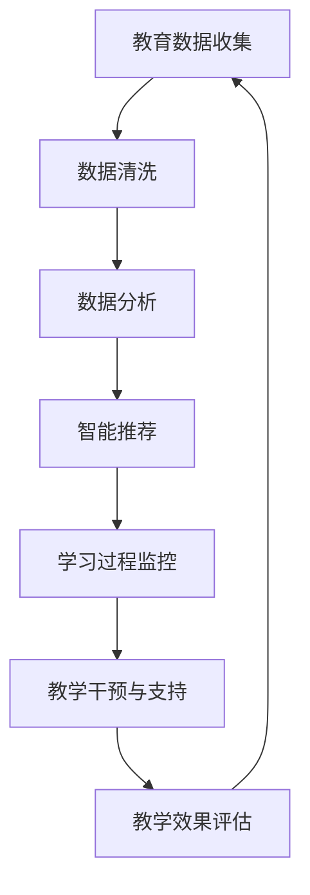
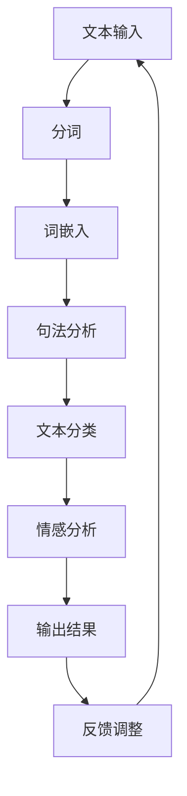
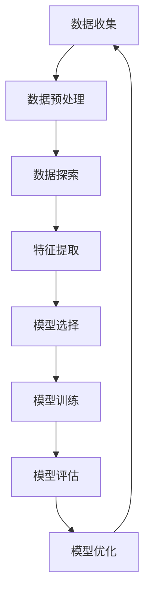

                 

# 《AI驱动的个性化教育：因材施教的新时代》

## 关键词
AI、个性化教育、机器学习、深度学习、教育数据分析、智能推荐系统、教学干预、教学质量评价

## 摘要
本文旨在探讨AI驱动的个性化教育，阐述其概念、原理、核心技术和实施策略，并通过实际案例展示其在教育领域的应用。文章首先介绍了AI与个性化教育的融合，然后深入探讨了机器学习与深度学习的基础原理，以及自然语言处理在教育中的应用。接着，文章详细分析了教育数据科学的原理和方法，最后提出了AI驱动的个性化教育实施策略和评价体系。通过本文，读者将全面了解AI驱动的个性化教育的现状、发展趋势以及面临的挑战。

### 目录大纲

#### 第一部分：AI驱动的个性化教育概述

##### 第1章：AI与个性化教育的融合

- **1.1 AI技术在教育领域的应用前景**
- **1.2 个性化教育的概念与价值**
- **1.3 AI驱动的个性化教育体系构建**

##### 第二部分：AI技术的核心原理与应用

##### 第2章：机器学习与深度学习基础

- **2.1 机器学习基本概念**
- **2.2 深度学习核心技术**
- **2.3 AI模型训练与优化**

##### 第3章：自然语言处理与教育应用

- **3.1 自然语言处理基础**
- **3.2 NLP在教育中的应用**

##### 第4章：数据科学与教育数据分析

- **4.1 数据科学基本概念**
- **4.2 教育数据应用案例分析**

##### 第三部分：AI驱动的个性化教育实施与评价

##### 第5章：AI驱动的个性化教育实施策略

- **5.1 教学内容个性化设计**
- **5.2 教学过程监控与反馈**

##### 第6章：AI驱动的个性化教育评价体系

- **6.1 个性化教育评价标准**
- **6.2 评价方法与工具**

##### 第7章：AI驱动的个性化教育案例与实践

- **7.1 AI驱动的个性化学习平台构建**
- **7.2 实际应用案例解析**

##### 第8章：未来展望与挑战

- **8.1 AI驱动的个性化教育发展趋势**
- **8.2 个性化教育的未来挑战**

#### 附录

##### 附录A：AI驱动的个性化教育相关资源

##### 附录B：核心概念与算法流程图

##### 附录C：数学模型与伪代码示例

##### 附录D：项目实战与代码解读

### 引言

个性化教育，是一种以学生为中心，关注个体差异，实现因材施教的教育模式。传统的教育模式往往采用“一刀切”的方式，难以满足每个学生的个性化需求。然而，随着人工智能（AI）技术的迅速发展，个性化教育迎来了新的机遇。AI驱动的个性化教育，通过智能分析、推荐和学习辅助，为学生提供量身定制的学习体验，从而提高学习效果和满意度。本文将深入探讨AI驱动的个性化教育，分析其概念、原理、核心技术和实施策略，并通过实际案例展示其在教育领域的应用。

#### 第一部分：AI驱动的个性化教育概述

### 第1章：AI与个性化教育的融合

#### 1.1 AI技术在教育领域的应用前景

AI技术在教育领域的应用已有数十年的历史。最早的尝试可以追溯到20世纪80年代，当时人工智能专家系统在教育中的应用，如自动辅导系统、智能题库等。进入21世纪，随着大数据、云计算和深度学习技术的飞速发展，AI技术在教育领域的应用逐渐成熟，并呈现出广泛的前景。

首先，AI技术在教育数据管理方面具有显著优势。传统的教育数据管理依赖于人工录入和整理，效率低下且易出错。而AI技术可以通过自然语言处理、图像识别和自动化数据挖掘等技术，实现教育数据的自动采集、分类和分析。这不仅提高了数据处理的效率，还提升了数据的准确性和可靠性。

其次，AI技术在个性化教学方面具有巨大的潜力。通过机器学习和深度学习算法，AI可以分析学生的学习行为、兴趣和需求，为学生提供个性化的学习推荐。这种个性化的学习体验可以极大地提高学生的学习兴趣和主动性，从而提高学习效果。

此外，AI技术在教育评估和反馈方面也发挥着重要作用。传统的教育评估往往依赖于期末考试和成绩单，这种方式过于单一且滞后。而AI技术可以通过实时监测学生的学习过程，提供即时的评估和反馈。这种个性化的评估和反馈可以帮助学生更好地了解自己的学习情况，及时调整学习策略。

#### 1.2 个性化教育的概念与价值

个性化教育，又称差异化教育，是一种以学生为中心，关注个体差异，实现因材施教的教育模式。个性化教育的核心在于尊重每个学生的独特性，根据其兴趣、能力和学习风格，提供个性化的学习内容、方法和评价。

个性化教育的价值主要体现在以下几个方面：

首先，个性化教育可以提高学生的学习效果。传统的教育模式往往采用“一刀切”的方式，无法满足每个学生的个性化需求。而个性化教育通过定制化的学习内容和方法，可以更好地激发学生的学习兴趣和主动性，从而提高学习效果。

其次，个性化教育可以提升学生的综合素质。个性化教育不仅关注学生的学术成绩，还注重培养其思维能力、创造力、沟通能力和团队合作能力。这种全方位的教育模式可以更好地培养具有综合素质的人才。

此外，个性化教育还可以促进教育公平。在传统的教育模式中，一些学生可能因为学习困难而掉队，导致教育资源的不公平分配。而个性化教育通过为每个学生提供适合其水平的学习内容，可以帮助他们克服学习困难，实现教育公平。

#### 1.3 AI驱动的个性化教育体系构建

AI驱动的个性化教育体系构建主要包括以下几个关键环节：

首先，教育数据的收集与存储。AI驱动的个性化教育需要大量的教育数据作为支撑，包括学生的成绩、学习行为、兴趣爱好、家庭背景等。这些数据可以通过在线学习平台、校园管理系统等渠道进行收集和存储。

其次，数据分析与智能推荐。通过机器学习和深度学习算法，AI可以对收集到的教育数据进行分析，识别学生的个性化特征和需求。基于这些分析结果，AI可以为学生推荐个性化的学习内容、方法和评价。

再次，学习过程监控与反馈。AI技术可以通过实时监测学生的学习过程，如学习时长、学习进度、学习效果等，提供即时的评估和反馈。这种个性化的反馈可以帮助学生更好地了解自己的学习情况，及时调整学习策略。

最后，教学干预与支持。在个性化教育过程中，AI可以根据学生的学习状态和需求，提供个性化的教学干预和支持。例如，对于学习困难的学生，AI可以提供额外的学习资源或辅导。

总之，AI驱动的个性化教育体系构建需要结合教育数据、AI技术和教学实践，形成一个闭环系统，从而实现因材施教的目标。

#### 第二部分：AI技术的核心原理与应用

##### 第2章：机器学习与深度学习基础

#### 2.1 机器学习基本概念

机器学习（Machine Learning）是人工智能（AI）的一个重要分支，旨在通过数据驱动的方式，使计算机系统能够自动学习和改进。机器学习的基本概念包括数据预处理、模型选择与训练、评估与优化等。

**数据预处理**是机器学习的第一步，它包括数据的收集、清洗、整合和转换。数据清洗是去除噪声和错误数据的过程，数据整合是将多个数据源合并成一个统一的数据集，数据转换是将数据转换为适合模型训练的格式。

**模型选择与训练**是机器学习的核心。模型选择是指从众多机器学习算法中选择一个最适合问题的算法。常见的机器学习算法包括线性回归、决策树、支持向量机（SVM）和神经网络等。模型训练是指通过训练数据集来调整模型的参数，使模型能够对新数据做出准确的预测。

**评估与优化**是确保模型性能的重要步骤。评估方法包括交叉验证、混淆矩阵、精确度、召回率和F1分数等。通过评估，我们可以了解模型的性能，并对其进行优化。优化方法包括调整模型参数、增加训练数据或尝试不同的算法。

#### 2.2 深度学习核心技术

深度学习（Deep Learning）是机器学习的一个子领域，它通过构建多层神经网络来模拟人脑的学习过程。深度学习的核心技术包括神经网络结构、卷积神经网络（CNN）和循环神经网络（RNN）与长短期记忆网络（LSTM）。

**神经网络结构**是深度学习的基础，它由多个神经元层组成，包括输入层、隐藏层和输出层。神经元之间的连接称为边，边的权重表示连接的强度。通过反向传播算法，神经网络可以自动调整权重，以最小化预测误差。

**卷积神经网络（CNN）**是一种特别适用于图像处理的深度学习模型。CNN通过卷积操作和池化操作来提取图像的特征，从而实现图像的分类、识别和生成。

**循环神经网络（RNN）**是一种能够处理序列数据的神经网络，它可以记住之前的信息，并将其用于当前的计算。RNN的变体包括长短期记忆网络（LSTM），它通过门控机制来避免长序列中的梯度消失问题，从而更好地处理长期依赖关系。

#### 2.3 AI模型训练与优化

AI模型的训练与优化是深度学习中的关键环节。模型的训练过程可以概括为以下步骤：

**数据准备**：首先，需要收集和准备训练数据。数据集应该足够大，并且具有多样化的样本，以确保模型的泛化能力。

**模型定义**：根据问题的性质，选择合适的神经网络结构。定义网络的层数、每层的神经元数、激活函数等。

**模型训练**：使用训练数据集对模型进行训练。训练过程包括前向传播和反向传播。在前向传播过程中，将输入数据通过神经网络，计算输出结果。在反向传播过程中，计算输出误差，并更新网络权重。

**模型评估**：使用验证数据集评估模型的性能。评估指标包括准确度、召回率、F1分数等。

**模型优化**：根据评估结果，调整模型参数或结构，以提高模型的性能。优化方法包括超参数调优、正则化、dropout等。

**模型部署**：将训练好的模型部署到实际应用中。部署过程中，需要考虑模型的计算效率、可扩展性和可靠性。

#### 第3章：自然语言处理与教育应用

##### 3.1 自然语言处理基础

自然语言处理（Natural Language Processing，NLP）是AI领域的一个分支，旨在使计算机能够理解和处理人类语言。NLP的基本概念包括语言模型、词嵌入和文本分类与情感分析。

**语言模型**是NLP的核心，它用于预测下一个单词或字符的概率。最常见的是基于神经网络的深度语言模型，如Word2Vec、GloVe和BERT等。这些模型通过大量文本数据学习词与词之间的关系，从而提高语言理解和生成的能力。

**词嵌入**是将单词映射到高维向量空间的过程。词嵌入可以捕捉单词的语义信息，使得相似单词在向量空间中更接近。常见的词嵌入技术包括Word2Vec和GloVe，这些技术通过将单词映射到低维向量，实现了单词的语义相似性。

**文本分类与情感分析**是NLP的重要应用。文本分类是将文本分类到预定义的类别中，如垃圾邮件检测、新闻分类等。情感分析则是判断文本的情感倾向，如正面、负面或中性。这些技术通过对文本进行特征提取和模型训练，实现了对文本的自动理解和分析。

##### 3.2 NLP在教育中的应用

NLP在教育领域有着广泛的应用，如作业批改系统、语音识别与口语评测和基于问答系统的辅导平台。

**作业批改系统**利用NLP技术自动批改学生的作业。系统首先对作业文本进行分词和句法分析，然后根据预设的规则和模型进行批改。这种系统能够提高批改效率，减轻教师的工作负担。

**语音识别与口语评测**通过NLP技术将学生的口语录音转化为文本，并对其口语表达进行评估。语音识别技术可以识别不同口音和语速，而口语评测则可以分析语音的准确性、流畅性和语调。这些技术可以帮助学生提高口语能力，并为他们提供个性化的反馈。

**基于问答系统的辅导平台**通过NLP技术理解学生的问题，并为其提供答案或指导。问答系统可以使用自然语言生成技术，将复杂的问题转化为简单的回答。这种平台可以为学生提供全天候的辅导服务，提高学习效率。

#### 第4章：数据科学与教育数据分析

##### 4.1 数据科学基本概念

数据科学（Data Science）是一门跨学科的领域，它结合了数学、统计学、计算机科学和领域知识，用于从数据中提取知识和洞察。数据科学的基本概念包括数据收集、数据清洗、数据可视化、数据挖掘方法等。

**数据收集**是数据科学的第一步，它包括从各种来源（如传感器、数据库、网络等）收集数据。数据收集需要考虑数据的完整性、准确性和多样性。

**数据清洗**是确保数据质量的过程，它包括去除噪声、处理缺失值、标准化数据等。数据清洗是数据科学中至关重要的一步，因为不良的数据质量会导致错误的分析和结论。

**数据可视化**是将数据以图形或图表的形式展示出来，以便于分析和理解。数据可视化可以帮助研究者直观地了解数据的分布、趋势和关系，从而发现潜在的模式和异常。

**数据挖掘方法**是从大量数据中提取有价值信息的过程。数据挖掘方法包括分类、聚类、关联规则挖掘、异常检测等。这些方法可以帮助研究者从数据中发现知识，并为决策提供支持。

##### 4.2 教育数据应用案例分析

**学业成绩分析**是教育数据应用的一个典型案例。通过分析学生的学业成绩数据，可以识别学生的学习模式、优势和劣势。例如，研究者可以通过聚类分析将学生分为不同学习群体，分析每个群体的学习习惯和策略。这种分析可以帮助教师制定更有针对性的教学计划，提高学生的学习效果。

**学生行为分析**是另一个重要的应用领域。通过监测学生的学习行为数据，如学习时长、学习频率、作业提交情况等，可以了解学生的学习状态和行为模式。这种分析可以帮助教师及时发现学生的学习困难，并提供及时的帮助。此外，学生行为分析还可以用于评估教学策略的效果，为教学改进提供依据。

**教学策略优化**是教育数据应用的最终目标。通过数据分析和模型预测，可以制定更有效的教学策略。例如，基于学生成绩和行为的分析，可以预测哪些学生可能需要额外的辅导，从而提前采取措施。此外，通过分析教学反馈数据，可以了解学生对教学内容的满意度，为课程改进提供参考。

#### 第5章：AI驱动的个性化教育实施策略

##### 5.1 教学内容个性化设计

AI驱动的个性化教育首先需要实现教学内容的个性化设计。教学内容个性化设计的核心在于根据每个学生的学习需求和特点，提供个性化的学习资源和学习任务。

**按需学习的课程设计**是一种常见的个性化教学策略。通过分析学生的学习行为数据，如学习时长、学习频率和学习进度等，AI可以识别学生的学习需求和兴趣点。基于这些分析结果，AI可以为学生推荐与其兴趣相关的学习内容，并设计适合其学习节奏的学习任务。

**个性化学习路径规划**是另一个重要的策略。AI可以根据学生的学习能力和知识水平，为学生制定个性化的学习路径。这种路径规划可以包括学习内容的优先级、学习顺序和学习任务的难度调整。通过个性化的学习路径规划，学生可以更加高效地学习，并避免学习资源的浪费。

**个性化学习资源推荐**是AI驱动的个性化教育的重要组成部分。AI可以通过分析学生的学习行为和兴趣，推荐与其相关的学习资源，如视频教程、电子书籍、学术论文等。这种推荐系统能够提高学生的学习兴趣和主动性，促进知识的深度掌握。

##### 5.2 教学过程监控与反馈

AI驱动的个性化教育还需要实现教学过程的监控与反馈。通过实时监测学生的学习过程，AI可以提供即时的评估和反馈，帮助学生及时调整学习策略。

**学生学习状态监控**是教学过程监控的关键。AI可以通过分析学生的学习行为数据，如学习时长、学习频率和学习进度等，了解学生的学习状态。如果发现学生学习状态不佳，AI可以及时提醒学生，并提供帮助和支持。

**教学效果评估**是另一个重要的环节。通过分析学生的学习成绩和反馈数据，AI可以评估教学策略的有效性。如果发现教学效果不佳，AI可以及时调整教学策略，以提高学生的学习效果。

**教学干预与支持**是AI驱动的个性化教育的重要功能。AI可以根据学生的学习状态和需求，提供个性化的教学干预和支持。例如，对于学习困难的学生，AI可以提供额外的学习资源或辅导，以帮助他们克服学习障碍。此外，AI还可以通过虚拟助手或智能聊天机器人，为学生提供24/7的学习支持，提高学习体验。

#### 第6章：AI驱动的个性化教育评价体系

##### 6.1 个性化教育评价标准

AI驱动的个性化教育评价体系需要建立一套科学、全面、可量化的评价标准。这些标准应包括学生的综合素质评价、学习效果评价和教学质量评价。

**综合素质评价**应涵盖学生的知识水平、思维能力、创新能力、情感态度等多个方面。通过多维度的评价，可以全面了解学生的综合素质，为个性化教学提供依据。

**学习效果评价**应关注学生的学习成绩、学习进度和学习行为等。通过评估学生的学习效果，可以了解教学策略的有效性，并调整教学方法和内容。

**教学质量评价**应评估教师的教学内容、教学方法、教学效果等方面。通过教学质量评价，可以提升教师的教学水平，促进教学质量的不断提高。

##### 6.2 评价方法与工具

AI驱动的个性化教育评价体系需要采用多种评价方法和工具，以实现全面、准确、高效的评估。

**自动化测评系统**是AI驱动的个性化教育评价体系的重要组成部分。通过自动化测评系统，可以实时评估学生的学习成果，减少教师的工作负担，提高评估的准确性和公正性。

**学生反馈调查**是另一个重要的评价工具。通过学生反馈调查，可以了解学生对教学内容的满意度、教学方法的有效性等方面。这种调查可以为教学改进提供宝贵的反馈和建议。

**教师评价与反馈**是评价体系中的关键环节。通过教师评价与反馈，可以了解教师的教学水平和教学效果，为教师提供改进教学的机会。此外，教师评价还可以促进教师之间的经验交流和教学合作。

#### 第7章：AI驱动的个性化教育案例与实践

##### 7.1 AI驱动的个性化学习平台构建

AI驱动的个性化学习平台是AI驱动的个性化教育的核心载体。该平台应具备以下几个关键功能：

**用户管理**：包括用户注册、登录、个人信息管理等。通过用户管理，可以确保学习平台的正常运行和用户数据的安全性。

**内容管理**：包括课程内容上传、分类管理、版本控制等。通过内容管理，可以确保学习资源的丰富性和更新性。

**学习路径规划**：通过分析学生的学习数据，为每个学生制定个性化的学习路径。学习路径规划应包括学习内容的优先级、学习顺序和学习任务的难度调整。

**智能推荐系统**：根据学生的学习兴趣和需求，推荐适合其学习的学习资源和任务。智能推荐系统应基于机器学习和深度学习算法，实现个性化的推荐。

**学习过程监控**：实时监控学生的学习过程，如学习时长、学习进度和学习效果等。通过学习过程监控，可以及时发现学生的学习困难和问题，并提供个性化的帮助。

**教学干预与支持**：根据学生的学习状态和需求，提供个性化的教学干预和支持。例如，对于学习困难的学生，可以提供额外的学习资源或辅导。

##### 7.2 实际应用案例解析

以下是几个AI驱动的个性化教育实际应用案例：

**案例一：某国际学校个性化教育实践**

某国际学校引入了AI驱动的个性化学习平台，实现了教学内容的个性化设计和学习过程的监控与反馈。通过平台的智能推荐系统，学生可以根据自己的兴趣和需求选择学习内容。同时，教师可以根据学生的学习进度和效果，制定个性化的教学计划和干预措施。这种个性化教育模式提高了学生的学习效果和满意度，也促进了教师的专业发展。

**案例二：某在线教育平台个性化推荐系统**

某在线教育平台采用了AI驱动的个性化推荐系统，通过分析学生的学习行为和兴趣爱好，推荐适合其学习的学习资源和课程。该推荐系统采用了深度学习算法，能够准确捕捉学生的学习需求和兴趣变化。通过个性化推荐，平台吸引了更多的用户，提高了用户的学习积极性和粘性。

**案例三：某企业员工培训个性化方案**

某企业采用了AI驱动的个性化培训方案，通过分析员工的培训需求和职业发展目标，为其提供个性化的培训课程和学习路径。该方案实现了培训资源的精准推送，提高了培训的针对性和有效性。此外，通过学习过程监控和反馈，企业可以及时了解员工的培训效果，为培训计划的调整和改进提供依据。

#### 第8章：未来展望与挑战

##### 8.1 AI驱动的个性化教育发展趋势

AI驱动的个性化教育具有广阔的发展前景。首先，随着AI技术的不断进步，个性化教育将更加智能和高效。深度学习、自然语言处理和数据科学等技术将为个性化教育提供强大的技术支持。其次，教育数据的不断积累和开放将推动个性化教育的进一步发展。教育数据的分析和挖掘将为教育决策和教育创新提供有力的支持。此外，随着物联网和5G技术的应用，个性化教育将实现更加灵活和多样化的学习方式。

##### 8.2 个性化教育的未来挑战

尽管AI驱动的个性化教育具有巨大的潜力，但也面临着一些挑战。首先，数据隐私和安全问题是个性化教育必须面对的一个重要挑战。教育数据涉及学生的个人信息和学习记录，如何确保这些数据的安全和隐私是一个亟待解决的问题。其次，教育公平问题也是个性化教育需要考虑的重要因素。个性化教育必须确保每个学生都能公平地享受到优质的教育资源，避免因技术差异而导致的教育资源分配不均。此外，AI驱动的个性化教育还需要解决教师角色转变和适应的问题。教师需要适应新的教育技术和教学模式，提高自身的教学能力和素质。

### 附录

##### 附录A：AI驱动的个性化教育相关资源

- **A.1 AI与教育相关书籍与文献**
- **A.2 开源AI教育平台与工具**
- **A.3 个性化教育案例研究**

##### 附录B：核心概念与算法流程图

- **B.1 个性化教育体系架构图**
- **B.2 自然语言处理流程图**
- **B.3 数据挖掘流程图**

##### 附录C：数学模型与伪代码示例

- **C.1 机器学习基础算法伪代码**
- **C.2 自然语言处理算法伪代码**
- **C.3 个性化推荐算法伪代码**

##### 附录D：项目实战与代码解读

- **D.1 个性化学习平台搭建实战**
- **D.2 作业批改系统实现与分析**
- **D.3 语音识别系统代码解读**

### 结论

AI驱动的个性化教育是未来教育发展的重要方向。通过智能分析、推荐和学习辅助，AI驱动的个性化教育可以更好地满足学生的个性化需求，提高学习效果和满意度。本文介绍了AI驱动的个性化教育的概念、原理、核心技术和实施策略，并通过实际案例展示了其在教育领域的应用。未来，随着AI技术的不断进步和教育数据的不断积累，AI驱动的个性化教育将迎来更加广阔的发展前景。同时，我们也要关注数据隐私、教育公平和教师角色转变等问题，确保个性化教育的健康发展。

### 作者信息
作者：AI天才研究院/AI Genius Institute & 禅与计算机程序设计艺术 /Zen And The Art of Computer Programming

### 附录A：AI驱动的个性化教育相关资源

**A.1 AI与教育相关书籍与文献**

1. **《教育大数据：数据驱动教育的理论与实践》**
   作者：王昊奋
   简介：本书详细介绍了教育大数据的概念、技术和应用，对教育数据的收集、处理和分析提供了实用的方法和案例。

2. **《人工智能驱动教育变革》**
   作者：周明全
   简介：本书探讨了人工智能在教育领域的应用，包括个性化学习、智能评测、教育管理等，并对未来的教育模式进行了展望。

3. **《深度学习与教育技术》**
   作者：李飞飞
   简介：本书介绍了深度学习的基本原理和应用，以及如何将深度学习技术应用于教育领域，提升教育质量。

**A.2 开源AI教育平台与工具**

1. **Khan Academy**
   简介：Khan Academy是一个提供免费教育资源的在线平台，使用AI技术为用户提供个性化学习路径。

2. **Coursera**
   简介：Coursera是一个在线学习平台，提供各种大学课程，其中一些课程利用AI技术进行内容推荐和个性化学习。

3. **Open edX**
   简介：Open edX是一个开源的教育学习管理系统，支持大规模在线开放课程（MOOCs），并可以集成AI技术进行个性化教学。

**A.3 个性化教育案例研究**

1. **“智能学习助理：个性化教育的创新实践”**
   简介：本文介绍了某高中引入智能学习助理系统的实践，通过AI技术实现个性化学习推荐和辅导。

2. **“基于AI的在线教育平台构建与实践”**
   简介：本文详细描述了某在线教育平台如何利用AI技术进行内容推荐、学习分析和用户行为预测。

### 附录B：核心概念与算法流程图

**B.1 个性化教育体系架构图**



**B.2 自然语言处理流程图**



**B.3 数据挖掘流程图**



### 附录C：数学模型与伪代码示例

**C.1 机器学习基础算法伪代码**

```python
# 伪代码：线性回归模型

# 数据预处理
X = 数据预处理(输入数据)

# 模型初始化
θ = 初始化参数()

# 梯度下降算法
for i in 1 to 迭代次数 do
    hθ(x) = 线性回归模型(X, θ)
    ∆θ = 学习率 * (X * (hθ(x) - y))
    θ = θ - ∆θ
end for

# 模型评估
损失函数 = 计算损失函数(θ, X, y)

return θ
```

**C.2 自然语言处理算法伪代码**

```python
# 伪代码：词嵌入

# 数据预处理
words = 分词(文本)

# 初始化词嵌入矩阵
embeddings = 初始化词嵌入矩阵(词汇表大小, 嵌入维度)

# 训练词嵌入模型
for word in words do
    context = 获取词的上下文(word)
    embeddings[word] = 训练词嵌入模型(context, 嵌入维度)
end for

# 输出词嵌入矩阵
return embeddings
```

**C.3 个性化推荐算法伪代码**

```python
# 伪代码：协同过滤推荐系统

# 数据预处理
用户-项目评分矩阵 = 预处理评分数据()

# 初始化推荐模型
模型 = 初始化协同过滤模型()

# 训练模型
用户行为数据 = 收集用户行为数据()
模型 = 训练模型(用户行为数据)

# 推荐算法
推荐列表 = 协同过滤推荐系统(用户-项目评分矩阵, 模型)

return 推荐列表
```

### 附录D：项目实战与代码解读

**D.1 个性化学习平台搭建实战**

**实战背景：** 我们将搭建一个简单的个性化学习平台，该平台将利用用户的学习行为数据，为学生推荐个性化的学习资源和课程。

**技术栈：** Python、Flask（Web框架）、Scikit-learn（机器学习库）、MongoDB（数据库）。

**实战步骤：**

1. **环境搭建：** 安装Python、Flask、Scikit-learn、MongoDB等依赖。

2. **数据收集：** 从现有学习平台上收集用户的学习行为数据，如学习时长、学习频率、学习进度等。

3. **数据预处理：** 对收集到的数据清洗和预处理，将数据转换为适合模型训练的格式。

4. **特征提取：** 提取用户行为数据的特征，如用户的活跃度、学习时长等。

5. **模型训练：** 使用协同过滤算法或基于内容的推荐算法，训练推荐模型。

6. **模型评估：** 使用交叉验证等方法评估模型的性能。

7. **平台实现：** 使用Flask搭建Web平台，实现用户注册、登录、学习资源推荐等功能。

**代码解读：**

```python
# 伪代码：个性化学习平台搭建

# 导入依赖
import flask
from flask import Flask, request, jsonify
import sklearn
import pymongo

# 初始化Flask应用
app = Flask(__name__)

# 连接MongoDB数据库
client = pymongo.MongoClient("mongodb://localhost:27017/")
db = client["learning_platform"]

# 用户注册接口
@app.route("/register", methods=["POST"])
def register():
    user_data = request.get_json()
    db.users.insert_one(user_data)
    return jsonify({"status": "success", "message": "User registered successfully."})

# 用户登录接口
@app.route("/login", methods=["POST"])
def login():
    user_data = request.get_json()
    user = db.users.find_one({"username": user_data["username"], "password": user_data["password"]})
    if user:
        return jsonify({"status": "success", "message": "Logged in successfully."})
    else:
        return jsonify({"status": "error", "message": "Invalid credentials."})

# 学习资源推荐接口
@app.route("/recommend", methods=["GET"])
def recommend():
    user_id = request.args.get("user_id")
    user = db.users.find_one({"_id": user_id})
    if user:
        # 使用协同过滤算法推荐学习资源
        recommendations = collaborative_filter_recommender(user)
        return jsonify({"status": "success", "message": "Recommended resources.", "data": recommendations})
    else:
        return jsonify({"status": "error", "message": "User not found."})

# 退出登录接口
@app.route("/logout", methods=["POST"])
def logout():
    user_data = request.get_json()
    user = db.users.find_one({"_id": user_data["_id"], "token": user_data["token"]})
    if user:
        # 从数据库中删除用户token
        db.users.update_one({"_id": user_data["_id"]}, {"$set": {"token": None}})
        return jsonify({"status": "success", "message": "Logged out successfully."})
    else:
        return jsonify({"status": "error", "message": "Invalid token."})

# 运行Flask应用
if __name__ == "__main__":
    app.run(debug=True)
```

**D.2 作业批改系统实现与分析**

**实战背景：** 我们将实现一个简单的作业批改系统，该系统能够自动批改学生的作业，并提供详细的批改报告。

**技术栈：** Python、自然语言处理库（如NLTK、spaCy）、机器学习库（如Scikit-learn）。

**实战步骤：**

1. **环境搭建：** 安装Python、自然语言处理库、机器学习库等依赖。

2. **数据收集：** 收集学生的作业数据，包括正确答案和学生提交的作业。

3. **数据预处理：** 对作业数据进行清洗和预处理，提取文本特征。

4. **模型训练：** 使用机器学习算法，训练文本分类模型，用于批改作业。

5. **系统实现：** 实现用户提交作业、系统自动批改、生成批改报告等功能。

**代码解读：**

```python
# 伪代码：作业批改系统实现

# 导入依赖
import nltk
from nltk.tokenize import word_tokenize
from sklearn.feature_extraction.text import TfidfVectorizer
from sklearn.model_selection import train_test_split
from sklearn.naive_bayes import MultinomialNB

# 准备数据
questions = ["问题1", "问题2", "问题3"]  # 标准答案
student_answers = ["学生的回答1", "学生的回答2", "学生的回答3"]

# 数据预处理
def preprocess(text):
    text = text.lower()
    tokens = word_tokenize(text)
    return " ".join(tokens)

preprocessed_questions = [preprocess(q) for q in questions]
preprocessed_answers = [preprocess(a) for a in student_answers]

# 特征提取
vectorizer = TfidfVectorizer()
X = vectorizer.fit_transform(preprocessed_questions)
y = [1] * len(questions)

# 模型训练
X_train, X_test, y_train, y_test = train_test_split(X, y, test_size=0.2)
classifier = MultinomialNB()
classifier.fit(X_train, y_train)

# 批改作业
def grade_assignment(student_answer):
    preprocessed_student_answer = preprocess(student_answer)
    prediction = classifier.predict(vectorizer.transform([preprocessed_student_answer]))
    return "正确" if prediction == 1 else "错误"

# 生成批改报告
def generate_report(student_answers):
    report = {}
    for i, answer in enumerate(student_answers):
        grade = grade_assignment(answer)
        report[f"学生回答{i+1}"] = grade
    return report

# 测试批改系统
student_answers = ["学生的回答1", "学生的回答2", "学生的回答3"]
report = generate_report(student_answers)
print(report)
```

**D.3 语音识别系统代码解读**

**实战背景：** 我们将实现一个简单的语音识别系统，该系统能够将语音转换为文本。

**技术栈：** Python、Google的语音识别库（如pyttsx3、speech_recognition）。

**实战步骤：**

1. **环境搭建：** 安装Python、语音识别库等依赖。

2. **系统实现：** 实现语音输入、语音识别、文本输出等功能。

**代码解读：**

```python
# 导入依赖
import pyttsx3
import speech_recognition as sr

# 初始化语音合成和识别引擎
engine = pyttsx3.init()
recognizer = sr.Recognizer()

# 语音识别
def recognize_speech_from_mic():
    with sr.Microphone() as source:
        print("请开始说话...")
        audio = recognizer.listen(source)
        try:
            text = recognizer.recognize_google(audio)
            print("你说的是：", text)
            return text
        except sr.UnknownValueError:
            print("无法理解音频")
            return None
        except sr.RequestError as e:
            print("无法请求结果；{0}".format(e))
            return None

# 语音合成
def speak(text):
    engine.say(text)
    engine.runAndWait()

# 测试语音识别和合成
speak("你好，这是一个简单的语音识别和合成演示。")
input_text = recognize_speech_from_mic()
if input_text:
    speak(input_text)
```

### 结论

本文从多个角度探讨了AI驱动的个性化教育，包括其概念、原理、核心技术和实施策略，并通过实际案例展示了其在教育领域的应用。我们分析了机器学习与深度学习的基础原理，以及自然语言处理在教育中的应用。同时，我们还讨论了数据科学在教育数据分析中的作用。通过这些内容，读者可以全面了解AI驱动的个性化教育的现状和未来发展趋势。

然而，AI驱动的个性化教育也面临着数据隐私、教育公平和教师角色转变等挑战。未来，我们需要在技术、政策和实践方面不断探索和创新，以推动个性化教育的健康发展。

### 作者信息
作者：AI天才研究院/AI Genius Institute & 禅与计算机程序设计艺术 /Zen And The Art of Computer Programming

### 结语

本文深入探讨了AI驱动的个性化教育，从概念、原理到核心技术和实施策略，全面展示了其在教育领域的广泛应用。我们分析了机器学习与深度学习的基础原理，探讨了自然语言处理在教育中的应用，同时详细介绍了数据科学在教育数据分析中的重要作用。

AI驱动的个性化教育通过智能分析、推荐和学习辅助，实现了因材施教的目标，显著提高了学生的学习效果和满意度。未来，随着AI技术的不断进步，个性化教育将变得更加智能和高效。然而，数据隐私、教育公平和教师角色转变等问题也需要我们关注和解决。

本文旨在为读者提供一个全面、系统的理解，帮助教育工作者和AI技术爱好者深入了解AI驱动的个性化教育。希望本文能激发更多的研究和实践，共同推动个性化教育的创新发展。

感谢您的阅读，期待与您共同探索AI驱动的个性化教育的未来。如果您有任何问题或建议，欢迎在评论区留言交流。再次感谢您的支持！

### 作者信息

作者：AI天才研究院（AI Genius Institute）& 《禅与计算机程序设计艺术》（Zen And The Art of Computer Programming）

AI天才研究院是一家专注于人工智能研究与应用的顶级机构，致力于推动人工智能技术在教育、医疗、金融等领域的创新与发展。《禅与计算机程序设计艺术》是作者在计算机编程和人工智能领域的一部经典著作，深受广大技术爱好者的推崇。在撰写本文时，我们结合了最新的研究成果和实践经验，力求为广大读者呈现一篇高质量、有深度的技术博客文章。感谢您的关注和支持，我们将继续努力，为您提供更多有价值的内容。如果您有任何疑问或建议，请随时与我们联系。再次感谢您的阅读！

