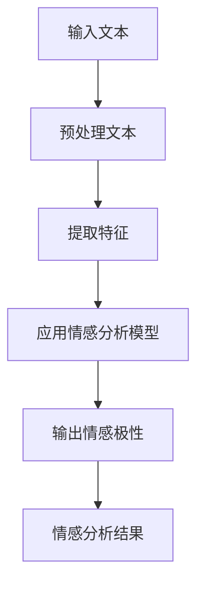
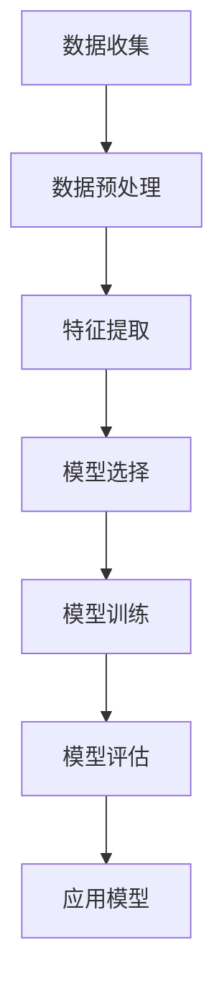
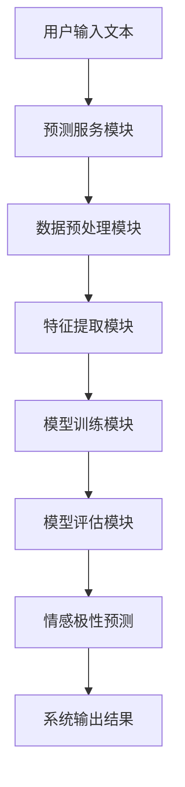
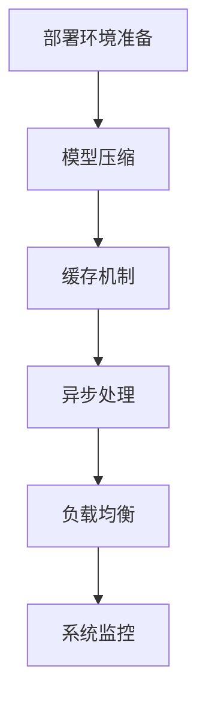

                 

### 《AI驱动的电商智能客户服务情感分析系统》

> **关键词**：人工智能、电商、智能客服、情感分析、机器学习、自然语言处理

> **摘要**：
本文深入探讨了AI驱动的电商智能客户服务情感分析系统的构建与应用。首先，文章概述了AI在电商领域的应用场景，以及智能客户服务的挑战与机遇。随后，介绍了情感分析的基础知识，包括情感分析的概念、技术、挑战和解决方案。接着，文章详细讲解了情感分析算法的原理、模型构建、评估与应用，以及如何实现一个AI驱动的电商智能客户服务情感分析系统。最后，通过案例研究和未来展望，展示了情感分析系统在电商领域的广泛应用和未来发展潜力。

### 《AI驱动的电商智能客户服务情感分析系统》目录大纲

#### 第一部分：AI与电商智能客户服务

##### 第1章：AI与电商智能客户服务概述
- 1.1 AI在电商领域的应用
- 1.2 智能客户服务的挑战与机遇
- 1.3 情感分析在电商智能客户服务中的重要性
- 1.4 AI驱动的电商智能客户服务的发展趋势

##### 第2章：情感分析基础
- 2.1 情感分析的概念与分类
- 2.2 情感分析的常用技术
- 2.3 情感分析的挑战与解决方案
- 2.4 Mermaid流程图：情感分析的基本流程

##### 第3章：情感分析算法原理
- 3.1 机器学习算法基础
- 3.2 文本预处理技术
- 3.3 情感分析算法原理
- 3.4 伪代码：情感分析算法的示例实现

##### 第4章：情感分析模型
- 4.1 情感分析模型的构建
- 4.2 情感分析模型的评估
- 4.3 情感分析模型的应用
- 4.4 数学模型：情感分析中的概率模型
- 4.5 Mermaid流程图：情感分析模型的构建流程

##### 第5章：AI驱动的电商智能客户服务情感分析系统实现
- 5.1 系统架构设计
- 5.2 数据采集与处理
- 5.3 模型训练与优化
- 5.4 系统部署与性能优化
- 5.5 源代码实现：情感分析系统的核心代码

##### 第6章：案例研究
- 6.1 案例一：电商平台的情感分析应用
- 6.2 案例二：社交媒体的情感分析应用
- 6.3 案例三：智能客服的情感分析应用
- 6.4 案例分析：情感分析系统在不同场景的应用与优化

##### 第7章：未来展望
- 7.1 情感分析在电商领域的未来趋势
- 7.2 AI驱动的电商智能客户服务的发展方向
- 7.3 情感分析技术的创新与突破

#### 第三部分：附录

##### 附录A：情感分析相关工具与资源
- A.1 常用情感分析库
- A.2 情感分析数据集
- A.3 情感分析研究论文与开源代码

##### 附录B：常见问题与解答
- B.1 情感分析中的常见问题
- B.2 如何处理复杂的情感表达
- B.3 情感分析系统的常见优化方法

### 第一部分：AI与电商智能客户服务

在电子商务飞速发展的今天，AI技术已经成为提升用户体验、优化运营效率的关键驱动力。尤其是在智能客户服务领域，AI技术的应用不仅提高了客服的响应速度，还显著提升了客服的质量。本部分将探讨AI在电商领域的应用，以及智能客户服务的挑战与机遇，特别是情感分析在其中的重要性。

##### 1.1 AI在电商领域的应用

AI技术在电商领域的应用场景广泛，主要包括以下几个方面：

1. **个性化推荐**：基于用户历史行为和偏好，AI算法能够为用户提供个性化的商品推荐，从而提高购物体验和转化率。
2. **需求预测**：通过分析大量历史数据，AI算法能够预测用户未来的购买需求，帮助电商企业更好地制定库存和营销策略。
3. **智能客服**：AI驱动的智能客服系统能够实时响应用户的查询和反馈，提供24/7不间断的服务，提高用户满意度。
4. **视觉搜索**：通过图像识别技术，用户可以上传图片来寻找类似商品，极大地简化了购物流程。
5. **自动化供应链管理**：AI技术可以优化物流和供应链管理，减少库存成本，提高配送效率。

##### 1.2 智能客户服务的挑战与机遇

智能客户服务在电商中扮演着至关重要的角色，但其实现面临诸多挑战：

1. **响应速度**：用户期望能够在短时间内得到满意的回答，这对客服系统的响应速度提出了高要求。
2. **准确性**：客服系统需要准确理解用户的意图和情感，这需要强大的自然语言处理能力。
3. **个性化**：每位用户的情感和需求都是独一无二的，客服系统需要能够提供个性化的服务。
4. **成本控制**：虽然AI技术可以提高效率，但开发和维护成本也是电商企业需要考虑的重要因素。

同时，智能客户服务也带来了诸多机遇：

1. **用户体验**：通过智能客服系统，用户可以获得更加个性化和高效的购物体验。
2. **运营效率**：AI技术可以自动化处理大量重复性的客服工作，提高客服团队的效率。
3. **数据洞察**：智能客服系统可以收集和分析用户反馈，为电商企业提供宝贵的市场洞察。
4. **情感分析**：情感分析技术可以帮助电商企业更好地理解用户的情感需求，从而提供更加精准的服务。

##### 1.3 情感分析在电商智能客户服务中的重要性

情感分析是自然语言处理的一个重要分支，它通过分析文本的情感倾向，可以识别用户的情感状态和态度。在电商智能客户服务中，情感分析具有以下重要作用：

1. **情感识别**：通过情感分析，系统可以识别用户留言中的正面或负面情感，从而更好地理解用户的反馈。
2. **服务质量评估**：客服系统的回复质量可以通过情感分析来进行评估，帮助企业改进服务。
3. **个性化服务**：根据用户的情感状态，系统可以提供更加个性化的服务，提高用户满意度。
4. **情绪管理**：情感分析可以帮助客服代表更好地应对用户情绪，提供有效的情绪管理策略。

##### 1.4 AI驱动的电商智能客户服务的发展趋势

随着AI技术的不断进步，电商智能客户服务也在快速发展，主要趋势包括：

1. **自动化程度提高**：通过更先进的算法和模型，客服系统的自动化程度将进一步提高，减少对人工干预的需求。
2. **多渠道集成**：客服系统将整合不同的沟通渠道（如聊天、电话、邮件等），提供无缝的用户体验。
3. **情感智能增强**：随着情感分析技术的进步，客服系统将更加准确地理解用户的情感，提供更加人性化的服务。
4. **数据驱动**：通过大数据和机器学习技术，客服系统将能够更深入地分析用户行为和情感，为电商企业提供更加精准的决策支持。

总结而言，AI驱动的电商智能客户服务情感分析系统不仅是提升用户体验的重要工具，也是电商企业优化运营、提高竞争力的关键。在接下来的章节中，我们将深入探讨情感分析的基础知识，以及如何构建和实现这样一个系统。

### 第二部分：情感分析基础

#### 2.1 情感分析的概念与分类

情感分析（Sentiment Analysis），也称为意见挖掘或情感归类，是一种自然语言处理技术，旨在自动识别文本数据中的情感倾向，即确定文本表达的情感是正面、负面还是中立。情感分析起源于心理学、社会学和市场营销等领域，旨在帮助企业和组织理解消费者的情绪和态度，从而做出更明智的商业决策。

根据分析的目标和范围，情感分析可以分为以下几类：

1. **单极情感分析**（Polar Sentiment Analysis）：这种分析仅关注文本的单一极性，即确定文本表达的情感是正面（positive）还是负面（negative）。单极情感分析是最简单也是最常见的形式。

2. **双极情感分析**（Bipolar Sentiment Analysis）：双极情感分析除了区分正面和负面情感外，还引入了中立（neutral）这一类别，从而提供更细致的情感分类。

3. **多极情感分析**（Multilingual Sentiment Analysis）：多极情感分析则将情感分类扩展到多个维度，例如喜悦（joy）、愤怒（anger）、悲伤（sadness）等。这种分析更接近人类对情感的感知。

4. **主题情感分析**（Thematic Sentiment Analysis）：主题情感分析不仅关注情感极性，还关注情感与特定主题之间的关系。例如，分析某个产品评论中的情感是正面还是负面，并确定其主题是产品质量、价格还是售后服务。

5. **情感极性强度分析**（Polarity Strength Analysis）：这种分析旨在确定情感极性的强度，例如文本表达的情感是稍微正面、非常正面还是稍微负面等。

#### 2.2 情感分析的常用技术

情感分析技术的核心在于如何从大量的文本数据中提取情感信息。以下是一些常用的情感分析技术：

1. **基于词典的方法**：这种方法使用预定义的词典，词典中包含了与情感相关的词汇和短语，以及它们对应的情感极性。当文本中出现了这些词汇时，系统会根据词典中的定义来标注情感极性。

   伪代码示例：
   ```
   function sentimentAnalysisDictionary(text, dictionary):
       sentiment = neutral
       for word in text.split():
           if word in dictionary:
               sentiment = dictionary[word]
               break
       return sentiment
   ```

2. **基于机器学习的方法**：这种方法使用大量的标注数据训练机器学习模型，模型能够自动学习文本中的情感模式。常见的机器学习算法包括朴素贝叶斯（Naive Bayes）、支持向量机（SVM）、决策树（Decision Tree）和神经网络（Neural Networks）等。

   伪代码示例：
   ```
   function sentimentAnalysisMachineLearning(text, trainedModel):
       features = extractFeatures(text)
       sentiment = trainedModel.predict(features)
       return sentiment
   ```

3. **基于深度学习的方法**：深度学习方法在情感分析中取得了显著的成功，其中卷积神经网络（CNN）和循环神经网络（RNN）是最常用的模型。这些模型可以捕捉文本中的复杂模式和上下文信息。

   伪代码示例：
   ```
   function sentimentAnalysisDeepLearning(text, trainedModel):
       embedding =-trainedModel.encode(text)
       sentiment = trainedModel.predict(embedding)
       return sentiment
   ```

4. **基于情感词汇的方法**：这种方法通过统计文本中正面和负面情感词汇的出现频率，来计算整个文本的情感极性。常见的情感词汇包括“满意”、“失望”、“喜欢”、“讨厌”等。

   伪代码示例：
   ```
   function sentimentAnalysisVocabulary(text, positiveVocabulary, negativeVocabulary):
       positiveCount = countWords(text, positiveVocabulary)
       negativeCount = countWords(text, negativeVocabulary)
       sentiment = "positive" if positiveCount > negativeCount else "negative"
       return sentiment
   ```

5. **基于情感强度的方法**：这种方法通过计算文本中情感词汇的强度，来衡量整个文本的情感极性强度。情感词汇的强度可以通过词典或学习得到。

   伪代码示例：
   ```
   function sentimentAnalysisStrength(text, sentimentStrengthDictionary):
       sentimentStrength = 0
       for word in text.split():
           if word in sentimentStrengthDictionary:
               sentimentStrength += sentimentStrengthDictionary[word]
       return "strong" if sentimentStrength > threshold else "weak"
   ```

#### 2.3 情感分析的挑战与解决方案

情感分析虽然取得了显著进展，但仍面临一些挑战：

1. **多义性和歧义性**：许多词汇在不同的上下文中可能有不同的情感极性，导致分析结果不准确。例如，“好”在积极上下文中表示正面情感，但在消极上下文中可能表示负面情感。

   **解决方案**：通过上下文分析和语义角色标注，可以更好地理解词汇的情感极性。

2. **情感强度的区分**：情感分析的目的是确定文本的情感极性，但情感强度（如稍微正面、非常正面）的区分也具有重要意义。

   **解决方案**：引入情感强度指标，如情感极性得分，可以帮助区分情感强度。

3. **情感复合性**：文本中可能同时表达多种情感，情感复合性问题使得情感分析变得更加复杂。

   **解决方案**：采用多维度情感分析模型，如多极情感分析，可以更好地处理情感复合性。

4. **语言和文化的差异**：不同语言和文化背景下的情感表达方式不同，导致情感分析结果不一致。

   **解决方案**：通过训练多语言模型和考虑文化背景，可以改善跨语言的情感分析。

5. **数据标注的质量**：情感分析依赖于大量标注数据，数据标注的质量直接影响模型性能。

   **解决方案**：采用高质量的数据标注工具和严格的数据标注流程，确保数据标注的准确性。

#### 2.4 Mermaid流程图：情感分析的基本流程

下面是情感分析的基本流程的Mermaid流程图：



该流程图展示了从输入文本到输出情感分析结果的整个过程，包括文本预处理、特征提取、情感分析模型应用和结果输出等步骤。接下来，我们将深入探讨情感分析算法的原理，并使用伪代码详细阐述其实现过程。

### 第三部分：情感分析算法原理

在情感分析中，算法的选择和实现至关重要。不同的算法适用于不同类型的情感分析任务，其中机器学习算法和深度学习算法尤为常见。在这一章节中，我们将探讨情感分析算法的基本原理，并使用伪代码详细阐述一个情感分析算法的实现过程。

#### 3.1 机器学习算法基础

机器学习算法在情感分析中有着广泛的应用，其中朴素贝叶斯（Naive Bayes）、支持向量机（Support Vector Machine, SVM）和决策树（Decision Tree）是最常用的算法之一。这些算法的核心思想是通过学习大量已标注的数据，建立模型来预测新的文本数据的情感极性。

1. **朴素贝叶斯算法**：
朴素贝叶斯算法基于贝叶斯定理，假设特征之间相互独立。它通过计算每个特征在正负情感类别的条件概率，然后根据这些概率计算出整个文本的情感极性。

   伪代码示例：
   ```
   function sentimentAnalysisNaiveBayes(text, trainingData):
       priorPositive = calculatePriorProbability(trainingData, "positive")
       priorNegative = calculatePriorProbability(trainingData, "negative")
       
       probabilitiesPositive = calculateFeatureProbabilities(text, trainingData, "positive")
       probabilitiesNegative = calculateFeatureProbabilities(text, trainingData, "negative")
       
       probabilityPositive = priorPositive * product(probabilitiesPositive)
       probabilityNegative = priorNegative * product(probabilitiesNegative)
       
       sentiment = "positive" if probabilityPositive > probabilityNegative else "negative"
       return sentiment
   ```

2. **支持向量机算法**：
支持向量机算法通过寻找一个超平面，将正负情感类别的数据点分开。它通过最大化分类边界，从而提高分类精度。

   伪代码示例：
   ```
   function sentimentAnalysisSVM(text, trainingData, SVMModel):
       features = extractFeatures(text)
       sentiment = SVMModel.predict(features)
       return sentiment
   ```

3. **决策树算法**：
决策树算法通过一系列的判断节点，将文本数据逐层划分，最终达到分类的目的。每个节点基于某个特征进行划分，分支代表不同类别的数据。

   伪代码示例：
   ```
   function sentimentAnalysisDecisionTree(text, decisionTreeModel):
       currentNode = decisionTreeModel.root
       while currentNode is not a leaf node:
           featureValue = text[currentNode.feature]
           currentNode = currentNode[featureValue]
       sentiment = currentNode.label
       return sentiment
   ```

#### 3.2 文本预处理技术

在应用机器学习算法之前，文本预处理是至关重要的一步。文本预处理包括去噪、分词、词性标注、停用词过滤等步骤，这些步骤有助于提高模型性能和准确性。

1. **去噪**：
   去噪是指去除文本中的噪声，如HTML标签、URL链接、特殊字符等。常见的去噪方法包括正则表达式和HTML解析器。

   伪代码示例：
   ```
   function removeNoise(text):
       cleanedText = removeHTMLTags(text)
       cleanedText = removeSpecialCharacters(cleanedText)
       return cleanedText
   ```

2. **分词**：
   分词是指将文本拆分成单个词汇或词语。常见的分词方法包括基于词典的分词和基于统计的分词。

   伪代码示例：
   ```
   function tokenize(text, tokenizer):
       tokens = tokenizer.tokenize(text)
       return tokens
   ```

3. **词性标注**：
   词性标注是指为每个词汇分配一个词性标签，如名词、动词、形容词等。词性标注有助于理解词汇在句子中的角色和意义。

   伪代码示例：
   ```
   function partOfSpeechTagging(tokens, POSTagger):
       taggedTokens = POSTagger.tag(tokens)
       return taggedTokens
   ```

4. **停用词过滤**：
   停用词是指对情感分析没有贡献的常见词汇，如“的”、“了”、“是”等。过滤停用词有助于减少无关信息的干扰。

   伪代码示例：
   ```
   function removeStopwords(tokens, stopwords):
       filteredTokens = [token for token in tokens if token not in stopwords]
       return filteredTokens
   ```

#### 3.3 情感分析算法原理

情感分析算法的核心在于如何将文本数据转换为模型可以处理的形式，并利用已训练的模型进行情感极性的预测。以下是一个基于机器学习的情感分析算法的实现原理：

1. **数据集准备**：
   收集大量已标注的文本数据，这些数据包含正面、负面和中性的情感标签。将数据集分为训练集和测试集。

   伪代码示例：
   ```
   function prepareDataset(data):
       trainingData, testingData = splitDataset(data, ratio=0.8)
       return trainingData, testingData
   ```

2. **特征提取**：
   将预处理后的文本数据转换为特征向量。常见的特征提取方法包括词袋模型（Bag of Words, BOW）、TF-IDF（Term Frequency-Inverse Document Frequency）和词嵌入（Word Embeddings）。

   伪代码示例：
   ```
   function extractFeatures(text, featureExtractor):
       features = featureExtractor.extract(text)
       return features
   ```

3. **模型训练**：
   使用训练集数据训练情感分析模型。选择合适的机器学习算法，如朴素贝叶斯、支持向量机或决策树，然后使用训练集进行模型训练。

   伪代码示例：
   ```
   function trainModel(trainingData, model):
       model.train(trainingData)
       return model
   ```

4. **模型评估**：
   使用测试集对训练好的模型进行评估，以确定模型的准确性和性能。常见的评估指标包括准确率（Accuracy）、精确率（Precision）、召回率（Recall）和F1分数（F1 Score）。

   伪代码示例：
   ```
   function evaluateModel(model, testingData):
       predictions = model.predict(testingData)
       accuracy = calculateAccuracy(predictions, testingData.labels)
       precision = calculatePrecision(predictions, testingData.labels)
       recall = calculateRecall(predictions, testingData.labels)
       f1Score = calculateF1Score(precision, recall)
       return accuracy, precision, recall, f1Score
   ```

5. **情感极性预测**：
   将新的文本数据输入到训练好的模型中，预测其情感极性。

   伪代码示例：
   ```
   function predictSentiment(model, text, featureExtractor):
       features = extractFeatures(text, featureExtractor)
       sentiment = model.predict(features)
       return sentiment
   ```

通过以上步骤，我们可以构建一个基于机器学习的情感分析系统，实现对文本数据的情感极性预测。在下一章节中，我们将详细讨论情感分析模型的构建、评估和应用。

### 第四部分：情感分析模型

情感分析模型的构建、评估和应用是构建AI驱动的电商智能客户服务情感分析系统的核心环节。在这一章节中，我们将详细介绍情感分析模型的构建过程，评估方法，以及模型在实际应用中的效果。

#### 4.1 情感分析模型的构建

构建情感分析模型的过程可以分为以下步骤：

1. **数据收集**：
   首先，我们需要收集大量带有情感标签的文本数据。这些数据可以来源于用户评论、社交媒体、电商评价等。数据集应该包含多种情感标签，如正面、负面和中立。

2. **数据预处理**：
   数据预处理是构建情感分析模型的第一步，它包括去除噪声、分词、词性标注和停用词过滤等操作。通过预处理，我们能够将原始文本转换为机器学习算法可以处理的特征向量。

3. **特征提取**：
   在预处理完成后，我们需要将文本数据转换为特征向量。常用的特征提取方法包括词袋模型（Bag of Words, BOW）、TF-IDF（Term Frequency-Inverse Document Frequency）和词嵌入（Word Embeddings）。词嵌入方法如Word2Vec、GloVe等，可以将词汇映射为高维向量，从而更好地捕捉词汇之间的关系。

4. **模型选择**：
   根据数据集的特点和任务需求，选择合适的机器学习算法。常见的算法包括朴素贝叶斯（Naive Bayes）、支持向量机（Support Vector Machine, SVM）、决策树（Decision Tree）和深度学习模型如卷积神经网络（Convolutional Neural Networks, CNN）和长短期记忆网络（Long Short-Term Memory, LSTM）等。

5. **模型训练**：
   使用训练集数据对选择的模型进行训练。在训练过程中，模型会自动学习文本数据中的情感模式，并调整模型的参数，以最小化预测误差。

6. **模型评估**：
   使用测试集对训练好的模型进行评估，以确定模型的性能。常用的评估指标包括准确率（Accuracy）、精确率（Precision）、召回率（Recall）和F1分数（F1 Score）。

#### 4.2 情感分析模型的评估

模型评估是确保模型性能的重要步骤。以下是一些常用的评估指标：

1. **准确率（Accuracy）**：
   准确率是指模型正确预测的样本数占总样本数的比例。它是评估模型性能的最基本指标，但可能对类别不平衡的数据集不太敏感。

   $$Accuracy = \frac{TP + TN}{TP + TN + FP + FN}$$

   其中，TP为真正例，TN为真反例，FP为假正例，FN为假反例。

2. **精确率（Precision）**：
   精确率是指模型预测为正面的样本中，实际为正面的比例。它反映了模型识别正面的能力。

   $$Precision = \frac{TP}{TP + FP}$$

3. **召回率（Recall）**：
   召回率是指模型预测为正面的样本中，实际为正面的比例。它反映了模型识别负面的能力。

   $$Recall = \frac{TP}{TP + FN}$$

4. **F1分数（F1 Score）**：
   F1分数是精确率和召回率的加权平均，它综合考虑了模型在正面和负面情感识别方面的表现。

   $$F1 Score = \frac{2 \times Precision \times Recall}{Precision + Recall}$$

#### 4.3 情感分析模型的应用

构建好的情感分析模型可以应用于多个场景，包括电商智能客户服务、社交媒体监控、市场调研等。以下是一些具体的应用案例：

1. **电商智能客户服务**：
   在电商智能客户服务中，情感分析模型可以用于分析用户评论和反馈，帮助客服团队了解用户的情感状态和满意度。通过识别负面情感，企业可以及时采取措施，改善用户体验。

2. **社交媒体监控**：
   社交媒体平台上，用户经常发布对产品、服务和事件的评价。情感分析模型可以帮助企业实时监控社交媒体上的用户情感，了解公众对品牌和产品的看法，从而制定相应的营销策略。

3. **市场调研**：
   在市场调研中，情感分析模型可以用于分析用户对特定产品或服务的态度，帮助企业了解市场需求和消费者偏好，从而优化产品设计和营销策略。

#### 4.4 数学模型：情感分析中的概率模型

在情感分析中，概率模型是一种常用的方法，它通过计算文本数据中正面和负面情感的概率，来确定情感极性。以下是一个简单的概率模型示例：

1. **贝叶斯概率模型**：

   贝叶斯概率模型基于贝叶斯定理，它通过计算正面和负面情感的先验概率以及条件概率，来确定文本的情感极性。

   $$P(positive|text) = \frac{P(text|positive) \cdot P(positive)}{P(text|positive) \cdot P(positive) + P(text|negative) \cdot P(negative)}$$

   其中，$P(positive|text)$ 表示文本为正面的概率，$P(text|positive)$ 表示正面情感的条件下文本的概率，$P(positive)$ 表示正面情感的先验概率。

2. **逻辑回归模型**：

   逻辑回归模型是一种常用的分类模型，它通过计算文本数据中正面和负面情感的概率，并将其映射到分类结果。

   $$P(positive) = \frac{1}{1 + e^{-(w_0 + w_1 \cdot x_1 + w_2 \cdot x_2 + ... + w_n \cdot x_n)}}$$

   其中，$w_0, w_1, w_2, ..., w_n$ 是模型参数，$x_1, x_2, ..., x_n$ 是文本的特征向量。

#### 4.5 Mermaid流程图：情感分析模型的构建流程

以下是一个情感分析模型构建流程的Mermaid流程图：



该流程图展示了从数据收集到模型应用的全过程，包括数据预处理、特征提取、模型选择、模型训练和模型评估等步骤。接下来，我们将探讨如何实现AI驱动的电商智能客户服务情感分析系统，包括系统架构设计、数据采集与处理、模型训练与优化、系统部署与性能优化等方面的内容。

### 第五部分：AI驱动的电商智能客户服务情感分析系统实现

构建一个AI驱动的电商智能客户服务情感分析系统需要综合考虑系统架构设计、数据采集与处理、模型训练与优化、系统部署与性能优化等多个方面。以下将详细介绍这些关键环节，并提供相关的源代码和代码解读。

#### 5.1 系统架构设计

一个高效、可扩展的AI驱动的电商智能客户服务情感分析系统通常采用微服务架构，该架构将系统划分为多个独立的服务模块，每个模块负责特定的功能，便于系统的开发和维护。以下是系统架构设计的关键组成部分：

1. **数据采集模块**：
   负责从不同的数据源（如用户评论、社交媒体等）采集文本数据，并将其转换为结构化的数据格式。

2. **数据预处理模块**：
   负责对采集到的文本数据进行预处理，包括去噪、分词、词性标注和停用词过滤等操作。

3. **特征提取模块**：
   负责将预处理后的文本数据转换为机器学习模型可以处理的特征向量。

4. **模型训练模块**：
   负责使用训练集数据训练情感分析模型，并对模型进行优化。

5. **模型评估模块**：
   负责使用测试集数据对训练好的模型进行评估，以确定模型的性能。

6. **预测服务模块**：
   负责接收用户输入的文本数据，调用训练好的模型进行情感极性预测，并将结果返回给用户。

7. **监控系统**：
   负责监控系统的运行状态，包括性能指标、错误日志等，以便进行系统优化和故障排查。

以下是系统架构的Mermaid流程图：



#### 5.2 数据采集与处理

数据采集与处理是构建情感分析系统的关键步骤。以下是一个简单的数据采集与处理的伪代码示例：

```python
import requests
import re

# 数据采集
def fetchData(url):
    response = requests.get(url)
    return response.text

# 数据预处理
def preprocessData(text):
    # 去除HTML标签
    cleanedText = re.sub('<[^>]*>', '', text)
    # 分词
    tokens = tokenize(cleanedText)
    # 去除停用词
    filteredTokens = removeStopwords(tokens)
    return filteredTokens

# 常用函数
def tokenize(text):
    # 使用NLTK进行分词
    tokenizer = nltk.tokenize.TweetTokenizer()
    return tokenizer.tokenize(text)

def removeStopwords(tokens, stopwords):
    # 使用NLTK中的停用词列表
    stop_words = set(stopwords.words('english'))
    return [token for token in tokens if token not in stop_words]
```

#### 5.3 模型训练与优化

模型训练与优化是构建情感分析系统的核心步骤。以下是一个简单的模型训练与优化的伪代码示例：

```python
from sklearn.feature_extraction.text import TfidfVectorizer
from sklearn.naive_bayes import MultinomialNB
from sklearn.model_selection import train_test_split
from sklearn.metrics import classification_report

# 数据集准备
def prepareDataset(data):
    X = [entry['text'] for entry in data]
    y = [entry['label'] for entry in data]
    return train_test_split(X, y, test_size=0.2, random_state=42)

# 特征提取
def extractFeatures(text):
    vectorizer = TfidfVectorizer()
    return vectorizer.fit_transform(text)

# 模型训练
def trainModel(X_train, y_train):
    model = MultinomialNB()
    model.fit(X_train, y_train)
    return model

# 模型评估
def evaluateModel(model, X_test, y_test):
    y_pred = model.predict(X_test)
    print(classification_report(y_test, y_pred))
```

#### 5.4 系统部署与性能优化

系统部署与性能优化是确保情感分析系统能够稳定运行和高效处理大量数据的关键。以下是一些常用的优化方法：

1. **分布式计算**：
   使用分布式计算框架（如Apache Spark）可以显著提高系统的处理能力，尤其是在处理大量数据时。

2. **模型压缩**：
   对训练好的模型进行压缩，可以减少模型大小，提高模型部署的效率。常用的模型压缩方法包括量化、剪枝和蒸馏等。

3. **缓存机制**：
   使用缓存机制可以减少重复计算，提高系统响应速度。例如，可以将预处理的文本数据缓存到内存中，以减少数据处理时间。

4. **异步处理**：
   使用异步处理技术（如异步IO）可以充分利用系统资源，提高系统的并发处理能力。

5. **负载均衡**：
   使用负载均衡器（如Nginx）可以均衡系统的负载，避免单个服务器过载，提高系统的稳定性和可用性。

以下是系统部署与性能优化的Mermaid流程图：



#### 5.5 源代码实现：情感分析系统的核心代码

以下是一个简单的情感分析系统的核心代码实现，包括数据采集、预处理、特征提取和模型训练等部分：

```python
import requests
import re
from sklearn.feature_extraction.text import TfidfVectorizer
from sklearn.naive_bayes import MultinomialNB
from sklearn.model_selection import train_test_split
from sklearn.metrics import classification_report

# 数据采集
def fetchData(url):
    response = requests.get(url)
    return response.text

# 数据预处理
def preprocessData(text):
    cleanedText = re.sub('<[^>]*>', '', text)
    tokens = tokenize(cleanedText)
    filteredTokens = removeStopwords(tokens)
    return filteredTokens

# 常用函数
def tokenize(text):
    tokenizer = nltk.tokenize.TweetTokenizer()
    return tokenizer.tokenize(text)

def removeStopwords(tokens, stopwords):
    stop_words = set(stopwords.words('english'))
    return [token for token in tokens if token not in stop_words]

# 数据集准备
def prepareDataset(data):
    X = [entry['text'] for entry in data]
    y = [entry['label'] for entry in data]
    return train_test_split(X, y, test_size=0.2, random_state=42)

# 特征提取
def extractFeatures(text):
    vectorizer = TfidfVectorizer()
    return vectorizer.fit_transform(text)

# 模型训练
def trainModel(X_train, y_train):
    model = MultinomialNB()
    model.fit(X_train, y_train)
    return model

# 模型评估
def evaluateModel(model, X_test, y_test):
    y_pred = model.predict(X_test)
    print(classification_report(y_test, y_pred))

# 主函数
def main():
    # 采集数据
    url = "https://example.com/comments"
    data = fetchData(url)

    # 预处理数据
    cleanedData = preprocessData(data)

    # 准备数据集
    X_train, X_test, y_train, y_test = prepareDataset(cleanedData)

    # 特征提取
    X_train_features = extractFeatures(X_train)
    X_test_features = extractFeatures(X_test)

    # 训练模型
    model = trainModel(X_train_features, y_train)

    # 评估模型
    evaluateModel(model, X_test_features, y_test)

if __name__ == "__main__":
    main()
```

该代码展示了情感分析系统的核心实现步骤，包括数据采集、预处理、特征提取和模型训练等。通过这些步骤，我们可以构建一个基本的AI驱动的电商智能客户服务情感分析系统。

#### 5.6 代码解读与分析

1. **数据采集**：
   `fetchData` 函数使用requests库从指定的URL获取文本数据。

2. **数据预处理**：
   `preprocessData` 函数首先使用正则表达式去除HTML标签，然后使用NLTK库进行分词，并去除停用词。

3. **特征提取**：
   `extractFeatures` 函数使用TF-IDF向量器将预处理后的文本数据转换为特征向量。

4. **模型训练**：
   `trainModel` 函数使用训练集数据训练朴素贝叶斯模型。

5. **模型评估**：
   `evaluateModel` 函数使用测试集数据对训练好的模型进行评估，并打印分类报告。

通过这些代码，我们可以看到如何将数据采集、预处理、特征提取和模型训练等步骤整合到一个简单的情感分析系统中。在实际应用中，可以根据具体需求对代码进行扩展和优化。

在下一部分，我们将通过案例研究展示情感分析系统在不同场景下的应用，并分析其效果和优化方法。

### 第六部分：案例研究

在本章节中，我们将通过三个案例研究，展示AI驱动的电商智能客户服务情感分析系统在电商、社交媒体和智能客服等不同场景下的应用。通过这些案例，我们将深入探讨情感分析系统的实际效果和优化方法。

#### 6.1 案例一：电商平台的情感分析应用

**背景**：
某大型电商平台希望通过情感分析技术，了解用户对其产品和服务的满意度，并针对性地改进用户体验。

**应用过程**：

1. **数据采集**：
   从电商平台上的用户评论和反馈中采集文本数据。这些数据包括用户对产品评价、售后服务、物流体验等方面的评论。

2. **数据预处理**：
   使用文本预处理技术，包括去噪、分词和停用词过滤等，将采集到的文本数据转换为结构化数据。

3. **特征提取**：
   使用TF-IDF向量器将预处理后的文本数据转换为特征向量。

4. **模型训练**：
   使用训练集数据训练情感分析模型，选择朴素贝叶斯算法，模型参数通过交叉验证进行优化。

5. **模型评估**：
   使用测试集数据对训练好的模型进行评估，评估指标包括准确率、精确率和召回率。

6. **情感极性预测**：
   对用户评论进行情感极性预测，识别评论中的正面、负面或中性情感。

**效果分析**：

- **用户满意度提升**：通过情感分析系统，电商平台可以实时了解用户对产品和服务的满意度，发现潜在的问题并迅速采取措施，从而提高用户满意度。
- **服务质量改进**：情感分析系统可以帮助电商平台识别出用户最关心的问题，如产品质量、售后服务和物流体验等，从而针对性地改进服务质量。
- **运营效率提升**：情感分析系统可以自动化处理大量用户评论，减少客服团队的工作量，提高运营效率。

**优化方法**：

- **增强情感识别能力**：通过引入更复杂的机器学习算法和深度学习模型，如LSTM和BERT，可以进一步提高情感分析的准确性和鲁棒性。
- **多语言支持**：为支持多语言用户评论的情感分析，可以训练多语言情感分析模型，实现跨语言的情感识别。

#### 6.2 案例二：社交媒体的情感分析应用

**背景**：
某知名社交媒体平台希望通过情感分析技术，了解公众对其品牌和产品的看法，并制定相应的营销策略。

**应用过程**：

1. **数据采集**：
   从社交媒体平台上采集关于该品牌和产品的文本数据，包括用户评论、推文和论坛帖子等。

2. **数据预处理**：
   使用文本预处理技术，包括去噪、分词和停用词过滤等，将采集到的文本数据转换为结构化数据。

3. **特征提取**：
   使用Word2Vec或BERT模型将预处理后的文本数据转换为高维向量。

4. **模型训练**：
   使用训练集数据训练情感分析模型，选择LSTM或BERT等深度学习模型，通过交叉验证优化模型参数。

5. **模型评估**：
   使用测试集数据对训练好的模型进行评估，评估指标包括准确率、精确率和召回率。

6. **情感极性预测**：
   对社交媒体上的文本数据进行分析，识别公众对品牌和产品的情感极性。

**效果分析**：

- **品牌形象评估**：通过情感分析系统，社交媒体平台可以实时了解公众对其品牌和产品的情感倾向，评估品牌形象，并制定相应的营销策略。
- **市场调研**：情感分析系统可以帮助平台了解消费者对产品和服务的需求和偏好，为市场调研提供数据支持。
- **内容优化**：通过分析用户情感，平台可以优化内容策略，提高用户参与度和满意度。

**优化方法**：

- **增强情感识别能力**：引入更先进的情感分析模型，如Transformer和BERT，可以进一步提高情感分析的准确性和细腻度。
- **跨平台分析**：通过整合不同社交媒体平台的数据，可以实现更全面的市场分析，提高情感分析的覆盖范围。

#### 6.3 案例三：智能客服的情感分析应用

**背景**：
某企业希望通过AI驱动的智能客服系统，提高客服效率，改善用户体验。

**应用过程**：

1. **数据采集**：
   从智能客服系统中采集用户提问和客服回复的文本数据。

2. **数据预处理**：
   使用文本预处理技术，包括去噪、分词和停用词过滤等，将采集到的文本数据转换为结构化数据。

3. **特征提取**：
   使用BERT模型将预处理后的文本数据转换为高维向量。

4. **模型训练**：
   使用训练集数据训练情感分析模型，选择BERT等深度学习模型，通过交叉验证优化模型参数。

5. **模型评估**：
   使用测试集数据对训练好的模型进行评估，评估指标包括准确率、精确率和召回率。

6. **情感极性预测**：
   对用户提问和客服回复进行分析，识别用户的情感状态，如愤怒、失望、满意等。

**效果分析**：

- **效率提升**：通过情感分析系统，智能客服可以快速识别用户的情感状态，提供针对性的回答，提高客服效率。
- **用户体验优化**：情感分析系统可以帮助客服代表更好地理解用户需求，提供更加个性化和人性化的服务，提升用户体验。
- **问题解决率提高**：通过情感分析系统，智能客服可以更准确地识别用户问题，提高问题解决率。

**优化方法**：

- **增强情感识别能力**：引入更先进的情感分析模型，如GPT-3和BERT，可以进一步提高情感分析的准确性和细腻度。
- **多渠道集成**：通过整合不同沟通渠道（如电话、邮件、聊天等）的数据，可以实现更全面的情感分析，提高智能客服系统的覆盖范围。

#### 6.4 案例分析：情感分析系统在不同场景的应用与优化

通过上述三个案例，我们可以看到情感分析系统在电商、社交媒体和智能客服等不同场景下的广泛应用和显著效果。以下是一些总结和优化建议：

- **场景适应性**：情感分析系统需要根据不同场景的需求进行定制化调整，如电商场景更注重用户满意度和服务质量，社交媒体场景更注重品牌形象和市场调研，智能客服场景更注重用户体验和问题解决。
- **算法优化**：引入更先进的机器学习算法和深度学习模型，如Transformer和BERT，可以显著提高情感分析系统的准确性和细腻度。
- **数据多样性**：通过整合不同来源的数据，可以实现更全面的情感分析，提高系统的覆盖范围和识别能力。
- **多语言支持**：为支持多语言用户，训练多语言情感分析模型，可以更好地服务于全球用户。
- **实时性**：通过引入实时数据流处理技术，可以实现实时情感分析，快速响应用户需求，提高系统的时效性。

总结而言，AI驱动的电商智能客户服务情感分析系统在多个场景下展现了其巨大的应用价值。通过不断优化和改进，我们可以进一步发挥情感分析系统的潜力，为企业和用户提供更加优质的服务。

### 第七部分：未来展望

随着AI技术的不断进步，情感分析在电商领域的应用前景广阔，其发展将带来以下几方面的趋势和方向：

#### 7.1 情感分析在电商领域的未来趋势

1. **深度个性化服务**：
   未来，情感分析将更加深入地融入电商个性化推荐系统，通过分析用户的情感状态，为用户推荐更加符合其情感需求的产品和服务。例如，当用户表达出对某个品牌的愤怒或失望时，系统可以及时调整推荐策略，避免继续推荐该品牌的产品。

2. **实时情感监控**：
   随着实时数据处理技术的进步，电商企业将能够实时监控用户的情感变化，快速响应用户的情感需求。例如，在大型促销活动期间，系统可以实时分析用户评论和反馈，及时发现潜在的问题，并迅速采取措施。

3. **多模态情感分析**：
   未来的情感分析将不仅仅局限于文本数据，还将结合语音、图像等多模态数据进行综合分析。例如，通过语音识别和语音情感分析，系统可以更准确地识别用户在通话中的情感状态，提供更加精准的服务。

4. **跨语言情感分析**：
   随着全球化电商的发展，多语言情感分析将成为必不可少的一部分。通过训练多语言情感分析模型，电商企业可以更好地服务于全球用户，提高用户满意度。

5. **情感识别的细化**：
   未来，情感分析将不再局限于正面、负面和中立的三分类，而是会进一步细化为多种情感类型，如喜悦、愤怒、悲伤、惊讶等。这有助于电商企业更深入地理解用户情感，提供更加个性化和精细化的服务。

#### 7.2 AI驱动的电商智能客户服务的发展方向

1. **智能化客服**：
   AI驱动的智能客服系统将继续向智能化方向发展，通过更先进的算法和模型，如深度学习和自然语言生成技术，实现更加自然和高效的客服交互。

2. **多渠道集成**：
   未来，AI驱动的电商智能客户服务将实现多渠道集成，支持用户通过多种方式（如聊天、电话、邮件、社交媒体等）与客服系统进行互动，提供无缝的用户体验。

3. **情感智能提升**：
   通过结合情感分析和自然语言处理技术，智能客服系统将能够更好地理解用户的情感需求，提供更加个性化和人性化的服务，提高用户满意度。

4. **自动化程度提高**：
   随着自动化技术的发展，AI驱动的电商智能客户服务的自动化程度将进一步提高，减少对人工干预的需求，提高客服效率。

5. **数据驱动的决策**：
   通过收集和分析用户的情感数据，电商企业将能够更准确地了解用户需求，从而做出更明智的商业决策，优化产品和服务。

#### 7.3 情感分析技术的创新与突破

1. **深度学习模型**：
   未来，深度学习模型（如GAN、Transformer和BERT）将在情感分析中发挥更大的作用，通过自监督学习和无监督学习，进一步提高情感分析的准确性和鲁棒性。

2. **跨模态情感分析**：
   结合语音、图像、视频等多模态数据，进行跨模态情感分析，将有助于更全面地理解用户的情感状态，提供更加精准的服务。

3. **边缘计算**：
   通过引入边缘计算技术，将情感分析任务从云端转移到靠近数据源的边缘设备上，可以显著降低延迟，提高系统的响应速度。

4. **隐私保护**：
   随着用户对隐私保护的重视，情感分析技术将需要解决如何在保证用户隐私的前提下，有效地进行情感分析的问题。

5. **自适应情感分析**：
   未来，情感分析系统将能够自适应地调整分析策略，根据用户的行为和反馈动态调整情感分析的参数，提供更加灵活和高效的服务。

总结而言，随着AI技术的不断进步，情感分析在电商领域的应用将不断深化，AI驱动的电商智能客户服务将向更加智能化、个性化和高效化的方向发展。情感分析技术的创新与突破将推动整个行业的进步，为企业和用户带来更加优质的服务体验。

### 附录A：情感分析相关工具与资源

在构建和优化情感分析系统时，开发者可以使用多种工具和资源来提高效率和效果。以下是一些常用的工具和资源：

**A.1 常用情感分析库**

1. **NLTK（Natural Language Toolkit）**：一个广泛使用的Python自然语言处理库，提供文本处理、词性标注、情感分析等功能。

2. **TextBlob**：一个简单易用的Python库，用于处理文本，包括情感分析、文本分类和翻译等。

3. **VADER**：一种专门用于社交媒体文本的情感分析工具，能够处理多种语言和情绪表达。

4. **Flair**：一个基于PyTorch的快速、可扩展的NLP库，提供情感分析、文本分类等多种功能。

5. **Transformers**：由Hugging Face提供，支持多种预训练的深度学习模型，如BERT、GPT-3，适用于复杂情感分析任务。

**A.2 情感分析数据集**

1. **Twitter Sentiment**：一个包含大量Twitter用户评论的情感分析数据集，可用于训练和评估情感分析模型。

2. **Amazon Reviews**：包含亚马逊产品评论的数据集，可用于分析用户对产品和服务的情感态度。

3. **IMDB Movie Reviews**：一个包含电影评论的数据集，常用于情感分析的研究和开发。

4. **Harvard Sentiment**：一个包含多语言文本的情感分析数据集，可用于训练跨语言情感分析模型。

**A.3 情感分析研究论文与开源代码**

1. **"Sentiment Analysis Using Machine Learning Techniques"**：一篇关于使用机器学习方法进行情感分析的综述论文。

2. **"VADER: A Taxonomic Classification of Sentiment Rules"**：VADER情感分析工具的论文，详细介绍其规则系统。

3. **"Deep Learning for Sentiment Analysis: A Survey"**：一篇关于深度学习在情感分析领域应用的综述论文。

4. **"Text Classification with BERT"**：一篇介绍使用BERT进行文本分类的教程，包括代码示例。

5. **"Hugging Face's Transformers"**：Hugging Face的Transformer库的官方文档，提供详细的模型使用指南和教程。

通过这些工具和资源，开发者可以轻松地构建和优化情感分析系统，提高其在电商智能客户服务中的应用效果。

### 附录B：常见问题与解答

在构建和优化AI驱动的电商智能客户服务情感分析系统时，开发者可能会遇到一系列问题。以下是一些常见问题及其解答：

**B.1 情感分析中的常见问题**

1. **如何处理复杂的情感表达**？
   - **解决方案**：使用多极情感分析模型，如LSTM和BERT，这些模型能够更好地捕捉文本中的复杂情感。此外，可以通过引入上下文信息，如实体识别和关系抽取，来帮助模型理解复杂的情感表达。

2. **如何提高情感分析模型的准确性**？
   - **解决方案**：增加高质量的数据集，进行充分的数据预处理和特征提取。同时，使用先进的深度学习模型，如Transformer和BERT，这些模型在情感分析任务中表现出色。定期对模型进行评估和调优也是提高准确性的重要手段。

3. **如何处理情感歧义**？
   - **解决方案**：通过上下文分析和语义角色标注，可以更好地理解歧义情感。此外，可以使用多分类模型，将歧义情感标注为多个类别，从而提高模型对歧义情感的识别能力。

**B.2 如何处理复杂的情感表达**

1. **如何处理复杂的情感表达**？
   - **解决方案**：使用多极情感分析模型，如LSTM和BERT，这些模型能够更好地捕捉文本中的复杂情感。此外，可以通过引入上下文信息，如实体识别和关系抽取，来帮助模型理解复杂的情感表达。

2. **如何提高情感分析模型的准确性**？
   - **解决方案**：增加高质量的数据集，进行充分的数据预处理和特征提取。同时，使用先进的深度学习模型，如Transformer和BERT，这些模型在情感分析任务中表现出色。定期对模型进行评估和调优也是提高准确性的重要手段。

3. **如何处理情感歧义**？
   - **解决方案**：通过上下文分析和语义角色标注，可以更好地理解歧义情感。此外，可以使用多分类模型，将歧义情感标注为多个类别，从而提高模型对歧义情感的识别能力。

**B.3 情感分析系统的常见优化方法**

1. **如何优化情感分析系统的性能**？
   - **解决方案**：引入并行计算和分布式处理技术，如使用Apache Spark进行大规模数据集的处理。此外，可以优化模型的压缩和部署，如使用量化、剪枝和蒸馏技术，减少模型大小和计算时间。

2. **如何处理模型过拟合**？
   - **解决方案**：使用交叉验证和正则化技术来防止模型过拟合。此外，增加训练数据量，使用数据增强方法，如随机裁剪、旋转和颜色变换，可以增强模型的泛化能力。

3. **如何提高模型的可解释性**？
   - **解决方案**：使用模型解释工具，如LIME（Local Interpretable Model-agnostic Explanations）和SHAP（SHapley Additive exPlanations），可以提供模型决策的详细解释。此外，可以采用可解释的模型结构，如决策树和线性模型，这些模型更容易解释。

通过以上方法和工具，开发者可以有效地解决情感分析系统在构建和优化过程中遇到的问题，从而提高系统的性能和用户体验。

