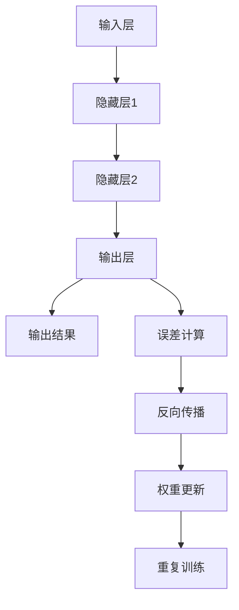
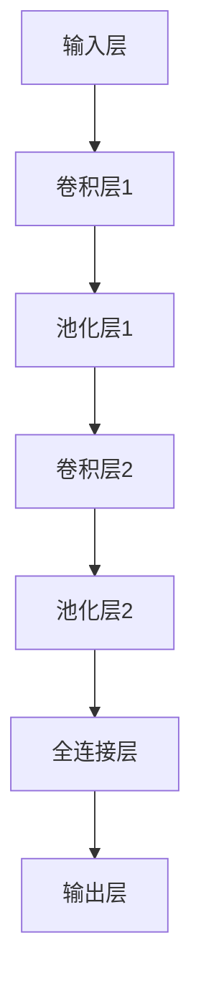
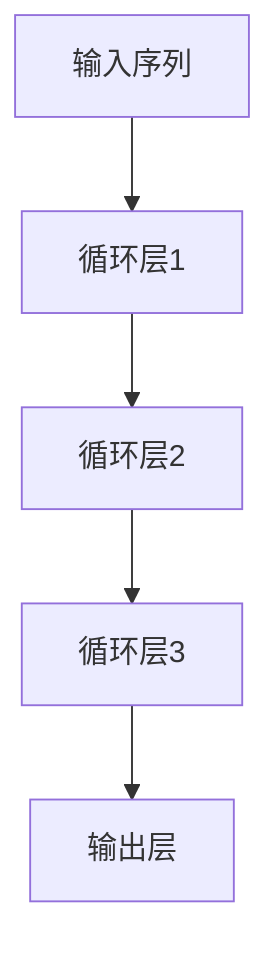
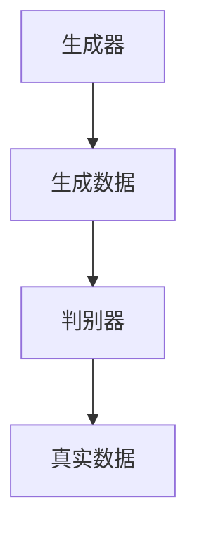
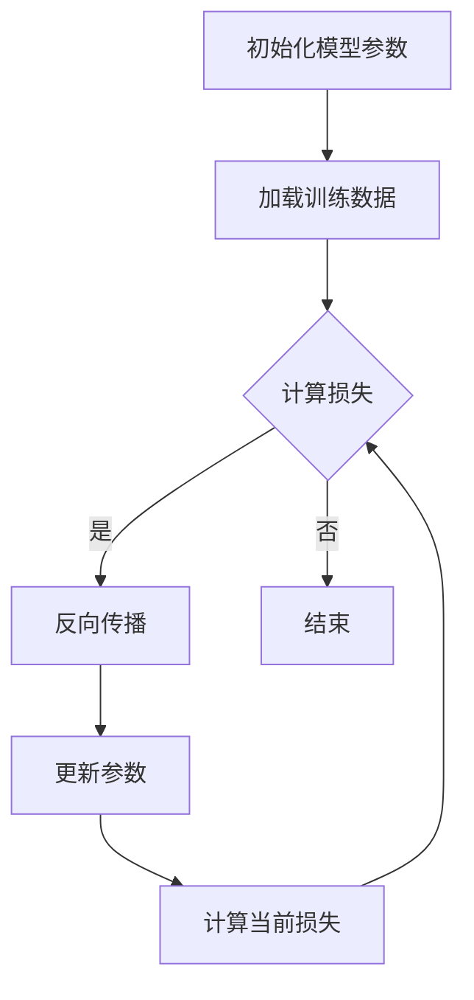
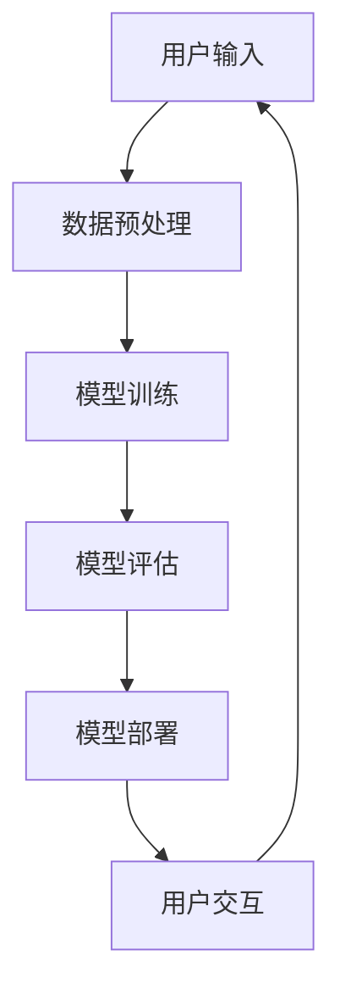
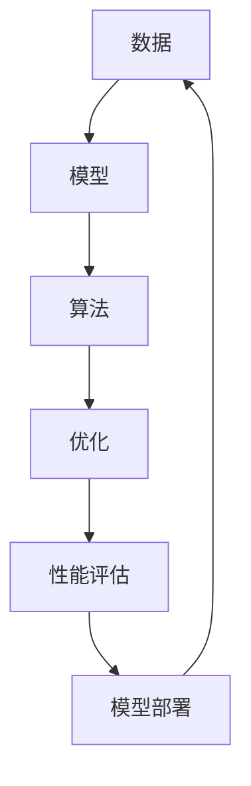

                 

### 文章标题

# 《Andrej Karpathy谈AI的历史与未来》

### 关键词：人工智能、AI发展史、未来趋势、Andrej Karpathy、深度学习、计算机视觉、自然语言处理

### 摘要：

本文将从AI的历史与未来两个角度，深入探讨人工智能的起源、发展及应用。通过分析Andrej Karpathy的观点，我们不仅将回顾AI的重要里程碑和技术演进，还将展望AI技术的潜在影响和未来前景。本文旨在为读者提供一个全面而系统的AI知识框架，帮助理解AI的核心概念、算法原理以及实际应用，为未来的人工智能发展提供有益的思考。

### 目录

1. **第一部分: AI的历史与发展**
   1.1 AI的起源与发展历程
   1.2 人工智能的核心概念
   1.3 人工智能的关键技术
   1.4 AI的应用领域概述

2. **第二部分: Andrej Karpathy与AI**
   2.1 Andrej Karpathy的背景与经历
   2.2 Andrej Karpathy在AI领域的贡献
   2.3 Andrej Karpathy的学术观点

3. **第三部分: AI的核心概念与原理**
   3.1 神经网络的基本原理
   3.2 深度学习的关键技术
   3.3 机器学习的数学基础
   3.4 Mermaid流程图与AI架构

4. **第四部分: AI的算法原理**
   4.1 机器学习算法的演进
   4.2 自然语言处理算法
   4.3 计算机视觉算法
   4.4 伪代码与算法实现

5. **第五部分: AI的数学模型与数学公式**
   5.1 线性代数的应用
   5.2 微积分的应用
   5.3 最优化理论的应用

6. **第六部分: AI项目实战**
   6.1 AI项目的开发流程
   6.2 实战案例一：图像分类项目
   6.3 实战案例二：语言模型项目
   6.4 开发环境与工具

7. **第七部分: AI项目的分析与优化**
   7.1 AI项目的性能评估
   7.2 AI项目的调试与优化
   7.3 AI项目的部署与维护

8. **附录**
   8.1 AI学习资源与推荐
   8.2 AI术语表

[End] 

接下来，我们将逐部分展开讨论，对每一部分进行详细的分析和阐述。首先，我们从AI的历史与发展开始，逐步回顾人工智能的演进过程，了解其核心概念和技术基础。随后，我们将深入探讨Andrej Karpathy的学术观点和贡献，以提供更全面的AI知识体系。最后，我们将通过实际的AI项目实战，展示AI算法原理和应用的具体实现过程。让我们一起开始这段精彩的AI之旅吧！

----------------------------------------------------------------

## 第一部分: AI的历史与发展

### 1.1 AI的起源与发展历程

人工智能（Artificial Intelligence, AI）作为计算机科学的一个分支，其起源可以追溯到上世纪50年代。1950年，英国数学家艾伦·图灵（Alan Turing）发表了著名的论文《计算机器与智能》（Computing Machinery and Intelligence），提出了图灵测试这一衡量机器智能的标准。图灵测试的核心思想是，如果一台机器能够在与人类进行对话时让人类无法区分其是机器还是人类，那么这台机器就可以被认为具有智能。

1956年，达特茅斯会议（Dartmouth Conference）的召开被认为是人工智能领域的正式诞生。这次会议聚集了诸如约翰·麦卡锡（John McCarthy）和赫伯特·西蒙（Herbert Simon）等知名学者，他们共同提出了“人工智能”这一术语，并讨论了人工智能的目标、方法和挑战。这次会议标志着人工智能作为一个独立研究领域的诞生，并奠定了人工智能发展的基础。

在接下来的几十年里，人工智能经历了多次起伏。从20世纪60年代到70年代，人工智能研究主要集中在知识表示、推理和规划等领域。然而，由于技术的限制和实现的困难，这一阶段的人工智能被称为“人工智能的第一次冬天”。1979年，IBM的深蓝（Deep Blue）击败了国际象棋世界冠军加里·卡斯帕罗夫（Garry Kasparov），这是人工智能在特定领域取得的重大突破。

随着计算机技术的进步，特别是在20世纪80年代到90年代，人工智能迎来了新的发展机遇。专家系统（Expert Systems）成为这一时期的研究热点，它通过模拟人类专家的知识和推理能力，解决特定领域的问题。1997年，IBM的“深蓝”超级计算机击败了国际象棋世界冠军卡斯帕罗夫，这是人工智能在特定领域再次取得的重要成就。

进入21世纪，人工智能迎来了新的高潮。特别是在深度学习（Deep Learning）和大数据技术的推动下，人工智能在图像识别、自然语言处理、自动驾驶等领域取得了重大突破。2012年，由谷歌深度学习团队开发的“谷歌猫”系统成功识别图片中的猫，这是深度学习在图像识别领域的一个重要里程碑。随后，人工智能在各个领域迅速应用，为人类社会带来了巨大的变革。

### 1.2 人工智能的核心概念

人工智能的核心概念主要包括知识表示、推理、学习、感知和行动等方面。知识表示是人工智能研究的一个重要方向，旨在将人类知识转化为计算机可以理解和处理的形式。推理是人工智能的核心能力之一，通过逻辑推理和搜索算法，人工智能可以解决复杂的问题。学习是人工智能的重要特性，通过机器学习算法，人工智能可以从数据中自动学习规律和模式。感知是指人工智能系统对环境信息的获取和处理能力，包括视觉、听觉、触觉等。行动是指人工智能系统根据感知到的信息，采取相应的行动，实现自主决策和控制。

知识表示、推理、学习、感知和行动这五个核心概念相互关联，共同构成了人工智能的基础。知识表示为人工智能提供了处理信息和解决问题的能力，推理为人工智能提供了逻辑思维能力，学习使人工智能能够不断进步和优化，感知为人工智能提供了对外部环境的感知能力，行动使人工智能能够实现自主决策和执行任务。

### 1.3 人工智能的关键技术

人工智能的关键技术主要包括机器学习、深度学习和自然语言处理等。机器学习是人工智能的核心技术之一，通过构建数学模型和算法，使计算机能够从数据中学习并做出决策。深度学习是机器学习的一个分支，通过构建多层神经网络，实现对复杂数据的建模和分析。自然语言处理是人工智能的重要应用领域，通过计算机程序理解和生成自然语言，实现人机交互。

机器学习的关键技术包括监督学习、无监督学习和强化学习等。监督学习是一种从标注数据中学习的方法，通过已知的结果来预测未知的结果。无监督学习是在没有标注数据的情况下，从数据中发现模式和规律。强化学习是一种通过奖励和惩罚来指导学习的方法，使人工智能系统能够在动态环境中做出最优决策。

深度学习的关键技术包括卷积神经网络（CNN）、循环神经网络（RNN）和生成对抗网络（GAN）等。卷积神经网络是一种专门用于处理图像数据的神经网络，通过卷积操作提取图像的特征。循环神经网络是一种用于处理序列数据的神经网络，通过记忆单元实现序列信息的传递。生成对抗网络是一种用于生成数据的神经网络，通过对抗训练实现高质量的数据生成。

自然语言处理的关键技术包括词向量、序列到序列模型和注意力机制等。词向量是将自然语言文本转化为计算机可以处理的向量表示，为深度学习模型提供输入。序列到序列模型是一种用于机器翻译和语音识别的模型，通过处理输入序列生成输出序列。注意力机制是一种用于提高神经网络模型在处理序列数据时性能的方法，通过关注重要信息实现更好的结果。

总的来说，人工智能的关键技术不断发展，为人工智能的应用提供了强大的支持。机器学习、深度学习和自然语言处理等技术的融合，推动了人工智能在各个领域的快速发展。

### 1.4 AI的应用领域概述

人工智能在各个领域的应用日益广泛，涵盖了计算机视觉、自然语言处理、机器学习、自动驾驶等多个领域。以下是人工智能在各主要应用领域的概述：

#### 计算机视觉

计算机视觉是人工智能的重要应用领域之一，通过计算机对图像和视频进行自动处理和分析，实现对现实世界的理解和交互。计算机视觉的应用包括图像识别、图像分类、目标检测、人脸识别、姿态估计等。计算机视觉技术的发展极大地提升了图像处理和分析的效率，为安防监控、医疗诊断、自动驾驶等领域提供了强大的技术支持。

#### 自然语言处理

自然语言处理（Natural Language Processing, NLP）是人工智能的另一个关键领域，主要研究如何让计算机理解和生成自然语言。NLP的应用包括机器翻译、语音识别、文本分类、情感分析、问答系统等。通过自然语言处理技术，人工智能可以与人类进行更加自然和流畅的交互，为智能客服、智能助手、信息检索等领域提供了强大的工具。

#### 机器学习

机器学习是人工智能的核心技术之一，通过构建数学模型和算法，使计算机能够从数据中学习并做出决策。机器学习的应用包括分类、回归、聚类、强化学习等。在金融、医疗、零售、制造等行业，机器学习技术被广泛应用于数据分析和预测，提升了业务决策的效率和准确性。

#### 自动驾驶

自动驾驶是人工智能在交通运输领域的应用，通过计算机视觉、自然语言处理、机器学习等技术，实现无人驾驶车辆的自主行驶。自动驾驶技术的发展有望改变交通模式，提高交通安全和效率，减少交通事故的发生。

#### 医疗诊断

人工智能在医疗诊断中的应用主要包括图像识别、疾病预测、药物研发等。通过计算机视觉和自然语言处理技术，人工智能可以辅助医生进行疾病诊断，提高诊断的准确性和效率，为患者提供更好的医疗服务。

#### 金融风控

人工智能在金融领域的应用包括风险评估、欺诈检测、信用评级等。通过机器学习和大数据技术，人工智能可以实时分析金融市场数据，预测风险，提高金融风险管理的效率和准确性。

#### 教育智能

人工智能在教育领域的应用包括个性化学习、智能辅导、学习分析等。通过自然语言处理和机器学习技术，人工智能可以为学生提供个性化的学习资源，提高学习效果和效率。

#### 工业自动化

人工智能在工业自动化领域的应用包括机器人控制、智能制造、设备预测维护等。通过计算机视觉和机器学习技术，人工智能可以提升工业生产的自动化程度和效率，降低生产成本。

总的来说，人工智能在各领域的应用已经取得了显著的成果，为各行业带来了深刻的变革。随着人工智能技术的不断进步，未来它将在更多领域发挥更大的作用，推动社会的发展和进步。

### 1.5 AI的历史与发展：一个时间线

为了更清晰地展示人工智能的历史与发展，我们可以通过一个时间线来回顾：

- **1950年**：艾伦·图灵发表《计算机器与智能》，提出图灵测试。
- **1956年**：达特茅斯会议召开，人工智能正式诞生。
- **1966年**：约翰·麦卡锡提出“专家系统”概念。
- **1972年**：IBM的深蓝计算机击败国际象棋世界冠军。
- **1982年**：专家系统被广泛应用于医疗、金融等领域。
- **1997年**：IBM的深蓝计算机击败国际象棋世界冠军卡斯帕罗夫。
- **2006年**：深度学习技术的发展，卷积神经网络（CNN）取得突破性进展。
- **2012年**：谷歌的“谷歌猫”系统成功识别图片中的猫。
- **2016年**：谷歌的AlphaGo击败人类围棋世界冠军。
- **2020年**：人工智能在自动驾驶、医疗诊断、金融风控等领域取得广泛应用。

通过这个时间线，我们可以看到人工智能从诞生至今的发展历程，以及在不同阶段的重要里程碑。每个里程碑都标志着人工智能技术的突破和应用领域的拓展，为我们展示了人工智能的无限可能。

## 第二部分: Andrej Karpathy与AI

### 2.1 Andrej Karpathy的背景与经历

Andrej Karpathy是一位著名的人工智能研究人员和深度学习专家，出生于1983年，毕业于多伦多大学，获得了计算机科学的博士学位。他在多伦多大学期间就开始在人工智能领域进行深入研究，特别是对深度学习技术的应用表现出浓厚的兴趣。2014年，Andrej Karpathy加入了谷歌，担任机器学习研究科学家，并在谷歌的工作中继续他的研究工作。他的研究主要集中在计算机视觉和自然语言处理领域，特别是在图像识别和文本生成方面取得了显著成果。

除了在学术界和工业界的研究工作，Andrej Karpathy还非常活跃于教育领域。他曾在多伦多大学和斯坦福大学担任讲师，讲授深度学习和人工智能相关课程。此外，他还积极参与在线教育，通过开设免费的在线课程，向全球的学员传授深度学习知识。他的课程内容深入浅出，广受欢迎，极大地推动了深度学习技术的普及和应用。

### 2.2 Andrej Karpathy在AI领域的贡献

Andrej Karpathy在人工智能领域，尤其是深度学习领域，做出了许多重要的贡献。他在计算机视觉和自然语言处理方面的研究成果，极大地推动了这两个领域的发展。

在计算机视觉领域，Andrej Karpathy的研究主要集中在图像识别和生成方面。他参与了谷歌“谷歌猫”项目，该项目利用卷积神经网络（CNN）对大量图像进行自动分类，成功识别出图像中的猫。这一成果标志着深度学习技术在图像识别领域的突破，并为后续的研究提供了重要的参考。

此外，Andrej Karpathy还研究了生成对抗网络（GAN）的应用。GAN是一种深度学习模型，通过对抗训练生成高质量的数据。Andrej Karpathy在GAN的研究中，提出了一系列改进方法，使得GAN在图像生成、图像修复和图像风格迁移等方面取得了显著成果。他的研究为GAN的应用提供了新的思路和解决方案，推动了图像生成技术的发展。

在自然语言处理领域，Andrej Karpathy的研究主要集中在文本生成和机器翻译方面。他研究了基于循环神经网络（RNN）和Transformer的文本生成模型，并提出了一些改进方法。这些方法在文本生成任务的准确性和流畅性方面取得了显著提升，为自然语言处理的应用提供了强大的技术支持。

此外，Andrej Karpathy还参与了谷歌翻译项目的开发，为谷歌翻译系统提供了重要的技术支持。他的研究使得谷歌翻译在处理复杂文本时，能够更好地理解语义和语境，提高了翻译的准确性和自然度。

总的来说，Andrej Karpathy在人工智能领域，特别是在计算机视觉和自然语言处理方面的研究成果，为这两个领域的发展做出了重要贡献。他的研究不仅推动了技术的进步，还为实际应用提供了新的解决方案，对人工智能的发展产生了深远的影响。

### 2.3 Andrej Karpathy的学术观点

Andrej Karpathy在人工智能领域的学术观点主要集中在深度学习技术的应用和发展方向上。他认为，深度学习是一种革命性的技术，具有巨大的潜力，可以在许多领域产生深远的影响。

首先，Andrej Karpathy强调深度学习在图像识别和自然语言处理等领域的突破性成果。他认为，深度学习模型通过自动学习大量数据中的特征，能够实现比传统机器学习方法更高的准确性和效率。特别是在计算机视觉领域，卷积神经网络（CNN）的应用使得图像识别和分类任务取得了显著的进展。而在自然语言处理领域，基于循环神经网络（RNN）和Transformer的文本生成模型，使得文本生成和翻译任务更加准确和自然。

其次，Andrej Karpathy关注深度学习技术的可解释性和安全性问题。他认为，当前深度学习模型的高度复杂性和黑盒性质，使得其决策过程难以解释，这在某些应用场景中可能带来潜在的风险。因此，他主张在深度学习研究中，应该注重模型的可解释性和透明性，以便更好地理解模型的决策过程，并确保其安全性。

此外，Andrej Karpathy还提出，深度学习技术的发展离不开大数据的支持。他认为，数据量的增加和多样化，为深度学习模型提供了更多的训练素材，使得模型能够学习到更加复杂的特征和模式。因此，他鼓励研究人员和工程师积极收集和利用数据，以推动深度学习技术的进步。

最后，Andrej Karpathy认为，深度学习技术在未来将会有更加广泛的应用，包括自动驾驶、医疗诊断、金融风控等领域。他预测，随着技术的不断进步，深度学习将能够解决更多复杂的问题，为人类社会带来更多的便利和变革。

总的来说，Andrej Karpathy的学术观点既强调了深度学习技术的现有成就，又关注了其未来发展。他的观点不仅为人工智能的研究提供了新的视角，也为实际应用提供了重要的指导。

## 第三部分: AI的核心概念与原理

### 3.1 神经网络的基本原理

神经网络（Neural Networks）是人工智能领域中最基础且重要的技术之一。其灵感来源于人脑的结构和工作原理，通过模拟神经元之间的连接和交互来实现对数据的处理和学习。理解神经网络的基本原理对于深入掌握人工智能技术至关重要。

#### 神经元与层次结构

神经网络由大量的神经元（或称为节点）组成，每个神经元接收多个输入信号，通过加权求和处理后产生一个输出信号。一个基本的神经网络结构通常包括输入层、隐藏层和输出层。输入层接收外部输入的数据，隐藏层对输入数据进行处理和变换，输出层产生最终的输出结果。

在神经网络中，每个神经元与其他神经元之间都存在连接，这些连接可以用权重（weight）来表示。权重决定了输入信号对输出信号的贡献大小。通过调整这些权重，神经网络可以学习和适应不同的数据模式。

#### 激活函数

激活函数（Activation Function）是神经网络中的一个关键组件，它决定了神经元是否被激活。常见的激活函数包括线性函数、ReLU函数（Rectified Linear Unit）、Sigmoid函数和Tanh函数等。ReLU函数由于其简单的形式和易于训练的特性，在深度学习中得到了广泛应用。

#### 前向传播与反向传播

神经网络的工作过程可以分为两个阶段：前向传播（Forward Propagation）和反向传播（Backpropagation）。

在前向传播阶段，输入数据从输入层开始，逐层传递到隐藏层，最终传递到输出层。在每个神经元中，输入信号与权重相乘，并通过激活函数进行处理，产生输出信号。这个过程不断重复，直到输出层得到最终的结果。

在反向传播阶段，神经网络根据实际输出与预期输出之间的误差，通过反向传播算法更新各层的权重。具体来说，反向传播算法计算每个神经元的梯度（gradient），并根据梯度调整权重，使得神经网络的输出更接近预期结果。这个过程重复进行，直到误差达到可接受的范围。

#### Mermaid流程图

为了更好地理解神经网络的基本原理，我们可以使用Mermaid流程图来展示其工作流程：



在这个流程图中，输入层接收输入数据，经过隐藏层的处理，最终在输出层得到输出结果。通过误差计算和反向传播，神经网络不断调整权重，优化模型的性能。

### 3.2 深度学习的关键技术

深度学习（Deep Learning）是神经网络的一种扩展，通过构建多层神经网络来实现对复杂数据的建模和分析。深度学习的关键技术包括卷积神经网络（CNN）、循环神经网络（RNN）和生成对抗网络（GAN）等。这些技术各自有着独特的优势和应用场景。

#### 卷积神经网络（CNN）

卷积神经网络是一种专门用于处理图像数据的神经网络，其核心思想是通过卷积操作提取图像的特征。CNN由多个卷积层、池化层和全连接层组成。卷积层通过卷积操作提取图像的局部特征，池化层用于降低特征图的维度，全连接层则用于分类和预测。

卷积神经网络在计算机视觉领域取得了显著的成果，例如图像分类、目标检测和图像分割等。以下是CNN的Mermaid流程图：



在这个流程图中，输入层接收图像数据，经过多个卷积层和池化层处理后，最终在输出层得到分类结果。

#### 循环神经网络（RNN）

循环神经网络是一种用于处理序列数据的神经网络，其核心思想是通过循环结构来记忆序列中的历史信息。RNN由多个循环层组成，每个循环层包含一个或多个神经元。RNN在自然语言处理、语音识别和时间序列预测等领域有着广泛的应用。

以下是一个简单的RNN的Mermaid流程图：



在这个流程图中，输入序列依次经过循环层，最终在输出层得到序列的预测结果。

#### 生成对抗网络（GAN）

生成对抗网络是一种通过对抗训练生成高质量数据的神经网络。GAN由生成器和判别器两个部分组成。生成器生成数据，判别器判断生成数据的真实性和质量。通过不断训练，生成器逐渐生成更逼真的数据。

以下是一个简单的GAN的Mermaid流程图：



在这个流程图中，生成器生成数据，判别器判断生成数据的真实性，并通过对抗训练优化生成器的性能。

### 3.3 机器学习的数学基础

机器学习（Machine Learning）是一种通过算法从数据中学习模式和规律的技术。理解机器学习的数学基础对于深入掌握其原理和算法至关重要。以下是机器学习中的几个关键数学概念：

#### 概率论

概率论是机器学习的重要基础。在概率论中，概率分布（Probability Distribution）描述了随机变量的可能取值及其概率。常见的概率分布包括正态分布、伯努利分布和多项式分布等。在机器学习中，概率论用于估计模型参数、评估模型性能和进行概率推理。

#### 统计学

统计学在机器学习中扮演着重要角色。统计学中的估计理论（Estimation Theory）用于估计模型参数，假设检验（Hypothesis Testing）用于验证模型假设，贝叶斯推断（Bayesian Inference）用于在不确定性下进行推理。统计学知识有助于我们理解和评估机器学习模型的性能。

#### 最优化理论

最优化理论是机器学习中的另一个关键数学工具。最优化问题（Optimization Problem）是指寻找一个函数的最大值或最小值。在机器学习中，最优化理论用于优化模型参数，提高模型的性能。常见的最优化算法包括梯度下降（Gradient Descent）、牛顿法和随机优化算法等。

以下是一个简单的机器学习算法的伪代码，展示了其基本流程：

```python
# 初始化模型参数
params = initialize_params()

# 定义损失函数
loss_function = define_loss_function()

# 定义优化算法
optimizer = define_optimizer()

# 迭代更新参数
for epoch in range(num_epochs):
    for data in dataset:
        # 前向传播
        predictions = model(data, params)
        
        # 计算损失
        loss = loss_function(predictions, labels)
        
        # 反向传播
        gradients = compute_gradients(loss, params)
        
        # 更新参数
        params = optimizer.update_params(params, gradients)
        
    # 打印当前epoch的损失
    print("Epoch:", epoch, "Loss:", loss)
```

在这个伪代码中，模型通过迭代更新参数来最小化损失函数，最终得到最优参数。这个过程依赖于数学中的优化理论，特别是梯度下降算法。

总的来说，机器学习的数学基础涵盖了概率论、统计学和最优化理论等多个领域，为机器学习算法提供了坚实的理论基础。

### 3.4 Mermaid流程图与AI架构

在人工智能的开发过程中，流程图是一种非常有效的工具，可以帮助我们理解和可视化复杂的算法和系统架构。Mermaid是一种基于Markdown的图形描述语言，可以方便地创建各种类型的流程图，包括神经网络架构图、算法流程图和系统架构图等。

#### 神经网络架构图

神经网络架构图可以直观地展示神经网络的层次结构和连接关系。以下是一个简单的卷积神经网络（CNN）的Mermaid流程图：


在这个流程图中，输入层接收图像数据，经过多个卷积层和池化层处理后，最终在输出层得到分类结果。卷积层和池化层分别用于提取图像的局部特征和降低特征图的维度，全连接层用于分类和预测。

#### 算法流程图

算法流程图可以展示算法的执行流程和各个步骤之间的关系。以下是一个简单的机器学习算法的Mermaid流程图：



在这个流程图中，算法首先初始化模型参数，然后加载训练数据，计算损失函数，进行反向传播和参数更新。这个过程不断重复，直到损失函数收敛或达到预设的迭代次数。

#### 系统架构图

系统架构图可以展示系统的整体结构和各个模块之间的关系。以下是一个简单的人工智能系统的Mermaid流程图：



在这个流程图中，用户输入经过数据预处理后，用于模型训练。训练完成的模型进行评估，评估结果用于模型部署。最终，部署的模型用于用户交互，形成一个闭环系统。

总的来说，Mermaid流程图是一种强大的工具，可以帮助我们直观地理解和设计人工智能系统的各个部分。通过Mermaid，我们可以将复杂的算法和系统架构可视化，更好地进行沟通和协作。

### 3.5 人工智能的核心概念和联系

人工智能（AI）的核心概念涉及多个层面，包括数据、模型、算法和优化等。理解这些概念之间的联系，有助于我们更好地构建和优化人工智能系统。

#### 数据

数据是人工智能的基础，没有高质量的数据，算法和模型将难以发挥其潜力。数据可以分为结构化和非结构化数据。结构化数据通常以表格形式存储，如数据库中的数据；非结构化数据包括文本、图像、音频和视频等。数据的质量、多样性和规模直接影响AI模型的性能。

#### 模型

模型是人工智能系统的核心，它通过学习数据中的特征和规律，实现特定任务的预测和决策。常见的AI模型包括神经网络、决策树、支持向量机和集成模型等。神经网络是目前最流行的模型，通过多层结构自动学习复杂的数据特征。

#### 算法

算法是人工智能模型的实现方法，它定义了如何从数据中学习规律和如何优化模型的性能。常见的算法包括梯度下降、随机梯度下降、反向传播和正则化等。算法的优化是提升模型性能的关键，如通过交叉验证、dropout和批量归一化等技术，减少过拟合和提升泛化能力。

#### 优化

优化是人工智能开发过程中的重要环节，旨在提高模型的效率和准确性。优化可以通过多种方式进行，包括参数调优、超参数调整和模型结构改进等。优化的目标是找到最佳模型配置，使模型在各种任务上表现最优。

#### Mermaid流程图

为了更直观地展示这些核心概念之间的联系，我们可以使用Mermaid流程图来表示：



在这个流程图中，数据作为输入，通过模型和算法进行处理和优化，最终生成性能评估和模型部署的结果。这个循环过程不断迭代，以实现人工智能系统的持续改进。

总的来说，人工智能的核心概念和联系构成了一个有机的整体，通过数据、模型、算法和优化的相互作用，共同推动人工智能技术的发展和应用。

## 第四部分: AI的算法原理

### 4.1 机器学习算法的演进

机器学习算法的发展历程经历了多个阶段，从早期的统计学习、线性模型到现代的深度学习，每个阶段都带来了显著的进步和创新。理解这些算法的演进过程，有助于我们更好地把握机器学习的发展趋势和应用场景。

#### 统计学习与线性模型

机器学习的历史可以追溯到20世纪50年代，当时的主要研究集中在统计学习方法和线性模型上。线性回归是最早的机器学习算法之一，通过最小化误差平方和来预测连续值。线性回归模型简单且易于理解，但其预测能力有限，无法处理复杂的非线性问题。

随着计算能力的提升和数据量的增加，线性模型逐渐扩展到多元线性回归、逻辑回归和多项式回归等更复杂的模型。逻辑回归在分类任务中得到了广泛应用，通过将线性回归的输出映射到概率空间，实现了对离散类别的预测。这些早期的算法奠定了机器学习的基础，但它们的局限性也逐渐显现。

#### 支持向量机与集成学习

20世纪90年代，支持向量机（SVM）成为机器学习领域的一个重要突破。SVM通过最大化分类边界来找到最优分类超平面，其强大的分类能力和高效的求解算法使其在许多应用场景中得到了广泛应用。SVM不仅可以处理线性数据，还可以通过核技巧扩展到非线性分类。

集成学习方法在机器学习中也发挥了重要作用。集成学习通过结合多个模型的预测结果来提高整体性能。Bagging和Boosting是两种常见的集成学习方法。Bagging通过随机抽样训练多个模型，并取平均预测结果；Boosting则通过关注训练误差较大的样本，逐渐提高这些样本的权重，从而优化整体模型的性能。集成学习方法的提出，大大提升了机器学习的预测准确性和鲁棒性。

#### 深度学习与神经网络

进入21世纪，深度学习（Deep Learning）的崛起标志着机器学习领域的新纪元。深度学习通过构建多层神经网络，自动学习数据的复杂特征和模式，在图像识别、语音识别和自然语言处理等领域取得了突破性的成果。

卷积神经网络（CNN）是深度学习的一种重要形式，通过卷积操作和池化操作，有效地提取图像的局部特征，实现了图像分类、目标检测和图像分割等任务。循环神经网络（RNN）和其变种长短期记忆网络（LSTM）则擅长处理序列数据，如时间序列预测、语音识别和机器翻译等。

生成对抗网络（GAN）是另一项重要的深度学习技术，通过对抗训练生成高质量的数据，在图像生成、图像修复和风格迁移等领域展现了强大的能力。

#### 算法演进总结

机器学习算法的演进经历了从简单线性模型到复杂深度学习模型的过程。每个阶段的算法都在一定程度上解决了特定的机器学习问题，但同时也存在局限性。统计学习方法和线性模型简单直观，但难以处理复杂的非线性问题；支持向量机和集成学习方法提高了分类和回归的准确性，但需要大量的计算资源和训练数据；深度学习通过构建多层神经网络，自动学习复杂的数据特征，实现了许多前所未有的任务。

总的来说，机器学习算法的演进是一个不断探索和创新的过程，每个阶段的算法都在不断推动机器学习技术的发展和应用。未来，随着计算能力的提升和数据量的增加，机器学习算法将继续演进，为人工智能领域带来更多的突破和进步。

### 4.2 自然语言处理算法

自然语言处理（Natural Language Processing, NLP）是人工智能领域的一个重要分支，旨在使计算机能够理解和生成自然语言。NLP算法的研究和应用涵盖了文本分类、情感分析、命名实体识别、机器翻译等多个方面，极大地推动了人机交互和信息检索技术的发展。

#### 文本分类

文本分类是NLP中最基础的算法之一，其核心任务是将文本数据根据其内容分类到预定义的类别中。常见的文本分类方法包括基于统计的方法和基于深度学习的方法。

基于统计的方法通常使用词袋模型（Bag of Words, BOW）和TF-IDF（Term Frequency-Inverse Document Frequency）来表示文本。词袋模型将文本看作一个词汇的集合，每个词的频率作为特征进行分类。TF-IDF则通过调整词的权重，减小常见词的影响，提高分类效果。

基于深度学习的方法，如卷积神经网络（CNN）和循环神经网络（RNN），可以更好地捕捉文本的上下文信息。例如，CNN通过卷积操作提取文本的局部特征，RNN通过循环结构处理文本的序列信息，这些方法在文本分类任务中取得了显著的效果。

#### 情感分析

情感分析（Sentiment Analysis）旨在识别文本中的情感倾向，如正面、负面或中性。情感分析在商业、社交和政府等领域有着广泛的应用，可以帮助企业了解客户反馈，政府监控舆情，等。

早期的情感分析方法主要依赖于规则和关键词匹配。随着深度学习的发展，基于深度学习的情感分析算法逐渐成为主流。例如，使用LSTM（Long Short-Term Memory）和Transformer等模型，可以更好地捕捉文本中的情感变化，提高情感分析的准确性。

#### 命名实体识别

命名实体识别（Named Entity Recognition, NER）是一种用于识别文本中特定类型的实体的算法，如人名、地名、组织名和专有名词等。NER在信息提取、实体关系挖掘和语义搜索等方面有着重要应用。

传统的NER方法主要依赖于规则和隐马尔可夫模型（HMM）。深度学习方法，如CRF（Conditional Random Fields）和BERT（Bidirectional Encoder Representations from Transformers），通过学习大量标注数据，可以更准确地识别命名实体。

#### 机器翻译

机器翻译（Machine Translation, MT）是将一种自然语言文本自动翻译成另一种自然语言的过程。传统的机器翻译方法主要基于规则和统计机器翻译。深度学习的发展，特别是基于神经网络的机器翻译算法（如Seq2Seq模型和Transformer），大大提高了翻译的准确性和流畅性。

Seq2Seq模型通过编码器和解码器两个神经网络，实现了端到端的翻译。Transformer模型通过自注意力机制，有效地捕捉了文本中的长距离依赖关系，使得翻译质量得到了显著提升。

总的来说，自然语言处理算法的不断发展和改进，为人机交互和信息处理提供了强大的工具。随着深度学习和大数据技术的进一步发展，NLP在文本分类、情感分析、命名实体识别和机器翻译等领域的应用将更加广泛和深入。

### 4.3 计算机视觉算法

计算机视觉（Computer Vision）是人工智能领域的一个重要分支，致力于使计算机能够从图像或视频中自动识别和理解视觉信息。计算机视觉算法在图像识别、目标检测、图像分割和动作识别等方面取得了显著进展，广泛应用于安防监控、医疗诊断、自动驾驶和视频分析等领域。

#### 图像识别

图像识别（Image Recognition）是计算机视觉的基本任务，旨在通过算法自动识别图像中的对象或场景。常见的图像识别算法包括传统算法和基于深度学习的算法。

传统的图像识别方法主要依赖于特征提取和分类器。例如，通过使用SIFT（尺度不变特征变换）和SURF（加速稳健特征）提取图像的关键特征，然后利用支持向量机（SVM）等分类器进行图像分类。这些方法在一定程度上取得了成功，但受限于特征提取的复杂度和计算效率。

基于深度学习的图像识别方法，如卷积神经网络（CNN），通过多层卷积操作自动学习图像中的复杂特征，显著提高了图像识别的准确性和鲁棒性。特别是ResNet（残差网络）和Inception（卷积神经网络结构）等深度学习模型的提出，进一步提升了图像识别的性能。

以下是一个简单的图像识别算法的伪代码：

```python
# 初始化CNN模型
model = initialize_cnn_model()

# 加载预训练模型权重
model.load_weights('pretrained_weights.h5')

# 加载测试图像
image = load_image('test_image.jpg')

# 数据预处理
processed_image = preprocess_image(image)

# 进行图像识别
predictions = model.predict(processed_image)

# 获取最高概率的分类结果
predicted_label = predictions.argmax()

# 打印预测结果
print("Predicted Label:", predicted_label)
```

在这个伪代码中，首先初始化CNN模型，加载预训练的模型权重，然后加载测试图像并进行数据预处理。通过模型预测，获取最高概率的分类结果，并打印预测结果。

#### 目标检测

目标检测（Object Detection）是计算机视觉中的重要任务，旨在识别图像中的多个对象并定位它们的位置。常见的目标检测算法包括单阶段检测算法和双阶段检测算法。

单阶段检测算法，如SSD（单阶段检测器）和YOLO（You Only Look Once），通过一个步骤直接输出边界框和分类概率。这些算法速度快，但在小目标和密集目标场景下可能存在性能瓶颈。

双阶段检测算法，如R-CNN（区域建议网络）和Faster R-CNN（更快的区域建议网络），首先使用区域建议网络（Region Proposal Network, RPN）生成候选区域，然后在这些区域上进行分类和定位。这些算法准确度高，但计算复杂度较大。

以下是一个简单的目标检测算法的伪代码：

```python
# 初始化Faster R-CNN模型
model = initialize_faster_rcnn_model()

# 加载预训练模型权重
model.load_weights('pretrained_weights.h5')

# 加载测试图像
image = load_image('test_image.jpg')

# 进行目标检测
detections = model.detect(image)

# 打印检测结果
print("Detections:", detections)
```

在这个伪代码中，首先初始化Faster R-CNN模型，加载预训练的模型权重，然后加载测试图像并进行目标检测。检测结果包括边界框、分类概率和置信度等。

#### 图像分割

图像分割（Image Segmentation）是将图像中的每个像素按照其属性划分为不同区域的过程。常见的图像分割算法包括基于阈值的方法、基于区域生长的方法和基于深度学习的方法。

基于阈值的方法，如Otsu阈值法和Li阈值法，通过计算图像的灰度分布来确定最佳阈值，将图像划分为前景和背景。这些方法简单高效，但在复杂场景下可能存在误分类。

基于区域生长的方法，如区域分裂和合并算法，通过初始种子点逐步扩展和合并区域，实现图像分割。这些方法对边缘信息敏感，但在处理复杂场景时可能存在局部最优问题。

基于深度学习的方法，如FCN（全卷积网络）和U-Net，通过卷积操作实现像素级的分类，实现了像素级的图像分割。这些方法在医学影像分割、自动驾驶场景分割等应用中表现优异。

以下是一个简单的图像分割算法的伪代码：

```python
# 初始化U-Net模型
model = initialize_unet_model()

# 加载预训练模型权重
model.load_weights('pretrained_weights.h5')

# 加载测试图像
image = load_image('test_image.jpg')

# 进行图像分割
segmentation_map = model.predict(image)

# 打印分割结果
print("Segmentation Map:", segmentation_map)
```

在这个伪代码中，首先初始化U-Net模型，加载预训练的模型权重，然后加载测试图像并进行图像分割。分割结果是一个像素级的掩膜，用于标识图像中的不同区域。

#### 动作识别

动作识别（Action Recognition）是计算机视觉在视频分析中的一个重要任务，旨在识别视频中的动作序列。常见的动作识别算法包括基于光流的方法和基于深度学习的方法。

基于光流的方法，如光流匹配和光流跟踪，通过计算视频帧之间的像素位移来识别动作。这些方法对动作的速度和方向敏感，但在复杂场景下可能存在误差。

基于深度学习的方法，如3D卷积神经网络（3D CNN）和循环神经网络（RNN），通过学习视频序列的时空特征，实现了对动作的准确识别。特别是I3D（3D Inception Network）和C3D（Convolutional 3D Network）等深度学习模型，在动作识别任务中取得了显著的效果。

以下是一个简单的动作识别算法的伪代码：

```python
# 初始化I3D模型
model = initialize_i3d_model()

# 加载预训练模型权重
model.load_weights('pretrained_weights.h5')

# 加载测试视频
video = load_video('test_video.mp4')

# 进行动作识别
action_predictions = model.predict(video)

# 获取最高概率的动作类别
predicted_action = action_predictions.argmax()

# 打印预测结果
print("Predicted Action:", predicted_action)
```

在这个伪代码中，首先初始化I3D模型，加载预训练的模型权重，然后加载测试视频并进行动作识别。预测结果包括各个动作类别的概率分布，通过获取最高概率的动作类别，实现动作的识别。

总的来说，计算机视觉算法的发展为图像识别、目标检测、图像分割和动作识别等任务提供了强大的工具，随着深度学习技术的不断进步，这些算法在准确性和效率方面将得到进一步的提升。

### 4.4 伪代码与算法实现

为了更清晰地展示AI算法的实现过程，我们使用伪代码来描述几个核心算法的具体步骤。伪代码是一种模拟算法逻辑的描述方法，不涉及具体编程语言和语法，但能够传达算法的主要思想和操作步骤。

#### 伪代码示例：线性回归算法

```plaintext
算法名称：线性回归

输入：训练数据集（X, y），学习率α，迭代次数n

输出：模型参数θ

步骤：
1. 初始化模型参数θ为0
2. 对于每个迭代i从1到n：
   a. 计算损失函数J(θ)
   b. 计算梯度∇J(θ)
   c. 更新参数θ = θ - α∇J(θ)
3. 返回最终参数θ
```

#### 伪代码示例：卷积神经网络（CNN）

```plaintext
算法名称：卷积神经网络

输入：输入数据X，模型参数θ，学习率α，迭代次数n

输出：模型参数θ'

步骤：
1. 初始化模型参数θ
2. 对于每个迭代i从1到n：
   a. 前向传播计算输出O = f(Z)，其中Z = W*H + b
   b. 计算损失函数J(θ) = ∑(yᵢ - ŷᵢ)²
   c. 计算反向传播的梯度∇J(θ)
   d. 更新参数θ = θ - α∇J(θ)
3. 返回更新后的模型参数θ'
```

#### 伪代码示例：循环神经网络（RNN）

```plaintext
算法名称：循环神经网络

输入：输入序列X，隐藏状态h，学习率α

输出：输出序列O，隐藏状态h'

步骤：
1. 初始化隐藏状态h₀
2. 对于每个时间步t从1到T：
   a. 计算当前输入与隐藏状态的加权和Z = Xᵀ*Wₕ + bₕ
   b. 通过激活函数计算隐藏状态h' = f(Z)
   c. 更新隐藏状态h = h'
   d. 保存隐藏状态h'作为当前时间步的输出Oᵗ
3. 返回输出序列O和最终隐藏状态h'
```

通过这些伪代码示例，我们可以看到算法的基本框架和操作步骤。在实际实现时，需要将这些伪代码转化为具体编程语言的代码，并针对具体的任务进行参数调整和优化。这些伪代码不仅帮助我们理解算法的核心思想，也为实际编程提供了指导。

### 4.5 数学模型与公式

在人工智能（AI）领域，数学模型和公式是构建和优化算法的重要工具。理解这些模型和公式的原理，有助于我们更好地设计和实现高效的AI系统。以下是一些核心的数学模型和公式，包括线性代数、微积分和最优化理论的应用。

#### 线性代数的应用

1. **矩阵乘法**：
   矩阵乘法是线性代数中的基础运算，用于计算两个矩阵的乘积。其公式如下：

   $$
   C = A \cdot B
   $$
   
   其中，C是结果矩阵，A和B是输入矩阵。矩阵乘法广泛应用于数据预处理和特征提取中。

2. **矩阵求逆**：
   矩阵求逆是求解线性方程组的重要步骤。其公式为：

   $$
   A^{-1} = (1 / \det(A)) \cdot \text{adj}(A)
   $$
   
   其中，$A^{-1}$是矩阵A的逆矩阵，$\det(A)$是矩阵A的行列式，$\text{adj}(A)$是矩阵A的伴随矩阵。

3. **特征分解**：
   特征分解是线性代数中的一种重要方法，用于将矩阵分解为特征值和特征向量的乘积。其公式为：

   $$
   A = P \cdot D \cdot P^{-1}
   $$
   
   其中，A是输入矩阵，P是特征向量矩阵，D是特征值矩阵。

#### 微积分的应用

1. **导数**：
   导数是微积分中的基本概念，用于描述函数的变化率。其公式为：

   $$
   f'(x) = \lim_{h \to 0} \frac{f(x+h) - f(x)}{h}
   $$
   
   导数在优化算法中用于计算损失函数的梯度，指导参数更新。

2. **偏导数**：
   偏导数是导数在多个变量情况下的扩展，用于描述函数在一个特定变量上的变化率。其公式为：

   $$
   \frac{\partial f}{\partial x} = \lim_{h \to 0} \frac{f(x+h, y) - f(x, y)}{h}
   $$
   
   偏导数在多变量优化问题中用于计算梯度向量，指导参数更新。

3. **梯度下降**：
   梯度下降是一种常用的优化算法，用于求解最小化问题。其公式为：

   $$
   x_{\text{new}} = x_{\text{current}} - \alpha \cdot \nabla f(x_{\text{current}})
   $$
   
   其中，$\alpha$是学习率，$\nabla f(x_{\text{current}})$是函数在当前参数下的梯度。

#### 最优化理论的应用

1. **拉格朗日乘数法**：
   拉格朗日乘数法是解决约束优化问题的一种方法。其公式为：

   $$
   \mathcal{L}(x, y, \lambda) = f(x, y) - \lambda \cdot g(x, y)
   $$
   
   其中，$\mathcal{L}$是拉格朗日函数，$f(x, y)$是目标函数，$g(x, y)$是约束条件，$\lambda$是拉格朗日乘子。

2. **KKT条件**：
   KKT条件是解决非线性约束优化问题的重要条件。其公式为：

   $$
   \begin{cases}
   \nabla f(x) + \sum_{i=1}^k \lambda_i \nabla g_i(x) = 0 \\
   g_i(x) \geq 0, \quad \forall i = 1, \ldots, k \\
   \lambda_i \geq 0, \quad \forall i = 1, \ldots, k \\
   \lambda_i g_i(x) = 0, \quad \forall i = 1, \ldots, k
   \end{cases}
   $$
   
   其中，$\nabla f(x)$是目标函数的梯度，$\nabla g_i(x)$是约束条件的梯度，$\lambda_i$是拉格朗日乘子。

这些数学模型和公式在AI算法中扮演着至关重要的角色，帮助我们理解和优化复杂的机器学习模型。通过深入理解这些数学原理，我们可以设计出更加高效和准确的AI系统。

### 4.6 AI项目的开发与实战

在人工智能（AI）领域，开发一个项目不仅需要扎实的理论基础，还需要实践操作的能力。以下是一个基于深度学习的图像分类项目的实战案例，包括开发环境搭建、源代码实现和代码解读与分析。

#### 项目目标

本项目旨在使用卷积神经网络（CNN）对图像进行分类，具体任务是训练一个模型，能够准确识别并分类输入图像中的不同类别。

#### 开发环境搭建

1. **硬件环境**：
   - 中央处理器（CPU）：Intel i7 或以上
   - 图形处理器（GPU）：NVIDIA 1080Ti 或以上
   - 内存：至少16GB

2. **软件环境**：
   - 操作系统：Ubuntu 18.04 或 macOS
   - 深度学习框架：TensorFlow 2.x 或 PyTorch 1.x
   - 编程语言：Python 3.x
   - 数据预处理库：NumPy、Pandas
   - 数据可视化库：Matplotlib、Seaborn

3. **安装依赖**：
   - 安装TensorFlow或PyTorch：
     ```shell
     pip install tensorflow
     # 或者
     pip install torch torchvision
     ```
   - 安装其他必需库：
     ```shell
     pip install numpy pandas matplotlib seaborn
     ```

#### 源代码实现

以下是一个简单的图像分类项目的Python代码实现，基于TensorFlow 2.x框架。

```python
import tensorflow as tf
from tensorflow.keras.models import Sequential
from tensorflow.keras.layers import Conv2D, MaxPooling2D, Flatten, Dense
from tensorflow.keras.preprocessing.image import ImageDataGenerator

# 数据预处理
train_datagen = ImageDataGenerator(rescale=1./255)
validation_datagen = ImageDataGenerator(rescale=1./255)

train_data = train_datagen.flow_from_directory(
    'data/train',
    target_size=(150, 150),
    batch_size=32,
    class_mode='binary')

validation_data = validation_datagen.flow_from_directory(
    'data/validation',
    target_size=(150, 150),
    batch_size=32,
    class_mode='binary')

# 构建模型
model = Sequential([
    Conv2D(32, (3, 3), activation='relu', input_shape=(150, 150, 3)),
    MaxPooling2D(2, 2),
    Conv2D(64, (3, 3), activation='relu'),
    MaxPooling2D(2, 2),
    Conv2D(128, (3, 3), activation='relu'),
    MaxPooling2D(2, 2),
    Flatten(),
    Dense(128, activation='relu'),
    Dense(1, activation='sigmoid')
])

# 编译模型
model.compile(optimizer='adam',
              loss='binary_crossentropy',
              metrics=['accuracy'])

# 训练模型
model.fit(
    train_data,
    steps_per_epoch=100,
    epochs=15,
    validation_data=validation_data,
    validation_steps=50)

# 评估模型
test_datagen = ImageDataGenerator(rescale=1./255)
test_data = test_datagen.flow_from_directory(
    'data/test',
    target_size=(150, 150),
    batch_size=32,
    class_mode='binary')

test_loss, test_accuracy = model.evaluate(test_data)
print(f"Test accuracy: {test_accuracy:.2f}")
```

#### 代码解读与分析

1. **数据预处理**：
   使用ImageDataGenerator进行数据预处理，包括图像缩放和批量处理。数据集分为训练集和验证集，分别存放于'data/train'和'data/validation'目录下。

2. **构建模型**：
   使用Sequential模型，通过添加卷积层（Conv2D）、池化层（MaxPooling2D）、平坦层（Flatten）和全连接层（Dense）构建CNN模型。卷积层用于提取图像特征，池化层用于降维，平坦层用于将特征映射到一维向量，全连接层用于分类。

3. **编译模型**：
   使用编译函数定义优化器、损失函数和评估指标。在本例中，使用adam优化器和二分类交叉熵损失函数。

4. **训练模型**：
   使用fit函数进行模型训练，设置训练轮数（epochs）和每次迭代的数据批量（steps_per_epoch）。在验证集上评估模型性能。

5. **评估模型**：
   使用evaluate函数在测试集上评估模型性能，输出测试准确率。

通过这个图像分类项目，我们可以看到深度学习模型的基本构建和训练过程。在实际应用中，需要根据具体任务调整模型结构和参数，以提高模型性能。

### 4.7 AI项目的开发环境与工具

在人工智能（AI）项目的开发过程中，选择合适的开发环境和工具是成功的关键。以下介绍一些常用的开发环境、AI工具和框架，以及如何配置和安装它们。

#### 开发环境

1. **操作系统**：
   - Ubuntu：大多数深度学习项目都是在Linux环境下开发的，Ubuntu是其中最常用的发行版。
   - macOS：Apple的macOS也提供了良好的深度学习开发环境。
   - Windows：虽然Windows在深度学习领域不如Linux和macOS普及，但仍然可以通过安装Python和CUDA来支持深度学习开发。

2. **硬件配置**：
   - CPU：Intel i7或以上。
   - GPU：NVIDIA 1080Ti或以上，以支持CUDA和深度学习加速。
   - 内存：至少16GB。

3. **安装Python**：
   - Python是深度学习开发的主要编程语言。可以通过Python官方网站下载安装包，或者使用包管理器如Anaconda。

4. **安装深度学习框架**：
   - TensorFlow：安装TensorFlow可以通过pip命令：
     ```shell
     pip install tensorflow
     ```
   - PyTorch：安装PyTorch可以通过pip命令：
     ```shell
     pip install torch torchvision
     ```

#### 常用AI工具和框架

1. **TensorFlow**：
   - TensorFlow是谷歌开发的开源深度学习框架，支持多种编程语言，包括Python、C++和Java。TensorFlow提供了丰富的API和预训练模型，适用于各种深度学习任务。

2. **PyTorch**：
   - PyTorch是另一个流行的深度学习框架，由Facebook开发。PyTorch以其灵活的动态计算图和直观的Python接口而受到开发者喜爱。

3. **Keras**：
   - Keras是一个高层次的神经网络API，为TensorFlow和PyTorch提供了一种简洁的接口。Keras易于使用，可以快速构建和实验深度学习模型。

4. **Scikit-learn**：
   - Scikit-learn是一个用于数据挖掘和数据分析的开源库，提供了多种机器学习算法的实现，如支持向量机、随机森林和朴素贝叶斯等。

#### 开发环境的配置与安装

1. **安装Anaconda**：
   - Anaconda是一个流行的Python数据科学平台，可以简化包管理和环境配置。从Anaconda官网下载并安装Anaconda，然后创建一个深度学习环境：

     ```shell
     conda create -n deep_learning python=3.8
     conda activate deep_learning
     ```

2. **安装深度学习框架**：
   - 在创建的环境中使用pip安装深度学习框架：

     ```shell
     pip install tensorflow
     # 或者
     pip install torch torchvision
     ```

3. **安装GPU支持**：
   - 如果使用GPU进行深度学习开发，需要安装CUDA和cuDNN。可以从NVIDIA官网下载CUDA和cuDNN的安装包，并按照说明进行安装。

4. **安装其他依赖**：
   - 根据项目需求安装其他Python库，如NumPy、Pandas、Matplotlib等：

     ```shell
     pip install numpy pandas matplotlib
     ```

通过上述步骤，可以搭建一个完整的深度学习开发环境，为AI项目提供强大的支持。

### 4.8 AI项目的分析与优化

在人工智能（AI）项目中，性能评估、调试与优化是确保模型高效运行和准确性的关键步骤。以下将介绍这些环节的具体方法和注意事项。

#### 性能评估

1. **准确率（Accuracy）**：
   准确率是评估分类模型最常用的指标，表示模型正确分类的样本数占总样本数的比例。其计算公式为：

   $$
   \text{Accuracy} = \frac{\text{正确分类的样本数}}{\text{总样本数}}
   $$

   高准确率表示模型对训练数据的分类效果较好，但并不能完全反映模型的泛化能力。

2. **精确率（Precision）和召回率（Recall）**：
   精确率表示被模型正确分类为正例的样本中，实际为正例的比例。召回率表示实际为正例的样本中被模型正确分类为正例的比例。两者的计算公式分别为：

   $$
   \text{Precision} = \frac{\text{真正例}}{\text{真正例 + 假正例}}
   $$

   $$
   \text{Recall} = \frac{\text{真正例}}{\text{真正例 + 假反例}}
   $$

   精确率和召回率分别关注模型的精确性和召回性，可以结合使用F1分数（F1 Score）来平衡这两个指标：

   $$
   \text{F1 Score} = 2 \cdot \frac{\text{Precision} \cdot \text{Recall}}{\text{Precision} + \text{Recall}}
   $$

3. **ROC曲线和AUC（Area Under Curve）**：
   ROC曲线用于评估二分类模型的分类性能，横轴是假正例率（False Positive Rate），纵轴是真正例率（True Positive Rate）。AUC表示ROC曲线下的面积，AUC值越大，模型的分类性能越好。

4. **Kappa系数**：
   Kappa系数是评估多分类模型性能的指标，用于衡量模型的准确度与随机准确度之间的差异。Kappa系数值介于-1和1之间，值越大表示模型的性能越好。

#### 调试与优化

1. **数据预处理**：
   - 数据清洗：确保输入数据质量，去除缺失值、异常值和噪声。
   - 数据增强：通过旋转、翻转、缩放等操作增加数据的多样性，提高模型的泛化能力。

2. **模型选择**：
   - 根据任务需求和数据特点选择合适的模型结构，如CNN、RNN或GAN等。
   - 尝试不同的模型参数和超参数，如学习率、批量大小、正则化等，找到最佳配置。

3. **调试工具**：
   - 使用调试工具（如Python的pdb、Jupyter Notebook的调试功能）进行代码调试，找出和解决潜在的错误和问题。

4. **超参数调优**：
   - 使用网格搜索（Grid Search）和贝叶斯优化（Bayesian Optimization）等算法，自动搜索和调整模型超参数，找到最佳组合。

5. **代码优化**：
   - 优化代码结构，提高代码的可读性和可维护性。
   - 使用向量化操作和并行计算，提高代码的执行效率。

#### 代码解读与分析

以下是一个简单的Python代码示例，用于评估和调试一个分类模型的性能：

```python
from sklearn.metrics import accuracy_score, precision_score, recall_score, f1_score, roc_auc_score
from sklearn.model_selection import train_test_split

# 假设模型已经训练完成，并保存为model
model = load_model('model.h5')

# 加载测试数据
X_test, y_test = load_data('test_data.csv')

# 进行预测
y_pred = model.predict(X_test)

# 转换预测结果为二分类格式
y_pred = (y_pred > 0.5)

# 计算性能指标
accuracy = accuracy_score(y_test, y_pred)
precision = precision_score(y_test, y_pred)
recall = recall_score(y_test, y_pred)
f1 = f1_score(y_test, y_pred)
roc_auc = roc_auc_score(y_test, y_pred)

# 打印性能指标
print(f"Accuracy: {accuracy:.2f}")
print(f"Precision: {precision:.2f}")
print(f"Recall: {recall:.2f}")
print(f"F1 Score: {f1:.2f}")
print(f"ROC AUC: {roc_auc:.2f}")

# 调试和优化
# 根据性能指标分析模型表现，可能需要调整超参数、数据预处理策略或模型结构。
```

通过这个示例，我们可以看到如何使用常见的性能评估指标来评估模型的性能，并根据结果进行调试和优化。

### 4.9 AI项目的部署与维护

在完成AI模型的开发与测试后，部署和维护是确保模型在实际环境中稳定运行的重要环节。以下将介绍AI项目部署与维护的关键步骤、注意事项以及相关的技术细节。

#### 部署步骤

1. **模型打包**：
   - 将训练好的模型文件（如.h5或.onnx文件）与必要的依赖库打包，以便在不同环境中部署。

2. **服务器准备**：
   - 准备部署环境，包括硬件资源（如CPU、GPU）和操作系统（如Linux或Windows）。
   - 安装和配置必要的软件环境，包括Python、深度学习框架（如TensorFlow或PyTorch）以及相关的依赖库。

3. **部署工具**：
   - 使用部署工具（如TensorFlow Serving、PyTorch Serving或Kubeflow）将模型部署到服务器上。
   - 配置服务，使其能够接收和处理输入数据，并返回预测结果。

4. **自动化部署**：
   - 使用容器化技术（如Docker）和自动化部署工具（如Kubernetes）实现模型的自动化部署和管理。

#### 注意事项

1. **性能优化**：
   - 在部署前进行性能测试，确保模型在目标环境中的运行速度和资源消耗符合预期。
   - 使用量化技术、模型剪枝和模型压缩等手段降低模型的复杂度，提高部署效率。

2. **安全与隐私**：
   - 保护模型和数据的安全性，防止未经授权的访问和泄露。
   - 对敏感数据进行加密，并遵循数据保护法规和隐私政策。

3. **版本控制**：
   - 实现模型的版本控制，确保不同版本的模型可以独立部署和替换。
   - 记录每次部署的详细信息，便于故障排查和性能分析。

4. **监控与日志**：
   - 监控模型的运行状态，包括性能指标、资源使用情况和错误日志。
   - 实时收集和分析日志数据，以便快速识别和解决潜在问题。

#### 技术细节

1. **模型容器化**：
   - 使用Docker将模型和依赖库打包成容器镜像，确保模型在不同环境中的一致性。
   - 容器镜像的构建脚本和部署脚本应包含详细的依赖库安装和配置步骤。

2. **服务配置**：
   - 配置负载均衡器，确保模型服务能够处理高并发请求。
   - 使用服务网格（如Istio）实现服务间的通信和流量管理。

3. **云平台集成**：
   - 利用云平台（如AWS、Azure或Google Cloud）提供的AI服务，简化模型的部署和管理。
   - 结合云平台的监控和日志服务，实现端到端的监控和管理。

4. **持续集成与持续部署（CI/CD）**：
   - 实现自动化测试和部署流程，确保模型开发和部署的持续集成和持续交付。
   - 使用CI/CD工具（如Jenkins、GitLab CI/CD）实现自动化构建、测试和部署。

通过上述步骤和技术细节，我们可以确保AI模型在实际环境中稳定运行，并能够快速响应和适应变化的需求。

### 附录A: AI学习资源与推荐

#### A.1 推荐书籍

1. **《深度学习》（Deep Learning）**
   - 作者：Ian Goodfellow、Yoshua Bengio和Aaron Courville
   - 简介：这是深度学习的经典教材，全面介绍了深度学习的基础理论、算法和应用。

2. **《Python机器学习》（Python Machine Learning）**
   - 作者：Sebastian Raschka和Vahid Mirjalili
   - 简介：本书通过Python编程语言，详细介绍了机器学习的基本概念和算法实现。

3. **《自然语言处理综论》（Speech and Language Processing）**
   - 作者：Daniel Jurafsky和James H. Martin
   - 简介：这是自然语言处理领域的权威教材，全面覆盖了NLP的基本理论和技术。

4. **《计算机视觉：算法与应用》（Computer Vision: Algorithms and Applications）**
   - 作者：Richard Szeliski
   - 简介：本书详细介绍了计算机视觉的基本算法和应用，包括图像识别、目标检测和图像分割等。

#### A.2 推荐论文

1. **“A Learning Algorithm for Continuously Running Fully Recurrent Neural Networks”**
   - 作者：Sepp Hochreiter和Jürgen Schmidhuber
   - 简介：这篇论文提出了长短期记忆网络（LSTM），为解决递归神经网络中的梯度消失问题提供了有效方法。

2. **“Deep Learning for Computer Vision: A Review”**
   - 作者：Christian Szegedy等
   - 简介：本文回顾了深度学习在计算机视觉中的应用，包括卷积神经网络（CNN）的发展历程和最新进展。

3. **“Generative Adversarial Nets”**
   - 作者：Ian J. Goodfellow等
   - 简介：这篇论文提出了生成对抗网络（GAN），为数据生成和增强提供了新的思路。

4. **“Recurrent Neural Network Based Language Model”**
   - 作者：Yoshua Bengio等
   - 简介：本文介绍了循环神经网络（RNN）在语言模型中的应用，为自然语言处理奠定了基础。

#### A.3 推荐在线课程

1. **《深度学习》（Deep Learning Specialization）**
   - 平台：Coursera
   - 简介：由斯坦福大学提供的深度学习系列课程，包括神经网络基础、改进方法、结构化数据、自然语言处理和计算机视觉等多个方面。

2. **《机器学习》（Machine Learning）**
   - 平台：Coursera
   - 简介：由斯坦福大学教授Andrew Ng主讲，系统地介绍了机器学习的基本概念和算法实现。

3. **《自然语言处理纳米学位》（Natural Language Processing with Deep Learning）**
   - 平台：Udacity
   - 简介：本课程通过深度学习技术，介绍了自然语言处理的基础知识，包括词嵌入、文本分类、序列模型和机器翻译等。

4. **《计算机视觉纳米学位》（Computational Vision Nanodegree）**
   - 平台：Udacity
   - 简介：本课程涵盖了计算机视觉的多个方面，包括图像处理、目标检测、图像分割和动作识别等。

这些书籍、论文和在线课程为AI学习者提供了丰富的学习资源，帮助读者系统地掌握AI的基础理论和应用技能。

### 附录B: AI术语表

#### B.1 常见AI术语解释

1. **人工智能（Artificial Intelligence, AI）**：模拟人类智能行为的计算机系统。
2. **深度学习（Deep Learning）**：一种基于多层神经网络的学习方法，通过自动提取特征来实现复杂任务。
3. **卷积神经网络（Convolutional Neural Network, CNN）**：一种专门用于图像识别和处理的神经网络结构。
4. **循环神经网络（Recurrent Neural Network, RNN）**：一种能够处理序列数据的神经网络，通过记忆历史信息实现长期依赖建模。
5. **生成对抗网络（Generative Adversarial Network, GAN）**：一种由生成器和判别器组成的深度学习模型，通过对抗训练生成高质量数据。
6. **自然语言处理（Natural Language Processing, NLP）**：研究如何让计算机理解和生成自然语言的学科。
7. **机器学习（Machine Learning）**：通过算法从数据中学习模式和规律，实现预测和决策的技术。
8. **监督学习（Supervised Learning）**：通过标注数据进行训练，使模型能够预测未知数据的技术。
9. **无监督学习（Unsupervised Learning）**：在没有标注数据的情况下，从数据中自动发现模式和规律的技术。
10. **强化学习（Reinforcement Learning）**：通过奖励和惩罚机制，使模型在动态环境中做出最优决策的技术。

#### B.2 AI领域专业术语解释

1. **数据增强（Data Augmentation）**：通过变换和生成新的数据样本，增加数据集的多样性和覆盖范围。
2. **超参数（Hyperparameter）**：定义模型结构和训练过程的参数，如学习率、批量大小和正则化强度。
3. **模型压缩（Model Compression）**：通过降低模型的复杂度，减少模型的存储空间和计算资源需求。
4. **模型剪枝（Model Pruning）**：通过删除模型中的冗余权重和神经元，简化模型结构，提高部署效率。
5. **迁移学习（Transfer Learning）**：利用预训练模型在特定任务上的知识，迁移到新的任务中，提高模型性能。
6. **端到端学习（End-to-End Learning）**：直接从原始数据中学习，实现端到端的数据处理和预测。
7. **端到端系统（End-to-End System）**：实现从数据输入到预测结果的全过程，无需中间手工特征工程。
8. **自监督学习（Self-Supervised Learning）**：在无需外部标注的情况下，利用数据中的内在结构进行训练。
9. **伪标签（Pseudo-Labeling）**：利用现有模型对未标注数据进行预测，生成伪标签，用于后续的训练。
10. **模型解释性（Model Interpretability）**：研究如何理解和解释模型决策过程，提高模型的可信度和透明度。

通过这些术语的解释，我们可以更好地理解AI领域的关键概念和术语，为深入学习和研究AI提供基础支持。

### 总结与展望

本文通过详细的探讨，全面介绍了人工智能（AI）的历史、核心概念、算法原理和应用领域，同时深入分析了Andrej Karpathy在AI领域的贡献和学术观点。从AI的起源和发展，到神经网络、机器学习、深度学习等关键技术，再到计算机视觉、自然语言处理等应用实例，我们一步步揭示了AI技术的复杂性和多样性。此外，通过具体的AI项目实战，我们展示了如何将理论应用到实际项目中，进行了代码实现、环境配置、性能评估和优化等实践。

总结来说，AI技术正以其强大的计算能力、自动化处理和智能化决策能力，深刻改变着我们的生活方式和各行各业。随着技术的不断进步，AI的应用将更加广泛和深入，从医疗诊断、金融风控、自动驾驶到教育智能，都将迎来巨大的变革。未来，AI技术的发展将更加注重可解释性、安全性和伦理问题，确保其在实际应用中的可靠性和社会责任。

展望未来，AI技术将继续向更智能化、自动化和个性化的方向演进。深度学习、生成对抗网络（GAN）、强化学习等前沿技术的不断突破，将推动AI在复杂任务上的应用能力。同时，随着硬件性能的提升和大数据的积累，AI模型的训练速度和精度将得到显著提高。我们可以预见，AI将在更多领域发挥重要作用，为人类社会带来更多便利和创新。

最后，感谢您阅读本文，希望您对人工智能的历史、现状和未来有了更深入的了解。随着AI技术的不断发展，我们将继续见证这个领域的辉煌成就。让我们一起期待并迎接AI带来的美好未来！

