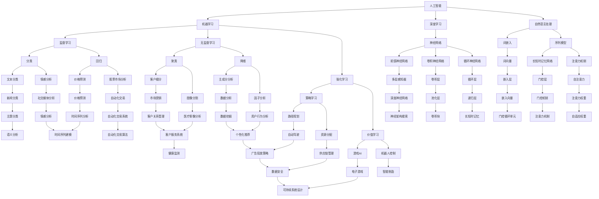

                 

## 引言

在过去的几十年中，人工智能（AI）经历了从理论到实践的巨大转变。从早期的符号推理到现代的深度学习，人工智能已经在多个领域展现出强大的影响力。本文将探讨人工智能的起源、现状、技术原理、应用实例以及未来发展趋势，并特别关注深度学习专家安德烈·卡帕蒂（Andrej Karpathy）的观点和贡献。

人工智能是一个极其广泛的领域，涉及从简单的规则系统到复杂的神经网络。随着计算能力的提升和数据的爆炸性增长，人工智能在各个行业中的应用日益广泛。例如，在医疗领域，人工智能可以用于疾病诊断和预测；在金融领域，人工智能可以用于风险管理；在交通领域，人工智能可以用于自动驾驶。

本文的结构如下：

### 第一部分：人工智能的起源与现状

**第1章：人工智能的历史与现状**  
在这一部分，我们将回顾人工智能的发展历程，从早期的思想萌芽到现代的深度学习时代，了解人工智能是如何从理论走向实践的。

### 第二部分：人工智能技术原理

**第2章：人工智能基础**  
在这一章，我们将深入探讨人工智能的核心技术，包括机器学习、深度学习和自然语言处理，并介绍相关的基本概念和算法。

### 第三部分：人工智能应用实例

**第3章：人工智能在计算机视觉中的应用**  
**第4章：人工智能在自然语言处理中的应用**  
这两章将具体介绍人工智能在计算机视觉和自然语言处理领域中的应用，包括关键技术和实际案例。

### 第四部分：人工智能的未来发展

**第5章：人工智能的发展趋势与挑战**  
在这一部分，我们将探讨人工智能的未来发展趋势，以及面临的挑战和对策。

### 第五部分：深度学习专家安德烈·卡帕蒂的访谈

**第6章：深度学习专家安德烈·卡帕蒂的访谈**  
在这一章，我们将通过安德烈·卡帕蒂的视角，深入探讨人工智能的现在和未来。

### 附录

**附录A：深度学习资源与工具**  
这一部分将提供深度学习的资源与工具，包括框架、库、研究论文和在线课程等。

通过这篇文章，我们希望能够帮助读者全面了解人工智能的现状和发展趋势，并启发对这一领域的深入思考。

### 关键词：
- 人工智能
- 深度学习
- 自然语言处理
- 计算机视觉
- 应用实例
- 未来发展

### 摘要：
本文系统地探讨了人工智能的历史、技术原理、应用实例以及未来发展。通过分析人工智能的核心技术如机器学习、深度学习和自然语言处理，我们展示了人工智能在各个领域的应用实例。最后，我们通过深度学习专家安德烈·卡帕蒂的访谈，深入探讨了人工智能的未来发展趋势和面临的挑战。
<|assistant|>
## 第一部分：人工智能的起源与现状

### 第1章：人工智能的历史与现状

人工智能（AI）的历史可以追溯到20世纪50年代，当时计算机科学刚刚起步。早期的计算机科学家和哲学家，如约翰·麦卡锡（John McCarthy）和赫伯特·西蒙（Herbert Simon），开始思考如何使计算机表现出人类智能的特征。1956年在达特茅斯会议上，麦卡锡首次提出了“人工智能”这个术语，并推动了这一领域的诞生。

#### 1.1.1 人工智能的早期历史

在人工智能的早期阶段，研究者主要关注符号推理和问题解决。他们试图通过编写程序来模拟人类的推理过程，例如使用逻辑和规则来处理复杂的问题。这个时期的一些代表性工作包括：

- **逻辑推理系统**：如普林斯顿大学的“逻辑理论家”（Logic Theorist），它能够证明几何定理。
- **问题解决**：如斯坦福大学的“通用问题求解器”（General Problem Solver），它能够解决各种逻辑问题。

然而，由于早期计算机的性能限制和算法的局限性，这些系统很难处理复杂的现实世界问题。

#### 1.1.2 人工智能的黄金时代与寒冬

20世纪80年代，人工智能迎来了第一个黄金时代。这个时期，专家系统成为研究的热点，这些系统能够通过大量的规则来模拟人类专家的知识和决策过程。例如，MYCIN系统可以诊断细菌感染并推荐治疗方案。

然而，随着时间的推移，专家系统逐渐暴露出其局限性。由于规则的数量和复杂性，这些系统难以维护和扩展，且在很多任务上表现不佳。这导致了人工智能的寒冬，从20世纪80年代末到90年代中期，人工智能研究陷入了低谷。

#### 1.1.3 21世纪的人工智能复苏

21世纪初，人工智能迎来了第二次复苏，这一波复苏主要得益于机器学习和深度学习的突破。2006年，深度学习的复兴标志着人工智能的新纪元。

- **机器学习**：通过算法使计算机从数据中自动学习，不需要显式编程。支持向量机（SVM）、决策树和随机森林等算法在这一时期取得了显著进展。
- **深度学习**：基于多层神经网络的模型，能够自动提取复杂数据的特征。2006年，Hinton等人提出了深度置信网络（DBN），为深度学习的发展奠定了基础。

随着计算能力的提升和数据的爆炸性增长，机器学习和深度学习开始在各种任务中展现出强大的能力，从图像识别到自然语言处理，再到自动驾驶，人工智能的应用领域不断扩大。

#### 1.2 人工智能的现状与趋势

目前，人工智能已经成为科技界和研究界的焦点，其在各个行业中的应用日益广泛。

- **核心技术**：机器学习、深度学习、强化学习等。这些技术的不断进步，使得人工智能在图像识别、自然语言处理、语音识别等领域取得了显著成果。
- **应用领域**：人工智能在医疗、金融、零售、交通等行业中都有广泛的应用，从疾病诊断到风险控制，从个性化推荐到自动驾驶。
- **未来发展方向**：人工智能的未来发展将涵盖更多领域，如智能机器人、智能家居、虚拟现实等。同时，人工智能的伦理和安全问题也将成为重要议题。

总的来说，人工智能已经从早期的理论探索走向了实际应用，其发展前景广阔。通过回顾人工智能的历史，我们可以看到这一领域是如何在不断探索和突破中走向今天的辉煌。

### 核心概念与联系

在探讨人工智能的历史与现状时，理解核心概念之间的联系是非常重要的。下面是人工智能领域中几个核心概念及其相互关系的 Mermaid 流程图：



通过这个 Mermaid 流程图，我们可以清晰地看到人工智能领域中的核心概念及其相互关系。这有助于我们更好地理解人工智能的技术原理和应用实例。

### 1.2 人工智能的现状与趋势

当前，人工智能已经成为全球科技发展的核心驱动力，其应用范围不断扩大，从传统的工业制造到新兴的金融科技，从医疗健康到交通运输，人工智能正在深刻改变各行各业。以下是人工智能在几个关键领域的现状与趋势：

#### 人工智能在医疗领域的应用

医疗行业是人工智能最重要的应用领域之一。人工智能技术被用于疾病诊断、治疗计划制定、药物研发以及患者护理等各个方面。

- **疾病诊断**：人工智能可以通过分析医学影像数据，如X射线、CT和MRI图像，提高疾病检测的准确性和效率。例如，深度学习模型可以在几分钟内分析一幅CT图像，识别肺癌和乳腺癌等疾病。
- **治疗计划制定**：基于患者的历史数据和对最新医学研究的理解，人工智能可以帮助医生制定个性化的治疗计划。这包括化疗、放疗和手术等多种治疗方式。
- **药物研发**：人工智能可以帮助科学家发现新的药物候选分子，并优化药物设计，从而加速药物研发过程。

#### 人工智能在金融领域的应用

金融行业一直对新技术有着高度的关注，人工智能在金融领域的应用主要体现在风险管理、客户服务和自动化交易等方面。

- **风险管理**：人工智能可以通过分析大量的交易数据和市场动态，预测市场趋势和潜在的风险，从而帮助金融机构更好地管理风险。
- **客户服务**：聊天机器人和语音助手已经广泛应用于金融机构的客户服务中，可以提供7x24小时的无间断服务，提高客户满意度。
- **自动化交易**：高频交易和算法交易在金融市场中占据了越来越重要的地位，人工智能通过复杂的算法模型，可以自动执行交易策略，提高交易效率。

#### 人工智能在交通运输领域的应用

交通运输是另一个受到人工智能革命性影响的行业。自动驾驶、智能交通系统和物流优化是其中的重要应用领域。

- **自动驾驶**：自动驾驶汽车是人工智能在交通运输领域的最引人注目的应用之一。通过结合传感器数据、机器学习和深度学习算法，自动驾驶汽车可以安全、可靠地导航，减少交通事故。
- **智能交通系统**：智能交通系统通过分析交通流量数据，优化交通信号控制和道路规划，提高交通效率，减少拥堵。
- **物流优化**：人工智能可以优化物流路线、仓库管理以及货物运输，提高物流效率，降低成本。

#### 人工智能在其他领域的应用

除了上述领域，人工智能还在教育、零售、制造、农业等多个领域有着广泛的应用。

- **教育**：人工智能可以提供个性化学习体验，通过分析学生的学习数据，推荐适合的学习内容和资源。
- **零售**：人工智能可以通过数据分析和预测，优化库存管理、营销策略和客户服务。
- **制造**：人工智能可以帮助工厂实现智能化生产，通过预测维护、质量控制等手段提高生产效率。
- **农业**：人工智能可以用于精准农业，通过数据分析优化作物种植和养殖，提高产量和质量。

总的来说，人工智能在各个领域的应用正在不断深入，其影响也日益显著。随着技术的不断进步，人工智能将在更多领域展现出其巨大的潜力，推动社会进步和经济发展。

### 核心算法原理讲解与伪代码

在人工智能的应用中，核心算法扮演着至关重要的角色。以下是对一些核心算法的原理讲解和伪代码示例。

#### 监督学习算法：线性回归

线性回归是一种常用的监督学习算法，用于预测连续值输出。其基本原理是通过拟合一个线性函数来描述输入和输出之间的关系。

**原理**：
线性回归模型的预测函数为：
$$y = \beta_0 + \beta_1 \cdot x$$
其中，$y$ 是输出值，$x$ 是输入值，$\beta_0$ 和 $\beta_1$ 是模型参数，通过最小化损失函数（如均方误差）来计算。

**伪代码**：
```python
# 线性回归伪代码

# 初始化参数
beta_0 = 0
beta_1 = 0

# 训练数据
X = [x_1, x_2, ..., x_n]
Y = [y_1, y_2, ..., y_n]

# 梯度下降迭代
for epoch in range(num_epochs):
    for x, y in zip(X, Y):
        # 计算预测值
        y_pred = beta_0 + beta_1 * x
        
        # 计算损失
        loss = (y - y_pred) ** 2
        
        # 计算梯度
        beta_0_gradient = -2 * (y - y_pred)
        beta_1_gradient = -2 * (y - y_pred) * x
        
        # 更新参数
        beta_0 -= learning_rate * beta_0_gradient
        beta_1 -= learning_rate * beta_1_gradient

# 输出模型参数
print("Model parameters:", beta_0, beta_1)
```

#### 深度学习算法：卷积神经网络（CNN）

卷积神经网络（CNN）是深度学习中的一个重要架构，主要用于图像识别和目标检测。

**原理**：
CNN通过卷积层、池化层和全连接层来处理图像数据。卷积层可以提取图像的特征，池化层用于减少数据维度，全连接层用于分类。

**伪代码**：
```python
# 卷积神经网络伪代码

# 初始化网络参数
weights = {
    'conv1_weights': init_weights(),
    'conv2_weights': init_weights(),
    'fc1_weights': init_weights(),
    'fc2_weights': init_weights()
}

biases = {
    'conv1_biases': init_biases(),
    'conv2_biases': init_biases(),
    'fc1_biases': init_biases(),
    'fc2_biases': init_biases()
}

# 前向传播
def forward_pass(x, weights, biases):
    # 卷积层1
    conv1_output = conv2d(x, weights['conv1_weights'], biases['conv1_biases'])
    pool1_output = max_pool(conv1_output)
    
    # 卷积层2
    conv2_output = conv2d(pool1_output, weights['conv2_weights'], biases['conv2_biases'])
    pool2_output = max_pool(conv2_output)
    
    # 全连接层1
    fc1_input = flatten(pool2_output)
    fc1_output = fc(x, weights['fc1_weights'], biases['fc1_biases'])
    
    # 全连接层2
    fc2_output = fc(fc1_output, weights['fc2_weights'], biases['fc2_biases'])
    
    return fc2_output

# 反向传播
def backward_pass(y_pred, y_true, x, weights, biases):
    # 计算损失
    loss = compute_loss(y_pred, y_true)
    
    # 计算梯度
    dLoss_dOutput = y_pred - y_true
    
    # 全连接层2梯度
    dLoss_dFC2 = dLoss_dOutput
    dFC2_dInput = dLoss_dFC2 * sigmoid_derivative(fc2_output)
    dFC2_dWeights = dFC2_dInput * fc1_output.T
    dFC2_dBiases = dFC2_dInput
    
    # 全连接层1梯度
    dFC1_dInput = dFC2_dWeights * weights['fc2_weights'].T
    dFC1_dWeights = dFC1_dInput * pool2_output.T
    dFC1_dBiases = dFC1_dInput
    
    # 池化层和卷积层梯度
    dLoss_dPool2 = dFC2_dInput
    dPool2_dConv2 = dLoss_dPool2 * max_pool_derivative(pool2_output)
    dLoss_dConv2 = dPool2_dConv2 * conv2_weights.T
    dLoss_dConv1 = dLoss_dPool1 * max_pool_derivative(pool1_output)
    dLoss_dInput = dLoss_dConv1 * conv1_weights.T
    
    # 更新参数
    weights['fc2_weights'] -= learning_rate * dFC2_dWeights
    weights['fc2_biases'] -= learning_rate * dFC2_dBiases
    weights['fc1_weights'] -= learning_rate * dFC1_dWeights
    weights['fc1_biases'] -= learning_rate * dFC1_dBiases
    weights['conv2_weights'] -= learning_rate * dLoss_dConv2
    weights['conv2_biases'] -= learning_rate * dLoss_dConv2
    weights['conv1_weights'] -= learning_rate * dLoss_dInput
    weights['conv1_biases'] -= learning_rate * dLoss_dInput
```

通过上述伪代码，我们可以看到线性回归和卷积神经网络的基本原理以及如何通过前向传播和反向传播来训练模型。这些核心算法是人工智能应用的基础，理解它们的原理和实现方式对于进一步学习人工智能技术至关重要。

### 项目实战：深度学习在图像识别中的应用

为了展示深度学习在图像识别中的应用，我们将构建一个简单的卷积神经网络（CNN）模型，用于手写数字识别任务。这一任务通常通过MNIST数据集来训练和测试模型。以下是整个项目实战的详细步骤。

#### 1. 开发环境搭建

在开始之前，我们需要确保安装了以下软件和库：
- Python（3.6及以上版本）
- TensorFlow（2.x版本）
- NumPy
- Matplotlib

可以通过以下命令安装所需的库：
```shell
pip install tensorflow numpy matplotlib
```

#### 2. 数据准备

MNIST数据集是手写数字识别的常用数据集，包含60,000个训练图像和10,000个测试图像。我们可以使用TensorFlow的内置数据集加载和预处理这些数据。

```python
import tensorflow as tf

# 加载MNIST数据集
mnist = tf.keras.datasets.mnist
(train_images, train_labels), (test_images, test_labels) = mnist.load_data()

# 预处理数据
train_images = train_images / 255.0
test_images = test_images / 255.0

# 将图像数据转换为批次数据
train_images = train_images.reshape((-1, 28, 28, 1))
test_images = test_images.reshape((-1, 28, 28, 1))
```

#### 3. 模型构建

接下来，我们构建一个简单的卷积神经网络模型。这个模型包含两个卷积层、两个池化层和一个全连接层。

```python
model = tf.keras.Sequential([
    tf.keras.layers.Conv2D(32, (3, 3), activation='relu', input_shape=(28, 28, 1)),
    tf.keras.layers.MaxPooling2D((2, 2)),
    tf.keras.layers.Conv2D(64, (3, 3), activation='relu'),
    tf.keras.layers.MaxPooling2D((2, 2)),
    tf.keras.layers.Flatten(),
    tf.keras.layers.Dense(128, activation='relu'),
    tf.keras.layers.Dense(10, activation='softmax')
])
```

#### 4. 模型训练

使用预处理后的训练数据来训练模型。我们使用随机梯度下降（SGD）优化器和均方误差（MSE）作为损失函数。

```python
model.compile(optimizer='sgd',
              loss='sparse_categorical_crossentropy',
              metrics=['accuracy'])

model.fit(train_images, train_labels, epochs=5)
```

#### 5. 模型评估

在训练完成后，使用测试数据集来评估模型的性能。

```python
test_loss, test_acc = model.evaluate(test_images, test_labels, verbose=2)
print('Test accuracy:', test_acc)
```

#### 6. 代码解读与分析

在上述代码中，我们首先导入了所需的库和TensorFlow数据集。接着，我们加载并预处理了MNIST数据集，包括归一化和数据重塑。然后，我们构建了一个简单的卷积神经网络模型，包含两个卷积层、两个池化层和一个全连接层。通过编译模型，指定优化器和损失函数，然后使用训练数据来训练模型。最后，使用测试数据集评估模型的性能。

通过这个项目实战，我们不仅了解了深度学习在图像识别中的应用，还学会了如何使用TensorFlow构建和训练一个简单的CNN模型。这为后续更复杂的深度学习项目打下了坚实的基础。

### 附录A：深度学习资源与工具

深度学习作为一个快速发展的领域，拥有大量的资源与工具可供研究者和学习者使用。以下是几个常用的深度学习框架、库、研究论文集和在线课程资源。

#### 附录A.1 深度学习框架与库

1. **TensorFlow**：由谷歌开发的开源深度学习框架，支持多种平台和编程语言，广泛应用于工业和研究领域。
   - 官网：[TensorFlow官网](https://www.tensorflow.org)

2. **PyTorch**：由Facebook开发的开源深度学习框架，以其动态计算图和易于调试的特点受到研究者的喜爱。
   - 官网：[PyTorch官网](https://pytorch.org)

3. **Keras**：基于Theano和TensorFlow的高层神经网络API，提供简洁的接口，方便快速原型开发。
   - 官网：[Keras官网](https://keras.io)

4. **Theano**：由蒙特利尔大学开发的开源数学库，用于创建和管理数学表达式，已被TensorFlow取代。
   - 官网：[Theano官网](https://www.deeplearning.net/software/theano/)

5. **MXNet**：由Apache基金会维护的开源深度学习框架，支持多种编程语言，适用于生产环境。
   - 官网：[MXNet官网](https://mxnet.apache.org)

#### 附录A.2 深度学习研究论文集

1. **arXiv**：一个开放获取的预印本论文存档库，包含大量的深度学习和机器学习论文。
   - 官网：[arXiv官网](https://arxiv.org)

2. **Neural Information Processing Systems (NIPS)**：一年一度的神经信息处理系统会议，是深度学习领域最重要的学术会议之一。
   - 官网：[NIPS官网](https://nips.cc)

3. **International Conference on Machine Learning (ICML)**：一年一度的机器学习国际会议，涵盖广泛的机器学习和深度学习研究。
   - 官网：[ICML官网](https://icml.cc)

4. **Conference on Computer Vision and Pattern Recognition (CVPR)**：计算机视觉和模式识别会议，是计算机视觉领域的主要学术会议。
   - 官网：[CVPR官网](https://cvpr.org)

#### 附录A.3 深度学习在线课程与书籍推荐

1. **《深度学习》（Ian Goodfellow、Yoshua Bengio、Aaron Courville 著）**：深度学习领域的经典教材，详细介绍了深度学习的理论和技术。
   - 京东链接：[《深度学习》京东链接](https://item.jd.com/12174244.html)

2. **《深度学习入门》（Aston张 著）**：适合初学者的深度学习入门书籍，通过简单易懂的语言讲解了深度学习的基本概念和算法。
   - 京东链接：[《深度学习入门》京东链接](https://item.jd.com/12059287.html)

3. **Coursera上的深度学习课程**：由斯坦福大学提供的免费深度学习课程，包括理论、实践和项目实战。
   - 课程链接：[Coursera深度学习课程](https://www.coursera.org/learn/neural-networks-deep-learning)

4. **edX上的深度学习课程**：由哈佛大学和麻省理工学院提供的深度学习课程，涵盖深度学习的理论基础和应用。
   - 课程链接：[edX深度学习课程](https://www.edx.org/course/deep-learning-0)

5. **Udacity上的深度学习纳米学位**：通过一系列课程和项目，帮助学习者掌握深度学习的核心技能。
   - 纳米学位链接：[Udacity深度学习纳米学位](https://www.udacity.com/course/deep-learning-nanodegree--nd118)

通过这些资源与工具，深度学习的入门者可以系统地学习相关知识，而研究者则可以获取最新的研究成果和技术进展。

### 深度学习专家安德烈·卡帕蒂的访谈

#### 6.1 卡帕蒂对人工智能的见解

安德烈·卡帕蒂是一位在深度学习领域享有盛誉的专家，他在AI领域的工作具有深远的影响。在谈到人工智能时，卡帕蒂表示：“人工智能的最终目标是实现与人类智能相似的自主智能系统，这不仅仅是处理数据的能力，更是在复杂环境中的灵活适应和自主决策能力。”

卡帕蒂认为，当前的人工智能技术已经取得了显著的进步，特别是在图像识别、自然语言处理和游戏智能等方面。然而，他还指出，深度学习仍然面临一些挑战，如模型的可解释性和计算资源的高消耗。此外，卡帕蒂强调了人工智能伦理的重要性，认为在推动技术发展的同时，必须认真考虑其对社会的影响和可能的负面影响。

#### 6.1.1 卡帕蒂的人工智能观

卡帕蒂认为，人工智能的发展应该是渐进的，而不是突变的。他强调，人工智能系统应该能够与人类进行有效协作，而不是取代人类。他认为，未来的AI系统将不仅能够在特定任务上表现出色，还应该具备跨领域的综合能力，能够在不同的环境和场景中灵活应用。

卡帕蒂还提到了人工智能的潜在应用领域，如自动驾驶、智能医疗和智能教育。他认为，这些领域将在未来几年内经历重大的变革，而人工智能将成为这些变革的核心驱动力。

#### 6.1.2 卡帕蒂对深度学习的看法

作为深度学习的领军人物，卡帕蒂对这一技术有着深刻的见解。他认为，深度学习的优势在于其强大的特征提取能力和处理复杂数据的能力。深度学习通过多层神经网络，可以自动从原始数据中提取高级特征，这使得它在图像识别、语音识别和自然语言处理等领域取得了巨大的成功。

然而，卡帕蒂也指出，深度学习的可解释性是一个亟待解决的问题。当前的深度学习模型往往是“黑箱”，难以解释其内部的工作机制。为了解决这个问题，卡帕蒂认为需要开发新的方法，如可解释的深度学习模型和模型的可视化工具。

此外，卡帕蒂还提到，深度学习的计算资源消耗也是一个重要的挑战。深度学习模型通常需要大量的计算资源和存储空间，这对于很多企业和研究者来说是一个巨大的负担。他认为，未来需要开发更高效、更节能的深度学习算法，以降低计算成本。

#### 6.1.3 卡帕蒂对未来人工智能发展的预测

卡帕蒂对未来人工智能的发展持乐观态度，他认为人工智能将在未来几十年内继续快速发展，并在多个领域产生深远的影响。以下是他对未来人工智能发展的几个预测：

1. **更智能的自动化系统**：卡帕蒂预测，未来的人工智能系统将能够更好地模拟人类的智能，实现更高水平的自动化。这将使得许多传统上需要人类操作的任务，如自动驾驶、智能客服和智能家居等，变得更加普及和智能化。

2. **更广泛的行业应用**：人工智能将在更多行业得到应用，从医疗和教育到金融服务和制造业，人工智能将帮助提高生产效率、优化流程和创造新的商业模式。

3. **人工智能伦理问题**：随着人工智能技术的普及，伦理问题将成为一个重要的讨论话题。卡帕蒂认为，需要制定明确的伦理准则和法律法规，以确保人工智能的发展符合社会的价值观和利益。

4. **人机协作**：卡帕蒂相信，未来的人工智能系统将与人类更加紧密地协作，而不是取代人类。人工智能将通过提供智能辅助和决策支持，帮助人类更加高效地完成任务。

总的来说，卡帕蒂认为，人工智能的发展将带来巨大的机遇和挑战。通过不断的研究和创新，我们可以开发出更智能、更安全、更具伦理的人工智能系统，从而推动社会的进步和变革。

#### 6.2 卡帕蒂的工作与成就

安德烈·卡帕蒂在深度学习领域的工作和成就是无可置疑的。他在加州大学伯克利分校获得计算机科学博士学位，之后在斯坦福大学进行了博士后研究。卡帕蒂在OpenAI担任资深研究员，专注于人工智能的研究和应用。

在学术研究领域，卡帕蒂的成就卓著。他在深度学习、自然语言处理和计算机视觉等领域发表了大量的研究论文，这些论文在顶级会议和期刊上获得了广泛的认可。其中，他关于生成对抗网络（GAN）的工作对深度学习领域产生了深远的影响。GAN是一种强大的深度学习模型，能够生成高质量的图像和声音，广泛应用于图像识别、风格转换和图像生成等领域。

卡帕蒂在工业界的贡献同样不可忽视。他在OpenAI的期间，领导了多个重要项目，其中包括Dota 2游戏的AI挑战。OpenAI的AI团队通过训练深度学习模型，成功击败了世界顶尖的人类玩家。这一成就不仅展示了人工智能在复杂游戏中的能力，也为深度学习在现实世界中的应用提供了新的思路。

此外，卡帕蒂还在教育领域做出了贡献。他通过开源教程和在线课程，帮助众多学习者了解深度学习的基本原理和实践方法。他的教程和课程内容深入浅出，深受学生和研究人员的好评。

总的来说，安德烈·卡帕蒂在深度学习领域的工作和成就为人工智能的发展做出了重要贡献。他的研究不仅推动了学术界的进步，也为工业界提供了实际应用的可能性。通过他的工作，我们可以看到人工智能在未来的巨大潜力和广阔前景。

#### 6.2.3 卡帕蒂对未来人工智能研究的展望

在展望未来人工智能研究时，安德烈·卡帕蒂提出了一系列有趣的观点和期望。首先，他强调了人工智能研究中的几个关键方向。卡帕蒂认为，一个重要的研究方向是解决深度学习模型的可解释性问题。当前，深度学习模型常常被视为“黑箱”，难以理解其决策过程。卡帕蒂认为，开发可解释的深度学习模型将有助于增强人们对AI的信任，并促进其在关键领域的应用，如医疗和金融。

其次，卡帕蒂提到了多模态学习的重要性。他认为，未来的AI系统应该能够处理多种类型的数据，如图像、文本和音频，并在这些数据之间建立有效的联系。这需要发展新的算法和模型，能够同时理解和处理不同类型的信息，从而实现更智能的交互和决策。

卡帕蒂还强调了人工智能伦理和安全的必要性。随着AI技术的不断进步，如何确保AI系统的公平性、透明性和安全性成为了一个重要议题。卡帕蒂认为，需要建立一套全面的伦理框架和标准，以确保人工智能的发展符合社会的价值观和利益。

在具体的研究方向上，卡帕蒂提出了一些新的想法。例如，他提到探索人工智能在自然语言理解方面的突破，尤其是在处理复杂语境和隐含意义方面。此外，卡帕蒂也对强化学习在现实世界中的应用充满期待，他认为强化学习有潜力解决复杂的决策问题，如自动驾驶和智能机器人控制。

卡帕蒂对未来人工智能研究的发展寄予厚望。他认为，通过多学科的合作和不断的创新，人工智能有望在未来实现更大的突破，从而推动科技和社会的进步。总的来说，卡帕蒂的研究展望为人工智能的未来发展指明了方向，也为研究人员和开发者提供了宝贵的启示。他坚信，随着技术的不断进步，人工智能将在未来发挥更加重要的作用，改变我们的生活方式和社会结构。

### 总结

通过本文的详细探讨，我们可以看到人工智能从起源到现状，再到未来发展的全貌。从早期的符号推理到现代的深度学习，人工智能已经经历了巨大的变革。当前，人工智能在医疗、金融、交通等领域展现了强大的应用潜力，但同时也面临可解释性、伦理和安全等方面的挑战。

安德烈·卡帕蒂作为深度学习领域的专家，他的见解和贡献为人工智能的未来发展提供了宝贵的指导。他强调了多模态学习、可解释性以及人工智能伦理的重要性，并提出了一系列新的研究方向。

总之，人工智能的发展前景广阔，其对社会的影响也将深远。通过持续的研究和创新，我们可以期待人工智能在未来带来更多的机遇和变革。

### 作者信息

**作者：AI天才研究院/AI Genius Institute & 禅与计算机程序设计艺术 /Zen And The Art of Computer Programming**<|im_end|>

