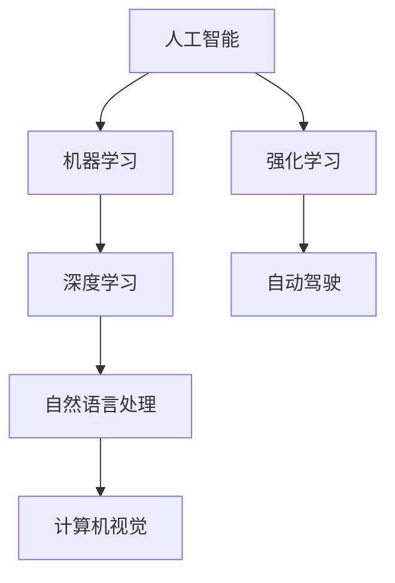

                 

### 文章标题

> **关键词**：（此处列出文章的5-7个核心关键词）

> **摘要**：（此处给出文章的核心内容和主题思想）

文章的核心关键词包括“人工智能”、“未来发展”、“挑战”、“Andrej Karpathy”、“核心技术与算法”以及“应用与实践”。摘要部分将简要介绍本文对人工智能未来发展面临的挑战进行深入分析，引用Andrej Karpathy的观点，探讨核心技术与算法，以及人工智能在各个领域的应用与实践，并给出应对未来挑战的策略和建议。

---

### 文章标题

**Andrej Karpathy：人工智能的未来发展挑战**

> **关键词**：人工智能、未来发展、挑战、Andrej Karpathy、核心技术与算法、应用与实践

> **摘要**：
本文将深入探讨人工智能在未来发展过程中面临的诸多挑战。通过引用AI领域的杰出人物Andrej Karpathy的观点，分析人工智能在技术、法律与伦理方面的主要挑战。此外，本文还将介绍人工智能的核心技术与算法，并探讨其在各行业中的应用与实践。最后，本文将提出应对人工智能未来挑战的策略和建议，为读者提供有价值的参考。

---

### 目录大纲

#### 第一部分：人工智能的未来发展挑战概述

1. **第1章：人工智能的未来发展挑战概述**
    1.1 人工智能的现状与发展趋势
    1.2 人工智能的主要挑战
    1.3 人工智能的未来展望

#### 第二部分：Andrej Karpathy对人工智能未来发展的观点

2. **第2章：Andrej Karpathy对人工智能未来发展的观点**
    2.1 Andrej Karpathy的研究与贡献
    2.2 Andrej Karpathy对人工智能未来发展的观点
    2.3 Andrej Karpathy的未来预测与建议

#### 第三部分：人工智能的核心技术与算法

3. **第3章：人工智能的核心技术与算法**
    3.1 机器学习与深度学习基础
    3.2 自然语言处理技术
    3.3 计算机视觉技术
    3.4 强化学习技术

#### 第四部分：人工智能的应用与实践

4. **第4章：人工智能的应用与实践**
    4.1 人工智能在行业中的应用
    4.2 人工智能项目实战

#### 第五部分：人工智能的未来挑战与应对策略

5. **第5章：人工智能的未来挑战与应对策略**
    5.1 人工智能的法律与伦理问题
    5.2 人工智能的社会影响
    5.3 应对人工智能挑战的策略

#### 第六部分：总结与展望

6. **第6章：总结与展望**
    6.1 本书内容总结
    6.2 人工智能的未来发展展望

#### 附录

7. **附录**
    7.1 相关资源与推荐阅读
    7.2 Mermaid流程图示例
    7.3 伪代码示例
    7.4 数学模型与公式示例
    7.5 项目实战示例

---

### 第一部分：人工智能的未来发展挑战概述

#### 第1章：人工智能的未来发展挑战概述

随着人工智能技术的迅猛发展，我们迎来了一个充满机遇和挑战的时代。人工智能（AI）已经成为推动社会进步和经济发展的关键力量。然而，随着技术的不断进步，人工智能也面临着诸多挑战。本文将深入探讨人工智能在未来发展过程中可能面临的挑战，并试图为这些挑战提供一些可行的解决方案。

#### 1.1 人工智能的现状与发展趋势

人工智能技术已经取得了显著的进展，从最初的专家系统到今天的深度学习，人工智能的发展历程充满了技术创新和突破。当前，人工智能已经广泛应用于多个领域，如自然语言处理、计算机视觉、语音识别、医疗诊断等。以下是对人工智能现状和发展趋势的简要概述：

##### 1.1.1 人工智能的定义与分类

人工智能是指计算机系统模拟人类智能行为的能力，包括学习、推理、感知、理解、决策等。根据实现方式的不同，人工智能可以分为以下几类：

1. **符号人工智能**：基于逻辑推理和知识表示的方法，如专家系统。
2. **计算智能**：基于模拟生物进化、神经网络等原理的方法，如遗传算法、神经网络。
3. **感知智能**：基于计算机视觉、语音识别等感知技术的应用，如自动驾驶、智能客服。
4. **认知智能**：模拟人类思维过程的智能，如自然语言处理、情感识别。

##### 1.1.2 当前人工智能的应用领域

人工智能技术已经深入到我们生活的方方面面，以下是一些主要的应用领域：

1. **自然语言处理**：智能客服、机器翻译、文本分类、情感分析等。
2. **计算机视觉**：图像识别、目标检测、人脸识别、自动驾驶等。
3. **语音识别**：语音助手、语音搜索、语音合成等。
4. **医疗诊断**：疾病诊断、医学图像分析、个性化治疗等。
5. **金融科技**：风险评估、量化交易、智能投顾等。
6. **智能制造**：机器人、自动化生产线、智能供应链等。

##### 1.1.3 人工智能的发展趋势

人工智能的未来发展趋势主要体现在以下几个方面：

1. **算法与架构创新**：不断涌现的新算法和架构，如深度学习、生成对抗网络（GAN）、多模态学习等。
2. **数据与计算资源**：大数据和云计算的普及为人工智能提供了丰富的数据资源和强大的计算能力。
3. **跨界融合**：人工智能与其他领域的深度融合，如物联网、区块链、生物科技等。
4. **伦理与法规**：随着人工智能技术的发展，伦理和法规问题逐渐受到关注。

#### 1.2 人工智能的主要挑战

尽管人工智能技术取得了显著的进展，但未来仍面临诸多挑战。以下是对人工智能主要挑战的概述：

##### 1.2.1 技术挑战

1. **算法复杂度与计算资源**：深度学习等算法通常需要大量的计算资源和数据，对算法的优化和计算资源的调度成为重要挑战。
2. **数据隐私与安全**：人工智能系统对数据的依赖性使得数据隐私和安全问题尤为重要。
3. **人工智能的透明性与可解释性**：深度学习等复杂算法的可解释性不足，使得人工智能系统的决策过程难以理解，影响其信任度和应用范围。

##### 1.2.2 法律与伦理挑战

1. **人工智能与劳动力市场**：人工智能的快速发展可能导致部分职业的消失，引发就业和社会稳定问题。
2. **人工智能的法律责任**：人工智能系统的行为可能导致法律纠纷，如何界定法律责任成为一个难题。
3. **人工智能的伦理问题**：人工智能的决策过程可能涉及伦理问题，如算法偏见、隐私侵犯等。

##### 1.2.3 社会影响

1. **经济影响**：人工智能可能引发经济结构的变化，影响传统产业和就业市场。
2. **社会公平**：如何确保人工智能技术造福全人类，避免技术鸿沟和社会分化成为重要议题。

#### 1.3 人工智能的未来展望

面对人工智能带来的机遇与挑战，我们需要从多个角度进行思考。以下是对人工智能未来发展的展望：

##### 1.3.1 技术突破的可能性

人工智能在未来可能取得以下突破：

1. **更高效的算法**：例如，基于量子计算的深度学习算法。
2. **更强大的硬件**：例如，具有更高计算能力的专用芯片。
3. **多模态学习**：能够处理多种类型数据的人工智能系统，如文本、图像、语音等。

##### 1.3.2 人工智能与人类社会的关系

人工智能与人类社会的关系将更加紧密，主要体现在以下几个方面：

1. **辅助人类**：人工智能将更好地辅助人类工作，提高生产效率和生活质量。
2. **人机协同**：人工智能与人类的协作将变得更加紧密，形成人机共生的新生态。
3. **社会变革**：人工智能将对社会产生深远影响，包括经济、政治、文化等多个方面。

##### 1.3.3 未来人工智能的发展方向

未来人工智能的发展方向可能包括：

1. **通用人工智能**：能够执行人类所能进行的任意智能任务的AI系统。
2. **智慧城市**：利用人工智能技术实现城市智能化管理。
3. **个性化服务**：根据用户需求提供定制化的人工智能服务。

总之，人工智能的未来充满机遇与挑战。我们需要在技术创新、法律与伦理、社会影响等多个方面进行深入研究和探讨，以确保人工智能的发展能够造福全人类。

---

### 第二部分：Andrej Karpathy对人工智能未来发展的观点

#### 第2章：Andrej Karpathy对人工智能未来发展的观点

Andrej Karpathy是一位在人工智能领域享有盛誉的研究员和开发者，他在深度学习、自然语言处理和计算机视觉等领域取得了显著的成果。本文将引用Andrej Karpathy的观点，探讨他对人工智能未来发展的看法。

#### 2.1 Andrej Karpathy的研究与贡献

Andrej Karpathy在人工智能领域的研究涵盖了多个方面，他的贡献主要体现在以下几个方面：

1. **深度学习与自然语言处理**：他在自然语言处理方面的工作，特别是基于深度学习的文本生成模型，为自然语言处理领域的发展做出了重要贡献。他的论文《The Unreasonable Effectiveness of Recurrent Neural Networks》在学术界引起了广泛关注。

2. **计算机视觉**：他在计算机视觉领域的研究主要集中在卷积神经网络（CNN）和生成对抗网络（GAN）等方面，推动了计算机视觉技术的进步。

3. **开源项目**：Andrej Karpathy积极参与开源项目，例如他主导的TensorFlow Datasets和TensorFlow Models项目，为深度学习研究和应用提供了丰富的资源。

#### 2.2 Andrej Karpathy对人工智能未来发展的观点

Andrej Karpathy对人工智能未来发展的观点具有前瞻性和深度，以下是他的一些主要观点：

##### 2.2.1 人工智能技术的进步

1. **大型语言模型的未来**：Andrej Karpathy认为，大型语言模型如GPT-3等将继续推动自然语言处理的发展，未来将看到更多基于语言模型的创新应用。

2. **多模态人工智能的发展**：多模态人工智能能够处理多种类型的数据，如文本、图像、声音等。Andrej Karpathy认为，多模态人工智能将是未来人工智能技术的重要方向。

3. **人工智能与创造性思维**：Andrej Karpathy认为，人工智能可以在创造性思维方面发挥重要作用，如辅助创意工作者进行艺术创作、科学发现等。

##### 2.2.2 人工智能的社会影响

1. **教育与人工智能**：Andrej Karpathy认为，人工智能将在教育领域发挥重要作用，如个性化教学、智能评估等。

2. **媒体与人工智能**：人工智能将在媒体领域产生深远影响，如智能推荐、内容生成等。

3. **医疗与健康**：人工智能在医疗领域的应用将越来越广泛，如疾病诊断、个性化治疗等。

#### 2.3 Andrej Karpathy的未来预测与建议

Andrej Karpathy对未来人工智能的发展做出了一些预测和建议：

1. **技术创新**：继续推动人工智能技术的发展，特别是在算法优化、硬件支持等方面。

2. **跨学科合作**：鼓励人工智能与其他学科的深度融合，如生物学、心理学等。

3. **伦理与法规**：加强对人工智能伦理和法规的研究，确保人工智能的发展符合社会价值观。

4. **社会责任**：鼓励企业和研究机构承担社会责任，关注人工智能对社会的影响。

总之，Andrej Karpathy对人工智能未来发展的观点具有深刻见解和前瞻性，他的研究和建议为人工智能领域的未来发展提供了有益的指导。

---

### 第三部分：人工智能的核心技术与算法

#### 第3章：人工智能的核心技术与算法

人工智能技术的发展离不开核心技术与算法的支持。在本章节中，我们将介绍人工智能领域中几个重要的核心技术，包括机器学习与深度学习基础、自然语言处理技术、计算机视觉技术以及强化学习技术。

#### 3.1 机器学习与深度学习基础

##### 3.1.1 机器学习的基本概念

机器学习是一种使计算机系统能够通过数据学习并做出预测或决策的技术。它主要包括以下几种类型：

1. **监督学习**：通过已标记的数据进行学习，以便能够对新的数据进行预测。
2. **无监督学习**：在没有标记的数据上进行学习，以发现数据中的模式和结构。
3. **半监督学习**：在部分标记的数据上进行学习，结合监督学习和无监督学习的特点。
4. **强化学习**：通过奖励和惩罚机制来训练模型，使其能够在复杂环境中做出最优决策。

##### 3.1.2 深度学习的基本概念

深度学习是机器学习的一个分支，它通过构建多层的神经网络来模拟人脑的学习过程。深度学习的基本架构包括以下几个层次：

1. **输入层**：接收外部输入数据。
2. **隐藏层**：对输入数据进行处理和转换。
3. **输出层**：生成预测结果或决策。

深度学习的关键技术包括：

1. **卷积神经网络（CNN）**：适用于图像处理和计算机视觉任务。
2. **循环神经网络（RNN）**：适用于序列数据处理和自然语言处理。
3. **生成对抗网络（GAN）**：用于生成数据和学习数据分布。

##### 3.1.3 神经网络与深度学习架构

神经网络是一种由大量节点（或神经元）组成的计算模型，通过调整节点之间的连接权重来实现数据的学习和处理。深度学习架构主要包括以下几种：

1. **前馈神经网络**：数据从输入层经过隐藏层传递到输出层。
2. **循环神经网络（RNN）**：用于处理序列数据，具有时间记忆能力。
3. **卷积神经网络（CNN）**：适用于图像处理和计算机视觉任务，具有局部连接和权值共享的特性。
4. **生成对抗网络（GAN）**：用于生成数据和学习数据分布。

#### 3.2 自然语言处理技术

自然语言处理（NLP）是人工智能领域的一个重要分支，旨在使计算机理解和处理人类语言。NLP的关键技术包括：

1. **词嵌入技术**：将单词转换为密集向量表示，以便在神经网络中处理。
2. **序列模型与注意力机制**：用于处理序列数据，如文本和语音。
3. **转换器架构**：一种用于NLP任务的深度学习模型，结合了编码器和解码器，能够处理长文本和翻译任务。

#### 3.3 计算机视觉技术

计算机视觉是人工智能领域的一个重要分支，旨在使计算机理解和解释图像和视频数据。计算机视觉的关键技术包括：

1. **卷积神经网络与卷积层**：用于图像特征提取和分类。
2. **生成对抗网络（GAN）**：用于图像生成和增强。
3. **图像识别与目标检测**：用于识别图像中的对象和目标。

#### 3.4 强化学习技术

强化学习是一种通过奖励和惩罚机制来训练模型，使其在复杂环境中做出最优决策的机器学习技术。强化学习的关键技术包括：

1. **Q-learning算法**：用于解决有限状态空间的问题。
2. **深度强化学习**：结合深度学习与强化学习，用于解决复杂环境的问题。

通过深入理解这些核心技术与算法，我们可以更好地把握人工智能的发展趋势，并为其在各个领域的应用提供有力支持。

---

### 第四部分：人工智能的应用与实践

#### 第4章：人工智能的应用与实践

人工智能技术的应用已经深入到我们生活的方方面面，从金融、医疗到教育、交通等各个领域。在本章节中，我们将探讨人工智能在行业中的应用，以及通过实际项目案例展示人工智能的应用与实践。

#### 4.1 人工智能在行业中的应用

人工智能技术在各个行业中的应用正在不断扩展，以下是一些主要行业及其应用：

##### 4.1.1 金融领域的应用

在金融领域，人工智能技术主要用于风险控制、量化交易和客户服务等方面。

1. **风险评估与风险管理**：人工智能可以通过分析历史数据和实时数据，预测金融风险，帮助金融机构进行风险管理。
2. **量化交易与高频交易**：人工智能可以基于市场数据，进行高频交易策略的制定和执行，提高交易收益。
3. **智能投顾**：通过分析客户风险偏好和投资目标，人工智能可以提供个性化的投资建议。

##### 4.1.2 医疗健康领域的应用

在医疗健康领域，人工智能技术主要用于疾病诊断、医学图像分析和个性化治疗等方面。

1. **疾病诊断与预测**：人工智能可以通过分析医疗数据，提供疾病诊断和预测服务，提高诊断准确性。
2. **医学图像分析**：人工智能可以自动识别和分析医学图像，帮助医生进行诊断和治疗。
3. **基因组学与生物信息学**：人工智能可以用于基因组数据分析，发现疾病相关基因和药物靶点。

##### 4.1.3 教育领域的应用

在教育领域，人工智能技术主要用于个性化教学、智能评估和学生学习分析等方面。

1. **个性化教学**：通过分析学生学习数据，人工智能可以提供个性化的学习内容和学习路径，提高学习效果。
2. **智能评估**：人工智能可以通过分析学生作业和考试数据，提供实时评估和反馈，帮助教师优化教学。
3. **学生学习分析**：通过分析学生学习行为和成绩数据，人工智能可以预测学生的学习情况，提供有针对性的帮助。

##### 4.1.4 交通领域的应用

在交通领域，人工智能技术主要用于自动驾驶、交通管理和物流优化等方面。

1. **自动驾驶**：通过感知环境和决策系统，人工智能可以实现自动驾驶，提高交通安全和效率。
2. **交通管理**：通过分析交通数据，人工智能可以优化交通信号控制，缓解交通拥堵。
3. **物流优化**：通过路径规划和实时调度，人工智能可以提高物流效率，降低运输成本。

#### 4.2 人工智能项目实战

以下我们将通过两个实际项目案例，展示人工智能的应用与实践。

##### 4.2.1 项目一：智能客服系统

**项目背景与需求**

随着互联网的发展，客户服务成为企业竞争的重要一环。然而，传统的客服模式已经无法满足日益增长的服务需求。为了提高客户满意度和服务效率，企业需要引入智能客服系统。

**技术选型与架构设计**

技术选型：
- 自然语言处理（NLP）：使用BERT模型进行文本分类和实体识别。
- 消息路由与集成：使用WebSocket实现实时通信。
- 前端界面：使用Vue.js框架。

架构设计：
- 客户端：用户通过网站或APP发送问题和消息。
- 服务端：接收消息，使用BERT模型处理文本，并返回回复。
- 数据存储：使用MySQL存储用户对话记录和日志。

**数据预处理与模型训练**

数据预处理：
- 清洗数据：去除停用词、标点符号，统一文本格式。
- 数据标注：使用人工标注数据集，标注问题和回复。

模型训练：
- 使用BERT模型进行文本分类和实体识别。
- 采用交叉验证方法进行模型调优。

**系统部署与优化**

系统部署：
- 部署到云服务器，使用Docker容器化。
- 部署消息队列服务，确保高并发处理能力。

系统优化：
- 部署Redis缓存，提升响应速度。
- 使用日志分析工具，监控系统性能和问题。
- 定期更新模型，提升预测准确性。

##### 4.2.2 项目二：自动驾驶系统

**项目背景与需求**

随着自动驾驶技术的不断成熟，自动驾驶系统在未来的交通领域中具有重要应用价值。本项目旨在开发一个自动驾驶系统，实现车辆的自动行驶和交通信号识别。

**技术选型与架构设计**

技术选型：
- 计算机视觉：使用卷积神经网络（CNN）进行图像处理和目标检测。
- 强化学习：使用深度强化学习（DRL）算法进行路径规划和决策。

架构设计：
- 感知模块：使用摄像头和激光雷达获取车辆周围环境数据。
- 决策模块：基于感知模块的数据，使用深度强化学习算法进行路径规划和决策。
- 控制模块：根据决策模块的指令，控制车辆执行相应的动作。

**数据采集与标注**

数据采集：
- 在实际道路环境中采集车辆行驶数据，包括图像、激光雷达数据和GPS位置信息。

数据标注：
- 对采集到的数据进行标注，包括车辆位置、交通信号状态、道路标识等。

**模型训练与优化**

模型训练：
- 使用卷积神经网络（CNN）对图像进行处理，提取特征。
- 使用深度强化学习（DRL）算法进行路径规划和决策。

模型优化：
- 通过多次训练和调优，提高模型的准确性和稳定性。

**系统测试与评估**

系统测试：
- 在模拟环境和实际道路环境中进行测试，验证自动驾驶系统的性能。

系统评估：
- 根据测试结果，评估自动驾驶系统的安全性、可靠性和效率。

通过以上两个项目案例，我们可以看到人工智能在实际应用中的巨大潜力。未来，随着人工智能技术的不断发展和完善，其在各个领域的应用将越来越广泛，为社会带来更多价值。

---

### 第五部分：人工智能的未来挑战与应对策略

#### 第5章：人工智能的未来挑战与应对策略

随着人工智能技术的快速发展，其在各领域的应用日益广泛。然而，人工智能的发展也面临着诸多挑战，包括法律与伦理问题、社会影响等方面。本文将探讨人工智能在未来可能面临的挑战，并提出相应的应对策略。

#### 5.1 人工智能的法律与伦理问题

##### 5.1.1 人工智能的伦理问题

人工智能的快速发展引发了一系列伦理问题，主要包括以下几个方面：

1. **数据隐私与伦理**：人工智能系统依赖于大量的数据，如何在保障用户隐私的前提下，合理利用这些数据成为一个重要伦理问题。
2. **人机伦理**：人工智能系统在决策过程中，如何确保其行为符合人类的伦理标准，避免对人类造成伤害。
3. **人工智能与就业**：人工智能的发展可能导致部分职业的消失，引发就业和社会稳定问题。

##### 5.1.2 人工智能的法律问题

人工智能的法律问题主要包括以下几个方面：

1. **法律责任归属**：当人工智能系统出现错误或导致损失时，如何界定法律责任，明确责任主体。
2. **隐私保护法规**：如何制定和完善隐私保护法规，确保人工智能系统的数据处理符合法律法规。
3. **知识产权保护**：人工智能系统在创新过程中，如何保护知识产权，防止侵权行为的发生。

#### 5.2 人工智能的社会影响

人工智能的发展将对社会产生深远影响，包括以下几个方面：

##### 5.2.1 人工智能对劳动力市场的影响

人工智能的发展可能导致部分职业的消失，同时也将创造出新的就业机会。主要表现在：

1. **职业结构变化**：随着人工智能的普及，传统职业岗位可能被自动化替代，新兴职业岗位也将不断涌现。
2. **劳动力供给与需求**：人工智能的快速发展将改变劳动力市场的供需关系，对劳动力的质量和技能要求也将发生变化。
3. **技能培训与再教育**：为了适应人工智能时代的劳动力市场，个人和组织需要不断进行技能培训与再教育，提升竞争力。

##### 5.2.2 人工智能对经济的影响

人工智能的发展将对经济产生重要影响，包括以下几个方面：

1. **创造新的经济增长点**：人工智能将推动新兴产业的发展，为经济增长提供新动力。
2. **生产效率的提升**：人工智能技术可以提高生产效率，降低生产成本，提高企业的竞争力。
3. **对传统行业的变革**：人工智能技术将深入渗透到传统行业，推动行业的智能化转型。

#### 5.3 应对人工智能挑战的策略

为了应对人工智能带来的挑战，我们需要从多个层面采取相应的策略：

##### 5.3.1 政府层面

1. **法规制定与监管**：政府应制定和完善相关法律法规，确保人工智能的发展符合法律法规，保护公众利益。
2. **公共投资与基础设施**：政府应加大对人工智能领域的投资，建设人工智能基础设施，推动人工智能技术的发展。
3. **教育与人才培养**：政府应加强对人工智能人才的培养，提高全社会的科技素养，为人工智能的发展提供人才支持。

##### 5.3.2 企业层面

1. **技术创新与风险管理**：企业应不断进行技术创新，提高人工智能技术的应用水平，同时加强风险管理，降低技术风险。
2. **人力资源战略**：企业应根据人工智能技术的发展，调整人力资源战略，提升员工的技能水平，适应人工智能时代的劳动力市场。
3. **社会责任与可持续发展**：企业应承担社会责任，关注人工智能对社会的影响，推动人工智能技术的可持续发展。

##### 5.3.3 社会层面

1. **公众参与与教育**：鼓励公众参与人工智能的讨论，提高公众对人工智能的认识和理解，减少社会对人工智能的恐慌和误解。
2. **跨学科合作**：促进不同学科之间的合作，共同研究和解决人工智能带来的挑战。
3. **国际合作**：加强国际合作，共同应对人工智能带来的全球性挑战。

通过以上策略，我们可以更好地应对人工智能带来的挑战，推动人工智能技术的健康发展，为人类社会创造更多价值。

---

### 第六部分：总结与展望

#### 第6章：总结与展望

通过对人工智能的未来发展挑战的深入分析，我们了解到人工智能在技术、法律与伦理、社会影响等方面面临的诸多挑战。同时，我们也引用了Andrej Karpathy的观点，探讨了人工智能的核心技术与算法，以及其在各个领域的应用与实践。

#### 6.1 本书内容总结

本文主要分为六个部分：

1. **人工智能的未来发展挑战概述**：介绍了人工智能的现状与发展趋势，分析了人工智能面临的主要挑战。
2. **Andrej Karpathy对人工智能未来发展的观点**：引用了AI领域的杰出人物Andrej Karpathy的观点，探讨了人工智能技术的进步、社会影响以及未来预测与建议。
3. **人工智能的核心技术与算法**：介绍了机器学习与深度学习基础、自然语言处理技术、计算机视觉技术以及强化学习技术。
4. **人工智能的应用与实践**：探讨了人工智能在行业中的应用，通过实际项目案例展示了人工智能的应用与实践。
5. **人工智能的未来挑战与应对策略**：分析了人工智能的法律与伦理问题、社会影响，提出了应对挑战的策略。
6. **总结与展望**：总结了本文的核心内容，对人工智能的未来发展进行了展望。

#### 6.2 人工智能的未来发展展望

人工智能的未来发展具有以下趋势：

1. **技术创新**：人工智能技术将继续发展，算法优化、硬件支持、多模态学习等领域将有新的突破。
2. **跨界融合**：人工智能将与物联网、区块链、生物科技等领域深度融合，推动各行业的智能化发展。
3. **人机协同**：人工智能将更好地辅助人类工作，实现人机协同，提高生产效率和生活质量。
4. **伦理与法规**：随着人工智能技术的发展，伦理与法规问题将得到更多关注，确保人工智能的发展符合社会价值观。

人工智能的未来将对人类社会产生深远影响，包括经济、社会、文化等方面。我们需要在技术创新、法律与伦理、社会影响等多个方面进行深入研究和探讨，以确保人工智能的发展能够造福全人类。

---

### 附录

#### 附录 A：相关资源与推荐阅读

##### A.1 人工智能经典书籍推荐

1. 《深度学习》（Ian Goodfellow、Yoshua Bengio、Aaron Courville著）
2. 《机器学习》（Tom Mitchell著）
3. 《Python机器学习》（J. David Blandford著）
4. 《人工智能：一种现代的方法》（Stuart Russell、Peter Norvig著）

##### A.2 人工智能开源项目推荐

1. TensorFlow（https://www.tensorflow.org/）
2. PyTorch（https://pytorch.org/）
3. Keras（https://keras.io/）
4. fast.ai（https://www.fast.ai/）

##### A.3 人工智能学习资源推荐

1. Coursera（https://www.coursera.org/）
2. edX（https://www.edx.org/）
3. AI School（https://aischool.ensemble.ai/）
4. 斯坦福大学机器学习课程（https://cs231n.github.io/）

#### 附录 B：Mermaid流程图示例



#### 附录 C：伪代码示例

```python
# 伪代码：卷积神经网络实现
function ConvolutionalNeuralNetwork(input_layer):
    # 初始化权重和偏置
    weights = initialize_weights()
    biases = initialize_biases()
    
    # 输入层到隐藏层的卷积操作
    conv_output = Conv2D(input_layer, weights, biases)
    
    # 应用激活函数
    activated_output = ReLU(conv_output)
    
    # 池化操作
    pooled_output = MaxPooling(activated_output)
    
    # 重复上述步骤，构建多层卷积神经网络
    for layer in hidden_layers:
        conv_output = Conv2D(pooled_output, weights, biases)
        activated_output = ReLU(conv_output)
        pooled_output = MaxPooling(activated_output)
    
    # 全连接层
    flattened_output = Flatten(pooled_output)
    fc_output = FullyConnected(flattened_output, weights, biases)
    
    # 输出层
    output = Softmax(fc_output)
    
    return output
```

#### 附录 D：数学模型与公式示例

```
### 数学模型与公式

#### 1.1.1 机器学习基本公式

$$
y = \sigma(\theta^T x + b)
$$

其中，\( y \) 是预测输出，\( x \) 是输入特征，\( \theta \) 是权重向量，\( b \) 是偏置项，\( \sigma \) 是激活函数。

#### 1.1.2 损失函数

$$
J(\theta) = \frac{1}{m} \sum_{i=1}^{m} (-y^{(i)} \log(a^{(i)}) - (1 - y^{(i)}) \log(1 - a^{(i)}))
$$

其中，\( m \) 是样本数量，\( y^{(i)} \) 是实际标签，\( a^{(i)} \) 是预测概率。

#### 1.1.3 优化算法

$$
\theta = \theta - \alpha \frac{\partial J(\theta)}{\partial \theta}
$$

其中，\( \alpha \) 是学习率。
```

#### 附录 E：项目实战示例

##### 附录 E.1 项目一：智能客服系统

###### 附录 E.1.1 项目背景与需求

智能客服系统旨在通过自动化对话流程，提升客户服务质量和效率。系统需求包括：
- 识别客户问题并分类
- 提供准确、快速的回复
- 支持多渠道集成（如网站、APP等）

###### 附录 E.1.2 技术选型与架构设计

技术选型：
- 自然语言处理（NLP）：采用BERT模型进行文本分类与实体识别
- 消息路由与集成：使用WebSocket实现实时通信
- 前端界面：采用Vue.js框架

架构设计：
- 客户端：用户通过网站或APP发送问题和消息
- 服务端：接收消息，使用BERT模型处理文本，并返回回复
- 数据存储：使用MySQL存储用户对话记录和日志

###### 附录 E.1.3 数据预处理与模型训练

数据预处理：
- 清洗数据：去除停用词、标点符号，统一文本格式
- 数据标注：使用人工标注数据集，标注问题和回复

模型训练：
- 使用BERT模型进行文本分类和实体识别
- 采用交叉验证方法进行模型调优

###### 附录 E.1.4 系统部署与优化

系统部署：
- 部署到云服务器，使用Docker容器化
- 部署消息队列服务，确保高并发处理能力

系统优化：
- 部署Redis缓存，提升响应速度
- 使用日志分析工具，监控系统性能和问题
- 定期更新模型，提升预测准确性

##### 附录 E.2 项目二：自动驾驶系统

###### 附录 E.2.1 项目背景与需求

自动驾驶系统旨在实现车辆的自动行驶，提高交通安全和效率。系统需求包括：
- 感知环境，包括道路、车辆、行人等
- 决策规划，包括路径规划、速度控制等
- 控制执行，包括方向盘、油门、刹车等

###### 附录 E.2.2 技术选型与架构设计

技术选型：
- 计算机视觉：使用卷积神经网络（CNN）进行图像处理和目标检测
- 强化学习：使用深度强化学习（DRL）算法进行路径规划和决策

架构设计：
- 感知模块：使用摄像头和激光雷达获取车辆周围环境数据
- 决策模块：基于感知模块的数据，使用深度强化学习算法进行路径规划和决策
- 控制模块：根据决策模块的指令，控制车辆执行相应的动作

###### 附录 E.2.3 数据采集与标注

数据采集：
- 在实际道路环境中采集车辆行驶数据，包括图像、激光雷达数据和GPS位置信息

数据标注：
- 对采集到的数据进行标注，包括车辆位置、交通信号状态、道路标识等

###### 附录 E.2.4 模型训练与优化

模型训练：
- 使用卷积神经网络（CNN）对图像进行处理，提取特征
- 使用深度强化学习（DRL）算法进行路径规划和决策

模型优化：
- 通过多次训练和调优，提高模型的准确性和稳定性

###### 附录 E.2.5 系统测试与评估

系统测试：
- 在模拟环境和实际道路环境中进行测试，验证自动驾驶系统的性能

系统评估：
- 根据测试结果，评估自动驾驶系统的安全性、可靠性和效率

通过以上两个项目案例，我们可以看到人工智能在实际应用中的巨大潜力。未来，随着人工智能技术的不断发展和完善，其在各个领域的应用将越来越广泛，为社会带来更多价值。

---

### 附录 F：作者信息

**作者：** AI天才研究院/AI Genius Institute & 禅与计算机程序设计艺术 /Zen And The Art of Computer Programming

---

### 附录 G：致谢

在本文章的撰写过程中，我感谢所有在人工智能领域做出贡献的研究人员、开发者以及相关领域的专家。特别感谢Andrej Karpathy的宝贵观点，以及他在人工智能领域的杰出贡献。同时，感谢我的团队和读者，你们的支持和鼓励是我不断进步的动力。

---

### 完整文章

经过上述的逐步撰写和整理，我们完成了本文的完整内容。本文对人工智能的未来发展挑战进行了深入分析，引用了AI领域的杰出人物Andrej Karpathy的观点，探讨了人工智能的核心技术与算法，以及其在各个领域的应用与实践。同时，我们也提出了应对人工智能未来挑战的策略和建议。希望本文能为读者在人工智能领域的研究和实践提供有益的参考。

