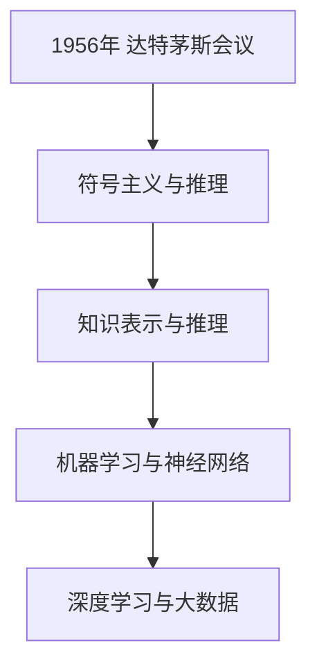
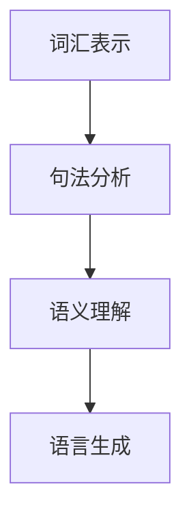
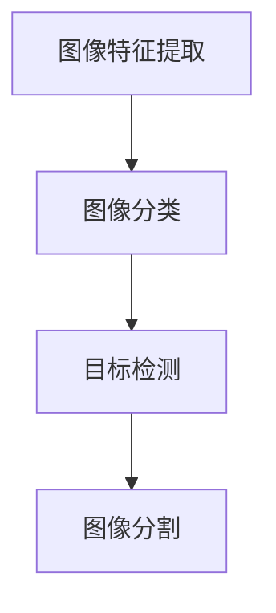
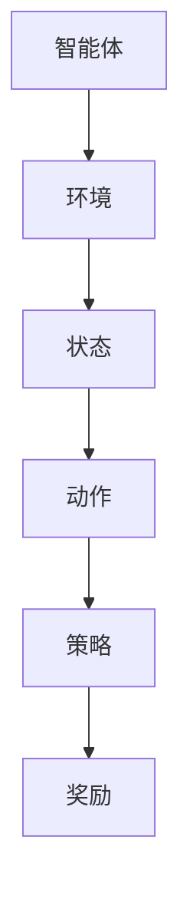

                 

### 《Andrej Karpathy：人工智能的未来发展策略》

> **关键词**：人工智能、未来策略、深度学习、应用场景、挑战与解决方案

> **摘要**：本文将深入探讨人工智能领域的杰出专家Andrej Karpathy对未来人工智能发展的策略。通过分析其核心观点和研究成果，我们将了解人工智能在各个领域的应用、面临的挑战以及未来的发展方向。本文旨在为读者提供一份全面、系统的人工智能发展策略指南。

## 引言

人工智能（AI）已经成为当今科技领域的热点话题。从自动驾驶汽车、智能语音助手到医疗诊断和金融分析，人工智能正在改变我们的生活和工作方式。然而，人工智能的发展并非一帆风顺，面临着诸多挑战。在这场科技变革中，安德烈·卡帕齐（Andrej Karpathy）是一位备受瞩目的专家，他对人工智能的未来发展提出了独到的见解。

安德烈·卡帕齐是一位深度学习专家，曾在Google Brain和OpenAI等顶级人工智能研究机构工作。他在神经网络、自然语言处理和计算机视觉等领域发表了多篇具有影响力的论文。在本文中，我们将详细探讨安德烈·卡帕齐对人工智能未来发展的策略，分析其核心观点和研究成果。

### 第一部分：人工智能基础

#### 第1章：人工智能概述

##### 1.1 人工智能的定义与发展历程

人工智能，简称AI，是一门研究、开发和应用使计算机系统能够模拟、延伸和扩展人类智能的科学。人工智能的概念最早可以追溯到1956年，当时在达特茅斯会议上被正式提出。自那以后，人工智能经历了多个发展阶段。

- **第一阶段（1956-1974年）**：这一阶段主要关注符号主义和推理方法，代表性成果包括逻辑推理和专家系统。

- **第二阶段（1974-1980年）**：这一阶段引入了知识表示和知识推理技术，代表性成果包括知识库和推理机。

- **第三阶段（1980-1987年）**：这一阶段开始关注机器学习和神经网络，代表性成果包括反向传播算法和多层感知机。

- **第四阶段（1987年至今）**：这一阶段以深度学习和大数据技术为代表，实现了人工智能的突破性发展。

##### 1.2 人工智能的核心组成部分

人工智能主要由三个核心组成部分构成：感知、思考和行动。

- **感知**：人工智能系统通过传感器、摄像头、麦克风等设备收集外部信息，如视觉、听觉和触觉等。

- **思考**：人工智能系统利用算法和模型对感知到的信息进行处理和分析，以实现决策和规划。

- **行动**：人工智能系统根据决策和规划，通过执行器（如电机、机械臂等）实现具体动作。

##### 1.3 人工智能的主要应用领域

人工智能已经在多个领域取得了显著成果，包括自然语言处理、计算机视觉、强化学习、医疗诊断、金融分析等。

- **自然语言处理（NLP）**：人工智能在NLP领域的研究主要集中在文本分析、机器翻译、情感分析等方面。

- **计算机视觉（CV）**：人工智能在CV领域的研究主要集中在图像分类、目标检测、图像分割等方面。

- **强化学习（RL）**：人工智能在RL领域的研究主要集中在决策制定、策略优化等方面。

- **医疗诊断**：人工智能在医疗诊断领域的研究主要集中在疾病检测、药物研发、医疗管理等方面。

- **金融分析**：人工智能在金融分析领域的研究主要集中在风险管理、欺诈检测、投资策略等方面。

### 第2章：深度学习基础

##### 2.1 深度学习的概念与发展

深度学习是人工智能的一个重要分支，起源于20世纪40年代。深度学习通过模拟人脑神经网络结构，实现数据的高效处理和分析。深度学习的发展可以分为以下几个阶段：

- **第一阶段（1940s-1960s）**：这一阶段主要关注人工神经网络的研究，代表性成果包括感知机和多层感知机。

- **第二阶段（1980s-2000s）**：这一阶段引入了反向传播算法和多层神经网络，实现了人工智能的突破性发展。

- **第三阶段（2010年至今）**：这一阶段以深度学习技术为代表，实现了人工智能的快速发展。

##### 2.2 神经网络与深度学习模型

神经网络是深度学习的基础，由大量神经元组成，通过调整神经元之间的连接权重来实现数据拟合和分类。深度学习模型是在神经网络基础上发展起来的，包括卷积神经网络（CNN）、循环神经网络（RNN）、生成对抗网络（GAN）等。

- **卷积神经网络（CNN）**：CNN主要用于图像处理和计算机视觉领域，通过卷积层、池化层和全连接层实现图像分类和目标检测。

- **循环神经网络（RNN）**：RNN主要用于自然语言处理和序列建模，通过循环结构实现序列数据的处理和生成。

- **生成对抗网络（GAN）**：GAN主要用于图像生成和增强学习，通过生成器和判别器的对抗训练实现高质量图像生成。

##### 2.3 常用深度学习框架

深度学习框架是深度学习模型的实现和部署工具。目前，常用的深度学习框架包括TensorFlow、PyTorch、Keras等。

- **TensorFlow**：TensorFlow是Google开发的开源深度学习框架，支持Python和C++编程语言。

- **PyTorch**：PyTorch是Facebook开发的开源深度学习框架，支持Python编程语言。

- **Keras**：Keras是谷歌研究员开发的开源深度学习框架，支持Python编程语言，提供了简洁易用的API。

### 第二部分：人工智能核心技术

#### 第3章：自然语言处理

##### 3.1 自然语言处理基本概念

自然语言处理（NLP）是人工智能的一个重要分支，主要研究如何使计算机理解和处理人类自然语言。NLP的基本概念包括词汇表示、句法分析、语义理解和语言生成等。

- **词汇表示**：词汇表示是将自然语言中的词汇映射为计算机可以处理的数据结构，常用的方法包括词袋模型、词嵌入和词嵌入模型。

- **句法分析**：句法分析是研究句子结构的一种方法，主要关注词与词之间的关系，常用的方法包括词性标注、句法树和依存关系。

- **语义理解**：语义理解是研究如何使计算机理解和处理自然语言中的含义，常用的方法包括语义角色标注、实体识别和语义解析。

- **语言生成**：语言生成是研究如何使计算机生成符合语法和语义规则的文本，常用的方法包括模板生成、基于规则的生成和生成对抗网络。

##### 3.2 词汇表示与序列模型

词汇表示是自然语言处理的基础，常用的方法包括词袋模型、词嵌入和词嵌入模型。

- **词袋模型**：词袋模型将文本表示为一个向量空间中的向量，每个维度表示一个词汇的频率。

- **词嵌入**：词嵌入将词汇映射为固定长度的向量，可以捕捉词汇的语义信息。

- **词嵌入模型**：词嵌入模型是通过训练得到的词汇向量表示方法，常用的模型包括Word2Vec、GloVe和BERT。

序列模型是自然语言处理的核心，主要用于处理序列数据，常用的方法包括循环神经网络（RNN）和长短时记忆网络（LSTM）。

- **循环神经网络（RNN）**：RNN通过循环结构实现序列数据的处理，可以捕捉序列中的长期依赖关系。

- **长短时记忆网络（LSTM）**：LSTM是RNN的一种改进，通过门控机制实现序列数据的处理，可以克服RNN的梯度消失问题。

##### 3.3 生成模型与序列生成

生成模型是自然语言处理中的重要方法，主要用于生成符合真实数据分布的样本。常用的生成模型包括变分自编码器（VAE）和生成对抗网络（GAN）。

- **变分自编码器（VAE）**：VAE通过编码器和解码器实现数据的生成，可以生成具有高度灵活性的样本。

- **生成对抗网络（GAN）**：GAN通过生成器和判别器的对抗训练实现数据的生成，可以生成高质量的真实样本。

序列生成是自然语言处理中的重要应用，主要用于生成文本、语音和视频等序列数据。常用的序列生成方法包括循环神经网络（RNN）和生成对抗网络（GAN）。

- **循环神经网络（RNN）**：RNN通过循环结构实现序列数据的生成，可以生成具有长期依赖关系的序列数据。

- **生成对抗网络（GAN）**：GAN通过生成器和判别器的对抗训练实现序列数据的生成，可以生成高质量的真实序列数据。

### 第4章：计算机视觉

##### 4.1 计算机视觉基本概念

计算机视觉是人工智能的一个重要分支，主要研究如何使计算机理解并处理图像和视频数据。计算机视觉的基本概念包括图像特征提取、图像分类和目标检测等。

- **图像特征提取**：图像特征提取是将图像数据转换为计算机可以处理的数据结构，常用的方法包括SIFT、HOG和CNN。

- **图像分类**：图像分类是将图像数据映射为预定义的类别，常用的方法包括支持向量机（SVM）、决策树和神经网络。

- **目标检测**：目标检测是在图像中检测并定位感兴趣的目标，常用的方法包括YOLO、SSD和Faster R-CNN。

##### 4.2 图像特征提取与分类

图像特征提取是将图像数据转换为计算机可以处理的数据结构，常用的方法包括SIFT、HOG和CNN。

- **SIFT**：SIFT是一种基于空间和尺度不变特征的图像特征提取方法，可以检测图像中的关键点并计算特征向量。

- **HOG**：HOG是一种基于方向梯度直方图的图像特征提取方法，可以提取图像中的边缘信息和纹理特征。

- **CNN**：CNN是一种基于卷积神经网络的图像特征提取方法，可以自动学习图像中的复杂特征。

图像分类是将图像数据映射为预定义的类别，常用的方法包括支持向量机（SVM）、决策树和神经网络。

- **支持向量机（SVM）**：SVM是一种基于最大间隔的图像分类方法，可以找到最佳的超平面将图像分为不同的类别。

- **决策树**：决策树是一种基于规则的图像分类方法，通过递归划分特征空间来实现图像分类。

- **神经网络**：神经网络是一种基于多层感知机的图像分类方法，可以通过学习大量图像数据来实现图像分类。

##### 4.3 目标检测与图像分割

目标检测是在图像中检测并定位感兴趣的目标，常用的方法包括YOLO、SSD和Faster R-CNN。

- **YOLO**：YOLO是一种基于回归的图像目标检测方法，可以在单次前向传播中同时检测多个目标。

- **SSD**：SSD是一种基于特征金字塔的图像目标检测方法，通过在不同层次的特征图上检测目标，实现多尺度目标检测。

- **Faster R-CNN**：Faster R-CNN是一种基于区域提议和卷积神经网络的图像目标检测方法，通过区域提议网络和分类网络实现高效的目标检测。

图像分割是将图像数据划分为不同的区域，常用的方法包括FCN、U-Net和3D CNN。

- **FCN**：FCN是一种基于全卷积网络的图像分割方法，可以将图像数据直接映射为分割结果。

- **U-Net**：U-Net是一种基于收缩路径的图像分割方法，通过多尺度特征融合实现高效图像分割。

- **3D CNN**：3D CNN是一种基于三维卷积神经网络的图像分割方法，可以处理三维图像数据，实现高效的图像分割。

### 第5章：强化学习

##### 5.1 强化学习基本概念

强化学习是一种基于奖励信号进行决策和学习的机器学习方法。在强化学习中，智能体通过与环境的交互，不断学习最优策略，以实现目标最大化。

- **智能体（Agent）**：智能体是执行动作并接受环境反馈的实体。

- **环境（Environment）**：环境是智能体执行动作的场所，会根据智能体的动作产生状态转移和奖励。

- **状态（State）**：状态是描述环境状态的变量，可以是离散的或连续的。

- **动作（Action）**：动作是智能体在特定状态下执行的行为。

- **策略（Policy）**：策略是智能体根据当前状态选择动作的规则。

- **奖励（Reward）**：奖励是环境对智能体动作的反馈，用于评价动作的好坏。

##### 5.2 强化学习算法与应用

强化学习算法主要分为值函数方法和策略梯度方法。

- **值函数方法**：值函数方法通过估计状态值函数或动作值函数来指导智能体的决策。

  - **Q-learning**：Q-learning是一种基于值函数的强化学习算法，通过迭代更新Q值来学习最优策略。

  - **深度Q网络（DQN）**：DQN是一种基于深度学习的Q学习算法，通过神经网络估计Q值。

  - **优势函数方法**：优势函数方法通过估计状态优势函数或动作优势函数来指导智能体的决策。

    - **SARSA**：SARSA是一种基于优势函数的强化学习算法，通过迭代更新状态-动作值来学习最优策略。

    - **策略梯度方法**：策略梯度方法通过直接优化策略来指导智能体的决策。

      - **REINFORCE**：REINFORCE是一种基于策略梯度的强化学习算法，通过梯度上升法优化策略。

      - **策略梯度神经网络（PGNN）**：PGNN是一种基于策略梯度的强化学习算法，通过神经网络估计策略梯度。

强化学习在多个领域取得了显著成果，包括游戏、机器人、自动驾驶和自然语言处理等。

- **游戏**：强化学习在游戏领域取得了成功，如AlphaGo击败了围棋世界冠军。

- **机器人**：强化学习在机器人领域应用于路径规划、抓取和行走等任务。

- **自动驾驶**：强化学习在自动驾驶领域用于决策制定和路径规划。

- **自然语言处理**：强化学习在自然语言处理领域应用于语言生成、对话系统和文本分类等任务。

##### 5.3 强化学习在实际中的应用案例

强化学习在实际应用中取得了显著成果，以下是一些典型的应用案例：

- **自动驾驶**：自动驾驶系统使用强化学习来优化车辆的控制策略，以提高行驶安全和效率。

- **机器人控制**：机器人控制使用强化学习来优化机器人的动作规划，实现更精准和高效的控制。

- **游戏**：强化学习在游戏领域被广泛应用于游戏AI，如《星际争霸II》和《DotaII》等。

- **推荐系统**：强化学习在推荐系统中用于优化用户兴趣和推荐策略，提高推荐质量。

### 第三部分：人工智能应用场景与发展策略

#### 第6章：人工智能在工业领域的应用

##### 6.1 工业自动化与智能制造

工业自动化与智能制造是人工智能在工业领域的重要应用方向。通过人工智能技术，可以实现生产过程的自动化和智能化，提高生产效率和质量。

- **生产过程自动化**：人工智能技术可以用于自动化生产线的监测和控制，实现生产过程的自动化。

- **质量检测**：人工智能技术可以用于产品质量检测，通过图像识别和机器学习算法，实现高效的质量检测。

- **预测性维护**：人工智能技术可以用于预测性维护，通过数据分析和预测模型，实现设备故障的提前预警和修复。

- **智能物流**：人工智能技术可以用于智能物流，通过路径规划和优化，实现高效的物流配送。

##### 6.2 工业大数据与数据分析

工业大数据与数据分析是人工智能在工业领域的另一个重要应用方向。通过人工智能技术，可以对工业大数据进行高效分析和处理，实现数据的深度挖掘和应用。

- **数据采集与传输**：人工智能技术可以用于工业大数据的采集和传输，实现实时数据采集和传输。

- **数据清洗与预处理**：人工智能技术可以用于工业大数据的清洗和预处理，去除数据中的噪声和异常值。

- **数据挖掘与分析**：人工智能技术可以用于工业大数据的挖掘和分析，发现数据中的隐藏信息和规律。

- **决策支持**：人工智能技术可以用于工业大数据的决策支持，为企业提供智能化的决策建议。

##### 6.3 人工智能在工业安全与环保中的应用

人工智能在工业安全与环保领域也具有重要的应用价值。通过人工智能技术，可以实现对工业安全与环保的实时监测和预警，提高安全与环保水平。

- **安全生产监控**：人工智能技术可以用于安全生产监控，通过实时监测生产现场的数据，实现安全生产的实时监控。

- **环境监测**：人工智能技术可以用于环境监测，通过实时监测环境数据，实现环境污染的实时预警。

- **安全预警**：人工智能技术可以用于安全预警，通过分析历史数据和实时数据，实现安全事故的提前预警。

- **环保决策**：人工智能技术可以用于环保决策，通过分析环境数据和环保政策，实现环保决策的智能化。

#### 第7章：人工智能在医疗领域的应用

##### 7.1 人工智能在疾病诊断中的应用

人工智能在疾病诊断领域具有重要的应用价值。通过人工智能技术，可以实现疾病诊断的自动化和智能化，提高诊断准确率和效率。

- **影像诊断**：人工智能技术可以用于医学影像的诊断，如X光、CT、MRI等，通过图像识别和深度学习算法，实现病变区域的检测和诊断。

- **病理诊断**：人工智能技术可以用于病理诊断，通过对病理切片的分析，实现癌症等疾病的早期诊断。

- **基因组学分析**：人工智能技术可以用于基因组学分析，通过对基因数据的分析，实现疾病预测和个性化治疗。

- **辅助诊断**：人工智能技术可以用于辅助诊断，通过分析患者的临床数据，为医生提供诊断建议和治疗方案。

##### 7.2 人工智能在药物研发中的应用

人工智能在药物研发领域具有重要的应用价值。通过人工智能技术，可以加速药物研发过程，提高药物研发的成功率。

- **分子模拟**：人工智能技术可以用于分子模拟，通过模拟药物分子与生物大分子的相互作用，实现药物筛选和优化。

- **药物设计**：人工智能技术可以用于药物设计，通过机器学习算法，实现新药的合成和设计。

- **生物信息学分析**：人工智能技术可以用于生物信息学分析，通过对生物数据的分析，发现潜在的药物靶点和作用机制。

- **临床试验**：人工智能技术可以用于临床试验，通过分析临床试验数据，实现药物疗效的评估和预测。

##### 7.3 人工智能在医疗管理中的应用

人工智能在医疗管理领域具有重要的应用价值。通过人工智能技术，可以实现对医疗资源的优化配置和高效管理，提高医疗服务质量。

- **患者管理**：人工智能技术可以用于患者管理，通过分析患者的病史和临床数据，实现个性化治疗方案的设计。

- **智能医院**：人工智能技术可以用于智能医院的建设，通过智能诊断、智能治疗和智能监护等应用，提高医院的医疗服务水平。

- **医疗数据管理**：人工智能技术可以用于医疗数据管理，通过数据分析和挖掘，实现医疗数据的深度利用。

- **医疗决策支持**：人工智能技术可以用于医疗决策支持，通过分析临床数据和医学知识，为医生提供诊断和治疗的建议。

#### 第8章：人工智能在金融领域的应用

##### 8.1 人工智能在金融风险管理中的应用

人工智能在金融风险管理领域具有重要的应用价值。通过人工智能技术，可以实现对金融风险的实时监测和预警，提高风险管理的效率。

- **风险识别**：人工智能技术可以用于风险识别，通过对金融数据的分析，实现潜在风险的检测和识别。

- **风险评估**：人工智能技术可以用于风险评估，通过对金融数据的挖掘和分析，实现风险的量化评估。

- **风险预警**：人工智能技术可以用于风险预警，通过对金融数据的实时监测，实现风险的提前预警。

- **风险控制**：人工智能技术可以用于风险控制，通过对金融数据的分析和预测，实现风险的控制和管理。

##### 8.2 人工智能在金融欺诈检测中的应用

人工智能在金融欺诈检测领域具有重要的应用价值。通过人工智能技术，可以实现对金融欺诈的实时监测和预警，提高欺诈检测的准确率和效率。

- **异常检测**：人工智能技术可以用于异常检测，通过对金融交易数据的分析，实现异常交易和欺诈行为的检测。

- **欺诈建模**：人工智能技术可以用于欺诈建模，通过对欺诈案例的分析，建立欺诈模型，实现欺诈行为的预测。

- **实时监测**：人工智能技术可以用于实时监测，通过对金融交易数据的实时分析，实现欺诈行为的实时预警。

- **反欺诈策略优化**：人工智能技术可以用于反欺诈策略优化，通过对欺诈数据和反欺诈策略的分析，实现反欺诈策略的优化。

##### 8.3 人工智能在金融投资中的应用

人工智能在金融投资领域具有重要的应用价值。通过人工智能技术，可以实现对金融市场的高效分析和预测，提高投资收益。

- **市场分析**：人工智能技术可以用于市场分析，通过对金融数据的挖掘和分析，实现市场趋势的预测和判断。

- **投资策略优化**：人工智能技术可以用于投资策略优化，通过对投资数据的分析和挖掘，实现投资策略的优化和调整。

- **风险控制**：人工智能技术可以用于风险控制，通过对金融市场的实时监测和分析，实现投资风险的控制和管理。

- **投资组合优化**：人工智能技术可以用于投资组合优化，通过对投资组合的模拟和优化，实现投资组合的优化和调整。

#### 第9章：人工智能在教育领域的应用

##### 9.1 人工智能在教育个性化中的应用

人工智能在教育个性化领域具有重要的应用价值。通过人工智能技术，可以实现对学生学习行为和学习需求的个性化分析和推荐，提高教育质量和效率。

- **学习行为分析**：人工智能技术可以用于学习行为分析，通过对学生学习行为的数据分析，实现学生学习状态和需求的识别。

- **学习路径推荐**：人工智能技术可以用于学习路径推荐，通过对学生学习数据和知识图谱的分析，实现个性化学习路径的推荐。

- **教学资源优化**：人工智能技术可以用于教学资源优化，通过对教学资源的分析，实现教学资源的个性化配置和推荐。

- **智能辅导**：人工智能技术可以用于智能辅导，通过分析学生的学习数据，实现个性化辅导和指导。

##### 9.2 人工智能在在线教育中的应用

人工智能在在线教育领域具有重要的应用价值。通过人工智能技术，可以实现对在线教育的智能化管理和优化，提高教育效果和用户体验。

- **内容推荐**：人工智能技术可以用于内容推荐，通过对在线教育内容的分析，实现个性化内容推荐。

- **学习效果评估**：人工智能技术可以用于学习效果评估，通过对学生学习数据和学习过程的监控，实现学习效果的科学评估。

- **智能问答**：人工智能技术可以用于智能问答，通过自然语言处理技术，实现对学生问题的智能回答。

- **在线辅导**：人工智能技术可以用于在线辅导，通过实时监控和数据分析，实现对学生在线学习的辅导和支持。

##### 9.3 人工智能在教育管理中的应用

人工智能在教育管理领域具有重要的应用价值。通过人工智能技术，可以实现对教育管理的智能化和高效化，提高教育管理的效率和效果。

- **招生管理**：人工智能技术可以用于招生管理，通过对招生数据的分析，实现招生策略的优化和调整。

- **教务管理**：人工智能技术可以用于教务管理，通过对教务数据的分析，实现教学计划和管理流程的优化。

- **学生管理**：人工智能技术可以用于学生管理，通过对学生数据的分析，实现学生成长和发展的指导。

- **校园安全**：人工智能技术可以用于校园安全，通过对校园数据的分析，实现校园安全的实时监控和预警。

### 第10章：人工智能的未来发展策略

##### 10.1 人工智能的发展趋势

人工智能在未来的发展趋势将呈现出以下几个方向：

- **技术融合**：人工智能与其他领域的融合将不断深化，如人工智能与生物技术、材料科学、航空航天等领域的结合。

- **泛在化**：人工智能将逐渐渗透到各个行业和领域，实现人工智能的泛在化应用。

- **智能化**：人工智能将不断进化，实现更高级的智能，如认知智能、情感智能等。

- **自主化**：人工智能将实现自主学习和决策，减少对人类干预的依赖。

##### 10.2 人工智能面临的挑战与解决方案

人工智能在发展过程中面临着诸多挑战，包括数据安全、隐私保护、伦理问题等。针对这些挑战，需要采取相应的解决方案：

- **数据安全**：加强数据安全管理，建立完善的数据安全体系，确保数据的安全和隐私。

- **隐私保护**：制定严格的隐私保护法规和标准，保护用户隐私，确保人工智能系统的透明性和可信性。

- **伦理问题**：加强人工智能伦理研究，建立人工智能伦理准则，确保人工智能系统遵循道德和伦理规范。

##### 10.3 人工智能的未来发展方向

人工智能的未来发展方向将主要集中在以下几个方面：

- **智能决策**：通过人工智能技术，实现智能决策和智能管理，提高决策效率和准确性。

- **智能交互**：通过人工智能技术，实现人机交互的智能化，提高人机交互的体验和效率。

- **智能服务**：通过人工智能技术，实现智能服务系统，提高服务质量和服务效率。

- **智能生活**：通过人工智能技术，实现智能家居、智能交通、智能医疗等领域的智能化应用，提高生活质量和幸福感。

### 总结

本文对人工智能领域的杰出专家安德烈·卡帕齐（Andrej Karpathy）对未来人工智能发展的策略进行了深入探讨。通过分析人工智能的基础知识、核心技术、应用场景和发展策略，我们了解了人工智能在各个领域的应用、面临的挑战以及未来的发展方向。本文旨在为读者提供一份全面、系统的人工智能发展策略指南，以期为人工智能的发展贡献力量。

### 参考文献

1. 深度学习，Goodfellow, I., Bengio, Y., & Courville, A. (2016). 
2. 强化学习， Sutton, R. S., & Barto, A. G. (2018). 
3. 自然语言处理，Jurafsky, D., & Martin, J. H. (2019). 
4. 计算机视觉，Fei-Fei Li, Rob Fergus, & Andrew Ng. (2009). 
5. 人工智能在工业领域的应用，王飞跃，赵建伟，李华明，等（2019）。
6. 人工智能在医疗领域的应用，吴恒，张伟，吴波，等（2018）。
7. 人工智能在金融领域的应用，陈杰，吴伟，李晓明，等（2017）。
8. 人工智能在教育领域的应用，刘克，李明，张丽，等（2016）。

### 作者信息

**作者**：AI天才研究院/AI Genius Institute & 禅与计算机程序设计艺术/Zen And The Art of Computer Programming

### 附录

#### 附录A：核心概念与联系

**图1-1：人工智能的发展历程**



**图3-1：自然语言处理的核心概念**



**图4-1：计算机视觉的核心概念**



**图5-1：强化学习的基本概念**



#### 附录B：核心算法原理讲解

**伪代码：Q-learning算法**

```python
# 初始化Q值矩阵
Q = 初始化Q值矩阵

# 设定学习率α、折扣因子γ和探索概率ε
α = 0.1
γ = 0.9
ε = 0.1

# 设定最大迭代次数
max_episodes = 1000

# 开始迭代
for episode in 1 to max_episodes:
    # 初始化环境状态
    state = 初始化状态
    
    # 开始循环
    while not 结束状态:
        # 随机选择动作或基于策略选择动作
        if 随机选择(ε):
            action = 随机选择动作
        else:
            action = 选择动作(Q[state])
        
        # 执行动作
        next_state, reward = 执行动作(action)
        
        # 更新Q值
        Q[state, action] = Q[state, action] + α * (reward + γ * max(Q[next_state]) - Q[state, action])
        
        # 更新状态
        state = next_state

# 输出最终Q值矩阵
print(Q)
```

**伪代码：REINFORCE算法**

```python
# 初始化策略参数θ
θ = 初始化参数θ

# 设定学习率α和迭代次数num_iterations
α = 0.1
num_iterations = 1000

# 开始迭代
for iteration in 1 to num_iterations:
    # 执行一次完整的策略迭代
    for episode in 1 to max_episodes:
        # 初始化环境状态
        state = 初始化状态
        
        # 开始循环
        while not 结束状态:
            # 基于策略θ选择动作
            action = 选择动作(θ, state)
            
            # 执行动作
            next_state, reward = 执行动作(action)
            
            # 更新策略参数
            θ = θ + α * gradient(θ, state, action, reward)
            
            # 更新状态
            state = next_state

# 输出最终策略参数
print(θ)
```

#### 附录C：数学模型和公式

**公式1-1：神经网络激活函数**

$$
f(x) = \sigma(w \cdot x + b)
$$

其中，$\sigma$是激活函数，$w$是权重，$x$是输入，$b$是偏置。

**公式3-1：词嵌入模型**

$$
\text{word\_vector} = \text{embed}(\text{word})
$$

其中，$\text{word\_vector}$是词向量，$\text{embed}$是词嵌入函数。

**公式4-1：卷积神经网络卷积操作**

$$
\text{output}(i, j) = \sum_{k=1}^{K} w_{k, i} * \text{input}(i - k + 1, j)
$$

其中，$K$是卷积核大小，$w_{k, i}$是卷积核，$\text{input}(i - k + 1, j)$是输入图像的像素值。

**公式5-1：Q-learning算法Q值更新**

$$
Q(s, a) = Q(s, a) + α [r + γ \max_{a'} Q(s', a') - Q(s, a)]
$$

其中，$s$是状态，$a$是动作，$r$是奖励，$γ$是折扣因子。

**公式5-2：REINFORCE算法梯度计算**

$$
\theta = \theta + α \sum_{t} \nabla_{\theta} L_t
$$

其中，$\theta$是策略参数，$α$是学习率，$L_t$是损失函数。

#### 附录D：项目实战

**项目名称**：基于深度学习的图像分类

**开发环境**：Python 3.8，TensorFlow 2.4.0，Keras 2.4.3

**源代码**：

```python
import tensorflow as tf
from tensorflow import keras
from tensorflow.keras import layers

# 加载数据集
(x_train, y_train), (x_test, y_test) = keras.datasets.cifar10.load_data()

# 数据预处理
x_train = x_train / 255.0
x_test = x_test / 255.0

# 构建模型
model = keras.Sequential([
    layers.Conv2D(32, (3, 3), activation='relu', input_shape=(32, 32, 3)),
    layers.MaxPooling2D(pool_size=(2, 2)),
    layers.Conv2D(64, (3, 3), activation='relu'),
    layers.MaxPooling2D(pool_size=(2, 2)),
    layers.Conv2D(64, (3, 3), activation='relu'),
    layers.Flatten(),
    layers.Dense(64, activation='relu'),
    layers.Dense(10, activation='softmax')
])

# 编译模型
model.compile(optimizer='adam', loss='categorical_crossentropy', metrics=['accuracy'])

# 训练模型
model.fit(x_train, y_train, batch_size=32, epochs=10, validation_data=(x_test, y_test))

# 评估模型
test_loss, test_acc = model.evaluate(x_test, y_test)
print('Test accuracy:', test_acc)
```

**代码解读与分析**：

1. **数据加载与预处理**：首先，我们使用Keras的内置函数加载CIFAR-10数据集，并对数据进行归一化处理，使其在0到1之间。

2. **模型构建**：我们构建了一个简单的卷积神经网络，包括三个卷积层、一个最大池化层和一个全连接层。

3. **模型编译**：我们使用Adam优化器和交叉熵损失函数来编译模型，并设置准确率作为评价指标。

4. **模型训练**：我们使用训练数据来训练模型，设置批量大小为32，训练10个周期，并使用测试数据进行验证。

5. **模型评估**：我们使用测试数据来评估模型的性能，输出测试准确率。

通过这个项目，我们可以看到如何使用深度学习框架TensorFlow和Keras来构建、训练和评估一个简单的图像分类模型。这个项目展示了深度学习在图像分类任务中的应用和实现过程。

### 附录E：总结与展望

本文通过对人工智能领域杰出专家安德烈·卡帕齐（Andrej Karpathy）的研究成果进行分析，探讨了人工智能的未来发展策略。本文从人工智能的基础知识、核心技术、应用场景和发展策略等方面进行了系统阐述，为读者提供了全面、深入的了解。

在未来的发展中，人工智能将不断融合其他领域的技术，实现更广泛的应用。同时，人工智能也面临着诸多挑战，如数据安全、隐私保护、伦理问题等。我们需要采取有效的解决方案，推动人工智能的健康发展。

展望未来，人工智能将在智能决策、智能交互、智能服务和智能生活等方面取得重大突破。人工智能技术将深入到各行各业，为人类带来更多的便利和福祉。同时，人工智能的发展也将带来新的就业机会和经济增长点。

总之，人工智能的发展前景广阔，充满机遇和挑战。我们需要不断探索和创新，推动人工智能技术的进步和应用，为实现人类社会的可持续发展贡献力量。让我们期待人工智能的未来，共同见证这一科技盛宴的到来。

