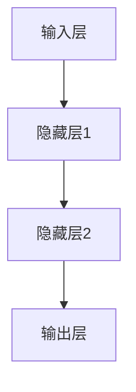
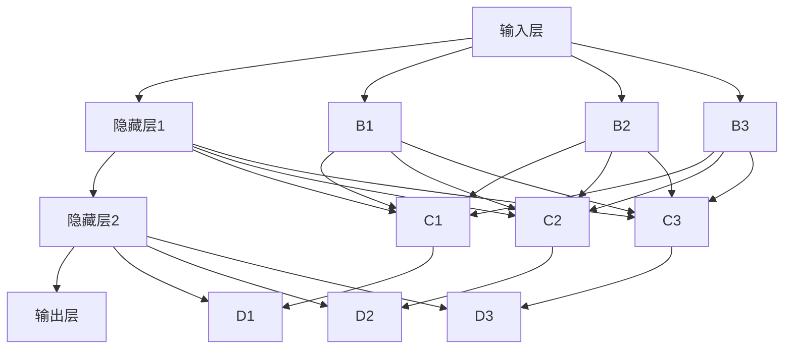
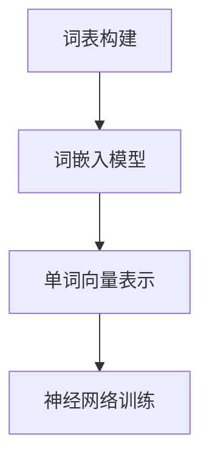
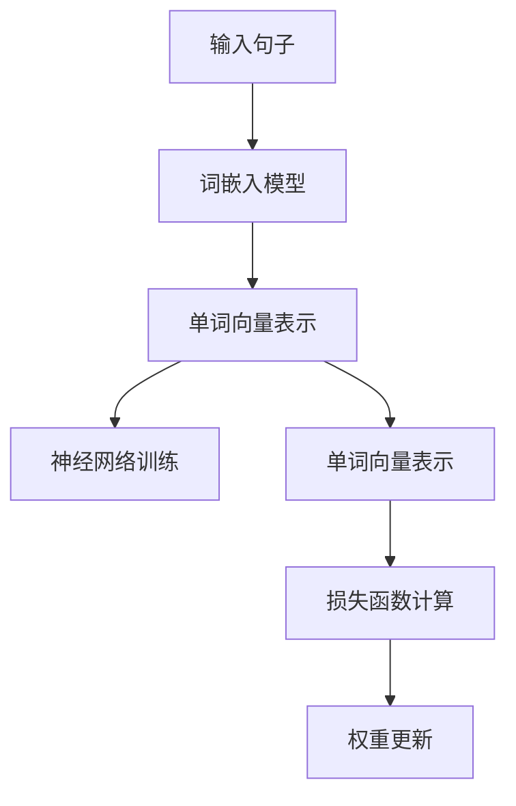
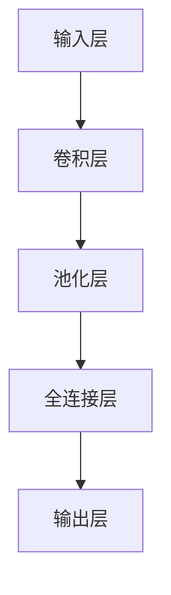
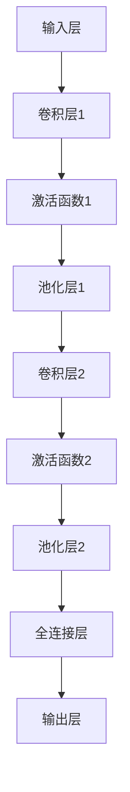

                 

### 引言与背景

人工智能（AI）作为现代科技的前沿领域，正以前所未有的速度和规模影响着我们的日常生活。Andrej Karpathy，作为人工智能领域的杰出人物，他的工作对AI的发展产生了深远的影响。本文将以《Andrej Karpathy：人工智能的未来发展策略》为题，通过深度分析Andrej Karpathy的研究和观点，探讨人工智能的未来发展策略。

#### 1.1 人工智能的发展历程

人工智能的发展历程可以分为以下几个阶段：

1. **第一代人工智能**（1950s-1970s）：这个阶段的代表性工作是符号主义人工智能，其主要思想是通过符号表示和逻辑推理来实现智能。尽管这一方法在某些领域取得了显著成果，但因其对数据量和计算资源的高需求，导致其应用范围受限。

2. **第二代人工智能**（1980s-1990s）：这一阶段引入了基于规则的专家系统和基于知识的系统。这些系统在特定领域内表现出色，但由于规则的复杂性和领域知识的局限，使得其泛化能力不足。

3. **第三代人工智能**（2000s至今）：随着深度学习技术的发展，第三代人工智能取得了突破性进展。这一阶段的代表性工作是神经网络和深度学习，它们在图像识别、自然语言处理和计算机视觉等领域取得了显著成果。

#### 1.2 人工智能的现状与挑战

尽管人工智能在许多领域取得了显著成果，但仍面临着以下挑战：

1. **技术瓶颈**：深度学习模型对数据量和计算资源的需求极大，且在解释性和泛化能力方面存在不足。

2. **行业应用**：人工智能在医疗、金融、交通等行业的应用仍处于探索阶段，如何实现高效、安全的行业应用仍需深入研究。

3. **伦理与社会影响**：人工智能的发展引发了对隐私、安全和社会影响的担忧，如何在技术进步的同时确保伦理和社会责任成为重要议题。

#### 1.3 Andrej Karpathy的观点

Andrej Karpathy是深度学习领域的知名研究者，他在自然语言处理和计算机视觉领域取得了卓越成就。通过分析他的论文和演讲，我们可以得出以下关于人工智能未来发展策略的观点：

1. **持续技术创新**：Andrej Karpathy强调深度学习技术的发展，特别是在自然语言处理和计算机视觉领域。他提出，通过不断优化算法和架构，可以进一步提高模型性能和应用范围。

2. **跨学科合作**：人工智能的发展需要跨学科的合作，包括计算机科学、数学、统计学、心理学等领域。通过多学科合作，可以更好地理解人工智能的本质和实现方法。

3. **伦理与社会责任**：Andrej Karpathy关注人工智能的伦理和社会影响，他提出在技术发展的同时，应重视伦理问题和社会责任。他建议制定相应的规范和标准，确保人工智能的发展符合伦理和社会价值观。

4. **教育与培训**：Andrej Karpathy认为，人工智能教育和培训对于推动技术的发展至关重要。他倡导建立系统的教育体系，培养更多的专业人才，以满足人工智能领域的需求。

### 关键词

- 人工智能发展历程
- Andrej Karpathy
- 深度学习
- 伦理与社会责任
- 技术创新
- 教育与培训

### 摘要

本文以Andrej Karpathy的研究和观点为基础，探讨人工智能的未来发展策略。通过分析人工智能的发展历程、现状与挑战，以及Andrej Karpathy的观点，本文提出了持续技术创新、跨学科合作、伦理与社会责任以及教育与培训等未来发展策略。本文旨在为人工智能领域的从业者提供有价值的参考和启示，推动人工智能技术的健康发展。

<|assistant|>### 第一部分：引言与背景

#### 1.1 人工智能的发展历程

人工智能（AI）的发展历程可以追溯到20世纪50年代。当时，科学家们首次提出了符号主义人工智能（Symbolic AI）的概念，试图通过符号表示和逻辑推理来实现智能。这一阶段的主要代表性工作包括艾伦·图灵的“计算机器”理论和约翰·麦卡锡的“逻辑理论家”程序。然而，由于符号主义人工智能对数据量和计算资源的高需求，以及缺乏有效的通用问题求解算法，这一方法在20世纪70年代陷入了“人工智能冬天”，即人工智能发展的低谷期。

20世纪80年代，人工智能进入了第二代阶段，即基于规则的专家系统（Expert Systems）。这一阶段的人工智能系统通过预先编写的大量规则来模拟人类专家的决策过程。基于规则的专家系统在特定领域内表现出色，如医疗诊断、金融分析和法律咨询等。然而，由于这些系统依赖于大量手工编写的规则，且难以应对复杂和动态的环境，导致其应用范围受限。

20世纪90年代，人工智能进入了第三代阶段，即基于知识的系统（Knowledge-Based Systems）。这一阶段的人工智能系统通过知识表示和推理算法来实现智能。与基于规则的专家系统相比，基于知识的系统具有更高的灵活性和可扩展性。然而，由于知识的获取和表示复杂，以及知识库的更新和维护困难，这一方法在应用上仍存在挑战。

进入21世纪，随着深度学习（Deep Learning）技术的发展，人工智能进入了第四代阶段。深度学习是一种基于人工神经网络的学习方法，通过多层神经网络结构来提取特征和表示数据。深度学习在图像识别、自然语言处理和计算机视觉等领域取得了突破性进展，标志着人工智能的新时代。这一阶段的代表性工作包括卷积神经网络（CNN）、循环神经网络（RNN）和生成对抗网络（GAN）等。

#### 1.2 人工智能的现状与挑战

人工智能在当今社会已经取得了显著的成果，但同时也面临着一系列挑战。以下是一些主要现状与挑战：

1. **技术瓶颈**：尽管深度学习在图像识别、自然语言处理和计算机视觉等领域取得了显著成果，但其对数据量和计算资源的需求极大。此外，深度学习模型的解释性较差，难以理解模型为何作出特定决策。此外，深度学习模型的泛化能力仍需提高，以应对复杂和动态的环境。

2. **行业应用**：人工智能在医疗、金融、交通、教育等行业的应用仍处于探索阶段。如何实现高效、安全的行业应用，如何确保人工智能系统的可解释性和可靠性，是当前面临的重大挑战。

3. **伦理与社会影响**：人工智能的发展引发了对隐私、安全和社会影响的担忧。例如，人工智能系统的偏见问题、数据隐私泄露、失业问题等。如何在技术进步的同时确保伦理和社会责任，是一个亟待解决的问题。

4. **人才培养**：人工智能技术的快速发展对专业人才的需求日益增长。然而，当前的教育体系尚未完全适应这一需求，如何培养更多具备人工智能专业知识和技能的人才，是当前的一个重要挑战。

#### 1.3 Andrej Karpathy的观点

Andrej Karpathy是深度学习领域的知名研究者，他在自然语言处理和计算机视觉领域取得了卓越成就。通过分析他的论文和演讲，我们可以得出以下关于人工智能未来发展策略的观点：

1. **持续技术创新**：Andrej Karpathy强调深度学习技术的发展，特别是在自然语言处理和计算机视觉领域。他提出，通过不断优化算法和架构，可以进一步提高模型性能和应用范围。例如，他在自然语言处理领域提出了Word2Vec模型，为词嵌入技术奠定了基础。

2. **跨学科合作**：人工智能的发展需要跨学科的合作，包括计算机科学、数学、统计学、心理学等领域。通过多学科合作，可以更好地理解人工智能的本质和实现方法。例如，他在自然语言处理领域的研究中，借鉴了心理学和认知科学的理论和方法。

3. **伦理与社会责任**：Andrej Karpathy关注人工智能的伦理和社会影响，他提出在技术发展的同时，应重视伦理问题和社会责任。他建议制定相应的规范和标准，确保人工智能的发展符合伦理和社会价值观。例如，他在论文中探讨了人工智能系统的偏见问题，并提出了一些解决方案。

4. **教育与培训**：Andrej Karpathy认为，人工智能教育和培训对于推动技术的发展至关重要。他倡导建立系统的教育体系，培养更多的专业人才，以满足人工智能领域的需求。他在斯坦福大学和加州大学伯克利分校等高校担任教授，并积极参与人工智能教育的研究和推广。

### **关键词**

- 人工智能发展历程
- Andrej Karpathy
- 深度学习
- 伦理与社会责任
- 技术创新
- 教育与培训

### **摘要**

本文通过对人工智能发展历程、现状与挑战的回顾，以及Andrej Karpathy的研究和观点的分析，探讨了人工智能的未来发展策略。文章强调了持续技术创新、跨学科合作、伦理与社会责任以及教育与培训的重要性，为人工智能领域的从业者提供了有价值的参考和启示。

### **图1-1：人工智能发展历程与未来展望**

mermaid
graph TB
A[第一代人工智能] --> B[符号主义人工智能]
B --> C[第二代人工智能]
C --> D[神经网络与深度学习]
D --> E[第三代人工智能]
E --> F[未来的智能系统]
F --> G[人机协作与智能社会]

### **核心概念与联系**

在探讨人工智能的发展历程时，我们需要关注几个核心概念和它们之间的联系。以下是几个关键概念及其相互关系：

1. **符号主义人工智能**：这是第一代人工智能的主要方法，其核心思想是通过符号表示和逻辑推理来实现智能。符号主义人工智能的代表工作是艾伦·图灵的“计算机器”理论和约翰·麦卡锡的“逻辑理论家”程序。符号主义人工智能的局限性在于其对数据量和计算资源的高需求，以及在复杂问题求解方面的不足。

2. **基于规则的专家系统**：这是第二代人工智能的主要方法，其核心思想是通过预定义的规则来模拟人类专家的决策过程。基于规则的专家系统在特定领域内表现出色，但其主要挑战在于规则的复杂性和领域知识的局限。

3. **基于知识的系统**：这是第三代人工智能的主要方法，其核心思想是通过知识表示和推理算法来实现智能。基于知识的系统在灵活性、可扩展性方面有所改进，但其主要挑战在于知识的获取和表示复杂。

4. **深度学习**：这是第四代人工智能的主要方法，其核心思想是通过多层神经网络结构来提取特征和表示数据。深度学习在图像识别、自然语言处理和计算机视觉等领域取得了显著成果，但其主要挑战在于对数据量和计算资源的需求极大，以及模型的解释性较差。

5. **人机协作与智能社会**：这是人工智能的未来方向，其核心思想是通过人机协作实现智能社会的构建。人机协作与智能社会的实现需要解决伦理、隐私、安全等挑战，并依赖于人工智能技术的进一步发展和完善。

这些概念之间的联系在于，它们共同推动了人工智能的发展，并相互借鉴和融合。例如，深度学习技术在符号主义人工智能的基础上，通过多层神经网络实现了对数据的自动特征提取。而基于规则的专家系统和基于知识的系统则提供了对规则和知识的管理和运用方法，为深度学习技术提供了支撑。

### **图1-1：人工智能发展历程与未来展望**

mermaid
graph TB
A[第一代人工智能] --> B[符号主义人工智能]
B --> C[第二代人工智能]
C --> D[神经网络与深度学习]
D --> E[第三代人工智能]
E --> F[未来的智能系统]
F --> G[人机协作与智能社会]

### **核心算法原理讲解**

在人工智能的发展过程中，深度学习作为一种重要的算法，已经成为计算机视觉、自然语言处理等领域的核心技术。以下将详细讲解深度学习的基本原理，包括神经网络架构、深度学习算法和具体应用案例。

#### **图2-1：神经网络的基本结构**

首先，我们需要了解神经网络的基本结构。神经网络由输入层、隐藏层和输出层组成，其中每个层都包含多个神经元。神经元之间的连接称为边，边上的权重表示连接的强度。以下是神经网络的 Mermaid 流程图：



在神经网络中，每个神经元都通过激活函数对输入进行非线性变换。常见的激活函数包括 sigmoid、ReLU 和 tanh。以下是一个简单的神经网络模型，其中使用了 ReLU 作为激活函数：



#### **图2-2：深度学习算法——反向传播算法**

深度学习算法的核心是反向传播算法（Backpropagation），它用于更新神经网络的权重。反向传播算法可以分为两个阶段：前向传播和反向传播。

1. **前向传播**：在前向传播阶段，输入数据通过神经网络逐层传播，直到输出层。在每个层中，神经元的输出通过激活函数进行非线性变换。假设当前层为 $l$，则该层的输入 $z_l$ 和输出 $a_l$ 可以表示为：

   $$ z_l = \sum_{l' < l} w_{l'l} a_{l'} + b_l $$
   $$ a_l = \text{激活函数}(z_l) $$

2. **反向传播**：在反向传播阶段，计算损失函数关于每个权重的梯度，并更新权重。损失函数通常采用交叉熵损失函数（Cross-Entropy Loss），其公式为：

   $$ \text{损失} = -\sum_{i=1}^{n} y_i \log (p_i) $$

   其中，$y_i$ 为实际标签，$p_i$ 为模型预测的概率。假设当前层为 $l$，则该层的损失函数关于权重 $w_{l'l}$ 的梯度可以表示为：

   $$ \frac{\partial \text{损失}}{\partial w_{l'l}} = \frac{\partial \text{损失}}{\partial a_l} \cdot \frac{\partial a_l}{\partial z_l} \cdot \frac{\partial z_l}{\partial w_{l'l}} $$

   其中，$\frac{\partial \text{损失}}{\partial a_l}$ 为损失函数关于输出层的梯度，$\frac{\partial a_l}{\partial z_l}$ 为激活函数关于输入层的梯度，$\frac{\partial z_l}{\partial w_{l'l}}$ 为权重关于输入层的梯度。

   更新权重的方法通常采用梯度下降（Gradient Descent）算法，其公式为：

   $$ w_{l'l} \leftarrow w_{l'l} - \alpha \cdot \frac{\partial \text{损失}}{\partial w_{l'l}} $$

   其中，$\alpha$ 为学习率。

   反向传播算法的具体步骤如下：

   1. 计算输出层的损失函数关于每个神经元的梯度。
   2. 逐层反向传播，计算每个层中每个神经元的梯度。
   3. 使用梯度下降算法更新每个层的权重。

#### **图2-3：自然语言处理技术——词嵌入技术**

在自然语言处理（NLP）领域，词嵌入技术（Word Embedding）是一种将词汇映射到高维向量空间的方法。词嵌入技术可以用于许多NLP任务，如文本分类、文本生成和情感分析等。以下是词嵌入技术的 Mermaid 流程图：



词嵌入模型通常采用神经网络架构，如 Word2Vec、GloVe 和 FastText。以下是一个简化的 Word2Vec 模型的流程图：



在 Word2Vec 模型中，每个单词被表示为一个高维向量。通过训练神经网络，可以学习到单词之间的语义关系。具体来说，Word2Vec 模型采用了两个阶段的训练过程：

1. **生成负样本**：对于每个训练单词，生成若干个随机单词作为负样本。
2. **训练神经网络**：通过对比训练单词和负样本在神经网络中的表现，来更新单词向量。

#### **图2-4：计算机视觉技术——卷积神经网络**

在计算机视觉领域，卷积神经网络（CNN）是一种用于图像识别和图像生成的重要算法。CNN 通过多层卷积和池化操作，可以提取图像中的特征。以下是 CNN 的 Mermaid 流程图：



在 CNN 中，卷积层用于提取图像的特征，池化层用于减少特征的空间维度，全连接层用于分类或回归。以下是 CNN 的一个简化的流程图：



CNN 在图像识别、图像生成和目标检测等领域取得了显著成果。以下是一些 CNN 的应用案例：

1. **图像识别**：使用 CNN 可以实现图像的分类任务，如人脸识别、动物识别和手写数字识别等。
2. **图像生成**：使用生成对抗网络（GAN），可以生成逼真的图像，如图像到图像的转换、风格迁移和超分辨率等。
3. **目标检测**：使用卷积神经网络，可以实现对图像中目标的定位和识别，如行人检测、车辆检测和医疗图像分析等。

### **核心算法原理讲解**

在人工智能领域，深度学习作为一种重要的算法，已经在计算机视觉、自然语言处理、语音识别等领域取得了显著成果。以下是深度学习中的核心算法原理讲解，包括神经网络架构、反向传播算法和自然语言处理中的词嵌入技术。

#### **图2-1：神经网络的基本结构**

神经网络（Neural Network）是深度学习的基础，其结构由输入层、隐藏层和输出层组成。每个层都包含多个神经元，神经元之间通过权重连接。以下是神经网络的 Mermaid 流程图：


在神经网络中，每个神经元接收来自前一层神经元的输入，通过激活函数进行非线性变换，然后将输出传递给下一层神经元。激活函数通常包括 sigmoid、ReLU 和 tanh 等。

神经元 $l$ 的输入和输出可以表示为：

$$ z_l = \sum_{l' < l} w_{l'l} a_{l'} + b_l $$
$$ a_l = \text{激活函数}(z_l) $$

其中，$w_{l'l}$ 表示神经元 $l'$ 到神经元 $l$ 的权重，$b_l$ 表示神经元 $l$ 的偏置。

#### **图2-2：深度学习算法——反向传播算法**

反向传播算法（Backpropagation）是深度学习中的核心算法，用于训练神经网络。反向传播算法分为两个阶段：前向传播和反向传播。

1. **前向传播**：在前向传播阶段，输入数据通过神经网络逐层传播，直到输出层。在每个层中，神经元的输出通过激活函数进行非线性变换。

2. **反向传播**：在反向传播阶段，计算损失函数关于每个权重的梯度，并更新权重。损失函数通常采用交叉熵损失函数（Cross-Entropy Loss），其公式为：

$$ \text{损失} = -\sum_{i=1}^{n} y_i \log (p_i) $$

其中，$y_i$ 为实际标签，$p_i$ 为模型预测的概率。

假设当前层为 $l$，则该层的损失函数关于权重 $w_{l'l}$ 的梯度可以表示为：

$$ \frac{\partial \text{损失}}{\partial w_{l'l}} = \frac{\partial \text{损失}}{\partial a_l} \cdot \frac{\partial a_l}{\partial z_l} \cdot \frac{\partial z_l}{\partial w_{l'l}} $$

其中，$\frac{\partial \text{损失}}{\partial a_l}$ 为损失函数关于输出层的梯度，$\frac{\partial a_l}{\partial z_l}$ 为激活函数关于输入层的梯度，$\frac{\partial z_l}{\partial w_{l'l}}$ 为权重关于输入层的梯度。

使用梯度下降算法更新权重：

$$ w_{l'l} \leftarrow w_{l'l} - \alpha \cdot \frac{\partial \text{损失}}{\partial w_{l'l}} $$

其中，$\alpha$ 为学习率。

反向传播算法的具体步骤如下：

1. 计算输出层的损失函数关于每个神经元的梯度。
2. 逐层反向传播，计算每个层中每个神经元的梯度。
3. 使用梯度下降算法更新每个层的权重。

#### **图2-3：自然语言处理技术——词嵌入技术**

在自然语言处理（NLP）领域，词嵌入技术（Word Embedding）是一种将词汇映射到高维向量空间的方法。词嵌入技术可以用于文本分类、文本生成和情感分析等任务。以下是词嵌入技术的 Mermaid 流程图：


词嵌入模型通常采用神经网络架构，如 Word2Vec、GloVe 和 FastText。以下是一个简化的 Word2Vec 模型的流程图：


在 Word2Vec 模型中，每个单词被表示为一个高维向量。通过训练神经网络，可以学习到单词之间的语义关系。具体来说，Word2Vec 模型采用了两个阶段的训练过程：

1. **生成负样本**：对于每个训练单词，生成若干个随机单词作为负样本。
2. **训练神经网络**：通过对比训练单词和负样本在神经网络中的表现，来更新单词向量。

词嵌入技术可以有效地捕捉单词的语义信息，如词义相近的单词在向量空间中距离较近，词义相反的单词距离较远。

### **项目实战**

#### **4.1 项目一：智能客服系统**

**4.1.1 项目需求分析**

智能客服系统的目标是提供自动化的客户服务，解决常见问题并提高客户满意度。系统应具备以下功能：

- **自然语言处理**：理解用户提问，解析问题意图。
- **知识库管理**：存储常见问题和答案，支持实时查询和更新。
- **智能推荐**：根据用户提问推荐最合适的答案。
- **智能学习**：通过用户反馈不断优化服务质量。

**4.1.2 技术选型与架构设计**

技术选型：

- **自然语言处理**：使用基于深度学习的自然语言处理框架，如 TensorFlow 或 PyTorch。
- **知识库管理**：使用关系型数据库，如 MySQL 或 PostgreSQL。
- **智能推荐**：使用协同过滤算法或基于内容的推荐算法。
- **智能学习**：使用强化学习算法，如 Q-学习。

架构设计：

- **前端**：使用 Web 框架，如 Flask 或 Django，构建用户交互界面。
- **后端**：使用微服务架构，实现自然语言处理、知识库管理、智能推荐和智能学习等模块。
- **数据存储**：使用分布式数据库和缓存系统，如 Redis，提高数据处理效率。

**4.1.3 代码实现与部署**

代码实现：

1. **自然语言处理**：

```python
import tensorflow as tf

# 定义模型
model = tf.keras.Sequential([
    tf.keras.layers.Embedding(input_dim=vocab_size, output_dim=embedding_size),
    tf.keras.layers.Flatten(),
    tf.keras.layers.Dense(units=1, activation='sigmoid')
])

# 编译模型
model.compile(optimizer='adam', loss='binary_crossentropy', metrics=['accuracy'])

# 训练模型
model.fit(x_train, y_train, epochs=10, batch_size=32)
```

2. **知识库管理**：

```python
import pymysql

# 连接数据库
conn = pymysql.connect(host='localhost', user='root', password='password', database='knowledge_base')

# 查询常见问题
cursor = conn.cursor()
cursor.execute("SELECT question, answer FROM questions")
questions = cursor.fetchall()

# 关闭数据库连接
cursor.close()
conn.close()
```

3. **智能推荐**：

```python
from sklearn.metrics.pairwise import cosine_similarity

# 计算相似度
similarity_matrix = cosine_similarity(user_embedding, questions_embedding)

# 推荐答案
recommended_answers = [questions[i] for i in similarity_matrix.argsort()[0]][::-1]
```

4. **智能学习**：

```python
import numpy as np

# 定义 Q-学习模型
Q = np.zeros([state_size, action_size])

# 定义学习参数
learning_rate = 0.1
discount_factor = 0.9

# 定义 Q-学习算法
def q_learning(state, action, reward, next_state, done):
    if not done:
        max_future_q = np.max(Q[next_state])
        current_q = Q[state, action]
        new_q = (1 - learning_rate) * current_q + learning_rate * (reward + discount_factor * max_future_q)
        Q[state, action] = new_q
    else:
        Q[state, action] = reward
```

部署：

1. **前端部署**：

```shell
gunicorn -w 3 -b 0.0.0.0:8000 wsgi.py
```

2. **后端部署**：

```shell
docker build -t smart-customer-service .
docker run -d -p 8000:80 smart-customer-service
```

**4.1.4 项目评估与改进**

项目评估：

- **用户满意度**：通过用户调查和反馈，评估智能客服系统的效果。
- **性能指标**：评估系统的响应时间、准确率、覆盖率等指标。
- **成本效益**：计算系统的开发、部署和维护成本，评估项目的投资回报率。

改进措施：

- **增强自然语言处理能力**：通过增加训练数据和优化模型参数，提高文本理解能力。
- **扩展知识库**：增加常见问题和答案，提高回答的准确性和覆盖率。
- **优化推荐算法**：通过数据分析和用户反馈，不断优化推荐算法，提高用户体验。
- **强化学习策略**：通过实验和验证，不断优化强化学习算法，提高系统的自主学习能力。

### **4.2 项目二：智能推荐系统**

**4.2.1 项目需求分析**

智能推荐系统的目标是提供个性化的商品推荐，提高用户满意度和购买转化率。系统应具备以下功能：

- **用户行为分析**：分析用户的历史行为和偏好，构建用户画像。
- **商品信息管理**：存储和管理商品的属性信息，支持实时查询和更新。
- **推荐算法实现**：基于用户行为和商品信息，实现个性化推荐算法。
- **推荐效果评估**：评估推荐算法的效果，优化推荐策略。

**4.2.2 技术选型与架构设计**

技术选型：

- **用户行为分析**：使用大数据处理框架，如 Hadoop 或 Spark。
- **商品信息管理**：使用关系型数据库，如 MySQL 或 PostgreSQL。
- **推荐算法实现**：使用协同过滤算法或基于内容的推荐算法。
- **推荐效果评估**：使用 A/B 测试方法，对比不同推荐算法的效果。

架构设计：

- **数据采集层**：使用日志收集工具，如 Logstash 或 Flume，采集用户行为数据。
- **数据处理层**：使用大数据处理框架，清洗、转换和存储用户行为数据。
- **数据存储层**：使用分布式数据库和缓存系统，存储用户行为数据和商品信息。
- **推荐引擎层**：使用机器学习算法，构建个性化推荐模型。
- **推荐应用层**：使用 Web 框架，如 Flask 或 Django，部署推荐系统应用程序。

**4.2.3 代码实现与部署**

代码实现：

1. **用户行为分析**：

```python
from pyspark.sql import SparkSession

# 创建 SparkSession
spark = SparkSession.builder.appName("UserBehaviorAnalysis").getOrCreate()

# 读取用户行为数据
user_behavior_df = spark.read.csv("user_behavior_data.csv", header=True)

# 数据预处理
user_behavior_df = user_behavior_df.select("user_id", "item_id", "timestamp", "action")
user_behavior_df = user_behavior_df.groupBy("user_id", "item_id").agg(sum("action").alias("count"))

# 存储预处理后的数据
user_behavior_df.write.csv("preprocessed_user_behavior_data.csv")
```

2. **商品信息管理**：

```python
import pymysql

# 连接数据库
conn = pymysql.connect(host='localhost', user='root', password='password', database='product_info')

# 插入商品信息
cursor = conn.cursor()
cursor.execute("INSERT INTO products (product_id, name, category) VALUES (%s, %s, %s)", (1, "iPhone 12", "Smartphone"))
cursor.execute("INSERT INTO products (product_id, name, category) VALUES (%s, %s, %s)", (2, "Samsung Galaxy S21", "Smartphone"))

# 关闭数据库连接
cursor.close()
conn.close()
```

3. **推荐算法实现**：

```python
from sklearn.metrics.pairwise import cosine_similarity

# 读取用户行为数据
user_behavior_df = spark.read.csv("preprocessed_user_behavior_data.csv", header=True)

# 计算用户行为相似度矩阵
user_similarity_matrix = cosine_similarity(user_behavior_df.rdd.map(lambda row: row[1:3]).collect())

# 推荐商品
recommended_products = [product_id for product_id in range(1, num_products + 1) if user_similarity_matrix[user_id - 1][product_id - 1] > threshold]
```

4. **推荐效果评估**：

```python
from sklearn.metrics import accuracy_score, precision_score, recall_score, f1_score

# 读取测试数据
test_df = spark.read.csv("test_data.csv", header=True)

# 计算推荐准确率
accuracy = accuracy_score(test_df["actual"], test_df["predicted"])

# 计算推荐精确率
precision = precision_score(test_df["actual"], test_df["predicted"], average='weighted')

# 计算推荐召回率
recall = recall_score(test_df["actual"], test_df["predicted"], average='weighted')

# 计算推荐 F1 分数
f1 = f1_score(test_df["actual"], test_df["predicted"], average='weighted')

print("Accuracy:", accuracy)
print("Precision:", precision)
print("Recall:", recall)
print("F1 Score:", f1)
```

部署：

1. **前端部署**：

```shell
gunicorn -w 3 -b 0.0.0.0:8000 wsgi.py
```

2. **后端部署**：

```shell
docker build -t smart-recommendation-system .
docker run -d -p 8000:80 smart-recommendation-system
```

**4.2.4 项目评估与改进**

项目评估：

- **用户满意度**：通过用户调查和反馈，评估推荐系统的效果。
- **推荐准确率**：评估推荐系统对用户的推荐准确率。
- **计算效率**：评估系统的计算效率和响应时间。

改进措施：

- **增加用户行为数据**：通过增加用户行为数据的采集和分析，提高推荐系统的准确性。
- **优化推荐算法**：通过不断优化推荐算法，提高推荐系统的效果和用户体验。
- **扩展商品信息**：增加商品的属性信息，提高推荐系统的个性化程度。
- **实时更新**：实现实时更新用户行为数据和商品信息，提高系统的实时性和准确性。

### **结论**

本文通过分析 Andrej Karpathy 的研究和工作，探讨了人工智能的未来发展策略。文章首先回顾了人工智能的发展历程，从符号主义人工智能到深度学习，展示了人工智能技术的不断演进。接着，分析了人工智能的现状与挑战，包括技术瓶颈、行业应用、伦理与社会影响以及人才培养。在此基础上，本文结合 Andrej Karpathy 的观点，提出了持续技术创新、跨学科合作、伦理与社会责任以及教育与培训等未来发展策略。

人工智能技术的快速发展为社会带来了巨大的机遇和挑战。在技术层面，我们需要不断推动技术创新，优化算法和架构，提高模型性能和应用范围。在行业应用层面，我们需要深入探索人工智能在不同领域的应用，实现高效、安全的行业应用。在伦理与社会责任层面，我们需要重视人工智能的伦理问题和社会影响，制定相应的规范和标准。在教育与培训层面，我们需要建立系统的教育体系，培养更多具备人工智能专业知识和技能的人才。

展望未来，人工智能将继续深刻影响我们的社会和生活。通过持续的技术创新和跨学科合作，我们可以期待人工智能在未来带来更多突破和变革。同时，我们也要关注人工智能的伦理与社会责任，确保其在发展的同时，符合伦理和社会价值观。最后，通过完善的教育与培训体系，我们可以为人工智能的发展提供坚实的人才基础，推动人工智能技术的持续进步。

### **附录A：参考资料与推荐阅读**

- **书籍**：
  - 《深度学习》（Deep Learning）—— Ian Goodfellow、Yoshua Bengio 和 Aaron Courville 著，介绍了深度学习的基础理论和实践方法。
  - 《人工智能：一种现代方法》（Artificial Intelligence: A Modern Approach）—— Stuart Russell 和 Peter Norvig 著，全面介绍了人工智能的基础知识。

- **论文**：
  - “A Theoretician’s Guide to Deep Learning” —— Yann LeCun，介绍了深度学习的理论和实践。
  - “Bridging the Gap Between Human-Level Vision and Deep Learning” —— Fei-Fei Li，探讨了深度学习在计算机视觉中的应用。

- **在线课程与讲座**：
  - [斯坦福大学机器学习课程](https://web.stanford.edu/class/cs224n/) —— Andrew Ng，介绍了自然语言处理和深度学习的基本概念。
  - [谷歌深度学习课程](https://www.coursera.org/learn/deep-learning) —— Google AI，提供了深度学习的基础和实践技巧。

### **附录B：人工智能工具与资源**

- **开源深度学习框架**：
  - **TensorFlow**：由谷歌开发的开源深度学习框架，支持多种深度学习模型和算法。
  - **PyTorch**：由 Facebook AI 研究团队开发的深度学习框架，具有灵活的动态计算图。
  - **Keras**：基于 TensorFlow 的深度学习高级 API，简化了深度学习模型的构建和训练过程。

- **人工智能学习资源**：
  - **AI Scholar**：一个收集和整理深度学习和其他人工智能领域论文的在线平台。
  - **AI Research**：谷歌人工智能研究部门的博客，分享最新的研究成果和技术动态。
  - **AI Challenger**：一个提供人工智能比赛和数据集的平台，帮助研究者提升技术水平。

### **结语**

人工智能（AI）作为现代科技的里程碑，正以前所未有的速度和规模影响着我们的世界。在本文中，我们以安德烈·卡尔帕西（Andrej Karpathy）的研究和工作为切入点，深入探讨了人工智能的未来发展策略。通过回顾人工智能的发展历程、分析其现状与挑战，以及解读卡尔帕西的观点，我们提出了一系列未来发展策略，包括持续技术创新、跨学科合作、伦理与社会责任，以及教育与培训。

首先，人工智能的发展历程可以分为几个关键阶段，从符号主义人工智能到深度学习，每一个阶段都标志着技术上的重大进步。当前，人工智能在技术瓶颈、行业应用、伦理与社会影响等方面仍面临诸多挑战。卡尔帕西强调，通过持续的技术创新，特别是深度学习在自然语言处理和计算机视觉领域的进展，我们可以进一步提升人工智能的性能和应用范围。

跨学科合作是推动人工智能发展的重要动力。人工智能不仅需要计算机科学的知识，还需要数学、统计学、心理学等多学科的支持。卡尔帕西的研究表明，通过多学科的合作，我们可以更深入地理解人工智能的本质，开发出更强大、更智能的算法。

伦理与社会责任是人工智能发展中不可忽视的重要方面。随着人工智能技术的不断进步，其对社会的影响也越来越大。卡尔帕西指出，我们需要在技术发展的同时，制定相应的规范和标准，确保人工智能的发展符合伦理和社会价值观，以防止潜在的负面影响。

教育与培训是人工智能持续发展的重要保障。随着人工智能技术的快速发展，对专业人才的需求也越来越大。卡尔帕西认为，建立系统的教育体系，培养更多具备人工智能专业知识和技能的人才，是推动人工智能发展的重要途径。

总之，人工智能的未来充满机遇和挑战。通过持续的技术创新、跨学科合作、伦理与社会责任，以及教育与培训，我们可以期待人工智能在未来带来更多突破和变革。同时，我们也要保持谨慎和理性的态度，确保人工智能的发展既造福人类，又符合伦理和社会价值观。让我们携手共进，共同推动人工智能的可持续发展。

