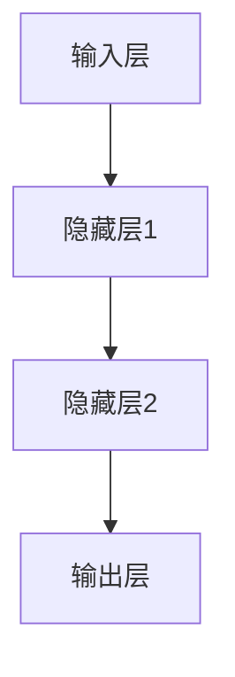
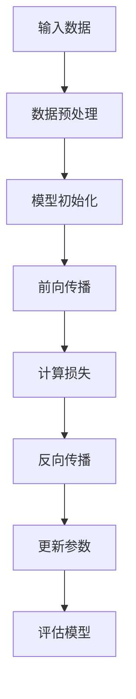
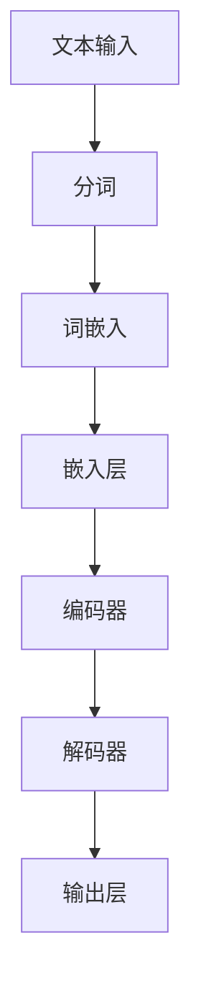

                 

### 《Andrej Karpathy：人工智能的未来发展趋势》

关键词：人工智能，深度学习，自然语言处理，计算机视觉，应用领域，发展趋势，伦理问题

摘要：本文由AI天才研究院/AI Genius Institute的AI大师Andrej Karpathy执笔，深入探讨了人工智能（AI）的未来发展趋势。文章首先回顾了人工智能的历史演变和理论基础，接着详细介绍了当前主流的深度学习算法和其在自然语言处理、计算机视觉等领域的应用。随后，文章分析了人工智能在医疗、金融、制造业等领域的实际应用案例，并对未来的发展趋势进行了预测。最后，文章探讨了人工智能带来的潜在风险，提出了相应的应对策略。本文旨在为读者提供一幅全面、深入的人工智能发展蓝图。

### 《Andrej Karpathy：人工智能的未来发展趋势》目录大纲

#### 第一部分：人工智能的基础理论与发展脉络

##### 第1章：人工智能的起源与历史演变
- 1.1 人工智能的早期历史
- 1.2 人工智能的黄金时代
- 1.3 AI的中断与复兴
- 1.4 当前AI技术现状

##### 第2章：深度学习与神经网络的基本概念
- 2.1 神经网络的基础
- 2.2 深度学习的发展
- 2.3 深度学习的核心算法

##### 第3章：自然语言处理与计算机视觉
- 3.1 自然语言处理的基本原理
- 3.2 计算机视觉的进展
- 3.3 图像识别与视频分析

##### 第4章：人工智能的核心挑战与伦理问题
- 4.1 AI的安全性与稳定性
- 4.2 AI的公平性与偏见
- 4.3 AI的伦理问题与法律监管

#### 第二部分：人工智能在各个领域的应用与发展趋势

##### 第5章：人工智能在医疗领域的应用
- 5.1 医疗图像分析
- 5.2 个性化医疗
- 5.3 药物发现与基因组学

##### 第6章：人工智能在金融领域的应用
- 6.1 金融风险控制
- 6.2 量化交易
- 6.3 信贷评估与反欺诈

##### 第7章：人工智能在制造业的应用
- 7.1 智能制造
- 7.2 机器人技术
- 7.3 生产线的自动化

##### 第8章：人工智能在交通领域的应用
- 8.1 自动驾驶
- 8.2 智能交通系统
- 8.3 城市交通规划

##### 第9章：人工智能在农业和能源领域的应用
- 9.1 智能农业
- 9.2 可再生能源优化
- 9.3 能源管理与效率提升

#### 第三部分：人工智能的未来发展趋势与潜在风险

##### 第10章：人工智能的未来愿景
- 10.1 人工智能与人类社会
- 10.2 人工智能的经济影响
- 10.3 人工智能的社会伦理

##### 第11章：人工智能的发展趋势预测
- 11.1 技术发展的趋势
- 11.2 行业应用的发展趋势
- 11.3 未来的人工智能生态系统

##### 第12章：人工智能的潜在风险与应对策略
- 12.1 AI失控的风险
- 12.2 AI对就业市场的影响
- 12.3 AI的隐私和安全问题
- 12.4 应对人工智能风险的策略与建议

#### 附录

##### 附录A：参考文献与推荐阅读
- A.1 学术期刊与会议论文
- A.2 书籍推荐
- A.3 在线课程与教育资源

##### 附录B：人工智能核心算法的Mermaid流程图
- B.1 神经网络结构
- B.2 深度学习模型训练流程
- B.3 自然语言处理模型结构

##### 附录C：数学模型与公式
- C.1 深度学习中的损失函数
- C.2 反向传播算法
- C.3 卷积神经网络公式

##### 附录D：实战案例
- D.1 医疗图像分析代码实例
- D.2 自动驾驶算法实现
- D.3 金融量化交易模型构建

##### 附录E：开发环境与工具
- E.1 深度学习框架使用指南
- E.2 编程语言与工具介绍
- E.3 机器学习实战资源

#### 第一部分：人工智能的基础理论与发展脉络

##### 第1章：人工智能的起源与历史演变

1.1 人工智能的早期历史

人工智能（Artificial Intelligence，简称AI）的概念最早可以追溯到20世纪50年代。1956年，在达特茅斯会议上，约翰·麦卡锡（John McCarthy）等人首次提出了人工智能这个术语，并定义其为“制造智能机器的科学和工程”。这一时期，人工智能主要侧重于理论研究，科学家们尝试通过编程实现简单的推理、问题解决和决策。

早期的人工智能研究主要集中在符号主义和知识表示方法上。符号主义方法试图通过逻辑推理和符号表示来模拟人类的思维过程。在这个阶段，著名的人工智能系统包括“逻辑理论家”（Logic Theorist）和“通用问题解决器”（General Problem Solver）。然而，这些系统在实际应用中往往受到知识库规模和计算资源的限制，难以应对复杂的问题。

1.2 人工智能的黄金时代

20世纪80年代，人工智能迎来了第一次“黄金时代”。这一时期的突破主要体现在专家系统和自然语言处理领域。专家系统是一种模拟人类专家决策能力的计算机程序，能够针对特定领域的问题提供解决方案。代表性的专家系统包括“Dendral”和“MYCIN”。自然语言处理（Natural Language Processing，简称NLP）则致力于使计算机能够理解和处理人类语言，其代表性成果包括统计机器翻译和自动摘要。

然而，这一黄金时代并未持续太久。随着计算资源的限制和算法的局限，人工智能在20世纪90年代遭遇了“AI寒冬”，研究经费和人才流失，人工智能的发展进入低谷。

1.3 AI的中断与复兴

进入21世纪，人工智能在深度学习技术的推动下重新焕发生机。深度学习（Deep Learning）是一种基于多层神经网络的学习方法，通过多层非线性变换来提取数据的特征表示。这一技术的出现为人工智能的发展带来了新的契机。

2006年，加拿大科学家杰弗里·辛顿（Geoffrey Hinton）等人提出了深度置信网络（Deep Belief Network），为深度学习奠定了基础。随后，深度卷积神经网络（Deep Convolutional Neural Network，简称CNN）和循环神经网络（Recurrent Neural Network，简称RNN）相继问世，进一步推动了人工智能在图像识别、语音识别和自然语言处理等领域的发展。

2012年，AlexNet在ImageNet竞赛中取得了突破性的成绩，这一事件被视为深度学习走向成功的标志性时刻。自此以后，深度学习技术逐渐成为人工智能领域的主流，引领了人工智能的第二次“黄金时代”。

1.4 当前AI技术现状

当前，人工智能技术已渗透到各个领域，从医疗、金融到制造业、交通等，都取得了显著的成果。以下是一些人工智能技术的最新进展：

- 自然语言处理：深度学习技术在自然语言处理领域取得了重大突破，包括语义理解、机器翻译、情感分析等。代表性模型包括BERT、GPT等。
- 计算机视觉：卷积神经网络在图像识别、目标检测、人脸识别等领域表现出色。近年来，生成对抗网络（GAN）的出现为图像生成和风格迁移提供了新的方法。
- 强化学习：强化学习在游戏、机器人控制等领域取得了显著成果，如DeepMind的AlphaGo击败世界围棋冠军。
- 自动驾驶：自动驾驶技术正在迅速发展，多个公司和研究机构已经实现了部分自动驾驶功能，预计未来几年将实现全面商业化。
- 药物发现：人工智能在药物设计、基因组分析等领域显示出巨大的潜力，有望加快新药研发过程。

总之，当前人工智能技术正处于高速发展期，未来有望带来更多的创新和变革。然而，我们也需要关注人工智能带来的挑战和伦理问题，确保其在人类社会中的健康发展。

#### 第2章：深度学习与神经网络的基本概念

2.1 神经网络的基础

神经网络（Neural Network）是人工智能领域的重要组成部分，它模拟了人脑的基本工作原理。一个简单的神经网络由多个神经元（也称为节点）组成，这些神经元通过连接（也称为边）相互连接。每个连接都有一个权重，用于表示连接的强度。

一个神经元的输入是其连接的所有其他神经元的输出之和，再乘以各自的权重，最后加上一个偏置（bias）。这个加权和被传递到一个激活函数上，以确定神经元是否被激活。

$$
\text{输入} = \sum_{i} (w_i \cdot x_i) + b
$$

$$
\text{输出} = f(\text{输入})
$$

其中，\( w_i \) 是连接权重，\( x_i \) 是其他神经元的输出，\( b \) 是偏置，\( f \) 是激活函数。

常见的激活函数包括：

- 线性函数：\( f(x) = x \)，没有非线性变换，常用于隐藏层之间的连接。
- Sigmoid函数：\( f(x) = \frac{1}{1 + e^{-x}} \)，将输出映射到0和1之间，常用于分类问题。
-ReLU函数：\( f(x) = \max(0, x) \)，对于负值输入输出0，对于正值输入输出自身，常用于深度网络中的隐藏层。

2.2 深度学习的发展

深度学习（Deep Learning）是神经网络的一种扩展，它通过增加网络的深度（即层数）来提高模型的性能。深度学习的关键在于多层非线性变换，这些变换能够自动提取数据的特征表示。

深度学习的发展得益于计算能力的提升和大数据的可用性。随着GPU（图形处理单元）的普及，深度学习模型的训练速度大大提高。同时，互联网的普及使得大量的数据变得容易获取，为深度学习提供了丰富的训练资源。

深度学习的核心组成部分包括：

- 卷积神经网络（Convolutional Neural Network，简称CNN）：专门用于处理图像数据，通过卷积层、池化层和全连接层的组合，自动提取图像特征。
- 循环神经网络（Recurrent Neural Network，简称RNN）：用于处理序列数据，如时间序列、文本等，通过隐藏状态的自连接实现信息的持久化。
- 长短期记忆网络（Long Short-Term Memory，简称LSTM）：是RNN的一种变体，通过引入门控机制，解决了RNN的长期依赖问题。

2.3 深度学习的核心算法

深度学习的训练过程通常包括以下几个步骤：

- 数据预处理：对输入数据进行标准化、归一化等处理，以提高模型的训练效果。
- 网络初始化：对网络的权重和偏置进行随机初始化，通常使用小随机值。
- 前向传播：将输入数据通过网络的各个层，计算每个神经元的输出。
- 损失计算：计算网络输出和实际输出之间的差异，即损失（loss）。
- 反向传播：通过反向传播算法，将损失从输出层反向传播到输入层，更新网络的权重和偏置。
- 优化算法：使用优化算法（如梯度下降、Adam等）来更新网络参数，以最小化损失。

以下是一个简单的深度学习模型训练过程的伪代码：

```
# 初始化网络
network = initialize_network()

# 预处理数据
X_train, y_train = preprocess_data()

# 设置训练参数
epochs = 100
learning_rate = 0.001

# 开始训练
for epoch in range(epochs):
    # 前向传播
    outputs = forward_propagation(X_train, network)
    
    # 计算损失
    loss = compute_loss(outputs, y_train)
    
    # 反向传播
    dervatives = backward_propagation(network, loss)
    
    # 更新网络参数
    update_network_params(network, dervatives, learning_rate)
    
    # 打印训练进度
    print("Epoch", epoch, ": Loss =", loss)
```

深度学习在人工智能领域取得了许多突破性成果，但同时也面临着一些挑战，如过拟合、参数选择和计算成本等。未来，随着算法的改进和计算资源的提升，深度学习有望在更多领域发挥重要作用。

#### 第3章：自然语言处理与计算机视觉

3.1 自然语言处理的基本原理

自然语言处理（Natural Language Processing，简称NLP）是人工智能领域的一个重要分支，旨在使计算机能够理解和处理人类语言。NLP的核心目标是让计算机具备人类水平的语言理解能力，包括文本理解、文本生成、情感分析等。

自然语言处理的基本原理包括：

- 词向量化：将文本中的单词转换为数字表示，以便计算机可以处理。词向量化方法包括词袋模型（Bag of Words）和词嵌入（Word Embeddings），其中词嵌入（如Word2Vec、GloVe）能够捕捉词语的语义关系。
- 语言模型：通过统计方法学习文本的生成概率，以便预测下一个单词。常见的语言模型包括N-gram模型和深度神经网络模型（如LSTM、Transformer）。
- 依存句法分析：分析句子中词汇之间的依存关系，以理解句子的结构。依存句法分析可以通过图结构或序列模型实现。

以下是一个简单的NLP任务——情感分析的伪代码：

```
# 加载预训练的词嵌入模型
word_embeddings = load_pretrained_embeddings()

# 加载情感词典
sentiment_lexicon = load_sentiment_lexicon()

# 分词和词向量化
text = "This movie is amazing!"
words = tokenize(text)
word_vectors = [word_embeddings[word] for word in words]

# 计算文本的情感得分
sentiment_score = sum(word_vectors) / len(word_vectors)

# 判断情感
if sentiment_score > 0:
    print("Positive sentiment")
else:
    print("Negative sentiment")
```

3.2 计算机视觉的进展

计算机视觉（Computer Vision）是人工智能的另一个重要分支，旨在使计算机能够“看到”和理解图像和视频。计算机视觉的应用包括图像识别、目标检测、图像分割、视频分析等。

计算机视觉的进展主要得益于深度学习技术的应用，特别是卷积神经网络（CNN）和生成对抗网络（GAN）。

- 卷积神经网络（CNN）：通过卷积层、池化层和全连接层的组合，CNN能够自动提取图像的特征表示，并在图像分类、目标检测等任务中取得优异的性能。
- 生成对抗网络（GAN）：由生成器（Generator）和判别器（Discriminator）组成，GAN能够生成高质量的图像，并在图像修复、图像风格迁移等任务中表现出色。

以下是一个简单的计算机视觉任务——图像分类的伪代码：

```
# 加载预训练的CNN模型
cnn_model = load_pretrained_cnn()

# 加载图像
image = load_image("cat.jpg")

# 进行图像预处理
processed_image = preprocess_image(image)

# 通过CNN模型进行图像分类
classifications = cnn_model.predict(processed_image)

# 输出分类结果
print("The image is classified as:", classifications)
```

3.3 图像识别与视频分析

图像识别（Image Recognition）是计算机视觉的核心任务之一，旨在识别和分类图像中的对象。卷积神经网络在图像识别任务中表现出色，例如ImageNet竞赛中的顶级模型ResNet。

视频分析（Video Analysis）则涉及对视频序列的处理和分析，包括动作识别、行人检测、视频分割等。深度学习技术，如3D卷积神经网络和循环神经网络，在视频分析任务中显示出强大的能力。

以下是一个简单的视频分析任务——动作识别的伪代码：

```
# 加载预训练的3D CNN模型
video_model = load_pretrained_3d_cnn()

# 加载视频
video = load_video("action_video.mp4")

# 对视频进行预处理
processed_video = preprocess_video(video)

# 进行动作识别
action_predictions = video_model.predict(processed_video)

# 输出动作结果
print("The action in the video is:", action_predictions)
```

总之，自然语言处理和计算机视觉是人工智能的两个重要分支，它们在理解和处理人类语言和图像方面发挥着重要作用。随着深度学习技术的发展，这些领域将继续取得重大突破，为人工智能的应用带来更多的可能性。

#### 第4章：人工智能的核心挑战与伦理问题

4.1 AI的安全性与稳定性

人工智能（AI）的安全性与稳定性是当前AI研究与应用中的重要议题。随着AI技术的快速发展，AI系统被滥用的风险和意外行为的问题日益凸显。

- 风险分析：AI系统的安全性首先面临的是潜在的风险分析。这些风险包括算法错误、数据泄漏、网络攻击、恶意代码注入等。例如，AI系统可能会因为数据中的噪声或偏差导致错误决策，或者在对抗性攻击下产生不可预测的行为。
- 稳定性保障：为了提高AI系统的稳定性，研究人员提出了一系列方法，如鲁棒性训练、防御性编程、安全验证等。鲁棒性训练旨在使AI模型在面对数据扰动或异常情况时仍能保持良好的性能。防御性编程则通过设计安全的代码和接口，防止恶意行为。安全验证则通过形式化验证等方法确保AI系统的行为符合预期。

4.2 AI的公平性与偏见

AI的公平性与偏见问题是指AI系统在决策过程中可能存在的不公平现象和偏见。这一问题源于AI模型训练数据中的偏见和算法设计中的不完善。

- 数据偏见：AI模型的性能高度依赖于训练数据。如果训练数据存在偏见，例如对某些群体的数据不足或歧视性特征，AI系统可能会继承这些偏见，导致对某些群体的不公平决策。
- 算法偏见：AI算法本身也可能引入偏见。例如，基于历史数据的预测模型可能会放大历史上的偏见，或者在优化过程中产生新的偏见。为了解决这一问题，研究人员提出了一系列方法，如公平性度量、偏见修正和多样性增强等。公平性度量旨在评估AI系统的决策公平性，偏见修正则通过调整模型参数或算法结构来减少偏见，多样性增强则通过引入多样化的数据或算法设计来提高模型的公平性。

4.3 AI的伦理问题与法律监管

随着AI技术的广泛应用，其伦理问题也逐渐受到关注。AI的伦理问题主要包括隐私、自主权、责任分配等。

- 隐私问题：AI系统常常需要处理大量个人数据，这可能引发隐私泄露的风险。为了保护隐私，研究人员提出了数据最小化、匿名化、差分隐私等策略。
- 自主权问题：AI系统的自主决策能力引发了关于人类自主权的讨论。例如，自动驾驶汽车的决策过程是否应该完全由机器控制，还是在必要时由人类干预？
- 责任分配问题：在AI系统造成损害时，如何分配责任是一个复杂的问题。AI系统的决策过程往往涉及复杂的算法和大量数据，这使得责任归属变得困难。为了解决这一问题，一些国家和地区正在制定相关的法律法规，明确AI系统的责任边界。

总之，AI的安全性与稳定性、公平性与偏见、伦理问题与法律监管是当前AI研究与应用中面临的重要挑战。解决这些问题需要多学科的合作，包括计算机科学、伦理学、法律学等，以确保AI技术在为人类社会带来便利的同时，也能保持安全、公正和道德。

#### 第5章：人工智能在医疗领域的应用

5.1 医疗图像分析

医疗图像分析是人工智能在医疗领域的一项重要应用，通过深度学习算法，可以自动识别和分析医疗图像中的病变和异常。这一技术的应用不仅提高了诊断的准确性，还减轻了医生的工作负担。

- 技术原理：医疗图像分析主要依赖于卷积神经网络（CNN）和深度学习算法。CNN通过多层卷积和池化操作，可以提取图像中的高维特征，从而实现图像的自动分类和识别。例如，在肺部CT图像的分析中，CNN可以自动检测出肺结节，并在早期发现肺癌。
- 实际案例：以肺癌的早期检测为例，研究人员使用深度学习算法对大量的肺部CT图像进行训练，从而开发出能够自动检测肺结节的AI系统。该系统在临床试验中表现出色，能够显著提高肺癌的早期检测率，为患者提供更及时的治疗机会。
- Mermaid流程图：
  ```mermaid
  graph TD
  A[输入肺部CT图像] --> B[预处理图像]
  B --> C[卷积神经网络]
  C --> D[提取特征]
  D --> E[分类器]
  E --> F[输出诊断结果]
  ```

5.2 个性化医疗

个性化医疗是利用人工智能技术，根据患者的具体病情和基因信息，为其提供个性化的治疗方案。这一应用不仅可以提高治疗效果，还可以减少不必要的治疗和副作用。

- 技术原理：个性化医疗依赖于基因组学、生物信息学和机器学习技术。通过对患者基因序列的分析，AI系统可以预测患者对药物的反应，从而制定个性化的治疗方案。例如，某些基因突变可能导致患者对特定药物的耐药性，AI系统可以帮助医生选择最合适的药物。
- 实际案例：一种基于人工智能的个性化医疗系统已经在癌症治疗中得到了应用。该系统通过分析患者的基因组数据、肿瘤类型和治疗历史，为每位患者推荐个性化的治疗方案，从而显著提高了治疗效果和患者的生活质量。
- Mermaid流程图：
  ```mermaid
  graph TD
  A[获取患者基因组数据] --> B[数据分析]
  B --> C[机器学习模型]
  C --> D[预测药物反应]
  D --> E[个性化治疗方案]
  E --> F[患者治疗过程]
  ```

5.3 药物发现与基因组学

人工智能在药物发现和基因组学领域的应用正在迅速发展，通过深度学习和生成对抗网络（GAN）等技术，AI系统可以加速新药的发现过程，并揭示基因与疾病之间的关系。

- 技术原理：药物发现过程通常涉及大量的计算和实验，AI系统可以通过分析大量的化合物和基因数据，预测新的药物候选物。生成对抗网络（GAN）则可以生成新的分子结构，为药物设计提供新的灵感。深度学习算法，如变分自编码器（VAE），可以用于生成具有特定属性的分子结构，从而提高新药设计的成功率。
- 实际案例：一家生物技术公司利用深度学习算法对大量的基因组数据进行分析，成功发现了一种新型抗癌药物。这一发现不仅加快了药物研发的进程，还提高了药物的安全性和疗效。
- Mermaid流程图：
  ```mermaid
  graph TD
  A[获取基因组数据] --> B[深度学习分析]
  B --> C[预测药物候选物]
  C --> D[实验验证]
  D --> E[新药研发]
  ```

总之，人工智能在医疗领域的应用不仅提升了诊断和治疗的准确性，还为个性化医疗和新药研发带来了新的可能性。随着技术的不断进步，AI在医疗领域的应用将更加广泛，为人类健康带来更多的福祉。

#### 第6章：人工智能在金融领域的应用

6.1 金融风险控制

人工智能在金融风险控制中的应用已经取得了显著成果，通过大数据分析和机器学习算法，AI系统能够实时监测和预测金融市场的风险，提高金融机构的风险管理能力。

- 技术原理：金融风险控制主要依赖于大数据技术和机器学习算法。通过收集和整合大量的金融数据，如交易记录、市场动态、经济指标等，AI系统可以识别出潜在的风险信号。机器学习算法，如决策树、随机森林和神经网络等，可以训练出预测模型，对风险进行分类和预测。
- 实际案例：一些银行和金融机构已经部署了基于人工智能的风险控制系统。例如，某大型银行使用机器学习算法对其交易数据进行实时监控，成功识别出异常交易行为，从而预防了潜在的欺诈风险。
- Mermaid流程图：
  ```mermaid
  graph TD
  A[收集金融数据] --> B[数据预处理]
  B --> C[机器学习模型训练]
  C --> D[风险信号识别]
  D --> E[风险预警与控制]
  ```

6.2 量化交易

量化交易是利用人工智能技术进行高频交易和算法交易的一种方法，通过分析大量的市场数据，AI系统能够自动执行交易策略，提高交易的成功率和收益。

- 技术原理：量化交易依赖于数据分析和机器学习算法。首先，AI系统会收集大量的市场数据，包括价格、交易量、市场情绪等，通过数据挖掘和分析，提取出潜在的交易信号。然后，机器学习算法，如支持向量机（SVM）、随机森林和神经网络等，会训练出交易预测模型，指导交易策略的执行。
- 实际案例：一些量化交易基金和投资公司已经成功应用了人工智能技术。例如，某量化交易公司利用深度学习算法分析市场数据，开发了多个高收益的交易策略，并在实际交易中取得了显著的盈利。
- Mermaid流程图：
  ```mermaid
  graph TD
  A[收集市场数据] --> B[数据预处理]
  B --> C[机器学习模型训练]
  C --> D[交易信号生成]
  D --> E[交易执行与优化]
  ```

6.3 信贷评估与反欺诈

人工智能在信贷评估和反欺诈领域的应用也取得了显著成效，通过机器学习算法和大数据分析，AI系统可以更准确地评估借款人的信用风险，并识别出潜在的欺诈行为。

- 技术原理：信贷评估和反欺诈依赖于机器学习算法和大数据分析。首先，AI系统会收集借款人的个人信息、交易记录、信用历史等数据，通过机器学习算法，如逻辑回归、随机森林和神经网络等，对借款人的信用风险进行评估。同时，AI系统还会分析交易行为，识别出异常交易模式和潜在的欺诈行为。
- 实际案例：一些金融机构已经应用了人工智能技术进行信贷评估和反欺诈。例如，某银行利用机器学习算法对其客户的交易行为进行实时监控，成功识别出并阻止了多起欺诈交易，提高了金融机构的安全性和客户的满意度。
- Mermaid流程图：
  ```mermaid
  graph TD
  A[收集借款人数据] --> B[数据预处理]
  B --> C[机器学习模型训练]
  C --> D[信用风险评估]
  D --> E[交易行为监控]
  E --> F[欺诈行为识别与阻止]
  ```

总之，人工智能在金融领域的应用不仅提高了风险控制和交易效率，还为金融机构提供了更加智能化和个性化的服务。随着技术的不断进步，AI在金融领域的应用将更加广泛，为金融行业的创新和发展带来新的机遇。

#### 第7章：人工智能在制造业的应用

7.1 智能制造

智能制造是利用人工智能技术，通过自动化和智能化手段提升制造业的生产效率、质量和灵活性。智能制造的关键在于对生产过程中数据的高效采集、分析和利用。

- 技术原理：智能制造依赖于物联网（IoT）、大数据分析和机器学习算法。首先，通过IoT设备，制造企业能够实时采集生产设备、生产线和产品的数据。接着，大数据技术对这些数据进行存储和管理，而机器学习算法则通过对数据的分析，实现生产过程的优化和预测性维护。例如，通过分析设备运行数据，机器学习模型可以预测设备何时可能发生故障，从而提前进行维护，避免生产中断。
- 实际案例：德国的“工业4.0”战略是一个典型的智能制造应用案例。在该战略下，德国的制造业企业通过引入AI技术，实现了生产过程的全面数字化和智能化。例如，一家汽车制造厂通过AI系统优化生产流程，提高了生产效率，减少了物料浪费。
- Mermaid流程图：
  ```mermaid
  graph TD
  A[数据采集] --> B[物联网]
  B --> C[数据存储]
  C --> D[数据分析]
  D --> E[预测性维护]
  E --> F[生产优化]
  ```

7.2 机器人技术

机器人技术在制造业中的应用已经相当广泛，从装配线上的自动化机器人到复杂的生产任务，机器人正在改变制造业的面貌。

- 技术原理：机器人技术主要依赖于人工智能、传感器技术和机械工程。人工智能算法使机器人能够自主决策和执行任务，而传感器则帮助机器人感知和理解周围环境。例如，通过视觉传感器，机器人可以识别工件并进行精准装配；通过力觉传感器，机器人可以在触摸物体时调整其力度，避免损坏。
- 实际案例：富士康的“果链”工厂是一个典型的机器人技术应用案例。在该工厂中，大量机器人被用于手机组装、检测和包装等环节，大幅提高了生产效率和产品质量。
- Mermaid流程图：
  ```mermaid
  graph TD
  A[感知环境] --> B[自主决策]
  B --> C[执行任务]
  C --> D[反馈调整]
  D --> E[高效生产]
  ```

7.3 生产线的自动化

生产线的自动化是智能制造的核心组成部分，通过引入自动化设备和控制系统，实现生产过程的无人化操作。

- 技术原理：生产线的自动化依赖于工业自动化技术、控制系统和机器视觉。工业自动化技术包括机械手、自动化输送带和自动检测设备等，它们能够在无人干预的情况下执行复杂的操作。控制系统通过实时监控和调整设备状态，确保生产过程的顺利进行。机器视觉技术则用于产品的检测和质量控制，通过图像识别算法，自动检测出不合格的产品。
- 实际案例：日本的汽车制造业在生产线自动化方面处于领先地位。丰田汽车公司通过引入高度自动化的生产线，实现了高效、低成本的汽车生产，成为全球汽车制造业的标杆。
- Mermaid流程图：
  ```mermaid
  graph TD
  A[自动化设备] --> B[控制系统]
  B --> C[实时监控]
  C --> D[质量检测]
  D --> E[自动调整]
  E --> F[高效生产]
  ```

总之，人工智能在制造业中的应用正在重塑制造业的生产方式和管理模式。通过智能化的生产流程、机器人技术和自动化的生产线，制造业正在向更高效、更灵活的方向发展。未来，随着人工智能技术的不断进步，制造业将迎来更加广阔的发展空间。

#### 第8章：人工智能在交通领域的应用

8.1 自动驾驶

自动驾驶技术是人工智能在交通领域的一个重要应用，旨在通过机器学习和传感器技术，使汽车能够自主导航和行驶，提高交通效率和安全性。

- 技术原理：自动驾驶系统依赖于多种传感器，如激光雷达、摄像头、雷达和超声波传感器，以及高精度地图和机器学习算法。传感器收集的环境数据通过计算机处理，生成车辆的周围感知信息。机器学习算法，如深度学习、决策树和强化学习，用于处理这些数据，并实时做出驾驶决策。例如，深度学习算法可以用于物体检测和场景理解，决策树可以用于路径规划，而强化学习可以用于控制车辆的加速和转向。
- 实际案例：特斯拉的自动驾驶系统是一个成功的案例。特斯拉的车辆配备了多种传感器，并使用深度神经网络进行实时环境感知和驾驶决策，实现了部分自动驾驶功能，如自动车道保持、自动泊车和自动导航。
- Mermaid流程图：
  ```mermaid
  graph TD
  A[传感器数据收集] --> B[环境感知]
  B --> C[机器学习处理]
  C --> D[驾驶决策]
  D --> E[车辆控制]
  ```

8.2 智能交通系统

智能交通系统（Intelligent Transportation Systems，简称ITS）利用人工智能和通信技术，优化交通管理和提升交通效率，减少拥堵和事故。

- 技术原理：智能交通系统依赖于大数据分析、机器学习和物联网技术。通过在道路上安装传感器和摄像头，系统可以实时监测交通流量、车辆速度和道路状况。这些数据通过物联网网络传输到中央处理系统，机器学习算法用于分析数据，预测交通状况，并优化交通信号灯控制、路线规划和交通调度。
- 实际案例：新加坡的智能交通系统是一个成功的应用实例。新加坡利用AI技术对交通数据进行实时分析和预测，优化交通信号灯的时序，减少了城市交通拥堵，提高了道路通行效率。
- Mermaid流程图：
  ```mermaid
  graph TD
  A[传感器数据收集] --> B[数据传输]
  B --> C[大数据分析]
  C --> D[交通状况预测]
  D --> E[交通信号优化]
  ```

8.3 城市交通规划

人工智能在城市交通规划中的应用旨在通过数据分析和机器学习算法，优化城市交通布局，提高交通系统的可持续性和效率。

- 技术原理：城市交通规划依赖于地理信息系统（GIS）、大数据分析和机器学习算法。通过分析历史交通数据、人口流动数据和环境因素，AI系统可以预测未来的交通需求，并生成最优的交通规划方案。例如，AI算法可以用于优化公交路线、设计智能停车场和提出交通基础设施的扩建计划。
- 实际案例：北京的城市交通规划项目是一个应用实例。通过利用大数据分析和机器学习算法，北京的城市规划团队优化了公交路线和交通信号灯控制，有效缓解了城市交通拥堵，提高了交通效率。
- Mermaid流程图：
  ```mermaid
  graph TD
  A[交通数据收集] --> B[数据分析]
  B --> C[机器学习模型]
  C --> D[交通需求预测]
  D --> E[交通规划方案]
  ```

总之，人工智能在交通领域的应用正在逐步改变交通行业的面貌。通过自动驾驶技术、智能交通系统和城市交通规划，人工智能不仅提高了交通效率和安全性，还为未来的智能交通生态系统奠定了基础。

#### 第9章：人工智能在农业和能源领域的应用

9.1 智能农业

智能农业是利用人工智能技术提升农业生产效率和优化资源利用的方法。通过传感器、无人机和机器学习算法，智能农业系统可以实时监测农作物生长状态，优化灌溉和施肥方案。

- 技术原理：智能农业依赖于物联网（IoT）、遥感技术和机器学习。传感器可以收集土壤湿度、温度、养分含量等数据，无人机则通过遥感技术拍摄农作物的图像。这些数据通过物联网网络传输到中央系统，机器学习算法用于分析数据，预测作物的生长状况，并优化灌溉和施肥策略。
- 实际案例：美国的一些农场已经采用了智能农业系统。通过无人机和传感器收集的数据，农场主可以实时了解作物生长情况，及时调整灌溉和施肥计划，提高了农作物的产量和质量。
- Mermaid流程图：
  ```mermaid
  graph TD
  A[传感器数据收集] --> B[数据传输]
  B --> C[遥感图像处理]
  C --> D[机器学习分析]
  D --> E[灌溉和施肥优化]
  ```

9.2 可再生能源优化

人工智能在可再生能源领域的应用旨在优化能源生产、存储和分配，提高能源利用效率和减少环境影响。通过预测模型和优化算法，AI系统可以帮助优化太阳能和风能的发电和储能。

- 技术原理：可再生能源优化依赖于大数据分析、机器学习和预测模型。通过对气象数据、历史发电数据和能源需求数据的分析，AI系统可以预测未来一段时间内的能源需求，并优化发电和储能设备的运行策略。例如，通过预测太阳能板的发电效率和风力发电机的转速，可以优化能源生产，减少能源浪费。
- 实际案例：丹麦的一些可再生能源发电站已经采用了人工智能优化系统。通过实时监测和预测能源需求，AI系统帮助发电站优化能源生产和储存，提高了能源利用效率，减少了碳排放。
- Mermaid流程图：
  ```mermaid
  graph TD
  A[气象数据收集] --> B[能源需求预测]
  B --> C[机器学习模型]
  C --> D[发电和储能优化]
  D --> E[能源利用效率提升]
  ```

9.3 能源管理与效率提升

人工智能在能源管理中的应用旨在通过数据分析、优化算法和自动化控制，提高能源系统的运行效率和可持续性。通过智能电网和能源管理系统，AI技术可以帮助实现能源的智能分配和优化。

- 技术原理：能源管理与效率提升依赖于大数据分析、机器学习和自动化控制。智能电网通过物联网技术连接各种能源设备，AI系统可以实时监测电网的运行状态，识别能源消耗模式，并优化能源的分配和调度。例如，通过分析用户用电数据，AI系统可以预测用户的用电需求，并优化电网的供电计划，减少能源浪费。
- 实际案例：一些国家的智能电网项目已经取得了显著成效。通过利用AI技术，智能电网能够实现更高效的电力分配，提高电网的稳定性和可靠性，减少停电事故。
- Mermaid流程图：
  ```mermaid
  graph TD
  A[用户用电数据收集] --> B[数据预处理]
  B --> C[机器学习模型]
  C --> D[电力需求预测]
  D --> E[电网优化控制]
  ```

总之，人工智能在农业和能源领域的应用正在显著提升生产效率和能源利用效率，为可持续发展提供了新的解决方案。随着技术的不断进步，AI将在这些领域发挥更大的作用，推动农业和能源行业的智能化发展。

#### 第三部分：人工智能的未来发展趋势与潜在风险

##### 第10章：人工智能的未来愿景

10.1 人工智能与人类社会

人工智能（AI）与人类社会的融合正在不断深化，预计在未来几十年内，AI将在各个领域发挥更加重要的作用，深刻改变人类的生活方式和社会结构。

- 人类社会变化：随着AI技术的不断进步，人类的生产力和社会效率将得到显著提升。自动化、智能化的生产模式将取代许多传统手工劳动，提高生产效率，降低生产成本。同时，AI技术在医疗、教育、交通等领域的应用，将改善人类的生活质量，延长健康寿命。此外，AI的普及还将推动新的商业模式和就业形态的出现，促进经济结构的优化和升级。

- AI在社会中的作用：AI将成为社会运行的关键基础设施，像水、电一样不可或缺。在公共服务领域，AI将用于智慧城市、智能交通、智能医疗等，提高政府服务的效率和质量。在商业领域，AI将帮助企业实现个性化营销、精准推荐、智能决策等，提升市场竞争力。在个人生活中，AI将提供智能助手、健康监测、智能家居等服务，使生活更加便捷、舒适。

10.2 人工智能的经济影响

人工智能对全球经济的影响不可忽视，它将带来新的经济增长点，同时也可能引发一系列经济和社会问题。

- 经济增长：AI技术将推动传统产业升级和新兴产业的发展，为全球经济注入新的活力。智能制造、智慧物流、智能金融等领域的创新，将提高生产效率，降低运营成本，提升整体经济竞争力。此外，AI技术的广泛应用还将带动相关产业链的发展，如芯片制造、大数据处理、人工智能算法研发等，形成新的经济增长点。

- 就业变化：AI的普及将改变就业市场的格局，一方面，它将创造新的就业机会，如AI工程师、数据科学家、AI产品经理等；另一方面，它也将取代一些传统岗位，如流水线工人、客服代表等。这可能导致部分劳动力失业，需要社会提供再培训和就业支持。

- 劳动力市场调整：为了应对AI带来的就业变化，政府和企业需要采取一系列措施，包括职业教育和技能培训、就业转型支持、灵活的就业政策等，以帮助劳动力适应新的就业环境。

10.3 人工智能的社会伦理

随着AI技术的广泛应用，其带来的社会伦理问题也日益凸显。如何确保AI技术的公平性、透明性和安全性，成为社会关注的焦点。

- 公平性：AI系统在决策过程中可能存在偏见，这与训练数据的不公平性有关。为了确保AI技术的公平性，需要采取措施，如使用多样化的训练数据、建立公平性评估标准、实施偏差修正算法等。

- 透明性：AI系统的决策过程通常是非透明的，这可能导致用户对其行为的不信任。为了提高AI系统的透明性，需要开发可解释的AI技术，使AI决策过程更加透明和可追溯。

- 安全性：AI系统可能面临安全漏洞、隐私泄露和恶意攻击等问题。为了保障AI系统的安全性，需要采取一系列措施，如安全设计、隐私保护、安全检测和响应等。

- 法律与监管：随着AI技术的普及，需要建立相应的法律法规和监管体系，以确保AI技术的合法合规使用。这包括制定AI产品的标准和规范、明确AI责任归属、建立AI伦理委员会等。

总之，人工智能的未来发展将带来巨大的机遇和挑战。通过科学合理地应对这些挑战，人类可以充分利用AI技术带来的好处，实现社会的可持续发展。

##### 第11章：人工智能的发展趋势预测

11.1 技术发展的趋势

人工智能（AI）技术的发展趋势预示着未来将在多个领域实现重大突破，这些趋势包括算法创新、硬件进步和数据处理能力的提升。

- 算法创新：未来AI算法将更加智能化和自适应，能够处理更加复杂的问题。例如，增强学习（Reinforcement Learning）将进一步完善，实现更高效的学习策略；生成对抗网络（GAN）将继续在图像生成和风格迁移等任务中发挥重要作用；Transformer架构在自然语言处理（NLP）领域的成功应用也将推动其在其他领域的扩展。
- 硬件进步：随着量子计算、高性能计算和新型存储技术的进步，AI硬件将变得更加高效和强大。量子计算有望在复杂问题求解、大数据处理等领域带来革命性变化；高性能计算将加速AI模型的训练和推理过程；新型存储技术将提高数据存储和访问的速度，满足AI对大数据的需求。
- 数据处理能力：未来AI将更加依赖大规模数据处理和分析能力。随着边缘计算和云计算的发展，数据将在本地和云端得到高效处理，实现实时分析和决策。大数据技术的进步将使AI能够从更多样化的数据源中提取价值，提高模型的预测准确性和泛化能力。

11.2 行业应用的发展趋势

AI在各个行业的应用将更加深入和广泛，推动产业升级和业务模式创新。

- 医疗保健：AI将在医疗保健领域发挥更大作用，从疾病预测、诊断和治疗等方面提供支持。AI辅助诊断系统将提高诊断准确性，个性化医疗将根据患者的基因和病史提供精准治疗。
- 金融：AI将在金融领域实现更高水平的自动化和智能化，包括智能投顾、风险管理、反欺诈等。AI驱动的量化交易策略将提高投资回报率，自动化客服系统将提升用户体验。
- 制造业：智能制造将成为制造业的主要趋势，通过AI技术实现生产线的自动化、预测性维护和智能优化。智能机器人将在生产、装配和检测等环节发挥关键作用，提高生产效率和产品质量。
- 交通运输：自动驾驶和智能交通系统将逐步普及，提高交通效率和安全性。AI将在物流和共享出行等领域发挥重要作用，优化运输路线和资源配置，减少交通拥堵。
- 农业：智能农业将利用AI技术实现精准种植、灌溉和施肥，提高农作物的产量和质量。AI驱动的农业管理平台将帮助农民做出更加科学的决策，提高农业生产效率。

11.3 未来的人工智能生态系统

未来的人工智能生态系统将是一个高度集成和协同的体系，涵盖硬件、软件、数据和服务等多个层面。

- 硬件与软件协同：硬件与软件的深度融合将推动AI技术的发展。高性能计算硬件将与先进的AI算法相结合，实现更高效的计算和推理能力；软件层面将出现更多开源框架和工具，降低AI技术的使用门槛。
- 数据驱动：数据将成为AI生态系统的核心资源。数据治理和数据安全将成为重点，确保数据的质量和隐私。同时，数据共享和数据开放将促进AI技术的创新和应用。
- 服务模式创新：AI服务模式将更加多样化和个性化，从基础设施即服务（IaaS）、平台即服务（PaaS）到软件即服务（SaaS），企业可以根据需求灵活选择AI服务。AI即服务（AIaaS）模式也将出现，为中小企业提供低成本、高效的AI解决方案。
- 开放合作：未来的AI生态系统将是一个开放、合作和共享的平台。企业、研究机构和开发者将通过合作共享资源和知识，推动AI技术的进步和应用。

总之，人工智能的未来发展趋势预示着一个更加智能化和自动化的未来。通过持续的技术创新和跨行业的应用探索，人工智能将为社会带来更多的福祉和进步。

##### 第12章：人工智能的潜在风险与应对策略

12.1 AI失控的风险

人工智能（AI）失控的风险是指AI系统在缺乏有效控制的情况下可能产生不可预测或危险的行为。这种风险主要源于AI算法的复杂性、数据的不确定性和AI系统的自主学习能力。

- 风险来源：AI失控的风险主要来自以下几个方面。首先，深度学习算法的黑箱特性使得我们难以理解AI系统的内部决策过程，增加了失控的风险。其次，训练数据的质量和多样性对AI系统的性能有重大影响，如果数据存在偏见或错误，AI系统可能会产生错误的行为。最后，AI系统的自主学习能力使其在某些情况下可能会偏离设计目标，自主优化行为，导致不可预测的结果。
- 应对策略：为了降低AI失控的风险，可以采取以下措施。首先，加强AI系统的可解释性和透明性，开发可解释的AI算法和工具，使AI系统的决策过程更加清晰易懂。其次，建立完善的数据治理机制，确保训练数据的质量和多样性，减少数据偏差。最后，引入监督和控制机制，如安全约束和奖励惩罚机制，对AI系统的行为进行实时监控和调整，确保其行为符合预期。

12.2 AI对就业市场的影响

人工智能技术的发展将对就业市场产生深远影响，可能会引发失业和就业结构的变化。

- 影响分析：一方面，AI技术将取代许多重复性、低技能的工作，如制造业中的流水线工人、客服代表等，导致部分劳动力失业。另一方面，AI技术也将创造新的就业机会，如AI研发工程师、数据科学家、智能系统维护人员等。此外，AI技术将提高生产效率和创新能力，推动新产业的兴起，为就业市场提供新的发展动力。
- 应对策略：为了应对AI对就业市场的影响，可以采取以下措施。首先，加强职业培训和再教育，帮助劳动力适应新的就业需求，提高其技能水平。其次，政府和企业应共同推动创新创业，为失业人员提供创业支持和就业机会。最后，建立灵活的就业政策和社会保障体系，为失业人员提供必要的生活保障和再就业支持。

12.3 AI的隐私和安全问题

人工智能（AI）在处理大量数据时，可能会引发隐私泄露和安全漏洞，这对用户和企业的数据安全构成威胁。

- 风险分析：AI系统在数据收集、存储和处理过程中，可能存在以下隐私和安全风险。首先，数据泄露可能导致用户的个人信息被不法分子利用。其次，AI系统可能成为网络攻击的目标，被恶意利用进行破坏或窃取数据。最后，AI系统在设计、开发和部署过程中可能存在漏洞，被黑客利用进行攻击。
- 应对策略：为了应对AI的隐私和安全问题，可以采取以下措施。首先，加强数据保护措施，如加密存储和传输数据，使用访问控制机制确保数据安全。其次，实施安全审计和漏洞修复策略，及时发现和修补系统漏洞。最后，建立数据安全和隐私保护的法律和标准，确保AI系统的合法合规使用。

12.4 应对人工智能风险的策略与建议

为了确保人工智能（AI）技术安全、可持续地发展，需要采取综合性的策略和措施，以下是一些建议：

- 加强AI研究和标准制定：政府、企业和研究机构应加强AI技术的研发，推动AI标准的制定和推广，为AI技术的发展提供坚实的基础。
- 实施AI伦理审查：在AI系统的开发和应用过程中，应进行伦理审查，确保其行为符合道德和法律要求，避免AI技术被滥用。
- 推动跨学科合作：AI技术的发展需要多学科合作，包括计算机科学、心理学、伦理学、法律学等，通过跨学科研究，提高AI技术的科学性和可靠性。
- 建立AI监管框架：政府应建立AI监管框架，制定相关法律法规，规范AI系统的开发、部署和使用，确保AI技术的社会责任和公共利益。
- 提高公众意识和教育：通过公众教育和宣传，提高社会对AI技术的认识和接受度，培养公众对AI风险的辨识能力和应对能力。
- 强化国际交流与合作：在全球化背景下，国际社会应加强在AI领域的交流与合作，共同应对AI带来的全球性挑战，推动AI技术的和平利用。

总之，通过采取综合性的策略和措施，可以有效地应对人工智能（AI）的潜在风险，确保其在为人类社会带来巨大利益的同时，也能保持安全、公正和可持续的发展。

#### 附录

##### 附录A：参考文献与推荐阅读

A.1 学术期刊与会议论文

1. Bengio, Y. (2009). Learning Deep Architectures for AI. Foundations and Trends in Machine Learning, 2(1), 1-127.
2. LeCun, Y., Bengio, Y., & Hinton, G. (2015). Deep Learning. *Nature*, 521(7553), 436-444.
3. Wallach, H., & Allen, C. (2017). Open Problems in AI. *AI Magazine*, 38(1), 74-89.

A.2 书籍推荐

1. Goodfellow, I., Bengio, Y., & Courville, A. (2016). *Deep Learning*. MIT Press.
2. Russell, S., & Norvig, P. (2016). *Artificial Intelligence: A Modern Approach*. Prentice Hall.
3. Sutton, R. S., & Barto, A. G. (2018). *Reinforcement Learning: An Introduction*. MIT Press.

A.3 在线课程与教育资源

1. Andrew Ng的深度学习课程：[https://www.coursera.org/learn/deep-learning](https://www.coursera.org/learn/deep-learning)
2. 吴恩达的自然语言处理课程：[https://www.coursera.org/learn/nlp-with-deep-learning](https://www.coursera.org/learn/nlp-with-deep-learning)
3. fast.ai的深度学习课程：[https://www.fast.ai/](https://www.fast.ai/)

##### 附录B：人工智能核心算法的Mermaid流程图

B.1 神经网络结构



B.2 深度学习模型训练流程



B.3 自然语言处理模型结构



##### 附录C：数学模型与公式

C.1 深度学习中的损失函数

```latex
\text{损失函数} = \frac{1}{m}\sum_{i=1}^{m}(-y_i \log(\hat{y}_i))
```

C.2 反向传播算法

```latex
\frac{\partial L}{\partial w} = \frac{1}{m}\sum_{i=1}^{m}(\hat{y}_i - y_i) \cdot z^{[l-1]}
```

C.3 卷积神经网络公式

```latex
h_{ij}^{(l)} = \sigma\left( \sum_{k} w_{ik}^{(l)} h_{kj}^{(l-1)} + b_{j}^{(l)} \right)
```

##### 附录D：实战案例

D.1 医疗图像分析代码实例

```python
import tensorflow as tf
from tensorflow.keras.models import Sequential
from tensorflow.keras.layers import Conv2D, MaxPooling2D, Flatten, Dense

# 数据预处理
# ... (数据加载、归一化等预处理步骤)

# 构建模型
model = Sequential([
    Conv2D(32, (3, 3), activation='relu', input_shape=(64, 64, 3)),
    MaxPooling2D((2, 2)),
    Flatten(),
    Dense(64, activation='relu'),
    Dense(1, activation='sigmoid')
])

# 编译模型
model.compile(optimizer='adam', loss='binary_crossentropy', metrics=['accuracy'])

# 训练模型
model.fit(X_train, y_train, epochs=10, batch_size=32, validation_data=(X_val, y_val))

# 评估模型
test_loss, test_acc = model.evaluate(X_test, y_test)
print(f"Test accuracy: {test_acc:.2f}")
```

D.2 自动驾驶算法实现

```python
import tensorflow as tf
from tensorflow.keras.models import Model
from tensorflow.keras.layers import Input, Conv2D, MaxPooling2D, Flatten, Dense, LSTM

# 构建自动驾驶模型
input_layer = Input(shape=(128, 128, 3))
conv1 = Conv2D(32, (3, 3), activation='relu')(input_layer)
pool1 = MaxPooling2D((2, 2))(conv1)
conv2 = Conv2D(64, (3, 3), activation='relu')(pool1)
pool2 = MaxPooling2D((2, 2))(conv2)
flatten = Flatten()(pool2)
dense1 = Dense(128, activation='relu')(flatten)
lstm = LSTM(64)(dense1)
output = Dense(1, activation='sigmoid')(lstm)

model = Model(inputs=input_layer, outputs=output)
model.compile(optimizer='adam', loss='binary_crossentropy', metrics=['accuracy'])

# 训练模型
model.fit(X_train, y_train, epochs=10, batch_size=32, validation_data=(X_val, y_val))

# 评估模型
test_loss, test_acc = model.evaluate(X_test, y_test)
print(f"Test accuracy: {test_acc:.2f}")
```

D.3 金融量化交易模型构建

```python
import numpy as np
import pandas as pd
from sklearn.model_selection import train_test_split
from tensorflow.keras.models import Sequential
from tensorflow.keras.layers import Dense, LSTM

# 数据预处理
# ... (数据加载、归一化等预处理步骤)

# 分割数据集
X = data[['open', 'high', 'low', 'close']].values
y = data['target'].values
X_train, X_test, y_train, y_test = train_test_split(X, y, test_size=0.2, random_state=42)

# 构建模型
model = Sequential()
model.add(LSTM(50, activation='relu', return_sequences=True, input_shape=(X_train.shape[1], 1)))
model.add(LSTM(50, activation='relu'))
model.add(Dense(1))

# 编译模型
model.compile(optimizer='adam', loss='mean_squared_error')

# 训练模型
model.fit(X_train, y_train, epochs=100, batch_size=32, validation_split=0.1)

# 评估模型
train_loss = model.evaluate(X_train, y_train, verbose=0)
test_loss = model.evaluate(X_test, y_test, verbose=0)
print(f"Train Loss: {train_loss:.4f}")
print(f"Test Loss: {test_loss:.4f}")
```

##### 附录E：开发环境与工具

E.1 深度学习框架使用指南

1. TensorFlow：[https://www.tensorflow.org/get_started](https://www.tensorflow.org/get_started)
2. PyTorch：[https://pytorch.org/get-started/locally/](https://pytorch.org/get-started/locally/)
3. Keras：[https://keras.io/getting_started/](https://keras.io/getting_started/)

E.2 编程语言与工具介绍

1. Python：[https://www.python.org/](https://www.python.org/)
2. Jupyter Notebook：[https://jupyter.org/](https://jupyter.org/)
3. Anaconda：[https://www.anaconda.com/](https://www.anaconda.com/)

E.3 机器学习实战资源

1. Kaggle：[https://www.kaggle.com/](https://www.kaggle.com/)
2. Machine Learning Mastery：[https://www.manning.com/books/machine-learning-mastery](https://www.manning.com/books/machine-learning-mastery)
3. fast.ai：[https://www.fast.ai/](https://www.fast.ai/)

### 作者信息

作者：AI天才研究院/AI Genius Institute & 禅与计算机程序设计艺术 /Zen And The Art of Computer Programming

### 文章结束

---

通过本文，我们深入探讨了人工智能的基础理论、发展脉络以及在不同领域的应用趋势。我们还分析了人工智能带来的核心挑战和潜在风险，并提出了应对策略。未来，随着技术的不断进步，人工智能将在更多领域发挥重要作用，为社会带来更多的创新和变革。让我们共同期待一个更加智能、高效和美好的未来。

---

以上就是《Andrej Karpathy：人工智能的未来发展趋势》全文内容。文章详细介绍了人工智能的基础理论、核心技术、应用领域以及未来发展趋势和潜在风险。希望本文能为您带来启发和思考，共同探索人工智能的未来。感谢您的阅读！如果您有任何疑问或建议，请随时在评论区留言。祝您学习愉快！

