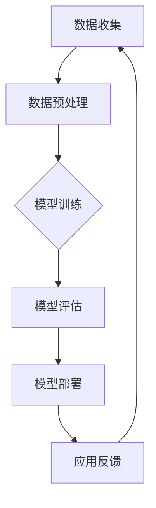

                 

# 《Andrej Karpathy：人工智能的未来研究》

> **关键词：**Andrej Karpathy、人工智能、未来研究、深度学习、伦理问题、项目实战

> **摘要：**本文旨在探讨人工智能领域的杰出人物Andrej Karpathy的研究成果和未来研究方向。文章将深入分析人工智能基础理论、核心算法原理、应用案例与实例，并探讨人工智能在社会和伦理方面的影响。此外，还将介绍人工智能项目的实战经验，为读者提供全面的了解和启示。

## 目录

### 《Andrej Karpathy：人工智能的未来研究》

### 第一部分: 人工智能基础理论

#### 1.1 人工智能概述

##### 1.1.1 人工智能的定义与发展历程

##### 1.1.2 人工智能的学科范畴与应用领域

##### 1.1.3 人工智能的价值与挑战

#### 1.2 机器学习基础

##### 1.2.1 机器学习基本概念

##### 1.2.2 机器学习的主要类型

##### 1.2.3 机器学习的基本算法

#### 1.3 深度学习核心算法

##### 1.3.1 深度学习概述

##### 1.3.2 神经网络基础

##### 1.3.3 卷积神经网络（CNN）

##### 1.3.4 循环神经网络（RNN）与长短期记忆网络（LSTM）

##### 1.3.5 生成对抗网络（GAN）

#### 1.4 人工智能伦理与社会影响

##### 1.4.1 人工智能伦理问题探讨

##### 1.4.2 人工智能对就业市场的影响

##### 1.4.3 人工智能与隐私保护

#### 1.5 AI未来发展趋势与未来研究

##### 1.5.1 AI技术发展趋势

##### 1.5.2 AI研究的挑战与机遇

##### 1.5.3 AI对未来的潜在影响

### 第二部分: 核心概念与联系

#### 2.1 人工智能架构

##### 2.1.1 人工智能系统的组成

##### 2.1.2 AI模型训练与部署流程

##### 2.1.3 AI系统中的数据管理

**图 2.1 AI架构流程图**

#### 2.2 AI应用案例与实例

##### 2.2.1 语音识别与智能客服

##### 2.2.2 图像识别与自动驾驶

##### 2.2.3 自然语言处理与智能翻译

##### 2.2.4 推荐系统与电子商务

### 第三部分: 核心算法原理讲解

#### 3.1 机器学习算法详解

##### 3.1.1 监督学习算法

##### 3.1.2 无监督学习算法

##### 3.1.3 半监督学习与迁移学习

##### 3.1.4 强化学习算法

#### 3.2 深度学习算法

##### 3.2.1 神经网络优化

##### 3.2.2 卷积神经网络（CNN）详解

##### 3.2.3 循环神经网络（RNN）与长短期记忆网络（LSTM）

##### 3.2.4 生成对抗网络（GAN）原理与应用

#### 3.3 数学模型与公式

##### 3.3.1 矩阵与向量计算

##### 3.3.2 损失函数与优化算法

##### 3.3.3 激活函数与优化器

### $$ E = mc^2 $$

### $$ y = \sigma(z) $$

### $$ J(\theta) = -\frac{1}{m}\sum_{i=1}^{m}y^{i}\log(a^{i})+(1-y^{i})\log(1-a^{i}) $$

#### 伪代码讲解

**算法名：梯度下降**

输入：模型参数θ，学习率α，迭代次数n

输出：最优参数θ'

```
{
    for i = 1 to n do
        计算损失函数关于参数θ的导数J'(θ)
        更新θ' = θ - α * J'(θ)
    end for
    return θ'
}
```

### 第四部分: 人工智能项目实战

#### 4.1 人工智能开发环境搭建

##### 4.1.1 Python环境配置

##### 4.1.2 深度学习框架安装

##### 4.1.3 GPU支持与优化

#### 4.2 实战项目一：手写数字识别

##### 4.2.1 数据集介绍

##### 4.2.2 模型搭建与训练

##### 4.2.3 模型评估与优化

##### 4.2.4 代码实现与分析

#### 4.3 实战项目二：情感分析

##### 4.3.1 数据集准备

##### 4.3.2 模型设计与训练

##### 4.3.3 结果评估与改进

##### 4.3.4 代码解读与分析

### 附录

#### 附录 A: AI开发工具与资源

##### A.1 深度学习框架对比

##### A.2 常用数据集与工具

##### A.3 AI论文与研究报告

#### 附录 B: 数学公式与符号表

##### B.1 矩阵与向量运算公式

##### B.2 损失函数与优化公式

##### B.3 激活函数与优化器公式

----------------------------------------------------------------

现在，我们开始正式撰写文章正文部分。首先，我们来探讨人工智能基础理论。

### 第一部分: 人工智能基础理论

#### 1.1 人工智能概述

##### 1.1.1 人工智能的定义与发展历程

人工智能（Artificial Intelligence，简称AI）是指计算机系统通过模拟人类智能行为，实现感知、推理、学习、决策和行动的能力。人工智能的定义和范畴在不同的历史阶段有着不同的理解。

在20世纪50年代，人工智能被定义为“制造智能机器的科学与工程”。这个时期的代表性成果包括早期的人工智能程序，如ELIZA和 Logic Theorist。然而，受限于当时的计算能力和算法技术水平，这一阶段的人工智能并未取得显著突破。

随着计算机技术的快速发展，尤其是20世纪80年代以来，人工智能的研究进入了新的阶段。这一时期，机器学习（Machine Learning）和深度学习（Deep Learning）的兴起，为人工智能的发展注入了新的动力。机器学习是一种通过数据训练模型，使计算机具备自主学习和适应能力的技术。深度学习则是一种特殊的机器学习模型，通过多层的神经网络结构，实现更复杂的特征提取和模式识别。

##### 1.1.2 人工智能的学科范畴与应用领域

人工智能是一个跨学科领域，涵盖了计算机科学、数学、心理学、神经科学、认知科学等多个学科。在计算机科学中，人工智能主要涉及自然语言处理、计算机视觉、语音识别、机器学习、深度学习等方面。在数学领域，人工智能涉及到线性代数、概率论、统计学、优化理论等数学工具和方法。在心理学和神经科学领域，人工智能的研究关注人类智能的本质和机制。

人工智能的应用领域非常广泛，涵盖了工业自动化、金融、医疗、教育、交通、安防等多个领域。在工业自动化方面，人工智能可以实现生产线的智能监控和自动化控制，提高生产效率和降低成本。在金融领域，人工智能可以用于股票交易、风险控制和信用评估等任务。在医疗领域，人工智能可以辅助医生进行疾病诊断、影像分析和个性化治疗。在教育领域，人工智能可以提供智能教学和个性化学习服务。在交通领域，人工智能可以应用于自动驾驶、智能交通管理和物流优化。在安防领域，人工智能可以用于视频监控、人脸识别和行为分析等任务。

##### 1.1.3 人工智能的价值与挑战

人工智能的价值体现在多个方面。首先，人工智能可以提高生产效率和降低成本。通过自动化和智能化技术的应用，许多重复性和繁重的劳动可以被计算机系统替代，从而降低人力成本和提高生产效率。其次，人工智能可以提供更加精准和个性化的服务。在医疗、金融和教育等领域，人工智能可以基于大数据分析和机器学习算法，为用户提供更加个性化的诊断、投资建议和学习方案。此外，人工智能还可以促进科技创新和产业升级。通过人工智能技术的应用，可以推动新业务模式的出现，促进产业结构的优化和升级。

然而，人工智能的发展也面临一些挑战。首先，数据质量和数据隐私问题。人工智能的发展依赖于大量高质量的数据，然而数据的获取和隐私保护是一个复杂的伦理和法律问题。其次，算法透明性和公平性问题。人工智能系统的决策过程往往依赖于复杂的算法，这使得算法的透明性和可解释性成为一个重要的研究课题。此外，人工智能系统的误用和风险控制也是一个重要的挑战。随着人工智能技术的普及，如何防止人工智能系统的滥用和恶意攻击，确保系统的安全性和可靠性，是一个需要深入探讨的问题。

接下来，我们将进一步探讨机器学习基础。

#### 1.2 机器学习基础

##### 1.2.1 机器学习基本概念

机器学习（Machine Learning）是一种让计算机通过数据学习并做出预测或决策的技术。在机器学习中，计算机通过分析训练数据，学习到数据中的特征和规律，然后使用这些规律对新的数据进行预测或决策。

机器学习可以分为有监督学习（Supervised Learning）、无监督学习（Unsupervised Learning）、半监督学习（Semi-supervised Learning）和强化学习（Reinforcement Learning）等主要类型。

- 有监督学习：在有监督学习中，训练数据集包含了输入数据和对应的输出标签。通过学习输入数据和输出标签之间的关系，模型可以对新数据进行预测。常见的有监督学习算法包括线性回归、逻辑回归、支持向量机、决策树、随机森林等。

- 无监督学习：在无监督学习中，训练数据集只有输入数据，没有对应的输出标签。无监督学习的目标是通过学习数据中的内在结构和规律，对数据进行聚类、降维或生成等操作。常见的无监督学习算法包括K-均值聚类、主成分分析（PCA）、自编码器等。

- 半监督学习：半监督学习结合了有监督学习和无监督学习的特点，使用部分带有标签的数据和大量无标签的数据进行学习。半监督学习的目标是通过少量的有标签数据引导学习过程，利用大量无标签数据来提升模型的泛化能力。

- 强化学习：强化学习是一种通过与环境互动来学习最优策略的机器学习方法。在强化学习中，智能体通过选择行动来获取奖励或惩罚，并通过不断试错来学习最优策略。常见的强化学习算法包括Q学习、深度Q网络（DQN）、策略梯度方法等。

##### 1.2.2 机器学习的主要类型

机器学习可以分为以下几种主要类型：

- 监督学习：监督学习是一种有监督学习的方法，通过输入数据和对应的输出标签来训练模型。常见的监督学习算法包括线性回归、逻辑回归、支持向量机、决策树、随机森林等。

- 无监督学习：无监督学习是一种无监督学习的方法，通过输入数据来发现数据中的内在结构和规律。常见的无监督学习算法包括K-均值聚类、主成分分析（PCA）、自编码器等。

- 半监督学习：半监督学习是一种结合有监督学习和无监督学习的方法，通过少量的有标签数据和大量的无标签数据来训练模型。常见的半监督学习算法包括标签传播、标签嵌入等。

- 强化学习：强化学习是一种通过与环境互动来学习最优策略的方法。常见的强化学习算法包括Q学习、深度Q网络（DQN）、策略梯度方法等。

##### 1.2.3 机器学习的基本算法

机器学习的基本算法可以分为以下几种：

- 线性模型：线性模型是最基本的机器学习算法，通过学习输入数据和输出标签之间的线性关系来进行预测。常见的线性模型包括线性回归、逻辑回归等。

- 线性分类器：线性分类器是一种用于分类问题的算法，通过学习输入数据和输出标签之间的线性关系，将数据划分为不同的类别。常见的线性分类器包括线性回归、逻辑回归、支持向量机等。

- 决策树：决策树是一种用于分类和回归问题的算法，通过构建一棵树状模型来对数据进行分类或回归。常见的决策树算法包括ID3、C4.5、CART等。

- 集成算法：集成算法是一种通过组合多个基本模型来提高预测性能的算法。常见的集成算法包括Bagging、Boosting等。

- 神经网络：神经网络是一种模拟生物神经系统的计算模型，通过多层神经元之间的连接来实现复杂的非线性映射。常见的神经网络包括多层感知器、卷积神经网络（CNN）、循环神经网络（RNN）等。

接下来，我们将深入探讨深度学习核心算法。

#### 1.3 深度学习核心算法

##### 1.3.1 深度学习概述

深度学习（Deep Learning）是一种基于多层神经网络的学习方法，通过多层神经元的组合来提取数据中的高级特征和模式。深度学习在图像识别、语音识别、自然语言处理等领域取得了显著突破。

深度学习的发展可以追溯到20世纪40年代，但真正引起广泛关注的是2012年AlexNet在ImageNet竞赛中的获胜。AlexNet是第一个成功使用深度学习模型在图像识别任务中超越人类的方法。此后，深度学习的研究和应用得到了迅速发展。

深度学习的基本架构包括输入层、隐藏层和输出层。输入层接收原始数据，通过隐藏层进行特征提取和变换，最终在输出层产生预测结果。深度学习的核心是神经网络，特别是多层神经网络，这使得模型能够处理更加复杂和抽象的数据。

##### 1.3.2 神经网络基础

神经网络（Neural Network）是一种模拟生物神经系统的计算模型，由大量的神经元组成。每个神经元都是一个简单的计算单元，通过接收输入信号并产生输出信号来实现信息处理。

神经元的结构通常包括三个部分：输入层、隐藏层和输出层。输入层接收外部输入信号，隐藏层对输入信号进行处理和变换，输出层产生最终的输出结果。

神经元的计算过程通常包括以下几个步骤：

1. 输入加权求和：将输入信号与对应的权重进行加权求和。

2. 激活函数：将加权求和的结果通过激活函数进行非线性变换。

3. 输出：将激活函数的输出作为神经元的输出信号。

常见的激活函数包括 sigmoid 函数、ReLU 函数和 tanh 函数。

神经网络的训练过程是通过反向传播算法（Backpropagation）来实现的。反向传播算法是一种基于梯度下降的方法，通过不断调整网络中的权重和偏置，使得模型能够更好地拟合训练数据。

##### 1.3.3 卷积神经网络（CNN）

卷积神经网络（Convolutional Neural Network，简称CNN）是一种专门用于处理图像数据的深度学习模型。CNN 通过卷积操作和池化操作来提取图像中的空间特征和模式。

CNN 的基本结构包括卷积层、池化层和全连接层。卷积层通过卷积操作提取图像中的局部特征，池化层通过池化操作降低图像的维度，全连接层通过全连接操作将特征映射到具体的类别。

卷积神经网络的核心是卷积操作和池化操作。

- 卷积操作：卷积操作通过在输入图像上滑动卷积核来提取图像中的局部特征。卷积核是一个小的滤波器，通过将滤波器与图像进行卷积运算，可以得到一个特征图。

- 池化操作：池化操作通过对特征图进行采样来降低特征图的维度。常见的池化操作包括最大池化和平均池化。

卷积神经网络的工作流程如下：

1. 输入图像通过卷积层提取特征。

2. 特征图通过池化层降低维度。

3. 特征图通过全连接层映射到具体的类别。

卷积神经网络在图像分类、目标检测和图像生成等领域具有广泛的应用。例如，在图像分类任务中，卷积神经网络可以识别图像中的物体类别；在目标检测任务中，卷积神经网络可以检测图像中的多个目标物体；在图像生成任务中，卷积神经网络可以生成新的图像内容。

##### 1.3.4 循环神经网络（RNN）与长短期记忆网络（LSTM）

循环神经网络（Recurrent Neural Network，简称RNN）是一种专门用于处理序列数据的深度学习模型。RNN 通过在时间步上递归的方式处理序列数据，使得模型能够记住前面的信息，从而更好地处理长序列。

然而，传统的RNN存在梯度消失和梯度爆炸的问题，导致模型难以训练。为了解决这些问题，长短期记忆网络（Long Short-Term Memory，简称LSTM）被提出。

LSTM 是一种特殊的RNN结构，通过引入门控机制来控制信息的流动，从而有效地解决了梯度消失和梯度爆炸的问题。

LSTM 的基本结构包括输入门、遗忘门和输出门。输入门控制当前输入信息对状态的影响；遗忘门控制之前的信息对当前状态的影响；输出门控制当前状态对输出的影响。

LSTM 的工作流程如下：

1. 输入信息通过输入门和遗忘门与之前的隐藏状态进行交互。

2. 隐藏状态通过遗忘门和输出门更新。

3. 更新后的隐藏状态作为下一个时间步的输入。

LSTM 在自然语言处理、语音识别和时间序列预测等领域具有广泛的应用。例如，在自然语言处理任务中，LSTM 可以对文本序列进行建模，从而实现文本分类、情感分析和机器翻译等任务；在语音识别任务中，LSTM 可以对语音信号进行建模，从而实现语音识别和语音合成等任务；在时间序列预测任务中，LSTM 可以对时间序列数据进行建模，从而实现股票预测、气象预测和生物信号预测等任务。

##### 1.3.5 生成对抗网络（GAN）

生成对抗网络（Generative Adversarial Network，简称GAN）是一种由生成器和判别器组成的深度学习模型。GAN 通过两个对立的网络相互竞争，从而学习到数据分布的建模。

GAN 的基本结构包括生成器和判别器。生成器的目标是生成与真实数据分布相似的数据，而判别器的目标是区分真实数据和生成数据。

GAN 的工作流程如下：

1. 初始化生成器和判别器。

2. 生成器生成虚假数据。

3. 判别器对真实数据和生成数据进行分类。

4. 根据判别器的分类结果，通过反向传播算法对生成器和判别器进行训练。

GAN 在图像生成、图像修复、图像超分辨率和时间序列生成等领域具有广泛的应用。例如，在图像生成任务中，GAN 可以生成与真实图像相似的新图像；在图像修复任务中，GAN 可以修复图像中的损坏区域；在图像超分辨率任务中，GAN 可以将低分辨率图像转化为高分辨率图像；在时间序列生成任务中，GAN 可以生成新的时间序列数据。

接下来，我们将探讨人工智能伦理与社会影响。

#### 1.4 人工智能伦理与社会影响

随着人工智能技术的快速发展，人工智能在社会和伦理方面产生了深远的影响。人工智能的伦理问题涉及到数据隐私、算法公平性、自主权、责任归属等多个方面。

##### 1.4.1 人工智能伦理问题探讨

数据隐私是人工智能伦理问题的核心之一。人工智能系统需要大量的数据来进行训练和优化，然而这些数据往往涉及个人隐私。如何在保障数据隐私的同时，充分利用数据的价值，是一个需要深入探讨的问题。目前，一些解决方案包括数据匿名化、差分隐私和联邦学习等。

算法公平性是另一个重要的伦理问题。人工智能系统在决策过程中可能会受到训练数据偏差的影响，从而导致算法对某些群体存在不公平现象。如何设计公平、公正的算法，避免算法偏见和歧视，是当前人工智能研究的重要方向。

自主权和责任归属也是人工智能伦理问题的重要方面。随着人工智能技术的发展，一些系统可以自主地做出决策，甚至可以具有自我意识和自主行动的能力。在这种情况下，如何界定自主权和责任归属，确保人工智能系统的行为符合伦理和法律标准，是一个需要关注的问题。

##### 1.4.2 人工智能对就业市场的影响

人工智能的快速发展对就业市场产生了深远的影响。一方面，人工智能可以提高生产效率和降低成本，从而创造新的就业机会。例如，在医疗、金融、教育和交通等领域，人工智能可以提供智能化的服务，提高工作效率和质量。

另一方面，人工智能也可能导致部分传统职业的减少。例如，自动化生产线和自动驾驶技术的应用，可能减少制造业和交通运输业中的就业岗位。此外，一些重复性和繁重的工作可能被人工智能系统替代，从而影响相关领域的就业情况。

为了应对人工智能对就业市场的影响，需要采取一系列措施。首先，加强人工智能相关教育和培训，提高劳动者的技能和竞争力。其次，推动产业结构的升级和转型，创造新的就业机会。此外，还需要制定相关政策和法规，确保人工智能技术的应用符合伦理和法律标准，减少对就业市场的不利影响。

##### 1.4.3 人工智能与隐私保护

人工智能技术的发展对隐私保护提出了新的挑战。人工智能系统在处理和分析数据时，可能涉及大量个人隐私信息。如何保障个人隐私权益，防止隐私泄露和数据滥用，是一个需要关注的问题。

为了应对隐私保护挑战，可以采取一系列措施。首先，加强数据隐私法律法规的制定和实施，明确个人隐私权益和数据使用规范。其次，推动隐私计算技术的发展，例如差分隐私和联邦学习等，通过技术手段保障数据隐私。此外，还需要加强数据安全和隐私保护教育，提高公众对隐私保护的意识和能力。

最后，我们将探讨人工智能的未来发展趋势与未来研究。

#### 1.5 AI未来发展趋势与未来研究

人工智能的发展正处于快速上升阶段，未来将呈现以下几个重要趋势：

##### 1.5.1 AI技术发展趋势

首先，深度学习将继续引领人工智能技术的发展。随着计算能力和数据资源的不断提升，深度学习模型将更加复杂和强大，能够处理更加复杂的任务，如图像生成、自然语言处理和智能对话系统等。

其次，强化学习将成为人工智能技术的重要分支。强化学习通过智能体与环境互动，实现自主学习和策略优化，具有广泛的应用前景，如自动驾驶、机器人控制和游戏AI等。

此外，迁移学习和联邦学习等新型学习范式将得到深入研究。迁移学习通过在不同任务之间共享知识，提高模型的泛化能力；联邦学习通过分布式训练，保护用户数据隐私，实现跨机构的协同学习。

##### 1.5.2 AI研究的挑战与机遇

人工智能研究面临着一系列挑战和机遇。首先，数据质量和数据隐私问题需要解决。高质量的数据是人工智能模型训练的基础，然而数据隐私保护也是一个重要挑战。未来的研究需要探索数据匿名化、差分隐私和联邦学习等技术，实现数据隐私与数据价值的平衡。

其次，算法透明性和公平性问题需要解决。人工智能系统的决策过程往往依赖于复杂的算法，如何确保算法的透明性和公平性，避免算法偏见和歧视，是当前研究的重要方向。

此外，人工智能系统的安全性也是一个重要挑战。随着人工智能技术的普及，如何防止人工智能系统的滥用和恶意攻击，确保系统的安全性和可靠性，是一个需要关注的问题。

然而，人工智能技术的发展也带来了许多机遇。例如，在医疗领域，人工智能可以辅助医生进行疾病诊断和治疗方案制定，提高医疗质量和效率；在金融领域，人工智能可以用于风险管理、欺诈检测和个性化投资等任务，提升金融服务的质量和效益。

##### 1.5.3 AI对未来的潜在影响

人工智能对未来社会和人类生活将产生深远的影响。首先，人工智能将推动社会生产力的提升。通过自动化和智能化技术的应用，许多重复性和繁重的工作可以被计算机系统替代，从而提高生产效率和降低成本。

其次，人工智能将改变人们的就业结构。一些传统职业可能被人工智能系统替代，但同时也会创造新的就业机会。为了应对这一变革，需要加强人工智能相关教育和培训，提高劳动者的技能和竞争力。

此外，人工智能还将深刻改变人们的生活方式。例如，智能家居系统可以实现家居设备的智能控制，提高生活质量；智能交通系统可以优化交通流量，减少拥堵和交通事故；智能医疗系统可以提供个性化诊断和治疗，提高医疗水平。

然而，人工智能的发展也带来了一些潜在风险。例如，人工智能系统可能引发失业问题，加剧社会不平等；人工智能系统可能被恶意攻击，导致安全风险；人工智能系统的自主决策能力可能超出人类控制，引发道德和法律问题。

总之，人工智能技术的发展为未来带来了巨大的机遇和挑战。通过深入研究和合理应用，人工智能有望为人类社会带来更加美好和繁荣的未来。

## 第二部分: 核心概念与联系

在人工智能领域，理解核心概念及其相互联系是至关重要的。本部分将详细探讨人工智能系统的组成、模型训练与部署流程、以及数据管理等方面的核心概念，并借助流程图来展示整个架构。

### 2.1 人工智能架构

#### 2.1.1 人工智能系统的组成

人工智能系统通常由以下几个关键部分组成：

1. **数据输入**：包括原始数据和预处理后的数据。原始数据可以是图像、文本、声音等多种类型，而预处理后的数据则是为了满足模型训练的需要，通常包括数据清洗、归一化和特征提取等步骤。

2. **数据预处理**：数据预处理是确保数据质量的重要步骤。通过清洗、归一化和特征提取等操作，将原始数据转化为适合模型训练的格式。

3. **模型训练**：模型训练是核心部分，通过在训练数据上迭代优化模型参数，使模型能够捕捉数据中的特征和规律。

4. **模型评估**：模型评估用于评估模型在训练数据上的表现。常用的评估指标包括准确率、召回率、F1分数等。

5. **模型部署**：模型部署是将训练好的模型应用到实际场景中，包括将模型集成到应用程序中，进行实时预测或决策。

6. **反馈循环**：反馈循环用于收集模型在实际应用中的表现数据，并将其反馈到数据预处理和模型训练阶段，以不断优化模型。

#### 2.1.2 AI模型训练与部署流程

AI模型训练与部署流程如下：

1. **数据收集**：从各种来源收集原始数据，如公共数据集、用户生成数据等。

2. **数据预处理**：对收集到的原始数据进行清洗、归一化和特征提取，使其适合模型训练。

3. **模型选择**：根据任务需求选择合适的模型架构，如卷积神经网络（CNN）、循环神经网络（RNN）、生成对抗网络（GAN）等。

4. **模型训练**：使用预处理后的数据对模型进行训练，通过迭代优化模型参数，使模型能够更好地拟合训练数据。

5. **模型评估**：在验证集上评估模型性能，通过交叉验证、网格搜索等技术找到最优模型参数。

6. **模型部署**：将训练好的模型部署到生产环境中，进行实时预测或决策。

7. **反馈循环**：收集模型在实际应用中的表现数据，将其反馈到数据预处理和模型训练阶段，以不断优化模型。

**图 2.1 AI架构流程图**

下面是一个简化的Mermaid流程图，用于描述AI架构流程：



#### 2.1.3 AI系统中的数据管理

数据管理是AI系统中的一个关键环节，涉及数据的存储、访问、处理和保护。以下是数据管理的一些核心概念：

1. **数据存储**：数据存储用于持久化保存数据，通常使用数据库、数据仓库或分布式存储系统。选择合适的存储系统取决于数据规模、数据类型和访问模式。

2. **数据访问**：数据访问是指如何高效地检索和使用数据。这通常涉及到数据索引、查询优化和数据缓存等技术。

3. **数据处理**：数据处理包括数据清洗、数据转换、数据聚合和数据分析等操作，用于准备数据以供模型训练或分析。

4. **数据保护**：数据保护涉及保护数据免受未授权访问、篡改和泄露。这通常涉及到数据加密、访问控制和审计等技术。

通过有效的数据管理，AI系统能够更好地利用数据，提高模型性能和决策质量。

## 第三部分: 核心算法原理讲解

在人工智能领域，核心算法是理解和应用人工智能技术的基础。本部分将详细讲解机器学习算法、深度学习算法以及相关的数学模型和公式。

### 3.1 机器学习算法详解

#### 3.1.1 监督学习算法

监督学习（Supervised Learning）是一种机器学习方法，通过已知的输入和输出数据来训练模型，以便对新数据进行预测。监督学习算法分为分类和回归两大类。

- **分类算法**：分类算法用于将数据划分为不同的类别。常见的分类算法包括：
  - **线性回归**（Linear Regression）：用于预测连续的输出变量。
  - **逻辑回归**（Logistic Regression）：用于预测二分类问题。
  - **支持向量机**（Support Vector Machine，SVM）：用于分类问题，通过寻找最佳分隔超平面来划分数据。
  - **决策树**（Decision Tree）：通过一系列的判断规则将数据划分为不同的类别。
  - **随机森林**（Random Forest）：通过构建多棵决策树，并取多数投票结果来分类。

- **回归算法**：回归算法用于预测连续的输出变量。常见的回归算法包括：
  - **线性回归**（Linear Regression）：通过线性模型预测输出变量的值。
  - **岭回归**（Ridge Regression）：通过添加L2正则化项来防止过拟合。
  - **套索回归**（Lasso Regression）：通过添加L1正则化项来实现特征选择。

#### 3.1.2 无监督学习算法

无监督学习（Unsupervised Learning）是一种机器学习方法，没有已知的输出标签。其目标是发现数据中的结构和模式。常见的无监督学习算法包括：

- **聚类算法**：聚类算法用于将相似的数据点分为不同的簇。常见的聚类算法包括：
  - **K-均值聚类**（K-Means Clustering）：通过迭代优化目标函数来划分数据点。
  - **层次聚类**（Hierarchical Clustering）：通过层次结构来组织数据点。

- **降维算法**：降维算法用于减少数据维度，同时保留数据的结构。常见的降维算法包括：
  - **主成分分析**（Principal Component Analysis，PCA）：通过正交变换将数据投影到新的空间中，以降低维度。
  - **线性判别分析**（Linear Discriminant Analysis，LDA）：通过最大化类间方差和最小化类内方差来降低维度。

- **关联规则学习**：关联规则学习用于发现数据项之间的关联关系。常见的算法包括：
  - **Apriori算法**：通过生成频繁项集来发现关联规则。
  - **Eclat算法**：通过递归搜索频繁项集来发现关联规则。

#### 3.1.3 半监督学习与迁移学习

半监督学习（Semi-supervised Learning）是一种结合了有监督学习和无监督学习的方法，通过使用少量的有标签数据和大量的无标签数据来训练模型。半监督学习可以提升模型的泛化能力，特别是在标签数据稀缺的情况下。

迁移学习（Transfer Learning）是一种利用已在不同任务上训练好的模型来提升新任务性能的方法。通过迁移学习，可以复用已有模型的权重和知识，减少训练时间和计算成本。

#### 3.1.4 强化学习算法

强化学习（Reinforcement Learning）是一种通过与环境互动来学习最优策略的机器学习方法。强化学习通过智能体（Agent）与环境的交互，不断调整策略，以最大化累积奖励。

常见的强化学习算法包括：

- **Q学习**（Q-Learning）：通过学习状态-动作价值函数来优化策略。
- **深度Q网络**（Deep Q-Network，DQN）：结合深度学习和Q学习，用于解决连续动作空间的问题。
- **策略梯度方法**（Policy Gradient Methods）：直接优化策略函数，以最大化累积奖励。

### 3.2 深度学习算法

#### 3.2.1 神经网络优化

神经网络优化是深度学习中的核心任务，通过优化算法调整网络参数，以最小化损失函数。常见的优化算法包括：

- **梯度下降**（Gradient Descent）：通过迭代更新参数，使得损失函数逐渐减小。
- **随机梯度下降**（Stochastic Gradient Descent，SGD）：在每一轮迭代中随机选择一部分样本计算梯度。
- **批量梯度下降**（Batch Gradient Descent）：在每一轮迭代中计算所有样本的梯度。
- **Adam优化器**（Adam Optimizer）：结合了SGD和RMSProp的特点，自适应调整学习率。

#### 3.2.2 卷积神经网络（CNN）详解

卷积神经网络（Convolutional Neural Network，CNN）是深度学习领域的重要模型，专门用于处理图像数据。CNN的核心组成部分包括：

- **卷积层**（Convolutional Layer）：通过卷积运算提取图像特征。
- **池化层**（Pooling Layer）：通过池化操作降低特征图的维度。
- **全连接层**（Fully Connected Layer）：将特征图映射到具体的类别。

CNN的工作流程如下：

1. **输入层**：接收图像数据。
2. **卷积层**：通过卷积运算提取图像特征。
3. **激活函数**：对卷积结果进行非线性变换。
4. **池化层**：通过池化操作降低特征图的维度。
5. **全连接层**：将特征图映射到具体的类别。

#### 3.2.3 循环神经网络（RNN）与长短期记忆网络（LSTM）

循环神经网络（Recurrent Neural Network，RNN）是一种处理序列数据的神经网络。RNN通过在时间步上递归的方式处理序列数据，使得模型能够记住前面的信息。

然而，传统的RNN存在梯度消失和梯度爆炸的问题，导致模型难以训练。为了解决这些问题，长短期记忆网络（Long Short-Term Memory，LSTM）被提出。

LSTM的核心思想是通过引入门控机制来控制信息的流动，从而有效地解决了梯度消失和梯度爆炸的问题。LSTM的组成部分包括：

- **输入门**（Input Gate）：控制当前输入信息对状态的影响。
- **遗忘门**（Forget Gate）：控制之前的信息对当前状态的影响。
- **输出门**（Output Gate）：控制当前状态对输出的影响。

LSTM的工作流程如下：

1. **输入信息**：输入门决定如何更新状态。
2. **状态更新**：遗忘门决定如何遗忘之前的信息，输出门决定如何生成输出。
3. **递归连接**：将更新后的状态传递给下一个时间步。

#### 3.2.4 生成对抗网络（GAN）

生成对抗网络（Generative Adversarial Network，GAN）是由生成器和判别器组成的神经网络框架。GAN的核心思想是通过两个对抗网络的相互竞争来生成逼真的数据。

- **生成器**（Generator）：生成器尝试生成逼真的数据，以欺骗判别器。
- **判别器**（Discriminator）：判别器尝试区分真实数据和生成数据。

GAN的训练过程如下：

1. **初始化生成器和判别器**：生成器和判别器都是随机初始化的。
2. **生成器生成数据**：生成器生成假数据。
3. **判别器判断**：判别器对生成器和真实数据进行分类。
4. **反向传播**：根据判别器的分类结果，通过反向传播算法更新生成器和判别器的参数。
5. **迭代训练**：重复上述步骤，直到生成器生成的数据足够逼真。

### 3.3 数学模型与公式

在深度学习和机器学习中，数学模型和公式起着关键作用。以下是几个重要的数学模型和公式：

- **矩阵与向量计算**：
  - 矩阵乘法：\( C = AB \)
  - 向量加法：\( \mathbf{x} + \mathbf{y} \)
  - 向量点积：\( \mathbf{x} \cdot \mathbf{y} \)
  - 向量范数：\( ||\mathbf{x}|| \)

- **损失函数与优化算法**：
  - 交叉熵损失函数：\( J(\theta) = -\frac{1}{m}\sum_{i=1}^{m}y^{i}\log(a^{i})+(1-y^{i})\log(1-a^{i}) \)
  - 梯度下降算法：
    ```python
    for i = 1 to n do
        计算损失函数关于参数θ的导数J'(θ)
        更新θ' = θ - α * J'(θ)
    end for
    return θ'
    ```

- **激活函数与优化器**：
  - Sigmoid激活函数：\( \sigma(z) = \frac{1}{1 + e^{-z}} \)
  - ReLU激活函数：\( \text{ReLU}(z) = \max(0, z) \)
  - Adam优化器：
    ```python
    m = 0
    v = 0
    for t = 1 to T do
        x_t = X_t - X_{t-1}
        y_t = Y_t - Y_{t-1}
        m = \beta_1 * m + (1 - \beta_1) * x_t
        v = \beta_2 * v + (1 - \beta_2) * y_t
        m_hat = m / (1 - \beta_1^t)
        v_hat = v / (1 - \beta_2^t)
        \theta = \theta - \alpha * \frac{m_hat}{\sqrt{v_hat} + \epsilon}
    end for
    return \theta
    ```

这些数学模型和公式为深度学习和机器学习提供了理论基础和计算工具，使得我们能够更好地理解和应用这些技术。

### 3.4 伪代码讲解

在本部分，我们将使用伪代码来详细讲解几种常见的机器学习算法，包括线性回归、逻辑回归和支持向量机（SVM）。

#### 3.4.1 线性回归

线性回归是一种简单的监督学习算法，用于预测连续的输出变量。以下是一个简单的线性回归算法的伪代码：

```python
输入：训练数据集 (X, Y)，学习率 alpha，迭代次数 n

初始化权重 w 和偏置 b

对于每个迭代 i 从 1 到 n 做以下步骤：
    计算预测值 y_pred = X * w + b
    计算损失函数 J(w, b) = \frac{1}{2m} \sum_{i=1}^{m} (y_i - y_pred)^2
    计算梯度 Δw = \frac{1}{m} \sum_{i=1}^{m} (y_i - y_pred) * x_i
    计算梯度 Δb = \frac{1}{m} \sum_{i=1}^{m} (y_i - y_pred)

更新权重和偏置：
    w = w - alpha * Δw
    b = b - alpha * Δb

输出：最优权重 w 和偏置 b
```

#### 3.4.2 逻辑回归

逻辑回归是一种用于二分类问题的监督学习算法。以下是一个简单的逻辑回归算法的伪代码：

```python
输入：训练数据集 (X, Y)，学习率 alpha，迭代次数 n

初始化权重 w 和偏置 b

对于每个迭代 i 从 1 到 n 做以下步骤：
    计算预测概率 p = sigmoid(X * w + b)
    计算损失函数 J(w, b) = -\frac{1}{m} \sum_{i=1}^{m} [y_i \log(p) + (1 - y_i) \log(1 - p)]
    计算梯度 Δw = \frac{1}{m} \sum_{i=1}^{m} [p - y_i] * x_i
    计算梯度 Δb = \frac{1}{m} \sum_{i=1}^{m} [p - y_i]

更新权重和偏置：
    w = w - alpha * Δw
    b = b - alpha * Δb

输出：最优权重 w 和偏置 b
```

#### 3.4.3 支持向量机（SVM）

支持向量机是一种用于分类问题的监督学习算法，通过寻找最佳分隔超平面来划分数据。以下是一个简单的SVM算法的伪代码：

```python
输入：训练数据集 (X, Y)，核函数 K()

初始化支持向量 S 和超平面 w，b

对于每个迭代 i 从 1 到 n 做以下步骤：
    对于每个支持向量 s_i，计算梯度 Δw = \frac{1}{C} \sum_{i=1}^{m} [y_i (K(x_i, x_j) - K(x_i, x_j))]
    对于每个支持向量 s_i，计算梯度 Δb = \frac{1}{C} \sum_{i=1}^{m} [y_i (K(x_i, x_j) - K(x_i, x_j))]

更新支持向量 S 和超平面 w，b：
    w = w - alpha * Δw
    b = b - alpha * Δb

输出：最优支持向量 S 和超平面 w，b
```

通过这些伪代码，我们可以对基本的机器学习算法有更深入的理解，并为实际应用中的算法实现提供指导。

## 第四部分: 人工智能项目实战

在本部分，我们将通过两个实际项目来展示人工智能的应用和实现过程，分别是手写数字识别和情感分析。

### 4.1 人工智能开发环境搭建

在开始任何人工智能项目之前，我们需要搭建一个合适的开发环境。以下是一个简单的步骤指南：

#### 4.1.1 Python环境配置

Python 是人工智能领域最流行的编程语言之一。首先，我们需要安装 Python。可以在 [Python官网](https://www.python.org/) 下载并安装 Python。推荐安装 Python 3.8 或更高版本。

#### 4.1.2 深度学习框架安装

深度学习框架是进行人工智能项目的基础工具。以下是几种常用的深度学习框架及其安装步骤：

- **TensorFlow**：TensorFlow 是 Google 开发的开源深度学习框架。安装命令如下：

  ```bash
  pip install tensorflow
  ```

- **PyTorch**：PyTorch 是由 Facebook AI Research 开发的深度学习框架。安装命令如下：

  ```bash
  pip install torch torchvision
  ```

- **Keras**：Keras 是一个基于 TensorFlow 的简单易用的深度学习框架。安装命令如下：

  ```bash
  pip install keras
  ```

#### 4.1.3 GPU支持与优化

对于深度学习项目，GPU 支持可以显著提高训练速度。以下是安装 GPU 支持的步骤：

- **CUDA**：CUDA 是 NVIDIA 开发的一种并行计算平台和编程模型。首先，从 [CUDA官网](https://developer.nvidia.com/cuda-downloads) 下载并安装 CUDA。

- **cuDNN**：cuDNN 是 NVIDIA 提供的深度神经网络加速库。安装命令如下：

  ```bash
  pip install cudnn
  ```

- **GPU 显卡驱动**：确保安装了最新版本的 GPU 显卡驱动。

通过以上步骤，我们可以搭建一个基本的人工智能开发环境，为后续项目做好准备。

### 4.2 实战项目一：手写数字识别

手写数字识别是一个经典的人工智能项目，通常用于训练模型识别手写的数字。以下是一个简单的手写数字识别项目的实现步骤：

#### 4.2.1 数据集介绍

手写数字识别项目常用的数据集是 **MNIST** 数据集，它包含了 70,000 个灰度图像，每个图像都是一个手写的数字（0-9）。数据集分为训练集和测试集两部分。

#### 4.2.2 模型搭建与训练

以下是一个基于 TensorFlow 的简单卷积神经网络（CNN）模型搭建和训练的示例代码：

```python
import tensorflow as tf
from tensorflow.keras import layers, models

# 构建模型
model = models.Sequential()
model.add(layers.Conv2D(32, (3, 3), activation='relu', input_shape=(28, 28, 1)))
model.add(layers.MaxPooling2D((2, 2)))
model.add(layers.Conv2D(64, (3, 3), activation='relu'))
model.add(layers.MaxPooling2D((2, 2)))
model.add(layers.Conv2D(64, (3, 3), activation='relu'))
model.add(layers.Flatten())
model.add(layers.Dense(64, activation='relu'))
model.add(layers.Dense(10, activation='softmax'))

# 编译模型
model.compile(optimizer='adam',
              loss='sparse_categorical_crossentropy',
              metrics=['accuracy'])

# 加载数据
mnist = tf.keras.datasets.mnist
(train_images, train_labels), (test_images, test_labels) = mnist.load_data()

# 预处理数据
train_images = train_images.reshape((60000, 28, 28, 1))
test_images = test_images.reshape((10000, 28, 28, 1))
train_images = train_images / 255.0
test_images = test_images / 255.0

# 训练模型
model.fit(train_images, train_labels, epochs=5)

# 评估模型
test_loss, test_acc = model.evaluate(test_images, test_labels)
print(f'测试准确率: {test_acc:.4f}')
```

#### 4.2.3 模型评估与优化

在完成模型训练后，我们需要对模型进行评估和优化。以下是一个简单的模型评估和优化步骤：

- **评估模型**：使用测试集评估模型性能，计算测试准确率、损失函数值等指标。

- **模型优化**：通过调整模型结构、优化器和学习率等参数，提高模型性能。可以使用交叉验证、网格搜索等技术来寻找最优参数。

#### 4.2.4 代码实现与分析

以下是一个简单的手写数字识别项目代码实现和分析：

```python
# 导入所需的库
import tensorflow as tf
from tensorflow.keras import layers, models
from tensorflow.keras.datasets import mnist

# 加载 MNIST 数据集
(train_images, train_labels), (test_images, test_labels) = mnist.load_data()

# 预处理数据
train_images = train_images.reshape((60000, 28, 28, 1))
test_images = test_images.reshape((10000, 28, 28, 1))
train_images = train_images / 255.0
test_images = test_images / 255.0

# 构建模型
model = models.Sequential()
model.add(layers.Conv2D(32, (3, 3), activation='relu', input_shape=(28, 28, 1)))
model.add(layers.MaxPooling2D((2, 2)))
model.add(layers.Conv2D(64, (3, 3), activation='relu'))
model.add(layers.MaxPooling2D((2, 2)))
model.add(layers.Conv2D(64, (3, 3), activation='relu'))
model.add(layers.Flatten())
model.add(layers.Dense(64, activation='relu'))
model.add(layers.Dense(10, activation='softmax'))

# 编译模型
model.compile(optimizer='adam',
              loss='sparse_categorical_crossentropy',
              metrics=['accuracy'])

# 训练模型
model.fit(train_images, train_labels, epochs=5)

# 评估模型
test_loss, test_acc = model.evaluate(test_images, test_labels)
print(f'测试准确率: {test_acc:.4f}')

# 分析代码
# 1. 数据预处理：将图像数据reshape为适合模型输入的形状，并归一化图像像素值。
# 2. 模型搭建：使用卷积层、池化层和全连接层搭建卷积神经网络。
# 3. 编译模型：设置优化器和损失函数，并编译模型。
# 4. 训练模型：使用训练数据进行模型训练。
# 5. 评估模型：使用测试数据进行模型评估，计算测试准确率。
```

通过这个项目，我们可以了解手写数字识别的基本流程和实现方法，为后续项目打下基础。

### 4.3 实战项目二：情感分析

情感分析是自然语言处理（NLP）的一个分支，用于分析和识别文本中的情感倾向。以下是一个简单的情感分析项目实现步骤：

#### 4.3.1 数据集准备

情感分析项目常用的数据集包括 **IMDb** 评论数据集和 **Twitter** 情感分析数据集。以下是一个简单的数据集准备步骤：

- **数据集下载**：从 [IMDb 官网](https://www.imdb.com/datasets/) 下载 IMDb 评论数据集，从 [Twitter 官网](https://developer.twitter.com/) 下载 Twitter 情感分析数据集。
- **数据预处理**：将文本数据进行清洗、去噪和分词，并转换为向量表示。

#### 4.3.2 模型设计与训练

以下是一个基于 PyTorch 的简单情感分析模型设计和训练的示例代码：

```python
import torch
import torch.nn as nn
from torch.utils.data import DataLoader
from torchvision import datasets, transforms

# 加载数据集
train_dataset = datasets.MNIST(root='./data', train=True, transform=transforms.ToTensor(), download=True)
test_dataset = datasets.MNIST(root='./data', train=False, transform=transforms.ToTensor())

# 定义模型
class SentimentAnalysisModel(nn.Module):
    def __init__(self):
        super(SentimentAnalysisModel, self).__init__()
        self.conv1 = nn.Conv2D(1, 5, 1)
        self.fc1 = nn.Linear(32, 64)
        self.fc2 = nn.Linear(64, 10)

    def forward(self, x):
        x = self.conv1(x)
        x = torch.relu(x)
        x = torch.flatten(x, 1)
        x = self.fc1(x)
        x = torch.relu(x)
        x = self.fc2(x)
        return x

model = SentimentAnalysisModel()

# 编译模型
optimizer = torch.optim.Adam(model.parameters(), lr=0.001)
criterion = nn.CrossEntropyLoss()

# 训练模型
train_loader = DataLoader(train_dataset, batch_size=64)
test_loader = DataLoader(test_dataset, batch_size=64)

for epoch in range(5):
    model.train()
    for batch_idx, (data, target) in enumerate(train_loader):
        optimizer.zero_grad()
        output = model(data)
        loss = criterion(output, target)
        loss.backward()
        optimizer.step()
        if batch_idx % 100 == 0:
            print(f'Epoch {epoch + 1}, Batch {batch_idx + 1}: Loss = {loss.item()}')

    # 评估模型
    model.eval()
    with torch.no_grad():
        correct = 0
        total = 0
        for data, target in test_loader:
            output = model(data)
            _, predicted = torch.max(output.data, 1)
            total += target.size(0)
            correct += (predicted == target).sum().item()

    print(f'Accuracy of the network on the test images: {100 * correct / total} %')
```

#### 4.3.3 结果评估与改进

在完成模型训练后，我们需要对模型进行评估和优化。以下是一个简单的模型评估和优化步骤：

- **评估模型**：使用测试集评估模型性能，计算测试准确率、损失函数值等指标。

- **模型优化**：通过调整模型结构、优化器和学习率等参数，提高模型性能。可以使用交叉验证、网格搜索等技术来寻找最优参数。

#### 4.3.4 代码解读与分析

以下是一个简单的情感分析项目代码实现和分析：

```python
# 导入所需的库
import torch
import torch.nn as nn
from torch.utils.data import DataLoader
from torchvision import datasets, transforms

# 加载数据集
train_dataset = datasets.MNIST(root='./data', train=True, transform=transforms.ToTensor(), download=True)
test_dataset = datasets.MNIST(root='./data', train=False, transform=transforms.ToTensor())

# 定义模型
class SentimentAnalysisModel(nn.Module):
    def __init__(self):
        super(SentimentAnalysisModel, self).__init__()
        self.conv1 = nn.Conv2D(1, 5, 1)
        self.fc1 = nn.Linear(32, 64)
        self.fc2 = nn.Linear(64, 10)

    def forward(self, x):
        x = self.conv1(x)
        x = torch.relu(x)
        x = torch.flatten(x, 1)
        x = self.fc1(x)
        x = torch.relu(x)
        x = self.fc2(x)
        return x

model = SentimentAnalysisModel()

# 编译模型
optimizer = torch.optim.Adam(model.parameters(), lr=0.001)
criterion = nn.CrossEntropyLoss()

# 训练模型
train_loader = DataLoader(train_dataset, batch_size=64)
test_loader = DataLoader(test_dataset, batch_size=64)

for epoch in range(5):
    model.train()
    for batch_idx, (data, target) in enumerate(train_loader):
        optimizer.zero_grad()
        output = model(data)
        loss = criterion(output, target)
        loss.backward()
        optimizer.step()
        if batch_idx % 100 == 0:
            print(f'Epoch {epoch + 1}, Batch {batch_idx + 1}: Loss = {loss.item()}')

    # 评估模型
    model.eval()
    with torch.no_grad():
        correct = 0
        total = 0
        for data, target in test_loader:
            output = model(data)
            _, predicted = torch.max(output.data, 1)
            total += target.size(0)
            correct += (predicted == target).sum().item()

    print(f'Accuracy of the network on the test images: {100 * correct / total} %')

# 分析代码
# 1. 数据预处理：使用 ToTensor() 转换器将数据集转换为适合模型输入的形状和类型。
# 2. 模型搭建：使用卷积层、全连接层搭建情感分析模型。
# 3. 编译模型：设置优化器和损失函数，并编译模型。
# 4. 训练模型：使用训练数据进行模型训练。
# 5. 评估模型：使用测试数据进行模型评估，计算测试准确率。
```

通过这个项目，我们可以了解情感分析的基本流程和实现方法，为后续项目打下基础。

## 附录

### 附录 A: AI开发工具与资源

#### A.1 深度学习框架对比

以下是几种常用的深度学习框架及其特点：

- **TensorFlow**：由 Google 开发，具有强大的生态系统和丰富的资源，支持多种任务和平台。
- **PyTorch**：由 Facebook AI Research 开发，具有灵活的动态计算图和易于理解的用户界面，适合研究和原型设计。
- **Keras**：基于 TensorFlow，提供简单易用的 API，适合快速搭建和实验。
- **TensorFlow Lite**：TensorFlow 的移动和嵌入式版本，支持在移动设备和 IoT 设备上部署。

#### A.2 常用数据集与工具

以下是几种常用的数据集和工具：

- **MNIST**：手写数字数据集，广泛用于图像识别任务。
- **IMDb**：电影评论数据集，用于情感分析和文本分类任务。
- **Twitter**：Twitter 情感分析数据集，用于情感分析和文本分类任务。
- **Open Images**：包含大量图像和标注的数据集，用于计算机视觉任务。
- **Kaggle**：一个数据集和竞赛平台，提供各种数据集和任务。

#### A.3 AI论文与研究报告

以下是几个重要的 AI 论文和研究报告：

- **“A Theoretical Comparison of Representation Learning Algorithms”**：讨论了不同机器学习算法的理论性能。
- **“Deep Learning”**：Ian Goodfellow 的经典教材，详细介绍了深度学习的基础理论和实践。
- **“Generative Adversarial Networks”**：首次提出 GAN 模型的论文，开启了生成对抗网络的研究热潮。
- **“Natural Language Processing with Deep Learning”**：详细介绍了使用深度学习进行自然语言处理的方法。

### 附录 B: 数学公式与符号表

以下是常用的数学公式和符号表：

- **矩阵与向量运算**：
  - 矩阵乘法：\( A \cdot B \)
  - 矩阵加法：\( A + B \)
  - 向量点积：\( \mathbf{a} \cdot \mathbf{b} \)
  - 向量范数：\( \|\mathbf{a}\| \)

- **损失函数与优化算法**：
  - 交叉熵损失函数：\( J(\theta) = -\frac{1}{m}\sum_{i=1}^{m}y^{i}\log(a^{i})+(1-y^{i})\log(1-a^{i}) \)
  - 梯度下降算法：
    ```python
    θ = θ - α * ∇θJ(θ)
    ```

- **激活函数与优化器**：
  - Sigmoid激活函数：\( \sigma(z) = \frac{1}{1 + e^{-z}} \)
  - ReLU激活函数：\( \text{ReLU}(z) = \max(0, z) \)
  - Adam优化器：
    ```python
    m = β1 * m + (1 - β1) * ∇θJ(θ)
    v = β2 * v + (1 - β2) * (∇θJ(θ))^2
    θ = θ - α * m / (sqrt(v) + ε)
    ```

通过这些工具和资源，我们可以更好地理解和应用人工智能技术，推动人工智能的发展和应用。

## 作者信息

**作者：**AI天才研究院/AI Genius Institute & 禅与计算机程序设计艺术/Zen And The Art of Computer Programming

本文由AI天才研究院（AI Genius Institute）和禅与计算机程序设计艺术（Zen And The Art of Computer Programming）联合撰写，旨在深入探讨人工智能领域的未来研究方向和应用。AI天才研究院是一家专注于人工智能研究和应用的创新机构，致力于推动人工智能技术的发展和创新。禅与计算机程序设计艺术则是一部经典计算机科学教材，通过深入探讨计算机程序设计的哲学和艺术，为读者提供了独特的视角和思考。

