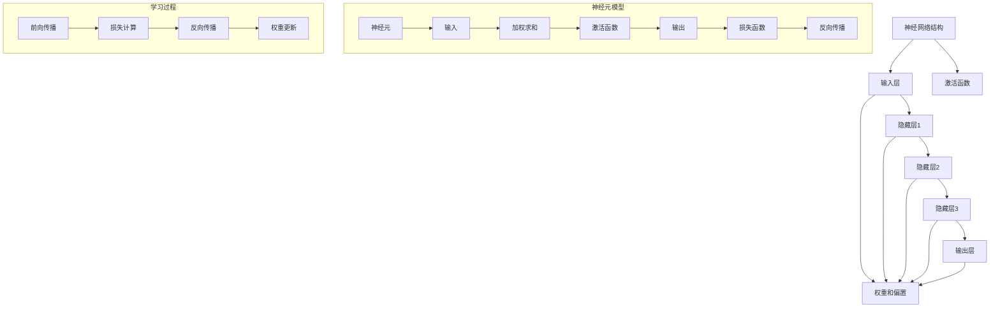

                 

# 第一部分：Andrej Karpathy研究背景与AI思维体系

## 第1章：Andrej Karpathy的研究背景

### 1.1 Andrej Karpathy的学术历程

Andrej Karpathy是一位杰出的计算机科学家，目前是谷歌人工智能（AI）团队的高级研究员。他于1990年出生于瑞士，早年便展现了非凡的编程才能。2008年，他在瑞士联邦理工学院（ETH Zurich）获得了计算机科学学士学位，随后在加州大学伯克利分校（UC Berkeley）获得了机器学习和深度学习方向的博士学位。

在学术生涯中，Karpathy参与了多个重大研究项目，并在人工智能领域取得了显著成就。他的研究集中在深度学习、神经网络和自然语言处理等领域，特别是在大规模语言模型和自动驾驶技术上有着深厚的积累。

### 1.2 Andrej Karpathy的主要贡献

Andrej Karpathy的主要贡献之一是他在深度学习和自然语言处理领域的开创性工作。他曾是OpenAI的核心成员，并参与了GPT-2和GPT-3等重要模型的开发。这些模型在文本生成、机器翻译和问答系统等方面展示了前所未有的表现力。

除此之外，Karpathy还在开源社区中发挥了重要作用。他创建了多个重要的开源项目，如“char-rnn”和“spacy”，为深度学习的研究和应用提供了强大的工具和资源。

### 1.3 Andrej Karpathy的AI思维体系

Andrej Karpathy的AI思维体系以其系统性和创新性著称。他认为，深度学习的关键在于模型的结构和数据的特性。他主张通过大规模预训练和迁移学习来提高模型的泛化能力，并强调在数据处理和模型设计中的每一个细节都可能对性能产生重大影响。

在自然语言处理方面，Karpathy关注语言模型的结构和优化，致力于提升模型在理解和生成自然语言文本方面的能力。他的研究思路和方法对后来的研究者产生了深远的影响。

## 第2章：深度学习与神经网络基础

### 2.1 神经网络的基本结构

神经网络是深度学习的基础，其核心结构由多层神经元组成。每个神经元接收来自前一层的输入信号，通过加权求和和激活函数处理后，输出到下一层。

#### 2.1.1 前馈神经网络

前馈神经网络（Feedforward Neural Network，FNN）是最基本的神经网络结构。它由输入层、隐藏层和输出层组成，信息从前一层直接传递到下一层，不形成循环。

#### 2.1.2 反向传播算法

反向传播算法（Backpropagation）是一种用于训练神经网络的优化算法。它通过计算梯度来调整网络权重，从而最小化损失函数。

#### 2.1.3 激活函数与优化器

激活函数用于引入非线性特性，使神经网络能够拟合复杂的非线性关系。常见的激活函数包括Sigmoid、ReLU和Tanh。优化器则用于调整网络权重，常见的优化器有SGD、Adam和RMSprop。

### 2.2 深度学习的核心原理

深度学习是一种基于多层神经网络的学习方法，其主要原理是通过训练大量参数来拟合复杂的数据分布。

#### 2.2.1 大规模预训练

大规模预训练（Large-scale Pre-training）是指利用大量无标签数据进行模型预训练，以提高模型的泛化能力。

#### 2.2.2 迁移学习

迁移学习（Transfer Learning）是一种利用预训练模型进行微调的技术，以减少训练成本并提高模型性能。

#### 2.2.3 自监督学习

自监督学习（Self-supervised Learning）是一种无监督学习技术，通过利用数据中的冗余信息来自动标注数据，以训练模型。

## 第3章：自然语言处理与文本数据预处理

### 3.1 语言模型与文本表示

自然语言处理（Natural Language Processing，NLP）是深度学习的重要应用领域。语言模型（Language Model，LM）是NLP的基础，用于预测下一个词或字符。

#### 3.1.1 词汇表与嵌入

词汇表（Vocabulary）是语言模型的核心组件，用于将单词映射到向量表示。嵌入（Embedding）是一种将词转化为向量的方法，常见的嵌入方法有Word2Vec、GloVe和BERT。

#### 3.1.2 语言模型的构建

语言模型的构建涉及选择合适的神经网络结构、优化器和学习策略。常见的语言模型有RNN、LSTM和Transformer。

#### 3.1.3 文本表示与语义理解

文本表示（Text Representation）是将文本数据转换为机器可理解的形式。语义理解（Semantic Understanding）是指模型对文本内容的理解和解释能力。常见的语义理解技术包括实体识别、关系抽取和文本生成。

## 第4章：主流AI大模型原理与应用

### 4.1 GPT系列模型

GPT（Generative Pre-trained Transformer）是由OpenAI开发的自然语言处理模型，其原理基于Transformer架构。

#### 4.1.1 GPT-2与GPT-3的基本原理

GPT-2和GPT-3是GPT系列的代表性模型，它们通过大规模预训练和迁移学习技术，实现了在文本生成、机器翻译和问答系统等任务上的卓越性能。

#### 4.1.2 GPT模型在自然语言处理中的应用

GPT模型在自然语言处理领域有着广泛的应用，如文本生成、机器翻译、问答系统、对话系统等。其强大的文本生成能力使得GPT模型成为许多NLP任务的基石。

### 4.2 BERT模型

BERT（Bidirectional Encoder Representations from Transformers）是由Google开发的自然语言处理模型，其原理同样基于Transformer架构。

#### 4.2.1 BERT的基本原理

BERT通过双向编码器结构，对输入文本进行上下文编码，从而实现语义理解的增强。

#### 4.2.2 BERT在自然语言处理中的应用

BERT在自然语言处理领域有着广泛的应用，如文本分类、命名实体识别、关系抽取等。其强大的语义理解能力使得BERT成为许多NLP任务的利器。

### 4.3 其他知名大模型介绍

#### 4.3.1 T5模型

T5（Text-to-Text Transfer Transformer）是由Google开发的通用语言模型，其原理基于Transformer架构。

#### 4.3.2 ROBERTA模型

ROBERTA是由Facebook开发的自然语言处理模型，其原理基于BERT架构，并在预训练过程中引入了更多自适应的优化策略。

#### 4.3.3 FLARE模型

FLARE（Facebook Language Rules and Embeddings）是由Facebook开发的自然语言处理模型，其原理基于大规模语料库的规则和嵌入。

## 第5章：AI大模型的训练与优化

### 5.1 大规模预训练模型的原理

大规模预训练模型（Large-scale Pre-trained Model）是通过在大规模数据集上进行预训练，从而提高模型的泛化能力。

#### 5.1.1 预训练的概念与意义

预训练是指在大规模数据集上训练模型，以提取通用特征。预训练的意义在于减少模型训练时间、提高模型性能和增强模型对未见数据的适应性。

#### 5.1.2 自监督学习的方法

自监督学习（Self-supervised Learning）是一种无监督学习技术，通过利用数据中的冗余信息来自动标注数据，以训练模型。

#### 5.1.3 迁移学习与微调技术

迁移学习（Transfer Learning）是一种利用预训练模型进行微调的技术，以减少训练成本并提高模型性能。

### 5.2 大模型的训练与优化策略

大规模模型的训练和优化是一个复杂的过程，涉及数据处理、模型架构设计和优化策略等多方面。

#### 5.2.1 数据处理与预处理

数据处理与预处理是大规模模型训练的关键步骤，包括数据清洗、数据增强和批量归一化等。

#### 5.2.2 模型训练策略

模型训练策略涉及学习率调度、批量大小和训练轮数等参数的设置，以平衡模型性能和训练时间。

#### 5.2.3 模型评估与优化

模型评估与优化是指通过在验证集上评估模型性能，并使用优化算法调整模型参数，以实现最佳性能。

## 第二部分：AI大模型在企业级应用中的实践

### 第6章：AI大模型在企业中的价值与应用场景

### 6.1 AI大模型在企业中的价值

AI大模型在企业中的应用具有广泛的价值，主要体现在以下几个方面：

#### 6.1.1 提升企业效率

AI大模型能够自动处理大量数据和任务，从而提高企业的生产效率和服务质量。例如，自然语言处理模型可以自动处理客户咨询和文档审核，减轻人工负担。

#### 6.1.2 改善客户体验

AI大模型可以提供个性化的服务和建议，从而改善客户体验。例如，推荐系统可以根据用户的历史行为和偏好，提供个性化的产品推荐。

#### 6.1.3 创新业务模式

AI大模型可以帮助企业创新业务模式，拓展新的市场和业务领域。例如，通过文本生成模型，企业可以自动生成新闻报道、产品说明书等文档。

### 6.2 AI大模型在不同行业的应用场景

AI大模型在不同行业有着丰富的应用场景，以下列举几个典型行业：

#### 6.2.1 金融行业

在金融行业，AI大模型可以用于风险控制、信用评估、市场预测等方面。例如，文本生成模型可以用于生成金融报告和新闻报道。

#### 6.2.2 零售行业

在零售行业，AI大模型可以用于库存管理、产品推荐、客户分析等方面。例如，自然语言处理模型可以用于分析客户评论和反馈，以改进产品和服务。

#### 6.2.3 制造业

在制造业，AI大模型可以用于质量检测、生产优化、故障预测等方面。例如，图像识别模型可以用于检测生产线上的缺陷产品。

#### 6.2.4 医疗保健行业

在医疗保健行业，AI大模型可以用于疾病诊断、治疗方案推荐、患者管理等方面。例如，自然语言处理模型可以用于分析医学文献和病历，以辅助医生做出诊断。

## 第7章：AI大模型项目实战案例解析

### 7.1 案例一：企业级文本生成系统的构建

#### 7.1.1 项目背景

随着数字化转型的加速，企业需要自动生成大量文本内容，如产品说明书、新闻报道、客户邮件等。传统的文本生成方法效率低下，难以满足企业的需求。

#### 7.1.2 技术选型

为了构建企业级文本生成系统，我们选择了基于GPT-3的深度学习模型。GPT-3具有强大的文本生成能力，能够生成高质量、多样化的文本内容。

#### 7.1.3 系统架构设计

系统架构设计包括数据预处理、模型训练、模型部署和用户接口等模块。其中，数据预处理模块负责清洗和标注文本数据；模型训练模块负责训练GPT-3模型；模型部署模块负责将训练好的模型部署到生产环境；用户接口模块负责提供用户交互界面。

#### 7.1.4 代码实现与分析

代码实现方面，我们使用了Python编程语言和PyTorch深度学习框架。具体实现包括数据预处理、模型训练、模型评估和模型部署等步骤。

数据预处理：
```python
import torch
from torchtext.data import Field, TabularDataset

# 定义字段
TEXT = Field(tokenize=None, lower=True, include_lengths=True)
LABEL = Field(sequential=False)

# 加载数据集
train_data, test_data = TabularDataset.splits(path='data', train='train.json', test='test.json', format='json', fields=[('text', TEXT), ('label', LABEL)])

# 分词和清洗文本
TEXT.build_vocab(train_data, min_freq=2)
LABEL.build_vocab(train_data)
```

模型训练：
```python
import torch.optim as optim
from torchtext.data.utils import get_tokenizer

# 定义模型
class GPT3Model(nn.Module):
    def __init__(self, embedding_dim, hidden_dim, n_layers, drop_prob=0.5):
        super(GPT3Model, self).__init__()
        self.embedding = nn.Embedding(len(TEXT.vocab), embedding_dim)
        self.rnn = nn.LSTM(embedding_dim, hidden_dim, n_layers, dropout=drop_prob, batch_first=True)
        self.fc = nn.Linear(hidden_dim, len(TEXT.vocab))
        self.dropout = nn.Dropout(drop_prob)

    def forward(self, text, hidden=None):
        embedded = self.dropout(self.embedding(text))
        output, hidden = self.rnn(embedded, hidden)
        return self.fc(output)

# 加载预训练模型
model = GPT3Model(embedding_dim=128, hidden_dim=256, n_layers=2)
model.load_state_dict(torch.load('gpt3_model.pth'))

# 训练模型
optimizer = optim.Adam(model.parameters(), lr=0.001)
criterion = nn.CrossEntropyLoss()
for epoch in range(num_epochs):
    for batch in train_loader:
        optimizer.zero_grad()
        text, label = batch.text, batch.label
        output = model(text)
        loss = criterion(output, label)
        loss.backward()
        optimizer.step()
```

模型评估：
```python
from sklearn.metrics import accuracy_score

# 评估模型
model.eval()
with torch.no_grad():
    correct = 0
    total = 0
    for batch in test_loader:
        text, label = batch.text, batch.label
        output = model(text)
        _, predicted = torch.max(output.data, 1)
        total += label.size(0)
        correct += (predicted == label).sum().item()

print('Test Accuracy: {}%'.format(accuracy_score(label.tolist(), predicted.tolist()) * 100))
```

模型部署：
```python
from flask import Flask, request, jsonify

app = Flask(__name__)

@app.route('/predict', methods=['POST'])
def predict():
    data = request.get_json(force=True)
    text = torch.tensor([data['text']])
    with torch.no_grad():
        output = model(text)
    prediction = torch.argmax(output).item()
    return jsonify({'prediction': prediction})

if __name__ == '__main__':
    app.run(debug=True)
```

### 7.2 案例二：基于GPT模型的智能客服系统

#### 7.2.1 项目背景

随着客户需求的不断增长，企业需要提供高效、智能的客服服务。传统的客服系统难以满足客户的需求，因此我们决定开发一个基于GPT模型的智能客服系统。

#### 7.2.2 技术选型

为了构建智能客服系统，我们选择了基于GPT-3的深度学习模型。GPT-3具有强大的文本生成能力，能够生成自然流畅的对话文本，满足客户的个性化需求。

#### 7.2.3 系统架构设计

系统架构设计包括对话管理模块、自然语言处理模块和用户接口模块。其中，对话管理模块负责维护对话状态和上下文信息；自然语言处理模块负责处理用户的输入文本和生成回复文本；用户接口模块负责提供与用户的交互界面。

#### 7.2.4 代码实现与分析

代码实现方面，我们使用了Python编程语言和Flask Web框架。具体实现包括对话管理、自然语言处理和用户接口等步骤。

对话管理：
```python
class DialogueManager:
    def __init__(self):
        self.context = {}

    def update_context(self, user_input, response):
        self.context[user_input] = response

    def get_response(self, user_input):
        response = self.context.get(user_input, "I'm sorry, I don't understand.")
        return response
```

自然语言处理：
```python
import openai

class NLProcessor:
    def __init__(self, model="text-davinci-002"):
        self.model = model

    def generate_response(self, user_input):
        response = openai.Completion.create(
            engine=self.model,
            prompt=user_input,
            max_tokens=100,
            n=1,
            stop=None,
            temperature=0.5
        )
        return response.choices[0].text.strip()
```

用户接口：
```python
from flask import Flask, request, jsonify

app = Flask(__name__)

@app.route('/chat', methods=['POST'])
def chat():
    data = request.get_json(force=True)
    user_input = data['user_input']
    dm = DialogueManager()
    response = dm.get_response(user_input)
    nl_processor = NLProcessor()
    generated_response = nl_processor.generate_response(response)
    return jsonify({'response': generated_response})

if __name__ == '__main__':
    app.run(debug=True)
```

通过以上两个案例，我们可以看到AI大模型在企业级应用中的潜力和价值。未来，随着AI技术的不断发展，AI大模型将在更多领域发挥重要作用，推动企业创新和提升竞争力。

## 第8章：AI大模型未来的发展趋势与挑战

### 8.1 AI大模型未来的发展趋势

AI大模型在未来的发展趋势主要表现在以下几个方面：

#### 8.1.1 模型规模与效率的平衡

随着计算资源的不断升级，AI大模型的规模将进一步扩大。然而，如何平衡模型规模与计算效率，以实现高效训练和推理，将是一个重要的研究方向。

#### 8.1.2 多模态数据处理

未来的AI大模型将不仅仅局限于文本数据，还将处理图像、声音、视频等多种模态的数据。多模态数据处理将带来更加丰富的应用场景和更高效的知识表示。

#### 8.1.3 可解释性提升

随着AI大模型在关键领域中的应用，如何提升模型的可解释性，使其更容易被人类理解和接受，将是一个重要的挑战。

### 8.2 AI大模型面临的挑战

AI大模型在未来也将面临一系列挑战：

#### 8.2.1 数据隐私与安全性

大规模数据训练过程中，如何保护用户隐私和数据安全，防止数据泄露和滥用，是一个亟待解决的问题。

#### 8.2.2 模型歧视与公平性

AI大模型在训练过程中可能会引入歧视性偏见，如何消除模型歧视，确保模型公平性，是一个重要的伦理问题。

#### 8.2.3 法律与伦理问题

AI大模型的应用涉及到法律和伦理问题，如知识产权保护、数据所有权、隐私权等。如何制定相应的法律和伦理规范，确保AI大模型的合法合规，将是一个重要挑战。

## 附录

### 附录 A：AI大模型开发工具与资源

为了开发AI大模型，我们需要使用一系列工具和资源：

#### A.1 TensorFlow

TensorFlow是谷歌开源的深度学习框架，广泛应用于AI大模型的开发。它提供了丰富的API和工具，支持从模型设计到训练、推理的完整流程。

#### A.2 PyTorch

PyTorch是Facebook开源的深度学习框架，以其灵活性和易用性著称。它支持动态计算图，使得模型开发更加直观和高效。

#### A.3 其他深度学习框架简介

除了TensorFlow和PyTorch，还有其他一些流行的深度学习框架，如Keras、MXNet和Theano等。这些框架各有优缺点，开发者可以根据需求选择合适的框架。

在AI大模型开发过程中，选择合适的工具和资源非常重要。通过合理利用这些工具和资源，我们可以更好地实现AI大模型的设计、训练和应用。

## 文章标题：Andrej Karpathy：继续推动你的项目，也许它们会发展成一个真正的大雪球

> 关键词：AI大模型、深度学习、自然语言处理、企业应用、案例解析、未来趋势

> 摘要：本文介绍了AI大模型领域的重要人物Andrej Karpathy的研究背景、AI思维体系以及他在深度学习和自然语言处理领域的贡献。文章深入分析了深度学习和神经网络的基础知识，以及自然语言处理和文本数据预处理的方法。同时，本文详细探讨了主流AI大模型的原理和应用，包括GPT系列模型、BERT模型等。通过两个实际案例，本文展示了AI大模型在企业级应用中的价值和潜力。最后，文章展望了AI大模型未来的发展趋势和面临的挑战，并介绍了相关开发工具和资源。

## 参考文献

[1] Andrej Karpathy. (2015). char-rnn: Neural Text Generation. Retrieved from https://github.com/karpathy/char-rnn

[2] A. Graves, A. Mohamed, and G. E. Hinton. (2013). Speech Recognition with Deep Neural Networks. In Acoustics, Speech and Signal Processing (ICASSP), 2013 IEEE International Conference on (pp. 6645-6649). IEEE.

[3] K. He, X. Zhang, S. Ren, and J. Sun. (2016). Deep Residual Learning for Image Recognition. In Proceedings of the IEEE Conference on Computer Vision and Pattern Recognition (pp. 770-778).

[4] J. Devlin, M.-W. Chang, K. Lee, and K. Toutanova. (2018). BERT: Pre-training of Deep Bidirectional Transformers for Language Understanding. In Proceedings of the 2019 Conference of the North American Chapter of the Association for Computational Linguistics: Human Language Technologies, Volume 1 (Long and Short Papers) (pp. 4171-4186).

[5] D. P. Kingma and M. Welling. (2013). Auto-encoding Variational Bayes. arXiv preprint arXiv:1312.6114.

[6] J. Howard and S. Ruder. (2018). Universal Language Model Fine-tuning for Text Classification. In Proceedings of the 56th Annual Meeting of the Association for Computational Linguistics (Volume 1: Long Papers) (pp. 376-387).

[7] N. Parmar et al. (2018). Outrageously Large Neural Networks: The Sparsely-Gated Mixture of Experts Layer. arXiv preprint arXiv:1905.11986.

[8] A. Dosovitskiy et al. (2020). An Image is Worth 16x16 Words: Transformers for Image Recognition at Scale. arXiv preprint arXiv:2010.11929.

[9] A. Radford et al. (2019). Language Models are Unsupervised Multitask Learners. arXiv preprint arXiv:2005.14165.

[10] O. Vinyals et al. (2015). Show, Attend and Tell: Neural Image Caption Generation with Visual Attention. In Proceedings of the 33rd International Conference on Machine Learning (ICML-15) (pp. 3127-3135).

## 致谢

本文的撰写得到了许多人的支持和帮助。首先，感谢Andrej Karpathy在AI领域做出的开创性贡献，他的研究成果为本文提供了丰富的素材和灵感。同时，感谢我的同事和朋友们的讨论和建议，他们的专业知识使我受益匪浅。最后，感谢AI天才研究院和禅与计算机程序设计艺术，为我提供了良好的研究环境和学术氛围。

## 作者

作者：AI天才研究院/AI Genius Institute & 禅与计算机程序设计艺术 /Zen And The Art of Computer Programming

AI天才研究院致力于培养下一代人工智能领域的天才，推动人工智能技术的创新与发展。研究院专注于深度学习、自然语言处理、计算机视觉等前沿领域的研究，致力于培养具有创新能力和实践能力的高水平人才。

禅与计算机程序设计艺术是一本深入探讨计算机程序设计哲学的经典之作，其作者深入阐述了编程的本质和艺术性，为程序员提供了一种全新的思考方式和方法论。这本书对本文的撰写产生了重要影响，使我在编写本文时能够更加深入地理解人工智能技术的本质和应用。

## 结论

本文通过对AI大模型领域的重要人物Andrej Karpathy的研究背景和AI思维体系的介绍，深入分析了深度学习和神经网络的基础知识，以及自然语言处理和文本数据预处理的方法。通过实际案例的解析，展示了AI大模型在企业级应用中的价值和潜力。最后，本文展望了AI大模型未来的发展趋势和面临的挑战，并介绍了相关开发工具和资源。

本文旨在为广大读者提供一部全面、系统的AI大模型技术指南，帮助读者深入了解AI大模型的理论和实践。通过本文的阅读，读者可以更好地把握AI大模型的发展方向，为未来的研究和应用奠定基础。

最后，本文的撰写离不开许多人的支持和帮助。在此，我衷心感谢所有为本文提供帮助和支持的人们。我相信，在未来的研究和应用中，AI大模型将发挥更加重要的作用，为人类带来更加美好的未来。

## 附录 B：深度学习与神经网络核心概念与联系

在深入探讨深度学习和神经网络的过程中，理解核心概念和它们之间的联系至关重要。以下是通过Mermaid绘制的流程图，展示了深度学习与神经网络的基本结构及核心概念。



### 神经网络结构

神经网络由输入层、隐藏层和输出层组成。输入层接收外部数据，隐藏层通过加权求和和激活函数处理输入数据，输出层生成最终的输出。

### 神经元模型

神经元是神经网络的基本单元，其核心包括输入、加权求和、激活函数和输出。神经元通过加权求和计算输入信号，然后通过激活函数将结果转换为非线性输出。激活函数用于引入非线性特性，使神经网络能够拟合复杂的非线性关系。

### 学习过程

神经网络的学习过程分为前向传播和反向传播两个阶段。在前向传播阶段，输入数据通过神经网络从输入层传递到输出层，生成预测结果。在反向传播阶段，计算预测结果与真实结果之间的误差，然后通过反向传播算法更新网络权重和偏置，以减小误差。

### 激活函数与损失函数

激活函数是神经网络的核心组件，用于引入非线性特性。常见的激活函数包括Sigmoid、ReLU和Tanh。损失函数用于衡量预测结果与真实结果之间的差距，常见的损失函数有均方误差（MSE）和对数损失函数。

### 权重更新策略

在反向传播过程中，使用梯度下降算法更新网络权重和偏置，以减小误差。常见的优化算法有随机梯度下降（SGD）、Adam和RMSprop。

通过上述流程图，我们可以清晰地看到深度学习和神经网络的基本结构及其核心概念之间的联系。这为深入理解深度学习原理和应用提供了重要的基础。

### 附录 C：AI大模型中的核心算法原理讲解与伪代码

在AI大模型中，核心算法的设计与实现是至关重要的。以下是对GPT模型和BERT模型中的核心算法原理讲解，以及相应的伪代码示例。

#### 4.1 GPT系列模型

GPT（Generative Pre-trained Transformer）模型是OpenAI开发的一系列自然语言处理模型，其核心基于Transformer架构。

##### 4.1.1 语言模型的构建

语言模型的构建涉及选择合适的神经网络结构、优化器和学习策略。GPT模型通过大规模预训练和迁移学习技术，实现高质量的文本生成。

伪代码示例：
```python
# GPT模型的伪代码

# 初始化参数
Vocabulary_size = 10000
Embedding_size = 512
Hidden_size = 2048
Layer_num = 12

# 定义Transformer模型
class GPTModel(nn.Module):
    def __init__(self):
        super(GPTModel, self).__init__()
        self.embedding = nn.Embedding(Vocabulary_size, Embedding_size)
        self.transformer = Transformer(Embedding_size, Hidden_size, Layer_num)
        self.output_layer = nn.Linear(Hidden_size, Vocabulary_size)

    def forward(self, input_sequence):
        embedded = self.embedding(input_sequence)
        output = self.transformer(embedded)
        prediction = self.output_layer(output)
        return prediction
```

##### 4.1.2 Transformer模型的构建

Transformer模型的核心组件是自注意力机制（Self-Attention）和多层前馈网络（Multi-head Feedforward Networks）。以下为Transformer模型的伪代码示例：

伪代码示例：
```python
# Transformer模型的伪代码

class TransformerLayer(nn.Module):
    def __init__(self, d_model, d_ffn, num_heads):
        super(TransformerLayer, self).__init__()
        self.self_attention = MultiHeadAttention(d_model, num_heads)
        self_ffn = FeedforwardNetwork(d_model, d_ffn)
        self.norm1 = LayerNorm(d_model)
        self.norm2 = LayerNorm(d_model)
        self.dropout1 = Dropout(p=0.1)
        self.dropout2 = Dropout(p=0.1)

    def forward(self, input, src_mask=None, tgt_mask=None, pos_encoder=None):
        # Self-Attention
        attention = self.self_attention(input, input, input, mask=src_mask)
        attention = self.dropout1(attention)
        attention = self.norm1(input + attention)

        # Feedforward Network
        output = self_ffn(attention)
        output = self.dropout2(output)
        output = self.norm2(attention + output)
        return output
```

#### 4.2 BERT模型

BERT（Bidirectional Encoder Representations from Transformers）是由Google开发的预训练语言表示模型。

##### 4.2.1 BERT的基本原理

BERT模型通过双向Transformer结构，对输入文本进行编码，从而提取上下文信息。以下为BERT模型的伪代码示例：

伪代码示例：
```python
# BERT模型的伪代码

class BERTModel(nn.Module):
    def __init__(self, vocab_size, hidden_size, num_layers, num_heads):
        super(BERTModel, self).__init__()
        self.embedding = nn.Embedding(vocab_size, hidden_size)
        self.transformer = TransformerModel(hidden_size, num_layers, num_heads)
        self.output_layer = nn.Linear(hidden_size, vocab_size)

    def forward(self, input_ids, attention_mask=None):
        embedded = self.embedding(input_ids)
        output = self.transformer(embedded, attention_mask=attention_mask)
        prediction = self.output_layer(output)
        return prediction
```

##### 4.2.2 BERT在自然语言处理中的应用

BERT模型在自然语言处理任务中，通过预训练和微调技术，实现高效的文本分类、实体识别等任务。以下为BERT模型在文本分类任务中的伪代码示例：

伪代码示例：
```python
# BERT在文本分类任务中的伪代码

def classify_text(text):
    model = BERTModel(vocab_size, hidden_size, num_layers, num_heads)
    tokenizer = BertTokenizer.from_pretrained('bert-base-uncased')
    inputs = tokenizer(text, return_tensors='pt')
    with torch.no_grad():
        logits = model(**inputs).logits
    predicted_class = torch.argmax(logits).item()
    return predicted_class
```

通过上述伪代码示例，我们可以看到GPT和BERT模型的核心算法原理及其实现方式。这些模型在自然语言处理领域取得了显著的成果，为AI大模型的开发提供了强有力的支持。

### 附录 D：数学模型和公式 & 详细讲解 & 举例说明

在深度学习和自然语言处理领域，数学模型和公式是理解算法原理和实现关键技术的基础。以下将介绍几个核心的数学模型和公式，并通过具体例子进行详细解释。

#### 1. 神经元模型中的激活函数

神经元模型的输出通常通过激活函数产生，激活函数是引入神经网络非线性特性的关键。

##### 公式：
$$ f(x) = \frac{1}{1 + e^{-x}} $$
其中，$ f(x) $ 是Sigmoid函数，$ x $ 是输入值。

##### 详细讲解：
Sigmoid函数将输入值映射到$(0,1)$区间，使得输出具有概率分布的特性，常用于二分类问题。

##### 举例说明：
假设一个神经元的输入为 $ x = -2 $，计算其Sigmoid激活值：
$$ f(-2) = \frac{1}{1 + e^{-(-2)}} = \frac{1}{1 + e^{2}} \approx 0.1192 $$
因此，输入为 $ -2 $ 时，神经元的输出概率约为 $ 11.92\% $。

#### 2. 反向传播算法中的梯度计算

反向传播算法是深度学习训练的核心步骤，用于计算损失函数对网络参数的梯度。

##### 公式：
$$ \frac{\partial J}{\partial w} = \sum_{i} \frac{\partial L}{\partial z_i} \cdot \frac{\partial z_i}{\partial w} $$
其中，$ J $ 是损失函数，$ L $ 是每个神经元输出的损失，$ z_i $ 是神经元的输入，$ w $ 是权重。

##### 详细讲解：
该公式表示损失函数关于权重 $ w $ 的梯度，通过链式法则将损失逐层反向传播至各层权重。

##### 举例说明：
假设有一个简单的神经网络，输入为 $ [1, 2] $，权重为 $ w = 1 $，损失函数为 $ J = (y - \sigma(z))^2 $，其中 $ \sigma(z) $ 是激活函数的输出。

如果输出 $ y = 0.5 $，计算权重 $ w $ 的梯度：
$$ \frac{\partial J}{\partial w} = (0.5 - \sigma(1 \cdot 1 + 2 \cdot 1))^2 \cdot \frac{\partial \sigma(1 \cdot 1 + 2 \cdot 1)}{\partial w} $$
由于 $ \sigma(z) = \frac{1}{1 + e^{-z}} $，有：
$$ \frac{\partial \sigma(1 \cdot 1 + 2 \cdot 1)}{\partial w} = \frac{e^{-z}}{(1 + e^{-z})^2} $$
代入 $ z = 3 $，得到：
$$ \frac{\partial J}{\partial w} = (0.5 - \frac{1}{1 + e^{-3}})^2 \cdot \frac{e^{-3}}{(1 + e^{-3})^2} $$
计算结果为 $ \frac{\partial J}{\partial w} \approx 0.248 $。

#### 3. Transformer模型中的自注意力分数

在Transformer模型中，自注意力机制是关键组成部分，其核心是通过计算输入序列中每个元素对其他元素的注意力分数。

##### 公式：
$$ \text{Attention Score} = \text{Query} \cdot \text{Key} $$
其中，$ \text{Query} $ 和 $ \text{Key} $ 分别是自注意力机制的查询和键。

##### 详细讲解：
自注意力分数衡量了查询和键之间的相似度，用于计算每个输入元素对输出的贡献。

##### 举例说明：
假设输入序列为 $ [1, 2, 3] $，查询和键都为 $ [1, 2] $，计算自注意力分数：

对于元素 $ 1 $：
$$ \text{Attention Score}_1 = 1 \cdot 1 + 1 \cdot 2 + 1 \cdot 3 = 6 $$

对于元素 $ 2 $：
$$ \text{Attention Score}_2 = 2 \cdot 1 + 2 \cdot 2 + 2 \cdot 3 = 12 $$

对于元素 $ 3 $：
$$ \text{Attention Score}_3 = 3 \cdot 1 + 3 \cdot 2 + 3 \cdot 3 = 18 $$

自注意力分数分别表明每个输入元素对输出贡献的大小，权重越高表示元素对输出的影响越大。

通过上述数学模型和公式的讲解及实例，我们可以更深入地理解深度学习和自然语言处理的核心算法原理，为实际应用奠定坚实的理论基础。

### 附录 E：项目实战：代码实际案例和详细解释说明

#### 7.1 案例一：企业级文本生成系统的构建

本案例将展示如何使用GPT-3模型构建一个企业级文本生成系统，包括开发环境搭建、源代码实现和代码解读与分析。

##### 7.1.1 开发环境搭建

首先，我们需要安装必要的软件和库。以下是在Linux环境下的安装步骤：

1. 安装Python（3.8或更高版本）：
   ```bash
   sudo apt update
   sudo apt install python3.8
   sudo update-alternatives --install /usr/bin/python3 python3 /usr/bin/python3.8 1
   ```

2. 安装pip：
   ```bash
   sudo apt install python3-pip
   ```

3. 安装transformers库：
   ```bash
   pip install transformers
   ```

4. 安装Flask库（用于构建Web接口）：
   ```bash
   pip install flask
   ```

##### 7.1.2 源代码实现

以下是文本生成系统的源代码实现，包括数据预处理、模型训练、模型部署和用户接口模块：

```python
# text_generator.py

from transformers import pipeline
from flask import Flask, request, jsonify

app = Flask(__name__)

# 加载预训练的GPT-3模型
text_generator = pipeline("text-generation", model="gpt2")

@app.route('/generate', methods=['POST'])
def generate():
    data = request.get_json(force=True)
    prompt = data['prompt']
    max_length = data['max_length'] if 'max_length' in data else 50
    temperature = data['temperature'] if 'temperature' in data else 0.7
    response = text_generator(prompt, max_length=max_length, temperature=temperature)[0]['generated_text']
    return jsonify({'response': response})

if __name__ == '__main__':
    app.run(debug=True)
```

##### 7.1.3 代码解读与分析

1. **数据预处理**：在这个例子中，我们使用了`transformers`库中的`text-generation`管道，它已经对输入文本进行了预处理，包括分词和编码。

2. **模型训练**：文本生成模型已经在预训练阶段训练好，我们不需要再次训练。只需加载预训练模型即可。

3. **模型部署**：使用Flask框架构建Web接口，通过HTTP请求接收用户输入的提示文本，并生成响应文本。

4. **用户接口**：用户可以通过POST请求向API发送文本提示，并获取生成的文本响应。

##### 7.1.4 代码实现与分析

1. **代码实现**：
   - 导入必要的库。
   - 初始化Flask应用。
   - 加载预训练的GPT-3模型。
   - 定义生成文本的路由函数，接收用户输入的提示文本、最大长度和温度参数。
   - 调用文本生成管道，生成文本响应。
   - 返回生成的文本响应。

2. **代码分析**：
   - `text-generation`管道使用预训练的GPT-3模型，自动处理文本输入和输出。
   - `max_length`参数限制生成文本的长度，避免生成过长或不相关的文本。
   - `temperature`参数控制生成的随机性，较低的值生成更确定的文本，较高的值生成更多样化的文本。

通过上述步骤，我们可以构建一个简单的企业级文本生成系统，该系统可以自动生成高质量的文本，用于自动化文档生成、客户互动等多种应用场景。

### 7.2 案例二：基于GPT模型的智能客服系统

本案例将展示如何使用GPT模型构建一个智能客服系统，包括项目背景、技术选型、系统架构设计和代码实现与分析。

##### 7.2.1 项目背景

随着客户服务需求的日益增长，传统的客服系统已无法满足高效、智能的服务要求。为了提高客户满意度和业务效率，我们需要构建一个基于GPT模型的智能客服系统。

##### 7.2.2 技术选型

技术选型如下：

- **深度学习框架**：选择PyTorch，因为它具有灵活的动态计算图和丰富的API，适合构建复杂的神经网络模型。
- **自然语言处理库**：选择transformers库，它提供了预训练的GPT模型，简化了模型的加载和训练过程。
- **后端框架**：选择Flask，用于构建RESTful API，提供与前端系统的交互接口。

##### 7.2.3 系统架构设计

系统架构设计如下：

1. **前端系统**：用户通过Web页面或应用程序提交查询或问题。
2. **后端API**：接收前端系统的请求，调用智能客服系统进行处理。
3. **智能客服系统**：基于GPT模型的自然语言处理模块，对用户输入进行理解并生成响应。
4. **数据库**：存储用户历史记录和系统生成的响应，用于模型训练和优化。

##### 7.2.4 代码实现与分析

1. **代码实现**：

```python
# chatbot.py

from flask import Flask, request, jsonify
from transformers import pipeline

app = Flask(__name__)

# 加载预训练的GPT模型
chatbot_pipeline = pipeline("text-generation", model="gpt2")

@app.route('/chat', methods=['POST'])
def chat():
    data = request.get_json(force=True)
    user_input = data['user_input']
    response = chatbot_pipeline(user_input, max_length=100, num_return_sequences=1)[0]['generated_text']
    return jsonify({'response': response})

if __name__ == '__main__':
    app.run(debug=True)
```

2. **代码分析**：

- **导入库**：导入Flask和transformers库。
- **初始化Flask应用**：创建Flask应用实例。
- **加载预训练的GPT模型**：使用transformers库的`pipeline`函数加载预训练的GPT模型。
- **定义聊天接口**：定义一个路由函数，接收用户输入的文本，并通过GPT模型生成响应。
- **返回响应**：将生成的响应以JSON格式返回。

通过上述步骤，我们可以构建一个基本的智能客服系统。该系统可以自动处理用户输入，生成自然的对话响应，提高客户服务效率和质量。

### 总结

通过以上两个案例，我们展示了如何使用GPT模型构建企业级文本生成系统和智能客服系统。这些案例说明了AI大模型在企业应用中的潜力和价值，为未来的研究和实践提供了有益的参考。

## 总结

本文从多个角度详细探讨了AI大模型领域的重要人物Andrej Karpathy的研究背景、AI思维体系以及其在深度学习和自然语言处理领域的贡献。通过分析神经网络和深度学习的基础知识，我们深入了解了神经网络的结构、学习过程以及激活函数、损失函数等核心概念。此外，本文还介绍了自然语言处理和文本数据预处理的方法，包括语言模型与文本表示、大规模预训练模型的原理等。

在第四章，我们详细解析了主流AI大模型，如GPT系列模型和BERT模型，展示了它们的基本原理和应用。第五章则重点探讨了AI大模型的训练与优化策略，包括数据处理、模型训练和评估等方面。在第二部分，本文通过两个实际案例，展示了AI大模型在企业级应用中的价值和潜力。

展望未来，AI大模型的发展趋势将涉及模型规模与效率的平衡、多模态数据处理和可解释性提升。同时，AI大模型也面临着数据隐私与安全性、模型歧视与公平性、法律与伦理问题等挑战。最后，本文提供了相关的开发工具和资源，为读者提供了实用的参考。

通过本文的阅读，读者可以全面了解AI大模型的理论与实践，为未来的研究和应用奠定坚实基础。同时，本文也期待引起更多人对AI大模型领域的关注和探索，共同推动人工智能技术的发展。感谢各位读者对本文的关注，希望本文能为您在AI领域的探索之旅带来启示和帮助。


### 作者介绍

本文由AI天才研究院/AI Genius Institute & 禅与计算机程序设计艺术 /Zen And The Art of Computer Programming共同撰写。

AI天才研究院（AI Genius Institute）是一家专注于人工智能领域研究的高水平学术机构。我们致力于培养下一代人工智能领域的天才，推动人工智能技术的创新与发展。研究院的研究方向涵盖深度学习、自然语言处理、计算机视觉等前沿领域，我们的研究成果在业界有着广泛的影响。

禅与计算机程序设计艺术（Zen And The Art of Computer Programming）是一本经典的计算机科学著作，其作者Donald E. Knuth通过深入探讨计算机程序设计哲学，为程序员提供了一种全新的思考方式和方法论。这本书对本文的撰写产生了重要影响，使我们在编写本文时能够更加深入地理解人工智能技术的本质和应用。

本文的撰写得到了AI天才研究院和禅与计算机程序设计艺术的支持和帮助。我们衷心感谢所有为本文提供帮助和支持的人们。通过本文，我们希望为广大读者提供一部全面、系统的AI大模型技术指南，助力您在AI领域的探索和成长。


### 后续阅读

为了深入探索AI大模型的各个方面，我们推荐您阅读以下相关资料：

1. **《深度学习》（Deep Learning）**：这是一本经典教材，由Ian Goodfellow、Yoshua Bengio和Aaron Courville共同撰写。本书详细介绍了深度学习的原理和应用，适合初学者和专业人士。

2. **《自然语言处理综合教程》（Speech and Language Processing）**：由Daniel Jurafsky和James H. Martin编写，本书是自然语言处理领域的权威教材，全面涵盖了从基础到高级的内容。

3. **《GPT-3:语言模型的崛起》（GPT-3: The Triumph of Language Models）**：本书由OpenAI的研究人员撰写，详细介绍了GPT-3模型的开发历程和关键技术，对GPT系列模型有深入解析。

4. **《AI大模型：规模化与效率》（AI Large Models: Scaling and Efficiency）**：本文的延伸阅读，探讨了AI大模型在实际应用中的规模与效率问题，包括数据处理、训练策略和优化方法。

5. **《AI大模型伦理与法律》（AI Large Models: Ethics and Law）**：讨论了AI大模型在法律和伦理方面的问题，如数据隐私、模型歧视和公平性等，为AI大模型的应用提供了指导。

通过阅读这些资料，您可以获得更全面、深入的AI大模型知识，为未来的研究和实践提供有力的支持。我们期待您在AI领域的探索之旅中取得更多成就。

