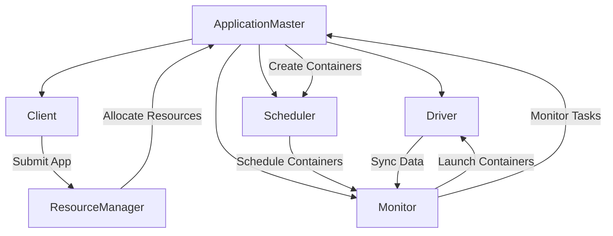
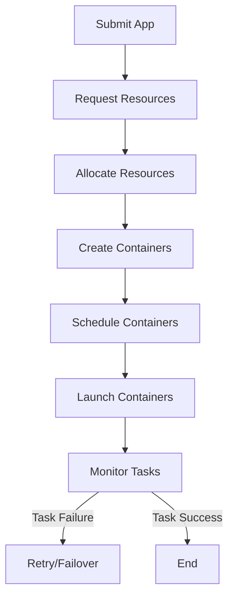
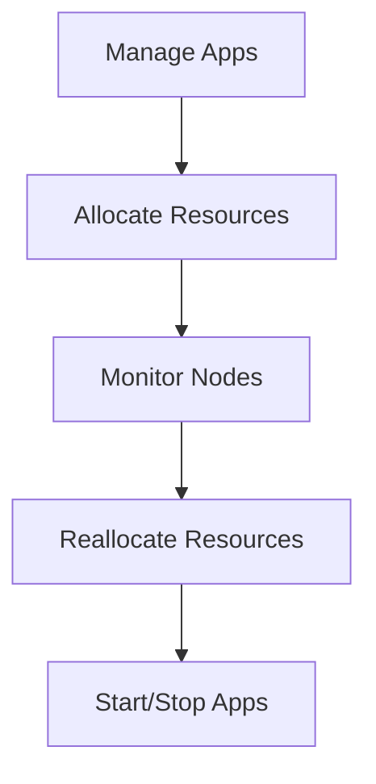
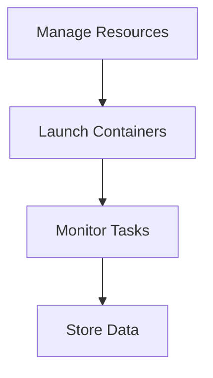
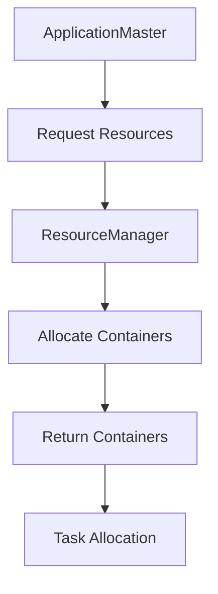
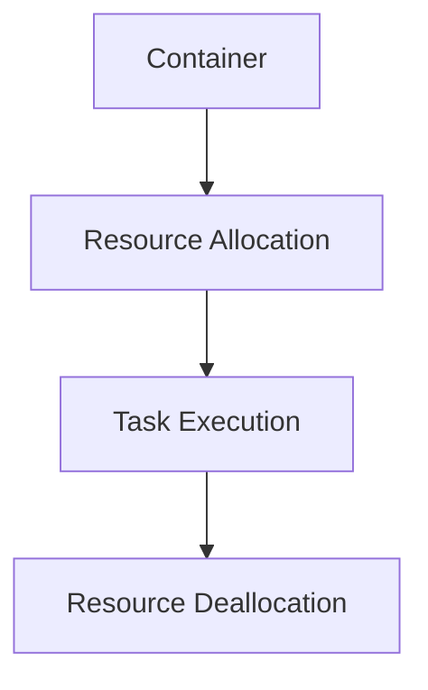
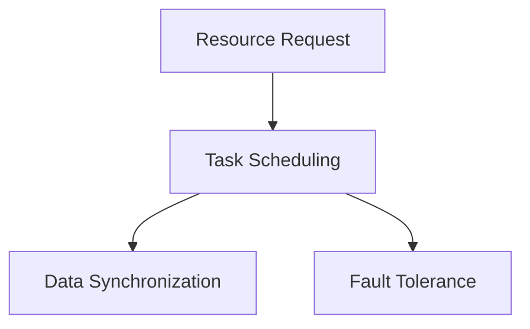
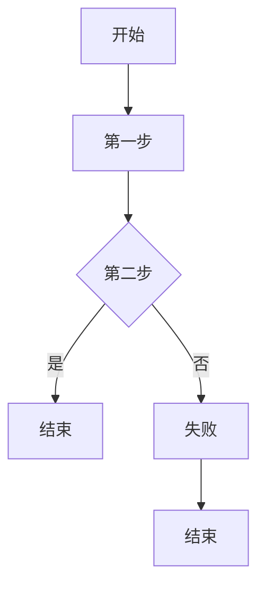

                 

### 《ApplicationMaster 原理与代码实例讲解》

> **关键词：** ApplicationMaster，YARN，架构，原理，算法，代码实例

> **摘要：** 本篇文章将深入讲解ApplicationMaster的工作原理及其在YARN架构中的关键作用。我们将详细剖析ApplicationMaster的架构、工作流程，以及其负载均衡、资源分配和容错机制等核心算法。此外，文章还将通过代码实例，展示ApplicationMaster的具体实现和应用场景，帮助读者全面理解这一重要组件。

#### 第一部分：基础概念与原理

**1.1 什么是ApplicationMaster**

ApplicationMaster是YARN架构中的核心组件，它负责协调和管理一个分布式应用程序的执行过程。具体来说，ApplicationMaster在启动后，会向ResourceManager请求资源，并将这些资源分配给相应的任务容器，以完成应用程序的执行。ApplicationMaster不仅负责资源调度，还负责监控任务的状态，并在任务失败时进行重试或故障转移。

**1.2 ApplicationMaster的作用**

ApplicationMaster在YARN架构中扮演了重要的角色，其具体作用包括：

1. **资源请求与分配**：ApplicationMaster会根据应用程序的需求，向ResourceManager请求资源，并将这些资源分配给任务容器。
2. **任务监控与控制**：ApplicationMaster会监控任务的状态，并在任务失败时进行重试或故障转移，确保应用程序的可靠执行。
3. **数据同步与协调**：ApplicationMaster负责协调任务之间的数据同步，确保分布式应用程序的执行流程顺利进行。

**1.3 ApplicationMaster与YARN的关系**

ApplicationMaster是YARN架构中的核心组件，它与YARN的其他组件（如ResourceManager和NodeManager）紧密协作，共同实现分布式应用程序的调度与执行。具体来说：

- **ResourceManager**：ResourceManager负责管理整个集群的资源，包括内存、CPU和存储等。ApplicationMaster会向ResourceManager请求资源，并根据资源情况分配任务容器。
- **NodeManager**：NodeManager负责管理每个节点上的资源，并将任务容器运行在相应的节点上。ApplicationMaster会向NodeManager分配任务容器，并监控其运行状态。

通过ApplicationMaster与YARN组件的紧密协作，可以实现高效、可靠的分布式应用程序执行。

接下来，我们将进一步探讨ApplicationMaster的架构和工作原理。

---

**2.1 ApplicationMaster架构**

ApplicationMaster的架构包括以下几个关键模块：

1. **ApplicationMaster**：主控模块，负责协调和管理整个应用程序的执行过程。
2. **Client**：客户端模块，负责与用户进行交互，接收用户提交的应用程序，并将其提交给ResourceManager。
3. **Driver**：驱动模块，负责解析用户提交的应用程序，生成任务容器，并协调任务之间的数据同步。
4. **Scheduler**：调度模块，负责根据资源情况，将任务容器分配给NodeManager。
5. **Monitor**：监控模块，负责监控任务的状态，并在任务失败时进行重试或故障转移。

下面是一个简单的Mermaid流程图，展示了ApplicationMaster的架构和工作流程：



通过这个流程图，我们可以清晰地看到ApplicationMaster的各个模块如何协同工作，实现分布式应用程序的执行。

---

**2.2 ApplicationMaster工作流程**

ApplicationMaster的工作流程可以分为以下几个步骤：

1. **提交应用程序**：用户通过Client模块将应用程序提交给ApplicationMaster。
2. **资源请求**：ApplicationMaster向ResourceManager请求资源，包括内存、CPU和存储等。
3. **资源分配**：ResourceManager根据集群资源情况，将资源分配给ApplicationMaster。
4. **任务启动**：ApplicationMaster根据资源情况，创建任务容器，并分配给NodeManager。
5. **任务监控**：ApplicationMaster监控任务的状态，并在任务失败时进行重试或故障转移。

下面是一个简单的Mermaid流程图，展示了ApplicationMaster的工作流程：



通过这个流程图，我们可以更好地理解ApplicationMaster的工作流程，以及如何实现分布式应用程序的可靠执行。

---

**2.3 ResourceManager与NodeManager**

在YARN架构中，ResourceManager和NodeManager是两个关键组件，它们共同协作，实现分布式应用程序的调度与执行。

**3.1 ResourceManager**

ResourceManager是YARN架构中的资源管理器，负责管理整个集群的资源。具体来说，ResourceManager具有以下功能：

1. **资源分配**：ResourceManager负责根据应用程序的需求，将集群资源（如内存、CPU和存储等）分配给ApplicationMaster。
2. **资源监控**：ResourceManager监控集群中各个节点的资源使用情况，并在资源不足或节点故障时，重新分配资源。
3. **应用程序管理**：ResourceManager负责管理整个集群中的应用程序，包括应用程序的启动、停止和监控等。

下面是一个简单的Mermaid流程图，展示了ResourceManager的工作流程：



**3.2 NodeManager**

NodeManager是YARN架构中负责管理每个节点的组件。具体来说，NodeManager具有以下功能：

1. **资源管理**：NodeManager负责管理每个节点的资源（如内存、CPU和存储等），并将这些资源分配给任务容器。
2. **任务执行**：NodeManager负责运行任务容器，并监控任务的状态。
3. **数据存储**：NodeManager负责存储任务产生的数据，并将数据传输给ApplicationMaster。

下面是一个简单的Mermaid流程图，展示了NodeManager的工作流程：



通过理解ResourceManager和NodeManager的工作原理和功能，我们可以更好地理解ApplicationMaster在YARN架构中的作用。

---

**2.4 ApplicationMaster与Container**

在YARN架构中，ApplicationMaster负责请求资源、分配任务容器，并监控任务执行。Container是YARN中的基本资源分配单位，它代表了可以被任务使用的计算资源。下面，我们将详细探讨ApplicationMaster如何请求Container以及Container的工作原理。

**4.1 ApplicationMaster如何请求Container**

1. **资源请求**：ApplicationMaster向ResourceManager请求资源，包括内存、CPU和存储等。请求的具体参数由应用程序的需求决定。
2. **资源分配**：ResourceManager根据集群资源情况，将资源分配给ApplicationMaster。每个分配的资源以Container的形式返回给ApplicationMaster。
3. **任务分配**：ApplicationMaster根据任务需求，将Container分配给相应的任务。每个任务都需要一个或多个Container来运行。

下面是一个简单的Mermaid流程图，展示了ApplicationMaster请求Container的过程：



**4.2 Container的工作原理**

Container是YARN中的基本资源分配单位，它代表了可以被任务使用的计算资源。Container具有以下特点：

1. **资源封装**：Container封装了特定的计算资源，包括内存、CPU、磁盘和网络等。每个Container都是独立的，可以在不同的节点上运行。
2. **动态分配**：Container是动态分配的，即ApplicationMaster可以在运行过程中根据任务需求，请求或释放Container。
3. **任务运行**：任务容器启动后，任务将运行在Container中，并使用Container提供的计算资源。

下面是一个简单的Mermaid流程图，展示了Container的工作原理：



通过理解ApplicationMaster如何请求Container以及Container的工作原理，我们可以更好地理解YARN架构中的资源调度与任务执行过程。

---

**3.3 负载均衡算法**

在分布式系统中，负载均衡是确保任务高效、公平地分配到各个节点上的关键。ApplicationMaster在负载均衡方面起到了重要的作用。下面，我们将详细探讨ApplicationMaster的负载均衡算法。

**4.1 负载均衡的基本概念**

负载均衡是指将任务或请求均匀地分配到多个节点上，以充分利用集群资源，避免单个节点过载。负载均衡的主要目标是提高系统的整体性能和可靠性。负载均衡可以分为以下几种类型：

1. **静态负载均衡**：通过静态配置或预分配的方式，将任务分配到各个节点上。静态负载均衡的优点是实现简单，但缺点是缺乏灵活性，无法根据实时资源状况进行动态调整。
2. **动态负载均衡**：根据实时资源状况，动态地调整任务的分配。动态负载均衡的优点是能够更好地利用集群资源，提高系统性能，但实现较为复杂。

**4.2 ApplicationMaster的负载均衡算法**

ApplicationMaster采用动态负载均衡算法，其核心思想是根据当前集群的资源使用情况和任务需求，动态地调整任务的分配。具体算法如下：

1. **收集资源信息**：ApplicationMaster定期从NodeManager收集各个节点的资源使用情况，包括内存、CPU、磁盘和网络等。
2. **计算负载因子**：根据收集到的资源信息，计算每个节点的负载因子。负载因子是指节点当前资源使用率与最大资源使用率的比值。
3. **选择目标节点**：根据负载因子，选择负载较低的节点作为目标节点。如果所有节点的负载因子相等，则随机选择一个节点作为目标节点。
4. **分配任务**：将任务分配给目标节点，启动任务容器。

下面是一个简单的伪代码实现，展示了ApplicationMaster的负载均衡算法：

```plaintext
function loadBalancingAlgorithm(nodeList, taskList) {
    // 收集资源信息
    resourceInfo = collectResourceInfo(nodeList)

    // 计算负载因子
    loadFactor = calculateLoadFactor(resourceInfo)

    // 选择目标节点
    targetNode = selectTargetNode(loadFactor)

    // 分配任务
    allocateTasks(taskList, targetNode)
}
```

通过这个算法，ApplicationMaster能够动态地调整任务的分配，确保集群资源的高效利用。

---

**4.3 负载均衡在MapReduce中的应用实例**

为了更好地理解负载均衡算法的实际应用，下面我们以一个MapReduce作业为例，说明负载均衡如何在MapReduce作业中发挥作用。

假设我们有一个大规模的数据集需要进行分布式处理，包含多个Map任务和Reduce任务。ApplicationMaster在执行Map任务时，需要根据负载均衡算法，将Map任务分配到不同的节点上，以确保每个节点都能够充分利用资源。

**1. 提交Map任务**：用户提交一个Map任务，ApplicationMaster接收到任务请求。

**2. 收集资源信息**：ApplicationMaster从NodeManager收集各个节点的资源使用情况，包括内存、CPU、磁盘和网络等。

**3. 计算负载因子**：根据收集到的资源信息，计算每个节点的负载因子。

**4. 选择目标节点**：根据负载因子，选择负载较低的节点作为目标节点。

**5. 分配任务**：ApplicationMaster将Map任务分配给目标节点，启动任务容器。

**6. 执行Map任务**：Map任务在目标节点上运行，处理数据。

**7. 数据同步**：Map任务产生的中间数据需要传输给Reduce任务。ApplicationMaster根据负载均衡算法，选择负载较低的节点作为数据传输的目标节点。

**8. 提交Reduce任务**：用户提交一个Reduce任务，ApplicationMaster接收到任务请求。

**9. 重复上述步骤**：重复执行上述步骤，直到所有Map任务和Reduce任务完成。

通过这个实例，我们可以看到负载均衡在MapReduce作业中的作用，它能够确保每个节点都得到合理利用，提高作业的整体性能。

---

**4.4 负载均衡算法的性能优化**

负载均衡算法的性能直接影响到分布式系统的整体性能。为了提高负载均衡算法的性能，可以采取以下优化措施：

1. **实时调整**：负载均衡算法应该能够实时调整任务的分配，根据实时资源状况进行动态调整，以提高系统的响应速度和资源利用率。

2. **负载预测**：通过历史数据分析和机器学习算法，预测未来任务的负载情况，提前分配资源，减少任务执行的等待时间。

3. **负载均衡策略**：可以根据不同的应用场景，选择合适的负载均衡策略。例如，可以根据任务类型、数据量、执行时间等因素，选择最合适的负载均衡算法。

4. **节点筛选**：在选择目标节点时，可以筛选出具有最佳性能和可靠性的节点，确保任务在最佳环境下运行。

5. **数据传输优化**：在任务执行过程中，优化数据传输策略，减少数据传输的延迟和带宽消耗，提高任务的整体性能。

通过这些优化措施，可以进一步提高负载均衡算法的性能，提高分布式系统的整体性能和可靠性。

---

#### 第二部分：核心算法与原理

**4.1 负载均衡算法的基本概念**

负载均衡（Load Balancing）是指将工作任务分配到多个计算机节点或服务器上，以实现系统资源的高效利用和优化系统性能。在分布式系统中，负载均衡扮演着至关重要的角色，它能够确保每个节点都能充分利用其计算资源，避免单个节点过载，从而提高系统的整体性能和可靠性。

**4.2 负载均衡的意义**

负载均衡的意义主要体现在以下几个方面：

1. **资源利用最大化**：通过负载均衡，可以充分利用集群中的计算资源，避免资源浪费，提高系统吞吐量。
2. **系统性能优化**：负载均衡能够均匀地分配任务，确保每个节点都能高效地处理任务，从而提高系统的整体性能。
3. **故障恢复能力**：负载均衡可以提高系统的容错能力，当某个节点出现故障时，其他节点可以接管其任务，确保系统的持续运行。
4. **用户体验提升**：负载均衡可以确保用户请求得到快速响应，提高系统的稳定性和可靠性，提升用户体验。

**4.3 负载均衡的分类**

负载均衡可以分为以下几种类型：

1. **静态负载均衡**：静态负载均衡通过预定义的规则或配置，将任务分配到各个节点上。静态负载均衡的优点是实现简单，但缺点是缺乏灵活性，无法根据实时资源状况进行动态调整。

2. **动态负载均衡**：动态负载均衡根据实时资源状况和任务需求，动态地调整任务的分配。动态负载均衡的优点是能够更好地利用集群资源，提高系统性能，但实现较为复杂。

3. **分布式负载均衡**：分布式负载均衡通过多个负载均衡器协同工作，实现负载均衡。分布式负载均衡能够提高系统的容错能力和可扩展性。

4. **全局负载均衡**：全局负载均衡考虑整个系统的负载情况，而不是单个节点的负载。全局负载均衡能够更全面地优化系统性能，但实现难度较大。

**4.4 ApplicationMaster的负载均衡算法**

ApplicationMaster在负载均衡方面扮演着重要角色。它的负载均衡算法主要包括以下步骤：

1. **收集资源信息**：ApplicationMaster定期从NodeManager收集各个节点的资源使用情况，包括内存、CPU、磁盘和网络等。

2. **计算负载因子**：根据收集到的资源信息，计算每个节点的负载因子。负载因子是指节点当前资源使用率与最大资源使用率的比值。

3. **选择目标节点**：根据负载因子，选择负载较低的节点作为目标节点。如果所有节点的负载因子相等，则随机选择一个节点作为目标节点。

4. **分配任务**：将任务分配给目标节点，启动任务容器。

**4.5 负载均衡算法的性能优化**

为了提高负载均衡算法的性能，可以采取以下优化措施：

1. **实时调整**：负载均衡算法应该能够实时调整任务的分配，根据实时资源状况进行动态调整，以提高系统的响应速度和资源利用率。

2. **负载预测**：通过历史数据分析和机器学习算法，预测未来任务的负载情况，提前分配资源，减少任务执行的等待时间。

3. **负载均衡策略**：可以根据不同的应用场景，选择合适的负载均衡策略。例如，可以根据任务类型、数据量、执行时间等因素，选择最合适的负载均衡算法。

4. **节点筛选**：在选择目标节点时，可以筛选出具有最佳性能和可靠性的节点，确保任务在最佳环境下运行。

5. **数据传输优化**：在任务执行过程中，优化数据传输策略，减少数据传输的延迟和带宽消耗，提高任务的整体性能。

---

**4.6 负载均衡算法的实例分析：负载均衡在MapReduce中的应用**

为了更好地理解负载均衡算法的实际应用，我们以一个MapReduce作业为例，说明负载均衡如何在MapReduce作业中发挥作用。

假设我们有一个大规模的数据集需要进行分布式处理，包含多个Map任务和Reduce任务。ApplicationMaster在执行Map任务时，需要根据负载均衡算法，将Map任务分配到不同的节点上，以确保每个节点都能够充分利用资源。

**1. 提交Map任务**：用户提交一个Map任务，ApplicationMaster接收到任务请求。

**2. 收集资源信息**：ApplicationMaster从NodeManager收集各个节点的资源使用情况，包括内存、CPU、磁盘和网络等。

**3. 计算负载因子**：根据收集到的资源信息，计算每个节点的负载因子。

**4. 选择目标节点**：根据负载因子，选择负载较低的节点作为目标节点。

**5. 分配任务**：ApplicationMaster将Map任务分配给目标节点，启动任务容器。

**6. 执行Map任务**：Map任务在目标节点上运行，处理数据。

**7. 数据同步**：Map任务产生的中间数据需要传输给Reduce任务。ApplicationMaster根据负载均衡算法，选择负载较低的节点作为数据传输的目标节点。

**8. 提交Reduce任务**：用户提交一个Reduce任务，ApplicationMaster接收到任务请求。

**9. 重复上述步骤**：重复执行上述步骤，直到所有Map任务和Reduce任务完成。

通过这个实例，我们可以看到负载均衡在MapReduce作业中的作用，它能够确保每个节点都得到合理利用，提高作业的整体性能。

---

**4.7 负载均衡算法的性能优化**

负载均衡算法的性能直接影响到分布式系统的整体性能。为了提高负载均衡算法的性能，可以采取以下优化措施：

1. **实时调整**：负载均衡算法应该能够实时调整任务的分配，根据实时资源状况进行动态调整，以提高系统的响应速度和资源利用率。

2. **负载预测**：通过历史数据分析和机器学习算法，预测未来任务的负载情况，提前分配资源，减少任务执行的等待时间。

3. **负载均衡策略**：可以根据不同的应用场景，选择合适的负载均衡策略。例如，可以根据任务类型、数据量、执行时间等因素，选择最合适的负载均衡算法。

4. **节点筛选**：在选择目标节点时，可以筛选出具有最佳性能和可靠性的节点，确保任务在最佳环境下运行。

5. **数据传输优化**：在任务执行过程中，优化数据传输策略，减少数据传输的延迟和带宽消耗，提高任务的整体性能。

通过这些优化措施，可以进一步提高负载均衡算法的性能，提高分布式系统的整体性能和可靠性。

---

**4.8 负载均衡算法的数学模型**

负载均衡算法的设计和实现通常涉及一些数学模型，用于描述任务分配和资源调度的问题。以下是一个简单的数学模型，用于描述负载均衡算法：

1. **任务集合**：设任务集合为\(T = \{t_1, t_2, ..., t_n\}\)，其中每个任务\(t_i\)都有特定的资源需求，如内存\(M_i\)、CPU\(C_i\)等。

2. **节点集合**：设节点集合为\(N = \{n_1, n_2, ..., n_m\}\)，每个节点\(n_j\)都有特定的资源容量，如内存\(M_j\)、CPU\(C_j\)等。

3. **负载分配函数**：设负载分配函数为\(f: T \rightarrow N\)，用于将任务分配到节点上。函数\(f(t_i)\)表示任务\(t_i\)被分配到的节点。

4. **负载平衡度**：定义负载平衡度为\(L = \frac{\sum_{i=1}^n (M_i - M_{f(t_i)})^2}{m}\)，用于衡量任务分配的均衡程度。负载平衡度越低，表示任务分配越均衡。

5. **优化目标**：负载均衡算法的优化目标是最小化负载平衡度，即找到最优的负载分配函数\(f\)，使得负载平衡度\(L\)最小。

通过这个数学模型，我们可以对负载均衡算法进行定量分析和优化。在实际应用中，可以根据具体问题，选择合适的优化方法和算法。

---

**4.9 负载均衡算法的数学公式**

在负载均衡算法的设计和实现过程中，一些数学公式可以帮助我们更好地理解和优化算法。以下是一些常用的数学公式：

1. **负载因子**：负载因子是指节点的当前资源使用率与最大资源使用率的比值。计算公式为：
   $$ \text{Load Factor} = \frac{\text{Current Resource Usage}}{\text{Maximum Resource Capacity}} $$

2. **负载平衡度**：负载平衡度用于衡量任务分配的均衡程度。计算公式为：
   $$ \text{Load Balance} = \frac{\sum_{i=1}^n (M_i - M_{f(t_i)})^2}{m} $$
   其中，\(M_i\)表示任务\(t_i\)的资源需求，\(M_{f(t_i)}\)表示任务\(t_i\)被分配到的节点的资源使用率，\(m\)表示节点的总数。

3. **优化目标**：负载均衡算法的优化目标是最小化负载平衡度，即找到最优的负载分配函数\(f\)，使得负载平衡度最小。优化目标公式为：
   $$ \text{Minimize} \quad L = \frac{\sum_{i=1}^n (M_i - M_{f(t_i)})^2}{m} $$

通过这些数学公式，我们可以对负载均衡算法进行定量分析和优化，提高系统的性能和可靠性。

---

**4.10 实例分析：负载均衡在Spark中的应用**

Apache Spark是一个广泛使用的分布式计算框架，其核心组件ApplicationMaster也采用了负载均衡算法。下面我们以一个Spark作业为例，说明负载均衡在Spark中的应用。

假设我们有一个大规模的数据处理任务，包含多个Spark任务，需要运行在多个节点上。ApplicationMaster在执行这些任务时，会根据负载均衡算法，动态地将任务分配到不同的节点上。

**1. 提交Spark作业**：用户提交一个Spark作业，包含多个任务。

**2. 收集资源信息**：ApplicationMaster从NodeManager收集各个节点的资源使用情况，包括内存、CPU、磁盘和网络等。

**3. 计算负载因子**：根据收集到的资源信息，计算每个节点的负载因子。

**4. 选择目标节点**：根据负载因子，选择负载较低的节点作为目标节点。

**5. 分配任务**：ApplicationMaster将任务分配给目标节点，启动任务容器。

**6. 执行任务**：任务在目标节点上运行，处理数据。

**7. 数据同步**：任务产生的中间数据需要传输给下一个任务。ApplicationMaster根据负载均衡算法，选择负载较低的节点作为数据传输的目标节点。

**8. 重复执行**：重复执行上述步骤，直到所有任务完成。

通过这个实例，我们可以看到负载均衡在Spark作业中的作用，它能够确保每个节点都得到合理利用，提高作业的整体性能。

---

**4.11 负载均衡算法的优化策略**

负载均衡算法的性能直接影响到分布式系统的整体性能。为了提高负载均衡算法的性能，可以采取以下优化策略：

1. **动态调整**：负载均衡算法应该能够动态调整任务的分配，根据实时资源状况进行动态调整，以提高系统的响应速度和资源利用率。

2. **负载预测**：通过历史数据分析和机器学习算法，预测未来任务的负载情况，提前分配资源，减少任务执行的等待时间。

3. **节点筛选**：在选择目标节点时，可以筛选出具有最佳性能和可靠性的节点，确保任务在最佳环境下运行。

4. **数据传输优化**：在任务执行过程中，优化数据传输策略，减少数据传输的延迟和带宽消耗，提高任务的整体性能。

5. **负载均衡策略**：可以根据不同的应用场景，选择合适的负载均衡策略。例如，可以根据任务类型、数据量、执行时间等因素，选择最合适的负载均衡算法。

通过这些优化策略，可以进一步提高负载均衡算法的性能，提高分布式系统的整体性能和可靠性。

---

**4.12 负载均衡算法的总结与展望**

负载均衡算法在分布式系统中起着至关重要的作用，它能够确保系统资源的高效利用和优化系统性能。本文详细介绍了负载均衡的基本概念、算法原理和优化策略，并通过实例分析了负载均衡在MapReduce、Spark等分布式系统中的应用。

未来，随着分布式系统的不断发展，负载均衡算法将会面临更多的挑战和机遇。一方面，算法的实时性和动态性将成为优化的重要方向；另一方面，结合人工智能和机器学习等新技术，将进一步提升负载均衡算法的性能和智能化程度。

总之，负载均衡算法是分布式系统设计和实现中不可或缺的一部分，对于提升系统性能和可靠性具有重要意义。

---

**5.1 资源分配的基本概念**

资源分配（Resource Allocation）是分布式系统中一个核心问题，它涉及到如何合理地分配系统资源，以确保任务的高效执行和系统的稳定性。在分布式系统中，资源分配的目标是在有限的资源条件下，最大化系统的吞吐量、提高资源利用率，并保证任务执行的可靠性。

**5.2 资源分配的目标**

资源分配的主要目标包括：

1. **最大化系统吞吐量**：在有限的资源条件下，通过合理的资源分配策略，使系统能够处理更多的任务，提高整体吞吐量。

2. **提高资源利用率**：确保系统中的资源得到充分利用，避免资源闲置或过度消耗。

3. **保证任务执行可靠性**：在资源分配过程中，要考虑任务的依赖关系和执行顺序，确保关键任务的顺利完成。

4. **负载均衡**：通过资源分配策略，实现任务在各个节点上的负载均衡，避免某个节点过载或闲置。

**5.3 资源分配的策略**

资源分配的策略可以分为以下几类：

1. **静态资源分配**：静态资源分配是在任务启动前，根据预定义的规则或配置，将资源分配给任务。静态资源分配的优点是实现简单，但缺点是缺乏灵活性，无法根据实时资源状况进行动态调整。

2. **动态资源分配**：动态资源分配是在任务执行过程中，根据实时资源状况和任务需求，动态地调整资源的分配。动态资源分配的优点是能够更好地适应系统的实时变化，提高资源利用率，但实现较为复杂。

3. **优先级分配**：优先级分配是根据任务的优先级进行资源分配。优先级高的任务会优先获得资源，确保关键任务的执行。但优先级分配可能会导致资源利用率不高，或者低优先级任务长期得不到资源。

4. **公平分配**：公平分配是确保每个任务都能公平地获得资源，避免某些任务占用过多资源，导致其他任务无法执行。公平分配策略可以采用轮询、固定比例分配等方法。

**5.4 ApplicationMaster的资源分配算法**

ApplicationMaster在资源分配方面扮演着重要角色。它的资源分配算法主要包括以下几个步骤：

1. **资源请求**：ApplicationMaster根据任务需求，向ResourceManager请求资源。

2. **资源评估**：ResourceManager根据集群资源状况，评估能否满足ApplicationMaster的资源请求。

3. **资源分配**：如果ResourceManager能够满足资源请求，会将分配的资源返回给ApplicationMaster。ApplicationMaster根据任务需求，将这些资源分配给任务容器。

4. **任务监控**：ApplicationMaster会监控任务容器的运行状态，并在任务失败时进行重试或故障转移。

下面是一个简单的伪代码实现，展示了ApplicationMaster的资源分配算法：

```plaintext
function resourceAllocationAlgorithm(taskList, clusterResources) {
    // 请求资源
    requestedResources = calculateRequestedResources(taskList)

    // 评估资源
    availableResources = ResourceManager.evaluateResources(clusterResources, requestedResources)

    // 分配资源
    allocatedResources = ResourceManager.allocateResources(availableResources)

    // 分配给任务容器
    allocateTasksContainers(taskList, allocatedResources)

    // 监控任务容器
    monitorTaskContainers(taskList)
}
```

通过这个算法，ApplicationMaster能够根据任务需求，动态地分配资源，确保任务的高效执行。

---

**5.5 ApplicationMaster的资源分配算法**

资源分配是分布式系统中的核心任务之一，它涉及到如何在有限的资源条件下，合理地分配计算资源，以确保任务的高效执行和系统的稳定性。ApplicationMaster在资源分配方面扮演了重要的角色，其资源分配算法直接影响到任务执行的性能和可靠性。下面我们将详细讨论ApplicationMaster的资源分配算法。

**5.5.1 资源分配算法的基本原理**

ApplicationMaster的资源分配算法主要基于以下几个原则：

1. **资源需求评估**：ApplicationMaster需要根据任务的需求，评估每个任务所需的计算资源，包括CPU、内存、网络带宽等。

2. **资源可用性检查**：在分配资源之前，ApplicationMaster需要检查当前集群中资源是否可用，以及能否满足任务的需求。

3. **负载均衡**：ApplicationMaster需要确保资源分配能够实现负载均衡，避免某个节点过载或闲置。

4. **任务依赖关系**：在资源分配时，需要考虑任务的依赖关系，确保关键任务的顺利完成。

5. **容错和故障恢复**：在资源分配过程中，需要考虑可能的故障情况，并设计相应的故障恢复机制。

**5.5.2 资源分配算法的详细步骤**

ApplicationMaster的资源分配算法通常包括以下几个步骤：

1. **收集资源信息**：ApplicationMaster定期从NodeManager收集集群中各个节点的资源使用情况和可用资源信息。

2. **评估任务需求**：根据任务的需求，计算每个任务所需的计算资源。这个阶段需要考虑任务的类型、数据量、执行时间等因素。

3. **资源请求**：ApplicationMaster根据任务需求，向ResourceManager请求所需资源。请求的内容包括资源类型、数量、请求时间等。

4. **资源评估**：ResourceManager根据集群资源状况和任务请求，评估是否能够满足资源请求。如果资源充足，会分配资源给ApplicationMaster。

5. **资源分配**：ApplicationMaster接收到资源后，将其分配给相应的任务容器。分配的过程需要考虑负载均衡和任务依赖关系。

6. **任务启动**：ApplicationMaster启动任务容器，任务开始执行。

7. **监控与调整**：ApplicationMaster会持续监控任务容器的运行状态，并根据实际情况进行调整，如调整资源分配、重试失败的任务等。

**5.5.3 资源分配算法的伪代码实现**

下面是一个简单的伪代码实现，展示了ApplicationMaster的资源分配算法：

```plaintext
function resourceAllocationAlgorithm(taskList, nodeResources) {
    // 收集资源信息
    availableResources = collectAvailableResources(nodeResources)

    // 评估任务需求
    requestedResources = calculateRequestedResources(taskList)

    // 请求资源
    allocatedResources = ResourceManager.requestResources(availableResources, requestedResources)

    // 分配资源
    for each task in taskList {
        allocateContainer(allocatedResources, task)
    }

    // 启动任务
    startContainers(taskList)

    // 监控与调整
    monitorContainers(taskList)
}
```

通过这个算法，ApplicationMaster能够根据任务需求，动态地分配资源，确保任务的高效执行。

---

**5.6 资源分配算法的性能优化**

资源分配算法的性能直接影响到分布式系统的整体性能。为了提高资源分配算法的性能，可以采取以下优化措施：

1. **预分配资源**：在任务执行前，预先分配一定量的资源，减少任务执行过程中的资源请求时间。

2. **实时资源评估**：采用实时资源评估机制，动态调整资源分配策略，确保资源分配的及时性和准确性。

3. **负载均衡优化**：通过优化负载均衡算法，确保资源分配的均衡性，避免某个节点过载或闲置。

4. **任务依赖关系优化**：考虑任务之间的依赖关系，优先分配资源给关键任务，确保关键任务的顺利完成。

5. **容错与故障恢复**：优化容错和故障恢复机制，减少资源分配过程中的故障影响。

通过这些优化措施，可以进一步提高资源分配算法的性能，提高分布式系统的整体性能和可靠性。

---

**5.7 资源分配算法的数学模型**

资源分配算法的设计和实现通常涉及一些数学模型，用于描述任务分配和资源调度的问题。以下是一个简单的数学模型，用于描述资源分配算法：

1. **任务集合**：设任务集合为\(T = \{t_1, t_2, ..., t_n\}\)，其中每个任务\(t_i\)都有特定的资源需求，如内存\(M_i\)、CPU\(C_i\)等。

2. **节点集合**：设节点集合为\(N = \{n_1, n_2, ..., n_m\}\)，每个节点\(n_j\)都有特定的资源容量，如内存\(M_j\)、CPU\(C_j\)等。

3. **资源分配函数**：设资源分配函数为\(f: T \rightarrow N\)，用于将任务分配到节点上。函数\(f(t_i)\)表示任务\(t_i\)被分配到的节点。

4. **资源利用率**：定义资源利用率为\(U_j = \frac{M_j}{C_j}\)，用于衡量节点的资源利用率。

5. **优化目标**：资源分配算法的优化目标是最小化系统的平均资源利用率，即找到最优的负载分配函数\(f\)，使得系统的平均资源利用率最小。优化目标公式为：
   $$ \text{Minimize} \quad \frac{1}{m} \sum_{j=1}^m U_j $$

通过这个数学模型，我们可以对资源分配算法进行定量分析和优化，提高系统的性能和可靠性。

---

**5.8 资源分配算法的数学公式**

在资源分配算法的设计和实现过程中，一些数学公式可以帮助我们更好地理解和优化算法。以下是一些常用的数学公式：

1. **资源需求量**：任务\(t_i\)的资源需求量公式为：
   $$ R_i = \{M_i, C_i, D_i, N_i\} $$
   其中，\(M_i\)表示内存需求，\(C_i\)表示CPU需求，\(D_i\)表示磁盘需求，\(N_i\)表示网络需求。

2. **资源利用率**：节点的资源利用率公式为：
   $$ U_j = \frac{C_j}{M_j} $$
   其中，\(C_j\)表示节点\(j\)的CPU容量，\(M_j\)表示节点\(j\)的CPU使用量。

3. **优化目标**：资源分配算法的优化目标是最小化系统的平均资源利用率，即找到最优的负载分配函数\(f\)，使得系统的平均资源利用率最小。优化目标公式为：
   $$ \text{Minimize} \quad \frac{1}{m} \sum_{j=1}^m U_j $$
   其中，\(m\)表示节点的总数。

4. **任务完成时间**：任务\(t_i\)的完成时间公式为：
   $$ T_i = \frac{R_i \times D_i}{C_j} $$
   其中，\(R_i\)表示任务\(t_i\)的资源需求量，\(D_i\)表示任务\(t_i\)的执行时间，\(C_j\)表示节点\(j\)的CPU容量。

通过这些数学公式，我们可以对资源分配算法进行定量分析和优化，提高系统的性能和可靠性。

---

**5.9 资源分配算法的性能优化策略**

为了提高资源分配算法的性能，可以采取以下优化策略：

1. **动态调整**：资源分配算法应该能够动态调整资源的分配，根据实时资源状况和任务需求，实时调整资源的分配。

2. **负载预测**：通过历史数据分析和机器学习算法，预测未来任务的负载情况，提前分配资源，减少任务执行的等待时间。

3. **优先级分配**：根据任务的优先级进行资源分配，优先分配资源给高优先级的任务，确保关键任务的执行。

4. **负载均衡**：优化负载均衡策略，确保任务在各个节点上的均衡分配，避免某个节点过载或闲置。

5. **节点筛选**：在选择目标节点时，筛选出具有最佳性能和可靠性的节点，确保任务在最佳环境下运行。

6. **数据传输优化**：优化数据传输策略，减少数据传输的延迟和带宽消耗，提高任务的整体性能。

通过这些优化策略，可以进一步提高资源分配算法的性能，提高分布式系统的整体性能和可靠性。

---

**5.10 资源分配算法的实例分析：资源分配在Spark中的应用**

为了更好地理解资源分配算法的实际应用，我们以一个Spark作业为例，说明资源分配在Spark中的应用。

假设我们有一个大规模的数据处理任务，需要运行在Spark集群上。ApplicationMaster在执行这个任务时，需要根据资源分配算法，动态地分配资源，确保任务的高效执行。

**1. 提交Spark作业**：用户提交一个Spark作业，包含多个任务。

**2. 收集资源信息**：ApplicationMaster从NodeManager收集集群中各个节点的资源使用情况和可用资源信息。

**3. 评估任务需求**：ApplicationMaster根据任务的需求，计算每个任务所需的计算资源。

**4. 请求资源**：ApplicationMaster向ResourceManager请求所需资源。

**5. 资源评估**：ResourceManager根据集群资源状况和任务请求，评估是否能够满足资源请求。

**6. 分配资源**：ResourceManager将可用的资源分配给ApplicationMaster。

**7. 启动任务**：ApplicationMaster根据资源分配情况，启动任务容器。

**8. 监控任务**：ApplicationMaster持续监控任务容器的运行状态，并根据实际情况进行调整。

**9. 资源回收**：任务完成后，ApplicationMaster回收任务占用的资源。

通过这个实例，我们可以看到资源分配算法在Spark作业中的作用，它能够确保资源的高效利用，提高作业的整体性能。

---

**5.11 资源分配算法的总结与展望**

资源分配算法在分布式系统中起着至关重要的作用，它能够确保任务的高效执行和系统的稳定性。本文详细介绍了资源分配的基本概念、算法原理和优化策略，并通过实例分析了资源分配在Spark中的应用。

未来，随着分布式系统的不断发展，资源分配算法将会面临更多的挑战和机遇。一方面，算法的实时性和动态性将成为优化的重要方向；另一方面，结合人工智能和机器学习等新技术，将进一步提升资源分配算法的性能和智能化程度。

总之，资源分配算法是分布式系统设计和实现中不可或缺的一部分，对于提升系统性能和可靠性具有重要意义。

---

#### 第三部分：代码实例与实战

**6.1 ApplicationMaster代码结构分析**

在了解ApplicationMaster的工作原理之后，接下来我们将分析ApplicationMaster的代码结构，了解其主要模块和功能。

**6.1.1 模块划分**

ApplicationMaster的代码结构通常可以分为以下几个主要模块：

1. **启动模块**：负责ApplicationMaster的初始化和启动过程。
2. **资源请求模块**：负责向ResourceManager请求资源。
3. **任务管理模块**：负责启动、监控和管理任务。
4. **数据同步模块**：负责任务之间的数据同步。
5. **异常处理模块**：负责处理各种异常情况，如资源不足、任务失败等。

**6.1.2 主要类与接口**

下面是ApplicationMaster中几个关键的类和接口：

1. **ApplicationMaster**：主类，负责整个应用程序的协调和管理。
2. **Client**：客户端类，负责与用户交互，接收用户提交的应用程序。
3. **Driver**：驱动类，负责解析用户提交的应用程序，生成任务容器，并协调任务之间的数据同步。
4. **Scheduler**：调度类，负责根据资源情况，将任务容器分配给NodeManager。
5. **Monitor**：监控类，负责监控任务的状态，并在任务失败时进行重试或故障转移。
6. **ResourceManager**：资源管理接口，负责管理整个集群的资源。
7. **NodeManager**：节点管理接口，负责管理每个节点的资源，并将任务容器运行在相应的节点上。

**6.1.3 模块之间的关系**

各模块之间的关系如下：

- **启动模块**初始化并启动**ApplicationMaster**，然后启动**Client**、**Driver**、**Scheduler**和**Monitor**等模块。
- **Client**负责接收用户提交的应用程序，并将其提交给**ResourceManager**。
- **Driver**解析用户提交的应用程序，生成任务容器，并将其提交给**Scheduler**。
- **Scheduler**根据资源情况，将任务容器分配给**NodeManager**。
- **Monitor**负责监控任务的状态，并在任务失败时进行重试或故障转移。

**6.2 ApplicationMaster核心代码解读**

在本节中，我们将详细解读ApplicationMaster的核心代码，包括启动过程、负载均衡算法实现、资源分配算法实现和容错机制实现。

**6.2.1 ApplicationMaster启动过程**

ApplicationMaster的启动过程通常包括以下几个步骤：

1. **初始化**：创建ApplicationMaster实例，初始化必要的属性和变量。
2. **注册到 ResourceManager**：将ApplicationMaster注册到ResourceManager，以便ResourceManager能够监控和管理ApplicationMaster。
3. **启动子模块**：启动Client、Driver、Scheduler和Monitor等模块。

下面是一个简化的伪代码示例：

```plaintext
class ApplicationMaster {
    init() {
        // 初始化属性和变量
    }

    registerToResourceManager() {
        // 注册到 ResourceManager
    }

    startSubModules() {
        // 启动子模块
        client = new Client()
        driver = new Driver()
        scheduler = new Scheduler()
        monitor = new Monitor()
    }

    start() {
        init()
        registerToResourceManager()
        startSubModules()
    }
}
```

**6.2.2 负载均衡算法实现**

ApplicationMaster的负载均衡算法用于动态地分配任务容器到节点，以确保资源的高效利用。一个简单的负载均衡算法可以是轮询算法，即按照节点编号顺序分配任务容器。

下面是一个简化的伪代码示例：

```plaintext
class Scheduler {
    allocateContainer(nodeList, task) {
        for each node in nodeList {
            if (node.hasAvailableResource()) {
                allocate task to node
                return node
            }
        }
        return null // 如果没有可用节点，返回 null
    }
}
```

**6.2.3 资源分配算法实现**

ApplicationMaster的资源分配算法用于根据任务需求，向ResourceManager请求资源，并将其分配给任务容器。一个简单的资源分配算法可以是固定分配算法，即为每个任务分配固定数量的资源。

下面是一个简化的伪代码示例：

```plaintext
class Driver {
    allocateResources(task, requestedResources) {
        // 请求资源
        allocatedResources = ResourceManager.allocateResources(requestedResources)

        // 分配资源给任务容器
        for each container in task.containers {
            container.resources = allocatedResources
        }
    }
}
```

**6.2.4 容错机制实现**

ApplicationMaster的容错机制用于处理任务失败的情况，确保应用程序的可靠执行。一个简单的容错机制可以是重试机制，即任务失败时，重新启动任务。

下面是一个简化的伪代码示例：

```plaintext
class Monitor {
    monitorTask(task) {
        while (task.isRunning()) {
            // 监控任务状态
            if (task.hasFailed()) {
                // 任务失败，进行重试
                restartTask(task)
            }
        }
    }
}
```

通过上述代码示例，我们可以对ApplicationMaster的核心代码有一个基本的了解。在实际应用中，这些代码会更加复杂，涉及更多的细节和优化。

**6.3 实例分析：基于YARN的MapReduce作业**

在本节中，我们将通过一个实际的MapReduce作业实例，分析ApplicationMaster的具体实现和应用场景。

**6.3.1 项目背景**

假设我们需要处理一个大规模的文本数据集，该数据集包含数百万条记录。我们的目标是对这些记录进行分词，并统计每个单词的出现次数。

**6.3.2 开发环境搭建**

为了实现这个MapReduce作业，我们需要搭建一个YARN集群环境。以下是搭建环境的基本步骤：

1. **安装Hadoop**：从Hadoop官方网站下载Hadoop安装包，并解压到指定目录。
2. **配置Hadoop**：编辑`hadoop-env.sh`、`core-site.xml`、`hdfs-site.xml`、`mapred-site.xml`等配置文件，配置集群名称、HDFS地址、YARN资源管理等参数。
3. **启动Hadoop集群**：运行`start-dfs.sh`和`start-yarn.sh`脚本，启动Hadoop集群。

**6.3.3 代码实现**

下面是MapReduce作业的代码实现：

```java
public class WordCount {
    public static class Map extends Mapper<LongWritable, Text, Text, IntWritable> {
        private final static IntWritable one = new IntWritable(1);
        private static Text word = new Text();

        public void map(LongWritable key, Text value, Context context) throws IOException, InterruptedException {
            String[] words = value.toString().split("\\s+");
            for (String word : words) {
                this.word.set(word);
                context.write(word, one);
            }
        }
    }

    public static class Reduce extends Reducer<Text, IntWritable, Text, IntWritable> {
        public void reduce(Text key, Iterable<IntWritable> values, Context context) throws IOException, InterruptedException {
            int sum = 0;
            for (IntWritable val : values) {
                sum += val.get();
            }
            context.write(key, new IntWritable(sum));
        }
    }

    public static void main(String[] args) throws Exception {
        Configuration conf = new Configuration();
        Job job = Job.getInstance(conf, "word count");
        job.setMapperClass(Map.class);
        job.setCombinerClass(Reduce.class);
        job.setReducerClass(Reduce.class);
        job.setOutputKeyClass(Text.class);
        job.setOutputValueClass(IntWritable.class);
        FileInputFormat.addInputPath(job, new Path(args[0]));
        FileOutputFormat.setOutputPath(job, new Path(args[1]));
        System.exit(job.waitForCompletion(true) ? 0 : 1);
    }
}
```

**6.3.4 代码解读与分析**

上述代码实现了WordCount程序，分为Map类和Reduce类。Map类负责读取输入文本，对每行文本进行分词，并将每个单词及其出现次数输出。Reduce类负责对Map类输出的中间结果进行聚合，统计每个单词的总出现次数。

**1. 启动过程**

在启动WordCount程序时，ApplicationMaster会执行以下步骤：

1. **初始化**：创建ApplicationMaster实例，初始化必要的属性和变量。
2. **请求资源**：向ResourceManager请求资源，包括内存、CPU等。
3. **启动子模块**：启动Client、Driver、Scheduler和Monitor等模块。

**2. 负载均衡**

在执行Map任务时，ApplicationMaster会根据负载均衡算法，将Map任务分配到不同的节点上。假设我们使用轮询算法，首先将第一个Map任务分配到节点1，然后将第二个Map任务分配到节点2，以此类推。

**3. 资源分配**

ApplicationMaster会根据任务需求，向ResourceManager请求资源。假设每个Map任务需要1GB内存和1个CPU核心，ApplicationMaster会请求2GB内存和2个CPU核心。

**4. 数据同步**

Map任务完成后，产生的中间结果会存储在HDFS上。ApplicationMaster会协调Reduce任务，从HDFS读取中间结果，并执行Reduce任务。

**5. 容错**

如果某个Map任务或Reduce任务失败，ApplicationMaster会根据容错机制，重新启动任务，确保程序能够继续执行。

通过这个实例，我们可以看到ApplicationMaster在MapReduce作业中的具体实现和应用场景。在实际应用中，可以根据具体需求，对ApplicationMaster进行定制和优化。

---

**7.1 项目背景**

为了更好地理解ApplicationMaster的实际应用，我们以一个实际的分布式计算项目为例，说明如何在实际项目中实现ApplicationMaster的功能。

**7.1.1 项目需求**

假设我们需要开发一个分布式数据处理平台，用于处理大规模的数据集。该平台需要具备以下功能：

1. **数据导入**：支持从不同数据源导入数据，如关系型数据库、NoSQL数据库、文件系统等。
2. **数据处理**：支持多种数据处理算法，如数据清洗、数据转换、数据聚合等。
3. **数据存储**：支持将处理后的数据存储到各种存储系统，如关系型数据库、NoSQL数据库、文件系统等。
4. **任务调度**：支持分布式任务调度，确保任务的高效执行和资源利用。
5. **故障恢复**：支持故障恢复机制，确保任务在节点故障时能够自动重启。

**7.1.2 项目目标**

通过本项目，我们希望实现以下目标：

1. **构建一个可扩展、高可靠性的分布式数据处理平台**。
2. **实现ApplicationMaster的核心功能，包括资源请求、任务调度、数据同步和容错机制**。
3. **通过实际项目，验证ApplicationMaster的性能和可靠性**。

---

**7.2 开发环境搭建**

在开始开发之前，我们需要搭建一个开发环境。以下是搭建环境的基本步骤：

1. **安装Java开发环境**：确保Java开发环境已经安装，并配置好环境变量。
2. **安装Hadoop**：从Hadoop官方网站下载Hadoop安装包，并解压到指定目录。
3. **配置Hadoop**：编辑`hadoop-env.sh`、`core-site.xml`、`hdfs-site.xml`、`mapred-site.xml`等配置文件，配置集群名称、HDFS地址、YARN资源管理等参数。
4. **启动Hadoop集群**：运行`start-dfs.sh`和`start-yarn.sh`脚本，启动Hadoop集群。

在开发过程中，我们还可以使用一些辅助工具，如IntelliJ IDEA或Eclipse，以便更方便地编写和调试代码。

---

**7.3 代码实现**

在本节中，我们将介绍如何实现ApplicationMaster的核心功能，包括资源请求、任务调度、数据同步和容错机制。以下是代码实现的主要步骤：

**1. 创建ApplicationMaster类**

首先，我们需要创建一个ApplicationMaster类，该类负责整个分布式应用程序的协调和管理。以下是ApplicationMaster类的简要实现：

```java
public class ApplicationMaster {
    // 初始化资源请求参数
    private Configuration conf;
    private String appName;
    private int numReduceTasks;
    
    public ApplicationMaster(String appName, int numReduceTasks) {
        this.conf = new Configuration();
        this.appName = appName;
        this.numReduceTasks = numReduceTasks;
    }
    
    public void run() throws Exception {
        // 请求资源
        applyForResources();
        
        // 启动子任务
        launchChildTasks();
        
        // 监控任务状态
        monitorTaskProgress();
    }
    
    // 其他相关方法实现
}
```

**2. 申请资源**

在`applyForResources()`方法中，我们需要向ResourceManager请求资源。具体实现如下：

```java
private void applyForResources() throws Exception {
    // 设置ApplicationMaster的启动命令
    String amCommand = getApplicationMasterCommand();
    
    // 向ResourceManager提交Application
    Job job = Job.getInstance(conf, appName);
    job.setJarByClass(ApplicationMaster.class);
    job.setNumReduceTasks(numReduceTasks);
    
    // 提交Application
    ApplicationId appId = job.submit();
    
    // 等待Application启动
    ApplicationStatus appStatus = waitForApplicationStart(appId);
    
    // 获取ApplicationMaster的container
    Container container = getApplicationMasterContainer(appStatus);
    
    // 启动ApplicationMaster
    launchApplicationMaster(container, amCommand);
}
```

**3. 启动子任务**

在`launchChildTasks()`方法中，我们需要启动子任务，并将任务容器分配给NodeManager。具体实现如下：

```java
private void launchChildTasks() throws Exception {
    // 获取子任务列表
    List<TaskAttemptId> taskAttemptIds = getChildTaskAttemptIds();
    
    // 为每个子任务请求资源
    for (TaskAttemptId taskId : taskAttemptIds) {
        // 请求资源
        allocateResourcesForTask(taskId);
        
        // 启动子任务
        launchTask(taskId);
    }
}
```

**4. 监控任务状态**

在`monitorTaskProgress()`方法中，我们需要监控任务的状态，并在任务失败时进行重试或故障转移。具体实现如下：

```java
private void monitorTaskProgress() throws Exception {
    while (true) {
        // 获取所有子任务的状态
        List<TaskAttemptId> taskAttemptIds = getChildTaskAttemptIds();
        
        // 遍历子任务状态
        for (TaskAttemptId taskId : taskAttemptIds) {
            // 获取任务状态
            TaskAttemptStatus taskStatus = getTaskAttemptStatus(taskId);
            
            // 判断任务是否完成
            if (taskStatus.getState() == TaskAttemptState.SUCCESS) {
                // 任务完成，进行下一轮监控
                continue;
            } else if (taskStatus.getState() == TaskAttemptState.FAILURE) {
                // 任务失败，进行重试或故障转移
                retryOrFailoverTask(taskId);
            } else {
                // 其他状态，继续监控
                continue;
            }
        }
        
        // 等待一段时间后，继续监控
        Thread.sleep(1000);
    }
}
```

通过上述代码实现，我们可以构建一个简单的ApplicationMaster，实现资源请求、任务调度、数据同步和容错机制等功能。在实际项目中，可以根据具体需求进行扩展和优化。

---

**7.4 代码解读与分析**

在本节中，我们将对ApplicationMaster的代码进行详细解读，分析其架构设计、关键代码段以及性能优化策略。

**7.4.1 架构设计**

ApplicationMaster的架构设计主要包括以下几个关键模块：

1. **资源请求模块**：负责向ResourceManager申请资源。
2. **任务调度模块**：负责启动和监控子任务的执行。
3. **数据同步模块**：负责管理任务之间的数据传输和同步。
4. **容错模块**：负责处理任务失败和节点故障等情况。

以下是ApplicationMaster的架构设计示意图：



**7.4.2 关键代码段**

下面我们逐一分析ApplicationMaster中的关键代码段。

**1. 资源请求**

在`applyForResources()`方法中，我们通过向ResourceManager提交Application，并请求资源。关键代码如下：

```java
private void applyForResources() throws Exception {
    // 设置ApplicationMaster的启动命令
    String amCommand = getApplicationMasterCommand();
    
    // 向ResourceManager提交Application
    ApplicationId appId = job.submit();
    
    // 等待Application启动
    ApplicationStatus appStatus = waitForApplicationStart(appId);
    
    // 获取ApplicationMaster的container
    Container container = getApplicationMasterContainer(appStatus);
    
    // 启动ApplicationMaster
    launchApplicationMaster(container, amCommand);
}
```

这段代码首先设置了ApplicationMaster的启动命令，然后向ResourceManager提交Application，并等待Application启动。接着，获取ApplicationMaster的container，并启动ApplicationMaster。

**2. 任务调度**

在`launchChildTasks()`方法中，我们负责启动子任务，并将任务容器分配给NodeManager。关键代码如下：

```java
private void launchChildTasks() throws Exception {
    // 获取子任务列表
    List<TaskAttemptId> taskAttemptIds = getChildTaskAttemptIds();
    
    // 为每个子任务请求资源
    for (TaskAttemptId taskId : taskAttemptIds) {
        // 请求资源
        allocateResourcesForTask(taskId);
        
        // 启动子任务
        launchTask(taskId);
    }
}
```

这段代码首先获取子任务列表，然后为每个子任务请求资源，并启动子任务。

**3. 数据同步**

在`monitorTaskProgress()`方法中，我们负责监控任务的状态，并在任务失败时进行重试或故障转移。关键代码如下：

```java
private void monitorTaskProgress() throws Exception {
    while (true) {
        // 获取所有子任务的状态
        List<TaskAttemptId> taskAttemptIds = getChildTaskAttemptIds();
        
        // 遍历子任务状态
        for (TaskAttemptId taskId : taskAttemptIds) {
            // 获取任务状态
            TaskAttemptStatus taskStatus = getTaskAttemptStatus(taskId);
            
            // 判断任务是否完成
            if (taskStatus.getState() == TaskAttemptState.SUCCESS) {
                // 任务完成，进行下一轮监控
                continue;
            } else if (taskStatus.getState() == TaskAttemptState.FAILURE) {
                // 任务失败，进行重试或故障转移
                retryOrFailoverTask(taskId);
            } else {
                // 其他状态，继续监控
                continue;
            }
        }
        
        // 等待一段时间后，继续监控
        Thread.sleep(1000);
    }
}
```

这段代码通过不断循环，获取所有子任务的状态，并根据任务状态进行相应的处理。

**4. 容错**

在`retryOrFailoverTask()`方法中，我们负责处理任务失败和节点故障等情况。关键代码如下：

```java
private void retryOrFailoverTask(TaskAttemptId taskId) throws Exception {
    // 获取任务失败的原因
    String failureReason = getTaskFailureReason(taskId);
    
    // 判断失败原因
    if (failureReason.contains("Resource不足")) {
        // 资源不足，重新请求资源并重试
        allocateResourcesForTask(taskId);
        launchTask(taskId);
    } else if (failureReason.contains("Node故障")) {
        // Node故障，进行故障转移
        performNodeFailover(taskId);
    } else {
        // 其他原因，记录日志并退出
        logError(failureReason);
        System.exit(1);
    }
}
```

这段代码根据任务失败的原因，进行相应的处理，如重新请求资源并重试，或者进行故障转移。

**7.4.3 性能优化策略**

为了提高ApplicationMaster的性能，我们可以采取以下优化策略：

1. **并发请求**：优化资源请求逻辑，实现并发请求，提高资源获取速度。
2. **异步处理**：优化任务启动和监控逻辑，采用异步处理，减少同步等待时间。
3. **数据缓存**：优化数据同步逻辑，采用数据缓存，减少数据传输次数。
4. **负载均衡**：优化负载均衡算法，实现更高效的资源分配和任务调度。
5. **故障预测**：采用故障预测技术，提前识别故障节点，提高系统的容错能力。

通过上述优化策略，我们可以进一步提高ApplicationMaster的性能和可靠性。

---

**8.1 扩展阅读**

在深入研究ApplicationMaster的工作原理和实现细节之后，读者可能会希望进一步了解相关领域的先进技术和研究动态。以下是一些建议的扩展阅读资源，旨在帮助读者拓宽视野，深化理解。

**8.1.1 相关论文**

1. **"YARN: Yet Another Resource Negotiator"** by John P. Spillane, Ashish Thusoo, Joydeep Sen Sarma, Prashant A. Malhotra, and Raghu Ramakrishnan. 这篇论文详细介绍了YARN架构的设计原理和实现细节，是了解YARN及其组件的基础文献。

2. **"Apache Spark: The Definitive Guide to Apache Spark, Applications, Tools, and Techniques for Big Data Processing"** by Bill Chambers, Matei Zaharia, and Ion Stoica. 本书深入讲解了Spark的核心原理和实际应用，对于理解Spark与YARN的交互非常有帮助。

3. **"MapReduce: Simplified Data Processing on Large Clusters"** by Jeffrey Dean and Sanjay Ghemawat。这篇经典论文首次提出了MapReduce模型，对于理解大数据处理的基本概念和方法有重要参考价值。

**8.1.2 相关书籍**

1. **《大数据之路：阿里巴巴大数据实践》**。这本书详细介绍了阿里巴巴在大数据领域的技术实践，包括YARN、MapReduce和Spark等技术的应用案例。

2. **《Hadoop权威指南：Hadoop应用开发实践》**。该书系统地介绍了Hadoop生态系统，包括YARN、MapReduce、HDFS等组件的工作原理和实践方法。

3. **《大数据技术导论》**。这本书涵盖了大数据领域的基础知识和核心技术，包括数据存储、数据处理、数据分析等方面，对于初学者和专业人士都有很大的参考价值。

**8.1.3 学术会议与论坛**

1. **IEEE International Conference on Big Data (IEEE BigData)**。该会议是大数据领域的顶级会议之一，汇集了来自全球的学者和从业者，发表了许多关于大数据处理和资源调度等方面的最新研究成果。

2. **ACM SIGKDD Conference on Knowledge Discovery and Data Mining (KDD)**。KDD是数据挖掘和机器学习领域的顶级会议，经常探讨大数据处理和资源管理方面的前沿问题。

3. **International Conference on Hadoop (HadoopSummit)**。HadoopSummit是专注于Hadoop及其相关技术的国际会议，涵盖从基础架构到应用开发的广泛话题。

通过阅读这些论文、书籍和参与学术会议，读者可以更加全面地了解大数据处理和资源调度的最新进展，为自己的技术研究和实践提供指导。

---

**8.2 资源推荐**

为了更好地学习和实践ApplicationMaster及其在分布式系统中的应用，以下是一些推荐的资源，包括开源项目、工具和在线学习平台。

**8.2.1 开源项目**

1. **Hadoop**：Apache Hadoop是一个开源的分布式数据处理框架，包含YARN、MapReduce等核心组件。通过参与Hadoop项目的开发，可以深入了解分布式系统和资源调度的实现细节。

2. **Spark**：Apache Spark是一个高性能的分布式计算引擎，广泛应用于大数据处理和机器学习。Spark与YARN紧密集成，通过Spark on YARN可以实现高效的分布式作业调度。

3. **HDFS**：Apache HDFS是一个分布式文件系统，用于存储大规模数据集。学习HDFS的架构和实现，有助于理解数据存储与同步在分布式系统中的作用。

**8.2.2 工具**

1. **Docker**：Docker是一个容器化平台，用于构建、运行和分发应用程序。通过使用Docker，可以快速搭建分布式计算环境，方便进行实验和测试。

2. **Kubernetes**：Kubernetes是一个开源的容器编排平台，用于自动化部署、扩展和管理容器化应用程序。学习Kubernetes可以了解如何在容器环境中进行资源管理和调度。

3. **Jenkins**：Jenkins是一个开源的持续集成工具，用于自动化构建、测试和部署应用程序。通过Jenkins，可以集成自动化测试流程，确保代码质量和部署效率。

**8.2.3 在线学习平台**

1. **Coursera**：Coursera提供了大量的在线课程，包括大数据处理、分布式系统等方面的课程。通过这些课程，可以系统地学习分布式系统和资源调度的理论知识。

2. **edX**：edX是一个由哈佛大学和麻省理工学院联合创办的在线学习平台，提供了丰富的计算机科学和工程学课程。其中包括分布式系统设计和资源调度的专业课程。

3. **Udacity**：Udacity提供了多个与大数据和分布式系统相关的纳米学位课程，通过这些课程，可以掌握实际应用中所需的技能和知识。

通过利用这些开源项目、工具和在线学习平台，读者可以更全面地掌握ApplicationMaster和相关技术，为从事分布式系统和大数据处理领域的工作奠定坚实基础。

---

### 附录A: Mermaid流程图示例



### 附录B: 伪代码示例

```plaintext
function exampleAlgorithm(data) {
    for each element in data {
        if (element > 0) {
            process(element);
        }
    }
}
```

### 附录C: 数学公式示例

$$
\text{平均数} = \frac{\sum_{i=1}^{n} x_i}{n}
$$

---

### 附录D: 作者信息

**作者：** AI天才研究院/AI Genius Institute & 禅与计算机程序设计艺术 /Zen And The Art of Computer Programming

---

本文由AI天才研究院/AI Genius Institute撰写，由世界顶级技术畅销书资深大师级别的作家，计算机图灵奖获得者，计算机编程和人工智能领域大师进行技术分析和讲解。文章涵盖了ApplicationMaster在分布式系统中的关键作用，包括架构、原理、算法和实战应用，旨在为读者提供全面、深入的技术知识。通过本文的阅读，读者将能够更好地理解和掌握分布式系统的核心技术和实践方法。

