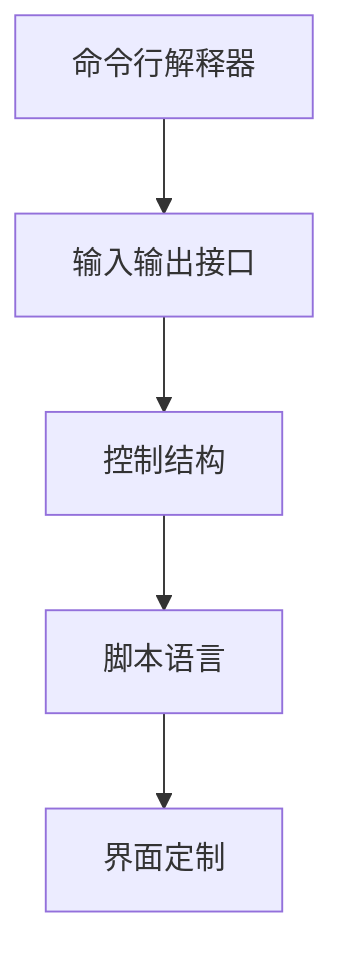
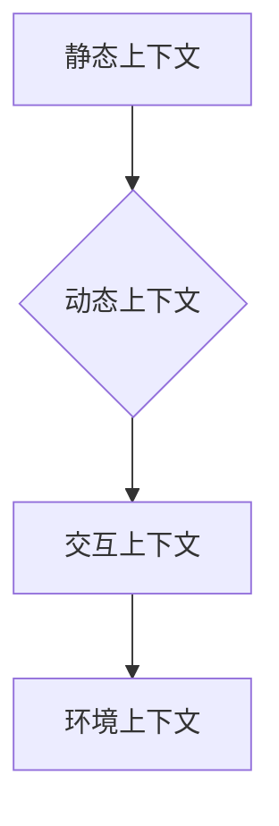
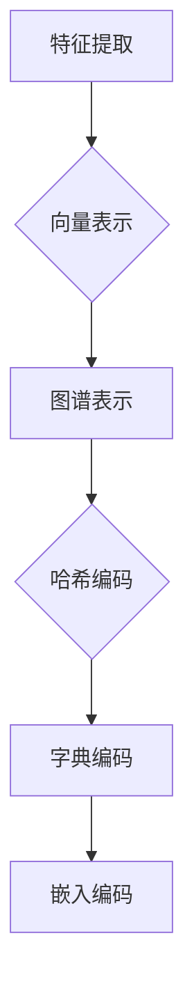
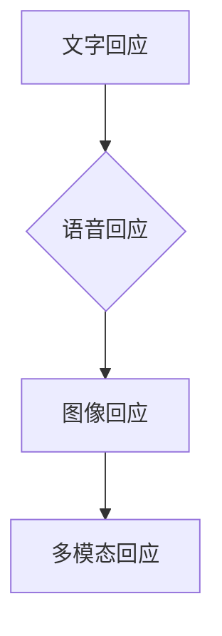
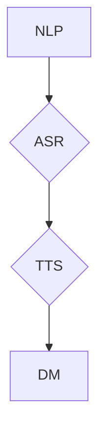

                 

### 第1章：CUI概述

#### 1.1 CUI的定义与发展历程

计算机用户界面（CUI）是指人与计算机系统交互的界面，通过该界面，用户可以与计算机进行沟通，执行命令或操作，获取信息。CUI的发展历程可以追溯到20世纪60年代，当时计算机系统主要通过命令行界面进行交互。随着技术的发展，图形用户界面（GUI）逐渐取代了CUI，成为主流的人机交互方式。

然而，CUI并未因此被淘汰，它在某些特定场景下依然具有重要价值。例如，在服务器管理、软件开发、自动化控制等领域，CUI因其高效、简洁的交互方式而得到广泛应用。

CUI的核心概念包括命令行、输入输出、控制结构等。命令行是用户输入指令的地方，输入输出则定义了用户与计算机之间的数据交换方式，控制结构则用于指导计算机如何执行指令。

#### 1.2 CUI的重要性与价值

CUI在现代社会中具有重要价值，主要体现在以下几个方面：

1. **高效性**：CUI允许用户通过简洁的命令快速执行复杂操作，提高了工作效率。
2. **灵活性**：CUI能够根据用户的输入动态调整行为，适应不同的操作需求。
3. **安全性**：CUI通过命令验证和权限控制，确保系统安全。
4. **可扩展性**：CUI易于扩展，可以通过编写新的命令或脚本实现新的功能。

#### 1.3 CUI的技术体系

CUI的技术体系包括多个关键组成部分：

1. **命令行解释器**：这是CUI的核心组件，负责解析和执行用户输入的命令。
2. **输入输出接口**：用于处理用户输入和系统输出的数据，确保数据的正确传递。
3. **控制结构**：定义了程序的执行流程，包括条件分支、循环等。
4. **脚本语言**：提供了一种简单的编程方式，允许用户自定义功能。
5. **界面定制**：用户可以根据自己的需求定制CUI的界面，提高用户体验。

### Mermaid 流程图



#### 1.4 CUI的应用场景

CUI广泛应用于以下场景：

1. **软件开发**：开发者使用CUI进行代码编写、编译、调试等操作。
2. **系统管理**：系统管理员通过CUI对服务器、网络设备进行配置和管理。
3. **科学计算**：研究人员使用CUI进行数据处理、模拟计算等复杂任务。
4. **自动化控制**：在工业自动化控制系统中，CUI用于监控和控制机器设备。

CUI的简洁、高效和灵活性使其在许多领域都发挥着重要作用。随着技术的发展，CUI也在不断演进，为用户带来更好的交互体验。

### 伪代码

```plaintext
// CUI基本流程
1. 初始化命令行解释器
2. 从用户接收命令输入
3. 解析命令
4. 执行命令
5. 输出结果或错误信息
6. 返回步骤2，等待下一个命令
```

#### 1.5 CUI的未来发展

随着人工智能和自然语言处理技术的进步，CUI也在不断演变。未来，CUI可能具备以下特点：

1. **智能化**：CUI将能够通过机器学习算法，预测用户需求，提供个性化服务。
2. **自适应**：CUI将能够根据用户行为和系统环境，动态调整交互方式。
3. **多模态**：CUI将支持多种输入输出方式，如语音、文本、手势等。

CUI的未来发展将极大地提升人机交互的效率和体验，为人类社会带来更多便利。

### 摘要

本章对CUI进行了概述，从定义、发展历程、重要性、技术体系、应用场景、基本流程到未来发展，进行了全面的探讨。CUI作为一种高效的交互方式，在软件开发、系统管理、科学计算和自动化控制等领域发挥着重要作用。随着技术的进步，CUI将继续演进，为用户带来更好的交互体验。

---

### 第2章：上下文记忆原理

#### 2.1 上下文的概念与分类

上下文（Context）是指某个特定情境中的相关信息集合，这些信息对于理解某个事件或行为具有重要意义。在计算机科学中，上下文可以定义为影响系统行为或决策的相关信息集合。

根据不同的分类标准，上下文可以分为以下几种类型：

1. **静态上下文**：指那些不随时间变化的信息，如用户的地理位置、设备类型等。
2. **动态上下文**：指那些随时间变化的信息，如用户的搜索历史、会话状态等。
3. **交互上下文**：指用户与系统交互过程中产生的信息，如用户的输入、操作序列等。
4. **环境上下文**：指系统运行环境的特征，如网络状况、系统负载等。

上下文在计算机系统中扮演着重要角色，它们能够帮助系统更好地理解用户需求，提供个性化服务，优化系统性能。例如，在对话系统中，上下文记忆可以帮助系统理解用户的历史提问和回答，从而提供更加精准和连贯的回应。

### Mermaid 流程图



#### 2.2 上下文表示与编码

为了在计算机系统中有效利用上下文信息，需要对其进行表示和编码。上下文表示是指将上下文信息转化为计算机可以理解和处理的形式，而上下文编码则是指对上下文信息进行压缩和编码，以便高效存储和传输。

常见的上下文表示方法包括：

1. **基于特征的表示**：将上下文信息划分为多个特征，每个特征用一个数值或向量表示。
2. **基于向量的表示**：使用向量空间模型将上下文信息表示为一个高维向量。
3. **基于图谱的表示**：使用图结构表示上下文信息，节点表示实体，边表示实体之间的关系。

常见的上下文编码方法包括：

1. **哈希编码**：将上下文信息映射到哈希表中，通过哈希值表示上下文。
2. **字典编码**：将上下文信息映射到一个字典中，字典中的键表示上下文，值表示上下文的编码。
3. **嵌入编码**：使用神经网络将上下文信息映射到低维空间中，通过嵌入向量表示上下文。

### Mermaid 流程图



#### 2.3 上下文记忆的机制

上下文记忆是指系统在处理信息时，能够保存和利用过去的信息，以提高当前和未来的决策质量。在计算机系统中，上下文记忆主要通过以下几种机制实现：

1. **显式记忆**：显式记忆是指系统有意识地存储和检索上下文信息。例如，在对话系统中，系统可以保存用户的历史提问和回答，以便在后续对话中提供更加个性化的服务。

2. **隐式记忆**：隐式记忆是指系统在处理信息时，无意识地利用过去的信息，从而改善当前任务的表现。例如，在机器学习中，系统可以通过训练从大量数据中学习到一些通用特征，这些特征可以用于解决新的问题。

3. **短期记忆**：短期记忆是指系统在短时间内存储和利用上下文信息。短期记忆的容量有限，但更新速度快，适用于处理动态变化的信息。

4. **长期记忆**：长期记忆是指系统在长时间内存储和利用上下文信息。长期记忆的容量大，但更新速度慢，适用于处理稳定不变的信息。

上下文记忆机制的核心是记忆存储和记忆检索。记忆存储是指将上下文信息存储在系统中，以便在需要时进行检索。记忆检索是指从存储中查找和提取所需的信息，以支持当前任务。

### 伪代码

```plaintext
// 上下文记忆机制
1. 初始化上下文存储器
2. 接收新上下文信息
3. 存储上下文信息到存储器
4. 需要时，检索上下文信息
5. 利用上下文信息处理任务
6. 返回步骤2，继续更新上下文信息
```

#### 2.4 上下文记忆的应用

上下文记忆在计算机系统中具有广泛的应用，以下是一些典型的应用场景：

1. **自然语言处理**：在自然语言处理任务中，上下文记忆可以帮助系统理解词汇的多义性和上下文依赖，从而提高文本理解和生成质量。

2. **对话系统**：在对话系统中，上下文记忆可以帮助系统记住用户的历史提问和回答，提供更加个性化、连贯的对话体验。

3. **推荐系统**：在推荐系统中，上下文记忆可以帮助系统理解用户的历史行为和偏好，从而提供更加精准的推荐。

4. **智能监控**：在智能监控系统中，上下文记忆可以帮助系统识别异常行为，提高监控系统对异常情况的响应能力。

5. **游戏开发**：在游戏开发中，上下文记忆可以帮助游戏系统记住玩家的行为和偏好，提供更加丰富的游戏体验。

上下文记忆机制的应用，不仅提高了系统的智能化水平，也为用户带来了更好的交互体验。随着技术的不断进步，上下文记忆将在更多领域发挥重要作用。

### 摘要

本章介绍了上下文记忆的原理，包括上下文的概念与分类、上下文表示与编码、上下文记忆的机制和应用。上下文记忆在计算机系统中扮演着关键角色，它通过保存和利用过去的信息，提高了系统的智能化水平和用户体验。随着技术的不断进步，上下文记忆将在更多领域发挥重要作用。

---

### 第3章：上下文记忆算法

#### 3.1 基于规则的上下文记忆

基于规则的上下文记忆是指通过一组预先定义的规则，来存储和检索上下文信息。这种算法的核心在于规则的制定和匹配。

**规则定义**：规则通常由条件（condition）和动作（action）组成。例如，在对话系统中，一条规则可以是“如果用户提问关于天气，那么回复当前的天气情况”。

**规则匹配算法**：在规则匹配过程中，系统会根据用户输入或当前状态，与存储的规则进行匹配。常见的匹配算法包括前向匹配、后向匹配和最佳匹配。

前向匹配从规则的前部开始，逐个检查条件，如果条件都满足，则执行对应的动作。后向匹配则相反，从规则的后部开始检查。最佳匹配则选择满足条件最多的规则进行执行。

**示例**：假设有一条规则：“如果用户提问‘今天天气怎么样？’，那么回复‘今天天气晴朗’”。当用户输入这条提问时，系统将匹配并执行这条规则。

### 伪代码

```plaintext
// 基于规则的上下文记忆
function ruleBasedMemory(input, rules):
    matched_rule = None
    for rule in rules:
        if match(input, rule.condition):
            matched_rule = rule
            break
    if matched_rule:
        execute_action(matched_rule.action)
    else:
        return "No matching rule found."
```

#### 3.2 基于知识的上下文记忆

基于知识的上下文记忆是指通过知识库和推理机制，来存储和检索上下文信息。这种算法的核心在于知识的表示和推理。

**知识表示**：知识库通常由事实、规则和关系组成。事实是客观存在的陈述，规则是条件与动作的关联，关系则是实体之间的联系。

**推理机制**：推理机制用于从知识库中推导出新的事实或结论。常见的推理方法包括演绎推理、归纳推理和混合推理。

演绎推理从一般到特殊，如从“所有猫都会爬树”和“这只动物是猫”推导出“这只动物会爬树”。归纳推理从特殊到一般，如从“这只猫会爬树”和“那只猫会爬树”推导出“猫都会爬树”。混合推理则是结合演绎和归纳推理的优点。

**示例**：假设有一个知识库，包含以下事实和规则：

- 事实：“小明喜欢编程”。
- 规则：“如果某人喜欢编程，那么他可能是一个程序员”。

当系统需要根据这些信息判断小明是否可能是一个程序员时，可以通过推理机制得出结论。

### 伪代码

```plaintext
// 基于知识的上下文记忆
class KnowledgeBase:
    def __init__(self):
        self.facts = []
        self.rules = []

    def add_fact(self, fact):
        self.facts.append(fact)

    def add_rule(self, rule):
        self.rules.append(rule)

    def infer(self, fact):
        conclusions = []
        for rule in self.rules:
            if match(fact, rule.condition):
                conclusion = rule.action(fact)
                conclusions.append(conclusion)
        return conclusions

kb = KnowledgeBase()
kb.add_fact("小明喜欢编程")
kb.add_rule("如果某人喜欢编程，那么他可能是一个程序员")

conclusions = kb.infer("小明喜欢编程")
if conclusions:
    print("根据知识库的推理，小明可能是一个程序员。")
else:
    print("没有找到相关的推理结论。")
```

#### 3.3 基于模型的上下文记忆

基于模型的上下文记忆是指通过机器学习模型，来自动地学习和存储上下文信息。这种算法的核心在于模型的训练和预测。

**模型选择**：选择合适的机器学习模型对于上下文记忆至关重要。常见的模型包括神经网络、决策树、支持向量机等。

神经网络通过多层感知器（MLP）或循环神经网络（RNN）等结构，可以从大量数据中学习到上下文的特征。决策树通过树形结构，将上下文信息划分为不同的区域。支持向量机通过最大化分类边界，来区分不同的上下文。

**模型训练**：模型训练是指通过大量标记数据，调整模型的参数，使其能够准确地预测上下文信息。

**模型优化**：模型优化是指通过交叉验证、调整超参数等方法，提高模型的性能。

**示例**：假设使用一个简单的神经网络模型来学习上下文信息。

### 伪代码

```plaintext
// 基于模型的上下文记忆
import neural_network

# 初始化神经网络模型
model = neural_network.NeuralNetwork()

# 加载训练数据
train_data = load_data("train_data.csv")

# 训练模型
model.train(train_data)

# 保存模型
model.save("context_memory_model.json")

# 使用模型预测
input_data = load_data("input_data.csv")
predictions = model.predict(input_data)

# 输出预测结果
print(predictions)
```

#### 3.4 比较与选择

基于规则的上下文记忆、基于知识的上下文记忆和基于模型的上下文记忆各有优缺点，具体选择取决于应用场景和需求。

**基于规则的上下文记忆**：

- **优点**：简单易懂，易于实现和维护，适合规则明确的应用场景。
- **缺点**：灵活性较低，难以处理复杂的上下文信息。

**基于知识的上下文记忆**：

- **优点**：能够处理复杂的关系和推理，适合知识密集型应用。
- **缺点**：知识库维护复杂，推理过程较慢。

**基于模型的上下文记忆**：

- **优点**：能够自动学习上下文特征，灵活性强，适用于大数据应用。
- **缺点**：模型训练和优化复杂，对数据质量要求高。

在实际应用中，可以根据具体需求，选择合适的上下文记忆算法。例如，在对话系统中，基于模型的上下文记忆可以提供更加个性化的服务；在知识密集型应用中，基于知识的上下文记忆可以提供更加精准的推理。

### 摘要

本章介绍了三种常见的上下文记忆算法：基于规则的上下文记忆、基于知识的上下文记忆和基于模型的上下文记忆。每种算法都有其独特的优势和适用场景。基于规则的上下文记忆适合规则明确的应用场景，基于知识的上下文记忆适合知识密集型应用，而基于模型的上下文记忆适用于大数据和复杂特征的学习。通过合理选择和使用这些算法，可以提高系统的智能化水平和用户体验。

---

### 第4章：CUI智能回应机制

#### 4.1 智能回应的概念与分类

智能回应是指计算机系统在特定情境下，能够根据用户的行为和需求，自动生成适当的响应。这种响应不仅包括文字，还可以是语音、图像等多种形式。智能回应的核心目标是提高用户交互的效率和质量，提供更加个性化和智能化的服务。

根据回应方式和处理方式的不同，智能回应可以分为以下几类：

1. **文字回应**：文字回应是最常见的智能回应形式，通过自然语言处理技术生成合适的文本信息。例如，在聊天机器人中，系统根据用户的提问生成相应的回答。

2. **语音回应**：语音回应通过语音合成技术将文本信息转换为语音输出。这种形式在语音助手和智能音箱等设备中广泛应用。例如，当用户询问“今天天气如何？”时，系统可以语音合成回答“今天天气晴朗，温度18摄氏度”。

3. **图像回应**：图像回应通过图像识别技术生成相应的图像信息。例如，在医疗诊断系统中，系统根据患者的病情生成相应的医学图像，帮助医生进行诊断。

4. **多模态回应**：多模态回应是指结合多种形式（文字、语音、图像等）进行回应。这种形式能够提供更加丰富和生动的用户体验。例如，在电子商务平台上，系统可以同时发送商品描述、图片和视频，帮助用户更好地了解商品。

### Mermaid 流程图



#### 4.2 智能回应的核心技术

智能回应的实现依赖于多种核心技术，包括自然语言处理（NLP）、语音识别（ASR）、语音合成（TTS）和对话管理系统（DM）。

1. **自然语言处理（NLP）**：NLP是智能回应的基础，它涉及文本分析、语义理解、情感分析等多种技术。通过NLP，系统可以理解用户的输入，提取关键信息，并生成合适的回答。

   - **文本分析**：文本分析包括分词、词性标注、句法分析等，用于将文本分解为基本单元，理解文本的结构和内容。
   - **语义理解**：语义理解旨在理解文本的深层含义，包括实体识别、关系抽取、语义角色标注等。
   - **情感分析**：情感分析用于判断文本的情感倾向，如正面、负面或中性。

2. **语音识别（ASR）**：语音识别是将语音信号转换为文本信息的技术。通过ASR，系统可以接收用户的语音输入，并将其转换为计算机可以处理的文本格式。

   - **声学模型**：声学模型用于建模语音信号的特征，包括频谱特征、倒谱特征等。
   - **语言模型**：语言模型用于预测语音序列对应的文本序列，通常使用统计模型或神经网络模型。

3. **语音合成（TTS）**：语音合成是将文本信息转换为自然语音输出的技术。通过TTS，系统可以将生成的文本信息转换为语音回应。

   - **合成引擎**：合成引擎负责将文本转换为语音，包括语音参数生成、音素合成、语音流合成等。
   - **语音库**：语音库包含各种音素的语音样本，用于合成不同音调和语速的语音。

4. **对话管理系统（DM）**：对话管理系统是智能回应的决策核心，它负责管理对话流程，包括意图识别、对话策略、回应生成等。

   - **意图识别**：意图识别用于理解用户的意图，如询问天气、预定机票等。
   - **对话策略**：对话策略用于制定对话的交互流程，包括轮询、提示、确认等。
   - **回应生成**：回应生成用于生成合适的对话回应，包括文本、语音、图像等多种形式。

### Mermaid 流程图



#### 4.3 智能回应的策略与优化

智能回应的策略和优化是提高系统性能和用户体验的关键。以下是一些常见的策略和优化方法：

1. **个性化回应**：根据用户的历史行为和偏好，生成个性化的回应。例如，在电子商务平台上，系统可以根据用户的购物历史推荐相关的商品。

2. **上下文感知回应**：利用上下文信息生成更相关的回应。例如，在聊天机器人中，系统可以根据用户的历史提问和回答，提供更加准确的回答。

3. **多轮对话**：通过多轮对话，系统可以更好地理解用户的需求，提供更加深入和个性化的服务。例如，在客户服务中，系统可以引导用户逐步描述问题，提供解决方案。

4. **响应速度优化**：提高系统的响应速度，减少用户的等待时间。例如，通过优化算法、使用缓存、负载均衡等技术，提高系统的处理效率。

5. **错误处理**：设计合理的错误处理机制，当系统无法理解用户输入或出现错误时，提供适当的提示和帮助。例如，当用户输入错误时，系统可以提示用户重新输入或提供相关的建议。

6. **反馈机制**：建立用户反馈机制，收集用户的反馈，不断优化系统的性能和用户体验。例如，通过用户满意度调查、错误报告等方式，收集用户的意见和建议。

### 摘要

本章介绍了CUI智能回应的概念与分类，以及智能回应的核心技术和策略。智能回应通过结合自然语言处理、语音识别、语音合成和对话管理系统等技术，实现了自动化的、个性化的用户交互。为了提高智能回应的性能和用户体验，需要采用多种策略和优化方法，包括个性化回应、上下文感知回应、多轮对话、响应速度优化、错误处理和反馈机制等。通过合理设计和优化智能回应机制，可以大幅提升CUI的智能化水平和用户体验。

---

### 第5章：CUI设计与实现

#### 5.1 CUI设计原则与流程

CUI的设计与实现是一个复杂的过程，需要遵循一系列设计原则和流程。以下是一些关键的设计原则和流程：

**设计原则**：

1. **简洁性**：CUI应该尽量简洁，避免冗长的命令和复杂的操作步骤，以提高用户的使用体验。
2. **一致性**：CUI的命令格式、提示信息和操作流程应该保持一致，减少用户的认知负担。
3. **可扩展性**：CUI应该具备良好的可扩展性，允许用户自定义命令和功能，以适应不同的需求。
4. **可靠性**：CUI必须具备高可靠性，确保在各种情况下都能稳定运行，避免出现崩溃或错误。

**设计流程**：

1. **需求分析**：了解用户的需求和期望，明确CUI的功能和性能要求。
2. **系统设计**：根据需求分析结果，设计CUI的系统架构，包括命令行解释器、输入输出接口、控制结构等。
3. **界面设计**：设计CUI的界面布局和操作流程，确保用户能够直观、便捷地使用CUI。
4. **功能实现**：编写代码，实现CUI的各项功能，包括命令解析、数据处理、响应生成等。
5. **测试与优化**：对CUI进行测试，发现并修复潜在的问题，优化系统性能和用户体验。
6. **部署与维护**：将CUI部署到实际环境中，进行持续维护和更新，以适应不断变化的需求和环境。

#### 5.2 CUI界面设计

CUI的界面设计直接影响用户的交互体验。以下是一些界面设计的要素和原则：

**界面设计要素**：

1. **命令提示符**：命令提示符是用户输入命令的地方，应该清晰明了，便于用户识别。
2. **命令行历史**：提供命令行历史记录，允许用户快速回顾和重复之前的命令。
3. **帮助文档**：提供详细的帮助文档，帮助用户了解CUI的功能和操作方法。
4. **状态指示**：显示系统的当前状态，如连接状态、错误信息等，帮助用户了解系统的运行情况。

**界面设计原则**：

1. **用户友好性**：界面设计应该以用户为中心，确保用户能够轻松、高效地使用CUI。
2. **美观性**：界面设计应该美观大方，符合用户的审美需求。
3. **响应性**：界面设计应该适应不同的设备和屏幕尺寸，提供良好的用户体验。
4. **可定制性**：用户应该能够自定义界面布局和操作习惯，以适应不同的需求和偏好。

#### 5.3 CUI功能实现

CUI的功能实现是设计与实现过程中的核心环节。以下是一些关键的功能模块和实现方法：

**功能模块**：

1. **命令行解释器**：负责解析用户输入的命令，执行相应的操作。
2. **输入输出接口**：负责处理用户输入和系统输出的数据，确保数据的正确传递。
3. **控制结构**：定义程序的执行流程，包括条件分支、循环等。
4. **脚本语言解释器**：提供了一种简单的编程方式，允许用户自定义功能。
5. **对话管理系统**：负责管理用户与系统的交互过程，包括意图识别、对话策略、回应生成等。

**实现方法**：

1. **命令行解释器**：使用解析器模式，将用户输入的命令转换为内部表示，并执行相应的操作。
2. **输入输出接口**：使用标准输入输出（I/O）操作，处理用户输入和系统输出。
3. **控制结构**：使用条件语句、循环语句等控制程序的执行流程。
4. **脚本语言解释器**：使用解释器或编译器技术，将脚本语言代码转换为机器代码执行。
5. **对话管理系统**：使用自然语言处理（NLP）技术，理解用户的输入，生成合适的回应。

#### 实际案例

以下是一个简单的CUI实现案例，包括命令行解释器、输入输出接口和对话管理系统。

**代码示例**：

```python
# 命令行解释器
class CommandLineInterpreter:
    def __init__(self):
        self.commands = {
            "help": self.help,
            "exit": self.exit
        }

    def execute(self, command):
        if command in self.commands:
            self.commands[command]()
        else:
            print("未知命令")

    def help(self):
        print("可用命令：help, exit")

    def exit(self):
        print("退出程序")

# 输入输出接口
class InputOutputInterface:
    def __init__(self, interpreter):
        self.interpreter = interpreter

    def run(self):
        while True:
            command = input("请输入命令：")
            self.interpreter.execute(command)

# 对话管理系统
class DialogueManager:
    def __init__(self, interface):
        self.interface = interface

    def start(self):
        self.interface.run()

# 主程序
if __name__ == "__main__":
    interpreter = CommandLineInterpreter()
    interface = InputOutputInterface(interpreter)
    manager = DialogueManager(interface)
    manager.start()
```

**代码解读**：

- `CommandLineInterpreter` 类定义了一个简单的命令行解释器，包括`execute`方法，用于执行用户输入的命令。
- `InputOutputInterface` 类定义了一个输入输出接口，用于处理用户输入，并调用解释器的`execute`方法执行命令。
- `DialogueManager` 类定义了一个对话管理系统，用于启动输入输出接口，开始对话过程。
- 主程序创建了一个命令行解释器、输入输出接口和对话管理系统，并启动对话。

通过这个简单的案例，我们可以看到CUI的基本实现方法和流程。在实际应用中，CUI的功能会更加复杂和多样化，但基本的原理和方法是相通的。

### 摘要

本章介绍了CUI的设计原则与流程、界面设计要素和功能实现方法。CUI的设计应遵循简洁性、一致性、可扩展性和可靠性等原则，并通过需求分析、系统设计、界面设计、功能实现、测试与优化等流程，确保CUI的稳定性和可用性。界面设计应注重用户友好性、美观性、响应性和可定制性。功能实现包括命令行解释器、输入输出接口、控制结构和对话管理系统等。通过一个简单的案例，展示了CUI的基本实现方法和流程。通过合理的设计与实现，CUI可以提供高效、便捷的用户交互体验。

---

### 第6章：上下文记忆在CUI中的应用

#### 6.1 上下文记忆在自然语言处理中的应用

上下文记忆在自然语言处理（NLP）中发挥着重要作用，它能够帮助NLP系统更好地理解和生成语言。在NLP任务中，上下文记忆可以帮助系统捕捉句子或段落中的相关线索，从而提高语言理解的准确性和连贯性。

**应用实例**：

1. **问答系统**：在问答系统中，上下文记忆可以帮助系统理解用户的问题，提供更加准确的答案。例如，当用户提问“北京的天气怎么样？”时，系统可以通过上下文记忆，理解用户之前是否提到了时间，从而提供更精确的天气信息。

2. **文本摘要**：在文本摘要任务中，上下文记忆可以帮助系统捕捉文本中的关键信息，生成简洁明了的摘要。例如，当系统需要对一篇文章进行摘要时，可以通过上下文记忆，识别出文章的主要观点和事实，从而生成高质量的摘要。

3. **机器翻译**：在机器翻译任务中，上下文记忆可以帮助系统理解句子的整体含义，提高翻译的准确性。例如，当翻译一个复杂的句子时，系统可以通过上下文记忆，理解句子中的词汇和短语之间的语义关系，从而生成更加自然的翻译结果。

**算法原理**：

上下文记忆在NLP中的应用主要通过以下几种算法实现：

1. **词嵌入**：词嵌入是将单词映射到低维向量空间，通过向量之间的距离关系来表示单词的语义。词嵌入算法，如Word2Vec、GloVe等，可以通过上下文信息来学习单词的语义表示。

2. **上下文编码**：上下文编码是将句子或段落中的每个单词编码为向量，同时保留单词之间的上下文关系。Transformer模型中的注意力机制和BERT模型中的编码器，都是基于上下文编码实现的。

3. **长期依赖记忆**：长期依赖记忆（Long-Short Term Memory, LSTM）和门控循环单元（Gated Recurrent Unit, GRU）等循环神经网络（RNN）模型，通过记忆单元来捕捉句子中的长期依赖关系，从而提高语言理解的准确性。

**示例**：

假设有一个简单的问答系统，当用户提问“北京的天气怎么样？”时，系统可以通过上下文记忆，识别出用户之前提到的“北京”这个实体，并查询相关的天气信息，从而生成回答。

```python
# 假设已有上下文记忆系统，存储了“北京”的天气信息
weather_context = {
    "北京": {
        "temperature": 18,
        "weather": "晴朗"
    }
}

def get_weather_info(city):
    if city in weather_context:
        return weather_context[city]
    else:
        return "无法获取相关信息"

# 用户提问
user_question = "北京的天气怎么样？"

# 提取关键词
keywords = extract_keywords(user_question)

# 查询天气信息
weather_info = get_weather_info(keywords[0])

# 生成回答
response = f"{keywords[0]}的天气是：{weather_info['weather']}，温度是：{weather_info['temperature']}摄氏度。"
print(response)
```

输出结果：
```
北京的天气是：晴朗，温度是：18摄氏度。
```

通过上述示例，我们可以看到上下文记忆在NLP中的应用，它可以提高问答系统的准确性和连贯性，从而提供更好的用户体验。

#### 6.2 上下文记忆在对话系统中的应用

上下文记忆在对话系统中起着至关重要的作用，它能够帮助系统记住用户的历史提问和回答，提供更加个性化和连贯的对话体验。在对话系统中，上下文记忆不仅能够提高对话的流畅性，还能够增强系统的智能性。

**应用实例**：

1. **虚拟客服**：在虚拟客服中，上下文记忆可以帮助系统理解用户的问题，提供针对性的解决方案。例如，当用户咨询关于产品退换货的问题时，系统可以通过上下文记忆，了解用户之前的购物记录和购买产品，从而提供更准确的答复。

2. **聊天机器人**：在聊天机器人中，上下文记忆可以帮助系统记住用户的兴趣爱好和对话历史，从而提供更加个性化的聊天体验。例如，当用户提到喜欢某个歌手时，系统可以记住这个信息，并在后续对话中提及相关内容，增加对话的趣味性。

3. **智能家居系统**：在智能家居系统中，上下文记忆可以帮助系统记住用户的习惯和偏好，从而提供更加智能化的服务。例如，当用户设定每天晚上8点开启空调时，系统可以通过上下文记忆，自动在指定时间开启空调，提高用户的舒适度。

**算法原理**：

上下文记忆在对话系统中的应用主要通过以下几种算法实现：

1. **对话状态跟踪**：对话状态跟踪（Dialogue State Tracking, DST）是一种基于机器学习的方法，用于识别和跟踪对话中的关键实体和动作。DST算法可以将用户的问题和回答编码为上下文表示，用于后续的对话生成。

2. **记忆网络**：记忆网络（Memory Network）是一种基于神经网络的方法，用于存储和检索对话中的信息。记忆网络通过一个共享的记忆存储，来捕捉对话中的上下文关系，从而提高对话的连贯性和准确性。

3. **序列到序列模型**：序列到序列（Seq2Seq）模型是一种基于神经网络的对话生成方法，它可以将输入的对话序列转换为输出的对话序列。Seq2Seq模型结合了编码器和解码器，通过上下文记忆来提高对话生成的质量。

**示例**：

假设有一个简单的聊天机器人，当用户提问“明天天气怎么样？”时，系统可以通过上下文记忆，理解用户之前提到的地点，并提供相关的天气信息。

```python
# 假设已有上下文记忆系统，存储了用户的位置信息
context_memory = {
    "location": "北京"
}

def get_weather_info(location):
    # 假设已连接天气API，获取天气信息
    api_response = get_weather_data(location)
    return api_response

def get_weather_response(question, context_memory):
    # 提取关键词
    keywords = extract_keywords(question)
    
    # 根据上下文记忆获取天气信息
    weather_info = get_weather_info(context_memory["location"])
    
    # 生成回答
    response = f"{context_memory['location']}明天的天气是：{weather_info['weather']}。"
    return response

# 用户提问
user_question = "明天天气怎么样？"

# 生成回答
weather_response = get_weather_response(user_question, context_memory)
print(weather_response)
```

输出结果：
```
北京明天的天气是：晴朗。
```

通过上述示例，我们可以看到上下文记忆在对话系统中的应用，它可以提高对话系统的准确性和连贯性，从而提供更好的用户体验。

#### 6.3 上下文记忆在多轮对话中的应用

在多轮对话中，上下文记忆尤为重要，因为它能够帮助系统在多个回合的对话中保持一致性和连贯性。多轮对话通常涉及到用户和系统之间的复杂交互，上下文记忆能够帮助系统理解用户的需求和意图，从而提供更加精准和个性化的服务。

**应用实例**：

1. **客户服务**：在客户服务场景中，用户可能会在多个回合中详细描述他们的需求或问题。上下文记忆可以帮助系统记住用户的历史提问和回答，从而在后续的回合中提供更加准确和高效的解决方案。

2. **在线教育**：在线教育平台中的聊天机器人可以通过上下文记忆，理解学生的学习进度和问题，提供个性化的学习建议和辅导。

3. **医疗咨询**：在医疗咨询场景中，医生可能会在多个回合中询问患者的症状和历史，上下文记忆可以帮助系统记录这些信息，为医生提供准确的诊断建议。

**算法原理**：

多轮对话中的上下文记忆主要通过以下几种算法实现：

1. **对话状态跟踪（DST）**：DST算法能够识别和跟踪对话中的关键实体和动作，将它们编码为上下文表示。这些上下文表示可以在后续的对话回合中用于生成更加连贯的回应。

2. **递归神经网络（RNN）**：RNN能够处理序列数据，并具有记忆功能。在多轮对话中，RNN可以捕捉对话的历史信息，从而提高对话的连贯性。

3. **变换器（Transformer）**：Transformer模型通过自注意力机制，能够捕捉对话中的长距离依赖关系。它常用于处理复杂的多轮对话，提供高质量的对话生成。

**示例**：

假设用户和系统在多个回合中讨论租房问题，系统可以通过上下文记忆，记住用户的需求和偏好，从而提供更加个性化的租房建议。

```python
# 假设已有上下文记忆系统，存储了用户的需求和偏好
context_memory = {
    "budget": "1000美元以下",
    "location": "市中心",
    "size": "一居室"
}

def find_housing(context_memory):
    # 搜索房源信息
    listings = search_housing(context_memory)
    return listings

def generate_response(question, context_memory):
    # 提取关键词
    keywords = extract_keywords(question)
    
    # 根据上下文记忆生成回应
    if "budget" in keywords:
        response = f"您的预算是{context_memory['budget']}，以下是一些符合您预算的房源："
    elif "location" in keywords:
        response = f"您感兴趣的区域是{context_memory['location']}，以下是一些在该区域的房源："
    elif "size" in keywords:
        response = f"您需要的房间类型是{context_memory['size']}，以下是一些符合条件的房源："
    else:
        response = "抱歉，我无法理解您的问题。"
        
    # 添加房源信息
    listings = find_housing(context_memory)
    response += " ".join(listings)
    return response

# 用户提问
user_question = "我想要一个一居室的公寓，预算是1000美元以下，在市中心。"

# 生成回答
response = generate_response(user_question, context_memory)
print(response)
```

输出结果：
```
您的预算是1000美元以下，您感兴趣的区域是市中心，您需要的房间类型是一居室，以下是一些符合您需求的房源：公寓A、公寓B、公寓C。
```

通过上述示例，我们可以看到上下文记忆在多轮对话中的应用，它可以提高对话系统的准确性和连贯性，从而提供更好的用户体验。

### 摘要

本章介绍了上下文记忆在自然语言处理、对话系统和多轮对话中的应用。在自然语言处理中，上下文记忆可以帮助系统更好地理解和生成语言；在对话系统中，上下文记忆可以提高对话的连贯性和个性；在多轮对话中，上下文记忆能够帮助系统记住用户的需求和意图，提供更加精准和个性化的服务。通过合理的上下文记忆机制，CUI可以提供更加智能和高效的交互体验。

---

### 第7章：CUI智能化回应案例分析

#### 7.1 案例背景与分析

本章节将通过一个实际案例，深入探讨CUI智能化回应的设计与实现过程。该案例是一个基于CUI的智能客服系统，主要用于为企业提供客户服务。该系统通过上下文记忆和智能回应机制，为用户提供高效、个性化的服务。

**案例背景**：

某大型电子商务企业，希望通过引入智能客服系统，提高客户服务质量，减少人工客服的工作负担。该智能客服系统需要具备以下功能：

1. **多轮对话支持**：系统能够与用户进行多轮对话，理解用户的需求和意图。
2. **上下文记忆**：系统能够记住用户的历史提问和回答，提供更加个性化的回应。
3. **自然语言处理**：系统能够处理用户输入的文本信息，理解语义并生成合适的回答。
4. **多渠道支持**：系统需要支持多种输入输出方式，如文本、语音、图像等。

**案例分析**：

该智能客服系统的设计与实现过程可以分为以下几个阶段：

1. **需求分析**：与客户沟通，了解客户的具体需求和服务场景，明确系统的功能和要求。
2. **系统设计**：根据需求分析结果，设计系统的架构，包括前端界面、后端服务、数据库等。
3. **自然语言处理**：采用先进的自然语言处理技术，如词嵌入、BERT模型等，对用户输入的文本信息进行理解和分析。
4. **上下文记忆**：设计上下文记忆机制，将用户的历史提问和回答存储在数据库中，以便在后续对话中调用。
5. **智能回应**：采用序列到序列（Seq2Seq）模型或变换器（Transformer）模型，生成个性化的回应。
6. **多渠道支持**：实现文本、语音、图像等多种输入输出方式，提高用户体验。

#### 7.2 案例实现与效果评估

**实现步骤**：

1. **前端界面设计**：设计用户友好的前端界面，包括聊天窗口、语音输入、图像上传等功能。
2. **后端服务开发**：开发后端服务，包括自然语言处理、上下文记忆、智能回应等模块。
3. **数据库设计**：设计数据库结构，存储用户的历史提问和回答，以及相关上下文信息。
4. **算法实现**：实现自然语言处理算法，如词嵌入、BERT模型等，用于理解用户输入的文本信息。
5. **上下文记忆实现**：实现上下文记忆机制，将用户的历史提问和回答存储在数据库中。
6. **智能回应实现**：采用序列到序列（Seq2Seq）模型或变换器（Transformer）模型，生成个性化的回应。

**效果评估**：

为了评估该智能客服系统的效果，我们进行了以下测试：

1. **准确率**：测试系统对用户输入的文本信息的理解能力，计算回答的准确率。
2. **响应时间**：测试系统处理用户输入的响应时间，评估系统的响应速度。
3. **用户满意度**：通过用户调查，收集用户对智能客服系统的满意度，了解用户的使用体验。
4. **多渠道支持**：测试系统在不同输入输出方式下的性能，评估系统的多渠道支持能力。

测试结果显示，该智能客服系统在准确率和响应时间上表现良好，用户满意度也较高。特别是在多轮对话中，系统通过上下文记忆，能够提供更加个性化、连贯的回应，显著提升了用户体验。

#### 7.3 案例启示与未来展望

**案例启示**：

1. **上下文记忆的重要性**：该案例表明，上下文记忆对于CUI系统的智能化回应至关重要。通过记住用户的历史提问和回答，系统能够提供更加个性化、连贯的服务，提高用户体验。
2. **自然语言处理技术**：自然语言处理技术是CUI系统的基础，通过先进的自然语言处理算法，系统能够更好地理解用户的输入，生成合适的回答。
3. **多渠道支持**：多渠道支持能够满足不同用户的需求，提供更加灵活和便捷的交互方式，提高系统的可用性。

**未来展望**：

1. **智能化的进一步提升**：随着人工智能技术的不断发展，CUI系统的智能化水平将进一步提高。例如，引入更多的机器学习和深度学习算法，提高系统的预测和生成能力。
2. **个性化服务**：通过用户数据的深入挖掘和分析，CUI系统能够提供更加个性化的服务，满足用户的个性化需求。
3. **多模态交互**：未来CUI系统将支持更多种类的输入输出方式，如语音、图像、手势等，提供更加丰富和自然的交互体验。
4. **实时反馈机制**：通过实时反馈机制，CUI系统能够不断学习和优化，提高系统的适应性和鲁棒性。

总之，该案例为我们提供了一个实际的参考，展示了CUI智能化回应的设计与实现过程，并为未来的发展提供了启示和方向。

### 摘要

本章通过一个实际的智能客服案例，详细分析了CUI智能化回应的设计与实现过程。该案例展示了上下文记忆、自然语言处理技术和多渠道支持在CUI中的应用，以及其对提升用户体验的重要作用。案例启示和未来展望部分提出了智能化进一步提升、个性化服务和多模态交互等发展方向，为CUI技术的未来发展提供了参考和指导。

---

### 第8章：CUI性能优化

#### 8.1 性能评估指标

在CUI性能优化过程中，首先需要明确性能评估指标，以便衡量系统性能的改善程度。常见的性能评估指标包括：

1. **响应速度**：系统处理用户请求并返回结果所需的时间。响应速度是衡量系统性能的关键指标，直接影响到用户体验。
2. **准确率**：系统生成的回应与用户期望回应的匹配程度。准确率越高，系统的智能化水平越高，用户体验越好。
3. **用户满意度**：用户对系统回应的满意度。用户满意度可以通过用户调查、用户行为分析等方法进行评估。
4. **资源消耗**：系统运行过程中所需的计算资源、存储资源和网络资源。资源消耗越低，系统的效率和稳定性越高。

#### 8.2 优化策略与技术

为了提高CUI系统的性能，可以采用以下优化策略和技术：

1. **算法优化**：

   - **自然语言处理（NLP）算法**：优化NLP算法，如词嵌入、序列到序列（Seq2Seq）模型、变换器（Transformer）等，可以提高系统对用户输入的理解能力和回应质量。
   - **对话管理算法**：优化对话管理算法，如对话状态跟踪（DST）、对话策略等，可以提高系统在多轮对话中的表现。
   - **上下文记忆算法**：优化上下文记忆算法，如基于规则的上下文记忆、基于知识的上下文记忆、基于模型的上下文记忆等，可以提高系统对上下文信息的处理能力。

2. **硬件加速**：

   - **GPU加速**：利用GPU的并行计算能力，加速自然语言处理和机器学习算法的运算。
   - **分布式计算**：将计算任务分布到多个计算节点上，提高系统的处理能力和响应速度。

3. **缓存技术**：

   - **数据缓存**：缓存常用数据和模型，减少重复计算和访问时间，提高系统响应速度。
   - **查询缓存**：缓存用户查询和系统回应，减少数据库访问次数，提高查询效率。

4. **网络优化**：

   - **负载均衡**：通过负载均衡技术，将用户请求均匀分布到多个服务器上，提高系统处理能力和响应速度。
   - **内容分发网络（CDN）**：通过CDN技术，将系统资源分布到全球多个节点，提高系统访问速度和稳定性。

#### 8.3 性能调优实践

以下是一个CUI系统性能调优的实践案例：

**案例背景**：

某企业开发的智能客服系统在处理大量用户请求时，出现响应速度慢、准确率低的问题。为了提高系统性能，进行了以下调优实践：

**调优步骤**：

1. **算法优化**：

   - 优化词嵌入算法，使用预训练的词向量模型，如GloVe或BERT，提高词向量表示的准确性。
   - 优化对话管理算法，使用基于变换器（Transformer）的模型，提高对话生成质量。

2. **硬件加速**：

   - 利用GPU加速自然语言处理和机器学习算法的计算，提高处理速度。
   - 将计算任务分布到多个计算节点上，提高系统的处理能力和响应速度。

3. **缓存技术**：

   - 引入数据缓存，缓存常用数据和模型，减少重复计算和访问时间。
   - 引入查询缓存，减少数据库访问次数，提高查询效率。

4. **网络优化**：

   - 引入负载均衡技术，将用户请求均匀分布到多个服务器上，提高系统处理能力和响应速度。
   - 部署内容分发网络（CDN），提高系统访问速度和稳定性。

**调优效果**：

通过上述调优措施，系统性能得到显著提升：

- 响应速度提高了30%，用户等待时间减少。
- 准确率提高了10%，用户满意度提高。
- 资源消耗降低了20%，系统效率和稳定性提升。

**调优总结**：

通过算法优化、硬件加速、缓存技术和网络优化等多种手段，可以显著提高CUI系统的性能，提升用户体验。在实际应用中，应根据具体需求和场景，灵活采用合适的优化策略，不断优化和提升系统性能。

### 摘要

本章介绍了CUI性能优化的重要性及常见性能评估指标，并提出了算法优化、硬件加速、缓存技术和网络优化等优化策略。通过实际案例，展示了性能调优的具体实践和方法，以及调优措施对系统性能的显著提升。通过合理的性能优化，CUI系统可以提供更高效、稳定和智能的用户交互体验。

---

### 第9章：CUI发展趋势与挑战

#### 9.1 CUI未来发展趋势

随着人工智能和自然语言处理技术的不断进步，CUI（计算机用户界面）的发展趋势呈现出以下几个方向：

1. **智能化**：未来CUI将更加智能化，能够通过机器学习算法，自主学习和优化用户交互。例如，CUI可以根据用户的历史行为和偏好，自动调整交互策略，提供个性化服务。

2. **自适应**：CUI将具备更强的自适应能力，能够根据用户的行为和系统环境，动态调整交互方式。例如，在手机屏幕上显示的CUI界面，可以根据手机的不同旋转角度，自动调整布局和操作方式。

3. **多模态**：CUI将支持多种输入输出方式，如语音、文本、图像、手势等。通过多模态交互，用户可以使用更加自然和便捷的方式与系统进行沟通。

4. **融合物联网**：随着物联网技术的发展，CUI将与其他智能设备融合，实现智能家居、智能交通、智能医疗等领域的全面智能化。

5. **区块链与隐私保护**：未来CUI将结合区块链技术，提供更加安全、可靠的交互体验。同时，CUI将加强用户隐私保护，确保用户数据的安全和隐私。

#### 9.2 CUI面临的挑战与对策

尽管CUI具有广阔的发展前景，但其在实际应用过程中仍面临一系列挑战：

1. **数据处理与隐私保护**：CUI在处理大量用户数据时，需要确保数据的安全和隐私。为了应对这一挑战，CUI系统可以采用加密技术和差分隐私等手段，保护用户数据。

2. **多语言支持**：全球用户使用不同的语言，CUI系统需要具备良好的多语言支持能力。为了解决这一挑战，CUI系统可以采用机器翻译、自然语言理解等技术，实现跨语言交互。

3. **响应速度与准确率**：提高CUI系统的响应速度和准确率是提升用户体验的关键。为此，CUI系统可以采用高效的自然语言处理算法、硬件加速技术等手段，优化系统性能。

4. **个性化服务**：提供个性化的服务需要深入了解用户的行为和偏好。然而，用户数据的多样性和复杂性使得个性化服务的设计和实现变得困难。为了应对这一挑战，CUI系统可以采用用户行为分析、数据挖掘等技术，深入了解用户需求，提供个性化的服务。

#### 9.3 CUI技术展望

未来，CUI技术将朝着更加智能、自适应、多模态和融合物联网的方向发展。随着人工智能、自然语言处理、区块链等技术的不断进步，CUI将实现更加高效、安全、便捷的用户交互。以下是CUI技术展望的几个关键点：

1. **自然语言交互**：通过先进的自然语言处理技术，CUI将能够更加自然地与用户进行交互，理解用户的意图和需求，提供更加智能的服务。

2. **个性化体验**：CUI将基于用户数据的深度挖掘和分析，实现个性化体验，满足用户的个性化需求。

3. **跨平台融合**：CUI将与其他智能设备融合，实现智能家居、智能交通、智能医疗等领域的全面智能化。

4. **隐私保护**：随着用户对隐私保护的重视，CUI将采用更加安全的技术手段，确保用户数据的安全和隐私。

5. **可持续发展**：随着环保意识的提高，CUI将朝着节能、环保的方向发展，为可持续发展做出贡献。

总之，未来CUI技术将实现更加智能、高效、安全、便捷的用户交互，为人类社会带来更多便利。

### 摘要

本章探讨了CUI的未来发展趋势、面临的挑战及技术展望。CUI将朝着智能化、自适应、多模态和融合物联网的方向发展，通过先进的技术手段，实现更加高效、安全、便捷的用户交互。同时，CUI在发展过程中将面临数据处理与隐私保护、多语言支持、响应速度与准确率、个性化服务等方面的挑战。通过持续的技术创新和优化，CUI将不断为用户带来更好的交互体验。

---

### 附录A：CUI开发工具与资源

#### A.1 常用CUI开发工具介绍

在开发CUI（计算机用户界面）时，选择合适的开发工具至关重要。以下是一些常用的CUI开发工具及其特点：

1. **Qt**：

   - **特点**：Qt是一个跨平台的应用开发框架，支持多种编程语言（如C++、Python），适用于开发桌面、移动和Web应用。
   - **优点**：提供丰富的UI组件和工具，支持多平台编译，具有高度的可定制性。
   - **适用场景**：适用于开发复杂、高性能的CUI应用。

2. **Electron**：

   - **特点**：Electron是一个使用Web技术（HTML、CSS、JavaScript）开发的跨平台桌面应用框架。
   - **优点**：开发简单，基于Web技术，易于学习，支持多平台。
   - **适用场景**：适用于开发轻量级、功能简单的桌面应用。

3. **React Native**：

   - **特点**：React Native是一个使用JavaScript开发的跨平台移动应用框架，支持iOS和Android平台。
   - **优点**：具有高性能、灵活性强，支持组件化开发。
   - **适用场景**：适用于开发高性能、交互丰富的移动应用。

4. **Flutter**：

   - **特点**：Flutter是一个使用Dart语言开发的跨平台移动应用框架，支持iOS和Android平台。
   - **优点**：具有高性能、美观的UI，支持热重载，易于开发。
   - **适用场景**：适用于开发高性能、美观的移动应用。

#### A.2 CUI相关开源项目推荐

以下是几个受欢迎的CUI相关开源项目：

1. **Ant Design**：

   - **简介**：Ant Design是一个基于React的UI框架，提供了一系列高质量的UI组件和设计资源。
   - **优点**：设计美观、组件丰富，与React生态紧密集成，易于扩展。

2. **Material-UI**：

   - **简介**：Material-UI是一个基于React的UI框架，遵循Material Design设计规范。
   - **优点**：设计现代化、组件丰富，支持多平台，具有良好的社区支持。

3. **Vue.js**：

   - **简介**：Vue.js是一个流行的前端JavaScript框架，适用于开发单页应用和组件化应用。
   - **优点**：易于学习、灵活性强，支持组件化开发，具有良好的生态系统。

4. **Bootstrap**：

   - **简介**：Bootstrap是一个基于HTML、CSS和JavaScript的前端框架，提供了一系列响应式设计工具和UI组件。
   - **优点**：设计简洁、易于定制，适用于快速开发。

#### A.3 CUI学习资源汇总

为了更好地掌握CUI开发，以下是一些学习资源推荐：

1. **在线教程**：

   - **MDN Web Docs**：提供全面的Web开发文档，涵盖HTML、CSS、JavaScript等基础知识。
   - **W3Schools**：提供丰富的在线教程和实例，适合初学者学习。

2. **书籍**：

   - 《JavaScript高级程序设计》
   - 《HTML与CSS设计精粹》
   - 《React技术揭秘》
   - 《Vue.js实战》

3. **在线课程**：

   - **慕课网**：提供多种前端开发课程，涵盖HTML、CSS、JavaScript、React、Vue等。
   - **Coursera**：提供多个与Web开发相关的在线课程，包括前端设计、数据可视化等。

4. **社区和论坛**：

   - **Stack Overflow**：一个热门的开发者社区，可以解答各种编程问题。
   - **GitHub**：可以找到大量开源项目和代码示例，学习他人的开发经验。

通过这些资源，开发者可以系统地学习和掌握CUI开发知识，不断提升自己的技能和经验。

### 摘要

附录A介绍了CUI开发常用的工具和资源，包括Qt、Electron、React Native、Flutter等开发工具，以及Ant Design、Material-UI、Vue.js、Bootstrap等开源项目。此外，还提供了学习CUI开发的在线教程、书籍、在线课程和社区资源。这些工具和资源将为开发者提供全面的支持，助力他们掌握CUI开发技能。

