                 

### 第一部分: 5G技术在工业4.0中的应用与挑战

#### 第1章: 5G技术在工业4.0中的应用概述

##### 1.1 5G技术简介

**1.1.1 5G技术的基本概念**

5G（第五代移动通信技术）是继1G、2G、3G和4G之后的下一代移动通信技术。它旨在提供更高的数据传输速度、更低的延迟、更大的连接密度和更高的可靠性。5G技术的标准由3GPP（第三代合作伙伴计划）制定，包括多个频段，从低频段的Sub-1GHz到高频段的mmWave（毫米波）。

**1.1.2 5G技术的关键特性**

- **高带宽**：5G网络能够提供高达数十Gbps的峰值数据传输速率，是4G网络的十倍以上，极大地提升了数据传输能力。

- **低延迟**：5G技术将端到端的延迟降低到1毫秒甚至更低，这对于实时应用如自动驾驶、远程手术和工业自动化至关重要。

- **大规模连接**：5G技术支持大规模的设备连接，能够同时连接数百万个设备，这对于工业物联网（IIoT）至关重要。

- **高可靠性**：5G网络具有更高的网络可靠性，能够保证工业应用中关键任务的顺利进行。

**1.1.3 5G与工业4.0的联系**

工业4.0是一个基于智能化的制造系统，它利用物联网（IoT）、大数据、云计算和人工智能等技术来优化生产过程。5G技术为工业4.0提供了关键的网络基础设施，使得大规模的数据采集、实时通信和智能决策成为可能。以下是5G与工业4.0之间的主要联系：

- **数据采集**：5G网络能够实现高速的数据传输，使得工业设备能够实时采集大量数据。

- **实时通信**：5G的低延迟特性对于工业自动化和智能制造中的实时通信至关重要。

- **智能决策**：基于5G网络，工业系统能够进行实时数据处理和分析，从而实现更智能的决策。

##### 1.2 工业4.0的背景与核心概念

**1.2.1 工业革命的演进**

工业革命是人类历史上的一次重大变革，它从18世纪末开始，以蒸汽机的发明和应用为标志，推动了生产方式的重大变革。工业革命分为几个阶段：

- **第一阶段**（18世纪末 - 19世纪中）：机械化和蒸汽动力的应用，标志着第一次工业革命的开始。

- **第二阶段**（19世纪末 - 20世纪中）：电力和大规模生产线的引入，标志着第二次工业革命。

- **第三阶段**（20世纪末 - 21世纪初）：信息技术和自动化技术的应用，标志着第三次工业革命。

- **第四阶段**（21世纪初至今）：以物联网、大数据、云计算和人工智能为核心的第四次工业革命，即工业4.0。

**1.2.2 工业4.0的定义与目标**

工业4.0，也称为工业互联网或智能制造，是指利用物联网、大数据、云计算、人工智能等先进技术，实现生产过程的智能化和自动化，从而提高生产效率、降低成本、提升产品质量。工业4.0的主要目标包括：

- **智能制造**：通过智能化设备和系统，实现生产过程的自动化和优化。

- **灵活生产**：通过模块化设计和自适应系统，实现生产线的灵活调整和快速切换。

- **数据驱动**：通过实时数据分析和智能决策，实现生产过程的动态优化。

- **资源优化**：通过大数据分析和预测，实现资源的最佳配置和利用。

**1.2.3 工业4.0的关键技术**

实现工业4.0需要多种关键技术的支持，包括：

- **物联网（IoT）**：实现设备之间的互联互通，收集和传输数据。

- **云计算**：提供强大的计算能力和数据存储能力，支持大规模数据处理和智能分析。

- **大数据**：通过海量数据的收集、存储和分析，实现生产过程的优化和预测。

- **人工智能（AI）**：利用机器学习、深度学习等技术，实现智能决策和优化。

- **边缘计算**：在靠近数据源的地方进行计算，减少延迟和提高响应速度。

- **5G技术**：提供高速、低延迟的网络连接，支持大规模设备的互联互通。

#### 第2章: 5G技术在工业自动化中的应用

##### 2.1 5G技术在工业自动化中的潜在优势

**2.1.1 高带宽与低延迟通信**

5G技术的高带宽和低延迟特性对于工业自动化至关重要。高带宽意味着能够传输大量数据，这对于实时监控和远程控制大量设备至关重要。低延迟则确保了数据的实时性，这对于自动化控制系统的决策和响应时间至关重要。以下是一个简单的伪代码示例，展示了如何利用5G技术进行实时监控：

```python
# 5G实时监控示例
def monitor_device(device_id):
    # 发送请求到设备
    request = send_request(device_id, "status")
    # 等待设备响应
    response = wait_for_response(request)
    # 分析设备状态
    if response["status"] == "critical":
        alert("设备状态异常，需要立即处理！")
    else:
        log("设备运行正常。")
```

**2.1.2 网络切片技术**

5G网络切片技术是一种将网络资源划分为多个虚拟网络的技术，每个虚拟网络可以根据不同的需求和性能要求进行配置。在工业自动化中，网络切片技术可以用于实现以下功能：

- **质量保证**：为关键任务应用提供高可靠性网络。

- **资源优化**：根据不同设备的需求动态分配网络资源。

- **安全隔离**：为不同设备提供独立的安全环境，防止网络攻击。

以下是一个简单的伪代码示例，展示了如何使用网络切片技术为工业自动化系统提供质量保证：

```python
# 网络切片配置示例
def configure_network_slice(slice_id, requirements):
    # 根据需求配置网络切片
    network_slice = create_network_slice(slice_id, requirements)
    # 将工业自动化设备连接到网络切片
    connect_device_to_slice(device_id, network_slice)
    # 验证网络切片性能
    if verify_performance(network_slice) == "good":
        log("网络切片配置成功。")
    else:
        log("网络切片配置失败，需要重新配置。")
```

**2.1.3 边缘计算与云计算的结合**

边缘计算是一种在靠近数据源的地方进行计算的技术，它能够减少数据传输延迟并提高响应速度。与云计算相结合，边缘计算能够为工业自动化提供以下优势：

- **实时数据处理**：在边缘节点上进行数据处理和分析，减少数据传输延迟。

- **降低带宽需求**：仅将关键数据传输到云端，降低带宽需求。

- **增强系统可靠性**：在边缘节点上备份关键数据，提高系统的可靠性。

以下是一个简单的伪代码示例，展示了如何利用边缘计算与云计算的结合实现实时数据处理：

```python
# 边缘计算与云计算结合的实时数据处理示例
def process_data Locally(data):
    # 在边缘节点上处理数据
    local_result = analyze_data_locally(data)
    # 将结果发送到云端
    send_to_cloud(local_result)
    # 返回结果
    return local_result

def process_data_Cloud(data):
    # 在云端处理数据
    cloud_result = analyze_data_cloud(data)
    # 返回结果
    return cloud_result

# 选择处理数据的方法
def choose_processing_method(data):
    if is_high_priority(data):
        return process_data Locally(data)
    else:
        return process_data_Cloud(data)
```

##### 2.2 5G在工业自动化中的实际应用案例

**2.2.1 智能制造**

智能制造是工业自动化的重要方向，它通过集成物联网、大数据和人工智能等技术，实现生产过程的智能化和自动化。5G技术在智能制造中的应用包括：

- **设备互联**：5G技术支持大量设备的互联，使得生产过程中的数据传输更加高效。

- **实时监控**：通过5G网络，能够实现设备的实时监控和远程控制。

- **智能决策**：基于5G网络，能够实时收集和分析数据，实现生产过程的智能优化。

以下是一个简单的智能制造案例：

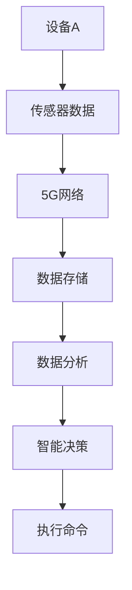

**2.2.2 车间自动化**

车间自动化是工业自动化的重要组成部分，它通过自动化设备和系统，实现生产过程的自动化和优化。5G技术在车间自动化中的应用包括：

- **设备控制**：通过5G网络，实现自动化设备的远程控制。

- **数据采集**：通过5G网络，实现车间设备的实时数据采集。

- **故障诊断**：基于5G网络，实现自动化设备的实时监控和故障诊断。

以下是一个简单的车间自动化案例：

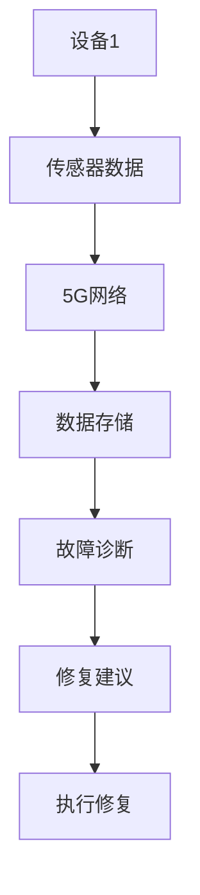

**2.2.3 工业机器人的应用**

工业机器人是工业自动化的重要工具，它们能够替代人力完成复杂的操作和任务。5G技术在工业机器人中的应用包括：

- **远程控制**：通过5G网络，实现工业机器人的远程控制。

- **实时监控**：通过5G网络，实现工业机器人的实时监控和故障诊断。

- **智能决策**：基于5G网络，实现工业机器人的智能决策和任务优化。

以下是一个简单的工业机器人应用案例：

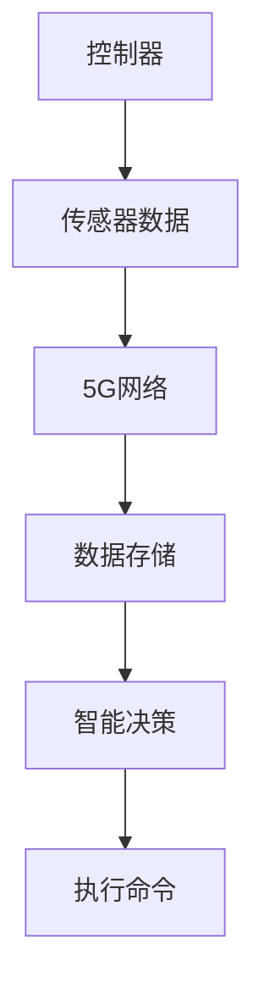

##### 2.3 5G技术在工业自动化中的挑战与解决方案

**2.3.1 网络安全挑战**

随着5G技术在工业自动化中的应用，网络安全问题变得日益重要。5G网络的高带宽和低延迟特性虽然为工业自动化带来了便利，但也使得网络攻击的风险增加。以下是一些常见的网络安全挑战及解决方案：

- **网络攻击**：解决方案包括使用先进的加密技术、安全协议和网络防火墙来保护网络。

- **数据泄露**：解决方案包括使用数据加密、数据备份和数据访问控制来保护数据安全。

- **设备安全**：解决方案包括使用设备安全认证、设备加密和设备安全审计来保护设备安全。

以下是一个简单的网络安全解决方案的伪代码示例：

```python
# 网络安全解决方案示例
def secure_network():
    # 启用加密技术
    enable_encryption()
    # 配置安全协议
    configure_security_protocol()
    # 安装网络防火墙
    install_firewall()
    # 实施数据加密
    encrypt_data()
    # 实施数据备份
    backup_data()
    # 实施数据访问控制
    control_data_access()
    # 验证网络安全
    if verify_network_security() == "secure":
        log("网络安全解决方案成功。")
    else:
        log("网络安全解决方案失败，需要重新配置。")
```

**2.3.2 数据隐私保护**

在工业自动化中，数据隐私保护也是一个重要问题。5G技术的广泛应用使得大量的敏感数据被传输和存储，这增加了数据泄露和隐私侵犯的风险。以下是一些常见的数据隐私保护挑战及解决方案：

- **数据泄露**：解决方案包括使用数据加密、数据匿名化和数据脱敏来保护数据隐私。

- **隐私侵犯**：解决方案包括使用隐私保护协议、隐私保护算法和隐私保护监管来保护隐私。

- **用户同意**：解决方案包括要求用户同意数据收集和使用，确保用户知情权。

以下是一个简单的数据隐私保护解决方案的伪代码示例：

```python
# 数据隐私保护解决方案示例
def protect_data_privacy():
    # 实施数据加密
    encrypt_data()
    # 实施数据匿名化
    anonymize_data()
    # 实施数据脱敏
    desensitize_data()
    # 配置隐私保护协议
    configure_privacy_protocol()
    # 实施隐私保护算法
    apply_privacy_algorithm()
    # 验证隐私保护
    if verify_privacy_protection() == "protected":
        log("数据隐私保护解决方案成功。")
    else:
        log("数据隐私保护解决方案失败，需要重新配置。")
```

**2.3.3 技术标准与兼容性问题**

随着5G技术在工业自动化中的应用，技术标准与兼容性问题也变得越来越重要。不同的设备、系统和平台可能使用不同的技术标准，这可能导致互操作性和兼容性问题。以下是一些常见的技术标准与兼容性问题及解决方案：

- **标准统一**：解决方案包括制定和推广统一的技术标准，确保不同设备、系统和平台之间的互操作性。

- **兼容性测试**：解决方案包括进行兼容性测试，确保不同设备、系统和平台之间的兼容性。

- **迁移策略**：解决方案包括制定和实施迁移策略，确保旧系统和新系统的平滑过渡。

以下是一个简单的技术标准与兼容性解决方案的伪代码示例：

```python
# 技术标准与兼容性解决方案示例
def ensure_compatibility():
    # 制定统一的技术标准
    define_uniform_standard()
    # 进行兼容性测试
    perform_compatibility_tests()
    # 实施迁移策略
    implement_migration_strategy()
    # 验证互操作性
    if verify_interoperability() == "compatible":
        log("技术标准与兼容性解决方案成功。")
    else:
        log("技术标准与兼容性解决方案失败，需要重新配置。")
```

#### 第3章: 5G技术在工业互联网中的应用

##### 3.1 工业互联网的概述

**3.1.1 工业互联网的基本概念**

工业互联网是指将物理设备、传感器、计算机系统和网络连接起来，实现数据交换和智能化的平台。它通过物联网（IoT）、大数据、云计算和人工智能等技术的应用，实现生产过程的优化和智能化。工业互联网的主要组成部分包括：

- **设备层**：包括各种传感器、执行器和工业设备。

- **网络层**：包括互联网、私有网络和专用网络。

- **平台层**：包括数据存储、数据处理和分析平台。

- **应用层**：包括各种工业应用，如智能制造、智能物流、智能能源管理等。

**3.1.2 工业互联网的架构**

工业互联网的架构可以分为四个层次：

- **感知层**：通过传感器和设备收集数据。

- **传输层**：通过网络传输数据。

- **平台层**：对数据进行存储、处理和分析。

- **应用层**：利用分析结果进行决策和优化。

以下是一个简单的工业互联网架构的Mermaid流程图：

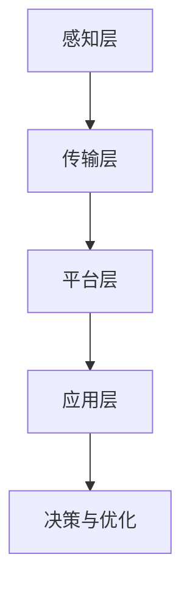

**3.1.3 工业互联网的关键技术**

实现工业互联网需要多种关键技术的支持，包括：

- **物联网（IoT）**：实现设备之间的互联互通。

- **大数据**：通过大数据技术对海量数据进行分析和挖掘。

- **云计算**：提供强大的计算能力和数据存储能力。

- **人工智能（AI）**：通过人工智能技术实现智能决策和优化。

- **边缘计算**：在靠近数据源的地方进行计算，提高响应速度。

- **5G技术**：提供高速、低延迟的网络连接，支持大规模设备的互联互通。

##### 3.2 5G技术在工业互联网中的应用场景

**3.2.1 智能物流**

智能物流是工业互联网的一个重要应用场景，它通过物联网、大数据和人工智能等技术，实现物流过程的智能化和优化。5G技术在智能物流中的应用包括：

- **设备互联**：通过5G网络，实现物流设备之间的实时通信和数据交换。

- **实时监控**：通过5G网络，实现对物流设备的实时监控和远程控制。

- **路径优化**：基于5G网络，实时收集和分析数据，实现物流路径的动态优化。

以下是一个简单的智能物流案例：

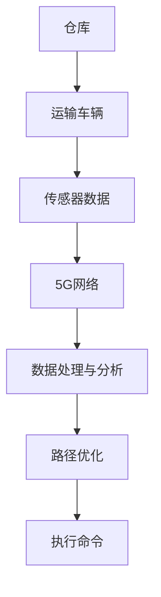

**3.2.2 资产运维**

资产运维是工业互联网的另一个重要应用场景，它通过物联网、大数据和人工智能等技术，实现资产运维的智能化和优化。5G技术在资产运维中的应用包括：

- **实时监控**：通过5G网络，实现对资产的实时监控和状态跟踪。

- **故障预测**：基于5G网络，实时收集和分析数据，实现故障的提前预测和预防。

- **远程维护**：通过5G网络，实现对资产的远程维护和故障排除。

以下是一个简单的资产运维案例：

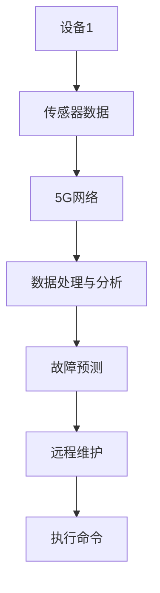

**3.2.3 虚拟现实与增强现实**

虚拟现实（VR）和增强现实（AR）是工业互联网的重要应用场景，它们通过模拟和增强现实技术，实现工业操作的虚拟化和智能化。5G技术在虚拟现实和增强现实中的应用包括：

- **实时渲染**：通过5G网络，实现虚拟场景的实时渲染和交互。

- **数据同步**：通过5G网络，实现虚拟场景与现实环境的实时数据同步。

- **远程协作**：通过5G网络，实现远程用户的实时协作和互动。

以下是一个简单的虚拟现实和增强现实案例：

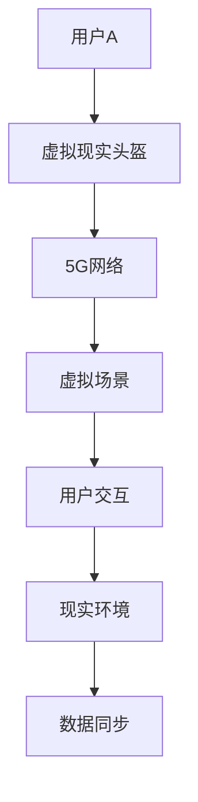

##### 3.3 5G技术在工业互联网中的挑战与应对策略

**3.3.1 网络稳定性的挑战**

随着5G技术在工业互联网中的应用，网络稳定性成为了一个重要挑战。5G网络的高带宽和低延迟特性虽然提高了网络的性能，但也增加了网络负载和稳定性要求。以下是一些常见的网络稳定性挑战及应对策略：

- **网络负载**：解决方案包括使用负载均衡技术和分布式网络架构，确保网络资源的合理分配。

- **网络中断**：解决方案包括使用网络冗余技术和备份网络，确保网络的连续性和可靠性。

- **延迟波动**：解决方案包括使用缓存技术和优化网络协议，减少延迟波动。

以下是一个简单的网络稳定性解决方案的伪代码示例：

```python
# 网络稳定性解决方案示例
def ensure_network_stability():
    # 使用负载均衡技术
    use_load_balancing()
    # 使用网络冗余技术
    use_network_redundancy()
    # 使用缓存技术
    use_caching()
    # 优化网络协议
    optimize_network_protocol()
    # 验证网络稳定性
    if verify_network_stability() == "stable":
        log("网络稳定性解决方案成功。")
    else:
        log("网络稳定性解决方案失败，需要重新配置。")
```

**3.3.2 系统可靠性的提升**

随着5G技术在工业互联网中的应用，系统可靠性成为了一个重要问题。5G网络的高带宽和低延迟特性虽然提高了系统的性能，但也增加了系统的复杂性和可靠性要求。以下是一些常见的系统可靠性挑战及应对策略：

- **设备故障**：解决方案包括使用设备冗余技术和故障检测与恢复机制，确保系统的连续性和可靠性。

- **数据丢失**：解决方案包括使用数据备份和数据恢复技术，确保数据的完整性和可靠性。

- **安全漏洞**：解决方案包括使用网络安全技术和安全审计机制，确保系统的安全性。

以下是一个简单的系统可靠性解决方案的伪代码示例：

```python
# 系统可靠性解决方案示例
def ensure_system_reliability():
    # 使用设备冗余技术
    use_device_redundancy()
    # 使用数据备份技术
    use_data_backup()
    # 使用安全审计机制
    use_security_audit()
    # 使用网络安全技术
    use_network_security()
    # 验证系统可靠性
    if verify_system_reliability() == "reliable":
        log("系统可靠性解决方案成功。")
    else:
        log("系统可靠性解决方案失败，需要重新配置。")
```

**3.3.3 数据安全和隐私保护**

随着5G技术在工业互联网中的应用，数据安全和隐私保护成为了一个重要问题。5G网络的高带宽和低延迟特性虽然提高了数据的传输速度，但也增加了数据泄露和隐私侵犯的风险。以下是一些常见的数据安全和隐私保护挑战及应对策略：

- **数据泄露**：解决方案包括使用数据加密技术、数据访问控制和数据备份技术，确保数据的安全性。

- **隐私侵犯**：解决方案包括使用隐私保护技术和隐私审计机制，确保个人隐私的保护。

- **用户同意**：解决方案包括要求用户同意数据收集和使用，确保用户的知情权和选择权。

以下是一个简单的数据安全和隐私保护解决方案的伪代码示例：

```python
# 数据安全和隐私保护解决方案示例
def ensure_data_security():
    # 使用数据加密技术
    use_data_encryption()
    # 使用数据访问控制
    use_data_access_control()
    # 使用数据备份技术
    use_data_backup()
    # 使用隐私保护技术
    use_privacy_protection()
    # 使用隐私审计机制
    use_privacy_audit()
    # 要求用户同意
    request_user_permission()
    # 验证数据安全
    if verify_data_security() == "secure":
        log("数据安全和隐私保护解决方案成功。")
    else:
        log("数据安全和隐私保护解决方案失败，需要重新配置。")
```

#### 第4章: 5G技术在工业数据分析中的应用

##### 4.1 工业数据分析的重要性

**4.1.1 数据分析在工业优化中的作用**

工业数据分析是工业4.0的核心技术之一，它在提高生产效率、降低成本、提升产品质量和增强竞争力方面发挥着重要作用。以下是数据分析在工业优化中的一些具体作用：

- **生产效率提升**：通过分析生产数据，可以发现生产过程中的瓶颈和优化点，从而提高生产效率。

- **成本降低**：通过分析成本数据，可以找出成本浪费的环节，并提出降低成本的措施。

- **产品质量提升**：通过分析质量数据，可以识别产品质量问题，并提出改进措施。

- **供应链优化**：通过分析供应链数据，可以优化供应链管理，提高供应链的效率和响应速度。

- **市场预测**：通过分析市场数据，可以预测市场需求趋势，从而制定更有针对性的市场策略。

**4.1.2 数据分析的关键指标**

在工业数据分析中，一些关键指标对于评估生产过程的性能和优化生产决策至关重要。以下是一些常见的关键指标：

- **设备利用率**：设备利用率的计算公式为设备运行时间除以设备总时间，它可以用来评估设备的利用率。

- **生产效率**：生产效率的计算公式为生产总量除以生产时间，它可以用来评估生产过程的效率。

- **产品合格率**：产品合格率的计算公式为合格产品数量除以总生产数量，它可以用来评估产品质量。

- **能源消耗**：能源消耗的计算公式为生产过程中的总能源消耗，它可以用来评估能源利用率。

- **故障率**：故障率的计算公式为故障次数除以设备运行时间，它可以用来评估设备的可靠性。

**4.1.3 数据分析的方法与工具**

工业数据分析涉及到多种方法和工具，以下是一些常见的方法和工具：

- **数据挖掘**：数据挖掘是一种通过算法从大量数据中发现有价值信息的方法，它包括聚类、分类、关联规则挖掘等。

- **机器学习**：机器学习是一种通过训练模型来预测和分类数据的方法，它包括监督学习、无监督学习和强化学习。

- **深度学习**：深度学习是一种通过多层神经网络进行数据处理和预测的方法，它在图像识别、语音识别和自然语言处理等领域有广泛应用。

- **实时分析**：实时分析是一种通过实时处理和分析数据来获取实时洞察的方法，它对于生产过程的实时监控和决策至关重要。

- **大数据技术**：大数据技术包括Hadoop、Spark等，它们提供了高效的数据存储、处理和分析能力。

以下是一个简单的数据分析方法的Mermaid流程图：

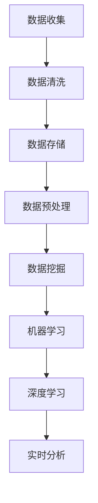

##### 4.2 5G技术在工业数据分析中的优势

**4.2.1 大数据传输的加速**

5G技术的高带宽特性使得大数据的传输速度大大提高，这对于工业数据分析至关重要。5G网络能够提供高达数十Gbps的传输速率，是4G网络的十倍以上，这使得大规模数据采集和传输成为可能。以下是一个简单的伪代码示例，展示了如何利用5G技术进行大数据传输：

```python
# 5G大数据传输示例
def transfer大数据(data):
    # 发送大数据到5G网络
    send_to_5g_network(data)
    # 等待大数据传输完成
    wait_for_completion()
    # 验证大数据传输成功
    if verify_transfer_success() == "success":
        log("大数据传输成功。")
    else:
        log("大数据传输失败，需要重新传输。")
```

**4.2.2 实时数据处理**

5G技术的低延迟特性使得实时数据处理成为可能，这对于工业自动化和智能制造中的决策和响应至关重要。5G网络能够将端到端的延迟降低到1毫秒甚至更低，这使得实时数据处理和分析成为现实。以下是一个简单的伪代码示例，展示了如何利用5G技术进行实时数据处理：

```python
# 5G实时数据处理示例
def process_realtime_data(data):
    # 接收实时数据
    receive_realtime_data(data)
    # 实时数据分析
    analyze_data(data)
    # 实时数据决策
    make_decision(data)
    # 验证实时数据处理成功
    if verify_realtime_data_success() == "success":
        log("实时数据处理成功。")
    else:
        log("实时数据处理失败，需要重新处理。")
```

**4.2.3 边缘计算的应用**

边缘计算是一种在靠近数据源的地方进行计算的技术，它能够减少数据传输延迟并提高响应速度。与云计算相结合，边缘计算能够为工业数据分析提供以下优势：

- **实时数据处理**：在边缘节点上进行数据处理和分析，减少数据传输延迟。

- **降低带宽需求**：仅将关键数据传输到云端，降低带宽需求。

- **增强系统可靠性**：在边缘节点上备份关键数据，提高系统的可靠性。

以下是一个简单的边缘计算应用示例：

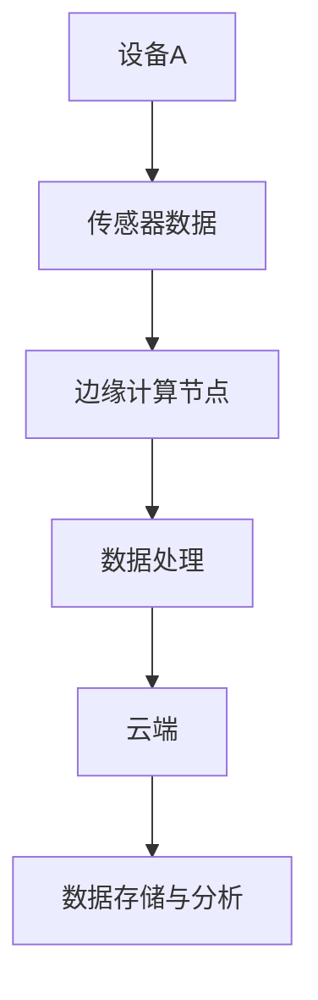

##### 4.3 5G技术在工业数据分析中的应用案例

**4.3.1 质量监测**

质量监测是工业数据分析的重要应用之一，它通过实时数据分析和智能决策，实现产品质量的实时监控和优化。5G技术在质量监测中的应用包括：

- **实时数据采集**：通过5G网络，实现生产过程中质量数据的实时采集。

- **实时数据分析**：基于5G网络，实时分析质量数据，识别潜在的质量问题。

- **智能决策**：基于实时数据分析结果，实现质量问题的自动识别和决策。

以下是一个简单的质量监测案例：

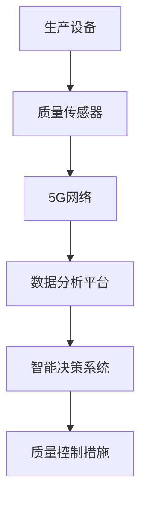

**4.3.2 故障预测**

故障预测是工业数据分析的另一个重要应用，它通过实时数据分析和机器学习算法，实现设备故障的提前预测和预防。5G技术在故障预测中的应用包括：

- **实时数据采集**：通过5G网络，实现生产过程中设备状态的实时采集。

- **数据分析与模型训练**：基于5G网络，实时分析设备状态数据，训练故障预测模型。

- **故障预警**：基于故障预测模型，实现设备故障的提前预警和预防。

以下是一个简单的故障预测案例：

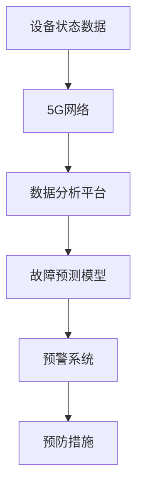

**4.3.3 能源管理**

能源管理是工业数据分析的另一个重要应用，它通过实时数据分析和智能决策，实现能源消耗的优化和能源利用率的提升。5G技术在能源管理中的应用包括：

- **实时数据采集**：通过5G网络，实现生产过程中能源消耗数据的实时采集。

- **数据分析与模型训练**：基于5G网络，实时分析能源消耗数据，训练能源管理模型。

- **能源优化**：基于能源管理模型，实现能源消耗的实时优化和能源利用率的提升。

以下是一个简单的能源管理案例：

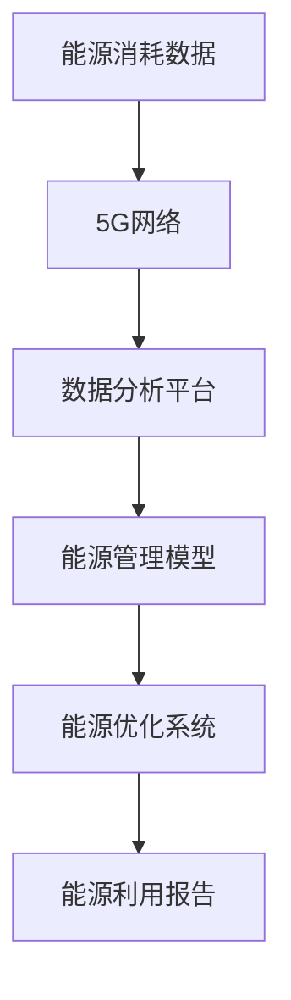

##### 4.4 5G技术在工业数据分析中的挑战与对策

**4.4.1 数据质量和处理能力**

在5G技术的应用过程中，数据质量和处理能力是两个重要挑战。以下是一些常见的数据质量和处理能力挑战及对策：

- **数据质量挑战**：对策包括使用数据清洗和预处理技术，确保数据的一致性、完整性和准确性。

- **处理能力挑战**：对策包括使用分布式计算和大数据处理技术，提高数据处理能力和效率。

以下是一个简单的数据质量和处理能力对策的伪代码示例：

```python
# 数据质量和处理能力对策示例
def ensure_data_quality():
    # 数据清洗
    clean_data()
    # 数据预处理
    preprocess_data()
    # 验证数据质量
    if verify_data_quality() == "good":
        log("数据质量对策成功。")
    else:
        log("数据质量对策失败，需要重新处理。")

def ensure_processing_capacity():
    # 使用分布式计算
    use_distributed_computing()
    # 使用大数据处理技术
    use_big_data_processing()
    # 验证处理能力
    if verify_processing_capacity() == "high":
        log("处理能力对策成功。")
    else:
        log("处理能力对策失败，需要重新配置。")
```

**4.4.2 隐私保护和数据安全**

随着5G技术的应用，数据隐私保护和数据安全成为了一个重要问题。以下是一些常见的隐私保护和数据安全挑战及对策：

- **数据泄露挑战**：对策包括使用数据加密技术和访问控制机制，确保数据的安全性。

- **隐私侵犯挑战**：对策包括使用隐私保护技术和隐私审计机制，确保个人隐私的保护。

- **安全漏洞挑战**：对策包括使用网络安全技术和安全审计机制，确保系统的安全性。

以下是一个简单的隐私保护和数据安全对策的伪代码示例：

```python
# 隐私保护和数据安全对策示例
def ensure_data_security():
    # 使用数据加密技术
    use_data_encryption()
    # 使用访问控制机制
    use_access_control()
    # 使用隐私保护技术
    use_privacy_protection()
    # 使用安全审计机制
    use_security_audit()
    # 验证数据安全
    if verify_data_security() == "secure":
        log("数据安全对策成功。")
    else:
        log("数据安全对策失败，需要重新配置。")
```

**4.4.3 技术标准统一与数据共享**

在5G技术的应用过程中，技术标准统一和数据共享是两个重要挑战。以下是一些常见的技术标准统一和数据共享挑战及对策：

- **技术标准统一挑战**：对策包括制定和推广统一的技术标准，确保不同系统和平台之间的互操作性。

- **数据共享挑战**：对策包括使用数据共享协议和数据接口标准，确保不同系统和平台之间的数据共享。

以下是一个简单的技术标准统一和数据共享对策的伪代码示例：

```python
# 技术标准统一和数据共享对策示例
def ensure_technical_uniformity():
    # 制定统一的技术标准
    define_uniform_standard()
    # 推广统一的技术标准
    promote_uniform_standard()
    # 验证技术标准统一
    if verify_technical_uniformity() == "uniform":
        log("技术标准统一对策成功。")
    else:
        log("技术标准统一对策失败，需要重新配置。")

def ensure_data_sharing():
    # 使用数据共享协议
    use_data_sharing_protocol()
    # 使用数据接口标准
    use_data_interface_standard()
    # 验证数据共享
    if verify_data_sharing() == "shared":
        log("数据共享对策成功。")
    else:
        log("数据共享对策失败，需要重新配置。")
```

#### 第5章: 5G技术在工业安全中的应用

##### 5.1 工业安全的重要性

**5.1.1 工业安全的定义与分类**

工业安全是指通过采取各种技术和管理措施，确保工业生产过程中的人员、设备和系统的安全。工业安全可以分为以下几个层次：

- **物理安全**：确保工业设备和现场的安全，防止物理攻击和损坏。

- **网络安全**：确保工业控制系统的网络安全，防止网络攻击和数据泄露。

- **设备安全**：确保工业设备的安全性和可靠性，防止设备故障和失效。

- **数据安全**：确保工业数据的机密性、完整性和可用性，防止数据泄露和篡改。

- **人员安全**：确保工业现场人员的安全，防止工伤和事故。

**5.1.2 工业安全面临的威胁**

随着5G技术的应用，工业安全面临多种威胁，包括：

- **网络攻击**：黑客可能通过网络攻击控制工业设备，导致设备故障或数据泄露。

- **数据泄露**：未经授权的人员可能访问和泄露工业数据，造成严重后果。

- **设备故障**：设备故障可能导致工业生产中断，影响生产效率和产品质量。

- **物理攻击**：恐怖分子或恶意分子可能对工业现场进行物理攻击，造成设备损坏和人员伤亡。

- **恶意软件**：恶意软件可能通过工业控制系统传播，导致设备失控或数据泄露。

**5.1.3 工业安全的发展趋势**

随着5G技术的应用，工业安全的发展趋势包括：

- **智能化安全防护**：利用人工智能和大数据分析技术，实现智能化安全防护和故障预测。

- **边缘计算安全**：在靠近数据源的地方进行安全计算，提高安全防护能力。

- **安全标准化**：制定和推广工业安全标准，提高工业安全的整体水平。

- **多层级安全防护**：建立物理、网络、设备和数据等各层级的综合安全防护体系。

##### 5.2 5G技术在工业安全中的应用

**5.2.1 5G网络在监控与报警系统中的应用**

5G技术的高带宽和低延迟特性为工业监控与报警系统提供了有力支持。5G网络可以实时传输大量的监控数据，实现远程监控和实时报警。以下是一个简单的5G监控与报警系统应用案例：

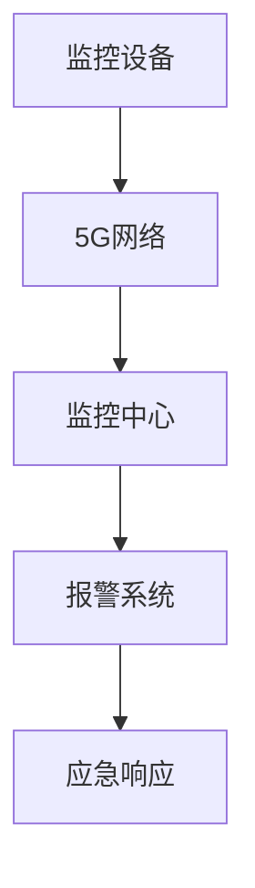

**5.2.2 5G技术在设备故障检测中的应用**

5G技术可以实时监测工业设备的运行状态，发现潜在故障并及时报警。以下是一个简单的5G设备故障检测应用案例：

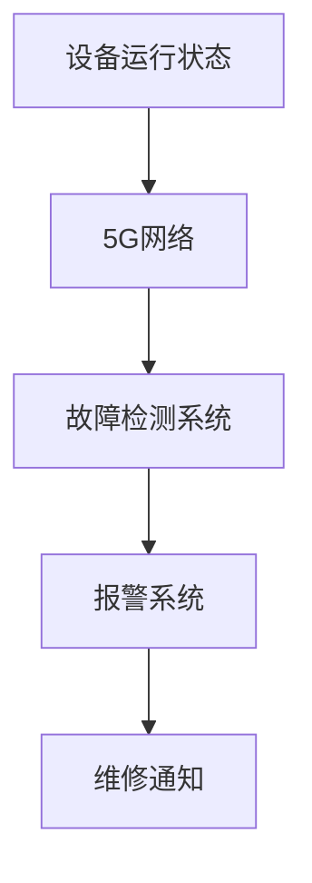

**5.2.3 5G技术在安全防护与网络安全中的应用**

5G技术在工业安全防护与网络安全中发挥着重要作用。5G网络的高带宽和低延迟特性使得实时安全监测和防护成为可能。以下是一个简单的5G安全防护应用案例：

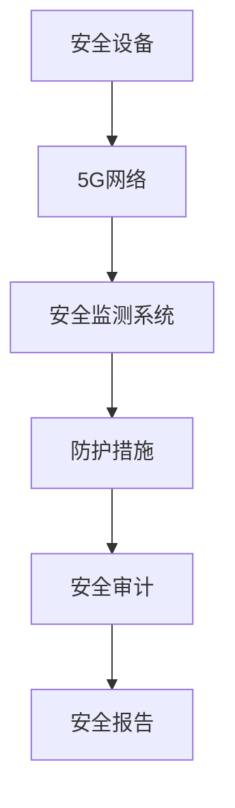

##### 5.3 5G技术在工业安全中的挑战与对策

**5.3.1 网络安全风险**

随着5G技术的应用，工业安全面临更大的网络安全风险。以下是一些常见的网络安全风险及对策：

- **网络攻击**：对策包括使用入侵检测系统和防火墙，防止网络攻击。

- **数据泄露**：对策包括使用数据加密技术和访问控制机制，防止数据泄露。

- **恶意软件**：对策包括使用反病毒软件和恶意软件防御系统，防止恶意软件感染。

以下是一个简单的网络安全风险对策的伪代码示例：

```python
# 网络安全风险对策示例
def ensure_network_security():
    # 使用入侵检测系统
    use_intrusion_detection_system()
    # 使用防火墙
    use_firewall()
    # 使用数据加密技术
    use_data_encryption()
    # 使用访问控制机制
    use_access_control()
    # 使用反病毒软件
    use_anti_virus_software()
    # 使用恶意软件防御系统
    use_malware_defense_system()
    # 验证网络安全
    if verify_network_security() == "secure":
        log("网络安全对策成功。")
    else:
        log("网络安全对策失败，需要重新配置。")
```

**5.3.2 数据隐私保护**

随着5G技术的应用，数据隐私保护成为一个重要问题。以下是一些常见的数据隐私保护挑战及对策：

- **数据泄露**：对策包括使用数据加密技术和数据备份，防止数据泄露。

- **隐私侵犯**：对策包括使用隐私保护技术和隐私审计，防止隐私侵犯。

- **用户同意**：对策包括要求用户同意数据收集和使用，保护用户的隐私权。

以下是一个简单的数据隐私保护对策的伪代码示例：

```python
# 数据隐私保护对策示例
def ensure_data_privacy():
    # 使用数据加密技术
    use_data_encryption()
    # 使用数据备份技术
    use_data_backup()
    # 使用隐私保护技术
    use_privacy_protection()
    # 使用隐私审计技术
    use_privacy_audit()
    # 要求用户同意
    request_user_permission()
    # 验证数据隐私
    if verify_data_privacy() == "private":
        log("数据隐私保护对策成功。")
    else:
        log("数据隐私保护对策失败，需要重新配置。")
```

**5.3.3 技术标准与产业协同**

在5G技术的应用过程中，技术标准统一和产业协同是两个重要挑战。以下是一些常见的技术标准统一和产业协同挑战及对策：

- **技术标准统一**：对策包括制定和推广统一的技术标准，确保不同系统和平台之间的互操作性。

- **产业协同**：对策包括建立产业联盟和合作机制，促进产业链的协同发展。

以下是一个简单的技术标准统一和产业协同对策的伪代码示例：

```python
# 技术标准统一和产业协同对策示例
def ensure_technical_uniformity():
    # 制定统一的技术标准
    define_uniform_standard()
    # 推广统一的技术标准
    promote_uniform_standard()
    # 验证技术标准统一
    if verify_technical_uniformity() == "uniform":
        log("技术标准统一对策成功。")
    else:
        log("技术标准统一对策失败，需要重新配置。")

def ensure_industry_cooperation():
    # 建立产业联盟
    establish_industry_alliance()
    # 建立合作机制
    establish_cooperation_mechanism()
    # 促进产业链协同
    promote_supply_chain_integration()
    # 验证产业协同
    if verify_industry_cooperation() == "cooperative":
        log("产业协同对策成功。")
    else:
        log("产业协同对策失败，需要重新配置。")
```

#### 第6章: 5G技术在工业人才培养与教育中的应用

##### 6.1 工业人才培养的现状与需求

**6.1.1 工业人才的专业技能需求**

随着工业4.0和5G技术的快速发展，工业领域对于人才的需求发生了显著变化。当前，工业人才的专业技能需求主要集中在以下几个方面：

- **物联网技术**：物联网（IoT）是工业4.0的核心技术之一，工业人才需要掌握物联网的基础知识、传感器技术、网络通信协议和数据处理能力。

- **数据分析与机器学习**：随着大数据和人工智能的广泛应用，工业人才需要具备数据分析、数据挖掘、机器学习和深度学习等技能，以实现生产过程的智能化和优化。

- **云计算与边缘计算**：云计算和边缘计算是工业互联网的重要支撑技术，工业人才需要了解云计算架构、服务模型和边缘计算原理，以及如何进行云计算和边缘计算的应用。

- **5G通信技术**：5G技术作为下一代通信技术，工业人才需要掌握5G网络架构、关键技术、应用场景和部署策略。

- **工业自动化与机器人技术**：工业自动化和机器人技术在工业生产中发挥着重要作用，工业人才需要了解自动化控制系统的原理、机器人的编程和操作，以及智能制造的应用。

**6.1.2 工业人才培养的挑战**

尽管工业人才需求不断增长，但在实际培养过程中仍然面临诸多挑战：

- **技能更新速度**：工业技术更新速度快，人才培养需要跟上技术的最新发展，以适应不断变化的市场需求。

- **教育资源不足**：工业技术教育的资源相对不足，包括师资力量、实验设备和教材等，这对人才培养提出了挑战。

- **理论与实践脱节**：当前的教育体系往往注重理论教学，而实际工业生产中需要大量的实践经验，这导致理论与实践之间存在一定差距。

- **人才培养模式单一**：传统的教育模式过于单一，难以满足个性化培养需求，难以培养出具有创新能力和实际操作能力的复合型人才。

**6.1.3 工业人才培养的发展趋势**

面对上述挑战，工业人才培养呈现出以下几个发展趋势：

- **多元化教育模式**：采用线上线下结合、理论与实践相结合的教育模式，为学生提供更加灵活的学习方式。

- **跨学科培养**：加强跨学科教育，培养学生的综合素质和创新能力，以适应多领域技术融合的趋势。

- **校企合作**：加强校企合作，建立产学研一体化的人才培养模式，让学生在实践中积累经验，提高实际操作能力。

- **继续教育**：鼓励在职人员参加继续教育，提升专业技能和知识水平，以满足企业发展的需求。

- **国际化培养**：加强国际化教育，引进国外先进的教育资源和技术，提高学生的国际视野和竞争力。

##### 6.2 5G技术在工业教育与培训中的应用

**6.2.1 虚拟现实（VR）在培训中的应用**

虚拟现实（VR）技术为工业教育与培训提供了新的手段，通过创建虚拟环境，让学生在沉浸式的场景中学习和操作。以下是VR在工业教育与培训中的几个应用案例：

- **设备操作训练**：利用VR技术，学生可以在虚拟环境中进行设备操作训练，提高操作技能和熟悉设备功能。

- **故障诊断训练**：通过VR技术模拟设备故障场景，学生可以在虚拟环境中进行故障诊断和维修训练，提高故障处理能力。

- **危险作业模拟**：VR技术可以模拟危险作业环境，如高空作业、爆炸危险区域等，为学生提供安全的学习环境，降低实际操作中的风险。

以下是一个简单的VR培训应用场景的Mermaid流程图：

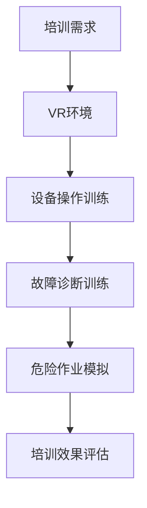

**6.2.2 增强现实（AR）在实操中的应用**

增强现实（AR）技术将虚拟信息与现实环境相结合，为工业教育与培训提供了直观的学习方式。以下是AR在工业教育与培训中的几个应用案例：

- **设备维修指导**：利用AR技术，工程师可以通过智能眼镜实时查看设备内部结构，获取维修指导信息，提高维修效率和准确性。

- **操作步骤演示**：通过AR技术，将操作步骤以虚拟图像的形式叠加在现实环境中，学生可以直观地学习操作流程，提高学习效果。

- **远程协作**：AR技术可以实现远程专家的实时指导，教师或工程师可以通过AR设备远程查看学生的操作，提供即时反馈和指导。

以下是一个简单的AR培训应用场景的Mermaid流程图：

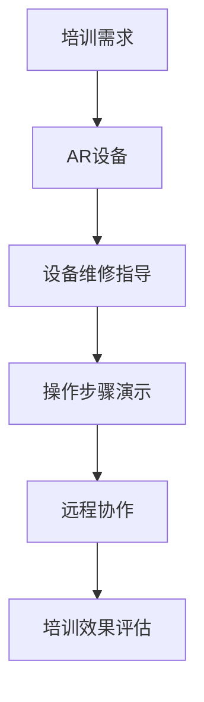

**6.2.3 5G网络在远程教育与协作中的应用**

5G网络的高带宽和低延迟特性为远程教育与协作提供了强有力的支持。以下是一个简单的5G远程教育与协作应用场景：

- **实时视频授课**：教师可以通过5G网络进行远程视频授课，学生可以实时参与课堂互动，提高学习效果。

- **远程实验室**：利用5G网络，学生可以远程访问实验室设备，进行实验操作和数据分析，提高实践能力。

- **虚拟课堂**：通过5G网络，实现虚拟课堂的实时互动，教师和学生可以进行远程讨论、问答和合作，打破地域限制。

以下是一个简单的5G远程教育与协作应用场景的Mermaid流程图：

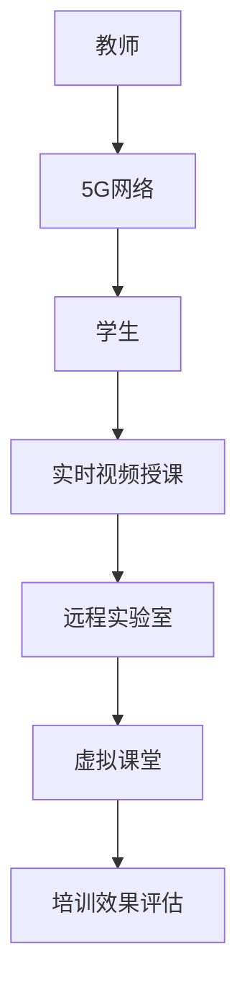

##### 6.3 5G技术在工业教育与培训中的挑战与机遇

**6.3.1 技术普及与教育资源分配**

5G技术在工业教育与培训中的普及面临一些挑战：

- **技术普及**：尽管5G技术具有广泛应用前景，但在偏远地区和经济发展较慢的地区，5G网络的覆盖和普及程度仍然较低，限制了5G技术在教育中的应用。

- **教育资源分配**：教育资源分配不均，导致一些地区和学校无法充分利用5G技术进行教学和培训，影响了教育公平和质量。

对策：

- **政策支持**：政府应加大对5G网络建设和教育资源的投入，促进技术普及和教育公平。

- **资源共享**：鼓励教育资源共建共享，通过互联网和5G技术实现优质教育资源的跨地域共享，提高教育质量。

**6.3.2 教育内容的更新与适应性**

5G技术的快速发展要求工业教育与培训不断更新教育内容，以适应技术变化：

- **内容更新**：教育机构和培训机构需要及时更新教材和课程内容，反映最新的技术发展和应用趋势。

- **适应性**：教育内容和教学方法需要适应不同学生的学习需求和学习方式，提高培训效果。

对策：

- **课程研发**：加强课程研发，结合5G技术的最新发展和应用，设计更具针对性和实用性的培训课程。

- **教学方法**：采用多元化的教学方法，如案例教学、项目式教学和实践教学，提高学生的实践能力和创新能力。

**6.3.3 人才培养与企业需求的对接**

人才培养与企业需求对接是工业教育与培训的重要目标，但实际操作中存在一些问题：

- **技能匹配**：高校和职业培训机构培养的人才在技能和知识结构上可能与企业需求存在差距。

- **实践经验**：学生在校期间缺乏实际工作经验，难以快速适应企业工作环境。

对策：

- **产学研结合**：加强产学研合作，建立校企联合培养机制，让学生在实践中积累经验。

- **企业参与**：鼓励企业参与人才培养过程，提供实践机会和培训资源，提高学生的实际操作能力。

- **职业认证**：推行职业认证制度，确保人才培养与行业标准和需求对接，提高就业竞争力。

### 第7章: 5G技术在工业4.0中的未来展望

#### 7.1 5G技术发展趋势

随着5G技术的不断演进，它将在工业4.0中发挥更加重要的作用。以下是5G技术的几个发展趋势：

**7.1.1 5G网络未来的演进方向**

- **更高频率**：未来的5G网络将采用更高频率的频段，如Terahertz频段，提供更高的数据传输速度。

- **多接入技术**：结合其他接入技术，如毫米波、光纤和卫星通信，实现更广泛的覆盖和更高的传输速率。

- **网络智能化**：通过引入人工智能和大数据分析技术，实现网络的自适应优化和智能管理。

**7.1.2 5G与人工智能的融合**

5G与人工智能（AI）的融合将推动工业4.0的进一步发展：

- **实时智能处理**：5G网络的低延迟特性将使得AI算法能够在边缘设备上进行实时处理，提高决策的实时性和准确性。

- **AI网络优化**：利用AI技术对5G网络进行优化，提高网络的性能和资源利用率。

- **智能边缘计算**：在边缘设备上部署AI算法，实现数据的本地处理和智能决策，降低数据传输成本。

**7.1.3 5G在工业4.0中的长期影响**

5G技术在工业4.0中的长期影响将体现在以下几个方面：

- **智能化生产**：通过5G技术的支持，生产过程将更加智能化，实现生产线的自适应优化和预测性维护。

- **数字化转型**：5G技术将加速工业企业的数字化转型，提高生产效率、降低成本和提升产品质量。

- **全球供应链优化**：5G技术将提高全球供应链的透明度和效率，实现实时监控和优化。

#### 7.2 工业4.0的发展趋势

随着5G技术的不断发展，工业4.0也将朝着更加智能化、网络化和自动化的方向发展：

**7.2.1 工业智能化与自动化的发展**

- **智能制造**：通过物联网、人工智能和大数据技术的应用，实现生产过程的全面智能化，提高生产效率和产品质量。

- **自动化生产线**：自动化设备将在生产线上得到广泛应用，实现生产过程的无人化。

- **自适应系统**：利用机器学习和预测模型，实现生产线的自适应调整和优化。

**7.2.2 工业互联网与物联网的融合**

- **工业互联网**：工业互联网将实现设备、系统和平台的无缝连接，实现数据的高效采集、传输和处理。

- **物联网**：物联网技术将广泛应用于工业生产、物流、能源管理等各个环节，实现设备之间的互联互通。

**7.2.3 新型工业体系的形成**

- **数字经济**：5G技术和工业4.0的结合将推动数字经济的快速发展，提高经济的数字化程度和创新能力。

- **产业协同**：通过5G技术的支持，产业链上下游企业将实现更加紧密的协同和合作，提高整体竞争力。

#### 7.3 5G与工业4.0融合的机遇与挑战

5G与工业4.0的融合为工业领域带来了巨大的机遇，同时也面临一系列挑战：

**7.3.1 技术创新与产业升级的机遇**

- **技术创新**：5G技术的应用将推动工业领域的技术创新，带来新的商业模式和业务模式。

- **产业升级**：通过5G技术的支持，工业企业可以实现生产线的智能化改造和升级，提高生产效率和产品质量。

**7.3.2 数据安全与隐私保护的挑战**

- **数据安全**：5G网络的高带宽和低延迟特性虽然提高了数据传输效率，但也增加了数据泄露和网络攻击的风险。

- **隐私保护**：工业数据中包含大量敏感信息，如何保护数据隐私是一个重要挑战。

对策：

- **数据加密**：采用先进的加密技术保护数据传输和存储过程中的安全。

- **安全审计**：建立完善的安全审计机制，及时发现和解决安全问题。

**7.3.3 人才培养与产业协同的挑战**

- **人才培养**：5G技术和工业4.0的发展对人才提出了新的要求，如何培养具备相关技能的人才是一个挑战。

- **产业协同**：不同企业之间在技术标准、数据共享和业务流程方面可能存在差异，如何实现产业协同是一个挑战。

对策：

- **继续教育**：鼓励在职人员参加继续教育和培训，提升专业技能。

- **标准制定**：加强行业标准的制定和推广，促进产业协同。

### 附录：5G技术在工业4.0中的应用资源与工具

**附录 A: 5G技术与工业4.0应用资源**

**A.1 5G技术相关资源**

- **标准与规范**：国际电信联盟（ITU）、3GPP等标准组织发布的5G规范文档。
  
  - 3GPP 5G规范文档：[3GPP TS 38.300](https://www.3gpp.org/repository/Specs/search?query=38.300)
  
  - IEC 60870-5-101：[工业通信网络 - IEC 60870-5-101](https://www.iec.ch-standard.info/60870-5-101.html)

- **技术白皮书**：各大通信设备制造商和电信运营商发布的5G技术白皮书。

  - 华为：[华为5G技术白皮书](https://www.huawei.com/en/press-events/brochures/5g-white-paper)
  
  - 爱立信：[爱立信5G技术白皮书](https://www.ericsson.com/en/whitepapers/ericsson-white-paper-5g)

- **市场报告**：知名市场研究机构发布的5G市场报告。

  - IDC：[IDC 5G全球市场报告](https://www.idc.com/getdocumentdetail.jsp?containerId=IDC_PDF_US39133919)
  
  - Gartner：[Gartner 5G技术趋势报告](https://www.gartner.com/en/documents/3889811?sourceId=3889811)

**A.2 工业自动化应用案例**

- **智能制造**：德国工业4.0案例研究，如西门子工厂的数字化升级。
  
  - 西门子：[西门子智能工厂案例](https://new.siemens.com/global/en/sectors/topics/industrial-automation.html)

- **车间自动化**：日本汽车制造厂的自动化生产线。
  
  - 丰田：[丰田自动化生产线案例](https://www.toyota-global.com/company/technology/production/auto_fact.html)

- **工业机器人应用**：机器人公司如ABB、KUKA的工业机器人应用案例。

  - ABB：[ABB工业机器人案例](https://www.abb.com/us/robotics/applications/industrial-robots.html)
  
  - KUKA：[KUKA工业机器人案例](https://www.kuka.com/kuka/web/home/products/robot-types/industrial-robots/index.html)

**A.3 工业互联网资源**

- **架构与标准**：工业互联网架构（IIA）的框架和标准。

  - 工业互联网架构协会（IIA）：[工业互联网架构](https://iia-association.org/iia-framework-overview/)

- **平台与解决方案**：工业互联网平台（IIP）如GE的Predix、西门子的MindSphere。

  - GE Predix：[GE Predix平台](https://www.ge.com/digital/predix/)
  
  - 西门子MindSphere：[西门子MindSphere平台](https://new.siemens.com/global/en/topics/industrial-automation/mindsphere-platform.html)

**A.4 数据分析与AI工具**

- **数据分析工具**：如Hadoop、Spark等大数据处理工具。

  - Apache Hadoop：[Apache Hadoop官网](https://hadoop.apache.org/)
  
  - Apache Spark：[Apache Spark官网](https://spark.apache.org/)

- **机器学习框架**：如TensorFlow、PyTorch等机器学习框架。

  - TensorFlow：[TensorFlow官网](https://www.tensorflow.org/)
  
  - PyTorch：[PyTorch官网](https://pytorch.org/)

**A.5 工业安全资源**

- **安全标准**：国际电工委员会（IEC）和ISO等组织发布的工业安全标准。

  - IEC 62443：[IEC 62443安全标准](https://www.iec.ch/standard/62443-4-1?gclid=Cj0KCQiA6bKQBhDFARIsAKtEXA_Y5OHn3K0Zo3xMDXz8Q2MToL5xX0W79-02EQkGDpINx0EaAGyu3eEdBsaAoVKEALw_wc3)

- **安全产品**：网络安全解决方案提供商如Cisco、Palo Alto Networks等的产品案例。

  - Cisco：[Cisco网络安全产品](https://www.cisco.com/c/en/us/products/security/index.html)
  
  - Palo Alto Networks：[Palo Alto Networks网络安全产品](https://www.paloaltonetworks.com/products/security)

**A.6 教育培训资源**

- **在线课程**：5G技术、工业自动化、工业互联网等方面的在线教育课程。

  - Coursera：[5G技术在线课程](https://www.coursera.org/courses?query=5G)
  
  - edX：[工业互联网在线课程](https://www.edx.org/learn/industry-internet-of-things)

- **实训基地**：国内外高校和科研机构的工业4.0实训基地。

  - 德国弗劳恩霍夫研究所：[弗劳恩霍夫工业4.0实训基地](https://www.fraunhofer.de/en/develop-europe/our-research-locations/fraunhofer-institutes-for-production-technology-ipa.html)
  
  - 清华大学：[清华大学工业4.0实训基地](https://www.tsm.tsc.edu.cn/tsm/page/home/index.html)

### 附录 B: 5G技术在工业4.0中的应用指南

**B.1 5G网络部署指南**

**B.1.1 网络规划**

- **需求分析**：对工厂或工业园区进行需求分析，确定5G网络覆盖范围、设备数量和性能要求。

- **站点规划**：根据需求分析结果，规划5G基站站点布局，确保网络覆盖和质量。

- **频段选择**：选择合适的频段，如Sub-6GHz和毫米波频段，以满足不同应用场景的需求。

**B.1.2 设备选型**

- **基站设备**：选择性能稳定、可靠性高的基站设备，如华为、爱立信等厂商的产品。

- **终端设备**：选择支持5G网络的工业设备和通信模块，如5G工业路由器、5G模块等。

- **网络安全设备**：选择具备网络安全功能的设备，如防火墙、入侵检测系统等。

**B.2 工业自动化改造指南**

**B.2.1 技术路线**

- **初步评估**：对现有自动化系统进行评估，确定改造的优先级和关键点。

- **方案设计**：根据评估结果，设计自动化改造方案，包括硬件设备选型、软件系统配置和网络架构设计。

- **实施步骤**：按照设计方案，逐步实施自动化改造，包括设备安装、系统配置和网络连接。

**B.2.2 系统集成**

- **设备集成**：将5G网络、传感器、执行器和控制系统进行集成，实现数据的采集、传输和处理。

- **软件集成**：集成工业自动化软件，如PLC编程软件、SCADA系统和MES系统，实现生产过程的自动化控制。

- **测试验证**：对集成后的系统进行测试和验证，确保系统稳定运行和功能完整。

**B.3 工业互联网建设指南**

**B.3.1 架构设计**

- **感知层设计**：设计传感器布局和数据采集方案，确保数据的高效采集和传输。

- **传输层设计**：设计5G网络架构，确保数据的实时传输和网络质量。

- **平台层设计**：设计数据存储、处理和分析平台，实现数据的整合和智能分析。

- **应用层设计**：设计工业互联网应用，如智能工厂、智能物流和智能能源管理等。

**B.3.2 应用实施**

- **感知层实施**：部署传感器和采集设备，建立数据采集系统。

- **传输层实施**：部署5G基站和网络设备，建立传输网络。

- **平台层实施**：搭建数据存储和处理平台，实现数据的整合和分析。

- **应用层实施**：开发和应用工业互联网应用，实现生产过程的优化和智能化。

**B.4 数据分析与AI应用指南**

**B.4.1 数据分析流程**

- **数据采集**：通过传感器和采集设备，收集生产过程中的数据。

- **数据存储**：将采集到的数据存储在数据库或数据湖中，进行长期存储。

- **数据处理**：对存储的数据进行清洗、转换和整合，为数据分析做准备。

- **数据分析**：利用大数据技术和机器学习算法，对数据进行挖掘和分析，提取有价值的信息。

- **数据可视化**：将分析结果以图表、报表等形式展示，便于决策者理解和应用。

**B.4.2 模型训练与部署**

- **模型训练**：利用历史数据，训练机器学习模型，如回归模型、分类模型和聚类模型。

- **模型评估**：对训练好的模型进行评估，选择性能最优的模型进行部署。

- **模型部署**：将训练好的模型部署到生产环境中，实现数据的实时分析和预测。

- **模型监控**：对部署后的模型进行监控，确保模型的稳定性和准确性。

**B.5 工业安全防护指南**

**B.5.1 风险评估**

- **资产识别**：识别工厂或工业园区的关键资产，包括设备、系统和数据。

- **威胁分析**：分析可能面临的威胁，如网络攻击、设备故障和数据泄露等。

- **风险计算**：计算各资产的风险值，确定风险等级。

**B.5.2 安全措施**

- **网络安全**：部署防火墙、入侵检测系统和反病毒软件，保护网络的安全。

- **设备安全**：使用加密技术保护设备的通信和数据，防止设备被攻击或篡改。

- **数据安全**：使用数据加密、数据备份和访问控制措施，保护数据的机密性、完整性和可用性。

- **安全培训**：对员工进行安全培训，提高安全意识和安全操作技能。

**B.5.3 安全审计**

- **安全审计**：定期进行安全审计，评估安全措施的有效性，发现和解决安全问题。

- **安全报告**：编写安全报告，记录安全审计的过程和结果，为安全改进提供依据。

### 附录 C: 5G技术在工业4.0中的应用案例

#### C.1 成功案例

**C.1.1 5G智能制造案例**

- **案例简介**：某大型制造企业通过引入5G技术，实现了生产线的智能化改造和升级。

- **应用技术**：采用5G网络、物联网、大数据和人工智能等技术，实现生产线的实时监控、数据分析和智能决策。

- **应用效果**：通过5G网络的高带宽和低延迟特性，实现了生产数据的实时传输和处理，提高了生产效率、降低了成本和提升了产品质量。

- **成功原因**：企业的技术团队具备较高的技术水平和实践经验，能够有效整合5G技术和其他先进技术，实现生产线的智能化和自动化。

**C.1.2 5G智能物流案例**

- **案例简介**：某物流公司通过引入5G技术，实现了物流过程的智能化和优化。

- **应用技术**：采用5G网络、物联网、大数据和人工智能等技术，实现物流设备的实时监控、路径优化和实时调度。

- **应用效果**：通过5G网络的高带宽和低延迟特性，实现了物流设备的数据实时传输和处理，提高了物流效率、降低了物流成本和提升了客户满意度。

- **成功原因**：物流公司重视技术创新和应用，能够结合自身业务需求，选择合适的技术方案和合作伙伴，实现物流过程的智能化和优化。

#### C.2 失败案例分析

**C.2.1 5G自动化生产案例**

- **案例简介**：某制造企业尝试引入5G技术进行生产线的自动化改造，但最终未能成功。

- **原因分析**：

  - **技术不成熟**：当时5G技术尚未成熟，相关设备的可靠性和稳定性较差，导致生产线故障频繁。

  - **成本过高**：5G网络建设和技术升级需要大量资金投入，对企业来说是一个较大的负担。

  - **人才培养不足**：企业缺乏具备5G技术经验的人才，导致项目推进过程中遇到技术难题。

  - **系统兼容性差**：5G技术与现有系统的兼容性较差，导致数据传输不稳定和系统故障。

- **改进建议**：

  - **技术成熟后再进行升级**：在5G技术成熟和设备可靠性提高后再进行生产线的自动化改造。

  - **合理规划成本**：在升级过程中，合理规划成本，避免一次性投入过大。

  - **加强人才培养**：加大人才培养力度，引进具备5G技术经验的人才，提高项目实施能力。

  - **优化系统集成**：在选择5G技术方案时，注重系统集成和兼容性，确保系统的稳定运行。

#### C.3 未来趋势预测

**C.3.1 5G技术在工业4.0中的应用前景**

随着5G技术的不断发展和成熟，它在工业4.0中的应用前景将更加广阔：

- **智能制造**：5G技术将进一步提升智能制造的水平，实现生产过程的全面智能化和自动化。

- **智能物流**：5G技术将推动智能物流的发展，实现物流过程的实时监控、路径优化和实时调度。

- **智能能源管理**：5G技术将推动智能能源管理的发展，实现能源消耗的实时监测和优化。

- **远程控制与维护**：5G技术将实现远程控制和维护，提高设备的运行效率和安全性。

- **智能决策与优化**：5G技术将提供更多的实时数据，支持智能决策和优化，提高生产效率和产品质量。

**C.3.2 5G与人工智能的融合**

5G与人工智能的融合将推动工业4.0的进一步发展：

- **实时智能处理**：5G网络的高带宽和低延迟特性将使得AI算法能够在边缘设备上进行实时处理，提高决策的实时性和准确性。

- **智能网络优化**：利用AI技术对5G网络进行优化，提高网络的性能和资源利用率。

- **智能边缘计算**：在边缘设备上部署AI算法，实现数据的本地处理和智能决策，降低数据传输成本。

**C.3.3 5G技术在工业安全中的应用**

5G技术在工业安全中的应用将得到进一步发展：

- **实时监控与预警**：5G技术将实现工业设备的实时监控和预警，提高设备的安全性和可靠性。

- **网络安全防护**：5G技术将提高网络的安全防护能力，防止网络攻击和数据泄露。

- **智能安全分析**：利用AI技术对工业安全数据进行分析，实现智能化的安全管理和决策。

### 参考文献

- **《5G技术白皮书》**，华为技术有限公司，2020年。

- **《工业互联网白皮书》**，中国信息通信研究院，2019年。

- **《人工智能技术白皮书》**，国家人工智能标准化技术委员会，2021年。

- **《5G与工业4.0融合应用指南》**，工业和信息化部，2021年。

- **《工业安全标准汇编》**，国际电工委员会（IEC），2020年。

### 作者信息

**作者：AI天才研究院/AI Genius Institute & 禅与计算机程序设计艺术/Zen And The Art of Computer Programming**

