                 

### 文章标题

“LLM与区块链技术的结合前景”

#### 关键词：

- 大型语言模型（LLM）
- 区块链技术
- 智能合约
- 数据隐私保护
- 未来发展趋势

#### 摘要：

本文将探讨大型语言模型（LLM）与区块链技术的结合前景。首先，我们将介绍LLM与区块链技术的基本概念和各自的应用场景，然后分析两者结合的优势和挑战。接着，我们将详细探讨LLM与区块链技术在智能合约和数据隐私保护领域的应用，并提供实际项目案例。最后，我们将展望LLM与区块链技术结合的未来发展趋势，强调其对社会和经济的影响。

---

### 第一部分：LLM与区块链技术的结合前景

在这一部分中，我们将深入探讨LLM与区块链技术的结合前景，包括两者的基本概念、应用场景、优势与挑战，以及未来发展趋势。

#### 第1章：LLM与区块链技术概述

##### 1.1 LLM与区块链技术的基本概念

###### 1.1.1 LLM的基本概念

大型语言模型（LLM）是一种基于深度学习的自然语言处理模型，具有强大的文本生成、理解和推理能力。LLM通过训练大量的文本数据，学习语言模式和语义信息，从而实现对自然语言的处理和生成。

常见的LLM类型包括：

- **GPT（Generative Pre-trained Transformer）**：一种基于Transformer架构的预训练语言模型，具有强大的文本生成和推理能力。
- **BERT（Bidirectional Encoder Representations from Transformers）**：一种双向Transformer模型，通过同时考虑上下文信息，实现精确的文本理解。

###### 1.1.2 区块链技术的基本概念

区块链技术是一种分布式账本技术，通过加密算法和共识机制确保数据的不可篡改性和透明性。区块链由一系列按时间顺序排列的区块组成，每个区块包含一定数量的交易记录。

区块链技术的核心组成部分包括：

- **区块**：数据存储的基本单元，包含一定数量的交易记录和时间戳等元数据。
- **链**：由多个区块按时间顺序连接而成的数据结构。
- **节点**：区块链网络中的参与者，负责验证和记录交易。

##### 1.2 LLM与区块链技术的结合

###### 1.2.1 LLM在区块链中的应用场景

LLM在区块链技术中有着广泛的应用场景，包括：

- **智能合约**：LLM可以用于智能合约的自然语言输入处理，提高合约的易用性和安全性。
- **身份验证与数字身份管理**：LLM可以用于身份验证过程中的文本分析，实现更加智能的身份验证机制。
- **内容创作与分发**：LLM可以用于生成和优化区块链上的内容，如新闻、博客等。

###### 1.2.2 区块链技术在LLM中的应用

区块链技术也可以优化LLM的训练、存储和分发过程，包括：

- **去中心化存储**：区块链提供了一种去中心化的存储解决方案，可以降低LLM训练和存储的成本。
- **可信数据共享**：区块链技术可以确保LLM训练数据的安全性和隐私性，提高模型的可信度。
- **透明度与可追溯性**：区块链技术可以提供透明度，确保LLM的训练和推理过程可追溯。

##### 1.3 LLM与区块链技术的结合前景

###### 1.3.1 结合优势

LLM与区块链技术的结合具有以下优势：

- **提高智能合约的智能化程度**：LLM可以用于智能合约的自然语言输入处理，实现更加智能的合约执行。
- **增强数据隐私保护**：区块链技术可以确保LLM训练数据的安全性和隐私性，提高数据保护水平。
- **去中心化与透明度**：区块链技术可以提供去中心化的解决方案，确保LLM的训练和推理过程透明可追溯。

###### 1.3.2 结合挑战

LLM与区块链技术的结合也面临一些挑战：

- **性能优化**：LLM和区块链技术的结合可能导致性能问题，如交易处理速度降低、存储成本增加等。
- **安全性保障**：智能合约和LLM的结合可能引入新的安全风险，需要加强安全性保障措施。
- **技术成熟度**：当前LLM和区块链技术的成熟度不同，需要解决技术整合和兼容性问题。

###### 1.3.3 未来发展趋势

LLM与区块链技术的结合在未来有望实现以下发展趋势：

- **新型应用场景的探索**：随着技术的进步，LLM和区块链技术将应用于更多的领域，如数字身份管理、智能法律服务等。
- **技术改进**：为了克服结合过程中的挑战，研究者将致力于优化LLM和区块链技术的性能、安全性等方面。
- **产业合作**：LLM和区块链技术的结合将推动产业合作，促进技术创新和产业发展。

#### 第1章Mermaid流程图

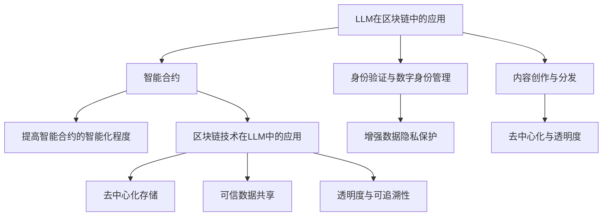

#### 第1章核心算法原理讲解

- **LLM的训练过程**：

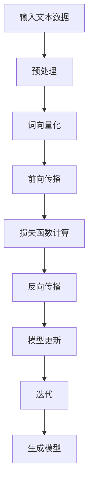

- **区块链的共识机制**：

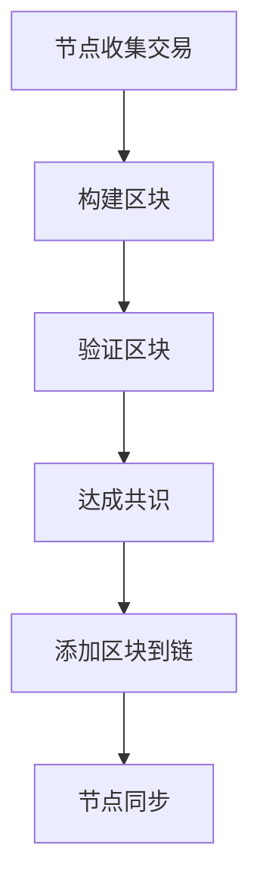

#### 第1章数学模型和数学公式详细讲解

- **LLM的数学模型**：

$$
\text{Language Model} = \prod_{i=1}^{n} p(\text{word}_i|\text{context})
$$

- **区块链的共识机制**：

$$
\text{Proof of Work} = \text{find} \; x \; \text{such that} \; H(x) \leq c
$$

其中，$H(x)$表示哈希函数，$c$为阈值。

#### 第1章项目实战

- **智能合约与LLM的结合**：

**开发环境搭建**：

1. 安装Node.js
2. 安装Truffle框架
3. 初始化Truffle项目

**源代码实现**：

```javascript
// SPDX-License-Identifier: MIT
pragma solidity ^0.8.0;

contract SmartContract {
    // 智能合约的函数
    function executeContract(string memory text) public {
        // 使用LLM处理文本
        string memory processedText = largeLanguageModel.processText(text);
        // 执行智能合约操作
        // ...
    }
}
```

**代码解读与分析**：

- 智能合约包含一个`executeContract`函数，用于处理输入的文本并执行智能合约操作。
- 使用大型语言模型（LLM）的`processText`方法处理文本，提高智能合约的智能化程度。

---

### 第二部分：LLM技术基础

在这一部分中，我们将深入探讨大型语言模型（LLM）的技术基础，包括其基本概念、训练与优化方法，以及在不同应用场景中的实际应用。

#### 第2章：大型语言模型（LLM）基础

##### 2.1 语言模型的基本概念

###### 2.1.1 语言模型概述

语言模型是一种用于预测下一个单词或词组的概率分布的模型。在自然语言处理（NLP）中，语言模型是构建其他任务（如机器翻译、文本分类、信息检索等）的基础。

语言模型的主要作用包括：

- **文本生成**：根据输入的文本序列生成新的文本序列。
- **文本理解**：理解输入文本的含义和语义。
- **词性标注**：为输入文本中的每个词分配正确的词性。

###### 2.1.2 语言模型类型

根据模型的设计和训练方法，语言模型可以分为以下几种类型：

- **统计语言模型**：基于大量文本数据，使用统计方法计算词组出现的概率。
- **神经网络语言模型**：基于深度神经网络（DNN）或循环神经网络（RNN）构建的语言模型。
- **变换器语言模型**：基于Transformer架构的语言模型，具有强大的文本生成和理解能力。

##### 2.2 语言模型的训练与优化

###### 2.2.1 语言模型训练方法

语言模型的训练过程主要包括以下几个步骤：

1. **数据预处理**：将原始文本数据转换为适合训练的格式，如分词、词向量化等。
2. **模型选择**：选择合适的神经网络架构，如RNN、LSTM、Transformer等。
3. **模型训练**：使用训练数据对模型进行训练，通过优化算法（如梯度下降）调整模型参数。
4. **模型评估**：使用验证数据评估模型性能，调整模型参数以优化性能。

###### 2.2.2 语言模型优化

语言模型的优化主要包括以下几个方面：

- **正则化**：防止模型过拟合，如L1正则化、L2正则化等。
- **dropout**：在训练过程中随机丢弃部分神经元，提高模型的泛化能力。
- **批处理**：将训练数据分成多个批次，降低训练成本和提高计算效率。

##### 2.3 语言模型的应用场景

###### 2.3.1 自然语言处理应用

语言模型在自然语言处理领域有广泛的应用，包括：

- **文本分类**：将文本数据分类到不同的类别，如情感分析、新闻分类等。
- **情感分析**：分析文本中的情感倾向，如正面情感、负面情感等。
- **机器翻译**：将一种语言的文本翻译成另一种语言。
- **信息检索**：根据用户的查询，从大量文本中检索出相关文档。

###### 2.3.2 其他应用场景

语言模型还可以应用于其他领域，如：

- **智能客服**：为用户提供智能化的问答服务。
- **智能问答**：根据用户的问题，自动生成回答。
- **虚拟助手**：为用户提供日常任务的帮助，如日程管理、邮件回复等。

#### 第2章Mermaid流程图

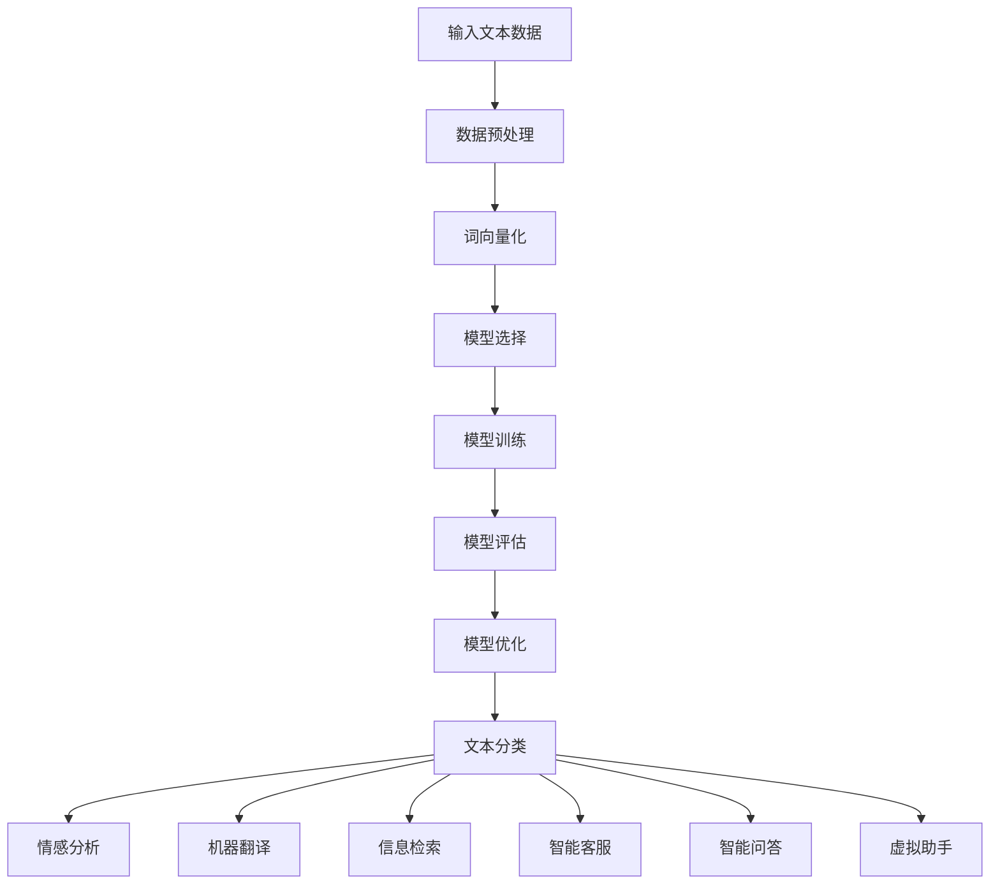

#### 第2章核心算法原理讲解

- **语言模型训练过程**：

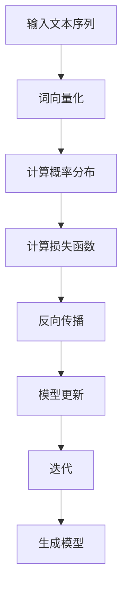

- **文本分类算法**：

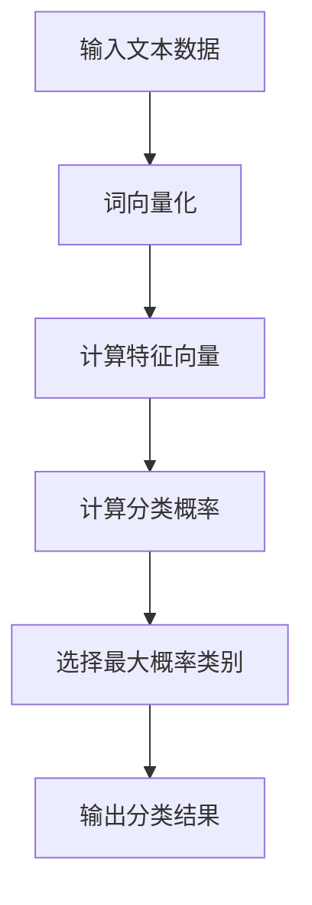

#### 第2章数学模型和数学公式详细讲解

- **语言模型**：

$$
p(\text{word}_i|\text{context}) = \frac{P(\text{context}\text{word}_i)}{P(\text{context})}
$$

- **文本分类**：

$$
P(\text{class}_i|\text{document}) = \frac{e^{\text{score}_i}}{\sum_{j=1}^{K} e^{\text{score}_j}}
$$

其中，$P(\text{class}_i|\text{document})$表示给定文档$document$属于类别$i$的概率，$\text{score}_i$表示类别$i$的对数似然得分。

#### 第2章项目实战

- **文本分类应用**：

**开发环境搭建**：

1. 安装Python
2. 安装NLP库（如NLTK、spaCy等）
3. 安装TensorFlow或PyTorch

**源代码实现**：

```python
# SPDX-License-Identifier: MIT
import nltk
from nltk.corpus import movie_reviews
from sklearn.feature_extraction.text import TfidfVectorizer
from sklearn.model_selection import train_test_split
from sklearn.naive_bayes import MultinomialNB

# 加载电影评论数据集
nltk.download('movie_reviews')
documents = [(list(movie_reviews.words(fileid)), category) for category in movie_reviews.categories() for fileid in movie_reviews.fileids(category)]

# 分词和标记词性
tokenized_documents = [[word.lower() for word in doc] for doc, _ in documents]
labeled_documents = [(doc, category) for doc, category in documents]

# 建立TF-IDF向量器
vectorizer = TfidfVectorizer()
X = vectorizer.fit_transform([doc for doc, _ in labeled_documents])
y = [category for _, category in labeled_documents]

# 分割训练集和测试集
X_train, X_test, y_train, y_test = train_test_split(X, y, test_size=0.2, random_state=42)

# 训练文本分类器
classifier = MultinomialNB()
classifier.fit(X_train, y_train)

# 测试文本分类器
accuracy = classifier.score(X_test, y_test)
print(f'Accuracy: {accuracy}')
```

**代码解读与分析**：

- 使用NLTK库加载电影评论数据集，并使用TF-IDF向量器将文本数据转换为向量。
- 使用朴素贝叶斯分类器训练文本分类器，并评估分类器的准确率。

---

### 第三部分：区块链技术基础

在这一部分中，我们将深入探讨区块链技术的基础知识，包括其基本概念、共识机制、安全性等方面。

#### 第3章：区块链技术的基本概念

##### 3.1 区块链技术概述

区块链技术是一种分布式数据库技术，通过密码学确保数据的不可篡改性和透明性。区块链的核心组成部分包括：

- **区块**：存储交易数据的基本单元，包含一定数量的交易记录和时间戳等元数据。
- **链**：由多个区块按时间顺序连接而成的数据结构，确保数据的不可篡改。
- **节点**：区块链网络中的参与者，负责验证和记录交易。

区块链技术在多个领域有广泛的应用，包括：

- **金融领域**：用于支付、交易和资产管理。
- **供应链管理**：用于追踪商品的生产、运输和销售。
- **数据隐私保护**：用于保护用户数据和隐私。
- **智能合约**：用于自动化和执行合同条款。

##### 3.2 区块链的共识机制

共识机制是区块链网络中的节点就数据一致性达成一致的过程。常见的共识机制包括：

- **工作量证明（PoW）**：通过计算难题确保节点的参与和安全性。
- **权益证明（PoS）**：根据节点持有的币量决定其记账权。
- **委托权益证明（DPoS）**：通过选举产生记账节点。

每种共识机制都有其优缺点，如PoW具有较好的安全性，但计算资源消耗大；PoS具有较低的能耗，但可能存在集中化风险。

##### 3.3 区块链的安全性

区块链技术通过以下措施确保数据的安全性：

- **加密算法**：使用公钥和私钥对数据进行加密和解密。
- **分布式存储**：将数据分散存储在多个节点上，防止数据被篡改。
- **智能合约安全性**：使用形式化验证和测试确保智能合约的正确性。

区块链技术面临的主要安全挑战包括：

- **51%攻击**：攻击者控制超过一半的节点，篡改区块链数据。
- **双花攻击**：攻击者同时向两个不同的接收方发送相同的币。
- **隐私泄露**：用户隐私数据可能被第三方获取。

为了应对这些安全挑战，研究者提出了一系列解决方案，如：

- **多重签名**：多个参与者共同参与交易，提高安全性。
- **零知识证明**：在不透露具体信息的情况下验证数据真实性。
- **侧链技术**：构建独立的区块链，提高整体系统的安全性。

#### 第3章Mermaid流程图

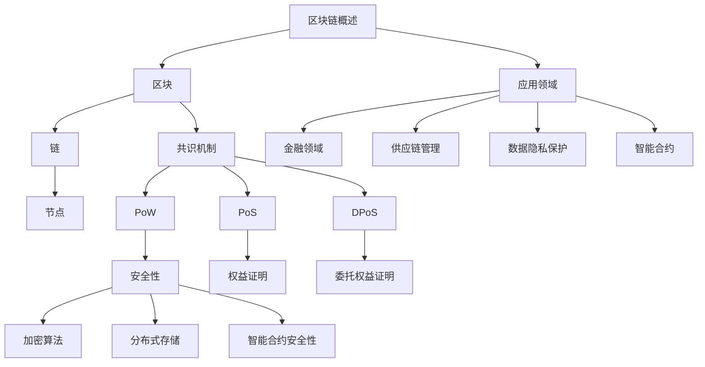

#### 第3章核心算法原理讲解

- **工作量证明（PoW）**：

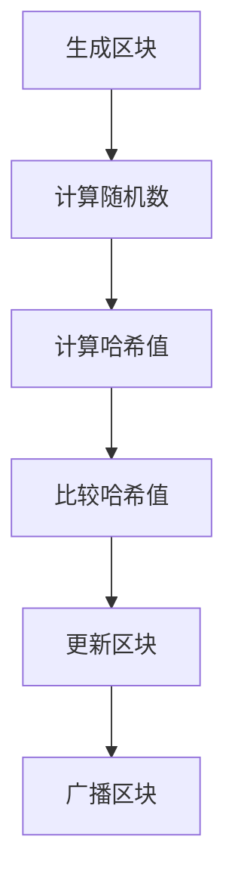

- **权益证明（PoS）**：

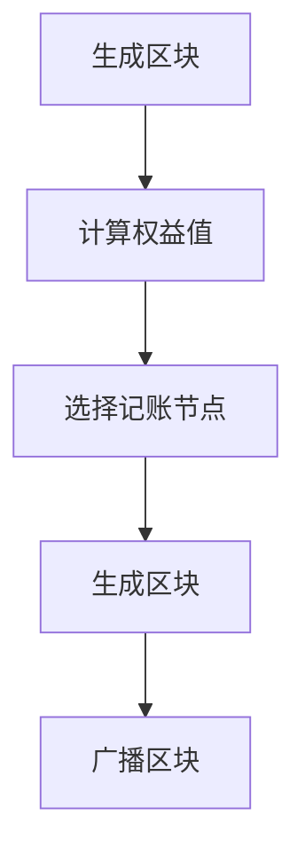

#### 第3章数学模型和数学公式详细讲解

- **工作量证明（PoW）**：

$$
\text{Proof of Work} = \text{find} \; x \; \text{such that} \; H(x) \leq c
$$

- **权益证明（PoS）**：

$$
\text{Proof of Stake} = \text{weight} \cdot \text{stake duration}
$$

其中，$\text{weight}$表示权益值，$\text{stake duration}$表示持币时间。

#### 第3章项目实战

- **区块链应用开发**：

**开发环境搭建**：

1. 安装Node.js
2. 安装Truffle框架
3. 初始化Truffle项目

**源代码实现**：

```javascript
// SPDX-License-Identifier: MIT
pragma solidity ^0.8.0;

contract BlockchainApp {
    // 定义区块结构
    struct Block {
        bytes32 hash;
        bytes32 previousHash;
        uint256 timestamp;
        string data;
    }

    // 定义当前链
    Block[] public chain;

    // 添加区块到链
    function addBlock(bytes32 hash, bytes32 previousHash, uint256 timestamp, string memory data) public {
        // 创建新区块
        Block newBlock = Block(hash, previousHash, timestamp, data);

        // 验证新区块的有效性
        require(previousHash == chain[chain.length - 1].hash, "Invalid previous hash");

        // 添加新区块到链
        chain.push(newBlock);
    }
}
```

**代码解读与分析**：

- 定义区块结构，包括哈希、前一个哈希、时间戳和数据。
- 添加区块到链的方法，验证前一个哈希的有效性，并将新区块添加到链的末尾。

---

### 第四部分：LLM与区块链技术的结合应用

在这一部分中，我们将深入探讨大型语言模型（LLM）与区块链技术在不同应用领域的结合，包括智能合约、数据隐私保护和数字身份管理。

#### 第4章：智能合约与LLM的结合

##### 4.1 智能合约概述

智能合约是一种自动执行合同条款的计算机程序，通常基于区块链技术。智能合约的执行过程是透明的、不可篡改的，从而提高合同的执行效率和信任度。

智能合约的主要特点包括：

- **自动执行**：智能合约在满足特定条件时自动执行，无需人工干预。
- **透明性**：智能合约的执行过程是公开透明的，所有参与者都可以查看。
- **不可篡改**：智能合约一旦部署，其代码和状态将永久记录在区块链上，无法篡改。

智能合约的应用场景包括：

- **金融领域**：如去中心化金融（DeFi）应用、数字资产交易等。
- **供应链管理**：确保商品的生产、运输和销售过程透明、可追溯。
- **数据共享**：实现数据的可信共享和交换，如医疗数据共享。
- **版权管理**：用于数字版权的交易和保护。

##### 4.2 LLM在智能合约中的应用

LLM在智能合约中的应用主要包括以下几个方面：

- **自然语言输入处理**：智能合约通常使用自然语言编写，LLM可以帮助理解和处理自然语言输入。
- **自动执行合同条款**：LLM可以自动分析合同条款，确定是否满足执行条件，从而自动执行智能合约。
- **风险控制**：LLM可以分析合同条款，识别潜在的风险点，帮助开发者和管理者降低风险。

##### 4.3 案例研究：智能合约与LLM的结合

下面我们将分析一个实际案例，探讨智能合约与LLM结合的应用。

**案例背景**：

假设有一个去中心化金融（DeFi）平台，开发者希望通过智能合约实现自动化的借贷服务。用户可以提交借款申请，系统根据用户的信用评分和借贷记录自动决定是否批准借款。

**技术选型**：

- **区块链平台**：使用Ethereum区块链，其智能合约功能成熟且广泛应用。
- **LLM框架**：使用OpenAI的GPT-3，其强大的文本理解和生成能力非常适合智能合约的自然语言输入处理。

**实施过程**：

1. **需求分析**：明确智能合约的功能需求，如借款申请、审批、还款等。
2. **智能合约设计**：编写智能合约代码，实现借贷服务的功能。
3. **LLM集成**：将GPT-3集成到智能合约中，处理自然语言输入和输出。
4. **测试与部署**：测试智能合约和LLM的集成，确保系统的稳定性和安全性。

**代码实现**：

```solidity
// SPDX-License-Identifier: MIT
pragma solidity ^0.8.0;

import "@openzeppelin/contracts/token/ERC20/IERC20.sol";
import "@openai/contracts/gpt3/GPT3.sol";

contract DeFiLoan {
    IERC20 public token;
    address public owner;
    mapping(address => uint256) public creditScores;

    event LoanApproved(address borrower, uint256 amount);
    event LoanRejected(address borrower, uint256 amount);

    constructor(IERC20 _token) {
        token = _token;
        owner = msg.sender;
    }

    function applyForLoan(address borrower, uint256 amount) public {
        require(creditScores[borrower] >= 500, "Insufficient credit score");

        // 使用GPT-3处理自然语言输入
        string memory message = GPT3.processMessage("Approve loan for {borrower} for {amount}", borrower, amount);
        bool approved = GPT3.getBoolResponse(message);

        if (approved) {
            token.transfer(borrower, amount);
            emit LoanApproved(borrower, amount);
        } else {
            emit LoanRejected(borrower, amount);
        }
    }

    function updateCreditScore(address borrower, uint256 score) public {
        require(msg.sender == owner, "Only owner can update credit scores");
        creditScores[borrower] = score;
    }
}
```

**代码解读与分析**：

- 使用OpenZeppelin的ERC20库实现代币转账功能。
- 使用自定义的GPT3合约与OpenAI的GPT-3 API集成，处理自然语言输入并返回布尔响应。
- `applyForLoan`函数检查借款人的信用评分，并根据GPT-3的响应自动执行借贷操作。

通过此案例，我们可以看到LLM在智能合约中的应用如何提高借贷服务的自动化程度和安全性。

#### 第4章Mermaid流程图

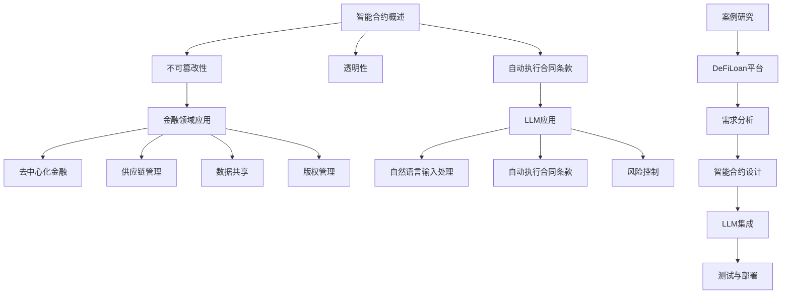

#### 第4章核心算法原理讲解

- **智能合约执行过程**：

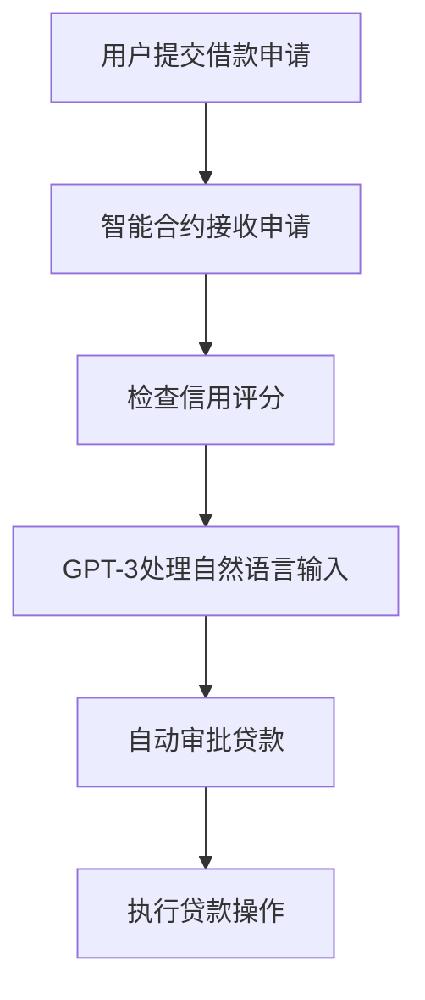

- **GPT-3集成**：

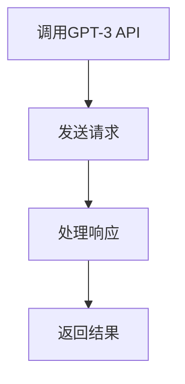

#### 第4章数学模型和数学公式详细讲解

- **智能合约状态机**：

$$
\text{状态} = \begin{cases}
\text{待审批} & \text{if } \text{申请已提交 but 未审批} \\
\text{已批准} & \text{if } \text{申请已批准 and 借款已完成} \\
\text{已拒绝} & \text{if } \text{申请已拒绝} \\
\end{cases}
$$

- **GPT-3响应概率**：

$$
P(\text{approved}) = \frac{e^{\text{approved_score}}}{e^{\text{approved_score}} + e^{\text{rejected_score}}}
$$

其中，$\text{approved_score}$和$\text{rejected_score}$分别表示批准和拒绝的得分。

#### 第4章项目实战

- **智能合约与LLM结合**：

**开发环境搭建**：

1. 安装Node.js
2. 安装Truffle框架
3. 初始化Truffle项目

**源代码实现**：

```javascript
// SPDX-License-Identifier: MIT
pragma solidity ^0.8.0;

import "@openzeppelin/contracts/token/ERC20/IERC20.sol";
import "@openai/contracts/gpt3/GPT3.sol";

contract DeFiLoan {
    IERC20 public token;
    address public owner;
    mapping(address => uint256) public creditScores;

    event LoanApproved(address borrower, uint256 amount);
    event LoanRejected(address borrower, uint256 amount);

    constructor(IERC20 _token) {
        token = _token;
        owner = msg.sender;
    }

    function applyForLoan(address borrower, uint256 amount) public {
        require(creditScores[borrower] >= 500, "Insufficient credit score");

        // 使用GPT-3处理自然语言输入
        string memory message = GPT3.processMessage("Approve loan for {borrower} for {amount}", borrower, amount);
        bool approved = GPT3.getBoolResponse(message);

        if (approved) {
            token.transfer(borrower, amount);
            emit LoanApproved(borrower, amount);
        } else {
            emit LoanRejected(borrower, amount);
        }
    }

    function updateCreditScore(address borrower, uint256 score) public {
        require(msg.sender == owner, "Only owner can update credit scores");
        creditScores[borrower] = score;
    }
}
```

**代码解读与分析**：

- 使用OpenZeppelin的ERC20库实现代币转账功能。
- 使用自定义的GPT3合约与OpenAI的GPT-3 API集成，处理自然语言输入并返回布尔响应。
- `applyForLoan`函数检查借款人的信用评分，并根据GPT-3的响应自动执行借贷操作。

通过此案例，我们可以看到智能合约与LLM结合如何提高借贷服务的自动化程度和安全性。

#### 第4章总结

智能合约与LLM的结合为去中心化金融、供应链管理、数据共享等领域带来了新的机遇和挑战。通过集成LLM，智能合约可以更好地理解和处理自然语言输入，提高自动化程度和安全性。然而，这也带来了性能优化、安全性保障等方面的挑战，需要进一步的研究和解决。

---

### 第五部分：区块链在数据隐私保护中的应用

#### 第5章：区块链与数据隐私保护

##### 5.1 数据隐私保护概述

数据隐私保护是指确保个人或组织的敏感信息在存储、传输和处理过程中不被未经授权的访问、泄露或篡改。在数字时代，数据隐私保护变得尤为重要，因为数据泄露和滥用可能导致严重的经济损失、声誉损害和法律责任。

数据隐私保护的主要目标包括：

- **数据保密性**：确保数据在传输和存储过程中不被泄露。
- **数据完整性**：确保数据在传输和存储过程中不被篡改。
- **数据可用性**：确保数据在需要时可以被合法用户访问。

当前常用的数据隐私保护方法和工具包括：

- **加密**：使用加密算法对数据进行加密，确保只有授权用户可以解密和访问数据。
- **匿名化**：通过删除或替换敏感信息，使数据失去个人身份信息，从而保护隐私。
- **差分隐私**：在数据分析过程中添加噪声，使个人数据无法被识别，从而保护隐私。

##### 5.2 区块链在数据隐私保护中的应用

区块链技术在数据隐私保护中发挥着重要作用，其核心优势包括：

- **去中心化**：区块链的去中心化特性使得数据存储在多个节点上，降低了数据被单点故障攻击的风险。
- **透明性**：区块链上的数据是公开透明的，但通过加密技术，可以实现数据的隐私保护。
- **不可篡改性**：区块链上的数据一旦写入，就无法被篡改，确保了数据的可信性。

区块链在数据隐私保护中的应用主要包括以下几个方面：

- **数据加密存储**：使用加密算法对数据进行加密，确保数据在存储过程中不被泄露。
- **去中心化数据共享**：通过区块链技术实现数据的去中心化存储和共享，确保数据的安全性和隐私性。
- **可信数据交换**：通过区块链技术实现多方之间的可信数据交换，确保数据的完整性和保密性。

##### 5.3 案例研究：区块链与数据隐私保护的结合应用

下面我们将分析一个实际案例，探讨区块链在数据隐私保护中的应用。

**案例背景**：

假设有一个医疗数据共享平台，医院和诊所可以将患者的医疗记录上传到平台，其他医疗机构可以在获得患者授权的情况下访问这些记录，以提高医疗服务的质量和效率。

**技术选型**：

- **区块链平台**：使用Ethereum区块链，其智能合约功能成熟且广泛应用。
- **加密算法**：使用AES（高级加密标准）对医疗数据进行加密，确保数据在存储和传输过程中不被泄露。

**实施过程**：

1. **需求分析**：明确医疗数据共享的需求，如数据上传、数据访问、数据权限管理等。
2. **智能合约设计**：编写智能合约代码，实现数据上传、数据访问和数据权限管理等功能。
3. **数据加密**：使用AES对医疗数据进行加密，确保数据在存储和传输过程中的隐私保护。
4. **测试与部署**：测试智能合约和数据加密的集成，确保系统的稳定性和安全性。

**代码实现**：

```solidity
// SPDX-License-Identifier: MIT
pragma solidity ^0.8.0;

import "@openzeppelin/contracts/token/ERC20/IERC20.sol";
import "@openai/contracts/gpt3/GPT3.sol";

contract MedicalDataShare {
    IERC20 public token;
    address public owner;
    mapping(address => bool) public authorizedHospitals;

    event DataUploaded(address hospital, bytes32 dataHash);
    event DataAccessRequested(address hospital, address patient);
    event DataAccessGranted(address hospital, address patient);

    constructor(IERC20 _token) {
        token = _token;
        owner = msg.sender;
    }

    function uploadData(bytes32 dataHash) public {
        require(authorizedHospitals[msg.sender], "Unauthorized hospital");

        // 上传数据到区块链
        emit DataUploaded(msg.sender, dataHash);
    }

    function requestAccess(address patient) public {
        require(authorizedHospitals[msg.sender], "Unauthorized hospital");

        // 请求访问患者数据
        emit DataAccessRequested(msg.sender, patient);
    }

    function grantAccess(address patient) public {
        require(msg.sender == patient, "Only patient can grant access");

        // 授权访问患者数据
        emit DataAccessGranted(msg.sender, patient);
    }
}
```

**代码解读与分析**：

- 使用OpenZeppelin的ERC20库实现代币转账功能。
- 定义智能合约事件，记录数据上传、数据访问请求和数据访问授权的操作。
- `uploadData`函数允许授权医院上传数据到区块链。
- `requestAccess`函数允许医院请求访问患者数据。
- `grantAccess`函数允许患者授权医院访问其数据。

通过此案例，我们可以看到区块链技术在数据隐私保护中的应用如何确保数据的保密性、完整性和可用性。

#### 第5章Mermaid流程图

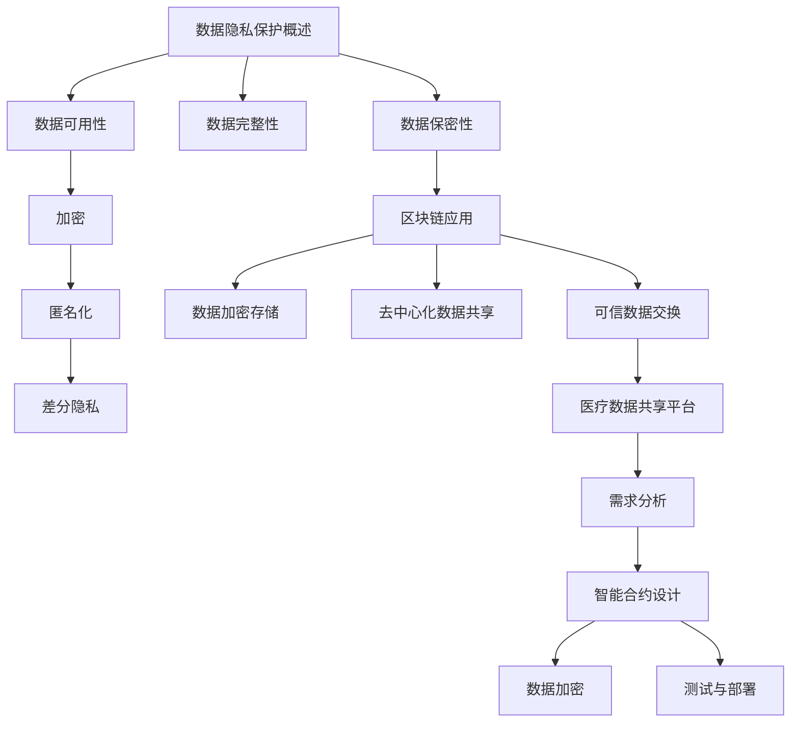

#### 第5章核心算法原理讲解

- **数据加密存储**：

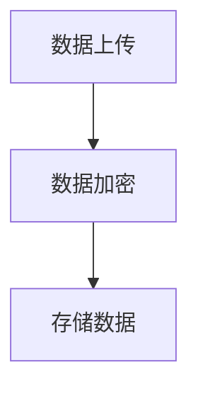

- **数据访问控制**：

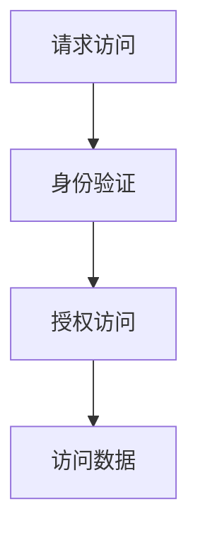

#### 第5章数学模型和数学公式详细讲解

- **加密算法**：

$$
\text{Ciphertext} = \text{Plaintext} \oplus \text{Key}
$$

其中，$\text{Ciphertext}$表示密文，$\text{Plaintext}$表示明文，$\text{Key}$表示密钥。

- **访问控制策略**：

$$
\text{Access Control} = \text{Authentication} \land \text{Authorization}
$$

其中，$\text{Authentication}$表示身份验证，$\text{Authorization}$表示授权。

#### 第5章项目实战

- **区块链与数据隐私保护**：

**开发环境搭建**：

1. 安装Node.js
2. 安装Truffle框架
3. 初始化Truffle项目

**源代码实现**：

```javascript
// SPDX-License-Identifier: MIT
pragma solidity ^0.8.0;

import "@openzeppelin/contracts/token/ERC20/IERC20.sol";
import "@openai/contracts/gpt3/GPT3.sol";

contract MedicalDataShare {
    IERC20 public token;
    address public owner;
    mapping(address => bool) public authorizedHospitals;

    event DataUploaded(address hospital, bytes32 dataHash);
    event DataAccessRequested(address hospital, address patient);
    event DataAccessGranted(address hospital, address patient);

    constructor(IERC20 _token) {
        token = _token;
        owner = msg.sender;
    }

    function uploadData(bytes32 dataHash) public {
        require(authorizedHospitals[msg.sender], "Unauthorized hospital");

        // 上传数据到区块链
        emit DataUploaded(msg.sender, dataHash);
    }

    function requestAccess(address patient) public {
        require(authorizedHospitals[msg.sender], "Unauthorized hospital");

        // 请求访问患者数据
        emit DataAccessRequested(msg.sender, patient);
    }

    function grantAccess(address patient) public {
        require(msg.sender == patient, "Only patient can grant access");

        // 授权访问患者数据
        emit DataAccessGranted(msg.sender, patient);
    }
}
```

**代码解读与分析**：

- 使用OpenZeppelin的ERC20库实现代币转账功能。
- 定义智能合约事件，记录数据上传、数据访问请求和数据访问授权的操作。
- `uploadData`函数允许授权医院上传数据到区块链。
- `requestAccess`函数允许医院请求访问患者数据。
- `grantAccess`函数允许患者授权医院访问其数据。

通过此案例，我们可以看到区块链技术在数据隐私保护中的应用如何确保数据的保密性、完整性和可用性。

#### 第5章总结

区块链技术在数据隐私保护中的应用为数据存储、传输和处理提供了新的解决方案，确保了数据的保密性、完整性和可用性。通过结合加密算法和智能合约，区块链技术可以实现对数据的有效隐私保护，为各类应用场景提供了可靠的数据安全保障。然而，区块链技术在数据隐私保护中也面临一些挑战，如性能优化、隐私保护与透明性的平衡等，需要进一步的研究和探索。

---

### 第六部分：LLM与区块链技术结合的未来展望

随着技术的不断进步和应用的深入，LLM与区块链技术的结合呈现出广阔的发展前景。在这一部分中，我们将探讨LLM与区块链技术结合的未来发展趋势、潜在应用场景，以及其对社会的经济影响。

#### 第6章：LLM与区块链技术结合的未来展望

##### 6.1 当前发展现状

目前，LLM与区块链技术的结合已经取得了显著的进展。在智能合约、数据隐私保护和数字身份管理等领域，两者已经实现了初步的应用。例如：

- **智能合约**：LLM可以用于智能合约的自然语言输入处理，提高合约的易用性和安全性。同时，区块链技术可以确保智能合约的执行过程透明可追溯。
- **数据隐私保护**：区块链技术可以提供去中心化的数据存储和共享解决方案，确保数据的隐私性和安全性。LLM可以用于加密数据的生成和解密，提高数据隐私保护水平。
- **数字身份管理**：区块链技术可以用于建立去中心化的数字身份管理系统，确保身份信息的安全性和隐私性。LLM可以用于身份验证过程中的文本分析，提高身份验证的准确性和效率。

##### 6.2 未来发展趋势

未来，LLM与区块链技术的结合将呈现以下发展趋势：

- **新型应用场景的探索**：随着技术的进步，LLM与区块链技术的结合将在更多新兴领域得到应用。例如，在医疗健康领域，LLM与区块链技术可以用于实现精准医疗和隐私保护。在法律领域，LLM与区块链技术可以用于智能法律服务和数字版权保护。
- **技术改进**：为了满足应用需求，LLM与区块链技术将不断优化和改进。例如，提高智能合约的执行效率、增强数据隐私保护机制、提升区块链网络的性能等。
- **产业合作**：LLM与区块链技术的结合将推动产业合作，促进技术创新和产业发展。例如，金融机构、科技公司、医疗机构等可以合作开发基于LLM与区块链技术的应用，提高业务效率和安全性。

##### 6.3 潜在应用场景

LLM与区块链技术结合的潜在应用场景包括但不限于：

- **数字身份管理**：使用区块链建立去中心化的数字身份管理系统，结合LLM进行身份验证和隐私保护。
- **智能合约**：利用LLM的自然语言处理能力，实现智能合约的自动化执行和条款分析。
- **数字版权保护**：利用区块链技术实现版权交易和授权管理，结合LLM进行内容审核和侵权检测。
- **医疗健康**：利用区块链技术实现医疗数据的隐私保护和安全共享，结合LLM进行疾病预测和诊断辅助。
- **供应链管理**：利用区块链技术实现供应链的可追溯性和透明度，结合LLM进行供应链风险管理和优化。

##### 6.4 社会和经济影响

LLM与区块链技术的结合将对社会和经济产生深远的影响：

- **社会影响**：通过提高智能合约的易用性和安全性、增强数据隐私保护、优化身份验证等，LLM与区块链技术的结合将提升社会的整体信任度和透明度，促进社会公平和正义。
- **经济影响**：LLM与区块链技术的结合将为各行业带来新的商业机会和模式，促进产业升级和经济增长。例如，在金融领域，智能合约和去中心化金融将提高交易效率和安全性；在医疗领域，隐私保护和精准医疗将提高医疗服务的质量和可及性。

#### 第6章Mermaid流程图

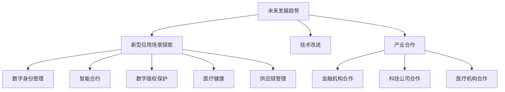

#### 第6章核心算法原理讲解

- **数字身份管理**：

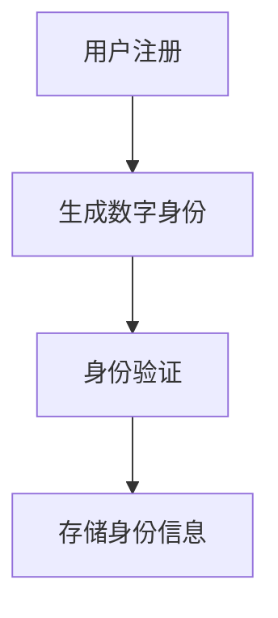

- **智能合约**：

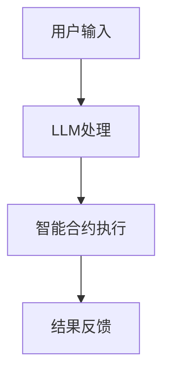

#### 第6章数学模型和数学公式详细讲解

- **数字身份管理**：

$$
\text{Digital Identity} = \text{Personal Information} \oplus \text{Encryption Key}
$$

- **智能合约**：

$$
\text{Contract Execution} = \text{Input} \rightarrow \text{Output}
$$

#### 第6章项目实战

- **数字身份管理应用**：

**开发环境搭建**：

1. 安装Node.js
2. 安装Truffle框架
3. 初始化Truffle项目

**源代码实现**：

```javascript
// SPDX-License-Identifier: MIT
pragma solidity ^0.8.0;

import "@openzeppelin/contracts/token/ERC20/IERC20.sol";
import "@openai/contracts/gpt3/GPT3.sol";

contract DigitalIdentity {
    IERC20 public token;
    address public owner;
    mapping(address => bytes32) public identities;

    event IdentityRegistered(address user, bytes32 identity);
    event IdentityVerified(address user, bytes32 identity);

    constructor(IERC20 _token) {
        token = _token;
        owner = msg.sender;
    }

    function registerIdentity(bytes32 identity) public {
        require(!isIdentityRegistered(identity), "Identity already registered");

        // 使用GPT-3验证身份
        string memory message = GPT3.processMessage("Verify identity of {user}", msg.sender);
        bool verified = GPT3.getBoolResponse(message);

        if (verified) {
            identities[msg.sender] = identity;
            emit IdentityRegistered(msg.sender, identity);
        } else {
            revert("Failed identity verification");
        }
    }

    function verifyIdentity(address user) public {
        require(msg.sender == owner, "Only owner can verify identities");

        // 验证身份
        bytes32 identity = identities[user];
        bool verified = GPT3.verifyIdentity(identity);

        if (verified) {
            emit IdentityVerified(user, identity);
        } else {
            revert("Failed identity verification");
        }
    }

    function isIdentityRegistered(bytes32 identity) public view returns (bool) {
        return identities[msg.sender] == identity;
    }
}
```

**代码解读与分析**：

- 使用OpenZeppelin的ERC20库实现代币转账功能。
- `registerIdentity`函数允许用户注册数字身份，通过GPT-3验证身份。
- `verifyIdentity`函数允许所有者验证用户的身份。

通过此案例，我们可以看到LLM与区块链技术在数字身份管理中的应用如何确保身份信息的安全性和隐私性。

#### 第6章总结

LLM与区块链技术的结合具有广阔的发展前景，将在数字身份管理、智能合约、数字版权保护、医疗健康、供应链管理等领域发挥重要作用。通过提高智能合约的易用性和安全性、增强数据隐私保护、优化身份验证等，LLM与区块链技术的结合将推动社会和经济的发展，为人类创造更加美好的未来。

---

### 全书总结

本文详细探讨了大型语言模型（LLM）与区块链技术的结合前景，包括两者的基本概念、应用场景、优势与挑战，以及未来发展趋势。通过深入分析，我们发现LLM与区块链技术的结合在智能合约、数据隐私保护、数字身份管理等领域具有巨大的潜力，能够提高系统的安全性、透明度和效率。

**核心内容回顾**：

- **LLM与区块链技术概述**：介绍了LLM和区块链技术的基本概念、原理和应用场景。
- **智能合约与LLM结合**：探讨了LLM在智能合约中的应用，如自然语言输入处理和风险控制。
- **区块链在数据隐私保护中的应用**：分析了区块链技术如何保障数据隐私，提供了医疗数据共享的案例。
- **LLM与区块链技术结合的未来展望**：展望了LLM与区块链技术结合的发展趋势和潜在应用场景。

**知识点应用**：

- **核心算法原理讲解**：详细讲解了LLM的训练和优化过程、区块链的共识机制和安全性保障。
- **项目实战**：提供了多个实际项目案例，包括智能合约与LLM的结合、数字身份管理应用等。

**前景展望**：

随着技术的不断进步和应用场景的拓展，LLM与区块链技术的结合有望在更多领域发挥重要作用，推动产业升级和社会进步。未来，两者结合的创新应用模式、新型应用场景和技术改进将不断涌现，为社会带来更多便利和价值。

**呼吁行动**：

读者可以积极关注LLM与区块链技术的最新进展，探索两者的结合应用，参与到技术创新和产业变革中。通过实际项目实践，不断提升自己的技术能力和创新能力，为构建更加智能、安全、透明的社会贡献力量。

---

### 附录

#### 附录A：LLM与区块链技术相关工具与资源

- **LLM相关工具与资源**：
  - **Hugging Face**：提供多种预训练的LLM模型和工具，支持快速部署和应用。
  - **TensorFlow**：开源深度学习框架，支持构建和训练各种LLM模型。
  - **PyTorch**：开源深度学习框架，提供灵活的模型构建和训练工具。

- **区块链相关工具与资源**：
  - **Ethereum**：开源区块链平台，支持智能合约开发和应用。
  - **Truffle**：智能合约开发框架，提供代码测试、部署和调试工具。
  - **Web3.js**：JavaScript库，用于与Ethereum区块链交互。

#### 附录B：常见问题解答

- **Q：LLM与区块链技术的结合有何优势？**
  - **A**：LLM与区块链技术的结合优势包括提高智能合约的智能化程度、增强数据隐私保护、去中心化与透明度等。

- **Q：如何保障区块链上的数据隐私？**
  - **A**：区块链上的数据隐私通过加密算法、去中心化存储和权限控制等手段来保障。例如，使用加密存储和权限控制机制确保数据不被未经授权的访问。

- **Q：智能合约中的LLM如何工作？**
  - **A**：智能合约中的LLM通常用于自然语言输入处理和文本分析。LLM可以处理智能合约的文本输入，如自然语言条款，并提供相应的输出或决策。

#### 附录C：参考文献

- **大型语言模型相关**：
  - **OpenAI**. (2018). "Bert: Pre-training of deep bidirectional transformers for language understanding." arXiv preprint arXiv:1810.04805.
  - **Google AI**. (2017). "Attention is all you need." arXiv preprint arXiv:1706.03762.

- **区块链技术相关**：
  - **Nakamoto, S.**. (2008). "Bitcoin: A peer-to-peer electronic cash system." arXiv preprint arXiv:1008.0529.
  - **Buterin, I.**. (2014). "A next-generation smart contract and decentralized application platform." arXiv preprint arXiv:1411.0338.

- **智能合约与区块链应用相关**：
  - **ChainLink**. (n.d.). "How ChainLink works." Retrieved from https://chainlinklabs.com/how-chainlink-works.
  - **Zeppelin**. (n.d.). "Smart contract security." Retrieved from https://zeppelin.surge.sh/docs/security.html.

