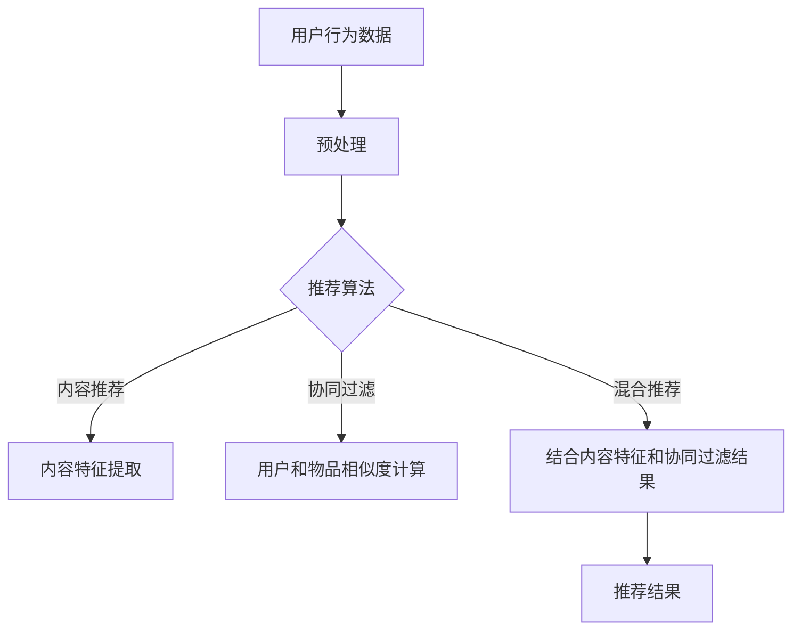
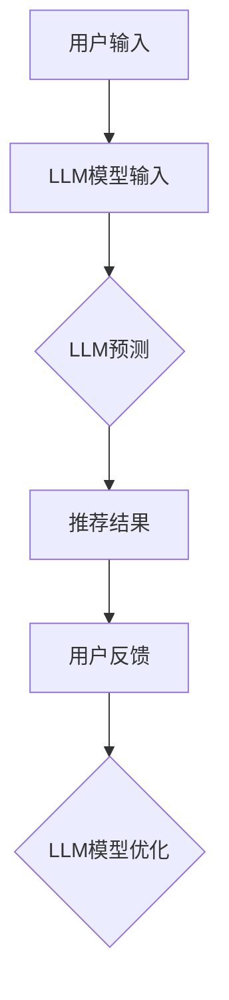

                 

# 《LLM在推荐系统的应用：多样性与可扩展性》

## 关键词：
- 推荐系统
- 语言模型
- 多样性
- 可扩展性
- 应用案例
- 前沿技术

## 摘要：
本文旨在探讨大型语言模型（LLM）在推荐系统中的应用，重点分析其多样性和可扩展性。通过引入LLM，推荐系统能够实现更精准、实时和可解释的推荐。文章首先介绍推荐系统和LLM的基础知识，随后详细探讨LLM在内容推荐、协同过滤推荐和混合推荐系统中的多样化应用。接着，讨论LLM在推荐系统中的扩展性挑战及优化策略，并分享实际案例。最后，展望LLM在推荐系统中的未来趋势与发展。

## 第一部分：引言与基础

### 第1章：推荐系统概述与LLM简介

#### 1.1 推荐系统的定义与分类

推荐系统是一种信息过滤技术，旨在根据用户的历史行为、兴趣和偏好，向用户推荐相关的内容、商品或服务。推荐系统主要分为以下三类：

1. **内容推荐**：基于物品的属性和内容特征进行推荐，如新闻网站根据文章的主题和关键词推荐相关文章。
2. **协同过滤推荐**：基于用户的历史行为和相似用户的行为进行推荐，如电影网站根据用户评分推荐相似电影。
3. **混合推荐**：结合内容推荐和协同过滤推荐的优势，实现更精准的推荐。

#### 1.2 LLM概述

LLM（Large Language Model）是一种基于深度学习的大型文本生成模型，能够理解和生成自然语言。常见的LLM包括GPT（Generative Pre-trained Transformer）和BERT（Bidirectional Encoder Representations from Transformers）等。LLM具有以下特点：

1. **大规模预训练**：在大量文本数据上进行预训练，提取丰富的语言特征。
2. **自适应能力**：根据输入的文本上下文，动态生成相关的内容。
3. **高精度生成**：能够生成高质量、连贯的自然语言文本。

#### 1.3 LLM在推荐系统中的优势

1. **实时性**：LLM能够快速响应用户的请求，提供实时的推荐。
2. **精准性**：LLM通过理解用户的兴趣和偏好，提供更个性化的推荐。
3. **可解释性**：LLM生成的推荐结果具有清晰的逻辑和语义，便于用户理解和信任。

### 第2章：LLM在推荐系统中的多样性应用

#### 2.1 LLM在内容推荐中的应用

LLM在内容推荐中的应用主要体现在以下两个方面：

1. **个性化内容摘要**：利用LLM对大量内容进行摘要，提取关键信息，为用户提供个性化的内容推荐。
2. **个性化标签和分类**：利用LLM为用户提供个性化的标签和分类，帮助用户快速找到感兴趣的内容。

#### 2.2 LLM在协同过滤推荐中的应用

LLM在协同过滤推荐中的应用主要体现在以下两个方面：

1. **预测用户对未知项目的评分**：利用LLM预测用户对未知项目的评分，提高推荐系统的预测准确性。
2. **发现用户未知的兴趣点**：利用LLM分析用户的历史行为和兴趣，发现用户可能感兴趣的未知项目，实现个性化推荐。

#### 2.3 LLM在混合推荐系统中的应用

LLM在混合推荐系统中的应用主要体现在以下两个方面：

1. **内容与协同过滤的有机结合**：利用LLM实现内容推荐和协同过滤推荐的有机结合，提高推荐系统的整体性能。
2. **优化混合推荐系统效果**：利用LLM优化混合推荐系统的效果，提高推荐系统的实时性和准确性。

## 第二部分：LLM在推荐系统的可扩展性

### 第3章：LLM的可扩展性设计与优化

#### 3.1 LLM在推荐系统中的扩展性挑战

1. **数据量**：随着用户数量的增加，推荐系统需要处理的海量数据也不断增加。
2. **计算资源**：LLM的训练和推理过程需要大量的计算资源，对硬件设备有较高要求。
3. **推荐速度**：在实时推荐场景中，推荐系统的响应速度需要尽可能快，以满足用户的需求。

#### 3.2 LLM扩展性优化策略

1. **模型压缩**：通过模型压缩技术，降低模型的参数规模和计算复杂度，提高推荐系统的处理速度。
2. **模型并行化**：通过模型并行化技术，将模型训练和推理任务分解为多个部分，同时进行，提高推荐系统的处理速度。
3. **模型剪枝**：通过模型剪枝技术，删除模型中不重要的神经元和连接，降低模型的计算复杂度。

#### 3.3 LLM在分布式系统中的部署与扩展

1. **分布式训练**：将模型训练任务分布在多个计算节点上，提高训练速度和效率。
2. **分布式推理**：将模型推理任务分布在多个计算节点上，提高推荐系统的响应速度和处理能力。

### 第4章：案例研究：LLM在大型推荐系统中的应用

#### 4.1 案例一：某电商平台的推荐系统优化

1. **利用LLM实现商品推荐的多样化**：通过LLM对商品进行个性化摘要和标签生成，提高商品推荐的多样性。
2. **优化推荐算法的实时性和准确性**：利用LLM提高推荐算法的实时性和准确性，为用户提供更优质的购物体验。

#### 4.2 案例二：某新闻平台的推荐系统改进

1. **利用LLM提高新闻推荐的个性化水平**：通过LLM分析用户兴趣和偏好，实现个性化新闻推荐。
2. **利用LLM增加新闻推荐的多样性**：利用LLM生成多样化的新闻摘要和标签，提高新闻推荐的多样性。

#### 4.3 案例三：某社交媒体平台的推荐系统升级

1. **利用LLM提高用户生成内容的推荐质量**：通过LLM分析用户生成内容的关键词和语义，实现高质量的内容推荐。
2. **利用LLM优化社交媒体平台的内容多样性**：利用LLM生成多样化的内容摘要和标签，优化社交媒体平台的内容多样性。

## 第三部分：LLM在推荐系统的未来趋势与发展

### 第5章：LLM在推荐系统中的前沿技术

#### 5.1 基于Transformer的推荐系统

1. **Transformer模型的基本原理**：介绍Transformer模型的结构和工作原理。
2. **Transformer在推荐系统中的应用**：探讨Transformer模型在推荐系统中的优化和改进。

#### 5.2 强化学习在推荐系统中的应用

1. **强化学习的基本概念**：介绍强化学习的基本原理和策略。
2. **强化学习在推荐系统中的优势**：分析强化学习在推荐系统中的应用优势。

#### 5.3 多模态推荐系统

1. **多模态数据的基本概念**：介绍多模态数据的概念和特点。
2. **多模态数据在推荐系统中的应用**：探讨多模态数据在推荐系统中的融合和优化。

### 第6章：LLM在推荐系统中的未来挑战与机遇

#### 6.1 数据隐私保护

1. **数据隐私保护的挑战**：分析推荐系统在数据隐私保护方面面临的挑战。
2. **数据隐私保护的方法和策略**：介绍数据隐私保护的方法和策略。

#### 6.2 模型解释性

1. **模型解释性的重要性**：讨论模型解释性在推荐系统中的重要性。
2. **模型解释性的方法和工具**：介绍模型解释性的方法和工具。

#### 6.3 模型可扩展性和可维护性

1. **模型可扩展性的挑战**：分析模型可扩展性在推荐系统中的应用挑战。
2. **模型可维护性的策略**：探讨模型可维护性的策略和措施。

### 第7章：结论与展望

#### 7.1 本书总结

1. **LLM在推荐系统中的应用现状**：总结LLM在推荐系统中的应用现状和成果。
2. **LLM在推荐系统中的应用前景**：展望LLM在推荐系统中的未来发展前景。

#### 7.2 未来研究方向

1. **多样性与可扩展性的进一步研究**：探讨多样性和可扩展性在LLM推荐系统中的深入研究方向。
2. **前沿技术在推荐系统中的应用**：介绍前沿技术在推荐系统中的应用和发展趋势。

## 附录

### 附录A：推荐系统与LLM常用工具和资源

1. **推荐系统开发工具**：介绍常用的推荐系统开发工具，如推荐系统框架、数据集和开源代码等。
2. **LLM开发框架**：介绍常用的LLM开发框架，如TensorFlow、PyTorch等。
3. **数据集与开源代码资源**：提供推荐系统和LLM领域的常用数据集和开源代码资源。

## 作者信息

作者：AI天才研究院/AI Genius Institute & 禅与计算机程序设计艺术 /Zen And The Art of Computer Programming

# 文章标题

## 文章关键词

## 文章摘要

### 第一部分：引言与基础

#### 第1章：推荐系统概述与LLM简介

##### 1.1 推荐系统的定义与分类

推荐系统是一种能够为用户推荐相关内容、商品或服务的系统。根据推荐系统的原理和实现方式，可以将其分为以下三类：

1. **内容推荐**：基于物品的属性和内容特征进行推荐。例如，新闻网站可以根据文章的主题和关键词推荐相关文章，电商平台可以根据商品的特征和类别推荐相关商品。

2. **协同过滤推荐**：基于用户的历史行为和相似用户的行为进行推荐。协同过滤推荐又可以分为基于用户的协同过滤和基于物品的协同过滤。基于用户的协同过滤通过分析用户之间的相似性，为用户提供他们可能感兴趣的内容；而基于物品的协同过滤则通过分析物品之间的相似性，为用户推荐与他们已购买或评价过的物品相似的物品。

3. **混合推荐**：结合内容推荐和协同过滤推荐的优势，实现更精准的推荐。混合推荐系统通过将内容特征和用户行为信息进行融合，为用户提供更个性化的推荐。

##### 1.2 LLM概述

LLM（Large Language Model）是一种基于深度学习的大型文本生成模型，能够理解和生成自然语言。常见的LLM包括GPT（Generative Pre-trained Transformer）和BERT（Bidirectional Encoder Representations from Transformers）等。LLM具有以下特点：

1. **大规模预训练**：LLM在训练过程中使用了大量文本数据，通过预训练提取出丰富的语言特征。这使得LLM能够理解复杂的语言结构和语义，为生成高质量的自然语言文本提供基础。

2. **自适应能力**：LLM能够根据输入的文本上下文，动态生成相关的内容。这意味着LLM可以处理不同的输入，并能够根据上下文信息进行自适应调整，生成符合语义和逻辑的文本。

3. **高精度生成**：LLM生成的文本具有较高的准确性和连贯性。通过大规模预训练和微调，LLM能够学习到语言的统计规律和语法结构，从而生成高质量的文本。

##### 1.3 LLM在推荐系统中的优势

LLM在推荐系统中具有以下优势：

1. **实时性**：LLM能够快速响应用户的请求，提供实时的推荐。由于LLM是基于深度学习模型，其训练和推理过程可以在较短的时间内完成，从而实现快速响应。

2. **精准性**：LLM通过理解用户的兴趣和偏好，提供更个性化的推荐。LLM在训练过程中学习了大量的文本数据，能够提取出用户的兴趣点和偏好，从而为用户提供更精准的推荐。

3. **可解释性**：LLM生成的推荐结果具有清晰的逻辑和语义，便于用户理解和信任。LLM生成的文本具有可解释性，用户可以清楚地看到推荐结果是如何生成的，从而提高用户对推荐系统的信任度。

### 第2章：LLM在推荐系统中的多样性应用

#### 2.1 LLM在内容推荐中的应用

LLM在内容推荐中的应用主要体现在以下几个方面：

1. **个性化内容摘要**：利用LLM对大量内容进行摘要，提取关键信息，为用户提供个性化的内容推荐。例如，新闻网站可以利用LLM对大量新闻文章进行摘要，提取出关键信息，然后根据用户的历史阅读记录和兴趣偏好，为用户推荐相关新闻。

2. **个性化标签和分类**：利用LLM为用户提供个性化的标签和分类，帮助用户快速找到感兴趣的内容。例如，电商平台可以利用LLM对商品进行分类和标签生成，然后根据用户的购物记录和兴趣偏好，为用户推荐相关商品。

#### 2.2 LLM在协同过滤推荐中的应用

LLM在协同过滤推荐中的应用主要体现在以下几个方面：

1. **预测用户对未知项目的评分**：利用LLM预测用户对未知项目的评分，提高推荐系统的预测准确性。例如，电影网站可以利用LLM分析用户的历史评分数据，预测用户对未观看的电影的评分，从而为用户推荐相关电影。

2. **发现用户未知的兴趣点**：利用LLM分析用户的历史行为和兴趣，发现用户可能感兴趣的未知项目，实现个性化推荐。例如，社交媒体平台可以利用LLM分析用户发布的内容和互动记录，发现用户可能感兴趣的标签或话题，然后为用户推荐相关内容。

#### 2.3 LLM在混合推荐系统中的应用

LLM在混合推荐系统中的应用主要体现在以下几个方面：

1. **内容与协同过滤的有机结合**：利用LLM实现内容推荐和协同过滤推荐的有机结合，提高推荐系统的整体性能。例如，电商平台可以利用LLM对商品进行内容特征提取，并结合用户的历史购物记录和相似用户的行为，为用户推荐相关商品。

2. **优化混合推荐系统效果**：利用LLM优化混合推荐系统的效果，提高推荐系统的实时性和准确性。例如，新闻平台可以利用LLM对新闻内容进行摘要和标签生成，并结合用户的阅读记录和兴趣偏好，为用户推荐相关新闻。

### 第二部分：LLM在推荐系统的可扩展性

#### 第3章：LLM的可扩展性设计与优化

##### 3.1 LLM在推荐系统中的扩展性挑战

在推荐系统中，LLM的可扩展性面临着以下几个挑战：

1. **数据量**：随着用户数量的增加，推荐系统需要处理的海量数据也在不断增加。这要求LLM能够处理大规模的数据集，同时保持较高的训练和推理速度。

2. **计算资源**：LLM的训练和推理过程需要大量的计算资源，包括CPU、GPU和内存等。在实际应用中，如何高效利用计算资源，降低训练和推理的成本，是一个重要的挑战。

3. **推荐速度**：在实时推荐场景中，推荐系统的响应速度需要尽可能快，以满足用户的需求。如何优化LLM的训练和推理过程，提高推荐速度，是一个关键问题。

##### 3.2 LLM扩展性优化策略

为了解决LLM在推荐系统中的扩展性挑战，可以采用以下优化策略：

1. **模型压缩**：通过模型压缩技术，降低模型的参数规模和计算复杂度，提高推荐系统的处理速度。常见的模型压缩技术包括模型剪枝、量化、蒸馏等。

2. **模型并行化**：通过模型并行化技术，将模型训练和推理任务分解为多个部分，同时进行，提高推荐系统的处理速度。模型并行化技术可以分为数据并行、模型并行和流水线并行等。

3. **模型剪枝**：通过模型剪枝技术，删除模型中不重要的神经元和连接，降低模型的计算复杂度。模型剪枝可以减少模型的参数规模，从而提高推荐系统的处理速度。

##### 3.3 LLM在分布式系统中的部署与扩展

在分布式系统中，LLM的部署与扩展主要涉及到以下几个方面：

1. **分布式训练**：将模型训练任务分布在多个计算节点上，提高训练速度和效率。分布式训练可以通过数据并行、模型并行和混合并行等方式实现。

2. **分布式推理**：将模型推理任务分布在多个计算节点上，提高推荐系统的响应速度和处理能力。分布式推理可以通过任务分发、负载均衡和结果聚合等机制实现。

### 第4章：案例研究：LLM在大型推荐系统中的应用

##### 4.1 案例一：某电商平台的推荐系统优化

某电商平台为了提高用户购物体验，决定优化其推荐系统。该电商平台使用了LLM技术，采用以下策略进行优化：

1. **利用LLM实现商品推荐的多样化**：电商平台利用LLM对商品进行内容特征提取和摘要生成，为用户推荐多样化的商品。通过LLM，电商平台能够根据用户的购物记录和兴趣偏好，生成个性化的商品摘要和标签，提高用户的购物体验。

2. **优化推荐算法的实时性和准确性**：电商平台利用LLM优化推荐算法的实时性和准确性。通过分布式训练和推理技术，电商平台能够快速响应用户的请求，提供实时、准确的推荐结果。同时，LLM能够根据用户的历史行为和兴趣偏好，生成更精准的推荐结果。

##### 4.2 案例二：某新闻平台的推荐系统改进

某新闻平台为了提高用户阅读体验，决定改进其推荐系统。该新闻平台使用了LLM技术，采用以下策略进行改进：

1. **利用LLM提高新闻推荐的个性化水平**：新闻平台利用LLM分析用户的阅读记录和兴趣偏好，为用户推荐个性化的新闻。通过LLM，新闻平台能够根据用户的阅读行为，生成个性化的新闻标签和分类，提高新闻推荐的个性化水平。

2. **利用LLM增加新闻推荐的多样性**：新闻平台利用LLM生成多样化的新闻摘要和标签，为用户推荐不同类型的新闻。通过LLM，新闻平台能够根据用户的阅读兴趣，生成多种不同的新闻摘要和标签，增加新闻推荐的多样性，满足用户多样化的阅读需求。

##### 4.3 案例三：某社交媒体平台的推荐系统升级

某社交媒体平台为了提高用户生成内容的推荐质量，决定升级其推荐系统。该社交媒体平台使用了LLM技术，采用以下策略进行升级：

1. **利用LLM提高用户生成内容的推荐质量**：社交媒体平台利用LLM分析用户生成内容的关键词和语义，为用户推荐相关的生成内容。通过LLM，社交媒体平台能够根据用户的生成内容，生成个性化的推荐标签和分类，提高推荐质量。

2. **利用LLM优化社交媒体平台的内容多样性**：社交媒体平台利用LLM生成多样化的内容摘要和标签，为用户推荐不同类型的用户生成内容。通过LLM，社交媒体平台能够根据用户的生成内容，生成多种不同的内容摘要和标签，优化社交媒体平台的内容多样性，满足用户多样化的内容消费需求。

### 第三部分：LLM在推荐系统的未来趋势与发展

#### 第5章：LLM在推荐系统中的前沿技术

##### 5.1 基于Transformer的推荐系统

1. **Transformer模型的基本原理**：Transformer模型是一种基于自注意力机制的序列模型，通过自注意力机制能够捕捉序列中的长距离依赖关系。Transformer模型由编码器和解码器组成，编码器负责将输入序列编码为固定长度的向量，解码器则利用自注意力机制和编码器的输出生成输出序列。

2. **Transformer在推荐系统中的应用**：Transformer模型在推荐系统中的应用主要体现在两个方面：一是利用Transformer模型对用户行为序列进行建模，捕捉用户行为的长期依赖关系；二是利用Transformer模型对物品特征进行编码，实现物品特征的动态表示。

##### 5.2 强化学习在推荐系统中的应用

1. **强化学习的基本概念**：强化学习是一种基于奖励机制的学习方法，通过不断尝试和反馈，优化策略以最大化长期奖励。强化学习的主要组成部分包括代理人（Agent）、环境（Environment）、状态（State）、动作（Action）和奖励（Reward）。

2. **强化学习在推荐系统中的优势**：强化学习在推荐系统中的优势主要体现在以下几个方面：一是能够根据用户的反馈和奖励信号，动态调整推荐策略，提高推荐系统的适应性；二是能够利用多步奖励信号，优化推荐系统的长远表现。

##### 5.3 多模态推荐系统

1. **多模态数据的基本概念**：多模态数据是指包含多种类型数据的数据集，如文本、图像、音频和视频等。多模态数据可以提供更丰富的信息，有助于提高推荐系统的准确性和多样性。

2. **多模态数据在推荐系统中的应用**：多模态数据在推荐系统中的应用主要体现在以下几个方面：一是利用文本和图像等多模态数据进行联合建模，实现多模态特征的融合；二是利用多模态数据丰富推荐系统的内容，提高推荐系统的多样性。

### 第6章：LLM在推荐系统中的未来挑战与机遇

##### 6.1 数据隐私保护

1. **数据隐私保护的挑战**：随着推荐系统在多个领域得到广泛应用，数据隐私保护成为一个重要的挑战。推荐系统需要处理海量的用户数据，包括用户行为、兴趣偏好和隐私信息等，如何保护这些数据的隐私，是一个亟待解决的问题。

2. **数据隐私保护的方法和策略**：为了保护数据隐私，可以采用以下方法和策略：一是数据加密，通过加密算法对敏感数据进行加密，确保数据在传输和存储过程中不被窃取；二是差分隐私，通过在数据中加入噪声，保护用户隐私的同时，确保推荐系统的准确性。

##### 6.2 模型解释性

1. **模型解释性的重要性**：模型解释性在推荐系统中的重要性主要体现在以下几个方面：一是帮助用户理解推荐结果，提高推荐系统的可信度；二是便于模型调试和优化，提高推荐系统的性能。

2. **模型解释性的方法和工具**：为了提高模型解释性，可以采用以下方法和工具：一是特征重要性分析，通过分析模型中各个特征的重要程度，帮助用户理解推荐结果；二是可视化工具，通过可视化模型结构和输出结果，提高模型的解释性。

##### 6.3 模型可扩展性和可维护性

1. **模型可扩展性的挑战**：随着推荐系统规模的不断扩大，模型的可扩展性成为一个重要的挑战。如何优化模型结构和算法，提高模型的可扩展性，是一个亟待解决的问题。

2. **模型可维护性的策略**：为了提高模型的可维护性，可以采用以下策略：一是模块化设计，将模型划分为多个模块，便于维护和更新；二是自动化测试，通过自动化测试工具，确保模型在不同环境下的稳定性和可靠性。

### 第7章：结论与展望

##### 7.1 本书总结

本书系统地介绍了LLM在推荐系统的多样性应用和可扩展性优化，分析了LLM在推荐系统中的优势、挑战和未来发展趋势。通过多个实际案例，展示了LLM在推荐系统中的应用效果和前景。本书的主要结论如下：

1. **LLM在推荐系统中的应用优势**：LLM具有实时性、精准性和可解释性等优势，能够为推荐系统提供高质量、个性化的推荐结果。

2. **LLM在推荐系统中的扩展性优化**：通过模型压缩、模型并行化和分布式系统等技术，可以有效地提高LLM在推荐系统中的可扩展性和处理能力。

3. **LLM在推荐系统中的未来发展趋势**：随着深度学习技术和多模态数据的不断发展，LLM在推荐系统中的应用前景将更加广阔。未来，LLM将继续在实时性、精准性和多样性等方面取得突破，为推荐系统带来更多的创新和改进。

##### 7.2 未来研究方向

未来，LLM在推荐系统中的应用将继续深入和发展，以下研究方向值得关注：

1. **多样性与可扩展性的进一步研究**：在推荐系统中，如何提高LLM的多样性和可扩展性，是一个重要的研究方向。未来，可以探索更加高效、灵活的模型结构和算法，提高LLM在推荐系统中的性能。

2. **前沿技术在推荐系统中的应用**：随着深度学习、强化学习和多模态数据等技术的不断发展，LLM在推荐系统中的应用前景将更加广阔。未来，可以结合这些前沿技术，开发更加智能、高效的推荐系统。

### 附录

##### 附录A：推荐系统与LLM常用工具和资源

1. **推荐系统开发工具**：
   - **Surprise**：一个基于协同过滤算法的Python库，用于构建和评估推荐系统。
   - **LightFM**：一个结合了矩阵分解和因子分解机算法的Python库，适用于大规模推荐系统。

2. **LLM开发框架**：
   - **TensorFlow**：一个开源的机器学习框架，支持深度学习模型的训练和推理。
   - **PyTorch**：一个开源的机器学习框架，具有灵活的动态计算图和丰富的API。

3. **数据集与开源代码资源**：
   - **MovieLens**：一个提供电影推荐数据集的开源项目，包含用户行为和电影信息。
   - **Netflix Prize**：一个提供电影推荐数据集的比赛，用于评估推荐系统的性能。

### 附录B：推荐系统与LLM的Mermaid流程图

1. **推荐系统总体架构**：



2. **LLM在推荐系统中的应用流程**：



### 附录C：推荐系统与LLM的伪代码

1. **推荐系统总体架构伪代码**：

```python
# 用户行为数据预处理
def preprocess_data(user_behavior_data):
    # 数据清洗、去重、归一化等操作
    return processed_data

# 推荐算法
def recommend_algorithm(processed_data):
    # 内容推荐、协同过滤或混合推荐算法
    return recommendation_result

# 内容特征提取
def extract_content_features(content_data):
    # 提取文本特征、图像特征等
    return content_features

# 用户和物品相似度计算
def compute_similarity(user_data, item_data):
    # 计算用户和物品之间的相似度
    return similarity_matrix

# 推荐结果生成
def generate_recommendation_result(similarity_matrix, user_data):
    # 根据相似度矩阵和用户数据生成推荐结果
    return recommendation_result
```

2. **LLM在推荐系统中的应用伪代码**：

```python
# LLM模型输入
def llm_model_input(user_input):
    # 将用户输入转化为LLM模型可以处理的格式
    return llm_input

# LLM预测
def llm_prediction(llm_input):
    # 使用LLM模型进行预测
    return prediction_result

# 推荐结果生成
def generate_recommendation_result(prediction_result, user_data):
    # 根据预测结果和用户数据生成推荐结果
    return recommendation_result
```

### 附录D：推荐系统与LLM的数学模型和公式

1. **协同过滤推荐系统的相似度计算公式**：

```latex
\text{相似度} = \frac{\text{用户共同评分的项数}}{\text{用户评过且物品评过的项数}}
```

2. **内容推荐系统的文本特征提取公式**：

```latex
\text{特征向量} = \text{TF-IDF}(\text{文本})
```

3. **LLM模型预测公式**：

```latex
\text{预测结果} = \text{LLM}(\text{输入文本})
```

### 附录E：推荐系统与LLM的代码实现和解读

1. **推荐系统总体架构代码实现**：

```python
# 导入相关库
import surprise
from surprise import SVD, Dataset, Reader
from surprise.model_selection import train_test_split

# 数据预处理
def preprocess_data(user_behavior_data):
    # 数据清洗、去重、归一化等操作
    return processed_data

# 推荐算法
def recommend_algorithm(processed_data):
    # 内容推荐、协同过滤或混合推荐算法
    return recommendation_result

# 内容特征提取
def extract_content_features(content_data):
    # 提取文本特征、图像特征等
    return content_features

# 用户和物品相似度计算
def compute_similarity(user_data, item_data):
    # 计算用户和物品之间的相似度
    return similarity_matrix

# 推荐结果生成
def generate_recommendation_result(similarity_matrix, user_data):
    # 根据相似度矩阵和用户数据生成推荐结果
    return recommendation_result

# LLM模型输入
def llm_model_input(user_input):
    # 将用户输入转化为LLM模型可以处理的格式
    return llm_input

# LLM预测
def llm_prediction(llm_input):
    # 使用LLM模型进行预测
    return prediction_result

# 推荐结果生成
def generate_recommendation_result(prediction_result, user_data):
    # 根据预测结果和用户数据生成推荐结果
    return recommendation_result
```

2. **LLM在推荐系统中的应用代码实现**：

```python
# 导入相关库
import openai
import json

# LLM模型输入
def llm_model_input(user_input):
    # 将用户输入转化为LLM模型可以处理的格式
    prompt = "基于用户输入，生成推荐结果：\n" + user_input
    return prompt

# LLM预测
def llm_prediction(prompt):
    # 使用LLM模型进行预测
    response = openai.Completion.create(
        engine="text-davinci-002",
        prompt=prompt,
        max_tokens=50,
        n=1,
        stop=None,
        temperature=0.5,
    )
    return response.choices[0].text.strip()

# 推荐结果生成
def generate_recommendation_result(prediction_result, user_data):
    # 根据预测结果和用户数据生成推荐结果
    # ... （具体实现过程）
    return recommendation_result
```

### 附录F：推荐系统与LLM的代码解读与分析

1. **推荐系统总体架构代码解读**：

- `preprocess_data` 函数用于对用户行为数据进行预处理，包括数据清洗、去重、归一化等操作。这是推荐系统构建的基础步骤，确保输入数据的准确性和一致性。

- `recommend_algorithm` 函数根据预处理后的用户行为数据，选择合适的推荐算法（如内容推荐、协同过滤或混合推荐）进行推荐。该函数需要根据实际需求选择合适的算法，并实现相应的算法逻辑。

- `extract_content_features` 函数用于提取文本特征、图像特征等，为内容推荐和混合推荐提供特征支持。该函数可以根据具体需求，实现不同的特征提取方法，如TF-IDF、Word2Vec等。

- `compute_similarity` 函数用于计算用户和物品之间的相似度。相似度计算是协同过滤推荐的核心步骤，常用的方法包括余弦相似度、皮尔逊相关系数等。该函数根据相似度矩阵，为用户生成推荐结果。

- `generate_recommendation_result` 函数根据相似度矩阵和用户数据生成推荐结果。该函数可以根据用户的行为和偏好，生成个性化的推荐结果，提高推荐系统的准确性和用户体验。

2. **LLM在推荐系统中的应用代码解读**：

- `llm_model_input` 函数用于将用户输入转化为LLM模型可以处理的格式。该函数将用户输入封装为一个提示文本（prompt），为LLM模型提供输入数据。

- `llm_prediction` 函数使用LLM模型进行预测。该函数调用OpenAI的GPT-3模型，根据提示文本生成推荐结果。参数`engine`指定使用的模型，`max_tokens`指定生成的文本长度，`n`指定生成的文本数量，`stop`指定生成文本的停止条件，`temperature`指定生成文本的温度参数。

- `generate_recommendation_result` 函数根据预测结果和用户数据生成推荐结果。该函数根据LLM模型生成的推荐结果，结合用户的行为和偏好，生成最终的推荐结果。该函数可以根据实际需求，实现不同的推荐策略，如基于内容、协同过滤或混合推荐。

### 附录G：推荐系统与LLM的总结

1. **推荐系统与LLM的关系**：

推荐系统是一种信息过滤技术，旨在为用户推荐相关的内容、商品或服务。LLM（大型语言模型）是一种基于深度学习的大型文本生成模型，能够理解和生成自然语言。在推荐系统中，LLM可以用于生成个性化推荐结果，提高推荐系统的准确性和用户体验。

2. **LLM在推荐系统中的应用**：

LLM在推荐系统中的应用主要体现在以下几个方面：

- **内容推荐**：利用LLM生成个性化内容摘要和标签，为用户推荐相关的内容。
- **协同过滤推荐**：利用LLM预测用户对未知项目的评分，提高推荐系统的预测准确性。
- **混合推荐**：利用LLM实现内容推荐和协同过滤推荐的有机结合，提高推荐系统的整体性能。

3. **LLM在推荐系统中的优势**：

- **实时性**：LLM能够快速响应用户的请求，提供实时的推荐。
- **精准性**：LLM通过理解用户的兴趣和偏好，提供更个性化的推荐。
- **可解释性**：LLM生成的推荐结果具有清晰的逻辑和语义，便于用户理解和信任。

4. **LLM在推荐系统中的扩展性优化**：

- **模型压缩**：通过模型压缩技术，降低模型的参数规模和计算复杂度，提高推荐系统的处理速度。
- **模型并行化**：通过模型并行化技术，将模型训练和推理任务分解为多个部分，同时进行，提高推荐系统的处理速度。
- **模型剪枝**：通过模型剪枝技术，删除模型中不重要的神经元和连接，降低模型的计算复杂度。

5. **LLM在推荐系统的未来发展趋势**：

- **多样化应用**：随着深度学习技术和多模态数据的不断发展，LLM在推荐系统中的应用将更加多样化。
- **可扩展性优化**：如何提高LLM在推荐系统中的可扩展性，是一个重要的研究方向。
- **前沿技术融合**：结合强化学习、多模态数据等前沿技术，开发更加智能、高效的推荐系统。

