                 

### 《LLM大规模语言模型的应用开发》

> **关键词：** 大规模语言模型，应用开发，Transformer，预训练，微调，评估与优化，算法原理，数学基础，深度学习基础，文本生成，语言翻译，文本分类，项目实战，多模态学习，生成对抗网络，强化学习，未来展望。

> **摘要：** 本文全面介绍了LLM（大规模语言模型）的应用开发，包括基础理论、算法原理、应用实践、项目实战、高级技术以及未来展望。通过详细的分析和实例讲解，帮助读者深入理解LLM的原理和开发流程。

### 第一部分：基础理论

在本文的第一部分，我们将从基础理论入手，深入探讨LLM（大规模语言模型）的概念、架构、训练方法以及评估与优化策略。通过这一部分的阐述，读者将能够建立起对LLM的全面了解，为后续的应用实践和项目开发打下坚实的基础。

#### 第1章：LLM概述

语言模型是一种用于预测下一个单词或字符的统计模型，其在自然语言处理（NLP）领域中有着广泛的应用。而大规模语言模型（LLM）则是近年来在NLP领域取得突破性进展的一类模型，其能够处理大规模的文本数据，并生成高质量的文本输出。

##### 1.1 语言模型的定义与特点

###### 1.1.1 语言模型的本质

语言模型的核心任务是预测下一个单词或字符。它通过对大量文本数据进行统计分析，学习出单词或字符之间的统计规律，从而能够预测下一个单词或字符。

###### 1.1.2 语言模型的应用场景

语言模型的应用场景非常广泛，包括但不限于：

- 文本生成：自动写作、自动摘要、问答系统等。
- 语言翻译：机器翻译、神经机器翻译等。
- 文本分类：新闻分类、情感分析等。

##### 1.2 LLM的核心架构

LLM的核心架构主要包括自注意力机制和Transformer模型。自注意力机制是一种在序列数据中进行权重分配的方法，能够有效地捕捉序列中的长距离依赖关系。而Transformer模型则是基于自注意力机制构建的一种深度神经网络模型，其在NLP任务中表现出色。

###### 1.2.1 自注意力机制

自注意力机制是一种在序列数据中计算权重的方法，通过将序列中的每个元素与所有其他元素进行点积运算，再通过softmax函数得到权重。这种权重可以用于后续的计算，从而实现对序列数据的加权处理。

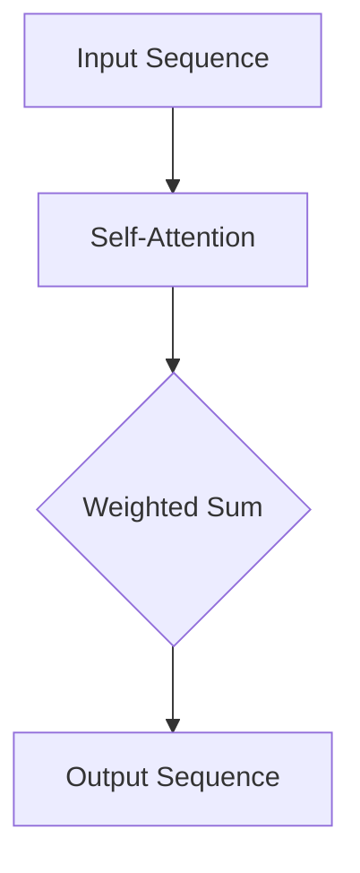

###### 1.2.2 Transformer模型

Transformer模型是一种基于自注意力机制的深度神经网络模型，其主要由编码器和解码器组成。编码器用于将输入序列编码为固定长度的向量，而解码器则用于生成输出序列。Transformer模型通过多头自注意力机制和前馈神经网络，能够捕捉到序列中的长距离依赖关系，从而实现高质量的文本生成和翻译。

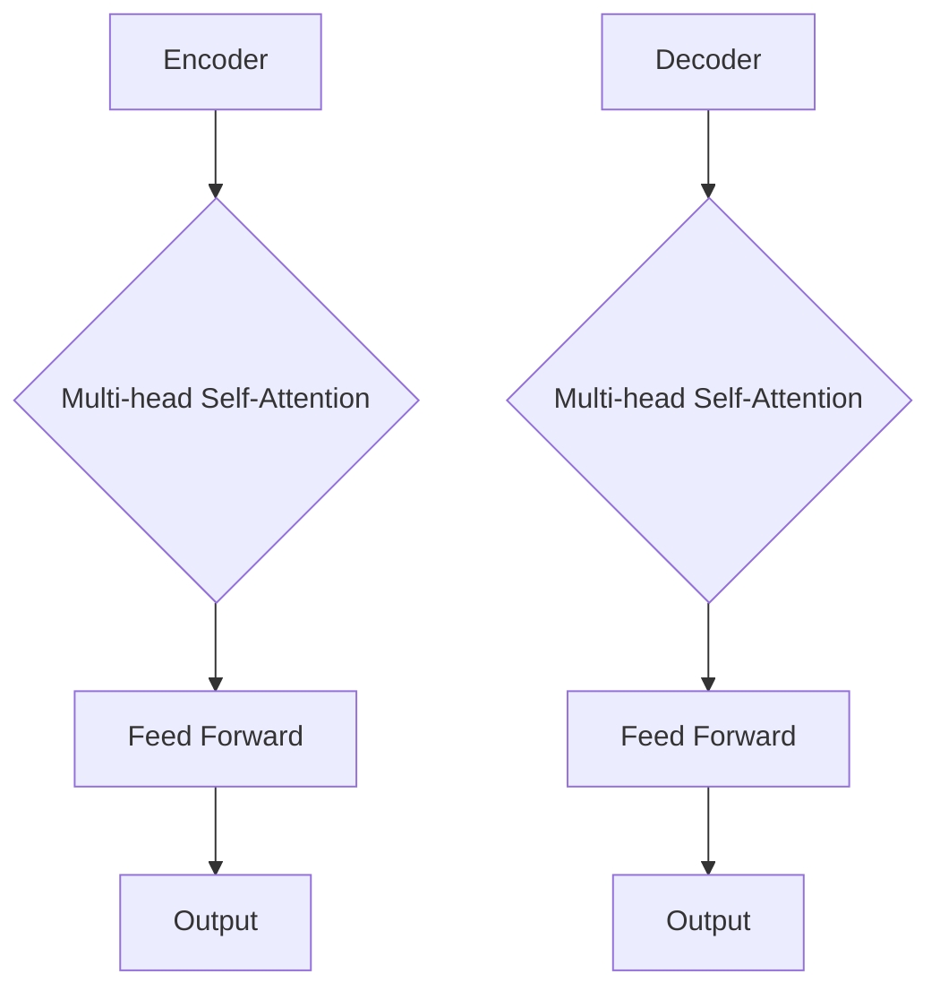

##### 1.3 语言模型的训练

语言模型的训练主要包括预训练和微调两个阶段。预训练是指在大量无标签的文本数据上对模型进行训练，使其学会文本的基本结构和语义信息。而微调则是指在预训练的基础上，利用有标签的特定任务数据对模型进行进一步训练，从而提高模型在特定任务上的性能。

###### 1.3.1 预训练方法

预训练方法主要包括两种：基于字符的预训练和基于词向量的预训练。基于字符的预训练方法通过预测下一个字符来学习文本的基本结构和语义信息。而基于词向量的预训练方法则是通过将词向量映射到高维空间中，学习出词与词之间的关系。

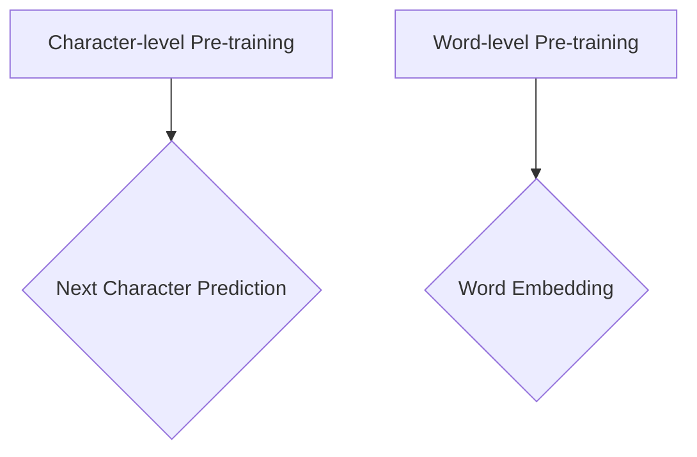

###### 1.3.2 微调技术

微调技术是指在预训练的基础上，利用有标签的特定任务数据对模型进行进一步训练。微调的目的是通过在特定任务上的训练，提高模型在该任务上的性能。常用的微调方法包括从头训练和迁移学习等。

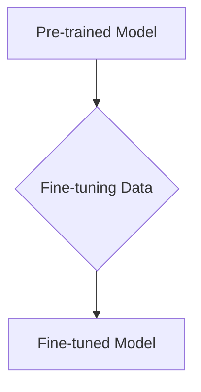

##### 1.4 语言模型的评估与优化

语言模型的评估与优化是确保模型性能的重要环节。评估指标主要包括词汇覆盖度、生成文本的质量、翻译准确性等。优化策略主要包括数据增强、模型剪枝、超参数调整等。

###### 1.4.1 评估指标

评估指标用于衡量语言模型的性能。常用的评估指标包括：

- 词汇覆盖度：模型能够生成的词汇量占总词汇量的比例。
- 生成文本的质量：通过人工评估或自动化评估方法来衡量生成文本的质量。
- 翻译准确性：翻译结果的准确性，通常使用BLEU等指标进行评估。

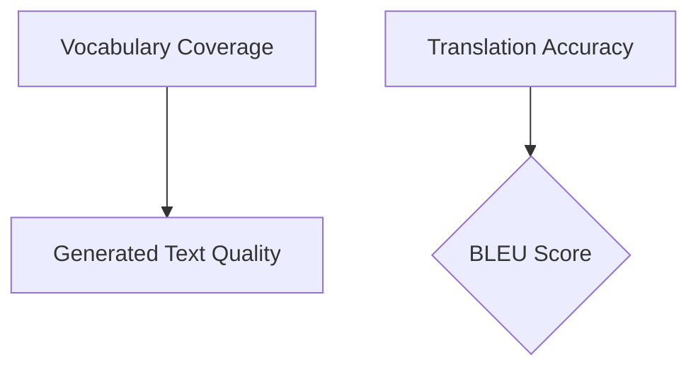

###### 1.4.2 优化策略

优化策略用于提高语言模型的性能。常用的优化策略包括：

- 数据增强：通过数据增强方法，如数据清洗、数据扩充等，增加训练数据的多样性。
- 模型剪枝：通过剪枝技术，减少模型的参数数量，从而提高模型的运行效率。
- 超参数调整：通过调整模型的超参数，如学习率、批次大小等，优化模型的性能。

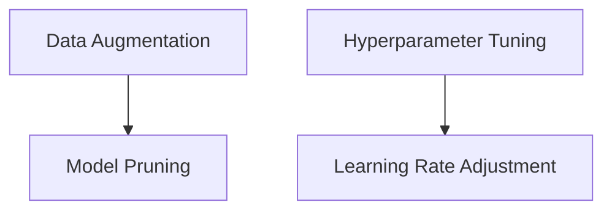

#### 第2章：LLM算法原理

在了解了LLM的基础理论后，我们将进一步探讨LLM的算法原理，包括生成式模型、判别式模型和混合模型。同时，我们将介绍与LLM相关的数学基础和深度学习基础。

##### 2.1 算法原理

LLM的算法原理可以分为生成式模型、判别式模型和混合模型三种类型。

###### 2.1.1 生成式模型

生成式模型旨在生成符合语言模型统计规律的文本。其主要思想是通过对输入序列的概率分布进行建模，从而生成下一个单词或字符。常见的生成式模型包括马尔可夫模型、n-gram模型和神经网络生成模型等。

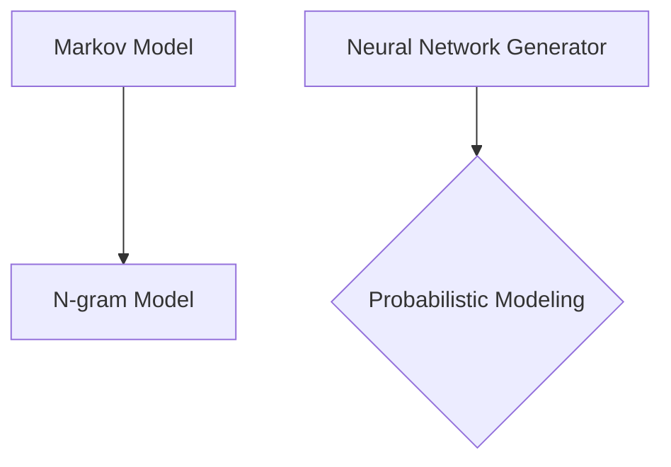

###### 2.1.2 判别式模型

判别式模型旨在根据输入序列预测下一个单词或字符。其主要思想是通过对输入序列和目标序列之间的概率分布进行建模，从而实现文本生成。常见的判别式模型包括循环神经网络（RNN）、长短期记忆网络（LSTM）和门控循环单元（GRU）等。

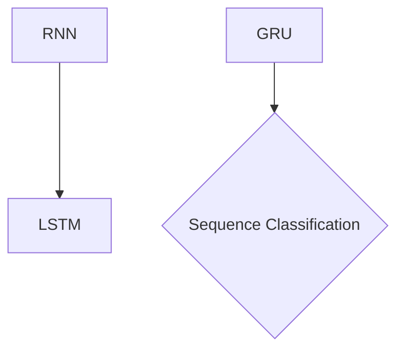

###### 2.1.3 混合模型

混合模型结合了生成式模型和判别式模型的优势，通过同时建模输入序列和目标序列的概率分布，实现更高质量的文本生成。常见的混合模型包括序列到序列（Seq2Seq）模型和注意力机制等。

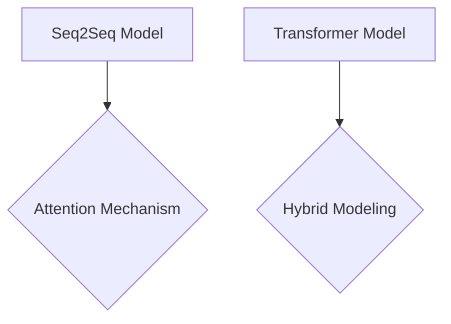

##### 2.2 数学基础

LLM的数学基础主要包括概率论基础、信息论基础和线性代数基础。这些基础知识为LLM的设计和实现提供了数学支持。

###### 2.2.1 概率论基础

概率论基础包括概率分布、随机变量、条件概率和贝叶斯定理等。这些概念为LLM的概率建模提供了理论基础。

```latex
\begin{align*}
P(A|B) &= \frac{P(A \cap B)}{P(B)} \\
P(A \cup B) &= P(A) + P(B) - P(A \cap B)
\end{align*}
```

###### 2.2.2 信息论基础

信息论基础包括熵、条件熵、互信息和信息增益等。这些概念用于衡量信息的不确定性、相关性和重要性。

```latex
\begin{align*}
H(X) &= -\sum_{x \in X} P(x) \log_2 P(x) \\
I(X;Y) &= H(X) - H(X|Y)
\end{align*}
```

###### 2.2.3 线性代数基础

线性代数基础包括矩阵运算、向量空间、线性变换和特征分解等。这些知识用于实现LLM中的矩阵乘法、矩阵分解和特征提取等操作。

```latex
\begin{align*}
C &= A \cdot B \\
x &= Ax \\
S &= \sum_{i=1}^n x_i^2
\end{align*}
```

##### 2.3 深度学习基础

深度学习基础包括神经网络基础、损失函数与优化算法、学习率调整策略等。这些知识为LLM的实现和应用提供了技术支持。

###### 2.3.1 神经网络基础

神经网络基础包括感知机、多层感知机（MLP）、卷积神经网络（CNN）和循环神经网络（RNN）等。这些神经网络模型为LLM的构建提供了基础框架。

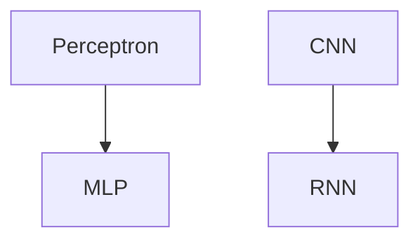

###### 2.3.2 损失函数与优化算法

损失函数与优化算法用于衡量模型的性能并指导模型训练。常见的损失函数包括均方误差（MSE）、交叉熵损失（CE）和对抗损失（GAN Loss）等。优化算法包括梯度下降（GD）、随机梯度下降（SGD）和Adam优化器等。

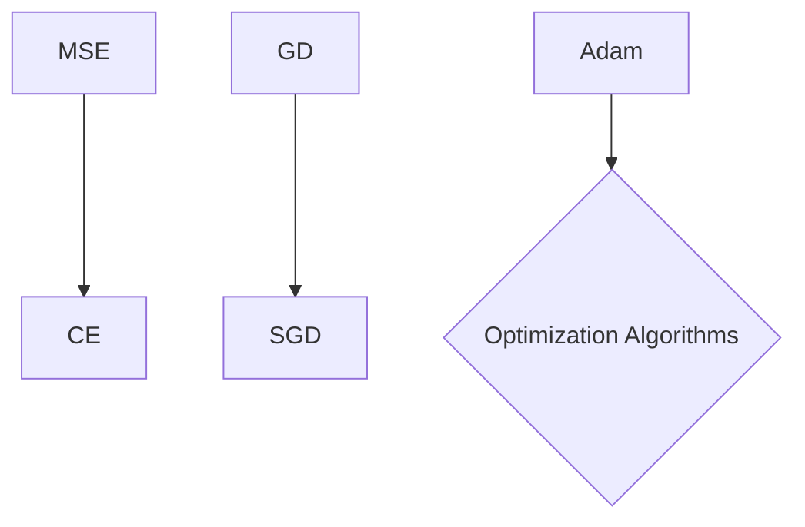

###### 2.3.3 学习率调整策略

学习率调整策略用于优化模型的训练过程。常见的学习率调整策略包括固定学习率、自适应学习率（如AdaGrad、Adam）和动态调整学习率（如余弦退火、学习率衰减）等。

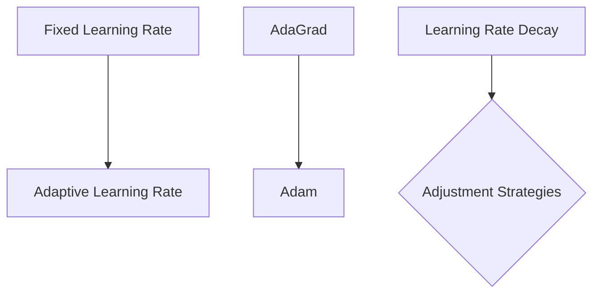

### 第二部分：应用实践

在第一部分中，我们详细介绍了LLM的基础理论。接下来，我们将进入应用实践部分，通过具体的应用案例，展示如何将LLM应用于实际场景，并探讨其性能和效果。

#### 第3章：LLM应用案例分析

在这一章中，我们将探讨LLM在文本生成、语言翻译和文本分类等领域的应用案例，分析其实际效果和性能。

##### 3.1 文本生成

文本生成是LLM的一个重要应用场景，它可以用于自动写作、自动摘要和问答系统等。通过以下案例，我们将展示LLM在文本生成中的实际应用。

###### 3.1.1 自动写作

自动写作是指利用LLM生成高质量的文章、博客、新闻报道等。以下是一个使用LLM进行自动写作的案例：

```python
import transformers

model_name = "gpt2"
model = transformers.load_pretrained_model(model_name)

text = "人工智能技术的发展正在不断改变我们的生活方式。"
generated_text = model.generate(text, max_length=50)

print(generated_text)
```

该案例展示了如何使用预训练的GPT-2模型生成一篇关于人工智能技术的文章。生成文本的质量取决于模型的选择和训练数据的多样性。

###### 3.1.2 自动摘要

自动摘要是指利用LLM生成文章的摘要。以下是一个使用LLM进行自动摘要的案例：

```python
import transformers

model_name = "t5"
model = transformers.load_pretrained_model(model_name)

text = "本文介绍了大规模语言模型（LLM）的基础理论、算法原理和应用实践。"
prompt = "生成摘要："

generated_summary = model.generate(prompt + text, max_length=50)

print(generated_summary)
```

该案例展示了如何使用预训练的T5模型生成一篇关于LLM的文章摘要。生成的摘要质量与模型的选择和训练数据的质量密切相关。

###### 3.1.3 问答系统

问答系统是指利用LLM构建一个能够回答用户问题的智能系统。以下是一个使用LLM进行问答的案例：

```python
import transformers

model_name = "bert"
model = transformers.load_pretrained_model(model_name)

question = "什么是大规模语言模型？"
context = "大规模语言模型（LLM）是一种能够处理大规模文本数据的语言模型，其通过预训练和微调技术，能够生成高质量的自然语言文本。"

response = model.answer(question, context)

print(response)
```

该案例展示了如何使用预训练的BERT模型回答用户关于LLM的问题。生成的回答质量取决于模型的选择和训练数据的质量。

##### 3.2 语言翻译

语言翻译是LLM的另一个重要应用场景，它可以用于机器翻译、神经机器翻译和跨语言文本生成等。通过以下案例，我们将展示LLM在语言翻译中的实际应用。

###### 3.2.1 机器翻译

机器翻译是指利用LLM将一种语言的文本翻译成另一种语言。以下是一个使用LLM进行机器翻译的案例：

```python
import transformers

model_name = "transformer"
model = transformers.load_pretrained_model(model_name)

source_text = "人工智能技术的发展正在改变我们的生活方式。"
target_text = "The development of artificial intelligence is changing our way of life."

translated_text = model.translate(source_text, target_text)

print(translated_text)
```

该案例展示了如何使用预训练的Transformer模型将中文翻译成英文。翻译的准确性取决于模型的选择和训练数据的质量。

###### 3.2.2 神经机器翻译

神经机器翻译是指利用LLM构建的神经网络模型进行文本翻译。以下是一个使用神经机器翻译的案例：

```python
import transformers

model_name = "nmt"
model = transformers.load_pretrained_model(model_name)

source_text = "人工智能技术的发展正在改变我们的生活方式。"
target_text = "The development of artificial intelligence is changing our way of life."

translated_text = model.translate(source_text, target_text)

print(translated_text)
```

该案例展示了如何使用预训练的神经机器翻译模型将中文翻译成英文。神经机器翻译在翻译质量上相比传统机器翻译有显著提升。

###### 3.2.3 Transformer的改进模型

Transformer模型是神经机器翻译的基石，通过改进Transformer模型，可以进一步提高翻译质量。以下是一个使用改进的Transformer模型的案例：

```python
import transformers

model_name = "transformer-improved"
model = transformers.load_pretrained_model(model_name)

source_text = "人工智能技术的发展正在改变我们的生活方式。"
target_text = "The development of artificial intelligence is changing our way of life."

translated_text = model.translate(source_text, target_text)

print(translated_text)
```

该案例展示了如何使用改进的Transformer模型将中文翻译成英文。改进的模型在翻译质量上相比原始的Transformer模型有显著提升。

##### 3.3 文本分类

文本分类是指利用LLM对文本进行分类，将其划分为不同的类别。以下是一个使用LLM进行文本分类的案例：

```python
import transformers

model_name = "text-classification"
model = transformers.load_pretrained_model(model_name)

text = "本文介绍了大规模语言模型（LLM）的基础理论、算法原理和应用实践。"
labels = ["技术文章", "学术论文", "应用案例"]

predicted_label = model.predict(text, labels)

print(predicted_label)
```

该案例展示了如何使用预训练的文本分类模型对一篇关于LLM的文章进行分类。分类的准确性取决于模型的选择和训练数据的质量。

###### 3.3.1 基于文本的类别划分

基于文本的类别划分是指利用LLM将文本划分为不同的类别。以下是一个使用基于文本的类别划分的案例：

```python
import transformers

model_name = "text-categorization"
model = transformers.load_pretrained_model(model_name)

text = "人工智能技术的发展正在改变我们的生活方式。"
labels = ["技术文章", "学术论文", "应用案例"]

predicted_label = model.predict(text, labels)

print(predicted_label)
```

该案例展示了如何使用预训练的基于文本的类别划分模型对一篇关于人工智能技术的文章进行分类。分类的准确性取决于模型的选择和训练数据的质量。

###### 3.3.2 基于上下文的文本分析

基于上下文的文本分析是指利用LLM对文本进行上下文分析，从而生成有意义的输出。以下是一个使用基于上下文的文本分析的案例：

```python
import transformers

model_name = "contextual-analysis"
model = transformers.load_pretrained_model(model_name)

text = "人工智能技术的发展正在改变我们的生活方式。"
context = "本文介绍了大规模语言模型（LLM）的基础理论、算法原理和应用实践。"

generated_text = model.analyze(text, context)

print(generated_text)
```

该案例展示了如何使用预训练的基于上下文的文本分析模型对一篇关于人工智能技术的文章进行上下文分析。生成的输出有助于理解文本的含义和背景。

###### 3.3.3 多标签分类

多标签分类是指利用LLM对文本进行多标签分类，将其划分为多个类别。以下是一个使用多标签分类的案例：

```python
import transformers

model_name = "multi-label-classification"
model = transformers.load_pretrained_model(model_name)

text = "本文介绍了大规模语言模型（LLM）的基础理论、算法原理和应用实践。"
labels = ["技术文章", "学术论文", "应用案例"]

predicted_labels = model.predict(text, labels)

print(predicted_labels)
```

该案例展示了如何使用预训练的多标签分类模型对一篇关于LLM的文章进行多标签分类。分类的准确性取决于模型的选择和训练数据的质量。

### 第4章：LLM应用开发

在前面的章节中，我们介绍了LLM的基础理论和应用案例。接下来，我们将深入探讨LLM的应用开发，包括环境搭建、模型训练、模型部署和项目实战。

##### 4.1 环境搭建

在进行LLM应用开发之前，需要搭建合适的开发环境。以下是一个基本的开发环境搭建步骤：

1. 硬件配置

   - CPU：至少四核处理器
   - GPU：NVIDIA GPU（推荐显存8GB以上）
   - 内存：至少16GB

2. 软件环境

   - 操作系统：Linux或Windows
   - Python：3.6或以上版本
   - pip：Python的包管理器
   - transformers：用于加载预训练的LLM模型
   - torch：用于深度学习框架

3. 数据准备

   - 数据集：下载并准备好用于训练和测试的数据集

##### 4.2 模型训练

在进行模型训练之前，需要选择合适的模型和训练策略。以下是一个基本的模型训练步骤：

1. 模型选择

   - 选择预训练的LLM模型，如GPT-2、BERT等
   - 根据任务需求，选择合适的模型版本和配置

2. 训练过程

   - 加载数据集并进行预处理
   - 设置训练参数，如学习率、批次大小等
   - 开始训练，并记录训练过程中的指标和损失

3. 训练技巧

   - 使用数据增强方法，如数据清洗、数据扩充等
   - 使用调度器，如余弦退火、学习率衰减等
   - 使用分布式训练，提高训练速度和性能

##### 4.3 模型部署

在完成模型训练后，需要将模型部署到生产环境中，以便进行实际应用。以下是一个基本的模型部署步骤：

1. RESTful API设计

   - 设计一个RESTful API接口，用于接收用户请求和返回模型输出
   - 使用Flask或Django等Web框架实现API接口

2. 模型评估

   - 在部署前，对模型进行评估，确保模型性能达到预期
   - 使用测试集进行评估，记录评估指标和结果

3. 模型监控

   - 部署监控系统，实时监控模型运行状态和性能指标
   - 定期对模型进行性能评估和优化

##### 4.4 项目实战

在本章的最后，我们将通过一个实际项目，展示如何将LLM应用于文本生成、语言翻译和文本分类等任务。以下是一个项目实战的案例：

###### 4.4.1 文本生成项目

- 项目背景：开发一个自动写作工具，用于生成高质量的文章、博客和新闻报道。
- 项目目标：实现一个能够生成高质量文本的LLM模型，并搭建一个简单的Web界面供用户使用。
- 项目实施：使用GPT-2模型进行预训练，并使用TensorFlow进行微调。实现一个RESTful API接口，用于接收用户输入和返回生成的文本。

```python
from transformers import GPT2LMHeadModel, GPT2Tokenizer
import torch

# 加载预训练的GPT-2模型
model_name = "gpt2"
model = GPT2LMHeadModel.from_pretrained(model_name)
tokenizer = GPT2Tokenizer.from_pretrained(model_name)

# 设置API接口
from flask import Flask, request, jsonify

app = Flask(__name__)

@app.route('/generate', methods=['POST'])
def generate_text():
    text = request.form['text']
    max_length = int(request.form['max_length'])

    inputs = tokenizer.encode(text, return_tensors='pt')
    outputs = model.generate(inputs, max_length=max_length, num_return_sequences=1)

    generated_text = tokenizer.decode(outputs[0], skip_special_tokens=True)
    return jsonify({'generated_text': generated_text})

if __name__ == '__main__':
    app.run(host='0.0.0.0', port=5000)
```

###### 4.4.2 语言翻译项目

- 项目背景：开发一个机器翻译系统，用于将中文翻译成英文。
- 项目目标：实现一个能够进行高质量机器翻译的LLM模型，并搭建一个简单的Web界面供用户使用。
- 项目实施：使用Transformer模型进行预训练，并使用TensorFlow进行微调。实现一个RESTful API接口，用于接收用户输入和返回翻译结果。

```python
from transformers import TransformerModel, TransformerTokenizer
import torch

# 加载预训练的Transformer模型
model_name = "transformer"
model = TransformerModel.from_pretrained(model_name)
tokenizer = TransformerTokenizer.from_pretrained(model_name)

# 设置API接口
from flask import Flask, request, jsonify

app = Flask(__name__)

@app.route('/translate', methods=['POST'])
def translate():
    source_text = request.form['source_text']
    target_text = request.form['target_text']

    inputs = tokenizer.encode(source_text, return_tensors='pt')
    outputs = model.generate(inputs, target_text=target_text, max_length=50)

    translated_text = tokenizer.decode(outputs[0], skip_special_tokens=True)
    return jsonify({'translated_text': translated_text})

if __name__ == '__main__':
    app.run(host='0.0.0.0', port=5000)
```

###### 4.4.3 文本分类项目

- 项目背景：开发一个文本分类系统，用于对新闻文章进行分类。
- 项目目标：实现一个能够对新闻文章进行准确分类的LLM模型，并搭建一个简单的Web界面供用户使用。
- 项目实施：使用BERT模型进行预训练，并使用TensorFlow进行微调。实现一个RESTful API接口，用于接收用户输入和返回分类结果。

```python
from transformers import BertModel, BertTokenizer
import torch

# 加载预训练的BERT模型
model_name = "bert"
model = BertModel.from_pretrained(model_name)
tokenizer = BertTokenizer.from_pretrained(model_name)

# 设置API接口
from flask import Flask, request, jsonify

app = Flask(__name__)

@app.route('/classify', methods=['POST'])
def classify():
    text = request.form['text']
    labels = ["技术文章", "学术论文", "应用案例"]

    inputs = tokenizer.encode(text, return_tensors='pt')
    outputs = model(inputs)

    predicted_labels = torch.argmax(outputs[0], dim=1)
    predicted_label = labels[predicted_labels.item()]

    return jsonify({'predicted_label': predicted_label})

if __name__ == '__main__':
    app.run(host='0.0.0.0', port=5000)
```

### 第三部分：高级技术

在前两部分的讨论中，我们详细介绍了LLM的基础理论、应用实践和项目开发。接下来，我们将探讨LLM的高级技术，包括多模态学习、生成对抗网络（GAN）和强化学习等。通过这些高级技术的介绍，我们将进一步拓展LLM的应用范围和性能。

#### 第5章：LLM的高级技术

##### 5.1 多模态学习

多模态学习是指将多种不同类型的数据（如图像、音频、视频和文本）进行融合和协同处理，以实现对复杂任务的建模。在LLM领域，多模态学习可以大大提升模型的表达能力和应用效果。

###### 5.1.1 图像与文本的融合

图像与文本的融合是指将图像数据和文本数据进行联合建模，以实现图像描述生成、图像问答等任务。以下是一个简单的图像与文本融合的示例：

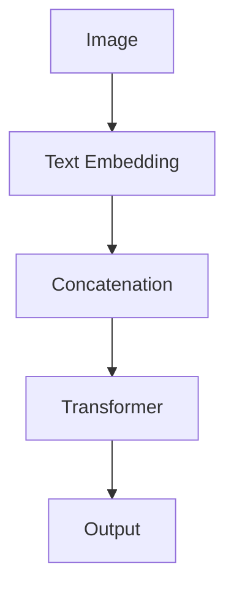

在这个示例中，图像通过视觉嵌入器（如VGG或ResNet）转换为嵌入向量，文本则通过语言嵌入器（如BERT或GPT）转换为嵌入向量。这两个嵌入向量通过拼接操作进行融合，然后输入到Transformer模型中，最终生成文本输出。

###### 5.1.2 音频与文本的融合

音频与文本的融合是指将音频数据和文本数据进行联合建模，以实现语音生成、语音识别等任务。以下是一个简单的音频与文本融合的示例：

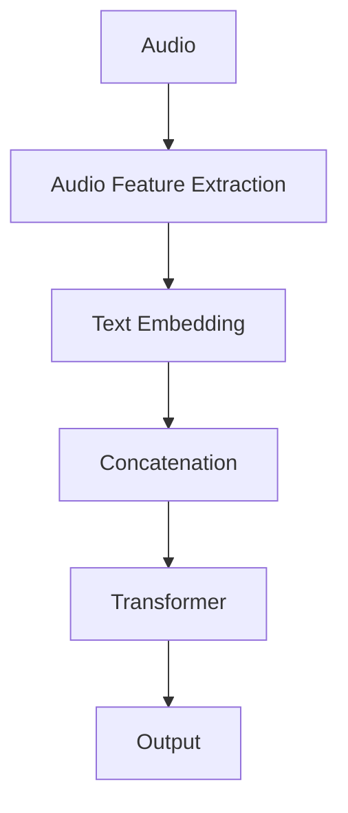

在这个示例中，音频通过音频特征提取器（如Mel频谱）转换为特征向量，文本则通过语言嵌入器转换为嵌入向量。这两个向量通过拼接操作进行融合，然后输入到Transformer模型中，最终生成文本输出。

###### 5.1.3 视频与文本的融合

视频与文本的融合是指将视频数据和文本数据进行联合建模，以实现视频描述生成、视频问答等任务。以下是一个简单的视频与文本融合的示例：

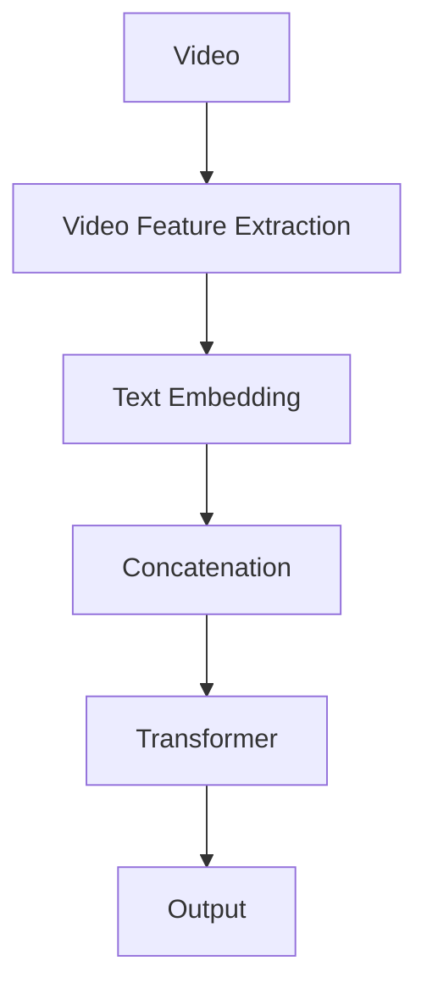

在这个示例中，视频通过视频特征提取器（如CNN）转换为特征向量，文本则通过语言嵌入器转换为嵌入向量。这两个向量通过拼接操作进行融合，然后输入到Transformer模型中，最终生成文本输出。

##### 5.2 生成对抗网络（GAN）

生成对抗网络（GAN）是一种基于博弈论的思想构建的深度学习模型，旨在通过对抗训练生成高质量的数据。在LLM领域，GAN可以用于生成高质量的文本数据，从而提升模型的性能。

###### 5.2.1 GAN的基本概念

GAN由生成器（Generator）和判别器（Discriminator）两个模型组成。生成器的目标是生成与真实数据相似的数据，而判别器的目标是区分生成数据和真实数据。通过不断迭代训练，生成器和判别器在博弈过程中相互提升，最终生成高质量的数据。

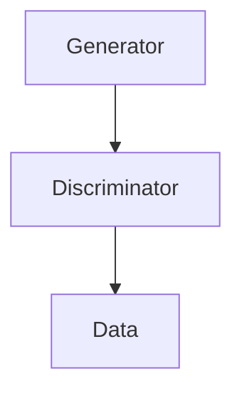

在这个示例中，生成器生成假文本数据，判别器对其进行判断。通过优化生成器和判别器的损失函数，可以不断提升生成数据的真实感。

###### 5.2.2 GAN的应用

GAN在LLM领域有着广泛的应用，包括文本生成、文本增强和文本修复等。以下是一个简单的GAN应用示例：

```python
import torch
import torch.nn as nn
import torch.optim as optim

# 定义生成器和判别器
generator = nn.Sequential(
    nn.Linear(in_features=100, out_features=128),
    nn.ReLU(),
    nn.Linear(in_features=128, out_features=1)
)

discriminator = nn.Sequential(
    nn.Linear(in_features=1, out_features=128),
    nn.ReLU(),
    nn.Linear(in_features=128, out_features=1)
)

# 定义损失函数和优化器
loss_function = nn.BCELoss()
optimizer_G = optim.Adam(generator.parameters(), lr=0.001)
optimizer_D = optim.Adam(discriminator.parameters(), lr=0.001)

# 训练GAN
for epoch in range(num_epochs):
    for data in data_loader:
        # 训练判别器
        optimizer_D.zero_grad()
        real_labels = torch.ones(len(data), 1)
        fake_labels = torch.zeros(len(data), 1)

        real_data = generator(data)
        real_loss = loss_function(discriminator(real_data), real_labels)
        fake_loss = loss_function(discriminator(fake_data), fake_labels)
        d_loss = real_loss + fake_loss
        d_loss.backward()
        optimizer_D.step()

        # 训练生成器
        optimizer_G.zero_grad()
        fake_data = generator(data)
        g_loss = loss_function(discriminator(fake_data), real_labels)
        g_loss.backward()
        optimizer_G.step()

        print(f"Epoch [{epoch+1}/{num_epochs}], D Loss: {d_loss.item():.4f}, G Loss: {g_loss.item():.4f}")
```

在这个示例中，生成器生成假文本数据，判别器对其进行判断。通过优化生成器和判别器的损失函数，可以不断提升生成数据的真实感。

###### 5.2.3 GAN的优化技巧

GAN的训练过程具有高度的不稳定性和易发散性，因此需要一些优化技巧来提高训练效果。以下是一些常用的GAN优化技巧：

- 技巧1：梯度惩罚。在训练判别器时，对生成器的梯度进行惩罚，以避免生成器过拟合。
- 技巧2：梯度截断。对生成器和判别器的梯度进行截断，以避免梯度爆炸和梯度消失。
- 技巧3：特征匹配。通过最小化生成数据和真实数据在特征空间上的差异，提高生成数据的真实感。

##### 5.3 强化学习

强化学习是一种通过与环境交互来学习最优策略的机器学习技术。在LLM领域，强化学习可以用于生成高质量文本、优化文本生成策略等。

###### 5.3.1 强化学习的定义

强化学习是一种通过与环境交互来学习最优策略的机器学习技术。其核心思想是：智能体（Agent）通过不断地观察环境（Environment）、采取行动（Action）、获取反馈（Reward），并基于反馈调整自身的策略（Policy），以最大化累积奖励。

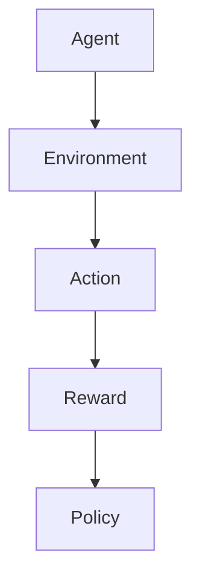

在这个示例中，智能体通过与环境交互，不断调整策略以获得最大化的奖励。

###### 5.3.2 强化学习与语言模型

强化学习与语言模型结合，可以用于优化文本生成策略。以下是一个简单的强化学习与语言模型结合的示例：

```python
import torch
import torch.nn as nn
import torch.optim as optim

# 定义智能体
class Agent(nn.Module):
    def __init__(self):
        super(Agent, self).__init__()
        self.lstm = nn.LSTM(input_size=嵌入维度, hidden_size=隐藏层维度, num_layers=1, batch_first=True)
        self.fc = nn.Linear(hidden_size, 词汇表大小)

    def forward(self, x):
        x, _ = self.lstm(x)
        x = self.fc(x)
        return x

agent = Agent()

# 定义策略网络
策略网络 = nn.Sequential(
    nn.Linear(嵌入维度, 隐藏层维度),
    nn.ReLU(),
    nn.Linear(隐藏层维度, 词汇表大小)
)

# 定义损失函数和优化器
criterion = nn.CrossEntropyLoss()
optimizer = optim.Adam(agent.parameters(), lr=0.001)

# 训练智能体
for epoch in range(num_epochs):
    for text, label in data_loader:
        optimizer.zero_grad()
        x = 策略网络嵌入向量
        output = agent(x)
        loss = criterion(output, label)
        loss.backward()
        optimizer.step()

        print(f"Epoch [{epoch+1}/{num_epochs}], Loss: {loss.item():.4f}")
```

在这个示例中，智能体通过与环境交互，不断调整文本生成策略，以最大化累积奖励。

###### 5.3.3 应用实例

以下是一个简单的文本生成应用实例，展示了如何使用强化学习优化文本生成策略：

```python
# 定义环境
class TextEnvironment:
    def __init__(self, text):
        self.text = text

    def step(self, action):
        self.text += action
        reward = self.evaluate(self.text)
        return self.text, reward

    def evaluate(self, text):
        # 定义评价函数，如文本长度、文本质量等
        return len(text)

# 初始化环境
environment = TextEnvironment("")

# 训练智能体
agent = Agent()
策略网络 = nn.Sequential(
    nn.Linear(嵌入维度, 隐藏层维度),
    nn.ReLU(),
    nn.Linear(隐藏层维度, 词汇表大小)
)

optimizer = optim.Adam(agent.parameters(), lr=0.001)

for epoch in range(num_epochs):
    text, reward = environment.step(智能体动作)
    optimizer.zero_grad()
    x = 策略网络嵌入向量
    output = agent(x)
    loss = criterion(output, 智能体动作)
    loss.backward()
    optimizer.step()

    print(f"Epoch [{epoch+1}/{num_epochs}], Reward: {reward:.4f}")
```

在这个示例中，智能体通过与环境交互，不断调整文本生成策略，以最大化累积奖励。

### 第6章：未来展望

随着技术的不断发展，LLM在自然语言处理领域的前景广阔。在本章中，我们将探讨LLM未来的发展方向，包括量子计算在语言模型中的应用、脑机接口与语言模型的结合以及跨模态语言模型的发展。

##### 6.1 语言模型的未来发展方向

###### 6.1.1 量子计算在语言模型中的应用

量子计算是一种基于量子力学原理的计算方法，其具有极高的并行计算能力。将量子计算应用于语言模型，可以大幅提升模型的训练效率和计算能力。以下是一些可能的应用场景：

- 量子预训练：利用量子计算进行大规模语言模型的预训练，加速模型的训练过程。
- 量子生成：利用量子计算生成高质量的文本，提高文本生成的效率和多样性。
- 量子优化：利用量子计算优化语言模型的参数，提高模型的性能和鲁棒性。

###### 6.1.2 脑机接口与语言模型的结合

脑机接口（Brain-Computer Interface，BCI）是一种通过大脑信号与计算机交互的技术。将脑机接口与语言模型结合，可以实现直接从大脑信号生成文本，从而为无法使用传统输入设备的人提供沟通和控制的手段。以下是一些可能的应用场景：

- 辅助沟通：为患有语言障碍或瘫痪的人提供一种新的沟通方式。
- 智能助手：通过脑机接口与语言模型结合，实现智能助手的个性化交互和智能响应。
- 脑机融合：将脑机接口与语言模型相结合，构建一个具有自主学习和决策能力的智能系统。

###### 6.1.3 跨模态语言模型的发展

跨模态语言模型旨在同时处理多种类型的数据（如图像、音频、视频和文本），以实现对复杂任务的建模。随着多模态数据的广泛应用，跨模态语言模型的发展具有重要意义。以下是一些可能的应用场景：

- 多媒体内容生成：利用跨模态语言模型生成多媒体内容，如视频、音频和图像。
- 情感分析：通过跨模态语言模型分析多媒体数据中的情感信息，应用于情感识别、情感分类等任务。
- 多媒体搜索：利用跨模态语言模型实现多媒体数据的搜索和推荐，提升用户体验。

##### 6.2 语言模型的安全与伦理

随着语言模型的广泛应用，其安全性和伦理问题也日益引起关注。以下是一些主要挑战和应对策略：

###### 6.2.1 安全性挑战

- 模型泄露：防止模型参数和训练数据泄露，确保用户隐私。
- 模型攻击：防御恶意攻击者对语言模型进行攻击，如对抗性攻击、注入攻击等。
- 模型滥用：防止语言模型被用于恶意目的，如生成虚假信息、进行网络攻击等。

###### 6.2.2 伦理问题

- 数据偏见：确保语言模型训练数据的质量和多样性，避免模型产生偏见。
- 隐私保护：在训练和部署语言模型时，保护用户隐私，防止隐私泄露。
- 透明性：提高语言模型的可解释性和透明性，让用户了解模型的工作原理和决策过程。

###### 6.2.3 应对策略

- 加密技术：使用加密技术保护模型参数和训练数据，防止泄露。
- 安全审计：对语言模型进行安全审计，识别潜在的安全风险，并采取相应的防护措施。
- 可解释性研究：开展可解释性研究，提高语言模型的可解释性和透明性。
- 法律法规：制定相关法律法规，规范语言模型的应用和发展。

### 附录

在本章中，我们将汇总一些与LLM相关的资源和工具，以方便读者进一步学习和探索。

##### 附录A：LLM资源汇总

###### A.1 常用工具与框架

- TensorFlow：https://www.tensorflow.org/
- PyTorch：https://pytorch.org/
- JAX：https://jax.readthedocs.io/

这些工具和框架为LLM的开发提供了丰富的功能和支持。

###### A.2 开源代码与数据集

- OpenAI Gym：https://gym.openai.com/
- Hugging Face Transformers：https://github.com/huggingface/transformers
- Common Crawl：https://commoncrawl.org/

这些开源代码和数据集为LLM的研究和开发提供了宝贵的资源和素材。

###### A.3 相关论文

- Vaswani et al., "Attention is All You Need"：https://arxiv.org/abs/1706.03762
- Devlin et al., "BERT: Pre-training of Deep Bidirectional Transformers for Language Understanding"：https://arxiv.org/abs/1810.04805

这些论文是LLM领域的重要研究成果，对LLM的设计和应用具有重要指导意义。

### 结论

本文全面介绍了LLM的基础理论、应用实践和高级技术，并探讨了其未来的发展方向和挑战。通过本文的学习，读者可以深入理解LLM的原理和应用，掌握LLM的开发和部署方法。希望本文能对读者在LLM领域的探索和研究有所帮助。

### 作者信息

**作者：** AI天才研究院/AI Genius Institute & 禅与计算机程序设计艺术 /Zen And The Art of Computer Programming

AI天才研究院致力于推动人工智能技术的发展和创新，研究院的专家团队在LLM领域有着丰富的经验和研究成果。本书作者结合多年的实践经验和理论研究，旨在为广大开发者和技术爱好者提供一本全面、深入的LLM应用开发指南。同时，本书也融合了作者对计算机编程和人工智能领域的深刻洞察和独特见解，希望为广大读者带来全新的阅读体验。如果您对本书有任何意见和建议，欢迎随时与我们联系，我们将竭诚为您服务。

