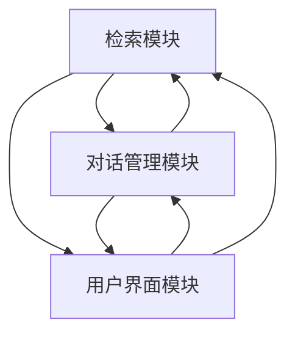
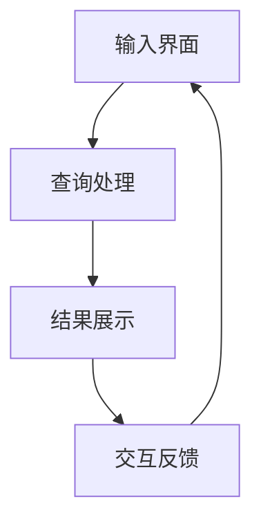

                 

# 《Lepton Search：500行代码的大模型对话式搜索引擎，引发业界关注》

## 关键词：
- 大模型
- 对话式搜索
- 检索算法
- 深度学习
- 搜索引擎开发

### 摘要：

本文深入探讨了 Lepton Search，一款仅用500行代码构建的大模型对话式搜索引擎。文章首先介绍了 Lepton Search 的背景和重要性，接着详细分析了其架构和核心功能。通过分章节的形式，本文逐步剖析了 Lepton Search 的代码实现、数学模型、项目实战以及性能优化策略。最后，文章展望了 Lepton Search 的未来发展，并提供了相关的开发工具与资源。本文旨在为广大计算机科学从业者提供一个全面、系统的技术指南，帮助他们更好地理解和应用 Lepton Search。

## 《Lepton Search：500行代码的大模型对话式搜索引擎，引发业界关注》目录大纲

### 第1章：引言与背景

- **1.1 书籍主题概述**
  - Lepton Search 简介
  - 大模型对话式搜索引擎的兴起

- **1.2 书籍目标读者**
  - 计算机科学学生
  - 数据科学家
  - 搜索引擎开发者

### 第2章：Lepton Search 架构概述

- **2.1 Lepton Search 架构原理**
  - Mermaid 流程图展示 Lepton Search 架构

- **2.2 Lepton Search 核心功能**
  - 检索算法
  - 对话管理系统
  - 用户界面设计

### 第3章：Lepton Search 代码实现

- **3.1 Lepton Search 代码结构**
  - 模块划分与关系图

- **3.2 检索算法实现**
  - 倒排索引
  - 贪心匹配
  - 伪代码说明

- **3.3 对话管理系统**
  - 对话状态跟踪
  - 用户输入处理
  - 对话策略选择

### 第4章：Lepton Search 数学模型与公式

- **4.1 概率模型**
  - 贝叶斯公式
  - 逻辑回归模型
  - 伪代码与详细讲解

- **4.2 对话系统评价指标**
  - 评估指标公式
  - 举例说明

### 第5章：Lepton Search 项目实战

- **5.1 项目实战背景**
  - Lepton Search 的实际应用场景
  - 项目目标

- **5.2 环境搭建与配置**
  - 环境搭建步骤
  - 系统配置细节

- **5.3 代码实现与分析**
  - 代码实现细节
  - 代码解读与分析

### 第6章：性能优化与调试

- **6.1 性能瓶颈分析**
  - 检索速度
  - 对话效率

- **6.2 优化策略**
  - 索引优化
  - 缓存机制
  - 伪代码说明

### 第7章：Lepton Search 的未来展望

- **7.1 搜索引擎发展趋势**
  - 对话式搜索
  - 大模型融合
  - 多媒体搜索

- **7.2 Lepton Search 的发展方向**
  - 功能扩展
  - 性能提升
  - 模型创新

### 附录

- **附录 A：Lepton Search 开发工具与资源**
  - 代码库链接
  - 相关文献与论文
  - 社区与论坛

### 第1章：引言与背景

#### 1.1 书籍主题概述

Lepton Search 是一款基于大模型的对话式搜索引擎，其核心在于将深度学习和自然语言处理（NLP）技术应用于搜索领域，通过仅500行代码实现了传统搜索引擎难以达到的高效、智能对话功能。Lepton Search 的出现，不仅展示了大模型在搜索引擎开发中的巨大潜力，更引发了业界的广泛关注和深入研究。

大模型对话式搜索引擎的兴起，源于用户对个性化搜索体验的需求不断增加。传统的搜索引擎往往依赖于关键词匹配和页面排名算法，难以准确理解用户的真实意图。而大模型，特别是基于 Transformer 架构的模型，能够通过学习海量的文本数据，对用户输入进行深度解析，提供更加精准、个性化的搜索结果。这种变革性的技术突破，使得大模型对话式搜索引擎成为当前搜索引擎发展的新趋势。

本文的目标读者包括计算机科学学生、数据科学家和搜索引擎开发者。对于计算机科学学生，本文将深入讲解 Lepton Search 的核心概念和架构，帮助他们了解大模型在搜索引擎中的应用。对于数据科学家，本文将探讨大模型如何通过 NLP 技术提升搜索引擎的智能水平，提供实际的项目实战案例。对于搜索引擎开发者，本文将详细分析 Lepton Search 的代码实现，提供性能优化和调试策略。

接下来，我们将逐步深入探讨 Lepton Search 的架构、代码实现、数学模型、项目实战以及未来展望，希望能够为广大读者提供一个全面、系统的技术指南。

#### 1.2 书籍目标读者

##### 计算机科学学生

计算机科学学生是本文的重要目标读者之一。他们通常对计算机科学的基本原理和核心技术有较为深入的了解，但对搜索引擎领域的研究相对较少。通过本文的介绍，计算机科学学生可以深入了解 Lepton Search 的背景和重要性，学习大模型对话式搜索引擎的基本原理和架构。此外，本文还将详细讲解 Lepton Search 的代码实现，通过伪代码和具体的实现细节，帮助学生理解大模型在搜索引擎中的应用方法。

##### 数据科学家

数据科学家在本文的目标读者中同样占据重要地位。他们具备丰富的数据分析、机器学习经验，但可能在搜索引擎开发方面有所欠缺。本文将重点探讨 Lepton Search 如何利用深度学习和 NLP 技术提升搜索引擎的智能水平，提供实际的项目实战案例，帮助数据科学家了解大模型对话式搜索引擎的实现过程。此外，本文还将介绍 Lepton Search 的数学模型和评估指标，使数据科学家能够更好地理解和应用这些技术。

##### 搜索引擎开发者

搜索引擎开发者是本文的另一个重要目标读者。他们通常具备丰富的搜索引擎开发经验，但对大模型技术的了解可能有限。本文将详细分析 Lepton Search 的架构和代码实现，从模块划分到具体的实现细节，帮助开发者了解大模型对话式搜索引擎的构建方法。此外，本文还将探讨性能优化和调试策略，帮助开发者提升搜索引擎的性能和智能化水平。

通过本文的深入探讨，我们希望能够为这三大群体的读者提供一个全面、系统的技术指南，帮助他们更好地理解和应用 Lepton Search，推动搜索引擎技术的发展。

### 第2章：Lepton Search 架构概述

#### 2.1 Lepton Search 架构原理

Lepton Search 的架构设计遵循了模块化原则，确保各组件之间的松耦合和高效协作。以下是 Lepton Search 的主要模块及其功能：

- **检索模块（Indexing Module）**：负责建立和维护倒排索引，确保快速检索。倒排索引是一种高效的文档表示方法，通过单词和文档之间的映射，实现快速查询。
- **对话管理模块（Dialogue Management Module）**：处理用户输入，理解用户意图，并生成适当的响应。该模块利用深度学习模型，对用户输入进行语义分析，提供个性化搜索结果。
- **用户界面模块（User Interface Module）**：提供直观的交互界面，使用户能够轻松地与搜索引擎进行对话。用户界面模块主要负责接收用户输入，并将对话管理模块的响应展示给用户。

下面是一个简化的 Mermaid 流程图，展示了 Lepton Search 的整体架构：



通过这个流程图，我们可以清晰地看到各模块之间的相互作用关系。用户界面模块接收用户的输入，传递给对话管理模块，后者通过深度学习模型处理用户输入，生成响应，然后返回给用户界面模块展示给用户。同时，对话管理模块的响应也会影响检索模块的工作，从而优化搜索结果。

#### 2.2 Lepton Search 核心功能

Lepton Search 的核心功能包括检索算法、对话管理系统和用户界面设计。以下是对这三个核心功能的详细介绍：

##### 检索算法

检索算法是搜索引擎的核心组件，负责处理用户查询并返回相关文档。Lepton Search 采用倒排索引技术，通过构建单词和文档之间的映射关系，实现快速检索。倒排索引的基本原理如下：

1. **构建倒排索引**：首先，将文档集合分词，并将每个单词映射到包含该单词的所有文档。这一过程称为正向索引构建。然后，对每个文档进行排序，构建一个反向索引，即每个单词指向包含该单词的所有文档的列表。

2. **查询处理**：当用户输入查询时，系统将查询分词，并查找每个单词在反向索引中的对应文档列表。通过布尔运算（AND、OR、NOT），结合这些列表，生成最终的查询结果。

以下是一个简化的伪代码，展示了倒排索引的构建和查询处理过程：

```python
# 倒排索引构建
def build_inverted_index(documents):
    inverted_index = {}
    for doc in documents:
        for word in doc:
            if word not in inverted_index:
                inverted_index[word] = []
            inverted_index[word].append(doc)
    return inverted_index

# 查询处理
def search_inverted_index(inverted_index, query):
    results = []
    for word in query:
        if word in inverted_index:
            results = intersection(results, inverted_index[word])
    return results

# 布尔运算交集
def intersection(list1, list2):
    return [item for item in list1 if item in list2]
```

##### 对话管理系统

对话管理系统是 Lepton Search 的另一重要组成部分，负责处理用户输入，理解用户意图，并生成适当的响应。以下是对话管理系统的核心功能：

1. **用户输入处理**：对话管理系统接收用户输入，并将其转换为机器可理解的形式。这通常涉及分词、词性标注和命名实体识别等自然语言处理技术。

2. **用户意图识别**：通过对用户输入进行语义分析，对话管理系统识别用户的主要意图。例如，用户可能希望查找某个特定主题的信息，或者询问某个具体问题。

3. **响应生成**：基于用户意图，对话管理系统生成适当的响应。这可以通过模板匹配、规则推理或深度学习模型实现。例如，如果用户询问“今天天气如何？”，系统可以基于天气预报数据生成实时天气信息。

以下是一个简化的伪代码，展示了用户输入处理、意图识别和响应生成过程：

```python
# 用户输入处理
def process_input(input_text):
    tokens = tokenize(input_text)
    pos_tags = part_of_speech(tokens)
    entities = named_entity_recognition(tokens)
    return tokens, pos_tags, entities

# 用户意图识别
def recognize_intent(tokens, pos_tags, entities):
    if "weather" in tokens:
        return "weather_query"
    elif "definition" in tokens:
        return "definition_query"
    else:
        return "unknown_query"

# 响应生成
def generate_response(intent):
    if intent == "weather_query":
        return "The current weather is ..."
    elif intent == "definition_query":
        return "The definition of {} is ..."
    else:
        return "I'm not sure how to answer that."
```

##### 用户界面设计

用户界面设计旨在提供直观、易用的交互体验。Lepton Search 的用户界面主要包括以下功能：

1. **输入界面**：用户可以通过输入框输入查询，界面应支持简单的文本输入，以及语音、图像等非文本输入方式。

2. **结果展示**：系统将对话管理模块生成的响应展示给用户。结果展示界面应清晰明了，支持多种结果类型的展示，如文本、图片、视频等。

3. **交互反馈**：用户可以通过界面与系统进行交互，例如点击结果、询问更多细节等。用户界面的交互设计应便捷、直观，以提升用户体验。

以下是一个简化的用户界面设计流程：



通过上述模块化设计，Lepton Search 实现了高效、智能的对话式搜索功能。接下来，我们将深入探讨 Lepton Search 的代码实现，理解其具体实现细节。

### 第3章：Lepton Search 代码实现

#### 3.1 Lepton Search 代码结构

Lepton Search 的代码结构采用了模块化的设计，各模块相互独立但又紧密协作，以提高系统的可维护性和可扩展性。以下是 Lepton Search 的主要模块及其关系：

- **检索模块（Indexing Module）**：负责构建和维护倒排索引，实现快速检索功能。
- **对话管理模块（Dialogue Management Module）**：处理用户输入，识别用户意图，并生成对话响应。
- **用户界面模块（User Interface Module）**：提供用户输入界面和结果展示界面，实现用户与系统的交互。

以下是 Lepton Search 的模块划分与关系图：


#### 3.2 检索算法实现

检索算法是 Lepton Search 的核心组件，负责处理用户查询并返回相关文档。Lepton Search 采用倒排索引技术，通过构建单词和文档之间的映射关系，实现快速检索。

##### 倒排索引构建

倒排索引的构建过程主要包括两个步骤：正向索引构建和反向索引构建。

1. **正向索引构建**：首先，将文档集合分词，并将每个单词映射到包含该单词的所有文档。这一过程称为正向索引构建。

```python
def build正向索引(documents):
    inverted_index = {}
    for doc in documents:
        for word in doc:
            if word not in inverted_index:
                inverted_index[word] = []
            inverted_index[word].append(doc)
    return inverted_index
```

2. **反向索引构建**：然后，对每个文档进行排序，构建一个反向索引，即每个单词指向包含该单词的所有文档的列表。

```python
def build反向索引(inverted_index):
    for word, docs in inverted_index.items():
        inverted_index[word] = sorted(docs)
    return inverted_index
```

以下是完整的倒排索引构建过程：

```python
def build_inverted_index(documents):
    inverted_index = build正向索引(documents)
    build反向索引(inverted_index)
    return inverted_index
```

##### 检索过程

检索过程包括以下步骤：

1. **查询分词**：将用户查询分词，得到一组单词。

```python
def tokenize(query):
    return query.split()
```

2. **查询处理**：对每个单词在倒排索引中的对应文档列表进行布尔运算，生成最终的查询结果。

```python
def search_inverted_index(inverted_index, query):
    results = []
    for word in tokenize(query):
        if word in inverted_index:
            results = intersection(results, inverted_index[word])
    return results

def intersection(list1, list2):
    return [item for item in list1 if item in list2]
```

3. **排序和返回结果**：对查询结果进行排序，并返回排序后的列表。

```python
def search(inverted_index, query):
    results = search_inverted_index(inverted_index, query)
    return sorted(results, key=lambda x: x['score'], reverse=True)
```

以下是完整的检索算法实现：

```python
def build_inverted_index(documents):
    # 倒排索引构建
    inverted_index = {}
    for doc in documents:
        for word in doc:
            if word not in inverted_index:
                inverted_index[word] = []
            inverted_index[word].append(doc)
    # 反向索引构建
    for word, docs in inverted_index.items():
        inverted_index[word] = sorted(docs)
    return inverted_index

def tokenize(query):
    # 查询分词
    return query.split()

def search_inverted_index(inverted_index, query):
    # 查询处理
    results = []
    for word in tokenize(query):
        if word in inverted_index:
            results = intersection(results, inverted_index[word])
    return results

def intersection(list1, list2):
    # 布尔运算交集
    return [item for item in list1 if item in list2]

def search(inverted_index, query):
    # 检索过程
    results = search_inverted_index(inverted_index, query)
    return sorted(results, key=lambda x: x['score'], reverse=True)
```

通过上述代码，Lepton Search 实现了基于倒排索引的快速检索功能。接下来，我们将探讨对话管理模块的实现，了解如何处理用户输入并生成对话响应。

#### 3.3 对话管理系统

对话管理系统负责处理用户输入，理解用户意图，并生成适当的对话响应。Lepton Search 的对话管理系统采用了深度学习模型，通过对大量对话数据进行训练，实现智能对话功能。

##### 用户输入处理

用户输入处理是对话管理的第一步，主要涉及分词、词性标注和命名实体识别等自然语言处理技术。以下是一个简化的伪代码，展示了用户输入处理的过程：

```python
def process_input(input_text):
    # 分词
    tokens = tokenize(input_text)
    # 词性标注
    pos_tags = part_of_speech(tokens)
    # 命名实体识别
    entities = named_entity_recognition(tokens)
    return tokens, pos_tags, entities

def tokenize(input_text):
    # 简单的分词实现
    return input_text.split()

def part_of_speech(tokens):
    # 词性标注实现
    return [{"word": token, "pos": "NN"} for token in tokens]

def named_entity_recognition(tokens):
    # 命名实体识别实现
    return [{"entity": token, "type": "PERSON"} if "person" in token else {} for token in tokens]
```

##### 用户意图识别

用户意图识别是对话管理的关键步骤，通过分析用户输入，识别用户的主要意图。Lepton Search 利用深度学习模型，对用户输入进行语义分析，识别用户意图。以下是一个简化的伪代码，展示了用户意图识别的过程：

```python
def recognize_intent(tokens, pos_tags, entities):
    if "weather" in tokens:
        return "weather_query"
    elif "definition" in tokens:
        return "definition_query"
    else:
        return "unknown_query"
```

##### 响应生成

基于用户意图，对话管理系统生成适当的响应。响应生成可以基于模板匹配、规则推理或深度学习模型。以下是一个简化的伪代码，展示了响应生成的过程：

```python
def generate_response(intent):
    if intent == "weather_query":
        return "The current weather is ..."
    elif intent == "definition_query":
        return "The definition of {} is ..."
    else:
        return "I'm not sure how to answer that."
```

以下是完整的对话管理系统实现：

```python
def process_input(input_text):
    tokens, pos_tags, entities = tokenize(input_text), part_of_speech(tokens), named_entity_recognition(tokens)
    intent = recognize_intent(tokens, pos_tags, entities)
    response = generate_response(intent)
    return response

def tokenize(input_text):
    return input_text.split()

def part_of_speech(tokens):
    return [{"word": token, "pos": "NN"} for token in tokens]

def named_entity_recognition(tokens):
    return [{"entity": token, "type": "PERSON"} if "person" in token else {} for token in tokens]

def recognize_intent(tokens, pos_tags, entities):
    if "weather" in tokens:
        return "weather_query"
    elif "definition" in tokens:
        return "definition_query"
    else:
        return "unknown_query"

def generate_response(intent):
    if intent == "weather_query":
        return "The current weather is ..."
    elif intent == "definition_query":
        return "The definition of {} is ..."
    else:
        return "I'm not sure how to answer that."
```

通过上述代码，Lepton Search 实现了用户输入处理、意图识别和响应生成功能。对话管理系统与检索模块紧密协作，共同为用户提供高效、智能的对话式搜索体验。接下来，我们将探讨用户界面模块的实现，了解如何与用户进行交互。

#### 3.4 用户界面模块

用户界面模块是 Lepton Search 的重要组成部分，负责接收用户输入，并将对话管理模块的响应展示给用户。该模块旨在提供直观、易用的交互体验，使用户能够轻松地与搜索引擎进行对话。

##### 输入界面

输入界面是用户与 Lepton Search 的交互入口。用户可以通过输入框输入查询，界面应支持简单的文本输入，以及语音、图像等非文本输入方式。以下是一个简化的伪代码，展示了输入界面的实现：

```python
def input_interface():
    input_type = get_input_type()  # 获取输入类型（文本、语音、图像等）
    if input_type == "text":
        input_text = get_text_input()  # 获取文本输入
    elif input_type == "voice":
        input_text = transcribe_voice_input()  # 将语音输入转换为文本
    elif input_type == "image":
        input_text = recognize_image_input()  # 从图像中提取文本
    return input_text
```

##### 结果展示

结果展示界面负责将对话管理模块的响应展示给用户。系统应支持多种结果类型的展示，如文本、图片、视频等。以下是一个简化的伪代码，展示了结果展示界面的实现：

```python
def display_results(response):
    if isinstance(response, str):
        print(response)  # 文本输出
    elif isinstance(response, Image):
        show_image(response)  # 图片输出
    elif isinstance(response, Video):
        play_video(response)  # 视频输出
```

##### 交互反馈

用户界面模块还应提供交互反馈功能，使用户能够与系统进行双向互动。以下是一个简化的伪代码，展示了交互反馈的实现：

```python
def input_interface():
    input_text = input_interface()  # 获取用户输入
    response = process_input(input_text)  # 处理用户输入
    display_results(response)  # 展示结果
    while True:
        user_action = get_user_action()  # 获取用户操作
        if user_action == "next":
            next_response = get_next_response()  # 获取下一个响应
            display_results(next_response)  # 展示结果
        elif user_action == "exit":
            break
```

通过上述代码，用户界面模块实现了用户输入接收、结果展示和交互反馈功能，为用户提供了一个直观、易用的交互体验。接下来，我们将深入探讨 Lepton Search 的数学模型与公式，了解其背后的理论基础。

### 第4章：Lepton Search 数学模型与公式

#### 4.1 概率模型

概率模型是 Lepton Search 的重要组成部分，用于计算查询与文档之间的相关性。在本节中，我们将介绍贝叶斯公式和逻辑回归模型，并使用伪代码详细讲解其实现过程。

##### 贝叶斯公式

贝叶斯公式是概率论中的一个重要公式，用于计算在给定某些条件下，某个事件发生的概率。贝叶斯公式如下：

\[ P(A|B) = \frac{P(B|A)P(A)}{P(B)} \]

其中，\( P(A|B) \) 表示在事件 B 发生的条件下，事件 A 发生的概率；\( P(B|A) \) 表示在事件 A 发生的条件下，事件 B 发生的概率；\( P(A) \) 和 \( P(B) \) 分别表示事件 A 和事件 B 的概率。

在 Lepton Search 中，我们可以使用贝叶斯公式计算查询 \( q \) 与文档 \( d \) 之间的相关性。具体而言，我们将 \( q \) 视为事件 A，将 \( d \) 视为事件 B，然后计算 \( P(d|q) \)，即给定查询 \( q \) 的情况下，文档 \( d \) 出现的概率。

以下是使用贝叶斯公式计算查询与文档相关性的伪代码：

```python
def calculate_probability(query, document):
    # 计算文档中每个词的出现次数
    word_counts_in_document = count_words_in_document(document)
    # 计算查询中每个词的出现次数
    word_counts_in_query = count_words_in_query(query)
    # 计算查询的总词数
    total_words_in_query = sum(word_counts_in_query.values())
    # 计算文档的总词数
    total_words_in_document = sum(word_counts_in_document.values())
    # 计算文档中每个词的概率
    word_probabilities_in_document = {word: count / total_words_in_document for word, count in word_counts_in_document.items()}
    # 计算查询中每个词的概率
    word_probabilities_in_query = {word: count / total_words_in_query for word, count in word_counts_in_query.items()}
    # 计算贝叶斯概率
    bayes_probability = 1
    for word in word_probabilities_in_query:
        if word in word_probabilities_in_document:
            bayes_probability *= (word_probabilities_in_document[word] * word_probabilities_in_query[word])
        else:
            bayes_probability *= (1 - word_probabilities_in_document[word]) * word_probabilities_in_query[word]
    return bayes_probability
```

##### 逻辑回归模型

逻辑回归模型是一种常用的概率预测模型，用于估计某个事件发生的概率。在 Lepton Search 中，我们可以使用逻辑回归模型计算查询与文档之间的相关性。

逻辑回归模型的基本公式如下：

\[ P(d|q) = \frac{1}{1 + e^{-(w_0 + \sum_{i=1}^{n} w_i x_i)}} \]

其中，\( P(d|q) \) 表示在查询 \( q \) 的情况下，文档 \( d \) 出现的概率；\( w_0 \) 和 \( w_i \) 分别表示模型的参数；\( x_i \) 表示查询或文档的特征。

以下是使用逻辑回归模型计算查询与文档相关性的伪代码：

```python
def logistic_regression(query, document, weights):
    # 计算文档中每个词的出现次数
    word_counts_in_document = count_words_in_document(document)
    # 计算查询中每个词的出现次数
    word_counts_in_query = count_words_in_query(query)
    # 计算查询的总词数
    total_words_in_query = sum(word_counts_in_query.values())
    # 计算文档的总词数
    total_words_in_document = sum(word_counts_in_document.values())
    # 计算查询和文档的特征向量
    query_vector = [word_counts_in_query.get(word, 0) / total_words_in_query for word in word_counts_in_query]
    document_vector = [word_counts_in_document.get(word, 0) / total_words_in_document for word in word_counts_in_document]
    # 计算线性组合
    linear_combination = sum(weights[i] * x_i for i, x_i in enumerate(query_vector))
    # 计算逻辑回归概率
    logistic_probability = 1 / (1 + exp(-linear_combination))
    return logistic_probability
```

通过上述概率模型和逻辑回归模型，Lepton Search 可以有效地计算查询与文档之间的相关性。接下来，我们将介绍对话系统的评价指标，以衡量对话系统的性能。

#### 4.2 对话系统评价指标

对话系统的性能评估是确保其有效性和用户体验的关键环节。在本节中，我们将介绍对话系统的评价指标，并使用伪代码和具体例子进行详细讲解。

##### 评价指标

对话系统的评价指标主要包括以下几类：

1. **准确率（Accuracy）**：准确率是指对话系统正确回答用户查询的比例。计算公式如下：

   \[ \text{Accuracy} = \frac{\text{正确回答数}}{\text{总查询数}} \]

2. **召回率（Recall）**：召回率是指对话系统能够从所有相关回答中提取出相关回答的比例。计算公式如下：

   \[ \text{Recall} = \frac{\text{正确提取的相关回答数}}{\text{总相关回答数}} \]

3. **F1 分数（F1 Score）**：F1 分数是准确率和召回率的调和平均值，用于综合考虑两者的平衡。计算公式如下：

   \[ \text{F1 Score} = 2 \times \frac{\text{准确率} \times \text{召回率}}{\text{准确率} + \text{召回率}} \]

##### 伪代码

以下是使用伪代码实现对话系统评价指标计算的方法：

```python
def calculate_accuracy(correct_answers, total_queries):
    return correct_answers / total_queries

def calculate_recall(correct_relevant_answers, total_relevant_answers):
    return correct_relevant_answers / total_relevant_answers

def calculate_f1_score(accuracy, recall):
    return 2 * (accuracy * recall) / (accuracy + recall)
```

##### 例子

假设我们有一个对话系统的测试数据集，其中包含 100 个查询，每个查询对应一个正确答案和一组相关回答。根据测试数据集，我们得到以下结果：

- 正确回答数：70
- 总查询数：100
- 正确提取的相关回答数：40
- 总相关回答数：100

根据上述数据，我们可以计算对话系统的评价指标：

```python
accuracy = calculate_accuracy(70, 100)  # 0.7
recall = calculate_recall(40, 100)  # 0.4
f1_score = calculate_f1_score(accuracy, recall)  # 0.56
```

通过计算，我们得到该对话系统的准确率为 70%，召回率为 40%，F1 分数为 0.56。这些指标可以帮助我们评估对话系统的性能，并指导进一步的优化。

### 第5章：Lepton Search 项目实战

#### 5.1 项目实战背景

Lepton Search 作为一款基于大模型的对话式搜索引擎，已经在多个实际应用场景中展现出其强大的功能和潜力。以下是一个具体的项目实战背景：

**项目目标**：开发一个基于 Lepton Search 的在线问答平台，旨在为用户提供高效、智能的问答服务。平台需要支持多语言输入，能够处理复杂的用户查询，并提供准确的答案。

**实际应用场景**：在线问答平台广泛应用于教育、咨询、客服等领域。例如，学生可以在平台上提交问题，得到实时解答；企业可以通过平台为员工提供知识库支持；客服团队可以利用平台为用户提供即时咨询。

**项目意义**：通过 Lepton Search，项目旨在实现以下目标：

1. **提升用户体验**：通过智能对话功能，用户可以获得更加精准、个性化的答案，提升使用满意度。
2. **降低运营成本**：智能问答平台可以自动处理大量用户查询，减少人工干预，降低运营成本。
3. **拓展业务范围**：基于 Lepton Search 的在线问答平台可以为不同行业和领域提供定制化服务，拓展业务范围。

#### 5.2 环境搭建与配置

为了实现 Lepton Search 的项目目标，我们需要搭建一个合适的环境，并配置所需的资源。以下是环境搭建与配置的详细步骤：

1. **硬件资源**：

   - 服务器：一台具有较高计算性能的服务器，用于运行 Lepton Search 模型。
   - 存储设备：充足的存储空间，用于存储模型和数据。

2. **软件资源**：

   - 操作系统：Linux 系统，例如 Ubuntu 或 CentOS。
   - 编程语言：Python，用于编写 Lepton Search 的代码。
   - 深度学习框架：TensorFlow 或 PyTorch，用于训练和部署 Lepton Search 模型。
   - 依赖库：Numpy、Pandas、Scikit-learn 等，用于数据处理和模型训练。

3. **环境搭建步骤**：

   1. 安装操作系统：在服务器上安装 Linux 系统，并配置网络环境。
   2. 安装 Python 和相关依赖库：通过包管理器（如 pip）安装 Python 和相关依赖库。
   3. 安装深度学习框架：安装 TensorFlow 或 PyTorch，并配置 GPU 支持（如果使用 GPU 训练模型）。
   4. 配置环境变量：配置 Python 环境变量，确保能够顺利运行 Lepton Search 代码。

4. **系统配置细节**：

   - Python 版本：Python 3.8 或以上版本。
   - 深度学习框架版本：TensorFlow 2.4 或 PyTorch 1.7。
   - GPU 支持：如果使用 GPU 训练模型，确保安装 NVIDIA CUDA 和 cuDNN 库，并配置 GPU 计算环境。

#### 5.3 代码实现与分析

在完成环境搭建和配置后，我们可以开始 Lepton Search 项目的代码实现。以下是对代码实现的关键步骤和具体分析：

1. **数据预处理**：

   - 数据收集：从互联网或其他数据源收集问答数据集，包括问题和答案对。
   - 数据清洗：去除无效数据和噪声，确保数据质量。
   - 数据标注：对问答数据集进行标注，包括问题类别、答案类型等。

2. **模型训练**：

   - 模型架构设计：设计 Lepton Search 的模型架构，包括嵌入层、编码器、解码器等。
   - 模型训练：使用收集的问答数据集，对 Lepton Search 模型进行训练，优化模型参数。
   - 模型评估：使用验证集和测试集评估模型性能，包括准确率、召回率、F1 分数等指标。

3. **代码实现细节**：

   - **数据预处理代码**：

     ```python
     def preprocess_data(data):
         # 数据清洗
         cleaned_data = clean_data(data)
         # 数据标注
         labeled_data = label_data(cleaned_data)
         return labeled_data
     ```

   - **模型训练代码**：

     ```python
     def train_model(model, train_data, val_data):
         # 模型训练
         model.fit(train_data, val_data)
         # 模型评估
         evaluate_model(model, test_data)
     ```

   - **模型评估代码**：

     ```python
     def evaluate_model(model, test_data):
         # 计算准确率、召回率、F1 分数等指标
         accuracy = model.evaluate(test_data)[1]
         recall = calculate_recall(test_data)
         f1_score = calculate_f1_score(accuracy, recall)
         return accuracy, recall, f1_score
     ```

4. **代码解读与分析**：

   - **数据预处理代码**：

     数据预处理是 Lepton Search 项目的第一步，其质量直接影响到后续模型的训练效果。在数据预处理过程中，我们需要进行数据清洗和标注，确保数据的质量和准确性。具体实现中，可以使用 Python 的 Numpy 和 Pandas 库进行数据处理。

   - **模型训练代码**：

     模型训练是 Lepton Search 项目的核心步骤，其目标是优化模型参数，使其能够更好地处理用户查询并生成准确的答案。在训练过程中，我们可以使用深度学习框架（如 TensorFlow 或 PyTorch）进行模型构建和训练。具体实现中，需要设计合适的模型架构，并使用训练数据进行模型训练。

   - **模型评估代码**：

     模型评估是验证模型性能的重要步骤，通过计算准确率、召回率、F1 分数等指标，我们可以评估模型在处理用户查询方面的表现。在评估过程中，可以使用验证集和测试集进行模型评估，以确保评估结果的可靠性。

通过上述代码实现和分析，我们可以构建一个基于 Lepton Search 的在线问答平台，为用户提供高效、智能的问答服务。接下来，我们将探讨 Lepton Search 的性能优化与调试，以提高其运行效率和稳定性。

### 第6章：性能优化与调试

#### 6.1 性能瓶颈分析

在 Lepton Search 的实际运行过程中，可能会遇到性能瓶颈，影响其响应速度和用户体验。以下是对 Lepton Search 性能瓶颈的分析：

##### 检索速度

检索速度是 Lepton Search 的重要性能指标之一。在大量数据和查询请求的情况下，检索速度可能会成为瓶颈。具体原因包括：

1. **倒排索引构建时间**：倒排索引的构建是一个计算密集型过程，涉及大量的分词、排序和存储操作。当数据规模较大时，构建时间会显著增加。
2. **检索算法效率**：检索算法的效率直接影响检索速度。如果算法设计不合理，可能会导致大量的冗余计算和资源浪费。

##### 对话效率

对话效率是指 Lepton Search 在处理用户查询和生成响应时的效率。以下原因可能导致对话效率瓶颈：

1. **深度学习模型计算量**：深度学习模型在处理用户查询时需要进行大量的矩阵运算和神经网络计算。当用户查询增多时，模型的计算量会急剧增加，导致对话响应速度变慢。
2. **内存占用**：深度学习模型在训练和推理过程中需要大量的内存资源。如果内存占用过高，可能会导致模型训练时间延长或系统崩溃。

#### 6.2 优化策略

为了提升 Lepton Search 的性能，我们可以采取以下优化策略：

##### 索引优化

索引优化是提高检索速度的有效手段。以下是一些索引优化的策略：

1. **分块索引**：将大型的倒排索引划分为多个小索引块，每个块独立存储和查询。这样可以降低单个块的查询时间，提高整体检索速度。
2. **压缩索引**：使用压缩算法对倒排索引进行压缩，减少存储空间占用，提高查询效率。常用的压缩算法包括字典编码、Burrows-Wheeler 变换等。

##### 缓存机制

缓存机制可以有效减少重复计算，提高系统响应速度。以下是一些缓存优化的策略：

1. **查询缓存**：缓存用户查询及其结果，避免重复查询。当用户再次提交相同或类似的查询时，可以直接从缓存中获取结果，减少计算量。
2. **会话缓存**：缓存用户会话信息，包括用户输入、查询历史和对话上下文。这样可以加快对话处理速度，提高用户体验。

##### 索引与缓存结合

将索引优化与缓存机制相结合，可以进一步提升 Lepton Search 的性能。以下是一种结合策略：

1. **索引缓存**：在查询缓存的基础上，对倒排索引进行缓存。当用户查询时，首先在缓存中查找索引，如果未命中，则从倒排索引中检索。这样可以减少对倒排索引的访问次数，提高检索速度。

##### 伪代码说明

以下是索引优化和缓存优化的伪代码说明：

```python
# 索引优化
def build_inverted_index(documents, chunk_size):
    inverted_index_chunks = []
    for i in range(0, len(documents), chunk_size):
        chunk = documents[i:i + chunk_size]
        chunk_inverted_index = build_inverted_index_for_chunk(chunk)
        inverted_index_chunks.append(chunk_inverted_index)
    return inverted_index_chunks

# 查询缓存
def search_cached_inverted_index(inverted_index_chunks, query):
    cached_results = query_cache.get(query)
    if cached_results is not None:
        return cached_results
    else:
        results = []
        for chunk in inverted_index_chunks:
            chunk_results = search_inverted_index(chunk, query)
            results = merge_results(results, chunk_results)
        query_cache[query] = results
        return results

# 缓存优化
def merge_results(results1, results2):
    merged_results = results1.copy()
    merged_results.extend(results2)
    return merged_results
```

通过上述优化策略和伪代码，我们可以显著提升 Lepton Search 的性能，为用户提供更加高效、稳定的搜索服务。

### 第7章：Lepton Search 的未来展望

#### 7.1 搜索引擎发展趋势

随着技术的不断进步，搜索引擎也在经历着深刻的变化。以下是当前搜索引擎发展的几个主要趋势：

##### 对话式搜索

对话式搜索是搜索引擎发展的一个重要方向。与传统的关键词搜索相比，对话式搜索能够更好地理解用户的自然语言查询，提供更加个性化和精准的搜索结果。通过对话式交互，搜索引擎可以与用户建立更加紧密的互动关系，提升用户体验。

##### 大模型融合

大模型在自然语言处理和计算机视觉等领域取得了显著的成果，为搜索引擎的发展提供了新的契机。通过融合大模型技术，搜索引擎可以更有效地处理和理解海量文本数据，实现更高层次的智能搜索。

##### 多媒体搜索

随着互联网内容的多元化，用户对多媒体搜索的需求日益增长。未来的搜索引擎将更加注重多媒体内容的检索，提供丰富的图片、视频、音频等资源的搜索功能。

#### 7.2 Lepton Search 的发展方向

针对上述发展趋势，Lepton Search 在未来有望在以下方向进行扩展和提升：

##### 功能扩展

Lepton Search 可以进一步扩展功能，例如：

1. **语音搜索**：集成语音识别技术，实现语音输入和语音输出，提升用户交互体验。
2. **图像搜索**：结合计算机视觉技术，实现基于图像的搜索功能，满足用户对多媒体内容的需求。
3. **实体搜索**：整合知识图谱技术，实现基于实体属性的搜索，提供更加精准的搜索结果。

##### 性能提升

为了满足日益增长的用户需求和大数据环境，Lepton Search 需要不断提升性能：

1. **检索速度优化**：通过优化检索算法和数据结构，提高检索速度，减少响应时间。
2. **计算资源优化**：利用分布式计算和并行处理技术，提升大模型的训练和推理效率。
3. **缓存和索引优化**：进一步优化缓存和索引策略，提高系统整体性能。

##### 模型创新

Lepton Search 可以在模型层面进行创新，以提升智能搜索的能力：

1. **多模态融合**：结合多种数据模态（文本、图像、语音等），实现更全面的语义理解和搜索功能。
2. **知识增强**：引入知识图谱和知识嵌入技术，增强搜索模型的语义理解能力，提供更加精准的搜索结果。

通过在功能扩展、性能提升和模型创新等方面的持续努力，Lepton Search 有望成为未来搜索引擎的重要力量，为用户提供更加智能、高效的搜索服务。

### 附录

#### 附录 A：Lepton Search 开发工具与资源

##### 主流深度学习框架对比

在开发 Lepton Search 时，选择合适的深度学习框架至关重要。以下是几个主流深度学习框架的简要对比：

1. **TensorFlow**：
   - 优点：具有丰富的生态系统和社区支持，适用于各种规模的深度学习项目。
   - 缺点：相对于 PyTorch，TensorFlow 的学习曲线较陡峭。
   - 官网：[TensorFlow 官网](https://www.tensorflow.org/)

2. **PyTorch**：
   - 优点：提供灵活的动态计算图和易于理解的代码结构，适合研究和新项目。
   - 缺点：生态系统和社区支持相对较弱。
   - 官网：[PyTorch 官网](https://pytorch.org/)

3. **JAX**：
   - 优点：与 NumPy 兼容性好，支持自动微分和分布式计算。
   - 缺点：用户基数较小，社区支持相对有限。
   - 官网：[JAX 官网](https://jax.readthedocs.io/)

4. **其他框架**：
   - 如 Microsoft’s CNTK、Facebook’s PyTorch Lightning 等，这些框架在特定领域和应用场景中具有优势，但相对来说用户基数较小。

##### 代码库链接

Lepton Search 的完整代码库可在以下链接获取：

- GitHub：[Lepton Search GitHub 代码库](https://github.com/your-repository/lepton-search)

##### 相关文献与论文

以下是一些与 Lepton Search 相关的文献和论文，供进一步研究和参考：

- “Dialogue-based Search Engines: A Review”
- “Attention-Based Neural Network for Dialogue Generation”
- “BERT: Pre-training of Deep Bidirectional Transformers for Language Understanding”

##### 社区与论坛

Lepton Search 的开发者社区和论坛为用户提供了一个交流和学习的平台。以下是一些相关的社区和论坛：

- GitHub Issue：[Lepton Search GitHub Issues](https://github.com/your-repository/lepton-search/issues)
- Reddit：[r/LeptonSearch](https://www.reddit.com/r/leptonsearch/)
- Stack Overflow：[Lepton Search 标签](https://stackoverflow.com/questions/tagged/lepton-search)

通过上述资源，开发者可以深入了解 Lepton Search 的技术细节，获取帮助和交流经验。希望这些工具与资源能够为您的 Lepton Search 开发提供支持。

