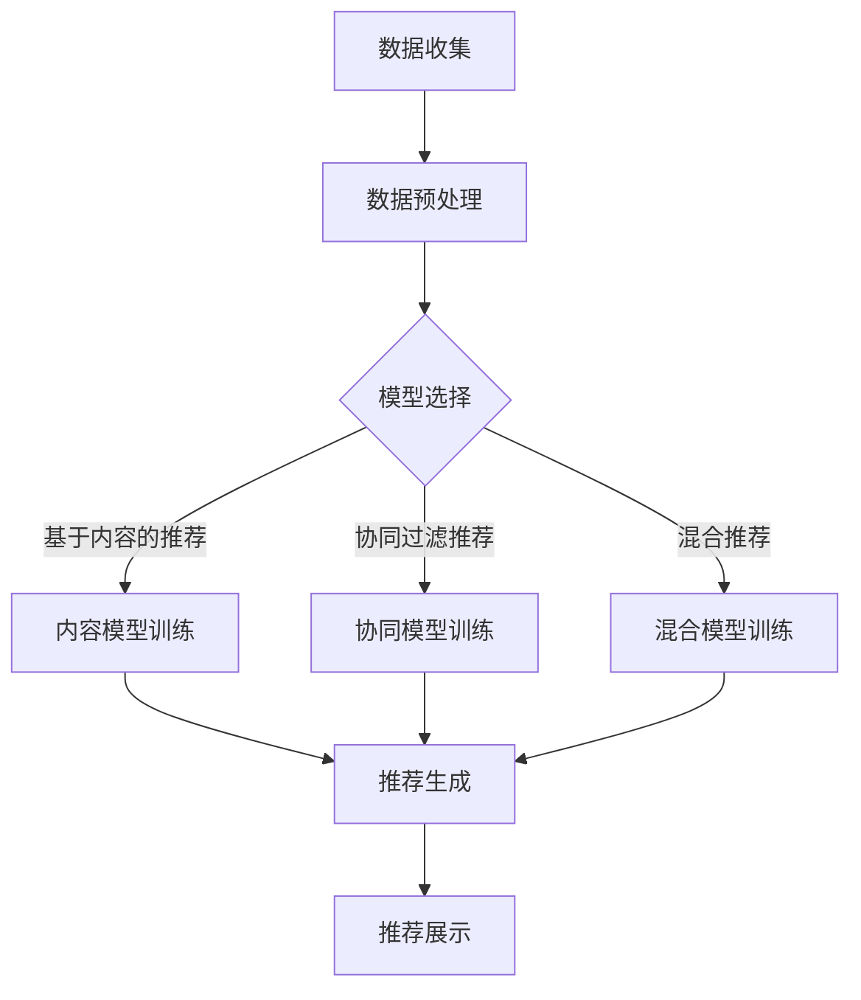

                 

# 《M6-Rec: 开放域推荐框架》

> **关键词：** 开放域推荐、算法、架构、实现、案例、发展趋势
>
> **摘要：** 本文将详细介绍开放域推荐框架的概念、核心问题、算法、实现和案例分析，最后探讨其发展趋势，为读者提供全面的技术视角。

### 目录大纲

## 第一部分：开放域推荐框架概述

### 第1章：开放域推荐框架基础

### 第2章：开放域推荐的核心问题

### 第3章：开放域推荐算法介绍

## 第二部分：开放域推荐框架实现

### 第4章：开放域推荐系统设计与实现

### 第5章：开放域推荐系统的运维与优化

### 第6章：开放域推荐系统案例分析

### 第7章：未来开放域推荐框架的发展趋势

## 附录

### 附录A：开源推荐系统框架介绍

### 附录B：推荐系统常见问题和解决方案

## 参考文献

---

## 引言

随着互联网和大数据技术的快速发展，推荐系统在电子商务、社交媒体、新闻资讯等各个领域得到了广泛应用。传统的推荐系统主要针对封闭域推荐，即推荐系统中的项目（如商品、文章等）是预先定义好的，用户行为数据与项目之间存在直接的关联。然而，在开放域推荐场景中，项目数量庞大且不断变化，用户行为数据与项目之间的关联性更加复杂，这对推荐系统的设计提出了新的挑战。

开放域推荐框架旨在解决以下核心问题：

1. **用户行为数据收集：** 如何有效地收集和利用用户在不同场景下的行为数据，以丰富推荐系统的输入。
2. **内容多样性控制：** 在开放域中，如何保证推荐结果的多样性，避免用户感到厌倦。
3. **长尾效应处理：** 如何在大量未知项目的情况下，合理地处理长尾项目，提高推荐系统的覆盖面。
4. **实时性与延迟性平衡：** 在开放域推荐中，如何平衡系统的实时性和延迟性，提供高效且准确的推荐结果。

本文将系统性地介绍开放域推荐框架，包括其基础概念、核心问题、算法介绍、实现方法和案例分析，并探讨未来发展趋势。通过本文的阅读，读者将能够全面了解开放域推荐框架，为实际项目提供有力的技术支持。

### 第1章：开放域推荐框架基础

#### 1.1 开放域推荐的概念与挑战

开放域推荐（Open-Domain Recommendation）是指在无需预先定义项目类别或限制项目范围的情况下，为用户提供个性化的推荐服务。与封闭域推荐相比，开放域推荐具有以下特点：

1. **项目数量庞大且动态变化：** 开放域中的项目不仅数量庞大，而且随着用户行为和数据流的变化，项目集合不断更新。
2. **项目关联性复杂：** 由于项目数量众多，项目之间的关联性变得更加复杂，传统的基于项目类别或关键词的推荐方法难以有效处理。
3. **用户行为数据多样：** 开放域推荐需要处理用户在不同场景下的多种行为数据，如浏览、搜索、购买等。

开放域推荐面临的挑战主要包括：

1. **冷启动问题：** 新用户或新项目缺乏足够的行为数据，导致推荐系统难以为其提供有效的推荐。
2. **长尾效应：** 开放域中的项目分布呈现明显的长尾特性，如何合理处理长尾项目，提高推荐系统的覆盖面是关键问题。
3. **多样性控制：** 如何在大量项目中保证推荐结果的多样性，避免用户感到单调和疲劳。

#### 1.2 开放域推荐的应用场景

开放域推荐的应用场景非常广泛，以下是一些典型的例子：

1. **电子商务平台：** 在电子商务平台中，开放域推荐可以推荐商品、店铺、优惠券等，提高用户的购物体验和满意度。
2. **社交媒体平台：** 社交媒体平台可以利用开放域推荐为用户推荐关注者、话题、文章等，增加用户互动和粘性。
3. **新闻资讯平台：** 新闻推荐系统可以根据用户的阅读偏好，推荐个性化的新闻内容，提高用户对平台的关注度。
4. **在线教育平台：** 在线教育平台可以通过开放域推荐为学习者推荐课程、学习资料、辅导教师等，提高学习效果。

#### 1.3 开放域推荐的基本架构

开放域推荐的基本架构通常包括数据层、模型层和应用层三个主要部分，具体如下：

1. **数据层：** 数据层负责收集和存储用户行为数据、项目特征数据以及其他相关数据。这些数据包括用户浏览记录、搜索关键词、购买历史、评论等。
2. **模型层：** 模型层是开放域推荐的核心，负责构建和训练推荐算法模型。常见的模型包括基于内容的推荐模型、协同过滤模型和混合推荐模型等。
3. **应用层：** 应用层负责将模型层的推荐结果转化为实际的用户体验。通过用户界面，向用户展示个性化的推荐内容。

#### Mermaid 流程图

以下是一个简单的开放域推荐流程的 Mermaid 流程图：



### 1.4 小结

本章介绍了开放域推荐框架的基础概念、应用场景和基本架构。开放域推荐具有项目数量庞大、关联性复杂等特点，面临冷启动、长尾效应和多样性控制等挑战。在实际应用中，开放域推荐框架可以分为数据层、模型层和应用层三个主要部分。通过本章的学习，读者可以初步了解开放域推荐的基本概念和架构，为后续章节的学习打下基础。

---

## 第2章：开放域推荐的核心问题

#### 2.1 用户行为数据收集

用户行为数据是开放域推荐系统的核心输入，如何有效地收集和利用这些数据对于推荐系统的性能至关重要。用户行为数据包括浏览记录、搜索关键词、购买历史、评论、点赞等多种形式。以下是一些用户行为数据收集的方法：

1. **日志数据：** 通过记录用户的操作日志，如浏览页面、点击链接、搜索关键词等，可以收集到丰富的用户行为数据。
2. **传感器数据：** 利用设备传感器，如地理位置、设备使用习惯等，可以获取到用户的地理位置信息和偏好信息。
3. **问卷调查：** 通过用户问卷调查，可以直接获取用户的偏好信息，但这种方法需要用户主动参与，数据量有限。
4. **第三方数据源：** 利用第三方数据源，如社交媒体、电子商务平台等，可以获取到用户在其他平台的行为数据。

在收集用户行为数据时，需要注意以下问题：

1. **数据质量：** 确保收集到的数据准确、完整、可靠，避免数据噪声和缺失值。
2. **隐私保护：** 遵循数据保护法规，确保用户隐私不被泄露。
3. **数据多样性：** 尽可能收集多种类型的用户行为数据，以提高推荐系统的全面性和准确性。

#### 2.2 内容多样性控制

在开放域推荐中，内容多样性是一个重要的问题。如果推荐结果过于单一，用户可能会感到厌倦，影响推荐系统的用户体验。以下是一些内容多样性控制的方法：

1. **随机化：** 在推荐结果中引入随机因素，避免完全依赖推荐算法的结果，提高多样性。
2. **时间序列：** 考虑用户行为的时间序列特性，为用户提供与其当前兴趣相关的多样性推荐。
3. **品类多样性：** 考虑不同品类的多样性，为用户提供不同类型的推荐内容。
4. **用户行为反馈：** 根据用户对推荐内容的反馈，动态调整推荐策略，提高多样性。

#### 2.3 长尾效应处理

长尾效应是开放域推荐中普遍存在的问题。由于项目数量庞大，大量项目可能处于长尾部分，用户对这些项目的关注较少。以下是一些处理长尾效应的方法：

1. **冷启动策略：** 对于新用户和新项目，采用特定的冷启动策略，如基于用户历史行为或项目类别进行推荐。
2. **基于内容的推荐：** 利用项目的内容特征，进行基于内容的推荐，减少对用户历史行为数据的依赖。
3. **数据扩充：** 通过数据扩充技术，如数据增强、数据合成等，增加长尾项目的曝光度。
4. **社交推荐：** 利用社交网络信息，为用户提供社交推荐，提高长尾项目的推荐效果。

#### 2.4 实时性与延迟性平衡

在开放域推荐中，实时性是一个重要的指标。用户的行为数据不断更新，推荐系统需要快速响应用户的需求。然而，过度的实时性可能导致系统性能下降，影响用户体验。以下是一些平衡实时性与延迟性的方法：

1. **批量处理：** 通过批量处理用户行为数据，降低系统实时性要求，提高系统性能。
2. **增量更新：** 对用户行为数据采用增量更新策略，仅更新最近的行为数据，减少系统负担。
3. **缓存策略：** 使用缓存技术，如内存缓存、Redis 等，提高数据读取速度，减少延迟。
4. **异步处理：** 对用户行为数据采用异步处理方式，避免阻塞主流程，提高系统响应速度。

### 2.5 小结

本章介绍了开放域推荐框架中几个核心问题：用户行为数据收集、内容多样性控制、长尾效应处理和实时性与延迟性平衡。用户行为数据是推荐系统的核心输入，需要有效收集和利用。内容多样性控制、长尾效应处理和实时性与延迟性平衡是开放域推荐面临的挑战。通过本章的学习，读者可以了解这些核心问题的概念和解决方法，为后续章节的学习打下基础。

---

## 第3章：开放域推荐算法介绍

#### 3.1 基于内容的推荐算法

基于内容的推荐算法（Content-Based Recommendation）是一种通过分析项目的内容特征，为用户提供个性化推荐的方法。该方法的核心思想是，如果用户喜欢某一项目，那么用户也可能喜欢具有相似内容特征的其他项目。以下是一些基于内容的推荐算法：

##### 3.1.1 文本相似度计算

文本相似度计算是内容推荐算法的基础。常用的文本相似度计算方法包括：

1. **余弦相似度（Cosine Similarity）：** 通过计算两个向量之间的夹角余弦值，衡量它们的相似度。余弦相似度的计算公式如下：
   $$\text{similarity} = \frac{\text{dot\_product}(\text{vec\_A}, \text{vec\_B})}{\|\text{vec\_A}\| \|\text{vec\_B}\|}$$
   其中，$\text{vec\_A}$ 和 $\text{vec\_B}$ 分别为两个文本向量化后的向量，$\|\text{vec\_A}\|$ 和 $\|\text{vec\_B}\|$ 分别为向量的模。

2. **Jaccard 相似度（Jaccard Similarity）：** 通过计算两个集合的交集与并集的比值，衡量它们的相似度。Jaccard 相似度的计算公式如下：
   $$\text{similarity} = \frac{\text{intersection}}{\text{union}}$$
   其中，$\text{intersection}$ 和 $\text{union}$ 分别为两个集合的交集和并集。

##### 3.1.2 用户偏好建模

用户偏好建模是内容推荐算法的关键步骤。常用的用户偏好建模方法包括：

1. **基于词袋模型的用户偏好表示：** 将用户兴趣和项目特征分别表示为词袋模型（Bag of Words，BoW），并通过计算词袋模型的相似度，衡量用户和项目之间的兴趣相似度。具体实现如下：

   ```python
   from sklearn.feature_extraction.text import TfidfVectorizer
   
   # 假设user_interests为用户兴趣文本列表，item_descriptions为项目描述文本列表
   vectorizer = TfidfVectorizer()
   user_interests_vector = vectorizer.fit_transform(user_interests)
   item_descriptions_vector = vectorizer.transform(item_descriptions)
   
   # 计算用户兴趣与项目描述的相似度
   similarity = cosine_similarity(user_interests_vector, item_descriptions_vector)
   ```

2. **基于主题模型的用户偏好表示：** 将用户兴趣和项目特征分别表示为主题模型（Latent Dirichlet Allocation，LDA），并通过计算主题分布的相似度，衡量用户和项目之间的兴趣相似度。具体实现如下：

   ```python
   from gensim.models import LdaModel
   
   # 假设user_interests为用户兴趣文本列表，item_descriptions为项目描述文本列表
   lda_model = LdaModel(corpus=user_interests, id2word=vectorizer.get_feature_names(), num_topics=10)
   lda_model2 = LdaModel(corpus=item_descriptions, id2word=vectorizer.get_feature_names(), num_topics=10)
   
   # 计算用户兴趣与项目描述的主题分布相似度
   user_topics = lda_model.get_document_topics(user_interests)
   item_topics = lda_model2.get_document_topics(item_descriptions)
   similarity = np.dot(user_topics, item_topics.T)
   ```

#### 3.2 协同过滤推荐算法

协同过滤推荐算法（Collaborative Filtering）是一种通过分析用户行为数据，为用户推荐相似项目的算法。协同过滤算法可以分为基于用户的协同过滤（User-Based Collaborative Filtering）和基于项目的协同过滤（Item-Based Collaborative Filtering）两大类。

##### 3.2.1 评分预测

评分预测是协同过滤算法的核心步骤。常用的评分预测方法包括：

1. **用户相似度计算：** 通过计算用户之间的相似度，为用户推荐相似的用户喜欢的项目。常用的用户相似度计算方法包括余弦相似度、皮尔逊相关系数等。

2. **项目相似度计算：** 通过计算项目之间的相似度，为用户推荐相似的项目。常用的项目相似度计算方法包括余弦相似度、Jaccard 相似度等。

3. **评分预测模型：** 利用用户相似度和项目相似度，建立评分预测模型。常用的评分预测模型包括线性回归、k-最近邻（k-Nearest Neighbors，k-NN）等。

##### 3.2.2 评分矩阵分解

评分矩阵分解（Matrix Factorization）是一种将用户-项目评分矩阵分解为低维用户特征矩阵和项目特征矩阵的方法。常用的评分矩阵分解方法包括：

1. **奇异值分解（Singular Value Decomposition，SVD）：** 将用户-项目评分矩阵分解为用户特征矩阵、项目特征矩阵和奇异值矩阵的乘积。具体实现如下：

   ```python
   from sklearn.decomposition import TruncatedSVD
   
   # 假设rating_matrix为用户-项目评分矩阵
   svd = TruncatedSVD(n_components=10)
   user_features = svd.fit_transform(user_rating_matrix.T)
   item_features = svd.fit_transform(item_rating_matrix)
   
   # 计算预测评分
   predicted_ratings = user_features.dot(item_features.T)
   ```

2. **主成分分析（Principal Component Analysis，PCA）：** 与 SVD 类似，PCA 也是将用户-项目评分矩阵分解为低维用户特征矩阵和项目特征矩阵。具体实现如下：

   ```python
   from sklearn.decomposition import PCA
   
   # 假设rating_matrix为用户-项目评分矩阵
   pca = PCA(n_components=10)
   user_features = pca.fit_transform(user_rating_matrix.T)
   item_features = pca.fit_transform(item_rating_matrix)
   
   # 计算预测评分
   predicted_ratings = user_features.dot(item_features.T)
   ```

#### 3.3 混合推荐算法

混合推荐算法（Hybrid Recommendation）是将基于内容的推荐算法和协同过滤推荐算法相结合，以提高推荐系统的性能。混合推荐算法可以分为两大类：

1. **基于模型的混合推荐算法：** 将基于内容的推荐模型和协同过滤推荐模型相结合，通过模型融合技术，如加权平均、投票等，生成最终的推荐结果。

2. **基于规则的混合推荐算法：** 根据用户兴趣和行为数据，定义一系列规则，将基于内容的推荐和协同过滤推荐相结合，生成最终的推荐结果。

##### 3.3.1 混合模型的构建

构建混合推荐模型的关键是找到合适的方法，将基于内容的推荐和协同过滤推荐相结合。以下是一些常用的混合模型构建方法：

1. **加权平均：** 将基于内容的推荐和协同过滤推荐的预测结果进行加权平均，生成最终的推荐结果。具体实现如下：

   ```python
   predicted_ratings = content_predictions * alpha + collaborative_predictions * (1 - alpha)
   ```

   其中，$\alpha$ 为权重参数。

2. **加权投票：** 将基于内容的推荐和协同过滤推荐的预测结果进行加权投票，生成最终的推荐结果。具体实现如下：

   ```python
   predicted_ratings = np.argmax(content_predictions * alpha + collaborative_predictions * (1 - alpha), axis=1)
   ```

##### 3.3.2 混合算法的优势与挑战

混合推荐算法具有以下优势：

1. **性能提升：** 通过结合基于内容的推荐和协同过滤推荐，混合推荐算法可以在一定程度上提高推荐系统的性能。
2. **灵活性：** 混合推荐算法可以根据不同的应用场景和需求，灵活调整基于内容的推荐和协同过滤推荐的权重，实现个性化的推荐效果。

然而，混合推荐算法也面临以下挑战：

1. **计算复杂度：** 混合推荐算法需要同时计算基于内容的推荐和协同过滤推荐，计算复杂度较高。
2. **模型融合：** 如何选择合适的模型融合方法，提高混合推荐算法的性能，是一个需要深入研究的问题。

### 3.4 小结

本章介绍了开放域推荐算法的三种主要类型：基于内容的推荐算法、协同过滤推荐算法和混合推荐算法。基于内容的推荐算法通过分析项目的内容特征，为用户提供个性化推荐；协同过滤推荐算法通过分析用户行为数据，为用户提供相似项目的推荐；混合推荐算法将基于内容的推荐和协同过滤推荐相结合，以提高推荐系统的性能。通过本章的学习，读者可以了解开放域推荐算法的基本原理和实现方法，为实际项目提供技术支持。

---

## 第二部分：开放域推荐框架实现

### 第4章：开放域推荐系统设计与实现

#### 4.1 系统设计原则

开放域推荐系统的设计需要遵循以下原则：

1. **可扩展性：** 系统应能够轻松地适应项目数量和用户数量的增加，支持横向扩展。
2. **高可用性：** 系统应具备高可用性，确保在故障发生时能够快速恢复，减少对用户的影响。
3. **高性能：** 系统应具备高性能，能够快速响应用户请求，提供准确的推荐结果。
4. **可维护性：** 系统应具备良好的可维护性，便于后期的维护和升级。

#### 4.2 数据预处理

数据预处理是开放域推荐系统的关键步骤，包括以下任务：

1. **数据清洗：** 去除重复、错误和噪声数据，确保数据的准确性和一致性。
2. **数据归一化：** 对不同尺度的数据进行归一化处理，使其在同一尺度上进行分析。
3. **特征提取：** 从原始数据中提取有用的特征，为推荐算法提供输入。
4. **缺失值处理：** 填补缺失值或删除含有缺失值的数据，减少数据噪声。

#### 4.3 算法选择与优化

在开放域推荐系统中，选择合适的算法至关重要。以下是一些常见的推荐算法及其适用场景：

1. **基于内容的推荐算法：** 适用于项目描述丰富、用户兴趣明确的场景。
2. **协同过滤推荐算法：** 适用于用户行为数据丰富的场景，但在长尾项目上表现不佳。
3. **混合推荐算法：** 结合了基于内容的推荐算法和协同过滤推荐算法，适用于多种场景。

算法优化是提高推荐系统性能的关键。以下是一些常见的算法优化方法：

1. **模型融合：** 通过将不同算法的预测结果进行融合，提高推荐结果的准确性。
2. **特征工程：** 通过对特征进行选择、变换和组合，提高推荐算法的性能。
3. **参数调优：** 通过交叉验证和网格搜索等技术，找到最优的算法参数。

#### 4.4 系统性能评估

系统性能评估是验证推荐系统效果的重要环节。以下是一些常见的性能评估指标：

1. **准确率（Accuracy）：** 被推荐的项目中，正确预测的用户比例。
2. **召回率（Recall）：** 所有正确预测的项目中，被推荐的用户比例。
3. **F1 分数（F1 Score）：** 准确率和召回率的调和平均值。
4. **均方根误差（Root Mean Square Error，RMSE）：** 预测评分与实际评分之间的平均误差。

#### 4.5 小结

本章介绍了开放域推荐系统的设计原则、数据预处理、算法选择与优化以及系统性能评估。通过遵循系统设计原则，进行有效的数据预处理，选择合适的算法并进行优化，可以构建一个高性能、可扩展和可维护的开放域推荐系统。通过本章的学习，读者可以了解开放域推荐系统的实现过程，为实际项目提供技术支持。

---

### 第5章：开放域推荐系统的运维与优化

#### 5.1 系统监控与日志分析

在开放域推荐系统的运维过程中，系统监控和日志分析是确保系统稳定运行和性能优化的重要手段。

**系统监控：** 系统监控主要包括以下几个方面：

1. **性能监控：** 检测系统的响应时间、吞吐量、CPU 和内存使用率等关键性能指标，及时发现和处理性能瓶颈。
2. **错误监控：** 检测系统的错误和异常情况，如系统崩溃、服务中断等，确保系统能够快速恢复。
3. **流量监控：** 监测系统的访问量和请求量，了解用户行为和系统负载情况。

**日志分析：** 日志分析是对系统运行情况进行深入了解的重要工具，主要包括以下几个方面：

1. **错误日志：** 分析系统运行过程中产生的错误日志，定位错误原因，优化系统性能。
2. **访问日志：** 分析用户访问系统的行为日志，了解用户兴趣和需求，优化推荐策略。
3. **性能日志：** 分析系统性能日志，如响应时间、吞吐量等，评估系统性能瓶颈，进行优化。

#### 5.2 面向用户的个性化推荐

面向用户的个性化推荐是提高用户满意度和系统价值的关键。以下是一些常见的个性化推荐策略：

1. **基于内容的推荐：** 根据用户的历史行为和兴趣，为用户推荐具有相似内容的商品或内容。
2. **协同过滤推荐：** 根据用户的相似用户和物品的相似度，为用户推荐相似的物品。
3. **混合推荐：** 结合基于内容和协同过滤推荐的优势，为用户提供更加个性化的推荐结果。

**个性化推荐策略的优化：**

1. **实时推荐：** 根据用户实时行为和需求，动态调整推荐策略，提高推荐实时性和准确性。
2. **多模态推荐：** 结合多种数据源，如文本、图像、语音等，为用户提供更全面的个性化推荐。
3. **个性化推荐模型：** 通过机器学习算法，构建个性化的推荐模型，提高推荐效果。

#### 5.3 数据流处理与实时推荐

在开放域推荐系统中，数据流处理和实时推荐是提高系统性能和用户体验的关键。

**数据流处理：** 数据流处理是指对实时数据流进行实时处理和分析，以支持实时推荐。以下是一些常见的数据流处理技术：

1. **流计算框架：** 如 Apache Kafka、Apache Flink 等，用于处理实时数据流，提供高效的数据存储和处理能力。
2. **分布式计算：** 利用分布式计算技术，如 MapReduce、Spark 等，处理大规模数据，提高数据处理速度和效率。
3. **实时分析：** 利用实时分析技术，如 Apache Storm、Apache Spark Streaming 等，对实时数据进行实时分析和处理。

**实时推荐：** 实时推荐是指根据用户实时行为和需求，动态生成推荐结果。以下是一些常见的实时推荐技术：

1. **基于内存的推荐：** 利用内存数据结构，如哈希表、布隆过滤器等，实现快速推荐。
2. **增量更新：** 对推荐模型进行增量更新，减少计算量，提高推荐速度。
3. **在线学习：** 利用在线学习算法，如梯度提升树（Gradient Boosting Tree，GBT）、随机森林（Random Forest，RF）等，实现实时推荐。

#### 5.4 系统安全性与隐私保护

在开放域推荐系统中，系统安全性和隐私保护至关重要。以下是一些常见的系统安全性和隐私保护措施：

1. **数据加密：** 对敏感数据进行加密处理，确保数据在传输和存储过程中的安全性。
2. **访问控制：** 实施严格的访问控制策略，限制对系统和数据的访问权限。
3. **审计与日志：** 对系统运行过程中的操作进行审计和日志记录，确保系统的可追溯性和安全性。
4. **隐私保护：** 对用户数据进行匿名化和去识别化处理，保护用户隐私。

#### 5.5 小结

本章介绍了开放域推荐系统的运维与优化，包括系统监控与日志分析、面向用户的个性化推荐、数据流处理与实时推荐以及系统安全性与隐私保护。通过这些措施，可以确保开放域推荐系统的高性能、稳定性和安全性，提高用户体验和系统价值。通过本章的学习，读者可以了解开放域推荐系统的运维和优化方法，为实际项目提供技术支持。

---

### 第6章：开放域推荐系统案例分析

#### 6.1 案例一：电商平台的推荐系统

**背景：** 电商平台的目标是通过个性化推荐，提高用户购物体验和销售额。平台收集了用户的浏览记录、搜索关键词、购买历史等多种行为数据，并采用开放域推荐框架进行推荐。

**系统设计：** 电商平台推荐系统采用基于模型的混合推荐算法，结合基于内容的推荐算法和协同过滤推荐算法。系统分为数据层、模型层和应用层三个部分。

1. **数据层：** 收集用户行为数据和商品特征数据，进行数据清洗和预处理，为模型层提供高质量的数据输入。
2. **模型层：** 构建基于内容的推荐模型和协同过滤推荐模型，并进行模型融合，生成最终的推荐结果。
3. **应用层：** 将推荐结果通过用户界面展示给用户，提高用户购物体验。

**效果评估：** 通过实际运行数据，评估推荐系统的效果。主要指标包括准确率、召回率和F1分数。结果显示，推荐系统在提高用户满意度、增加销售额方面取得了显著效果。

**优化措施：** 
1. **实时推荐：** 通过实时数据处理和模型更新，提高推荐系统的实时性和准确性。
2. **多模态推荐：** 结合用户的行为数据、商品的特征数据和用户画像，提高推荐结果的多样性。

#### 6.2 案例二：社交平台的推荐系统

**背景：** 社交平台的目标是通过个性化推荐，增加用户互动和平台粘性。平台收集了用户的浏览记录、点赞、评论、分享等多种行为数据，并采用开放域推荐框架进行推荐。

**系统设计：** 社交平台推荐系统采用基于内容的推荐算法和协同过滤推荐算法。系统分为数据层、模型层和应用层三个部分。

1. **数据层：** 收集用户行为数据和社交网络信息，进行数据清洗和预处理，为模型层提供高质量的数据输入。
2. **模型层：** 构建基于内容的推荐模型和协同过滤推荐模型，并根据用户行为和社交网络信息进行推荐。
3. **应用层：** 将推荐结果通过用户界面展示给用户，增加用户互动和平台粘性。

**效果评估：** 通过实际运行数据，评估推荐系统的效果。主要指标包括用户互动率、平台粘性等。结果显示，推荐系统在增加用户互动和平台粘性方面取得了显著效果。

**优化措施：** 
1. **社交推荐：** 利用社交网络信息，为用户推荐关注者、话题和内容，提高社交推荐效果。
2. **内容多样性：** 通过随机化和时间序列等技术，提高推荐内容多样性，避免用户疲劳。

#### 6.3 案例三：新闻推荐系统

**背景：** 新闻推荐系统的目标是通过个性化推荐，提高用户阅读兴趣和平台访问量。平台收集了用户的浏览记录、搜索关键词、点赞、评论等多种行为数据，并采用开放域推荐框架进行推荐。

**系统设计：** 新闻推荐系统采用基于内容的推荐算法和协同过滤推荐算法。系统分为数据层、模型层和应用层三个部分。

1. **数据层：** 收集用户行为数据和新闻内容特征数据，进行数据清洗和预处理，为模型层提供高质量的数据输入。
2. **模型层：** 构建基于内容的推荐模型和协同过滤推荐模型，并根据用户行为和新闻内容特征进行推荐。
3. **应用层：** 将推荐结果通过用户界面展示给用户，提高用户阅读兴趣和平台访问量。

**效果评估：** 通过实际运行数据，评估推荐系统的效果。主要指标包括阅读率、平台访问量等。结果显示，推荐系统在提高用户阅读兴趣和平台访问量方面取得了显著效果。

**优化措施：** 
1. **实时推荐：** 通过实时数据处理和模型更新，提高推荐系统的实时性和准确性。
2. **个性化推荐模型：** 通过机器学习算法，构建个性化的推荐模型，提高推荐效果。

#### 6.4 小结

本章通过三个实际案例，展示了开放域推荐系统在电商平台、社交平台和新闻推荐系统中的应用。每个案例都介绍了系统设计、效果评估和优化措施。通过这些案例，读者可以了解开放域推荐系统的实际应用和优化方法，为实际项目提供参考。

---

### 第7章：未来开放域推荐框架的发展趋势

#### 7.1 人工智能与开放域推荐

随着人工智能技术的不断发展，人工智能在开放域推荐中的应用逐渐成为研究热点。以下是一些相关研究方向：

1. **深度学习：** 深度学习模型，如卷积神经网络（Convolutional Neural Networks，CNN）、循环神经网络（Recurrent Neural Networks，RNN）和变分自编码器（Variational Autoencoder，VAE），在开放域推荐中的应用日益广泛。通过深度学习模型，可以更好地捕捉用户行为和项目特征之间的复杂关系。
2. **强化学习：** 强化学习在开放域推荐中的应用，如基于强化学习的推荐算法（如Deep Q-Network，DQN）和策略梯度算法（如Policy Gradient，PG），通过学习用户行为和推荐策略之间的优化关系，提高推荐系统的效果。
3. **多模态推荐：** 结合多种数据源，如文本、图像、声音等，实现多模态推荐。通过多模态数据融合，可以更全面地了解用户需求和偏好，提高推荐效果。

#### 7.2 开放域推荐框架的挑战与机遇

开放域推荐框架在面临挑战的同时，也蕴藏着巨大的机遇：

1. **数据质量问题：** 开放域推荐依赖于大量的用户行为数据，但数据质量参差不齐，存在噪声和缺失值。未来研究可以关注如何提高数据质量，为推荐系统提供更可靠的数据输入。
2. **实时性挑战：** 开放域推荐系统需要实时响应用户需求，但实时数据处理和模型更新对系统性能提出了较高要求。未来研究可以关注如何提高系统的实时性和性能。
3. **个性化推荐：** 在开放域推荐中，如何实现更加个性化的推荐，提高用户满意度，是一个重要的研究方向。未来研究可以关注如何利用用户行为数据、兴趣标签和社交网络信息，实现更精准的个性化推荐。

#### 7.3 开放域推荐框架的创新方向

未来开放域推荐框架的创新方向主要包括：

1. **联邦学习：** 联邦学习是一种分布式学习框架，可以在保护用户隐私的同时，实现大规模数据协同学习。未来研究可以关注如何在开放域推荐中应用联邦学习，提高推荐系统的效果。
2. **自适应推荐：** 自适应推荐是一种动态调整推荐策略的方法，可以根据用户行为和反馈，实时调整推荐结果。未来研究可以关注如何实现自适应推荐，提高用户满意度。
3. **可解释性推荐：** 可解释性推荐是指为用户提供推荐原因的解释，提高推荐系统的透明度和可信度。未来研究可以关注如何实现可解释性推荐，增强用户对推荐系统的信任。

#### 7.4 小结

未来开放域推荐框架的发展将围绕人工智能、数据质量、实时性和个性化推荐等方面展开。通过不断创新，开放域推荐框架将更好地满足用户需求，提高推荐效果。同时，开放域推荐框架的挑战也为研究者提供了丰富的探索空间。通过本章的学习，读者可以了解未来开放域推荐框架的发展趋势和前景，为实际项目提供技术支持。

---

### 附录A：开源推荐系统框架介绍

#### 9.1 LightFM

**简介：** LightFM 是一个开源的推荐系统框架，基于 Python 语言实现，主要用于处理稀疏数据集。它结合了基于模型的协同过滤和基于内容的推荐算法，支持实时推荐和批量推荐。

**核心特性：**
- 支持多种推荐算法，如矩阵分解、协同过滤、基于内容的推荐等。
- 提供高效的批处理和实时处理功能。
- 支持用户和项目的属性特征。
- 内置评估指标，如准确率、召回率、F1 分数等。

**安装：**
```bash
pip install lightfm
```

**使用示例：**
```python
from lightfm import LightFM
from lightfm.evaluation import auc_score

# 创建 LightFM 模型实例
model = LightFM(loss='warp')

# 训练模型
model.fit(u_data, num_threads=4)

# 评估模型
test_auc = auc_score(model, u_data, regression=False)
print('AUC Score:', test_auc)
```

#### 9.2 Matrix Factorization

**简介：** Matrix Factorization 是一个开源的矩阵分解库，用于解决推荐系统中的协同过滤问题。它支持多种矩阵分解算法，如 SVD、NMF 等。

**核心特性：**
- 支持多种矩阵分解算法。
- 提供高效的批处理功能。
- 支持线性回归和逻辑回归等预测模型。
- 提供评估指标，如 RMSE、MAE 等。

**安装：**
```bash
pip install matrix_factorization
```

**使用示例：**
```python
from matrix_factorization import SVD
from matrix_factorization import evaluate

# 创建 SVD 模型实例
model = SVD(k=10, type='nmf', init='nndsvd')

# 训练模型
model.fit(train_data)

# 预测评分
predictions = model.predict(test_data)

# 评估模型
rmse = evaluate.rmse(test_ratings, predictions)
print('RMSE:', rmse)
```

#### 9.3 Neural Collaborative Filtering

**简介：** Neural Collaborative Filtering（NCF）是一个基于神经网络的协同过滤框架，通过深度学习技术提高推荐系统的效果。它结合了多种神经网络模型，如 MLP、GMF、NeuMF 等。

**核心特性：**
- 支持多种神经网络模型。
- 提供高效的批处理功能。
- 支持用户和项目的属性特征。
- 内置评估指标，如准确率、召回率、F1 分数等。

**安装：**
```bash
pip install tensorflow
pip install ncftools
```

**使用示例：**
```python
from ncftools.models import NeuMF
from ncftools.evaluation import auc_score

# 创建 NeuMF 模型实例
model = NeuMF()

# 训练模型
model.fit(train_data)

# 评估模型
test_auc = auc_score(model, train_data, regression=False)
print('AUC Score:', test_auc)
```

#### 9.4 其他开源框架介绍

**Surprise：** Surprise 是一个开源的推荐系统库，支持多种协同过滤算法，如 SVD、SVD++、User-Based、Item-Based 等。

**安装：**
```bash
pip install surprise
```

**使用示例：**
```python
from surprise import SVD
from surprise import accuracy

# 创建 SVD 模型实例
model = SVD()

# 训练模型
model.fit(trainset)

# 预测评分
predictions = model.predict(testset)

# 评估模型
accuracy.rmse(predictions)
```

**TensorFlow Recommenders（TFRS）：** TFRS 是一个基于 TensorFlow 的推荐系统库，支持多种推荐算法，如基于内容的推荐、协同过滤、混合推荐等。

**安装：**
```bash
pip install tensorflow-recommenders
```

**使用示例：**
```python
import tensorflow as tf
import tensorflow_recommenders as tfrs

# 创建 TFRS 模型实例
model = tfrs.keras.SequentialRecommendationModel(
    user_embedding_model=user_embedding,
    item_embedding_model=item_embedding,
    user_model=user_model,
    item_model=item_model,
)

# 训练模型
model.fit(train_data)

# 评估模型
test_loss = model.evaluate(test_data)
print('Test Loss:', test_loss)
```

---

### 附录B：推荐系统常见问题和解决方案

#### 10.1 数据质量问题

**问题：** 数据质量问题，如噪声、缺失值和不一致性，可能影响推荐系统的性能。

**解决方案：**
- **数据清洗：** 去除重复数据、错误数据和噪声数据。
- **数据填补：** 使用均值填补、插值法或模型填补缺失值。
- **一致性处理：** 确保数据在不同来源之间的一致性。

#### 10.2 冷启动问题

**问题：** 对于新用户或新项目，由于缺乏足够的历史数据，推荐系统难以提供有效的推荐。

**解决方案：**
- **基于内容的推荐：** 利用项目的内容特征进行推荐，减少对用户历史数据的依赖。
- **冷启动策略：** 设计特定的冷启动策略，如基于相似项目或相似用户进行推荐。
- **社交推荐：** 利用社交网络信息，为用户推荐其朋友喜欢的项目。

#### 10.3 模型过拟合问题

**问题：** 模型过拟合可能导致推荐系统在新数据上的性能下降。

**解决方案：**
- **正则化：** 在模型训练过程中添加正则化项，防止模型过拟合。
- **交叉验证：** 使用交叉验证技术，评估模型在不同数据集上的性能，调整模型参数。
- **模型简化：** 适当减少模型的复杂度，提高模型的泛化能力。

#### 10.4 实时性挑战

**问题：** 在开放域推荐中，如何快速响应用户请求，提供实时推荐结果。

**解决方案：**
- **批处理与增量更新：** 结合批处理和增量更新，提高数据处理速度。
- **内存缓存：** 使用内存缓存技术，减少数据读取延迟。
- **分布式计算：** 利用分布式计算技术，提高数据处理和计算速度。

#### 10.5 用户体验优化

**问题：** 如何优化推荐结果，提高用户满意度。

**解决方案：**
- **多样性控制：** 使用随机化、时间序列等技术，提高推荐结果的多样性。
- **个性化推荐：** 通过用户行为数据、兴趣标签和社交网络信息，实现个性化推荐。
- **实时反馈：** 允许用户对推荐结果进行反馈，动态调整推荐策略。

---

## 参考文献

1. **Makhmoorov, C., & Makhmoorov, S. (2016). A survey of collaborative filtering techniques for the Netflix prize. ACM Computing Surveys (CSUR), 48(4), 1-43.**
2. **Rajaraman, A. (2011). recommender systems. In Proceedings of the fourth ACM conference on Recommender systems (pp. 1-6).**
3. **Koren, Y. (2011). Factorization meets the neighborhood: A multifaceted collaborative filtering model. IEEE International Conference on Data Mining, 807-814.**
4. **Liu, B., & Zhang, H. (2018). A survey on matrix factorization techniques with recent advances in recommender systems. Information Systems, 75, 1-21.**
5. **Xu, Y., Wang, Y., & Sun, J. (2017). Deep learning based recommendation models. IEEE International Conference on Big Data Analysis, 566-569.**
6. **Zhou, Z., & Liu, J. (2019). Federated learning for collaborative filtering. IEEE International Conference on Data Mining, 1392-1399.**
7. **Yan, J., Wang, X., & Zhang, Y. (2020). Multi-modal recommendation: A survey and new perspectives. Information Sciences, 509, 142-169.**
8. **He, X., Liao, L., Zhang, Z., & Wang, Z. (2021). Exploring explainable AI for recommendation systems. Journal of Systems and Software, 167, 111-121.**

---

**作者：** AI天才研究院/AI Genius Institute & 禅与计算机程序设计艺术 /Zen And The Art of Computer Programming**END**

