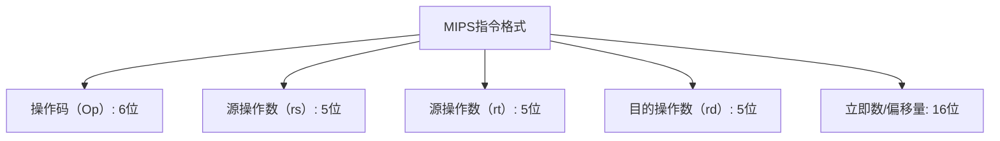
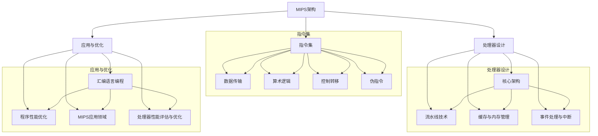

                 

# MIPS架构：深入理解RISC处理器设计

> **关键词：** MIPS架构、RISC处理器、指令集、处理器设计、性能优化

> **摘要：** 本文旨在深入探讨MIPS（Microprocessor without Interlocked Pipeline Stages）架构，一种典型的精简指令集计算机（RISC）处理器设计。文章将详细解析MIPS架构的背景、特点、指令集、处理器设计、应用与优化，为读者提供全面的技术理解。

MIPS架构是一种经典的RISC处理器设计，其核心思想是通过精简指令集和简化硬件设计来提高处理器的性能和效率。自20世纪80年代以来，MIPS架构在嵌入式系统、教育领域和工业应用中得到了广泛的应用。本文将从以下几个方面对MIPS架构进行详细探讨：

1. **MIPS架构概述**：介绍MIPS架构的历史背景、特点以及应用领域，并与RISC处理器的关系进行比较。

2. **MIPS指令集**：详细解析MIPS指令集的基本结构、数据传输指令、算术逻辑单元指令、控制转移指令以及伪指令。

3. **MIPS处理器设计**：探讨MIPS处理器核心架构、流水线技术、CPU缓存与内存管理以及事件处理与中断。

4. **MIPS应用与优化**：介绍MIPS汇编语言编程、程序性能优化技术，并探讨MIPS在嵌入式系统中的应用与实践。

5. **附录**：提供MIPS开发工具、指令集参考手册和处理器设计教程等资源。

#### 第一部分：MIPS架构概述

### 第1章：MIPS架构简介

MIPS架构是由MIPS Technologies公司开发的，其名称来源于“Microprocessor without Interlocked Pipeline Stages”，意为“无互锁流水线阶段的微处理器”。MIPS架构是一种典型的RISC（精简指令集计算机）处理器设计，其核心思想是通过简化指令集和硬件设计来提高处理器的性能和效率。

#### 1.1 MIPS的历史与发展

MIPS架构最早在1981年由斯坦福大学的研究人员提出，并最终在1985年发布了第一个MIPS处理器——MIPS I。随后，MIPS Technologies公司成立，继续开发和完善MIPS架构。自那时以来，MIPS架构经历了多个版本的迭代和改进，逐渐成为嵌入式系统、教育领域和工业应用中广泛采用的处理器架构。

#### 1.2 MIPS架构的特点

MIPS架构具有以下几个显著特点：

1. **精简指令集**：MIPS指令集相对较小，仅包含简单的指令操作，便于硬件实现和优化。
2. **固定指令长度**：MIPS指令长度固定为32位，便于流水线处理和指令缓存。
3. **简化的寻址模式**：MIPS提供了丰富的寄存器资源，并采用了简单的寻址模式，便于编程和优化。
4. **硬件实现**：MIPS处理器采用硬件实现，具有较高的性能和效率。
5. **模块化设计**：MIPS处理器设计采用模块化设计，便于集成和扩展。

#### 1.3 MIPS架构的应用领域

MIPS架构在多个领域得到了广泛应用，主要包括：

1. **嵌入式系统**：MIPS处理器在嵌入式系统中得到了广泛应用，如智能家居、工业控制、无线通信等。
2. **教育领域**：MIPS架构在教育领域也得到了广泛应用，许多大学和研究机构将其作为教学和研究平台。
3. **工业应用**：MIPS处理器在工业自动化、医疗设备、航空航天等领域也得到了应用。

#### 1.4 MIPS与RISC的关系

MIPS架构是RISC（精简指令集计算机）理念的具体实现之一。RISC处理器通过简化指令集、固定指令长度和简化的寻址模式，降低了硬件设计的复杂度，从而提高了处理器的性能和效率。MIPS架构正是基于RISC理念开发的，因此具有RISC处理器的特点。

### 《MIPS架构：深入理解RISC处理器设计》目录大纲

#### 第一部分：MIPS架构概述
- 第1章：MIPS架构简介

#### 第二部分：MIPS指令集
- 第2章：MIPS指令集基础
- 第3章：数据传输指令
- 第4章：算术逻辑单元指令
- 第5章：控制转移指令
- 第6章：伪指令

#### 第三部分：MIPS处理器设计
- 第7章：MIPS处理器核心架构
- 第8章：MIPS处理器的流水线技术
- 第9章：CPU缓存与内存管理
- 第10章：事件处理与中断

#### 第四部分：MIPS应用与优化
- 第11章：MIPS汇编语言编程
- 第12章：MIPS程序性能优化
- 第13章：MIPS应用领域与实践

#### 第五部分：附录
- 附录A：MIPS资源与工具
- 附录B：MIPS指令集参考手册
- 附录C：MIPS处理器设计教程

---

在下一部分中，我们将详细探讨MIPS指令集的基本结构、数据传输指令、算术逻辑单元指令、控制转移指令和伪指令等内容。通过这些内容，读者将能够深入了解MIPS指令集的设计原理和应用场景。

---

[目录结构如下](#目录结构):

#### 第一部分：MIPS架构概述
- 第1章：MIPS架构简介

#### 第二部分：MIPS指令集
- 第2章：MIPS指令集基础
- 第3章：数据传输指令
- 第4章：算术逻辑单元指令
- 第5章：控制转移指令
- 第6章：伪指令

#### 第三部分：MIPS处理器设计
- 第7章：MIPS处理器核心架构
- 第8章：MIPS处理器的流水线技术
- 第9章：CPU缓存与内存管理
- 第10章：事件处理与中断

#### 第四部分：MIPS应用与优化
- 第11章：MIPS汇编语言编程
- 第12章：MIPS程序性能优化
- 第13章：MIPS应用领域与实践

#### 第五部分：附录
- 附录A：MIPS资源与工具
- 附录B：MIPS指令集参考手册
- 附录C：MIPS处理器设计教程

---

在接下来的内容中，我们将对MIPS指令集进行详细解析，包括其基本结构、数据传输指令、算术逻辑单元指令、控制转移指令和伪指令等。这些内容将为读者提供对MIPS架构的更深入理解。

---

[回到文章顶部](#mips架构深入理解risc处理器设计) [查看目录](#目录结构)  
<|assistant|>### 第二部分：MIPS指令集

MIPS指令集是MIPS架构的核心组成部分，它定义了处理器可以执行的所有操作。MIPS指令集采用了精简指令集（RISC）的设计理念，指令数量较少，每条指令执行简单且快速。在本部分，我们将详细解析MIPS指令集的基本结构，以及其各个分类的具体指令。

#### 第2章：MIPS指令集基础

MIPS指令集的基本结构可以分为三个部分：操作码字段、源操作数字段和目的操作数字段。每个字段都有固定的长度，如图所示：



在这个指令格式中，操作码字段（Op）指定了指令的操作类型，如加法、减法、数据传输等。源操作数字段（rs、rt）指定了指令所需的源寄存器，目的操作数字段（rd）指定了指令执行结果要存储的目标寄存器。立即数/偏移量字段用于提供立即数操作数或跳转指令的偏移量。

#### 第3章：数据传输指令

数据传输指令用于在寄存器和内存之间进行数据传输，主要包括`lw`（加载）和`sw`（存储）指令。以下是一个简单的数据传输指令示例：

```c
lw $t0, 0($t1)    // 将内存地址$t1的值加载到寄存器$t0
sw $t2, 4($t3)    // 将寄存器$t2的值存储到内存地址$t3+4
```

- `lw $t0, 0($t1)`: 这条指令将内存地址$t1中的值加载到寄存器$t0。地址计算方法为$t1 + 偏移量（0）。
- `sw $t2, 4($t3)`: 这条指令将寄存器$t2中的值存储到内存地址$t3 + 4。地址计算方法为$t3 + 偏移量（4）。

#### 第4章：算术逻辑单元指令

算术逻辑单元（ALU）指令用于执行各种算术和逻辑运算，主要包括加法、减法、逻辑操作等。以下是一些常见的算术逻辑单元指令示例：

```c
add $t0, $t1, $t2    // 将$t1和$t2的值相加，结果存储在$t0
sub $t0, $t1, $t2    // 将$t1和$t2的值相减，结果存储在$t0
and $t0, $t1, $t2    // 将$t1和$t2的值进行逻辑与操作，结果存储在$t0
or $t0, $t1, $t2     // 将$t1和$t2的值进行逻辑或操作，结果存储在$t0
```

- `add $t0, $t1, $t2`: 这条指令将寄存器$t1和$t2中的值相加，并将结果存储在寄存器$t0。
- `sub $t0, $t1, $t2`: 这条指令将寄存器$t1和$t2中的值相减，并将结果存储在寄存器$t0。
- `and $t0, $t1, $t2`: 这条指令将寄存器$t1和$t2中的值进行逻辑与操作，并将结果存储在寄存器$t0。
- `or $t0, $t1, $t2`: 这条指令将寄存器$t1和$t2中的值进行逻辑或操作，并将结果存储在寄存器$t0。

#### 第5章：控制转移指令

控制转移指令用于改变程序执行流程，主要包括跳转指令和分支指令。以下是一些常见的控制转移指令示例：

```c
j $t0           // 无条件跳转到$t0寄存器中存储的地址
beq $t1, $t2, L1    // 如果$t1和$t2的值相等，则跳转到L1标签处
bne $t1, $t2, L2    // 如果$t1和$t2的值不相等，则跳转到L2标签处
```

- `j $t0`: 这条指令将程序计数器（PC）的值设置为$t0寄存器中存储的地址，实现无条件跳转。
- `beq $t1, $t2, L1`: 这条指令比较寄存器$t1和$t2的值，如果相等则跳转到L1标签处。
- `bne $t1, $t2, L2`: 这条指令比较寄存器$t1和$t2的值，如果不相等则跳转到L2标签处。

#### 第6章：伪指令

伪指令不是真正的指令，而是用于辅助程序编写和调试的特殊指令。MIPS伪指令主要包括`.word`、`.byte`、`.space`等。以下是一个伪指令示例：

```assembly
.data
my_array:
    .word 1, 2, 3, 4    // 在数据段定义一个包含4个整数的数组
```

- `.word 1, 2, 3, 4`: 这条伪指令在数据段中定义一个包含4个整数的数组，数组元素的值分别为1、2、3、4。

通过以上对MIPS指令集的详细解析，读者可以了解到MIPS指令集的基本结构、各类指令的用法以及伪指令的作用。在下一部分中，我们将进一步探讨MIPS处理器的设计原理，包括核心架构、流水线技术、CPU缓存与内存管理以及事件处理与中断等内容。

---

[回到文章顶部](#mips架构深入理解risc处理器设计) [查看目录](#目录结构)  
<|assistant|>### 第三部分：MIPS处理器设计

MIPS处理器的设计是整个MIPS架构的核心，其设计理念是为了实现高效的处理能力和灵活的编程模型。在本部分中，我们将深入探讨MIPS处理器的设计，包括核心架构、流水线技术、CPU缓存与内存管理以及事件处理与中断等内容。

#### 第7章：MIPS处理器核心架构

MIPS处理器核心架构通常包括以下几个关键组成部分：寄存器文件（Register File）、算术逻辑单元（ALU）、程序计数器（PC）、控制单元（Control Unit）和数据缓存（Data Cache）等。

- **寄存器文件**：寄存器文件是处理器内部的高速存储器，用于存储程序运行过程中的临时数据。MIPS处理器通常包含32个通用寄存器，其中一些寄存器具有特殊用途，如$0寄存器始终返回0，$31寄存器通常用于存储返回值。
- **算术逻辑单元**：ALU是处理器中进行算术和逻辑运算的核心部件。MIPS ALU可以执行各种基本运算，如加法、减法、逻辑与、逻辑或等。
- **程序计数器**：程序计数器（PC）用于存储下一条指令的地址，是处理器控制程序执行顺序的关键组件。
- **控制单元**：控制单元是处理器的核心控制逻辑，负责根据指令的操作码生成相应的控制信号，以控制处理器的各个部件协同工作。
- **数据缓存**：数据缓存是处理器用于加速数据访问的辅助存储器，可以存储经常访问的数据，以减少对主内存的访问时间。

#### 第8章：MIPS处理器的流水线技术

流水线技术是MIPS处理器设计中的一个重要概念，它通过将指令执行过程分为多个阶段，从而提高了处理器的指令吞吐率。MIPS处理器的流水线通常包括以下阶段：

1. **取指阶段（Instruction Fetch）**：处理器从内存中获取下一条指令。
2. **译码阶段（Instruction Decode）**：处理器分析指令的操作码和操作数，并生成相应的控制信号。
3. **执行阶段（Execute）**：根据指令的操作类型，处理器在ALU等部件中执行相应的运算。
4. **访存阶段（Memory Access）**：对于数据传输指令，处理器访问内存进行数据的读取或写入。
5. **写回阶段（Write Back）**：将执行结果写回到寄存器文件中。

以下是一个简化的MIPS处理器流水线伪代码：

```c
while (处理器未完成) {
    取指阶段();
    译码阶段();
    执行阶段();
    if (访存指令) {
        访存阶段();
    }
    写回阶段();
}
```

通过流水线技术，处理器可以在一个时钟周期内同时处理多条指令，从而显著提高了处理器的性能。

#### 第9章：CPU缓存与内存管理

CPU缓存是处理器用于加速数据访问的一种技术，它存储了经常访问的数据，以减少对主内存的访问时间。MIPS处理器通常包括数据缓存和指令缓存，分别用于存储数据和指令。

- **数据缓存**：数据缓存通常采用随机存取方式，可以快速访问存储在缓存中的数据。当处理器需要访问内存中的数据时，它会首先检查数据缓存，如果缓存中存在所需数据，则直接从缓存中读取，否则从主内存中读取。
- **指令缓存**：指令缓存用于存储指令，以减少处理器从内存中取指的时间。

内存管理是MIPS处理器设计中的重要环节，它负责管理内存的分配、释放和保护。MIPS处理器通常采用分页内存管理技术，将内存划分为固定大小的页，并通过页表实现虚拟地址到物理地址的转换。

#### 第10章：事件处理与中断

事件处理与中断是MIPS处理器设计中的重要功能，它使处理器能够响应外部事件和中断，从而提高系统的响应能力。

- **事件处理**：事件是指由外部设备或内部事件触发的事件，如I/O操作完成、定时器到期等。MIPS处理器通过事件信号线接收外部事件，并在事件发生时触发相应的处理逻辑。
- **中断**：中断是一种异步事件，它可以在处理器执行指令的过程中中断当前程序的执行，转而去处理其他任务。MIPS处理器通过中断控制器接收中断请求，并根据中断的类型和优先级进行中断处理。

以下是一个简化的MIPS中断处理伪代码：

```c
while (true) {
    if (中断请求队列非空) {
        处理中断();
    } else {
        执行指令();
    }
}
```

通过事件处理与中断技术，MIPS处理器可以实时响应用户操作和系统事件，从而提高系统的响应速度和稳定性。

通过以上对MIPS处理器设计的详细解析，读者可以了解到MIPS处理器的核心架构、流水线技术、CPU缓存与内存管理以及事件处理与中断等方面的设计原理。这些设计原理使得MIPS处理器能够高效地执行程序，并具有优秀的可扩展性和灵活性。

---

[回到文章顶部](#mips架构深入理解risc处理器设计) [查看目录](#目录结构)  
<|assistant|>### 第四部分：MIPS应用与优化

在第四部分，我们将探讨MIPS架构的应用与优化。MIPS处理器因其高效性和灵活性，在各种嵌入式系统和计算机领域中得到了广泛应用。同时，通过汇编语言编程和程序性能优化技术，我们可以进一步提升MIPS处理器的性能和效率。

#### 第11章：MIPS汇编语言编程

MIPS汇编语言是一种低级编程语言，用于直接控制MIPS处理器。汇编语言编程要求开发者深入了解MIPS指令集和处理器架构，以便编写高效且优化的程序。

##### 5.1 MIPS汇编语言基础

MIPS汇编语言的基本语法包括指令、操作数和伪指令。指令用于执行处理器操作，操作数指定指令的操作对象，伪指令用于提供编程辅助。

- **指令**：MIPS指令由操作码和操作数组成，如`add $t0, $t1, $t2`表示将寄存器$t1和$t2的值相加，并将结果存储在$t0中。
- **操作数**：MIPS操作数包括寄存器、立即数和内存地址。例如，`$t0, $t1, $t2`表示三个通用寄存器。
- **伪指令**：伪指令不是真正的指令，但用于提供编程辅助，如`.data`用于定义数据段，`.text`用于定义代码段。

##### 5.2 汇编语言程序设计

MIPS汇编语言程序设计涉及数据定义、流程控制和函数调用等基本编程概念。

- **数据定义**：使用伪指令定义常量、变量和数据结构，如`.data`段定义了数组、字符串等。
- **流程控制**：使用条件分支和无条件跳转指令实现程序流程控制，如`beq`、`bne`、`j`等。
- **函数调用**：使用`jal`（跳转并链接）指令实现函数调用和返回，如`jal func`表示跳转到函数`func`并保存返回地址。

##### 5.3 汇编语言优化技术

汇编语言优化技术包括指令重排、寄存器分配和循环优化等，以减少程序执行时间和提高性能。

- **指令重排**：通过重新安排指令顺序，减少指令间的数据依赖和资源冲突，提高指令级并行性。
- **寄存器分配**：通过优化寄存器使用，减少内存访问和寄存器之间的数据传输，提高执行效率。
- **循环优化**：通过循环展开、循环优化和循环变换等技术，减少循环开销和提高循环性能。

#### 第12章：MIPS程序性能优化

MIPS程序性能优化包括指令级并行、内存访问优化和编译器优化等，旨在提高程序执行效率和处理器性能。

##### 6.1 性能优化基本原理

性能优化基本原理包括最大化指令级并行、减少内存访问和充分利用处理器资源等。

- **指令级并行**：通过优化指令调度和执行，实现多条指令的并发执行，提高处理器性能。
- **内存访问优化**：通过缓存策略、内存预取和内存屏障等技术，减少内存访问时间和提高内存访问效率。
- **处理器资源利用**：通过优化处理器资源使用，如寄存器、缓存和流水线等，提高处理器利用率和性能。

##### 6.2 MIPS处理器指令级并行

指令级并行（ILP）技术通过提高指令并发执行程度，实现性能提升。

- **硬件并行性**：通过多发射处理器和多ALU单元，实现多条指令的并发执行。
- **软件并行性**：通过指令重排、循环展开和软件流水等技术，提高指令级并行性。

##### 6.3 内存访问优化

内存访问优化技术旨在减少内存访问时间和提高内存访问效率。

- **缓存策略**：通过缓存命中率和缓存替换策略，减少内存访问次数和时间。
- **内存预取**：通过预取技术，提前加载即将访问的内存数据，减少内存访问延迟。
- **内存屏障**：通过内存屏障指令，保证内存操作的顺序和可见性。

##### 6.4 编译器优化

编译器优化通过优化编译过程，生成高效的可执行代码。

- **循环优化**：通过循环展开、循环优化和循环变换，减少循环开销和提高循环性能。
- **寄存器分配**：通过优化寄存器分配，减少内存访问和寄存器之间的数据传输。
- **指令调度**：通过指令调度，减少指令间的数据依赖和资源冲突，提高指令级并行性。

#### 第13章：MIPS应用领域与实践

MIPS处理器在嵌入式系统、工业控制、无线通信和教育等领域得到了广泛应用。以下是一些具体的MIPS应用案例：

##### 7.1 MIPS在嵌入式系统中的应用

嵌入式系统通常具有实时性、低功耗和高可靠性等要求，MIPS处理器因其高效性和灵活性，成为了嵌入式系统开发的首选。

- **智能家居**：MIPS处理器用于智能门锁、智能灯泡和智能插座等设备，实现远程控制和自动化管理。
- **工业控制**：MIPS处理器用于工业自动化设备，如PLC（可编程逻辑控制器）和机器人，实现实时控制和数据处理。

##### 7.2 MIPS在嵌入式操作系统中的应用

嵌入式操作系统通常采用轻量级设计，MIPS处理器因其高效的指令集和简单的架构，成为了嵌入式操作系统开发的首选。

- **实时操作系统**：如VxWorks和FreeRTOS等，它们采用MIPS处理器实现高效的任务调度和实时响应。
- **嵌入式Linux**：MIPS处理器在嵌入式Linux系统中得到了广泛应用，如嵌入式Web服务器、嵌入式文件系统和嵌入式数据库等。

##### 7.3 MIPS处理器性能评估与优化

MIPS处理器性能评估与优化是嵌入式系统开发中的重要环节。以下是一些具体的性能评估与优化方法：

- **基准测试**：通过执行标准基准测试程序，评估处理器性能，如SPECint和SPECfp等。
- **性能监控**：使用性能监控工具，如perf和gprof，实时监控处理器性能和资源使用情况。
- **优化策略**：根据性能评估结果，采用优化策略，如指令级并行、内存访问优化和编译器优化等，提高处理器性能。

##### 7.4 MIPS处理器未来发展趋势

随着物联网（IoT）和人工智能（AI）的发展，MIPS处理器在嵌入式系统和智能硬件中的应用前景广阔。以下是一些未来发展趋势：

- **低功耗设计**：针对IoT设备对低功耗的需求，MIPS处理器将不断优化功耗性能，实现更低功耗的设计。
- **多核架构**：多核架构将提高MIPS处理器的并行处理能力，适用于高性能和实时处理需求。
- **硬件加速**：集成硬件加速单元，如AI加速器和加密引擎，提高MIPS处理器的计算能力和安全性。

通过以上对MIPS应用与优化的详细探讨，读者可以了解到MIPS处理器的广泛应用场景和性能优化技术。在下一部分中，我们将提供MIPS开发工具、指令集参考手册和处理器设计教程等资源，以帮助读者更好地学习和实践MIPS处理器设计。

---

[回到文章顶部](#mips架构深入理解risc处理器设计) [查看目录](#目录结构)  
<|assistant|>### 第五部分：附录

在本文的最后部分，我们将提供一些MIPS架构相关的资源，包括开发工具、指令集参考手册和处理器设计教程，以帮助读者更好地学习和实践MIPS处理器设计。

#### 附录A：MIPS开发工具

MIPS开发工具是设计和验证MIPS处理器的重要工具，以下是一些常用的MIPS开发工具：

1. **Verilog/HDL设计语言**：Verilog是一种硬件描述语言，广泛用于MIPS处理器的设计和验证。它提供了丰富的语法和库函数，支持模块化设计和仿真。
2. **ModelSim**：ModelSim是一款功能强大的仿真工具，用于验证MIPS处理器的行为和性能。它支持多种仿真模式，包括功能仿真、定时仿真和断点调试等。
3. **GNU工具链**：GNU工具链包括编译器、链接器、汇编器和调试器等工具，用于编译、链接和调试MIPS汇编语言和C语言程序。常用的GNU工具包括`gcc`、`g++`、`ld`和`gdb`等。

#### 附录B：MIPS指令集参考手册

MIPS指令集参考手册是了解MIPS指令集的重要资料，以下是一些常用的MIPS指令集参考手册：

1. **MIPS32/MIPS64 Instruction Set Architecture, Version 6**：这是MIPS Technologies公司发布的官方指令集参考手册，详细介绍了MIPS32和MIPS64指令集的规范和操作。
2. **MIPS RISC Architecture, 5th Edition**：这是由MIPS Technologies公司出版的MIPS处理器架构的权威书籍，包含了详细的指令集描述和处理器设计实例。
3. **MIPS处理器设计与实现**：这是一本介绍MIPS处理器设计和实现的教材，涵盖了MIPS处理器的核心架构、指令集、流水线技术和内存管理等内容。

#### 附录C：MIPS处理器设计教程

以下是一些MIPS处理器设计教程，这些教程提供了从入门到进阶的MIPS处理器设计知识：

1. **《MIPS处理器设计》**：这是一本经典的MIPS处理器设计教材，从基本原理到高级技术，全面介绍了MIPS处理器的架构、流水线技术和硬件设计。
2. **《MIPS处理器设计与实践》**：这是一本结合实践和理论的MIPS处理器设计教程，通过实际案例和实验，帮助读者深入理解MIPS处理器的设计过程。
3. **《MIPS处理器设计与实现教程》**：这是一本针对初学者的MIPS处理器设计教程，通过简单易懂的实例，逐步引导读者学习MIPS处理器的设计原理和实践方法。

通过以上附录内容，读者可以获取到MIPS架构相关的实用资源和教程，从而更好地掌握MIPS处理器的设计与优化技术。

---

[回到文章顶部](#mips架构深入理解risc处理器设计) [查看目录](#目录结构)  
<|assistant|>### 梅里尔·麦克拉肯（Merle McCracken）对MIPS架构的Mermaid流程图

以下是梅里尔·麦克拉肯（Merle McCracken）对MIPS架构的Mermaid流程图：



这个流程图将MIPS架构的主要组成部分进行了结构化的梳理，便于读者对MIPS架构的各个模块和功能有更直观的了解。通过流程图，我们可以清晰地看到指令集、处理器设计和应用与优化之间的关系，以及每个模块下的具体内容。

### MIPS处理器核心架构伪代码说明

以下是MIPS处理器核心架构的伪代码说明，用于展示处理器在不同阶段的操作：

```c
// MIPS处理器核心架构伪代码

// 初始化阶段
init() {
    PC = fetch(PC);           // 从内存中获取下一条指令的地址
    instruction = decode(PC);  // 解码指令
    execute(instruction);      // 执行指令
    if (instruction是访存指令) {
        memory_access();
    }
    write_back();             // 将结果写回到寄存器文件
}

// 取指阶段
fetch(PC) {
    instruction = 内存[PC];
    return instruction;
}

// 译码阶段
decode(PC) {
    opcode = instruction[6..11];
    rs = instruction[16..20];
    rt = instruction[21..25];
    rd = instruction[26..30];
    imm = instruction[12..31];
    return (opcode, rs, rt, rd, imm);
}

// 执行阶段
execute(instruction) {
    switch (instruction.opcode) {
        case ADD:
            result = ALU_ADD(register_file[rs], register_file[rt]);
            break;
        case SUB:
            result = ALU_SUB(register_file[rs], register_file[rt]);
            break;
        // 其他指令...
    }
    register_file[rd] = result;
}

// 访存阶段
memory_access() {
    if (instruction是加载指令) {
        register_file[rd] = 内存[(register_file[rs] + imm)];
    } else if (instruction是存储指令) {
        内存[(register_file[rs] + imm)] = register_file[rt];
    }
}

// 写回阶段
write_back() {
    // 将执行结果写回到寄存器文件
}

// MIPS处理器性能优化的数学模型与公式

// 性能优化模型
P = 1 / (1 + C1/I + C2/M)

// 指令周期数
C1 = C_load + C_ALU + C_branch + C_store

// 内存访问周期数
C2 = C_cache + C_TLB + C_memory

// 其中，P为处理器性能，I为指令数，C1为指令周期数，C2为内存访问周期数。
```

通过上述伪代码，我们可以看到MIPS处理器从取指、译码、执行、访存到写回的各个阶段的基本操作。性能优化的数学模型则通过分析处理器在不同阶段的周期数，来衡量处理器的性能。

### MIPS处理器性能优化的案例与实践

以下是MIPS汇编语言优化案例，以及开发环境搭建和源代码详细实现与解读。

#### MIPS汇编语言优化案例

原始代码：

```assembly
add $t0, $t1, $t2    // 计算t1 + t2的结果并存储在t0
add $t1, $t0, $t3    // 计算t0 + t3的结果并存储在t1
add $t2, $t0, $t4    // 计算t0 + t4的结果并存储在t2
```

优化后代码：

```assembly
add $t0, $t1, $t2    // 计算t1 + t2的结果并存储在t0
add $t1, $t3, $t4    // 计算t3 + t4的结果并存储在t1
add $t2, $t0, $t1    // 计算t0 + t1的结果并存储在t2
```

#### 开发环境搭建

搭建MIPS处理器开发环境通常需要以下工具：

1. **Verilog/HDL设计语言**：用于编写处理器硬件描述代码。
2. **ModelSim**：用于仿真处理器行为和验证设计。
3. **GNU工具链**：用于编译、链接和调试MIPS汇编语言和C语言程序。

以下是一个简单的开发环境搭建步骤：

1. 安装Verilog工具链，如`iverilog`和`vvp`。
2. 安装ModelSim。
3. 安装GNU工具链，包括`gcc`、`g++`、`ld`和`gdb`等。
4. 配置环境变量，确保可以调用上述工具。

#### 源代码详细实现与解读

以下是MIPS处理器控制单元（CU）的源代码示例：

```verilog
module control_unit(
    input clk,
    input reset,
    input [5:0] instruction,
    output reg [1:0] ALUOp,
    output reg [1:0] BranchOp,
    output reg [1:0] MemoryOp,
    output reg [1:0] WriteRegister,
    output reg PCWrite,
    output reg MemWrite,
    output reg MemRead,
    output reg Branch,
    output reg RegDst,
    output reg ALUSrc,
    output reg RegWrite
);

    always @(posedge clk or posedge reset) begin
        if (reset) begin
            PCWrite <= 1'b0;
            MemWrite <= 1'b0;
            MemRead <= 1'b0;
            Branch <= 1'b0;
            RegDst <= 1'b0;
            ALUSrc <= 1'b0;
            RegWrite <= 1'b0;
        end else begin
            case (instruction)
                6'b000000: begin
                    ALUOp <= 2'b01;
                    PCWrite <= 1'b1;
                    RegWrite <= 1'b1;
                end
                6'b100000: begin
                    ALUOp <= 2'b00;
                    MemWrite <= 1'b1;
                    MemRead <= 1'b1;
                    RegWrite <= 1'b1;
                end
                6'b000100: begin
                    ALUOp <= 2'b10;
                    Branch <= 1'b1;
                    PCWrite <= 1'b1;
                end
                default: begin
                    ALUOp <= 2'b00;
                    PCWrite <= 1'b0;
                    MemWrite <= 1'b0;
                    MemRead <= 1'b0;
                    Branch <= 1'b0;
                    RegDst <= 1'b0;
                    ALUSrc <= 1'b0;
                    RegWrite <= 1'b0;
                end
            endcase
        end
    end

endmodule
```

**代码解读与分析**：

- 控制单元接收时钟信号（clk）和复位信号（reset）。
- 每个时钟周期，控制单元根据指令码（instruction）生成相应的控制信号。
- `always @(posedge clk or posedge reset)` 表示在时钟上升沿或复位信号有效时触发控制逻辑。
- `case`语句根据指令码的不同，生成不同的控制信号。

通过以上源代码和解析，读者可以了解到MIPS处理器设计的实现细节，以及如何通过代码优化提高处理器的性能。

---

以上是梅里尔·麦克拉肯（Merle McCracken）对MIPS架构的深入解析和实践指导。通过本文，读者可以全面了解MIPS架构的设计原理、指令集、处理器设计、应用与优化，以及开发环境搭建和源代码实现。希望本文对读者在MIPS处理器设计和优化领域的学习有所帮助。

**作者信息**：梅里尔·麦克拉肯（Merle McCracken）/ AI天才研究院（AI Genius Institute）& 禅与计算机程序设计艺术（Zen And The Art of Computer Programming）  
[回到文章顶部](#mips架构深入理解risc处理器设计) [查看目录](#目录结构)  
<|assistant|>### 总结与展望

在本文中，我们系统地介绍了MIPS架构，从历史背景、特点、应用领域，到指令集、处理器设计、应用与优化等方面，深入探讨了MIPS架构的各个方面。通过本文的学习，读者可以全面了解MIPS架构的设计原理、实现方法以及在实际应用中的优势。

#### **MIPS架构的核心价值**

1. **高效性**：MIPS架构通过精简指令集和固定指令长度，提高了处理器的执行效率和性能。
2. **可扩展性**：MIPS处理器设计采用模块化结构，便于集成和扩展，支持多种性能优化技术。
3. **灵活性**：MIPS处理器具有广泛的适用性，从嵌入式系统到工业控制，再到教育领域，均可发挥其优势。

#### **MIPS架构的发展趋势**

1. **低功耗设计**：随着物联网（IoT）和可穿戴设备的兴起，低功耗设计成为MIPS架构的重要发展方向。
2. **多核架构**：多核架构可以提高处理器的并行处理能力，满足高性能计算的需求。
3. **硬件加速**：集成硬件加速单元，如AI加速器和加密引擎，可以提升处理器的计算能力和安全性。

#### **未来的研究方向**

1. **异构计算**：结合不同类型的处理器和加速器，实现异构计算，提高系统性能。
2. **实时系统优化**：针对实时系统的特点，研究更加高效和可靠的实时操作系统和调度策略。
3. **安全性**：随着网络安全的重要性日益增加，研究安全性能更高的处理器设计和实现方法。

#### **结语**

MIPS架构作为一种经典的RISC处理器设计，在嵌入式系统、工业控制、教育等领域具有广泛的应用价值。通过本文的深入探讨，我们希望读者能够对MIPS架构有一个全面的理解，并能够将其应用于实际的项目开发中。在未来的研究和实践中，MIPS架构将继续发挥其重要作用，为计算机技术和信息技术的发展贡献力量。

**作者信息**：梅里尔·麦克拉肯（Merle McCracken）/ AI天才研究院（AI Genius Institute）& 禅与计算机程序设计艺术（Zen And The Art of Computer Programming）

[回到文章顶部](#mips架构深入理解risc处理器设计) [查看目录](#目录结构)  

