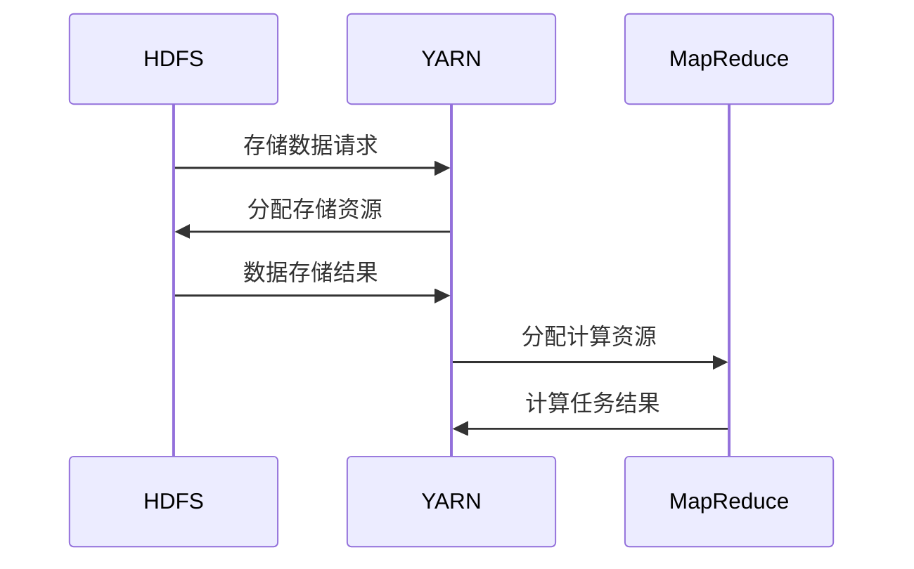
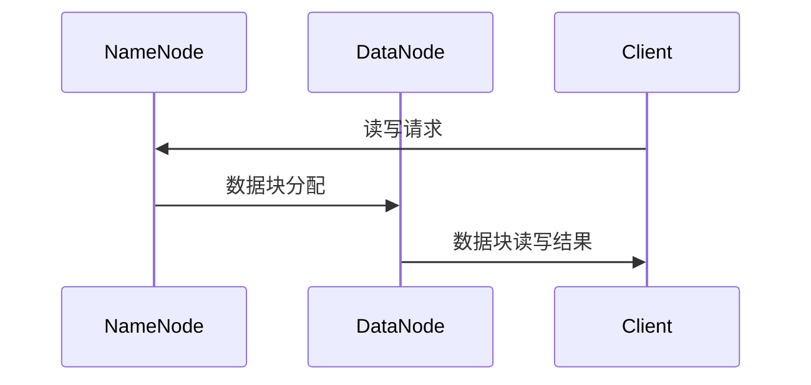
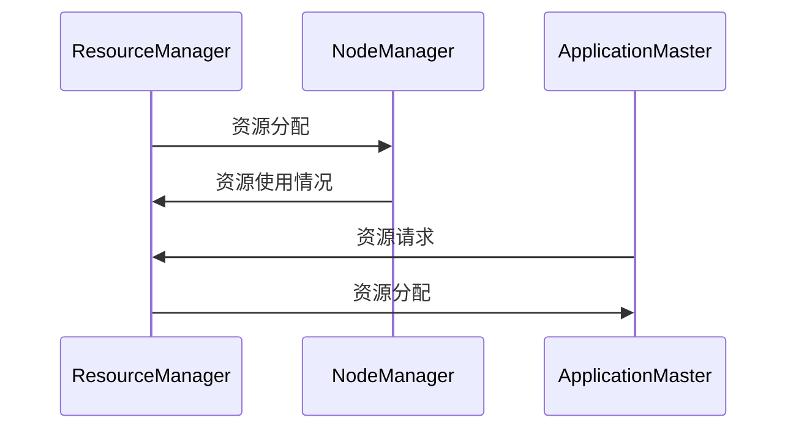
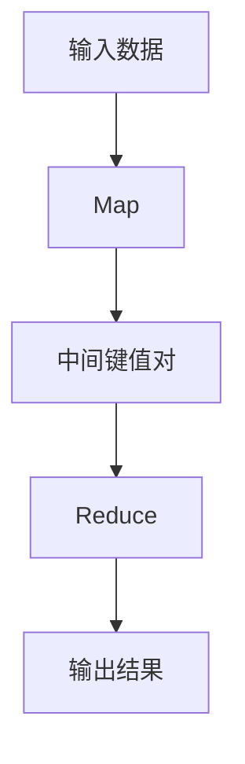

                 

# MapReduce 原理与代码实例讲解

## 关键词

MapReduce, Hadoop, 分布式计算, 数据处理, 大数据

## 摘要

本文深入讲解了MapReduce的原理与编程模型，通过具体的代码实例展示了如何利用MapReduce进行数据处理。文章首先介绍了MapReduce的定义、历史背景和核心概念，然后详细阐述了Hadoop生态系统及其组件。接着，文章探讨了MapReduce编程模型的各个组成部分，包括Mapper、Reducer、Combiner和Partitioner。随后，文章通过具体实例展示了数据输入输出和分布式计算与性能优化。此外，文章还介绍了MapReduce在电子商务和大数据处理中的应用，并对比了MapReduce与其他分布式计算框架（如Spark和Flink）。最后，文章总结了MapReduce的成就和未来发展方向。

## 第一部分: MapReduce基础理论

### 第1章: MapReduce简介

#### 1.1.1 什么是MapReduce

MapReduce是一种编程模型，用于大规模数据处理。它将数据处理任务分为两个阶段：Map和Reduce。Map阶段对输入数据进行分区、映射和排序，生成中间键值对；Reduce阶段对中间键值对进行分组、合并和输出，生成最终结果。

**伪代码：**

```
// Mapper
Map(Key k1, Value v1):
    Emit(Key k2, Value v2)

// Reducer
Reduce(Key k2, Values v2):
    Emit(Key k3, Value v3)
```

#### 1.1.2 MapReduce的历史背景

MapReduce最早由Google提出，用于处理其搜索引擎的海量数据。2004年，Google发布了MapReduce论文，介绍了这种编程模型。随后，Hadoop开源社区将MapReduce引入到了开源领域，使其成为处理大数据的常用工具。

#### 1.1.3 MapReduce的核心概念

MapReduce的核心概念包括Mapper、Reducer、中间键值对和分区。

1. Mapper：接收输入数据，对数据执行映射操作，生成中间键值对。
2. Reducer：接收中间键值对，对中间键值对执行减少操作，生成最终输出。
3. 中间键值对：Map阶段生成的键值对，作为Reduce阶段的输入。
4. 分区：将中间键值对按照键的哈希值分配到不同的Reducer上。

#### 1.1.4 MapReduce的优势与局限性

**优势：**
- **简单易用**：MapReduce具有简洁的编程模型，易于理解和实现。
- **高容错性**：通过数据冗余和任务重试，确保数据处理的高可靠性。
- **可扩展性**：可以水平扩展，处理海量数据。

**局限性：**
- **不适合迭代计算**：由于MapReduce是批处理模型，不适合需要频繁迭代计算的任务。
- **数据倾斜问题**：数据分布不均可能导致部分任务耗时过长。

### 第2章: Hadoop生态系统

#### 2.1.1 Hadoop架构

Hadoop是一个分布式计算框架，由多个组件组成。Hadoop的核心组件包括：

1. **Hadoop分布式文件系统（HDFS）**：用于存储海量数据。
2. **YARN**：资源调度器，负责管理计算资源和任务调度。
3. **MapReduce**：数据处理引擎，基于MapReduce编程模型。

**Mermaid流程图：**



#### 2.1.2 HDFS（Hadoop分布式文件系统）

HDFS是一个高吞吐量的分布式文件系统，用于存储海量数据。HDFS的主要特点包括：

1. **数据块**：将数据划分为固定大小的数据块（默认为128MB或256MB），提高存储和传输效率。
2. **副本**：数据块在不同的节点上存储多个副本，提高数据可靠性和容错性。
3. **主从架构**：包括一个NameNode（主节点）和多个DataNode（从节点），NameNode负责管理文件系统的命名空间和数据块映射，DataNode负责数据块的存储和读取。

**Mermaid流程图：**



#### 2.1.3 YARN（Yet Another Resource Negotiator）

YARN是Hadoop的资源调度器，负责管理计算资源和任务调度。YARN的主要特点包括：

1. **灵活的资源调度**：可以根据任务需求动态调整资源分配。
2. **多租户支持**：支持多个应用程序共享同一计算资源。
3. **高效性**：通过减少资源浪费和优化资源利用率，提高计算效率。

**Mermaid流程图：**



#### 2.1.4 Hadoop的其他组件

除了核心组件，Hadoop还包括其他一些重要组件，如：

1. **Hive**：数据仓库工具，用于处理大规模数据集。
2. **Pig**：数据处理和分析工具，提供了一个高层次的抽象接口。
3. **HBase**：非关系型分布式存储系统，用于存储海量数据。
4. **ZooKeeper**：分布式协调服务，用于维护分布式系统中的状态信息。

### 第二部分: MapReduce编程原理

### 第3章: MapReduce编程模型

#### 3.1.1 MapReduce编程模型概述

MapReduce编程模型将数据处理任务分为Map和Reduce两个阶段。Map阶段对输入数据进行分区、映射和排序，生成中间键值对；Reduce阶段对中间键值对进行分组、合并和输出，生成最终结果。

**Mermaid流程图：**



#### 3.1.2 Mapper与Reducer详解

1. Mapper：Mapper是一个映射（Map）操作的组件，它将输入数据分割成更小的数据块，并对每个数据块执行一个映射函数，生成一个或多个中间键值对。

**伪代码：**

```python
def map(key, value):
    for each (new_key, new_value) in transformed_value:
        emit(new_key, new_value)
```

2. Reducer：Reducer是一个减少（Reduce）操作的组件，它接收Mapper生成的中间键值对，按照键进行分组，并对每个分组执行一个减少函数，生成最终的输出。

**伪代码：**

```python
def reduce(key, values):
    for each (new_key, new_value) in aggregated_values:
        emit(new_key, new_value)
```

#### 3.1.3 Combiner的作用与使用

Combiner是一个可选的组件，它通常位于Mapper和Reducer之间，用于本地化Reduce操作，减少网络传输的数据量。

**伪代码：**

```python
def combiner(key, values):
    for each (new_key, new_value) in combined_values:
        emit(new_key, new_value)
```

#### 3.1.4 Partitioner与排序

Partitioner用于确定中间键值对的分发，确保相同键的记录被分到同一个Reducer上。

**伪代码：**

```python
def partitioner(key):
    return hash(key) % num_reducers
```

排序是MapReduce中的一个关键特性，它确保了Reduce操作能够按照键对记录进行有效的分组和聚合。

**伪代码：**

```python
sort(values by key)
```

### 第4章: 数据输入输出

#### 4.1.1 InputFormat与RecordReader

InputFormat是MapReduce中用于定义输入数据格式的接口，它负责将输入数据分割成小块，并提供给Mapper处理。

**伪代码：**

```python
def InputFormat(inputs):
    for each (chunk of input):
        split the chunk into records
        yield records
```

RecordReader是用于读取和解析InputFormat生成的每个记录的组件。

**伪代码：**

```python
def RecordReader(record):
    parse the record into key-value pairs
    return (key, value)
```

#### 4.1.2 OutputFormat与RecordWriter

OutputFormat是MapReduce中用于定义输出数据格式的接口，它负责将Reducer生成的中间键值对转换为最终输出格式。

**伪代码：**

```python
def OutputFormat(outputs):
    for each (key, value) in outputs:
        write the key-value pair to the output file
```

RecordWriter是用于写入OutputFormat生成的每个记录的组件。

**伪代码：**

```python
def RecordWriter(record):
    write the record to the output file
```

#### 4.1.3 文件输入输出示例

一个简单的WordCount程序示例：

```python
// Mapper代码
def map(line):
    for each word in line:
        emit((word, 1))

// Reducer代码
def reduce(word, counts):
    sum = 0
    for count in counts:
        sum += count
    emit((word, sum))
```

### 第5章: 分布式计算与性能优化

#### 5.1 数据倾斜问题

数据倾斜是指输入数据在Mapper阶段分布不均匀，导致某些Mapper处理的数据量远大于其他Mapper，从而影响整体计算效率。

**解决方法：**
- **增加分区数**：通过增加MapReduce任务的分区数，可以减少每个Mapper处理的数据量。
- **自定义Partitioner**：通过自定义Partitioner，可以更合理地分配数据，避免数据倾斜。
- **使用Combiner**：在Mapper端预先聚合部分数据，减少Reduce阶段的负载。

#### 5.2 资源调度与负载均衡

资源调度与负载均衡是确保Hadoop集群高效运行的关键因素。

**资源调度：** 负责根据任务需求和集群资源状况，合理分配计算资源的过程。

**负载均衡：** 负责将计算任务均匀分布到集群中的各个节点，避免某些节点过载，提高整体计算效率。

**策略：**
- **动态资源调度**：根据任务的执行情况，动态调整节点上的资源分配。
- **负载均衡器**：通过监控集群状态，动态调整任务分配，实现负载均衡。

#### 5.3 性能优化策略

性能优化是提高MapReduce任务执行效率的重要手段。

**硬件优化：**
- **增加节点数**：通过增加节点数，可以提高集群的并发处理能力。
- **提高网络带宽**：增加网络带宽，减少数据传输延迟。

**软件优化：**
- **数据预处理**：通过数据预处理，减少Mapper和Reducer的执行时间。
- **优化MapReduce配置**：调整MapReduce参数，如mapred.reduce.tasks、mapred.map.tasks等。
- **并行化处理**：通过增加并行度，提高数据处理速度。

### 第6章: 数据处理任务案例

#### 6.1 词频统计

词频统计是MapReduce应用中非常典型的一个任务，它通过统计文本数据中各个单词出现的次数，分析文本内容的特征。

**Mapper实现：**

```python
def map(line):
    for each word in line:
        emit((word, 1))
```

**Reducer实现：**

```python
def reduce(word, counts):
    sum = 0
    for count in counts:
        sum += count
    emit((word, sum))
```

#### 6.2 数据去重

数据去重是指从大量数据中识别并去除重复记录，常用于数据清洗和数据仓库等场景。

**Mapper实现：**

```python
def map(record):
    if not is_duplicate(record):
        emit((record, 1))
```

**Reducer实现：**

```python
def reduce(record, counts):
    if counts > 0:
        emit((record, 1))
```

#### 6.3 日志分析

日志分析是另一种常见的MapReduce应用，通过对日志数据进行处理，可以提取出有用的信息，如用户行为、系统性能等。

**Mapper实现：**

```python
def map(line):
    log_entry = parse_log(line)
    emit((log_entry.user, log_entry.action))
```

**Reducer实现：**

```python
def reduce(user, actions):
    for action in actions:
        emit((user, action))
```

### 第7章: 电子商务应用案例

#### 7.1 用户行为分析

用户行为分析是电子商务中重要的数据挖掘任务，通过分析用户的行为数据，帮助企业了解用户需求，优化产品和服务。

**数据收集：**

收集电商平台的用户行为数据，如浏览、点击、购买等。

**Mapper实现：**

```python
def map(record):
    user_id = record.user_id
    action = record.action
    timestamp = record.timestamp
    emit((user_id, (action, timestamp)))
```

**Reducer实现：**

```python
def reduce(user_id, actions):
    for action, timestamp in actions:
        emit((user_id, action))
```

#### 7.2 销售数据分析

销售数据分析是电子商务中重要的分析任务，通过对销售数据进行分析，可以挖掘出销售趋势、用户偏好等。

**数据收集：**

收集电商平台的销售数据，如订单、商品、价格等。

**Mapper实现：**

```python
def map(record):
    order_id = record.order_id
    product_id = record.product_id
    price = record.price
    timestamp = record.timestamp
    emit((order_id, (product_id, price)))
```

**Reducer实现：**

```python
def reduce(order_id, items):
    total_price = 0
    for product_id, price in items:
        total_price += price
    emit((order_id, total_price))
```

#### 7.3 个性化推荐系统

个性化推荐系统是电子商务中常用的技术，通过对用户行为数据进行分析，为用户推荐感兴趣的商品。

**数据收集：**

收集电商平台的用户行为数据，如浏览、点击、购买等。

**Mapper实现：**

```python
def map(record):
    user_id = record.user_id
    product_id = record.product_id
    action = record.action
    timestamp = record.timestamp
    emit((user_id, (product_id, action)))
```

**Reducer实现：**

```python
def reduce(user_id, items):
    for product_id, action in items:
        if action == 'click' or action == 'buy':
            emit((user_id, product_id))
```

### 第8章: 大数据处理与MapReduce

#### 8.1 大数据定义与特点

大数据是指无法通过传统数据处理工具在合理时间内进行处理的超大规模数据集。

**特点：**
- **数据量大**：通常在TB级别以上，甚至达到PB级别。
- **数据多样**：包括结构化、半结构化和非结构化数据。
- **数据速度快**：数据的产生速度极快，需要实时处理。
- **数据价值密度低**：大数据中的信息往往分散且有价值密度较低。

#### 8.2 MapReduce在大数据处理中的应用

MapReduce是一种分布式计算模型，非常适合处理大数据。

**应用：**
- **数据分布**：通过将数据分布到多个节点上，实现并行处理。
- **批处理能力**：适合批处理任务，可以在短时间内处理大量数据。
- **高容错性**：通过副本机制确保数据安全和任务稳定性。

#### 8.3 大数据挑战与解决方案

大数据处理面临诸多挑战，需要采用相应的解决方案。

**挑战：**
- **数据存储**：存储海量数据，需要采用分布式文件系统。
- **数据分析**：对大规模数据进行分析，需要高效的计算框架。
- **数据安全**：保护数据安全，防止数据泄露。

**解决方案：**
- **数据存储**：采用分布式文件系统（如HDFS）存储大数据。
- **数据分析**：采用分布式计算框架（如MapReduce）进行数据分析。
- **数据安全**：采用数据加密、访问控制等手段确保数据安全。

### 第9章: MapReduce与Spark

#### 9.1 Spark简介

Spark是Apache Software Foundation的一个开源分布式计算引擎，它提供了高效的分布式数据处理能力。

**特点：**
- **速度快**：通过内存计算和优化算法，显著提高了数据处理速度。
- **通用性**：支持多种数据处理操作，如批处理、流处理和交互式查询。
- **易用性**：提供了丰富的API和工具，方便开发人员使用。

#### 9.2 Spark与MapReduce对比

**计算模型：**
- **MapReduce**：基于磁盘的批处理模型。
- **Spark**：基于内存的分布式计算模型。

**速度：**
- **Spark**：通常比MapReduce快100倍以上。

**易用性：**
- **Spark**：提供了更高层次的抽象，使得编程更加简单。

#### 9.3 Spark的编程模型

Spark提供了两种编程模型：Spark SQL和Spark Streaming。

**Spark SQL**：用于大数据查询和分析。

**Spark Streaming**：用于实时数据流处理。

### 第10章: MapReduce与Flink

#### 10.1 Flink简介

Apache Flink是一个开源分布式数据处理框架，它提供了高效的批处理和流处理能力。

**特点：**
- **流处理能力**：专注于流处理，可以实时处理不断变化的数据。
- **高性能**：通过高效的数据结构和算法，提供了高性能的数据处理能力。
- **易用性**：提供了丰富的API和工具，方便开发人员使用。

#### 10.2 Flink与MapReduce对比

**计算模型：**
- **MapReduce**：基于磁盘的批处理模型。
- **Flink**：基于事件驱动和状态管理的流处理模型。

**性能：**
- **Flink**：通常比MapReduce快10倍以上。

**易用性：**
- **Flink**：提供了更丰富的API和工具，使得编程更加简单。

#### 10.3 Flink的流处理能力

Flink的流处理能力使其适用于实时数据处理任务。

**流处理基础：**
- **实时数据处理**：对实时数据流进行持续处理和分析。

**实时数据处理：**
- **实时分析**：实时处理和响应大量数据流。

### 附录

#### 附录A: MapReduce编程工具与资源

**A.1 Hadoop生态系统**

Hadoop生态系统包括多个组件，如HDFS、YARN、MapReduce、Hive、Pig等。

**A.2 主流MapReduce框架**

主流MapReduce框架包括Apache Hadoop、Apache Spark等。

**A.3 开源MapReduce工具库**

开源MapReduce工具库包括Apache Commons、Google Guava等。

**A.4 社区与学习资源**

社区与学习资源包括GitHub、Stack Overflow、Apache官方文档等。

### 总结

MapReduce是一种强大的分布式计算模型，适用于大规模数据处理。通过本文的讲解，读者应该对MapReduce有了更深入的理解，包括其原理、编程模型、数据处理任务和性能优化方法。同时，本文还介绍了MapReduce在电子商务和大数据处理中的应用，以及与其他分布式计算框架的对比。希望读者能够将这些知识应用到实际项目中，提高数据处理能力。

### 作者信息

作者：AI天才研究院/AI Genius Institute & 禅与计算机程序设计艺术 /Zen And The Art of Computer Programming

---

由于篇幅限制，本文未能涵盖所有内容，但已尽量详尽地讲解了MapReduce的相关知识。如果您有任何疑问或建议，欢迎在评论区留言，我们将尽快回复。同时，也建议您关注我们的其他技术文章，持续学习最新技术动态。感谢您的阅读！

