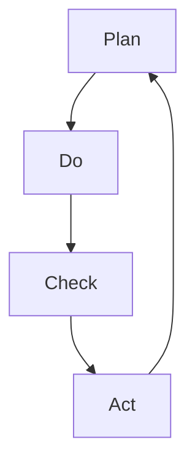
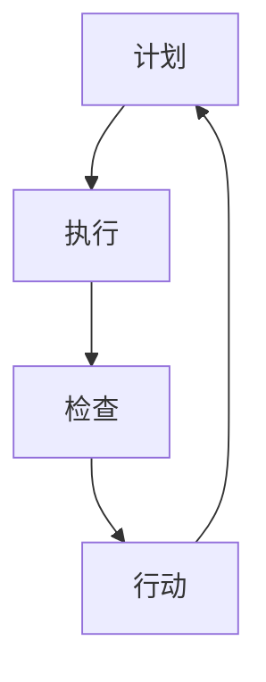

                 

# 《PDCA在项目管理中的运用》

## 关键词：
项目管理、PDCA循环、持续改进、质量监控、团队协作

## 摘要：
本文将深入探讨PDCA（Plan-Do-Check-Act）循环在项目管理中的运用。我们将从PDCA的理论基础出发，逐步分析其在项目规划、执行、监控与反馈中的应用，并通过实际案例展示其效果。文章还将探讨PDCA在不同领域（如软件开发、产品管理、市场营销等）的应用，并提供实践工具和方法，以帮助读者更好地理解和应用PDCA循环。

### 目录大纲

# 《PDCA在项目管理中的运用》目录大纲

## 第一部分：PDCA概述

## 第1章：PDCA理论基础

### 1.1 PDCA的起源与发展

### 1.2 PDCA的基本概念

### 1.3 PDCA在项目管理中的应用优势

## 第2章：PDCA的核心原理

### 2.1 PDCA的四个阶段

### 2.2 PDCA与项目管理流程的融合

### 2.3 PDCA在团队协作中的价值

## 第二部分：PDCA在实际项目中的应用

## 第3章：PDCA在项目规划中的应用

### 3.1 项目目标设定与分解

### 3.2 项目进度规划与监控

### 3.3 风险管理与应对策略

## 第4章：PDCA在项目执行中的应用

### 4.1 PDCA在项目执行中的实施步骤

### 4.2 质量控制与改进

### 4.3 项目资源管理与优化

## 第5章：PDCA在项目监控与反馈中的应用

### 5.1 项目绩效评估与监控

### 5.2 反馈机制与问题解决

### 5.3 持续改进与项目优化

## 第三部分：PDCA案例分析与实践

## 第6章：PDCA在软件开发项目中的应用

### 6.1 软件开发项目的PDCA实践

### 6.2 软件开发项目中的问题与解决方案

### 6.3 软件开发项目的PDCA效果评估

## 第7章：PDCA在其他项目管理领域中的应用

### 7.1 PDCA在产品管理中的应用

### 7.2 PDCA在市场营销管理中的应用

### 7.3 PDCA在人力资源规划中的应用

## 附录

### 附录A：PDCA工具与方法

### 附录B：PDCA实践案例集

### 附录C：PDCA相关资源与推荐阅读

### 附录D：PDCA思维导图与流程图

---

### 第1章：PDCA理论基础

#### 1.1 PDCA的起源与发展

PDCA循环，又称戴明循环，起源于20世纪30年代的美国。它是由统计学家威廉·爱德华·戴明（W. Edwards Deming）博士提出并推广的。戴明博士在质量管理和持续改进领域做出了巨大贡献，他强调通过系统化的方法来管理和改进过程，从而提高产品的质量和企业的效率。PDCA循环正是这种理念的具体体现。

PDCA循环最初应用于制造业，特别是在日本，得到了广泛的应用和推广。随着项目管理理论的不断发展，PDCA循环逐渐从质量控制扩展到整个项目管理领域。在项目管理中，PDCA循环被视为一种有效的工具，可以帮助团队实现项目目标，提高项目质量和效率。

PDCA循环在不同行业和领域中的应用也在不断扩展。除了制造业，它在服务业、软件开发、产品管理、市场营销等领域也得到了广泛应用。例如，在软件开发中，PDCA循环可以帮助团队实现持续集成和持续交付；在产品管理中，它可以帮助团队不断优化产品设计和功能；在市场营销中，它可以帮助团队提高市场响应速度和客户满意度。

#### 1.2 PDCA的基本概念

PDCA循环由四个阶段组成，分别是Plan（计划）、Do（执行）、Check（检查）和Act（行动）。每个阶段都有其特定的任务和目标，并且这些阶段相互衔接，形成一个闭环。

1. **Plan（计划）阶段**：
   - 目标设定：明确项目的目标和任务。
   - 任务分解：将项目目标分解为具体的任务和活动。
   - 资源分配：确定完成任务所需的资源，包括人力、物力和财力。
   - 风险评估：分析项目可能面临的风险，并制定相应的应对策略。

2. **Do（执行）阶段**：
   - 任务执行：按照计划执行任务，确保任务的按时完成。
   - 过程控制：监控任务执行的过程，确保过程符合预期。
   - 进度跟踪：记录任务进度，及时发现并解决进度问题。

3. **Check（检查）阶段**：
   - 结果评估：对任务执行结果进行评估，包括质量、效率和成本等方面。
   - 问题识别：分析结果与预期目标之间的差距，识别存在的问题。
   - 效率分析：分析任务执行过程中的效率问题，如资源浪费、流程不畅等。

4. **Act（行动）阶段**：
   - 问题解决：针对检查阶段识别的问题，制定解决方案并实施。
   - 持续改进：总结经验教训，持续改进过程和策略，为下一个项目循环做好准备。

#### 1.3 PDCA在项目管理中的应用优势

PDCA循环在项目管理中的应用具有以下几个显著优势：

1. **系统化**：PDCA循环提供了一种系统化的方法来管理项目，从计划到执行，再到检查和行动，每个阶段都有明确的任务和目标，确保项目有序进行。

2. **持续改进**：PDCA循环的核心在于持续改进，通过不断地检查和行动，团队可以不断优化过程和策略，提高项目的质量和效率。

3. **风险控制**：PDCA循环在计划阶段就进行风险评估，并制定应对策略，从而有效降低项目风险。

4. **高效沟通**：PDCA循环强调团队协作，通过每个阶段的任务和目标，促进团队成员之间的沟通和协作，提高团队效能。

5. **质量保障**：PDCA循环在检查阶段对任务执行结果进行严格评估，确保项目质量符合预期。

6. **灵活适应**：PDCA循环允许团队在执行过程中根据实际情况进行调整，从而更好地适应变化。

#### 1.4 PDCA与其他项目管理方法的对比

PDCA循环与其他常见的项目管理方法（如瀑布模型、敏捷开发等）在以下几个方面有所不同：

1. **迭代与循环**：PDCA循环强调迭代和循环，通过不断地计划、执行、检查和行动，实现持续改进。而瀑布模型通常是一次性流程，缺乏迭代和反馈机制。

2. **灵活性**：PDCA循环更灵活，允许团队在执行过程中根据实际情况进行调整。而瀑布模型则较为僵化，难以适应变化。

3. **质量控制**：PDCA循环在检查阶段对任务执行结果进行严格评估，确保项目质量。而敏捷开发则更注重产品质量，通过持续集成和持续交付来保证质量。

4. **团队协作**：PDCA循环强调团队协作，通过每个阶段的任务和目标，促进团队成员之间的沟通和协作。而瀑布模型则强调分工，团队协作相对较少。

综上所述，PDCA循环在项目管理中具有独特的优势和应用价值，它不仅可以帮助团队实现项目目标，提高项目质量和效率，还可以促进团队协作和持续改进。在接下来的章节中，我们将进一步探讨PDCA循环在实际项目中的应用，并通过案例来展示其效果。

### 第2章：PDCA的核心原理

#### 2.1 PDCA的四个阶段

PDCA循环由四个阶段组成，分别是Plan（计划）、Do（执行）、Check（检查）和Act（行动）。每个阶段都有其特定的任务和目标，并且这些阶段相互衔接，形成一个闭环。

1. **Plan（计划）阶段**：

   - **目标设定**：明确项目的目标和任务，确保团队成员对项目的目标有共同的理解和认识。目标应具有明确性、可衡量性、可实现性、相关性和时限性，即SMART原则。

   - **任务分解**：将项目目标分解为具体的任务和活动，确保每个任务都有明确的负责人和完成时间。任务分解的方法通常包括工作分解结构（WBS）和任务分解矩阵。

   - **资源分配**：确定完成任务所需的资源，包括人力、物力和财力。资源分配应确保资源的合理利用，避免资源浪费和冲突。

   - **风险评估**：分析项目可能面临的风险，包括项目风险、技术风险、市场风险等，并制定相应的应对策略。风险评估的方法包括风险识别、风险分析和风险评价。

2. **Do（执行）阶段**：

   - **任务执行**：按照计划执行任务，确保任务的按时完成。任务执行过程中，应严格遵循既定的流程和规范，确保过程的质量和效率。

   - **过程控制**：监控任务执行的过程，确保过程符合预期。过程控制的方法包括质量控制、进度控制和成本控制。

   - **进度跟踪**：记录任务进度，及时发现并解决进度问题。进度跟踪的工具包括甘特图、看板图和进度报告。

3. **Check（检查）阶段**：

   - **结果评估**：对任务执行结果进行评估，包括质量、效率和成本等方面。结果评估的方法包括绩效评估、质量评估和效率评估。

   - **问题识别**：分析结果与预期目标之间的差距，识别存在的问题。问题识别的方法包括问题树、鱼骨图和因果分析图。

   - **效率分析**：分析任务执行过程中的效率问题，如资源浪费、流程不畅等。效率分析的方法包括流程图、流程分析和时间研究。

4. **Act（行动）阶段**：

   - **问题解决**：针对检查阶段识别的问题，制定解决方案并实施。问题解决的方法包括问题解决流程、因果分析和实验设计。

   - **持续改进**：总结经验教训，持续改进过程和策略，为下一个项目循环做好准备。持续改进的方法包括PDCA循环、六西格玛和精益管理。

#### 2.2 PDCA与项目管理流程的融合

PDCA循环可以与项目管理流程中的各个阶段相结合，从而实现项目管理的系统化和持续改进。以下是如何将PDCA循环融入项目管理流程的具体方法：

1. **项目启动阶段**：

   - **Plan**：明确项目目标和范围，制定项目章程和初步计划。
   - **Do**：组建项目团队，确定团队成员的角色和职责。
   - **Check**：对项目启动阶段的工作进行评估，确保项目目标的明确性和团队的协同性。
   - **Act**：根据评估结果，调整项目计划和团队结构，确保项目能够顺利启动。

2. **项目规划阶段**：

   - **Plan**：制定详细的项目计划，包括工作分解结构、资源分配、风险评估等。
   - **Do**：按照项目计划进行具体的工作，确保每个任务都有明确的执行步骤和时间表。
   - **Check**：监控项目进度，确保项目按计划进行，及时识别和解决问题。
   - **Act**：根据监控结果，调整项目计划和资源分配，确保项目目标的实现。

3. **项目执行阶段**：

   - **Plan**：制定执行阶段的详细计划，包括任务执行、过程控制等。
   - **Do**：执行任务，确保过程符合预期，质量得到保障。
   - **Check**：对执行结果进行评估，确保任务完成的质量和效率。
   - **Act**：根据评估结果，制定改进措施，持续优化执行过程。

4. **项目监控阶段**：

   - **Plan**：制定监控计划，包括监控指标、监控频率等。
   - **Do**：按照监控计划进行项目监控，确保项目进度、质量和成本在可控范围内。
   - **Check**：对监控结果进行分析，识别潜在的问题和风险。
   - **Act**：根据分析结果，采取相应的措施，确保项目目标的实现。

5. **项目收尾阶段**：

   - **Plan**：制定项目收尾计划，包括验收、交付、总结等。
   - **Do**：按照计划完成项目收尾工作，确保项目顺利交付。
   - **Check**：对项目进行总结和评估，总结项目经验教训。
   - **Act**：根据总结结果，制定改进措施，为下一个项目循环做好准备。

#### 2.3 PDCA在团队协作中的价值

PDCA循环不仅是一种项目管理工具，更是一种团队协作的方法。它通过四个阶段的循环，帮助团队成员建立共同的目标，提高沟通效率，增强协作能力，从而实现项目目标。

1. **共同目标**：PDCA循环的第一步是明确项目目标和任务，这有助于团队成员建立共同的目标和愿景，减少误解和冲突。

2. **沟通效率**：PDCA循环的每个阶段都强调沟通和协作，通过定期的会议和报告，团队成员可以及时分享信息，协调工作，提高沟通效率。

3. **问题解决**：PDCA循环的Check和Act阶段特别强调问题识别和解决。通过这些阶段，团队可以及时发现和解决问题，避免问题积累，提高项目质量。

4. **持续改进**：PDCA循环的最终目标是持续改进，通过不断地检查和行动，团队可以不断优化过程和策略，提高项目效率和质量。

5. **团队成长**：PDCA循环的实施过程中，团队成员会不断学习和成长。通过实践PDCA循环，团队成员可以提高项目管理能力，增强解决问题的能力，从而促进个人和团队的成长。

总之，PDCA循环在团队协作中的价值体现在其系统化的方法、持续改进的理念和高效的团队协作机制。通过PDCA循环，团队可以更好地实现项目目标，提高项目质量和效率，促进团队成员的持续成长。

### 第3章：PDCA在项目规划中的应用

#### 3.1 项目目标设定与分解

项目规划是项目管理的重要阶段，而项目目标的设定与分解是规划的核心。明确且可行的项目目标是确保项目成功的基石。以下是如何进行项目目标设定与分解的具体步骤：

1. **项目目标设定**：

   - **明确性**：项目目标应该是明确的，避免模糊和含糊不清的表述。明确的目标有助于团队成员理解项目方向，减少误解和偏差。

   - **可衡量性**：项目目标应该是可以衡量的，以便在执行过程中进行评估和监控。这有助于确保目标实现的具体程度，同时也为后续的绩效评估提供依据。

   - **可实现性**：项目目标应该是实际可行的，考虑到资源、时间和技术等因素。设定不切实际的目标可能导致项目失败或资源浪费。

   - **相关性**：项目目标应与项目整体目标和组织的战略目标保持一致，确保项目的实现对组织有积极的影响。

   - **时限性**：项目目标应设定明确的完成时限，这有助于团队在执行过程中保持紧迫感和责任感。

   - **SMART原则**：为了确保项目目标的明确性和可实现性，可以采用SMART原则（Specific具体的、Measurable可衡量的、Achievable可实现的、Relevant相关的、Time-bound有时限的）来设定项目目标。

2. **项目目标分解**：

   - **工作分解结构（WBS）**：工作分解结构是将项目目标分解为可管理的任务和子任务的过程。WBS提供了一个层次化的结构，使项目目标更加具体和可操作。

   - **任务分解矩阵**：任务分解矩阵是一种将项目目标与任务关联的工具。通过任务分解矩阵，可以明确每个任务的责任人、任务依赖关系和任务时间表。

   - **关键路径分析**：关键路径分析是确定项目中任务顺序和完成时间的方法。关键路径上的任务延迟将直接影响项目的总时长，因此需要特别关注。

3. **项目目标分解案例**：

   - **案例背景**：假设一个公司计划开发一款新的手机应用，旨在提供便捷的支付功能。项目目标是确保应用在6个月内发布，且用户满意度达到90%。

   - **目标设定**：
     - 明确性：开发一款功能齐全、用户体验优良的支付应用。
     - 可衡量性：用户满意度通过用户反馈和调查问卷进行评估。
     - 可实现性：考虑到公司的技术能力和市场环境。
     - 相关性：与公司的整体战略目标一致，提升市场竞争力和用户粘性。
     - 时限性：6个月内完成。

   - **任务分解**：
     - **需求分析**：收集用户需求，进行市场调研。
     - **设计阶段**：设计用户界面和系统架构。
     - **开发阶段**：编写代码，进行单元测试。
     - **测试阶段**：进行集成测试和用户测试。
     - **发布阶段**：发布应用，进行市场推广。
     - **维护阶段**：收集用户反馈，进行后续更新。

   - **关键路径分析**：
     - 需求分析 -> 设计阶段 -> 开发阶段 -> 测试阶段 -> 发布阶段。

通过以上步骤，项目目标得以明确和具体化，为后续的项目规划提供了坚实的基础。

#### 3.2 项目进度规划与监控

项目进度规划是确保项目按时完成的关键环节，而项目进度监控则是确保项目按计划进行的重要手段。以下是如何进行项目进度规划和监控的具体方法：

1. **项目进度规划**：

   - **制定进度计划**：进度计划是项目进度规划的核心，它规定了项目的关键里程碑和任务的时间表。制定进度计划时，需要考虑以下因素：
     - **任务顺序**：确定任务的先后顺序，确保关键任务优先进行。
     - **持续时间**：估算每个任务的持续时间，考虑任务之间的依赖关系。
     - **资源需求**：确定每个任务所需的资源，包括人力、物力和财力。
     - **缓冲时间**：为关键任务预留一定的缓冲时间，以应对可能的延误。

   - **使用工具**：常见的进度规划工具包括甘特图、关键路径法（CPM）和项目管理软件（如Microsoft Project、Jira等）。这些工具可以帮助项目经理清晰地展示项目进度，方便团队成员协作和监控。

2. **项目进度监控**：

   - **监控方法**：项目进度监控的主要方法包括定期审查、进度报告和现场监控。
     - **定期审查**：定期召开项目进度审查会议，评估项目进度，解决存在的问题。
     - **进度报告**：定期提交项目进度报告，报告内容包括实际进度、关键路径状态、资源使用情况等。
     - **现场监控**：项目经理亲自到现场检查项目的实际进展，及时发现和解决问题。

   - **监控指标**：监控项目进度需要设定一系列关键绩效指标（KPI），如：
     - **进度偏差**：实际进度与计划进度之间的差异。
     - **资源利用率**：资源使用效率的衡量，包括人力、物力和财力。
     - **质量指标**：项目质量的衡量，如缺陷率、用户满意度等。
     - **成本偏差**：实际成本与预算成本之间的差异。

3. **进度调整与风险管理**：

   - **进度调整**：在项目执行过程中，可能会出现进度延误或关键路径上的任务延迟。此时，需要根据实际情况调整进度计划，包括重新安排任务、增加资源或调整任务优先级。
   - **风险管理**：项目进度监控还涉及到风险的管理。在监控过程中，要识别潜在的风险，评估其影响和可能性，并制定相应的应对策略。

4. **项目进度监控案例**：

   - **案例背景**：假设一个软件开发项目需要在4个月内完成，项目包括需求分析、设计、开发和测试四个阶段。

   - **进度计划**：
     - 需求分析阶段（1个月）：收集需求，编写需求文档。
     - 设计阶段（1个月）：设计用户界面和系统架构。
     - 开发阶段（2个月）：编写代码，进行单元测试。
     - 测试阶段（1个月）：进行集成测试和用户测试。

   - **进度监控**：
     - **定期审查**：每周召开项目进度审查会议，评估项目进展。
     - **进度报告**：每周提交项目进度报告，包括实际进度、关键路径状态和资源使用情况。
     - **现场监控**：项目经理每月到现场检查项目进展。

   - **进度调整与风险管理**：
     - 在需求分析阶段，由于需求变更导致进度延迟，项目经理决定增加一名需求分析师，以加快需求分析的进度。
     - 在开发阶段，由于技术难题导致进度延误，项目经理调整任务优先级，将部分非关键功能的开发推迟。

通过科学的进度规划和严格的监控，项目可以更好地按计划进行，确保项目目标的实现。

#### 3.3 风险管理与应对策略

项目风险管理是确保项目成功的重要环节，它涉及到识别潜在风险、评估风险影响和制定应对策略。以下是如何进行项目风险管理和应对策略的具体步骤：

1. **风险识别**：

   - **风险来源**：识别项目可能面临的风险来源，包括项目内部因素（如技术问题、团队冲突）和外部因素（如市场变化、法规政策）。
   - **风险识别方法**：常用的风险识别方法包括头脑风暴、SWOT分析、故障树分析（FTA）等。这些方法可以帮助团队系统地识别潜在的风险。

2. **风险评估**：

   - **风险分析**：对识别出的风险进行详细分析，包括风险的概率和影响评估。风险分析的方法包括风险矩阵、风险评级等。
   - **概率-影响评估**：评估每个风险发生的概率和可能对项目造成的影响，从而确定风险的重要性和优先级。

3. **风险应对策略**：

   - **风险规避**：通过改变项目计划或采取措施来避免风险的发生。例如，在面临技术风险时，可以选择替代技术方案。
   - **风险减轻**：采取措施降低风险发生的概率或影响。例如，通过提前准备备件或加强过程控制来减轻技术故障的影响。
   - **风险转移**：将风险转移给第三方，例如通过购买保险或签订合同来转移责任。
   - **风险接受**：对于无法规避或减轻的风险，可以选择接受风险并制定应急计划。应急计划应包括风险发生时的应对措施和资源调配。

4. **风险监控与更新**：

   - **定期评估**：定期对项目风险进行评估，更新风险清单和应对策略。
   - **风险报告**：定期提交项目风险报告，包括风险状态、风险变化和应对措施。
   - **风险审查**：定期召开项目风险审查会议，评估风险应对措施的有效性，并根据实际情况进行调整。

5. **风险应对策略案例**：

   - **案例背景**：假设一个软件开发项目需要在6个月内完成，项目包括需求分析、设计、开发和测试四个阶段。

   - **风险识别**：
     - 技术风险：由于新技术的不确定性，项目可能面临技术实现的困难。
     - 市场风险：市场需求变化可能导致项目需求变更。

   - **风险评估**：
     - 技术风险：概率为50%，影响为严重。
     - 市场风险：概率为30%，影响为较大。

   - **风险应对策略**：
     - 技术风险：采用成熟的技术方案，并预留一定的技术储备。
     - 市场风险：提前与客户沟通，获取需求变更的指导，并制定灵活的迭代计划。

通过有效的风险管理和应对策略，项目可以更好地应对潜在风险，降低项目失败的概率，确保项目目标的实现。

### 第4章：PDCA在项目执行中的应用

#### 4.1 PDCA在项目执行中的实施步骤

PDCA循环在项目执行阶段起着关键作用，通过计划、执行、检查和行动四个阶段，确保项目按计划顺利推进。以下是PDCA在项目执行中的具体实施步骤：

1. **计划阶段**：

   - **制定详细计划**：根据项目目标和任务分解结果，制定详细的执行计划。计划应包括任务列表、时间表、责任人、资源分配和预算等。
   - **分配任务**：将任务分配给具体的团队成员，明确每个人的职责和任务要求。
   - **制定风险管理计划**：识别项目潜在的风险，制定相应的风险管理策略和应急计划。

2. **执行阶段**：

   - **执行任务**：按照计划开始执行任务，确保每个任务按时完成。执行过程中，应保持与计划的一致性，并遵循既定的流程和规范。
   - **过程控制**：监控任务执行的过程，确保过程符合预期。这包括质量控制、进度控制和成本控制，及时发现并解决问题。
   - **进度跟踪**：记录任务进度，定期汇报项目进展情况，确保项目按照计划进行。

3. **检查阶段**：

   - **评估结果**：对任务执行结果进行评估，包括质量、效率和成本等方面。通过绩效评估、质量评估和效率评估等方法，分析结果与预期目标的差距。
   - **问题识别**：分析评估结果，识别执行过程中存在的问题。这包括技术问题、管理问题、资源问题等。
   - **效率分析**：对执行过程中的效率问题进行分析，如流程不畅、资源浪费等，并提出改进建议。

4. **行动阶段**：

   - **问题解决**：针对检查阶段识别的问题，制定解决方案并实施。解决方案应具体、可操作，并考虑实施的成本和可行性。
   - **持续改进**：总结经验教训，对执行过程进行持续改进。这包括优化流程、改进方法、提升团队技能等，为下一次项目循环做好准备。

#### 4.2 质量控制与改进

质量控制是项目执行过程中的重要环节，确保项目交付的产品或服务符合预期质量。以下是如何在项目执行中进行质量控制与改进的具体方法：

1. **质量控制的定义**：

   - **质量控制**：质量控制是指通过监控和评估项目过程和成果，确保项目交付的产品或服务满足既定的质量标准。

2. **质量控制的方法**：

   - **过程控制**：在项目执行过程中，对各个环节进行监控和控制，确保每个任务都按照既定的标准执行。常用的过程控制方法包括统计过程控制（SPC）、流程图分析、因果图分析等。
   - **质量评估**：对项目成果进行评估，包括功能测试、性能测试、用户测试等。通过评估，可以识别潜在的问题和缺陷，并及时进行调整和修复。
   - **质量保证**：通过建立和遵循质量管理体系，确保项目交付的产品或服务满足质量标准。常用的质量保证方法包括ISO质量管理体系、CMMI（能力成熟度模型集成）等。

3. **质量改进的措施**：

   - **持续改进**：通过不断地检查和行动，发现质量问题并进行改进。持续改进的方法包括PDCA循环、六西格玛、精益生产等。
   - **流程优化**：优化项目流程，减少不必要的环节和步骤，提高效率。流程优化的方法包括流程图分析、价值流图分析、流程重组等。
   - **员工培训**：提高团队成员的质量意识和技能，通过培训和教育，提升团队的整体质量水平。
   - **质量工具的应用**：利用各种质量工具和方法，如鱼骨图、散点图、控制图等，帮助团队更好地识别和解决问题。

4. **质量控制与改进案例**：

   - **案例背景**：假设一个软件开发项目需要在4个月内完成，项目包括需求分析、设计、开发和测试四个阶段。

   - **质量控制**：
     - **过程控制**：在开发阶段，项目经理采用统计过程控制（SPC）方法，监控代码质量。通过控制图分析，及时发现代码缺陷，并采取相应的措施进行修复。
     - **质量评估**：在测试阶段，通过功能测试和性能测试，确保软件功能齐全、性能稳定。测试团队发现了一些bug，并及时报告给开发团队进行修复。
     - **质量保证**：项目团队遵循ISO质量管理体系，确保项目交付的软件符合国际标准。

   - **质量改进**：
     - **持续改进**：通过PDCA循环，项目团队不断检查和改进过程，提高开发效率和质量。每次迭代结束后，团队都会进行反思和总结，识别问题并制定改进措施。
     - **流程优化**：项目团队通过流程图分析，优化了需求分析和设计阶段的流程，减少了不必要的步骤，提高了工作效率。
     - **员工培训**：项目团队定期进行质量意识和技能培训，提高团队成员的整体质量水平。

通过有效的质量控制与改进措施，项目团队可以确保项目交付的产品或服务满足高质量标准，提高客户满意度和市场竞争力。

#### 4.3 项目资源管理与优化

项目资源管理是确保项目顺利执行和成功的关键环节，涉及到资源的合理分配和优化。以下是如何进行项目资源管理和优化的具体步骤：

1. **资源管理的定义**：

   - **资源管理**：资源管理是指对项目所需的人力、物力、财力和时间等资源进行合理分配、控制和优化，以确保项目目标的实现。

2. **资源管理的方法**：

   - **资源分配**：根据项目计划和任务需求，合理分配资源，确保每个任务都有足够的资源支持。资源分配的方法包括资源平衡、资源优化和资源优先级排序等。
   - **资源监控**：在项目执行过程中，监控资源的使用情况，确保资源得到有效利用。资源监控的方法包括资源利用率分析、资源浪费识别和资源调度等。
   - **资源优化**：通过优化资源分配和使用，提高资源利用效率。资源优化的方法包括资源平衡调整、资源共享和外包等。

3. **资源优化的措施**：

   - **资源共享**：通过资源共享，提高资源利用率。例如，多个项目可以共享相同的硬件设备和软件工具，减少重复投资。
   - **外包**：对于一些非核心任务或资源不足的情况，可以通过外包的方式，将任务交给外部合作伙伴完成，从而提高资源利用效率和项目进度。
   - **资源平衡**：通过调整任务优先级和资源分配，确保资源在不同项目或不同任务之间的平衡。资源平衡的方法包括任务调整、资源调配和资源预留等。

4. **项目资源管理案例**：

   - **案例背景**：假设一个大型软件公司需要同时进行多个项目，包括开发新软件、升级现有软件和进行市场推广。

   - **资源分配**：
     - **人力资源**：根据项目需求，将开发团队、测试团队和市场团队分配到不同的项目中，确保每个项目都有足够的资源支持。
     - **物力资源**：确保每个项目都有足够的计算机、网络设备和测试环境。
     - **财力资源**：根据项目预算，合理分配财务资源，确保项目资金充足。

   - **资源监控**：
     - **人力资源监控**：通过员工工作日志和进度报告，监控人力资源的使用情况，确保团队成员的工作效率。
     - **物力资源监控**：定期检查设备的使用情况，确保设备的正常运行和保养。
     - **财力资源监控**：通过财务报表和预算分析，监控财务资源的使用情况，确保项目资金在预算范围内。

   - **资源优化**：
     - **资源共享**：多个项目共享相同的开发环境和测试工具，减少重复投资。
     - **外包**：对于一些市场推广任务，公司选择与专业的市场推广公司合作，提高资源利用效率。
     - **资源平衡**：根据项目进度和资源需求，动态调整任务优先级和资源分配，确保资源在不同项目之间的平衡。

通过有效的项目资源管理和优化措施，公司可以确保资源得到合理利用，提高项目执行效率和质量，从而实现项目目标的顺利实现。

### 第5章：PDCA在项目监控与反馈中的应用

#### 5.1 项目绩效评估与监控

项目绩效评估与监控是确保项目按计划顺利进行的关键环节。通过定期评估和监控项目绩效，可以及时发现和解决问题，确保项目目标的实现。以下是项目绩效评估与监控的具体方法和步骤：

1. **绩效评估的定义**：

   - **绩效评估**：绩效评估是对项目执行过程中的各项指标进行测量和评估，以判断项目是否按计划进行，是否达到预期目标。

2. **绩效评估的方法**：

   - **关键绩效指标（KPI）**：关键绩效指标是衡量项目绩效的核心指标，如项目进度、成本、质量、团队协作等。通过设定具体的KPI，可以更准确地评估项目绩效。
   - **基准对比**：将项目实际绩效与设定的基准或行业标准进行对比，以评估项目的相对表现。
   - **360度评估**：通过多角度、多维度的评估方式，包括自评、同事评价、上级评价等，全面了解项目团队的绩效。

3. **项目监控的方法**：

   - **定期审查**：定期召开项目审查会议，评估项目进度、质量和成本等方面，及时发现和解决问题。
   - **进度报告**：定期提交项目进度报告，包括实际进度、关键路径状态、资源使用情况等，确保项目透明化。
   - **现场监控**：项目经理亲自到现场检查项目进展，与团队成员交流，了解实际情况，确保项目按计划进行。

4. **绩效评估与监控的步骤**：

   - **设定评估标准**：根据项目目标和任务分解，设定具体的评估标准和指标。
   - **数据收集**：收集项目执行过程中的相关数据，如进度报告、绩效报告、测试结果等。
   - **数据分析**：对收集的数据进行分析，评估项目的实际绩效与预期目标的差距。
   - **问题识别**：分析评估结果，识别项目执行过程中存在的问题。
   - **反馈与调整**：将评估结果和问题反馈给项目团队，并根据实际情况进行调整和改进。

5. **项目绩效评估与监控的案例**：

   - **案例背景**：假设一个软件开发项目需要在6个月内完成，项目包括需求分析、设计、开发和测试四个阶段。

   - **绩效评估与监控**：
     - **设定评估标准**：根据项目目标和任务分解，设定具体的KPI，如进度完成率、代码缺陷率、团队协作度等。
     - **数据收集**：通过定期进度报告、代码审查和团队会议，收集项目执行过程中的数据。
     - **数据分析**：对收集的数据进行分析，评估项目的实际绩效，如进度完成率为90%，代码缺陷率为5%。
     - **问题识别**：分析评估结果，发现项目进度存在一定延迟，部分代码存在缺陷。
     - **反馈与调整**：将评估结果和问题反馈给项目团队，并制定改进措施，如增加资源、调整任务优先级等。

通过有效的项目绩效评估与监控，项目团队可以及时发现问题，调整策略，确保项目目标的实现。

#### 5.2 反馈机制与问题解决

在项目执行过程中，建立有效的反馈机制和问题解决流程是确保项目成功的关键。以下是如何建立反馈机制和问题解决流程的具体方法和步骤：

1. **反馈机制的定义**：

   - **反馈机制**：反馈机制是指通过多渠道、多方式收集项目成员的意见和建议，并将这些信息反馈给项目团队或管理层，以促进项目改进和优化。

2. **建立反馈机制的步骤**：

   - **确定反馈渠道**：建立多种反馈渠道，如定期会议、电子邮件、即时通讯工具等，确保项目成员可以方便地提出意见和建议。
   - **设定反馈流程**：明确反馈的流程和步骤，确保反馈信息能够及时传递和处理。反馈流程应包括反馈提交、审核、处理和反馈结果跟进等环节。
   - **激励反馈**：建立激励机制，鼓励项目成员积极参与反馈，提高反馈的质量和积极性。

3. **问题解决流程**：

   - **问题识别**：在项目执行过程中，及时发现和识别问题。问题可以来源于进度报告、质量评估、用户反馈等。
   - **问题分类**：根据问题的性质和影响程度，将问题分类为紧急问题、重要问题、一般问题等，以便优先处理。
   - **问题分析**：对识别的问题进行深入分析，找出问题的根本原因。常用的分析工具包括因果图、鱼骨图等。
   - **问题解决**：针对分析结果，制定解决方案并实施。解决方案应具体、可行，并考虑实施的成本和可行性。
   - **问题验证**：实施解决方案后，验证问题是否得到解决。通过测试、反馈等手段，确保问题确实得到解决。

4. **反馈机制与问题解决案例**：

   - **案例背景**：假设一个软件开发项目在执行过程中，团队发现部分功能模块存在性能瓶颈。

   - **反馈机制**：
     - **确定反馈渠道**：项目团队通过定期会议、电子邮件等方式收集成员的意见和建议。
     - **设定反馈流程**：明确反馈提交、审核、处理和反馈结果跟进的流程，确保反馈信息得到及时处理。

   - **问题解决**：
     - **问题识别**：在项目进度报告中，团队发现部分功能模块的性能不佳。
     - **问题分析**：通过性能测试和代码审查，分析问题的根本原因，发现代码优化不足。
     - **问题解决**：制定优化方案，包括代码重构、性能调优等，并实施解决方案。
     - **问题验证**：通过再次性能测试，验证问题是否得到解决，确保功能模块的性能达到预期。

通过有效的反馈机制和问题解决流程，项目团队可以及时识别和解决问题，提高项目质量和效率。

#### 5.3 持续改进与项目优化

持续改进与项目优化是确保项目长期成功的关键。通过不断地检查、评估和改进，项目团队能够不断提高项目的质量、效率和客户满意度。以下是如何进行持续改进与项目优化的一系列步骤：

1. **持续改进的定义**：

   - **持续改进**：持续改进是一种不断寻求和实施改进的方法，旨在不断提高项目过程、产品质量和团队效能。

2. **持续改进的步骤**：

   - **评估现有过程**：对项目的执行过程进行评估，识别现有过程中的问题和不足。评估可以包括过程效率、资源利用率、质量标准等。
   - **确定改进目标**：根据评估结果，设定具体的改进目标。改进目标应具有明确性、可衡量性和可实现性。
   - **制定改进计划**：制定详细的改进计划，包括改进措施、责任人和实施时间表。改进计划应考虑资源的分配和成本的控制。
   - **实施改进措施**：按照改进计划，实施具体的改进措施。这可以包括流程优化、工具改进、技能提升等。
   - **评估改进效果**：在改进措施实施后，评估改进效果，确保改进目标得到实现。评估可以包括绩效指标、用户反馈、团队反馈等。

3. **项目优化的方法**：

   - **流程优化**：通过流程优化，减少不必要的环节和步骤，提高工作效率。流程优化的方法包括价值流图分析、流程重组等。
   - **工具改进**：使用先进的工具和技术，提高项目的执行效率和效果。例如，采用项目管理软件、自动化测试工具等。
   - **技能提升**：通过培训和教育，提高团队成员的专业技能和团队合作能力。技能提升的方法包括内部培训、外部培训、技能竞赛等。

4. **持续改进与项目优化案例**：

   - **案例背景**：假设一个软件开发项目在执行过程中，团队发现项目的开发周期较长，且部分功能模块的性能不佳。

   - **持续改进与优化**：
     - **评估现有过程**：团队通过分析项目进度、代码质量、用户反馈等，发现项目的开发周期较长，且部分功能模块的性能不佳。
     - **确定改进目标**：设定改进目标，包括缩短开发周期、提高功能模块的性能、提升用户体验等。
     - **制定改进计划**：制定详细的改进计划，包括代码重构、性能优化、用户体验提升等措施，并分配责任人和实施时间表。
     - **实施改进措施**：团队按照改进计划，实施代码重构、性能优化等改进措施，同时加强用户体验测试，提升用户满意度。
     - **评估改进效果**：通过项目进度报告、用户反馈、团队反馈等，评估改进效果，确保改进目标得到实现。

通过持续改进与项目优化，项目团队能够不断提高项目的质量、效率和客户满意度，确保项目的长期成功。

### 第6章：PDCA在软件开发项目中的应用

#### 6.1 软件开发项目的PDCA实践

软件开发项目是一个复杂的过程，涉及到需求分析、设计、编码、测试等多个阶段。PDCA循环在软件开发项目中具有广泛的应用，通过四个阶段的循环，可以帮助团队高效地管理项目，提高软件质量。

1. **Plan（计划）阶段**：

   - **需求分析**：在计划阶段，团队首先进行需求分析，明确软件的功能和性能要求。这包括收集用户需求、分析市场趋势和竞争产品等。
   - **设计**：根据需求分析结果，进行系统设计和模块设计。设计阶段需要考虑软件的架构、数据库设计、界面设计等。
   - **资源分配**：在计划阶段，团队还需要确定项目所需的资源，包括人力、技术、设备等，并制定详细的项目计划和时间表。
   - **风险评估**：在计划阶段，对项目可能面临的风险进行评估，包括技术风险、市场风险、人员风险等，并制定相应的应对策略。

2. **Do（执行）阶段**：

   - **编码**：根据设计文档，开发人员开始编写代码，实现软件的功能。编码阶段需要遵循编码规范和最佳实践，确保代码的可读性和可维护性。
   - **测试**：在编码过程中，测试人员开始进行单元测试、集成测试和系统测试，确保软件的质量和性能。
   - **团队协作**：执行阶段强调团队协作，开发人员、测试人员、项目经理等需要密切合作，确保项目按时按质完成。

3. **Check（检查）阶段**：

   - **质量评估**：在检查阶段，对软件的代码、设计和测试结果进行评估，确保软件的质量符合预期。质量评估可以通过代码审查、测试报告、用户反馈等方式进行。
   - **问题识别**：通过质量评估，识别软件中的问题和缺陷。这些问题可能是功能性的、性能性的或用户体验方面的。
   - **效率分析**：对项目执行过程中的效率进行评估，包括资源利用情况、进度偏差等。通过效率分析，找出优化空间，提高项目的效率。

4. **Act（行动）阶段**：

   - **问题解决**：针对检查阶段发现的问题，制定解决方案并实施。解决方案可能包括代码修复、设计调整、测试优化等。
   - **持续改进**：总结经验教训，对项目过程和策略进行持续改进。通过持续改进，提高团队的技能和效率，为下一个项目循环做好准备。

5. **PDCA在软件开发项目的效果**：

   - **提高软件质量**：通过PDCA循环，团队能够持续改进软件的质量，减少缺陷和错误。
   - **缩短开发周期**：通过计划和执行阶段的严格管理，项目团队能够更高效地完成任务，缩短开发周期。
   - **增强团队协作**：PDCA循环强调团队协作，通过四个阶段的循环，团队能够更好地协调工作，提高协作效率。
   - **提高客户满意度**：通过持续改进和问题解决，项目团队能够提供更高质量的软件，提高客户满意度。

#### 6.2 软件开发项目中的问题与解决方案

在软件开发项目中，团队可能会遇到各种各样的问题，这些问题可能会影响项目的进度、质量和客户满意度。以下是一些常见的问题及其解决方案：

1. **需求变更**：

   - **问题**：在项目执行过程中，用户需求可能会发生变化，导致项目计划需要进行调整。
   - **解决方案**：建立灵活的需求管理流程，包括需求变更评审、优先级排序和影响分析。在变更发生后，及时调整项目计划，确保项目目标的实现。

2. **进度延误**：

   - **问题**：项目可能会因为各种原因（如技术难题、人员变动等）导致进度延误。
   - **解决方案**：通过严格的进度监控和风险预警机制，及时发现进度问题。在进度延误时，采取紧急措施，如增加资源、调整任务优先级等，确保项目按时完成。

3. **质量问题**：

   - **问题**：软件中可能存在功能缺陷、性能问题或用户体验不佳等问题。
   - **解决方案**：通过实施严格的质量控制流程，包括代码审查、测试和用户反馈等，及时发现和解决质量问题。同时，加强团队的质量意识，提高整体质量水平。

4. **团队协作问题**：

   - **问题**：团队成员之间可能存在沟通不畅、职责不明等问题，影响项目进展。
   - **解决方案**：建立有效的沟通机制，如定期会议、即时通讯工具等，确保团队成员之间的信息畅通。明确团队成员的职责和任务，提高团队协作效率。

5. **资源不足**：

   - **问题**：项目可能因为资源不足（如人力、技术等）导致项目进展缓慢。
   - **解决方案**：通过合理的资源分配和调度，确保项目资源的充分利用。在资源不足时，可以采用外包、资源共享等方式，缓解资源紧张的情况。

通过有效的解决方案，项目团队能够应对软件开发项目中可能出现的问题，确保项目的成功完成。

#### 6.3 软件开发项目的PDCA效果评估

在软件开发项目中，评估PDCA循环的效果是非常重要的，这有助于团队了解PDCA的实施情况，找出改进的空间，进一步提高项目的质量和效率。以下是如何评估软件开发项目中PDCA效果的具体方法：

1. **评估指标**：

   - **进度完成率**：评估项目实际进度与计划进度之间的差距，计算进度完成率。
   - **质量合格率**：评估软件测试结果，计算质量合格率，即通过测试的功能模块占总功能的比例。
   - **客户满意度**：通过用户反馈和满意度调查，评估客户对软件的满意度。
   - **成本控制**：评估项目实际成本与预算成本之间的差距，计算成本控制率。

2. **评估方法**：

   - **绩效评估**：定期召开绩效评估会议，评估项目的进度、质量和成本等方面，收集团队成员和客户的反馈。
   - **数据分析**：通过数据分析，评估项目的各项指标，如进度完成率、质量合格率、客户满意度等，找出项目的优势和不足。
   - **用户反馈**：收集用户对软件的反馈，了解软件的实际使用情况，评估用户满意度。

3. **评估步骤**：

   - **设定评估标准**：根据项目目标和任务分解，设定具体的评估标准和指标。
   - **数据收集**：收集项目执行过程中的相关数据，如进度报告、测试结果、用户反馈等。
   - **数据分析**：对收集的数据进行分析，评估项目的实际绩效，与预期目标进行比较。
   - **问题识别**：分析评估结果，识别项目执行过程中存在的问题。
   - **反馈与调整**：将评估结果和问题反馈给项目团队，根据实际情况进行调整和改进。

4. **PDCA效果评估案例**：

   - **案例背景**：假设一个软件开发项目在实施PDCA循环后，项目团队需要进行效果评估。

   - **评估指标**：
     - **进度完成率**：实际进度与计划进度之间的差距。
     - **质量合格率**：通过测试的功能模块占总功能的比例。
     - **客户满意度**：用户反馈和满意度调查的结果。
     - **成本控制**：实际成本与预算成本之间的差距。

   - **评估方法**：
     - **绩效评估**：项目团队召开绩效评估会议，评估项目的进度、质量和成本等方面。
     - **数据分析**：对收集的数据进行分析，计算进度完成率、质量合格率、客户满意度、成本控制率等指标。
     - **用户反馈**：通过用户调查和反馈，了解用户对软件的满意度。

   - **评估步骤**：
     - **设定评估标准**：根据项目目标和任务分解，设定具体的评估标准和指标。
     - **数据收集**：收集项目执行过程中的相关数据，如进度报告、测试结果、用户反馈等。
     - **数据分析**：对收集的数据进行分析，评估项目的实际绩效，与预期目标进行比较。
     - **问题识别**：分析评估结果，识别项目执行过程中存在的问题。
     - **反馈与调整**：将评估结果和问题反馈给项目团队，根据实际情况进行调整和改进。

通过有效的PDCA效果评估，项目团队可以了解PDCA的实施情况，找出改进的空间，进一步提高项目的质量和效率。

### 第7章：PDCA在其他项目管理领域中的应用

#### 7.1 PDCA在产品管理中的应用

PDCA循环在产品管理中的应用具有显著的优势，通过计划、执行、检查和行动四个阶段，产品管理团队能够更有效地实现产品目标，提高产品质量和市场竞争力。

1. **产品规划阶段**：

   - **计划**：产品管理团队通过市场调研和用户需求分析，制定产品规划。规划包括产品愿景、目标市场、核心功能等。
   - **执行**：根据产品规划，团队开始制定具体的开发计划，包括功能模块、开发时间表和资源分配。
   - **检查**：在执行过程中，团队定期评估产品开发进度和功能实现情况，确保符合预期目标。
   - **行动**：根据检查结果，团队调整开发计划，解决存在的问题，确保产品规划的有效执行。

2. **产品设计阶段**：

   - **计划**：在产品设计阶段，团队制定详细的设计方案，包括用户界面、系统架构和数据库设计。
   - **执行**：按照设计方案，团队进行详细的模块设计和编码。
   - **检查**：对设计结果进行评审和测试，确保设计符合用户需求和技术标准。
   - **行动**：根据测试结果，团队对设计进行调整和优化，确保产品设计的质量和可用性。

3. **产品测试阶段**：

   - **计划**：制定详细的测试计划，包括测试环境、测试工具和测试用例。
   - **执行**：进行全面的系统测试、功能测试和用户体验测试。
   - **检查**：评估测试结果，发现和修复存在的问题。
   - **行动**：根据测试结果，团队调整测试策略和测试用例，确保产品测试的全面性和准确性。

4. **产品发布与维护阶段**：

   - **计划**：制定产品发布计划，包括发布时间、发布方式和市场推广策略。
   - **执行**：按照发布计划，进行产品发布和市场推广。
   - **检查**：收集用户反馈和数据分析，评估产品的市场表现和用户满意度。
   - **行动**：根据用户反馈和市场表现，团队对产品进行持续的维护和优化，确保产品的长期竞争力。

通过PDCA循环，产品管理团队能够持续优化产品开发过程，提高产品质量和市场适应性，为产品的成功奠定基础。

#### 7.2 PDCA在市场营销管理中的应用

PDCA循环在市场营销管理中的应用有助于团队更有效地制定和执行营销策略，提高市场响应速度和客户满意度。

1. **市场调研阶段**：

   - **计划**：根据公司战略目标，制定市场调研计划，包括调研目标、调研方法和调研时间表。
   - **执行**：实施市场调研，收集市场数据，包括竞争对手分析、消费者行为分析等。
   - **检查**：分析调研数据，识别市场机会和潜在威胁。
   - **行动**：根据调研结果，调整市场策略，明确目标市场和目标客户。

2. **营销策略制定阶段**：

   - **计划**：制定详细的营销策略，包括产品定位、市场定位、价格策略和促销策略。
   - **执行**：实施营销策略，如广告投放、促销活动等。
   - **检查**：监控营销活动的效果，包括销售额、市场份额、客户满意度等。
   - **行动**：根据检查结果，调整营销策略，优化市场推广方案。

3. **营销执行阶段**：

   - **计划**：制定详细的营销执行计划，包括活动时间表、责任人、预算和预期效果。
   - **执行**：按照执行计划，开展具体的营销活动，如广告宣传、线上线下促销等。
   - **检查**：评估营销活动的实际效果，如活动参与人数、活动转化率等。
   - **行动**：根据检查结果，总结经验教训，调整营销策略，提高营销效果。

4. **市场反馈与优化阶段**：

   - **计划**：建立有效的市场反馈机制，收集客户反馈和市场数据。
   - **执行**：分析客户反馈和市场数据，识别客户需求和市场竞争态势。
   - **检查**：评估市场反馈对营销策略的影响，如客户满意度、市场占有率等。
   - **行动**：根据市场反馈，优化营销策略和执行方案，提高市场响应速度和客户满意度。

通过PDCA循环，市场营销团队能够持续优化营销策略和执行方案，提高市场竞争力，实现营销目标。

#### 7.3 PDCA在人力资源规划中的应用

PDCA循环在人力资源规划中的应用有助于企业更有效地管理人力资源，提高员工满意度和工作效率。

1. **人力资源规划阶段**：

   - **计划**：根据企业战略目标和业务需求，制定人力资源规划，包括人员编制、培训计划和发展计划。
   - **执行**：实施人力资源规划，如招聘、培训、绩效管理等。
   - **检查**：评估人力资源规划的实施效果，包括招聘效率、培训效果、绩效水平等。
   - **行动**：根据检查结果，调整人力资源规划，解决存在的问题。

2. **员工招聘阶段**：

   - **计划**：制定招聘计划，包括招聘需求、招聘方式和招聘时间表。
   - **执行**：实施招聘计划，如发布招聘信息、筛选简历、面试等。
   - **检查**：评估招聘效果，如招聘成本、招聘质量和员工满意度。
   - **行动**：根据招聘效果，优化招聘策略和流程，提高招聘效率。

3. **员工培训阶段**：

   - **计划**：制定培训计划，包括培训需求、培训内容和培训时间表。
   - **执行**：实施培训计划，如安排培训课程、提供培训资源等。
   - **检查**：评估培训效果，如员工技能提升、员工满意度等。
   - **行动**：根据培训效果，调整培训内容和方式，提高培训质量。

4. **员工绩效管理阶段**：

   - **计划**：制定绩效管理计划，包括绩效指标、考核标准和考核周期。
   - **执行**：实施绩效管理计划，如定期考核、反馈和建议等。
   - **检查**：评估绩效管理水平，如员工绩效、团队绩效等。
   - **行动**：根据检查结果，优化绩效管理策略和方法，提高绩效管理水平。

5. **员工发展阶段**：

   - **计划**：制定员工发展计划，包括职业规划、晋升渠道和发展机会。
   - **执行**：实施员工发展计划，如提供职业指导、晋升机会等。
   - **检查**：评估员工发展效果，如员工满意度、职业发展满意度等。
   - **行动**：根据员工发展效果，调整发展计划，提高员工满意度和职业发展水平。

通过PDCA循环，企业能够持续优化人力资源管理，提高员工满意度和工作效率，实现企业战略目标。

### 附录A：PDCA工具与方法

#### PDCA工具箱

在实施PDCA循环时，使用适当的工具和方法可以帮助团队更有效地进行计划、执行、检查和行动。以下是一些常用的PDCA工具和方法：

1. **工作分解结构（WBS）**：
   - **用途**：用于将项目目标分解为更小的、可管理的任务和子任务。
   - **绘制方法**：使用树状结构图，从项目目标开始，逐级分解为子任务和活动。

2. **甘特图**：
   - **用途**：用于展示项目进度、任务分配和时间表。
   - **绘制方法**：使用条形图表示任务，条形的长度表示任务的持续时间，任务之间用箭头表示依赖关系。

3. **流程图**：
   - **用途**：用于展示项目过程中的关键步骤和流程。
   - **绘制方法**：使用符号和箭头表示流程中的步骤和决策点。

4. **因果图**：
   - **用途**：用于分析问题的根本原因。
   - **绘制方法**：使用分支表示原因和结果，从问题开始，逐步分解到最底层的原因。

5. **鱼骨图**：
   - **用途**：用于识别问题的主要原因。
   - **绘制方法**：以问题为中心，使用分支表示各种可能的原因，形成类似鱼骨的结构。

6. **绩效评估表**：
   - **用途**：用于评估项目绩效和团队成员的贡献。
   - **绘制方法**：使用表格形式，列出评估指标、评估标准和评估结果。

7. **控制图**：
   - **用途**：用于监控项目过程中的质量变化。
   - **绘制方法**：使用横轴表示时间，纵轴表示质量指标，通过数据点绘制控制线。

8. **鱼骨图**：
   - **用途**：用于识别问题的主要原因。
   - **绘制方法**：以问题为中心，使用分支表示各种可能的原因，形成类似鱼骨的结构。

通过使用这些工具和方法，项目团队能够更清晰地理解项目目标，监控项目进度，分析问题，并制定有效的解决方案，从而提高项目管理的效率和效果。

#### 附录B：PDCA实践案例集

为了更好地理解PDCA循环在实际项目中的应用，以下是一些经典的PDCA实践案例，以及案例中的具体实施步骤和结果：

1. **案例1：某公司新产品开发项目**

   - **背景**：该公司计划开发一款智能家居设备，以扩大市场占有率。
   - **Plan阶段**：
     - 设定目标：确保产品在6个月内完成开发，并达到用户满意度90%以上。
     - 任务分解：需求分析、设计、开发、测试、发布等任务。
     - 资源分配：确定所需的人力、技术和资金，并安排负责人。
     - 风险评估：分析市场风险、技术风险和人员风险，并制定应对策略。
   - **Do阶段**：
     - 按计划执行任务，确保每个任务按时完成。
     - 过程控制：监控任务进度，确保符合预期。
     - 进度跟踪：记录任务进度，定期汇报项目进展。
   - **Check阶段**：
     - 评估结果：对开发过程和测试结果进行评估，包括功能、性能和用户满意度。
     - 问题识别：分析结果，识别存在的问题和缺陷。
     - 效率分析：分析开发过程中的效率问题，如流程不畅、资源浪费等。
   - **Act阶段**：
     - 问题解决：针对识别的问题，制定解决方案并实施。
     - 持续改进：总结经验教训，优化开发过程和策略。

   - **结果**：产品在6个月内成功发布，用户满意度达到95%，市场份额有所提升。

2. **案例2：某电商平台客户服务改进项目**

   - **背景**：该电商平台希望提高客户服务质量，提升客户满意度。
   - **Plan阶段**：
     - 设定目标：确保客户响应时间缩短至30分钟以内，客户满意度达到90%以上。
     - 任务分解：客户服务流程优化、培训计划、技术支持等任务。
     - 资源分配：确定所需的人力、技术和资金，并安排负责人。
     - 风险评估：分析技术风险、人员风险和市场风险，并制定应对策略。
   - **Do阶段**：
     - 按计划执行任务，确保客户服务流程优化和培训计划有效实施。
     - 过程控制：监控客户响应时间和客户满意度。
     - 进度跟踪：记录客户响应时间，定期汇报项目进展。
   - **Check阶段**：
     - 评估结果：对客户响应时间和客户满意度进行评估。
     - 问题识别：分析结果，识别存在的问题和缺陷。
     - 效率分析：分析客户服务流程中的效率问题，如响应速度、问题解决率等。
   - **Act阶段**：
     - 问题解决：针对识别的问题，制定解决方案并实施。
     - 持续改进：总结经验教训，优化客户服务流程和培训计划。

   - **结果**：客户响应时间缩短至25分钟以内，客户满意度达到92%，客户投诉率降低20%。

3. **案例3：某制造业企业生产效率提升项目**

   - **背景**：该制造业企业希望通过提升生产效率，降低成本，提高市场竞争力。
   - **Plan阶段**：
     - 设定目标：提高生产效率20%，降低成本10%。
     - 任务分解：生产流程优化、设备升级、员工培训等任务。
     - 资源分配：确定所需的资金、技术和人力，并安排负责人。
     - 风险评估：分析设备故障风险、人员操作风险和市场变化风险，并制定应对策略。
   - **Do阶段**：
     - 按计划执行任务，包括生产流程优化、设备升级和员工培训。
     - 过程控制：监控生产效率、设备运行状态和成本支出。
     - 进度跟踪：记录生产效率、设备故障率和成本支出，定期汇报项目进展。
   - **Check阶段**：
     - 评估结果：对生产效率、成本支出进行评估。
     - 问题识别：分析结果，识别生产效率低下和成本控制不力的问题。
     - 效率分析：分析生产流程中的效率问题，如设备利用率、工人操作技能等。
   - **Act阶段**：
     - 问题解决：针对识别的问题，制定解决方案并实施。
     - 持续改进：总结经验教训，优化生产流程和设备使用策略。

   - **结果**：生产效率提升20%，成本降低12%，设备故障率降低15%。

通过这些案例，可以看到PDCA循环在各个领域的应用效果，通过计划、执行、检查和行动四个阶段的循环，团队能够持续改进，提高项目质量和效率，实现组织目标。

### 附录C：PDCA相关资源与推荐阅读

为了更好地理解和应用PDCA循环，以下是推荐的一些相关资源和书籍：

1. **书籍**：
   - 《质量管理方法与应用》：详细介绍了质量管理的基本理论和实践方法，包括PDCA循环。
   - 《项目管理知识体系指南（PMBOK指南）》：涵盖了项目管理的各个阶段和方法，包括PDCA循环的应用。
   - 《PDCA循环实践指南》：一本专门针对PDCA循环应用的指南，包括实际案例和操作步骤。

2. **在线资源**：
   - **网站**：
     - PMI（项目管理协会）官方网站：提供丰富的项目管理资源和指南，包括PDCA循环的应用。
     - LeanKit：提供在线项目管理工具，支持PDCA循环的应用。
     - Six Sigma Academy：提供六西格玛和PDCA循环的培训资源和案例。
   - **博客**：
     - Agile Marketing Blog：介绍敏捷营销和PDCA循环的结合应用。
     - Lean Analytics Blog：介绍精益分析方法和PDCA循环的应用。

3. **视频课程**：
   - 在线教育平台（如Coursera、Udemy）提供关于项目管理、六西格玛和PDCA循环的在线课程。

通过阅读这些资源和书籍，读者可以深入理解PDCA循环的理论和实践方法，提高项目管理的技能和效率。

### 附录D：PDCA思维导图与流程图

为了更好地展示PDCA循环的核心概念和实施流程，以下是一张PDCA思维导图和一张PDCA流程图：

#### PDCA思维导图

#### PDCA流程图

通过这两张图，我们可以清晰地看到PDCA循环的四个阶段及其相互关系，帮助读者更好地理解PDCA循环的实施过程。

