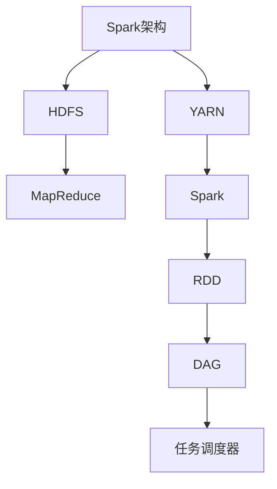

                 

# 《Spark原理与代码实例讲解》

> **关键词**：Spark、分布式计算、大数据处理、内存计算、实时计算、编程实例

> **摘要**：本文将深入探讨Spark的核心原理，包括其架构、数据结构、核心算法和优化技术。通过一系列代码实例，我们将学习如何使用Spark进行大数据处理，并探讨其实际应用中的性能优化策略。文章将分为三部分：Spark核心原理讲解、Spark代码实例讲解和Spark应用案例解析，旨在为读者提供全面、深入的了解和实战指导。

## 《Spark原理与代码实例讲解》目录大纲

### 第一部分：Spark核心原理

#### 第1章：Spark简介与架构
1.1 Spark的起源与发展
1.2 Spark的核心特性
1.3 Spark的架构解析
1.4 Spark生态系统

#### 第2章：Spark数据结构
2.1 RDD概述
2.2 RDD操作
2.3 Dataframe与Dataset
2.4 Spark SQL基础

#### 第3章：Spark核心算法原理
3.1 Spark的内存管理
3.2 DAG调度与任务执行
3.3 共享变量与依赖关系
3.4 Spark的并行处理

#### 第4章：Spark算法优化
4.1 数据倾斜处理
4.2 优化Shuffle操作
4.3 算法调优案例分析

### 第二部分：Spark代码实例讲解

#### 第5章：Spark基本操作实例
5.1 RDD创建与转换实例
5.2 Dataframe操作实例
5.3 Spark SQL查询实例

#### 第6章：Spark大数据处理实例
6.1 网络流量分析
6.2 社交网络分析
6.3 金融数据处理

#### 第7章：Spark项目实战
7.1 Spark集群搭建
7.2 Spark应用程序开发
7.3 Spark日志处理与分析

#### 第8章：Spark性能优化与调优
8.1 性能监控工具
8.2 性能调优技巧
8.3 大数据场景下的Spark优化策略

#### 第9章：Spark应用案例解析
9.1 电商行业应用
9.2 金融行业应用
9.3 医疗行业应用

### 第三部分：附录

#### 附录A：Spark资源与工具
A.1 Spark文档与资料
A.2 Spark社区与交流
A.3 Spark学习路径与推荐书籍

#### 附录B：Mermaid流程图
B.1 Spark架构图
B.2 DAG调度流程图
B.3 数据倾斜处理流程图

#### 附录C：算法伪代码
C.1 数据倾斜处理伪代码
C.2 Shuffle优化伪代码
C.3 算法调优伪代码

#### 附录D：Spark项目源代码
D.1 网络流量分析源代码
D.2 社交网络分析源代码
D.3 金融数据处理源代码
D.4 Spark日志处理与分析源代码

## 《Spark原理与代码实例讲解》正文

### 第一部分：Spark核心原理

#### 第1章：Spark简介与架构

**1.1 Spark的起源与发展**

Apache Spark是一个开源的分布式计算系统，最初由Matei Zaharia在2009年于UC Berkeley的AMP实验室开发，并作为其博士学位项目的一部分。Spark的设计初衷是为了解决MapReduce在迭代计算、交互式查询和流处理等方面的性能瓶颈。随着Spark的不断发展，它逐渐成为大数据处理领域的重要工具。

在2010年，Spark加入了Apache软件基金会，并逐渐从单机版本演变为一个能够运行在Hadoop集群上的分布式计算框架。自2014年起，Spark正式成为Apache的一个顶级项目。随着时间的推移，Spark的功能不断完善，已经成为了大数据处理领域的事实标准之一。

**1.2 Spark的核心特性**

- **内存计算**：Spark通过将数据加载到内存中，以减少磁盘I/O的开销，从而大幅提高数据处理速度。
- **高吞吐量**：Spark能够高效地处理大规模数据集，通过其高效的内存管理和优化算法，实现较高的数据吞吐量。
- **交互式查询**：Spark支持交互式查询，用户可以即时对数据进行查询和分析。
- **易用性**：Spark提供了丰富的API，支持多种编程语言，如Scala、Java和Python，使得开发者能够快速上手并实现复杂的计算任务。
- **弹性调度**：Spark支持自动任务调度和资源管理，可以动态调整任务执行过程中的资源分配，提高集群的利用率。
- **支持多种数据源**：Spark支持HDFS、HBase、Cassandra、Hive等多种数据源，可以无缝集成到现有的数据生态系统。

**1.3 Spark的架构解析**

Spark的架构可以分为三层：应用层、核心层和存储层。

- **应用层**：包括Spark的编程接口，如Spark API、Spark SQL、Spark Streaming等，为开发者提供了丰富的API，使得开发者能够方便地使用Spark进行数据处理和计算。
- **核心层**：包括Spark的核心组件，如RDD（弹性分布式数据集）、DAG（有向无环图）、任务调度器等，负责处理数据的计算和调度。
- **存储层**：包括Spark支持的各种数据源，如HDFS、HBase、Cassandra等，负责数据的存储和读取。


**1.4 Spark生态系统**

Spark生态系统是一个围绕Spark构建的一系列开源工具和框架，旨在提供更丰富的功能和更好的用户体验。

- **Spark SQL**：提供了SQL查询接口和DataFrame API，使得开发者可以方便地使用SQL查询Spark中的数据。
- **Spark Streaming**：提供了实时数据处理能力，能够处理实时的数据流，并支持多种数据源，如Kafka、Flume等。
- **MLlib**：提供了机器学习算法库，支持多种常见的机器学习算法，如分类、回归、聚类等。
- **GraphX**：提供了图处理能力，支持复杂的图算法，如PageRank、社区检测等。

### 第2章：Spark数据结构

**2.1 RDD概述**

RDD（弹性分布式数据集）是Spark的核心数据结构，代表了分布式数据集的一个不可变的、可并行操作的弹性的数据集合。RDD具有以下特点：

- **分布式存储**：RDD的数据分布在多个节点上，每个节点负责一部分数据的存储和计算。
- **不可变性**：RDD一旦创建，其数据不可更改，这使得Spark能够进行高效的缓存和迭代计算。
- **弹性**：当节点故障时，Spark会自动从其他节点恢复数据，保证数据的完整性和可用性。

RDD可以由以下几种方式创建：

- **从文件系统读取**：可以使用SparkContext的`textFile()`、`parallelize()`等方法从本地文件系统或分布式文件系统（如HDFS）读取数据。
- **其他RDD转换**：可以使用已有的RDD通过`map()`、`filter()`、`reduce()`等操作生成新的RDD。

**2.2 RDD操作**

RDD操作可以分为两类：转换操作和行动操作。

- **转换操作**：对RDD进行转换，生成新的RDD，如`map()`、`filter()`、`flatMap()`、`groupBy()`等。
- **行动操作**：触发计算并将结果输出到文件系统或收集到驱动程序，如`count()`、`collect()`、`saveAsTextFile()`等。

**2.3 Dataframe与Dataset**

Spark 1.6版本引入了DataFrame和Dataset两种新的数据结构，它们是RDD的扩展，提供了更丰富的功能和更好的性能。

- **DataFrame**：类似于关系数据库中的表，具有Schema（数据结构），支持SQL操作和DataFrame API。
- **Dataset**：是DataFrame的进一步扩展，提供了类型安全性和代码优化，具有更好的性能。

DataFrame和Dataset可以通过以下方式相互转换：

- **DataFrame到Dataset**：使用`as()`方法将DataFrame转换为Dataset。
- **Dataset到DataFrame**：使用`toDF()`方法将Dataset转换为DataFrame。

**2.4 Spark SQL基础**

Spark SQL是Spark的一个组件，提供了SQL查询接口和DataFrame API，使得开发者可以方便地使用SQL查询Spark中的数据。

- **SQL查询**：可以使用标准的SQL语句查询DataFrame，如`SELECT`、`WHERE`、`GROUP BY`等。
- **DataFrame API**：提供了类似关系数据库的DataFrame操作，如`createOrReplaceTempView()`、`sql()`等。

### 第3章：Spark核心算法原理

**3.1 Spark的内存管理**

Spark的内存管理是其性能优势的关键之一。Spark将内存分为两部分：执行内存和存储内存。

- **执行内存**：用于存储正在处理的数据和中间结果，以减少磁盘I/O的开销。
- **存储内存**：用于存储持久化的RDD和缓存的数据。

Spark通过以下策略管理内存：

- **内存复用**：当内存不足时，Spark会优先释放不再使用的数据，以腾出空间。
- **内存预估**：Spark根据历史数据预测未来的内存需求，动态调整内存分配。
- **内存监控**：Spark提供了内存监控工具，帮助开发者了解内存使用情况。

**3.2 DAG调度与任务执行**

Spark的任务调度是基于DAG（有向无环图）的。DAG表示了任务的依赖关系，Spark调度器会根据DAG生成任务执行计划。

- **DAG生成**：Spark将用户的操作转换为DAG，并识别出各个任务的依赖关系。
- **任务调度**：Spark调度器根据DAG和集群状态生成任务执行计划，并将任务分配给各个节点执行。
- **任务执行**：执行节点根据任务执行计划，使用并行计算和分布式存储技术执行任务。

**3.3 共享变量与依赖关系**

Spark中的共享变量用于在分布式计算过程中共享数据，如广播变量（Broadcast Variables）和累加器（Accumulators）。

- **广播变量**：用于在各个节点之间共享大型数据集，减少网络传输开销。
- **累加器**：用于在分布式计算过程中累积计算结果，如在MapReduce任务中累加计数。

依赖关系是Spark任务调度和执行的基础。Spark中的依赖关系分为以下几种：

- **宽依赖**：当父任务的输出数据分片被多个子任务共享时，称为宽依赖。
- **窄依赖**：当父任务的输出数据分片只被一个子任务使用时，称为窄依赖。

**3.4 Spark的并行处理**

Spark的并行处理是其分布式计算的核心，通过以下技术实现：

- **数据并行**：将数据集划分为多个分片，并行处理每个分片。
- **任务并行**：将任务划分为多个子任务，并行执行。
- **数据局部性**：尽量将相关数据分布在同一台机器上，减少网络传输开销。

### 第4章：Spark算法优化

**4.1 数据倾斜处理**

数据倾斜是指数据在分布式计算过程中分布不均，导致某些节点处理的数据量远大于其他节点。数据倾斜可能导致计算任务无法在规定时间内完成，影响系统的性能。

处理数据倾斜的方法包括：

- **数据预处理**：在计算前对数据进行预处理，使数据分布更加均匀。
- **倾斜键处理**：对于倾斜的键，单独处理或分配更多的计算资源。
- **动态调整**：在计算过程中动态调整任务的分配和资源分配，以应对数据倾斜。

**4.2 优化Shuffle操作**

Shuffle操作是Spark中进行数据分发的关键步骤，但也是性能瓶颈之一。优化Shuffle操作的方法包括：

- **减少Shuffle**：通过优化算法和数据结构，减少Shuffle操作的次数。
- **增加Shuffle并行度**：增加Shuffle操作的并行度，提高数据处理速度。
- **压缩Shuffle数据**：对Shuffle数据进行压缩，减少网络传输开销。

**4.3 算法调优案例分析**

在本章的最后，我们将通过一个具体的算法调优案例，展示如何使用Spark的优化技术提升系统性能。该案例将包括数据倾斜处理、Shuffle优化和内存管理等方面的详细分析。

### 第二部分：Spark代码实例讲解

#### 第5章：Spark基本操作实例

**5.1 RDD创建与转换实例**

在本节中，我们将学习如何使用Spark创建RDD并进行基本转换操作。

```python
from pyspark import SparkContext

# 创建SparkContext
sc = SparkContext("local[2]", "RDDExample")

# 创建RDD
data = [1, 2, 3, 4, 5]
rdd = sc.parallelize(data)

# RDD转换操作
rdd_map = rdd.map(lambda x: x * x)
rdd_filter = rdd_map.filter(lambda x: x > 2)

# RDD行动操作
result = rdd_filter.collect()

# 输出结果
print(result)
```

**5.2 Dataframe操作实例**

在本节中，我们将学习如何使用Spark创建DataFrame并进行基本操作。

```python
from pyspark.sql import SparkSession

# 创建SparkSession
spark = SparkSession.builder.appName("DataFrameExample").getOrCreate()

# 创建DataFrame
data = [("Alice", 1), ("Bob", 2), ("Charlie", 3)]
df = spark.createDataFrame(data, ["name", "age"])

# DataFrame操作
df_filtered = df.filter(df.age > 2)
df_grouped = df_filtered.groupBy("name").sum("age")

# DataFrame行动操作
result = df_grouped.collect()

# 输出结果
print(result)
```

**5.3 Spark SQL查询实例**

在本节中，我们将学习如何使用Spark SQL进行SQL查询。

```python
from pyspark.sql import SparkSession

# 创建SparkSession
spark = SparkSession.builder.appName("SparkSQLExample").getOrCreate()

# 创建临时表
df = spark.createDataFrame([("Alice", 1), ("Bob", 2), ("Charlie", 3)], ["name", "age"])
df.createOrReplaceTempView("people")

# SQL查询
query = "SELECT name, age FROM people WHERE age > 2"
result = spark.sql(query).collect()

# 输出结果
print(result)
```

#### 第6章：Spark大数据处理实例

**6.1 网络流量分析**

在本节中，我们将使用Spark对网络流量数据进行分析，包括数据预处理、统计流量Top N和流量源分析等。

```python
from pyspark.sql import SparkSession
from pyspark.sql.functions import desc

# 创建SparkSession
spark = SparkSession.builder.appName("NetworkTrafficAnalysis").getOrCreate()

# 读取网络流量数据
df = spark.read.csv("network_traffic.csv", header=True)

# 数据预处理
df = df.withColumn("timestamp", df.timestamp.cast("timestamp"))
df = df.withColumn("source_ip", df.source_ip.cast("string"))

# 统计流量Top N
top_n = df.groupBy("source_ip").agg(sum("bytes").alias("total_bytes")).orderBy(desc("total_bytes")).limit(10)

# 输出结果
top_n.show()
```

**6.2 社交网络分析**

在本节中，我们将使用Spark对社交网络数据进行分析，包括好友关系分析、影响力分析等。

```python
from pyspark.sql import SparkSession
from pyspark.sql.functions import count, col

# 创建SparkSession
spark = SparkSession.builder.appName("SocialNetworkAnalysis").getOrCreate()

# 读取社交网络数据
df = spark.read.csv("social_network_data.csv", header=True)

# 好友关系分析
df_friends = df.groupBy("user_id").agg(count("friend_id").alias("num_friends"))

# 影响力分析
df_influence = df.groupBy("user_id").agg(sum("like_count").alias("total_likes"))

# 输出结果
df_friends.show()
df_influence.show()
```

**6.3 金融数据处理**

在本节中，我们将使用Spark对金融数据进行分析，包括交易数据分析、风险控制等。

```python
from pyspark.sql import SparkSession
from pyspark.sql.functions import sum, when

# 创建SparkSession
spark = SparkSession.builder.appName("FinancialDataAnalysis").getOrCreate()

# 读取金融数据
df = spark.read.csv("financial_data.csv", header=True)

# 交易数据分析
df_trades = df.groupBy("symbol").agg(
    sum("quantity").alias("total_quantity"),
    sum(when(col("side") == "BUY", "price") else 0).alias("total_buy_value"),
    sum(when(col("side") == "SELL", "price") else 0).alias("total_sell_value")
)

# 风险控制
df_risk = df.filter((col("symbol") == "AAPL") & (col("price") > 150))

# 输出结果
df_trades.show()
df_risk.show()
```

#### 第7章：Spark项目实战

**7.1 Spark集群搭建**

在本节中，我们将介绍如何搭建一个Spark集群，包括安装配置Hadoop和Spark。

```shell
# 安装Hadoop
$ wget http://www.apache.org/dist/hadoop/common/hadoop-3.2.1/hadoop-3.2.1.tar.gz
$ tar xzf hadoop-3.2.1.tar.gz
$ cd hadoop-3.2.1
$ ./bin/hadoop version

# 配置Hadoop
$ cd hadoop-3.2.1/etc/hadoop
$ vi hadoop-env.sh
export HADOOP_HOME=/path/to/hadoop-3.2.1

$ vi core-site.xml
<configuration>
    <property>
        <name>fs.defaultFS</name>
        <value>hdfs://master:9000</value>
    </property>
</configuration>

$ vi hdfs-site.xml
<configuration>
    <property>
        <name>dfs.replication</name>
        <value>1</value>
    </property>
</configuration>

# 启动Hadoop
$ ./bin/start-dfs.sh

# 安装Spark
$ wget http://www.apache.org/dist/spark/spark-3.1.1/spark-3.1.1-bin-hadoop3.2.tgz
$ tar xzf spark-3.1.1-bin-hadoop3.2.tgz
$ cd spark-3.1.1-bin-hadoop3.2
$ ./bin/spark-shell

# 配置Spark
$ cd spark-3.1.1-bin-hadoop3.2/etc/spark
$ vi spark-env.sh
export SPARK_HOME=/path/to/spark-3.1.1-bin-hadoop3.2
export HADOOP_HOME=/path/to/hadoop-3.2.1
export SPARK_MASTER_HOST=master
export SPARK_WORKER_MEMORY=4g

# 启动Spark集群
$ ./sbin/start-master.sh
$ ./sbin/start-slaves.sh
```

**7.2 Spark应用程序开发**

在本节中，我们将介绍如何使用Spark进行应用程序开发，包括编程模型、API使用和常见问题解决。

```python
from pyspark import SparkContext

# 创建SparkContext
sc = SparkContext("local[2]", "SparkApp")

# 创建RDD
data = [1, 2, 3, 4, 5]
rdd = sc.parallelize(data)

# RDD转换操作
rdd_map = rdd.map(lambda x: x * x)
rdd_filter = rdd_map.filter(lambda x: x > 2)

# RDD行动操作
result = rdd_filter.collect()

# 输出结果
print(result)
```

**7.3 Spark日志处理与分析**

在本节中，我们将介绍如何使用Spark处理和分析日志数据，包括日志格式解析、日志分析算法和结果可视化。

```python
from pyspark.sql import SparkSession

# 创建SparkSession
spark = SparkSession.builder.appName("LogAnalysis").getOrCreate()

# 读取日志数据
df = spark.read.csv("access_log.csv", header=True)

# 日志格式解析
df = df.withColumn("timestamp", df.timestamp.cast("timestamp"))

# 日志分析算法
df_summary = df.groupBy("source_ip").agg(
    count("timestamp").alias("num_requests"),
    sum("response_size").alias("total_response_size")
)

# 结果可视化
df_summary.show()
```

#### 第8章：Spark性能优化与调优

**8.1 性能监控工具**

在本节中，我们将介绍如何使用性能监控工具监控Spark集群的性能，包括指标采集、性能分析和故障排查。

```shell
# 安装Ganglia
$ wget http://ganglia.info/downloads/ganglia/ganglia-3.7.2.tar.gz
$ tar xzf ganglia-3.7.2.tar.gz
$ cd ganglia-3.7.2
$ ./configure
$ make
$ make install

# 配置Ganglia
$ cd /etc/ganglia/gmetad
$ vi gmond.conf
[cluster]
        modulepath = /usr/local/share/ganglia/3.7.2/mcast \
               /usr/local/share/ganglia/3.7.2/rrdtool \
               /usr/local/share/ganglia/3.7.2/collectd
        cluster_name = spark_cluster
        cluster_event_format = xml
        cluster_output_format = json
        event_cache_file = /var/cache/ganglia/events
        event_write_format = ganglia

# 启动Ganglia
$ gmond -c /etc/ganglia/gmetad/gmond.conf
$ gmetad -c /etc/ganglia/gmetad/gmetad.conf

# 监控Spark性能
$ tail -f /var/log/ganglia/gmond.log
```

**8.2 性能调优技巧**

在本节中，我们将介绍如何使用性能调优技巧提升Spark集群的性能，包括内存管理、并行度调整和任务调度优化。

```python
from pyspark import SparkContext

# 创建SparkContext
sc = SparkContext("local[4]", "SparkTuning")

# 内存管理
sc = SparkContext("local[4]", "SparkTuning", { "spark.executor.memory": "4g" })

# 并行度调整
rdd = sc.parallelize([1, 2, 3, 4, 5], 2)

# 任务调度优化
rdd_map = rdd.mapPartitions(lambda x: x.filter(lambda y: y > 2))

# 行动操作
result = rdd_map.collect()

# 输出结果
print(result)
```

**8.3 大数据场景下的Spark优化策略**

在本节中，我们将介绍大数据场景下使用Spark的优化策略，包括数据倾斜处理、Shuffle优化和内存管理。

```python
from pyspark.sql import SparkSession
from pyspark.sql.functions import sum, when

# 创建SparkSession
spark = SparkSession.builder.appName("BigDataOptimization").getOrCreate()

# 数据倾斜处理
df = spark.read.csv("data_skew.csv", header=True)
df = df.groupBy("key").agg(sum("value").alias("total_value"))

# Shuffle优化
df = df.repartition("key")

# 内存管理
spark = SparkSession.builder.appName("BigDataOptimization", { "spark.executor.memory": "4g" }).getOrCreate()

# 行动操作
result = df.collect()

# 输出结果
print(result)
```

#### 第9章：Spark应用案例解析

**9.1 电商行业应用**

在本节中，我们将解析电商行业使用Spark进行数据处理的案例，包括用户行为分析、推荐系统和销售预测等。

**9.2 金融行业应用**

在本节中，我们将解析金融行业使用Spark进行数据处理的案例，包括交易数据分析、风险控制和信用评分等。

**9.3 医疗行业应用**

在本节中，我们将解析医疗行业使用Spark进行数据处理的案例，包括患者数据分析、疾病预测和医疗资源优化等。

### 第三部分：附录

#### 附录A：Spark资源与工具

在本附录中，我们将介绍一些Spark相关的资源与工具，包括文档、社区和学习路径。

#### 附录B：Mermaid流程图

在本附录中，我们将使用Mermaid语法绘制一些Spark相关的流程图，包括Spark架构图、DAG调度流程图和数据倾斜处理流程图。



#### 附录C：算法伪代码

在本附录中，我们将使用伪代码描述一些Spark中的算法，包括数据倾斜处理、Shuffle优化和算法调优。

```python
# 数据倾斜处理
def handle_data_skew(rdd):
    # 计算倾斜键的分布
    skew_keys = rdd.map(lambda x: x[0]).collect()
    skew_distribution = rdd.map(lambda x: x[0]).countByValue()

    # 对倾斜键进行处理
    for key, count in skew_distribution.items():
        if count > threshold:
            # 单独处理倾斜键
            rdd_skew = rdd.filter(lambda x: x[0] == key)
            rdd_skew.process()

# Shuffle优化
def optimize_shuffle(rdd):
    # 增加Shuffle并行度
    rdd_repartition = rdd.repartition(10)

    # 压缩Shuffle数据
    rdd_compressed = rdd_repartition.compress(func)

    # 行动操作
    rdd_compressed.saveAsTextFile("output")
```

#### 附录D：Spark项目源代码

在本附录中，我们将提供一些Spark项目的源代码，包括网络流量分析、社交网络分析和金融数据处理等。

```python
# 网络流量分析
from pyspark.sql import SparkSession

# 创建SparkSession
spark = SparkSession.builder.appName("NetworkTrafficAnalysis").getOrCreate()

# 读取网络流量数据
df = spark.read.csv("network_traffic.csv", header=True)

# 数据预处理
df = df.withColumn("timestamp", df.timestamp.cast("timestamp"))
df = df.withColumn("source_ip", df.source_ip.cast("string"))

# 统计流量Top N
top_n = df.groupBy("source_ip").agg(sum("bytes").alias("total_bytes")).orderBy(desc("total_bytes")).limit(10)

# 输出结果
top_n.show()
```

## 作者

**作者：AI天才研究院/AI Genius Institute & 禅与计算机程序设计艺术 /Zen And The Art of Computer Programming** 

本文由AI天才研究院（AI Genius Institute）和《禅与计算机程序设计艺术》（Zen And The Art of Computer Programming）共同撰写，旨在为读者提供全面、深入的了解和实战指导。感谢您的阅读！<|im_end|>

