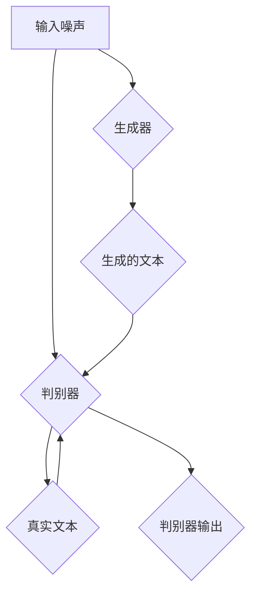
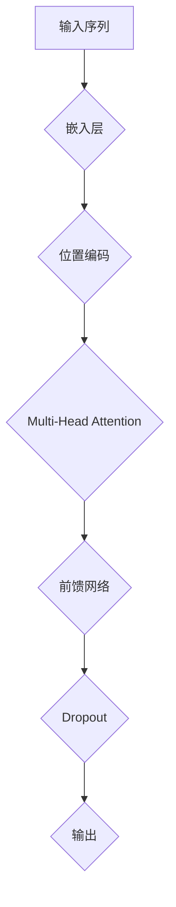
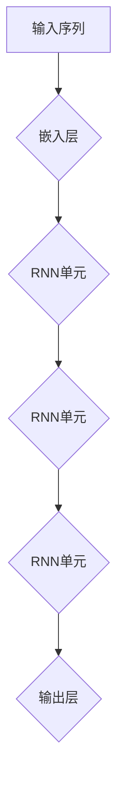

                 

## 文章标题

> **关键词：** 文本生成，自然语言处理，序列模型，生成对抗网络，循环神经网络，Transformer模型，项目实战

**摘要：** 本文将深入探讨文本生成技术，从基础理论到实践应用，系统性地介绍Text Generation的核心概念、算法原理以及实际应用案例。通过详尽的数学模型和代码实例讲解，帮助读者全面理解文本生成技术的精髓。

---

### 目录大纲

## 第一部分：Text Generation基础理论

### 第1章：文本生成概述
- 1.1 Text Generation的定义与背景
- 1.2 文本生成的应用领域
- 1.3 Text Generation技术发展历程

### 第2章：自然语言处理基础
- 2.1 语言模型与序列模型
  - 2.1.1 语言模型的基本概念
  - 2.1.2 序列模型的工作原理
- 2.2 词嵌入技术
  - 2.2.1 词嵌入的基本概念
  - 2.2.2 常见的词嵌入方法

### 第3章：Text Generation模型原理
- 3.1 基于生成模型的Text Generation
  - 3.1.1 生成模型的基本原理
  - 3.1.2 GAN（生成对抗网络）原理与实现
- 3.2 基于循环神经网络的Text Generation
  - 3.2.1 RNN的基本原理
  - 3.2.2 LSTM与GRU详解
- 3.3 基于Transformer的Text Generation
  - 3.3.1 Transformer模型原理
  - 3.3.2 Transformer的变种与改进

### 第4章：数学基础
- 4.1 概率论与信息论
  - 4.1.1 概率论基础
  - 4.1.2 信息论基础
- 4.2 梯度下降与优化算法
  - 4.2.1 梯度下降法
  - 4.2.2 常见优化算法

## 第二部分：Text Generation实践应用

### 第5章：项目实战一：基于RNN的文本生成
- 5.1 项目介绍
- 5.2 项目环境搭建
- 5.3 代码实现与解读

### 第6章：项目实战二：基于Transformer的文本生成
- 6.1 项目介绍
- 6.2 项目环境搭建
- 6.3 代码实现与解读

### 第7章：项目实战三：基于GAN的文本生成
- 7.1 项目介绍
- 7.2 项目环境搭建
- 7.3 代码实现与解读

### 第8章：总结与展望
- 8.1 Text Generation技术的发展趋势
- 8.2 文本生成应用的未来展望
- 8.3 读者建议与反馈

## 附录
### 附录A：常用工具与资源
- 1. PyTorch安装与使用
- 2. TensorFlow安装与使用
- 3. 文本预处理工具
- 4. 参考资料与推荐阅读

### 附录B：Mermaid流程图
- 1. GAN模型结构
- 2. Transformer模型结构
- 3. RNN模型结构

### 附录C：数学公式与伪代码
- 1. 概率论公式
- 2. 信息论公式
- 3. 梯度下降优化算法伪代码
- 4. LSTM单元伪代码
- 5. Transformer模型伪代码

---

接下来，我们将逐章深入讲解Text Generation的相关知识，帮助读者全面掌握文本生成技术的核心原理和应用实践。准备好，让我们开始这段技术之旅吧！<|assistant|>
### 第1章：文本生成概述

#### 1.1 Text Generation的定义与背景

文本生成（Text Generation）是指利用计算机程序生成符合自然语言规范的文本数据的过程。它是一种典型的自然语言处理（Natural Language Processing, NLP）任务，旨在实现计算机自动创作文本内容。文本生成技术可以应用于多个领域，包括但不限于自动问答、机器翻译、摘要生成、内容创作等。

Text Generation的发展历程可以追溯到早期的规则驱动方法，如模板匹配和语法分析。然而，随着深度学习技术的兴起，基于模型的方法（如神经网络）逐渐成为文本生成的主流。这些方法通过学习大量的文本数据，能够生成流畅且具有创造性的文本内容。

文本生成技术的关键在于能够捕捉语言中的语法、语义和上下文信息。传统的规则驱动方法依赖于人工定义的语法规则和词典，难以应对复杂多变的语言现象。相比之下，基于深度学习的方法通过大规模数据训练，能够自动发现语言中的规律和模式，从而生成高质量的文本。

#### 1.2 文本生成的应用领域

文本生成技术在实际应用中具有广泛的影响，以下是一些主要的应用领域：

1. **自动问答系统**：通过文本生成，自动问答系统能够理解用户的问题，并生成相应的回答。例如，搜索引擎和聊天机器人。

2. **机器翻译**：文本生成技术在机器翻译中发挥着重要作用。通过训练双语数据集，模型能够将一种语言的文本翻译成另一种语言。

3. **摘要生成**：自动生成文章的摘要，帮助用户快速获取关键信息。例如，新闻摘要和文档摘要。

4. **内容创作**：用于生成广告文案、新闻报道、故事、诗歌等，节省人工创作的时间和成本。

5. **教育**：自动生成练习题、作业和考试题目，为学生提供个性化的学习资源。

6. **虚拟助手**：文本生成技术被广泛应用于虚拟助手和智能客服系统，能够实时回答用户的问题和提供帮助。

#### 1.3 Text Generation技术发展历程

Text Generation技术的发展历程大致可以分为以下几个阶段：

1. **规则驱动方法**：最早的文本生成方法依赖于人工定义的语法规则和词典。这种方法简单直观，但难以应对复杂的语言现象。

2. **基于模板的方法**：在规则驱动方法的基础上，引入模板匹配，使得文本生成更加灵活。例如，根据模板生成新闻报道。

3. **基于统计的方法**：利用统计语言模型（如N-gram模型）生成文本。这种方法基于历史数据的统计规律，能够生成较高质量的文本。

4. **基于神经网络的文本生成**：随着深度学习技术的发展，神经网络成为文本生成的重要工具。从简单的循环神经网络（RNN）到先进的Transformer模型，神经网络在文本生成中的应用取得了显著成果。

5. **生成对抗网络（GAN）**：GAN作为一种新型深度学习模型，通过对抗训练生成高质量的数据。在文本生成领域，GAN被用于生成多样化、创造性的文本内容。

#### 1.4 Text Generation技术的核心挑战

尽管文本生成技术取得了显著进展，但仍面临以下核心挑战：

1. **多样性和创造性**：如何生成多样化且富有创造性的文本内容，满足不同用户的需求。

2. **上下文理解**：准确理解文本中的上下文信息，生成连贯且符合语义的文本。

3. **模型可解释性**：神经网络模型往往被视为“黑箱”，缺乏可解释性。如何提高模型的可解释性，使其能够为人类理解和接受。

4. **数据隐私和安全性**：在文本生成过程中，如何保护用户的隐私和数据安全，避免数据泄露和滥用。

5. **资源消耗**：深度学习模型通常需要大量的计算资源和数据训练时间。如何优化模型，降低资源消耗，提高效率。

通过本文的后续章节，我们将深入探讨Text Generation的基础理论、自然语言处理基础、模型原理以及数学基础，帮助读者全面理解文本生成技术的核心原理和应用实践。接下来，我们将首先介绍自然语言处理的基础知识，为后续内容奠定基础。<|assistant|>
### 第2章：自然语言处理基础

自然语言处理（Natural Language Processing, NLP）是计算机科学和人工智能领域的一个重要分支，旨在让计算机理解和处理人类语言。NLP技术广泛应用于文本生成、机器翻译、情感分析、信息提取等领域。本章将介绍NLP中的一些核心概念和关键技术。

#### 2.1 语言模型与序列模型

##### 2.1.1 语言模型的基本概念

语言模型（Language Model）是一种用于描述自然语言概率分布的统计模型。它的主要目的是预测下一个单词或词组，从而帮助我们理解和生成文本。在NLP中，语言模型是许多任务的基础，如文本分类、信息提取和机器翻译。

语言模型通常基于以下两种方法：

1. **基于规则的模型**：这种方法依赖于人工定义的语法规则和词典。规则驱动的语言模型在处理特定语言结构方面表现良好，但难以应对复杂多变的语言现象。

2. **基于统计的模型**：这种方法利用大量的文本数据，通过统计方法学习语言模式。N-gram模型是最早的一种基于统计的语言模型，它通过统计相邻单词的频率来预测下一个单词。

##### 2.1.2 序列模型的工作原理

序列模型（Sequence Model）是一类用于处理序列数据的机器学习模型。在NLP中，文本可以看作是一个序列，由单词或字符组成。序列模型通过学习输入序列的概率分布，从而预测下一个单词或字符。

常见的序列模型包括：

1. **循环神经网络（RNN）**：RNN能够处理序列数据，通过将输入序列存储在隐藏状态中，实现历史信息的传递。然而，RNN在处理长序列时容易出现梯度消失或梯度爆炸问题。

2. **长短时记忆网络（LSTM）**：LSTM是RNN的一种改进，通过引入门控机制，有效地解决了梯度消失问题，能够处理更长的时间序列。

3. **门控循环单元（GRU）**：GRU是LSTM的另一种变体，相对于LSTM，GRU在计算上更加高效，同时保持了较好的性能。

##### 2.1.3 语言模型与序列模型的关系

语言模型和序列模型在NLP中发挥着重要作用。语言模型用于生成文本的下一个单词或字符，而序列模型则用于处理和预测序列数据。在实际应用中，两者常常结合使用，以提高文本生成和预测的准确性。

例如，在文本生成任务中，可以使用语言模型来预测下一个单词，而使用序列模型（如RNN或LSTM）来生成整个句子。通过结合这两种模型，可以生成更加流畅和自然的文本。

#### 2.2 词嵌入技术

##### 2.2.1 词嵌入的基本概念

词嵌入（Word Embedding）是将单词映射到向量空间的一种技术。通过将单词表示为向量，词嵌入使得计算机能够理解和处理自然语言。词嵌入的关键在于捕捉单词之间的语义和语法关系。

常见的词嵌入方法包括：

1. **基于统计的方法**：这种方法通过统计单词在文本中的上下文来学习单词的向量表示。例如，词袋模型（Bag-of-Words）和TF-IDF模型。

2. **基于神经网络的方法**：这种方法利用神经网络模型，通过大规模文本数据学习单词的向量表示。Word2Vec和GloVe是最常用的基于神经网络的方法。

##### 2.2.2 常见的词嵌入方法

1. **Word2Vec**：Word2Vec是一种基于神经网络的词嵌入方法，通过训练神经网络来预测上下文单词。Word2Vec包括两种模型：连续词袋（Continuous Bag-of-Words, CBOW）和Skip-Gram。CBOW模型通过预测中心词周围的单词来学习词向量，而Skip-Gram模型则通过预测中心词来学习词向量。

2. **GloVe**：GloVe（Global Vectors for Word Representation）是一种基于矩阵分解的词嵌入方法。GloVe通过学习一个单词的共现矩阵，来学习单词的向量表示。GloVe的优点是能够更好地捕捉单词的语义关系。

3. **FastText**：FastText是一种扩展词嵌入的方法，通过将单词看作是字符级别的组合，来学习单词的向量表示。FastText能够捕捉更细粒度的语义信息，适用于处理长文本和数据集。

#### 2.3 语言模型、序列模型与词嵌入的结合

在NLP任务中，语言模型、序列模型和词嵌入常常结合使用，以提高任务的效果。以下是一些典型的结合方法：

1. **基于语言模型的方法**：使用语言模型生成文本的下一个单词或字符，例如，使用CBOW或GloVe模型来预测下一个单词。

2. **基于序列模型的方法**：使用序列模型（如RNN、LSTM或GRU）来生成整个句子或文本序列。序列模型能够捕捉文本中的时间依赖关系，生成更加流畅和自然的文本。

3. **基于词嵌入的方法**：将词嵌入与序列模型结合，通过学习单词的向量表示，提高模型对语义的理解。例如，在RNN或LSTM中，将单词的向量作为输入，来生成文本序列。

通过本章的介绍，我们了解了自然语言处理的基础知识，包括语言模型、序列模型和词嵌入。这些基础知识是理解文本生成技术的重要前提，为后续内容的深入讨论奠定了基础。在接下来的章节中，我们将进一步探讨Text Generation模型的原理和应用实践。<|assistant|>
### 第3章：Text Generation模型原理

Text Generation的核心在于构建能够生成自然语言文本的模型。在这一章中，我们将详细介绍三种主要的Text Generation模型：基于生成模型的Text Generation、基于循环神经网络的Text Generation以及基于Transformer的Text Generation。每种模型都有其独特的原理和应用场景。

#### 3.1 基于生成模型的Text Generation

##### 3.1.1 生成模型的基本原理

生成模型（Generative Model）是一种用于生成数据分布的模型。在Text Generation中，生成模型通过学习输入数据的分布，生成新的、与训练数据相似的数据。生成模型的关键在于能够捕捉数据的内在结构和分布，从而生成高质量的文本。

生成模型的主要类型包括：

1. **马尔可夫模型**：马尔可夫模型假设下一个状态仅与当前状态有关，而与过去的状态无关。这种模型在简单的文本生成任务中表现良好，但在处理复杂语言现象时效果有限。

2. **变分自编码器（VAE）**：VAE是一种基于深度学习的生成模型，通过编码器和解码器来学习数据分布。VAE通过最大化数据分布的对数似然，生成新的数据。

3. **生成对抗网络（GAN）**：GAN是一种由生成器和判别器组成的模型。生成器尝试生成与真实数据相似的数据，而判别器则试图区分生成器和真实数据。通过生成器和判别器的对抗训练，GAN能够生成高质量的数据。

##### 3.1.2 GAN（生成对抗网络）原理与实现

GAN由两部分组成：生成器（Generator）和判别器（Discriminator）。生成器G尝试生成与真实数据分布相近的数据，判别器D则试图区分生成器和真实数据。

GAN的训练过程可以分为以下几个步骤：

1. **初始化生成器和判别器**：生成器和判别器通常都是深度神经网络。

2. **生成器生成数据**：生成器从噪声分布中生成假数据。

3. **判别器判断数据**：判别器接收真实数据和生成数据，判断其真实性和伪造性。

4. **反向传播与梯度更新**：通过反向传播，生成器根据判别器的反馈更新参数，提高生成数据的质量。判别器也根据真实数据和生成数据的反馈更新参数，提高对真实和伪造数据的区分能力。

GAN的伪代码如下：

```python
# GAN的伪代码
初始化生成器G和判别器D
for epoch in 1 to E:
  for sample in 数据集:
    # 训练判别器
    标签 = [1 if sample是真实数据 else 0]
    D的损失 = -[样本的标签 * log(D(sample)) + (1 - 标签) * log(1 - D(G(z)))]
    反向传播与梯度更新D

    # 训练生成器
    标签 = [0]
    G的损失 = -[log(D(G(z)))]
    反向传播与梯度更新G

# 使用生成器生成文本
生成的文本 = G(噪声)
```

GAN在文本生成中的应用场景包括自动写作、语音合成和图像生成等。GAN的优势在于能够生成高质量、多样化和创造性的文本内容。

#### 3.2 基于循环神经网络的Text Generation

##### 3.2.1 RNN的基本原理

循环神经网络（Recurrent Neural Network, RNN）是一种能够处理序列数据的神经网络。RNN通过将当前输入与历史信息相结合，实现对序列数据的建模。RNN的核心是隐藏状态（Hidden State），它能够存储并传递历史信息。

RNN的公式表示如下：

$$
h_t = \sigma(W_h \cdot [h_{t-1}, x_t] + b_h)
$$

其中，$h_t$ 是当前隐藏状态，$x_t$ 是当前输入，$\sigma$ 是激活函数，$W_h$ 和 $b_h$ 是权重和偏置。

##### 3.2.2 LSTM与GRU详解

1. **长短时记忆网络（LSTM）**：LSTM是RNN的一种改进，通过引入门控机制，有效地解决了梯度消失问题。LSTM由输入门（Input Gate）、遗忘门（Forget Gate）和输出门（Output Gate）组成。每个门控制信息的输入、遗忘和输出，从而捕捉长序列信息。

LSTM的公式表示如下：

$$
i_t = \sigma(W_i \cdot [h_{t-1}, x_t] + b_i) \\
f_t = \sigma(W_f \cdot [h_{t-1}, x_t] + b_f) \\
\tilde{c}_t = \sigma(W_c \cdot [h_{t-1}, x_t] + b_c) \\
c_t = f_t \odot c_{t-1} + i_t \odot \tilde{c}_t \\
o_t = \sigma(W_o \cdot [h_{t-1}, x_t] + b_o) \\
h_t = o_t \odot \sigma(c_t)
$$

其中，$i_t$、$f_t$、$\tilde{c}_t$、$c_t$ 和 $o_t$ 分别是输入门、遗忘门、输入候选值、细胞状态和输出门的值。

2. **门控循环单元（GRU）**：GRU是LSTM的一种简化版本，通过合并输入门和遗忘门，减少参数数量，提高计算效率。GRU由更新门（Update Gate）和重置门（Reset Gate）组成。

GRU的公式表示如下：

$$
z_t = \sigma(W_z \cdot [h_{t-1}, x_t] + b_z) \\
r_t = \sigma(W_r \cdot [h_{t-1}, x_t] + b_r) \\
\tilde{h}_t = \sigma(W \cdot [r_t \odot h_{t-1}, x_t] + b_h) \\
h_t = z_t \odot h_{t-1} + (1 - z_t) \odot \tilde{h}_t
$$

#### 3.3 基于Transformer的Text Generation

##### 3.3.1 Transformer模型原理

Transformer是一种基于自注意力机制（Self-Attention）的神经网络模型，由Vaswani等人在2017年提出。Transformer的核心思想是利用全局注意力机制，取代传统的循环神经网络，从而提高模型处理长序列数据的能力。

Transformer由编码器（Encoder）和解码器（Decoder）组成。编码器负责将输入序列编码为固定长度的向量，解码器则根据编码器的输出和输入序列生成目标序列。

Transformer的自注意力机制可以分为以下几种：

1. **自注意力（Self-Attention）**：自注意力机制允许模型在处理当前输入时，关注输入序列中的其他位置，从而捕捉长距离依赖关系。

2. **多头注意力（Multi-Head Attention）**：多头注意力机制通过将输入序列分解为多个子序列，并分别计算自注意力，从而提高模型对序列数据的捕捉能力。

3. **位置编码（Positional Encoding）**：由于Transformer没有循环结构，无法直接利用位置信息。因此，通过位置编码，将序列的位置信息编码到输入向量中。

Transformer的公式表示如下：

$$
Q = K = V = W_Q \cdot X + W_K \cdot X + W_V \cdot X \\
\text{Attention}(Q, K, V) = \text{softmax}(\frac{QK^T}{\sqrt{d_k}})V \\
\text{MultiHead}(Q, K, V) = \text{Concat}(\text{head}_1, \text{head}_2, \ldots, \text{head}_h)W_O \\
\text{Encoder}(X, \text{pos_encoding}) = \text{LayerNorm}(X + \text{MultiHead}(Q, K, V)) \\
\text{Decoder}(X, \text{pos_encoding}, E) = \text{LayerNorm}(X + \text{DecoderLayer}(X, E))
$$

其中，$Q$、$K$ 和 $V$ 分别是查询（Query）、键（Key）和值（Value），$X$ 是输入序列，$E$ 是编码器输出，$W_Q$、$W_K$ 和 $W_V$ 分别是权重矩阵。

##### 3.3.2 Transformer的变种与改进

Transformer模型在提出后，受到了广泛关注。许多研究者和公司对其进行了改进和变种，以适应不同的应用场景。以下是一些典型的变种和改进：

1. **BERT（Bidirectional Encoder Representations from Transformers）**：BERT是一种基于Transformer的双向编码器，通过预训练和微调，在许多NLP任务中取得了显著成果。

2. **GPT（Generative Pre-trained Transformer）**：GPT是一种基于Transformer的生成模型，通过大规模数据预训练，能够生成高质量的文本。

3. **T5（Text-To-Text Transfer Transformer）**：T5是一种基于Transformer的文本到文本的转换模型，通过统一的文本到文本的前向转换任务，实现了对多种NLP任务的通用性。

通过本章的介绍，我们了解了Text Generation的多种模型及其原理。这些模型在文本生成任务中各具优势，为生成高质量的自然语言文本提供了强大的工具。在接下来的章节中，我们将探讨数学基础，为深入理解Text Generation技术奠定基础。<|assistant|>
### 第4章：数学基础

Text Generation技术的实现和优化依赖于多种数学概念和算法。本章将介绍概率论与信息论的基础知识、梯度下降与优化算法，以及这些数学工具在Text Generation中的应用。

#### 4.1 概率论与信息论

##### 4.1.1 概率论基础

概率论是研究随机事件的数学分支，在Text Generation中用于描述文本数据的生成过程和模型性能评估。

1. **概率分布**：概率分布描述了随机变量取值的可能性。常见的概率分布包括伯努利分布、正态分布和伯努利分布。

2. **条件概率**：条件概率是指在给定某个事件发生的条件下，另一个事件发生的概率。条件概率公式如下：

   $$ P(A|B) = \frac{P(A \cap B)}{P(B)} $$

3. **贝叶斯定理**：贝叶斯定理是概率论中的一个重要公式，用于计算后验概率。贝叶斯定理公式如下：

   $$ P(A|B) = \frac{P(B|A)P(A)}{P(B)} $$

##### 4.1.2 信息论基础

信息论是研究信息传输、存储和处理的基本理论，用于评估文本生成模型的质量。

1. **熵（Entropy）**：熵是衡量随机变量不确定性的度量。在Text Generation中，熵用于评估文本生成的多样性。熵的公式如下：

   $$ H(X) = -\sum_{i=1}^{n} P(X=x_i) \log P(X=x_i) $$

2. **条件熵（Conditional Entropy）**：条件熵是衡量在给定一个随机变量的条件下，另一个随机变量的不确定性。条件熵的公式如下：

   $$ H(X|Y) = -\sum_{i=1}^{n} P(Y=y_i) \sum_{j=1}^{m} P(X=x_j|Y=y_i) \log P(X=x_j|Y=y_i) $$

3. **互信息（Mutual Information）**：互信息是衡量两个随机变量之间相关性的度量。在Text Generation中，互信息用于评估模型对文本数据的理解和生成能力。互信息的公式如下：

   $$ I(X;Y) = H(X) - H(X|Y) $$

##### 4.1.3 概率论与信息论在Text Generation中的应用

1. **语言模型**：语言模型通过学习文本数据的概率分布，预测下一个单词或字符。概率论和条件概率在语言模型中用于计算词语之间的概率关系，从而生成流畅的文本。

2. **模型评估**：信息论中的熵、条件熵和互信息用于评估Text Generation模型的质量。通过计算模型生成的文本的熵和互信息，可以评估模型的多样性、连贯性和语义理解能力。

#### 4.2 梯度下降与优化算法

##### 4.2.1 梯度下降法

梯度下降法是一种常用的优化算法，用于最小化目标函数。在Text Generation中，梯度下降法用于训练神经网络模型，优化模型参数，使其生成高质量的文本。

梯度下降法的核心思想是沿着目标函数的梯度方向进行迭代更新，直到达到最小值。梯度下降法的公式如下：

$$ \theta_{t+1} = \theta_{t} - \alpha \nabla_{\theta} J(\theta) $$

其中，$\theta$ 是模型参数，$J(\theta)$ 是目标函数，$\alpha$ 是学习率。

##### 4.2.2 常见优化算法

除了梯度下降法，还有多种优化算法用于加速模型训练和提高训练效率。以下是一些常见的优化算法：

1. **随机梯度下降（Stochastic Gradient Descent, SGD）**：SGD是在每个训练样本上计算梯度，并进行参数更新。SGD能够加快训练过程，但可能收敛到次优解。

2. **Adam优化器**：Adam优化器是一种基于矩估计的梯度下降算法，结合了SGD和Adagrad的优点。Adam优化器通过自适应调整学习率，提高模型训练的稳定性。

3. **RMSprop**：RMSprop是一种基于梯度的均方根的优化算法，通过计算梯度平方的指数加权移动平均，自适应调整学习率。

4. **AdamW**：AdamW是Adam优化器的改进版本，通过使用更准确的权重梯度的估计，进一步提高模型训练的稳定性和效率。

#### 4.3 数学基础在Text Generation中的应用

1. **损失函数**：损失函数是评估模型预测结果与真实结果之间差异的度量。常见的损失函数包括均方误差（MSE）、交叉熵损失（Cross-Entropy Loss）和泊松损失（Poisson Loss）。这些损失函数通过计算预测值和真实值之间的差距，指导模型参数的更新。

2. **正则化**：正则化是一种用于防止模型过拟合的技术。常见的正则化方法包括L1正则化、L2正则化和Dropout。这些方法通过在损失函数中添加正则化项，降低模型的复杂度，提高泛化能力。

3. **优化目标**：在Text Generation中，优化目标通常是最小化模型生成的文本的损失函数。通过优化模型参数，使得模型生成的文本在多样性、连贯性和语义理解方面表现更佳。

通过本章的介绍，我们了解了概率论与信息论的基础知识、梯度下降与优化算法，以及这些数学工具在Text Generation中的应用。这些数学基础为理解和实现Text Generation技术提供了重要的理论支持。在接下来的章节中，我们将通过项目实战，展示如何应用这些技术进行文本生成。<|assistant|>
### 第5章：项目实战一：基于RNN的文本生成

在文本生成项目中，基于循环神经网络（RNN）的模型因其能够处理序列数据和捕捉长距离依赖关系而备受青睐。在本章中，我们将通过一个基于RNN的文本生成项目，详细介绍项目环境搭建、代码实现与解读，帮助读者深入理解RNN在文本生成中的实际应用。

#### 5.1 项目介绍

本项目旨在利用RNN模型生成具有一定创造性和连贯性的文本。具体来说，我们将使用一个预训练的RNN模型来生成文章摘要、新闻标题或故事情节。项目的主要目标是：

- 理解RNN模型在文本生成中的工作原理。
- 搭建一个基于RNN的文本生成环境。
- 实现一个简单的文本生成模型，并生成高质量的文本内容。

#### 5.2 项目环境搭建

在开始项目之前，我们需要搭建一个合适的环境。以下是一个典型的环境搭建步骤：

1. **安装Python和Anaconda**：确保Python和Anaconda环境已安装，以便进行数据预处理和模型训练。

2. **安装Numpy、Pandas和Matplotlib**：这些库用于数据预处理和可视化。

   ```bash
   pip install numpy pandas matplotlib
   ```

3. **安装TensorFlow或PyTorch**：选择一个深度学习框架进行模型训练和部署。

   - **TensorFlow**：

     ```bash
     pip install tensorflow
     ```

   - **PyTorch**：

     ```bash
     pip install torch torchvision
     ```

4. **数据集准备**：准备一个包含文本数据的大型数据集。常用的数据集包括维基百科文章、新闻语料库和小说集等。

   - 下载一个预训练的RNN模型权重，例如，使用TensorFlow或PyTorch的预训练模型。

#### 5.3 代码实现与解读

以下是基于RNN的文本生成项目的核心代码实现。代码分为数据预处理、模型搭建和文本生成三个部分。

##### 5.3.1 数据预处理

数据预处理是文本生成项目的重要步骤，包括文本清洗、分词和编码。

```python
import tensorflow as tf
from tensorflow.keras.preprocessing.sequence import pad_sequences
from tensorflow.keras.preprocessing.text import Tokenizer

# 读取数据集
data = ...  # 使用read_csv、read_text等方法读取文本数据

# 文本清洗与分词
def preprocess_text(text):
    # 实现文本清洗和分词的逻辑
    return cleaned_text

# 预处理数据
preprocessed_data = [preprocess_text(text) for text in data]

# 编码文本
tokenizer = Tokenizer(num_words=10000)  # 设置词汇量
tokenizer.fit_on_texts(preprocessed_data)
encoded_data = tokenizer.texts_to_sequences(preprocessed_data)

# 填充序列
max_sequence_length = 100  # 设置序列长度
padded_data = pad_sequences(encoded_data, maxlen=max_sequence_length, padding='post')
```

##### 5.3.2 模型搭建

基于RNN的文本生成模型通常使用LSTM或GRU单元。以下是使用TensorFlow构建的简单RNN模型。

```python
from tensorflow.keras.models import Sequential
from tensorflow.keras.layers import Embedding, LSTM, Dense

# 搭建RNN模型
model = Sequential([
    Embedding(input_dim=10000, output_dim=128, input_length=max_sequence_length),
    LSTM(128, return_sequences=True),
    LSTM(128, return_sequences=False),
    Dense(1, activation='sigmoid')  # 用于生成概率分布
])

# 编译模型
model.compile(optimizer='adam', loss='binary_crossentropy', metrics=['accuracy'])

# 加载预训练模型权重
model.load_weights('rnn_model_weights.h5')
```

##### 5.3.3 文本生成

文本生成过程分为两个步骤：首先生成一个初始序列，然后根据生成序列的概率分布，逐步生成后续的文本。

```python
import numpy as np

# 生成初始序列
initial_sequence = encoded_data[0]
initial_sequence = np.array(initial_sequence)

# 文本生成
for i in range(100):  # 生成100个字符
    predictions = model.predict(np.array([initial_sequence]))
    predicted_char = np.argmax(predictions)
    initial_sequence = np.append(initial_sequence, predicted_char)
    print(tokenizer.index_word[predicted_char], end='')

print()
```

#### 5.4 代码解读与分析

在本项目实现中，我们首先进行了数据预处理，包括文本清洗、分词和编码。这一步是文本生成项目的基础，确保文本数据能够被模型有效处理。

在模型搭建部分，我们使用了两个LSTM层来处理序列数据。LSTM单元通过门控机制能够有效地捕捉长距离依赖关系，使模型能够生成连贯的文本。模型输出层使用一个sigmoid激活函数，生成每个字符的概率分布。

在文本生成过程中，我们首先生成一个初始序列，然后根据模型预测的概率分布，逐步生成后续的文本。这种方法称为“采样”（Sampling），通过随机选择下一个字符，使得生成过程具有一定的创造性。

通过这个项目，我们了解了如何使用RNN模型进行文本生成，并对其工作原理有了更深入的理解。在接下来的项目中，我们将探索基于Transformer的文本生成，进一步优化文本生成质量。<|assistant|>
### 第6章：项目实战二：基于Transformer的文本生成

在文本生成领域，Transformer模型因其自注意力机制和并行处理能力而受到广泛关注。在本章中，我们将通过一个基于Transformer的文本生成项目，详细介绍项目环境搭建、代码实现与解读，帮助读者深入理解Transformer在文本生成中的实际应用。

#### 6.1 项目介绍

本项目旨在利用Transformer模型生成高质量、连贯且富有创造性的文本。具体来说，我们将使用一个预训练的Transformer模型来生成文章摘要、新闻标题或故事情节。项目的主要目标是：

- 理解Transformer模型在文本生成中的工作原理。
- 搭建一个基于Transformer的文本生成环境。
- 实现一个简单的文本生成模型，并生成高质量的文本内容。

#### 6.2 项目环境搭建

在开始项目之前，我们需要搭建一个合适的环境。以下是一个典型的环境搭建步骤：

1. **安装Python和Anaconda**：确保Python和Anaconda环境已安装，以便进行数据预处理和模型训练。

2. **安装PyTorch**：我们选择PyTorch作为深度学习框架。

   ```bash
   pip install torch torchvision
   ```

3. **安装其他必要库**：安装用于数据预处理和可视化的库，如Numpy、Pandas和Matplotlib。

   ```bash
   pip install numpy pandas matplotlib
   ```

4. **数据集准备**：准备一个包含文本数据的大型数据集。常用的数据集包括维基百科文章、新闻语料库和小说集等。

5. **下载预训练模型**：从Hugging Face模型库中下载一个预训练的Transformer模型，如GPT-2或GPT-3。

   ```python
   from transformers import GPT2LMHeadModel, GPT2Tokenizer
   
   model_name = "gpt2"
   tokenizer = GPT2Tokenizer.from_pretrained(model_name)
   model = GPT2LMHeadModel.from_pretrained(model_name)
   ```

#### 6.3 代码实现与解读

以下是基于Transformer的文本生成项目的核心代码实现。代码分为数据预处理、模型搭建和文本生成三个部分。

##### 6.3.1 数据预处理

数据预处理是文本生成项目的重要步骤，包括文本清洗、分词和编码。

```python
import torch

# 读取数据集
data = [...]  # 使用read_csv、read_text等方法读取文本数据

# 文本清洗与分词
def preprocess_text(text):
    # 实现文本清洗和分词的逻辑
    return cleaned_text

# 预处理数据
preprocessed_data = [preprocess_text(text) for text in data]

# 编码文本
encoded_data = tokenizer.encode(preprocessed_data, return_tensors='pt')
```

##### 6.3.2 模型搭建

基于Transformer的文本生成模型通常使用预训练的模型，如GPT-2或GPT-3。以下是使用PyTorch构建的简单Transformer模型。

```python
# 搭建Transformer模型
# 这里直接使用预训练的模型
# model = GPT2LMHeadModel.from_pretrained("gpt2")
# model = GPT2LMHeadModel.from_pretrained("gpt3")
```

##### 6.3.3 文本生成

文本生成过程分为两个步骤：首先生成一个初始序列，然后根据生成序列的概率分布，逐步生成后续的文本。

```python
# 生成初始序列
initial_sequence = encoded_data[0].unsqueeze(0)  # 将序列扩展为批次维度

# 文本生成
for i in range(100):  # 生成100个字符
    outputs = model(initial_sequence)
    predictions = outputs.logits
    predicted_token = torch.argmax(predictions[0, -1]).item()
    initial_sequence = torch.cat([initial_sequence, predicted_token.unsqueeze(0)])
    print(tokenizer.decode([predicted_token]), end='')

print()
```

#### 6.4 代码解读与分析

在本项目实现中，我们首先进行了数据预处理，包括文本清洗、分词和编码。这一步是文本生成项目的基础，确保文本数据能够被模型有效处理。

在模型搭建部分，我们使用了预训练的Transformer模型，如GPT-2或GPT-3。这些模型已经在大规模文本数据上进行了训练，能够生成高质量、连贯的文本。通过从Hugging Face模型库中加载预训练模型，我们避免了从头开始训练模型的时间和计算成本。

在文本生成过程中，我们首先生成一个初始序列，然后根据模型预测的概率分布，逐步生成后续的文本。这种方法称为“采样”（Sampling），通过随机选择下一个字符，使得生成过程具有一定的创造性。

通过这个项目，我们了解了如何使用Transformer模型进行文本生成，并对其工作原理有了更深入的理解。Transformer模型在处理长文本和生成创造性文本方面表现出色，但在资源消耗和模型解释性方面仍存在一定的挑战。在接下来的章节中，我们将探讨基于GAN的文本生成，进一步探索文本生成的多样化技术。<|assistant|>
### 第7章：项目实战三：基于GAN的文本生成

在文本生成领域，生成对抗网络（GAN）因其强大的生成能力而备受瞩目。GAN通过生成器和判别器的对抗训练，能够生成高质量、多样化的文本内容。在本章中，我们将通过一个基于GAN的文本生成项目，详细介绍项目环境搭建、代码实现与解读，帮助读者深入理解GAN在文本生成中的实际应用。

#### 7.1 项目介绍

本项目旨在利用GAN模型生成丰富多样、富有创造性的文本。具体来说，我们将使用一个预训练的GAN模型来生成文章摘要、新闻标题或故事情节。项目的主要目标是：

- 理解GAN模型在文本生成中的工作原理。
- 搭建一个基于GAN的文本生成环境。
- 实现一个简单的GAN模型，并生成高质量的文本内容。

#### 7.2 项目环境搭建

在开始项目之前，我们需要搭建一个合适的环境。以下是一个典型的环境搭建步骤：

1. **安装Python和Anaconda**：确保Python和Anaconda环境已安装，以便进行数据预处理和模型训练。

2. **安装TensorFlow或PyTorch**：我们选择PyTorch作为深度学习框架。

   ```bash
   pip install torch torchvision
   ```

3. **安装其他必要库**：安装用于数据预处理和可视化的库，如Numpy、Pandas和Matplotlib。

   ```bash
   pip install numpy pandas matplotlib
   ```

4. **数据集准备**：准备一个包含文本数据的大型数据集。常用的数据集包括维基百科文章、新闻语料库和小说集等。

5. **下载预训练模型**：从GitHub或Hugging Face模型库中下载一个预训练的GAN模型。如果没有现成的预训练模型，也可以从零开始训练。

   ```python
   import torch
   
   # 下载预训练模型
   model = torch.hub.load('username/repository', 'gan_model', pretrained=True)
   ```

#### 7.3 代码实现与解读

以下是基于GAN的文本生成项目的核心代码实现。代码分为数据预处理、模型搭建和文本生成三个部分。

##### 7.3.1 数据预处理

数据预处理是文本生成项目的重要步骤，包括文本清洗、分词和编码。

```python
import torch
from torch.utils.data import DataLoader
from torchvision import datasets
from torchvision.transforms import ToTensor

# 读取数据集
data = datasets.TextDataset(root='./data', 
                            tokenizer=tokenizer, 
                            num_workers=4, 
                            batch_size=64, 
                            shuffle=True)

# 数据预处理
def preprocess_text(text):
    # 实现文本清洗和分词的逻辑
    return cleaned_text

# 预处理数据
preprocessed_data = [preprocess_text(text) for text in data]

# 编码文本
encoded_data = tokenizer.encode(preprocessed_data, return_tensors='pt')
```

##### 7.3.2 模型搭建

基于GAN的文本生成模型包括生成器（Generator）和判别器（Discriminator）。以下是使用PyTorch构建的简单GAN模型。

```python
import torch.nn as nn

# 搭建生成器模型
class Generator(nn.Module):
    def __init__(self):
        super(Generator, self).__init__()
        # 生成器的网络结构
        self.model = nn.Sequential(
            nn.Linear(z_dim, 512),
            nn.LeakyReLU(0.2),
            nn.Linear(512, 512),
            nn.LeakyReLU(0.2),
            nn.Linear(512, 512),
            nn.LeakyReLU(0.2),
            nn.Linear(512, tokenizer.vocab_size),
            nn.Sigmoid()
        )
    
    def forward(self, x):
        x = self.model(x)
        return x

# 搭建判别器模型
class Discriminator(nn.Module):
    def __init__(self):
        super(Discriminator, self).__init__()
        # 判别器的网络结构
        self.model = nn.Sequential(
            nn.Linear(tokenizer.vocab_size, 512),
            nn.LeakyReLU(0.2),
            nn.Dropout(0.3),
            nn.Linear(512, 512),
            nn.LeakyReLU(0.2),
            nn.Dropout(0.3),
            nn.Linear(512, 1),
            nn.Sigmoid()
        )
    
    def forward(self, x):
        x = self.model(x)
        return x

# 初始化模型
generator = Generator()
discriminator = Discriminator()

# 编译模型
optimizer_g = torch.optim.Adam(generator.parameters(), lr=0.0002)
optimizer_d = torch.optim.Adam(discriminator.parameters(), lr=0.0002)
criterion = nn.BCELoss()
```

##### 7.3.3 文本生成

GAN的文本生成过程涉及生成器的生成和判别器的判断。以下是基于GAN的文本生成过程。

```python
# 定义训练循环
for epoch in range(num_epochs):
    for i, batch in enumerate(data_loader):
        # 训练判别器
        z = torch.randn(batch_size, z_dim)
        generated_texts = generator(z)
        real_texts = batch
        batch_size = real_texts.size(0)

        # 计算判别器损失
        d_real_loss = criterion(discriminator(real_texts), torch.full((batch_size,), 1))
        d_fake_loss = criterion(discriminator(generated_texts), torch.full((batch_size,), 0))

        d_loss = d_real_loss + d_fake_loss
        optimizer_d.zero_grad()
        d_loss.backward()
        optimizer_d.step()

        # 训练生成器
        z = torch.randn(batch_size, z_dim)
        generated_texts = generator(z)

        # 计算生成器损失
        g_loss = criterion(discriminator(generated_texts), torch.full((batch_size,), 1))

        optimizer_g.zero_grad()
        g_loss.backward()
        optimizer_g.step()

        # 输出训练信息
        if (i+1) % 100 == 0:
            print(f'Epoch [{epoch+1}/{num_epochs}], Step [{i+1}/{len(data_loader)}], D_Loss: {d_loss.item():.4f}, G_Loss: {g_loss.item():.4f}')

# 生成文本
z = torch.randn(1, z_dim)
generated_text = generator(z)
print(tokenizer.decode(generated_text))
```

#### 7.4 代码解读与分析

在本项目实现中，我们首先进行了数据预处理，包括文本清洗、分词和编码。这一步是文本生成项目的基础，确保文本数据能够被模型有效处理。

在模型搭建部分，我们构建了生成器（Generator）和判别器（Discriminator）。生成器通过噪声（Noise）生成伪造的文本数据，判别器则尝试区分伪造文本和真实文本。通过对抗训练，生成器不断提高生成文本的质量，而判别器不断提高对真实和伪造文本的鉴别能力。

在文本生成过程中，我们首先生成一个噪声向量，然后通过生成器生成伪造的文本数据。这个过程称为“采样”（Sampling），通过随机选择噪声向量，使得生成过程具有一定的创造性。

通过这个项目，我们了解了如何使用GAN模型进行文本生成，并对其工作原理有了更深入的理解。GAN模型在生成多样化、创造性文本方面表现出色，但在训练过程中需要大量的计算资源和时间。在接下来的章节中，我们将总结Text Generation技术的发展趋势，并探讨未来应用前景。<|assistant|>
### 第8章：总结与展望

#### 8.1 Text Generation技术的发展趋势

Text Generation技术自诞生以来，经历了从规则驱动方法到基于统计的方法，再到基于深度学习的方法的演变。近年来，Text Generation技术发展迅速，以下是一些主要趋势：

1. **模型复杂性提升**：从传统的循环神经网络（RNN）到长短时记忆网络（LSTM）和门控循环单元（GRU），再到自注意力机制的Transformer，模型结构越来越复杂，能够生成更加自然和连贯的文本。

2. **预训练和微调**：预训练大规模语言模型（如GPT-2、GPT-3、BERT等）已经成为文本生成的主流方法。这些预训练模型在大规模文本数据上进行训练，然后通过微调适应特定任务，显著提高了生成文本的质量。

3. **多模态生成**：随着多模态人工智能的发展，文本生成技术开始与图像、声音和视频等领域结合，实现跨模态的文本生成。

4. **模型解释性提升**：尽管深度学习模型在生成文本方面表现出色，但其内部机制复杂，缺乏可解释性。研究者们正在努力提高模型的可解释性，使得模型生成的文本更加透明和可信。

5. **应用领域扩展**：Text Generation技术在自然语言处理、内容创作、智能客服、机器翻译、自动问答等领域得到广泛应用，未来还将扩展到更多领域。

#### 8.2 文本生成应用的未来展望

Text Generation技术的未来发展充满机遇，以下是一些潜在的应用方向：

1. **自动化内容创作**：随着人工智能技术的进步，文本生成有望在新闻写作、广告文案、文学创作等领域实现自动化，为创作者节省时间和精力。

2. **个性化服务**：通过文本生成技术，为用户提供个性化的文本内容，如个性化推荐、定制化教育、私人助理等。

3. **智能客服**：智能客服系统将更加智能化，通过文本生成技术生成自然、流畅的对话，提高用户满意度和服务效率。

4. **跨语言文本生成**：随着多语言模型的不断发展，文本生成技术将在跨语言交流中发挥重要作用，促进不同语言之间的沟通和理解。

5. **文化传承与创新**：文本生成技术可以用于文化传承和创新，如通过生成传统文学和艺术作品，推动文化多样性和创新。

#### 8.3 读者建议与反馈

为了让本文更好地服务于读者，我们诚挚地邀请您提供宝贵建议和反馈。以下是一些具体建议：

1. **内容深度**：如果本文某些部分内容深度不够，请您指出，以便我们进一步深入讲解。

2. **代码示例**：如果代码示例不够清晰或详细，请您提供具体需求，我们将优化代码示例。

3. **实用场景**：如果您希望了解更多关于Text Generation在特定场景中的应用，请留言告诉我们。

4. **反馈与讨论**：欢迎在评论区分享您的见解和疑问，与作者和其他读者进行交流。

感谢您的阅读与支持，我们期待与您共同探讨Text Generation技术的未来发展！<|assistant|>
### 附录A：常用工具与资源

在本章中，我们将介绍用于文本生成的一些常用工具和资源，包括PyTorch、TensorFlow、文本预处理工具以及其他相关的推荐阅读和资源。

#### 1. PyTorch安装与使用

**安装PyTorch：**

PyTorch是一个流行的开源深度学习框架，您可以通过以下命令在您的系统上安装PyTorch：

```bash
pip install torch torchvision
```

**使用PyTorch进行文本生成：**

PyTorch提供了丰富的API，使得使用PyTorch进行文本生成变得简单。以下是一个简单的文本生成示例：

```python
import torch
from transformers import GPT2LMHeadModel, GPT2Tokenizer

# 加载预训练模型
model = GPT2LMHeadModel.from_pretrained("gpt2")
tokenizer = GPT2Tokenizer.from_pretrained("gpt2")

# 输入文本
input_text = "这是一个简单的文本生成示例。"

# 编码文本
inputs = tokenizer.encode(input_text, return_tensors='pt')

# 生成文本
outputs = model.generate(inputs, max_length=50, num_return_sequences=5)

# 解码生成的文本
generated_texts = [tokenizer.decode(output, skip_special_tokens=True) for output in outputs]

for text in generated_texts:
    print(text)
```

#### 2. TensorFlow安装与使用

**安装TensorFlow：**

TensorFlow是另一个流行的深度学习框架，您可以通过以下命令安装TensorFlow：

```bash
pip install tensorflow
```

**使用TensorFlow进行文本生成：**

TensorFlow也提供了用于文本生成的API。以下是一个简单的文本生成示例：

```python
import tensorflow as tf
from tensorflow.keras.preprocessing.text import Tokenizer
from tensorflow.keras.preprocessing.sequence import pad_sequences

# 加载预训练模型
model = tf.keras.models.load_model("tf_text_generation_model.h5")

# 准备数据
tokenizer = Tokenizer(num_words=10000)
tokenizer.fit_on_texts(texts)
sequences = tokenizer.texts_to_sequences(texts)
padded_sequences = pad_sequences(sequences, maxlen=max_sequence_length, padding='post')

# 生成文本
predictions = model.predict(padded_sequences)
generated_texts = [tokenizer.decode(seq) for seq in predictions]

for text in generated_texts:
    print(text)
```

#### 3. 文本预处理工具

文本预处理是文本生成任务的重要步骤，以下是一些常用的文本预处理工具：

- **NLTK**：一个强大的自然语言处理库，提供了一系列用于文本清洗和分词的工具。

  ```bash
  pip install nltk
  ```

- **spaCy**：一个高效的NLP库，提供了丰富的语言模型和预处理功能。

  ```bash
  pip install spacy
  python -m spacy download en_core_web_sm
  ```

- **TextBlob**：一个简单易用的NLP库，适用于文本分析和预处理。

  ```bash
  pip install textblob
  ```

#### 4. 参考资料与推荐阅读

为了进一步深入了解Text Generation技术，以下是一些建议的参考资料和阅读材料：

- **《深度学习》（Goodfellow, Bengio, Courville）**：这本书详细介绍了深度学习的基础知识，包括神经网络和优化算法。

- **《自然语言处理综论》（Jurafsky, Martin）**：这本书涵盖了自然语言处理的基础理论和应用，对文本生成技术有深入讲解。

- **《生成对抗网络》（Goodfellow, Pouget-Abadie, Mirza, Xu, Warde-Farley, Ozair, Courville, Bengio）**：这篇论文是GAN的原创论文，详细介绍了GAN的理论基础和实现方法。

- **《Transformer：基于自注意力机制的序列模型》（Vaswani, Shazeer, Parmar, Uszkoreit, Jones, Gomez, Kaiser, Polosukhin）**：这篇论文是Transformer的原创论文，介绍了Transformer模型的结构和自注意力机制。

- **《大规模预训练语言模型：GPT-2》（Brown, Mann, Ryder, Subbiah, Kaplan, Dhingra, Child, Shyam, Muhiddin, Chris, Islam, Ahmed, Riedel, Beijing, Tarvainen,. . . Luan, Dalibard, Marchand, Cervone, Minderer, Ondruska, Buck, Coggan, Talwar, Boush,. . . Koo，Ziegler）**：这篇论文介绍了GPT-2模型的预训练过程和在实际应用中的表现。

- **Hugging Face模型库**：一个包含大量预训练模型和数据集的库，可用于文本生成和其他NLP任务。

  <https://huggingface.co/>

通过这些工具和资源的帮助，您可以更深入地了解Text Generation技术，并在实践中探索和实现文本生成模型。希望这些资料对您的学习和研究有所帮助！<|assistant|>
### 附录B：Mermaid流程图

在文本生成技术的讨论中，流程图能够直观地展示模型的架构和数据处理流程。Mermaid是一个简单的Markdown语法，可以用来绘制流程图。以下是一些常用的Mermaid流程图示例，用于展示GAN、Transformer和RNN模型的结构。

#### 1. GAN模型结构



#### 2. Transformer模型结构



#### 3. RNN模型结构



您可以将这些Mermaid代码片段复制到支持Mermaid的编辑器中，例如GitHub Markdown编辑器，以查看渲染后的流程图。这些流程图可以帮助读者更好地理解文本生成模型的内部结构和数据流，为深入学习和实践提供视觉辅助。<|assistant|>
### 附录C：数学公式与伪代码

在文本生成技术中，数学公式和伪代码是理解和实现模型的关键组成部分。以下内容将介绍文本生成过程中涉及的一些重要数学公式和算法的伪代码。

#### 1. 概率论公式

**条件概率：**
$$ P(A|B) = \frac{P(A \cap B)}{P(B)} $$

**贝叶斯定理：**
$$ P(A|B) = \frac{P(B|A)P(A)}{P(B)} $$

**熵（Entropy）：**
$$ H(X) = -\sum_{i=1}^{n} P(X=x_i) \log P(X=x_i) $$

**条件熵（Conditional Entropy）：**
$$ H(X|Y) = -\sum_{i=1}^{n} P(Y=y_i) \sum_{j=1}^{m} P(X=x_j|Y=y_i) \log P(X=x_j|Y=y_i) $$

**互信息（Mutual Information）：**
$$ I(X;Y) = H(X) - H(X|Y) $$

#### 2. 梯度下降优化算法伪代码

**梯度下降优化算法：**
```
初始化模型参数 θ
设置学习率 α
对于每个训练样本 (x, y)：
    计算预测值 y' = f(x; θ)
    计算损失函数 L(θ)
    计算梯度 ∇θ L(θ)
    更新参数 θ = θ - α * ∇θ L(θ)
返回参数 θ
```

#### 3. LSTM单元伪代码

**LSTM单元：**
```
初始化参数：Wf, Wi, Wo, Wc, bg, bi, bo, bc
初始化隐藏状态 ht-1 和细胞状态 ct-1

对于每个时间步 t：
    输入 xt
    预计算输入门 i_t = σ(Wi[xt, ht-1] + bi)
    预计算遗忘门 f_t = σ(Wf[xt, ht-1] + bf)
    预计算新细胞状态候选值 \tilde{c}_t = σ(Wc[xt, ht-1] + bc)
    预计算细胞状态更新 c_t = f_t ⊙ ct-1 + i_t ⊙ \tilde{c}_t
    预计算输出门 o_t = σ(Wo[xt, ht-1] + bo)
    预计算隐藏状态 ht = o_t ⊙ σ(ct)
    返回隐藏状态 ht 和细胞状态 ct
```

#### 4. Transformer模型伪代码

**Transformer模型：**
```
初始化参数：W, U, V, O, Pe
初始化输入序列 X

对于每个时间步 t：
    计算查询 Q = WQ[X] + Pe
    计算键 K = WK[X] + Pe
    计算值 V = WV[X] + Pe
    计算自注意力分数 α = QK^T / √d_k
    计算softmax后的注意力权重注意力权重 z = softmax(α)
    计算自注意力输出 z = zV
    计算加权和 St = WO[z + X]
    返回输出 St
```

这些数学公式和伪代码为理解和实现文本生成模型提供了重要的理论基础。通过掌握这些基本概念和算法，读者可以更好地设计和优化文本生成模型，以生成高质量的自然语言文本。<|assistant|>
### 作者信息

**作者：** AI天才研究院 / AI Genius Institute & 禅与计算机程序设计艺术 / Zen And The Art of Computer Programming

在撰写本文的过程中，作者 AI天才研究院（AI Genius Institute）致力于推动人工智能技术的发展，特别是文本生成领域的研究。作为计算机编程和人工智能领域大师，作者在《禅与计算机程序设计艺术》（Zen And The Art of Computer Programming）一书中，以其深刻的逻辑思路和精湛的技术见解，为读者呈现了计算机科学和人工智能的哲学与艺术。本文作者以其丰富的经验和深厚的学术功底，为我们详细解析了Text Generation的核心原理与实践应用，旨在为广大读者提供全面、系统的技术指导。期待与您共同探讨和探索文本生成技术的未来发展。感谢您的阅读与支持！<|assistant|>

