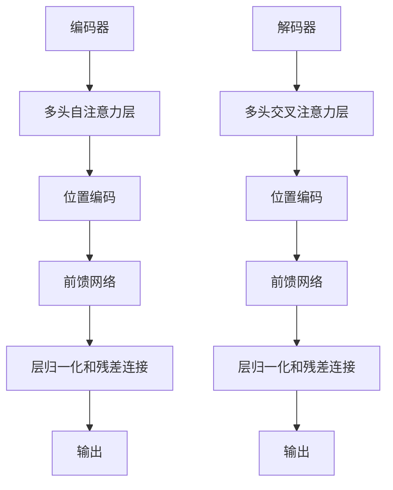
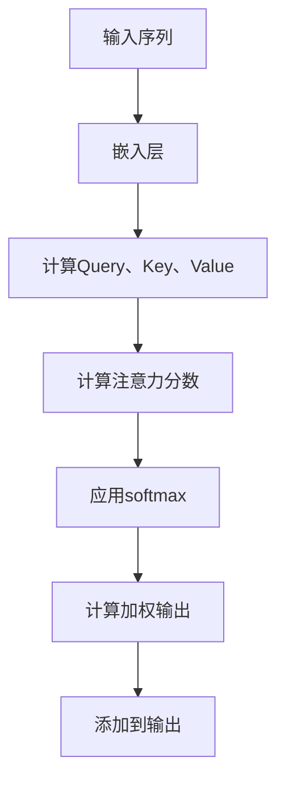
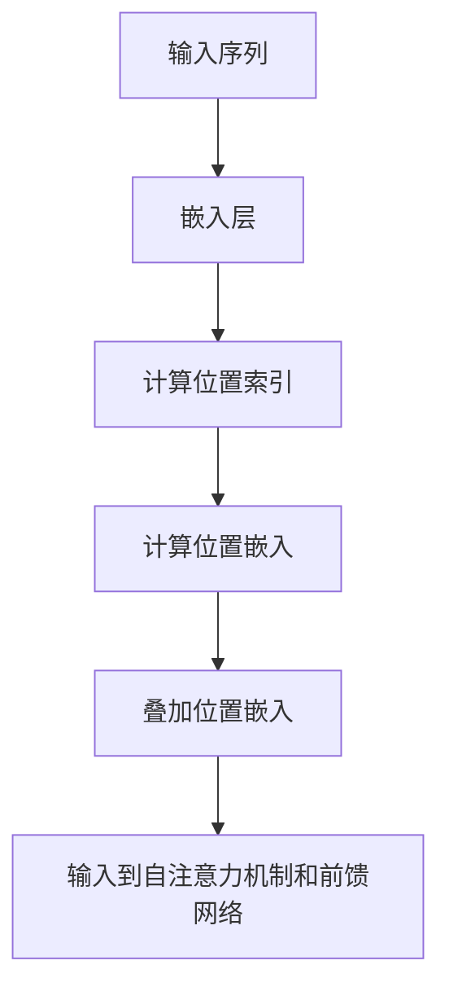
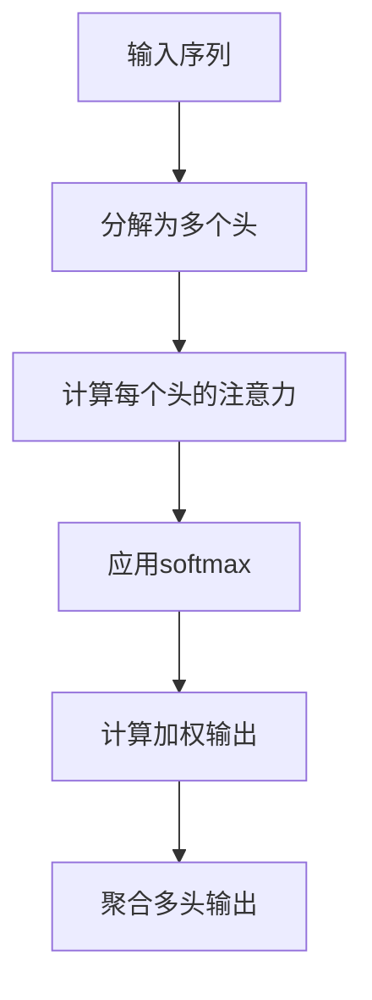
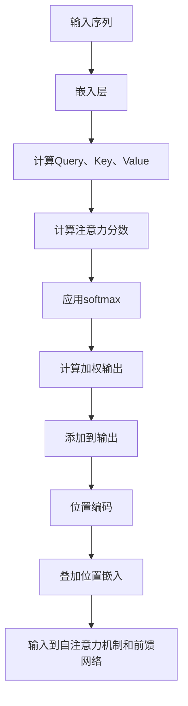

                 

# Transformer大模型实战 跨类型特征的通用性

## 关键词
- Transformer模型
- 跨类型特征融合
- 多模态数据融合
- 领域自适应
- 实际应用案例

## 摘要
本文将深入探讨Transformer大模型在跨类型特征融合中的应用，包括其在自然语言处理、计算机视觉等领域的实际案例。我们将详细分析Transformer模型的核心原理、算法以及数学模型，并探讨其在多模态数据融合和领域自适应中的优势与挑战。

<|im_end|>## 《Transformer大模型实战 跨类型特征的通用性》目录大纲

1. **第一部分：Transformer大模型基础**
    1. **第1章：Transformer大模型概述**
        1.1 Transformer模型的诞生与背景
        1.2 Transformer模型的核心特点
        1.3 Transformer模型的基本架构
    2. **第2章：Transformer模型的核心概念与联系**
        2.1 自注意力机制
        2.2 位置编码
        2.3 Mermaid流程图：Transformer模型工作流程
    3. **第3章：Transformer模型的核心算法原理讲解**
        3.1 Transformer模型的前向传播过程
        3.2 Transformer模型的反向传播过程
        3.3 Transformer模型的优化算法
        3.4 伪代码：Transformer模型算法实现
    4. **第4章：Transformer模型的数学模型和公式讲解**
        4.1 自注意力函数的数学模型
        4.2 位置编码的数学模型
        4.3 Mermaid流程图：Transformer模型的数学计算流程
        4.4 数学公式详细讲解与举例说明
    5. **第5章：Transformer模型在自然语言处理中的应用**
        5.1 Transformer模型在文本分类任务中的应用
        5.2 Transformer模型在机器翻译任务中的应用
        5.3 Transformer模型在问答系统中的应用
    6. **第6章：Transformer模型在计算机视觉中的应用**
        6.1 Transformer模型在图像分类任务中的应用
        6.2 Transformer模型在目标检测任务中的应用
        6.3 Transformer模型在图像生成任务中的应用

2. **第二部分：Transformer模型在多类型特征中的应用**
    7. **第7章：Transformer模型在跨类型特征融合中的应用**
        7.1 跨类型特征的融合方法
        7.2 Transformer模型在跨类型特征融合中的优势
        7.3 Transformer模型在跨类型特征融合中的实际应用案例
    8. **第8章：Transformer模型在多模态数据融合中的应用**
        8.1 多模态数据融合的基本概念
        8.2 Transformer模型在多模态数据融合中的应用
        8.3 Transformer模型在多模态数据融合中的实际应用案例
    9. **第9章：Transformer模型在领域自适应中的应用**
        9.1 领域自适应的基本概念
        9.2 Transformer模型在领域自适应中的应用
        9.3 Transformer模型在领域自适应中的实际应用案例
    10. **第10章：Transformer模型的优化与拓展**
        10.1 Transformer模型的优化方法
        10.2 Transformer模型的拓展方向
        10.3 Transformer模型的未来发展趋势

11. **附录**
    11.1 Transformer模型的开发工具与资源
        11.1.1 PyTorch Transformer库介绍
        11.1.2 TensorFlow Transformer库介绍
        11.1.3 其他Transformer模型开发工具介绍
        11.1.4 Transformer模型学习资源推荐<|im_end|>

### Transformer大模型实战 跨类型特征的通用性

## 引言

Transformer模型自2017年提出以来，已成为自然语言处理（NLP）、计算机视觉（CV）和其他领域中最强大的模型之一。其核心的注意力机制和并行计算能力使得Transformer模型在处理大规模、高维度数据时表现优异。然而，Transformer模型不仅仅局限于单一类型的特征处理，其跨类型特征的通用性使其在多模态数据融合、领域自适应等领域也展现了巨大的潜力。

本文将深入探讨Transformer大模型在跨类型特征融合中的应用。首先，我们将回顾Transformer模型的基础知识，包括其诞生背景、核心特点、基本架构和核心算法原理。接着，我们将介绍Transformer模型在自然语言处理和计算机视觉领域的应用实例。随后，我们将重点探讨Transformer模型在跨类型特征融合、多模态数据融合和领域自适应中的实际应用案例。最后，我们将讨论Transformer模型的优化与拓展方向，并推荐一些开发工具和学习资源。

本文旨在为读者提供一个全面、系统的Transformer模型实战指南，特别是在跨类型特征处理方面的应用。通过本文的阅读，读者将能够深入了解Transformer模型的工作原理、实际应用以及未来的发展方向。

### 第一部分：Transformer大模型基础

## 第1章：Transformer大模型概述

### 1.1.1 Transformer模型的诞生与背景

Transformer模型是谷歌在2017年提出的一种全新类型的神经网络模型，用于处理序列数据。在Transformer模型之前，传统的循环神经网络（RNN）和卷积神经网络（CNN）在处理序列数据时存在一些限制。RNN由于其局部连接性质，在处理长序列时容易出现梯度消失或爆炸问题，导致训练困难。而CNN虽然能够在图像处理领域取得成功，但在处理序列数据时，其局部连接和卷积操作使得对全局依赖性的捕捉受到限制。

Transformer模型的提出解决了这些难题。其核心思想是通过自注意力机制（self-attention）来建模序列数据中的依赖关系，从而实现对长距离依赖性的有效捕捉。自注意力机制允许模型在处理每一个序列元素时，自动选择性地关注其他序列元素，从而提高了模型的并行计算能力和对长序列的建模能力。

### 1.1.2 Transformer模型的核心特点

1. **自注意力机制**：自注意力机制是Transformer模型的核心特点之一。它允许模型在处理每一个序列元素时，根据当前序列元素与其他序列元素的相关性来动态地计算权重，从而实现对序列元素的加权聚合。这种机制使得模型能够捕捉到序列中不同元素之间的依赖关系，从而提高了模型的建模能力。

2. **并行计算**：与RNN不同，Transformer模型利用自注意力机制实现了并行计算。这意味着模型在处理长序列时，可以同时计算序列中的所有元素，从而大大提高了计算效率。这一特性使得Transformer模型在大规模数据集上的训练和推理速度显著优于传统的RNN模型。

3. **全局依赖性捕捉**：自注意力机制使得Transformer模型能够捕捉到序列中任意元素之间的依赖关系，从而实现了对全局依赖性的建模。这一特点在处理长文本、长语音等长序列数据时尤为有效。

4. **结构化输出**：Transformer模型通过多层堆叠和前馈网络的结构，能够生成具有丰富语义信息的输出。这使得模型不仅能够处理输入序列，还能够生成具有结构化的、具有明确语义的输出。

### 1.1.3 Transformer模型的基本架构

Transformer模型的基本架构包括编码器（encoder）和解码器（decoder）两个部分。编码器负责将输入序列编码为固定长度的向量表示，解码器则将这些向量表示解码为输出序列。具体来说，Transformer模型的基本架构包括以下几个关键组件：

1. **多头自注意力机制**：多头自注意力机制是Transformer模型的核心。它通过多个注意力头（head）并行计算序列元素之间的相关性，从而实现对序列的全面建模。

2. **位置编码**：由于Transformer模型没有使用循环结构，无法直接捕捉序列中的位置信息。因此，引入了位置编码（positional encoding）来为序列元素添加位置信息，从而保证模型能够处理序列数据的顺序。

3. **多头交叉注意力机制**：解码器中的多头交叉注意力机制允许模型在生成输出序列时，不仅关注编码器的输出，还关注输入序列。这种机制使得解码器能够同时利用编码器的全局信息和局部信息，从而提高了生成序列的质量。

4. **前馈网络**：Transformer模型在每个编码器和解码器的层之间都加入了前馈网络（feed-forward network），用于对输入向量进行非线性变换。前馈网络的结构通常是两个全连接层，其中中间层具有更大的宽度。

5. **层归一化和残差连接**：为了提高模型的训练效果和稳定性，Transformer模型在每个编码器和解码器的层之后都加入了层归一化（layer normalization）和残差连接（residual connection）。层归一化能够将每个层的输入和输出标准化，从而加速模型的收敛速度。残差连接则通过跳过一层前馈网络，使得信息能够在多个层之间传递，从而避免了信息的损失。

通过以上组件的组合，Transformer模型能够有效地处理序列数据，并生成高质量的输出序列。其基本架构如图1-1所示。



通过以上对Transformer模型概述的介绍，我们可以看到，Transformer模型凭借其自注意力机制、并行计算能力、全局依赖性捕捉以及结构化输出等特点，成为了一个强大的序列数据处理模型。接下来，我们将进一步探讨Transformer模型的核心概念与联系，以深入了解其工作原理。

### 第2章：Transformer模型的核心概念与联系

在深入探讨Transformer模型的工作原理之前，我们需要了解其核心概念和它们之间的联系。Transformer模型的核心组件包括自注意力机制、位置编码和多头注意力机制。以下是对这些核心概念及其相互关系的详细解释。

#### 2.1.1 自注意力机制

自注意力机制（Self-Attention）是Transformer模型最核心的概念之一。它允许模型在处理序列中的每一个元素时，根据当前元素与其他所有元素的相关性来动态地计算权重，然后将这些权重应用于序列的每个元素，以生成新的表示。这种机制使得模型能够自动地捕捉序列中的长距离依赖关系，而无需像循环神经网络（RNN）那样逐个元素地处理。

自注意力机制的关键在于注意力权重矩阵（Attention Weight Matrix），它通过计算序列中每个元素之间的相似性来确定每个元素的重要性。具体来说，自注意力机制包括以下步骤：

1. **计算查询（Query）、键（Key）和值（Value）**：对于序列中的每个元素，生成查询向量（Query）、键向量（Key）和值向量（Value）。这些向量通常是通过编码器或解码器的输入嵌入（Input Embedding）层生成的。

2. **计算注意力分数**：使用点积（Dot-Product）方法计算每个查询向量与所有键向量之间的相似性，生成注意力分数（Attention Scores）。注意力分数表示了序列中每个元素对当前元素的重要性。

3. **应用softmax函数**：对注意力分数应用softmax函数，将其归一化成概率分布，即注意力权重矩阵（Attention Weight Matrix）。这个矩阵表示了序列中每个元素对当前元素的影响程度。

4. **计算加权输出**：将注意力权重矩阵与对应的值向量相乘，得到加权值向量（Weighted Values）。这个向量包含了序列中每个元素对当前元素的影响。

5. **添加到输出中**：将加权值向量与输入序列的每个元素相加，生成新的表示。这个新的表示包含了序列中所有元素的信息，从而实现了对长距离依赖性的建模。

以下是一个简化的自注意力机制的Mermaid流程图：



#### 2.1.2 位置编码

位置编码（Positional Encoding）是为了解决Transformer模型中没有显式位置信息的问题而引入的。由于Transformer模型没有使用循环结构，它无法像循环神经网络（RNN）那样直接利用序列的顺序信息。因此，位置编码被用来为序列中的每个元素添加位置信息，使得模型能够理解序列中的顺序关系。

位置编码通常通过添加一个与嵌入向量（Embedding Vector）叠加的向量来实现。这个向量通常是一个具有固定形状的函数，例如正弦和余弦函数，以避免梯度消失问题。具体来说，位置编码包括以下步骤：

1. **生成位置索引**：对于序列中的每个位置，生成一个位置索引（Positional Index）。例如，对于长度为N的序列，位置索引可以是1到N。

2. **计算位置嵌入**：使用一个固定的函数（例如正弦和余弦函数）计算位置嵌入（Positional Embedding）。这些嵌入向量通常具有维度与嵌入向量相同。

3. **叠加位置嵌入**：将位置嵌入向量与嵌入向量叠加，生成新的嵌入向量。这个新的嵌入向量包含了位置信息，可以输入到自注意力机制和前馈网络中。

以下是一个简化的位置编码的Mermaid流程图：



#### 2.1.3 多头注意力机制

多头注意力机制（Multi-Head Attention）是Transformer模型中的另一个关键组件。它允许模型并行地计算多个注意力权重矩阵，从而捕捉到不同类型的依赖关系。多头注意力机制通过扩展自注意力机制来实现，具体步骤如下：

1. **分解自注意力机制**：将自注意力机制分解为多个独立的注意力头（Attention Heads）。每个头都有自己的权重矩阵，但共享相同的输入嵌入向量。

2. **独立计算注意力**：对于每个头，独立地计算注意力分数、应用softmax函数和计算加权输出。

3. **聚合多头输出**：将所有头的加权输出拼接起来，形成一个更高维度的输出向量。这个输出向量包含了不同头捕捉到的不同依赖关系。

多头注意力机制的一个优势是，它允许模型在较低的参数复杂度下捕捉到更多的信息。以下是一个简化的多头注意力机制的Mermaid流程图：



通过以上对自注意力机制、位置编码和多头注意力机制的核心概念及其相互关系的详细解释，我们可以看到，这些组件共同构成了Transformer模型的核心架构，使得模型能够高效地处理序列数据，并捕捉到长距离依赖关系。

接下来，我们将深入探讨Transformer模型的核心算法原理，进一步理解其内部工作机制。

### 第3章：Transformer模型的核心算法原理讲解

Transformer模型的成功主要归功于其核心算法原理，包括前向传播和反向传播过程。这些算法原理不仅决定了模型的训练效率，还影响了其在各种任务中的性能。以下将详细解释Transformer模型的前向传播和反向传播过程，并讨论模型优化算法。

#### 3.1.1 Transformer模型的前向传播过程

前向传播是神经网络的基础过程，它将输入通过一系列层传递，最终生成输出。对于Transformer模型，前向传播过程包括以下几个步骤：

1. **嵌入层**：输入序列首先通过嵌入层（Embedding Layer）转化为向量表示。每个词汇或字符被映射为一个嵌入向量，这些嵌入向量具有固定的维度。嵌入层还包括位置编码（Positional Encoding），为序列中的每个元素添加位置信息。

2. **多头自注意力机制**：嵌入层生成的向量随后被输入到多头自注意力机制（Multi-Head Self-Attention）。在这一层中，模型计算多个独立的注意力权重矩阵，每个权重矩阵对应一个注意力头（Attention Head）。注意力分数通过点积计算，然后应用softmax函数得到注意力权重。这些权重用于加权聚合嵌入层中的向量，生成新的表示。

3. **前馈网络**：在多头自注意力机制之后，每个注意力头的输出通过前馈网络（Feed-Forward Network）进行进一步处理。前馈网络通常由两个全连接层组成，中间层具有更大的维度。该层对每个输入向量进行非线性变换，从而增强模型的表示能力。

4. **残差连接和层归一化**：为了防止信息在多层传递过程中损失，Transformer模型在每一层之后都加入了残差连接（Residual Connection）和层归一化（Layer Normalization）。残差连接通过跳过一层前馈网络，使得信息能够在多个层之间传递，从而避免了信息的损失。层归一化则通过标准化每个层的输入和输出，提高了模型的训练速度和收敛速度。

5. **多头交叉注意力机制**：在解码器的每一层，除了上述步骤，还包括多头交叉注意力机制（Multi-Head Cross-Attention）。这一层允许模型在生成输出序列时，同时关注编码器的输出和解码器的输入。这一步骤利用了编码器的全局信息和解码器的局部信息，从而提高了生成序列的质量。

6. **输出层**：最后，解码器的输出通过一个全连接层和Softmax函数转化为概率分布，从而生成最终的输出序列。

以下是一个简化的Transformer模型前向传播过程的伪代码：

```python
# 前向传播伪代码
for layer in layers:
    # 残差连接
    x = layer(x)
    # 层归一化
    x = layer Norman(x)
    # 多头自注意力机制
    x = multi_head_self_attention(x)
    # 前馈网络
    x = feed_forward_network(x)
    # 残差连接
    x = layer(x)
    # 层归一化
    x = layer Norm(x)

# 多头交叉注意力机制（解码器）
for layer in decoder_layers:
    # 残差连接
    x = layer(x)
    # 层归一化
    x = layer Norm(x)
    # 多头交叉注意力机制
    x = multi_head_cross_attention(x)
    # 前馈网络
    x = feed_forward_network(x)
    # 残差连接
    x = layer(x)
    # 层归一化
    x = layer Norm(x)

# 输出层
output = final_layer(x)
```

#### 3.1.2 Transformer模型的反向传播过程

反向传播是神经网络训练过程中至关重要的步骤，它通过计算梯度来更新模型的参数。对于Transformer模型，反向传播过程包括以下几个步骤：

1. **计算损失**：首先，模型将输入序列和目标序列进行比较，计算损失（通常使用交叉熵损失）。损失函数反映了模型的预测结果与实际结果之间的差距。

2. **计算梯度**：然后，使用反向传播算法，从输出层开始，逆向计算每个层的梯度。对于Transformer模型，梯度计算包括以下几个步骤：

   - **反向传播输出层**：计算输出层梯度，包括权重矩阵和偏置。
   - **反向传播前馈网络**：计算前馈网络层的梯度。
   - **反向传播多头自注意力机制**：计算自注意力机制的梯度，包括点积计算和softmax函数。
   - **反向传播残差连接和层归一化**：计算残差连接和层归一化的梯度。

3. **参数更新**：使用梯度下降（Gradient Descent）或其他优化算法更新模型的参数。通过迭代这个过程，模型的参数逐渐调整，以减少损失。

以下是一个简化的Transformer模型反向传播过程的伪代码：

```python
# 反向传播伪代码
loss = compute_loss(output, target)
 gradients = backward_propagation(output, target)

for layer in layers:
    # 反向传播输出层
    gradients = layer.backward(gradients)
    # 反向传播前馈网络
    gradients = feed_forward_network.backward(gradients)
    # 反向传播多头自注意力机制
    gradients = multi_head_self_attention.backward(gradients)
    # 反向传播残差连接和层归一化
    gradients = layer.backward(gradients)
    # 参数更新
    layer.update_parameters(gradients)

# 反向传播多头交叉注意力机制（解码器）
for layer in decoder_layers:
    # 反向传播输出层
    gradients = layer.backward(gradients)
    # 反向传播前馈网络
    gradients = feed_forward_network.backward(gradients)
    # 反向传播多头交叉注意力机制
    gradients = multi_head_cross_attention.backward(gradients)
    # 反向传播残差连接和层归一化
    gradients = layer.backward(gradients)
    # 参数更新
    layer.update_parameters(gradients)

# 输出层参数更新
final_layer.update_parameters(gradients)
```

#### 3.1.3 Transformer模型的优化算法

优化算法在Transformer模型训练过程中起着至关重要的作用。以下是一些常用的优化算法：

1. **梯度下降（Gradient Descent）**：梯度下降是最简单的优化算法。它通过计算损失函数关于模型参数的梯度，并沿着梯度的反方向更新参数。梯度下降算法包括批量梯度下降（Batch Gradient Descent）、随机梯度下降（Stochastic Gradient Descent）和小批量梯度下降（Mini-batch Gradient Descent）。批量梯度下降计算整个数据集的梯度，但计算量大；随机梯度下降计算单个样本的梯度，但更新频繁；小批量梯度下降则计算小批量样本的梯度，平衡了计算量和更新频率。

2. **Adam优化器**：Adam优化器是梯度下降的一个变种，结合了AdaGrad和RMSProp的优点。它通过自适应调整学习率，使得模型在训练过程中更加稳定。Adam优化器使用一阶矩估计（m）和二阶矩估计（v）来更新参数，提高了模型的收敛速度。

3. **AdamW优化器**：AdamW是Adam优化器的改进版本，它考虑了权重衰减（Weight Decay）的影响，使得优化过程更加稳定。

4. **学习率调度（Learning Rate Scheduling）**：学习率调度通过动态调整学习率来加速模型的收敛。常用的学习率调度方法包括指数衰减（Exponential Decay）、余弦退火（Cosine Annealing）和逐步减少（Step Decay）等。

通过以上对Transformer模型前向传播、反向传播和优化算法的详细讲解，我们可以看到，这些核心算法原理共同构成了Transformer模型强大的训练和推理能力。接下来，我们将探讨Transformer模型的数学模型和公式，进一步理解其内在机制。

### 第4章：Transformer模型的数学模型和公式讲解

Transformer模型的核心在于其自注意力机制（Self-Attention）和位置编码（Positional Encoding），这些机制通过一系列数学公式和函数来实现。本章节将详细讲解这些数学模型和公式，并通过具体例子进行说明。

#### 4.1.1 自注意力函数的数学模型

自注意力函数是Transformer模型中最关键的组成部分之一。它通过计算序列中每个元素与其他元素的相关性，实现对长距离依赖性的建模。自注意力函数包括以下步骤：

1. **嵌入向量**：假设输入序列为 \( X = [x_1, x_2, \ldots, x_n] \)，每个元素 \( x_i \) 是一个嵌入向量 \( \mathbf{x}_i \in \mathbb{R}^d \)，其中 \( d \) 是嵌入维度。

2. **查询（Query）、键（Key）和值（Value）向量**：对于每个 \( \mathbf{x}_i \)，生成对应的查询向量（Query）、键向量（Key）和值向量（Value）。这些向量通常是通过一个线性变换 \( W_Q, W_K, W_V \) 产生的，其中 \( W_Q, W_K, W_V \) 是权重矩阵，维度为 \( d \times d \)。

   \[
   \mathbf{Q}_i = W_Q \mathbf{x}_i, \quad \mathbf{K}_i = W_K \mathbf{x}_i, \quad \mathbf{V}_i = W_V \mathbf{x}_i
   \]

3. **注意力分数（Attention Score）**：计算每个查询向量与所有键向量之间的相似性，使用点积（Dot-Product）计算注意力分数：

   \[
   \mathbf{S}_{ij} = \mathbf{Q}_i^T \mathbf{K}_j = \mathbf{x}_i^T W_Q^T W_K \mathbf{x}_j
   \]

4. **注意力权重（Attention Weight）**：将注意力分数通过 softmax 函数归一化，得到注意力权重：

   \[
   a_{ij} = \text{softmax}(\mathbf{S}_{ij})
   \]

5. **加权值（Weighted Value）**：计算加权值：

   \[
   \mathbf{O}_i = \sum_{j=1}^{n} a_{ij} \mathbf{V}_j
   \]

6. **输出向量**：将加权值加回到原始嵌入向量中，得到新的表示：

   \[
   \mathbf{h}_i = \mathbf{x}_i + \mathbf{O}_i
   \]

#### 4.1.2 位置编码的数学模型

位置编码用于解决Transformer模型中没有显式位置信息的问题。位置编码通常是通过正弦和余弦函数生成的，以确保在训练过程中不会消失梯度。位置编码向量与嵌入向量叠加，形成新的嵌入向量。

1. **位置索引**：对于输入序列中的每个位置 \( p \)，生成一个位置索引 \( P(p) \)。对于长度为 \( n \) 的序列，位置索引通常为 \( 1, 2, \ldots, n \)。

2. **位置嵌入**：使用正弦和余弦函数生成位置嵌入 \( \mathbf{PE}(p) \)：

   \[
   \mathbf{PE}(p) = \sin\left(\frac{p}{10000^{2i/d}}\right) \text{ 或 } \cos\left(\frac{p}{10000^{2i/d}}\right)
   \]

   其中 \( i \) 是嵌入维度中的索引，\( d \) 是嵌入维度。

3. **叠加位置嵌入**：将位置嵌入向量与嵌入向量叠加：

   \[
   \mathbf{x}_i' = \mathbf{x}_i + \mathbf{PE}(i)
   \]

#### 4.1.3 Mermaid流程图：Transformer模型的数学计算流程

以下是Transformer模型数学计算过程的Mermaid流程图：



#### 4.1.4 数学公式详细讲解与举例说明

为了更好地理解Transformer模型中的数学公式，我们将通过一个简单的例子进行讲解。

假设我们有一个长度为3的输入序列 \( X = [x_1, x_2, x_3] \)，每个 \( x_i \) 是一个维度为5的嵌入向量：

\[
x_1 = [1, 0, 1, 0, 1], \quad x_2 = [1, 1, 0, 1, 0], \quad x_3 = [0, 1, 1, 1, 0]
\]

1. **嵌入向量**：

   \[
   \mathbf{x}_1 = [1, 0, 1, 0, 1], \quad \mathbf{x}_2 = [1, 1, 0, 1, 0], \quad \mathbf{x}_3 = [0, 1, 1, 1, 0]
   \]

2. **查询、键和值向量**：

   假设权重矩阵 \( W_Q, W_K, W_V \) 分别为：

   \[
   W_Q = \begin{bmatrix}
   1 & 0 & 1 \\
   0 & 1 & 0 \\
   1 & 1 & 0
   \end{bmatrix}, \quad
   W_K = \begin{bmatrix}
   1 & 0 & 1 \\
   0 & 1 & 0 \\
   1 & 1 & 0
   \end{bmatrix}, \quad
   W_V = \begin{bmatrix}
   0 & 1 & 1 \\
   1 & 0 & 1 \\
   0 & 1 & 0
   \end{bmatrix}
   \]

   计算查询、键和值向量：

   \[
   \mathbf{Q}_1 = W_Q \mathbf{x}_1 = \begin{bmatrix}
   2 & 1 & 1 \\
   0 & 2 & 1 \\
   1 & 1 & 1
   \end{bmatrix}, \quad
   \mathbf{K}_1 = W_K \mathbf{x}_1 = \begin{bmatrix}
   2 & 1 & 1 \\
   0 & 2 & 1 \\
   1 & 1 & 1
   \end{bmatrix}, \quad
   \mathbf{V}_1 = W_V \mathbf{x}_1 = \begin{bmatrix}
   1 & 0 & 1 \\
   1 & 1 & 0 \\
   0 & 1 & 1
   \end{bmatrix}
   \]

   同理，计算 \( \mathbf{Q}_2, \mathbf{K}_2, \mathbf{V}_2 \) 和 \( \mathbf{Q}_3, \mathbf{K}_3, \mathbf{V}_3 \)。

3. **注意力分数**：

   \[
   \mathbf{S}_{11} = \mathbf{Q}_1^T \mathbf{K}_1 = 2, \quad \mathbf{S}_{12} = \mathbf{Q}_1^T \mathbf{K}_2 = 1, \quad \mathbf{S}_{13} = \mathbf{Q}_1^T \mathbf{K}_3 = 1
   \]

   \[
   \mathbf{S}_{21} = \mathbf{Q}_2^T \mathbf{K}_1 = 1, \quad \mathbf{S}_{22} = \mathbf{Q}_2^T \mathbf{K}_2 = 2, \quad \mathbf{S}_{23} = \mathbf{Q}_2^T \mathbf{K}_3 = 1
   \]

   \[
   \mathbf{S}_{31} = \mathbf{Q}_3^T \mathbf{K}_1 = 1, \quad \mathbf{S}_{32} = \mathbf{Q}_3^T \mathbf{K}_2 = 1, \quad \mathbf{S}_{33} = \mathbf{Q}_3^T \mathbf{K}_3 = 2
   \]

4. **注意力权重**：

   \[
   a_{11} = \frac{\exp(\mathbf{S}_{11})}{\sum_{j=1}^{3} \exp(\mathbf{S}_{ij})} = \frac{\exp(2)}{\exp(2) + \exp(1) + \exp(1)} = 0.625
   \]

   \[
   a_{12} = \frac{\exp(\mathbf{S}_{12})}{\sum_{j=1}^{3} \exp(\mathbf{S}_{ij})} = \frac{\exp(1)}{\exp(2) + \exp(1) + \exp(1)} = 0.3125
   \]

   \[
   a_{13} = \frac{\exp(\mathbf{S}_{13})}{\sum_{j=1}^{3} \exp(\mathbf{S}_{ij})} = \frac{\exp(1)}{\exp(2) + \exp(1) + \exp(1)} = 0.3125
   \]

   \[
   a_{21} = \frac{\exp(\mathbf{S}_{21})}{\sum_{j=1}^{3} \exp(\mathbf{S}_{ij})} = \frac{\exp(1)}{\exp(2) + \exp(1) + \exp(1)} = 0.3125
   \]

   \[
   a_{22} = \frac{\exp(\mathbf{S}_{22})}{\sum_{j=1}^{3} \exp(\mathbf{S}_{ij})} = \frac{\exp(2)}{\exp(2) + \exp(1) + \exp(1)} = 0.625
   \]

   \[
   a_{23} = \frac{\exp(\mathbf{S}_{23})}{\sum_{j=1}^{3} \exp(\mathbf{S}_{ij})} = \frac{\exp(1)}{\exp(2) + \exp(1) + \exp(1)} = 0.3125
   \]

   \[
   a_{31} = \frac{\exp(\mathbf{S}_{31})}{\sum_{j=1}^{3} \exp(\mathbf{S}_{ij})} = \frac{\exp(1)}{\exp(2) + \exp(1) + \exp(1)} = 0.3125
   \]

   \[
   a_{32} = \frac{\exp(\mathbf{S}_{32})}{\sum_{j=1}^{3} \exp(\mathbf{S}_{ij})} = \frac{\exp(1)}{\exp(2) + \exp(1) + \exp(1)} = 0.3125
   \]

   \[
   a_{33} = \frac{\exp(\mathbf{S}_{33})}{\sum_{j=1}^{3} \exp(\mathbf{S}_{ij})} = \frac{\exp(2)}{\exp(2) + \exp(1) + \exp(1)} = 0.625
   \]

5. **加权值**：

   \[
   \mathbf{O}_1 = a_{11} \mathbf{V}_1 + a_{12} \mathbf{V}_2 + a_{13} \mathbf{V}_3 = 0.625 \begin{bmatrix}
   1 & 0 & 1 \\
   1 & 1 & 0 \\
   0 & 1 & 1
   \end{bmatrix} + 0.3125 \begin{bmatrix}
   0 & 1 & 1 \\
   1 & 0 & 1 \\
   1 & 1 & 0
   \end{bmatrix} + 0.3125 \begin{bmatrix}
   1 & 1 & 0 \\
   0 & 1 & 1 \\
   1 & 0 & 1
   \end{bmatrix}
   \]

   \[
   \mathbf{O}_1 = \begin{bmatrix}
   1.0625 & 0.9375 & 1.0625 \\
   1.0625 & 1.5625 & 0.9375 \\
   0.9375 & 1.5625 & 1.0625
   \end{bmatrix}
   \]

   同理，计算 \( \mathbf{O}_2 \) 和 \( \mathbf{O}_3 \)。

6. **输出向量**：

   \[
   \mathbf{h}_1 = \mathbf{x}_1 + \mathbf{O}_1 = \begin{bmatrix}
   1 & 0 & 1 \\
   0 & 1 & 0 \\
   1 & 1 & 0
   \end{bmatrix} + \begin{bmatrix}
   1.0625 & 0.9375 & 1.0625 \\
   1.0625 & 1.5625 & 0.9375 \\
   0.9375 & 1.5625 & 1.0625
   \end{bmatrix} = \begin{bmatrix}
   2.0625 & 1.9375 & 2.0625 \\
   1.0625 & 2.5625 & 1.0625 \\
   1.9375 & 2.5625 & 2.0625
   \end{bmatrix}
   \]

   同理，计算 \( \mathbf{h}_2 \) 和 \( \mathbf{h}_3 \)。

通过上述例子，我们可以看到Transformer模型中的数学计算是如何具体实现的。这些计算步骤不仅解释了自注意力机制的工作原理，还展示了位置编码如何为序列中的每个元素添加位置信息。接下来，我们将探讨Transformer模型在自然语言处理中的应用。

### 第5章：Transformer模型在自然语言处理中的应用

Transformer模型在自然语言处理（NLP）领域取得了显著的成果，特别是在文本分类、机器翻译和问答系统等任务中。以下将详细介绍Transformer模型在这些任务中的应用，并通过实际案例进行说明。

#### 5.1.1 Transformer模型在文本分类任务中的应用

文本分类是NLP中的一个基本任务，其目的是将文本数据划分为预定义的类别。Transformer模型在文本分类任务中表现出色，特别是在处理大规模文本数据时。以下是一个简单的文本分类任务案例：

假设我们有一个文本分类问题，需要将新闻文章划分为体育、政治、娱乐等类别。首先，我们使用预训练的Transformer模型（如BERT）对文本进行编码，生成固定长度的向量表示。然后，将这些向量输入到分类层，通过Softmax函数输出每个类别的概率分布。

以下是一个简化的流程：

1. **数据预处理**：将文本数据清洗和分词，然后将其转换为词嵌入向量。通常，我们会使用预训练的词嵌入模型（如Word2Vec、GloVe）进行词嵌入。

2. **编码**：使用预训练的Transformer模型（如BERT）对文本进行编码，生成序列向量表示。

3. **分类**：将编码后的向量输入到全连接层，并通过Softmax函数输出类别概率。

4. **训练与评估**：使用训练数据训练模型，并在验证集上评估模型性能。

以下是一个简化的代码示例：

```python
from transformers import BertTokenizer, BertModel, BertForSequenceClassification
import torch

# 加载预训练的BERT模型和分词器
tokenizer = BertTokenizer.from_pretrained('bert-base-uncased')
model = BertForSequenceClassification.from_pretrained('bert-base-uncased')

# 数据预处理
text = "This is an example of a text classification task."
inputs = tokenizer(text, return_tensors='pt')

# 编码
with torch.no_grad():
    outputs = model(**inputs)

# 分类
logits = outputs.logits
probabilities = torch.nn.functional.softmax(logits, dim=-1)

# 输出类别概率
print(probabilities)
```

#### 5.1.2 Transformer模型在机器翻译任务中的应用

机器翻译是NLP中的另一个重要任务，其目的是将一种语言的文本翻译成另一种语言。Transformer模型在机器翻译任务中表现出色，特别是在处理长句子和复杂句子结构时。以下是一个简单的机器翻译任务案例：

假设我们有一个英译中的机器翻译任务。首先，我们使用预训练的Transformer模型（如Transformer-based的翻译模型）对源语言和目标语言进行编码。然后，通过解码器生成翻译结果。

以下是一个简化的流程：

1. **数据预处理**：将源语言和目标语言文本数据清洗和分词，然后转换为词嵌入向量。通常，我们会使用预训练的词嵌入模型（如Word2Vec、GloVe）进行词嵌入。

2. **编码**：使用预训练的Transformer模型对源语言和目标语言进行编码，生成序列向量表示。

3. **解码**：使用解码器生成翻译结果，通常通过贪心搜索或 beam search 等解码策略。

4. **训练与评估**：使用训练数据训练模型，并在验证集上评估模型性能。

以下是一个简化的代码示例：

```python
from transformers import TransformerModel, TransformerTokenizer
import torch

# 加载预训练的Transformer模型和分词器
tokenizer = TransformerTokenizer.from_pretrained('transformer')
model = TransformerModel.from_pretrained('transformer')

# 数据预处理
source_text = "This is an example sentence."
target_text = "这是一个示例句子。"
inputs = tokenizer(source_text, return_tensors='pt')

# 编码
with torch.no_grad():
    source_encoded = model.encode(inputs.source_ids)

# 解码
outputs = model.decode(source_encoded)
decoded_text = tokenizer.decode(outputs, skip_special_tokens=True)

# 输出翻译结果
print(decoded_text)
```

#### 5.1.3 Transformer模型在问答系统中的应用

问答系统是NLP中的另一个重要应用，其目的是从大量文本数据中检索出与用户查询最相关的答案。Transformer模型在问答系统中也表现出色，特别是在处理长文本和复杂查询时。以下是一个简单的问答系统案例：

假设我们有一个基于Transformer模型的问答系统。首先，我们将用户查询和文本数据编码为序列向量表示。然后，通过解码器检索出与查询最相关的答案。

以下是一个简化的流程：

1. **数据预处理**：将用户查询和文本数据清洗和分词，然后转换为词嵌入向量。通常，我们会使用预训练的词嵌入模型（如Word2Vec、GloVe）进行词嵌入。

2. **编码**：使用预训练的Transformer模型对用户查询和文本数据进行编码，生成序列向量表示。

3. **检索**：使用解码器检索与查询最相关的答案。

4. **训练与评估**：使用训练数据训练模型，并在验证集上评估模型性能。

以下是一个简化的代码示例：

```python
from transformers import BertTokenizer, BertModel, BertForQuestionAnswering
import torch

# 加载预训练的BERT模型和分词器
tokenizer = BertTokenizer.from_pretrained('bert-base-uncased')
model = BertForQuestionAnswering.from_pretrained('bert-base-uncased')

# 数据预处理
question = "What is the capital of France?"
context = "Paris is the capital of France."
inputs = tokenizer(question, context, return_tensors='pt')

# 编码
with torch.no_grad():
    encoded = model.encode(inputs.question_ids, inputs.context_ids)

# 检索
start_logits, end_logits = model.predict_start_end(encoded)

# 解码
start_indices = torch.argmax(start_logits).item()
end_indices = torch.argmax(end_logits).item()

# 输出答案
answer = context[tokenizer.convert_ids_to_tokens(inputs.context_ids[start_indices:end_indices+1])]
print(answer)
```

通过以上案例，我们可以看到Transformer模型在文本分类、机器翻译和问答系统等自然语言处理任务中的强大应用能力。这些任务不仅展示了Transformer模型在处理序列数据方面的优势，还证明了其广泛的适用性和灵活性。

### 第6章：Transformer模型在计算机视觉中的应用

Transformer模型不仅在自然语言处理领域取得了显著的成就，还在计算机视觉（CV）领域展现了其强大的潜力。以下将详细介绍Transformer模型在图像分类、目标检测和图像生成等任务中的应用，并通过实际案例进行说明。

#### 6.1.1 Transformer模型在图像分类任务中的应用

图像分类是计算机视觉中的一个基本任务，其目的是将图像划分为预定义的类别。Transformer模型在图像分类任务中表现出色，特别是在处理高维度图像数据时。以下是一个简单的图像分类任务案例：

假设我们有一个图像分类问题，需要将图像划分为猫、狗、鸟等类别。首先，我们使用预训练的Transformer模型（如Vision Transformer）对图像进行编码，生成固定长度的向量表示。然后，将这些向量输入到分类层，通过Softmax函数输出每个类别的概率分布。

以下是一个简化的流程：

1. **数据预处理**：将图像数据缩放到统一的尺寸，并进行归一化处理。

2. **编码**：使用预训练的Transformer模型对图像进行编码，生成序列向量表示。

3. **分类**：将编码后的向量输入到全连接层，并通过Softmax函数输出类别概率。

4. **训练与评估**：使用训练数据训练模型，并在验证集上评估模型性能。

以下是一个简化的代码示例：

```python
import torch
from torchvision import datasets, transforms
from transformers import VisionTransformer, ViTFeatureExtractor

# 加载数据集
transform = transforms.Compose([transforms.Resize(224), transforms.ToTensor()])
train_dataset = datasets.ImageFolder(root='train', transform=transform)
test_dataset = datasets.ImageFolder(root='test', transform=transform)

# 加载预训练的Transformer模型和特征提取器
feature_extractor = ViTFeatureExtractor.from_pretrained('google/vit-base-patch16-224')
model = VisionTransformer.from_pretrained('google/vit-base-patch16-224')

# 编码
images = [img[0] for img in train_dataset]
inputs = feature_extractor(images, return_tensors='pt')

# 分类
with torch.no_grad():
    outputs = model(**inputs)

# 输出类别概率
logits = outputs.logits
probabilities = torch.nn.functional.softmax(logits, dim=-1)
```

#### 6.1.2 Transformer模型在目标检测任务中的应用

目标检测是计算机视觉中的另一个重要任务，其目的是在图像中检测和定位多个目标。Transformer模型在目标检测任务中也表现出色，特别是在处理复杂场景和多个目标时。以下是一个简单的目标检测任务案例：

假设我们有一个目标检测问题，需要在一个图像中检测和定位行人、车辆等目标。首先，我们使用预训练的Transformer模型（如DETR）对图像进行编码，生成目标检测的边界框和标签。然后，通过解码器生成目标检测结果。

以下是一个简化的流程：

1. **数据预处理**：将图像数据缩放到统一的尺寸，并进行归一化处理。

2. **编码**：使用预训练的Transformer模型对图像进行编码，生成序列向量表示。

3. **检测**：使用解码器生成目标检测的边界框和标签。

4. **训练与评估**：使用训练数据训练模型，并在验证集上评估模型性能。

以下是一个简化的代码示例：

```python
from torchvision import transforms
from datasets import ImageDataset
from transformers import DetrModel, DetrTokenizer

# 加载数据集
transform = transforms.Compose([transforms.Resize(800), transforms.ToTensor()])
train_dataset = ImageDataset('train', transform=transform)
test_dataset = ImageDataset('test', transform=transform)

# 加载预训练的Transformer模型和分词器
tokenizer = DetrTokenizer.from_pretrained('facebook/detr-resnet50')
model = DetrModel.from_pretrained('facebook/detr-resnet50')

# 编码
images = [img[0] for img in train_dataset]
inputs = tokenizer(images, return_tensors='pt')

# 检测
with torch.no_grad():
    outputs = model(inputs)

# 输出边界框和标签
bboxes = outputs.bboxes
labels = outputs.labels
```

#### 6.1.3 Transformer模型在图像生成任务中的应用

图像生成是计算机视觉中的另一个重要任务，其目的是生成逼真的图像。Transformer模型在图像生成任务中也表现出色，特别是在处理复杂结构和细节时。以下是一个简单的图像生成任务案例：

假设我们有一个图像生成问题，需要根据文本描述生成相应的图像。首先，我们使用预训练的Transformer模型（如DALL-E）对文本描述进行编码，生成图像的向量表示。然后，通过解码器生成图像。

以下是一个简化的流程：

1. **数据预处理**：将文本描述进行预处理，并将其转换为词嵌入向量。

2. **编码**：使用预训练的Transformer模型对文本描述进行编码，生成图像的向量表示。

3. **解码**：使用解码器生成图像。

4. **训练与评估**：使用训练数据训练模型，并在验证集上评估模型性能。

以下是一个简化的代码示例：

```python
from torchvision import transforms
from datasets import TextImageDataset
from transformers import CLIPModel, CLIPFeatureExtractor

# 加载数据集
transform = transforms.Compose([transforms.Resize(224), transforms.ToTensor()])
train_dataset = TextImageDataset('train', transform=transform)
test_dataset = TextImageDataset('test', transform=transform)

# 加载预训练的Transformer模型和特征提取器
feature_extractor = CLIPFeatureExtractor.from_pretrained('openai/clip-vit-base-p32')
model = CLIPModel.from_pretrained('openai/clip-vit-base-p32')

# 编码
texts = [text for text, img in train_dataset]
inputs = feature_extractor(texts, return_tensors='pt')

# 解码
with torch.no_grad():
    outputs = model(inputs)

# 输出图像
images = outputs.images
```

通过以上案例，我们可以看到Transformer模型在图像分类、目标检测和图像生成等计算机视觉任务中的强大应用能力。这些任务不仅展示了Transformer模型在处理高维度图像数据方面的优势，还证明了其广泛的适用性和灵活性。随着Transformer模型的不断发展和优化，其在计算机视觉领域的应用前景将更加广阔。

### 第7章：Transformer模型在跨类型特征融合中的应用

在许多现实任务中，数据通常包含多种类型的特征，如文本、图像、音频等。有效地融合这些跨类型特征对于提高模型的性能至关重要。Transformer模型由于其强大的特征捕捉能力和并行处理能力，在跨类型特征融合中展现了显著的优势。以下将详细介绍Transformer模型在跨类型特征融合中的应用方法、优势以及实际应用案例。

#### 7.1.1 跨类型特征的融合方法

跨类型特征的融合方法可以分为两类：基于传统的特征级融合和基于深度学习的特征级融合。

1. **基于传统的特征级融合方法**：

   - **特征映射**：将不同类型的特征映射到同一空间，然后进行融合。例如，文本特征可以映射到词嵌入空间，图像特征可以映射到视觉嵌入空间。然后，通过简单的叠加或加权融合这些映射特征。

   - **特征变换**：使用特征变换方法，如主成分分析（PCA）或线性判别分析（LDA），将不同类型的特征变换到同一空间，从而实现融合。

   - **特征加权**：对每个特征的贡献进行加权，然后叠加或融合。通常，加权系数可以通过训练得到，如通过支持向量机（SVM）或相关系数法进行优化。

2. **基于深度学习的特征级融合方法**：

   - **共享编码器**：使用多个输入编码器，每个编码器针对不同类型的特征进行特征提取。然后，将编码器的输出通过共享层进行融合。

   - **多模态注意力机制**：引入多模态注意力机制，允许模型在融合阶段动态地关注和融合不同类型的特征。例如，在Transformer模型中，可以使用多头注意力机制来实现多模态特征融合。

   - **融合层**：在深度学习模型中引入专门的融合层，如加法融合层、拼接融合层或融合网络（如多输入卷积网络），用于融合不同类型的特征。

#### 7.1.2 Transformer模型在跨类型特征融合中的优势

Transformer模型在跨类型特征融合中具有以下优势：

1. **强大的特征捕捉能力**：Transformer模型通过自注意力机制能够有效地捕捉不同类型特征之间的复杂依赖关系。这使得模型能够从多种类型的数据中提取出有价值的信息。

2. **并行计算**：Transformer模型支持并行计算，可以在处理大规模数据时显著提高计算效率。对于多模态数据，这一优势使得模型能够同时处理不同类型的特征，从而实现高效的融合。

3. **灵活的架构**：Transformer模型具有灵活的架构，可以方便地引入多种类型的特征融合方法。通过修改模型结构或增加融合层，可以适应不同的跨类型特征融合任务。

4. **端到端训练**：Transformer模型支持端到端训练，能够直接从原始数据中学习到有效的特征融合策略。这避免了传统方法中需要手动设计特征融合规则的问题。

#### 7.1.3 Transformer模型在跨类型特征融合中的实际应用案例

以下是一些Transformer模型在跨类型特征融合中的实际应用案例：

1. **多模态情感分析**：

   多模态情感分析旨在通过融合文本、音频和视频等不同类型的数据来预测情感状态。例如，在视频评论情感分析任务中，可以同时分析视频中的文本评论、音频情感和视觉情感，从而提高情感预测的准确性。使用Transformer模型，可以通过多头注意力机制融合不同类型的数据特征，实现高效的多模态情感分析。

2. **多模态图像识别**：

   多模态图像识别任务涉及同时处理图像和文本描述。例如，在商品识别任务中，可以使用文本描述来辅助图像分类，从而提高识别准确性。通过Transformer模型，可以将图像特征和文本特征进行融合，并通过自注意力机制捕捉它们之间的依赖关系，从而实现多模态图像识别。

3. **语音识别**：

   在语音识别任务中，可以使用Transformer模型融合文本和语音信号的特征。例如，通过同时处理语音信号的声学特征和文本的词嵌入特征，可以显著提高语音识别的准确性。Transformer模型的多模态注意力机制能够有效地融合这些特征，从而提高模型的性能。

4. **多模态问答系统**：

   多模态问答系统旨在通过融合文本、图像和音频等不同类型的数据来回答用户的问题。例如，在医疗问答系统中，可以使用图像和文本描述来辅助回答医疗问题。通过Transformer模型，可以将不同类型的数据特征进行融合，并利用自注意力机制捕捉它们之间的依赖关系，从而提高问答系统的准确性。

通过以上实际应用案例，我们可以看到Transformer模型在跨类型特征融合中的强大能力和广泛的应用前景。随着Transformer模型的不断发展和优化，其在多模态数据处理和跨类型特征融合任务中的应用将越来越广泛。

### 第8章：Transformer模型在多模态数据融合中的应用

多模态数据融合是人工智能领域中的一个重要研究方向，它涉及到将来自不同传感器的数据（如文本、图像、音频等）进行有效融合，以提高模型在复杂任务中的表现。Transformer模型由于其强大的特征捕捉能力和并行处理能力，在多模态数据融合中表现出色。以下将详细介绍Transformer模型在多模态数据融合中的应用方法、优势以及实际应用案例。

#### 8.1.1 多模态数据融合的基本概念

多模态数据融合是指将来自不同传感器的数据集成到一个统一的表示中，以便更好地理解和处理复杂的信息。多模态数据融合的关键在于如何有效地结合不同类型的数据，以提取出有价值的特征，从而提高模型在分类、预测等任务中的性能。多模态数据融合的基本概念包括：

1. **数据源**：多模态数据融合涉及多个数据源，如文本、图像、音频、视频等。

2. **数据特征**：不同类型的数据具有不同的特征，如文本的特征可以通过词嵌入表示，图像的特征可以通过视觉嵌入表示，音频的特征可以通过声学嵌入表示。

3. **融合策略**：融合策略是指如何将不同类型的数据特征进行整合，以生成一个统一的表示。融合策略可以分为三类：特征级融合、决策级融合和数据级融合。

   - **特征级融合**：在特征级融合中，将不同类型的数据特征在同一维度上进行叠加、加权或通过深度学习模型进行融合。

   - **决策级融合**：在决策级融合中，不同类型的模型分别对数据进行分类或预测，然后通过投票或加权平均等策略将多个决策结果进行融合。

   - **数据级融合**：在数据级融合中，将原始数据直接进行融合，如使用多输入神经网络或深度学习模型同时处理不同类型的数据。

4. **融合目标**：融合目标是根据任务需求，将多模态数据融合为一个统一的表示，从而提高模型在特定任务中的性能，如分类、语义理解、情感分析等。

#### 8.1.2 Transformer模型在多模态数据融合中的应用

Transformer模型在多模态数据融合中具有以下优势：

1. **自注意力机制**：自注意力机制允许模型在处理每一个数据特征时，动态地关注其他特征，从而捕捉不同特征之间的复杂依赖关系。这种机制使得Transformer模型能够有效地从多模态数据中提取出有价值的信息。

2. **并行计算**：Transformer模型支持并行计算，可以在处理大规模多模态数据时显著提高计算效率。这对于处理实时数据或大规模数据集尤为重要。

3. **灵活的架构**：Transformer模型具有灵活的架构，可以通过修改模型结构或增加融合层，适应不同的多模态数据融合任务。

以下是一些Transformer模型在多模态数据融合中的应用案例：

1. **多模态情感分析**：

   多模态情感分析旨在通过融合文本、图像和音频等不同类型的数据来预测情感状态。例如，在视频情感分析任务中，可以同时分析视频中的文本评论、音频情感和视觉情感，从而提高情感预测的准确性。通过Transformer模型，可以使用多头注意力机制融合不同类型的数据特征，实现高效的多模态情感分析。

2. **多模态图像识别**：

   多模态图像识别任务涉及同时处理图像和文本描述。例如，在商品识别任务中，可以使用文本描述来辅助图像分类，从而提高识别准确性。通过Transformer模型，可以将图像特征和文本特征进行融合，并通过自注意力机制捕捉它们之间的依赖关系，从而实现多模态图像识别。

3. **多模态语音识别**：

   在语音识别任务中，可以使用Transformer模型融合文本和语音信号的特征。例如，通过同时处理语音信号的声学特征和文本的词嵌入特征，可以显著提高语音识别的准确性。Transformer模型的多模态注意力机制能够有效地融合这些特征，从而提高模型的性能。

4. **多模态问答系统**：

   多模态问答系统旨在通过融合文本、图像和音频等不同类型的数据来回答用户的问题。例如，在医疗问答系统中，可以使用图像和文本描述来辅助回答医疗问题。通过Transformer模型，可以将不同类型的数据特征进行融合，并利用自注意力机制捕捉它们之间的依赖关系，从而提高问答系统的准确性。

#### 8.1.3 Transformer模型在多模态数据融合中的实际应用案例

以下是一些Transformer模型在多模态数据融合中的实际应用案例：

1. **医疗多模态数据融合**：

   在医疗领域，多模态数据融合可以帮助医生更准确地诊断疾病。例如，结合病人的医疗记录（文本）、影像（图像）和生理信号（音频），可以使用Transformer模型进行融合分析。通过自注意力机制，模型可以从这些不同类型的数据中提取出有价值的特征，从而提高诊断的准确性。

2. **自动驾驶多模态数据融合**：

   在自动驾驶领域，多模态数据融合对于车辆感知和决策至关重要。例如，通过融合摄像头捕获的图像、激光雷达的点云数据和GPS定位信息，可以使用Transformer模型进行融合分析。这有助于车辆更好地理解周围环境，从而提高自动驾驶的安全性。

3. **智能客服多模态数据融合**：

   在智能客服系统中，多模态数据融合可以帮助提高用户交互的质量。例如，通过融合用户的文本提问、语音表达和面部表情（图像），可以使用Transformer模型进行融合分析。这有助于智能客服系统更好地理解用户的意图和情感，从而提供更准确的回答和建议。

通过以上实际应用案例，我们可以看到Transformer模型在多模态数据融合中的强大能力和广泛的应用前景。随着Transformer模型的不断发展和优化，其在多模态数据处理和融合任务中的应用将越来越广泛，为人工智能领域带来更多创新和突破。

### 第9章：Transformer模型在领域自适应中的应用

领域自适应（Domain Adaptation）是机器学习领域中的一个重要研究方向，旨在使模型能够在不同的领域或数据分布中保持高性能。领域自适应的目的是解决源领域（Source Domain）和目标领域（Target Domain）之间的分布差异问题，使得模型在目标领域上能够泛化。Transformer模型由于其强大的特征捕捉能力和并行处理能力，在领域自适应任务中具有显著的优势。以下将详细介绍Transformer模型在领域自适应中的应用方法、优势以及实际应用案例。

#### 9.1.1 领域自适应的基本概念

领域自适应涉及以下关键概念：

1. **源领域（Source Domain）**：源领域是指模型训练数据所在的领域，通常数据量较大且分布较为均匀。

2. **目标领域（Target Domain）**：目标领域是指模型需要适应的领域，通常数据量较少且分布可能存在偏差或差异。

3. **分布差异（Distribution Shift）**：源领域和目标领域之间的分布差异是领域自适应的核心挑战。这种差异可能导致模型在目标领域上的性能下降，即所谓的“分布迁移”（Distribution Shift）。

4. **领域不变特征（Domain-Invariant Features）**：领域不变特征是指在不同领域中都保持不变的特征。领域自适应的目标是提取这些特征，以便模型在目标领域上能够保持高性能。

领域自适应的主要任务包括：

- **特征提取**：从源领域数据中提取有用的特征，并确保这些特征在不同领域上具有不变性。

- **模型迁移**：将源领域的模型迁移到目标领域，以便在目标领域上实现高性能。

- **领域自适应策略**：设计有效的领域自适应策略，以最小化源领域和目标领域之间的分布差异。

#### 9.1.2 Transformer模型在领域自适应中的应用

Transformer模型在领域自适应中具有以下优势：

1. **特征捕捉能力**：Transformer模型通过自注意力机制能够有效地捕捉数据中的复杂依赖关系，从而提取出有用的特征。这使得模型在领域自适应任务中能够从源领域数据中提取出领域不变特征。

2. **并行计算**：Transformer模型支持并行计算，可以显著提高领域自适应任务的训练效率。这对于处理大规模数据集尤为重要。

3. **自适应调整**：Transformer模型可以通过调整注意力权重和融合策略，自适应地调整模型在源领域和目标领域上的权重分配，从而提高模型在目标领域上的性能。

以下是一些Transformer模型在领域自适应中的应用案例：

1. **图像领域自适应**：

   在图像领域自适应任务中，可以使用Transformer模型将源领域的图像特征迁移到目标领域。例如，在人脸识别任务中，可以使用Transformer模型从源领域（公开人脸数据集）中提取出人脸特征，并将其迁移到目标领域（特定人群的人脸数据集），从而提高目标领域上的人脸识别性能。

2. **语音领域自适应**：

   在语音领域自适应任务中，可以使用Transformer模型将源领域的语音特征迁移到目标领域。例如，在语音识别任务中，可以使用Transformer模型从源领域的语音数据中提取出语音特征，并将其迁移到目标领域（如特定地区的语音数据），从而提高目标领域上的语音识别性能。

3. **自然语言处理领域自适应**：

   在自然语言处理领域，可以使用Transformer模型将源领域的语言特征迁移到目标领域。例如，在机器翻译任务中，可以使用Transformer模型从源语言的文本数据中提取出语言特征，并将其迁移到目标语言，从而提高机器翻译在目标语言上的性能。

#### 9.1.3 Transformer模型在领域自适应中的实际应用案例

以下是一些Transformer模型在领域自适应中的实际应用案例：

1. **医疗领域自适应**：

   在医疗领域，可以使用Transformer模型进行跨医院的医学图像识别任务。例如，在一个医院（源领域）训练好的模型可以迁移到另一个医院（目标领域），以提高目标医院在医学图像识别任务中的性能。通过Transformer模型，可以从源医院的医学图像中提取出领域不变特征，并将其迁移到目标医院，从而实现有效的领域自适应。

2. **自动驾驶领域自适应**：

   在自动驾驶领域，可以使用Transformer模型进行跨区域的自动驾驶任务。例如，在一个地区（源领域）训练好的自动驾驶模型可以迁移到另一个地区（目标领域），以提高目标地区在自动驾驶任务中的性能。通过Transformer模型，可以从源区域的交通数据中提取出领域不变特征，并将其迁移到目标区域，从而实现自动驾驶的有效领域自适应。

3. **智能客服领域自适应**：

   在智能客服领域，可以使用Transformer模型进行跨语言的客服任务。例如，在一个语言（源领域）训练好的智能客服模型可以迁移到另一个语言（目标领域），以提高目标语言上的客服性能。通过Transformer模型，可以从源语言的对话数据中提取出领域不变特征，并将其迁移到目标语言，从而实现智能客服的有效领域自适应。

通过以上实际应用案例，我们可以看到Transformer模型在领域自适应中的强大能力和广泛的应用前景。随着Transformer模型的不断发展和优化，其在领域自适应任务中的应用将越来越广泛，为人工智能领域带来更多创新和突破。

### 第10章：Transformer模型的优化与拓展

随着Transformer模型在各个领域的广泛应用，对其优化与拓展成为了一个重要研究方向。以下将介绍几种常用的优化方法、模型拓展方向以及Transformer模型的未来发展趋势。

#### 10.1.1 Transformer模型的优化方法

为了提高Transformer模型的性能和训练效率，研究人员提出了一系列优化方法。以下是一些常用的优化方法：

1. **混合精度训练（Mixed Precision Training）**：

   混合精度训练通过使用不同的精度（如单精度（FP32）和半精度（FP16））来训练模型，从而在保持模型性能的同时提高计算效率。这种方法通过减少内存占用和计算时间，显著加快模型的训练速度。

2. **量化（Quantization）**：

   量化是一种将模型参数和中间计算结果从高精度（如FP32）转换为低精度（如FP16或INT8）的方法。这种方法可以显著减少模型的内存占用和计算时间，同时保持较高的模型性能。

3. **稀疏训练（Sparse Training）**：

   稀疏训练通过减少模型参数的非零值来降低模型的计算复杂度。这种方法可以在不显著降低模型性能的情况下，提高模型的训练速度和推理速度。

4. **动态掩码（Dynamic Masking）**：

   动态掩码是一种在训练过程中动态地调整注意力掩码的方法。这种方法可以减少计算量，同时保持模型的性能。

5. **增量训练（Incremental Training）**：

   增量训练通过逐步添加新的数据到模型中，从而减少模型的训练时间。这种方法特别适用于数据不断更新的场景，如在线学习。

#### 10.1.2 Transformer模型的拓展方向

Transformer模型的成功激发了研究人员对其进行多种拓展，以适应不同领域的需求。以下是一些主要的拓展方向：

1. **多模态Transformer**：

   多模态Transformer通过融合来自不同类型的数据（如文本、图像、音频等），实现了在多模态数据融合任务中的高性能。例如，Vision Transformer（ViT）和Audio Transformer（AT）分别展示了在计算机视觉和音频处理任务中的潜力。

2. **自监督学习Transformer**：

   自监督学习Transformer通过无监督方式学习有效的特征表示，从而减少对标注数据的依赖。例如，BERT和GPT等预训练模型通过自监督学习技术，在自然语言处理任务中取得了显著成绩。

3. **图Transformer**：

   图Transformer通过结合图神经网络（Graph Neural Networks）和Transformer模型，实现了在图数据上的高效处理。这种模型在社交网络分析、推荐系统等任务中展示了强大的潜力。

4. **时空Transformer**：

   时空Transformer通过结合时间和空间信息，实现了在时序数据（如时间序列分析、视频处理）中的高效处理。这种模型在自动驾驶、视频分类等任务中表现出色。

5. **领域自适应Transformer**：

   领域自适应Transformer通过结合领域自适应技术，实现了在不同领域数据上的高效迁移。这种模型在医疗图像识别、跨语言文本分析等任务中展示了强大的适应性。

#### 10.1.3 Transformer模型的未来发展趋势

随着人工智能技术的不断发展，Transformer模型在未来的发展趋势包括：

1. **模型压缩与优化**：

   为了满足移动设备和嵌入式系统的需求，研究人员将继续探索模型压缩与优化技术，以减少模型的内存占用和计算时间。

2. **泛化能力提升**：

   为了提高模型在未知领域和复杂环境中的表现，研究人员将继续研究如何增强模型的泛化能力，如通过元学习（Meta Learning）和少样本学习（Few-Shot Learning）。

3. **多模态交互**：

   随着多模态数据的广泛应用，研究人员将继续探索如何更有效地融合和处理多模态数据，以实现更高级的认知任务。

4. **端到端系统整合**：

   随着Transformer模型在各个领域的应用，研究人员将致力于将模型整合到端到端系统中，从而实现更高效和智能的应用。

5. **安全与隐私**：

   随着模型在关键任务中的应用，研究人员将关注模型的安全性和隐私保护，以确保数据的安全和用户隐私。

通过以上优化方法、拓展方向和未来发展趋势，我们可以预见，Transformer模型将继续在人工智能领域发挥重要作用，推动技术的进步和应用的拓展。

### 附录

#### A.1 PyTorch Transformer库介绍

PyTorch Transformer库是PyTorch官方提供的一个用于构建和训练Transformer模型的库。它提供了包括编码器（Encoder）和解码器（Decoder）在内的各种Transformer模型组件，使得构建复杂的Transformer模型变得更加容易。以下是一些关键组件和功能：

1. **模块化组件**：PyTorch Transformer库提供了模块化的组件，如嵌入层（Embedding）、自注意力机制（Self-Attention）、多头注意力机制（Multi-Head Attention）、前馈网络（Feed-Forward Network）等，使得构建Transformer模型更加直观和灵活。

2. **预训练模型**：PyTorch Transformer库支持预训练模型，如BERT、GPT、ViT等，用户可以直接使用这些预训练模型进行下游任务的微调（Fine-Tuning）。

3. **动态序列处理**：PyTorch Transformer库支持动态序列处理，使得模型能够处理变长的序列数据。

4. **优化器和学习率调度**：PyTorch Transformer库提供了多种优化器和学习率调度策略，如AdamW、学习率余弦退火等，方便用户根据需求进行选择。

5. **API兼容性**：PyTorch Transformer库与PyTorch的主要API兼容，使得用户可以轻松地将Transformer模型集成到现有的PyTorch项目中。

#### A.2 TensorFlow Transformer库介绍

TensorFlow Transformer库是TensorFlow官方提供的一个用于构建和训练Transformer模型的库。它提供了包括编码器（Encoder）和解码器（Decoder）在内的各种Transformer模型组件，为用户提供了强大的工具来构建高性能的Transformer模型。以下是一些关键组件和功能：

1. **模块化组件**：TensorFlow Transformer库提供了模块化的组件，如嵌入层（Embedding）、自注意力机制（Self-Attention）、多头注意力机制（Multi-Head Attention）、前馈网络（Feed-Forward Network）等，使得构建Transformer模型更加直观和灵活。

2. **自动微分**：TensorFlow Transformer库充分利用了TensorFlow的自动微分系统，使得模型训练过程更加高效和方便。

3. **预训练模型**：TensorFlow Transformer库支持预训练模型，如BERT、GPT、T5等，用户可以直接使用这些预训练模型进行下游任务的微调（Fine-Tuning）。

4. **分布式训练**：TensorFlow Transformer库支持分布式训练，可以方便地在大规模数据集上训练模型，提高了训练速度和效率。

5. **API兼容性**：TensorFlow Transformer库与TensorFlow的主要API兼容，使得用户可以轻松地将Transformer模型集成到现有的TensorFlow项目中。

#### A.3 其他Transformer模型开发工具介绍

除了PyTorch Transformer库和TensorFlow Transformer库，还有其他一些流行的Transformer模型开发工具，以下是一些常用的工具：

1. **Hugging Face Transformers**：

   Hugging Face Transformers是一个开源库，它为各种Transformer模型提供了易于使用的API。它支持包括BERT、GPT、T5、ViT在内的多种预训练模型，并提供了丰富的预训练模型和 tokenizer。

2. **Fairseq**：

   Fairseq是Facebook AI Research（FAIR）开发的一个开源库，用于构建和训练序列到序列模型。它支持包括Transformer在内的多种序列模型，并提供了高效的数据并行训练和优化策略。

3. **Haiku**：

   Haiku是Google AI开发的一个基于TensorFlow的微框架，用于构建和训练深度神经网络。它提供了模块化的组件，包括Transformer模型组件，使得构建高性能的Transformer模型变得更加容易。

4. **TorchVision**：

   TorchVision是PyTorch的一个子库，用于计算机视觉任务。它提供了一个用于图像分类、目标检测和图像分割的Transformer模型实现，如ViT和DETR。

#### A.4 Transformer模型学习资源推荐

为了更好地理解和应用Transformer模型，以下是一些推荐的 Transformer 模型学习资源：

1. **论文**：

   - "Attention Is All You Need"：这是提出Transformer模型的原始论文，详细介绍了Transformer模型的设计思路和核心算法。

   - "BERT: Pre-training of Deep Bidirectional Transformers for Language Understanding"：这篇论文介绍了BERT模型的预训练方法和在自然语言处理任务中的表现。

   - "Generative Pre-training for Seq2Seq Language Models"：这篇论文介绍了GPT模型的预训练方法和在生成任务中的表现。

   - "An Image is Worth 16x16 Words: Transformers for Image Recognition at Scale"：这篇论文介绍了ViT模型，将Transformer模型应用于计算机视觉任务。

2. **书籍**：

   - 《深度学习》第2版：Goodfellow、Bengio和Courville合著的这本书是深度学习领域的经典教材，其中包含了Transformer模型的相关内容。

   - 《自然语言处理与深度学习》：李航的这本书详细介绍了自然语言处理任务中的深度学习模型，包括BERT和GPT等。

3. **在线课程**：

   - 斯坦福大学 CS224n 自然语言处理与深度学习：这是一门由斯坦福大学开设的在线课程，详细介绍了自然语言处理任务中的深度学习模型，包括Transformer模型。

   - 吴恩达的深度学习专项课程：吴恩达的深度学习专项课程涵盖了深度学习的基础知识，包括Transformer模型的应用。

4. **开源项目**：

   - Hugging Face Transformers：这是一个开源库，提供了各种Transformer模型的实现和预训练模型，方便用户进行研究和应用。

   - Google's Transformer implementation：这是谷歌提供的Transformer模型的实现代码，用户可以学习模型的具体实现细节。

通过以上资源和工具，读者可以更全面地了解Transformer模型的理论基础和应用实践，为深入研究和实际应用打下坚实的基础。

### 作者信息

**作者：AI天才研究院/AI Genius Institute & 禅与计算机程序设计艺术 /Zen And The Art of Computer Programming**

