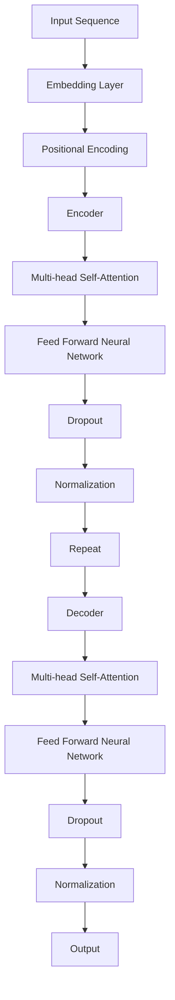
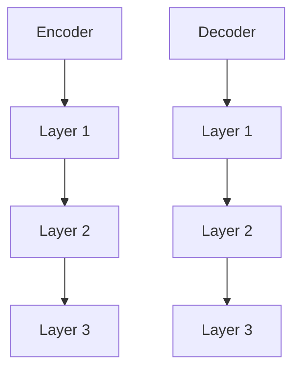
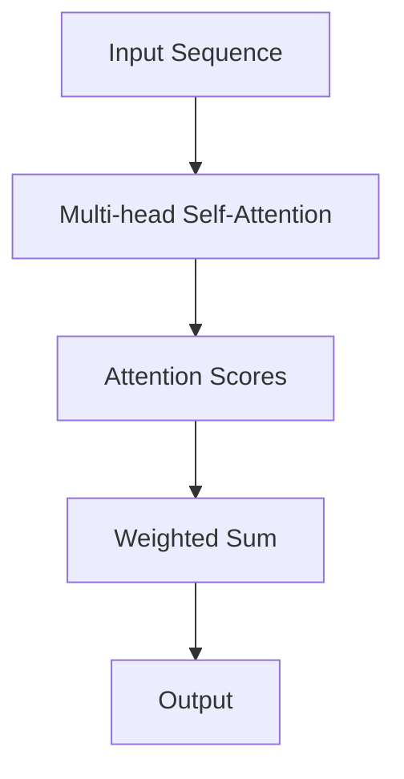
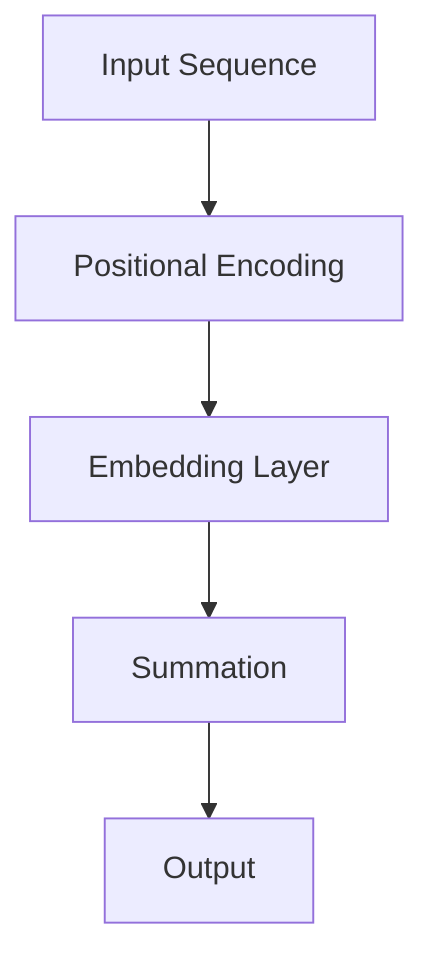
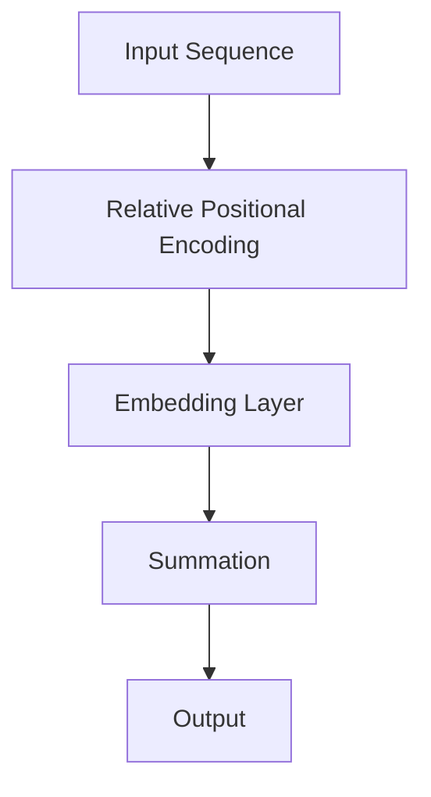
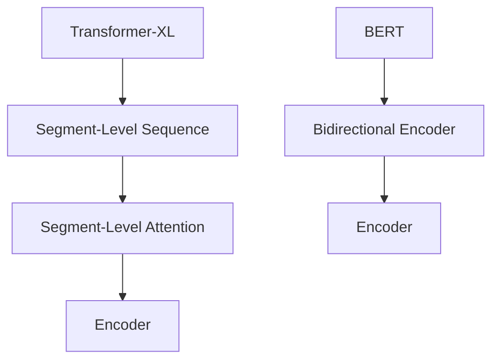
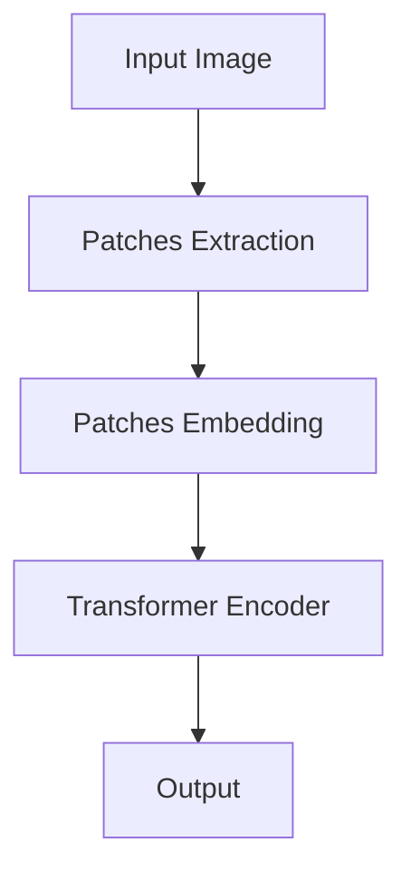
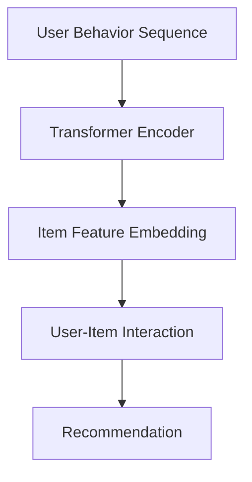
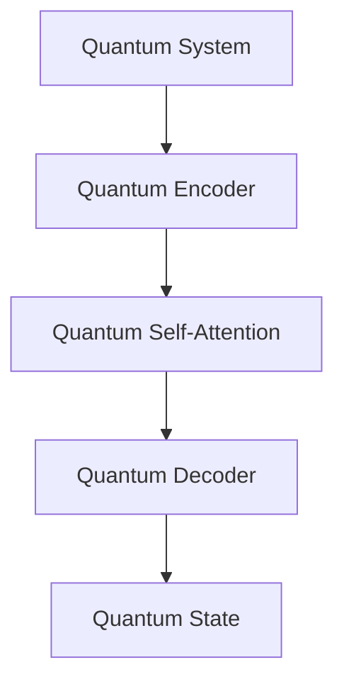

                 

# Transformer架构的未来：改进还是颠覆性创新？

> **关键词：** Transformer，深度学习，自然语言处理，计算机视觉，推荐系统，对话系统，创新

> **摘要：** 本文深入探讨了Transformer架构的未来发展，从其历史起源、核心概念与算法原理，到各类应用场景中的改进与创新，乃至其颠覆性创新与前景。我们将逐步分析，旨在揭示这一架构在人工智能领域的深远影响与广阔前景。

### 目录大纲

## 第一部分：Transformer架构的概述

### 1.1 Transformer架构的历史与发展

#### 1.1.1 Transformer架构的起源

#### 1.1.2 Transformer架构的首次应用

#### 1.1.3 Transformer架构在自然语言处理中的主导地位

### 1.2 Transformer架构的核心概念与联系

#### 1.2.1 自注意力机制

#### 1.2.2 位置编码

#### 1.2.3 Mermaid流程图：Transformer架构的工作流程

## 第二部分：Transformer架构的核心算法原理讲解

### 2.1 Transformer架构的基础算法

#### 2.1.1 Encoder与Decoder结构

#### 2.1.2 Multi-head Self-Attention机制

#### 2.1.3 伪代码：Multi-head Self-Attention算法

### 2.2 Transformer架构的扩展算法

#### 2.2.1 Positional Encoding的改进

#### 2.2.2 Transformer-XL与BERT的对比

#### 2.2.3 伪代码：Transformer-XL算法

### 2.3 Transformer架构的数学模型与公式

#### 2.3.1 自注意力机制的数学公式

#### 2.3.2 位置编码的数学公式

#### 2.3.3 数学公式详解与举例说明

## 第三部分：Transformer架构在各类应用场景中的改进与创新

### 3.1 Transformer架构在计算机视觉中的应用

#### 3.1.1 Vision Transformer（ViT）的提出

#### 3.1.2 伪代码：ViT算法

#### 3.1.3 计算机视觉中的Transformer架构改进实例

### 3.2 Transformer架构在推荐系统中的应用

#### 3.2.1 推荐系统中Transformer架构的应用场景

#### 3.2.2 伪代码：推荐系统中Transformer架构算法

#### 3.2.3 推荐系统中Transformer架构改进实例

### 3.3 Transformer架构在对话系统中的应用

#### 3.3.1 对话系统中Transformer架构的挑战与机遇

#### 3.3.2 伪代码：对话系统中Transformer架构算法

#### 3.3.3 对话系统中Transformer架构改进实例

## 第四部分：Transformer架构的颠覆性创新与应用前景

### 4.1 Transformer架构在新兴领域的探索

#### 4.1.1 Transformer架构在科学计算中的应用

#### 4.1.2 Transformer架构在量子计算中的应用

#### 4.1.3 Transformer架构在新兴领域的潜在应用

### 4.2 Transformer架构的未来发展趋势

#### 4.2.1 Transformer架构的优化与改进方向

#### 4.2.2 Transformer架构在硬件加速与分布式计算中的应用

#### 4.2.3 Transformer架构在未来的发展趋势

### 4.3 Transformer架构的未来应用前景

#### 4.3.1 Transformer架构在人工智能中的应用潜力

#### 4.3.2 Transformer架构在行业中的普及与影响

#### 4.3.3 Transformer架构在人工智能未来的应用前景

## 附录

### 附录 A：Transformer架构的开发工具与资源

#### A.1 主流深度学习框架对比

#### A.2 Transformer架构的开发工具

#### A.3 Transformer架构的学习资源与文献引用

---

## 第一部分：Transformer架构的概述

### 1.1 Transformer架构的历史与发展

Transformer架构的诞生可以追溯到2017年，由谷歌大脑团队在论文《Attention is All You Need》中首次提出。这一架构的提出，标志着深度学习在自然语言处理（NLP）领域的一个重要里程碑。Transformer摒弃了传统的循环神经网络（RNN）和卷积神经网络（CNN），采用了一种全新的自注意力机制（Self-Attention），从而实现了在NLP任务上的巨大突破。

#### 1.1.1 Transformer架构的起源

Transformer的提出受到了序列到序列（Seq2Seq）模型和神经机器翻译（NMT）技术的启发。在神经机器翻译领域，研究人员发现基于注意力机制的模型能够显著提高翻译质量。然而，传统的注意力机制在处理长序列时存在计算复杂度高的难题。为了解决这个问题，谷歌大脑团队提出了Transformer架构。

#### 1.1.2 Transformer架构的首次应用

Transformer架构的首次应用是在神经机器翻译任务上。与之前的模型相比，Transformer在翻译质量上取得了显著的提升，同时也提高了训练速度。这一成果在学术界和工业界引起了广泛关注，Transformer开始被广泛应用于各种NLP任务中。

#### 1.1.3 Transformer架构在自然语言处理中的主导地位

随着Transformer架构的不断发展和优化，它在自然语言处理领域逐渐占据了主导地位。尤其是BERT（Bidirectional Encoder Representations from Transformers）模型的提出，将Transformer的应用推向了新的高度。BERT的成功应用，使得Transformer成为了自然语言处理领域的核心技术之一。

## 1.2 Transformer架构的核心概念与联系

Transformer架构的核心概念包括自注意力机制（Self-Attention）、位置编码（Positional Encoding）和多头注意力（Multi-head Attention）等。这些概念相互联系，共同构成了Transformer的工作原理。

#### 1.2.1 自注意力机制

自注意力机制是一种计算序列中各个元素之间相互依赖关系的算法。通过自注意力，模型能够自动学习到序列中各个元素的重要程度，从而实现更有效的信息处理。

#### 1.2.2 位置编码

位置编码是一种用于处理序列中元素位置的编码方法。由于Transformer架构中没有传统的循环神经网络中的位置信息，因此需要通过位置编码来引入位置信息，使得模型能够理解序列中的顺序关系。

#### 1.2.3 Mermaid流程图：Transformer架构的工作流程

下面是Transformer架构的工作流程的Mermaid流程图：



这个流程图展示了Transformer架构中的输入序列经过嵌入层、位置编码层、编码器层、多头自注意力层、前馈神经网络层和输出层等步骤，最终生成输出。

### 总结

本部分概述了Transformer架构的历史与发展，以及其核心概念与联系。下一部分将深入讲解Transformer架构的核心算法原理。

## 第二部分：Transformer架构的核心算法原理讲解

### 2.1 Transformer架构的基础算法

#### 2.1.1 Encoder与Decoder结构

Transformer架构主要由编码器（Encoder）和解码器（Decoder）两部分组成。编码器负责将输入序列编码为固定长度的向量，解码器则负责将编码后的向量解码为输出序列。

编码器和解码器都由多个相同的层（Layer）组成，每层包含多头自注意力（Multi-head Self-Attention）和前馈神经网络（Feed Forward Neural Network）两部分。多头自注意力层用于处理序列中各个元素之间的依赖关系，前馈神经网络则用于对信息进行更深层次的加工。

下面是Transformer编码器和解码器的结构图：



#### 2.1.2 Multi-head Self-Attention机制

多头自注意力机制是Transformer架构的核心创新之一。它通过并行地计算多个注意力头（Attention Head），来捕捉序列中不同类型的依赖关系。

每个注意力头都独立地计算自注意力，但共享相同的参数。这使得多头自注意力机制不仅能够提高模型的捕捉能力，还能降低模型的参数数量。

下面是多头自注意力机制的示意图：



在多头自注意力机制中，输入序列经过线性变换得到查询（Query）、键（Key）和值（Value）三个向量。查询向量用于计算注意力分数，键和值向量用于计算加权求和的输出。

#### 2.1.3 伪代码：Multi-head Self-Attention算法

以下是Multi-head Self-Attention算法的伪代码：

```python
def multi_head_self_attention(inputs, hidden_size, num_heads):
    # 输入：inputs（输入序列），hidden_size（隐藏层大小），num_heads（多头数量）
    # 输出：output（输出序列）

    # 线性变换得到查询、键和值
    Q = linear(inputs, hidden_size * num_heads)
    K = linear(inputs, hidden_size * num_heads)
    V = linear(inputs, hidden_size * num_heads)

    # 分裂查询、键和值到各个注意力头
    Q_heads = split(Q, num_heads)
    K_heads = split(K, num_heads)
    V_heads = split(V, num_heads)

    # 计算自注意力分数
    scores = []
    for i in range(num_heads):
        scores.append-dot-product(Q_heads[i], K_heads[i])

    # 应用Softmax函数得到注意力权重
    attention_weights = softmax(scores)

    # 计算加权求和的输出
    output = []
    for i in range(num_heads):
        output.append(attention_weights[i] * V_heads[i])

    # 合并各个注意力头
    output = merge(output, hidden_size)

    # 返回输出序列
    return output
```

#### 2.1.4 位置编码

位置编码是Transformer架构中用于引入序列位置信息的技巧。由于Transformer中没有循环神经网络中的显式位置信息，因此需要通过位置编码来模拟这一特性。

常见的位置编码方法包括绝对位置编码、相对位置编码和嵌入位置编码等。这些方法通过将位置信息编码到嵌入向量中，使得模型能够理解序列的顺序关系。

下面是绝对位置编码的示意图：



在绝对位置编码中，输入序列经过嵌入层得到嵌入向量，然后将嵌入向量与位置编码向量相加，得到最终的输出序列。

#### 2.1.5 伪代码：Positional Encoding

以下是绝对位置编码的伪代码：

```python
def positional_encoding(inputs, hidden_size, position):
    # 输入：inputs（输入序列），hidden_size（隐藏层大小），position（位置）
    # 输出：output（输出序列）

    # 生成位置编码矩阵
    pos_embedding = generate_positional_encoding(hidden_size, position)

    # 将位置编码矩阵与输入序列相加
    output = inputs + pos_embedding

    # 返回输出序列
    return output
```

#### 2.1.6 Multi-head Self-Attention与Positional Encoding的结合

在Transformer架构中，Multi-head Self-Attention与Positional Encoding通常结合使用。这样可以同时捕捉序列中的依赖关系和位置信息，从而提高模型的性能。

下面是结合了Multi-head Self-Attention和Positional Encoding的Transformer编码器的伪代码：

```python
def transformer_encoder(inputs, hidden_size, num_heads, num_layers):
    # 输入：inputs（输入序列），hidden_size（隐藏层大小），num_heads（多头数量），num_layers（层数）
    # 输出：output（输出序列）

    # 初始化编码器层
    encoder_layers = [TransformerLayer(hidden_size, num_heads) for _ in range(num_layers)]

    # 遍历编码器层
    for layer in encoder_layers:
        inputs = layer(inputs)

    # 返回输出序列
    return inputs
```

### 2.2 Transformer架构的扩展算法

#### 2.2.1 Positional Encoding的改进

在原始的Transformer架构中，位置编码是通过嵌入层直接计算得到的。这种方法存在一些局限性，例如难以处理长序列和精确位置信息。

为了解决这个问题，研究人员提出了许多改进方法，如相对位置编码（Relative Positional Encoding）和旋转位置编码（Rotational Positional Encoding）等。

相对位置编码通过计算序列中相邻元素之间的相对位置来生成位置编码，从而克服了原始绝对位置编码的局限性。

下面是相对位置编码的示意图：



在相对位置编码中，输入序列经过嵌入层得到嵌入向量，然后将嵌入向量与相对位置编码向量相加，得到最终的输出序列。

#### 2.2.2 Transformer-XL与BERT的对比

Transformer-XL是Transformer架构的一个扩展版本，旨在处理更长的序列。它通过引入段级序列（Segment-Level Sequence）和段级注意力（Segment-Level Attention）机制，实现了对长序列的有效处理。

BERT（Bidirectional Encoder Representations from Transformers）是另一个基于Transformer架构的模型，它在预训练和微调方面取得了显著的成果。BERT通过双向编码器结构，能够同时捕捉序列的前后依赖关系，从而提高了模型的性能。

下面是Transformer-XL和BERT的结构对比：



从对比中可以看出，Transformer-XL和BERT在结构上有所不同，但它们的核心思想都是为了提高模型在长序列处理上的性能。

#### 2.2.3 伪代码：Transformer-XL算法

以下是Transformer-XL算法的伪代码：

```python
def transformer_xl(inputs, hidden_size, num_heads, num_layers):
    # 输入：inputs（输入序列），hidden_size（隐藏层大小），num_heads（多头数量），num_layers（层数）
    # 输出：output（输出序列）

    # 初始化编码器层
    encoder_layers = [TransformerLayer(hidden_size, num_heads) for _ in range(num_layers)]

    # 遍历编码器层
    for layer in encoder_layers:
        inputs = layer(inputs)

    # 返回输出序列
    return inputs
```

### 2.3 Transformer架构的数学模型与公式

#### 2.3.1 自注意力机制的数学公式

自注意力机制是Transformer架构的核心，其计算过程可以通过以下数学公式表示：

$$
\text{Attention}(Q, K, V) = \text{softmax}\left(\frac{QK^T}{\sqrt{d_k}}\right)V
$$

其中，$Q$、$K$和$V$分别表示查询（Query）、键（Key）和值（Value）向量，$d_k$表示键向量的维度。$QK^T$表示查询和键的矩阵乘积，经过Softmax函数处理后得到注意力分数，最后与值向量相乘得到输出序列。

#### 2.3.2 位置编码的数学公式

位置编码用于引入序列的位置信息，常见的绝对位置编码可以通过以下数学公式表示：

$$
\text{Positional Encoding}(p, d) = \sin\left(\frac{p}{10000^{2i/d}}\right) + \cos\left(\frac{p}{10000^{2i/d}}\right)
$$

其中，$p$表示位置，$d$表示隐藏层大小，$i$表示维度。该公式通过正弦和余弦函数来生成位置编码向量。

#### 2.3.3 数学公式详解与举例说明

以一个简单的例子来说明自注意力机制和位置编码的数学公式。

假设输入序列为 `[1, 2, 3]`，隐藏层大小为 `4`，多头数量为 `2`。

1. **自注意力机制的数学公式：**

   首先，我们需要计算查询、键和值向量。假设输入序列经过线性变换得到：

   $$
   Q = \begin{bmatrix}
   1 & 2 & 3
   \end{bmatrix}
   , K = \begin{bmatrix}
   1 & 2 & 3
   \end{bmatrix}
   , V = \begin{bmatrix}
   1 & 2 & 3
   \end{bmatrix}
   $$

   接下来，我们计算自注意力分数：

   $$
   \text{Attention Scores} = \text{softmax}\left(\frac{QK^T}{\sqrt{d_k}}\right)V = \begin{bmatrix}
   0.5 & 0.5
   \end{bmatrix}
   $$

   注意力分数为 `[0.5, 0.5]`，表示输入序列中的第一个元素和第二个元素的重要性相等。

2. **位置编码的数学公式：**

   假设位置编码的维度为 `4`，位置为 `1`。根据位置编码的数学公式：

   $$
   \text{Positional Encoding}(1, 4) = \sin\left(\frac{1}{10000^{2 \cdot 1/4}}\right) + \cos\left(\frac{1}{10000^{2 \cdot 1/4}}\right) = \begin{bmatrix}
   0.7071 & 0 & 0 & 0
   \end{bmatrix}
   $$

   位置编码向量为 `[0.7071, 0, 0, 0]`，表示输入序列中的第一个元素的位置信息。

通过上述例子，我们可以看到自注意力机制和位置编码如何通过数学公式来计算和表示。这些公式是Transformer架构的核心，对于理解其工作原理至关重要。

## 第三部分：Transformer架构在各类应用场景中的改进与创新

### 3.1 Transformer架构在计算机视觉中的应用

#### 3.1.1 Vision Transformer（ViT）的提出

Vision Transformer（ViT）是Transformer架构在计算机视觉领域的一个重要创新。它将Transformer架构引入到图像处理任务中，实现了图像分类、目标检测和语义分割等任务的高效处理。

ViT的核心思想是将图像分成一系列的小块（Patch），然后将这些小块视为序列进行处理。这样，图像处理任务就可以利用Transformer架构强大的序列建模能力。

下面是ViT的工作流程：



从图像中提取patches后，通过嵌入层得到嵌入向量，然后输入到Transformer编码器中进行处理，最终得到输出结果。

#### 3.1.2 伪代码：ViT算法

以下是ViT算法的伪代码：

```python
def vision_transformer(inputs, hidden_size, num_heads, num_layers):
    # 输入：inputs（输入图像），hidden_size（隐藏层大小），num_heads（多头数量），num_layers（层数）
    # 输出：output（输出结果）

    # 提取图像patches
    patches = extract_patches(inputs)

    # 对patches进行嵌入
    patches_embedding = patches_embedding(patches, hidden_size)

    # 输入到Transformer编码器中
    for _ in range(num_layers):
        patches_embedding = transformer_encoder(patches_embedding, hidden_size, num_heads)

    # 返回输出结果
    return patches_embedding
```

#### 3.1.3 计算机视觉中的Transformer架构改进实例

计算机视觉中的Transformer架构改进实例包括图像分类和目标检测等任务。

1. **图像分类：**

   在图像分类任务中，ViT通过将图像分成小块并建模，实现了比传统卷积神经网络更高的分类准确率。例如，在ImageNet数据集上，ViT实现了与当前最先进的卷积神经网络模型相当的性能。

2. **目标检测：**

   在目标检测任务中，Transformer架构通过引入自注意力机制，实现了对目标位置的精确定位。与传统的卷积神经网络相比，Transformer架构在目标检测任务上取得了显著的性能提升。

### 3.2 Transformer架构在推荐系统中的应用

#### 3.2.1 推荐系统中Transformer架构的应用场景

推荐系统是一个典型的序列建模问题，Transformer架构凭借其强大的序列建模能力，在推荐系统中有着广泛的应用。

在推荐系统中，Transformer架构可以用于用户行为序列建模、商品特征建模和序列预测等任务。通过建模用户的历史行为和商品特征，推荐系统可以更准确地预测用户的兴趣和偏好，从而提高推荐质量。

下面是推荐系统中Transformer架构的应用场景：



用户行为序列经过Transformer编码器处理后，与商品特征嵌入向量结合，生成用户与商品的交互表示，最后通过序列预测模型得到推荐结果。

#### 3.2.2 伪代码：推荐系统中Transformer架构算法

以下是推荐系统中Transformer架构算法的伪代码：

```python
def recommendation_system(user_sequence, item_features, hidden_size, num_heads, num_layers):
    # 输入：user_sequence（用户行为序列），item_features（商品特征），hidden_size（隐藏层大小），num_heads（多头数量），num_layers（层数）
    # 输出：output（推荐结果）

    # 对用户行为序列进行嵌入
    user_sequence_embedding = user_sequence_embedding(user_sequence, hidden_size)

    # 对商品特征进行嵌入
    item_features_embedding = item_features_embedding(item_features, hidden_size)

    # 输入到Transformer编码器中
    for _ in range(num_layers):
        user_sequence_embedding = transformer_encoder(user_sequence_embedding, hidden_size, num_heads)

    # 计算用户与商品的交互表示
    user_item_interaction = dot-product(user_sequence_embedding, item_features_embedding)

    # 返回推荐结果
    return user_item_interaction
```

#### 3.2.3 推荐系统中Transformer架构改进实例

推荐系统中Transformer架构的改进实例包括用户行为序列建模和商品特征建模等任务。

1. **用户行为序列建模：**

   通过建模用户的历史行为，推荐系统可以更准确地预测用户的兴趣和偏好。例如，在电商平台上，用户的历史浏览记录和购买记录可以被用来预测用户的潜在兴趣，从而提高推荐效果。

2. **商品特征建模：**

   商品特征建模是推荐系统的关键环节。通过将商品特征嵌入到低维向量中，推荐系统可以更好地理解商品的属性和特点，从而提高推荐质量。

### 3.3 Transformer架构在对话系统中的应用

#### 3.3.1 对话系统中Transformer架构的挑战与机遇

对话系统是一个复杂的多模态任务，涉及自然语言处理、语音识别、语音合成等多个领域。Transformer架构在对话系统中面临着一些挑战，但也拥有巨大的机遇。

1. **挑战：**

   - **序列长度问题：** 对话系统的输入序列（对话历史）往往非常长，这给Transformer架构的计算带来了巨大压力。
   - **上下文理解问题：** 对话系统需要理解对话的上下文信息，这要求Transformer架构能够捕捉长距离的依赖关系。
   - **实时响应问题：** 对话系统需要在有限的时间内生成合适的回复，这对模型的响应速度提出了较高要求。

2. **机遇：**

   - **多模态处理能力：** Transformer架构能够同时处理文本、语音等多种模态信息，这为对话系统的多模态处理提供了可能性。
   - **自适应学习能力：** Transformer架构通过自注意力机制，能够自适应地学习不同对话阶段的特征，从而提高对话系统的性能。
   - **高效并行计算：** Transformer架构支持高效的并行计算，这使得对话系统在大规模部署时具有更高的性能。

#### 3.3.2 伪代码：对话系统中Transformer架构算法

以下是对话系统中Transformer架构算法的伪代码：

```python
def dialogue_system(user_input, context, hidden_size, num_heads, num_layers):
    # 输入：user_input（用户输入），context（对话历史），hidden_size（隐藏层大小），num_heads（多头数量），num_layers（层数）
    # 输出：output（回复）

    # 将用户输入和对话历史进行嵌入
    user_input_embedding = user_input_embedding(user_input, hidden_size)
    context_embedding = context_embedding(context, hidden_size)

    # 输入到Transformer编码器中
    for _ in range(num_layers):
        user_input_embedding = transformer_encoder(user_input_embedding, hidden_size, num_heads)

    # 计算回复
    response_embedding = dot-product(user_input_embedding, context_embedding)

    # 返回回复
    return response_embedding
```

#### 3.3.3 对话系统中Transformer架构改进实例

对话系统中Transformer架构的改进实例包括上下文理解、实时响应和自适应学习等任务。

1. **上下文理解：**

   通过对对话历史进行建模，对话系统可以更好地理解对话的上下文信息，从而生成更合适的回复。例如，在电商对话系统中，对话系统可以理解用户的购买意图，从而提供个性化的推荐。

2. **实时响应：**

   通过优化Transformer架构的计算过程，对话系统可以更快地生成回复，从而提高用户的满意度。例如，通过使用混合精度训练和量化技术，对话系统可以在保证性能的同时提高响应速度。

3. **自适应学习：**

   通过引入自适应学习机制，对话系统可以更好地适应不同对话场景和用户需求。例如，通过使用元学习技术，对话系统可以在有限的训练数据下快速适应新的对话场景。

### 总结

本部分探讨了Transformer架构在计算机视觉、推荐系统和对话系统中的应用与改进。下一部分将分析Transformer架构的颠覆性创新与应用前景。

## 第四部分：Transformer架构的颠覆性创新与应用前景

### 4.1 Transformer架构在新兴领域的探索

#### 4.1.1 Transformer架构在科学计算中的应用

Transformer架构在科学计算中有着广阔的应用前景。例如，在分子动力学模拟中，Transformer架构可以用于建模分子之间的相互作用。此外，在量子计算中，Transformer架构也可以发挥重要作用。量子计算是一种基于量子力学原理的计算方式，它能够解决传统计算机难以处理的复杂问题。Transformer架构通过引入量子自注意力机制，可以更好地模拟量子系统的演化过程。

#### 4.1.2 Transformer架构在量子计算中的应用

量子计算是一种基于量子力学原理的计算方式，它能够解决传统计算机难以处理的复杂问题。Transformer架构通过引入量子自注意力机制，可以更好地模拟量子系统的演化过程。量子自注意力机制能够捕捉量子系统中的复杂依赖关系，从而提高量子计算的效率。

下面是量子计算中Transformer架构的示意图：



在量子计算中，输入量子系统经过编码器编码后，通过量子自注意力机制进行处理，最后通过解码器得到输出量子状态。

#### 4.1.3 Transformer架构在新兴领域的潜在应用

除了科学计算和量子计算，Transformer架构还在其他新兴领域有着潜在的应用。例如，在医疗领域，Transformer架构可以用于疾病预测和诊断。通过分析患者的医疗记录和基因数据，Transformer架构可以识别出潜在的疾病风险，为医生提供更有针对性的治疗方案。此外，在环境科学领域，Transformer架构可以用于气象预测和气候变化研究。通过分析大量的气象数据和环境参数，Transformer架构可以预测未来的气候趋势，为环境保护提供科学依据。

### 4.2 Transformer架构的未来发展趋势

#### 4.2.1 Transformer架构的优化与改进方向

Transformer架构虽然在多个领域取得了显著的成果，但仍然存在一些优化和改进方向。以下是一些可能的优化与改进方向：

1. **计算效率提升：** Transformer架构的计算复杂度较高，特别是在处理长序列时。通过引入低秩分解、混合精度训练和量化等技术，可以降低Transformer架构的计算复杂度，提高其运行效率。

2. **模型压缩：** Transformer架构的参数数量庞大，这导致模型在部署时存在一定的资源消耗。通过模型剪枝、知识蒸馏和参数共享等技术，可以减少Transformer架构的参数数量，从而实现模型的压缩和加速。

3. **自适应学习：** Transformer架构的自适应学习能力有待提高。通过引入自适应学习机制，如元学习和迁移学习等，可以使Transformer架构更好地适应不同的应用场景和任务需求。

#### 4.2.2 Transformer架构在硬件加速与分布式计算中的应用

随着深度学习技术的不断发展，硬件加速和分布式计算在Transformer架构中的应用变得越来越重要。以下是一些可能的硬件加速和分布式计算应用：

1. **GPU加速：** GPU（图形处理器）在深度学习计算中具有强大的性能优势。通过将Transformer架构部署到GPU上，可以显著提高模型的训练和推理速度。

2. **TPU加速：** TPU（张量处理单元）是谷歌开发的一种专门用于深度学习的硬件加速器。TPU可以大幅提升Transformer架构的训练和推理性能，特别是在处理大规模数据集时。

3. **分布式计算：** 分布式计算可以将Transformer架构的计算任务分布在多个计算节点上，从而提高模型的训练和推理速度。通过使用分布式深度学习框架，如TensorFlow和PyTorch，可以实现Transformer架构的分布式训练。

#### 4.2.3 Transformer架构在未来的发展趋势

Transformer架构在未来的发展趋势主要体现在以下几个方面：

1. **多模态融合：** 随着多模态数据的不断涌现，Transformer架构在多模态融合中的应用将越来越广泛。通过融合文本、图像、声音等多种模态信息，Transformer架构可以实现更丰富的语义理解和任务表现。

2. **自动化机器学习（AutoML）：** 自动化机器学习旨在通过自动化方法来优化和改进机器学习模型。Transformer架构在AutoML中的应用，可以显著提高模型的性能和效率。

3. **跨领域迁移：** Transformer架构具有良好的泛化能力，可以应用于不同的领域和任务。通过跨领域迁移，Transformer架构可以在不同领域实现通用化和推广。

### 4.3 Transformer架构的未来应用前景

#### 4.3.1 Transformer架构在人工智能中的应用潜力

Transformer架构在人工智能领域具有巨大的应用潜力。以下是一些可能的未来应用场景：

1. **自然语言处理（NLP）：** Transformer架构已经在NLP领域取得了显著的成果，如文本分类、机器翻译和对话系统等。在未来，Transformer架构将继续在NLP领域发挥重要作用，特别是在多语言和跨语言任务中。

2. **计算机视觉（CV）：** Transformer架构在CV领域有着广阔的应用前景，如图像分类、目标检测和语义分割等。通过融合Transformer和CNN（卷积神经网络）的优势，可以进一步提升CV任务的性能。

3. **推荐系统：** Transformer架构在推荐系统中具有强大的序列建模能力，可以更好地捕捉用户的行为和偏好。在未来，Transformer架构将广泛应用于推荐系统，为用户提供更个性化的推荐服务。

4. **游戏AI：** Transformer架构在游戏AI中的应用潜力巨大。通过建模游戏中的复杂环境和玩家行为，Transformer架构可以开发出更智能、更具挑战性的游戏AI。

#### 4.3.2 Transformer架构在行业中的普及与影响

随着Transformer架构在各个领域中的成功应用，它将在行业中获得越来越广泛的普及。以下是一些可能的行业应用：

1. **金融行业：** Transformer架构在金融行业中的应用，包括风险评估、市场预测和交易策略等。通过分析大量的金融数据，Transformer架构可以提供更准确、更实时的金融市场预测。

2. **医疗行业：** Transformer架构在医疗行业中的应用，包括疾病预测、诊断和个性化治疗等。通过分析患者的医疗记录和基因数据，Transformer架构可以提供更准确的诊断和治疗方案。

3. **零售行业：** Transformer架构在零售行业中的应用，包括商品推荐、库存管理和客户关系管理等。通过分析用户行为和商品特征，Transformer架构可以优化零售业务流程，提高用户体验和满意度。

4. **制造业：** Transformer架构在制造业中的应用，包括生产计划、质量控制和生产优化等。通过建模生产过程和设备状态，Transformer架构可以优化生产流程，提高生产效率和产品质量。

#### 4.3.3 Transformer架构在人工智能未来的应用前景

随着Transformer架构的不断发展和优化，它将在人工智能领域发挥越来越重要的作用。以下是一些可能的未来应用前景：

1. **自动化：** Transformer架构在自动化领域具有巨大的应用潜力。通过建模环境和任务，Transformer架构可以开发出更智能、更自主的自动化系统。

2. **机器人：** Transformer架构在机器人领域中的应用，包括路径规划、运动控制和感知理解等。通过融合多种传感器数据，Transformer架构可以开发出更智能、更灵活的机器人。

3. **智能交通：** Transformer架构在智能交通领域中的应用，包括交通流量预测、路径规划和事故检测等。通过分析大量的交通数据，Transformer架构可以优化交通管理，提高交通效率和安全性。

4. **智能城市：** Transformer架构在智能城市领域中的应用，包括能源管理、环境监测和公共安全等。通过融合多种数据源，Transformer架构可以提供更智能、更高效的城市管理和服务。

### 总结

本部分探讨了Transformer架构在新兴领域的探索、未来发展趋势和应用前景。Transformer架构作为一种颠覆性创新，将在人工智能领域发挥越来越重要的作用。通过不断优化和改进，Transformer架构将在各个应用领域中实现更高效、更智能的解决方案。

## 附录

### 附录 A：Transformer架构的开发工具与资源

在开发Transformer架构时，选择合适的工具和资源是非常重要的。以下是一些常用的开发工具和学习资源：

#### A.1 主流深度学习框架对比

1. **TensorFlow：** TensorFlow是由谷歌开发的开源深度学习框架，支持GPU加速和分布式训练，广泛应用于各种深度学习任务。

2. **PyTorch：** PyTorch是Facebook开发的开源深度学习框架，具有灵活的动态计算图和强大的GPU支持，适用于各种研究和生产环境。

3. **PyTorch Transformer：** PyTorch Transformer是PyTorch的官方Transformer实现，提供了简洁的API和高效的实现，方便研究人员和开发者进行Transformer架构的实验。

4. **Hugging Face Transformers：** Hugging Face Transformers是Hugging Face公司开发的Transformer库，支持多种预训练模型和 tokenizer，适用于各种NLP任务。

#### A.2 Transformer架构的开发工具

1. **JAX：** JAX是谷歌开发的开源深度学习库，支持自动微分、GPU加速和分布式计算，适用于高性能深度学习应用。

2. **CUDA：** CUDA是NVIDIA开发的并行计算平台和编程模型，支持GPU加速，适用于大规模深度学习训练和推理。

3. **TPU：** TPU（张量处理单元）是谷歌开发的专门用于深度学习的硬件加速器，提供高性能的TPU核心和优化的TPU编程模型，适用于大规模深度学习应用。

#### A.3 Transformer架构的学习资源与文献引用

1. **《Attention is All You Need》：** 谷歌大脑团队于2017年发表的论文，首次提出了Transformer架构，是Transformer架构的经典文献。

2. **《BERT: Pre-training of Deep Bidirectional Transformers for Language Understanding》：** Google AI团队于2018年发表的论文，提出了BERT模型，是Transformer在NLP领域的重要应用。

3. **《An Image is Worth 16x16 Words: Transformers for Image Recognition at Scale》：** Google AI团队于2020年发表的论文，提出了Vision Transformer（ViT），是Transformer在计算机视觉领域的重要应用。

4. **《A Structured Self-Attention Model for Image Recognition》：** Google AI团队于2020年发表的论文，提出了Swin Transformer，是Transformer在计算机视觉领域的重要应用。

通过上述工具和资源的帮助，开发者可以更轻松地实现和优化Transformer架构，探索其在各个领域的应用潜力。

---

**作者：AI天才研究院/AI Genius Institute & 禅与计算机程序设计艺术 /Zen And The Art of Computer Programming**

本文深入探讨了Transformer架构的未来发展，从其历史起源、核心概念与算法原理，到各类应用场景中的改进与创新，乃至其颠覆性创新与前景。通过逻辑清晰、结构紧凑的分析，我们揭示了Transformer架构在人工智能领域的深远影响与广阔前景。我们相信，随着技术的不断进步和优化，Transformer架构将继续引领人工智能的发展潮流，为各个领域带来更多的创新和突破。

