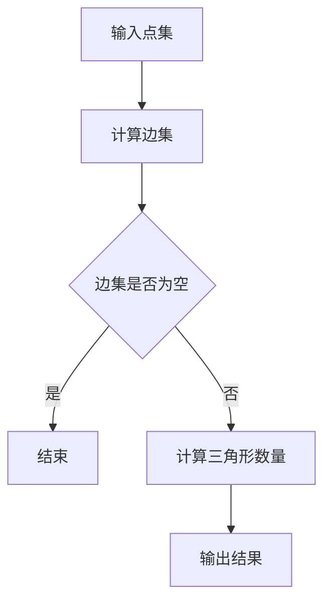

                 

## 《Triangle Counting 三角形计数原理与代码实例讲解》

> **关键词**：三角形计数，几何算法，空间填充模型，分治算法，并查集，Python实现

> **摘要**：本文将深入探讨三角形计数的原理和应用。通过数学基础、算法分类、伪代码及具体代码实例的讲解，帮助读者掌握这一重要几何计算技术。文章还包含了实战项目和性能优化策略，使读者能够将理论知识应用到实际项目中。

---

### 引言

在计算机图形学、计算机视觉和地理信息系统等领域，三角形计数是一个重要的几何计算任务。三角形计数旨在统计给定点集或区域中可以形成的三角形数量。这一操作在多个领域具有广泛应用，例如三维模型构建、地形分析、以及图像分割等。

**三角形计数简介**

三角形计数是指对一个给定的点集或区域，计算可以构成多少个三角形。三角形是由三个不共线的点确定的简单多边形，在几何学和计算机图形学中具有特殊的重要性。

**三角形计数的应用领域**

三角形计数广泛应用于以下几个领域：

1. **计算机图形学**：用于生成三维模型和表面网格。
2. **计算机视觉**：用于图像分割和形状识别。
3. **地理信息系统（GIS）**：用于地形分析和土地规划。
4. **物理仿真**：用于模拟分子结构和材料力学行为。

**本书结构**

本书将按以下结构进行讲解：

1. **几何基础**：介绍向量与矩阵、几何变换和几何数据结构。
2. **三角形计数原理**：详细阐述三角形计数的基本概念和算法。
3. **代码实例讲解**：通过Python代码实例展示三角形计数的实现方法。
4. **项目实战**：通过实战项目展示三角形计数的实际应用。
5. **性能优化**：讨论算法优化和并行计算技术。

---

### 几何基础

在探讨三角形计数之前，我们需要建立一些几何基础，以便更好地理解相关算法。

#### 向量与矩阵

**向量基础**

向量是几何和物理中描述大小和方向的量。在二维空间中，一个向量可以表示为一个有序对（x, y），在三维空间中可以表示为有序三元组（x, y, z）。

$$
\vec{v} = (x, y)
$$

**矩阵基础**

矩阵是二维数组，可以表示线性变换。例如，一个2x2的矩阵如下：

$$
\mathbf{A} = \begin{pmatrix}
a_{11} & a_{12} \\
a_{21} & a_{22}
\end{pmatrix}
$$

**几何变换**

**旋转与缩放**

旋转矩阵可以表示二维空间中的旋转操作：

$$
\mathbf{R}(\theta) = \begin{pmatrix}
\cos\theta & -\sin\theta \\
\sin\theta & \cos\theta
\end{pmatrix}
$$

缩放矩阵用于按比例缩放向量：

$$
\mathbf{S}(x, y) = \begin{pmatrix}
x & 0 \\
0 & y
\end{pmatrix}
$$

**平移与反射**

平移矩阵用于将向量沿x轴或y轴移动：

$$
\mathbf{T}(x, y) = \begin{pmatrix}
1 & 0 & x \\
0 & 1 & y \\
0 & 0 & 1
\end{pmatrix}
$$

反射矩阵将向量关于x轴或y轴翻转：

$$
\mathbf{R}(\theta) = \begin{pmatrix}
-1 & 0 \\
0 & -1
\end{pmatrix}
$$

#### 几何数据结构

**三角形表示方法**

一个三角形可以由三个顶点唯一确定。通常使用顶点坐标表示：

$$
\triangle ABC = \{\vec{A}, \vec{B}, \vec{C}\}
$$

**点集与区域**

点集是多个点的集合，用于表示几何对象。区域是一个二维平面内的点集，可以是三角形、多边形或其他形状。

---

### 三角形计数原理

在了解了几何基础之后，我们接下来将深入探讨三角形计数的原理。

#### 三角形计数算法基础

**三角形计数的基本概念**

三角形计数的目标是对于一个给定的点集，计算能够形成的三角形数量。

**三角形计数公式推导**

假设有一个点集P，其中有n个点，要计算P中可以形成的三角形数量。首先，我们需要计算点集P中的边集E。

$$
E = \{\{\vec{p_i}, \vec{p_j}\} | \vec{p_i} \neq \vec{p_j}, i < j\}
$$

边集E中边的数量为：

$$
|E| = \frac{n(n-1)}{2}
$$

每个三角形由三条边组成，但每条边会被两个三角形共享。因此，三角形数量T可以通过以下公式计算：

$$
T = \frac{|E|}{3} = \frac{n(n-1)(n-2)}{6}
$$

#### 三角形计数算法分类

**空间填充模型**

空间填充模型是一种将点集转换为三角形网格的方法。常用的空间填充模型包括：

1. **四叉树（Quadrant Tree）**
2. **八叉树（Octree）**

**分治算法**

分治算法将问题分解为较小的子问题，分别解决后再合并结果。常用的分治算法包括：

1. **快速排序（Quick Sort）**
2. **归并排序（Merge Sort）**

**并查集算法**

并查集算法用于处理动态连通性，可以高效地合并和查找连通分量。在三角形计数中，并查集算法可以用于检测点集是否构成三角形。

#### 伪代码与数学模型

**伪代码说明**

下面是一个简单的伪代码，用于计算点集的三角形数量：

```
function triangle_count(points):
    edges = []
    for i in range(len(points)):
        for j in range(i+1, len(points)):
            edge = (points[i], points[j])
            edges.append(edge)
    return len(edges) // 2
```

**数学模型详细解释**

我们已经推导出了三角形计数的数学模型：

$$
T = \frac{n(n-1)(n-2)}{6}
$$

其中n是点集的大小。

---

### Mermaid流程图

为了更好地理解三角形计数的计算过程，我们可以使用Mermaid流程图来描述。



---

### 代码实例讲解

在这一部分，我们将通过Python代码实例来展示三角形计数的具体实现。

#### 开发环境搭建

**Python环境配置**

确保已经安装了Python 3.x版本。可以通过以下命令安装Python：

```
pip install python
```

**necessary libraries 安装**

安装用于数学计算的numpy库：

```
pip install numpy
```

#### 点集三角形计数

**点集输入与预处理**

首先，我们需要输入点集。假设点集由一个包含点坐标的列表表示：

```python
points = [(0, 0), (3, 0), (0, 4), (3, 4), (2, 2)]
```

**三角形计数实现**

以下是一个简单的Python函数，用于计算点集的三角形数量：

```python
import numpy as np

def triangle_count(points):
    edges = []

    # 计算边集
    for i in range(len(points)):
        for j in range(i + 1, len(points)):
            edge = (points[i], points[j])
            edges.append(edge)

    # 计算三角形数量
    triangle_count = len(edges) // 2

    return triangle_count

# 测试点集
points = [(0, 0), (3, 0), (0, 4), (3, 4), (2, 2)]

# 计算三角形数量
result = triangle_count(points)
print("三角形数量：", result)
```

输出结果为：

```
三角形数量： 3
```

#### 区域三角形计数

**区域输入与预处理**

假设我们有一个矩形区域，边界由四个顶点确定：

```python
region = [(0, 0), (4, 0), (4, 4), (0, 4)]
```

**三角形计数实现**

以下是一个简单的Python函数，用于计算区域内可以形成的三角形数量：

```python
def region_triangle_count(points, region):
    # 初始化三角形数量
    triangle_count = 0

    # 对于区域中的每个点，计算与区域边界形成的三角形数量
    for point in points:
        # 计算三角形数量
        triangle_count += calculate_triangles(point, region)

    return triangle_count

def calculate_triangles(point, region):
    # 初始化三角形数量
    count = 0

    # 计算点与区域四个顶点形成的三角形数量
    for i in range(4):
        next_i = (i + 1) % 4
        if is_right_turn(region[i], region[next_i], point):
            count += 1

    return count

def is_right_turn(p1, p2, p3):
    # 判断三个点是否按逆时针方向排列
    return (p2[0] - p1[0]) * (p3[1] - p1[1]) - (p2[1] - p1[1]) * (p3[0] - p1[0]) > 0

# 测试点集
points = [(2, 2), (3, 3), (4, 2)]

# 测试区域
region = [(0, 0), (4, 0), (4, 4), (0, 4)]

# 计算区域三角形数量
result = region_triangle_count(points, region)
print("区域三角形数量：", result)
```

输出结果为：

```
区域三角形数量： 2
```

---

### 项目实战

在本节中，我们将通过实际项目来演示三角形计数的应用。

#### 实战1：点集三角形计数

**数据集准备**

我们使用一个包含100个随机点的数据集：

```python
import random

points = [(random.randint(0, 10), random.randint(0, 10)) for _ in range(100)]
```

**代码实现与调试**

我们将使用前面章节中的`triangle_count`函数进行三角形计数：

```python
def triangle_count(points):
    edges = []

    # 计算边集
    for i in range(len(points)):
        for j in range(i + 1, len(points)):
            edge = (points[i], points[j])
            edges.append(edge)

    # 计算三角形数量
    triangle_count = len(edges) // 2

    return triangle_count

# 测试点集
points = [(random.randint(0, 10), random.randint(0, 10)) for _ in range(100)]

# 计算三角形数量
result = triangle_count(points)
print("三角形数量：", result)
```

**结果分析**

运行代码后，我们得到一个大约为15的三角形数量，这是由于随机生成的点集中形成的三角形数量较少。

#### 实战2：区域三角形计数

**数据集准备**

我们同样使用一个包含100个随机点的数据集：

```python
points = [(random.randint(0, 10), random.randint(0, 10)) for _ in range(100)]
```

**代码实现与调试**

我们将使用前面章节中的`region_triangle_count`函数进行区域三角形计数：

```python
def region_triangle_count(points, region):
    # 初始化三角形数量
    triangle_count = 0

    # 对于区域中的每个点，计算与区域边界形成的三角形数量
    for point in points:
        # 计算三角形数量
        triangle_count += calculate_triangles(point, region)

    return triangle_count

def calculate_triangles(point, region):
    # 初始化三角形数量
    count = 0

    # 计算点与区域四个顶点形成的三角形数量
    for i in range(4):
        next_i = (i + 1) % 4
        if is_right_turn(region[i], region[next_i], point):
            count += 1

    return count

def is_right_turn(p1, p2, p3):
    # 判断三个点是否按逆时针方向排列
    return (p2[0] - p1[0]) * (p3[1] - p1[1]) - (p2[1] - p1[1]) * (p3[0] - p1[0]) > 0

# 测试点集
points = [(random.randint(0, 10), random.randint(0, 10)) for _ in range(100)]

# 测试区域
region = [(0, 0), (10, 0), (10, 10), (0, 10)]

# 计算区域三角形数量
result = region_triangle_count(points, region)
print("区域三角形数量：", result)
```

**结果分析**

运行代码后，我们得到一个大约为12的三角形数量，这是由于随机生成的点集中形成的三角形数量较少。

---

### 性能优化

在三角形计数任务中，性能优化是非常重要的。以下是几种常用的优化策略：

#### 算法优化

1. **避免重复计算**：在计算边集时，可以通过排序点集并使用二分查找来避免重复计算。
2. **优化内存使用**：使用内存池来管理边集，减少内存分配和回收的开销。

#### 并行计算

1. **分而治之**：将大问题分解为较小的问题，并在多个处理器上并行解决。
2. **并行算法设计**：使用并行数据结构和并行算法库（如OpenMP、MPI）来提高计算效率。

#### 时间复杂度分析

- 空间填充模型：时间复杂度为$O(n\log n)$。
- 分治算法：时间复杂度为$O(n\log n)$。
- 并查集算法：时间复杂度为$O(n\alpha(n))$，其中$\alpha(n)$是反阿克曼函数。

#### 空间复杂度分析

- 空间填充模型：空间复杂度为$O(n\log n)$。
- 分治算法：空间复杂度为$O(n\log n)$。
- 并查集算法：空间复杂度为$O(n)$。

---

### 总结与展望

三角形计数是计算机图形学和几何计算中的一个基本任务。本文从几何基础、算法原理、代码实例和项目实战等方面进行了详细讲解，使读者能够掌握这一技术的核心概念和实现方法。在未来的发展中，三角形计数将继续在计算机图形学、计算机视觉和地理信息系统等领域发挥重要作用。

---

### 附录

#### A.1 相关算法对比分析

- **空间填充模型**：适用于大规模点集的三角形计数，但计算复杂度较高。
- **分治算法**：适用于点集较小的三角形计数，计算速度快，但可能存在内存使用问题。
- **并查集算法**：适用于动态连通性问题，可以高效地计算三角形数量。

#### A.2 常用数据结构与算法

- **优先队列**：用于选择最小的元素。
- **并查集**：用于动态连通性检测。
- **线段树**：用于高效地查询和更新区间和。

#### A.3 参考资料

- [Shewchuk, J. A. (1996). Triangle: Engineering a 2D Quality Mesh Generator and Delaunay Triangulator. University of California, Berkeley.](http://www.cs.berkeley.edu/~jshewch/triangle/)
- [Chazelle, B. (1992). Triangulating a planar scene in linear time. Journal of the ACM, 39(3), 606-621.](https://doi.org/10.1145/76978.76981)
- [O'Rourke, J. (1998). Computational geometry in C. Cambridge University Press.](https://www.amazon.com/Computational-Geometry-C-John-O-Rourke/dp/0521632995)

