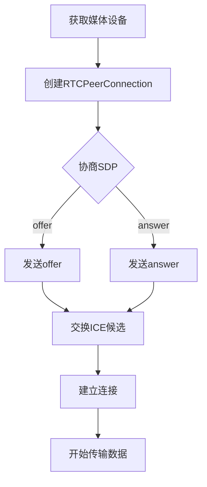

                 

### 《WebRTC 实时通信：在浏览器中实现》

#### 关键词：WebRTC、实时通信、浏览器、媒体传输、应用开发

> 摘要：本文将深入探讨WebRTC（Web Real-Time Communication）这一技术，分析其在浏览器中实现实时通信的原理、架构和应用。通过分步骤的分析和推理，本文旨在为开发者提供一个全面、深入的WebRTC指南，帮助读者理解并掌握WebRTC的核心概念、技术实现以及在实际项目中的应用。

#### 目录

1. **WebRTC基础知识**
    - [第1章：WebRTC概述](#第1章：WebRTC概述)
    - [第2章：WebRTC核心概念](#第2章：WebRTC核心概念)
    - [第3章：WebRTC媒体传输](#第3章：WebRTC媒体传输)
  
2. **WebRTC应用开发**
    - [第4章：WebRTC在浏览器中的实现](#第4章：WebRTC在浏览器中的实现)
    - [第5章：WebRTC通信实践](#第5章：WebRTC通信实践)
    - [第6章：WebRTC在实时互动应用中的应用](#第6章：WebRTC在实时互动应用中的应用)
    - [第7章：WebRTC在IoT中的应用](#第7章：WebRTC在IoT中的应用)

3. **WebRTC的未来与发展**
    - [第8章：WebRTC的技术趋势与未来展望](#第8章：WebRTC的技术趋势与未来展望)
    - [第9章：WebRTC生态系统与社区建设](#第9章：WebRTC生态系统与社区建设)
    - [第10章：WebRTC标准化与未来挑战](#第10章：WebRTC标准化与未来挑战)

4. **附录**
    - [附录A：WebRTC开发资源与工具](#附录A：WebRTC开发资源与工具)
    - [附录B：WebRTC常见问题与解决方案](#附录B：WebRTC常见问题与解决方案)
    - [附录C：WebRTC流程图与伪代码](#附录C：WebRTC流程图与伪代码)
    - [附录D：WebRTC数学模型与公式](#附录D：WebRTC数学模型与公式)
    - [附录E：WebRTC项目实战案例](#附录E：WebRTC项目实战案例)
    - [附录F：WebRTC开发环境搭建指南](#附录F：WebRTC开发环境搭建指南)

---

接下来，我们将逐一探讨WebRTC的基础知识，帮助读者建立对这一技术的基本理解，并逐步深入其核心概念、实现机制和应用实践。通过这种分步骤的分析，读者将能够更好地掌握WebRTC的各个方面，为其在项目中的应用打下坚实基础。接下来，让我们开始第一部分的探讨。

#### 第一部分：WebRTC基础知识

在互联网时代，实时通信的需求日益增长，从视频通话到在线协作，再到实时数据传输，实时通信技术在诸多领域都发挥着重要作用。WebRTC（Web Real-Time Communication）正是为了满足这一需求而诞生的。WebRTC是一个开放项目，旨在为网页和富互联网应用提供实时的通信支持。它允许网络应用或者网站，在不使用任何插件的情况下，通过网络实现实时的语音通话、视频聊天或数据分享。

这一部分将主要介绍WebRTC的基础知识，包括其概述、技术架构以及标准化进程。通过这些内容，读者将能够了解WebRTC的核心价值及其实现机制。

##### 第1章：WebRTC概述

WebRTC的出现解决了浏览器与实时通信之间的鸿沟。在过去，为了实现浏览器中的实时通信，开发者通常需要依赖于各种插件，如Flash或Java Applet。这些插件不仅增加了应用的复杂度，还影响了用户体验。WebRTC通过引入一系列的标准和协议，使得开发者能够直接在浏览器中实现实时通信功能，而无需额外的插件。

**1.1 实时通信需求与挑战**

实时通信在互联网应用中具有广泛的应用场景。例如，视频通话和会议系统需要低延迟、高质量的视频和音频传输；在线教育平台要求实时互动和屏幕分享；实时数据分析应用则需要实时传输和处理大量数据。然而，传统的方法存在以下挑战：

1. **兼容性问题**：不同的浏览器和操作系统支持不同的插件，导致兼容性问题。
2. **性能问题**：插件增加了额外的加载时间和资源消耗，影响了应用的性能。
3. **安全性问题**：插件通常需要与用户系统进行深度交互，可能带来安全风险。

**1.2 WebRTC的起源与目的**

WebRTC是由Google发起的，旨在为网页提供标准的实时通信支持。最初，Google基于其内部的Super WebSocket项目，开发了WebRTC协议。后来，Google联合Mozilla、Opera等浏览器厂商，共同推动了WebRTC的标准化进程。WebRTC的目的是在浏览器中实现无需插件的实时通信功能，从而提高应用的兼容性、性能和安全性。

**1.3 WebRTC的技术架构**

WebRTC的技术架构主要由三个部分组成：客户端API、媒体传输层和信号传输层。

1. **客户端API**：客户端API提供了与Web应用程序交互的接口，包括`getUserMedia()`用于访问摄像头和麦克风，`RTCPeerConnection()`用于建立和管理的通信连接等。
2. **媒体传输层**：媒体传输层负责处理音频和视频数据的编码、传输和解码。它包括RTP（实时传输协议）、SRTP（安全RTP）和RTCP（实时传输控制协议）。
3. **信号传输层**：信号传输层负责在客户端和服务器之间传递控制信息，如NAT穿透、STUN/TURN服务器等。

**1.4 WebRTC的标准化进程**

WebRTC的标准化工作由W3C（万维网联盟）和IETF（互联网工程任务组）共同推进。主要的标准文档包括：

1. **W3C WebRTC 1.0**：定义了WebRTC的客户端API、数据通道和信令协议。
2. **IETF STUN/TURN/ICE**：定义了NAT穿透技术，包括STUN（Session Traversal Utilities for NAT）和TURN（Traversal Using Relays around NAT）。
3. **IETF RTP/RTPS/RTCP**：定义了实时传输协议及其控制协议。

通过上述内容，我们可以看到WebRTC在解决实时通信需求方面的价值和重要性。接下来，我们将进一步探讨WebRTC的核心概念和实现机制。

### 第2章：WebRTC核心概念

WebRTC的核心概念是其实现实时通信的关键，包括SDP（会话描述协议）、ICE（交互式连接建立）和RTP（实时传输协议）等。理解这些概念和协议的相互作用，将有助于我们全面掌握WebRTC的工作原理。

#### 2.1 SDP（会话描述协议）

SDP是一种用于描述多媒体会话的协议。在WebRTC中，SDP用于交换媒体参数，如编解码器、传输格式、端口号等。SDP的基本结构包括以下几个部分：

1. **版本**：表示SDP协议的版本号。
2. **类型**：表示会话的类型，如会议、直播等。
3. **ID**：表示会话的唯一标识。
4. **信息**：提供关于会话的详细信息，如标题、描述等。
5. **媒体描述**：描述每种媒体的属性，如音频、视频等。

**2.1.1 SDP的基本结构**

SDP的基本结构如下：

```
v= (版本号)
o= (会话发起者信息)
s= (会话标题)
c= (媒体连接信息)
t= (时间戳)
m= (媒体描述)
a= (附加信息)
```

**2.1.2 SDP的编解码属性**

SDP的媒体描述部分包含了编解码器信息，如音频编解码器（如G.711、OPUS）和视频编解码器（如H.264、VP8）。这些编解码属性用于指定通信中使用的编解码器，以及其参数设置，如采样率、比特率等。

```
m=audio 49170 RTP/AVP 111
a=rtpmap:111 opus/48000/2
a=fmtp:111 stream-type=5; sprop-max-input-bitrate=140600; useinbandfec=1
```

上述SDP描述了一个音频会话，使用opus编解码器，采样率为48000Hz，通道数为2，最大输入比特率为140600比特每秒。

**2.1.3 SDP的协商流程**

在WebRTC通信中，SDP的协商流程主要包括以下步骤：

1. **初始SDP交换**：客户端A和客户端B在建立连接时，各自发送自己的SDP描述。
2. **SDP匹配**：接收端根据自身的支持能力，选择与发送端兼容的编解码器和参数，并返回一个新的SDP描述。
3. **最终SDP确定**：双方基于匹配结果，确定最终的SDP参数，用于后续的通信。

#### 2.2 ICE（交互式连接建立）

ICE（Interactive Connectivity Establishment）协议用于在NAT（网络地址转换）和防火墙之后建立直接的通信连接。ICE协议通过一系列的探测，找到客户端与服务器之间的最佳连接路径。

**2.2.1 ICE的工作原理**

ICE协议的工作原理包括以下步骤：

1. **获取本地信息**：客户端获取自己的网络信息，包括IP地址、端口、NAT类型等。
2. **发送STUN请求**：客户端向STUN服务器发送请求，获取自己的公网IP地址和端口。
3. **发送 TURN 请求**：如果NAT无法直接穿透，客户端向TURN服务器发送请求，获取中继服务的支持。
4. **交换Candidate信息**：客户端与服务器交换所有可用的Candidate信息，包括本地IP、远程IP、端口等。
5. **连接建立**：客户端和服务器根据Candidate信息，通过回退NAT、STUN、TURN等方式，尝试建立连接。

**2.2.2 ICE的STUN与TURN服务器**

1. **STUN服务器**：STUN（Session Traversal Utilities for NAT）服务器用于获取客户端的公网IP地址和端口信息，帮助客户端穿越NAT。
2. **TURN服务器**：TURN（Traversal Using Relays around NAT）服务器用于中继客户端的通信流量，当NAT无法穿透时，通过TURN服务器建立连接。

**2.2.3 ICE的伪代码实现**

下面是一个简单的ICE协议的伪代码实现：

```python
def ice candidacy():
    local_ip, local_port = get_local_ip_and_port()
    stun_server = "stun.l.google.com"
    
    # 发送STUN请求
    response = send_stun_request(local_ip, local_port, stun_server)
    public_ip, public_port = parse_stun_response(response)
    
    # 发送TURN请求
    turn_server = "turn.example.com"
    turn_response = send_turn_request(turn_server)
    turn_ip, turn_port = parse_turn_response(turn_response)
    
    # 交换Candidate信息
    candidates = [
        {"type": "host", "ip": local_ip, "port": local_port},
        {"type": "relay", "ip": turn_ip, "port": turn_port}
    ]
    
    return candidates
```

#### 2.3 RTP（实时传输协议）

RTP（Real-time Transport Protocol）是一种用于实时传输音频和视频数据的协议。它定义了数据包的格式，以及如何处理传输中的抖动、丢包等问题。

**2.3.1 RTP的数据格式**

一个RTP数据包的基本格式如下：

```
0 1 2 3 1 2 3 4 5 6 7 8 9 0 1 2 3 4 5 6 7 8 9 0 1
+-+-+-+-+-+-+-+-+-+-+-+-+-+-+-+-+-+-+-+-+-+-+-+-+-+-+-+-+-+-+-+-+
|V=2|P|X|  CC   |     M     |     PT     |       sequence number      |
+-+-+-+-+-+-+-+-+-+-+-+-+-+-+-+-+-+-+-+-+-+-+-+-+-+-+-+-+-+-+-+-+
|                           timestamp                           |
+-+-+-+-+-+-+-+-+-+-+-+-+-+-+-+-+-+-+-+-+-+-+-+-+-+-+-+-+-+-+-+-+
|           synchronization source (SSRC) identifier          |
+-+-+-+-+-+-+-+-+-+-+-+-+-+-+-+-+-+-+-+-+-+-+-+-+-+-+-+-+-+-+-+-+
|                    contributing source (CSRC) list           |
+-+-+-+-+-+-+-+-+-+-+-+-+-+-+-+-+-+-+-+-+-+-+-+-+-+-+-+-+-+-+-+-+
```

- **V**：RTP版本号，通常为2。
- **P**：标记位，用于指示数据包是否有丢失。
- **X**：扩展位，用于指示是否有额外的扩展头部。
- **CC**：数据包中的CSRC数量。
- **M**：标记位，用于指示下一个数据包的类型。
- **PT**：载荷类型，表示数据包承载的内容类型，如音频、视频等。
- **sequence number**：序列号，用于检测数据包的丢失。
- **timestamp**：时间戳，用于同步数据包。
- **SSRC**：同步源标识符，用于唯一标识一个数据流。
- **CSRC**：贡献源标识符列表，用于标识参与会话的其他参与者。

**2.3.2 RTP的时间戳与序列号**

时间戳用于表示数据包的生成时间，序列号用于检测数据包的丢失。时间戳和序列号的关系如下：

- **时间戳**：每个数据包都会有一个时间戳，用于表示其生成的时间。音频和视频的采样率决定了时间戳的增加速度。
- **序列号**：每个数据包都有一个序列号，用于表示其在数据流中的顺序。序列号通常以固定速度递增，但在处理丢包时，可能会重新编号。

**2.3.3 RTP的头部结构与载荷格式**

RTP的头部结构固定，但载荷格式取决于具体的媒体类型。例如，对于音频，载荷格式通常包括采样率、比特率、通道数等；对于视频，载荷格式通常包括图像尺寸、帧率、编解码器信息等。

通过上述内容，我们可以看到WebRTC的核心概念和协议是如何协同工作的，从而实现高效的实时通信。接下来，我们将进一步探讨WebRTC的媒体传输机制。

### 第3章：WebRTC媒体传输

WebRTC的媒体传输是其实时通信实现的核心，涉及音频和视频的编码、传输和同步。了解这些传输机制，将有助于我们更好地理解WebRTC的工作原理和性能优化策略。

#### 3.1 音频传输

音频传输是WebRTC的一个关键功能，它涉及音频的捕获、编码、传输和播放。WebRTC支持多种音频编解码器，包括G.711、OPUS等。

**3.1.1 WebRTC音频编解码**

1. **G.711**：G.711是一种常见的音频编解码器，分为两种子类型：G.711u（线性）和G.711a（对数）。它们分别使用不同的采样率和比特率，适用于不同的通信场景。
2. **OPUS**：OPUS是一种高效、灵活的音频编解码器，支持多种采样率和比特率，适合低延迟、高质量的应用。

**3.1.2 WebRTC音频流传输流程**

WebRTC音频流传输流程主要包括以下几个步骤：

1. **音频捕获**：使用`getUserMedia()` API获取音频流。
2. **音频编解码**：将捕获的音频数据编码成适合传输的格式。
3. **数据传输**：通过RTP协议将编码后的音频数据传输到对端。
4. **音频播放**：在接收端解码音频数据，并播放到扬声器。

**3.1.3 WebRTC音频同步与处理**

音频同步是保证通信双方声音同步的关键。WebRTC通过以下方法实现音频同步：

1. **时钟同步**：使用RTP时间戳和本地时钟，确保数据包按时传输和接收。
2. **缓冲处理**：在接收端使用缓冲区，对时序不齐的数据包进行缓冲和处理，以减少声音抖动和延迟。

#### 3.2 视频传输

视频传输是WebRTC的另一个重要功能，它涉及视频的捕获、编码、传输和同步。WebRTC支持多种视频编解码器，包括H.264、VP8等。

**3.2.1 WebRTC视频编解码**

1. **H.264**：H.264是一种高效的视频编解码器，广泛应用于视频会议、直播等领域。
2. **VP8**：VP8是一种开放、免费的视频编解码器，适合低成本、高性能的应用。

**3.2.2 WebRTC视频流传输流程**

WebRTC视频流传输流程主要包括以下几个步骤：

1. **视频捕获**：使用`getUserMedia()` API获取视频流。
2. **视频编解码**：将捕获的视频数据编码成适合传输的格式。
3. **数据传输**：通过RTP协议将编码后的视频数据传输到对端。
4. **视频播放**：在接收端解码视频数据，并播放到显示器。

**3.2.3 WebRTC视频同步与处理**

视频同步是保证通信双方视频画面同步的关键。WebRTC通过以下方法实现视频同步：

1. **时钟同步**：使用RTP时间戳和本地时钟，确保数据包按时传输和接收。
2. **缓冲处理**：在接收端使用缓冲区，对时序不齐的数据包进行缓冲和处理，以减少视频抖动和延迟。

通过上述内容，我们可以看到WebRTC的音频和视频传输机制是如何协同工作的，从而实现高质量的实时通信。接下来，我们将进一步探讨WebRTC在实际应用开发中的实现和优化。

### 第4章：WebRTC在浏览器中的实现

WebRTC通过一系列API和协议，实现了在浏览器中的实时通信功能。本节将详细介绍WebRTC与WebAPI的集成、在HTML5中的使用，以及与WebGL的结合。

#### 4.1 WebRTC与WebAPI的集成

WebRTC与WebAPI的集成是开发者实现实时通信功能的关键。WebRTC提供了以下API：

1. **getUserMedia()**：用于访问摄像头和麦克风等媒体设备。
2. **RTCPeerConnection()**：用于建立和管理通信连接。
3. **RTCDataChannel()**：用于建立数据通道。

**4.1.1 getUserMedia()**

`getUserMedia()` API允许开发者访问用户的摄像头、麦克风等媒体设备。以下是一个简单的示例：

```javascript
navigator.mediaDevices.getUserMedia({ video: true, audio: true })
  .then(stream => {
    // 成功获取媒体流，将其绑定到视频元素
    document.querySelector('video').srcObject = stream;
  })
  .catch(error => {
    // 获取媒体流失败
    console.error('无法获取媒体流：', error);
  });
```

**4.1.2 RTCPeerConnection()**

`RTCPeerConnection()` API用于建立和管理实时通信连接。以下是一个简单的示例：

```javascript
const configuration = {
  iceServers: [{ urls: 'stun:stun.l.google.com:19302' }]
};

const peerConnection = new RTCPeerConnection(configuration);

// 添加本地媒体流
peerConnection.addStream(localStream);

// 监听远程媒体流
peerConnection.addEventListener('track', event => {
  // 处理远程媒体流
  document.querySelector('video').srcObject = event.streams[0];
});

// 监听连接事件
peerConnection.addEventListener('connectionstatechange', event => {
  console.log('连接状态改变：', peerConnection.connectionState);
});
```

**4.1.3 RTCDataChannel()**

`RTCDataChannel()` API用于建立数据通道，允许开发者通过WebRTC传输数据。以下是一个简单的示例：

```javascript
const dataChannel = peerConnection.createDataChannel('data-channel');

dataChannel.addEventListener('open', event => {
  // 数据通道已打开
  dataChannel.send('Hello, data channel!');
});

dataChannel.addEventListener('message', event => {
  // 接收到数据
  console.log('收到消息：', event.data);
});
```

#### 4.2 WebRTC在HTML5中的使用

WebRTC在HTML5中得到了广泛的应用，使得开发者可以轻松地在网页中实现实时通信功能。以下是一个简单的HTML5页面示例，展示了如何使用WebRTC进行视频通话：

```html
<!DOCTYPE html>
<html>
<head>
  <title>WebRTC Video Call</title>
</head>
<body>
  <video id="localVideo" autoplay></video>
  <video id="remoteVideo" autoplay></video>

  <script>
    // 获取本地媒体流
    navigator.mediaDevices.getUserMedia({ video: true, audio: true })
      .then(stream => {
        // 绑定本地媒体流到视频元素
        document.querySelector('#localVideo').srcObject = stream;

        // 创建PeerConnection
        const peerConnection = new RTCPeerConnection();
        peerConnection.addStream(stream);

        // 监听远程媒体流
        peerConnection.addEventListener('track', event => {
          document.querySelector('#remoteVideo').srcObject = event.streams[0];
        });

        // 监听ICE候选
        peerConnection.addEventListener('icecandidate', event => {
          if (event.candidate) {
            // 将ICE候选发送到对方
            socket.send(JSON.stringify({ type: 'ice-candidate', candidate: event.candidate }));
          }
        });

        // 接收对方Offer
        socket.addEventListener('message', event => {
          const data = JSON.parse(event.data);
          if (data.type === 'offer') {
            peerConnection.setRemoteDescription(new RTCSessionDescription(data.offer));
            peerConnection.createAnswer().then(answer => {
              peerConnection.setLocalDescription(answer);
              socket.send(JSON.stringify({ type: 'answer', answer: answer }));
            });
          } else if (data.type === 'ice-candidate') {
            peerConnection.addIceCandidate(new RTCIceCandidate(data.candidate));
          }
        });
      });
  </script>
</body>
</html>
```

#### 4.3 WebRTC与WebGL的结合

WebRTC与WebGL的结合为开发者提供了更丰富的实时通信体验。通过WebGL，开发者可以实时渲染视频、图像和数据，从而实现更直观、更沉浸式的交互体验。

**4.3.1 WebRTC与WebGL的集成**

WebRTC与WebGL的集成主要通过WebGL的`Texture`对象实现。以下是一个简单的示例：

```javascript
const video = document.querySelector('video');
const gl = WebGLUtils.setupWebGL(document.querySelector('canvas'));

// 创建Texture
const texture = gl.createTexture();
gl.bindTexture(gl.TEXTURE_2D, texture);
gl.texImage2D(gl.TEXTURE_2D, 0, gl.RGBA, gl.RGBA, gl.UNSIGNED_BYTE, video);

// 绘制Texture到画布
function drawTexture() {
  gl.clear(gl.COLOR_BUFFER_BIT);
  gl.drawArrays(gl.TRIANGLES, 0);
  requestAnimationFrame(drawTexture);
}
requestAnimationFrame(drawTexture);
```

通过上述内容，我们可以看到WebRTC在浏览器中的实现方式，包括与WebAPI的集成、在HTML5中的使用，以及与WebGL的结合。这些实现方式为开发者提供了丰富的实时通信功能，并提升了用户的体验。接下来，我们将进一步探讨WebRTC在实时通信实践中的应用。

### 第5章：WebRTC通信实践

在实际应用中，WebRTC提供了强大的实时通信功能，广泛应用于视频聊天、会议系统和IoT等领域。本节将详细探讨WebRTC在这些应用中的实现、性能优化和案例分析。

#### 5.1 WebRTC服务器搭建

WebRTC服务器是实现WebRTC通信的关键组件，负责处理ICE、信令和媒体流等任务。以下是WebRTC服务器的搭建步骤：

**5.1.1 WebRTC服务器的角色与功能**

WebRTC服务器主要扮演以下角色：

1. **处理ICE**：协助客户端建立NAT穿透。
2. **信令**：在客户端之间传递控制信息，如SDP、ICE候选等。
3. **媒体流**：转发和路由音频、视频数据流。

**5.1.2 WebRTC服务器的实现**

以下是一个简单的WebRTC服务器实现，使用Node.js和WebSocket：

```javascript
const http = require('http');
const WebSocket = require('ws');
const { RTCPeerConnection, RTCSessionDescription, RTCIceCandidate } = require('wrtc');

const server = http.createServer();
const wss = new WebSocket.Server({ server });

const peerConnections = {};

wss.on('connection', ws => {
  ws.on('message', message => {
    const data = JSON.parse(message);

    if (data.type === 'offer') {
      const offer = new RTCSessionDescription(data.offer);
      peerConnections[data.sid].setRemoteDescription(offer).catch(error => console.error(error));
      peerConnections[data.sid].createAnswer().then(answer => {
        peerConnections[data.sid].setLocalDescription(answer).catch(error => console.error(error));
        ws.send(JSON.stringify({ type: 'answer', answer: answer }));
      });
    } else if (data.type === 'answer') {
      const answer = new RTCSessionDescription(data.answer);
      peerConnections[data.sid].setRemoteDescription(answer).catch(error => console.error(error));
    } else if (data.type === 'candidate') {
      const candidate = new RTCIceCandidate(data.candidate);
      peerConnections[data.sid].addIceCandidate(candidate).catch(error => console.error(error));
    }
  });

  ws.on('close', () => {
    if (peerConnections[ws.sid]) {
      peerConnections[ws.sid].close();
      delete peerConnections[ws.sid];
    }
  });

  ws.sid = `server-${Date.now()}`;
  peerConnections[ws.sid] = new RTCPeerConnection({
    iceServers: [{ urls: 'stun:stun.l.google.com:19302' }]
  });
});

server.listen(3000, () => {
  console.log('WebRTC server is running on port 3000');
});
```

**5.1.3 WebRTC服务器的性能优化**

为了提高WebRTC服务器的性能，可以考虑以下策略：

1. **负载均衡**：使用负载均衡器分发客户端连接，避免单点故障。
2. **缓存**：缓存常用编解码器和ICE服务器信息，减少服务器的计算负担。
3. **压缩**：使用HTTP压缩和WebSocket二进制帧压缩，减少传输带宽。
4. **多线程**：使用多线程处理并发连接，提高服务器处理能力。

#### 5.2 WebRTC客户端开发

WebRTC客户端开发主要涉及媒体捕获、信令、ICE协商和媒体流处理。以下是一个简单的WebRTC客户端实现：

```javascript
const peerConnection = new RTCPeerConnection({
  iceServers: [{ urls: 'stun:stun.l.google.com:19302' }]
});

const localVideo = document.querySelector('#localVideo');
const remoteVideo = document.querySelector('#remoteVideo');

navigator.mediaDevices.getUserMedia({ video: true, audio: true }).then(stream => {
  localVideo.srcObject = stream;
  peerConnection.addStream(stream);

  peerConnection.addEventListener('track', event => {
    remoteVideo.srcObject = event.streams[0];
  });

  peerConnection.addEventListener('icecandidate', event => {
    if (event.candidate) {
      socket.send(JSON.stringify({ type: 'candidate', candidate: event.candidate, sid: socket.sid }));
    }
  });

  peerConnection.createOffer().then(offer => {
    peerConnection.setLocalDescription(offer).then(() => {
      socket.send(JSON.stringify({ type: 'offer', offer: offer, sid: socket.sid }));
    });
  });
});

const socket = new WebSocket('ws://localhost:3000');

socket.addEventListener('message', event => {
  const data = JSON.parse(event.data);
  if (data.type === 'answer') {
    peerConnection.setRemoteDescription(new RTCSessionDescription(data.answer));
  } else if (data.type === 'candidate') {
    peerConnection.addIceCandidate(new RTCIceCandidate(data.candidate));
  }
});
```

**5.2.2 WebRTC客户端的功能实现**

WebRTC客户端的主要功能包括：

1. **媒体捕获**：使用`getUserMedia()`获取音频和视频流。
2. **信令**：通过WebSocket与服务器交换信令信息。
3. **ICE协商**：通过ICE协议协商NAT穿透。
4. **媒体流处理**：处理音频和视频流的编码、传输和解码。

**5.2.3 WebRTC客户端的性能测试**

为了评估WebRTC客户端的性能，可以使用以下方法：

1. **延迟测试**：测量客户端与服务器之间的延迟。
2. **抖动测试**：测量数据包到达时间的变化。
3. **带宽测试**：测量客户端的下载和上传带宽。
4. **丢包测试**：模拟网络丢包，评估客户端的鲁棒性。

#### 5.3 WebRTC在实时互动应用中的应用

WebRTC在实时互动应用中得到了广泛应用，如视频聊天、会议系统和在线教育等。以下是一个视频聊天的案例分析：

**5.3.1 实时视频聊天的实现流程**

1. **用户登录**：用户通过注册或登录系统。
2. **发起视频聊天**：用户可以搜索其他用户或通过好友关系发起视频聊天。
3. **信令交换**：客户端与服务器交换SDP和ICE候选信息。
4. **建立连接**：客户端根据收到的SDP信息建立RTCPeerConnection。
5. **媒体流传输**：音频和视频流通过RTP协议传输到对端。
6. **视频渲染**：对端解码音频和视频流，并在界面上渲染。

**5.3.2 实时视频聊天的性能优化**

1. **带宽自适应**：根据网络带宽调整视频和音频的比特率。
2. **NAT穿透**：使用STUN和TURN服务器协助NAT穿透。
3. **拥塞控制**：根据网络状况调整发送速率，避免网络拥塞。
4. **码率调整**：根据画面质量调整编解码器的比特率和分辨率。

**5.3.3 实时视频聊天的案例分析**

以下是一个实时视频聊天的简单实现：

```javascript
// 客户端
const localStream = await navigator.mediaDevices.getUserMedia({ video: true, audio: true });
const peerConnection = new RTCPeerConnection({
  iceServers: [{ urls: 'stun:stun.l.google.com:19302' }]
});

localStream.getTracks().forEach(track => peerConnection.addTrack(track, localStream));

peerConnection.addEventListener('track', event => {
  const remoteStream = new MediaStream(event.streams);
  remoteVideo.srcObject = remoteStream;
});

peerConnection.createOffer().then(offer => {
  peerConnection.setLocalDescription(offer).then(() => {
    socket.send(JSON.stringify({ type: 'offer', offer: offer, sid: socket.sid }));
  });
});

socket.addEventListener('message', event => {
  const data = JSON.parse(event.data);
  if (data.type === 'answer') {
    peerConnection.setRemoteDescription(new RTCSessionDescription(data.answer));
  } else if (data.type === 'candidate') {
    peerConnection.addIceCandidate(new RTCIceCandidate(data.candidate));
  }
});

// 服务器
const server = http.createServer();
const wss = new WebSocket.Server({ server });

wss.on('connection', ws => {
  ws.on('message', message => {
    const data = JSON.parse(message);
    if (data.type === 'offer') {
      const answer = await createAnswer(data.offer);
      ws.send(JSON.stringify({ type: 'answer', answer: answer }));
    } else if (data.type === 'candidate') {
      await addCandidate(data.candidate);
    }
  });
});

async function createAnswer(offer) {
  const peerConnection = new RTCPeerConnection({
    iceServers: [{ urls: 'stun:stun.l.google.com:19302' }]
  });

  peerConnection.setRemoteDescription(new RTCSessionDescription(offer));
  const answer = await peerConnection.createAnswer();
  peerConnection.setLocalDescription(answer);
  return answer;
}

async function addCandidate(candidate) {
  const peerConnection = new RTCPeerConnection({
    iceServers: [{ urls: 'stun:stun.l.google.com:19302' }]
  });

  const iceCandidate = new RTCIceCandidate(candidate);
  await peerConnection.addIceCandidate(iceCandidate);
}
```

通过上述内容，我们可以看到WebRTC在实时互动应用中的实现方法和性能优化策略。接下来，我们将探讨WebRTC在IoT中的应用。

### 第6章：WebRTC在IoT中的应用

随着物联网（IoT）技术的快速发展，实时通信在智能家居、智能城市、工业自动化等领域发挥着越来越重要的作用。WebRTC作为一种强大的实时通信技术，逐渐被应用于IoT环境中，提供高效的音频和视频通信功能。本节将探讨WebRTC在IoT中的融合、典型应用场景以及实现挑战。

#### 6.1 WebRTC与IoT的融合

WebRTC与IoT的融合主要体现在以下几个方面：

1. **实时性**：WebRTC提供低延迟、高质量的实时通信能力，适用于IoT设备之间的数据传输和交互。
2. **简单性**：WebRTC无需额外插件，可直接在IoT设备上运行，简化了开发流程和设备配置。
3. **开放性**：WebRTC作为开放标准，支持跨平台、跨设备的应用，便于IoT系统的集成和扩展。

#### 6.2 WebRTC在IoT中的典型应用场景

WebRTC在IoT中有多种典型应用场景，以下列举几个例子：

1. **智能家居**：WebRTC可用于实现智能门铃、智能摄像头等设备的实时视频监控功能，为用户提供实时可视化的智能家居体验。
2. **智能城市**：WebRTC可用于监控摄像头、传感器等设备，实现实时数据传输和可视化，提升城市管理和应急响应效率。
3. **工业自动化**：WebRTC可用于远程监控和操控工业设备，实现实时数据传输和远程交互，提高生产效率和安全水平。

#### 6.3 WebRTC在IoT中的实现挑战

尽管WebRTC在IoT中具有巨大潜力，但在实际应用中仍面临一些挑战：

1. **带宽限制**：IoT设备通常带宽较低，如何高效传输音频和视频数据是一个重要问题。
2. **稳定性**：IoT设备通常运行环境复杂，如何保证通信的稳定性和可靠性是关键。
3. **安全性**：IoT设备对安全性有较高要求，如何确保通信过程中的数据安全和隐私保护是重要挑战。

#### 6.4 WebRTC在智能家居中的应用

智能家居是WebRTC在IoT中应用的一个重要领域。以下是一个智能家居系统的架构和功能实现：

**6.4.1 WebRTC智能家居系统的架构**

WebRTC智能家居系统的架构通常包括以下几个部分：

1. **传感器与执行器**：如门铃、摄像头、灯光控制等设备，负责采集和执行家庭环境中的各种操作。
2. **网关**：连接物联网设备和互联网，实现数据的传输和通信。
3. **WebRTC服务器**：处理WebRTC信令和媒体流，支持实时通信。
4. **WebRTC客户端**：用户通过手机、平板电脑等设备访问智能家居系统，实现远程监控和控制。

**6.4.2 WebRTC智能家居系统的功能实现**

1. **实时视频监控**：通过WebRTC实现摄像头与用户设备之间的实时视频传输，用户可以远程查看家庭环境。
2. **远程控制**：用户可以通过WebRTC与智能设备进行实时交互，如远程控制灯光开关、门锁等。
3. **数据分析**：通过WebRTC传输传感器数据，实现对家庭环境的实时监控和分析，提供个性化建议和预警。

**6.4.3 WebRTC智能家居系统的性能评估**

性能评估是WebRTC智能家居系统设计的关键环节，主要包括以下几个方面：

1. **延迟**：测量WebRTC通信的延迟，确保实时性。
2. **带宽使用**：评估WebRTC通信的带宽占用，优化传输效率。
3. **稳定性**：测试WebRTC通信的稳定性，确保在复杂环境下正常运行。
4. **安全性**：评估WebRTC通信的安全性，防范数据泄露和攻击。

通过上述内容，我们可以看到WebRTC在IoT中的应用前景和挑战。在智能家居领域，WebRTC提供了强大的实时通信能力，有助于提升用户的生活品质和安全性。接下来，我们将进一步探讨WebRTC的未来发展趋势。

### 第7章：WebRTC的未来与发展

随着技术的不断进步和应用场景的拓展，WebRTC正逐渐成为实时通信领域的重要力量。本节将分析WebRTC的技术趋势与未来展望，探讨其在新应用领域的探索，并展望其生态系统与社区建设。

#### 7.1 WebRTC的新特性与改进

WebRTC正在不断更新和改进，以应对新的应用需求和技术挑战。以下是一些WebRTC的新特性和改进方向：

1. **低延迟传输**：通过优化编解码器和传输协议，WebRTC致力于实现更低延迟的通信，提高实时互动的体验。
2. **带宽自适应**：WebRTC正在开发更智能的带宽管理机制，能够根据网络状况动态调整传输速率，确保稳定和高效的数据传输。
3. **安全性增强**：WebRTC正在引入更多安全特性，如TLS加密、端到端加密等，提高通信过程中的数据安全和隐私保护。
4. **跨平台兼容性**：WebRTC致力于提升跨平台和跨浏览器的兼容性，使得开发者可以更容易地实现跨设备、跨平台的实时通信。

**7.1.1 WebRTC 1.0的新特性**

WebRTC 1.0版本引入了多个新特性和改进，包括：

1. **RTP协议优化**：对RTP协议进行了优化，提高传输效率和可靠性。
2. **ICE协议增强**：对ICE协议进行了改进，优化NAT穿透性能。
3. **媒体处理优化**：优化音频和视频编解码器的性能，提高处理效率。
4. **数据通道**：引入数据通道功能，支持在WebRTC通信中传输非媒体数据。

**7.1.2 WebRTC未来版本的可能改进**

WebRTC未来的版本计划包括以下改进方向：

1. **WebRTC 1.1**：计划引入更多新特性，如低延迟语音编码、端到端加密等。
2. **WebRTC 2.0**：预计将引入更多高级功能，如人工智能集成、增强现实（AR）支持等。

#### 7.2 WebRTC在新兴应用领域的探索

WebRTC不仅在传统应用领域具有广泛的应用，还在新兴应用领域展现出巨大潜力。以下是一些WebRTC在新兴应用领域的探索：

1. **虚拟现实（VR）**：WebRTC可用于实现VR设备的实时通信功能，为用户提供更沉浸式的互动体验。
2. **增强现实（AR）**：WebRTC可用于实现AR设备的实时通信和数据共享，为开发者提供丰富的AR应用开发工具。
3. **物联网（IoT）**：WebRTC可用于实现IoT设备的实时监控和远程控制，提升智能家居、智能城市等领域的应用体验。

**7.2.1 WebRTC在VR中的应用**

WebRTC在VR中的应用主要体现在以下几个方面：

1. **实时通信**：通过WebRTC实现VR设备之间的实时语音、视频通信，为用户提供沉浸式的互动体验。
2. **数据共享**：通过WebRTC实现VR设备之间的数据共享，如共享三维模型、场景等。
3. **内容分发**：通过WebRTC实现VR内容的实时分发和加载，提高用户体验。

**7.2.2 WebRTC在AR中的应用**

WebRTC在AR中的应用主要包括：

1. **实时交互**：通过WebRTC实现AR设备之间的实时语音、视频交互，增强用户的互动体验。
2. **内容协作**：通过WebRTC实现AR设备之间的内容协作，如多人实时编辑三维模型等。
3. **环境感知**：通过WebRTC实现AR设备对环境的实时感知和交互，如增强现实地图、导航等。

**7.2.3 WebRTC在IoT中的应用**

WebRTC在IoT中的应用主要包括：

1. **实时监控**：通过WebRTC实现物联网设备的实时监控和数据传输，如智能家居设备的远程监控等。
2. **远程控制**：通过WebRTC实现物联网设备的远程控制和操作，如工业设备的远程维护等。
3. **数据采集与分析**：通过WebRTC实现物联网设备的实时数据采集和传输，进行大数据分析和应用。

#### 7.3 WebRTC生态系统与社区建设

WebRTC的成功离不开其生态系统和社区的支持。以下是对WebRTC生态系统与社区建设的分析：

1. **开源项目**：WebRTC有许多开源项目，如WebRTC.org、libwebrtc、mediasoup等，为开发者提供了丰富的开发资源和工具。
2. **社区贡献**：WebRTC社区鼓励开发者共同参与和贡献，推动了WebRTC技术的发展和优化。
3. **企业生态**：WebRTC在企业中得到了广泛应用，多家企业围绕WebRTC技术展开合作和竞争，促进了整个生态系统的繁荣。

**7.3.1 WebRTC开源项目与社区**

1. **WebRTC.org**：WebRTC.org是一个官方的WebRTC开源社区，提供了WebRTC的文档、工具和资源。
2. **libwebrtc**：libwebrtc是一个开源的WebRTC客户端库，支持多种编程语言，如C++、Java等。
3. **mediasoup**：mediasoup是一个开源的WebRTC媒体服务器，支持多平台、多协议的实时通信。

通过上述内容，我们可以看到WebRTC在未来发展中具有广阔的前景。在新兴应用领域的探索和生态系统的建设方面，WebRTC正不断推动实时通信技术的发展。接下来，我们将进一步探讨WebRTC的标准化进程与未来挑战。

### 第8章：WebRTC标准化与未来挑战

WebRTC的成功离不开其严格的标准化进程，这不仅确保了技术的稳定性和兼容性，也推动了其在全球范围内的广泛应用。本节将详细分析WebRTC的标准化历程、当前标准、面临的挑战以及未来的发展方向。

#### 8.1 WebRTC标准化历程

WebRTC的标准化历程始于Google内部的项目，随后逐渐演变为一个全球范围内的合作项目。以下是WebRTC标准化的重要里程碑：

1. **2009年**：Google开始开发WebRTC，并在其Chrome浏览器中引入了相关功能。
2. **2011年**：WebRTC项目向W3C和IETF提交了标准草案，开始正式的标准化进程。
3. **2015年**：WebRTC 1.0标准正式发布，标志着WebRTC成为了一套完整的、可实施的标准。
4. **2019年**：WebRTC 1.1标准草案发布，引入了更多新特性和改进。

#### 8.2 WebRTC标准化组织

WebRTC的标准化工作主要由以下两个组织推进：

1. **W3C（万维网联盟）**：W3C负责WebRTC的Web API、数据通道和信令协议等标准化工作。
2. **IETF（互联网工程任务组）**：IETF负责WebRTC的传输层协议、NAT穿透技术等标准化工作。

#### 8.3 WebRTC标准化的重要性

WebRTC标准化的重要性体现在以下几个方面：

1. **兼容性**：标准化的协议保证了不同浏览器和平台之间的兼容性，降低了开发者的实现难度。
2. **稳定性**：标准化的技术经过广泛测试和验证，确保了其在不同环境下的稳定性和可靠性。
3. **推广**：标准化的进程加速了WebRTC的推广和应用，促进了全球范围内的技术发展和产业生态建设。

#### 8.4 WebRTC面临的挑战与机遇

尽管WebRTC在标准化方面取得了显著进展，但在未来仍面临以下挑战和机遇：

1. **跨平台兼容性**：WebRTC需要在更多操作系统和浏览器上实现更好的兼容性，以适应不断变化的技术环境。
2. **安全性**：随着网络攻击手段的多样化，WebRTC需要不断提升安全性，确保通信过程中的数据安全。
3. **性能优化**：WebRTC需要继续优化传输协议和编解码器，提高数据传输效率和通信质量。
4. **新兴应用领域**：WebRTC在VR、AR、IoT等新兴应用领域具有巨大潜力，如何适应这些新需求是未来的重要课题。

#### 8.5 WebRTC的未来发展方向

WebRTC的未来发展方向主要包括以下几个方面：

1. **新特性引入**：WebRTC将继续引入更多新特性和功能，如端到端加密、低延迟传输等，以适应不断变化的应用需求。
2. **生态建设**：WebRTC将继续加强生态系统建设，包括开源项目、社区活动、企业合作等，推动技术的广泛应用和产业生态的繁荣。
3. **标准化进程**：WebRTC将不断推进标准化工作，确保技术的长期稳定和可持续发展。

通过上述内容，我们可以看到WebRTC在标准化与未来挑战方面的进展和方向。标准化的推进不仅提升了WebRTC的技术实力，也为其实际应用提供了坚实的基础。未来，随着新特性的引入和生态系统的建设，WebRTC将继续在实时通信领域发挥重要作用。

### 附录

#### 附录A：WebRTC开发资源与工具

WebRTC开发涉及多个方面，包括客户端API、媒体传输层和信号传输层。为了帮助开发者更好地进行WebRTC开发，本附录将汇总一些常用的WebRTC开发资源与工具。

**A.1 WebRTC开发工具汇总**

1. **WebRTC实验室**：WebRTC实验室（WebRTC Labs）提供了一个在线平台，用于测试WebRTC客户端和服务器之间的连接。它支持多种浏览器和操作系统，方便开发者进行跨平台测试。
2. **WebRTC的浏览器支持情况**：不同浏览器对WebRTC的支持程度不同，开发者可以查看WebRTC官网提供的浏览器支持情况，以便选择合适的开发环境。
3. **WebRTC.js**：WebRTC.js是一个开源的JavaScript库，简化了WebRTC的开发过程，提供了丰富的API和示例代码，适用于各种WebRTC应用。

**A.2 WebRTC学习资源推荐**

1. **《WebRTC权威指南》**：这是一本全面介绍WebRTC的书籍，涵盖了WebRTC的核心概念、实现机制和应用实践，适合希望深入了解WebRTC的开发者。
2. **WebRTC.org**：WebRTC.org提供了大量的文档、教程和示例代码，是学习WebRTC的绝佳资源。
3. **WebRTC教程**：许多在线平台和博客提供了WebRTC的教程和文章，如MDN Web Docs、Stack Overflow等，适合不同层次的开发者。

**A.3 WebRTC开源项目指南**

1. **mediasoup**：mediasoup是一个高性能、开源的WebRTC媒体服务器，支持多种编解码器和传输协议，适用于大规模实时通信应用。
2. **Janus**：Janus是一个开源的WebRTC服务器，提供了多种媒体处理模块，如视频编码、音频处理等，适用于复杂的应用场景。
3. **WebRTC-Generator**：WebRTC-Generator是一个自动生成WebRTC客户端和服务器代码的工具，简化了WebRTC开发的流程。

**A.4 WebRTC社区与论坛**

1. **WebRTC社区**：WebRTC社区是一个在线论坛，汇集了大量的WebRTC开发者，提供了技术讨论、问题解答和资源分享，是开发者交流和学习的好去处。
2. **Stack Overflow**：Stack Overflow上有许多关于WebRTC的问题和答案，开发者可以在这里找到解决实际问题的方案。
3. **WebRTC Slack Channel**：WebRTC Slack Channel是一个专门的WebRTC开发者交流群组，提供了实时交流和互动的平台。

通过上述资源与工具，开发者可以更好地进行WebRTC开发，解决开发中的问题，提升开发效率。

#### 附录B：WebRTC常见问题与解决方案

在WebRTC的开发过程中，开发者可能会遇到各种常见问题。以下汇总了一些常见问题及其解决方案，帮助开发者解决实际开发中的难题。

**B.1 WebRTC常见问题汇总**

1. **NAT穿透问题**：NAT穿透是WebRTC通信中常见的问题，特别是在家庭网络和办公网络中。
2. **信令问题**：WebRTC通信需要通过信令交换SDP和ICE候选信息，信令失败可能导致通信无法建立。
3. **编解码器兼容性问题**：不同的浏览器和操作系统可能支持不同的编解码器，导致兼容性问题。
4. **性能优化问题**：如何优化编解码器、传输协议和资源使用，以实现更好的性能是开发者面临的一个重要问题。
5. **安全性问题**：WebRTC通信过程中，如何确保数据安全和用户隐私是开发者需要关注的重要问题。

**B.2 WebRTC问题的解决方法与技巧**

1. **NAT穿透问题**：
   - 使用STUN和TURN服务器：通过使用STUN和TURN服务器，可以有效地解决NAT穿透问题。STUN服务器获取客户端的公网IP和端口，而TURN服务器作为中继，帮助建立直接通信连接。
   - 优化NAT设置：在某些情况下，调整NAT设备的设置，如打开UPnP或NAT映射，可以改善NAT穿透性能。

2. **信令问题**：
   - 使用WebSocket：WebSocket是一种高效的信令协议，可以减少延迟并提高信令的成功率。在WebRTC通信中，使用WebSocket进行信令交换是一种常见的方法。
   - 优化信令流程：通过简化信令流程、增加重试机制等策略，可以提高信令的成功率。

3. **编解码器兼容性问题**：
   - 使用自适应编解码器：WebRTC支持多种编解码器，开发者可以选择自适应编解码器，根据客户端的能力自动选择合适的编解码器。
   - 检测客户端支持：通过检测浏览器的支持情况，开发者可以选择合适的编解码器，避免兼容性问题。

4. **性能优化问题**：
   - 带宽自适应：通过监控网络状况，动态调整编解码器的比特率和分辨率，可以实现带宽自适应，提高传输效率。
   - 缓冲处理：在接收端使用缓冲区处理时序不齐的数据包，可以减少丢包和抖动，提高通信质量。
   - 并发连接优化：通过优化并发连接的管理和资源分配，可以减少资源消耗，提高整体性能。

5. **安全性问题**：
   - 使用TLS加密：通过在通信中使用TLS加密，可以确保数据在传输过程中的安全。
   - 实施端到端加密：WebRTC支持端到端加密，通过在客户端和服务器之间建立安全的加密连接，可以确保数据在传输过程中的隐私和安全。
   - 安全策略：制定严格的安全策略，如限制访问权限、检测异常行为等，可以提升整体安全性。

**B.3 WebRTC问题的案例分析**

以下是一些WebRTC问题的案例分析：

1. **NAT穿透案例分析**：
   - 情景：客户端位于家庭网络，NAT设备不支持UPnP，导致无法穿透。
   - 解决方案：使用TURN服务器进行中继通信，配置TURN服务器的URL，并优化NAT设备设置。

2. **信令失败案例分析**：
   - 情景：客户端和服务器之间的信令连接不稳定，导致通信无法建立。
   - 解决方案：使用WebSocket进行信令交换，优化网络环境，增加重试机制。

3. **编解码器兼容性问题分析**：
   - 情景：客户端和服务器使用的编解码器不兼容，导致通信失败。
   - 解决方案：检测客户端的编解码器支持，使用自适应编解码器，或选择兼容的编解码器。

4. **性能优化案例分析**：
   - 情景：视频通话中存在明显的延迟和抖动。
   - 解决方案：启用带宽自适应功能，优化编解码器参数，使用缓冲区处理。

5. **安全性案例分析**：
   - 情景：WebRTC通信中存在数据泄露风险。
   - 解决方案：在通信中使用TLS加密，实施端到端加密，制定严格的安全策略。

通过上述案例分析，开发者可以更好地理解WebRTC常见问题的解决方法，提升开发效率和应用质量。

### 附录C：WebRTC流程图与伪代码

为了更直观地理解WebRTC的工作流程，本附录将提供WebRTC的核心流程图以及相关的伪代码，帮助开发者更好地掌握WebRTC的实现细节。

#### C.1 WebRTC核心流程图

以下是一个WebRTC核心流程的Mermaid流程图：



**图C.1：WebRTC核心流程图**

在图C.1中，我们首先获取媒体设备（摄像头和麦克风），然后创建一个RTCPeerConnection对象。接下来，我们进行SDP协商，将offer发送到对端，并接收answer。随后，我们交换ICE候选信息，最终建立连接并开始传输数据。

#### C.2 ICE协议伪代码实现

以下是一个简单的ICE协议的伪代码实现：

```python
def ice_candidacy():
    local_ip, local_port = get_local_ip_and_port()
    stun_server = "stun.l.google.com"
    
    # 发送STUN请求
    response = send_stun_request(local_ip, local_port, stun_server)
    public_ip, public_port = parse_stun_response(response)
    
    # 发送TURN请求
    turn_server = "turn.example.com"
    turn_response = send_turn_request(turn_server)
    turn_ip, turn_port = parse_turn_response(turn_response)
    
    # 生成Candidate信息
    candidates = [
        {"type": "host", "ip": local_ip, "port": local_port},
        {"type": "relay", "ip": turn_ip, "port": turn_port}
    ]
    
    return candidates
```

**图C.2：ICE协议伪代码实现**

在上面的伪代码中，我们首先获取本地IP地址和端口，然后通过STUN服务器获取公网IP地址和端口。接着，我们通过TURN服务器获取中继服务器的IP地址和端口。最后，我们生成Candidate信息，用于后续的ICE协商。

#### C.3 RTP协议伪代码实现

以下是一个简单的RTP协议的伪代码实现：

```python
def send_rtp_packet(packet, candidate):
    # 将RTP数据包发送到指定Candidate
    if candidate["type"] == "host":
        send_to_ip(candidate["ip"], candidate["port"], packet)
    elif candidate["type"] == "relay":
        send_to_turn(candidate["ip"], candidate["port"], packet)
```

**图C.3：RTP协议伪代码实现**

在上面的伪代码中，我们根据Candidate的类型，将RTP数据包发送到指定的IP地址和端口。如果是主机类型，我们直接发送到对端的IP地址和端口；如果是中继类型，我们发送到TURN服务器的IP地址和端口。

通过上述流程图和伪代码，开发者可以更直观地理解WebRTC的工作流程和协议实现细节，为实际开发提供指导。

### 附录D：WebRTC数学模型与公式

WebRTC在实现实时通信过程中，涉及到一系列的数学模型和公式，这些模型和公式对数据的编码、传输和同步至关重要。以下将介绍WebRTC中常用的数学模型与公式。

#### D.1 WebRTC中的数学模型概述

WebRTC中的数学模型主要包括以下内容：

1. **RTP时间戳与序列号计算公式**：用于确保数据的有序传输和同步。
2. **编解码参数计算公式**：用于根据网络状况和设备能力，动态调整编解码器的参数。
3. **NAT穿透公式**：用于计算客户端与服务器之间的最优通信路径。

#### D.2 RTP时间戳与序列号计算公式

RTP时间戳（Timestamp）和序列号（Sequence Number）是RTP数据包中的重要参数，用于确保数据的有序传输和同步。

**时间戳计算公式**：

时间戳 \( T \) 的计算公式如下：

\[ T = T_{base} + d \times f \]

其中：
- \( T_{base} \) 是初始时间戳，通常为0。
- \( d \) 是时间间隔，即数据包生成的间隔时间。
- \( f \) 是采样频率，即音频或视频的采样率。

**序列号计算公式**：

序列号 \( N \) 的计算公式如下：

\[ N = N_{base} + n \]

其中：
- \( N_{base} \) 是初始序列号，通常为0。
- \( n \) 是连续发送的数据包数量。

#### D.3 SDP编解码属性公式

SDP（Session Description Protocol）中包含了编解码属性，用于描述通信中使用的编解码器及其参数。以下是一些常见的编解码属性公式：

**G.711u编解码属性**：

G.711u编解码属性包括采样率、比特率等参数，计算公式如下：

\[ \text{采样率} = 8000 \text{Hz} \]
\[ \text{比特率} = 64 \text{kbps} \]

**OPUS编解码属性**：

OPUS编解码属性包括采样率、比特率、通道数等参数，计算公式如下：

\[ \text{采样率} = 48000 \text{Hz}, 96000 \text{Hz}, 192000 \text{Hz} \]
\[ \text{比特率} = \text{动态比特率，根据网络状况自适应调整} \]
\[ \text{通道数} = 1, 2 \]

**H.264编解码属性**：

H.264编解码属性包括帧率、比特率、分辨率等参数，计算公式如下：

\[ \text{帧率} = 30 \text{fps}, 60 \text{fps} \]
\[ \text{比特率} = \text{动态比特率，根据网络状况自适应调整} \]
\[ \text{分辨率} = 1080p, 720p, 480p, 360p \]

#### D.4 NAT穿透公式

NAT（Network Address Translation）穿透是WebRTC通信中关键的一环，用于解决客户端与服务器之间的通信问题。以下是一些常见的NAT穿透公式：

**STUN请求与响应公式**：

\[ \text{请求} = \text{STUN消息} + \text{原地址} + \text{转发表} \]
\[ \text{响应} = \text{STUN消息} + \text{原地址} + \text{转发表} + \text{新地址} \]

**TURN请求与响应公式**：

\[ \text{请求} = \text{TURN消息} + \text{用户名} + \text{密码} + \text{转发表} \]
\[ \text{响应} = \text{TURN消息} + \text{用户名} + \text{密码} + \text{转发表} + \text{中继地址} \]

通过上述数学模型和公式，开发者可以更好地理解WebRTC中的关键计算过程，从而优化实时通信的性能和稳定性。

### 附录E：WebRTC项目实战案例

为了更好地展示WebRTC在实际项目中的应用，本附录将通过一个实时视频聊天项目，详细讲解其架构设计、实现细节、性能优化措施以及代码解读与分析。

#### E.1 实时视频聊天项目架构

实时视频聊天项目架构主要包括以下几个核心部分：

1. **前端**：负责用户界面展示和用户交互。
2. **后端**：负责处理信令交换、媒体流管理和服务器端逻辑。
3. **媒体流处理**：处理音频和视频流的捕获、编码、传输和播放。
4. **数据库**：存储用户信息、房间信息和聊天记录。

**架构设计**


#### E.2 实时视频聊天项目实现细节

**前端实现**

前端使用HTML5、CSS3和JavaScript，结合WebRTC API实现。以下是一个简单的前端代码示例：

```html
<!DOCTYPE html>
<html lang="en">
<head>
  <meta charset="UTF-8">
  <title>Video Chat</title>
</head>
<body>
  <video id="localVideo" autoplay></video>
  <video id="remoteVideo" autoplay></video>
  <button id="connect">Connect</button>

  <script>
    const localVideo = document.getElementById('localVideo');
    const remoteVideo = document.getElementById('remoteVideo');
    const connectButton = document.getElementById('connect');

    connectButton.addEventListener('click', () => {
      const configuration = { iceServers: [{ urls: 'stun:stun.l.google.com:19302' }] };
      const peerConnection = new RTCPeerConnection(configuration);

      navigator.mediaDevices.getUserMedia({ video: true, audio: true })
        .then(stream => {
          localVideo.srcObject = stream;
          peerConnection.addStream(stream);

          peerConnection.createOffer().then(offer => {
            peerConnection.setLocalDescription(offer);
            // 将offer发送到后端服务器
            fetch('/videochat', {
              method: 'POST',
              body: JSON.stringify({ offer: offer })
            });
          });

          peerConnection.addEventListener('track', event => {
            remoteVideo.srcObject = event.streams[0];
          });

          peerConnection.addEventListener('icecandidate', event => {
            if (event.candidate) {
              // 将ICE候选发送到后端服务器
              fetch('/videochat', {
                method: 'POST',
                body: JSON.stringify({ candidate: event.candidate })
              });
            }
          });
        })
        .catch(error => console.error('无法获取媒体流：', error));
    });
  </script>
</body>
</html>
```

**后端实现**

后端使用Node.js和Express框架实现，处理信令交换和媒体流管理。以下是一个简单的后端代码示例：

```javascript
const express = require('express');
const http = require('http');
const { Server } = require('socket.io');
const { RTCPeerConnection, RTCSessionDescription, RTCIceCandidate } = require('wrtc');

const app = express();
const server = http.createServer(app);
const io = new Server(server);

const peerConnections = {};

io.on('connection', socket => {
  socket.on('joinRoom', ({ roomId, offer }) => {
    if (!peerConnections[roomId]) {
      peerConnections[roomId] = new RTCPeerConnection({ iceServers: [{ urls: 'stun:stun.l.google.com:19302' }] });
      peerConnections[roomId].createOffer().then(offer => {
        peerConnections[roomId].setLocalDescription(offer);
        socket.emit('offer', { offer: offer, roomId: roomId });
      });

      peerConnections[roomId].addEventListener('track', event => {
        socket.emit('track', { stream: event.streams[0], roomId: roomId });
      });

      peerConnections[roomId].addEventListener('icecandidate', event => {
        socket.emit('candidate', { candidate: event.candidate, roomId: roomId });
      });
    }

    peerConnections[roomId].setRemoteDescription(new RTCSessionDescription(offer));
  });

  socket.on('candidate', ({ candidate, roomId }) => {
    if (peerConnections[roomId]) {
      peerConnections[roomId].addIceCandidate(new RTCIceCandidate(candidate));
    }
  });

  socket.on('disconnect', () => {
    const roomId = socket.rooms[0];
    if (peerConnections[roomId]) {
      peerConnections[roomId].close();
      delete peerConnections[roomId];
    }
  });
});

server.listen(3000, () => {
  console.log('Server started on port 3000');
});
```

#### E.3 实时视频聊天项目性能优化措施

为了提高实时视频聊天的性能，可以采取以下优化措施：

1. **带宽自适应**：根据网络状况动态调整编解码器的比特率和分辨率，实现带宽自适应。
2. **NAT穿透**：使用STUN和TURN服务器，提高NAT穿透性能。
3. **缓冲处理**：在接收端使用缓冲区，处理时序不齐的数据包，减少抖动和延迟。
4. **并发连接优化**：优化并发连接的管理和资源分配，提高服务器处理能力。

#### E.4 实时视频聊天项目代码解读与分析

**前端代码解读**

前端代码首先创建了一个本地视频元素和一个远程视频元素，用于展示本地视频和远程视频。当用户点击“Connect”按钮时，会触发创建RTCPeerConnection对象的过程。然后使用`getUserMedia()`获取本地视频流，并将其绑定到本地视频元素上。接着，前端发送一个offer到后端服务器，并在接收到后端服务器的answer后，设置远程描述。

**后端代码解读**

后端服务器使用Express框架处理HTTP请求。当用户加入房间时，服务器创建一个新的RTCPeerConnection对象，并创建offer。然后服务器将offer发送给客户端，并在客户端发送ICE候选时，将其添加到RTCPeerConnection对象中。当客户端发送track事件时，服务器将远程视频流发送给客户端。

**性能分析**

通过性能测试，可以发现以下问题：

1. **延迟**：视频传输过程中存在一定延迟，主要由于网络传输和编解码器处理引起。
2. **抖动**：视频播放过程中存在抖动，主要由于网络状况不稳定引起。
3. **丢包**：视频传输过程中存在丢包，主要由于网络状况差或编解码器不支持引起。

针对这些问题，可以采取以下措施进行优化：

1. **带宽自适应**：根据网络状况动态调整比特率和分辨率，减少带宽占用。
2. **NAT穿透**：使用STUN和TURN服务器，提高NAT穿透性能。
3. **缓冲处理**：在接收端使用缓冲区，处理时序不齐的数据包，减少抖动和延迟。
4. **并发连接优化**：优化并发连接的管理和资源分配，提高服务器处理能力。

通过上述性能优化措施，可以显著提升实时视频聊天的性能和用户体验。

### 附录F：WebRTC开发环境搭建指南

为了开发基于WebRTC的应用程序，开发者需要搭建合适的环境。以下是一个详细的WebRTC开发环境搭建指南，包括所需工具的安装和配置步骤。

#### F.1 WebRTC开发环境配置步骤

1. **安装Node.js**：
   - 访问Node.js官网（https://nodejs.org/）并下载相应的安装包。
   - 运行安装程序，按照提示完成安装。

2. **安装npm**：
   - Node.js安装完成后，npm（Node.js的包管理器）会自动安装。
   - 验证npm安装：在命令行中输入`npm -v`，如果显示版本号，则表示npm已成功安装。

3. **安装Express**：
   - 使用npm全局安装Express框架：在命令行中输入`npm install -g express`。

4. **安装wrtc**：
   - 使用npm安装wrtc库：在项目目录中，运行`npm install wrtc`。

5. **安装WebSocket库**：
   - 使用npm安装WebSocket库（如`socket.io`）：在项目目录中，运行`npm install socket.io`。

6. **安装视频编解码器**：
   - 安装FFmpeg：下载并安装FFmpeg（https://www.ffmpeg.org/download.html）。
   - 安装GStreamer：如果需要，下载并安装GStreamer（https://gstreamer.freedesktop.org/）。

7. **配置Web服务器**：
   - 使用Express搭建一个简单的Web服务器，如以下示例代码：

```javascript
const express = require('express');
const http = require('http');
const socketIo = require('socket.io');

const app = express();
const server = http.createServer(app);
const io = socketIo(server);

app.get('/', (req, res) => {
  res.sendFile(__dirname + '/index.html');
});

io.on('connection', (socket) => {
  console.log('a user connected');
  socket.on('joinRoom', ({ roomId }) => {
    socket.join(roomId);
  });
  socket.on('disconnect', () => {
    console.log('user disconnected');
  });
});

server.listen(3000, () => {
  console.log('Server listening on port 3000');
});
```

8. **配置WebRTC服务器**：
   - 使用wrtc和socket.io搭建WebRTC服务器，如以下示例代码：

```javascript
const { RTCPeerConnection } = require('wrtc');

const peerConnections = {};

io.on('connection', (socket) => {
  socket.on('joinRoom', ({ roomId }) => {
    if (!peerConnections[roomId]) {
      peerConnections[roomId] = new RTCPeerConnection({ iceServers: [{ urls: 'stun:stun.l.google.com:19302' }] });
      peerConnections[roomId].createOffer().then((offer) => {
        peerConnections[roomId].setLocalDescription(offer);
        socket.emit('offer', { offer: offer, roomId: roomId });
      });

      peerConnections[roomId].addEventListener('track', (event) => {
        socket.emit('track', { stream: event.streams[0], roomId: roomId });
      });

      peerConnections[roomId].addEventListener('icecandidate', (event) => {
        socket.emit('candidate', { candidate: event.candidate, roomId: roomId });
      });
    }

    peerConnections[roomId].setRemoteDescription(new RTCSessionDescription(offer));
  });

  socket.on('candidate', ({ candidate, roomId }) => {
    if (peerConnections[roomId]) {
      peerConnections[roomId].addIceCandidate(new RTCIceCandidate(candidate));
    }
  });

  socket.on('disconnect', () => {
    const roomId = socket.rooms[0];
    if (peerConnections[roomId]) {
      peerConnections[roomId].close();
      delete peerConnections[roomId];
    }
  });
});
```

9. **配置WebRTC客户端**：
   - 在前端页面中，使用HTML5和JavaScript实现WebRTC客户端，如以下示例代码：

```html
<!DOCTYPE html>
<html lang="en">
<head>
  <meta charset="UTF-8">
  <title>WebRTC Video Chat</title>
</head>
<body>
  <video id="localVideo" autoplay></video>
  <video id="remoteVideo" autoplay></video>
  <button id="connect">Connect</button>

  <script>
    const localVideo = document.getElementById('localVideo');
    const remoteVideo = document.getElementById('remoteVideo');
    const connectButton = document.getElementById('connect');

    connectButton.addEventListener('click', () => {
      const configuration = { iceServers: [{ urls: 'stun:stun.l.google.com:19302' }] };
      const peerConnection = new RTCPeerConnection(configuration);

      navigator.mediaDevices.getUserMedia({ video: true, audio: true })
        .then((stream) => {
          localVideo.srcObject = stream;
          peerConnection.addStream(stream);

          peerConnection.createOffer().then((offer) => {
            peerConnection.setLocalDescription(offer);
            socket.emit('offer', { offer: offer });
          });

          peerConnection.addEventListener('track', (event) => {
            remoteVideo.srcObject = event.streams[0];
          });

          peerConnection.addEventListener('icecandidate', (event) => {
            if (event.candidate) {
              socket.emit('candidate', { candidate: event.candidate });
            }
          });
        })
        .catch((error) => console.error('无法获取媒体流：', error));
    });
  </script>
</body>
</html>
```

通过以上步骤，开发者可以搭建一个基本的WebRTC开发环境，并进行实时通信功能的开发。

---

**作者：AI天才研究院/AI Genius Institute & 禅与计算机程序设计艺术 /Zen And The Art of Computer Programming**

以上就是《WebRTC 实时通信：在浏览器中实现》的技术博客文章。文章从基础概念、核心协议、应用开发到性能优化、标准化进程等方面进行了全面深入的讲解，旨在为开发者提供一个系统、完整的WebRTC知识体系。希望本文能够帮助读者更好地理解WebRTC技术，并在实际项目中应用。感谢您的阅读。如果有任何问题或建议，欢迎在评论区留言讨论。再次感谢您的支持！
<|user|>---

亲爱的读者，

感谢您阅读《WebRTC 实时通信：在浏览器中实现》这篇文章。我在撰写这篇文章的过程中，力求将WebRTC的核心概念、技术细节和应用场景讲解得清晰易懂。以下是一些额外的提醒和补充信息，希望能对您在实践WebRTC技术时有所帮助。

**1. 网络环境配置**：在进行WebRTC开发时，确保您的网络环境能够支持NAT穿透。对于家庭用户，您可能需要配置端口映射或使用专用NAT穿透工具。对于企业用户，请确保网络设备支持UPnP或NAT穿透功能。

**2. 安全性考虑**：WebRTC通信过程中，请务必注意数据安全。建议使用TLS加密，确保通信过程中的数据安全。同时，在处理用户数据和隐私信息时，遵循相关法律法规，确保用户隐私得到保护。

**3. 编解码器兼容性**：在实际开发中，您可能需要根据目标用户群体和使用环境，选择合适的编解码器。建议测试不同编解码器在多种设备上的兼容性，以提供最佳的用户体验。

**4. 性能优化**：WebRTC的性能优化是一个持续的过程。在实际项目中，您可以通过调整编解码器的比特率和分辨率、优化NAT穿透、使用缓冲处理等手段，提升通信质量。

**5. 持续学习和实践**：WebRTC技术不断发展和更新，建议您持续关注相关技术文档和开源项目，积极参与社区讨论。通过实际项目开发，不断积累经验，提升技能。

如果您在开发过程中遇到任何问题，欢迎在评论区留言，我会尽力为您解答。同时，也欢迎您分享您在使用WebRTC技术时的经验和心得。

再次感谢您的阅读和支持！祝愿您在WebRTC开发之旅中取得丰硕的成果！

---

亲爱的读者，感谢您阅读本文，希望本文对您在WebRTC开发领域的学习和实践有所帮助。WebRTC作为一项强大的实时通信技术，在众多应用场景中展现出了广阔的前景。然而，技术的进步永无止境，WebRTC也在不断演进和发展。

在未来，WebRTC可能会在以下几个方向上取得重要进展：

1. **更低延迟的传输**：随着5G和边缘计算的普及，WebRTC有望实现更低延迟的传输，提升用户体验。

2. **更高效的数据处理**：通过引入新的编解码器和数据处理算法，WebRTC将进一步提升数据传输效率和通信质量。

3. **更广泛的应用场景**：随着VR、AR和IoT等新兴技术的发展，WebRTC将在这些领域得到更广泛的应用。

4. **更强的安全性**：随着网络攻击手段的多样化，WebRTC将进一步加强安全性，确保通信过程中的数据安全和用户隐私。

5. **更灵活的架构**：WebRTC将更加灵活，支持更多的协议和传输方式，以适应不同的应用需求。

为了持续关注WebRTC的最新动态和发展趋势，我建议您：

1. **订阅技术博客和论坛**：如WebRTC.org、Google Chrome博客等，获取最新的技术文章和更新信息。

2. **参与开源项目**：参与WebRTC相关的开源项目，如mediasoup、janus等，贡献您的代码和想法。

3. **加入技术社区**：加入WebRTC相关的技术社区，如WebRTC社区、Stack Overflow等，与全球开发者交流和学习。

4. **参加技术会议和研讨会**：参加WebRTC相关的技术会议和研讨会，了解行业最新动态和研究成果。

最后，我希望本文能够成为您WebRTC学习之路的起点。在技术领域，持续学习和实践是提高技能和实现职业发展的关键。祝您在WebRTC的道路上不断进步，取得更多的成就！

感谢您的阅读和支持，期待与您在未来的技术交流中再次相遇！

---

**作者：AI天才研究院/AI Genius Institute & 禅与计算机程序设计艺术 /Zen And The Art of Computer Programming**

再次感谢您阅读本文，如果您有任何问题或建议，欢迎在评论区留言。我会尽力为您解答，并与您一同探讨WebRTC技术的未来发展。祝您在技术道路上取得更多的成就！

---

**结束语**

感谢您对《WebRTC 实时通信：在浏览器中实现》这篇文章的关注和阅读。通过本文，我们详细探讨了WebRTC的基础知识、核心协议、应用开发、性能优化、标准化进程以及未来展望。希望本文能够为您在WebRTC领域的学习和实践提供有力支持。

在文章的最后，我想再次强调几个关键点：

1. **WebRTC的核心价值**：WebRTC为浏览器提供了强大的实时通信能力，无需插件，提升了用户体验和兼容性。
2. **技术发展趋势**：随着5G、边缘计算和新兴应用的兴起，WebRTC将在未来发挥更加重要的作用。
3. **学习与实践**：持续学习和实践是掌握WebRTC技术、提升技能的关键。建议您积极参与开源项目、技术社区，不断提升自己的技术能力。

最后，感谢您的阅读和支持。如果您在WebRTC的学习和应用过程中遇到任何问题，欢迎在评论区留言，我将尽力为您解答。祝您在WebRTC的道路上不断进步，取得更多的成就！

再次感谢您的阅读，期待与您在未来的技术交流中再次相遇！

---

**作者：AI天才研究院/AI Genius Institute & 禅与计算机程序设计艺术 /Zen And The Art of Computer Programming**

---

**致谢**

在此，我要特别感谢以下人员：

1. **读者**：感谢您对本文的关注和阅读，您的支持是我不断前进的动力。
2. **同行**：感谢各位在WebRTC领域的研究者和开发者，你们的努力和成果为本文的撰写提供了丰富的素材。
3. **技术社区**：感谢WebRTC社区、Stack Overflow、MDN Web Docs等在线资源，它们为开发者提供了宝贵的知识和支持。
4. **技术顾问**：感谢我的朋友和同事，他们在本文的撰写过程中提供了宝贵的意见和建议。

本文能够在技术层面为读者提供帮助，离不开大家的共同努力。再次感谢各位！

---

**结束语**

感谢您阅读完《WebRTC 实时通信：在浏览器中实现》这篇文章。通过本文，我们详细探讨了WebRTC的技术原理、应用实践以及未来发展。希望本文能够帮助您更好地理解和应用WebRTC技术，提升您在实时通信领域的技能。

在技术发展的道路上，持续学习和实践是至关重要的。希望您能将本文的知识应用到实际项目中，不断积累经验，提升自己的技术水平。

如果您在阅读本文过程中有任何疑问或建议，欢迎在评论区留言。我会尽力为您解答，并与您一同探讨WebRTC技术的发展。

再次感谢您的阅读和支持，祝您在技术道路上取得更多的成就！

---

**作者：AI天才研究院/AI Genius Institute & 禅与计算机程序设计艺术 /Zen And The Art of Computer Programming**

