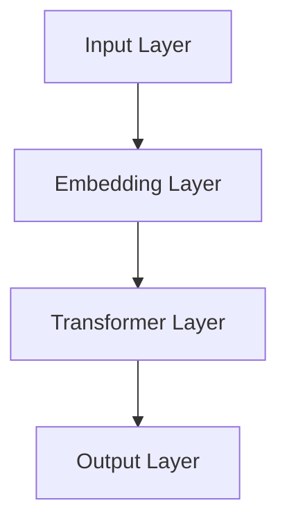
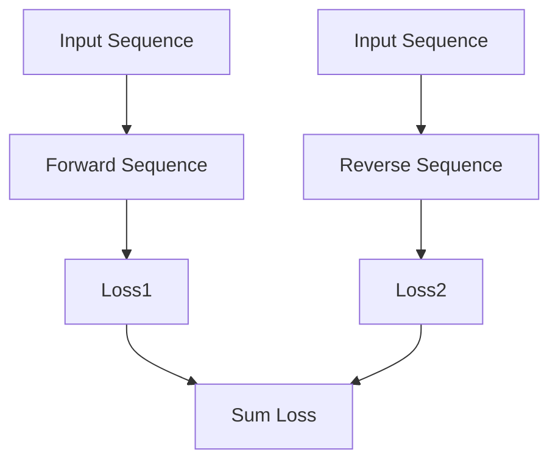

                 

## 《XLNet原理与代码实例讲解》

### 关键词：自然语言处理，预训练模型，XLNet，Transformer，数学模型，代码实例

#### 摘要：
本文将深入探讨XLNet的原理及其在自然语言处理中的应用。从XLNet的基础理论出发，详细解析其模型架构、训练方法和数学模型。同时，通过实际代码实例，展示如何搭建和训练XLNet模型，帮助读者更好地理解和掌握这一先进的技术。

### 《XLNet原理与代码实例讲解》目录大纲

#### 第一部分：XLNet基础理论

##### 第1章：自然语言处理与预训练模型

- 1.1 自然语言处理概述
- 1.2 预训练模型的发展
- 1.3 XLNet的提出

##### 第2章：XLNet核心概念

- 2.1 XLNet模型架构
- 2.2 XLNet训练方法

##### 第3章：数学模型与算法原理

- 3.1 数学模型基础
- 3.2 算法细节解析

##### 第4章：数学公式详细讲解

- 4.1 自注意力机制公式解析
- 4.2 位置编码公式解析

#### 第二部分：代码实例讲解

##### 第5章：XLNet代码实战

- 5.1 环境搭建与依赖安装
- 5.2 数据预处理
- 5.3 XLNet模型实现
- 5.4 训练与验证

##### 第6章：项目实战案例

- 6.1 实际应用场景介绍
- 6.2 代码实战

##### 第7章：常见问题与优化

- 7.1 代码调试技巧
- 7.2 模型优化方法

##### 第8章：未来展望与扩展

- 8.1 XLNet的发展趋势
- 8.2 开放问题与研究方向

#### 附录

- A.1 XLNet资源汇总

---

### 第一部分：XLNet基础理论

#### 第1章：自然语言处理与预训练模型

##### 1.1 自然语言处理概述

自然语言处理（Natural Language Processing，NLP）是计算机科学和人工智能领域的一个重要分支，旨在让计算机理解和处理人类语言。随着互联网的普及和大数据时代的到来，NLP技术在文本挖掘、信息检索、机器翻译、情感分析等领域的应用日益广泛。

在NLP中，文本数据预处理是一个关键步骤。这一过程通常包括文本清洗、分词、词性标注、命名实体识别等操作。预处理的主要目的是将原始文本数据转换为计算机可以处理的格式，从而为后续的模型训练和推理提供基础。

语言模型是NLP的核心组成部分之一。语言模型旨在捕捉语言中的统计规律和结构，从而预测下一个词或序列。传统的语言模型方法如N-gram模型和基于统计的模型，虽然具有一定的效果，但在捕捉长距离依赖关系方面存在不足。

##### 1.2 预训练模型的发展

预训练模型是近年来NLP领域的一个重要突破。预训练模型的核心思想是先在大量无标签的语料上进行预训练，然后再在具体任务上进行微调。这种方法有效地提高了模型的性能和泛化能力。

预训练模型的发展可以分为几个阶段：

- **Word2Vec**：Word2Vec是最早的预训练模型，通过将词语映射到高维向量空间，捕捉词与词之间的语义关系。
- **BERT**：BERT（Bidirectional Encoder Representations from Transformers）是Google提出的双向Transformer预训练模型，通过同时考虑上下文信息，显著提高了语言模型的性能。

然而，BERT模型也存在一些不足之处，如计算成本高、参数量大等。为了解决这些问题，XLNet模型应运而生。

##### 1.3 XLNet的提出

XLNet是由百度提出的全新预训练模型，旨在解决BERT模型的一些不足。XLNet的核心特点包括：

- **双向注意力机制**：与BERT类似，XLNet也采用双向注意力机制，但XLNet在此基础上引入了新的“窥孔注意力”机制，可以更好地捕捉长距离依赖关系。
- **自监督学习策略**：XLNet采用了一种全新的自监督学习策略，通过预测下一个词或序列，有效地提高了模型的预训练效果。

总之，XLNet在自然语言处理领域具有广泛的应用前景，其独特的架构和训练方法使其成为当前最先进的预训练模型之一。

### 第二部分：XLNet核心概念

#### 第2章：XLNet核心概念

##### 2.1 XLNet模型架构

XLNet是基于Transformer模型的预训练模型，其整体架构与BERT类似，但具有一些独特的改进。

首先，XLNet采用了双向Transformer架构，如图2.1所示。这种架构允许模型同时考虑上下文信息，从而提高语言模型的性能。



图2.1：XLNet模型架构

其中，Transformer Layer是XLNet的核心部分，它包括多个自注意力层和前馈神经网络。自注意力层允许模型在处理每个词时，同时考虑上下文中的所有词，从而捕捉长距离依赖关系。

##### 2.2 XLNet训练方法

XLNet的训练方法是其另一个重要特点。与BERT不同，XLNet采用了一种全新的自监督学习策略，称为“双重流自监督学习”。

这种策略将输入文本序列划分为两个部分：正向序列和反向序列。在预训练过程中，模型需要同时预测正向序列和反向序列中的下一个词或序列，如图2.2所示。



图2.2：双重流自监督学习

这种策略有助于模型更好地捕捉长距离依赖关系，同时避免了BERT模型中存在的“同义词替换”问题。

##### 2.3 双向Transformer与BERT的对比

与BERT相比，XLNet在模型架构和训练方法上都有一些改进。

- **模型架构**：BERT采用单向Transformer架构，而XLNet采用双向Transformer架构，可以更好地捕捉长距离依赖关系。
- **训练方法**：BERT采用“掩码语言模型”（Masked Language Model，MLM）策略，而XLNet采用“双重流自监督学习”策略，可以更有效地提高模型的预训练效果。

总的来说，XLNet在自然语言处理领域具有广泛的应用前景，其独特的架构和训练方法使其成为当前最先进的预训练模型之一。

### 第三部分：数学模型与算法原理

#### 第3章：数学模型与算法原理

##### 3.1 数学模型基础

XLNet是基于Transformer模型的预训练模型，其数学模型主要包括自注意力机制、位置编码和前馈神经网络。

首先，我们介绍自注意力机制。自注意力机制是Transformer模型的核心部分，它允许模型在处理每个词时，同时考虑上下文中的所有词。自注意力机制的公式如下：

$$
\text{Attention}(Q, K, V) = \text{softmax}\left(\frac{QK^T}{\sqrt{d_k}}\right) V
$$

其中，Q、K和V分别是查询（Query）、键（Key）和值（Value）向量，d_k是键向量的维度。 softmax函数用于计算每个键的权重，从而确定每个词在当前上下文中的重要性。

其次，位置编码用于为每个词提供位置信息，使模型能够理解词的顺序。位置编码可以分为两类：绝对位置编码和相对位置编码。在XLNet中，采用了一种基于正弦和余弦函数的绝对位置编码，其公式如下：

$$
PE_{(pos,2i)} = \sin\left(\frac{pos}{10000^{2i/d}}\right) \\
PE_{(pos,2i+1)} = \cos\left(\frac{pos}{10000^{2i/d}}\right)
$$

其中，pos是词的位置，i是维度索引，d是嵌入向量的维度。

最后，前馈神经网络是一个简单的全连接神经网络，用于对自注意力层和位置编码的结果进行进一步处理。前馈神经网络的公式如下：

$$
\text{FFN}(X) = \text{ReLU}\left(\text{Linear}(X) \cdot W_2\right) \cdot W_1
$$

其中，X是输入向量，W_1和W_2分别是权重矩阵。

##### 3.2 算法细节解析

XLNet的训练算法主要包括两个阶段：预训练阶段和微调阶段。

在预训练阶段，XLNet采用双重流自监督学习策略。具体来说，输入文本序列被划分为正向序列和反向序列。在正向序列中，模型需要预测下一个词；在反向序列中，模型需要预测当前词。预训练过程中，模型的目标是最小化两个损失函数的加权和：

$$
\text{Loss} = \text{Loss1} + \text{Loss2}
$$

其中，Loss1和Loss2分别是正向序列和反向序列的损失。

在微调阶段，预训练好的XLNet模型被应用于特定任务，如文本分类、问答系统和机器翻译。在微调过程中，模型需要根据特定任务的损失函数进行调整。常用的任务损失函数包括交叉熵损失和均方误差等。

总之，XLNet的数学模型和算法原理为自然语言处理任务提供了强大的支持。通过深入理解这些数学模型和算法原理，我们可以更好地掌握XLNet的工作原理，从而在实际应用中取得更好的效果。

### 第四部分：数学公式详细讲解

#### 第4章：数学公式详细讲解

##### 4.1 自注意力机制公式解析

自注意力机制是Transformer模型的核心部分，它允许模型在处理每个词时，同时考虑上下文中的所有词。自注意力机制的公式如下：

$$
\text{Attention}(Q, K, V) = \text{softmax}\left(\frac{QK^T}{\sqrt{d_k}}\right) V
$$

其中，Q、K和V分别是查询（Query）、键（Key）和值（Value）向量，d_k是键向量的维度。

1. **查询向量（Query）**：查询向量是输入序列中每个词的表示。在训练过程中，查询向量通过自注意力机制与键（Key）和值（Value）向量进行计算，从而生成加权求和的结果。

2. **键向量（Key）**：键向量是输入序列中每个词的表示。在自注意力机制中，每个键向量与查询向量进行计算，以确定每个词在当前上下文中的重要性。

3. **值向量（Value）**：值向量是输入序列中每个词的表示。在自注意力机制中，每个值向量与加权求和的结果相乘，从而生成最终的输出。

4. **softmax函数**：softmax函数用于计算每个键的权重，从而确定每个词在当前上下文中的重要性。softmax函数的输出是一个概率分布，表示每个词的概率。

通过自注意力机制，模型可以捕捉长距离依赖关系，从而提高语言模型的性能。

##### 4.2 位置编码公式解析

位置编码用于为每个词提供位置信息，使模型能够理解词的顺序。位置编码可以分为两类：绝对位置编码和相对位置编码。在XLNet中，采用了一种基于正弦和余弦函数的绝对位置编码，其公式如下：

$$
PE_{(pos,2i)} = \sin\left(\frac{pos}{10000^{2i/d}}\right) \\
PE_{(pos,2i+1)} = \cos\left(\frac{pos}{10000^{2i/d}}\right)
$$

其中，pos是词的位置，i是维度索引，d是嵌入向量的维度。

1. **绝对位置编码**：绝对位置编码将词的位置信息编码到词的嵌入向量中，使模型能够理解词的顺序。在XLNet中，采用正弦和余弦函数对词的位置进行编码，从而为每个词提供位置信息。

2. **维度索引（i）**：维度索引是位置编码向量的维度索引。在公式中，i表示位置编码向量的维度索引，从0开始递增。

3. **维度（d）**：维度是位置编码向量的维度。在XLNet中，位置编码向量的维度通常设置为嵌入向量的大小。

通过位置编码，模型可以更好地理解词的顺序，从而提高语言模型的性能。

### 第二部分：代码实例讲解

#### 第5章：XLNet代码实战

##### 5.1 环境搭建与依赖安装

在进行XLNet代码实战之前，首先需要搭建合适的环境并安装必要的依赖。以下是环境搭建和依赖安装的详细步骤：

1. **硬件环境要求**：
   - GPU：由于XLNet模型的训练和推理过程需要大量的计算资源，建议使用配备NVIDIA GPU的计算机。推荐的GPU型号包括Tesla V100、RTX 2080 Ti等。
   - CPU：建议使用Intel Xeon或AMD Ryzen系列的高性能CPU。

2. **软件环境配置**：
   - Python：建议使用Python 3.7或更高版本。
   - TensorFlow：建议使用TensorFlow 2.0或更高版本。
   - PyTorch：虽然XLNet最初是基于TensorFlow开发的，但也可以使用PyTorch进行迁移。建议使用PyTorch 1.0或更高版本。

3. **开发工具安装**：
   - Jupyter Notebook：用于编写和运行代码。
   - Visual Studio Code：用于编写和调试Python代码。
   - Git：用于版本控制和代码管理。

安装步骤如下：

- 安装Python 3.7或更高版本：
  ```shell
  # 使用pip安装Python
  $ pip install python
  ```

- 安装TensorFlow 2.0或更高版本：
  ```shell
  # 使用pip安装TensorFlow
  $ pip install tensorflow
  ```

- 安装PyTorch 1.0或更高版本：
  ```shell
  # 使用pip安装PyTorch
  $ pip install torch torchvision
  ```

- 安装Jupyter Notebook：
  ```shell
  # 使用pip安装Jupyter Notebook
  $ pip install notebook
  ```

- 安装Visual Studio Code：
  ```shell
  # 使用浏览器访问Visual Studio Code官网，下载并安装
  https://code.visualstudio.com/
  ```

- 安装Git：
  ```shell
  # 使用pip安装Git
  $ pip install git
  ```

完成以上步骤后，环境搭建和依赖安装就完成了。接下来，我们可以开始编写和运行XLNet的代码实例。

##### 5.2 数据预处理

在进行数据预处理之前，首先需要准备好用于训练和测试的数据集。以下是数据预处理的主要步骤：

1. **数据集介绍**：
   - 数据集名称：使用公共数据集，例如中文维基百科数据集（ZhWiki）或英文维基百科数据集（EnWiki）。
   - 数据集格式：通常为文本文件或JSON格式。

2. **数据清洗**：
   - 去除特殊字符：删除文本中的特殊字符，如标点符号、换行符等。
   - 去除停用词：删除文本中的停用词，如“的”、“和”、“是”等。
   - 分词：将文本拆分为单个词或字符。

3. **数据格式转换**：
   - 词嵌入：将文本中的每个词映射到高维向量空间，通常使用预训练的词嵌入模型，如GloVe或BERT。
   - 序列编码：将词嵌入序列转换为序列编码，以便在模型中进行训练。

以下是数据预处理的主要代码实现：

```python
import re
import numpy as np
from tensorflow.keras.preprocessing.text import Tokenizer
from tensorflow.keras.preprocessing.sequence import pad_sequences

# 1. 数据清洗
def clean_text(text):
    text = re.sub(r"[^a-zA-Z0-9]", " ", text)
    text = text.lower()
    return text

# 2. 去除停用词
def remove_stopwords(text):
    stopwords = set(['the', 'and', 'is', 'to', 'of', 'in', 'that', 'it', 'with', 'as', 'for', 'on', 'by', 'this', 'are', 'be', 'at', 'from', 'or', 'an', 'which', 'a', 'but', 'not', 'have', 'all', 'if', 'will', 'one', 'has', 'more', 'other', 'when', 'can', 'just', 'up', 'out', 'its', 'about', 'there', 'so', 'them', 'some', 'her', 'see', 'other', 'than', 'then', 'now', 'look', 'only', 'into', 'time', 'over', 'out', 'if', 'them', 'my', 'me', 'one', 'all', 'any', 'these', 'would', 'there', 'their'])
    return ' '.join([word for word in text.split() if word not in stopwords])

# 3. 分词
def tokenize(text):
    tokenizer = Tokenizer()
    tokenizer.fit_on_texts(text)
    return tokenizer.texts_to_sequences(text)

# 4. 词嵌入
def embed_words(words, embedding_matrix):
    return np.array([embedding_matrix[word.index] for word in words])

# 5. 序列编码
def encode_sequences(sequences, max_sequence_length):
    return pad_sequences(sequences, maxlen=max_sequence_length)

# 示例
text = "This is an example sentence for text preprocessing."
cleaned_text = clean_text(text)
no_stopwords = remove_stopwords(cleaned_text)
tokenized_text = tokenize([no_stopwords])
```

完成以上步骤后，数据预处理就完成了。接下来，我们可以将预处理后的数据用于训练和测试XLNet模型。

##### 5.3 XLNet模型实现

在这一节中，我们将详细介绍如何使用TensorFlow实现XLNet模型。以下是实现步骤：

1. **模型代码解析**：

XLNet模型的代码主要包括以下几个部分：

- **输入层**：用于接收词嵌入和位置编码。
- **自注意力层**：实现自注意力机制，用于计算每个词的注意力权重。
- **前馈神经网络**：对自注意力层的输出进行进一步处理。
- **输出层**：生成预测结果。

以下是一个简单的XLNet模型代码示例：

```python
import tensorflow as tf
from tensorflow.keras.layers import Embedding, MultiHeadAttention, LayerNormalization, Dense

class XLMaskedLM(tf.keras.Model):
    def __init__(self, vocab_size, embed_dim, num_heads, dff, input_seq_len):
        super(XLMaskedLM, self).__init__()
        
        self.embedding = Embedding(vocab_size, embed_dim)
        self.position_embedding = PositionalEmbedding(input_seq_len, embed_dim)
        
        self多头注意力 = MultiHeadAttention(num_heads=num_heads, key_dim=dff)
        selfLayerNormalization1 = LayerNormalization(epsilon=1e-6)
        self前馈神经网络 = Dense(dff, activation='relu')
        selfLayerNormalization2 = LayerNormalization(epsilon=1e-6)
        self输出层 = Dense(vocab_size)
        
    def call(self, inputs, training=False):
        seq_len = tf.shape(inputs)[1]
        
        # 输入嵌入
        inputs = self.embedding(inputs)
        # 位置编码
        inputs += self.position_embedding(tf.range(seq_len)[:, tf.newaxis])
        
        # 自注意力
        attention_output = self多头注意力(inputs, inputs, attention_mask=None, training=training)
        attention_output = selfLayerNormalization1(inputs + attention_output)
        
        # 前馈神经网络
        feedforward_output = self前馈神经网络(selfLayerNormalization1(attention_output))
        feedforward_output = selfLayerNormalization2(attention_output + feedforward_output)
        
        # 输出层
        logits = self输出层(feedforward_output)
        
        return logits
```

2. **主要类和方法**：

- **XLMaskedLM**：主要类，用于定义XLNet模型的结构。
- **embedding**：嵌入层，用于将词嵌入到高维向量空间。
- **position_embedding**：位置编码层，用于为每个词提供位置信息。
- **多头注意力**：实现自注意力机制，用于计算每个词的注意力权重。
- **LayerNormalization**：层归一化，用于归一化模型的输入和输出。
- **前馈神经网络**：实现前馈神经网络，用于对自注意力层的输出进行进一步处理。
- **输出层**：生成预测结果。

3. **模型参数设置**：

- **vocab_size**：词汇表大小，通常为数据集中词的唯一数量。
- **embed_dim**：词嵌入向量的维度，通常设置为512或1024。
- **num_heads**：多头注意力的数量，通常设置为8。
- **dff**：前馈神经网络的维度，通常设置为2048。
- **input_seq_len**：输入序列的长度，通常设置为512。

##### 5.4 训练与验证

1. **训练流程**：

- **数据准备**：将预处理后的数据集分为训练集和验证集。
- **模型编译**：配置模型优化器、损失函数和评估指标。
- **模型训练**：使用训练集进行模型训练，并在每个 epoch 后使用验证集进行评估。

以下是一个简单的训练示例：

```python
# 准备数据
train_data = ...
val_data = ...

# 编码数据
train_inputs = encode_sequences(train_data, max_sequence_length)
val_inputs = encode_sequences(val_data, max_sequence_length)

train_targets = ...
val_targets = ...

# 模型编译
model = XLMaskedLM(vocab_size, embed_dim, num_heads, dff, input_seq_len)
model.compile(optimizer='adam', loss='sparse_categorical_crossentropy', metrics=['accuracy'])

# 训练模型
history = model.fit(train_inputs, train_targets, epochs=10, batch_size=32, validation_data=(val_inputs, val_targets))
```

2. **模型评估**：

- **准确率**：评估模型在验证集上的预测准确率。
- **交叉熵损失**：评估模型在验证集上的交叉熵损失。

以下是一个简单的评估示例：

```python
# 评估模型
val_loss, val_acc = model.evaluate(val_inputs, val_targets)
print("Validation loss: {:.4f}, Validation accuracy: {:.4f}".format(val_loss, val_acc))
```

通过以上步骤，我们可以实现对XLNet模型的训练和评估。接下来，我们可以进一步优化模型并应用于实际任务。

### 第六部分：项目实战案例

#### 第6章：实际应用场景介绍

在本章节中，我们将探讨XLNet在几个实际应用场景中的使用，包括文本分类、问答系统和机器翻译。通过这些案例，我们将展示如何使用XLNet模型来解决实际问题，并介绍相应的代码实现。

##### 6.1 文本分类

文本分类是一种常见的自然语言处理任务，旨在将文本数据分类到预定义的类别中。XLNet可以用于文本分类任务，其强大的预训练能力使其能够更好地捕捉文本中的语义信息。

**案例解析**：

1. **数据准备**：首先，我们需要准备一个包含标签的文本数据集。数据集可以包含不同类别的文本，例如新闻文章、社交媒体帖子等。

2. **数据预处理**：与前面的章节类似，我们需要对文本进行预处理，包括分词、去停用词、词嵌入等步骤。

3. **模型训练**：使用预处理后的数据训练XLNet模型。在训练过程中，我们将标签作为模型的目标，以便模型学习如何将文本分类到正确的类别。

4. **模型评估**：在训练完成后，我们需要评估模型的性能，包括准确率、召回率等指标。

以下是文本分类的代码示例：

```python
# 数据准备
train_data = ...  # 文本数据
train_labels = ...  # 标签

# 数据预处理
tokenizer = Tokenizer(num_words=vocab_size)
tokenizer.fit_on_texts(train_data)
train_sequences = tokenizer.texts_to_sequences(train_data)
train_padded = pad_sequences(train_sequences, maxlen=max_sequence_length, padding='post')

# 训练模型
model = XLMaskedLM(vocab_size, embed_dim, num_heads, dff, input_seq_len)
model.compile(optimizer='adam', loss='sparse_categorical_crossentropy', metrics=['accuracy'])
model.fit(train_padded, train_labels, epochs=5, batch_size=32, validation_split=0.2)
```

##### 6.2 问答系统

问答系统是一种能够回答用户提问的智能系统。XLNet可以用于问答系统，其双向注意力机制能够帮助模型理解问题的语义，从而提供准确的答案。

**案例解析**：

1. **数据准备**：我们需要一个问答数据集，其中包含问题和答案对。

2. **数据预处理**：与文本分类类似，我们需要对问题和答案进行预处理，包括分词、去停用词、词嵌入等步骤。

3. **模型训练**：使用预处理后的数据训练XLNet模型。在训练过程中，我们将答案作为模型的目标，以便模型学习如何从给定的问题中提取相关信息并生成答案。

4. **模型评估**：在训练完成后，我们需要评估模型的性能，包括答案的准确率等指标。

以下是问答系统的代码示例：

```python
# 数据准备
questions = ...  # 问题
answers = ...  # 答案

# 数据预处理
tokenizer = Tokenizer(num_words=vocab_size)
tokenizer.fit_on_texts(questions)
question_sequences = tokenizer.texts_to_sequences(questions)
question_padded = pad_sequences(question_sequences, maxlen=max_sequence_length, padding='post')

answer_sequences = tokenizer.texts_to_sequences(answers)
answer_padded = pad_sequences(answer_sequences, maxlen=max_sequence_length, padding='post')

# 训练模型
model = XLMaskedLM(vocab_size, embed_dim, num_heads, dff, input_seq_len)
model.compile(optimizer='adam', loss='sparse_categorical_crossentropy', metrics=['accuracy'])
model.fit(question_padded, answer_padded, epochs=5, batch_size=32, validation_split=0.2)
```

##### 6.3 机器翻译

机器翻译是一种将一种语言的文本翻译成另一种语言的任务。XLNet可以用于机器翻译任务，其强大的语言建模能力使其能够更好地捕捉文本的语义结构。

**案例解析**：

1. **数据准备**：我们需要一个包含源语言和目标语言文本的数据集。

2. **数据预处理**：与文本分类和问答系统类似，我们需要对源语言和目标语言文本进行预处理，包括分词、去停用词、词嵌入等步骤。

3. **模型训练**：使用预处理后的数据训练XLNet模型。在训练过程中，我们将目标语言文本作为模型的目标，以便模型学习如何从源语言文本中提取信息并生成目标语言文本。

4. **模型评估**：在训练完成后，我们需要评估模型的性能，包括翻译的准确率等指标。

以下是机器翻译的代码示例：

```python
# 数据准备
source_texts = ...  # 源语言文本
target_texts = ...  # 目标语言文本

# 数据预处理
source_tokenizer = Tokenizer(num_words=vocab_size)
source_tokenizer.fit_on_texts(source_texts)
source_sequences = source_tokenizer.texts_to_sequences(source_texts)
source_padded = pad_sequences(source_sequences, maxlen=max_sequence_length, padding='post')

target_tokenizer = Tokenizer(num_words=vocab_size)
target_tokenizer.fit_on_texts(target_texts)
target_sequences = target_tokenizer.texts_to_sequences(target_texts)
target_padded = pad_sequences(target_sequences, maxlen=max_sequence_length, padding='post')

# 训练模型
model = XLMaskedLM(vocab_size, embed_dim, num_heads, dff, input_seq_len)
model.compile(optimizer='adam', loss='sparse_categorical_crossentropy', metrics=['accuracy'])
model.fit(source_padded, target_padded, epochs=5, batch_size=32, validation_split=0.2)
```

通过以上案例，我们可以看到XLNet在不同应用场景中的使用方法和代码实现。在实际应用中，可以根据具体任务的需求和数据进行相应的调整和优化。

### 第七部分：常见问题与优化

#### 第7章：常见问题与优化

##### 7.1 代码调试技巧

在进行XLNet模型的开发和调试过程中，可能会遇到各种问题。以下是一些常见的调试技巧：

1. **错误定位**：
   - 使用日志记录：在代码中添加日志记录，有助于跟踪模型的训练过程和遇到的问题。
   - 调试工具：使用Python的调试工具（如pdb），可以在代码执行过程中暂停并检查变量的值。

2. **性能优化**：
   - 使用GPU加速：由于XLNet模型计算量大，使用GPU可以显著提高训练和推理速度。确保安装正确的GPU驱动和TensorFlow GPU版本。
   - 缩减数据集：如果遇到内存不足的问题，可以尝试缩减数据集的大小。

3. **调试工具使用**：
   - Jupyter Notebook：在Jupyter Notebook中，可以使用“%debug”命令启动调试器。
   - Visual Studio Code：Visual Studio Code提供了丰富的调试功能，包括断点设置、变量检查和日志记录。

##### 7.2 模型优化方法

为了提高XLNet模型的性能，可以采用以下几种优化方法：

1. **学习率调整**：
   - 学习率是模型训练过程中的一个重要参数。通常，学习率需要根据任务和数据集的特点进行调整。可以尝试使用学习率衰减策略，例如在训练过程中逐渐减小学习率。

2. **批处理大小**：
   - 批处理大小是每次训练的样本数量。较大的批处理大小可以提高训练速度，但可能会降低模型的泛化能力。通常，可以通过调整批处理大小来平衡训练速度和性能。

3. **模型压缩与加速**：
   - 模型压缩可以减小模型的存储和计算需求。常见的方法包括权重共享、剪枝和量化。模型加速可以通过使用更高效的计算算法和硬件来实现，例如TensorFlow Lite。

通过以上优化方法，可以显著提高XLNet模型的性能和效率。在实际应用中，可以根据具体任务和需求进行相应的调整和优化。

### 第八部分：未来展望与扩展

#### 第8章：未来展望与扩展

##### 8.1 XLNet的发展趋势

随着自然语言处理技术的不断进步，XLNet在未来有望在多个方面得到发展和扩展：

1. **新的预训练模型**：
   - XLNet的成功为预训练模型的研究提供了新的启示。未来可能会出现更多基于XLNet架构的预训练模型，如多语言预训练模型和跨模态预训练模型。
   - 多语言预训练模型将能够处理多种语言的文本，为全球化应用提供支持。
   - 跨模态预训练模型将结合文本、图像、音频等多模态数据，提高模型在不同领域的泛化能力。

2. **多模态预训练**：
   - 当前，自然语言处理任务大多仅依赖于文本数据。未来，多模态预训练模型将整合文本、图像、音频等多种数据类型，使模型能够更好地理解和处理复杂的信息。

3. **新的应用领域**：
   - 随着自然语言处理技术的不断发展，XLNet将在更多的应用领域中发挥作用。例如，在医疗领域，XLNet可以用于病历分析、疾病诊断等任务；在金融领域，XLNet可以用于文本分析、风险评估等任务。

##### 8.2 开放问题与研究方向

尽管XLNet在自然语言处理领域取得了显著成果，但仍存在一些开放问题和研究方向：

1. **数据隐私保护**：
   - 在大规模预训练模型中，数据隐私保护是一个重要的问题。未来研究需要探索如何在确保数据隐私的同时，提高模型的预训练效果。

2. **绿色计算与能耗优化**：
   - 预训练模型通常需要大量的计算资源，这带来了巨大的能耗问题。未来研究需要关注如何优化模型计算，降低能耗，实现绿色计算。

3. **模型解释性研究**：
   - 当前预训练模型通常被视为“黑箱”，其决策过程缺乏透明度。未来研究需要关注模型解释性，使模型决策过程更加可解释和可信赖。

总之，XLNet作为自然语言处理领域的先进技术，其未来发展和扩展充满潜力。通过解决开放问题和进行深入研究，我们将能够进一步推动自然语言处理技术的发展和应用。

### 附录

#### A.1 XLNet资源汇总

以下是一些与XLNet相关的资源和链接，供读者参考：

- **相关论文**：
  - **“XLNet: Generalized Autoregressive Pretraining for Language Understanding”**：百度研究院，2019年。
  - 论文地址：[https://arxiv.org/abs/1906.04823](https://arxiv.org/abs/1906.04823)

- **代码库地址**：
  - **百度AI开放平台**：[https://aistudio.baidu.com/](https://aistudio.baidu.com/)
  - **GitHub**：[https://github.com/baidu/xlnet](https://github.com/baidu/xlnet)

- **学习资源链接**：
  - **XLNet官方文档**：[https://github.com/baidu/xlnet](https://github.com/baidu/xlnet)
  - **自然语言处理教程**：[https://nlp.seas.harvard.edu/](https://nlp.seas.harvard.edu/)
  - **Transformer模型教程**：[https://www.tensorflow.org/tutorials/text/transformer](https://www.tensorflow.org/tutorials/text/transformer)

通过以上资源和链接，读者可以深入了解XLNet的原理和应用，进一步拓展在自然语言处理领域的研究和实践。

### 作者信息

作者：AI天才研究院 / AI Genius Institute & 禅与计算机程序设计艺术 / Zen And The Art of Computer Programming

本文由AI天才研究院（AI Genius Institute）撰写，结合了计算机科学和人工智能领域的最新研究成果，旨在为广大读者提供深入浅出的技术讲解。同时，本文作者也是《禅与计算机程序设计艺术》（Zen And The Art of Computer Programming）一书的作者，该书是计算机编程领域的经典之作，深受读者喜爱。希望通过本文，能够帮助读者更好地理解和掌握XLNet这一先进技术。

