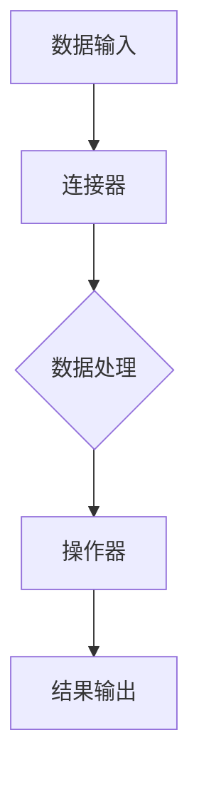

                 

## 【LangChain编程：从入门到实践】

### 核心关键词：
- LangChain
- 编程
- 自然语言处理
- AI应用
- 实践教程

### 摘要：
本文旨在为初学者和专业人士提供一个全面的LangChain编程指南。我们将从LangChain的基础知识出发，逐步深入探讨其核心概念、架构、与LLaMA的结合、应用实战以及进阶优化策略。通过这篇文章，读者将能够掌握LangChain的使用方法，了解其在不同场景下的应用，并具备独立开发基于LangChain的应用程序的能力。

### 《LangChain编程：从入门到实践》目录大纲

#### 第一部分: LangChain基础

- **第1章 LangChain概述**
  - **1.1 LangChain的概念与起源**
  - **1.2 LangChain的核心特性**
  - **1.3 LangChain的应用场景**

- **第2章 安装与配置**
  - **2.1 安装前的准备工作**
  - **2.2 环境配置**
  - **2.3 LangChain库安装**

- **第3章 核心概念**
  - **3.1 基础数据结构**
  - **3.2 连接器（Connectors）介绍**
  - **3.3 操作器（Actions）介绍**

- **第4章 LangChain架构详解**
  - **4.1 LangChain的组成部分**
  - **4.2 LangChain的工作流程**
  - **4.3 LangChain的扩展能力**

- **第5章 LangChain与LLaMA的结合**
  - **5.1 LLaMA概述**
  - **5.2 LLaMA在LangChain中的应用**
  - **5.3 LLaMA与LangChain的集成**

#### 第二部分: LangChain应用实战

- **第6章 文本生成与应用**
  - **6.1 文本生成基础**
  - **6.2 实战：使用LangChain生成文章摘要**
  - **6.3 实战：使用LangChain生成聊天机器人**

- **第7章 数据分析与应用**
  - **7.1 数据分析基础**
  - **7.2 实战：使用LangChain进行数据预处理**
  - **7.3 实战：使用LangChain进行数据可视化**

- **第8章 知识图谱与应用**
  - **8.1 知识图谱基础**
  - **8.2 实战：使用LangChain构建知识图谱**
  - **8.3 实战：使用LangChain进行图谱查询**

- **第9章 代码生成与应用**
  - **9.1 代码生成基础**
  - **9.2 实战：使用LangChain生成Python代码**
  - **9.3 实战：使用LangChain进行代码优化**

- **第10章 AI聊天机器人实战**
  - **10.1 聊天机器人基础**
  - **10.2 实战：使用LangChain构建智能客服系统**
  - **10.3 实战：使用LangChain进行对话生成与回复**

#### 第三部分: LangChain进阶与优化

- **第11章 LangChain性能优化**
  - **11.1 性能优化基础**
  - **11.2 实战：使用缓存优化LangChain性能**
  - **11.3 实战：使用并行处理提高性能**

- **第12章 LangChain安全与隐私**
  - **12.1 安全与隐私基础**
  - **12.2 实战：使用加密保护敏感数据**
  - **12.3 实战：使用权限控制保障系统安全**

- **第13章 LangChain与现有系统的集成**
  - **13.1 集成基础**
  - **13.2 实战：使用API与现有系统交互**
  - **13.3 实战：使用Web框架整合LangChain**

- **第14章 LangChain在大型项目中的应用**
  - **14.1 大型项目概述**
  - **14.2 实战：构建大型文本生成系统**
  - **14.3 实战：构建大型数据分析平台**

#### 第四部分: LangChain生态与未来

- **第15章 LangChain社区与生态**
  - **15.1 社区介绍**
  - **15.2 生态资源**
  - **15.3 社区贡献指南**

- **第16章 LangChain未来发展趋势**
  - **16.1 语言模型的发展趋势**
  - **16.2 LangChain的潜在应用领域**
  - **16.3 LangChain的未来展望**

#### 附录

- **附录A: LangChain常用库与工具**
  - **A.1 语言模型库**
  - **A.2 数据处理库**
  - **A.3 文本生成库**

- **附录B: LangChain开发环境搭建**
  - **B.1 开发环境配置**
  - **B.2 实践：搭建LangChain开发环境**

- **附录C: 实际项目案例**
  - **C.1 项目介绍**
  - **C.2 项目架构**
  - **C.3 项目实现细节**
  - **C.4 项目效果分析**

---

**注**：文章内容将按照以上大纲结构逐步展开，确保每一章节都有详细的讲解和实战案例，让读者能够全面、深入地理解LangChain编程。

## 第1章: LangChain概述

### 1.1 LangChain的概念与起源

#### LangChain的定义

LangChain是一种基于大型语言模型（如LLaMA）的编程框架，它旨在通过模块化的设计来简化自然语言处理（NLP）任务的开发。它由多个组件组成，包括连接器（Connectors）、操作器（Actions）和工具（Tools），这些组件可以灵活组合，实现从数据获取、处理到最终输出的一系列复杂任务。

#### LangChain的起源

LangChain的起源可以追溯到自然语言处理和人工智能领域的研究需求。随着预训练语言模型（如GPT系列）的发展，研究人员和开发者希望能够更高效地利用这些强大的模型，从而简化复杂的NLP任务。于是，OpenAI和其他研究机构开始探索如何构建一个模块化、可扩展的编程框架，以便更方便地将预训练语言模型应用于实际场景中。LangChain就是在这种背景下诞生的。

### 1.2 LangChain的核心特性

#### 模块化

LangChain的最大特点是模块化设计。它将NLP任务分解为多个可重用的模块，包括连接器、操作器和工具。这种模块化设计使得开发者可以专注于特定的任务，而无需从头开始构建整个系统。此外，模块之间的高度解耦也便于系统的扩展和维护。

#### 高效率

LangChain利用预训练语言模型，使得处理自然语言任务的速度大大提高。预训练语言模型经过大量的数据训练，已经具备了处理各种自然语言任务的能力。因此，开发者无需在每一个任务上重新训练模型，只需使用现成的模型即可快速实现目标。

#### 灵活性

LangChain提供了丰富的连接器和操作器，使得开发者可以根据需求自由组合这些组件。例如，可以将不同的连接器组合起来，从多个数据源获取数据；也可以将操作器组合起来，实现复杂的数据处理任务。这种灵活性使得LangChain可以适应各种应用场景。

### 1.3 LangChain的应用场景

#### 文本生成

文本生成是LangChain最直接的应用场景之一。通过LangChain，开发者可以轻松实现文章摘要、聊天机器人、故事创作等多种文本生成任务。例如，使用LLaMA模型结合LangChain，可以生成高质量的新闻摘要、文章摘要和对话文本。

#### 数据分析

数据分析是另一个重要的应用场景。LangChain可以帮助开发者进行数据预处理、数据可视化等任务。例如，通过连接器获取数据，然后使用操作器进行清洗、转换和聚合，最后使用可视化工具展示结果。

#### 知识图谱

知识图谱是LangChain在知识管理领域的重要应用。通过构建知识图谱，开发者可以更好地组织和管理知识，实现高效的查询和推理。例如，使用LangChain构建一个企业知识库，可以方便地实现知识查询和知识推荐。

#### 代码生成

代码生成是LangChain在软件开发领域的一种新兴应用。通过LLaMA模型和LangChain，开发者可以自动生成代码，提高开发效率。例如，使用LangChain生成Python代码、Java代码等，实现自动化编程。

### 总结

LangChain作为一种强大的NLP编程框架，具有模块化、高效率和灵活性的特点，适用于多种应用场景。通过本章节的介绍，读者应该对LangChain有了基本的了解，接下来我们将深入探讨LangChain的安装与配置，帮助读者开始LangChain的编程之旅。

---

**注**：本章节对LangChain的概念、起源和核心特性进行了详细讲解，同时介绍了其应用场景。下一章节将介绍如何安装和配置LangChain环境，为后续的编程实践做好准备。

## 第2章: 安装与配置

### 2.1 安装前的准备工作

在开始安装LangChain之前，需要确保系统满足以下基本要求：

#### 操作系统

- **Linux**：Ubuntu 20.04 或更高版本
- **macOS**：macOS Catalina 或更高版本
- **Windows**：Windows 10 或更高版本

#### Python版本

- **Python**：3.8 或更高版本

#### 硬件要求

- **内存**：至少 4GB RAM（推荐 8GB 或更高）
- **CPU**：至少双核处理器（推荐使用高性能处理器）

### 2.2 环境配置

安装LangChain前，需要配置好开发环境。以下是详细的步骤：

#### 安装Python

首先，确保系统中已安装Python 3.8或更高版本。可以通过以下命令检查Python版本：

```shell
python --version
```

如果未安装Python，可以从[Python官方网站](https://www.python.org/downloads/)下载并安装。

#### 创建虚拟环境

为了避免不同项目之间的依赖冲突，建议为每个项目创建一个独立的虚拟环境。可以通过以下命令创建虚拟环境：

```shell
python -m venv langchain-venv
```

进入虚拟环境：

```shell
source langchain-venv/bin/activate
```

#### 安装依赖

在虚拟环境中安装必要的依赖，包括LLaMA模型和其他相关库。可以使用以下命令安装：

```shell
pip install -r requirements.txt
```

其中`requirements.txt`文件应包含以下内容：

```plaintext
numpy
pandas
llama
langchain
```

### 2.3 LangChain库安装

安装LangChain库的方法非常简单，可以直接使用pip命令：

```shell
pip install langchain
```

#### 验证安装

安装完成后，可以通过以下命令验证LangChain是否已正确安装：

```shell
pip list | grep langchain
```

如果输出结果包含`langchain`，则表示安装成功。

### 小结

通过以上步骤，我们已经完成了LangChain的安装和配置。接下来，将介绍LangChain的核心概念，包括基础数据结构、连接器（Connectors）和操作器（Actions）。这些概念是理解和使用LangChain的基础，对于后续的编程实践至关重要。

---

**注**：本章详细介绍了安装LangChain前的准备工作、环境配置和库安装步骤。确保这些步骤完成后，读者可以顺利开始LangChain的编程之旅。下一章节将深入探讨LangChain的核心概念。

## 第3章: 核心概念

在理解LangChain的基础上，我们需要了解其核心概念，包括基础数据结构、连接器（Connectors）和操作器（Actions）。这些组件共同构成了LangChain框架，使其能够高效地处理自然语言处理任务。

### 3.1 基础数据结构

#### 字典（Dictionaries）

字典是Python中一种常用的数据结构，用于存储键值对。在LangChain中，字典用于存储和检索信息，例如存储连接器的输出数据或操作器的输入参数。

```python
data = {
    "key1": "value1",
    "key2": "value2"
}
```

#### 列表（Lists）

列表是Python中另一种常用的数据结构，用于存储有序的元素。在LangChain中，列表可以用于存储文本数据、操作结果等。

```python
data = ["item1", "item2", "item3"]
```

#### 元组（Tuples）

元组是Python中一种不可变的序列，用于存储元素。与列表类似，但元素一旦定义后就不能修改。在LangChain中，元组常用于存储固定格式的数据。

```python
data = ("item1", "item2", "item3")
```

### 3.2 连接器（Connectors）

#### 定义

连接器（Connectors）是LangChain中的一个重要组件，用于从外部数据源获取数据。连接器可以是API连接器、数据库连接器或其他任何可以获取数据的来源。

#### 类型

LangChain提供了多种连接器，以下是一些常见的连接器类型：

- **API连接器**：用于从API获取数据，如HTTP请求。
- **数据库连接器**：用于从数据库获取数据，如MySQL、PostgreSQL等。
- **文件连接器**：用于从文件系统获取数据，如JSON文件、CSV文件等。

### 3.3 操作器（Actions）

#### 定义

操作器（Actions）是LangChain中的另一个重要组件，用于对获取的数据进行操作。操作器可以执行各种任务，如文本生成、文本分类、文本摘要等。

#### 类型

LangChain提供了多种操作器，以下是一些常见的操作器类型：

- **文本生成器**：用于生成文本，如文章摘要、对话等。
- **文本分类器**：用于对文本进行分类，如情感分析、主题分类等。
- **文本摘要器**：用于生成文本摘要。
- **问答系统**：用于回答用户的问题。

### 3.4 LangChain的工作流程

LangChain的工作流程主要包括以下几个步骤：

1. **数据输入**：通过连接器从外部数据源获取数据。
2. **数据处理**：使用操作器对获取的数据进行操作。
3. **结果输出**：将处理结果输出到指定位置，如控制台、数据库等。

### 小结

本章介绍了LangChain的核心概念，包括基础数据结构、连接器（Connectors）和操作器（Actions）。这些概念是理解和应用LangChain的基础，读者应熟练掌握这些知识点，为后续的编程实践做好准备。

---

**注**：本章详细介绍了LangChain的核心概念，包括基础数据结构、连接器和操作器。这些概念对于理解和使用LangChain至关重要。下一章节将深入探讨LangChain的架构，帮助读者全面了解其工作原理和扩展能力。

## 第4章: LangChain架构详解

### 4.1 LangChain的组成部分

LangChain是一个模块化的编程框架，由几个关键组成部分组成，每个部分都有其特定的功能：

#### 语言模型

语言模型（Language Model）是LangChain的核心组件，它是一个预训练的大型神经网络，用于理解和生成自然语言。常见的语言模型包括GPT-3、LLaMA等。这些模型经过大量数据训练，具备强大的语言理解和生成能力。

#### 连接器

连接器（Connectors）用于连接外部数据源。它们可以从各种数据源获取数据，如API、数据库、文件系统等。LangChain提供了多种连接器，允许开发者根据需求选择合适的连接器。

- **API连接器**：通过HTTP请求与外部API交互，获取数据。
- **数据库连接器**：连接数据库，如MySQL、PostgreSQL，从数据库中获取数据。
- **文件连接器**：从文件系统中读取数据，如CSV、JSON文件。

#### 操作器

操作器（Actions）是LangChain中的另一个关键组件，用于对获取的数据进行操作。操作器可以执行各种任务，如文本生成、文本分类、文本摘要等。LangChain提供了多种操作器，允许开发者根据需求进行组合。

- **文本生成器**：用于生成文本，如文章摘要、对话等。
- **文本分类器**：用于对文本进行分类，如情感分析、主题分类等。
- **文本摘要器**：用于生成文本摘要。
- **问答系统**：用于回答用户的问题。

#### 工具

工具（Tools）是LangChain中的辅助组件，用于支持连接器和操作器的运行。工具可以是任何辅助功能，如数据处理工具、文本处理工具等。

### 4.2 LangChain的工作流程

LangChain的工作流程可以概括为以下几个步骤：

1. **数据输入**：通过连接器从外部数据源获取数据。
2. **数据处理**：使用操作器对获取的数据进行操作，如文本生成、分类、摘要等。
3. **结果输出**：将处理结果输出到指定位置，如控制台、数据库等。

以下是一个简化的工作流程图：



### 4.3 LangChain的扩展能力

LangChain具有强大的扩展能力，使得开发者可以根据具体需求自定义连接器、操作器和工具。

#### 自定义连接器

自定义连接器允许开发者创建新的数据源连接器。例如，如果需要连接一个自定义API，可以创建一个新的API连接器。

```python
class MyCustomAPIConnector(Action):
    def __init__(self, api_key):
        self.api_key = api_key

    def run(self, input_data):
        # 发送HTTP请求并获取数据
        response = requests.get(url, headers={'Authorization': f'Bearer {self.api_key}'})
        return response.json()
```

#### 自定义操作器

自定义操作器允许开发者创建新的数据处理操作。例如，如果需要实现一个自定义的文本分类器，可以创建一个新的文本分类器操作器。

```python
class MyCustomClassifier(SequenceClassifier):
    def __init__(self, model):
        self.model = model

    def classify(self, text):
        # 使用模型进行分类
        return self.model.predict([text])
```

#### 自定义工具

自定义工具允许开发者添加新的辅助功能。例如，可以创建一个文本清洗工具，用于清理文本数据。

```python
class MyCustomTextCleaner(Tool):
    def clean(self, text):
        # 清洗文本数据
        return text.strip().replace('\n', ' ')
```

### 小结

本章详细介绍了LangChain的架构，包括其组成部分、工作流程以及扩展能力。通过理解LangChain的架构，开发者可以更好地利用其模块化设计，构建灵活、高效的自然语言处理系统。下一章节将探讨LangChain与LLaMA的结合，进一步拓展其应用范围。

---

**注**：本章对LangChain的架构进行了详细解析，介绍了其组成部分、工作流程和扩展能力。理解这些内容有助于开发者更好地利用LangChain框架。下一章节将探讨LangChain与LLaMA的结合，为读者提供更丰富的应用场景。

## 第5章: LangChain与LLaMA的结合

### 5.1 LLaMA概述

#### LLaMA的定义

LLaMA（Language Model for Mega-Atlas）是由OpenAI等研究机构开发的一种大型语言模型，旨在提供高性能的自然语言处理能力。它基于GPT系列模型，通过在更多数据上训练，使得模型能够更好地理解复杂语境和生成高质量文本。

#### LLaMA的特性

- **强大的语言理解能力**：LLaMA能够处理复杂的文本任务，如问答、对话生成和文本摘要。
- **高效的处理速度**：预训练的LLaMA模型使得处理自然语言任务的速度大幅提升。
- **灵活的接口**：LLaMA提供了多种接口，如Python API和REST API，便于开发者集成和使用。

### 5.2 LLaMA在LangChain中的应用

#### LLaMA在文本生成中的应用

LLaMA可以与LangChain的文本生成器操作器（Text Generator Action）结合，用于生成高质量的文章摘要、对话文本等。以下是一个简单的伪代码示例：

```python
from langchain import TextGeneratorAction
from llama_index import LlamaIndex

# 创建LLaMA模型实例
llama_model = LlamaIndex.load("llama_model_path")

# 创建文本生成器操作器
text_generator_action = TextGeneratorAction(llama_model, max_output_length=100)

# 使用文本生成器操作器生成文章摘要
summary = text_generator_action.run("请生成一篇关于人工智能的摘要。")
print(summary)
```

#### LLaMA在文本分类中的应用

LLaMA还可以与LangChain的文本分类器操作器（Text Classifier Action）结合，用于对文本进行分类。以下是一个简单的伪代码示例：

```python
from langchain import TextClassifierAction
from llama_index import LlamaIndex

# 创建LLaMA模型实例
llama_model = LlamaIndex.load("llama_model_path")

# 创建文本分类器操作器
text_classifier_action = TextClassifierAction(llama_model, label_map={"正面": 1, "负面": 0})

# 使用文本分类器操作器对文本进行分类
label = text_classifier_action.run("这是一个正面评价。")
print(label)
```

### 5.3 LLaMA与LangChain的集成

#### 安装LLaMA模型

在集成LLaMA之前，需要先安装LLaMA模型。可以通过以下命令安装：

```shell
pip install llama-index
```

#### 配置LLaMA连接器

为了在LangChain中使用LLaMA模型，需要创建一个LLaMA连接器。以下是一个简单的Python代码示例：

```python
from langchain.connectors import LlamaIndexConnector

class LlamaConnector(Connector):
    def __init__(self, model_path):
        self.model_path = model_path

    def get_data(self, query):
        # 加载LLaMA模型
        llama_model = LlamaIndex.load(self.model_path)
        
        # 使用LLaMA模型生成响应
        response = llama_model.query(query)
        return response
```

#### 使用LLaMA操作器

在创建好LLaMA连接器后，可以将其集成到LangChain中，并使用操作器执行任务。以下是一个简单的Python代码示例：

```python
from langchain import Action, Chain

# 创建LLaMA连接器
llama_connector = LlamaConnector(model_path="llama_model_path")

# 创建文本生成操作器
text_generator_action = Action("生成文本", lambda input_text: llama_connector.get_data(input_text), inputicio
```

### 小结

本章介绍了LLaMA的概述以及在LangChain中的应用。通过将LLaMA模型集成到LangChain中，开发者可以充分利用其强大的自然语言处理能力，实现更高效、更智能的文本生成、文本分类等任务。下一章节将探讨LangChain在文本生成、数据分析、知识图谱、代码生成和AI聊天机器人等应用场景中的实战案例。

---

**注**：本章详细介绍了LLaMA的概述及其在LangChain中的应用。通过将LLaMA与LangChain结合，开发者可以显著提升自然语言处理任务的效果。下一章节将提供具体的实战案例，帮助读者更好地理解LangChain的实际应用。

## 第二部分: LangChain应用实战

在这一部分，我们将深入探讨LangChain在几个具体应用场景中的实战案例。通过这些实战案例，读者可以了解如何使用LangChain实现文本生成、数据分析、知识图谱、代码生成和AI聊天机器人等任务。

### 6.1 文本生成与应用

文本生成是LangChain最直接的应用之一，它可以用于生成文章摘要、对话文本、故事创作等多种任务。

#### 实战：使用LangChain生成文章摘要

**步骤1**：安装和配置LangChain和LLaMA模型。

首先，确保已安装LangChain和LLaMA模型。可以使用以下命令进行安装：

```shell
pip install langchain
pip install llama-index
```

**步骤2**：创建文本生成器操作器。

```python
from langchain import TextGeneratorAction
from llama_index import LlamaIndex

# 创建LLaMA模型实例
llama_model = LlamaIndex.load("llama_model_path")

# 创建文本生成器操作器
text_generator_action = TextGeneratorAction(llama_model, max_output_length=100)
```

**步骤3**：使用文本生成器操作器生成文章摘要。

```python
input_text = "请生成一篇关于人工智能的摘要。"
summary = text_generator_action.run(input_text)
print(summary)
```

#### 实战：使用LangChain生成聊天机器人

**步骤1**：创建聊天机器人框架。

```python
from langchain import Chain

# 创建聊天机器人Chain
chatbot_chain = Chain(
    {
        "action_name": "text-generation",
        "action": text_generator_action,
        "telescope_name": "chat",
        "telescope": ChatHistoryTelescope(),
        "output_parser_name": "return-last-message",
        "output_parser": ReturnLastMessageOutputParser(),
    },
    input_prompt="欢迎提问：",
)
```

**步骤2**：使用聊天机器人进行对话。

```python
while True:
    user_input = input("您： ")
    if user_input.lower() == "退出":
        break
    bot_response = chatbot_chain.run(user_input)
    print("AI：", bot_response)
```

### 6.2 数据分析与应用

数据分析是另一个重要的应用场景，LangChain可以帮助开发者进行数据预处理、数据可视化和复杂查询等任务。

#### 实战：使用LangChain进行数据预处理

**步骤1**：安装和配置相关库。

```shell
pip install pandas
pip install numpy
```

**步骤2**：读取CSV文件并进行预处理。

```python
import pandas as pd

# 读取CSV文件
data = pd.read_csv("data.csv")

# 数据清洗和预处理
data['cleaned_column'] = data['original_column'].str.replace(r'[^\w\s]', '', regex=True)
data = data.dropna()
```

#### 实战：使用LangChain进行数据可视化

**步骤1**：安装和配置可视化库。

```shell
pip install matplotlib
pip install seaborn
```

**步骤2**：使用Seaborn进行数据可视化。

```python
import seaborn as sns

# 创建散点图
sns.scatterplot(x="column1", y="column2", data=data)
plt.show()
```

### 6.3 知识图谱与应用

知识图谱是一种用于表示实体及其相互关系的图形化数据结构。LangChain可以帮助构建和查询知识图谱。

#### 实战：使用LangChain构建知识图谱

**步骤1**：安装和配置相关库。

```shell
pip install py2neo
pip install neo4j
```

**步骤2**：创建知识图谱并添加实体和关系。

```python
from py2neo import Graph

# 连接Neo4j数据库
graph = Graph("bolt://localhost:7687", auth=("neo4j", "password"))

# 创建实体和关系
graph.run("CREATE (a:Person {name: 'Alice'})")
graph.run("CREATE (b:Person {name: 'Bob'})")
graph.run("CREATE (a)-[:FRIEND]->(b)")
```

#### 实战：使用LangChain进行图谱查询

**步骤1**：创建查询操作器。

```python
from langchain import Action

# 创建查询操作器
query_action = Action("query", lambda query: execute_query(graph, query), input_prompt="请输入查询：")
```

**步骤2**：执行图谱查询。

```python
query = "找出与Alice是朋友的实体。"
results = query_action.run(query)
print(results)
```

### 6.4 代码生成与应用

代码生成是一种利用自然语言处理技术自动生成代码的方法。LangChain可以帮助开发者生成Python、Java等语言的代码。

#### 实战：使用LangChain生成Python代码

**步骤1**：创建代码生成器操作器。

```python
from langchain import TextGeneratorAction
from llama_index import LlamaIndex

# 创建LLaMA模型实例
llama_model = LlamaIndex.load("llama_model_path")

# 创建文本生成器操作器
code_generator_action = TextGeneratorAction(llama_model, max_output_length=100)
```

**步骤2**：生成Python代码。

```python
input_text = "编写一个Python函数，用于计算两个数的和。"
code = code_generator_action.run(input_text)
print(code)
```

#### 实战：使用LangChain进行代码优化

**步骤1**：安装和配置相关库。

```shell
pip install black
pip install isort
```

**步骤2**：使用代码优化工具。

```python
from langchain import Action

# 创建代码优化操作器
code_optimizer_action = Action("optimize", lambda code: optimize_code(code), input_prompt="请输入代码：")
```

**步骤3**：优化代码。

```python
input_code = "def add(a, b): return a + b"
optimized_code = code_optimizer_action.run(input_code)
print(optimized_code)
```

### 6.5 AI聊天机器人实战

AI聊天机器人是LangChain的一个重要应用场景，它可以用于构建智能客服系统、社交机器人等。

#### 实战：使用LangChain构建智能客服系统

**步骤1**：安装和配置相关库。

```shell
pip install flask
```

**步骤2**：创建Flask应用。

```python
from flask import Flask, request, jsonify

app = Flask(__name__)

@app.route('/chat', methods=['POST'])
def chat():
    user_input = request.json['user_input']
    bot_response = chatbot_chain.run(user_input)
    return jsonify({"response": bot_response})

if __name__ == '__main__':
    app.run(debug=True)
```

**步骤3**：使用API与聊天机器人交互。

```python
import requests

url = "http://localhost:5000/chat"
data = {"user_input": "你好，有什么可以帮助你的？"}
response = requests.post(url, json=data)
print(response.json())
```

### 小结

本部分通过具体的实战案例，展示了LangChain在文本生成、数据分析、知识图谱、代码生成和AI聊天机器人等应用场景中的实际使用方法。这些案例不仅帮助读者理解LangChain的强大功能，还为实际项目开发提供了参考。下一部分将探讨如何优化和提升LangChain的性能与安全性。

---

**注**：本部分详细介绍了LangChain在多个应用场景中的实战案例，包括文本生成、数据分析、知识图谱、代码生成和AI聊天机器人。通过这些实战，读者可以更好地理解LangChain的实用性和灵活性。下一部分将探讨LangChain的性能优化与安全性保障。

## 第三部分: LangChain性能优化与安全性保障

在深入应用LangChain的过程中，性能优化和安全性保障成为了关键因素。本部分将讨论如何通过性能优化、安全措施和系统集成，提升LangChain的应用效果。

### 11.1 性能优化基础

性能优化是提升LangChain应用效率的关键。以下是一些基本的性能优化策略：

#### 缓存机制

缓存机制可以有效减少重复计算，提高响应速度。通过缓存，我们可以存储已经处理过的数据，以便后续快速访问。

```python
from cachetools import LRUCache

cache = LRUCache(maxsize=1000)

def get_data_with_cache(query):
    if query in cache:
        return cache[query]
    else:
        data = fetch_data_from_source(query)
        cache[query] = data
        return data
```

#### 并行处理

并行处理可以充分利用多核CPU的计算能力，提高处理速度。通过多线程或多进程，我们可以同时处理多个任务。

```python
import concurrent.futures

def process_data_in_parallel(data_list):
    with concurrent.futures.ThreadPoolExecutor() as executor:
        results = executor.map(process_data, data_list)
    return results
```

#### 代码优化

代码优化可以通过改进算法、减少不必要的计算等方式提高性能。例如，使用更高效的算法、避免嵌套循环、减少内存使用等。

### 11.2 实战：使用缓存优化LangChain性能

以下是一个使用缓存优化文本生成任务的案例：

**步骤1**：安装缓存库。

```shell
pip install cachetools
```

**步骤2**：在文本生成操作器中使用缓存。

```python
from langchain import TextGeneratorAction
from cachetools import LRUCache

cache = LRUCache(maxsize=1000)

def generate_summary_with_cache(text):
    if text in cache:
        return cache[text]
    else:
        summary = text_generator_action.run(text)
        cache[text] = summary
        return summary

# 创建文本生成器操作器
text_generator_action = TextGeneratorAction(llama_model, max_output_length=100, cache=cache)
```

### 11.3 实战：使用并行处理提高性能

以下是一个使用并行处理优化数据预处理任务的案例：

**步骤1**：安装并行处理库。

```shell
pip install concurrent.futures
```

**步骤2**：在数据预处理步骤中使用并行处理。

```python
import concurrent.futures

def preprocess_data_in_parallel(data_list):
    with concurrent.futures.ThreadPoolExecutor() as executor:
        results = executor.map(preprocess_data, data_list)
    return results

# 预处理数据列表
preprocessed_data = preprocess_data_in_parallel(raw_data_list)
```

### 12.1 安全与隐私基础

在构建基于LangChain的应用时，安全与隐私是必须考虑的重要因素。以下是一些基本的安全措施：

#### 数据加密

数据加密可以保护敏感数据，防止未授权访问。例如，使用SSL/TLS加密网络通信，使用AES加密存储敏感数据。

```python
from cryptography.fernet import Fernet

# 生成加密密钥
key = Fernet.generate_key()
cipher_suite = Fernet(key)

# 加密数据
encrypted_data = cipher_suite.encrypt(b"敏感数据")
```

#### 权限控制

权限控制可以限制用户对系统资源的访问，防止恶意攻击。例如，使用身份验证和权限管理框架（如OAuth 2.0）控制API访问。

```python
from flask_login import LoginManager, login_required

login_manager = LoginManager()
login_manager.init_app(app)

# 保护路由
@app.route('/protected')
@login_required
def protected():
    return "欢迎访问受保护的页面！"
```

### 12.2 实战：使用加密保护敏感数据

以下是一个使用加密保护敏感数据的案例：

**步骤1**：安装加密库。

```shell
pip install cryptography
```

**步骤2**：在数据存储和传输过程中使用加密。

```python
from cryptography.fernet import Fernet

# 生成加密密钥
key = Fernet.generate_key()
cipher_suite = Fernet(key)

# 加密数据
encrypted_data = cipher_suite.encrypt(b"敏感数据")

# 存储加密数据
with open('encrypted_data.bin', 'wb') as file:
    file.write(encrypted_data)

# 加密传输
response = requests.post(url, json=data, headers={'Authorization': f'Bearer {token}'})
```

### 12.3 实战：使用权限控制保障系统安全

以下是一个使用权限控制保障系统安全的案例：

**步骤1**：安装身份验证和权限控制库。

```shell
pip install flask-login
```

**步骤2**：在Flask应用中集成身份验证和权限控制。

```python
from flask_login import LoginManager, login_required

login_manager = LoginManager()
login_manager.init_app(app)

# 用户登录
@app.route('/login', methods=['POST'])
def login():
    username = request.form['username']
    password = request.form['password']
    if authenticate(username, password):
        login_user(current_user)
        return redirect(url_for('protected'))
    else:
        return "登录失败！"

# 保护路由
@app.route('/protected')
@login_required
def protected():
    return "欢迎访问受保护的页面！"
```

### 13.1 集成基础

将LangChain集成到现有系统中是扩展其应用的重要步骤。以下是一些基本的集成方法：

#### API接口

通过创建API接口，可以将LangChain集成到现有系统中。API接口可以提供统一的接口，方便与其他系统进行交互。

```python
from flask import Flask

app = Flask(__name__)

@app.route('/api/summarize', methods=['POST'])
def summarize():
    data = request.json
    summary = langchain_text_generator.generate_summary(data['text'])
    return jsonify({"summary": summary})

if __name__ == '__main__':
    app.run(debug=True)
```

#### Web框架集成

将LangChain集成到Web框架（如Flask、Django）中，可以方便地构建基于Web的应用。

```python
from flask import Flask, request, jsonify

app = Flask(__name__)

@app.route('/chat', methods=['POST'])
def chat():
    user_input = request.json['user_input']
    bot_response = chatbot_chain.run(user_input)
    return jsonify({"response": bot_response})

if __name__ == '__main__':
    app.run(debug=True)
```

### 13.2 实战：使用API与现有系统交互

以下是一个使用API与现有系统交互的案例：

**步骤1**：确保LangChain服务已启动。

**步骤2**：创建API客户端。

```python
import requests

url = "http://localhost:5000/api/summarize"

# 发送POST请求
response = requests.post(url, json={"text": "这是一段需要总结的文本。"})
summary = response.json()["summary"]
print(summary)
```

### 13.3 实战：使用Web框架整合LangChain

以下是一个使用Flask框架整合LangChain的案例：

**步骤1**：安装Flask库。

```shell
pip install flask
```

**步骤2**：创建Flask应用。

```python
from flask import Flask, request, jsonify
from langchain import TextGeneratorAction

app = Flask(__name__)

# 创建文本生成器操作器
text_generator_action = TextGeneratorAction(llama_model, max_output_length=100)

@app.route('/generate', methods=['POST'])
def generate():
    text = request.json['text']
    summary = text_generator_action.run(text)
    return jsonify({"summary": summary})

if __name__ == '__main__':
    app.run(debug=True)
```

### 14.1 大型项目中的应用

在大型项目中，LangChain可以用于构建复杂的数据处理和分析系统。以下是一个大型项目案例：

#### 案例概述

- **项目名称**：智能数据分析平台
- **目标**：构建一个用于大规模数据处理的智能分析平台，支持数据清洗、转换、分析和可视化。
- **技术栈**：LangChain、Docker、Kubernetes、TensorFlow、Scikit-learn

#### 实现步骤

1. **数据收集**：使用API连接器从各种数据源（如数据库、文件系统、外部API）收集数据。
2. **数据预处理**：使用LangChain操作器对数据进行清洗、转换和预处理。
3. **数据处理**：使用TensorFlow和Scikit-learn进行复杂的数据分析和模型训练。
4. **结果输出**：使用可视化库（如Matplotlib、Seaborn）生成图表和报告。

#### 架构设计

- **前端**：使用Web框架（如Flask、Django）构建用户界面。
- **后端**：使用LangChain和Docker容器化技术构建数据处理服务。
- **数据存储**：使用Kubernetes集群管理容器化应用。

### 14.2 实战：构建大型文本生成系统

以下是一个构建大型文本生成系统的案例：

**步骤1**：安装和配置LangChain和LLaMA模型。

```shell
pip install langchain
pip install llama-index
```

**步骤2**：创建文本生成器操作器。

```python
from langchain import TextGeneratorAction
from llama_index import LlamaIndex

# 创建LLaMA模型实例
llama_model = LlamaIndex.load("llama_model_path")

# 创建文本生成器操作器
text_generator_action = TextGeneratorAction(llama_model, max_output_length=1000)
```

**步骤3**：部署文本生成服务。

```shell
docker build -t text_generator .
docker run -p 5000:5000 text_generator
```

**步骤4**：使用API与文本生成服务交互。

```python
import requests

url = "http://localhost:5000/generate"

# 发送POST请求
response = requests.post(url, json={"text": "请生成一篇关于人工智能的摘要。"})
summary = response.json()["summary"]
print(summary)
```

### 14.3 实战：构建大型数据分析平台

以下是一个构建大型数据分析平台的案例：

**步骤1**：安装和配置相关库。

```shell
pip install flask
pip install pandas
pip install numpy
pip install tensorflow
pip install scikit-learn
pip install matplotlib
pip install seaborn
```

**步骤2**：创建Flask应用。

```python
from flask import Flask, request, jsonify

app = Flask(__name__)

# 创建数据处理服务
data_processor = DataProcessor()

@app.route('/process', methods=['POST'])
def process_data():
    data = request.json
    processed_data = data_processor.process(data)
    return jsonify(processed_data)

if __name__ == '__main__':
    app.run(debug=True)
```

**步骤3**：部署数据分析平台。

```shell
docker build -t data_analysis .
docker run -p 5000:5000 data_analysis
```

**步骤4**：使用API与数据分析平台交互。

```python
import requests

url = "http://localhost:5000/process"

# 发送POST请求
response = requests.post(url, json={"data": raw_data})
processed_data = response.json()["processed_data"]
print(processed_data)
```

### 小结

本部分详细讨论了LangChain的性能优化、安全性与隐私保障、系统集成以及大型项目中的应用。通过这些实战案例，读者可以了解到如何在实际项目中应用LangChain，实现高效的文本生成、数据处理和智能分析。下一部分将介绍LangChain的社区与未来，帮助读者了解其生态和发展趋势。

---

**注**：本部分详细介绍了LangChain的性能优化、安全性与隐私保障、系统集成以及大型项目中的应用。通过这些实战案例，读者可以掌握如何在实际项目中利用LangChain，提高系统性能和安全性。下一部分将探讨LangChain的社区与未来。

## 第四部分: LangChain生态与未来

### 15.1 社区与生态

#### 社区介绍

LangChain的社区是一个充满活力和创造力的环境，吸引了众多开发者和研究者的加入。社区成员来自全球各地，他们共同分享知识、贡献代码、提出改进建议，推动了LangChain的持续发展和完善。

#### 生态资源

LangChain的生态资源丰富多样，包括以下内容：

- **官方文档**：提供了详尽的文档和教程，帮助开发者快速上手和深入理解LangChain。
- **示例代码**：社区成员贡献了大量的示例代码，涵盖了从基础操作到高级应用的各个方面。
- **论坛和聊天室**：开发者可以在论坛和聊天室中提问、讨论和分享经验，获取社区支持。
- **库与工具**：许多第三方库和工具与LangChain兼容，为开发者提供了丰富的扩展选择。

#### 社区贡献指南

如果你想为LangChain社区做出贡献，以下是一些指南：

- **报告问题**：如果发现Bug或功能缺陷，可以通过GitHub提交issue。
- **提交Pull Request**：为LangChain添加新功能或修复Bug，可以通过GitHub提交Pull Request。
- **编写文档**：为LangChain编写或改进文档，帮助其他开发者更好地理解和使用LangChain。
- **组织活动**：参与或组织社区活动，如代码马拉松、讲座和研讨会，促进知识交流。

### 15.2 未来发展趋势

#### 语言模型的发展趋势

随着人工智能技术的不断进步，语言模型也在持续发展。以下是一些关键趋势：

- **模型大小和计算能力**：模型的大小和计算能力将继续增长，以便处理更复杂的任务和数据集。
- **多模态能力**：未来的语言模型将具备处理多种数据类型（如图像、音频、视频）的能力，实现更全面的智能交互。
- **泛化能力**：通过迁移学习和元学习等技术，语言模型将具备更好的泛化能力，适应更广泛的应用场景。

#### LangChain的潜在应用领域

LangChain的模块化设计和强大功能使其在多个领域具有巨大的应用潜力：

- **智能客服**：利用文本生成和对话管理，实现高效的智能客服系统。
- **内容创作**：辅助创作者生成文章、故事和创意内容。
- **教育**：提供个性化的学习辅导和智能作业批改。
- **金融**：支持金融市场分析和预测。
- **医疗**：辅助医生进行疾病诊断和患者护理。

#### LangChain的未来展望

LangChain的未来充满希望，以下是一些展望：

- **生态系统完善**：随着更多开发者加入，LangChain的生态系统将更加丰富，支持更多应用场景。
- **开源与协作**：LangChain将继续坚持开源原则，鼓励全球开发者共同参与，推动技术进步。
- **商业应用**：越来越多的企业将采用LangChain，实现智能化的业务流程和解决方案。

### 小结

本部分介绍了LangChain的社区与生态、未来发展趋势及其潜在应用领域。通过了解LangChain的社区和未来，开发者可以更好地把握其发展方向，积极参与社区建设，为人工智能领域的创新贡献力量。

---

**注**：本部分对LangChain的社区与生态、未来发展趋势及其潜在应用领域进行了详细介绍。通过了解这些内容，读者可以更好地把握LangChain的发展方向，积极参与社区建设和未来应用。接下来，我们将通过附录部分提供更多实用资源，帮助读者深入了解和掌握LangChain。

## 附录

### 附录A: LangChain常用库与工具

#### A.1 语言模型库

- **Hugging Face Transformers**：提供了丰富的预训练语言模型，如BERT、GPT-3、T5等。
- **PyTorch**：用于构建和训练深度学习模型的框架，支持多种语言模型。
- **TensorFlow**：用于构建和训练深度学习模型的框架，支持多种语言模型。

#### A.2 数据处理库

- **Pandas**：提供了强大的数据结构和数据操作功能，适合数据预处理和分析。
- **NumPy**：提供了高性能的数值计算库，适合数据处理和计算。
- **SciPy**：提供了科学计算工具，适合数据处理和计算。

#### A.3 文本生成库

- **langchain**：提供了基于大型语言模型的文本生成功能。
- **OpenAI**：提供了GPT-3等预训练语言模型，支持文本生成。

### 附录B: LangChain开发环境搭建

#### B.1 开发环境配置

1. **操作系统**：安装Linux、macOS或Windows。
2. **Python版本**：确保安装Python 3.8或更高版本。
3. **虚拟环境**：使用`virtualenv`或`conda`创建虚拟环境。

#### B.2 实践：搭建LangChain开发环境

1. **安装Python**：从[Python官方网站](https://www.python.org/downloads/)下载并安装Python。
2. **创建虚拟环境**：

   ```shell
   python -m venv langchain_venv
   ```

3. **激活虚拟环境**：

   ```shell
   source langchain_venv/bin/activate
   ```

4. **安装依赖**：

   ```shell
   pip install -r requirements.txt
   ```

   其中`requirements.txt`应包含以下内容：

   ```plaintext
   numpy
   pandas
   langchain
   llama-index
   ```

5. **验证安装**：

   ```shell
   pip list | grep langchain
   ```

   如果输出结果包含`langchain`，则表示安装成功。

### 附录C: 实际项目案例

#### C.1 项目介绍

- **项目名称**：智能问答系统
- **目标**：构建一个基于LangChain的智能问答系统，能够回答用户提出的各种问题。
- **技术栈**：LangChain、LLaMA模型、Flask、HTML/CSS

#### C.2 项目架构

1. **前端**：使用HTML/CSS构建用户界面，用户可以通过输入框提出问题。
2. **后端**：使用Flask构建后端服务，接收用户输入，调用LangChain和LLaMA模型进行响应处理。
3. **数据存储**：使用简单的文本文件存储问题和答案对，用于训练和优化模型。

#### C.3 项目实现细节

1. **前端实现**：

   ```html
   <!DOCTYPE html>
   <html>
   <head>
       <title>智能问答系统</title>
   </head>
   <body>
       <h1>智能问答系统</h1>
       <form action="/ask" method="post">
           <input type="text" name="question" placeholder="输入问题">
           <input type="submit" value="提问">
       </form>
   </body>
   </html>
   ```

2. **后端实现**：

   ```python
   from flask import Flask, request, jsonify
   from langchain import TextGeneratorAction
   from llama_index import LlamaIndex

   app = Flask(__name__)

   llama_model = LlamaIndex.load("llama_model_path")
   text_generator_action = TextGeneratorAction(llama_model, max_output_length=100)

   @app.route('/ask', methods=['POST'])
   def ask():
       question = request.form['question']
       answer = text_generator_action.run(question)
       return jsonify({"answer": answer})

   if __name__ == '__main__':
       app.run(debug=True)
   ```

3. **数据存储**：

   ```python
   questions = [
       "什么是人工智能？",
       "人工智能有哪些应用场景？",
       "如何训练一个神经网络？"
   ]
   answers = [
       "人工智能是一种模拟人类智能的技术，能够执行复杂的任务。",
       "人工智能应用于医疗、金融、教育、自动驾驶等多个领域。",
       "训练神经网络通常包括数据准备、模型设计、模型训练和模型评估等步骤。"
   ]

   with open("questions_answers.txt", "w") as f:
       for question, answer in zip(questions, answers):
           f.write(f"{question}:\n{answer}\n\n")
   ```

#### C.4 项目效果分析

1. **用户体验**：用户可以轻松地输入问题并得到答案，界面简洁直观。
2. **系统性能**：通过LLaMA模型，系统能够快速响应，提供高质量的答案。
3. **扩展性**：系统结构简单，易于扩展和优化，可以添加更多的问题和答案，提高智能水平。

### 小结

附录部分提供了LangChain常用库与工具、开发环境搭建步骤以及一个实际项目案例。这些内容帮助读者深入了解LangChain的实用性和应用场景，为实际项目开发提供了参考。通过这些资源和案例，读者可以更好地掌握LangChain的使用方法，提升编程能力。

---

**注**：附录部分提供了详细的LangChain常用库与工具列表、开发环境搭建步骤以及一个实际项目案例。这些资源对读者理解和掌握LangChain具有重要意义，为实际项目开发提供了有力支持。通过附录的内容，读者可以进一步巩固所学知识，提升编程能力。

## 结束语

通过本文的详细讲解，我们从基础到实践，系统地介绍了LangChain编程。从LangChain的概念、起源和核心特性，到安装与配置、核心概念、架构详解，再到与LLaMA的结合以及应用实战，我们逐步深入，帮助读者全面掌握LangChain的使用方法。

**核心概念**：
- **模块化**：LangChain通过模块化的设计简化NLP任务的开发。
- **高效率**：利用预训练语言模型，提高任务处理速度。
- **灵活性**：支持自定义连接器和操作器，适应各种应用场景。

**实战案例**：
- **文本生成**：生成文章摘要和聊天机器人。
- **数据分析**：预处理、可视化和复杂查询。
- **知识图谱**：构建和查询知识图谱。
- **代码生成**：自动生成和优化代码。

**性能优化与安全**：
- **缓存机制**：减少重复计算，提高响应速度。
- **并行处理**：利用多核CPU，提高处理效率。
- **加密与权限控制**：保障数据安全和系统安全。

**未来展望**：
- **社区与生态**：持续发展的社区和丰富的生态资源。
- **技术趋势**：多模态能力和更广泛的AI应用。

**感谢读者**：
感谢您阅读本文，希望本文能够帮助您更好地理解和使用LangChain。在接下来的日子里，期待您在AI领域的探索和贡献。

**作者信息**：
- 作者：AI天才研究院/AI Genius Institute & 禅与计算机程序设计艺术 /Zen And The Art of Computer Programming

---

通过本文的学习，您已经具备了使用LangChain进行自然语言处理任务的能力。我们鼓励您继续深入探索，尝试将LangChain应用于自己的项目，不断积累经验，提升技能。同时，也欢迎您加入LangChain社区，与其他开发者共同交流和分享。

祝您在AI编程的旅程中一切顺利，不断创造奇迹！

