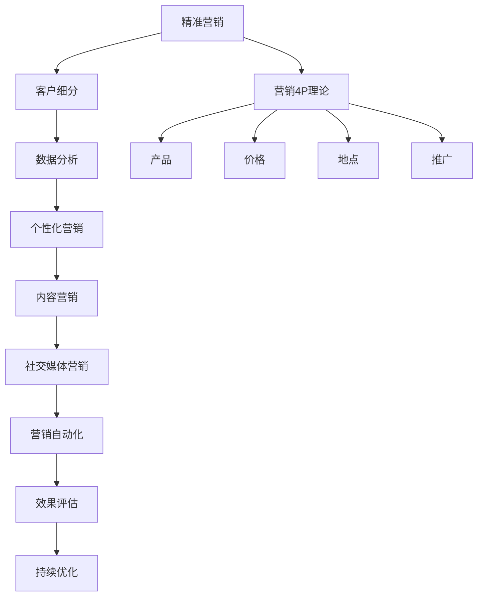

                 

### 《一人公司如何实现精准营销和客户细分》

#### 关键词：精准营销、客户细分、一人公司、数据分析、个性化策略

> 摘要：本文旨在探讨一人公司如何利用精准营销和客户细分策略，提高市场营销效果。文章首先介绍了精准营销和客户细分的理论基础，随后通过实际案例和数学模型，详细讲解了如何通过数据分析实现精准营销和客户细分。此外，本文还介绍了多种营销策略和实践方法，以及营销效果的评估和持续优化，为一人公司的营销提供全面指导。

### 第一部分：精准营销理论基础

#### 1.1 精准营销概述

##### 1.1.1 精准营销的概念

精准营销，即精确营销，是一种基于数据分析、客户行为研究和市场细分的高效营销策略。它通过精确识别目标客户，针对特定人群提供个性化的产品和服务，从而提高营销效果和客户满意度。

##### 1.1.2 精准营销与传统营销的比较

与传统营销相比，精准营销具有以下特点：

- **目标明确**：精准营销注重对目标客户的精确识别，通过大数据和客户行为分析，实现精准定位。
- **个性化**：精准营销强调个性化服务，根据客户需求提供定制化的产品和服务。
- **高效**：精准营销通过数据驱动的决策，优化营销资源分配，提高营销效果。

#### 1.2 营销4P理论

##### 1.2.1 产品（Product）

产品是营销的核心，一人公司应确保产品的独特性和市场竞争力。产品应满足客户需求，同时具备良好的品质和合理的价格。

##### 1.2.2 价格（Price）

价格是影响消费者购买决策的重要因素。一人公司应通过市场调研，制定具有竞争力的价格策略，同时考虑成本和利润。

##### 1.2.3 地点（Place）

地点即产品或服务的销售渠道。一人公司应根据目标客户的特点，选择合适的销售渠道，如线上平台、线下门店等。

##### 1.2.4 推广（Promotion）

推广是提高产品知名度和吸引客户的关键。一人公司应通过多种渠道进行推广，如广告、社交媒体、公关活动等。

#### 1.3 客户细分理论

##### 1.3.1 客户细分的概念

客户细分是指将市场划分为具有相似特征的客户群体，从而实现精准营销。客户细分有助于企业更好地了解客户需求，提供个性化的产品和服务。

##### 1.3.2 客户细分的方法

- **行为细分**：根据客户购买行为进行分类，如购买频率、购买金额等。
- **人口细分**：根据人口统计特征进行分类，如年龄、性别、地域等。
- **心理细分**：根据客户心理特征进行分类，如需求、价值观、生活方式等。
- **利益细分**：根据客户需求满足程度进行分类，如高价值客户、普通客户等。

#### 1.4 精准营销的核心要素

##### 1.4.1 数据驱动的决策

数据驱动的决策是精准营销的核心。通过大数据分析和客户行为研究，企业可以深入了解客户需求，优化营销策略。

##### 1.4.2 客户价值分析

客户价值分析是精准营销的重要环节。企业应根据客户价值高低，优先关注高价值客户，提供个性化的服务。

##### 1.4.3 个性化营销策略

个性化营销策略是精准营销的关键。通过了解客户需求，为企业提供定制化的产品和服务，提高客户满意度和忠诚度。

### 第二部分：客户细分实践

#### 2.1 数据收集与整理

##### 2.1.1 数据来源

客户数据来源主要包括以下几类：

- **在线行为数据**：如浏览记录、搜索历史、购买行为等。
- **线下行为数据**：如门店销售数据、客户投诉记录等。
- **社交媒体数据**：如粉丝数量、互动情况等。

##### 2.1.2 数据收集方法

数据收集方法包括以下几种：

- **问卷调查**：通过在线或线下方式，收集客户基本信息和购买行为数据。
- **SDK集成**：通过在APP或网站中集成SDK，收集用户行为数据。
- **API接口**：通过调用API接口，获取第三方数据。

##### 2.1.3 数据清洗与处理

数据清洗与处理主要包括以下步骤：

- **去重**：去除重复数据，确保数据准确性。
- **格式化**：统一数据格式，便于后续分析。
- **缺失值处理**：填补缺失值，提高数据完整性。
- **数据可视化**：通过可视化工具，直观展示数据分布和趋势。

#### 2.2 客户行为分析

##### 2.2.1 客户行为指标

客户行为指标主要包括以下几类：

- **浏览量**：网站或APP的访问次数。
- **点击率**：广告或链接的点击次数与展示次数之比。
- **转化率**：客户完成目标行为的比例，如购买、注册等。
- **复购率**：客户再次购买的比例。
- **客户满意度**：客户对产品或服务的满意度评分。

##### 2.2.2 客户行为分析工具

客户行为分析工具主要包括以下几种：

- **Google Analytics**：一款免费的全能分析工具，可用于网站和APP数据分析。
- **Mixpanel**：一款专注于用户行为分析的工具，提供丰富的数据可视化功能。
- **Tableau**：一款数据可视化工具，可用于制作各种图表和报告。

##### 2.2.3 客户行为模型

客户行为模型主要用于预测客户行为，主要包括以下几种：

- **马尔可夫模型**：用于预测客户的下一步行为。
- **贝叶斯网络**：用于分析客户行为之间的相关性。
- **决策树**：用于分类客户行为，识别潜在客户。

#### 2.3 客户细分案例

##### 2.3.1 案例一：电子商务公司

电子商务公司通过分析客户行为数据，将客户分为以下几类：

- **高价值客户**：购买频率高、购买金额大的客户。
- **普通客户**：购买频率较低、购买金额较小的客户。
- **潜在客户**：有购买意愿但尚未下单的客户。

针对不同类型的客户，公司采取以下策略：

- **高价值客户**：提供专属优惠、定制化推荐等。
- **普通客户**：通过优惠券、促销活动等吸引客户。
- **潜在客户**：通过营销活动、短信推送等方式，提高转化率。

##### 2.3.2 案例二：餐饮行业

餐饮行业通过分析客户行为数据，将客户分为以下几类：

- **忠诚客户**：定期消费、满意度高的客户。
- **普通客户**：偶尔消费、满意度一般的客户。
- **潜在客户**：有消费意愿但尚未成为常客的客户。

针对不同类型的客户，餐饮行业采取以下策略：

- **忠诚客户**：推出会员制度、积分兑换等。
- **普通客户**：通过优惠券、团购活动等吸引客户。
- **潜在客户**：通过朋友圈推广、线下活动等方式，提高转化率。

##### 2.3.3 案例三：汽车销售公司

汽车销售公司通过分析客户行为数据，将客户分为以下几类：

- **高价值客户**：购车预算高、购车频率高的客户。
- **普通客户**：购车预算一般、购车频率较低的客户。
- **潜在客户**：有购车意愿但尚未决定购买的客户。

针对不同类型的客户，汽车销售公司采取以下策略：

- **高价值客户**：提供个性化购车方案、专属售后服务等。
- **普通客户**：通过优惠政策、优惠活动等吸引客户。
- **潜在客户**：通过车展、试驾活动等方式，提高转化率。

#### 2.4 客户细分模型

##### 2.4.1 细分模型的选择

客户细分模型的选择取决于业务需求和数据特点。常见模型包括：

- **K均值聚类**：适用于无监督学习，可根据相似度将客户分为多个类别。
- **决策树**：适用于分类问题，通过树形结构对数据进行划分。
- **随机森林**：适用于分类和回归问题，通过多棵决策树的组合提高模型性能。

##### 2.4.2 细分模型的建立

细分模型建立包括以下步骤：

1. 数据准备：收集并整理客户行为数据。
2. 特征选择：选择与业务目标相关的特征。
3. 模型训练：使用训练数据训练模型。
4. 模型评估：使用验证数据评估模型性能。
5. 模型优化：根据评估结果调整模型参数。

##### 2.4.3 细分模型的应用

细分模型的应用包括：

1. **客户画像**：根据细分结果，为每个客户生成画像，了解其特征和需求。
2. **个性化推荐**：根据客户画像，为不同客户推荐合适的商品或服务。
3. **营销策略**：根据细分结果，设计个性化的营销活动，提高转化率。

### 第三部分：精准营销策略

#### 3.1 个性化营销

##### 3.1.1 个性化营销的概念

个性化营销是一种基于客户需求的营销策略，通过为客户提供个性化的产品和服务，提高客户满意度和忠诚度。

##### 3.1.2 个性化营销的方法

个性化营销的方法包括：

- **个性化推荐**：根据客户历史行为和偏好，推荐合适的商品或服务。
- **定制化产品**：根据客户需求，提供定制化的产品和服务。
- **个性化沟通**：通过短信、邮件、社交媒体等渠道，与客户进行个性化沟通。

##### 3.1.3 个性化营销案例分析

**案例一：亚马逊**

亚马逊通过个性化推荐，为客户提供个性化的商品推荐。用户每次登录，都会看到根据其浏览历史和购买行为推荐的商品。这种个性化推荐策略，提高了用户的购买转化率和满意度。

**案例二：海底捞**

海底捞通过定制化服务，为客户提供个性化的用餐体验。根据客户需求，提供个性化的菜品、餐具和座椅等。此外，海底捞还通过短信和微信等渠道，与客户进行个性化沟通，提高客户满意度和忠诚度。

#### 3.2 内容营销

##### 3.2.1 内容营销的概念

内容营销是一种通过创作和分享有价值的内容，吸引潜在客户，提高品牌知名度和转化率的营销策略。

##### 3.2.2 内容营销的策略

内容营销的策略包括：

- **有价值的内容创作**：创作与目标受众相关的有价值的内容，如博客、文章、视频等。
- **内容分发**：通过社交媒体、博客、电子邮件等渠道，将内容分发给目标受众。
- **互动与反馈**：与目标受众互动，收集反馈，不断优化内容。

##### 3.2.3 内容营销案例分析

**案例一：可口可乐**

可口可乐通过内容营销，提高了品牌知名度和用户参与度。在社交媒体上，可口可乐发布了大量有趣的视频和图片，与用户互动，收集用户反馈。此外，可口可乐还定期发布博客，分享有趣的故事和行业动态。

**案例二：杜蕾斯**

杜蕾斯通过内容营销，成功地将品牌与时尚、潮流相结合。在社交媒体上，杜蕾斯发布了大量创意广告和文案，吸引了大量粉丝。杜蕾斯的内容营销策略，使其在竞争激烈的市场中脱颖而出。

#### 3.3 社交媒体营销

##### 3.3.1 社交媒体营销的概念

社交媒体营销是一种通过社交媒体平台，与目标受众进行互动和沟通，提高品牌知名度和转化率的营销策略。

##### 3.3.2 社交媒体营销的技巧

社交媒体营销的技巧包括：

- **内容创作**：创作有价值、有趣的内容，吸引用户关注。
- **互动与反馈**：积极与用户互动，收集反馈，优化营销策略。
- **社交媒体广告**：通过社交媒体平台，投放针对性的广告，提高品牌曝光度。
- **社交媒体运营**：定期发布内容，维护社交媒体账号，提高用户粘性。

##### 3.3.3 社交媒体营销案例分析

**案例一：星巴克**

星巴克通过社交媒体营销，成功地将品牌形象与时尚、潮流相结合。在社交媒体上，星巴克发布了大量创意广告和活动，与用户互动，提高用户参与度。此外，星巴克还通过社交媒体广告，提高了品牌曝光度。

**案例二：红牛**

红牛通过社交媒体营销，提高了品牌知名度和用户参与度。在社交媒体上，红牛发布了大量有趣的视频和图片，与用户互动，收集用户反馈。此外，红牛还通过社交媒体广告，吸引了大量潜在客户。

#### 3.4 营销自动化

##### 3.4.1 营销自动化的概念

营销自动化是一种通过技术手段，自动化执行营销任务的营销策略。通过营销自动化，企业可以提高营销效率，降低营销成本。

##### 3.4.2 营销自动化工具介绍

常见的营销自动化工具有：

- **HubSpot**：一款综合性的营销自动化工具，包括网站跟踪、电子邮件营销、社交媒体管理等。
- **Mailchimp**：一款专业的电子邮件营销工具，提供丰富的模板和自动化功能。
- **Pardot**：一款面向B2B企业的营销自动化工具，提供详细的客户跟踪和数据分析功能。

##### 3.4.3 营销自动化案例分析

**案例一：销售易**

销售易通过营销自动化工具，实现了客户信息的自动化收集、分析和跟进。通过营销自动化，销售易提高了销售团队的效率，降低了销售成本。

**案例二：斑马网络**

斑马网络通过营销自动化工具，实现了客户分群的自动化管理和营销。通过营销自动化，斑马网络提高了客户转化率和用户留存率。

### 第四部分：实施与评估

#### 4.1 精准营销实施流程

##### 4.1.1 制定营销策略

制定营销策略是精准营销的第一步。企业应根据市场调研和客户需求，确定营销目标、目标和策略。

##### 4.1.2 设计营销活动

设计营销活动是实现营销策略的关键。企业应根据目标客户和营销策略，设计具有吸引力的营销活动。

##### 4.1.3 营销活动执行与监控

营销活动执行与监控是确保营销效果的重要环节。企业应监控营销活动的执行情况，及时调整和优化营销策略。

#### 4.2 营销效果评估

##### 4.2.1 营销效果评估指标

营销效果评估指标包括：

- **转化率**：客户完成目标行为的比例，如购买、注册等。
- **客户满意度**：客户对产品或服务的满意度评分。
- **客户留存率**：客户在一段时间内持续使用产品或服务的比例。
- **营销成本**：营销活动所产生的成本。

##### 4.2.2 营销效果评估方法

营销效果评估方法包括：

- **数据驱动评估**：通过分析营销数据，评估营销效果。
- **问卷调查**：通过问卷调查，了解客户对营销活动的满意度和效果。
- **用户反馈**：通过用户反馈，了解营销活动的效果和改进方向。

##### 4.2.3 营销效果评估案例分析

**案例一：电商企业**

电商企业通过分析营销数据，评估营销活动的效果。通过对比不同营销活动的转化率和成本，电商企业优化了营销策略，提高了营销效果。

**案例二：餐饮企业**

餐饮企业通过问卷调查和用户反馈，评估营销活动的效果。通过了解客户对营销活动的满意度和改进建议，餐饮企业优化了营销策略，提高了客户满意度。

#### 4.3 持续优化与调整

##### 4.3.1 营销策略优化

营销策略优化是持续优化与调整的重要环节。企业应根据市场变化和客户需求，调整营销策略，提高营销效果。

##### 4.3.2 营销活动优化

营销活动优化是确保营销效果的关键。企业应不断优化营销活动，提高客户参与度和满意度。

##### 4.3.3 营销自动化优化

营销自动化优化是提高营销效率的重要手段。企业应定期检查和优化营销自动化工具，确保其正常运行，提高营销效果。

### 第五部分：附录

#### 5.1 营销工具推荐

##### 5.1.1 数据分析工具

- **Google Analytics**
- **Mixpanel**
- **Tableau**

##### 5.1.2 社交媒体营销工具

- **HubSpot**
- **Mailchimp**
- **Hootsuite**

##### 5.1.3 营销自动化工具

- **Pardot**
- **Marketo**
- **Salesforce Marketing Cloud**

#### 5.2 参考文献

##### 5.2.1 精准营销相关书籍

- **《精准营销：大数据时代的营销策略》**
- **《客户细分与精准营销：理论与实践》**

##### 5.2.2 客户细分相关书籍

- **《大数据营销：客户细分与精准营销》**
- **《消费者行为学：理论与实践》**

##### 5.2.3 营销自动化相关书籍

- **《营销自动化实战：打造高效的营销流程》**
- **《大数据营销自动化：技术与实践》**

#### 5.3 致谢

##### 5.3.1 感谢作者

感谢各位作者为我们提供了丰富的理论知识和实践经验，为精准营销和客户细分的研究提供了重要支持。

##### 5.3.2 感谢读者

感谢各位读者对本文的关注和支持，希望本文能对您的市场营销工作提供有益的启示。

##### 5.3.3 感谢合作伙伴

感谢各位合作伙伴在精准营销和客户细分领域的支持和合作，共同推动行业的进步。

### Mermaid 流程图：



### 伪代码：

```python
# 客户细分模型建立
def customer_segmentation(data):
    # 数据清洗
    cleaned_data = preprocess_data(data)
    
    # 特征提取
    features = extract_features(cleaned_data)
    
    # 细分模型训练
    model = train_segmentation_model(features)
    
    # 细分结果预测
    predictions = predict_segments(model, features)
    
    return predictions
```

### 数学模型：

$$
客户价值 (V) = f(购买频率 (F), 购买金额 (A), 客户生命周期 (L))
$$

### 详细讲解与举例：

- **购买频率**：表示客户在一定时间内购买的次数。例如，一个客户在一个月内购买了10次商品，购买频率为10。
- **购买金额**：表示客户在一定时间内购买的总金额。例如，一个客户在一个月内花费了500元购买商品，购买金额为500元。
- **客户生命周期**：表示客户从首次购买到最后的购买时间间隔。例如，一个客户的客户生命周期为2年。

### 代码实际案例：

```python
# 搭建营销自动化平台
import marketing_automation_platform as mmp

# 初始化营销自动化平台
platform = mmp.MarkingAutomationPlatform()

# 添加营销活动
platform.add_activity("打折促销", "针对新客户")
platform.add_activity("积分兑换", "针对忠诚客户")

# 执行营销活动
platform.execute_activities()

# 分析营销效果
results = platform.analyze_activities()

# 输出营销效果分析结果
print(results)
```

### 代码解读与分析：

- 导入营销自动化平台模块。
- 初始化营销自动化平台实例。
- 添加营销活动，包括活动名称和活动类型。
- 执行营销活动。
- 分析营销活动效果。
- 输出营销效果分析结果。

### 结语

本文从精准营销和客户细分的角度，详细探讨了如何通过数据分析、个性化策略和营销自动化，提高一人公司的市场营销效果。在实践过程中，企业应根据自身特点和需求，不断优化营销策略和活动，以实现营销目标。希望本文能为一人公司的市场营销提供有益的启示和指导。

