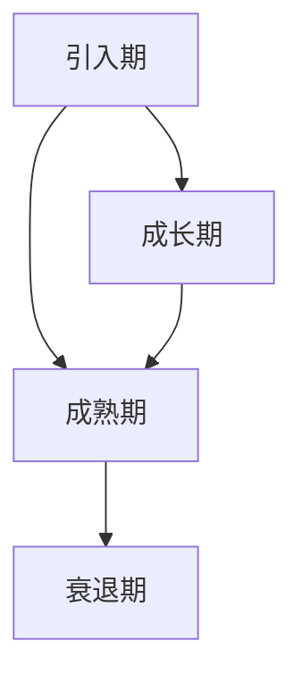

                 

### 《一人公司的产品生命周期管理与版本控制》

> **关键词：** 产品生命周期管理，版本控制，单人公司，Git，市场调研，产品设计，测试与维护。

**摘要：** 本文旨在探讨单人公司在产品开发过程中如何有效地进行产品生命周期管理和版本控制。通过深入分析产品生命周期的各个阶段，包括规划、设计、测试和更新，以及版本控制工具如Git的使用，本文提供了实用的策略和步骤，帮助单人公司提升产品开发效率，确保产品稳定性和可持续性。

#### 引言与核心概念

在当今快速变化的市场环境中，无论是大企业还是小公司，产品生命周期管理（Product Life Cycle Management, PLM）和版本控制（Version Control）都成为了成功的关键要素。对于单人公司而言，这些概念尤为重要，因为它们通常面临资源有限、团队规模小、市场竞争力大的挑战。本文将针对单人公司的特点，系统地阐述产品生命周期管理和版本控制的核心概念、方法及其应用。

**1.1 书籍目的与读者对象**

本文的目标是帮助单人公司的创始人或开发者更好地理解并实践产品生命周期管理和版本控制。通过本文的阅读，读者将能够：

- 掌握产品生命周期管理的各个阶段及任务。
- 理解版本控制的基本原理和工具。
- 学习如何在实际项目中应用版本控制策略。
- 提高单人公司的产品开发效率和产品质量。

本文适用于以下读者：

- 单人公司的创始人或开发者。
- 有志于深入了解产品开发和版本控制的技术人员。
- 在产品开发项目中担任核心角色，需要优化流程的人员。

**1.2 产品生命周期管理概述**

产品生命周期管理是一个系统的过程，它涵盖了产品从构思到退市的整个过程。产品生命周期管理的主要目的是确保产品在整个生命周期内都能满足市场需求，同时最大化企业的利润。对于单人公司，产品生命周期管理尤为重要，因为它往往需要自己承担产品从规划到市场推广的整个流程。

**1.3 版本控制的重要性**

版本控制是软件工程中不可或缺的一部分，它帮助团队追踪代码的变更历史，确保代码的一致性和稳定性。对于单人公司，版本控制同样至关重要，因为它能够：

- 管理代码变更，确保代码的可追溯性。
- 提高开发效率，避免重复劳动。
- 在出现问题时快速回滚到稳定的版本。
- 方便多人协作，即使团队规模很小。

在下一章中，我们将深入探讨产品生命周期的各个阶段，包括规划、设计、测试和维护，以及在这些阶段中如何应用版本控制策略。

---

通过上述引言，我们已经为读者搭建了一个基本框架，介绍了本文的核心内容和目的。接下来，我们将逐步深入，详细探讨产品生命周期管理的各个阶段，并阐述版本控制在这些阶段中的应用。希望读者能够跟随我们的思路，逐步掌握单人公司产品开发的核心技巧。

#### 第2章 产品生命周期管理

产品生命周期管理是确保产品在整个生命周期内都能满足市场需求，从而实现企业利润最大化的重要手段。对于单人公司而言，由于其资源和团队的限制，产品生命周期管理显得尤为重要。在本节中，我们将详细探讨产品生命周期管理的各个阶段，并探讨如何在这些阶段中应用版本控制策略。

**2.1 产品生命周期概述**

产品生命周期（Product Life Cycle, PLC）通常被划分为四个主要阶段：引入期（Introduction）、成长期（Growth）、成熟期（Maturity）和衰退期（Decline）。每个阶段都有其独特的特点和挑战。

1. **引入期（Introduction）**
   - **定义**：产品刚刚推出市场，用户接受度低，销售额逐渐上升。
   - **特点**：市场需求高，竞争压力小，产品特点突出。
   - **任务与挑战**：
     - 确定市场需求和目标用户。
     - 建立产品品牌形象和市场推广策略。
     - 控制成本，迅速获取用户反馈。

2. **成长期（Growth）**
   - **定义**：产品开始受到市场的欢迎，销售额迅速增长。
   - **特点**：市场需求稳定，竞争加剧，市场份额增加。
   - **任务与挑战**：
     - 持续改进产品，增加功能，提升用户体验。
     - 扩大市场份额，增加销售渠道。
     - 管理快速增长带来的运营压力。

3. **成熟期（Maturity）**
   - **定义**：产品市场份额稳定，销售额增长放缓。
   - **特点**：市场竞争激烈，产品差异化不明显。
   - **任务与挑战**：
     - 保持产品竞争力，通过持续更新和优化保持用户忠诚度。
     - 控制成本，优化运营效率。
     - 维护良好的市场关系，扩大客户基础。

4. **衰退期（Decline）**
   - **定义**：产品市场需求下降，销售额逐步减少。
   - **特点**：市场需求减少，竞争对手减少。
   - **任务与挑战**：
     - 分析衰退原因，制定应对策略。
     - 考虑产品更新或替代品的开发。
     - 慎重决策是否继续维护产品。

**2.1.1 产品生命周期的四个阶段（Mermaid流程图）**



**2.1.2 各阶段的任务与挑战**

在上述四个阶段中，每个阶段都有其特定的任务和挑战。例如，在引入期，关键任务是确定市场需求和目标用户，并快速获取用户反馈。在成长期，任务则是持续改进产品，增加市场份额，并管理快速增长带来的运营压力。在成熟期，需要保持产品竞争力，控制成本，并维护良好的市场关系。在衰退期，需要分析衰退原因，制定应对策略，并考虑产品更新或替代品的开发。

**2.2 产品规划与市场调研**

产品规划是产品生命周期管理的重要环节，它为产品的成功奠定了基础。市场调研则是产品规划的重要工具，它帮助单人公司了解市场需求、竞争态势和目标用户。以下是对产品规划与市场调研的详细探讨。

**2.2.1 市场需求分析**

市场需求分析是产品规划的关键步骤，它旨在确定用户对产品的需求和期望。单人公司在进行市场需求分析时，可以考虑以下方面：

- **用户调查**：通过问卷、访谈等方式收集用户对现有产品或潜在产品的反馈。
- **用户画像**：基于收集到的数据，构建目标用户的画像，了解其需求、行为和偏好。
- **竞争对手分析**：分析竞争对手的产品特点、优势和劣势，找出机会点和差异化策略。
- **市场趋势**：研究行业趋势和市场动态，了解新兴技术或市场需求的变化。

**2.2.2 竞争分析**

竞争分析是产品规划的重要组成部分，它有助于单人公司了解市场环境，制定有效的市场策略。以下是竞争分析的关键步骤：

- **识别竞争对手**：找出直接和间接的竞争对手，分析其市场地位和产品策略。
- **产品比较**：对比竞争对手的产品，识别差异化和竞争优势。
- **市场占有率**：分析竞争对手的市场占有率，预测市场变化趋势。
- **战略定位**：根据竞争分析结果，确定自己的产品定位和市场策略。

**2.2.3 产品定位与目标用户**

产品定位和目标用户定义是产品规划的核心，它决定了产品的市场方向和用户群体。以下是如何进行产品定位与目标用户定义的步骤：

- **确定产品特色**：基于市场需求和竞争分析，确定产品的特色和优势。
- **目标用户群体**：明确目标用户的特征，包括年龄、性别、收入、职业等。
- **用户需求满足**：确保产品能够满足目标用户的核心需求，提供独特的价值。
- **市场策略调整**：根据产品定位和目标用户，制定相应的市场策略和推广方案。

**2.3 产品设计与开发**

产品设计与开发是产品生命周期中的关键阶段，它决定了产品的质量和用户体验。单人公司在进行产品设计与开发时，可以考虑以下方面：

**2.3.1 设计原则与方法**

在进行产品设计时，单人公司应遵循以下原则和方法：

- **用户中心设计**：以用户需求为中心，确保产品设计符合用户习惯和期望。
- **简洁性**：设计简洁直观，避免冗余和复杂的界面。
- **灵活性**：设计灵活，便于后期功能扩展和更新。
- **模块化**：采用模块化设计，提高代码复用性和维护性。

**2.3.2 快速原型开发与迭代**

快速原型开发与迭代是产品开发的有效方法，它能够帮助单人公司快速验证产品概念，并持续优化产品。以下是快速原型开发与迭代的关键步骤：

- **需求梳理**：明确产品功能和需求，制定原型开发计划。
- **原型设计**：使用工具（如Sketch、Figma等）设计原型界面。
- **用户测试**：邀请目标用户进行原型测试，收集反馈和意见。
- **迭代优化**：根据用户反馈，优化原型设计，并重复测试和优化过程。

**2.3.3 用户反馈收集与处理**

用户反馈是产品改进的重要来源，单人公司应建立有效的用户反馈机制，并合理处理用户反馈。以下是用户反馈收集与处理的方法：

- **用户调研**：定期进行用户调研，了解用户满意度和使用情况。
- **用户论坛**：建立用户论坛或社区，鼓励用户提出问题和建议。
- **用户访谈**：与用户进行面对面访谈，深入了解用户需求和使用体验。
- **反馈处理**：及时响应用户反馈，制定改进计划，并跟踪改进效果。

**2.4 产品测试与上市**

产品测试与上市是确保产品质量和市场接受度的重要环节。单人公司在进行产品测试与上市时，可以考虑以下方面：

**2.4.1 测试策略与计划**

测试策略与计划是确保产品质量的关键步骤，单人公司应制定以下测试策略与计划：

- **测试目标**：明确测试的目标和范围，确保测试覆盖所有关键功能和场景。
- **测试类型**：根据测试目标，选择适当的测试类型（如功能测试、性能测试、安全测试等）。
- **测试计划**：制定详细的测试计划，包括测试时间表、测试任务和责任人。
- **测试资源**：确保测试所需的资源（如测试环境、测试工具等）充足。

**2.4.2 测试类型与方法**

在产品测试过程中，单人公司应采用多种测试类型和方法，以确保产品的全面质量。以下是常见的测试类型与方法：

- **功能测试**：验证产品的功能是否符合需求。
- **性能测试**：评估产品的性能（如响应时间、吞吐量等）。
- **安全测试**：检测产品的安全漏洞，确保数据安全。
- **兼容性测试**：验证产品在不同平台和环境下能否正常运行。
- **用户体验测试**：评估产品的用户体验，确保用户满意度。

**2.4.3 上市策略与推广**

上市策略与推广是产品成功上市的关键，单人公司应制定以下上市策略与推广方案：

- **上市时间**：选择合适的上市时间，确保产品准备充分。
- **目标市场**：明确产品的目标市场，制定相应的市场策略。
- **推广渠道**：选择合适的推广渠道（如社交媒体、广告等）。
- **价格策略**：制定合理的产品价格，确保市场竞争力。
- **促销活动**：举办促销活动，提高产品知名度。

**2.5 产品维护与更新**

产品维护与更新是产品生命周期中的重要环节，它确保产品在市场上的持续竞争力。单人公司在进行产品维护与更新时，可以考虑以下方面：

**2.5.1 用户支持与售后**

用户支持与售后是维护用户满意度和忠诚度的重要手段，单人公司应提供以下服务：

- **在线帮助**：提供详细的在线帮助文档，方便用户自助解决问题。
- **客服支持**：建立客服支持系统，及时响应用户问题和投诉。
- **技术支持**：为用户提供技术支持，解决复杂的技术问题。
- **售后政策**：制定合理的售后政策，提供产品质量保证。

**2.5.2 产品更新策略**

产品更新策略是确保产品竞争力的关键，单人公司应制定以下更新策略：

- **更新频率**：根据市场需求和用户反馈，确定产品更新的频率。
- **更新内容**：制定详细的更新计划，包括新功能、修复问题和改进用户体验。
- **版本发布**：规范版本发布流程，确保更新过程顺利进行。
- **测试与验证**：在发布前进行充分的测试和验证，确保更新质量。

**2.5.3 生命周期结束决策**

当产品进入衰退期时，单人公司需要做出是否继续维护产品的决策。以下是生命周期结束决策的考虑因素：

- **市场分析**：分析产品在市场上的表现和竞争态势。
- **成本效益**：评估维护产品的成本和潜在收益。
- **替代品分析**：分析是否有合适的替代品或更新版本。
- **用户反馈**：收集用户对产品的反馈，了解用户需求和期望。
- **决策制定**：综合考虑以上因素，制定产品生命周期结束决策。

通过以上对产品生命周期管理各个阶段的详细探讨，单人公司可以更好地规划产品开发，提高产品质量和市场竞争力。在接下来的章节中，我们将进一步探讨版本控制的基础知识及其在产品开发中的应用。

#### 第3章 版本控制基础

版本控制（Version Control）是确保代码库一致性、可追溯性和可靠性的重要工具。它不仅帮助开发者管理代码变更，还促进了团队协作和项目开发效率。对于单人公司而言，版本控制尤为重要，因为它能够确保项目的稳定性和可持续性。本节将详细阐述版本控制的基本概念、工具及其应用。

**3.1 版本控制概述**

**3.1.1 版本控制的定义与目的**

版本控制是一种记录和追踪文件或代码库变更的方法。它通过提供一组工具，使得开发者可以方便地管理代码变更历史，协作开发，并确保代码库的一致性。版本控制的主要目的是：

- **追踪变更历史**：记录每次代码变更的时间、内容、作者等信息，确保代码库的可追溯性。
- **确保代码一致性**：通过合并和冲突解决，确保代码库在不同开发者之间的一致性。
- **促进团队协作**：提供共享代码库，便于团队成员之间的协作和代码同步。
- **提高开发效率**：减少重复劳动，快速回滚问题版本，提高开发效率。

**3.1.2 常见的版本控制工具**

目前市场上存在多种版本控制工具，其中最常用的是Git和Subversion（SVN）。以下是这些工具的基本特点：

- **Git**：Git是一个分布式版本控制工具，它允许开发者在不依赖于中央服务器的情况下进行本地开发。Git的优点包括速度快、灵活性和强大的分支管理功能。
- **Subversion（SVN）**：SVN是一个集中式版本控制工具，它通过中央仓库管理代码库。SVN的优点包括易于使用和维护，但相对于Git，其分支管理和协作功能较弱。

**3.2 版本控制的基本概念**

版本控制涉及一系列基本概念和术语，理解这些概念对于正确使用版本控制工具至关重要。以下是版本控制中的基本术语及其解释：

- **仓库（Repository）**：代码存储的地方，类似于一个文件柜，用于存放整个项目的代码。
- **分支（Branch）**：仓库中的独立代码线，允许开发者在不影响主分支的情况下进行实验性开发。
- **提交（Commit）**：代码库中的一个版本，每次变更后都会生成一个新的提交。
- **合并（Merge）**：将两个或多个分支的代码合并到一个分支中，以保持代码的一致性。
- **标签（Tag）**：对特定版本的代码进行标记，便于后续查找和引用。
- **冲突（Conflict）**：当两个或多个开发者的代码变更冲突时，需要手动解决的状况。

**3.2.1 基本术语解释**

以下是对版本控制中一些基本术语的详细解释：

- **仓库（Repository）**：仓库是版本控制的中心，它存储了项目的所有历史版本。Git仓库是一个分布式仓库，每个开发者都有自己的本地仓库，而SVN仓库则是集中式的。
- **分支（Branch）**：分支是代码的独立副本，用于实验性开发或修复问题。在Git中，分支管理非常灵活，可以在任何时候创建和删除分支。而在SVN中，分支创建和操作相对复杂。
- **提交（Commit）**：提交是将更改永久保存到仓库的过程。每次提交都会生成一个独特的提交号，并记录提交者的信息、提交时间和提交内容。
- **合并（Merge）**：合并是将两个或多个分支的代码合并到一个分支中的过程。合并可能会导致冲突，需要开发者手动解决。
- **标签（Tag）**：标签是对特定版本的代码进行标记，以便后续查找和使用。标签通常用于标记重要的里程碑，如发布版本。
- **冲突（Conflict）**：冲突发生在两个或多个开发者的代码变更发生冲突时，需要手动解决。冲突通常出现在合并过程中，解决冲突的方法包括手动编辑和自动合并。

**3.2.2 版本号规则**

版本号规则（也称为语义化版本控制）是一种用于标识和追踪代码库版本的方法。它通过一系列数字和字母来表示版本号，并明确每个版本的更改类型。以下是一个常见的版本号格式：

```plaintext
MAJOR.MINOR.PATCH
```

- **MAJOR**：主版本号，通常在重大更新（如新增功能或重大架构变更）时增加。
- **MINOR**：次版本号，通常在新增功能或改进现有功能时增加。
- **PATCH**：补丁版本号，通常在修复bug或进行微小改进时增加。

例如，版本号`1.2.3`表示主版本为1，次版本为2，补丁版本为3。通过这种规则，可以清晰地标识每个版本的更改类型和重要性。

**3.3 版本控制操作与实践**

版本控制的实践包括一系列常见的操作，如克隆仓库、提交变更、推送和拉取代码等。以下是这些操作的基本步骤：

**3.3.1 常用操作**

- **克隆仓库（Clone）**：克隆仓库是将远程仓库的代码复制到本地计算机的过程。使用Git克隆仓库的命令如下：

  ```bash
  git clone <仓库地址>
  ```

- **提交变更（Commit）**：提交变更是将代码变更保存到仓库的过程。每次提交都会生成一个唯一的提交号，并记录提交者的信息。提交变更的命令如下：

  ```bash
  git commit -m "提交信息"
  ```

- **推送代码（Push）**：推送代码是将本地仓库的代码更新到远程仓库的过程。推送代码的命令如下：

  ```bash
  git push <远程仓库地址> <分支名>
  ```

- **拉取代码（Pull）**：拉取代码是将远程仓库的代码更新到本地仓库的过程。拉取代码的命令如下：

  ```bash
  git pull <远程仓库地址> <分支名>
  ```

**3.3.2 分支管理策略**

分支管理是版本控制的重要组成部分，它帮助开发者隔离代码变更，并进行实验性开发。以下是几种常见的分支管理策略：

- **主分支（Master/Main）**：主分支是代码的官方版本，通常用于生产环境。所有发布的版本都基于主分支。
- **开发分支（Develop）**：开发分支是主分支的前置分支，用于进行新的功能开发。开发完成后，会将代码合并回主分支。
- **功能分支（Feature）**：功能分支是基于开发分支的独立分支，用于开发特定功能。功能开发完成后，会合并回开发分支。
- **修复分支（Hotfix）**：修复分支是基于主分支的独立分支，用于修复生产环境中的紧急问题。修复完成后，会合并回主分支。
- **发布分支（Release）**：发布分支是基于主分支的独立分支，用于准备新版本的发布。发布完成后，会合并回主分支。

**3.3.3 冲突解决方法**

在版本控制中，冲突（Conflict）是常见的问题，尤其是在多人协作或频繁合并代码时。解决冲突的方法包括：

- **手动解决**：手动编辑冲突文件，选择所需的内容，并提交解决。
- **自动合并**：使用版本控制工具的自动合并功能，尝试自动解决冲突。
- **合并请求（Pull Request）**：在Git中，使用合并请求（Pull Request）来发起冲突解决的流程。开发者可以审查并合并请求，解决冲突。

通过以上对版本控制基础知识的详细阐述，单人公司可以更好地理解和应用版本控制，提高项目开发和协作的效率。在接下来的章节中，我们将进一步探讨版本控制工具的使用，以及如何在实际项目中应用版本控制策略。

#### 第4章 版本控制工具使用

版本控制是确保项目代码库一致性和可维护性的关键工具。在单人公司中，选择合适的版本控制工具并熟练使用它对于项目的成功至关重要。在本章中，我们将详细介绍Git的基本操作、分支管理策略以及如何在实际项目中使用Git进行版本控制和协作。

**4.1 Git基本操作**

Git是目前最流行的版本控制工具之一，其强大的分支管理和分布式特性使其成为单人公司的理想选择。以下是一些Git的基本操作。

**4.1.1 Git安装与配置**

首先，我们需要安装Git。在不同的操作系统上安装Git的方法如下：

- **Windows**：可以从Git官网下载安装程序，安装完成后，打开命令提示符，输入`git --version`验证是否安装成功。
- **macOS**：可以通过Homebrew安装Git，命令如下：

  ```bash
  brew install git
  ```

- **Linux**：大多数Linux发行版都预装了Git，可以通过包管理器安装，例如在Ubuntu上：

  ```bash
  sudo apt-get install git
  ```

安装完成后，我们需要对Git进行基本配置，以确保我们的身份信息和Git仓库的信息能够正确记录。配置命令如下：

```bash
git config --global user.name "你的名字"
git config --global user.email "你的邮箱"
```

**4.1.2 常用Git命令与示例**

以下是一些常用的Git命令及其示例：

- **克隆仓库（Clone）**：

  ```bash
  git clone https://github.com/用户名/仓库名.git
  ```

  示例：克隆一个GitHub上的仓库

- **查看仓库状态（Status）**：

  ```bash
  git status
  ```

  示例：查看当前仓库的文件状态

- **添加文件到暂存区（Add）**：

  ```bash
  git add 文件名
  git add .
  ```

  示例：添加一个文件或所有更改的文件到暂存区

- **提交变更（Commit）**：

  ```bash
  git commit -m "提交信息"
  ```

  示例：提交暂存区中的文件

- **推送代码到远程仓库（Push）**：

  ```bash
  git push <远程仓库地址> <分支名>
  ```

  示例：将当前分支的代码推送到远程仓库

- **拉取代码（Pull）**：

  ```bash
  git pull <远程仓库地址> <分支名>
  ```

  示例：从远程仓库拉取代码并合并到本地分支

- **创建分支（Branch）**：

  ```bash
  git branch 分支名
  git checkout -b 分支名
  ```

  示例：创建并切换到新分支

- **合并分支（Merge）**：

  ```bash
  git merge 分支名
  ```

  示例：将指定分支合并到当前分支

- **解决冲突（Conflict）**：

  ```bash
  git status
  git add 文件名
  git commit -m "解决冲突"
  ```

  示例：解决合并过程中产生的冲突

**4.2 Git分支管理**

Git的分支管理功能是其强大特性之一，它允许开发者独立开发功能，并进行快速迭代。以下是一些Git分支管理的基本策略。

**4.2.1 分支创建与合并**

创建分支是Git分支管理的基本操作。以下是如何创建和合并分支的步骤：

- **创建分支**：

  ```bash
  git branch feature/new-feature
  git checkout feature/new-feature
  ```

  示例：创建并切换到名为`new-feature`的新分支

- **合并分支**：

  ```bash
  git merge feature/new-feature
  ```

  示例：将`new-feature`分支合并到当前分支（通常为主分支）

**4.2.2 特殊分支策略**

在实际项目中，为了更好地管理代码和协作，可以使用一些特殊的分支策略。

- **开发分支（Develop）**：

  开发分支是用于合并功能分支的中间分支，它保持代码的连续性和稳定性。

  ```bash
  git branch develop
  git checkout -b feature/new-feature develop
  # 进行功能开发
  git add .
  git commit -m "功能开发提交"
  git push origin feature/new-feature
  ```

  开发完成后，将其合并回开发分支：

  ```bash
  git checkout develop
  git merge feature/new-feature
  git push origin develop
  ```

- **发布分支（Release）**：

  发布分支是用于准备新版本发布的分支，它从主分支创建，并包含已准备发布的代码。

  ```bash
  git branch release/v1.0
  git checkout release/v1.0
  git merge develop
  git push origin release/v1.0
  ```

- **修复分支（Hotfix）**：

  修复分支用于修复生产环境中的紧急问题。

  ```bash
  git branch hotfix/urgent-fix
  git checkout hotfix/urgent-fix
  git merge master
  # 进行修复
  git add .
  git commit -m "修复紧急问题"
  git push origin hotfix/urgent-fix
  ```

  修复完成后，将其合并回主分支和开发分支：

  ```bash
  git checkout master
  git merge hotfix/urgent-fix
  git push origin master
  git checkout develop
  git merge hotfix/urgent-fix
  git push origin develop
  ```

**4.3 Git与项目协作**

单人公司可能没有多个开发者，但团队协作和代码共享仍然是重要的。Git提供了强大的协作功能，即使团队成员很少，也可以有效地进行协作。

**4.3.1 多人协作流程**

以下是多人协作的基本流程：

1. **开发者A克隆仓库到本地**：

   ```bash
   git clone <仓库地址>
   ```

2. **开发者A创建功能分支并进行开发**：

   ```bash
   git checkout -b feature/my-feature
   # 进行开发
   ```

3. **开发者A提交并推送到远程仓库**：

   ```bash
   git add .
   git commit -m "功能开发提交"
   git push origin feature/my-feature
   ```

4. **开发者B从远程仓库拉取代码**：

   ```bash
   git pull
   ```

5. **开发者B基于功能分支创建新的功能分支并开发**：

   ```bash
   git checkout -b feature/another-feature feature/my-feature
   # 进行开发
   ```

6. **开发者B提交并推送到远程仓库**：

   ```bash
   git add .
   git commit -m "功能开发提交"
   git push origin feature/another-feature
   ```

7. **开发者A和开发者B合并各自的功能分支到开发分支**：

   ```bash
   git checkout develop
   git merge feature/my-feature
   git merge feature/another-feature
   git push origin develop
   ```

**4.3.2 代码审查与合并请求**

代码审查（Code Review）是确保代码质量和协作效率的重要手段。Git提供了合并请求（Pull Request）功能，使得代码审查和协作更加便捷。

1. **开发者A在远程仓库中创建合并请求**：

   ```bash
   git checkout develop
   git merge feature/my-feature
   git push origin develop
   ```

   在远程仓库中创建一个合并请求，将`feature/my-feature`分支与开发分支（通常为`develop`）合并。

2. **开发者B审查合并请求**：

   在远程仓库中，开发者B可以查看合并请求，审查代码，并提出修改建议。

3. **开发者A根据反馈进行修改**：

   开发者A可以根据合并请求中的评论和建议对代码进行修改，并重新提交合并请求。

4. **合并请求合并**：

   一旦开发者B满意代码质量，可以选择合并请求，将代码合并到开发分支中。

   ```bash
   git checkout develop
   git merge pull_request_hash
   git push origin develop
   ```

**4.3.3 版本发布与回滚**

版本发布是产品开发的重要环节。以下是版本发布的基本步骤：

1. **创建发布分支**：

   ```bash
   git branch release/v1.0
   git checkout release/v1.0
   git merge develop
   git push origin release/v1.0
   ```

2. **准备发布**：

   在发布分支上进行最后的测试和修复，确保代码稳定。

3. **版本发布**：

   将发布分支合并到主分支，并标记版本号。

   ```bash
   git checkout master
   git merge release/v1.0
   git tag -a v1.0 -m "发布版本1.0"
   git push origin master
   git push origin --tags
   ```

4. **回滚**：

   如果发布的版本出现问题，可以回滚到上一个稳定版本。

   ```bash
   git checkout v1.0^
   git merge master
   git push origin master
   ```

通过以上对Git基本操作、分支管理策略和项目协作流程的详细阐述，单人公司可以更有效地进行版本控制和协作，提高项目开发效率和产品质量。在接下来的章节中，我们将进一步探讨如何将版本控制应用于产品文档管理，确保产品开发过程中的文档一致性。

#### 第5章 产品文档与版本管理

产品文档是产品开发过程中不可或缺的一部分，它不仅帮助团队成员理解产品的功能和技术细节，也为后期维护和更新提供了重要参考。有效的产品文档管理能够确保文档的准确性、完整性和一致性，从而提高开发效率和产品质量。在本章中，我们将探讨产品文档的类型、编写方法、版本管理策略及其应用。

**5.1 产品文档编写**

**5.1.1 文档类型与内容**

产品文档通常包括以下类型：

- **用户手册（User Manual）**：详细介绍产品的功能和操作方法，帮助用户快速上手和使用产品。
- **开发文档（Development Documentation）**：包括设计文档、技术规范、API文档等，用于指导开发人员理解产品的架构和技术细节。
- **测试文档（Test Documentation）**：包含测试计划、测试用例、测试报告等，用于确保产品的质量和可靠性。
- **操作手册（Operations Manual）**：描述产品的日常运维和维护流程，帮助运维人员确保产品的稳定运行。

**5.1.2 文档编写工具与技巧**

编写产品文档时，选择合适的工具和遵循一定的技巧能够提高效率和质量。以下是一些建议：

- **选择合适的文档工具**：常见的文档工具包括Markdown、Word、LaTeX等。Markdown因其简洁性和易于编辑的特点，常被用于编写产品文档。
- **遵循文档标准**：制定统一的文档格式和规范，确保文档的结构和内容一致。
- **使用图表和示例**：通过图表和示例，使文档更加直观和易于理解。
- **版本控制文档**：将文档纳入版本控制系统，确保文档的版本与代码库同步。

**5.2 版本文档管理**

**5.2.1 版本记录与跟踪**

有效的版本管理是确保产品文档与代码库同步的关键。以下是实现版本文档管理的步骤：

- **建立文档仓库**：在版本控制系统（如Git）中创建一个专门的文档仓库，用于存放所有文档。
- **版本控制文档**：将文档纳入版本控制系统，每个文件都应有明确的版本号和修改记录。
- **跟踪文档变更**：记录每次文档变更的作者、时间、内容和目的，确保文档的追踪和审计。
- **自动化文档构建**：使用工具（如Jenkins）自动构建和发布文档，确保文档版本与代码库一致。

**5.2.2 文档版本控制策略**

为了确保文档的准确性和一致性，单人公司应制定以下文档版本控制策略：

- **文档版本号**：使用语义化版本号（如MAJOR.MINOR.PATCH）标识文档版本，确保与代码库版本同步。
- **发布文档**：在发布代码时，自动构建和发布相应的文档版本，确保文档与代码库同步更新。
- **文档审查**：在发布前进行文档审查，确保文档内容准确、完整和一致。
- **文档存档**：将旧的文档版本存档，以便在需要时进行查阅和追溯。

**5.2.3 文档版本发布与更新**

以下是文档版本发布与更新的步骤：

- **编写文档**：编写并提交文档，记录每次变更的版本号和内容。
- **文档审查**：进行文档审查，确保文档内容准确、完整和一致。
- **发布文档**：将文档构建并发布到文档服务器或版本控制系统的发布分支。
- **更新文档链接**：在代码库中的相关链接和引用指向最新的文档版本。
- **文档更新**：定期更新文档，确保其内容与当前代码库和产品状态一致。

**5.3 文档与代码的版本管理**

为了确保文档与代码的版本一致性，单人公司应遵循以下策略：

- **同步版本号**：确保文档和代码的版本号一致，便于追踪和管理。
- **文档引用**：在代码库中添加文档链接，确保开发人员可以快速访问相关文档。
- **自动化同步**：使用工具自动同步文档和代码库，减少人为错误。
- **文档维护**：定期更新文档，确保其与代码库同步，避免出现过时或错误的信息。

通过以上对产品文档与版本管理的详细阐述，单人公司可以更好地管理产品文档，确保其准确性和一致性，从而提高项目开发效率和产品质量。在接下来的章节中，我们将通过案例分析和实际操作演练，进一步展示如何在实际项目中应用产品生命周期管理和版本控制策略。

#### 第6章 案例分析与实战

在本章中，我们将通过一个单人公司产品开发的案例，深入分析如何在实际项目中应用产品生命周期管理和版本控制策略。该案例将涵盖产品规划、设计、开发、测试和版本控制等各个环节，为读者提供实用的经验和技巧。

**6.1 单人公司产品开发案例**

假设我们单人公司计划开发一款名为“任务管理器”的应用程序，旨在帮助用户高效地管理日常任务。以下是该产品的开发过程：

**6.1.1 案例背景与目标**

背景：随着业务的发展，公司需要一款高效的任务管理工具来协调团队的工作流程，提高工作效率。

目标：开发一款简单易用、功能全面的任务管理器，满足用户的基本需求，同时具备扩展性，方便后续的功能更新和优化。

**6.1.2 产品生命周期管理实践**

1. **引入期（Introduction）**
   - **市场需求分析**：通过调查和访谈，了解用户对任务管理器的需求，包括功能需求、用户体验和价格敏感度。
   - **产品规划**：制定产品规划文档，明确产品的功能模块、技术架构和开发时间表。
   - **市场调研**：分析竞品，了解市场趋势，确定产品的差异化策略和目标用户群体。

2. **成长期（Growth）**
   - **功能开发**：根据产品规划，逐步开发任务管理器的基本功能，如任务创建、任务列表、任务提醒等。
   - **用户反馈**：通过用户反馈，了解产品的实际使用情况，收集用户的需求和建议。
   - **迭代优化**：根据用户反馈，持续优化产品功能，提升用户体验。

3. **成熟期（Maturity）**
   - **功能完善**：完善产品的所有功能，确保产品的稳定性和可靠性。
   - **性能优化**：优化产品的性能，提高响应速度和系统稳定性。
   - **用户支持**：建立用户支持系统，及时响应用户的问题和投诉，提供技术支持和售后服务。

4. **衰退期（Decline）**
   - **市场分析**：分析产品在市场中的表现，了解用户需求的变化。
   - **产品更新**：根据市场分析结果，考虑产品更新或替代品的开发。
   - **退出决策**：如果产品不再具有市场竞争力，考虑退出市场，并做好产品的替代方案。

**6.1.3 版本控制策略与实施**

在产品开发过程中，版本控制策略至关重要，以下是具体实施步骤：

1. **仓库创建**：在Git中创建代码仓库，用于存放产品的源代码和文档。

   ```bash
   git init
   ```

2. **分支管理**：根据产品开发流程，创建不同分支，如主分支（Master）、开发分支（Develop）、功能分支（Feature）等。

   ```bash
   git branch master
   git branch develop
   ```

3. **代码提交与合并**：在功能分支上进行开发，将代码提交到远程仓库，并在开发完成后合并回主分支。

   ```bash
   git checkout -b feature/task-reminder
   # 进行开发
   git add .
   git commit -m "添加任务提醒功能"
   git push origin feature/task-reminder
   git checkout develop
   git merge feature/task-reminder
   git push origin develop
   ```

4. **冲突解决**：在合并过程中，如果出现冲突，需要手动解决，并重新提交。

   ```bash
   git status
   git add 文件名
   git commit -m "解决冲突"
   ```

5. **版本发布**：在完成一个功能模块后，将其合并到主分支，并发布新版本。

   ```bash
   git checkout master
   git merge develop
   git tag -a v1.0 -m "发布版本1.0"
   git push origin master
   git push origin --tags
   ```

6. **文档管理**：将产品文档纳入版本控制系统，确保与代码库同步。

   ```bash
   git add 文档名
   git commit -m "更新产品文档"
   git push origin
   ```

通过以上步骤，单人公司可以有效地进行产品生命周期管理和版本控制，确保产品开发的高效性和稳定性。

**6.2 实际操作演练**

为了更好地理解上述策略的实施过程，我们将在本节中通过实际操作演练，演示如何搭建开发环境、创建代码仓库、进行版本控制和分支管理。

**6.2.1 环境搭建与工具选择**

1. **安装Git**：在Windows、macOS和Linux操作系统上安装Git。

   - Windows：下载安装程序并安装。
   - macOS：使用Homebrew安装，命令如下：

     ```bash
     brew install git
     ```

   - Linux：使用包管理器安装，例如在Ubuntu上：

     ```bash
     sudo apt-get install git
     ```

2. **选择IDE**：选择一个合适的集成开发环境（IDE），例如Visual Studio Code、Eclipse或IntelliJ IDEA。

3. **安装数据库**：选择一个数据库管理系统，例如MySQL或PostgreSQL，用于存储任务数据。

**6.2.2 代码仓库创建与版本控制**

1. **创建代码仓库**：在本地计算机上创建一个名为“task-manager”的文件夹，并初始化Git仓库。

   ```bash
   mkdir task-manager
   cd task-manager
   git init
   ```

2. **添加文件**：在代码仓库中添加一个名为“main.py”的文件，并编写一个简单的任务管理器代码。

   ```python
   # main.py
   def add_task(task):
       print("添加任务：", task)

   add_task("买牛奶")
   ```

3. **提交变更**：将“main.py”文件添加到暂存区，并提交到本地仓库。

   ```bash
   git add main.py
   git commit -m "创建任务管理器"
   ```

4. **推送代码到远程仓库**：在GitHub上创建一个新的仓库，并将本地代码推送到远程仓库。

   ```bash
   git remote add origin https://github.com/用户名/task-manager.git
   git push -u origin master
   ```

**6.2.3 分支管理与实践**

1. **创建功能分支**：在开发过程中，创建一个名为“feature/todo-list”的功能分支，用于添加任务列表功能。

   ```bash
   git checkout -b feature/todo-list
   ```

2. **进行功能开发**：在“feature/todo-list”分支上添加任务列表功能。

   ```python
   # todo_list.py
   def show_tasks():
       print("任务列表：")
       print("1. 买牛奶")
       print("2. 买面包")
       print("3. 洗衣服")

   show_tasks()
   ```

3. **提交和推送代码**：将“todo_list.py”文件提交到本地仓库，并推送到远程仓库。

   ```bash
   git add todo_list.py
   git commit -m "添加任务列表功能"
   git push origin feature/todo-list
   ```

4. **合并分支**：将“feature/todo-list”分支合并到主分支。

   ```bash
   git checkout master
   git merge feature/todo-list
   git push origin master
   ```

5. **解决冲突**：如果合并过程中出现冲突，手动解决并重新提交。

   ```bash
   git status
   git add 文件名
   git commit -m "解决冲突"
   ```

通过以上实际操作演练，单人公司可以掌握如何使用Git进行版本控制和分支管理，从而有效地进行产品开发。在下一节中，我们将继续探讨如何在实际项目中处理版本控制中的冲突和协作问题。

#### 第6章（续）实际操作演练

在上一节中，我们通过实际操作演示了如何在单人公司项目中创建代码仓库、分支管理和版本控制。在本节中，我们将进一步探讨版本控制中的冲突解决、多人协作以及如何处理复杂的项目变更，并提供详细的代码解读与分析。

**6.2.4 冲突解决与协作**

**冲突解决**

在版本控制过程中，冲突（Conflict）是常见的问题，尤其是在多人协作或频繁合并代码时。冲突通常发生在以下情况：

- 同一文件的不同部分被两个或多个开发者同时修改。
- 两个或多个分支在合并时产生了不同的代码。
- 手动编辑或修改了文件的内容，而其他人进行了更新。

解决冲突的方法通常包括手动解决和自动合并。

**手动解决**

手动解决冲突是最直接的方法。以下是解决冲突的基本步骤：

1. **检出冲突文件**：当Git检测到冲突时，它会标记冲突文件。我们可以通过以下命令检出冲突文件：

   ```bash
   git status
   ```

   Git会显示冲突文件及其路径。

2. **手动编辑**：打开冲突文件，手动解决冲突。Git会使用不同的标记（如`<<<<<<`、`=====`和`>>>>>>`）来标记冲突区域，并尝试保持双方代码的完整性。

   ```plaintext
   <<<<<<<< yours
   // 你的代码
   ======== 
   // 冲突代码
   >>>>>>> theirs
   ```

   在解决完冲突后，删除冲突标记并保存文件。

3. **提交解决**：保存并关闭文件后，使用以下命令提交解决：

   ```bash
   git add 文件名
   git commit -m "解决冲突"
   ```

**自动合并**

Git也提供了自动合并（Automatic Merge）功能，但在某些情况下可能无法解决复杂的冲突。自动合并的步骤如下：

1. **尝试自动合并**：

   ```bash
   git merge --no-ff
   ```

   `--no-ff`标志确保产生一个合并提交，而不是一个快进提交。

2. **解决无法自动解决的冲突**：如果自动合并失败，需要手动解决冲突，然后重新提交。

**多人协作**

在单人公司中，虽然团队规模较小，但仍然需要协作和沟通。以下是多人协作的基本流程：

1. **代码同步**：开发者A和开发者B定期拉取最新代码并同步本地仓库：

   ```bash
   git pull
   ```

2. **功能开发**：开发者A和开发者B在不同的功能分支上进行开发，并定期提交和推送代码：

   ```bash
   git checkout -b feature/new-feature
   git add .
   git commit -m "功能开发提交"
   git push origin feature/new-feature
   ```

3. **合并代码**：在功能开发完成后，开发者A和开发者B将功能分支合并到主分支：

   ```bash
   git checkout master
   git merge feature/new-feature
   git push origin master
   ```

4. **代码审查**：开发者B在合并请求（Pull Request）中审查开发者A的代码，并提出反馈和建议。

5. **更新代码**：根据审查结果，开发者A进行代码修改，并重新提交合并请求。

**6.2.5 代码解读与分析**

在本节中，我们将对任务管理器的核心代码进行解读与分析，帮助读者理解项目结构和代码实现。

**任务管理器代码结构**

以下是一个简单的任务管理器项目结构：

```plaintext
task-manager/
│
├── main.py
├── todo_list.py
├── requirements.txt
└── README.md
```

- `main.py`：主程序文件，负责初始化任务管理器和执行用户命令。
- `todo_list.py`：任务列表模块，负责展示和管理用户任务。
- `requirements.txt`：依赖文件，列出项目所需的第三方库。
- `README.md`：README文件，包含项目说明、安装和使用指南。

**主程序（main.py）**

以下是对`main.py`文件的解读：

```python
import sys
from todo_list import show_tasks

def main():
    show_tasks()

if __name__ == "__main__":
    main()
```

- `import sys`：导入sys模块，用于处理命令行参数。
- `from todo_list import show_tasks()`：从`todo_list.py`模块导入`show_tasks`函数。
- `main()`：定义主函数，调用`show_tasks`函数展示任务列表。
- `if __name__ == "__main__":`：确保当`main.py`作为主程序运行时，执行`main()`函数。

**任务列表模块（todo_list.py）**

以下是对`todo_list.py`文件的解读：

```python
def show_tasks():
    print("任务列表：")
    print("1. 买牛奶")
    print("2. 买面包")
    print("3. 洗衣服")
```

- `def show_tasks()`：定义`show_tasks`函数，打印任务列表。
- `print("任务列表：")`：输出任务列表的标题。
- `print("1. 买牛奶", "2. 买面包", "3. 洗衣服")`：依次输出每个任务。

**依赖文件（requirements.txt）**

以下是对`requirements.txt`文件的解读：

```plaintext
requests==2.27.1
```

- `requests==2.27.1`：指定项目所需的第三方库`requests`的版本，用于发送HTTP请求。

**README文件（README.md）**

以下是对`README.md`文件的解读：

```markdown
# 任务管理器

## 简介

任务管理器是一个简单的应用程序，用于帮助用户管理日常任务。

## 安装

1. 安装Python环境。
2. 使用pip安装依赖：

   ```bash
   pip install -r requirements.txt
   ```

3. 运行主程序：

   ```bash
   python main.py
   ```

## 功能

- 查看任务列表
```

- `# 任务管理器`：README文件的标题。
- `## 简介`：介绍任务管理器的基本信息。
- `## 安装`：说明如何安装任务管理器。
- `### 功能`：列出任务管理器的功能。

通过以上解读，读者可以理解任务管理器的代码结构、功能实现以及项目依赖。

**6.2.6 项目实战总结**

通过本节的实际操作演练和代码解读，单人公司可以掌握如何使用Git进行版本控制、分支管理以及冲突解决。同时，通过理解项目结构和核心代码，开发者可以更好地维护和更新产品，确保项目的高效性和稳定性。

在下一节中，我们将总结产品生命周期管理和版本控制的要点，并展望未来的趋势和挑战。希望读者能够通过本章的学习，更好地应对单人公司产品开发的实际需求。

#### 第7章 总结与展望

在本文中，我们系统地探讨了单人公司在产品开发过程中如何进行产品生命周期管理和版本控制。通过分析产品生命周期的各个阶段，包括规划、设计、测试和维护，以及深入阐述版本控制的基础知识和应用，本文为单人公司提供了一套实用的策略和步骤。

**7.1 产品生命周期管理与版本控制的要点回顾**

1. **产品生命周期管理**：
   - 了解产品生命周期的四个阶段：引入期、成长期、成熟期和衰退期。
   - 各阶段的主要任务和挑战，如市场需求分析、产品定位、用户反馈收集等。
   - 制定有效的产品规划和市场调研策略，确保产品能够满足市场需求。

2. **版本控制**：
   - 版本控制的定义与目的，包括追踪变更历史、确保代码一致性等。
   - 常见的版本控制工具，如Git和SVN。
   - 版本控制的基本概念，如仓库、分支、提交、合并等。
   - 常用的版本控制操作，如克隆、提交、推送、拉取等。
   - 分支管理策略，包括主分支、开发分支、功能分支等。

3. **文档管理**：
   - 产品文档的类型与内容，如用户手册、开发文档、测试文档等。
   - 文档编写工具与技巧，如Markdown、LaTeX等。
   - 版本控制文档，确保文档与代码库同步更新。

**7.2 未来的趋势与挑战**

尽管产品生命周期管理和版本控制已经为单人公司的产品开发提供了有力的支持，但未来仍存在一些趋势和挑战：

1. **敏捷开发和持续集成**：随着敏捷开发（Agile Development）的普及，单人公司需要更快速地响应市场变化，并采用持续集成（Continuous Integration）和持续交付（Continuous Deployment）等现代开发实践。

2. **云原生和容器化**：云原生技术和容器化（如Docker）将使单人公司的开发、测试和部署过程更加灵活和高效。

3. **开源生态的发展**：开源工具和平台（如Kubernetes、Docker Hub等）将继续发展，为单人公司提供更多的技术支持和资源。

4. **市场竞争加剧**：随着市场的不断变化，单人公司需要不断提高产品质量和市场竞争力，以应对激烈的竞争环境。

5. **安全性和合规性**：在数据保护和隐私法规日益严格的环境下，单人公司需要确保产品的安全性，并遵守相关法规。

**7.3 个人心得与建议**

通过本文的学习，我对单人公司的产品开发和版本控制有了更深入的理解。以下是我的几点心得和建议：

1. **持续学习和适应**：技术不断发展，单人公司需要持续学习新技术和工具，以适应快速变化的市场环境。

2. **注重用户体验**：用户体验是产品成功的关键，单人公司应始终以用户为中心，不断优化产品功能和界面设计。

3. **有效的团队协作**：即使团队规模较小，也要注重团队协作和沟通，确保项目进展顺利。

4. **灵活应用版本控制**：灵活运用版本控制工具，不仅可以提高开发效率，还可以确保代码库的一致性和稳定性。

5. **文档管理不可忽视**：良好的文档管理有助于团队协作和问题追溯，单人公司应重视文档的编写和版本管理。

通过本文的探讨，我希望能够为单人公司在产品开发过程中提供一些实用的指导和启示。未来的道路充满挑战，但只要我们不断学习、创新和适应，就一定能够在激烈的市场竞争中脱颖而出。

---

**作者**：AI天才研究院/AI Genius Institute & 禅与计算机程序设计艺术 /Zen And The Art of Computer Programming

本文旨在为单人公司的产品开发提供系统性的指导，帮助开发者更好地进行产品生命周期管理和版本控制。希望读者能够通过本文的学习，掌握单人公司产品开发的核心技巧，并在实际工作中取得更好的成果。感谢您的阅读！

