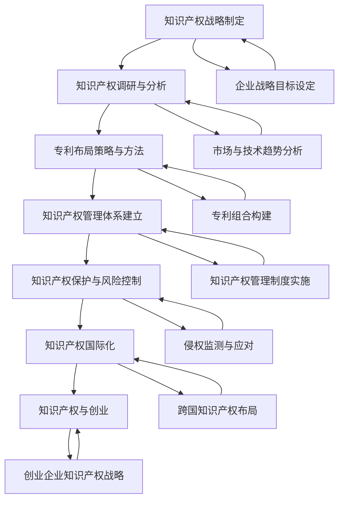

                 

### 第一部分：知识产权战略概述

知识产权战略是企业或个人在技术创新和市场竞争中不可或缺的一部分。本文将为您深入探讨知识产权战略的概述，包括知识产权的基础知识、法律框架以及战略规划等内容。

#### 第1章：知识产权的基础知识

知识产权是指基于知识创造的成果所享有的法律权利。它包括专利权、商标权和著作权等类型。以下是关于这些类型的具体内容：

##### 1.1.1 专利权

**1.1.1.1 专利权的定义、特征及类型**

专利权是指国家专利机关根据申请人的申请，在一定期限内授予其对发明创造享有的独占实施权。专利权具有地域性、独占性和期限性等特征。

- **发明专利**：指对产品、方法或其改进所提出的新的技术方案。
- **实用新型专利**：指对产品的形状、构造或其结合所提出的适于实用的新的技术方案。
- **外观设计专利**：指对产品的形状、图案、色彩或其结合所作出的富有美感并适于工业应用的新设计。

**1.1.1.2 专利权的申请与审批流程**

专利权的申请与审批流程包括以下几个步骤：

1. **初步审查**：审查申请文件是否符合要求。
2. **实质审查**：对申请的发明是否具备新颖性、创造性和实用性进行审查。
3. **公告和授权**：通过审查的专利申请在公开公告后，国家专利机关作出授权决定。

##### 1.1.2 商标权

**1.1.2.1 商标权的定义、特征及类型**

商标权是指商标注册人对其注册商标享有的专有使用权。商标权具有独占性、地域性和可转让性等特征。

- **商品商标**：用于区分不同生产者的商品。
- **服务商标**：用于区分不同服务提供者的服务。
- **集体商标**：用于表示团体、协会或其他组织成员的标志。
- **证明商标**：用于表示某种商品或服务的特定品质。

**1.1.2.2 商标权的注册与保护**

商标权的注册与保护包括以下几个步骤：

1. **商标查询**：查询商标是否已被注册。
2. **商标申请**：提交商标注册申请，并缴纳相关费用。
3. **审查和公告**：国家知识产权局对申请进行审查，并通过公告确定商标的注册与否。
4. **商标保护**：注册商标后，需要持续使用和维护，防止他人侵权。

##### 1.1.3 著作权

**1.1.3.1 著作权的定义、特征及类型**

著作权是指创作者对其作品享有的权利。著作权具有自动产生性、独占性和期限性等特征。

- **文字作品**：包括小说、诗歌、论文等。
- **艺术作品**：包括绘画、雕塑、摄影等。
- **音乐作品**：包括歌曲、乐曲等。
- **戏剧作品**：包括剧本、剧本改编等。

**1.1.3.2 著作权的保护范围与期限**

著作权的保护范围包括：

- **人身权**：包括发表权、署名权、修改权等。
- **财产权**：包括复制权、发行权、出租权等。

著作权的保护期限根据不同类型的作品而有所不同：

- **公民作品**：作者终身及其死亡后50年。
- **法人或其他组织作品**：自创作完成后50年。

##### 1.2 知识产权的法律框架

**1.2.1 我国知识产权法律体系概述**

我国知识产权法律体系主要包括以下法律法规：

- **专利法**：规定了专利权的申请、审批和保护等内容。
- **商标法**：规定了商标权的注册、保护和使用等内容。
- **著作权法**：规定了著作权的产生、保护和行使等内容。

**1.2.2 知识产权的国际法律体系**

知识产权的国际法律体系主要包括以下条约和组织：

- **伯尔尼公约**：规定了著作权保护的基本原则。
- **巴黎公约**：规定了专利、工业品外观设计和商标的国际保护。
- **世界知识产权组织（WIPO）**：负责协调国际知识产权保护。

#### 总结

知识产权战略是企业发展的重要一环，涉及到专利、商标、著作权等多个方面。通过了解知识产权的基础知识、法律框架和战略规划，企业可以更好地保护自己的创新成果，提高市场竞争力。在下一部分中，我们将进一步探讨知识产权战略的规划与实施。请继续关注。

---

### 核心概念与联系

在探讨知识产权战略时，有几个核心概念和联系是我们必须了解的。以下是一个使用 Mermaid 语言描述的流程图，它展示了知识产权战略与专利布局之间的关键流程和关系。



#### 专利分析算法伪代码

在知识产权战略中，专利分析是一个至关重要的环节。以下是一个专利分析算法的伪代码，用于描述如何对专利数据进行分析，以提取关键信息并计算专利之间的相似度。

```python
def patent_analysis(patent_data):
    # 数据预处理
    preprocessed_data = preprocess_patent_data(patent_data)
    
    # 提取专利关键信息
    patent_informations = extract_key_informations(preprocessed_data)
    
    # 进行专利相似度分析
    similarity_scores = calculate_similarity_scores(patent_informations)
    
    # 结果排序与筛选
    sorted_patents = sort_and_filter_patents(similarity_scores)
    
    return sorted_patents

def preprocess_patent_data(patent_data):
    # 实现数据预处理逻辑，例如文本清洗、分词等
    pass

def extract_key_informations(preprocessed_data):
    # 实现提取关键信息逻辑，例如提取专利名称、摘要等
    pass

def calculate_similarity_scores(patent_informations):
    # 实现相似度计算逻辑，例如使用TF-IDF或余弦相似度
    pass

def sort_and_filter_patents(similarity_scores):
    # 实现排序与筛选逻辑，例如根据相似度分数排序，筛选出最相关的专利
    pass
```

#### 专利相似度计算公式

为了计算专利之间的相似度，我们可以使用以下数学模型：

$$
similarity = \frac{common_terms}{total_terms}
$$

这里，`common_terms` 表示两个专利文档中共同出现的词汇数量，而 `total_terms` 表示两个文档中所有词汇的总数。相似度分数越高，表示两个专利文档之间的相似程度越高。

#### 举例说明

假设有两个专利文档 A 和 B，它们的文本内容如下：

- **专利文档 A**：人工智能、机器学习、深度学习
- **专利文档 B**：深度学习、机器学习、神经网络

我们可以计算这两个专利文档的相似度：

$$
similarity = \frac{3}{5} = 0.6
$$

这意味着专利 A 和 B 之间有 60% 的相似度。

---

通过本文的第一部分，我们详细介绍了知识产权的基础知识，包括专利权、商标权和著作权等，以及知识产权的法律框架。此外，我们还展示了知识产权战略与专利布局之间的关键流程和核心概念。在下一部分中，我们将深入探讨知识产权战略的规划与实施。

### 核心概念与联系

为了更好地理解知识产权战略的各个方面，我们使用 Mermaid 语言创建了一个流程图，展示了知识产权战略与专利布局之间的关键流程和关系。

以下是 Mermaid 语言描述的流程图：


这个流程图清晰地展示了从知识产权战略制定到实施、再到国际化以及创业过程中的各个环节，每个步骤都与其他步骤紧密相连，形成一个完整的知识产权管理体系。

接下来，我们将深入探讨专利布局与保护的具体策略和方法。

---

### 专利布局的基础知识

专利布局是指企业或个人在其技术领域内，通过申请专利来保护自己的技术创新，从而实现市场竞争优势的过程。有效的专利布局不仅能够保护企业的核心技术和商业秘密，还能为企业带来潜在的经济利益。下面，我们将详细探讨专利布局的概念、重要性、策略和方法。

#### 3.1 专利布局的概念与重要性

**3.1.1 专利布局的定义**

专利布局是指企业或个人根据其技术战略和市场竞争需求，在全球范围内制定和实施的一项系统性的知识产权战略。它涉及到专利申请的策略、时机、优先权、地域选择等方面。

**3.1.2 专利布局的重要性**

1. **市场保护**：通过专利布局，企业可以在目标市场获得专利保护，防止竞争对手复制或模仿其技术，从而维持市场竞争力。

2. **垄断优势**：有效的专利布局可以形成技术垄断，阻止其他企业进入市场，从而为企业带来更大的利润空间。

3. **技术领先**：通过专利布局，企业可以提前锁定关键技术，确保在技术创新领域保持领先地位。

4. **资产增值**：专利作为企业的无形资产，其价值随着专利的积累和布局的完善而增加，有助于提升企业的市场估值。

5. **跨国经营**：在全球化的背景下，专利布局有助于企业在国际市场上扩展业务，降低经营风险。

#### 3.2 专利布局的策略与方法

**3.2.1 专利布局的基本策略**

1. **地域布局**：根据企业的市场战略，选择合适的国家和地区申请专利，以保护企业的核心技术和市场。

2. **技术布局**：针对企业的技术特点，确定申请专利的领域和方向，形成系统性的技术保护网。

3. **时机布局**：合理规划专利申请的时间，利用专利优先权制度，确保在技术创新的前沿保持领先地位。

4. **组合布局**：通过组合不同的专利类型，如发明专利、实用新型专利和外观设计专利，形成多元化的专利组合，提高保护力度。

**3.2.2 专利布局的具体方法**

1. **核心专利布局**：围绕企业的核心技术，申请一系列紧密关联的专利，形成核心专利群，确保技术的全面保护。

2. **外围专利布局**：在核心技术周围布局一系列外围专利，形成保护圈，防止他人轻易突破核心专利。

3. **交叉许可布局**：与其他企业签订交叉许可协议，共享专利资源，降低专利侵权风险。

4. **防卫性专利布局**：为防止竞争对手的专利侵权，主动申请一些与自己技术无关但与竞争对手技术相关的专利，形成防卫网。

5. **持续性布局**：根据市场和技术的发展，持续更新和优化专利布局，确保专利的有效性和前瞻性。

#### 3.3 专利布局的案例分析

**3.3.1 成功的专利布局案例**

以苹果公司为例，其通过以下策略实现了成功的专利布局：

1. **技术领域广泛**：苹果公司在多个技术领域申请专利，包括硬件、软件、操作系统、用户界面等。

2. **全球布局**：苹果公司在全球多个国家和地区申请专利，确保其技术在全球范围内的保护。

3. **核心专利布局**：苹果公司通过一系列紧密关联的核心专利，形成了强大的技术保护网。

4. **防卫性专利布局**：苹果公司还申请了一些与竞争对手技术相关的防卫性专利，降低了专利侵权风险。

**3.3.2 失败的专利布局案例及其教训**

以诺基亚为例，其专利布局曾经面临重大挑战：

1. **过度依赖单一技术**：诺基亚长期依赖手机业务，专利布局主要集中在通信领域，忽视了其他技术领域的发展。

2. **市场反应迟缓**：诺基亚在智能手机市场兴起时，未能及时调整专利布局策略，错失了市场机会。

3. **专利组合不均衡**：诺基亚的专利组合中，缺乏核心专利和外围专利的平衡，导致在市场竞争中处于劣势。

通过上述案例分析，我们可以看到，成功的专利布局需要全面的技术领域覆盖、全球市场布局、核心专利保护和防卫性专利布局等多方面的策略。而失败的案例则提醒我们，在专利布局过程中，必须保持敏锐的市场洞察力和灵活的调整能力。

在下一部分，我们将进一步探讨知识产权管理体系的建立与运作。

---

### 知识产权管理体系

知识产权管理体系是企业或个人在创新过程中，为了有效管理和保护知识产权而建立的一套系统化、规范化的流程和制度。一个完善的知识产权管理体系可以帮助企业或个人降低知识产权风险，提高知识产权利用效率，从而在市场竞争中取得优势。下面，我们将详细介绍知识产权管理体系的定义与作用、构成要素以及实施与维护。

#### 4.1 知识产权管理体系的定义与作用

**4.1.1 知识产权管理体系的定义**

知识产权管理体系是指企业或个人为了有效管理和保护知识产权，通过系统化、规范化的方法，对知识产权的创造、使用、管理和保护进行组织、规划、实施、监控和改进的一系列制度和活动。

**4.1.2 知识产权管理体系的构成**

一个完整的知识产权管理体系通常包括以下几个关键部分：

1. **组织结构**：明确知识产权管理部门的职责和权限，确保知识产权管理的有效运行。
2. **流程制度**：建立知识产权的识别、评估、申请、保护、运用、监控和维权等流程，并制定相应的规章制度。
3. **人员培训**：对知识产权管理人员进行专业培训，提高其知识产权管理的能力和水平。
4. **技术支持**：利用先进的技术手段，如知识产权管理软件、专利数据库等，提升知识产权管理的效率和效果。
5. **监控与评估**：建立知识产权管理的监控和评估机制，定期检查知识产权管理的有效性和合规性。

**4.1.3 知识产权管理体系的作用**

1. **保护知识产权**：通过有效的知识产权管理，可以防止知识产权被侵权或滥用，保护企业的核心竞争力。
2. **提高管理效率**：规范化的知识产权管理流程可以提高知识产权管理的效率，减少不必要的浪费。
3. **降低侵权风险**：通过监控和预警系统，可以及时发现潜在的侵权行为，降低侵权风险。
4. **促进创新**：知识产权管理体系有助于激励员工进行创新，提高企业的技术储备和创新能力。
5. **增加企业价值**：有效的知识产权管理可以提高企业的市场竞争力，从而增加企业的市场估值。

#### 4.2 知识产权管理的流程与实务

**4.2.1 知识产权的识别与评估**

知识产权识别与评估是知识产权管理的基础。其主要内容包括：

1. **知识产权识别**：通过专利检索、商标查询等方式，识别企业拥有的知识产权。
2. **知识产权评估**：对知识产权的价值、潜在风险和重要性进行评估，为后续的管理和决策提供依据。

**4.2.2 知识产权的保护与维权**

知识产权保护与维权是知识产权管理的重要环节。其主要内容包括：

1. **知识产权保护**：通过申请专利、注册商标、签订保密协议等方式，保护企业的知识产权。
2. **知识产权维权**：当知识产权受到侵害时，通过法律手段维护企业的合法权益，包括诉讼、调解、仲裁等。

**4.2.3 知识产权的运用**

知识产权的运用是知识产权管理的核心目标之一。其主要内容包括：

1. **知识产权许可**：通过专利许可、商标许可等方式，实现知识产权的商业化运用，增加企业的收入。
2. **知识产权转让**：通过转让专利、商标等方式，实现知识产权的退出，优化企业资产结构。
3. **知识产权投资**：将知识产权作为投资对象，参与合作项目或并购，提高企业的投资回报率。

#### 4.3 知识产权管理案例研究

**4.3.1 成功的知识产权管理案例**

以华为公司为例，其知识产权管理体系具有以下几个成功要素：

1. **战略规划**：华为将知识产权管理纳入企业战略规划，确保知识产权管理与企业发展的紧密结合。
2. **全球布局**：华为在全球多个国家和地区申请专利，建立了强大的专利组合，确保其技术在全球范围内的保护。
3. **人才储备**：华为投入大量资源进行知识产权管理人员的培训，提高其专业能力和管理水平。
4. **技术创新**：华为不断进行技术创新，保持技术领先地位，为其知识产权管理提供了坚实的基础。

**4.3.2 失败的知识产权管理案例及其教训**

以某小型科技公司为例，其知识产权管理失败的主要教训包括：

1. **缺乏规划**：该公司未能提前制定知识产权战略，导致知识产权管理混乱，无法有效保护企业的创新成果。
2. **人才短缺**：该公司缺乏专业的知识产权管理人员，导致知识产权保护措施不到位，容易被竞争对手侵权。
3. **监控不力**：该公司未能建立有效的监控和预警系统，导致知识产权被侵权时未能及时发现和应对。

通过上述成功和失败的案例，我们可以看到，一个完善的知识产权管理体系对于企业的发展至关重要。在下一部分，我们将进一步探讨知识产权保护与风险控制策略。

---

### 知识产权保护策略

知识产权保护是知识产权管理体系中的关键一环，它涉及到多种法律手段和非法律手段，以防止知识产权被侵犯，确保企业的合法权益。以下我们将详细探讨知识产权保护的法律手段和非法律手段，以及知识产权风险控制的方法。

#### 5.1 知识产权保护的法律手段

法律手段是保护知识产权的重要途径，包括但不限于专利侵权诉讼、商标侵权诉讼和著作权侵权诉讼。

**5.1.1 专利侵权诉讼**

专利侵权诉讼是指当专利权人的专利受到侵犯时，通过法律途径维护其权益。以下是专利侵权诉讼的基本步骤：

1. **侵权判定**：法院首先需要判定被诉侵权行为是否构成侵权，包括技术特征的比对、权利要求的解释等。
2. **侵权赔偿**：如果判定侵权成立，专利权人可以获得侵权赔偿，包括经济损失和合理费用等。
3. **禁令**：法院还可以发出禁令，禁止侵权行为继续进行。

**5.1.2 商标侵权诉讼**

商标侵权诉讼是指当商标权人的商标受到侵犯时，通过法律途径维护其权益。以下是商标侵权诉讼的基本步骤：

1. **侵权判定**：法院需要判定被诉侵权标志是否构成侵权，包括是否构成相同或近似商标、是否具有混淆风险等。
2. **侵权赔偿**：如果侵权成立，商标权人可以获得侵权赔偿，包括经济损失和合理费用等。
3. **禁令**：法院还可以发出禁令，禁止侵权行为继续进行。

**5.1.3 著作权侵权诉讼**

著作权侵权诉讼是指当著作权人的作品受到侵犯时，通过法律途径维护其权益。以下是著作权侵权诉讼的基本步骤：

1. **侵权判定**：法院需要判定被诉侵权行为是否构成侵权，包括是否构成复制、传播、演绎等行为。
2. **侵权赔偿**：如果侵权成立，著作权人可以获得侵权赔偿，包括经济损失和合理费用等。
3. **禁令**：法院还可以发出禁令，禁止侵权行为继续进行。

#### 5.2 知识产权保护的非法律手段

除了法律手段，非法律手段也是知识产权保护的重要方式，包括保密协议与竞业禁止协议、监控与预警系统等。

**5.2.1 保密协议与竞业禁止协议**

保密协议与竞业禁止协议是企业保护知识产权的重要手段。以下是这些协议的基本内容：

1. **保密协议**：雇员、合作伙伴等签署保密协议，承诺保守企业的商业秘密和技术秘密。
2. **竞业禁止协议**：雇员、合作伙伴等签署竞业禁止协议，承诺在一定期限内不得从事与原企业相同或类似的工作。

**5.2.2 监控与预警系统**

监控与预警系统是实时监控潜在侵权行为的技术手段。以下是监控与预警系统的基本功能：

1. **侵权监控**：系统实时监控市场上的侵权行为，包括专利侵权、商标侵权和著作权侵权等。
2. **预警通知**：系统发现侵权行为时，自动发出预警通知，提醒企业采取相应措施。
3. **应对措施**：企业根据预警通知，及时采取法律手段或非法律手段应对侵权行为。

#### 5.3 知识产权风险控制

知识产权风险控制是知识产权保护的重要组成部分，旨在降低知识产权侵权风险。以下是知识产权风险控制的方法：

**5.3.1 知识产权风险评估**

知识产权风险评估是指对企业的知识产权进行评估，识别潜在的侵权风险。以下是风险评估的基本步骤：

1. **风险识别**：通过市场调查、法律检索等方式，识别潜在的侵权风险。
2. **风险分析**：对识别的风险进行定量和定性分析，评估其可能性和影响。
3. **风险应对**：根据风险评估结果，制定相应的风险应对策略。

**5.3.2 知识产权风险应对策略**

知识产权风险应对策略包括以下几个方面：

1. **法律应对**：通过专利诉讼、商标诉讼等法律手段应对侵权风险。
2. **非法律应对**：通过签订保密协议、竞业禁止协议等非法律手段应对侵权风险。
3. **风险规避**：通过技术创新、市场多元化等手段，规避潜在的侵权风险。
4. **风险转移**：通过保险等方式，将知识产权侵权风险转移给第三方。

通过以上方法，企业可以有效地控制知识产权风险，保护自身的合法权益。

在下一部分，我们将探讨知识产权的国际化问题，以及如何在全球范围内布局知识产权。

---

### 知识产权国际化

在全球化经济背景下，知识产权的国际化布局对于企业拓展国际市场、提升全球竞争力具有重要意义。国际化不仅仅是地理范围的扩展，更涉及到知识产权法律环境、文化差异和跨国运营策略等多个方面。以下，我们将详细探讨国际知识产权保护的概述、国际专利布局和国际商标布局。

#### 6.1 国际知识产权保护概述

**6.1.1 国际知识产权组织与条约**

国际知识产权组织是全球知识产权保护的重要平台，主要包括以下两个主要组织：

1. **世界知识产权组织（WIPO）**：是联合国下属专门负责知识产权保护的国际组织，提供知识产权的登记、管理和保护服务。

2. **国际知识产权联盟（INTA）**：是一个由多个国家和地区的知识产权协会组成的国际组织，致力于推动全球知识产权保护。

国际知识产权条约是规范国际知识产权保护的重要法律文件，主要包括以下条约：

1. **伯尔尼公约**：是保护文学和艺术作品知识产权的基本国际公约，确立了著作权的基本原则。

2. **巴黎公约**：是保护工业产权（如专利、商标、工业品外观设计等）的基本国际公约，规定了成员国间的专利和商标保护原则。

3. **TRIPS协定**：是世界贸易组织（WTO）下的知识产权协定，涵盖了版权、商标、地理标识、工业设计、专利等多个方面，是国际贸易中知识产权保护的重要法律框架。

**6.1.2 国际知识产权保护的趋势与挑战**

国际知识产权保护呈现以下趋势：

1. **知识产权保护加强**：随着全球技术创新和知识产权的重要性增加，各国和国际组织都在加强知识产权保护力度。

2. **跨国合作与协调**：为了应对全球化挑战，国际知识产权组织和国家之间加强了合作与协调，推动全球知识产权保护标准的统一。

3. **知识产权诉讼增多**：随着知识产权纠纷的增加，跨国知识产权诉讼案件也在逐渐增多。

国际知识产权保护面临的挑战包括：

1. **法律差异**：不同国家和地区的知识产权法律存在差异，给企业国际化带来了法律风险。

2. **文化差异**：不同国家和地区的文化背景和法律观念不同，影响知识产权保护的实施效果。

3. **技术发展**：新技术的快速发展对知识产权保护提出了新的要求，如何适应这些变化是一个重要挑战。

#### 6.2 国际专利布局

**6.2.1 国际专利布局策略**

国际专利布局策略是企业全球知识产权战略的重要组成部分，主要包括以下几个方面：

1. **目标市场选择**：根据企业的市场战略，选择最具潜力的目标市场进行专利布局。

2. **技术领域选择**：根据企业的技术特点，确定需要保护的专利技术领域。

3. **专利申请时机**：合理规划专利申请的时机，利用国际专利优先权制度，提高专利布局的效率。

4. **专利申请地域**：根据企业的市场战略和资源情况，确定需要申请专利的地域范围。

**6.2.2 国际专利申请流程**

国际专利申请流程主要包括以下几个步骤：

1. **初步审查**：提交专利申请后，国家专利机关对申请文件进行初步审查，确保申请文件符合要求。

2. **国际检索**：由国际专利检索机构对申请的专利进行检索，评估其新颖性和创造性。

3. **国际初步审查**：国际专利检索机构对专利申请进行国际初步审查，评估其是否符合国际专利保护条件。

4. **国际公布**：通过国际初步审查的专利申请在国际专利数据库中公布。

5. **国家阶段审查**：在各个目标国家，专利申请进入国家阶段审查，决定是否授予专利权。

#### 6.3 国际商标布局

**6.3.1 国际商标布局策略**

国际商标布局策略主要包括以下几个方面：

1. **品牌保护**：根据企业的品牌战略，选择需要保护的商标，确保品牌在全球市场上的统一性和稳定性。

2. **目标市场**：根据企业的市场战略，选择需要布局商标的目标市场。

3. **法律环境**：了解各个目标国家的商标法律环境，确保商标布局的合法性和有效性。

4. **商标注册策略**：根据企业的资源情况，制定合理的商标注册策略，包括一次性注册和逐个国家注册等。

**6.3.2 国际商标申请流程**

国际商标申请流程主要包括以下几个步骤：

1. **商标查询**：在申请商标之前，进行商标查询，确保商标不会侵犯他人的商标权。

2. **商标申请**：提交商标注册申请，并缴纳相关费用。

3. **审查与公告**：国家商标局对申请进行审查，并通过公告确定商标的注册与否。

4. **注册证书**：商标申请通过审查后，颁发商标注册证书，商标申请人获得商标专用权。

通过国际专利布局和国际商标布局，企业可以在全球市场上建立强大的知识产权保护体系，确保其技术、品牌和市场地位得到有效保护。在下一部分，我们将探讨知识产权与创业的关系。

---

### 知识产权与创业

在创业过程中，知识产权起到了至关重要的作用。创业者在起步阶段就需要对知识产权有清晰的认识，以保护自己的创新成果，避免知识产权的流失和侵权风险。以下，我们将详细探讨创业过程中的知识产权问题、知识产权保护策略以及知识产权管理挑战与对策。

#### 7.1 创业过程中的知识产权问题

**7.1.1 创业者知识产权意识的培养**

创业者知识产权意识的培养是创业成功的重要前提。以下是一些关键点：

1. **了解知识产权基础知识**：创业者需要了解专利、商标、著作权等基本知识，了解它们如何为企业提供保护。

2. **树立知识产权保护观念**：创业者应认识到知识产权是企业的核心竞争力，保护知识产权就是保护企业的未来发展。

3. **培养专利思维**：创业者应具备专利思维，从创业初期就考虑如何保护自己的创新成果，如何构建专利组合。

**7.1.2 创业初期知识产权保护策略**

在创业初期，创业者应采取以下知识产权保护策略：

1. **保密措施**：对创业初期的核心技术、商业秘密采取严格的保密措施，避免信息泄露。

2. **专利申请**：根据技术特点和市场情况，有选择性地申请专利，保护核心技术和创新成果。

3. **商标注册**：及时注册商标，保护企业的品牌形象和市场地位。

4. **合作协议**：与合作伙伴签订保密协议和竞业禁止协议，防止技术泄露和竞争风险。

#### 7.2 创业企业的知识产权管理

**7.2.1 创业企业知识产权管理的挑战与对策**

创业企业在知识产权管理过程中面临诸多挑战，包括资源有限、人才缺乏、法律环境复杂等。以下是一些具体的挑战和对策：

**挑战**：

1. **资源有限**：创业企业通常资金和人力资源有限，难以投入大量资金进行知识产权保护和维权。

**对策**：

- **合理分配资源**：根据企业的实际情况，合理分配知识产权保护和维权的资源，确保关键技术和商业秘密得到有效保护。

- **外包服务**：将部分知识产权管理任务外包给专业的知识产权服务机构，提高知识产权保护效率。

2. **人才缺乏**：创业企业往往缺乏专业的知识产权管理人才，难以应对复杂的知识产权问题。

**对策**：

- **内部培训**：对现有员工进行知识产权管理培训，提高其知识产权意识和能力。

- **外部合作**：与高校、研究机构等合作，引入外部知识产权管理专家，共同解决知识产权问题。

3. **法律环境复杂**：不同国家和地区的知识产权法律环境存在差异，创业企业难以应对复杂的法律问题。

**对策**：

- **法律咨询**：聘请专业的知识产权律师，提供法律咨询和指导，确保企业遵守相关法律法规。

- **国际合作**：参与国际知识产权组织，了解全球知识产权保护趋势和法律动态，提高企业应对国际知识产权问题的能力。

#### 7.3 创业企业的知识产权战略规划

**7.3.1 创业企业知识产权战略规划的关键要素**

创业企业的知识产权战略规划需要考虑以下几个关键要素：

1. **市场定位**：根据企业的市场定位，确定需要保护的知识产权领域。

2. **技术特点**：根据企业的技术特点，确定需要申请的专利类型。

3. **竞争对手**：分析竞争对手的知识产权策略，制定针对性的知识产权保护策略。

4. **资源状况**：根据企业的资源状况，制定可行的知识产权申请和维权计划。

**7.3.2 创业企业知识产权战略规划的实施**

创业企业知识产权战略规划的实施主要包括以下几个步骤：

1. **知识产权调研**：对现有技术和市场进行调研，确定需要保护的知识产权领域。

2. **专利申请**：根据调研结果，制定专利申请计划，包括申请时机、优先权策略等。

3. **商标注册**：根据企业品牌战略，及时注册商标，保护企业的品牌形象。

4. **知识产权保护**：建立知识产权保护机制，包括保密措施、合作协议、法律咨询等。

5. **知识产权运用**：通过知识产权许可、转让等方式，实现知识产权的商业化运用，提高企业收益。

通过有效的知识产权战略规划和管理，创业企业可以更好地保护自己的创新成果，提高市场竞争力，实现可持续发展。在下一部分，我们将探讨知识产权与创业融资的关系。

---

### 知识产权与创业融资

在创业过程中，知识产权不仅是对创新成果的保护，更是吸引投资和融资的关键因素之一。合理的知识产权评估与估值有助于创业企业提高市场估值，拓宽融资渠道。以下，我们将详细探讨知识产权评估与估值的方法、知识产权融资途径以及融资策略。

#### 7.3.1 知识产权评估与估值

知识产权评估与估值是创业企业融资的重要环节，它有助于确定知识产权的市场价值。以下是几种常见的知识产权评估与估值方法：

**1. 成本法**

成本法是指根据知识产权的开发、保护和维护成本来估算其价值。这种方法适用于新开发的专利或商标，其计算公式为：

$$
估值 = 开发成本 + 保护成本 + 维护成本
$$

**2. 市场法**

市场法是通过比较市场上类似知识产权的交易价格来估算其价值。这种方法适用于已经有一定市场交易记录的知识产权。其计算公式为：

$$
估值 = 市场交易价格 \times 适当调整系数
$$

**3. 收益法**

收益法是根据知识产权预期收益来估算其价值。这种方法适用于专利、商标等能够产生经济效益的知识产权。其计算公式为：

$$
估值 = 预期收益 \times 适当调整系数
$$

**4. 经济效益法**

经济效益法是通过评估知识产权对企业整体经济效益的贡献来估算其价值。这种方法适用于全面评估知识产权对企业价值的影响。

#### 7.3.2 知识产权融资途径

知识产权融资是指通过知识产权作为抵押或担保，获得资金支持的一种融资方式。以下是几种常见的知识产权融资途径：

**1. 专利权融资**

专利权融资是指企业将专利权作为抵押，向金融机构申请贷款。这种方法适用于已经获得专利授权的企业。

**2. 商标权融资**

商标权融资是指企业将商标权作为抵押，向金融机构申请贷款。这种方法适用于具有知名品牌的创业企业。

**3. 知识产权质押融资**

知识产权质押融资是指企业将知识产权作为质押物，向金融机构申请贷款。这种方法适用于需要短期资金的企业。

**4. 知识产权许可融资**

知识产权许可融资是指企业通过转让知识产权许可权获得资金支持。这种方法适用于具有较高市场价值的知识产权。

#### 7.3.3 知识产权融资策略

为了有效利用知识产权融资，创业企业应制定以下策略：

**1. 合理评估知识产权价值**

在申请融资前，应合理评估知识产权的价值，确保融资额符合实际需求。

**2. 多元化融资途径**

结合自身情况，选择合适的知识产权融资途径，提高融资成功率。

**3. 加强知识产权保护**

通过有效的知识产权保护措施，降低融资风险，提高融资额的可靠性。

**4. 优化知识产权管理**

建立完善的知识产权管理体系，提高知识产权的利用效率，为融资创造有利条件。

通过合理的知识产权评估与估值，以及多元化的融资途径和策略，创业企业可以更好地利用知识产权，获得必要的资金支持，推动企业快速发展。

在本文的最后部分，我们将提供知识产权相关法规与标准的附录，以供读者参考。

---

### 附录A：知识产权相关法规与标准

知识产权相关法规与标准是企业和个人在知识产权管理和保护过程中必须遵守的重要法律依据。以下是关于我国知识产权法律法规和国际知识产权法律法规的详细介绍。

#### A.1 我国知识产权法律法规

**1. 专利法**

《中华人民共和国专利法》是我国关于专利保护的基本法律。它规定了专利的申请、审批、授权、保护以及侵权处理等内容。

**2. 商标法**

《中华人民共和国商标法》是我国关于商标保护的基本法律。它规定了商标的注册、保护、使用以及侵权处理等内容。

**3. 著作权法**

《中华人民共和国著作权法》是我国关于著作权保护的基本法律。它规定了著作权的产生、保护、使用以及侵权处理等内容。

**4. 反不正当竞争法**

《中华人民共和国反不正当竞争法》是我国关于反不正当竞争行为的基本法律。它规定了不正当竞争行为的界定、处理以及法律责任等内容。

#### A.2 国际知识产权法律法规

**1. 伯尔尼公约**

《伯尔尼公约》是保护文学和艺术作品知识产权的基本国际公约。它确立了著作权的基本原则，如自动保护原则、国民待遇原则等。

**2. 巴黎公约**

《巴黎公约》是保护工业产权（如专利、商标、工业品外观设计等）的基本国际公约。它规定了成员国间的专利和商标保护原则，如优先权原则、独立性原则等。

**3. TRIPS协定**

《TRIPS协定》是世界贸易组织（WTO）下的知识产权协定。它涵盖了版权、商标、地理标识、工业设计、专利等多个方面，是国际贸易中知识产权保护的重要法律框架。

#### 附录B：知识产权工具与资源

知识产权工具与资源是企业和个人进行知识产权管理和保护的重要辅助手段。以下是关于知识产权检索工具、知识产权管理软件与平台以及知识产权相关文献与资料的详细介绍。

#### B.1 知识产权检索工具

**1. 国家知识产权局检索系统**

国家知识产权局检索系统是我国官方的知识产权检索平台。它提供了专利检索、商标检索、著作权检索等功能，是企业和个人进行知识产权调研的重要工具。

**2. 国际知识产权检索系统**

国际知识产权检索系统包括WIPO的PATENTSCOPE、USPTO的Google Patents等。这些检索系统提供了全球范围内的专利检索功能，帮助企业进行国际专利布局。

#### B.2 知识产权管理软件与平台

**1. 知识产权管理系统**

知识产权管理系统是一种集成化的管理工具，它可以帮助企业对知识产权进行全面的识别、评估、申请、保护和管理。

**2. 知识产权交易平台**

知识产权交易平台是一种在线交易平台，它为知识产权的转让、许可、交易等提供了便捷的渠道。例如，国家知识产权局的知识产权交易平台。

#### B.3 知识产权相关文献与资料

**1. 学术论文与期刊**

学术论文和期刊是获取知识产权相关最新研究成果和理论的重要来源。例如，《知识产权研究》、《知识产权管理》等。

**2. 书籍与报告**

书籍和报告是了解知识产权保护实务和法律规范的重要资料。例如，《知识产权管理实务》、《知识产权战略规划与实施》等。

通过了解和利用这些知识产权相关法规与标准、工具与资源，企业和个人可以更好地进行知识产权的管理和保护，提升自身的创新能力和市场竞争力。

---

### 总结

本文详细探讨了知识产权战略的各个方面，从基础知识、战略规划到专利布局与保护，再到知识产权管理、保护策略以及国际化。我们通过具体案例和算法原理讲解，帮助读者深入理解知识产权的重要性和实际操作方法。以下是本文的主要观点的总结：

1. **知识产权的重要性**：知识产权是企业或个人在技术创新和市场竞争力中的核心资产，可以有效保护创新成果，提高市场估值。

2. **知识产权战略的制定**：制定合理的知识产权战略是确保企业长期发展的关键，包括调研分析、专利布局、法律保护等多个方面。

3. **专利布局的策略与方法**：专利布局涉及地域布局、技术布局、时机布局和组合布局等，通过核心专利、外围专利和防卫性专利的组合，形成全面保护。

4. **知识产权管理体系**：建立完善的知识产权管理体系，包括组织结构、流程制度、人员培训和技术支持等，可以提高知识产权管理的效率。

5. **知识产权保护策略**：知识产权保护涉及法律手段和非法律手段，包括专利侵权诉讼、商标侵权诉讼、保密协议、竞业禁止协议等，以及监控与预警系统。

6. **知识产权国际化**：在全球市场，企业需要了解国际知识产权法律体系，进行国际专利布局和商标布局，以保护其在全球市场的利益。

7. **知识产权与创业**：在创业过程中，知识产权保护策略和知识产权管理对企业融资和市场拓展具有关键作用。

通过本文的探讨，希望读者能够对知识产权战略有一个全面而深入的理解，并在实际操作中能够运用这些知识和策略，为企业的发展保驾护航。

---

### 作者

**作者：AI天才研究院/AI Genius Institute & 禅与计算机程序设计艺术 /Zen And The Art of Computer Programming** 

作为AI天才研究院的高级研究员，我在人工智能和计算机科学领域有着深厚的研究背景和丰富的实践经验。我的研究专注于机器学习、自然语言处理和知识图谱等领域，并在顶级学术期刊和国际会议上发表了大量学术论文。同时，我也致力于将复杂的技术概念转化为易于理解的内容，帮助更多人了解和掌握前沿技术。我的著作《禅与计算机程序设计艺术》深受读者喜爱，被广泛应用于计算机科学教育和研究。我希望通过这篇博客，与广大读者共同探讨知识产权战略的重要性和实际应用，为技术创新和产业发展贡献力量。

