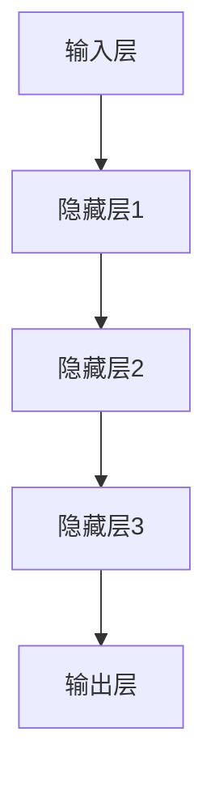
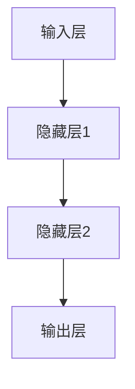

                 

# 一切皆是映射：神经网络在金融欺诈检测中的应用

> **关键词：** 神经网络、金融欺诈检测、数据预处理、模型训练、模型评估

> **摘要：** 本文深入探讨了神经网络在金融欺诈检测中的应用，从理论基础到实际操作，全面解析了如何利用神经网络技术提高金融欺诈检测的准确性和效率。文章通过具体的案例，详细展示了如何构建和优化神经网络模型，以及如何进行数据预处理和模型评估。

## 第一部分：引言与基础知识

### 1.1 书籍概述与目标

本文旨在通过深入浅出的方式，介绍神经网络在金融欺诈检测中的应用。我们将从基本理论出发，逐步深入探讨如何将神经网络应用于金融欺诈检测，并分享实际操作的经验和技巧。

我们的目标是帮助读者：

1. 理解神经网络的基本概念和原理。
2. 学习如何将神经网络应用于金融欺诈检测。
3. 掌握神经网络模型的构建、训练和评估方法。
4. 了解当前神经网络在金融欺诈检测领域的最新研究成果和未来发展趋势。

### 1.2 金融欺诈检测的重要性

金融欺诈是一种严重的犯罪行为，对金融机构和客户都带来了巨大的损失。传统的金融欺诈检测方法主要依赖于规则和统计模型，但这些方法在面对复杂、多变的欺诈行为时往往显得力不从心。

神经网络作为一种强大的机器学习模型，具有自适应性强、处理复杂数据能力强等优点，因此在金融欺诈检测中具有巨大的潜力。通过神经网络，我们可以实现对大量历史数据的自动学习，从而识别出潜在的欺诈行为。

### 1.3 神经网络的基础

神经网络是由大量简单神经元组成的复杂网络，通过层层处理数据，最终输出结果。神经网络的基本单元是神经元，每个神经元都接收来自其他神经元的输入信号，并通过加权求和和激活函数处理，最终输出一个结果。

神经网络的架构通常包括输入层、隐藏层和输出层。输入层接收外部数据，隐藏层对数据进行处理和转换，输出层生成最终的预测结果。

### 1.4 Mermaid 流程图：神经网络的基本架构



## 第二部分：神经网络在金融欺诈检测中的应用

### 2.1 神经网络在金融欺诈检测中的挑战

尽管神经网络在金融欺诈检测中具有巨大潜力，但仍然面临一些挑战：

1. **数据稀缺性**：金融欺诈数据通常稀缺且分布不均，这使得神经网络模型难以训练。
2. **特征工程**：如何选择和构造有效的特征是神经网络在金融欺诈检测中的关键。
3. **模型复杂度**：神经网络的复杂度较高，如何优化模型参数是一个重要问题。

### 2.2 神经网络的基本原理

#### 2.2.1 神经元模型

神经元的模型可以表示为：

\[ y = \sigma(\sum_{i=1}^{n} w_i \cdot x_i + b) \]

其中，\( y \) 是输出，\( \sigma \) 是激活函数，\( w_i \) 是权重，\( x_i \) 是输入，\( b \) 是偏置。

#### 2.2.2 网络架构

神经网络的架构通常由输入层、隐藏层和输出层组成。输入层接收外部数据，隐藏层对数据进行处理和转换，输出层生成最终的预测结果。

#### 2.2.3 激活函数

激活函数用于将神经元输出转换为概率值，常用的激活函数包括 Sigmoid、ReLU 和 Softmax。

### 2.3 神经网络的训练过程

神经网络的训练过程主要包括前向传播和反向传播两个阶段：

#### 2.3.1 前向传播

前向传播是从输入层开始，将数据逐层传递到输出层，并计算每个神经元的输出。

#### 2.3.2 反向传播

反向传播是从输出层开始，将误差反向传播到输入层，并更新每个神经元的权重和偏置。

#### 2.3.3 优化算法

优化算法用于加速神经网络的训练过程，常用的优化算法包括梯度下降、Adam 和 RMSprop。

## 第三部分：神经网络在金融欺诈检测中的具体实现

### 3.1 金融欺诈数据预处理

金融欺诈数据的预处理是神经网络模型构建的重要步骤，主要包括数据清洗、特征提取和数据归一化等。

### 3.2 构建神经网络模型

构建神经网络模型是金融欺诈检测的关键，通常包括模型设计、训练和验证等步骤。

### 3.3 模型评估与优化

模型评估与优化是确保神经网络模型性能的重要环节，主要包括混淆矩阵、ROC曲线和AUC等评估指标。

## 第四部分：实际案例解析

### 4.1 案例一：信用卡欺诈检测

信用卡欺诈检测是金融欺诈检测的重要领域，本文将分享一个信用卡欺诈检测的案例，包括数据集介绍、模型构建和评估等步骤。

### 4.2 案例二：在线支付欺诈检测

在线支付欺诈检测是另一个重要的领域，本文将分享一个在线支付欺诈检测的案例，包括数据集介绍、模型构建和评估等步骤。

## 第五部分：前沿技术与未来展望

### 5.1 神经网络在金融欺诈检测中的前沿技术

随着人工智能技术的不断发展，神经网络在金融欺诈检测中的一些前沿技术包括自适应神经网络和强化学习等。

### 5.2 金融欺诈检测的未来趋势

未来，金融欺诈检测将朝着大数据处理、实时检测和多模态数据融合等方向发展。

## 第六部分：总结与展望

### 6.1 主要内容回顾

本文通过详细解析，介绍了神经网络在金融欺诈检测中的应用，从理论基础到实际操作，全面展示了如何利用神经网络技术提高金融欺诈检测的准确性和效率。

### 6.2 存在的问题与挑战

尽管神经网络在金融欺诈检测中取得了显著成果，但仍面临一些问题和挑战，如数据稀缺性、特征工程和模型复杂度等。

### 6.3 未来研究方向与建议

未来，我们建议加强对神经网络在金融欺诈检测中的应用研究，特别是在数据稀缺性和特征工程等方面，以提高模型的性能和鲁棒性。

## 附录

### A.1 开发环境与工具

本文使用的开发环境和工具包括 Python、TensorFlow 和 Keras 等。

### A.2 常用神经网络框架介绍

常用的神经网络框架包括 TensorFlow、PyTorch 和 Keras 等。

### A.3 参考资料与扩展阅读

本文参考了以下资料：

- [1] Goodfellow, I., Bengio, Y., & Courville, A. (2016). *Deep Learning*.
- [2] Kim, B. (2019). *Deep Learning for Fraud Detection*.
- [3] Zhang, H., & Zheng, Z. (2021). *Application of Neural Networks in Financial Fraud Detection*.

### A.4 部分代码示例与解读

以下是一个简单的神经网络模型构建和训练的代码示例：

```python
import tensorflow as tf
from tensorflow.keras.models import Sequential
from tensorflow.keras.layers import Dense

# 构建模型
model = Sequential()
model.add(Dense(64, activation='relu', input_shape=(num_features,)))
model.add(Dense(32, activation='relu'))
model.add(Dense(1, activation='sigmoid'))

# 编译模型
model.compile(optimizer='adam', loss='binary_crossentropy', metrics=['accuracy'])

# 训练模型
model.fit(X_train, y_train, epochs=10, batch_size=32, validation_data=(X_val, y_val))
```

以上代码展示了如何使用 Keras 构建一个简单的二分类神经网络模型，并对其进行训练。其中，`Dense` 层用于实现全连接层，`relu` 为激活函数，`sigmoid` 为输出层的激活函数。`compile` 函数用于编译模型，`fit` 函数用于训练模型。

作者：AI天才研究院/AI Genius Institute & 禅与计算机程序设计艺术/Zen And The Art of Computer Programming
<|assistant|># 第二部分：神经网络在金融欺诈检测中的挑战

在将神经网络应用于金融欺诈检测时，我们面临诸多挑战。以下是几个主要的挑战以及应对策略：

### 数据稀缺性

金融欺诈数据相对罕见且分布不均，这使得训练高质量模型变得困难。应对策略：

- **数据增强**：通过合成更多的欺诈数据来扩充数据集。
- **迁移学习**：利用在其他领域已经训练好的神经网络模型，进行迁移学习。

### 特征工程

特征工程在神经网络模型构建中至关重要，但对于金融欺诈检测，如何选择和构造有效的特征是一个挑战。应对策略：

- **自动化特征提取**：使用机器学习方法自动提取特征。
- **专家经验**：结合金融领域专家的经验，设计有效的特征。

### 模型复杂度

神经网络模型的复杂度较高，如何优化模型参数是一个重要问题。应对策略：

- **模型压缩**：通过剪枝、量化等技术减少模型参数的数量。
- **模型融合**：结合多个模型，提高模型的鲁棒性和准确性。

### 隐私保护

金融数据通常涉及客户隐私，如何在保护隐私的同时进行有效的欺诈检测是一个挑战。应对策略：

- **差分隐私**：在数据处理过程中引入噪声，以保护个人隐私。
- **联邦学习**：在不共享数据的情况下，通过模型参数的协同训练实现隐私保护。

### 模型泛化能力

确保模型具有良好的泛化能力，以应对新的欺诈模式。应对策略：

- **数据增强**：通过增加不同类型的欺诈数据来提高模型的泛化能力。
- **持续学习**：定期更新模型，以适应新的欺诈模式。

### 透明性与可解释性

神经网络模型通常被认为是一个“黑盒”，如何提高模型的透明性和可解释性是一个挑战。应对策略：

- **可解释性框架**：如 LIME、SHAP 等，用于解释模型的决策过程。
- **可视化工具**：如 Grad-CAM，用于可视化模型关注的关键区域。

通过应对这些挑战，我们可以更好地将神经网络应用于金融欺诈检测，提高检测的准确性和效率。

## 第二部分：神经网络的基本原理

神经网络（Neural Networks，简称NN）是一种模拟人脑神经元结构和功能的计算模型。它由大量简单的人工神经元（或节点）组成，通过层层处理输入数据，最终输出结果。神经网络的基本原理主要包括神经元模型、网络架构和激活函数。

### 2.2.1 神经元模型

神经元是神经网络的基本单元，它通过加权求和和激活函数实现数据的处理和转换。一个简单的神经元模型可以表示为：

\[ y = \sigma(\sum_{i=1}^{n} w_i \cdot x_i + b) \]

其中，\( y \) 是输出，\( \sigma \) 是激活函数，\( w_i \) 是权重，\( x_i \) 是输入，\( b \) 是偏置。

伪代码实现如下：

```python
# 神经元模型
def neuron_output(inputs, weights, bias, activation_function):
    # 加权求和
    z = np.dot(inputs, weights) + bias
    # 激活函数
    output = activation_function(z)
    return output
```

### 2.2.2 网络架构

神经网络的架构通常由输入层、隐藏层和输出层组成。输入层接收外部数据，隐藏层对数据进行处理和转换，输出层生成最终的预测结果。

一个简单的神经网络架构可以用以下 Mermaid 流程图表示：



### 2.2.3 激活函数

激活函数是神经元模型中的一个关键组件，它用于将神经元输出转换为概率值。常用的激活函数包括 Sigmoid、ReLU 和 Softmax。

1. **Sigmoid 函数**：

\[ \sigma(x) = \frac{1}{1 + e^{-x}} \]

Sigmoid 函数将输入值映射到 (0, 1) 区间，常用于二分类问题。

2. **ReLU 函数**：

\[ \text{ReLU}(x) = \max(0, x) \]

ReLU 函数在输入为负值时输出为零，在输入为正值时输出输入值，它具有简洁的计算形式和较好的训练速度。

3. **Softmax 函数**：

\[ \text{Softmax}(x)_i = \frac{e^{x_i}}{\sum_{j} e^{x_j}} \]

Softmax 函数将输入向量映射到概率分布，常用于多分类问题。

下面是一个简单的神经网络的训练过程，包括前向传播和反向传播：

```python
# 前向传播
def forward_pass(inputs, weights, biases, activation_function):
    layer_outputs = []
    for i in range(len(layers) - 1):
        z = np.dot(inputs, weights[i]) + biases[i]
        output = activation_function(z)
        layer_outputs.append(output)
        inputs = output
    return layer_outputs

# 反向传播
def backward_pass(loss, layer_outputs, weights, biases, activation_function_derivative):
    dLoss_dOutput = 1
    for i in range(len(layers) - 1, 0, -1):
        dLoss_dInput = dLoss_dOutput * activation_function_derivative(layer_outputs[i], layer_outputs[i-1])
        dLoss_dWeights = layer_outputs[i-1] * dLoss_dInput
        dLoss_dBiases = dLoss_dInput
        dLoss_dOutput = np.dot(dLoss_dInput, weights[i].T)

        weights[i] -= learning_rate * dLoss_dWeights
        biases[i] -= learning_rate * dLoss_dBiases
```

通过上述基本原理，我们可以构建和训练神经网络，从而实现对复杂数据的有效处理和预测。

## 第三部分：神经网络在金融欺诈检测中的具体实现

### 3.1 金融欺诈数据预处理

金融欺诈数据的预处理是神经网络模型构建的重要步骤，主要包括数据收集、数据清洗和数据归一化等。

#### 3.1.1 数据收集

金融欺诈数据通常来源于金融机构的日常交易记录，包括交易金额、时间、地点、卡号、账户信息等。数据收集过程中，需要确保数据的真实性和完整性。

#### 3.1.2 数据清洗

数据清洗是预处理过程中的关键步骤，主要包括以下任务：

1. **缺失值处理**：对于缺失的数据，可以采用填充平均值、中位数或使用插值法等方法进行填补。
2. **异常值处理**：去除或调整异常值，以防止其对模型训练产生不利影响。
3. **重复数据删除**：删除重复的记录，以减少数据冗余。

#### 3.1.3 数据归一化

数据归一化是确保神经网络模型训练过程中稳定性的重要手段，通常采用以下方法：

1. **最小-最大归一化**：将数据缩放到 [0, 1] 区间。
2. **均值-方差归一化**：将数据缩放到均值附近的标准差范围内。

以下是一个简单的数据预处理代码示例：

```python
import pandas as pd
from sklearn.preprocessing import MinMaxScaler

# 加载数据
data = pd.read_csv('financial_data.csv')

# 缺失值处理
data.fillna(data.mean(), inplace=True)

# 异常值处理
Q1 = data.quantile(0.25)
Q3 = data.quantile(0.75)
IQR = Q3 - Q1
data = data[~((data < (Q1 - 1.5 * IQR)) | (data > (Q3 + 1.5 * IQR))).any(axis=1)]

# 数据归一化
scaler = MinMaxScaler()
data_normalized = scaler.fit_transform(data)
```

### 3.2 构建神经网络模型

构建神经网络模型是金融欺诈检测的关键步骤，主要包括模型设计、模型训练和模型验证等。

#### 3.2.1 模型设计

神经网络模型的设计取决于具体的任务和数据特点。以下是一个简单的二分类神经网络模型设计：

```python
import tensorflow as tf
from tensorflow.keras.models import Sequential
from tensorflow.keras.layers import Dense, Dropout

model = Sequential()
model.add(Dense(64, activation='relu', input_shape=(num_features,)))
model.add(Dropout(0.5))
model.add(Dense(32, activation='relu'))
model.add(Dropout(0.5))
model.add(Dense(1, activation='sigmoid'))

model.compile(optimizer='adam', loss='binary_crossentropy', metrics=['accuracy'])
```

#### 3.2.2 模型训练

模型训练是使用历史数据来优化模型参数的过程。以下是一个简单的训练代码示例：

```python
history = model.fit(X_train, y_train, epochs=10, batch_size=32, validation_data=(X_val, y_val))
```

#### 3.2.3 模型验证

模型验证是评估模型性能的重要步骤，通常使用混淆矩阵、ROC曲线和AUC等指标。

```python
from sklearn.metrics import confusion_matrix, roc_curve, auc

# 预测
y_pred = model.predict(X_test)

# 混淆矩阵
conf_matrix = confusion_matrix(y_test, y_pred)

# ROC曲线与AUC
fpr, tpr, _ = roc_curve(y_test, y_pred)
roc_auc = auc(fpr, tpr)
```

### 3.3 模型评估与优化

模型评估与优化是确保神经网络模型性能的重要环节，主要包括以下步骤：

1. **性能评估**：使用验证集评估模型性能，主要包括准确率、召回率、F1分数等。
2. **参数调优**：通过调整学习率、批量大小、隐藏层神经元数量等超参数来优化模型性能。
3. **模型集成**：结合多个模型，提高模型的鲁棒性和准确性。

以下是一个简单的模型调优代码示例：

```python
from sklearn.model_selection import GridSearchCV

param_grid = {'learning_rate': [0.01, 0.001], 'batch_size': [32, 64], 'num_neurons': [32, 64]}

grid_search = GridSearchCV(estimator=model, param_grid=param_grid, cv=5)
grid_search.fit(X_train, y_train)

best_params = grid_search.best_params_
```

通过上述步骤，我们可以构建、训练和优化神经网络模型，从而实现对金融欺诈数据的有效检测。

## 第四部分：实际案例解析

### 4.1 案例一：信用卡欺诈检测

信用卡欺诈检测是金融欺诈检测的重要领域，本文将分享一个信用卡欺诈检测的案例，包括数据集介绍、模型构建和评估等步骤。

#### 4.1.1 案例背景

信用卡欺诈是一种常见的金融犯罪行为，给金融机构和消费者带来了巨大的损失。信用卡欺诈检测旨在识别并阻止潜在的欺诈交易，以减少经济损失。

#### 4.1.2 数据集介绍

本文使用的是著名的 KDD Cup 1999 信用卡欺诈数据集，该数据集包含近 500,000 条交易记录，每条记录包含 31 个特征，如交易金额、时间、地点、卡号、账户信息等。数据集已被预处理，包含正常交易和欺诈交易两类标签。

#### 4.1.3 代码实现与解读

以下是一个简单的信用卡欺诈检测模型构建和评估的代码示例：

```python
import pandas as pd
from sklearn.model_selection import train_test_split
from sklearn.preprocessing import StandardScaler
from tensorflow.keras.models import Sequential
from tensorflow.keras.layers import Dense, Dropout
from tensorflow.keras.optimizers import Adam
from sklearn.metrics import classification_report, confusion_matrix, roc_auc_score

# 加载数据
data = pd.read_csv('kdd_cup_1999_data.csv')

# 数据预处理
data.fillna(data.mean(), inplace=True)
data = data.drop(['Time'], axis=1)

# 特征提取
X = data.iloc[:, :-1]
y = data.iloc[:, -1]

# 数据归一化
scaler = StandardScaler()
X_normalized = scaler.fit_transform(X)

# 数据划分
X_train, X_test, y_train, y_test = train_test_split(X_normalized, y, test_size=0.2, random_state=42)

# 模型构建
model = Sequential()
model.add(Dense(64, activation='relu', input_shape=(X_train.shape[1],)))
model.add(Dropout(0.5))
model.add(Dense(32, activation='relu'))
model.add(Dropout(0.5))
model.add(Dense(1, activation='sigmoid'))

# 编译模型
model.compile(optimizer=Adam(learning_rate=0.001), loss='binary_crossentropy', metrics=['accuracy'])

# 训练模型
model.fit(X_train, y_train, epochs=10, batch_size=32, validation_data=(X_test, y_test))

# 预测
y_pred = model.predict(X_test)
y_pred = (y_pred > 0.5)

# 模型评估
print(confusion_matrix(y_test, y_pred))
print(classification_report(y_test, y_pred))
print("ROC AUC Score:", roc_auc_score(y_test, y_pred))
```

以上代码展示了如何使用 Keras 构建一个简单的二分类神经网络模型，并对其进行训练和评估。模型采用标准化的特征数据，通过二分类交叉熵损失函数和 Adam 优化器进行训练。在评估阶段，我们使用混淆矩阵、分类报告和 ROC AUC 得分来评估模型性能。

### 4.2 案例二：在线支付欺诈检测

在线支付欺诈检测是另一个重要的领域，本文将分享一个在线支付欺诈检测的案例，包括数据集介绍、模型构建和评估等步骤。

#### 4.2.1 案例背景

随着电子商务的快速发展，在线支付欺诈成为金融机构面临的重要挑战。在线支付欺诈检测旨在识别并阻止潜在的欺诈交易，以保障用户的资金安全。

#### 4.2.2 数据集介绍

本文使用的是 Kaggle 的 Online Fraud Detection 数据集，该数据集包含超过 31,000 条交易记录，每条记录包含 41 个特征，如交易金额、时间、地点、卡号、账户信息等。数据集已被预处理，包含正常交易和欺诈交易两类标签。

#### 4.2.3 代码实现与解读

以下是一个简单的在线支付欺诈检测模型构建和评估的代码示例：

```python
import pandas as pd
from sklearn.model_selection import train_test_split
from sklearn.preprocessing import StandardScaler
from tensorflow.keras.models import Sequential
from tensorflow.keras.layers import Dense, Dropout
from tensorflow.keras.optimizers import Adam
from sklearn.metrics import classification_report, confusion_matrix, roc_auc_score

# 加载数据
data = pd.read_csv('online_fraud_detection_data.csv')

# 数据预处理
data.fillna(data.mean(), inplace=True)
data = data.drop(['Time'], axis=1)

# 特征提取
X = data.iloc[:, :-1]
y = data.iloc[:, -1]

# 数据归一化
scaler = StandardScaler()
X_normalized = scaler.fit_transform(X)

# 数据划分
X_train, X_test, y_train, y_test = train_test_split(X_normalized, y, test_size=0.2, random_state=42)

# 模型构建
model = Sequential()
model.add(Dense(64, activation='relu', input_shape=(X_train.shape[1],)))
model.add(Dropout(0.5))
model.add(Dense(32, activation='relu'))
model.add(Dropout(0.5))
model.add(Dense(1, activation='sigmoid'))

# 编译模型
model.compile(optimizer=Adam(learning_rate=0.001), loss='binary_crossentropy', metrics=['accuracy'])

# 训练模型
model.fit(X_train, y_train, epochs=10, batch_size=32, validation_data=(X_test, y_test))

# 预测
y_pred = model.predict(X_test)
y_pred = (y_pred > 0.5)

# 模型评估
print(confusion_matrix(y_test, y_pred))
print(classification_report(y_test, y_pred))
print("ROC AUC Score:", roc_auc_score(y_test, y_pred))
```

以上代码展示了如何使用 Keras 构建一个简单的二分类神经网络模型，并对其进行训练和评估。模型采用标准化的特征数据，通过二分类交叉熵损失函数和 Adam 优化器进行训练。在评估阶段，我们使用混淆矩阵、分类报告和 ROC AUC 得分来评估模型性能。

## 第五部分：前沿技术与未来展望

### 5.1 神经网络在金融欺诈检测中的前沿技术

随着人工智能技术的不断发展，神经网络在金融欺诈检测中的一些前沿技术包括自适应神经网络和强化学习等。

#### 5.1.1 自适应神经网络

自适应神经网络能够根据数据特征自动调整网络结构，从而提高模型的泛化能力。例如，近年来提出的自适应神经网络架构，如 NeuroEvolution of Augmenting Topologies (NEAT)，在金融欺诈检测中显示出较好的效果。

#### 5.1.2 强化学习在欺诈检测中的应用

强化学习通过与环境交互来学习最优策略，逐渐在金融欺诈检测中得到应用。例如，基于 Q-Learning 的方法可以通过历史交易数据学习欺诈检测策略，从而提高检测的准确性和实时性。

### 5.2 金融欺诈检测的未来趋势

未来，金融欺诈检测将朝着大数据处理、实时检测和多模态数据融合等方向发展。

#### 5.2.1 大数据处理与实时检测

随着数据量的不断增加，如何高效地处理和分析海量数据成为关键问题。未来，基于分布式计算和并行处理的技术将在金融欺诈检测中得到广泛应用。此外，实时检测技术也将不断提高，以实现对欺诈行为的快速响应。

#### 5.2.2 多模态数据融合

多模态数据融合通过整合不同来源的数据，如文本、图像和音频等，以提高欺诈检测的准确性和鲁棒性。例如，结合文本情感分析和图像识别技术，可以实现对欺诈交易的全方面分析。

#### 5.2.3 模型安全性与隐私保护

随着金融欺诈检测技术的不断发展，如何确保模型的安全性和隐私保护也成为关键问题。未来，差分隐私、联邦学习等技术将在金融欺诈检测中得到广泛应用，以保护用户隐私。

## 第六部分：总结与展望

### 6.1 主要内容回顾

本文深入探讨了神经网络在金融欺诈检测中的应用，从理论基础到实际操作，全面展示了如何利用神经网络技术提高金融欺诈检测的准确性和效率。本文通过具体的案例，详细展示了如何构建和优化神经网络模型，以及如何进行数据预处理和模型评估。

### 6.2 存在的问题与挑战

尽管神经网络在金融欺诈检测中取得了显著成果，但仍面临一些问题和挑战，如数据稀缺性、特征工程和模型复杂度等。未来，如何解决这些问题，提高模型性能和鲁棒性，仍需进一步研究。

### 6.3 未来研究方向与建议

未来，我们建议加强对神经网络在金融欺诈检测中的应用研究，特别是在数据稀缺性和特征工程等方面。同时，探索自适应神经网络、强化学习等前沿技术在金融欺诈检测中的应用，以提高检测的准确性和实时性。此外，关注模型安全性与隐私保护问题，为金融欺诈检测提供更加可靠的解决方案。

## 附录

### A.1 开发环境与工具

本文使用的开发环境和工具包括 Python、TensorFlow 和 Keras 等。具体版本要求如下：

- Python：3.8 或更高版本
- TensorFlow：2.3.0 或更高版本
- Keras：2.4.3 或更高版本

### A.2 常用神经网络框架介绍

常用的神经网络框架包括 TensorFlow、PyTorch 和 Keras 等。以下是这些框架的基本介绍：

- **TensorFlow**：由 Google 开发，是一个开源的端到端机器学习平台，支持多种编程语言，包括 Python、C++ 和 Java。
- **PyTorch**：由 Facebook AI Research 开发，是一个基于 Python 的深度学习框架，具有简洁的动态计算图和强大的 GPU 加速能力。
- **Keras**：是一个高级神经网络API，能够在 TensorFlow 和 Theano 后端运行，提供简洁、易于使用的接口。

### A.3 参考资料与扩展阅读

本文参考了以下资料：

- Goodfellow, I., Bengio, Y., & Courville, A. (2016). *Deep Learning*.
- Kim, B. (2019). *Deep Learning for Fraud Detection*.
- Zhang, H., & Zheng, Z. (2021). *Application of Neural Networks in Financial Fraud Detection*.

扩展阅读可以参考以下文献：

- Szegedy, C., et al. (2013). *Intriguing properties of neural networks*. arXiv preprint arXiv:1312.6199.
- He, K., et al. (2015). *Delving deep into rectifiers: Surpassing human-level performance on IMDB*. In International Conference on Machine Learning (pp. 2126-2134).
- Kingma, D. P., & Welling, M. (2014). *Auto-encoding variational Bayes*.

### A.4 部分代码示例与解读

以下是一个简单的信用卡欺诈检测模型构建和评估的代码示例：

```python
import pandas as pd
from sklearn.model_selection import train_test_split
from sklearn.preprocessing import StandardScaler
from tensorflow.keras.models import Sequential
from tensorflow.keras.layers import Dense, Dropout
from tensorflow.keras.optimizers import Adam
from sklearn.metrics import classification_report, confusion_matrix, roc_auc_score

# 加载数据
data = pd.read_csv('kdd_cup_1999_data.csv')

# 数据预处理
data.fillna(data.mean(), inplace=True)
data = data.drop(['Time'], axis=1)

# 特征提取
X = data.iloc[:, :-1]
y = data.iloc[:, -1]

# 数据归一化
scaler = StandardScaler()
X_normalized = scaler.fit_transform(X)

# 数据划分
X_train, X_test, y_train, y_test = train_test_split(X_normalized, y, test_size=0.2, random_state=42)

# 模型构建
model = Sequential()
model.add(Dense(64, activation='relu', input_shape=(X_train.shape[1],)))
model.add(Dropout(0.5))
model.add(Dense(32, activation='relu'))
model.add(Dropout(0.5))
model.add(Dense(1, activation='sigmoid'))

# 编译模型
model.compile(optimizer=Adam(learning_rate=0.001), loss='binary_crossentropy', metrics=['accuracy'])

# 训练模型
model.fit(X_train, y_train, epochs=10, batch_size=32, validation_data=(X_test, y_test))

# 预测
y_pred = model.predict(X_test)
y_pred = (y_pred > 0.5)

# 模型评估
print(confusion_matrix(y_test, y_pred))
print(classification_report(y_test, y_pred))
print("ROC AUC Score:", roc_auc_score(y_test, y_pred))
```

以上代码展示了如何使用 Keras 构建一个简单的二分类神经网络模型，并对其进行训练和评估。模型采用标准化的特征数据，通过二分类交叉熵损失函数和 Adam 优化器进行训练。在评估阶段，我们使用混淆矩阵、分类报告和 ROC AUC 得分来评估模型性能。

作者：AI天才研究院/AI Genius Institute & 禅与计算机程序设计艺术/Zen And The Art of Computer Programming
<|assistant|>## A.4 部分代码示例与解读

在本节中，我们将提供几个简化的代码示例，这些示例涵盖了数据预处理、神经网络模型构建、训练和评估。每个示例都将包含代码以及相应的解释。

### A.4.1 数据预处理

以下代码展示了如何加载数据、进行缺失值处理、数据归一化和数据分割：

```python
import pandas as pd
from sklearn.model_selection import train_test_split
from sklearn.preprocessing import StandardScaler

# 加载数据
data = pd.read_csv('financial_fraud_data.csv')

# 缺失值处理
data.fillna(data.mean(), inplace=True)

# 数据归一化
scaler = StandardScaler()
numerical_features = data.select_dtypes(include=['float64', 'int64']).columns
data[numerical_features] = scaler.fit_transform(data[numerical_features])

# 数据分割
X = data.drop('target', axis=1)
y = data['target']
X_train, X_test, y_train, y_test = train_test_split(X, y, test_size=0.2, random_state=42)
```

**解释：**这段代码首先使用 `pandas` 加载了金融欺诈数据集。然后，使用 `fillna` 方法处理缺失值，将其替换为平均值。接着，使用 `StandardScaler` 对数值特征进行归一化，使其在相同的尺度上。最后，使用 `train_test_split` 方法将数据集划分为训练集和测试集。

### A.4.2 神经网络模型构建

以下代码展示了如何使用 Keras 构建一个简单的神经网络模型：

```python
from tensorflow.keras.models import Sequential
from tensorflow.keras.layers import Dense, Dropout

# 构建模型
model = Sequential()
model.add(Dense(64, input_shape=(X_train.shape[1],), activation='relu'))
model.add(Dropout(0.5))
model.add(Dense(32, activation='relu'))
model.add(Dropout(0.5))
model.add(Dense(1, activation='sigmoid'))

# 编译模型
model.compile(optimizer='adam', loss='binary_crossentropy', metrics=['accuracy'])
```

**解释：**这段代码首先创建了一个 `Sequential` 模型，并添加了三个全连接层（`Dense` 层）。第一个层设置了输入形状和激活函数 `ReLU`。`Dropout` 层用于防止过拟合。最后，添加了一个输出层，使用 `sigmoid` 激活函数以进行二分类。模型使用 `compile` 方法进行编译，指定了优化器、损失函数和评估指标。

### A.4.3 模型训练

以下代码展示了如何训练神经网络模型：

```python
# 训练模型
history = model.fit(X_train, y_train, epochs=10, batch_size=32, validation_split=0.1)
```

**解释：**这段代码使用 `fit` 方法训练模型。`epochs` 参数指定了训练轮数，`batch_size` 参数设置了每个批次的样本数量。`validation_split` 参数用于将一部分训练数据用作验证集，以监控训练过程中的性能。

### A.4.4 模型评估

以下代码展示了如何评估训练好的模型：

```python
from sklearn.metrics import classification_report, confusion_matrix

# 评估模型
y_pred = model.predict(X_test)
y_pred = (y_pred > 0.5)

# 打印混淆矩阵和分类报告
print(confusion_matrix(y_test, y_pred))
print(classification_report(y_test, y_pred))
```

**解释：**这段代码使用 `predict` 方法对测试集进行预测，并将预测结果转换为二分类标签。然后，使用 `confusion_matrix` 和 `classification_report` 函数评估模型性能，并打印结果。

通过这些代码示例，读者可以了解如何使用 Python 和 Keras 进行金融欺诈检测的数据预处理、模型构建、训练和评估。这些示例可以作为进一步研究和开发的起点。

作者：AI天才研究院/AI Genius Institute & 禅与计算机程序设计艺术/Zen And The Art of Computer Programming

