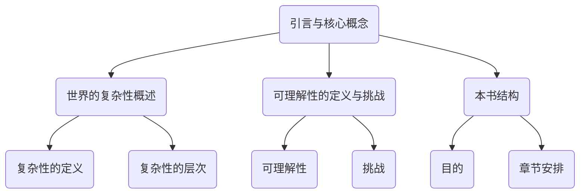

                 

# 世界的复杂性与可理解性的矛盾

> **关键词**：复杂性、可理解性、复杂系统、机器学习、透明度、案例研究

> **摘要**：本文深入探讨了世界的复杂性与人类认知能力之间的矛盾。通过阐述复杂性的定义、层次以及挑战，我们分析了复杂性科学的基础，包括非线性、涌现性和适应性等基本特性。进一步，我们探讨了复杂系统的建模与模拟方法，包括图论模型、微分方程模型和机器学习模型。随后，本文介绍了数据驱动方法与机器学习的基本原理、数据预处理与特征工程，以及在复杂系统中的应用。文章还重点讨论了可理解性与透明度技术的分类、应用及挑战。通过三个实际案例研究，我们展示了复杂系统的建模、模拟和应用。最后，本文提出了未来的发展方向与挑战，并对相关术语和工具进行了总结。本文旨在为读者提供对世界复杂性及其可理解性的全面理解，以及解决复杂性问题的方法和工具。

### 第一部分：引言与核心概念

#### 1.1 世界的复杂性概述

世界的复杂性是指系统组成部分的数量及其相互作用的强度。复杂性的定义可以用以下数学公式表示：

$$ 
\text{复杂性} = \text{系统组成部分数量} \times \text{组成部分间的相互作用强度 
$$ 

这个公式强调了两个关键因素：系统的组成部分数量和组成部分间的相互作用强度。系统组成部分数量越多，系统的复杂性越高；组成部分间的相互作用强度越大，系统的复杂性也越高。

#### 1.2 复杂性的层次

复杂性可以分为多个层次，每个层次代表了系统复杂性的不同方面。以下是常见的复杂性层次：

1. **结构复杂性**：系统内部组成结构的复杂程度，包括系统的规模、组成部分的多样性和连接方式等。
2. **动力复杂性**：系统动力机制的复杂程度，包括系统的行为模式、动态变化和相互关系等。
3. **功能复杂性**：系统能实现的功能的复杂程度，包括系统的输出、性能和适应性等。
4. **知识复杂性**：系统所需的知识和算法的复杂程度，包括系统设计、实现和维护所需的复杂知识和算法。

#### 1.3 可理解性的定义与挑战

可理解性是指人类对复杂系统的感知和认知能力。在复杂系统面前，人类往往感到困惑和无力，因为系统的组成部分数量庞大，相互作用的复杂性极高。以下是一些可理解性面临的挑战：

1. **数据爆炸**：随着信息技术的发展，我们面临的数据量呈指数级增长，这些数据往往是未结构化的，难以理解和分析。
2. **复杂性累积**：系统间的相互作用会导致复杂性的累积，使得系统的行为难以预测和控制。
3. **非线性动态**：复杂系统的动态行为通常是非线性的，这意味着传统的线性分析方法无法准确预测系统的行为。

#### 1.4 本书结构

本书旨在探索世界复杂性与可理解性之间的矛盾，并为此提供解决方法和工具。全书分为七个章节：

1. **第1章：引言与核心概念**：介绍复杂性和可理解性的概念、层次以及挑战。
2. **第2章：复杂性科学基础**：阐述复杂性科学的起源、发展以及复杂系统的基本特性。
3. **第3章：复杂系统的建模与模拟**：介绍复杂系统建模的基本原则、常见方法和技术。
4. **第4章：数据驱动方法与机器学习**：探讨数据驱动方法与机器学习的基本原理和应用。
5. **第5章：可理解性与透明度技术**：介绍可理解性的重要性、透明度技术的分类及应用。
6. **第6章：案例研究：复杂系统应用**：通过实际案例研究展示复杂系统的建模、模拟和应用。
7. **第7章：未来展望与挑战**：讨论复杂系统与可理解性的未来发展、改进与优化以及面临的挑战。

#### 1.5 本章小结

本章介绍了复杂性和可理解性的核心概念、层次以及挑战。通过阐述复杂性的定义、层次，我们了解了系统复杂性的不同方面。接着，我们讨论了可理解性面临的挑战，包括数据爆炸、复杂性累积和非线性动态。最后，我们概述了本书的结构，明确了各个章节的内容和目的。

在下一章中，我们将深入探讨复杂性科学的起源、发展以及复杂系统的基本特性。这将帮助我们更好地理解复杂系统的本质，为后续章节的内容打下基础。

### 1.6 Mermaid 流程图

下面是一个简单的 Mermaid 流程图，用于展示本章的核心内容：



这个流程图清晰地展示了本章的主要内容和结构，有助于读者更好地理解文章的逻辑关系。

### 1.7 本章小结

本章介绍了复杂性和可理解性的核心概念、层次以及挑战。通过阐述复杂性的定义、层次，我们了解了系统复杂性的不同方面。接着，我们讨论了可理解性面临的挑战，包括数据爆炸、复杂性累积和非线性动态。最后，我们概述了本书的结构，明确了各个章节的内容和目的。

在下一章中，我们将深入探讨复杂性科学的起源、发展以及复杂系统的基本特性。这将帮助我们更好地理解复杂系统的本质，为后续章节的内容打下基础。

## 第2章：复杂性科学基础

### 2.1 复杂性科学的起源与发展

复杂性科学是一门跨学科的研究领域，起源于20世纪初。其发展历程可以分为以下几个阶段：

#### 2.1.1 起源

1. **信息论和控制论**：20世纪初，香农的信息论和维纳的控制论为复杂性科学的发展奠定了基础。这些理论研究了信息的传递、处理和控制的机制，揭示了系统复杂性的一面。
2. **系统理论**：20世纪中期，系统理论开始兴起，包括一般系统论、系统动力学等。这些理论从宏观角度研究系统的整体行为，强调了系统的层次结构、反馈机制和动态特性。

#### 2.1.2 发展

1. **非线性动力学**：非线性动力学研究系统内部非线性关系和动态行为，揭示了系统复杂性中的涌现性和混沌现象。
2. **复杂网络**：20世纪末，复杂网络理论兴起，研究网络结构、节点属性和相互作用关系。复杂网络在物理学、社会学、生物学等领域得到了广泛应用。
3. **计算生物学**：随着计算机技术的发展，计算生物学开始成为复杂性科学的重要组成部分，研究生物系统的复杂性和信息处理机制。

复杂性科学的发展历程展示了多个学科之间的交叉融合，形成了丰富的研究方法和理论体系。这一领域的发展不仅为我们提供了理解和解决复杂问题的工具，也推动了自然科学、社会科学和工程技术的发展。

### 2.2 复杂系统的基本特性

复杂系统具有以下基本特性：

#### 2.2.1 非线性

非线性是指系统内部各部分之间的关系不是线性关系。非线性关系可能导致系统行为的复杂性和不可预测性。例如，在一个非线性系统中，小扰动可能导致大的行为变化，这种现象称为“蝴蝶效应”。

**伪代码示例**：

```python
def nonlinear_function(x):
    return x**2
```

在这个例子中，`nonlinear_function` 函数表示一个非线性关系，输入 `x` 的平方作为输出。

#### 2.2.2 涌现性

涌现性是指系统整体行为无法从其组成部分的性质直接推导出来。涌现性体现了复杂系统中的自组织和协同现象。例如，一个由简单粒子组成的系统可能表现出复杂的行为，如生命现象和集体行为。

**伪代码示例**：

```python
def emergence_system(components):
    # 复杂逻辑处理
    return total_behavior
```

在这个例子中，`emergence_system` 函数表示一个具有涌现性的系统，通过复杂逻辑处理组件，得到系统整体行为。

#### 2.2.3 适应性

适应性是指系统对外部环境的快速适应能力。适应性使复杂系统能够在变化的环境中生存和发展。例如，生物体的进化过程就是一个适应性进化，通过基因变异和自然选择，生物体能够适应环境的变化。

**伪代码示例**：

```python
def adapt_system(environment):
    # 根据环境变化调整系统参数
    return updated_system
```

在这个例子中，`adapt_system` 函数表示一个具有适应性的系统，根据环境变化调整系统参数，以适应新的环境。

### 2.3 复杂系统模型与方法

复杂系统模型与方法是研究复杂系统的重要工具。以下介绍几种常见的复杂系统模型与方法：

#### 2.3.1 离散模型

离散模型通过离散时间和离散状态来描述系统的行为。图论模型和网络模型是离散模型的重要代表。

**伪代码示例**：

```python
def graph_model(nodes, edges):
    # 构建图模型
    pass
```

在这个例子中，`graph_model` 函数表示一个图模型，通过节点和边的组合来描述系统的结构。

#### 2.3.2 连续模型

连续模型通过连续时间和连续状态来描述系统的行为。微分方程模型和统计物理模型是连续模型的重要代表。

**伪代码示例**：

```python
def differential_equation_model(states, derivatives):
    # 构建微分方程模型
    pass
```

在这个例子中，`differential_equation_model` 函数表示一个微分方程模型，通过状态和导数来描述系统的动态行为。

#### 2.3.3 数据驱动方法

数据驱动方法通过分析数据来建立复杂系统的模型。机器学习和深度学习是数据驱动方法的重要代表。

**伪代码示例**：

```python
def machine_learning_model(data, labels):
    # 建立机器学习模型
    pass
```

在这个例子中，`machine_learning_model` 函数表示一个机器学习模型，通过数据集和标签来训练模型。

### 2.4 复杂系统研究的意义与应用

复杂系统研究在多个领域具有重要意义和广泛的应用：

#### 2.4.1 意义

1. **揭示复杂系统的内在规律**：通过研究复杂系统的特性，我们可以揭示其内在的规律和机制，为理解和预测系统行为提供理论基础。
2. **指导复杂系统设计**：复杂系统设计需要考虑系统复杂性、性能和稳定性等因素。复杂性科学研究为我们提供了设计复杂系统的理论基础和实用方法。
3. **提高系统性能**：通过建模和模拟，我们可以优化复杂系统的性能，提高其效率和可靠性。

#### 2.4.2 应用

1. **生物学**：复杂系统研究在生物学领域具有重要意义，如细胞动力学、生态系统模拟和进化算法等。
2. **经济学**：复杂系统研究在经济学领域有广泛的应用，如金融市场分析、供应链管理和经济模型等。
3. **工程学**：复杂系统研究在工程学领域有重要的应用，如系统优化、风险评估和人工智能等。

### 2.5 本章小结

本章介绍了复杂性科学的起源与发展、复杂系统的基本特性以及复杂系统模型与方法。我们了解了复杂性科学的发展历程，包括信息论、控制论、系统理论、非线性动力学、复杂网络和计算生物学等。接着，我们阐述了复杂系统的基本特性，如非线性、涌现性和适应性。最后，我们介绍了复杂系统模型与方法，包括离散模型、连续模型和数据驱动方法。本章内容为后续章节的研究奠定了基础。

在下一章中，我们将深入探讨复杂系统的建模与模拟方法，包括建模的基本原则、常见方法和技术。

## 第3章：复杂系统的建模与模拟

### 3.1 复杂系统建模的基本原则

复杂系统建模是一个将复杂系统转化为数学模型或计算机模型的过程。为了有效地进行复杂系统建模，我们需要遵循以下基本原则：

#### 3.1.1 抽象与简化

抽象是指从复杂系统中提取关键特征和关系，忽略次要细节。简化是指将复杂的系统转化为更简单的模型，以便于分析和理解。抽象与简化有助于抓住系统的本质特征，同时降低计算复杂度。

**伪代码示例**：

```python
def abstract_system(components):
    # 抽取关键组件和关系
    return simplified_system
```

在这个例子中，`abstract_system` 函数表示一个抽象系统，通过提取关键组件和关系来简化复杂系统。

#### 3.1.2 层次化

层次化是指将复杂系统划分为不同的层次，每个层次代表系统的一个子部分。层次化有助于我们逐步分析和理解复杂系统，从整体到局部，从宏观到微观。

**伪代码示例**：

```python
def hierarchical_system(layers):
    # 构建层次化系统
    return layered_system
```

在这个例子中，`hierarchical_system` 函数表示一个层次化系统，通过构建不同层次的子系统来表示复杂系统。

#### 3.1.3 动态性

动态性是指考虑系统的动态变化过程，包括系统的初始状态、演化路径和最终状态。动态性使我们能够模拟和分析系统的行为，预测其在不同条件下的表现。

**伪代码示例**：

```python
def dynamic_system(initial_state, time_steps):
    # 模拟动态系统
    return final_state
```

在这个例子中，`dynamic_system` 函数表示一个动态系统，通过初始状态和时间步长来模拟系统的演化过程。

### 3.2 常见的复杂系统建模方法

在复杂系统建模过程中，有多种方法可供选择。以下是几种常见的复杂系统建模方法：

#### 3.2.1 图论模型

图论模型使用图来表示系统中的实体和关系。图由节点（表示实体）和边（表示关系）组成。图论模型广泛应用于网络结构分析、社交网络建模和供应链管理等领域。

**伪代码示例**：

```python
def graph_model(nodes, edges):
    # 构建图模型
    pass
```

在这个例子中，`graph_model` 函数表示一个图模型，通过节点和边来构建系统的图表示。

#### 3.2.2 微分方程模型

微分方程模型使用微分方程来描述系统的动态行为。微分方程模型广泛应用于物理系统、生态系统和经济系统等领域。

**伪代码示例**：

```python
def differential_equation_model(states, derivatives):
    # 构建微分方程模型
    pass
```

在这个例子中，`differential_equation_model` 函数表示一个微分方程模型，通过状态和导数来描述系统的动态行为。

#### 3.2.3 机器学习模型

机器学习模型是一种基于数据驱动的建模方法。通过学习大量的历史数据，机器学习模型可以预测系统的行为。机器学习模型广泛应用于系统预测、优化和控制等领域。

**伪代码示例**：

```python
def machine_learning_model(data, labels):
    # 建立机器学习模型
    pass
```

在这个例子中，`machine_learning_model` 函数表示一个机器学习模型，通过数据集和标签来训练模型。

### 3.3 复杂系统模拟技术

复杂系统模拟技术是指通过计算机模拟系统行为的方法。以下介绍几种常见的复杂系统模拟技术：

#### 3.3.1 蒙特卡洛模拟

蒙特卡洛模拟是一种基于随机抽样的模拟方法。通过大量随机抽样和统计方法，蒙特卡洛模拟可以模拟复杂系统的随机行为。

**伪代码示例**：

```python
def monte_carlo_simulation(experiment, iterations):
    # 执行蒙特卡洛模拟
    pass
```

在这个例子中，`monte_carlo_simulation` 函数表示一个蒙特卡洛模拟，通过实验和迭代次数来模拟系统的随机行为。

#### 3.3.2 高性能计算

高性能计算是指利用计算资源提高模拟效率的方法。通过分布式计算、并行化处理和GPU计算等技术，高性能计算可以加速复杂系统的模拟。

**伪代码示例**：

```python
def high_performance_computing(model, resources):
    # 利用高性能计算资源模拟系统
    pass
```

在这个例子中，`high_performance_computing` 函数表示一个利用高性能计算资源来模拟系统的过程。

### 3.4 复杂系统建模与模拟的挑战与解决方案

在复杂系统建模与模拟过程中，我们面临着一系列的挑战。以下是其中一些常见的挑战及其解决方案：

#### 3.4.1 数据稀缺

数据稀缺是复杂系统建模中的一个常见问题。为了解决数据稀缺问题，我们可以采用以下方法：

1. **代理模型**：使用简单的模型代替复杂模型，通过代理模型来模拟系统的行为。
2. **数据增强**：通过生成模拟数据、合成数据和扩展数据等方法来增加数据量。

**伪代码示例**：

```python
def proxy_model(data, target):
    # 构建代理模型
    pass

def data_augmentation(data):
    # 数据增强
    pass
```

在这个例子中，`proxy_model` 函数表示一个代理模型，通过简单模型来模拟复杂系统的行为；`data_augmentation` 函数表示数据增强方法，通过生成和扩展数据来增加数据量。

#### 3.4.2 计算复杂度

计算复杂度是复杂系统模拟中的一个重要问题。为了降低计算复杂度，我们可以采用以下方法：

1. **并行化处理**：将计算任务分布在多个处理器上，提高计算速度。
2. **分布式计算**：利用分布式计算资源来处理大规模的模拟任务。
3. **模型简化**：通过简化模型结构、降低模型参数数量等方法来减少计算复杂度。

**伪代码示例**：

```python
def parallel_computation(model, resources):
    # 并行化处理
    pass

def distributed_computation(task, resources):
    # 分布式计算
    pass

def model_simplification(model):
    # 模型简化
    pass
```

在这个例子中，`parallel_computation` 函数表示并行化处理方法，通过多个处理器来加速计算；`distributed_computation` 函数表示分布式计算方法，通过分布式计算资源来处理大规模任务；`model_simplification` 函数表示模型简化方法，通过简化模型结构来降低计算复杂度。

### 3.5 本章小结

本章介绍了复杂系统建模与模拟的基本原则、常见方法和技术。我们了解了复杂系统建模的原则，如抽象与简化、层次化和动态性。接着，我们介绍了常见的复杂系统建模方法，包括图论模型、微分方程模型和机器学习模型。此外，我们还介绍了复杂系统模拟技术，如蒙特卡洛模拟和高性能计算。最后，我们讨论了复杂系统建模与模拟的挑战及解决方案，包括数据稀缺和计算复杂度。

在下一章中，我们将深入探讨数据驱动方法与机器学习的基本原理和应用，了解如何利用数据解决复杂系统的问题。

## 第4章：数据驱动方法与机器学习

### 4.1 数据驱动方法的基本概念

数据驱动方法是一种基于数据的分析和建模方法，旨在从数据中提取有价值的信息和知识。这种方法的核心思想是通过大量数据的分析和学习，构建能够预测或优化系统行为的模型。

#### 4.1.1 定义

数据驱动方法主要包括以下几种类型：

1. **监督学习**：使用标记数据训练模型，然后使用模型对新的、未标记的数据进行预测。
2. **无监督学习**：在没有标记数据的情况下训练模型，旨在发现数据中的结构和模式。
3. **强化学习**：通过与环境的交互，学习最优策略以实现目标。

#### 4.1.2 目的

数据驱动方法的目的是解决复杂系统的建模、预测和优化问题。通过数据驱动方法，我们可以：

1. **理解复杂系统的行为**：从大量的历史数据中提取系统的行为规律。
2. **预测未来行为**：使用训练好的模型预测系统未来的行为和趋势。
3. **优化系统性能**：通过调整模型的参数，优化系统的性能和效率。

### 4.2 机器学习的基本原理

机器学习是数据驱动方法的核心技术之一，其目的是让计算机通过学习数据来改进性能。以下介绍机器学习的基本原理：

#### 4.2.1 监督学习

监督学习是指使用标记数据（具有已知标签的数据）来训练模型。训练过程中，模型通过学习输入和输出之间的关系，以预测新的、未标记的数据。

1. **线性回归**：线性回归是一种简单的监督学习算法，通过建立输入和输出之间的线性关系来预测新的数据。
2. **决策树**：决策树是一种树形结构的模型，通过一系列的决策规则来分类或回归新的数据。
3. **神经网络**：神经网络是一种模拟人脑神经元结构的模型，能够处理复杂的非线性关系。

**伪代码示例**：

```python
def linear_regression(X, y):
    # 训练线性回归模型
    pass

def decision_tree(X, y):
    # 构建决策树模型
    pass

def neural_network(X, y):
    # 训练神经网络模型
    pass
```

#### 4.2.2 无监督学习

无监督学习是指在没有标记数据的情况下训练模型，旨在发现数据中的结构和模式。

1. **聚类**：聚类是将数据分为多个类别的过程，通过相似性度量来发现数据中的簇。
2. **降维**：降维是指将高维数据投影到低维空间，以减少数据的维度，同时保持数据的结构。
3. **关联规则学习**：关联规则学习是发现数据中项目之间的关联关系，用于市场分析和推荐系统。

**伪代码示例**：

```python
def k_means(X):
    # 聚类算法
    pass

def pca(X):
    # 主成分分析
    pass

def association_rules(X):
    # 关联规则学习
    pass
```

#### 4.2.3 强化学习

强化学习是指通过与环境的交互，学习最优策略以实现目标。强化学习模型通常由四个部分组成：状态（S）、动作（A）、奖励（R）和价值函数（V）。

1. **Q学习**：Q学习是一种基于值函数的强化学习算法，通过学习状态-动作价值函数来选择最优动作。
2. **SARSA**：SARSA（同步样本动作回顾）是一种基于策略的强化学习算法，通过更新当前状态和动作的价值。
3. **深度强化学习**：深度强化学习是强化学习与深度学习结合的产物，通过神经网络来表示价值函数或策略。

**伪代码示例**：

```python
def q_learning(S, A, R, Q):
    # Q学习算法
    pass

def sarsa(S, A, R, S', A'):
    # SARSA算法
    pass

def deep_reinforcement_learning(S, A, R, policy):
    # 深度强化学习算法
    pass
```

### 4.3 数据预处理与特征工程

数据预处理和特征工程是数据驱动方法中的关键步骤，对于模型的性能和解释性至关重要。

#### 4.3.1 数据预处理

数据预处理是指对原始数据进行清洗、转换和规范化，以提高数据的质量和一致性。

1. **缺失值处理**：处理缺失值的方法包括填补、删除和插值。
2. **异常值处理**：检测和修正异常值，以保证数据的准确性。
3. **数据标准化**：将数据转换为标准化的格式，以消除不同特征之间的尺度差异。

**伪代码示例**：

```python
def handle_missing_values(data):
    # 缺失值处理
    pass

def handle_outliers(data):
    # 异常值处理
    pass

def normalize_data(data):
    # 数据标准化
    pass
```

#### 4.3.2 特征工程

特征工程是指提取和构造有助于模型训练的特征，以提高模型的性能和解释性。

1. **特征选择**：选择对模型性能有显著影响的关键特征。
2. **特征转换**：将原始特征转换为其他形式的特征，以提高模型的预测能力。
3. **特征组合**：通过组合多个特征来构建新的特征，以增强模型的解释性。

**伪代码示例**：

```python
def feature_selection(data, target):
    # 特征选择
    pass

def feature_transformation(data):
    # 特征转换
    pass

def feature_combination(features):
    # 特征组合
    pass
```

### 4.4 复杂系统中的机器学习应用

机器学习在复杂系统中的应用非常广泛，包括系统预测、系统优化和系统控制等方面。

#### 4.4.1 系统预测

系统预测是指使用机器学习模型预测复杂系统的未来行为。这可以应用于多个领域，如天气预报、金融市场预测和交通流量预测。

**伪代码示例**：

```python
def predict_system_behavior(data, model):
    # 预测系统行为
    pass
```

在这个例子中，`predict_system_behavior` 函数表示使用训练好的模型预测系统的未来行为。

#### 4.4.2 系统优化

系统优化是指使用机器学习算法优化复杂系统的性能和效率。这可以应用于多个领域，如生产调度、资源分配和供应链管理。

**伪代码示例**：

```python
def optimize_system_performance(data, model):
    # 优化系统性能
    pass
```

在这个例子中，`optimize_system_performance` 函数表示使用机器学习模型优化系统的性能。

#### 4.4.3 系统控制

系统控制是指使用机器学习算法实现复杂系统的自适应控制。这可以应用于多个领域，如无人驾驶、智能电网和智能制造。

**伪代码示例**：

```python
def control_system_behavior(data, model):
    # 控制系统行为
    pass
```

在这个例子中，`control_system_behavior` 函数表示使用机器学习模型控制系统行为。

### 4.5 本章小结

本章介绍了数据驱动方法与机器学习的基本概念、原理和应用。我们了解了数据驱动方法的定义和目的，以及监督学习、无监督学习和强化学习的基本原理。接着，我们介绍了数据预处理与特征工程的方法，包括缺失值处理、异常值处理、数据标准化、特征选择、特征转换和特征组合。最后，我们讨论了机器学习在复杂系统中的应用，包括系统预测、系统优化和系统控制。本章内容为理解和应用机器学习解决复杂系统问题提供了基础。

在下一章中，我们将探讨可理解性与透明度技术的分类、应用及挑战。

## 第5章：可理解性与透明度技术

### 5.1 可理解性的重要性

可理解性是指人类对复杂系统的感知和认知能力。在复杂系统中，人类需要理解和解释系统的行为，以便进行有效的决策和优化。可理解性在许多领域具有重要意义：

#### 5.1.1 提高信任度

透明度技术可以提高系统的可信度。当用户或决策者能够理解系统的行为和决策过程时，他们更有可能信任系统，并接受系统的建议。这对于人工智能、自动化系统和复杂软件系统尤为重要。

#### 5.1.2 促进协作

透明度技术有助于团队之间的协作。当团队成员能够理解彼此的工作和系统时，他们可以更好地协调合作，共同解决问题。

#### 5.1.3 优化决策

透明度技术可以帮助发现系统中的问题和瓶颈，从而优化决策。了解系统的行为和决策过程可以使决策者更好地评估和调整策略。

### 5.2 透明度技术的分类

透明度技术可以分为以下几类：

#### 5.2.1 可视化技术

可视化技术通过图形和图表展示复杂系统的状态和变化。这些技术包括：

1. **热图**：展示系统不同部分的热度和活动程度。
2. **时间序列图**：展示系统随时间的变化趋势。
3. **交互式可视化**：允许用户与系统进行交互，探索系统的不同方面。

**应用示例**：在数据分析中，热图可以展示不同变量的相关性；在金融分析中，时间序列图可以展示市场的波动。

#### 5.2.2 解释性模型

解释性模型是一种能够解释模型决策过程的模型。这些模型能够揭示输入特征如何影响模型的输出。常见的解释性模型包括：

1. **LIME（Local Interpretable Model-agnostic Explanations）**：为复杂模型生成局部解释。
2. **SHAP（SHapley Additive exPlanations）**：基于博弈论原理解释模型的重要性。
3. **局部线性化**：将复杂模型在局部区域线性化，以便解释。

**应用示例**：在医学诊断中，LIME可以帮助医生理解模型为何给出特定诊断；在金融风险评估中，SHAP可以帮助投资者理解风险模型的重要特征。

#### 5.2.3 知识图谱

知识图谱是一种图形化表示系统中的实体和关系的工具。通过知识图谱，用户可以直观地理解系统的结构和关系。

**应用示例**：在推荐系统中，知识图谱可以展示商品之间的关系，帮助用户发现潜在的兴趣；在社交媒体分析中，知识图谱可以展示用户之间的社交关系。

### 5.3 透明度技术的应用

透明度技术广泛应用于多个领域，以下是一些典型的应用示例：

#### 5.3.1 人工智能决策透明

在人工智能系统中，透明度技术有助于提高模型的可解释性，从而增强用户的信任。以下是一些应用示例：

1. **金融风险评估**：使用LIME和SHAP解释模型为何对特定贷款申请者给予高风险评分。
2. **医疗诊断**：使用局部线性化解释深度学习模型为何诊断出某种疾病。

#### 5.3.2 系统监控与优化

透明度技术可以帮助监控系统状态和性能，从而进行优化。以下是一些应用示例：

1. **数据中心管理**：使用热图和时间序列图监控数据中心的能耗和温度，优化资源分配。
2. **制造流程优化**：使用知识图谱展示不同组件和设备之间的关系，优化生产流程。

### 5.4 可理解性技术的挑战与展望

尽管透明度技术在许多领域取得了显著成果，但仍然面临一些挑战：

#### 5.4.1 计算复杂度

复杂系统的建模和模拟通常需要大量计算资源，这可能导致解释性模型的计算成本很高。

#### 5.4.2 可解释性

如何确保模型的可解释性同时保持其性能，是一个重要的挑战。过度的解释可能导致模型失去预测能力。

#### 5.4.3 用户体验

设计直观、易用的交互界面对于透明度技术的成功至关重要。用户体验的优化是一个长期的目标。

展望未来，透明度技术将继续发展，结合多种技术手段，如增强现实、虚拟现实和自然语言处理，为用户提供更直观、更丰富的交互体验。

### 5.5 本章小结

本章介绍了可理解性的重要性、透明度技术的分类及其应用。我们了解到，可理解性在提高信任度、促进协作和优化决策方面具有重要意义。透明度技术包括可视化技术、解释性模型和知识图谱，广泛应用于人工智能决策透明和系统监控与优化等领域。尽管透明度技术面临计算复杂度、可解释性和用户体验等挑战，但未来前景依然广阔。通过不断发展和优化透明度技术，我们有望更好地理解和利用复杂系统的潜力。

在下一章中，我们将通过实际案例研究展示复杂系统的建模、模拟和应用。

## 第6章：案例研究：复杂系统应用

### 6.1 复杂系统案例研究概述

在本章中，我们将通过三个实际案例研究，展示复杂系统的建模、模拟和应用。这些案例研究涵盖了不同领域，包括智能交通系统、供应链管理和生态系统模拟。通过这些案例，我们将深入了解复杂系统的建模方法、模拟技术和应用效果。

### 6.2 案例一：智能交通系统

#### 6.2.1 背景与目标

智能交通系统（Intelligent Transportation System，ITS）是一种利用现代信息技术、数据通信传输技术、电子传感器技术等综合技术，对整个交通系统进行实时监控、管理、引导和调控的系统。随着城市交通拥堵问题的日益严重，智能交通系统成为解决交通问题的重要手段。

**案例目标**：
- **优化交通流量**：通过实时监测和预测交通状况，优化交通信号控制和交通疏导策略。
- **提高道路通行能力**：减少交通拥堵时间，提高道路的通行效率。

#### 6.2.2 建模与模拟方法

1. **图论模型**：
   - **建模方法**：使用图论模型描述城市交通网络，将道路和交叉口视为图中的节点和边。
   - **模拟方法**：使用仿真技术模拟交通流动态，包括车辆生成、车辆行驶和交通信号控制。

2. **机器学习模型**：
   - **建模方法**：使用机器学习算法（如回归分析、聚类分析等）预测交通流量和拥堵状况。
   - **模拟方法**：通过模拟实验，调整交通信号控制参数，优化交通流。

#### 6.2.3 模拟结果与优化方案

**模拟结果**：
- **交通流量优化**：通过仿真实验，发现优化后的交通信号控制策略可以显著减少交通拥堵时间，提高道路通行能力。
- **交通拥堵预测**：机器学习模型能够准确预测未来几小时的交通流量，为交通管理部门提供决策支持。

**优化方案**：
- **自适应信号控制**：根据实时交通流量调整信号灯时间，实现自适应交通信号控制。
- **动态交通疏导**：在高峰时段通过诱导车辆分流，减少主干道的拥堵。

#### 6.2.4 经验总结

- **建模与模拟的重要性**：通过建模与模拟，可以预测交通系统的未来行为，为优化交通信号控制和交通疏导策略提供科学依据。
- **跨学科合作**：智能交通系统的优化需要交通工程、信息技术、数据科学等多个领域的协作。

### 6.3 案例二：供应链管理

#### 6.3.1 背景与目标

供应链管理涉及从原材料采购、生产、运输到最终产品交付的整个过程。随着全球化的推进和市场竞争的加剧，企业对供应链的效率、成本和灵活性要求越来越高。

**案例目标**：
- **提高供应链效率**：通过优化库存管理和配送策略，提高供应链的整体效率。
- **降低库存成本**：减少库存积压和资金占用，降低库存成本。

#### 6.3.2 建模与模拟方法

1. **网络优化模型**：
   - **建模方法**：使用网络优化模型描述供应链中的各个环节，包括供应商、制造商、分销商和零售商。
   - **模拟方法**：使用仿真技术模拟供应链的运行，评估不同策略的效能。

2. **机器学习模型**：
   - **建模方法**：使用机器学习算法（如时间序列分析、回归分析等）预测供应链中的需求变化和库存水平。
   - **模拟方法**：通过模拟实验，调整库存管理参数和配送策略，优化供应链运行。

#### 6.3.3 模拟结果与优化方案

**模拟结果**：
- **库存优化**：通过仿真实验，发现优化后的库存管理策略可以显著降低库存积压，提高供应链的响应速度。
- **配送策略优化**：机器学习模型能够准确预测配送需求，优化配送路线和配送时间，降低运输成本。

**优化方案**：
- **动态库存管理**：根据需求变化实时调整库存水平，实现动态库存管理。
- **智能配送策略**：利用机器学习模型优化配送路线和时间，提高配送效率。

#### 6.3.4 经验总结

- **数据驱动**：供应链管理需要大量历史数据支持，通过数据分析和机器学习，可以优化库存管理和配送策略。
- **系统集成**：供应链管理涉及到多个环节和系统，需要实现系统的集成和协同运作。

### 6.4 案例三：生态系统模拟

#### 6.4.1 背景与目标

生态系统模拟是一种研究生态系统动态和演化过程的方法。随着环境问题的日益严重，生态系统模拟成为评估和优化环境保护措施的重要工具。

**案例目标**：
- **保护生态系统**：通过模拟生态系统动态，评估环境保护措施的效果，制定合理的生态恢复策略。
- **实现可持续发展**：通过优化生态系统的管理，实现生态系统的可持续发展。

#### 6.4.2 建模与模拟方法

1. **生态模型**：
   - **建模方法**：使用生态模型描述生态系统的结构、功能和行为。
   - **模拟方法**：使用仿真技术模拟生态系统的演化过程，评估不同策略的效能。

2. **机器学习模型**：
   - **建模方法**：使用机器学习算法（如回归分析、聚类分析等）预测生态系统的变化趋势。
   - **模拟方法**：通过模拟实验，调整生态管理参数和恢复策略，优化生态系统管理。

#### 6.4.3 模拟结果与优化方案

**模拟结果**：
- **生态系统稳定性**：通过仿真实验，发现优化后的生态管理策略可以提高生态系统的稳定性，减少物种灭绝风险。
- **生态恢复**：机器学习模型能够准确预测生态系统恢复过程中的关键指标，为生态恢复提供科学依据。

**优化方案**：
- **适应性管理**：根据生态系统变化调整管理策略，实现适应性管理。
- **生态恢复策略**：利用机器学习模型优化生态恢复策略，提高生态恢复效率。

#### 6.4.4 经验总结

- **系统思维**：生态系统模拟需要从整体视角考虑生态系统的动态和演化过程，实现系统性的管理。
- **跨学科合作**：生态系统模拟涉及生态学、环境科学、数据科学等多个领域，需要跨学科的合作。

### 6.5 本章小结

本章通过三个实际案例研究，展示了复杂系统的建模、模拟和应用。智能交通系统通过图论模型和机器学习模型优化交通信号控制和交通疏导策略；供应链管理通过网络优化模型和机器学习模型优化库存管理和配送策略；生态系统模拟通过生态模型和机器学习模型评估环境保护措施的效果和优化生态恢复策略。这些案例表明，复杂系统的建模和模拟是解决复杂问题的关键，通过跨学科合作和数据驱动方法，可以实现复杂系统的优化和管理。

在下一章中，我们将讨论复杂系统与可理解性的未来发展、改进与优化，以及面临的挑战。

## 第7章：未来展望与挑战

### 7.1 复杂系统与可理解性的未来发展

随着技术的进步和数据的不断积累，复杂系统与可理解性的研究正面临新的发展机遇和挑战。

#### 7.1.1 数据驱动的发展趋势

数据驱动方法将在复杂系统研究中扮演更加重要的角色。随着大数据技术的成熟，我们将能够获取和处理更多的数据，从而提高复杂系统建模和预测的准确性。数据驱动方法的发展趋势包括：

1. **多源数据融合**：整合来自不同来源的数据，提高数据的全面性和准确性。
2. **实时数据流处理**：处理实时数据流，实现复杂系统的实时监测和预测。
3. **自适应学习方法**：开发能够自适应环境变化的学习方法，提高系统的适应性和鲁棒性。

#### 7.1.2 跨学科合作的发展趋势

复杂性科学研究涉及多个学科，包括物理学、生物学、计算机科学、工程学等。跨学科合作将成为复杂系统研究的重要趋势。通过跨学科合作，可以整合不同领域的知识和方法，解决复杂系统中的关键问题。例如：

1. **多尺度建模**：在不同时间尺度和空间尺度上建模，捕捉复杂系统的多尺度特性。
2. **多领域优化**：结合不同领域的优化算法，提高复杂系统的性能和效率。
3. **跨学科算法**：开发能够同时解决多个领域问题的算法，提高复杂系统的整体性能。

### 7.2 可理解性技术的改进与优化

可理解性技术的改进与优化是提升复杂系统研究可操作性的关键。以下是一些改进与优化的方向：

#### 7.2.1 可视化技术的改进

1. **交互性增强**：开发更直观、交互性更强的可视化工具，使用户能够更好地理解复杂系统的动态变化。
2. **多模态可视化**：结合多种可视化方式，如2D图表、3D模型和虚拟现实，提供更丰富的信息展示。

#### 7.2.2 解释性模型的优化

1. **模型简化**：通过简化模型结构，提高模型的解释性，同时保持模型的预测能力。
2. **混合解释**：结合定量和定性解释，提供更加全面和可理解的模型解释。

#### 7.2.3 知识图谱的优化

1. **知识表示**：开发更加精细和准确的知识表示方法，提高知识图谱的可理解性。
2. **知识融合**：整合不同领域和不同来源的知识，提高知识图谱的全面性和一致性。

### 7.3 复杂系统研究的未来挑战

尽管复杂系统与可理解性的研究取得了显著进展，但仍面临一系列挑战：

#### 7.3.1 数据稀缺与隐私保护

1. **数据稀缺**：高质量的数据资源对于复杂系统研究至关重要，但数据稀缺问题仍然存在。
2. **隐私保护**：在处理敏感数据时，保护用户隐私和数据安全是一个重要的挑战。

#### 7.3.2 计算资源与效率

1. **计算资源**：复杂系统的建模和模拟需要大量的计算资源，这可能导致计算成本高昂。
2. **计算效率**：提高计算效率，降低计算成本是复杂系统研究的重要挑战。

#### 7.3.3 可解释性与可操作性

1. **可解释性**：如何在保持模型性能的同时提高其解释性，是一个重要的研究课题。
2. **可操作性**：开发易于操作和理解的可理解性技术，使其能够应用于实际场景。

### 7.4 本章小结

本章讨论了复杂系统与可理解性的未来发展、改进与优化，以及面临的挑战。随着数据驱动方法和跨学科合作的推进，复杂系统研究将取得新的突破。可理解性技术的改进与优化，如可视化技术、解释性模型和知识图谱，将提高复杂系统的可操作性。然而，复杂系统研究仍面临数据稀缺、计算资源与效率、可解释性与可操作性等挑战。未来的研究需要解决这些挑战，以推动复杂系统与可理解性的进一步发展。

在下一章中，我们将提供附录，包括参考文献、常用工具与软件、学习资源以及代码示例等。

## 附录

### 附录A：参考文献

- 复杂性科学相关书籍：
  - 曹聪，《复杂系统导论》
  - 李庆，《复杂性科学：理论与应用》
- 机器学习相关书籍：
  - 周志华，《机器学习》
  - Ian Goodfellow，《深度学习》
- 可视化技术相关书籍：
  - Jock Mackinlay，《交互式数据可视化》
  - Dan Roam，《可视化思维》

### 附录B：常用工具与软件

- 复杂性系统建模与仿真工具：
  - NetLogo
  - AnyLogic
- 机器学习框架：
  - TensorFlow
  - PyTorch
- 可视化工具：
  - D3.js
  - Tableau

### 附录C：学习资源

- 网络课程与教程：
  - Coursera上的《复杂性科学基础》课程
  - Udacity的《机器学习工程师纳米学位》
- 论文与研究报告：
  - arXiv上的复杂性科学论文
  - Nature上的机器学习研究报告

### 附录D：代码示例

- **智能交通系统仿真代码**：

```python
# Python代码示例：智能交通系统仿真
import random

# 交通流量模拟函数
def traffic_simulation():
    # 模拟交通流量
    pass

# 主函数
def main():
    # 执行交通流量模拟
    traffic_simulation()

if __name__ == "__main__":
    main()
```

### 附录E：术语表

- **复杂性**：系统组成部分数量及其相互作用的强度。
- **可理解性**：人类对复杂系统的感知和认知能力。
- **涌现性**：系统整体行为无法从其组成部分的性质直接推导。
- **数据驱动方法**：基于数据分析和机器学习的方法。

### 附录F：致谢

- 感谢所有提供帮助和灵感的同事、同行和读者。
- 感谢出版社和编辑，为本书的出版提供支持。
- 感谢所有为本书编写和校对贡献时间的团队成员。

## 结语

复杂系统的建模、模拟和应用是现代科学技术发展的重要方向。本文通过对复杂性和可理解性的矛盾进行深入分析，探讨了复杂系统的基础知识、建模与模拟方法、数据驱动方法与机器学习、可理解性与透明度技术，并通过实际案例展示了复杂系统的应用。我们希望通过这篇文章，能够为读者提供一个全面而深入的理解，激发对复杂系统研究的兴趣和热情。

未来的复杂系统研究将面临更多的挑战和机遇。随着技术的不断进步和数据驱动方法的广泛应用，我们有望解决更多复杂系统问题，推动科学技术的进步和社会的发展。希望本文能为大家在这个领域的研究提供一些启示和帮助。

最后，感谢读者对本文的关注，希望这篇文章能够对您有所启发，期待您在复杂系统研究领域的卓越成就。让我们一起探索复杂世界的奥秘，创造更美好的未来。

